# FANUC Series Oi-MODEL F

维修说明书

B-64605CM/01

- 本说明书的任何内容不得以任何方式复制。  
- 本说明书中所载的商品的外观及规格如需改良而变更，恕不另行通知。

本说明书中所载的产品，受到日本国《外汇和外国贸易法》的限制。从日本将这些出口到其他国家时，必须获得日本国政府的出口许可。

另外，将该产品再出口到其他国家时，应获得再出口该产品的国家的政府许可。此外，该产品可能还受到美国政府的再出口法的限制。

若要出口或者再出口此类产品，请向 FANUC 公司洽询。

本说明书中记载的商品是在严格的质量管理下制造的，在因本商品的故障而预测会导致重大事故或者损失时，请对安全进行充分考虑。

我们试图在本说明书中描述尽可能多的情况。

然而，要在本说明书中注明所有禁止或不能做的事宜，需要占用说明书的大量篇幅，所以本说明书中没有一一列举。因此，对于那些在说明书中没有特别指明可以做的事，都应解释为“不可”。

本说明书中记载了我公司以外的程序名称和装置名称，这些都包括在各制造商的注册商标中。

但在某些情况下，正文中没有用®和TM标记注明。

废弃控制单元、放大器、电机以及周边各单元时，请按照机械所设置的国家和自治团体的法律及管制予以废弃。

## 为了安全维修

为了更加安全地维修 CNC 装置附带的机床(以下简称“机床”)，本说明书描述了与 CNC 装置相关的安装注意事项。

CNC 装置的维修作业伴有各种危险，所以这类作业应由充分接受过有关维修和安全方面培训的人员负责进行。

用户所使用的某些 CNC 装置虽然没有相对应的功能，但已经标上了该项注意事项，用户在阅读时可以忽略。

有关机床的安全注意事项，请参阅机床制造商提供的说明书。

此外，在维修作业中进行机床的运转确认时，应在充分理解机床制造商和我公司提供的说明书的基础上进行运转。

## 目录

警告、注意和注释....s-1

与维修作业有关的警告和注意....s-1

与更换作业有关的警告和注意....s-2

与参数有关的警告和注意....s-2

与日常维修有关的警告和注意....s-3

## 警告、注意和注释

本说明书包括保证操作人员人身安全以及防止机床损坏的有关安全的注意事项，并根据它们在安全方面的重要程度，在正文中以“警告”和“注意”来叙述。

有关的补充说明以“注释”来叙述。

在使用之前，必须熟读这些“警告”、“注意”和“注释”中所叙述的事项。


## 警告

适用于：如果错误操作，则有可能导致操作者死亡或受重伤。


## 注意

适用于：如果错误操作，则有可能导致操作者受轻伤或者损坏设备。

## 注释

指出除警告和注意以外的补充说明。

※ 请仔细阅读本说明书，并加以妥善保管。

## 与维修作业有关的警告和注意


## 警告

1 在拆下机床盖板的状态下确认机床的运转情况时

(1) 衣服可能会被卷入主轴等中，导致操作者受伤。请在衣服不会被卷入主轴中的离开机床足够远的位置确认机床的运转情况。  
(2) 请在不进行实际加工的空运行状态下运转。因迫不得已而进行实际加工时，会由于机床的错误操作而引起工件夹具脱落，刀具的刀尖破损并飞散的情况，从而引起操作者受伤，故应在安全的位置进行确认作业。

2 打开强电盘的门进行确认作业时

(1) 强电盘上具有高压部分（标有△标记的部分）。触摸高电压部分有可能导致触电。

请在确认高电压部分已经盖上盖板之后再进行作业。

另外，在进行高电压部分的确认时，直接触摸端子将会导致触电。

(2) 强电盘内有各类单元的角等突起物。

突起物可能会导致作业人员受伤，作业时要引起注意。

3 在实际加工工件时，不能一上来就运转机床，要充分确认机床的动作状态；确认项目包括：使用单程序段、进给速度倍率、机床锁住等功能或没有安装刀具和工件时的空载运转。如果不能肯定机床运转正常，会因为机床预想不到的运转而损坏工件或者机床，或导致操作者受伤。  
4 机床运转之前应认真检查是否已经正确输入想要输入的数据。使用不正确的数据运转机床，会因为机床预想不到的运转而损坏工件和机床，或导致操作者受伤。


## 警告

5 要确保进给速度与打算进行的操作相适应。一般地讲，每台机床其最大进给速度受到限制。根据运转内容的不同，最佳速度也不同，请依照机床说明书执行。  
如果机床运转的速度不正确，会给机床带来预想不到的负荷，从而损坏工件和机床，或导致操作者受伤。  
6 当使用刀具补偿功能时，请充分确认补偿方向和补偿值。使用不正确的数据运转机床，会因为机床预想不到的运转而损坏工件和机床，或导致操作者受伤。

## 与更换作业有关的警告和注意


## 警告

1 务必在断开外部供给电源的状态下进行。若不断开电源，恐会导致触电、破损、破裂等。  
在仅仅断开控制单元电源的情况下，伺服装置等电源有可能尚处在激活状态，在更换单元时，可能会导致单元的损坏或触电。  
2 为了预防静电引起的破损，触摸到印刷电路板或单元的情形以及连接电缆时，应采取适当措施，如戴上腕带。人体发出的静电，有时会损坏电路。  
3 伺服放大器和主轴放大器上，即使在断开电源稍过一会之后仍然有残余电压，触摸这类设备会导致触电。请在断开电源经过20分后再更换放大器。  
4 更换单元时，应使更换前的单元与更换后的单元的设定和参数保持一致。（详情请参阅该装置的说明书。）如果不是在相同状态下进行运转，则会因为机床预想不到的动作而损坏工件和机床，或导致操作者受伤。  
5 通电中发生异常响声、异味、冒烟、起火、异常发热等从外观来看明显是硬件故障的现象时，应迅速断开电源。否则恐会导致火灾、破损、破裂、误动作等。  
6 控制单元、伺服放大器、主轴电机等的散热片，即使在断开电源后也将处于高温，触摸该部位恐会导致烫伤。请在确认冷却后进行操作。  
7 更换重物时，必须有 2 名以上的作业人员配合进行。  
如果仅由 1 名作业人员进行，有时会由于更换单元的落下而导致作业人员受伤。  
8 要注意避免损坏电缆。否则会导致触电等。  
9 要穿着考虑安全的服装进行作业。否则恐会导致受伤、触电等。  
10 请勿湿者手进行作业。否则恐会导致触电或损坏电路。

## 与参数有关的警告和注意


## 警告

1 在改变参数后第一次实际加工工件时，应在盖上机床盖板的状态下运转机床。不要一上来就自动运转机床，要充分确认机床的动作状态；确认项目包括：使用单程序段、进给速度倍率、机床锁住等功能或没有安装刀具和工件时的空载运转。如果不能肯定机床运转正常，会因为机床预想不到的运转而损坏工件或者机床，或导致操作者受伤。

2 制造商已经设置了 CNC 和 PMC 参数的最佳值，一般情况下用户不必改变这些值。

在迫不得已必须改变参数时，在改变前，必须彻底弄清该参数的功能。

如果参数设置不正确，则会因为机床预想不到的运转而损坏工件和机床，或导致操作者受伤。

## 与日常维修有关的警告和注意


## 警告

控制单元、显示单元、MDI 单元以及机械操作盘上请勿直接洒上切屑或切削液而使用。此外，即使没有直接洒上切削液而使用，包含活性度高的硫磺或者氯的切削液、被叫做合成型的无油切削液、或者碱度高的水溶性切削液，给控制单元以及周围单元的影响特别大，有可能发生如下故障，要予以注意。

\- 关于包含活性度高的硫磺或者氯的切削液

含有硫磺或者氯的切削液中，有的活性度非常高。此类切削液附着 CNC 以及周围单元，将会引起与树脂等材料的化学反应，恐会导致腐蚀或劣化。此外，侵入到 CNC 以及周围单元的内部时，恐会导致作为部件材料使用的铜和银等金属腐蚀，或部件不良。

\- 关于渗透性高的合成型切削液

将 PAG（聚二醇）等用于润滑成分的合成型切削液中，有的渗透性非常高。此类切削液，即使装在密封性好的装置内，也较容易从密封件等中渗透到内部，进入到 CNC 以及周围单元的内部是，恐会导致绝缘劣化或部件不良。

\- 关于碱度高的水溶性切削液

通过脂肪族醇胺等来提高 pH 值的切削液中，有的切削液在标准稀释时具有 pH10 以上的强碱性。此类切削液溅到 CNC 以及周围单元表面，将会引起与树脂等材料的化学反应，恐会导致腐蚀或劣化。


## 警告

电池的更换

本项作业只有那些已经接受过维修培训和安全培训的人员才能胜任。

在打开机柜更换电池时，小心不要接触高压电路部分（标有 △ 标记并配有绝缘盖）。

如取下绝缘盖，接触高电压回路部分，就会导致触电。


## 警告

保险丝的更换

在进行保险丝的更换作业之前，要排除保险丝烧断的原因后再进行。

因此，只有那些已经接受过维修培训和安全培训的人员才能胜任此项工作。

在打开机柜更换保险丝时，小心不要接触高压电路部分（标有 △ 标记并配有绝缘盖）。

如取下绝缘盖，接触高电压回路部分，就会导致触电。


## 注意

请小心处理电池。请勿使其落下或者给予强烈冲击。

## 注释

由于控制单元即使在无电源供应的情况下也必须保存诸如程序、偏置量、参数等数据，故使用电池。对于程序、偏置量、参数等数据，要定期做好备份工作。

当电池的电压下降时，机床操作面板上或画面上会显示电池电压下降报警。

显示电池电压下降的报警时，应在一周内更换电池。若不更换电池，存储器中的数据将会丢失。但是，绝对脉冲编码器用电池的更换期限，随检测器的种类等机械配置而定。详情可向机械制造商洽询。

电池的更换步骤，请参阅第3章以及第4章。此外，更换后的电池，应按照各自治团体决定的方法予以回收或废弃。

## 前言

本说明书由下列章节构成。

## 说明书的描述内容

## 1. 画面的显示和操作

本说明书以画面中所显示的各项内容中维修所需的项目为中心进行说明。

## 2. 控制单元的硬件

本章就控制单元的硬件配置、各种印刷电路板及其安装位置、LED 显示以及设置进行记述。

## 3. 更换控制单元的维修部件

本章就控制单元的维修部件的更换进行描述。

## 4. 其他单元的维护

本章就与其他单元的维护相关的基本内容进行描述。

## 5. 输入/输出数据

本章就程序、参数、刀具补偿值等的输入/输出、对话型数据的输入/输出步骤进行描述。

## 6. CNC 和 PMC 之间的接口

本章描述 PMC 的规格和 PMC 的系统配置、信号的列表。

## 7. 嵌入式以太网功能

本章就嵌入式以太网进行描述。

## 8. 数字伺服

本章就伺服调整画面和返回参考点位置的调整方法进行描述。

## 9. AC 主轴

本章就主轴调整画面进行描述。

## 10. 故障排除步骤

本章就发生报警时的应对方法进行描述。

## 11. 电机、检测器和放大器的维修检查

本章就与电机、检测器、放大器的维修检查相关的基本内容进行描述。

## 附录

A. 报警列表  
B. 单元、印刷电路板以及消耗品一览  
C. 引导系统  
D. 存储卡插槽  
E. LED 显示  
F. 电脑功能的维护操作（引导、IPL）  
G. IPL 监控器  
H. 存储器清除  
I. USB 功能的维护

本说明书没有描述参数列表。

有关参数列表，请参阅 PARAMETER MANUAL (参数说明书)。

## 可以使用的机型名称

本说明书就下列机型进行描述。

另外，正文中还使用下列简称。


### PMC报警: FANUC Series 0i– TF
- **故障内容**: 0i–F
- **处理办法**: 0i–TF


注释

本说明书中描述的功能，根据不同的机型，有的不可使用。详情请参阅 DESCRIPTIONS（规格说明书）(B-64602EN)。

## Series 0i - MODEL F 的相关说明书

Series 0i - MODEL F 的相关说明书如下所示。

\*表示本说明书。


### PMC报警: 说明书名称
- **故障内容**: 规格编号
- **处理办法**: 

### PMC报警: DESCRIPTIONS(规格说明书)
- **故障内容**: B-64602EN
- **处理办法**: 

### PMC报警: CONNECTION MANUAL (HARDWARE)(连接说明书(硬件篇))
- **故障内容**: B-64603EN
- **处理办法**: 

### PMC报警: CONNECTION MANUAL (FUNCTION)(连接说明书(功能篇))
- **故障内容**: B-64603EN-1
- **处理办法**: 

### PMC报警: 操作说明书(车床系统/加工中心系统通用)
- **故障内容**: B-64604CM
- **处理办法**: 

### PMC报警: 操作说明书(车床系统)
- **故障内容**: B-64604CM-1
- **处理办法**: 

### PMC报警: 操作说明书(加工中心系统)
- **故障内容**: B-64604CM-2
- **处理办法**: 

### PMC报警: 维修说明书
- **故障内容**: B-64605CM
- **处理办法**: *

### PMC报警: PARAMETER MANUAL(参数说明书)
- **故障内容**: B-64610EN
- **处理办法**: 

### PMC报警: Series 0i-PF CONNECTION MANUAL (HARDWARE)(连接说明书(硬件篇))
- **故障内容**: B-64623EN
- **处理办法**: 

### PMC报警: Series 0i-PF OPERATOR'S MANUAL(操作说明书)
- **故障内容**: B-64624EN
- **处理办法**: 

### PMC报警: Series 0i-PF PARAMETER MANUAL(参数说明书)
- **故障内容**: B-64630EN
- **处理办法**: 

### PMC报警: Macro Executor PROGRAMMING MANUAL(宏程序执行器编程说明书)
- **故障内容**: B-63943EN-2
- **处理办法**: 

### PMC报警: Macro Compiler PROGRAMMING MANUAL(宏程序编译器编程说明书)
- **故障内容**: B-66263EN
- **处理办法**: 

### PMC报警: C Language Executor PROGRAMMING MANUAL(C语言执行器编程说明书)
- **故障内容**: B-63943EN-3
- **处理办法**: 

### PMC报警: PMC PROGRAMMING MANUAL(PMC 编程说明书)
- **故障内容**: B-64513EN
- **处理办法**: 

### PMC报警: PROFIBUS-DP Board CONNECTION MANUAL(PROFIBUS-DP 板连接说明书)
- **故障内容**: B-63993EN
- **处理办法**: 

### PMC报警: Industrial Ethernet CONNECTION MANUAL(工业用以太网连接说明书)
- **故障内容**: B-64013EN
- **处理办法**: 

### PMC报警: Fast Ethernet / Fast Data Server 操作说明书
- **故障内容**: B-64014CM
- **处理办法**: 

### PMC报警: DeviceNet Board CONNECTION MANUAL(DeviceNet 板连接说明书)
- **故障内容**: B-64043EN
- **处理办法**: 

### PMC报警: FL-net Board CONNECTION MANUAL(FL-net 板连接说明书)
- **故障内容**: B-64163EN
- **处理办法**: 

### PMC报警: CC-Link Board CONNECTION MANUAL(CC-Link 板连接说明书)
- **故障内容**: B-64463EN
- **处理办法**: 

### PMC报警: MANUAL GUIDE i(车床系统/加工中心系统通用)操作说明书
- **故障内容**: B-63874CM
- **处理办法**: 

### PMC报警: MANUAL GUIDE i(加工中心系统)操作说明书
- **故障内容**: B-63874CM-2
- **处理办法**: 

### PMC报警: MANUAL GUIDE i作业准备支援功能 操作说明书
- **故障内容**: B-63874CM-1
- **处理办法**: 

### PMC报警: MANUAL GUIDE 0i操作说明书
- **故障内容**: B-64434CM
- **处理办法**: 

### PMC报警: TURN MATE i操作说明书
- **故障内容**: B-64254CM
- **处理办法**: 

### PMC报警: Dual Check Safety CONNECTION MANUAL(连接说明书)
- **故障内容**: B-64483EN-2
- **处理办法**: 


## 伺服电机的相关说明书

伺服电机的相关说明书如下所示。


## FANUC PANEL i 的相关说明书

FANUC PANEL i 的相关说明书如下所示。


## FANUC I/O Unit 的相关说明书

FANUC I/O Unit 的相关说明书如下所示。


## 教育

\- 发那科公司为了对从事连接、维修和操作的人员进行教育，设有发那科学校。为了有效使用发那科的装置，建议接受课程的听讲。

有关教育的内容详细等，请参照如下主页。

http://www.fanuc.co.jp/

## 目录

## 为了安全维修 …… s-1

警告、注意和注释....s-1

与维修作业有关的警告和注意......s-1

与更换作业有关的警告和注意...... s-2

与参数有关的警告和注意......s-2

与日常维修有关的警告和注意......s-3

## 1 画面的显示和操作....1

## 1.1 功能键和软键....1

1.1.1 软键的配置....1

1.1.2 通常的画面显示步骤....1

1.1.3 功能键....2

1.1.4 软键....3

## 1.2 系统配置画面....11

1.2.1 显示方法....11

1.2.2 硬件配置画面 12

1.2.3 软件配置画面....13

1.2.4 输出系统配置数据 15

## 1.3 诊断功能....16

1.3.1 诊断画面的显示方法 ..... 16

1.3.2 显示内容....16

## 1.4 CNC 状态显示 46

## 1.5 操作监控显示....48

1.5.1 显示方法....48

1.5.2 参数....49

## 1.6 波形诊断显示....49

1.6.1 波形诊断图形画面 ....50

1.6.2 波形诊断参数画面 51

1.6.3 跟踪数据....58

1.6.4 输出数据....60

## 1.7 颜色设定画面....65

1.7.1 画面显示....65

1.7.2 颜色设定的操作....65

1.7.3 参数....66

1.7.4 注意事项....68

## 1.8 Power Mate CNC 管理器功能....68

1.8.1 画面显示....68

1.8.2 参数输入/输出 72

1.8.3 参数....73

1.8.4 注意事项....75

## 1.9 SERVO GUIDE MATE 76

1.9.1 波形显示....76

1.9.1.1 Y-Time 图形.....77

1.9.1.2 XY图形 93

1.9.1.3 圆形(Circle)图形 102

1.9.1.4 傅立叶(Fourier)图形 111

1.9.1.5 博德(Bode)图形....116

1.9.1.6 参数....126

## 1.10 维护信息画面....127

1.10.1 维护信息画面的显示方法 ..... 127

1.10.2 维护信息画面的操作 ..... 128

1.10.3 维护信息画面上的半角假名输入.....129

1.10.4 维护信息画面上发生的告警....129

1.10.5 参数....130

1.10.6 履历功能概要....130

1.10.6.1 异常履历....131  
1.10.6.2 外部操作信息履历....134  
1.10.6.3 操作履历....136  
1.10.6.4 操作履历信号选择....142  
1.10.6.5 输出全部履历数据....146

## 1.11 FSSB 连接状态画面.....149

1.11.1 显示方法....149

1.11.2 FSSB 通信异常诊断显示 ..... 149

1.11.2.1 现在显示....150  
1.11.2.2 报警显示....150  
1.11.2.3 系统报警履历显示....150

## 1.12 维护监视器....152

1.12.1 风扇监视器画面 152  
1.12.2 绝缘劣化监视器画面 ..... 153

## 1.13 系统警告履历画面....154

1.13.1 系统警告履历一览画面 ..... 154  
1.13.2 系统警告履历详细画面 ..... 155  
1.13.3 输出系统警告履历....155  
1.13.4 参数....156

## 1.14 机械状态监视功能....156

1.14.1 概述.....156  
1.14.2 MACHINE STATUS MONITOR 画面.....157

1.14.2.1 PMC 信号的监视.....157  
1.14.2.2 连接有多传感器单元的情形.... 158

1.14.3 MACHINE STATUS HISTORY 画面....161

1.14.3.1 MACHINE STATUS HISTORY 一览画面....163  
1.14.3.2 MACHINE STATUS HISTORY CNC 数据画面 ..... 170  
1.14.3.3 MACHINE STATUS HISTORY 操作履历画面 170  
1.14.3.4 履历的输出....171

## 1.15 故障诊断....174

1.15.1 概述.....174  
1.15.2 报警发生原因的调查步骤....177  
1.15.3 故障诊断指南画面 ..... 178  
1.15.4 故障诊断监视画面....180  
1.15.5 故障诊断图形画面 ..... 189  
1.15.6 故障预测水平设定画面 ..... 193  
1.15.7 参数....195  
1.15.8 信号....196  
1.15.9 限制事项....197

## 1.16 机械报警诊断....198

1.16.1 概述....198  
1.16.2 可追加的报警和操作信息的种类.....198  
1.16.3 可诊断的编号 ..... 199  
1.16.4 创建故障诊断信息所需的环境.....199  
1.16.5 Guidance Table for Machine Alarm Diagnosis 200

1.16.5.1 安装步骤.....200  
1.16.5.2 卸载步骤....200  
1.16.5.3 创建故障诊断信息输入文件....201  
1.16.5.4 故障诊断信息输入文件的构成.....202

1.16.6 创建故障诊断信息....203

1.16.6.1 输入引导数据....204  
1.16.6.2 检查输入数据....206  
1.16.6.3 创建存储卡文件....207  
1.16.6.4 从 CNC 报警用引导表向机械侧引导表转移.....208

1.16.7 创建各国语言信息 209

1.16.7.1 创建各国语言信息用表....209

1.16.7.2 输入各国语言信息用表....210

1.16.8 注意事项....210

1.16.9 变换旧机种(Series 0i /0i Mate-B/C, Series 16i /18i /21i-B)数据....210

1.17 存储器内容显示画面....212

## 2 控制单元的硬件 214

2.1 硬件的配置例....214

2.1.1 显示器一体型控制单元的配置例....214

2.2 硬件概要....215

2.2.1 显示器一体型控制单元的概要.....215

2.3 综合连接图....216

2.3.1 控制单元的连接图 ..... 216

2.4 显示器一体型控制单元的硬件....219

2.4.1 显示器一体型控制单元（8.4”LCD 单元和 10.4”LCD 单元 A）.....219

2.5 选项板的硬件....231

2.5.1 快速以太网板 231

2.5.2 HSSB接口板 233

2.5.3 PROFIBUS-DP 板 ..... 233

2.5.4 DeviceNet板 237

2.5.5 CC-Link板 243

2.6 设置环境....244

2.6.1 电柜外部的环境条件 ..... 244

2.6.2 控制单元的设置条件 ..... 245

2.7 针对接地、噪声的注意事项....245

2.7.1 电缆的分离 ..... 245

2.7.2 噪声抑制器....246

2.7.3 电缆夹和屏蔽处理 ..... 247

2.7.4 雷涌保护器....250

## 3 更换控制单元的维修部件....251

3.1 更换时的注意事项....251

3.1.1 关于选项信息文件 ..... 251

3.1.2 单元的安装和拆卸 252

3.1.3 关于单元以及接地端子安装时的安装力矩.....252

3.1.4 关于密封件 253

3.2 更换主板....254

3.2.1 显示器一体型控制单元 254

3.3 更换 LCD 单元.....256

3.3.1 显示器一体型控制单元（8.4”LCD单元和10.4”LCD单元）.....256

3.4 卡 PCB 的拆装.....257

3.5 FROM/SRAM 模块的拆装方法.....259

3.6 印刷板上小型闪存卡的拆装....260

3.7 可选板的拆装....261

3.8 更换保险丝....262

3.8.1 显示器一体型控制单元 263

3.9 更换控制单元的存储器备份电池....264

3.9.1 更换锂电池的方法....264

3.9.2 市面出售的碱性干电池（一号）电池的更换方法.....265

3.10 更换风扇....266

3.10.1 显示器一体型控制单元 266

3.11 更换保护盖板....267

3.11.1 更换 LCD 保护盖板.....267

3.11.2 更换键盘盖罩 270

3.12 更换触摸板保护膜....271

3.13 校正触摸板....272

## 4 其他单元的维护....275

## 4.1 其他单元的共同事项.....275

## 4.2 I/O Link i 对应单元..... 275

4.2.1 I/O Link i 对应单元共同事项 ..... 275  
4.2.2 接线盘 I/O 模块 [支持 I/O Link i] ..... 276  
.2.3 操作面板 I/O 模块（矩阵输入对应） [支持 I/O Link i] ..... 278  
4.2.4 操作面板 I/O 模块以及强电盘 I/O 模块连接 [支持 I/O Link i] 279  
4.2.5 接线盘 I/O 模块 type-2 [支持 I/O Link i] ..... 281  
4.2.6 端子台型 I/O 模块 [支持 I/O Link i] 282  
4.2.7 I/O Link 连接单元 [支持 I/O Link i] 287  
4.2.8 机械操作面板 [支持 I/O Link i] .....289  
4.2.9 操作面板连接单元（源型输出）[对应 I/O Link i] 292  
4.2.10 安全 IO 单元 [I/O Link i 专用] .....293  
4.2.11 安全功能对应操作面板 I/O 模块（I/O Link i 专用）.....295  
4.2.12 强电盘用 I/O 单元（对应 I/O Link i）.....297

## 4.3 位置检测器接口单元....299

## 4.4 模拟输入位置检测器接口单元....300

## 4.5 PANEL i....302

4.5.1 电池的更换方法....302  
4.5.2 风扇的更换方法....303

4.5.2.1 更换 PANEL i 主体部分的风扇 ..... 303  
4.5.2.2 更换用于 HDD 的风扇 306

4.5.3 触摸板保护膜的更换方法 307

## 4.6 更换绝对脉冲编码器的电池....308

4.6.1 概要 308  
4.6.2 电池的更换步骤....308  
4.6.3 分离式电池盒的电池更换 308  
4.6.4 伺服放大器内置电池的更换....309

## 5 输入/输出数据....310

## 5.1 输入/输出所需的参数设定方法....310

## 5.2 输入/输出数据....311

5.2.1 确认数据输出所需的参数 312  
5.2.2 输出 CNC 参数 313  
5.2.3 输出螺距误差补偿值 313  
5.2.4 输出用户宏程序变量的变量值....314  
5.2.5 输出刀具补偿值 314  
5.2.6 输出零件程序 314  
5.2.7 输入 CNC 参数 ..... 314  
5.2.8 输入螺距误差补偿值 316  
5.2.9 输入用户宏程序变量值 316  
5.2.10 输入刀具补偿值 316  
5.2.11 输入零件程序 317

## 5.3 自动数据备份....317

## 5.4 批量数据保存/恢复....321

5.4.1 批量保存/恢复菜单的显示和输入输出接口....322  
5.4.2 数据批量保存 323  
5.4.3 数据批量恢复 324  
5.4.4 保存文件例....326  
5.4.5 错误消息 327

## 6 CNC 和 PMC 之间的接口.....328

## 6.1 什么是 PMC....328

## 6.2 PMC 画面的操作....329

6.2.1 各 PMC 画面的变化图 ..... 331

## 6.3 CNC-PMC 间接口信号....332

## 7 嵌入式以太网功能....334

## 7.1 内置以太网端口和 PCMCIA 以太网卡....334

## 7.2 设定嵌入式以太网功能....335

7.2.1 FOCAS2/Ethernet 功能的设定 ..... 335

7.2.1.1 FOCAS2/Ethernet 设定画面的操作 335  
7.2.1.2 FOCAS2/Ethernet 功能的设定例 ..... 338

7.2.2 FTP 文件传送功能的设定....338

7.2.2.1 FTP文件传输设定画面的操作 338  
7.2.2.2 相关的 NC 参数.....341  
7.2.2.3 FTP文件传输功能的设定例 341

7.2.3 设定 DNS/DHCP 功能.....342

7.2.3.1 设定 DNS 342  
7.2.3.2 设定 DHCP 343  
7.2.3.3 相关的 NC 参数.....345

7.2.4 设定 CNC 画面显示功能 ..... 345

7.2.4.1 设定画面的操作....346

7.2.5 机床远程诊断功能的设定 ....347

7.2.5.1 相关的 NC 参数.....347  
7.2.5.2 机床远程诊断功能的操作....348  
7.2.5.3 来自 PMC 的机床远程诊断功能的控制 352  
7.2.5.4 机床远程诊断画面的操作....355

7.2.6 CNC主导信息通知功能的设定 358

7.2.6.1 概述 358  
7.2.6.2 FOCAS2/Ethernet 功能的设定 359  
7.2.6.3 方式的选择....361  
7.2.6.4 从 CNC 画面进行设定时 ..... 363  
7.2.6.5 从电脑进行设定时....365  
7.2.6.6 执行方式....366  
7.2.6.7 相关的 NC 参数.....370

7.2.7 设定 CNC 画面 Web 服务器功能 ..... 371

7.2.7.1 概述 371  
7.2.7.2 设定 WEB SERVER 功能....372  
7.2.7.3 CNC 画面 Web 服务器功能的操作 ..... 373  
7.2.7.4 相关的信号 376  
7.2.7.5 相关的参数....376

7.2.8 CNC 状态通知功能 ..... 377

7.2.8.1 概述....377  
7.2.8.2 电子邮件的内容....378  
7.2.8.3 与 CNC 画面 Web 服务器功能协同运行 ..... 379  
7.2.8.4 设定 CNC 状态通知功能.....380  
7.2.8.5 相关的 NC 参数.....382

7.2.9 通信参数的备份/恢复....383

## 7.3 变更嵌入式以太网的设备....384

## 7.4 嵌入式以太网的操作....385

7.4.1 FTP 文件传输功能....385

7.4.1.1 显示和操作文件列表....387

7.5 嵌入式以太网的再启动....388  
7.6 嵌入式以太网的维护画面....389  
7.7 嵌入式以太网的记录画面....392

## 8 数字伺服....397

8.1 伺服参数的初始设定方法....397  
8.2 FSSB 设定画面.....402  
8.3 伺服调整画面....413

8.3.1 参数的设定 413  
显示伺服调整画面 413

## 调整返回参考点位置（挡块方式） 414

8.5 无挡块参考点设定....416  
8.6 a i 伺服的警告接口....418  
8.7 $\alpha i$ 伺服信息画面 420

## 9 AC 主轴....423

9.1 串行接口 AC 主轴 ..... 424

9.1.1 主轴控制概要 424

9.1.1.1 加工中心系统齿轮切换方式 A（参数 SGB(No.3705#2)=0） 425  
9.1.1.2 加工中心系统齿轮切换方式 B（参数 SGB(No.3705#2) = 1）....425  
9.1.1.3 车床系统....425

9.1.2 主轴设定调整画面 426

9.1.2.1 显示方法....426  
9.1.2.2 主轴设定画面....426  
9.1.2.3 主轴调整画面 427  
9.1.2.4 主轴监控画面 429  
9.1.2.5 与调整画面上的运转方式对应的参数号....431

9.1.3 标准参数的自动设定 433  
9.1.4 警告接口 434  
9.1.5 主轴信息画面 435

## 10 故障排除步骤....439

10.1 发生故障时的处理方法....439  
10.1.1 检查故障发生情况 440  
10.2 不能进行手动和自动运行....441  
10.3 不能进行慢进（JOG）运行....443  
10.4 不能进行手动手轮运行....446  
10.5 不能进行自动运行....450  
10.6 自动运行起动信号断开....455  
10.7 通电后 LCD 上没有任何显示....456  
10.8 不能进行 I/O 的输入/输出，不能正确输入/输出 ..... 457  
10.9 连接板 I/O 上数据被输入到意料外的地址中 ..... 458  
10.10 没有数据输出到连接板 I/O 上的扩展单元中 459  
10.11 报警 SR0085～87（RS232C 接口相关） 460  
10.12 报警 PS0090（参考点返回位置异常） 464  
10.13 报警 DS0300（参考点返回请求） 465  
10.14 报警 SV0401（伺服准备就绪信号断开） 466  
10.15 报警 SV0404（伺服准备就绪信号接通） 468  
10.16 报警SV0462（CNC数据传输失败）  
报警 SV0463（从属数据传输失败）.....468  
10.17 报警 SV0417（数字伺服系统异常） 469  
10.18 报警 OH0700（过热：控制单元） 469  
10.19 报警 OH0701（过热：风扇电机） 469  
10.20 报警SV5134（FSSB：开机超时）

报警SV5137（FSSB：配置错误）

报警 SV5197（FSSB：开机超时） 470

10.21 报警 SV5136（FSSB: 放大器数不足） 470  
10.22 伺服报警....470  
10.23 主轴报警....471  
10.24 系统报警....471

10.24.1 概述 471  
10.24.2 在系统报警画面上的操作 472  
10.24.3 硬件检测的系统报警 476  
10.24.4 系统报警 114～160 (FSSB 的报警).....477

10.25 与 PMC、I/O Link 相关的系统报警....479

系统报警 197, 199(PMC 一般)....479

系统报警 196(PMC 监控) 481

系统报警 195(I/O Link 相关).....481

系统报警 194(I/O Link i 相关).....482

## 10.26 I/O Link i 对应单元的 LED 485

10.26.1 I/O Link i 对应单元的 LED 的显示内容 ..... 485

10.26.2 I/O Link i 中的单元 LED 487

## 11 电机、检测器和放大器的维修检查....491

## 11.1 与电机及放大器相关的说明书一览....492

## 11.2 电机及检测器的维修检查....493

11.2.1 与电机及检测器的维修检查相关的警告、注意、注释 493

11.2.2 电机的维修检查（全部机型共同事项）....494

11.2.2.1 主要的检查项目 494

11.2.2.2 电机的定期清扫....496

11.2.2.3 电机清扫时的注意事项....496

11.2.2.4 与切削液相关的注意事项（参考）.....496

## 11.2.3 直线电机的维修检查 497

11.2.3.1 直线电机（磁钢板）的外观检查....497

11.2.4 检测器的保养 497

11.2.4.1 内置型检测器（αi、βi脉冲编码器）的报警和处理方法....497

11.2.4.2 位置检测器的报警和处理方法.....498

11.2.4.3 处理方法详细....499

11.2.4.4 βiS 电机的脉冲编码器的维修....500

## 11.3 伺服放大器的维修检查....501

11.3.1 与伺服放大器的维修检查相关的警告、注意、注释....501

11.3.2 伺服放大器的维修检查 ....503

11.3.3 伺服放大器的维修....503

11.3.3.1 伺服放大器动作状态的显示....503

11.3.3.2 更换风扇电机....509

11.3.3.3 更换印刷电路板上的保险丝....527

## 附录

## A 报警列表....537

A.1 报警列表（CNC） 537

A.2 报警列表(PMC) 580

A.2.1 显示在 PMC 报警画面的信息 ..... 580

A.2.2 PMC 系统报警信息.....587

A.3 报警列表(串行主轴)....592

A.4 错误代码列表(串行主轴)....600

## B 单元、印刷电路板以及消耗品一览....603

B.1 一体型控制单元用单元、印刷电路板....603

B.2 MDI单元....604

B.3 其他单元....604

B.4 消耗品....607

## C 引导系统....608

C.1 概要....608

C.1.1 通电处理顺序显示....609

C.1.2 BOOT SYSTEM 的启动方法....609

C.1.3 系统文件和用户文件 610

## C.2 画面配置和操作方法....610

C.2.1 USER DATA LOADING/SYSTEM DATA LOADING 画面....611

C.2.2 SYSTEM DATA CHECK 画面 ..... 613

C.2.3 SYSTEM DATA DELETE 画面....615

C.2.4 SYSTEM DATA SAVE 画面 ....617

C.2.5 SRAM DATA UTILITY 画面....618  
C.2.6 MEMORY CARD FORMAT 画面....620  
C.2.7 LOAD BASIC SYSTEM....621

## C.3 错误信息和处理方法一览....622

## D 存储卡插槽 623

D.1 概要....623  
D.2 存储卡的种类（功能） 623  
D.3 硬件配置....624

## E LED 显示....625

E.1 概要....625  
E.2 7 段 LED 的显示（点亮状态）....625  
E.3 7 段 LED 的显示（闪烁状态）....627

## F 电脑功能的维护操作（引导、IPL）....628

F.1 概述....628  
F.2 切换启动顺序....629  
F.3 各画面的说明....630

F.3.1 BOOT 画面 ....630

F.3.1.1 用户数据操作....631  
F.3.1.2 SRAM 操作....631  
F.3.1.3 文件操作 632

F.3.2 IPL 画面 ....633  
F.3.2.1 IPL 画面 / 功能列表....633

## F.4 有关其他画面....634

F.4.1 CNC报警画面....634  
F.4.2 状态画面....634  
F.4.3 选项设定画面....635

## G IPL监控器....637

G.1 概述....637  
G.2 IPL监控器的启动 637  
G.3 IPL 菜单 638

## H 存储器清除....641

H.1 概述....641  
H.2 操作方法....641  
H.3 被清零的数据列表....643

## I USB 功能的维护 645

I.1 USB 功能的维护画面 645  
I.2 USB 功能的日志画面 647

## 1 画面的显示和操作

本章就基于功能键的各类画面的显示方法进行描述。此外，有关维修中所使用的显示画面，将另起一项进行说明。

1.1 功能键和软键 .... 1  
1.2 系统配置画面 ..... 11  
1.3 诊断功能....16  
1.4 CNC状态显示 46  
1.5 操作监控显示 48  
1.6 波形诊断显示 49  
1.7 颜色设定画面 65  
1.8 Power Mate CNC管理器功能....68  
1.9 SERVO GUIDE MATE....76  
1.10 维护信息画面....127  
1.11 FSSB 连接状态画面.....155  
1.12 维护监视器.....158  
1.13 系统警告履历画面....154  
1.14 机械状态监视功能....162  
1.15 故障诊断....180  
1.16 机械报警诊断....204  
1.17 存储器内容显示画面....218

## 1.1 功能键和软键

下面针对各功能键的操作和软键的显示状态进行说明。

## 1.1.1 软键的配置

功能键用于选择所显示画面（功能）的种类。在继一功能键后按软键（章节选择软键），即可选择属于各功能的画面（章节）。

## 1.1.2 通常的画面显示步骤

## · 步骤

1 通过按 MDI 面板上的功能键，即可显示出属于该功能的章节选择软键。

例1）

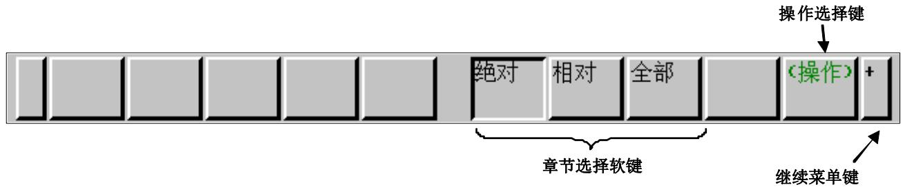

<details>
<summary>text_image</summary>

操作选择键
绝对 相对 全部 (操作) +
章节选择软键 继续菜单键
</details>

2 按一个章节选择软键，出现该章节的画面。如未显示出目标章节的软键，按继续菜单键。有时在一章内还可选择多个章节。  
3 当目标章节的画面被显示时，按下操作选择键，显示出将要操作的内容。  
4 通过操作选择软键选择目标操作。
根据将要执行的操作，显示出辅助菜单的软键，请按照辅助菜单的显示进行操作。

例2)

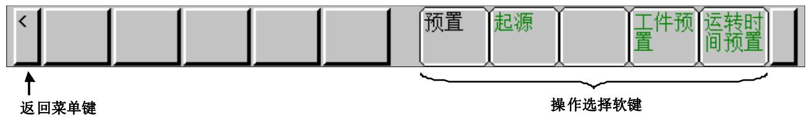

<details>
<summary>text_image</summary>

<
预置 起源 工件预 置 运转时 间预置
返回菜单键
操作选择软键
</details>

例3)  
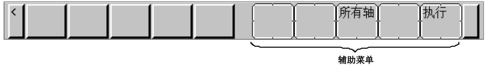

<details>
<summary>text_image</summary>

<
所有轴
执行
辅助菜单
</details>

5 想要返回到章节选择键的显示时，按返回菜单键。

上面是通常的画面显示步骤。但实际显示步骤会因不同的画面而有所差异。

具体操作请参阅相关的操作说明。

## - 基于软键状态的按钮设计的变化

所选对象不同，软键的状态不同，具有如下状态。

- 章节选择软键  
- 操作选择软键  
- 操作选择软键 辅助菜单

按照其不同状态，软键按钮的图标变化显示。

由此，可以弄清软键处在哪个状态。

## 例)

\- 章节选择软键


<details>
<summary>text_image</summary>

绝对 相对 全部 (操作)
</details>

\- 操作选择软键


<details>
<summary>text_image</summary>

预置 起源 工件预置 运转时间预置
</details>

\- 操作选择软键 辅助菜单


<details>
<summary>text_image</summary>

所有轴
执行
</details>

## 1.1.3 功能键

功能键用来选择所显示画面的种类。

MDI 面板上准备了下列功能键。

按此键显示位置显示画面。


按此键显示程序画面。


按此键显示偏置/设定画面。

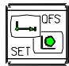

按此键显示系统画面。


按此键显示信息画面。


按此键显示图形画面。


按此键显示自定义画面 1（对话式宏画面、C 语言执行器画面）。


按此键显示自定义画面 2（对话式宏画面、C 语言执行器画面）。


## 1.1.4 软键

按下软键后再按功能键，即可显示属于功能的各画面。

从下页起，说明各功能键中的章节选择软键。

章节选择软键被分配在横排软键的右侧 4 个键上。另外，章节选择分布在多页上时，继续菜单键（最右边的软键）显示中显示出 [+]，按下继续菜单键，切换章节选择软键。

## 注释

1 按功能键可在常用的画面之间相互切换。  
2 有些软键（同选项结构有关）不予显示。

按下功能键 P0S 以外的按键，画面左半部分有位置显示时，软键的左半部分始终按照如下方式显示。


<details>
<summary>text_image</summary>

绝对 相对 全部 手动
</details>

## 位置显示画面

属于功能键 POS 的章节选择软键和各画面的功能如下所示。

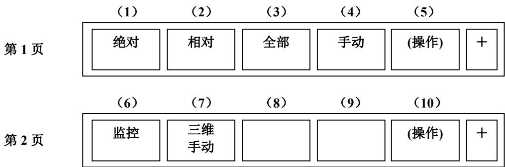

<details>
<summary>flowchart</summary>

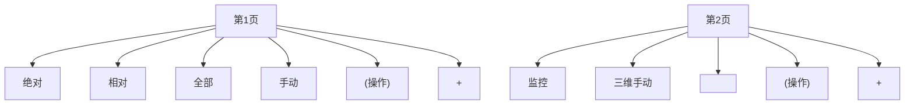
```mermaid
graph TD
  A["第1页"] --> B["绝对"]
  A --> C["相对"]
  A --> D["全部"]
  A --> E["手动"]
  A --> F["(操作)"]
  A --> G["+"]
  H["第2页"] --> I["监控"]
  H --> J["三维手动"]
  H --> K[" "]
  H --> L["(操作)"]
  H --> M["+"]
```
</details>

表1.1.4 (a) 位置表示画面


### PMC报警: 编号
- **故障内容**: 章节菜单
- **处理办法**: 描述

### PMC报警: (1)
- **故障内容**: 绝对
- **处理办法**: 选择绝对坐标显示画面。

### PMC报警: (2)
- **故障内容**: 相对
- **处理办法**: 选择相对坐标显示画面。

### PMC报警: (3)
- **故障内容**: 全部
- **处理办法**: 选择综合坐标显示画面。

### PMC报警: (4)
- **故障内容**: 手动
- **处理办法**: 选择进行手动手轮操作的操作画面。

### PMC报警: (6)
- **故障内容**: 监控
- **处理办法**: 选择用来显示伺服轴的负载表和串行主轴的负载表以及速度表的画面。

### PMC报警: (7)
- **故障内容**: 三维手动
- **处理办法**: 显示进行三维手动进给时的手轮脉冲的中断量。


## 程序画面

属于功能键 的章节选择软键和各画面的功能如下所示。

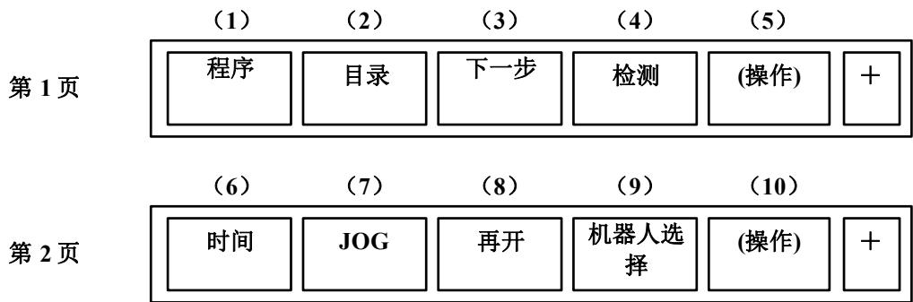

<details>
<summary>flowchart</summary>

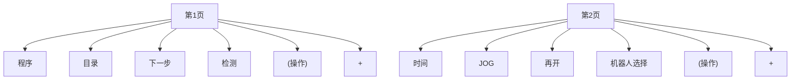
```mermaid
graph TD
  A["第1页"] --> B["程序"]
  A --> C["目录"]
  A --> D["下一步"]
  A --> E["检测"]
  A --> F["(操作)"]
  A --> G["+"]
  H["第2页"] --> I["时间"]
  H --> J["JOG"]
  H --> K["再开"]
  H --> L["机器人选择"]
  H --> M["(操作)"]
  H --> N["+"]
```
</details>

表1.1.4 (b) 程序


### PMC报警: 编号
- **故障内容**: 章节菜单
- **处理办法**: 描述

### PMC报警: (1)
- **故障内容**: 程序
- **处理办法**: 选择用来进行当前记录的部件程序内容的显示以及编辑的画面。

### PMC报警: (2)
- **故障内容**: 目录
- **处理办法**: 选择用来显示当前记录的部件程序的一览的画面。

### PMC报警: (3)
- **故障内容**: 下一步
- **处理办法**: 从指令值中选择用来显示当前执行中的程序段的指令值和接着将要执行的程序段的指令值的画面。

### PMC报警: (4)
- **故障内容**: 检测
- **处理办法**: 选择同时显示程序、位置、模态信息等的画面。

### PMC报警: (6)
- **故障内容**: 时间
- **处理办法**: 选择用来显示已经执行的程序的运行时间的画面。

### PMC报警: (7)
- **故障内容**: JOG
- **处理办法**: 在 JOG 方式下从 MDI 选择为执行以程序格式指定的数据的画面。

### PMC报警: (8)
- **故障内容**: 再开
- **处理办法**: 选择用来重新开始曾被中断的程序运行的操作画面。

### PMC报警: (9)
- **故障内容**: 机器人选择
- **处理办法**: 在机器人连接功能中,选择为登录机器人程序和 NC 程序的画面。


## 偏置 / 设定画面

属于功能键

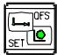

的章节选择软键和各画面的功能如下所示。

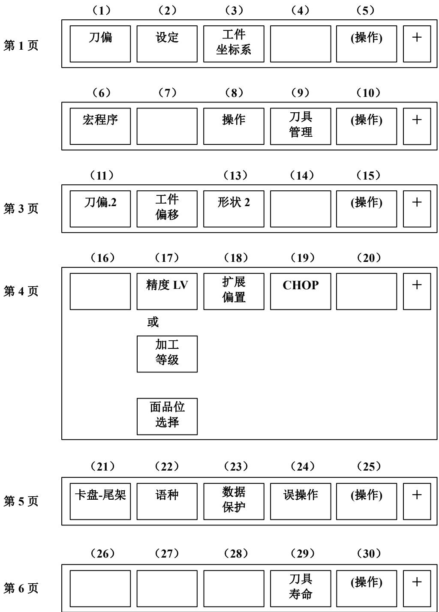

<details>
<summary>flowchart</summary>

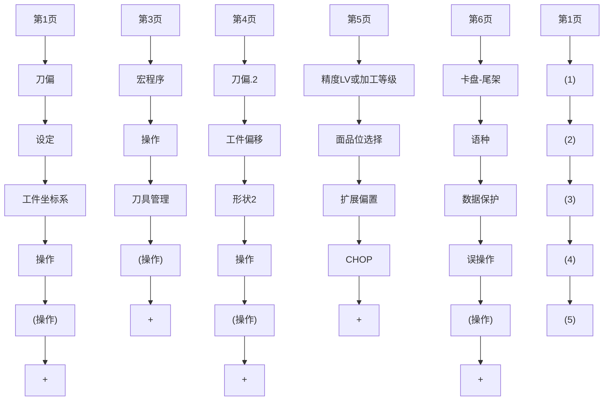
```mermaid
graph TD
  A["第1页"] --> B["刀偏"]
  B --> C["设定"]
  C --> D["工件坐标系"]
  D --> E["操作"]
  E --> F["(操作)"]
  F --> G["+"]
  H["第3页"] --> I["宏程序"]
  I --> J["操作"]
  J --> K["刀具管理"]
  K --> L["(操作)"]
  L --> M["+"]
  N["第4页"] --> O["刀偏.2"]
  O --> P["工件偏移"]
  P --> Q["形状2"]
  Q --> R["操作"]
  R --> S["(操作)"]
  S --> T["+"]
  U["第5页"] --> V["精度LV或加工等级"]
  V --> W["面品位选择"]
  W --> X["扩展偏置"]
  X --> Y["CHOP"]
  Y --> Z["+"]
  AA["第6页"] --> AB["卡盘-尾架"]
  AB --> AC["语种"]
  AC --> AD["数据保护"]
  AD --> AE["误操作"]
  AE --> AF["(操作)"]
  AF --> AG["+"]
  AH["第1页"] --> AI["(1)"]
  AI --> AJ["(2)"]
  AJ --> AK["(3)"]
  AK --> AL["(4)"]
  AL --> AM["(5)"]
```
</details>

表1.1.4 (c) 偏置


### PMC报警: 编号
- **故障内容**: 章节菜单
- **处理办法**: 描述

### PMC报警: (1)
- **故障内容**: 刀偏
- **处理办法**: 选择用来设定刀具偏置值的画面。

### PMC报警: (2)
- **故障内容**: 设定
- **处理办法**: 选择用来设定设定参数的画面。

### PMC报警: (3)
- **故障内容**: 工件坐标系
- **处理办法**: 选择用来设定工件坐标系偏置的画面。

### PMC报警: (6)
- **故障内容**: 宏程序
- **处理办法**: 选择用来设定宏变量的画面。

### PMC报警: (8)
- **故障内容**: 操作
- **处理办法**: 选择将机床操作面板上的部分操作开关作为软件开关操作的画面。

### PMC报警: (9)
- **故障内容**: 刀具管理
- **处理办法**: 选择用来进行有关刀具管理设定的画面。

### PMC报警: (11)
- **故障内容**: 刀偏.2
- **处理办法**: 选择用来设定Y轴偏置的画面。

### PMC报警: (12)
- **故障内容**: 工件偏移
- **处理办法**: 选择用来设定工件坐标系移位量的画面。

### PMC报警: (13)
- **故障内容**: 形状2
- **处理办法**: 选择用来设定第二形状偏置的画面。

### PMC报警: (17)
- **故障内容**: 精度LV
- **处理办法**: 选择用来设定精度级别的画面。

### PMC报警: (18)
- **故障内容**: 扩展偏置
- **处理办法**: 选择用来设定第4轴/第5轴偏置量的画面。

### PMC报警: (21)
- **故障内容**: 卡盘-尾架
- **处理办法**: 选择卡盘尾架隔板画面。

### PMC报警: (22)
- **故障内容**: 语种
- **处理办法**: 选择用来进行显示语言设定的画面。

### PMC报警: (23)
- **故障内容**: 数据保护
- **处理办法**: 选择用来进行数据保护设定的画面。

### PMC报警: (24)
- **故障内容**: 误操作
- **处理办法**: 选择用来防止错误操作的设定的画面。

### PMC报警: (29)
- **故障内容**: 刀具寿命
- **处理办法**: 选择与刀具寿命管理相关用来进行操作和设定的画面。


## 系统画面

属于功能键


的章节选择软键和各画面的功能如下所示。

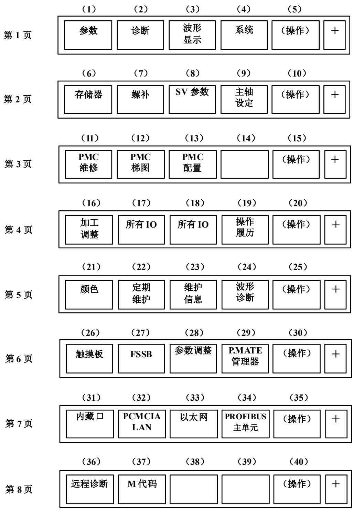

<details>
<summary>table</summary>

| 页次 | 参数 | 诊断 | 波形显示 | 系统 | (操作) | + |
| :--- | :--- | :--- | :--- | :--- | :--- | :--- |
| 第1页 | 参数 | 诊断 | 波形显示 | 系统 | (操作) | + |
| 第2页 | 存储器 | 螺补 | SV 参数 | 主轴设定 | (操作) | + |
| 第3页 | PMC 维修 | PMC 梯图 | PMC 配置 | | (操作) | + |
| 第4页 | 加工调整 | 所有 IO | 所有 IO | 操作履历 | (操作) | + |
| 第5页 | 颜色 | 定期维护 | 维护信息 | 波形诊断 | (操作) | + |
| 第6页 | 触摸板 | FSSB | 参数调整 | P.MATE 管理器 | (操作) | + |
| 第7页 | 内藏口 | PCMCIA LAN | 以太网 | PROFIBUS 主单元 | (操作) | + |
| 第8页 | 远程诊断 | M代码 | | | (操作) | + |
</details>

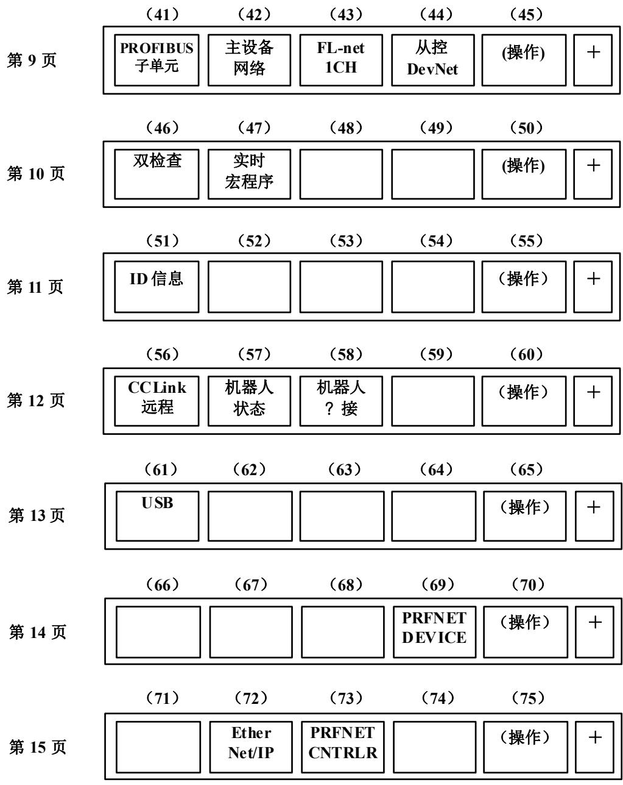

<details>
<summary>table</summary>

| 第9页 | (41) | (42) | (43) | (44) | (45) |
| --- | --- | --- | --- | --- | --- |
| PROFIBUS子单元 |  |  |  |  |  |
| 主设备网络 |  |  |  |  |  |
| FL-net 1CH |  |  |  |  |  |
</details>

表1.1.4 (d) 系统


### PMC报警: 编号
- **故障内容**: 章节菜单
- **处理办法**: 描述

### PMC报警: (1)
- **故障内容**: 参数
- **处理办法**: 选择用来设定参数的画面。

### PMC报警: (2)
- **故障内容**: 诊断
- **处理办法**: 选择用来显示 CNC 的状态的画面。

### PMC报警: (3)
- **故障内容**: 波形显示
- **处理办法**: 选择用来显示 SERVO GUIDE MATE 的画面。

### PMC报警: (4)
- **故障内容**: 系统
- **处理办法**: 选择用来显示当前的系统情况的画面。

### PMC报警: (6)
- **故障内容**: 存储器
- **处理办法**: 选择用来显示存储器内容的画面。

### PMC报警: (7)
- **故障内容**: 螺补
- **处理办法**: 选择用来设定螺距误差补偿差的画面。

### PMC报警: (8)
- **故障内容**: SV 参数
- **处理办法**: 选择用来设定有关伺服的参数之画面。

### PMC报警: (9)
- **故障内容**: 主轴设定
- **处理办法**: 选择用来进行有关主轴的设定之画面。

### PMC报警: (11)
- **故障内容**: PMC 维修
- **处理办法**: 显示与 PMC 信号状态的监测、追踪、PMC 参数的显示 / 编辑等 PMC 的维护相关的画面。

### PMC报警: (12)
- **故障内容**: PMC 梯图
- **处理办法**: 显示与梯形程序的显示 / 编辑相关的画面。

### PMC报警: (13)
- **故障内容**: PMC 配置
- **处理办法**: 显示构成顺序程序的梯形程序外的数据的显示 / 编辑和 PMC 功能的设定画面。

### PMC报警: (16)
- **故障内容**: 加工调整
- **处理办法**: 显示用来设定重视速度(精度 LV1)、重视精度(精度 LV10)、平滑化等级(LV1、LV10)的参数设置的画面。

### PMC报警: (17)
- **故障内容**: 所有 IO
- **处理办法**: 选择用来输入或输出数据的画面。

### PMC报警: (18)
- **故障内容**: 所有 IO
- **处理办法**: 选择用来向存储卡输入或输出数据的画面。

### PMC报警: (19)
- **故障内容**: 操作履历
- **处理办法**: 选择用来显示操作者执行的操作和发生的报警等履历的画面。

### PMC报警: (21)
- **故障内容**: 颜色
- **处理办法**: 选择用来设定画面上所使用的颜色的画面。

### PMC报警: (22)
- **故障内容**: 定期维护
- **处理办法**: 选择对定期管理的维护项目进行设定的画面。

### PMC报警: (23)
- **故障内容**: 维护信息
- **处理办法**: 选择用来显示进行维护时的信息的画面。

### PMC报警: (24)
- **故障内容**: 波形诊断
- **处理办法**: 选择用图表来显示伺服位置偏差值、转矩量、机械信号等数据的画面。

### PMC报警: (26)
- **故障内容**: 触摸板
- **处理办法**: 选择用来进行触摸板设定的画面。

### PMC报警: (27)
- **故障内容**: FSSB
- **处理办法**: 选择用来进行与高速串行伺服总线(FSSB:Fanuc Serial Servo Bus)相关的设定之画面。

### PMC报警: (28)
- **故障内容**: 参数调整
- **处理办法**: 选择用来进行启动和调整等所需参数的设定之画面。

### PMC报警: (29)
- **故障内容**: P.MATE 管理器
- **处理办法**: 选择用来进行与 FANUC 伺服放大器βi系列 I/O Link Option 相关的设定和显示的画面。

### PMC报警: (31)
- **故障内容**: 内藏口
- **处理办法**: 选择用来进行与嵌入式以太网(内置端口)相关的设定之画面。

### PMC报警: (32)
- **故障内容**: PCMCIA LAN
- **处理办法**: 选择用来进行与嵌入式以太网(PCMCIA 以太网卡)相关的设定之画面。

### PMC报警: (33)
- **故障内容**: 以太网
- **处理办法**: 选择用来进行与快速以太网/快速数据服务器相关的设定之画面。

### PMC报警: (34)
- **故障内容**: PROFIBUS 主单元
- **处理办法**: 选择用来进行与 PROFIBUS 主单元功能相关的设定之画面。

### PMC报警: (36)
- **故障内容**: 远程诊断
- **处理办法**: 機选择用来进行与机械远程诊断相关的设定、操作的画面。

### PMC报警: (37)
- **故障内容**: M 代码
- **处理办法**: 选择用来进行 M 代码的群组设定之画面。

### PMC报警: (41)
- **故障内容**: PROFIBUS 子单元
- **处理办法**: 选择用来 PROFIBUS 的从控功能相关的设定画面。

### PMC报警: (42)
- **故障内容**: 主设备网络
- **处理办法**: 选择用来 DeviceNet 的主控功能相关的设定画面。

### PMC报警: (43)
- **故障内容**: FL-net 1CH
- **处理办法**: 选择用来 FL-net 功能(第一块)相关的设定画面。

### PMC报警: (44)
- **故障内容**: 从控 DevNet
- **处理办法**: 选择与 DeviceNet 的从控功能相关的设定画面。

### PMC报警: (46)
- **故障内容**: 双检查
- **处理办法**: 选择进行与双检安全功能相关的设定的画面。

### PMC报警: (47)
- **故障内容**: 实时宏程序
- **处理办法**: 选择进行与实时用户宏程序功能相关的设定的画面。

### PMC报警: (51)
- **故障内容**: ID 信息
- **处理办法**: 选择显示 CNC 识别信息的画面。

### PMC报警: (56)
- **故障内容**: CCLink 远程
- **处理办法**: 选择用来 CC-Link 的远程设备功能相关的设定画面。

### PMC报警: (57)
- **故障内容**: 机器人状态
- **处理办法**: 在机器人连接功能下选择机器人的状态显示画面。

### PMC报警: (58)
- **故障内容**: 机器人连接
- **处理办法**: 选择用来机器人连接功能相关的设定画面。

### PMC报警: (61)
- **故障内容**: USB
- **处理办法**: 选择 USB 维护画面。

### PMC报警: (69)
- **故障内容**: PRFNET DEVICE
- **处理办法**: 选择与 PROFINET 的 IO 设备功能相关的设定画面。

### PMC报警: (72)
- **故障内容**: EtherNet/IP
- **处理办法**: 选择使得 EtherNet/IP 功能在与以太网功能不同的快速以太网板上动作时的设定画面。

### PMC报警: (73)
- **故障内容**: PRFNET CNTRLR
- **处理办法**: 选择 PROFINET 的 IO 控制器功能相关的设定画面。


## 信息画面

属于功能键


的章节选择软键和各画面的功能如下所示。

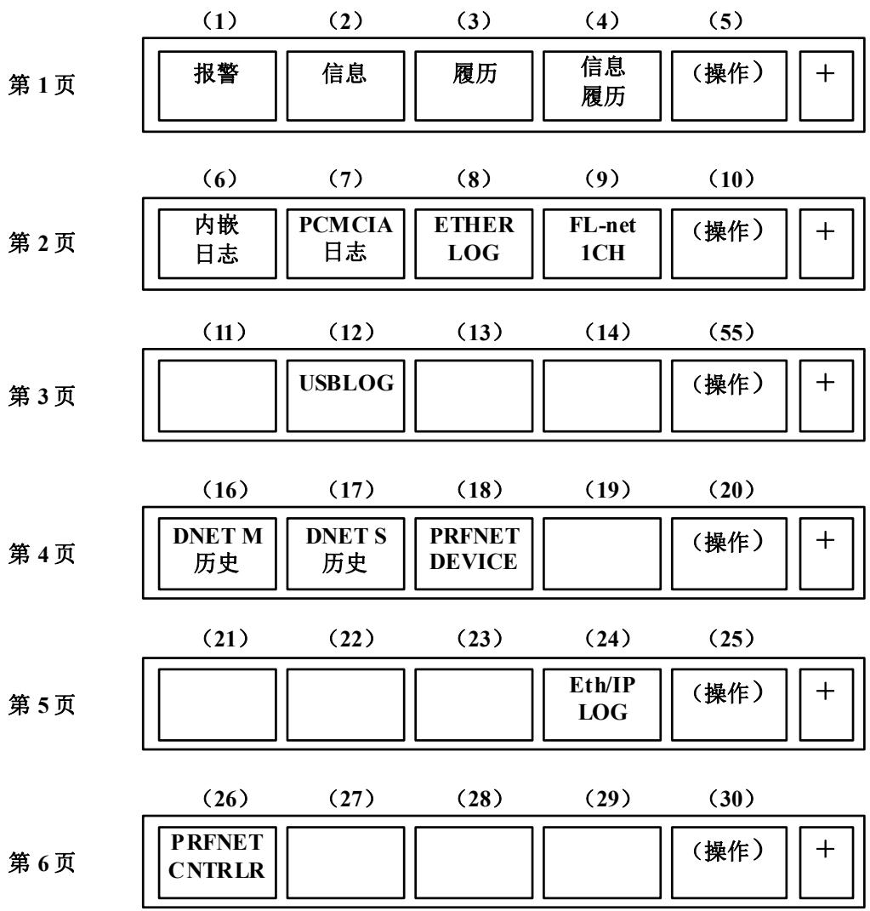

<details>
<summary>text_image</summary>

第1页
报警
信息
履历
信息履历
(操作)
+
第2页
内嵌日志
PCMCIA日志
ETHERLOG
FL-net1CH
(操作)
+
第3页
USBLOG
(操作)
+
第4页
DNETM历史
DNETS历史
PRFNETDEVICE
(操作)
+
第5页
Eth/IPLOG
(操作)
+
第6页
PRFNETCNTRLR
(操作)
+
</details>

表1.1.4 (e) 信息


### PMC报警: 编号
- **故障内容**: 章节菜单
- **处理办法**: 描述

### PMC报警: (1)
- **故障内容**: 报警
- **处理办法**: 选择报警信息画面。

### PMC报警: (2)
- **故障内容**: 信息
- **处理办法**: 选择操作者信息画面。

### PMC报警: (3)
- **故障内容**: 履历
- **处理办法**: 选择用来显示过去发生的报警内容的画面。

### PMC报警: (4)
- **故障内容**: 信息履历
- **处理办法**: 选择外部操作者信息画面。

### PMC报警: (6)
- **故障内容**: 内嵌日志
- **处理办法**: 选择用来显示与嵌入式以太网(内置端口)相关的错误信息的画面。

### PMC报警: (7)
- **故障内容**: PCMCIA 日志
- **处理办法**: 选择用来显示与嵌入式以太网(PCMCIA 以太网卡)相关的错误信息的画面。

### PMC报警: (8)
- **故障内容**: ETHER LOG
- **处理办法**: 选择用来进行与快速以太网/快速数据服务器相关的错误信息之画面。

### PMC报警: (9)
- **故障内容**: FL-net 1CH
- **处理办法**: 选择用来显示与 FL-net 功能(第1枚)相关的错误信息的画面。

### PMC报警: (12)
- **故障内容**: USBLOG
- **处理办法**: 选择用来显示与 USB 相关的错误信息的画面。

### PMC报警: (16)
- **故障内容**: DNET M 历史
- **处理办法**: 选择用来显示 DeviceNet 主控功能的通信履历画面的画面。

### PMC报警: (17)
- **故障内容**: DNET S 历史
- **处理办法**: 选择用来显示 DeviceNet 从控功能的通信履历画面的画面。

### PMC报警: (18)
- **故障内容**: PRFNET DEVICE
- **处理办法**: 选择用来显示 PROFINET IO 设备功能的通信履历画面的画面。

### PMC报警: (24)
- **故障内容**: Eth/IP LOG
- **处理办法**: 选择用来显示使得 EtherNet/IP 功能在与以太网功能不同的快速以太网板上动作时的通信履历画面的画面。

### PMC报警: (26)
- **故障内容**: PRFNET CNTRLR
- **处理办法**: 选择用线显示 PROFINET IO 控制器功能的通信履历画面的画面。


## 图形画面

属于功能键 | GRAPH 的章节选择软键和各画面的功能如下所示。

图形显示功能有效的情形:

第1页


### PMC报警: (1)
- **故障内容**: (2)
- **处理办法**: (3)

### PMC报警: 参数
- **故障内容**: 图形
- **处理办法**: 


表1.1.4 (f) 图形


### PMC报警: 编号
- **故障内容**: 章节菜单
- **处理办法**: 描述

### PMC报警: (1)
- **故障内容**: 参数
- **处理办法**: 选择用来设定与图形相关的参数之画面。

### PMC报警: (2)
- **故障内容**: 图形
- **处理办法**: 选择用来进行刀具路径的图形显示的画面。


动态图形显示功能有效的情形:

第1页


### PMC报警: (1)
- **故障内容**: (2)
- **处理办法**: (3)

### PMC报警: 绘图参数
- **故障内容**: 路径执行
- **处理办法**: 动画执行


表1.1.4 (g) 图形


### PMC报警: 编号
- **故障内容**: 章节菜单
- **处理办法**: 描述

### PMC报警: (1)
- **故障内容**: 绘图参数
- **处理办法**: 选择设定绘图参数的画面。

### PMC报警: (2)
- **故障内容**: 路径执行
- **处理办法**: 选择绘制刀具路径的画面。

### PMC报警: (3)
- **故障内容**: 动画执行
- **处理办法**: 选择绘制动画的画面。

### PMC报警: (4)
- **故障内容**: 刀具位置
- **处理办法**: 选择进行刀具位置显示的画面。


## 1.2 系统配置画面

系统正常启动后，通过显示系统配置画面，即可了解所安装的印制电路板的种类和软件的种类。

## 1.2.1 显示方法

(1) 按下 $\boxed{\text{SYSTEM}}$ 键。  
(2) 按下软键 [系统]。  
(3) 系统配置画面有 2 类画面：硬件画面和软件画面，可通过翻页键 ☐ PAGE ☐ 予以变更。不能在各配置画面上将全部信息显示在 1 页中时，通过按下 ☐ PAGE ☐ 即可切换到下一页。

## 1.2.2 硬件配置画面

## - 画面显示

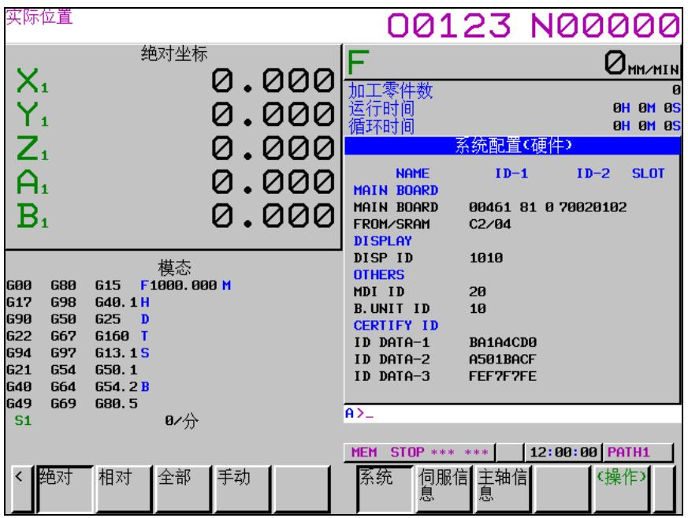

<details>
<summary>text_image</summary>

实际位置
00123 N00000
绝对坐标
X₁ 0.000
Y₁ 0.000
Z₁ 0.000
A₁ 0.000
B₁ 0.000
模态
G00 G80 G15 F1000.000 M
G17 G98 G40.1 H
G90 G50 G25 D
G22 G67 G160 T
G94 G97 G13.1 S
G21 G54 G50.1
G40 G64 G54.2 B
G49 G69 G80.5
S1 0/分
F
MM/MIN
加工零件数 0
运行时间 0H 0M 0S
循环时间 0H 0M 0S
系统配置(硬件)
NAME ID-1 ID-2 SLOT
MAIN BOARD
MAIN BOARD 00461 81 0 70020102
FROM/SRAM C2/04
DISPLAY
DISP ID 1010
OTHERS
MDI ID 20
B. UNIT ID 10
CERTIFY ID
ID DATA-1 BA1A4CD8
ID DATA-2 A501BACF
ID DATA-3 FEF7F7FE
A >_
MEM STOP *** 12:00:00 PATH1
< 绝对 相对 全部 手动 系统 伺服信息 主轴信息 (操作)
</details>

## - 显示内容

下面就显示内容进行说明。

1. 名称

MAIN BOARD

- 显示主板及主板上的卡、模块信息。  
OPTION BOARD  
- 显示安装在可选插槽上的板信息。

DISPLAY

\- 显示与显示器相关的信息。

OTHERS

\- 显示其它（MDI 和基本单元等）的信息。

2. 槽

\- 显示安装有可选板的插槽号。

## 1.2.3 软件配置画面

## - 画面显示

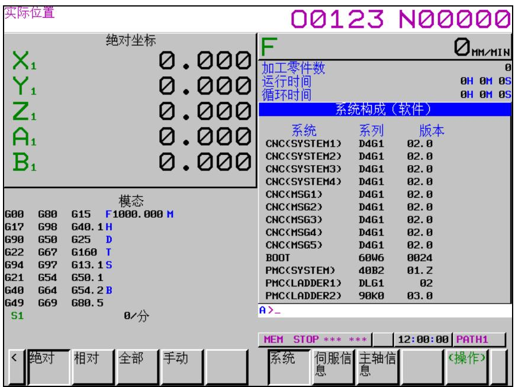

<details>
<summary>text_image</summary>

实际位置
00123 N00000
绝对坐标
X₁ 0.000
Y₁ 0.000
Z₁ 0.000
A₁ 0.000
B₁ 0.000
模态
G00 G80 G15 F1000.000 M
G17 G98 G40.1 H
G90 G50 G25 D
G22 G67 G160 T
G94 G97 G13.1 S
G21 G54 G58.1
G40 G64 G54.2 B
G49 G69 G88.5
S1 0/分
F
MM/MIN
加工零件数 0
运行时间 0H 0M 0S
循环时间 0H 0M 0S
系统构成（软件）
系统 系列 版本
CNC(SYSTEM1) D4G1 02.0
CNC(SYSTEM2) D4G1 02.0
CNC(SYSTEM3) D4G1 02.0
CNC(SYSTEM4) D4G1 02.0
CNC(MSG1) D4G1 02.0
CNC(MSG2) D4G1 02.0
CNC(MSG3) D4G1 02.0
CNC(MSG4) D4G1 02.0
CNC(MSG5) D4G1 02.0
BOOT 60W6 0024
PMC(SYSTEM) 40B2 01.2
PMC(LADDER1) DLG1 02
PMC(LADDER2) 98K8 03.0
A >_
MEM STOP *** ***
12:00:00 PATH1
< 绝对 相对 全部 手动
系统 伺服信息 主轴信息 (操作)
</details>

图1.2.3 (a) 软件配置画面

## - 显示内容

下面就显示内容进行说明。

系统：软件的种类

系列：软件的系列

版本：软件的版本

## - 显示系统和软件的种类

与所显示的系统对应的软件如下所示。

表1.2.3 (a) 软件的种类


\- 有关数字伺服软件的显示

加载多个软件时最多显示 10 类。

有关每个轴上所使用的伺服软件的种类，请通过参数(No.1024)进行确认。

\- 有关主轴伺服软件的显示

按照每个主轴显示软件的系列和版本。最多显示16个主轴的信息。

\- 有关宏程序执行器的显示

按照 P-CODE 宏程序创建时指定的每个编号显示系列和版本。

最多显示 20 类宏程序执行器。

## 1.2.4 输出系统配置数据

可以将显示在系统配置画面上的数据输出到 I/O 设备。

(1) 按下功能键 SYSTEM。

(2) 按下机床操作面板上的 EDIT（编辑）开关。

(3) 按下软键 [系统]，显示出系统构成画面。

(4) 按下软键 [(操作)]，选择软键 [输出]。

(5) 按下软键 [执行]。

(6) 向由参数 No.20 所选的输出设备输出。

输出的数据被以 “SYS\_CONF.TXT” 文件名输出。

## 1.3 诊断功能

## 1.3.1 诊断画面的显示方法

(1) 按下 键。

(2) 按下软键 [诊断]，出现诊断画面。

## 1.3.2 显示内容

## - 显示即使发出指令也没有反应的原因

诊断

0

CNC 的内部状态 1

[数据类型] 位型

名称

显示“1”时的内部状态

到位检测

到位检测中。

切削进给速率 0%

进给速度速率为0%。

JOG 进给速率 0%

JOG 进给速度速率为 0%。

互锁 / 起动锁停

互锁 / 起动锁停接通。

等待速度到达信号

等待速度到达信号接通。

旋转 1 周信号等待

螺纹切削中等待主轴旋转1周信号。

位置编码器停止

主轴每转进给中等待位置编码器的旋转。

诊断

2

暂停的执行状态

执行暂停时，显示“1”。

诊断

8

CNC 的内部状态 2

[数据类型] 位型

名称

显示“1”时的内部状态

数据读入中（表）

前台数据输入中。

数据读入中（里）

后台数据输入中。

## - RS232C 接口的输出中状态

诊断

10

RS232C接口的输出中状态

经由 RS232C 接口正在输出数据的情况下，显示 “1”。

## - TH 报警状态

诊断

30

TH 警告文字数(前台编辑)

[数据类型] 2 字轴型

以从程序段开头的字符数来显示前台输入中发生 TH 报警的字符位置。

诊断

31

TH 警告文字代码(前台编辑)

[数据类型] 2 字轴型

显示前台输入中发生 TH 报警字符读取代码。

诊断

32

TH 警告文字数(后台编辑)

[数据类型] 2 字轴型

以从程序段开头的字符数来显示后台输入中发生 TH 报警的字符位置。

诊断

33

TH 警告文字代码(后台编辑)

[数据类型] 2 字轴型

显示后台编辑输入中发生 TH 报警的字符读取代码。

## - CNC 画面的显示语言


CNC 画面的当前显示语言的编号

[数据类型] 字节型

显示 CNC 画面的当前的显示语言的编号。

各语言与下列编号对应。

0: 英语

1: 日语

2: 德语

3: 法语

4: 中文（繁体字）

5: 意大利语

6: 韩语

7: 西班牙语

8: 荷兰语

9: 丹麦语

10: 葡萄牙语

11: 波兰语

12: 匈牙利语

13: 瑞典语

14: 捷克语

15: 中文（简体字）

16: 俄语

17: 土耳其语

18: 保加利亚语

19: 罗马尼亚语

20：斯洛文尼亚语

21: 芬兰语

22：印地语

## - 串行脉冲编码器的报警细节


### PMC报警: 诊断
- **故障内容**: 200
- **处理办法**: #7

### PMC报警: OVL
- **故障内容**: LV
- **处理办法**: OVC


#0 OFA 溢流报警

#1 FBA 断线报警

#2 DCA 放电报警

#3 HVA 过电压报警

#4 HCA 异常电流报警

#5 OVC 过电流报警

#6 LV 不足电压报警

#7 OVL 过载报警


### PMC报警: 诊断
- **故障内容**: 201
- **处理办法**: #7

### PMC报警: ALD
- **故障内容**: PCR
- **处理办法**: 


#4 EXP

#7 ALD


### PMC报警: 
- **故障内容**: ALD
- **处理办法**: EXP

### PMC报警: 过载报警
- **故障内容**: 0
- **处理办法**: —

### PMC报警: 1
- **故障内容**: —
- **处理办法**: 电机过热

### PMC报警: 断线报警
- **故障内容**: 1
- **处理办法**: 0

### PMC报警: 1
- **故障内容**: 1
- **处理办法**: 外置脉冲编码器断线(硬件)

### PMC报警: 0
- **故障内容**: 0
- **处理办法**: 脉冲编码器断线(软件)


#6 PCR 手动返回参考点时，捕捉到了位置检测器的 1 转信号。由于已经建立起了用于手动返回参考点的栅格，所以可以手动返回参考点。

## 注释

此位在没有开始手动返回参考点方式的动作时没有意义。

## 诊断


### PMC报警: #7
- **故障内容**: #6
- **处理办法**: #5

### PMC报警: 
- **故障内容**: CSA
- **处理办法**: BLA


#0 SPH 串行脉冲编码器或反馈电缆异常。
反馈脉冲信号的计数不正确。

#1 CKA 串行脉冲编码器异常。
内部块停止工作。

#2 BZA 电池电压降为 0。
请更换电池，并设定参考点。

#3 RCA 串行脉冲编码器异常。
转速的计数不正确。

#4 PHA 串行脉冲编码器或反馈电缆异常。
反馈脉冲信号的计数不正确。

#5 BLA 电池电压下降。（警告）

#6 CSA 串行脉冲编码器的硬件异常。

## 诊断


### PMC报警: #7
- **故障内容**: #6
- **处理办法**: #5

### PMC报警: DTE
- **故障内容**: CRC
- **处理办法**: STB


#4 PRM 数字伺服一侧检测出参数非法。请参阅诊断 No.352 中所描述的原因和对策。

#5 STB 串行脉冲编码器通信异常。
传输过来的数据有误。

#6 CRC 串行脉冲编码器通信异常。
传输过来的数据有误。

#7 DTE 串行脉冲编码器通信异常。
没有通信的响应。

## 诊断


### PMC报警: 
- **故障内容**: #7
- **处理办法**: #6

### PMC报警: 204
- **故障内容**: 
- **处理办法**: OFS


#3 PMS 由于串行脉冲编码器 C、或者反馈电缆的异常，反馈不正确。

#4 LDA 串行脉冲编码器的 LED 异常。

#5 MCC 伺服放大器中的电磁开关触点熔化。

#6 OFS 数字伺服的电流值的 A / D 变换异常。

## - 外置串行脉冲编码器的报警细节

## 诊断


### PMC报警: 
- **故障内容**: #7
- **处理办法**: #6

### PMC报警: 205
- **故障内容**: OHA
- **处理办法**: LDA


#0 SPH 外置脉冲编码器中发生相位数据异常。

#1 PMA 外置脉冲编码器中产生脉冲错误。

#2 BZA 外置脉冲编码器中电池电压降为零。

#3 CMA 外置脉冲编码器中产生计数错误。

#4 PHA 外置直线尺中发生相位数据异常。

#5 BLA 外置脉冲编码器的电池电压下降。

#6 LDA 外置脉冲编码器中发生 LED 异常。

#7 OHA 外置脉冲编码器中产生过热。

## 诊断


### PMC报警: 
- **故障内容**: #7
- **处理办法**: #6

### PMC报警: 206
- **故障内容**: DTE
- **处理办法**: CRC


#5 STB 外置脉冲编码器中发生停止位错误。

#6 CRC 外置脉冲编码器中发生 CRC 错误。

#7 DTE 外置脉冲编码器中发生数据错误。

光栅尺的连接方式


### PMC报警: 
- **故障内容**: #7
- **处理办法**: #6

### PMC报警: 診断
- **故障内容**: 202
- **处理办法**: SEM


#7 SEM 外置检测器不使用（半闭环）


### PMC报警: 診断
- **故障内容**: 206
- **处理办法**: #7

### PMC报警: 
- **故障内容**: 
- **处理办法**: 


#0 LIN 外置检测器为串行接口的线性光栅尺

#1 ROT 外置检测器为串行接口的旋转光栅尺


### PMC报警: 
- **故障内容**: SEM
- **处理办法**: ROT

### PMC报警: 外置检测器(串行)(线性光栅尺)
- **故障内容**: 0
- **处理办法**: 0

### PMC报警: 外置检测器(串行)(旋转光栅尺)
- **故障内容**: 0
- **处理办法**: 1

### PMC报警: 外置位置检测器(AB相)
- **故障内容**: 0
- **处理办法**: 0

### PMC报警: 半闭环
- **故障内容**: 1
- **处理办法**: 0


## - 伺服参数非法报警的细节（CNC一侧）

在发生伺服报警 No.417，且诊断 No.203#4=0 的情况下，显示该原因。

诊断 No.203#4=1 时，请参阅诊断 No.352。


### PMC报警: 
- **故障内容**: 
- **处理办法**: #7

### PMC报警: 诊断
- **故障内容**: 280
- **处理办法**: 


#0 MOT 参数 No.2020 的电机型号设定了指定范围以外的数值。  
#2 PLC 参数 No.2023 的电机每转的速度反馈脉冲数设定了小于等于 0 的错误数值。  
#3 PLS 参数 No.2024 的电机每转的位置反馈脉冲数设定了小于等于 0 错误数值。  
#4 DIR 参数 No.2022 的电机旋转方向没有设定正确的数值(111 或 -111)。

- 位置偏差量


### PMC报警: 诊断
- **故障内容**: 300
- **处理办法**: 以检测单位显示每个轴的位置偏差量


$$
\text {位置偏差量} = \frac {\text {进给速度} [ \mathrm{mm/min} ] \times 1 0 0}{6 0 \times \text {伺服环增益} [ 1 / \mathrm{sec} ]} \times \frac {1}{\text {检测单位}}
$$

- 机械位置


### PMC报警: 诊断
- **故障内容**: 301
- **处理办法**: 以最小移动单位显示每个轴自参考点的距离


- 从减速挡块末端到最初的栅格点之间的距离


### PMC报警: 诊断
- **故障内容**: 302
- **处理办法**: 从减速挡块末端到最初的栅格点之间的距离


[数据类型] 实数轴型  
[数据单位] 机械单位  
[数据范围] 0～±99999999

## 注释

设定了无挡块参考点的情况下，成为从无挡块参考点设定的开始位置到最初的栅格点之间的距离。

- 参考计数器


### PMC报警: 诊断
- **故障内容**: 304
- **处理办法**: 每个轴的参考计数器值


[数据类型] 2 字轴型  
[数据单位] 检测单位  
[数据范围] -99999999～99999999

- 电机温度信息


### PMC报警: 诊断
- **故障内容**: 308
- **处理办法**: 伺服电机温度(°C)


[数据类型] 字节轴型

[数据单位] ℃

[数据范围] 0\~255

显示伺服电机的绕组温度。在达到 $140^{\circ}$ C 的阶段，发生电机过热的报警。

诊断

309

脉冲编码器温度（℃）

[数据类型] 字节轴型

[数据单位] ℃

[数据范围] 0\~255

显示脉冲编码器内印刷电路板的温度。在达到 $100^{\circ}$ C（脉冲编码器内环境温度大约 $85^{\circ}$ C）的阶段，发生电机过热的报警。

## 注释

1 温度信息误差如下所示。

$50^{\circ}\mathrm{C} \sim 160^{\circ}\mathrm{C} \pm 5^{\circ}\mathrm{C}$

$160^{\circ}\mathrm{C} \sim 180^{\circ}\mathrm{C} \pm 10^{\circ}\mathrm{C}$

2 发生过热报警的温度，最大出现 $5^{\circ}$ C 的误差。

## - 参数 APZ（No.1815#4）成为 0 的原因

可以通过诊断数据号 No.310 和 311 来确认参数 APZ（No.1815#4）成为 “0” 的原因。

此外，诊断数据号 No.310 和 311 成为 “1” 时，在再次进行该轴的绝对位置检测器的原点设定之前，保持 “1” 的状态。导致参数 APZ 成为 0 的原因如下所示。

诊断


### PMC报警: 310
- **故障内容**: 
- **处理办法**: DTH


#0 PR1 下列参数已被改变。

No.1815#0, No.1815#1, No.1815#6, No.1817#3, No.1820, No.1821, No.1822, No.1823, No.1850, No.1868, No.1869, No.1874, No.1875, No.1876, No.1883, No.1884, No.2022, No.2084, No.2085, No.2179, 旋转轴 A 类型时的设定单位, No.11802#6, No.11810

#1 PR2 参数 ATS（No.8303#1）已被改变。或者，参数 SMA（No.8302#7）为“1”时，成组的同步轴的 APZ 成为“0”。

#2 BZ1 检测出电池电压 0V。（感应同步器）

#3 BZ2 检测出电池电压 0V。（外置位置检测器）

#5 ALP 在 $\alpha$ 脉冲编码器尚未旋转 1 周以上的情况下，进行了基于 MDI 操作的原点设定。

或者，CNC 未能从绝对脉冲编码器获取正确的值。

#6 DTH 通过控制轴拆除信号 DTCH（G124）/ 参数 RMV（No.0012#7）执行了轴拆除操作。

诊断


### PMC报警: 
- **故障内容**: #7
- **处理办法**: #6

### PMC报警: 311
- **故障内容**: 
- **处理办法**: DUA


#0 AL1 发生了 SV 报警（SV0301～SV0305）。

#1 AL2 参数 CRF(No.1819#1)为 1 时，检测出断线报警（SV0445, SV0447）或者模拟信号异常（SV0646）。

#2 AL3 检测出电池电压 0V。（内置串行脉冲编码器）

#3 AL4 检测出计数错误报警（SV0367）。

#4 GSG 断线报警忽略信号 NDCAL（G202）由 “1” 变为 “0”。

#5 XBZ 检测出电池电压 0 V 或者计数错误报警（SV0382）。（串联方式分离式位置检测器）

#6 DUA 参数 CRF(No.1819#1)为 1 时，检测出半一全误差过大报警（SV0421）。

## - 伺服参数设定非法报警的细节（伺服一侧）

诊断


输出用于确定伺服参数非法报警（伺服报警 No.417）在伺服一侧发生时的发生部位（参数）以及发生原因的信息。

本诊断信息满足下列条件时有效。

\- 正在发生伺服报警 No.417

\- 诊断 No.203#4 PRM=1

有关与所显示的详细编号对应的原因和对策，请参阅下表。有关对策的详细信息，请参阅 FANUC AC SERVO MOTOR α i/β i series 参数说明书（B-65270CM）。

- 伺服参数设定非法报警的详细内容


### PMC报警: 详细编号
- **故障内容**: 参数号
- **处理办法**: 原因

### PMC报警: 0233
- **故障内容**: 2023
- **处理办法**: 初始设定 bit 的 bit0=1 时,速度脉冲数的设定超过了 13100。

### PMC报警: 0234
- **故障内容**: 2023
- **处理办法**: 使用 DD 电机时,在速度脉冲数中设定了 512 以下的值。

### PMC报警: 0243
- **故障内容**: 2024
- **处理办法**: 初始设定 bit 的 bit0=1 时,位置脉冲数的设定超过了 13100。

### PMC报警: 04340435
- **故障内容**: 2043
- **处理办法**: 速度环积分增益的内部值溢出。

### PMC报警: 044304440445
- **故障内容**: 2044
- **处理办法**: 速度环比例增益的内部值溢出。

### PMC报警: 04740475
- **故障内容**: 2047
- **处理办法**: 观测器用参数(POA1)的内部值溢出。

### PMC报警: 05340535
- **故障内容**: 2053
- **处理办法**: 有关盲区补偿的参数内部值溢出。

### PMC报警: 05440545
- **故障内容**: 2054
- **处理办法**: 有关盲区补偿的参数内部值溢出。

### PMC报警: 0694069506960699
- **故障内容**: 2069
- **处理办法**: 速度前馈系数的内部值溢出。

### PMC报警: 07540755
- **故障内容**: 2075
- **处理办法**: 左面的参数设定值溢出。

### PMC报警: 07640765
- **故障内容**: 2076
- **处理办法**: 左面的参数设定值溢出。

### PMC报警: 0843
- **故障内容**: 2084
- **处理办法**: 尚未为柔性进给齿轮分子设定一个正的数值。或进给齿轮分子>分母×16。

### PMC报警: 0853
- **故障内容**: 2085
- **处理办法**: 尚未为柔性进给齿轮分母设定一个正的数值。

### PMC报警: 0883
- **故障内容**: 2088
- **处理办法**: 带串行位置检测器的轴,机床速度反馈系数值大于等于 100。

### PMC报警: 088408850886
- **故障内容**: 2088
- **处理办法**: 机床速度反馈系数内部值溢出。

### PMC报警: 099409950996
- **故障内容**: 2099
- **处理办法**: 用于 N 脉冲抑制的内部值溢出。

### PMC报警: 1033
- **故障内容**: 2103
- **处理办法**: 异常负载的返回量在 L 轴和 M 轴上不同。(使用同时返回功能时)

### PMC报警: 1123
- **故障内容**: 2112
- **处理办法**: 使用的是线性电机,却没有输入 AMR 变换系数参数。

### PMC报警: 1182
- **故障内容**: 211820782079
- **处理办法**: 尚未设定双重位置反馈变换系数。

### PMC报警: 12841285
- **故障内容**: 2128
- **处理办法**: 速度脉冲数的设定值过小时,电流控制相关的参数内部值溢出。

### PMC报警: 12941295
- **故障内容**: 2129
- **处理办法**: 速度脉冲数的设定值过大时,电流控制相关的参数内部值溢出。

### PMC报警: 1393
- **故障内容**: 2139
- **处理办法**: 线性电机的 AMR 偏置设定值超过 $\pm 45$ 。

### PMC报警: 1454145514561459
- **故障内容**: 2145
- **处理办法**: 切削时速度前馈系数溢出。

### PMC报警: 1493
- **故障内容**: 2149
- **处理办法**: 为此参数设定了大于6的值。

### PMC报警: 1503
- **故障内容**: 2150
- **处理办法**: 为此参数设定了大于等于10的值。

### PMC报警: 1786
- **故障内容**: 2178
- **处理办法**: No.2212#6或No.2213#6处于1的状态,且已设定No.2178=0。

### PMC报警: 1793
- **故障内容**: 2179
- **处理办法**: 设定了负或者比No.1821的设定值更大的设定值。

### PMC报警: 1853
- **故障内容**: 2185
- **处理办法**: 设定了负或者比No.2023的设定值更大的设定值。

### PMC报警: 2203
- **故障内容**: 2220#0
- **处理办法**: 设为磁极检测有效(No.2213#7=1)且非二进制检测器有效(No.2220#0=1)的情况下,在进行如下任一设定时,发生参数非法报警。-AMR变换系数 $1 \leqslant 0$ -AMR变换系数 $2 \leqslant 0$ -AMR变换系数 $2 >512$ (设定范围为1(2极)~512(1024极))

### PMC报警: 2243
- **故障内容**: 2224#5
- **处理办法**: 前馈时机调整功能的参数非法忽略(No.2224#5=1)、且有纳米插补指令时发生。

### PMC报警: 2632
- **故障内容**: 2263
- **处理办法**: 重力提升功能有效(No.2298#7=1)、或伺服关断后移动量监视功能有效(No.2278#5=1)时,CNC软件与向伺服软件通知检测单位的功能未对应且检测单位设定(No.2263)被设为无效。

### PMC报警: 2780
- **故障内容**: 2277#5,6,72278#0,2,424096
- **处理办法**: 不在使用第一台SDU时(No.24096=0),进行了在第一台SDU上连接检测器(加速度传感器、温度检测回路、模拟检查接口单元)的设定。

### PMC报警: 2781
- **故障内容**: 2277#5,6,72278#1,3,424097
- **处理办法**: 不在使用第二台SDU时(No.24097=0),进行了在第二台SDU上连接检测器(加速度传感器、温度检测回路、模拟检查接口单元)的设定。

### PMC报警: 2782
- **故障内容**: 2277#5,6,72278#0,424096
- **处理办法**: 进行了如下任一设定。第一台SDU上加速度传感器和温度检测回路,两者都被设为有效已设为使用第一台SDU(No.24097>0)、且加速度传感器无效(No.2277#5,6,7=0,0,0)、且从第二台读入加速度(No.2278#1=1)。

### PMC报警: 2783
- **故障内容**: 2277#5,6,72278#1,424097
- **处理办法**: 进行了如下任一设定。第二台SDU上加速度传感器和温度检测回路,两者都被设为有效已设为使用第二台SDU(No.24096>0)、且加速度传感器无效(No.2277#5,6,7=0,0,0)、且从第二台读入加速度(No.2278#1=1)。

### PMC报警: 2784
- **故障内容**: 1815#12277#5,6,72278#0,1,4
- **处理办法**: 全闭环设定时,连接了分离式位置检测器以外的检测器(第一台、第二台SDU)

### PMC报警: 2785
- **故障内容**: 1815#12277#5,6,72278#0,4
- **处理办法**: 全闭环设定时,连接了分离式位置检测器以外的检测器(第一台SDU)

### PMC报警: 2786
- **故障内容**: 1815#12277#5,6,72278#1,4
- **处理办法**: 全闭环设定时,连接了分离式位置检测器以外的检测器(第二台SDU)

### PMC报警: 2787
- **故障内容**: 2278#0,#1
- **处理办法**: 设为连接2台温度检测回路。

### PMC报警: 2788
- **故障内容**: 1815#12277#5,6,72278#42278#0,12409624097
- **处理办法**: 设为连接2台温度检测回路。

### PMC报警: 3002
- **故障内容**: 2300#3,#7
- **处理办法**: αiCZ检测回路、线性电机位置检测回路与过热信号连接不对应。

### PMC报警: 3012
- **故障内容**: 2301#2,#7
- **处理办法**: (No.2301#2=1时)虽然连接了与直流环电压信息输出不对应的硬件(PS,SV),却进行了No.2301#2=1的设定。(No.2301#7=1时)CNC软件与转矩控制设定范围扩大功能不对应。

### PMC报警: 35533603
- **故障内容**: 2355
- **处理办法**: 设定值在4以下。

### PMC报警: 3603
- **故障内容**: 2113236023632366
- **处理办法**: 设定值在96以下。

### PMC报警: 36033663
- **故障内容**: 2366
- **处理办法**: 设定值在4以下。

### PMC报警: 4553
- **故障内容**: 2455
- **处理办法**: 设定了负值。

### PMC报警: 4563
- **故障内容**: 2456
- **处理办法**: 设定了0~12以外的值。

### PMC报警: 8213
- **故障内容**: 1821
- **处理办法**: 尚未为参考计数器容量的参数值设定正的数值。

### PMC报警: 825482558256
- **故障内容**: 1825
- **处理办法**: 位置增益中设定了0。

### PMC报警: 9053
- **故障内容**: 1815#12409624097
- **处理办法**: 全闭环设定时尚未进行分离式接口单元的设定。

### PMC报警: 100101001610019
- **故障内容**: 2200#0
- **处理办法**: 与“反馈不一致检测”相关的参数内部值溢出。

### PMC报警: 10033
- **故障内容**: 2004
- **处理办法**: 控制周期设定非法在进行自动修正控制周期的情形下发生。

### PMC报警: 10053
- **故障内容**: 2018#0
- **处理办法**: 使用线性电机时,设定了光栅尺反连接位。

### PMC报警: 10062
- **故障内容**: 2209#4
- **处理办法**: 所使用的放大器不支持HC报警回避功能。

### PMC报警: 1009210093
- **故障内容**: 20042013#02014#0
- **处理办法**: 在一个伺服CPU内进行了不同的控制周期设定。

### PMC报警: 10103
- **故障内容**: 20042013#0
- **处理办法**: 进行了HRV1设定。

### PMC报警: 10113
- **故障内容**: 2013#0
- **处理办法**: 电流周期不一致报警电流周期的设定与实际的设定不同时就会发生此报警。

### PMC报警: 10123
- **故障内容**: 2013#0
- **处理办法**: HRV3-不可设定报警此轴虽然与HRV3对应,但是,成对的轴与HRV3不对应时就会发生此报警。

### PMC报警: 10133
- **故障内容**: 2013#02014#0
- **处理办法**: 虽然进行了HRV3设定,但是放大器与这些控制不对应时会发生此报警。

### PMC报警: 10202
- **故障内容**: 2277#5,6,72278#0,2,4
- **处理办法**: 与第一台SDU连接的检测器的ID和参数设定不同。

### PMC报警: 10212
- **故障内容**: 2277#5,6,72278#1,3,4
- **处理办法**: 与第二台SDU连接的检测器的ID和参数设定不同。


诊断 355 通信报警忽略计数器（外置）

诊断 356 链接处理计数器（内置）

诊断 357 链接处理计数器（外置）

表示检测器的串行通信中发生通信错误的次数。

只要不另行发生报警，就说明通信数据已经得到保证，但是当这些诊断信息中所示的计数器值立即变大时，串行通信有可能由于噪声而紊乱，应采取充分的噪声对策。

※详情请参阅 FANUC SERVO MOTOR α i series 的说明书。

诊断 358 “伺服 V--就绪信号关闭”信息

这是用来分析发生 “伺服 V--就绪信号关闭” 报警（伺服报警(SV0401)）原因的信息。

它将显示值转换成 2 进制数，检查位 5\~位 14。

将伺服放大器的励磁置于 ON 时，从低位的位 5 开始依次被设定为 1，正常启动时，位 5\~位 14 均被设定为 1。

也即，从低位的位开始依次确认，最初被设定为 0 的位如果不能完成以上变化，说明这就是发生 “伺服 V--就绪信号关闭” 报警的原因。


### PMC报警: #15
- **故障内容**: #14
- **处理办法**: #13

### PMC报警: 
- **故障内容**: SRDY
- **处理办法**: DRDY


### PMC报警: #07
- **故障内容**: #06
- **处理办法**: #05

### PMC报警: 
- **故障内容**: *ESP
- **处理办法**: 


#06 \*ESP 转换器紧急停止解除状态

#10 CRDY 转换器准备结束

#12 INTL DB 继电器解除结束

#13 DRDY 放大器准备结束（放大器）

#14 SRDY 放大器准备结束（软件）

※ 详情请参阅 FANUC SERVO MOTOR α i series 的说明书。

诊断 359 通信报警忽略计数器（内置）

与诊断 No.355 的内容相同的诊断信息。

请参阅诊断 No.355～357 的说明。

## 诊断

## 360

## 指令脉冲累积值（NC）

[数据类型] 2 字轴型

[数据单位] 检测单位

[数据范围] -99999999～99999999

此参数表示通电后从 CNC 分配的移动指令的累积值。

## 诊断

## 361

## 补偿脉冲（NC）

[数据类型] 2字轴型

[数据单位] 检测单位

[数据单位] -99999999～99999999

此参数表示通电后从 CNC 分配的补偿脉冲（背隙补偿、螺距误差补偿等）的累积值。

## 诊断

## 362

## 指令脉冲累积值（SV）

[数据类型] 2 字轴型

[数据单位] 检测单位

[数据单位] -99999999～99999999

此参数表示通电后伺服所接收到的移动脉冲和补偿脉冲的累积值。

## 诊断

## 363

## 反馈累积值（SV）

[数据类型] 2 字轴型

[数据单位] 检测单位

[数据单位] -99999999～99999999

此参数表示通电后伺服从脉冲编码器接收到的位置反馈的累积值。

## - 感应同步器方式绝对位置检测器关联诊断数据

## 诊断

## 380

## 电机绝对位置和偏置数据的差异

[数据类型] 2 字轴型

[数据单位] 检测单位

## M（电机绝对位置）-S（偏置数据）

## $\lambda$ （间距）

显示出上述除式的余数。

## 诊断

## 381

## 来自感应同步器的偏置数据

[数据类型] 2 字轴型

[数据单位] 检测单位

显示 CNC 在进行机械位置计算时接收到的偏置数据。

## - 串行主轴关联诊断数据

## 诊断

## 403

## 主轴电机温度

[数据类型] 字节主轴型

[数据单位] ℃

[数据范围] 0\~255

显示主轴电机的绕组温度。

该信息将成为主轴的过热报警的大致标准。

(发生过热的温度随电机而不同)

## 注释

1 温度信息的误差如下所示。

\- $50^{\circ}\mathrm{C} \sim 160^{\circ}\mathrm{C} \pm 5^{\circ}\mathrm{C}$

\- $160^{\circ}\mathrm{C} \sim 180^{\circ}\mathrm{C} \pm 10^{\circ}\mathrm{C}$

2 所显示的温度、以及发生过热的温度存在如下误差。

\- 小于等于 $160^{\circ} \mathrm{C}$ 时 最大 $5^{\circ} \mathrm{C}$

\- 160\~180℃时 最大 10℃

## 诊断

## 410

## 主轴的负载表显示 [%]

[数据类型] 字主轴型

[数据单位] %

## 诊断

## 411

## 主轴的速度表显示 $[\mathrm{min}^{-1}]$

[数据类型] 字主轴型

[数据单位] $min^{-1}$

## 诊断

## 417

## 主轴的位置编码器反馈信息

[数据类型] 2 字主轴型

[数据单位] 检测单位

## 诊断

## 418

## 在主轴的位置环方式下的位置偏差量

[数据类型] 2字主轴型

[数据单位] 检测单位

## 诊断

## 425

## 主轴同步误差

[数据类型] 2 字主轴型

[数据单位] 检测单位

主轴处在同步方式时，显示将各自的主轴作为从控轴的同步误差的绝对值。

## 诊断

## 445

## 主轴的位置数据

[数据类型] 字主轴型

[数据单位] Pulse

[数据范围] 0\~4095

串行主轴的情形下，将来自1转信号的位置编码器信号脉冲数据作为主轴的位置数据予以显示。

此数据在参数 No.3117#1=1 时有效。

要显示主轴的位置数据，必须执行一次主轴定向。

## - 刚性攻丝关联诊断数据

## 诊断

## 450

## 刚性攻丝中的主轴位置偏差量

[数据类型] 2 字主轴型

[数据单位] 检测单位

## 诊断

## 451

## 刚性攻丝中的主轴分配值

[数据类型] 2 字主轴型

[数据单位] 检测单位

## 诊断

## 452

## 刚性攻丝中的主轴和钻孔轴的错误值之差（瞬时值）

[数据类型] 2 字主轴型

[数据单位] %

## 诊断

## 453

## 刚性攻丝中的主轴和钻孔轴的错误值之差（最大值）

[数据类型] 2 字主轴型

[数据单位] %

## 诊断

## 454

## 刚性攻丝中的主轴分配值（累积值）

[数据类型] 2字主轴型

[数据单位] 检测单位

## 诊断

## 455

## 刚性攻丝中的主轴换算移动指令之差（瞬时值）

[数据类型] 2 字主轴型

[数据单位] 检测单位

## 诊断

## 456

## 刚性攻丝中的主轴换算移动位置偏差之差（瞬时值）

[数据类型] 2 字主轴型

[数据单位] 检测单位

## 诊断

457

刚性攻丝中的同步误差宽度（最大值）

[数据类型]

2 字主轴型

[数据单位]

检测单位

## 诊断

458

刚性攻丝中的钻孔轴分配量（累积值）

[数据类型]

2 字主轴型

[数据单位]

检测单位

## 诊断

459

刚性攻丝中的选择主轴号

[数据类型] 2 字路径型

## 诊断

460

刚性攻丝中的主轴换算移动指令之差（最大值）

[数据类型]

2 字主轴型

[数据单位]

检测单位

## 诊断

461

刚性攻丝中的主轴换算机械位置之差（瞬时值）

[数据类型]

2 字主轴型

[数据单位]

检测单位

## 诊断

462

刚性攻丝中的主轴换算机械位置之差（最大值）

[数据类型]

2 字主轴型

[数据单位]

检测单位

## - 主轴间多边形加工关联诊断数据

## 诊断


### PMC报警: 
- **故障内容**: #7
- **处理办法**: #6

### PMC报警: 470
- **故障内容**: SC0
- **处理办法**: LGE


#0 SPL 主轴间多边形同步执行中

#1 PSU 主轴间多边形同步方式 起刀中

## 注释

只有 PSU 成为 1 而状态保持不变, 程序在 G51.2 指令程序段中停止时, 在参数 PST(No.7603#7) 为 0 的设定下, 由于没法激活主轴等理由, 其中一个主轴可能无法达到多边形同步速度。

#2 PEN 主轴间多边形同步方式 解除中

#3 PSC 主轴间多边形同步方式时 主轴速度变更中

#4 SCF 主轴间多边形同步方式时 主轴速度变更结束

#6 LGE 主轴间多边形同步方式时 在两主轴间环路增益值不对。

## 注释

在多边形同步方式下改变速度时，串行主轴控制单元使用的主轴同步控制时环增益值在主控轴、多边形同步轴上不同时，LGE 就成为 1。本功能基本需要在相同环路增益下控制两个主轴，因此，作为警告显示在诊断显示上，但不会发出任何报警。（另外，串行主轴控制单元根据齿轮信号 CTH1, CTH2 等的状态切换要使用的环增益参数。）

#7 SC0 主轴间多边形同步方式时 实际的速度指令为 0。

## 注释

SC0 不是程序上的 S 指令值，S 指令值中主轴控制相关的信号\*SSTP<Gn029.6>，SOV0-SOV7<Gn030>、与多主轴控制相关的信号<Gn027>等参与的结果的指令值成为 0，或低于主轴控制的分辨率（其指令值中，乘以 4095/主轴最高转速的值的结果不足 1 时）或者通过 SIND 控制<Gn032, Gn033>进行指令，其指令输出成为 0 的情况下，SC0 即被设定为 1。SC0=1 时，由于主轴速度为 0，诊断显示 No.471#0 也成为 1，多边形同步旋转比不成立，但是，由于将其作为基于指令的结果进行处理，因而不会发出报警(PS5018)。

多边形同步方式中，若成为以下状态，则属于正常。


### PMC报警: 诊断
- **故障内容**: #7
- **处理办法**: #6

### PMC报警: 470
- **故障内容**: 0
- **处理办法**: 0


### PMC报警: 诊断
- **故障内容**: #7
- **处理办法**: #6

### PMC报警: 471
- **故障内容**: NPQ
- **处理办法**: PQE


与主轴间多边形加工报警(PS5018, PS0314, PS0218)的发生要因相关的显示

#0～#3 → 报警(PS5018)的发生要因

报警(PS5018)虽然可通过复位来解除，但是这些要因显示会一直保留到解除其要因，或者解除多边形同步方式为止。

SCU 主轴间多边形同步时，指令速度过小。

(内部运算上的单位速度成为 0 的情形)

## 注释

SCU 在主轴指令速度为 0（诊断显示 470#7=1）时也会成为 1，但是此时不会发出报警 (PS5018)。（由于指令 0 的结果。）诊断显示 470#7=0，诊断显示 471#0=1 的状态时发出报警 (PS5018)。通常，在主轴旋转的速度下，不会发生这种情况。

QCL 多边形同步轴已被钳制起来。

## 注释

在多边形同步轴接收到超过参数(No.7621)设定值的多边形同步速度指令而被钳制起来时，QCL会成为1。

SUO 主轴间多边形同步时，指令速度过大。

(在内部运算上的上限下被钳制起来。)

## 注释

SUO 在 [向主控轴的指令速度] / [P 的指令值] 超过 59998 的情况下发生。也即，假设 P=1，在主控轴接收到超过 $59998 min^{-1}$ 的指令时发生。

#4 → 报警(PS0314)的发生要因

发生报警(PS0314)时,多边形同步方式也被解除,而这些要因一直显示到通过复位解除报警(PS0314)为止。

NSP 尚未连接控制所需的主轴。

(没有串行主轴、没有第2主轴等)

多边形加工的轴设定非法。

#5～#7 → 报警(PS0218)的发生要因

发生报警(PS0218)时,多边形同步方式也被解除,而这些要因一直显示到通过复位解除报警(PS0218)为止。

QMS 参数 QDR(No.7603#1) 被设定为 1 时，在 Q 的指令值中指令了负值。

PQE 指令 G51.2 时，P, Q 任一指令值在可指令范围外。

或者 P, Q 尚未成对指令。

NPQ 指令 G51.2 时，虽然一次也未指令 P, Q 却指令了 R。

或者，没有 P, Q, R 中的任一指令。

与主轴间多边形同步方式的指令状态相关的显示

诊断 474 主轴间多边形同步时的主控轴的旋转比值(P指令值)

主轴间多边形同步方式时，显示当前指令中的主控轴的旋转比（P 指令值）。

诊断 475 主轴间多边形同步时的多边形同步轴的旋转比值 (Q 指令值)

主轴间多边形同步方式时，显示当前指令中的多边形同步轴的旋转比（Q 指令值）。

## - 小口径深孔钻削循环关联诊断数据

诊断 520 在指令了 G83 后的切削中后退动作的累计次数

诊断 521 指令了 G83 后的切削中过载转矩检测信号接收所引起的后退动作的累计次数

输出给 No.520、521 的累计次数值，将被进入小口径深孔钻削循环方式后的 G83 指令清零。

诊断 522 开始后退动作的钻孔轴坐标值（最小设定单位）

诊断 523 开始上次后退动作的钻孔轴坐标值与开始本次后退动作的钻孔轴坐标值之差（最小设定单位：上次一本次）

## - 双位置反馈功能关联诊断数据

诊断 550 全闭环一侧错误计数器

[数据类型] 2 字轴型

[数据单位] 检测单位

[数据范围] -99999999～+99999999

诊断 551 半闭环一侧错误计数器

[数据类型] 2 字轴型

[数据单位] 检测单位

[数据范围] -99999999～+99999999

诊断 552 半—全 错误

[数据类型] 字轴型

[数据单位] 检测单位

[数据范围] -32768～+32767

诊断 553 双位置补偿量

[数据类型] 2 字轴型

[数据单位] 检测单位

[数据范围] -99999999～+99999999

诊断画面上所显示的数据，分别是下列部位的数据。

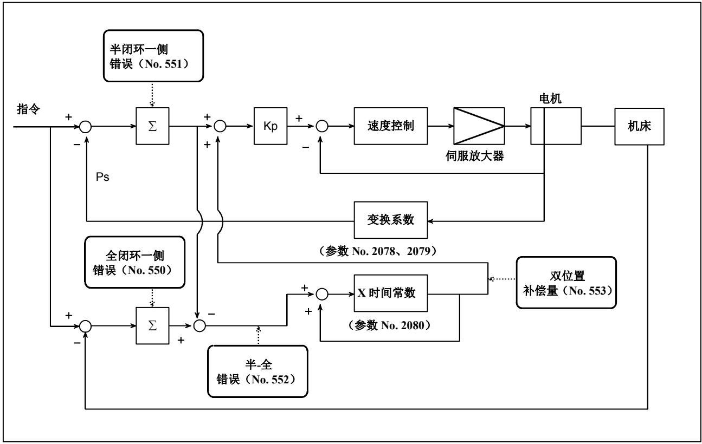

<details>
<summary>flowchart</summary>


```mermaid
graph TD
  A["指令"] --> B["+"]
  B --> C["Σ"]
  C --> D["+"]
  D --> E["Kp"]
  E --> F["+"]
  F --> G["速度控制"]
  G --> H["伺服放大器"]
  H --> I["电机"]
  I --> J["机床"]
  J --> K["半闭环一侧错误 (No. 551)"]
  K --> L["+"]
  L --> M["Σ"]
  M --> N["+"]
  N --> O["+"]
  O --> P["X时间常数 (参数 No. 2080)"]
  P --> Q["变换系数"]
  Q --> R["+"]
  R --> S["半-全错误 (No. 552)"]
  S --> T["+"]
  T --> U["Σ"]
  U --> V["+"]
  V --> W["+"]
  W --> X["全闭环一侧错误 (No. 550)"]
  X --> Y["+"]
  Y --> Z["+"]
  Z --> AA["+"]
  AA --> AB["+"]
  AB --> AC["半-全错误 (No. 552)"]
  AC --> AD["+"]
  AD --> AE["+"]
  AE --> AF["+"]
  AF --> AG["+"]
  AG --> AH["+"]
  AH --> AI["+"]
  AI --> AJ["+"]
  AJ --> AK["+"]
  AK --> AL["+"]
  AL --> AM["+"]
  AM --> AN["+"]
  AN --> AO["+"]
  AO --> AP["+"]
  AP --> AQ["+"]
  AQ --> AR["+"]
  AR --> AS["+"]
  AS --> AT["+"]
  AT --> AU["+"]
  AU --> AV["+"]
  AV --> AW["+"]
  AW --> AX["+"]
  AX --> AY["+"]
  AY --> AZ["+"]
  AZ --> BA["+"]
  BA --> BB["+"]
  BB --> BC["+"]
  BC --> BD["+"]
  BD --> BE["+"]
  BE --> BF["+"]
  BF --> BG["+"]
  BG --> BH["+"]
  BH --> BI["+"]
  BI --> BJ["+"]
  BJ --> BK["+"]
  BK --> BL["+"]
  BL --> BM["+"]
  BM --> BN["+"]
  BN --> BO["+"]
  BO --> BP["+"]
  BP --> BQ["+"]
  BQ --> BR["+"]
  BR --> BS["+"]
  BS --> BT["+"]
  BT --> BU["+"]
  BU --> BV["+"]
  BV --> BW["+"]
  BW --> BX["+"]
  BX --> BY["+"]
  BY --> BZ["+"]
```
</details>

## - 刀具位置补偿量的自动变更


### PMC报警: 诊断
- **故障内容**: 0560
- **处理办法**: 手动刀具补偿状态号


[数据类型] 字节型

[数据单位] 无

[数据范围] 0\~255

手动刀具补偿进行不完全动作时，以如下编号予以通知。

0: 手动刀具补偿已正常结束。  
1: T 代码指令的数据超出了允许范围。  
2: 偏置量的值在范围外。  
3: 刀偏号在范围外。  
4: CNC 在自动运行中或、轴移动中。  
5: CNC 处在刀尖 R 补偿方式中。  
6: CNC 方式处在非 JOG 或 HNDL（INC）或 REF 方式。  
7: CNC 的参数非法。

## - 高速 HRV 电流控制的状态


### PMC报警: 诊断
- **故障内容**: 700
- **处理办法**: #7

### PMC报警: 
- **故障内容**: 
- **处理办法**: 


[数据类型]

位轴型

显示高速 HRV 电流控制的状态。

#0 HON 以高速 HRV 电流控制方式控制电机。

#1 HOK 可以进行高速 HRV 电流控制时被设定为 1。

在满足下列条件下可以进行高速 HRV 电流控制。

- 参数 HR3（No.2013#0）被设定为 1  
- 使用适合于高速 HRV 电流控制的伺服软件、伺服模块以及伺服放大器。  
- 使用外置检测器 I/F 单元时，外置检测器 I/F 单元也使用适合于高速 HRV 电流控制的单元。

#2 DCLNK 在向诊断画面的电压信息的输出可以利用的情况下为 1。

## - 主轴的错误和警告状态


### PMC报警: 诊断
- **故障内容**: 710
- **处理办法**: 主轴的错误状态


[数据类型] 字主轴型

## 诊断

## 712

## 主轴的警告状态

[数据类型] 字主轴型

主轴放大器（SP）中发生错误（黄色 LED 点亮+有错误号显示）或者发生警告时，在诊断画面上显示该编号。

尚未发生错误和警告的情况下显示“0”。

有关主轴的错误，请参阅 FANUC SERVO MOTOR α i series 维修说明书（B-65285CM）。

有关警告，请参阅本说明书第9.1.4项“警告接口”。

## - OVC 级别

## 诊断

## 750

## OVC 级别

[数据类型] 字轴型

[数据单位] %

显示相对于软过热(OVC)的报警发生级别的比率。

## - DC LINK 电压信息

## 诊断

## 752

## DC LINK 电压信息

[数据类型] 字轴型

[数据单位] V

[数据范围] 0\~1023

显示 DC LINK 电压信息。

## - 伺服电机关联诊断数据

## 诊断

## 760

## R 相电流值

[数据类型] 字轴型

[数据单位] 6554 相当于放大器最大电流值

[数据范围] -6554～+6554

显示伺服电机的 R 相实际电流值。

## 诊断

## 761

## 有效电流值

[数据类型] 字轴型

[数据单位] 8027 相当于放大器最大电流值

[数据范围] -8027～+8027

显示伺服电机的有效电流值。

## 诊断

## 762

## 励磁相位

[数据类型] 字轴型

[数据单位] 256，相当于360度

[数据范围] 0\~255

显示伺服电机的励磁相位（电角）。

## - 无法启动的原因

## 诊断

## 1005


### PMC报警: #7
- **故障内容**: #6
- **处理办法**: #5

### PMC报警: 
- **故障内容**: 
- **处理办法**: 


[数据类型] 位型

显示无法启动的原因。

#0 JMD M,S,T,B 执行中，指令了手动数值指令的 M,S,T,B。

#2 OTH 处于自动运行无法开始的状态。（回退动作中等）

## 诊断

## 1006


### PMC报警: #7
- **故障内容**: #6
- **处理办法**: #5

### PMC报警: RVS
- **故障内容**: PTR
- **处理办法**: 


[数据类型] 位型

显示无法启动的原因。

#0 \*SP 自动运转暂停信号(\*SP)为"0"。

#1 ALM 已发出报警。

#2 SRN 程序再启动信号(SRN)为 “1”。

#4 NOP DNC 运行方式(RMT)下设备没有处在 Ready 状态。

#6 PTR 刀具回退信号(TRESC)已被设定为 “1”。

或者，尚未返回输入刀具回退信号时的位置。

#7 RVS 处于程序的反向运行无法进行的状态。

- 报警区分


### PMC报警: 
- **故障内容**: #7
- **处理办法**: #6

### PMC报警: 诊断
- **故障内容**: 1007
- **处理办法**: 

### PMC报警: #0
- **故障内容**: SW
- **处理办法**: 参数写入开关ON

### PMC报警: #1
- **故障内容**: SV
- **处理办法**: 伺服报警

### PMC报警: #2
- **故障内容**: OT
- **处理办法**: 与超程相关的报警

### PMC报警: #4
- **故障内容**: IO
- **处理办法**: 与存储器文件相关的报警

### PMC报警: #5
- **故障内容**: PW
- **处理办法**: 请求切断电源的报警

### PMC报警: 
- **故障内容**: #7
- **处理办法**: #6

### PMC报警: 诊断
- **故障内容**: 1008
- **处理办法**: 

### PMC报警: #0
- **故障内容**: PS
- **处理办法**: 与程序操作相关的报警

### PMC报警: #1
- **故障内容**: BG
- **处理办法**: 与后台编辑相关的报警

### PMC报警: #2
- **故障内容**: SR
- **处理办法**: 与通信相关的报警

### PMC报警: #3
- **故障内容**: MC
- **处理办法**: 宏报警

### PMC报警: #4
- **故障内容**: EX
- **处理办法**: 外部报警


- 复位 / 进给暂停状态


### PMC报警: 诊断
- **故障内容**: 1010
- **处理办法**: #7

### PMC报警: 
- **故障内容**: 
- **处理办法**: 

### PMC报警: #0
- **故障内容**: ESP
- **处理办法**: 急停中。

### PMC报警: #1
- **故障内容**: RRW
- **处理办法**: 复位&倒回信号为”1”。

### PMC报警: #2
- **故障内容**: ERS
- **处理办法**: 外部复位信号为”1”。

### PMC报警: #3
- **故障内容**: RST
- **处理办法**: 按下了复位键。


- 循环启动指示灯熄灭的原因


### PMC报警: 诊断
- **故障内容**: 1011
- **处理办法**: #7

### PMC报警: HLD
- **故障内容**: STP
- **处理办法**: MOD

### PMC报警: #0
- **故障内容**: ESP
- **处理办法**: 急停中。

### PMC报警: #1
- **故障内容**: RRW
- **处理办法**: 复位&倒回信号为”1”。

### PMC报警: #2
- **故障内容**: ERS
- **处理办法**: 外部复位信号为”1”。

### PMC报警: #3
- **故障内容**: RST
- **处理办法**: 按下了复位键。

### PMC报警: #4
- **故障内容**: ALM
- **处理办法**: 已发生报警。

### PMC报警: #5
- **故障内容**: MOD
- **处理办法**: 切换到了其他的方式。

### PMC报警: #6
- **故障内容**: STP
- **处理办法**: 单程序段停止。

### PMC报警: #7
- **故障内容**: HLD
- **处理办法**: 进给暂停中。


- Lock 时的原因


### PMC报警: 诊断
- **故障内容**: 1013
- **处理办法**: #7

### PMC报警: SMZ
- **故障内容**: 
- **处理办法**: 

### PMC报警: 诊断
- **故障内容**: 1014
- **处理办法**: #7

### PMC报警: FED
- **故障内容**: POL
- **处理办法**: EDC


[数据类型] 位型

显示 Lock 的原因。

#2 PST 基于参数改写的运动锁定。

#3 CS2 基于螺纹切削、刚性攻丝、主轴定位、EGB 的运动锁定。

#5 EDC 通过切削进给指令计算出的进给速度几乎为0。(外部减速有效时)

#6 POL 通过极坐标插补计算出了 1 以下的进给速度。

#7 FED 通过切削进给指令计算出的进给速度几乎为0。(倍率等)


### PMC报警: 诊断
- **故障内容**: 1015
- **处理办法**: #7

### PMC报警: 
- **故障内容**: 
- **处理办法**: 


[数据类型] 位型

显示 Lock 的原因。

#0 BCT 均衡切削等待中。

## - 自动数据备份


### PMC报警: 诊断
- **故障内容**: 1016
- **处理办法**: #7

### PMC报警: ANG
- **故障内容**: ACM
- **处理办法**: 


[数据类型] 位型

显示备份的执行状态。

#0 AEX 正在执行自动数据备份。

#1 DT1 在上次的备份中更新了数据 1。

#2 DT2 在上次的备份中更新了数据 2。

#3 DT3 在上次的备份中更新了数据 3。

#6 ACM 自动数据备份已执行完毕。

#7 ANG 自动数据备份中发生了错误。

## - 风扇的转速


### PMC报警: 诊断
- **故障内容**: 1002
- **处理办法**: FAN1 的转速


### PMC报警: 诊断
- **故障内容**: 1003
- **处理办法**: FAN2 的转速


[数据类型] 2 字型

[数据单位] 1/min

FAN1,FAN2

显示 CNC 控制部的 FAN 转速。

没有相应的 FAN 时，显示 0。

## - 用户宏程序 / 执行宏 / 辅助宏


### PMC报警: 诊断
- **故障内容**: 1493
- **处理办法**: 利用用户宏程序 / 执行宏执行的宏语句的程序段数


[数据类型] 2 字型

[数据单位] 程序段

表示利用用户宏程序 / 执行宏在每 1024ms 中执行的宏语句的程序段数。

成为宏语句的实际处理速度的大致标准。


### PMC报警: 诊断
- **故障内容**: 1494
- **处理办法**: 辅助宏执行的程序段数


[数据类型] 2 字型

[数据单位] 程序段

显示辅助宏每 1024ms 执行的程序段数。

成为辅助宏的实际处理速度的大致标准。

## - CNC 风扇


### PMC报警: 
- **故障内容**: #7
- **处理办法**: #6

### PMC报警: 诊断
- **故障内容**: 1495
- **处理办法**: NI2


[数据类型] 位型

#1 FAN 无 FAN2

#3\~#2 NI2\~NI1 需要更换 FAN2 的信息


### PMC报警: #3
- **故障内容**: #2
- **处理办法**: 状态

### PMC报警: 0
- **故障内容**: 0
- **处理办法**: 正常

### PMC报警: 0
- **故障内容**: 1
- **处理办法**: 需要更换 1(风扇速度下降)

### PMC报警: 1
- **故障内容**: 0
- **处理办法**: 需要更换 2(风扇黏着而启动时间长)

### PMC报警: 1
- **故障内容**: 1
- **处理办法**: 需要更换 1 且需要更换 2


#5 FAN 无 FAN1

#7\~#6 NI2\~NI1 需要更换 FAN1 的信息


### PMC报警: #7
- **故障内容**: #6
- **处理办法**: 状态

### PMC报警: 0
- **故障内容**: 0
- **处理办法**: 正常

### PMC报警: 0
- **故障内容**: 1
- **处理办法**: 需要更换 1(风扇速度下降)

### PMC报警: 1
- **故障内容**: 0
- **处理办法**: 需要更换 2(风扇黏着而启动时间长)

### PMC报警: 1
- **故障内容**: 1
- **处理办法**: 需要更换 1 且需要更换 2


诊断 1496


### PMC报警: #7
- **故障内容**: #6
- **处理办法**: #5

### PMC报警: NI2
- **故障内容**: NI1
- **处理办法**: FAN


[数据类型] 位型

#1 FAN 无 FAN4

#3\~#2 NI2\~NI1 需要更换 FAN4 的信息


### PMC报警: #3
- **故障内容**: #2
- **处理办法**: 状态

### PMC报警: 0
- **故障内容**: 0
- **处理办法**: 正常

### PMC报警: 0
- **故障内容**: 1
- **处理办法**: 需要更换 1(风扇速度下降)


#5 FAN 无 FAN3

#7\~#6 NI2\~NI1 需要更换 FAN3 的信息


### PMC报警: #7
- **故障内容**: #6
- **处理办法**: 状态

### PMC报警: 0
- **故障内容**: 0
- **处理办法**: 正常

### PMC报警: 0
- **故障内容**: 1
- **处理办法**: 需要更换 1(风扇速度下降)


## - 主轴相关

诊断

1520

主轴总转速1

诊断

1521

主轴总转速2

[数据类型] 2 字主轴型

[数据单位] 1000 转

[数据范围] 0\~999999999

计数主轴的转速，显示总转速。

诊断 1547

主轴电机的转速数据（2字）

[数据类型] 2 字主轴型

[数据单位] $min^{-1}$

参数 SSE(No.3791#0) 被设定为 1 时，在诊断数据(No.1547) 中显示主轴电机的转速。此时，诊断数据(No.411) 显示 0。

诊断 1570


### PMC报警: #7
- **故障内容**: #6
- **处理办法**: #5

### PMC报警: LNK
- **故障内容**: 
- **处理办法**: 


#0 S2W 主轴速度指令的分辨率，主轴最高转速/1048575 $[min^{-1}]$

#7 LNK 建立起了与主轴控制侧的通信。

## - 主轴放大器 / 伺服放大器间通信

诊断 1612

与各伺服轴同步的主轴的主轴编号

[数据类型]

字节轴型

显示 FSSB 连接中主轴放大器与伺服放大器间的直接通信可利用的主轴的主轴编号。

- 伺服绝缘劣化检测信息


### PMC报警: 
- **故障内容**: #7
- **处理办法**: #6

### PMC报警: 诊断
- **故障内容**: 1700
- **处理办法**: VPG


[数据类型] 位轴型

#0 ZUD 绝缘劣化检测功能有效下绝缘电阻值

0: 测量完成

1: 未测量

#1 ZND 是否对应绝缘劣化检测功能

0: 对应

1: 不对应

#2 ZMS 绝缘电阻值

0: 测量未完成

1: 测量完成（测量完成，从 0 变为 1，因急停而返回 0）

#3 INS 绝缘电阻下降

0: （绝缘电阻值在基准值以上）基准值为默认 10MΩ

1: 绝缘电阻值异常（绝缘电阻值在基准值以下）

#4 ZTR 绝缘电阻测定电路通信异常

0: 正常

1: 通信异常

#5 ZOF 绝缘电阻测定电路偏置过大

0: 正常

1: 偏置过大

#6 RLY 对地间继电器异常

0: 正常

1. 异常

#7 VPG VPG 偏置过大

0: 正常

1: 偏置过大

诊断 | 1701

绝缘电阻值数据

[数据类型] 实数型

[数据单位] MΩ

[数据范围] 0.0\~102.1

- 主轴绝缘劣化检测信息


### PMC报警: 诊断
- **故障内容**: 1702
- **处理办法**: #7

### PMC报警: VPG
- **故障内容**: RLY
- **处理办法**: ZOF


[数据类型] 位主轴型

#0 ZUD 绝缘劣化检测功能有效下绝缘电阻值

0: 测量完成

1: 未测量

#1 ZND 是否对应绝缘劣化检测功能

0: 对应

1: 不对应

#2 ZMS 绝缘电阻值

0: 测量未完成

1: 测量完成（测量完成，从 0 变为 1，因急停而返回 0）

#3 INS 绝缘电阻下降

0: （绝缘电阻值在基准值以上）基准值为默认 10MΩ

1: 绝缘电阻值异常（绝缘电阻值在基准值以下）

#4 ZTR 绝缘电阻测定电路通信异常

0: 正常

1: 通信异常

#5 ZOF 绝缘电阻测定电路偏置过大

0: 正常

1: 偏置过大

#6 RLY 对地间继电器异常

0: 正常

1. 异常

#7 VPG VPG 偏置过大

0: 正常

1: 偏置过大


### PMC报警: 诊断
- **故障内容**: 1703
- **处理办法**: 绝缘电阻值数据


[数据类型] 实数主轴型

[数据单位] MΩ

[数据范围] 0.0\~102.1

注释

绝缘劣化检测信息 1700\~1703 在急停 ON 时被检测，在急停 OFF 时保持所检测的数据。

## - 伺服放大器用内部冷却风扇


### PMC报警: 
- **故障内容**: #7
- **处理办法**: #6

### PMC报警: 诊断
- **故障内容**: 1710
- **处理办法**: AI2


[数据类型] 位轴型

#1 FAN 无伺服内部冷却风扇 2

#3 AI2 \~ #2 AI1 伺服内部冷却风扇 2 的需要更换信息


### PMC报警: #3
- **故障内容**: #2
- **处理办法**: 状态

### PMC报警: 0
- **故障内容**: 0
- **处理办法**: 正常

### PMC报警: 0
- **故障内容**: 1
- **处理办法**: 需要更换 1(风扇速度下降)


#5 FAN 无伺服内部冷却风扇 1

#7 AI2 \~ #6 AI1 伺服内部冷却风扇 1 的需要更换信息


### PMC报警: #7
- **故障内容**: #6
- **处理办法**: 状态

### PMC报警: 0
- **故障内容**: 0
- **处理办法**: 正常

### PMC报警: 0
- **故障内容**: 1
- **处理办法**: 需要更换 1(风扇速度下降)


## - 伺服放大器用散热器冷却风扇


### PMC报警: 诊断
- **故障内容**: #7
- **处理办法**: #6

### PMC报警: AR2
- **故障内容**: AR1
- **处理办法**: FAN


[数据类型] 位轴型

#1 FAN 无伺服散热器冷却风扇 2

#3 AR2 \~ #2 AR1 伺服服散热器冷却风扇 2 的需要更换信息


### PMC报警: #3
- **故障内容**: #2
- **处理办法**: 状态

### PMC报警: 0
- **故障内容**: 0
- **处理办法**: 正常

### PMC报警: 0
- **故障内容**: 1
- **处理办法**: 需要更换 1(风扇速度下降)


#5 FAN 无伺服散热器冷却风扇 1

#7 AR2 \~ #6 AR1 伺服服散热器冷却风扇 1 的需要更换信息


### PMC报警: #7
- **故障内容**: #6
- **处理办法**: 状态

### PMC报警: 0
- **故障内容**: 0
- **处理办法**: 正常

### PMC报警: 0
- **故障内容**: 1
- **处理办法**: 需要更换 1(风扇速度下降)


## - 共同电源用内部冷却风扇


### PMC报警: 诊断
- **故障内容**: 1716
- **处理办法**: #7

### PMC报警: PI2
- **故障内容**: PI1
- **处理办法**: FAN


[数据类型] 位轴型

#1 FAN 无共同电源内部冷却风扇 2

#3 PI2 \~ #2 PI1 共同电源内部冷却风扇 2 的需要更换信息


### PMC报警: #3
- **故障内容**: #2
- **处理办法**: 状态

### PMC报警: 0
- **故障内容**: 0
- **处理办法**: 正常

### PMC报警: 0
- **故障内容**: 1
- **处理办法**: 需要更换 1(风扇速度下降)


#5 FAN 无共同电源内部冷却风扇 1

#7 PI2 \~ #6 PI1 共同电源内部冷却风扇 1 的需要更换信息


### PMC报警: #7
- **故障内容**: #6
- **处理办法**: 状态

### PMC报警: 0
- **故障内容**: 0
- **处理办法**: 正常

### PMC报警: 0
- **故障内容**: 1
- **处理办法**: 需要更换 1(风扇速度下降)


## - 共同电源用散热器冷却风扇


### PMC报警: 诊断
- **故障内容**: 1719
- **处理办法**: #7

### PMC报警: PR2
- **故障内容**: PR1
- **处理办法**: FAN


[数据类型] 位轴型

#1 FAN 无共同电源散热器冷却风扇 2

#3 PR2 \~ #2 PR1 共同电源散热器冷却风扇 2 的需要更换信息


### PMC报警: #3
- **故障内容**: #2
- **处理办法**: 状态

### PMC报警: 0
- **故障内容**: 0
- **处理办法**: 正常

### PMC报警: 0
- **故障内容**: 1
- **处理办法**: 需要更换 1(风扇速度下降)


#5 FAN 无共同电源散热器冷却风扇 1

#7 PR2 \~ #6 PR1 共同电源散热器冷却风扇 1 的需要更换信息


### PMC报警: #7
- **故障内容**: #6
- **处理办法**: 状态

### PMC报警: 0
- **故障内容**: 0
- **处理办法**: 正常

### PMC报警: 0
- **故障内容**: 1
- **处理办法**: 需要更换 1(风扇速度下降)


## - 主轴放大器用内部冷却风扇


### PMC报警: 诊断
- **故障内容**: #7
- **处理办法**: #6

### PMC报警: AI2
- **故障内容**: AI1
- **处理办法**: FAN


[数据类型] 位主轴型

#1 FAN 无主轴内部冷却风扇 2

#3 AI2 \~ #2 AI1 主轴内部冷却风扇 2 的需要更换信息


### PMC报警: #3
- **故障内容**: #2
- **处理办法**: 状态

### PMC报警: 0
- **故障内容**: 0
- **处理办法**: 正常

### PMC报警: 0
- **故障内容**: 1
- **处理办法**: 需要更换 1(风扇速度下降)


#5 FAN 无主轴内部冷却风扇 1

#7 AI2 \~ #6 AI1 主轴内部冷却风扇 1 的需要更换信息


### PMC报警: #7
- **故障内容**: #6
- **处理办法**: 状态

### PMC报警: 0
- **故障内容**: 0
- **处理办法**: 正常

### PMC报警: 0
- **故障内容**: 1
- **处理办法**: 需要更换 1(风扇速度下降)


## - 主轴放大器用散热器冷却风扇


### PMC报警: 诊断
- **故障内容**: #7
- **处理办法**: #6

### PMC报警: AR2
- **故障内容**: AR1
- **处理办法**: FAN


[数据类型] 位主轴型

#1 FAN 无主轴散热器冷却风扇 2

#3 AR2 \~ #2 AR1 主轴散热器冷却风扇 2 的需要更换信息


### PMC报警: #3
- **故障内容**: #2
- **处理办法**: 状态

### PMC报警: 0
- **故障内容**: 0
- **处理办法**: 正常

### PMC报警: 0
- **故障内容**: 1
- **处理办法**: 需要更换 1(风扇速度下降)


#5 FAN 无主轴散热器冷却风扇 1

#7 AR2 \~ #6 AR1 主轴散热器冷却风扇 1 的需要更换信息


### PMC报警: #7
- **故障内容**: #6
- **处理办法**: 状态

### PMC报警: 0
- **故障内容**: 0
- **处理办法**: 正常

### PMC报警: 0
- **故障内容**: 1
- **处理办法**: 需要更换 1(风扇速度下降)


## - 共同电源用内部冷却风扇


### PMC报警: 诊断
- **故障内容**: 1728
- **处理办法**: #7

### PMC报警: PI2
- **故障内容**: PI1
- **处理办法**: FAN


[数据类型] 位主轴型

#1 FAN 无共同电源内部冷却风扇 2

#3 PI2 \~ #2 PI1 共同电源内部冷却风扇 2 的需要更换信息


### PMC报警: #3
- **故障内容**: #2
- **处理办法**: 状态

### PMC报警: 0
- **故障内容**: 0
- **处理办法**: 正常

### PMC报警: 0
- **故障内容**: 1
- **处理办法**: 需要更换 1(风扇速度下降)


#5 FAN 无共同电源内部冷却风扇 1

#7 PI2 \~ #6 PI1 共同电源内部冷却风扇 1 的需要更换信息


### PMC报警: #7
- **故障内容**: #6
- **处理办法**: 状态

### PMC报警: 0
- **故障内容**: 0
- **处理办法**: 正常

### PMC报警: 0
- **故障内容**: 1
- **处理办法**: 需要更换 1(风扇速度下降)


## - 共同电源用散热器冷却风扇


### PMC报警: 诊断
- **故障内容**: 1731
- **处理办法**: #7

### PMC报警: PR2
- **故障内容**: PR1
- **处理办法**: FAN


[数据类型] 位主轴型

#1 FAN 无共同电源散热器冷却风扇 2

#3 PR2 \~ #2 PR1 共同电源散热器冷却风扇 2 的需要更换信息


### PMC报警: #3
- **故障内容**: #2
- **处理办法**: 状态

### PMC报警: 0
- **故障内容**: 0
- **处理办法**: 正常

### PMC报警: 0
- **故障内容**: 1
- **处理办法**: 需要更换 1(风扇速度下降)


#5 FAN 无共同电源散热器冷却风扇 1

#7 PR2 \~ #6 PR1 共同电源散热器冷却风扇 1 的需要更换信息


### PMC报警: #7
- **故障内容**: #6
- **处理办法**: 状态

### PMC报警: 0
- **故障内容**: 0
- **处理办法**: 正常

### PMC报警: 0
- **故障内容**: 1
- **处理办法**: 需要更换 1(风扇速度下降)


## - 检测器的电池 Low 关联参数


### PMC报警: 诊断
- **故障内容**: 3019
- **处理办法**: #7

### PMC报警: 
- **故障内容**: 
- **处理办法**: EXP


[数据类型] 位轴型

发生了检测器的电池 Low 报警的情况下，可以确认发生原因。

#3 ABP A/B 相的电池 Low

#4 INP 串行脉冲编码器(内置位置监测器)的电池 Low

#5 EXP 串行方式外置位置检测器的电池 Low

## - 进给轴同步控制关联诊断数据


### PMC报警: 诊断
- **故障内容**: 3500
- **处理办法**: 同步误差量


[数据类型] 2 字轴型

[数据单位] 检测单位

[数据范围] -99999999～+99999999

显示主控轴和从控轴的位置之差（同步误差量）。此数据显示在从控轴上。


### PMC报警: 诊断
- **故障内容**: 3501
- **处理办法**: 同步误差补偿量


[数据类型] 2 字轴型

[数据单位] 检测单位

[数据范围] -99999999～+99999999

在从控轴上显示所输出的补偿脉冲的累积值（同步误差补偿量）。此数据显示在从控轴上。

- 同步/混合控制关联诊断数据


### PMC报警: 诊断
- **故障内容**: 3502
- **处理办法**: 每个轴同步误差量的显示

### PMC报警: [数据类型]
- **故障内容**: 2字轴型
- **处理办法**: 

### PMC报警: [数据单位]
- **故障内容**: 检测单位
- **处理办法**: 


- 进给轴同步控制相关 2


- FSSB 设定非法报警的详细内容


### PMC报警: 诊断
- **故障内容**: 3510
- **处理办法**: FSSB 报警号


[数据类型] 字型

输出 FSSB 相关的报警发生时的发生部位(参数)以及用来确定发生原因的信息。有关与所显示的详细编号对应的原因和对策，请参阅下表。显示多个 FSSB 报警号时，请从 FSSB 报警号小的报警开始采取对策。


### PMC报警: 报警详细编号
- **故障内容**: 参数号
- **处理办法**: 原因

### PMC报警: 120451452
- **故障内容**: -
- **处理办法**: FSSB的内部状态未成为OPEN状态。

### PMC报警: 140450
- **故障内容**: 24000~24095
- **处理办法**: ATR值的设定与所连接的从控装置(伺服、主轴、位置检测器)不同。

### PMC报警: 271
- **故障内容**: 371724000~24095
- **处理办法**: 尚未设定与ATR值的设定对应的主轴放大器号。

### PMC报警: 272
- **故障内容**: 24000~2403124064~24095
- **处理办法**: 第一FSSB线路(第三FSSB线路)中进行了第5~8台位置检测器的设定。

### PMC报警: 273
- **故障内容**: 24032~24063
- **处理办法**: 在第二FSSB线路中设定了第1~4(9~12)台位置检测器。

### PMC报警: 276
- **故障内容**: 24000~24095
- **处理办法**: 位置检测器的设定重复。

### PMC报警: 290
- **故障内容**: 24000~24095
- **处理办法**: 在伺服HRV2控制的FSSB线路中,超过了每一FSSB线路的最大从控装置数。

### PMC报警: 291
- **故障内容**: 24000~24095
- **处理办法**: 在伺服HRV3控制的FSSB线路中,超过了每一FSSB线路的最大从控装置数。

### PMC报警: 310
- **故障内容**: 102324104~24199
- **处理办法**: 与位置检测器的ATR值设定对应的伺服轴号,尚未通过参数No.1023设定。

### PMC报警: 313
- **故障内容**: 102314476#524104~24199
- **处理办法**: 与位置检测器的ATR值设定对应的伺服轴号,尚未通过参数No.1023设定。

### PMC报警: 314
- **故障内容**: 102314476#524104~24199
- **处理办法**: 位置检测器的ATR值设定非法。

### PMC报警: 383
- **故障内容**: -
- **处理办法**: 使用位置检测器时,无法进行手动设定1。

### PMC报警: 453
- **故障内容**: —
- **处理办法**: 伺服的初始化没有正常结束。

### PMC报警: 454
- **故障内容**: —
- **处理办法**: 发生了诊断的 No.3511 的报警号 550~556 的其中一个。

### PMC报警: 460
- **故障内容**: 24000~24095
- **处理办法**: 已对尚未连接的从控装置设定了主轴或者位置检测器的 ATR 值。

### PMC报警: 471
- **故障内容**: 24000~24095
- **处理办法**: 虽然连接有位置检测器,但是尚未进行位置检测器的设定。

### PMC报警: 480
- **故障内容**: 24000~24095
- **处理办法**: ATR 值的设定中,是伺服轴号超过 80 的设定。


诊断 | 3511

FSSB 报警号

[数据类型]

字轴型

输出 FSSB 相关的报警发生时的发生部位(参数)以及用来确定发生原因的信息。有关与所显示的详细编号对应的原因和对策，请参阅下表。显示多个 FSSB 报警号时，请从 FSSB 报警号小的报警开始采取对策。


### PMC报警: 报警详细编号
- **故障内容**: 参数号
- **处理办法**: 原因

### PMC报警: 210
- **故障内容**: 24096~24103
- **处理办法**: 在尚未连接位置检测器的状态下,在参数No.24096~24103中设定了值。

### PMC报警: 220
- **故障内容**: 1023
- **处理办法**: 设定了无法使用的伺服轴号。

### PMC报警: 221
- **故障内容**: 1023
- **处理办法**: 伺服轴号重复。

### PMC报警: 250
- **故障内容**: 24096~24103
- **处理办法**: 对于特定的伺服轴,使用2台以上位置检测器,其组合是第1,3,5,7台或者第2,4,6,8台的组合。

### PMC报警: 270
- **故障内容**: 102324000~24095
- **处理办法**: ·与ATR值的设定对应的伺服轴号,尚未通过参数No.1023设定。·设定了无法使用的伺服轴号。·伺服轴号重复。

### PMC报警: 292
- **故障内容**: 10232013#0
- **处理办法**: 无法在伺服HRV3控制的FSSB线路中使用如下伺服轴号以外的号码。(1+8n,2+8n,3+8n,4+8n (n=0,1,...,9))

### PMC报警: 311
- **故障内容**: 24096~24103
- **处理办法**: 连接器号非法。

### PMC报警: 314
- **故障内容**: 24096~24103
- **处理办法**: 连接器号的设定重复。

### PMC报警: 350
- **故障内容**: 2013#02014#0
- **处理办法**: 各FSSB线路的电流控制周期(HRV)不同。

### PMC报警: 360
- **故障内容**: 10232013#02014#0
- **处理办法**: 第一、第二FSSB线路的电流控制周期(HRV)不同,No.1023设定非法。

### PMC报警: 370
- **故障内容**: 1902#01902#12013#02014#0
- **处理办法**: 设定了伺服HRV3控制时,无法进行手动设定1。

### PMC报警: 380
- **故障内容**: 1023
- **处理办法**: 跳开伺服轴号进行设定时,无法进行手动设定1。

### PMC报警: 382
- **故障内容**: 1023
- **处理办法**: 虽然超过了每一FSSB线路的最大控制轴数,但是试图进行手动设定1。

### PMC报警: 470
- **故障内容**: 24000~24095
- **处理办法**: ATR值的设定重复。

### PMC报警: 481
- **故障内容**: 102324000~24095
- **处理办法**: 伺服轴号与ATR值的设定不一致,或者尚未连接伺服轴号的伺服电机。

### PMC报警: 520
- **故障内容**: 2165
- **处理办法**: 接通电源时,在读出放大器的ID信息中失败。

### PMC报警: 550
- **故障内容**: 102324000~24095
- **处理办法**: ATR值的设定与伺服轴号的设定不一致。

### PMC报警: 551
- **故障内容**: 24000~24095
- **处理办法**: ATR值的设定超过了CNC上连接的从控装置数。

### PMC报警: 552
- **故障内容**: 1023
- **处理办法**: 设定了无法使用的伺服轴号。

### PMC报警: 553
- **故障内容**: 1023
- **处理办法**: 伺服轴号重复。

### PMC报警: 554
- **故障内容**: 24096~24103
- **处理办法**: 虽然尚未连接了位置检测器,但是在No.24096~24103中输入了值。

### PMC报警: 555557558
- **故障内容**: 2165
- **处理办法**: 放大器最大电流值(No.2165)与电机的最大电流值不同。

### PMC报警: 1023
- **故障内容**: 1023
- **处理办法**: 伺服轴号的设定非法。


诊断 3513

FSSB 报警号

[数据类型]

字主轴型

输出 FSSB 相关的报警发生时的发生部位(参数)以及用来确定发生原因的信息。有关与所显示的详细编号对应的原因和对策，请参阅下表。显示多个 FSSB 报警号时，请从 FSSB 报警号小的报警开始采取对策。


### PMC报警: 报警详细编号
- **故障内容**: 参数号
- **处理办法**: 原因

### PMC报警: 271
- **故障内容**: 371724000~24095
- **处理办法**: ATR值的设定重复。

### PMC报警: 381
- **故障内容**: 3717
- **处理办法**: 跳开主轴放大器号进行设定时,无法进行手动设定 1。


## - 绝对位置检测

诊断 | 3520

绝对位置检测的原点设定信息

[数据类型]

字节轴型

[数据单位]

无单位

[数据范围]

$0\sim 3$

绝对位置检测的原点设定

0: 一次没有进行。

1: 通过手动参考点返回而被执行。

2: 通过 MDI 操作而被执行。

3: 通过参数文件的输入而被执行。

## - 附带绝对地址参照标记的直线尺关联诊断数据

诊断 3545

附带绝对地址参照标记的直线尺 测量点1

诊断 3546

附带绝对地址参照标记的直线尺 测量点2

诊断 3547

附带绝对地址参照标记的直线尺 测量点3

诊断 3548

附带绝对地址参照标记的直线尺 测量点 4

[数据类型] 2 字轴型

[数据单位] 检测单位

[数据范围] -999999999 \~ 999999999

诊断

3549

附带绝对地址参照标记的直线尺 状态显示

诊断

3550

附带绝对地址参照标记的直线尺 标度值

[数据类型] 2 字轴型

[数据单位] 检测单位

[数据范围] -999999999 \~ 999999999

诊断

3551

附带绝对地址参照标记的直线尺 标度值(High)

[数据类型] 2 字轴型

[数据单位] 检测单位

[数据范围] -999 \~ 999

附带绝对地址参照标记的直线尺 标度值

= 诊断 No.3551 × 1,000,000,000 + 诊断 No.3550

## - 误操作防止功能


### PMC报警: 
- **故障内容**: #7
- **处理办法**: #6

### PMC报警: 诊断
- **故障内容**: 3570
- **处理办法**: 


[数据类型] 位路径型

#0 MSC 存储器运行在中途的程序段启动的再确认中停止了。

多路径系统的情况下，只有在程序的中途光标所在的路径成为"1"。

## - 任意轴切换信息

诊断

4000

任意轴切换报警原因号码

显示任意轴切换指令时的报警的原因。

- 1 路径内的轴数为0  
- 2 路径内的轴数超过最大值  
- 3 敞开指令中没有 ID 指令  
- 4 敞开指令中 ID 指令重复  
- 5 路径内没有敞开指令 P 的对象轴，或者指令轴已敞开  
- 6 路径内没有敞开指令 Q 的对象轴，或者指令轴已敞开  
- 7 路径内没有敞开指令 R 的对象轴，或者指令轴已敞开  
- 8 敞开指令的路径内没有对象轴，或者指令轴已敞开  
- 9 敞开指令中没有轴指令，或者有 ID 指令  
- 10 任意轴切换 ID 设定不正确  
- 11 取得指令中没有 ID 指令  
- 12 取得指令中 ID 指令重复  
- 13 取得指令中轴排列指定重复  
- 14 取得指令中路径内没有对象轴或者没有 ID 设定  
- 15 取得指令中路径内轴排列非法  
- 16 敞开等待轴的所属路径为本路径  
- 18 敞开等待轴的所属路径为指令路径和交换指令  
- 19 取得轴尚未敞开(No.11561#1=1)  
- 20 取得指令中轴在其它路径中为敞开等待轴  
- 21 取得指令中轴尚未敞开  
- 22 取得指令中没有轴指令，或者有 ID 指令  
- 24 交换指令中轴存在于同一路径内  
- 25 交换指令中没有 ID 指令  
- 26 交换指令中 ID 指令重复  
• 27 3 路径以上的系统中没有交换指令的 L  
- 28 交换指令中在路径内不存在对象轴(交换源)  
- 29 对于交换指令的指令轴，其它指令在执行中或者已在敞开中  
- 30 交换指令在路径内不存在对象轴(交换目的地)  
- 32 交换指令中没有对象轴  
· 33 交换指令有矛盾  
- 34 交换指令中没有轴指令，或者有 ID 指令  
• 35 其它周期中

- 36 在SV旋转控制方式中指令  
· 37 在多边形加工方式中指令  
- 38 在 PMC 轴控制中指令  
• 39 在高精度振荡动作中指令  
- 40 在镜像中指令  
- 41 在三维坐标变换中指令  
- 42 在坐标旋转中指令  
- 43 在比例缩放中指令  
• 44 在进给轴同步中指令  
- 45 对于敞开中的轴有指令  
- 46 对于混合控制中的轴有指令  
- 47 对于同步控制中的轴有指令  
- 48 对于重叠控制中的轴有指令  
- 55 同时有移动指令  
- 56 在刀具补偿中指令

诊断 4001

## 任意轴切换轴的所属路径

显示任意轴切换轴的各轴的所属路径。(显示参数 No.981 的路径)

0 : 所属于本路径

1～10：通过取得和交换，所属于其它路径

-1～-10：敞开中

## - 相对自动运行偏移值

诊断 4100

基于手动运行或者PMC轴控制的干预量

诊断 4101

手轮中断值

诊断 4102

G92 偏置量（G 代码体系 A 下为 G50）

诊断 4103

G52 偏置量

诊断 4104

机床锁住中移动的量

诊断 4107

镜像中移动的量

[数据类型] 实数轴型

## - 任意速度螺纹切削相关

诊断 4300

CNC 计算出的伺服的位置偏差

[数据类型] 2 字路径型

[数据单位] 检测单位

为计算出螺纹切削开始位置的补偿量而显示 CNC 计算出的伺服的位置偏差。

与诊断数据(No.300)的值（进给轴的位置偏差）进行比较，通过参数(No.11492)进行调整，使得成为相同的值。

诊断 4301

CNC 计算出的主轴的位置偏差

[数据类型] 2 字路径型

[数据单位] 检测单位

为计算出螺纹切削开始位置的补偿量而显示 CNC 计算出的主轴的位置偏差。

与诊断数据(No.418)的值（主轴的位置偏差）进行比较，通过参数(No.11493)进行调整，使得成为相同的值。

## - 通信相关

诊断 4400


### PMC报警: #7
- **故障内容**: #6
- **处理办法**: #5

### PMC报警: 
- **故障内容**: 
- **处理办法**: 


[数据类型] 位型

通知通信功能组合非法报警(SR2038)发生时的非法硬件信息。

#2 BD1 快速以太网板(Slot1)

#3 BD2 快速以太网板(Slot2)

## 诊断 | 4401

[数据类型]

[数据单位]

[数据范围]

## 注释

尚未发生通信功能组合非法报警(SR2038)时为 0。

## 通信功能组合非法报警的详细

字节型

无

0\~7

通知通信功能组合非法报警(SR2038)发生时的非法理由。

0: 通信功能的组合没有问题。

1: 快速以太网板的安装数超出允许范围。
能够安装的快速以太网板最多为 3 块

2: 诊断数据(No.4400)所通知的快速以太网板不存在。请确认参数(No.970\~976)中指定的快速以太网板。

3：诊断数据(No.4400)所通知的快速以太网板中，尚未指定要动作的功能。虽然快速以太网板存在，但是尚未通过参数(No.970\~976)来指定。不使用时，请在参数(No.970\~976)中指定”-1”。

4: 诊断数据(No.4400)所通知的快速以太网板中，数据服务器功能、FL-net 功能、EtherNet/IP 功能、以及 PROFINET 功能中，被同时指定了两个以上的通信功能。数据服务器功能、FL-net 功能、EtherNet/IP 功能、以及 PROFINET 功能属于互斥功能，因而为使得这些通信功能在各自的快速以太网板上动作，请指定参数(No.970\~976)。

5: 诊断数据(No.4400)所通知的快速以太网板中，所需的通信功能的软件选项无效。已在参数(No.970)指定与参数(No.971, 973)相同的快速以太网板。或者，在参数(No.970)中指定了快速以太网板，且在参数(No.975)中指定了“10”, “20”, 或者“30”。

6: 诊断数据(No.4400)所通知的快速以太网板中，所需的通信功能的软件选项无效。

7: 尚未安装必要的软件。

## - 现在全部伺服/主轴合计的实际消耗电力

## 诊断 4900

[数据类型]

[数据单位]

2 字型

W

## 现在全部轴合计的实际消耗电力

## 注释

实际消耗电力 $=$ 消耗电力一再生电力。再生电力超过消耗电力时，成为负值。

## - 现在各伺服的实际消耗电力

## 诊断 | 4901

[数据类型]

[数据单位]

2 字轴型

W

## 现在各伺服的实际消耗电力

## 注释

在轴的减速中等电力的再生中，成为负值。

## - 现在各主轴的实际消耗电力

## 诊断 | 4902

[数据类型]

[数据单位]

2 字主轴型

W

## 注释

在轴的减速中等电力的再生中，成为负值。

## 现在各主轴的实际消耗电力

## - 全部伺服/主轴合计的消耗电力累计值


### PMC报警: 诊断
- **故障内容**: 4910
- **处理办法**: 全轴合计的实际消耗电力累计值

### PMC报警: 诊断
- **故障内容**: 4911
- **处理办法**: 全轴合计的消耗电力累计值

### PMC报警: 诊断
- **故障内容**: 4912
- **处理办法**: 全轴合计的再生电力累计值


## - 各伺服的消耗电力累计值


### PMC报警: 诊断
- **故障内容**: 4920
- **处理办法**: 各伺服的实际消耗电力累计值

### PMC报警: 诊断
- **故障内容**: 4921
- **处理办法**: 各伺服的消耗电力累计值

### PMC报警: 诊断
- **故障内容**: 4922
- **处理办法**: 各伺服的再生电力累计值


## - 各主轴的消耗电力累计值


### PMC报警: 诊断
- **故障内容**: 4930
- **处理办法**: 各主轴的实际消耗电力累计值

### PMC报警: 诊断
- **故障内容**: 4931
- **处理办法**: 各主轴的消耗电力累计值

### PMC报警: 诊断
- **故障内容**: 4932
- **处理办法**: 各主轴的再生电力累计值


## - 插补的状态


## 柔性同步自动相位对合关联诊断数据


### PMC报警: 诊断
- **故障内容**: 5600
- **处理办法**: 自动相位对合的误差量（群组A）

### PMC报警: 诊断
- **故障内容**: 5601
- **处理办法**: 自动相位对合的误差量（群组B）

### PMC报警: 诊断
- **故障内容**: 5602
- **处理办法**: 自动相位对合的误差量（群组C）


## 诊断 5603

## 自动相位对合的误差量（群组D）

[数据类型] 实数路径型

[数据单位] mm, inch, 度（机床单位）

显示柔性同步控制的自动相位对合执行后的主控轴和从控轴的误差量。

路径间柔性同步控制中，在从控轴的路径显示。

## 诊断 5604

## 自动相位对合的误差量的最大值（群组A）

## 诊断 | 5605

## 自动相位对合的误差量的最大值（群组 B）

## 诊断 5606

## 自动相位对合的误差量的最大值（群组C）

## 诊断 5607

## 自动相位对合的误差量的最大值（群组D）

[数据类型] 实数路径型

[数据单位] mm, inch, 度（机床单位）

显示柔性同步控制的自动相位对合执行后的主控轴和从控轴的误差量的最大值。

路径间柔性同步控制中，在从控轴的路径显示。

自动运行时，在开始自动运行时被初始化。

手动运行时，在开始柔性同步控制时被初始化。

## 1.4 CNC状态显示

- 显示内容和含义  
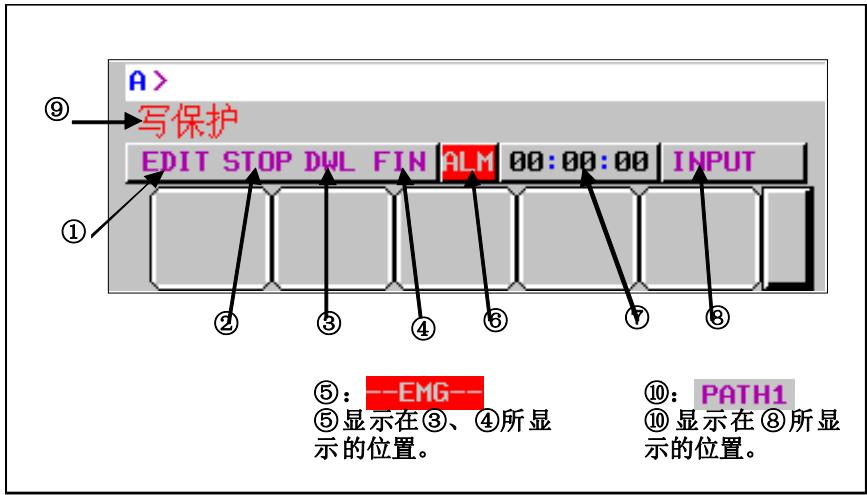

<details>
<summary>text_image</summary>

A >
⑨ 写保护
EDIT STOP DWL FIN ALM 00:00:00 INPUT
①
② ③ ④ ⑥ ⑦ ⑧
⑤：——EMG——
⑤显示在③、④所显示的位置。
⑩：PATH1
⑩显示在⑧所显示的位置。
</details>

图 1.4 (a) 状态显示的位置

①当前的方式


### PMC报警: MDI
- **故障内容**: :
- **处理办法**: 手动数据输入、MDI运行

### PMC报警: MEM
- **故障内容**: :
- **处理办法**: 自动运行(存储器运行)

### PMC报警: RMT
- **故障内容**: :
- **处理办法**: 自动运行(DNC运行)

### PMC报警: EDIT
- **故障内容**: :
- **处理办法**: 存储器编辑

### PMC报警: HND
- **故障内容**: :
- **处理办法**: 手动手轮进给

### PMC报警: JOG
- **故障内容**: :
- **处理办法**: JOG进给

### PMC报警: INC
- **故障内容**: :
- **处理办法**: 手动增量进给

### PMC报警: REF
- **故障内容**: :
- **处理办法**: 手动返回参考点


②自动运行状态


### PMC报警: ****
- **故障内容**: :
- **处理办法**: 复位状态(接通电源或终止程序的执行,自动运行完全结束的状态)

### PMC报警: STOP
- **故障内容**: :
- **处理办法**: 自动运行停止状态(结束一个程序段的执行并停止自动运行的状态)

### PMC报警: HOLD
- **故障内容**: :
- **处理办法**: 自动运行暂停状态(中断一个程序段的执行并停止自动运行的状态)

### PMC报警: STRT
- **故障内容**: :
- **处理办法**: 自动运行启动状态(系统实际上正在执行自动运行的状态)

### PMC报警: MSTR
- **故障内容**: :
- **处理办法**: 手动数值指令启动状态(正在执行手动数值指令的状态)或者刀具回退和返回启动状态(正在执行返回动作以及定位动作的状态)


## ③轴移动中状态、暂停状态


### PMC报警: MTN
- **故障内容**: :
- **处理办法**: 表示轴在移动之中。

### PMC报警: DWL
- **故障内容**: :
- **处理办法**: 表示处在暂停状态。

### PMC报警: ***
- **故障内容**: :
- **处理办法**: 表示非上述状态。


## ④正在执行辅助功能的状态


### PMC报警: FIN
- **故障内容**: :
- **处理办法**: 表示正在执行辅助功能的状态。(等待来自PMC的完成信号)

### PMC报警: ***
- **故障内容**: :
- **处理办法**: 表示其他的状态。


## ⑤急停状态或复位状态


### PMC报警: --EMG--
- **故障内容**: :
- **处理办法**: 表示处在急停状态。(反相闪烁显示)

### PMC报警: -RESET-
- **故障内容**: :
- **处理办法**: 表示正在接收复位信号的状态。


## ⑥报警状态


### PMC报警: ALM
- **故障内容**: :
- **处理办法**: 表示已发出报警的状态。(反相闪烁显示)

### PMC报警: BAT
- **故障内容**: :
- **处理办法**: 表示锂电池(CNC的后备用电池)的电压下降。(反相闪烁显示)

### PMC报警: APC
- **故障内容**: :
- **处理办法**: 表示绝对脉冲编码器的后备用电池的电压下降。(反相闪烁显示)

### PMC报警: FAN
- **故障内容**: :
- **处理办法**: 表示FAN转速下降。(反相闪烁显示)确认风扇监视画面,有关检测出转速下降的风扇电机,请实施更换。

### PMC报警: LKG
- **故障内容**: :
- **处理办法**: 表示检测出了绝缘劣化。(反相闪烁显示)确认绝缘劣化监视器画面,进行检测出了绝缘劣化之轴的检查。

### PMC报警: PMC
- **故障内容**: :
- **处理办法**: 表示PMC报警发生中的状态。(反相闪烁显示)

### PMC报警: 空格
- **故障内容**: :
- **处理办法**: 表示其他的状态。


## ⑦当前时间

hh: mm: ss - 小时：分：秒

## ⑧程序编辑状态


### PMC报警: INPUT
- **故障内容**: :
- **处理办法**: 表示正在输入数据的状态。

### PMC报警: OUTPUT
- **故障内容**: :
- **处理办法**: 表示正在输出数据的状态。

### PMC报警: SEARCH
- **故障内容**: :
- **处理办法**: 表示正在进行搜索的状态。

### PMC报警: EDIT
- **故障内容**: :
- **处理办法**: 表示正在进行其他编辑操作的状态(插入、修改等)。

### PMC报警: RSTR
- **故障内容**: :
- **处理办法**: 表示程序再启动的状态。

### PMC报警: COMPARE
- **故障内容**: :
- **处理办法**: 表示正在核对数据的状态。

### PMC报警: OFST
- **故障内容**: :
- **处理办法**: 表示处在刀具长度补偿值测量方式中(加工中心系统)或者刀具长度补偿值写入方式中(车床系统)的状态。

### PMC报警: WOFS
- **故障内容**: :
- **处理办法**: 表示处在工件原点补偿值测量方式中的状态。

### PMC报警: AICC1
- **故障内容**: :
- **处理办法**: 表示处在AI轮廓控制I方式下的运行中状态。(参数(No.3241~3247))

### PMC报警: AICC2
- **故障内容**: :
- **处理办法**: 表示处在AI轮廓控制II方式下的运行中状态。(参数(No.3251~3257))

### PMC报警: AI APC
- **故障内容**: :
- **处理办法**: 表示处在AI先行控制方式下的运行中状态。(只限于M系列系统,参数(No.3241~3247))

### PMC报警: MEM-CHK
- **故障内容**: :
- **处理办法**: 表示处在程序存储器检查中的状态。

### PMC报警: WSFT
- **故障内容**: :
- **处理办法**: 表示处在工件位移量写入方式中的状态。

### PMC报警: TWP
- **故障内容**: :
- **处理办法**: 表示处在倾斜面分度指令方式下的运行中状态。

### PMC报警: 空白
- **故障内容**: :
- **处理办法**: 表示尚未进行编辑操作的状态。


## ⑨数据设定或输入 / 输出的报警显示

在试图设定数据时，键入的数据有误（错误格式、超出设定范围的数值等）时，以及处在不能输入的状态（错误方式、禁止写入等）时，会显示出相应于该原因的报警信息。另外，RS232-C 的通信端口在使用中的情况下，显示 “无法使用输入输出设备”。

在这种情况下，CNC 不接受该设定和输入/输出操作。

（请根据报警信息，解除原因，再次进行设定或输入 / 输出操作。）

例 1)

输入参数时

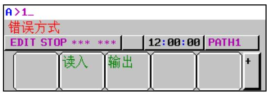

<details>
<summary>text_image</summary>

A>1_
错误方式
EDIT STOP *** ***
12:00:00 PATH1
读入 输出 +
</details>

例 2)

输入参数时

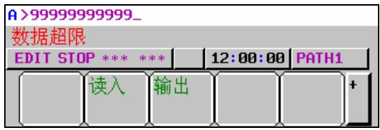

<details>
<summary>text_image</summary>

A >99999999999_
数据超限
EDIT STOP *** ***
12:00:00 PATH1
读入 输出 +
</details>

例 3)

试图将参数输出到外部输入 / 输出设备时

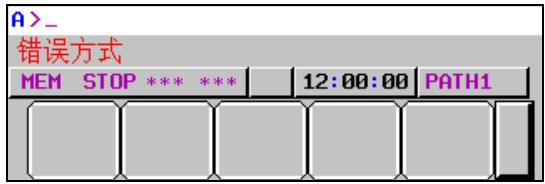

<details>
<summary>text_image</summary>

A >_
错误方式
MEM STOP *** ***
12:00:00 PATH1
</details>

## ⑩路径名称

显示出表示状态的路径号。

PATH1 : 表示所显示的状态为路径 1 的状态。

还可用其他名称，这要取决于参数（No.3141～3147）的设定。路径名称的显示位置与⑧相同。在编辑程序的过程中，显示⑧。

## 1.5 操作监控显示

可以显示出伺服轴的负载表以及串联主轴的负载表以及速度表。

## 1.5.1 显示方法

(1) 将显示操作监控画面的参数 OPM (No.3111#5) 设定为 1。  
(2) 按下功能键 POS，选择位置显示画面。  
(3) 按继续菜单键 ▶，显示出软键 [监控]。  
(4) 按下 [监控] 键，显示出操作监控画面。

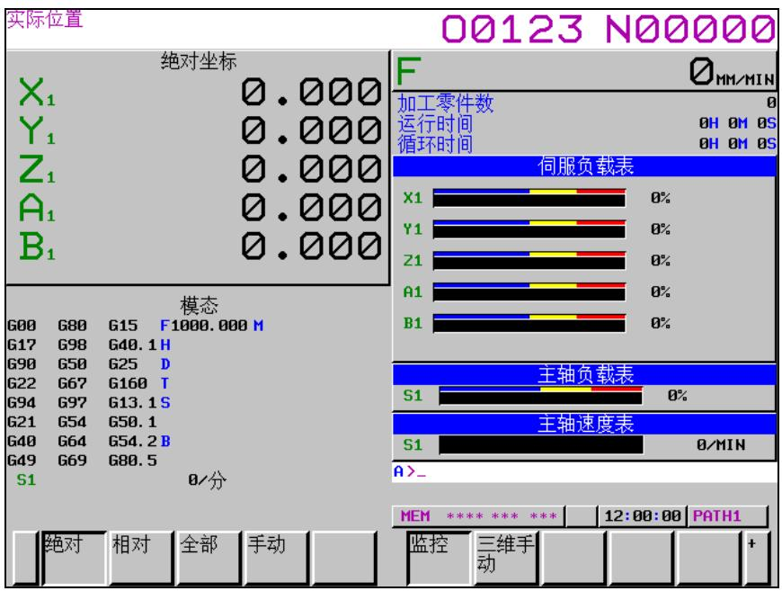

<details>
<summary>text_image</summary>

实际位置
00123 N00000
绝对坐标
X₁ 0.000
Y₁ 0.000
Z₁ 0.000
A₁ 0.000
B₁ 0.000
模态
G00 G80 G15 F1000.000 M
G17 G98 G40.1 H
G90 G50 G25 D
G22 G67 G160 T
G94 G97 G13.1 S
G21 G54 G50.1
G40 G64 G54.2 B
G49 G69 G80.5
S1 0/分
F
MM/MIN
加工零件数 0
运行时间 0H 0M 0S
循环时间 0H 0M 0S
伺服负载表
X1 0%
Y1 0%
Z1 0%
A1 0%
B1 0%
主轴负载表
S1 0%
主轴速度表
S1 0/MIN
A >_
MEM **** **** *** 12:00:00 PATH1
绝对 相对 全部 手动 监控 三维手 动 +
</details>

## 注意

1 负载表的图形最多可以显示 200% 的载荷。  
2 速度表的图形显示出将主轴的最高转速设为 $100\%$ 时的当前的转速比率。  
速度表显示电机速度，但是若将参数(OPSNo.3111#6)设定为1时，速度表还可以显示主轴速度。  
3 将要显示的伺服轴号的选择，被设定在参数(No.3151～3153)中。参数(No.3151～3153)均为0时，显示基本轴的负载表。  
4 高精度主轴速度控制有效的情况下，显示小数点以下四舍五入后的值。

## 1.5.2 参数


### PMC报警: 
- **故障内容**: #7
- **处理办法**: #6

### PMC报警: 3111
- **故障内容**: 
- **处理办法**: OPS


[数据类型] 位型

#5 OPM 是否进行操作监控显示

0: 不进行。

1: 进行。

#6 OPS 操作监控画面的速度表上

0: 显示出主轴电机速度。

1: 显示出主轴速度。

## 1.6 波形诊断显示

波形诊断显示功能对伺服位置偏差值、转矩值和机床信号等各类数据值进行跟踪，并将所跟踪数据的变化以波形方式显示。由此简化了伺服电机、主轴电机的调整和发生故障时不良部位的推测作业。

波形诊断显示可以跟踪下列数据。

(1) 伺服关联数据

- 位置偏差值  
- 分配后的脉冲值  
- 转矩值（实际电流）  
- 加/减速后的脉冲值  
- 电流指令值

- 热模拟数据  
- 所有轴的合成速度

## (2) 主轴关联数据

- 各主轴的速度  
- 负载表值  
- 刚性攻丝的主轴换算位置偏差之差

## (3) 机床信号

\- 由信号地址指定的外部输入/输出信号的 ON/OFF 状态

可同时跟踪的数据，伺服关联数据和主轴关联数据不超过4个，信号不超过32个。

可根据下列 3 个条件进行跟踪。

(1) 在任意的时机获取数据  
(2) 获取所指定事件刚刚发生后的数据  
(3) 获取所指定事件刚刚发生前的数据

此外，在(3)的情况下，可使跟踪的结束时间仅迟延所指定时间。由此，即可获取事件发生前后的数据。

可以将所跟踪的数据输出到外部输入/输出设备。

## 1.6.1 波形诊断图形画面

## 显示

1. 按下功能键


2. 按下软键 [波形诊断]，显示如下所示的画面。  
3. 按下软键 [(操作)]，显示如下所示的软键。

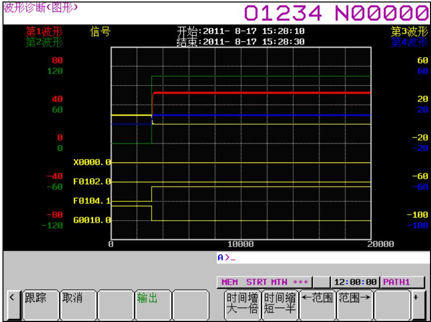

<details>
<summary>line chart</summary>

| Time (s) | Signal Value |
|----------|--------------|
| 0        | 0            |
| 5000     | 60           |
| 10000    | 60           |
| 15000    | 60           |
| 20000    | 60           |
| 25000    | 60           |
| 30000    | 60           |
| 35000    | 60           |
| 40000    | 60           |
| 45000    | 60           |
| 50000    | 60           |
| 55000    | 60           |
| 60000    | 60           |
| 65000    | 60           |
| 70000    | 60           |
| 75000    | 60           |
| 80000    | 60           |
| 85000    | 60           |
| 90000    | 60           |
| 95000    | 60           |
| 100000   | 60           |
| 150000   | -20          |
| 200000   | -20          |
| 250000   | -20          |
| 300000   | -20          |
| 350000   | -20          |
| 400000   | -20          |
| 450000   | -20          |
| 500000   | -20          |
| 550000   | -20          |
| 600000   | -20          |
| 650000   | -20          |
| 700000   | -20          |
| 750000   | -20          |
| 800000   | -20          |
| 850000   | -20          |
| 900000   | -20          |
| 950000   | -20          |
| 100000   | -20          |
| 15000    | -18          |
| 217      | -18          |
| 287      | -18          |
| 337      | -18          |
| 387      | -18          |
| 437      | -18          |
| 487      | -18          |
| 537      | -18          |
| 587      | -18          |
| 637      | -18          |
| 687      | -18          |
| 737      | -18          |
| 787      | -18          |
| 837      | -18          |
| 887      | -18          |
| 937      | -18          |
| 987      | -18          |
| 147      | -18          |
| 197      | -18          |
| 247      | -18          |
| 317      | -18          |
| 387      | -18          |
| 447      | -18          |
| 517      | -18          |
| 587      | -18          |
| 647      | -18          |
| 717      | -18          |
| 777      | -18          |
| 837      | -18          |
| 917      | -18          |
| 987      | -18          |
| 147      | -18          |
| 217      | -18          |
| 287      | -18          |
| 337      | -18          |
| 397      | -18          |
| 457      | -18          |
| 527      | -18          |
| 597      | -18          |
| 657      | -18          |
| 727      | -18          |
| 797      | -18          |
| 857      | -18          |
| 927      | -18          |
| 997      | -18          |
| 147      | -18          |
| 217      | -18          |
| 287      | -18          |
| 337      | -18          |
| 397      | -18          |
| 457      | -18          |
| 527      | -18          |
| 597      | < 时间增大一倍, 时间缩短一半, 范围范围: >, +
</details>

## - 伺服和主轴关联数据

以所指定的各种颜色描绘波形，在左上部显示第 1/第 2 波形号和颜色，在右上部显示第 3/第 4 波形号和颜色。

## - 输入/输出信号

层叠显示伺服和主轴关联数据的波形时，在画面下半部分最多描绘 4 个波形。

在这种情况下，每个波形的信号地址显示在左侧的第2列。

仅显示信号时，在整个画面上最多可描绘9个波形。

每个波形的信号地址显示在左侧的第 1 列。

## 1.6.2 波形诊断参数画面

## 显示

1. 按下功能键 SYSTEM。

2. 按下软键 [波形诊断]。

3. 按下软键 [参数] 时，显示波形诊断参数画面。

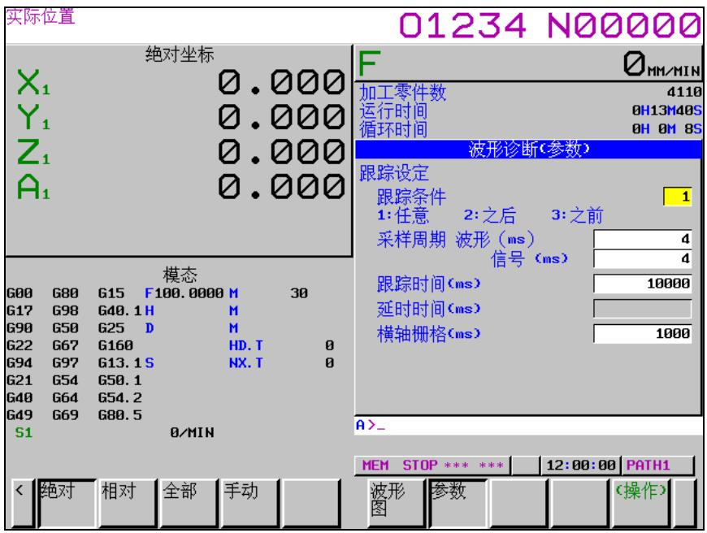

<details>
<summary>text_image</summary>

实际位置
01234 N00000
绝对坐标
X₁ 0.000
Y₁ 0.000
Z₁ 0.000
A₁ 0.000
F
MM/MIN
加工零件数 4110
运行时间 0H13M40S
循环时间 0H 0M 8S
波形诊断(参数)
跟踪设定
跟踪条件 1
1:任意 2:之后 3:之前
采样周期 波形(ms) 4
信号(ms) 4
跟踪时间(ms) 10000
延时时间(ms)
横轴栅格(ms) 1000
模态
G00 G80 G15 F100.0000 M 30
G17 G98 G40.1 H M
G90 G50 G25 D M
G22 G67 G160 HD.T 0
G94 G97 G13.1 S NX.T 0
G21 G54 G50.1
G40 G64 G54.2
G49 G69 G80.5
S1 0/MIN
A>
MEM STOP *** 12:00:00 PATH1
< 绝对 相对 全部 手动
波形 参数 (操作)
</details>

## 编辑

1. 按照 “显示” 的步骤显示画面。

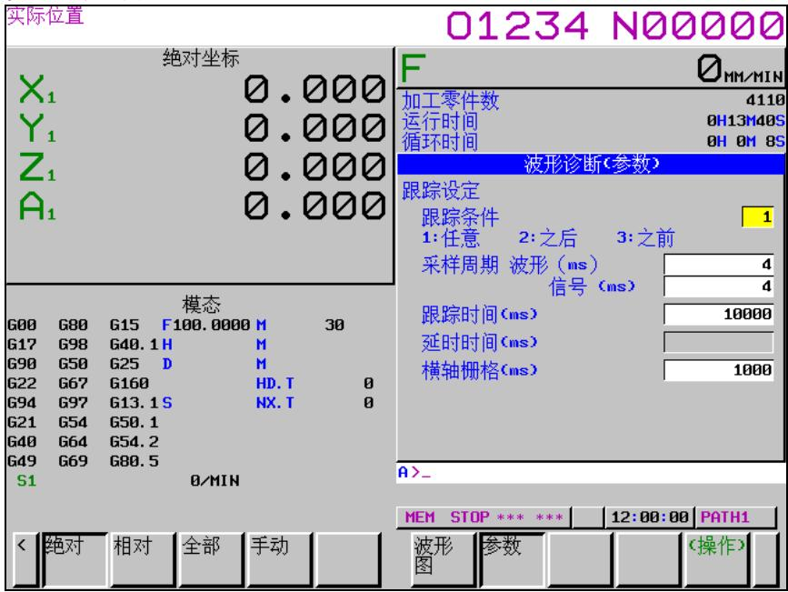

<details>
<summary>text_image</summary>

实际位置
01234 N00000
绝对坐标
X₁ 0.000
Y₁ 0.000
Z₁ 0.000
A₁ 0.000
F
MM/MIN
加工零件数 4110
运行时间 0H13M40S
循环时间 0H 0M 8S
波形诊断(参数)
跟踪设定
跟踪条件 1
1:任意 2:之后 3:之前
采样周期 波形(ms) 4
信号(ms) 4
跟踪时间(ms) 10000
延时时间(ms)
横轴栅格(ms) 1000
模态
G00 G80 G15 F100.0000 M 30
G17 G98 G40.1 H M
G90 G50 G25 D M
G22 G67 G160 HD.T 0
G94 G97 G13.1 S NX.T 0
G21 G54 G50.1
G40 G64 G54.2
G49 G69 G80.5
S1 0/MIN
A >_
MEM STOP *** *** 12:00:00 PATH1
< 绝对 相对 全部 手动
波形 参数 (操作)
</details>

2. 通过光标键 ↑ ↓ 移动画面上的光标。

3. 按下数值键，设定 MDI 键 [INPUT] 或者软键 [输入] 值。

4. 按下操作软键 [(操作)]，显示下列操作软键。


<details>
<summary>text_image</summary>

输入
说明 +
</details>

按下 [ + ]，出现下列软键。


<details>
<summary>text_image</summary>

跟踪
波形
信号
+
</details>

按下 [跟踪]，显示波形诊断参数画面的跟踪设定画面。

按下 [波形]，显示波形诊断参数画面的波形设定画面。

按下 [信号]，显示波形诊断参数画面的信号设定画面。

## 跟踪设定

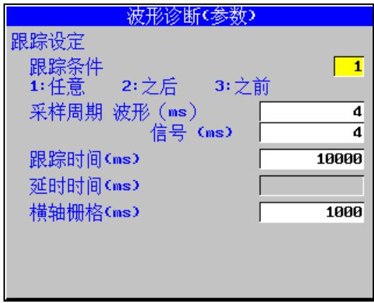

<details>
<summary>text_image</summary>

波形诊断(参数)
跟踪设定
跟踪条件
1: 任意 2: 之后 3: 之前
采样周期 波形(ms) 4
信号(ms) 4
跟踪时间(ms) 10000
延时时间(ms)
横轴栅格(ms) 1000
</details>

## - 跟踪条件

根据开始/结束跟踪的条件，可以选择下列 3 个跟踪条件。

## 类型 1（1:任意）

仅在刚刚按下软键 [跟踪] 之后所指定时间内跟踪数据。

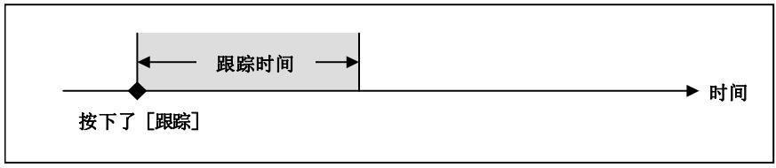

<details>
<summary>text_image</summary>

跟踪时间
按下了 [跟踪]
时间
</details>

## 类型 2（2: 之后）

仅在按下软键 [跟踪] 后刚刚发生所指定触发事件后的指定时间内跟踪数据。

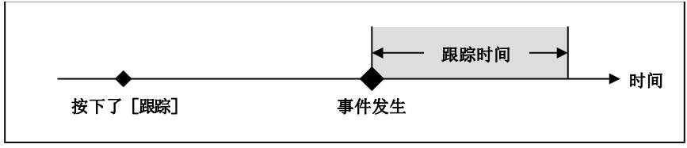

<details>
<summary>flowchart</summary>

```mermaid
graph LR
  A["按下了 [跟踪"]] --> B["事件发生"]
  B --> C["跟踪时间"]
  C --> D["时间"]
```
</details>

## 类型 3（3:之前）

仅在按下软键 [跟踪] 后刚刚发生所指定触发事件前的指定时间内跟踪数据。

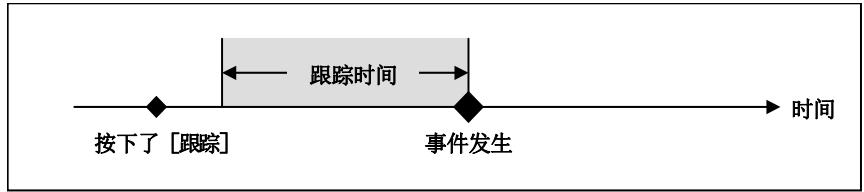

<details>
<summary>flowchart</summary>

```mermaid
graph LR
  A["按下了 [跟踪"]] --> B["事件发生"]
  B --> C["时间"]
  D["跟踪时间"] --> B
```
</details>


## - 采样周期

对波形、信号分别按照如下方式设定采样周期。


## - 跟踪时间

设定跟踪数据的时间。

跟踪时间就波形和信号指定进行跟踪的时间。跟踪时间不够时，请延长采样周期，或者减少测量项目。

可以跟踪的数据量约为 32700 个，每个通道的采样周期使用一个跟踪数据。不管同时测量的信号数是多少，在有信号测量的情况下，使用一个通道。

在采样周期 4msec 下进行波形的一个通道的跟踪时，可以跟踪 130 秒。

在采样周期 4096msec 下进行波形的一个通道的跟踪时，可以跟踪 37 个小时。

设定范围：2～133939200

单位：msec

基于采样周期和通道数的最大跟踪时间例


### PMC报警: 周期\通道数
- **故障内容**: 1ch
- **处理办法**: 4ch +信号

### PMC报警: 2msec
- **故障内容**: 65 秒
- **处理办法**: 13 秒

### PMC报警: 4msec
- **故障内容**: 130 秒
- **处理办法**: 26 秒

### PMC报警: 8msec
- **故障内容**: 261 秒
- **处理办法**: 52 秒

### PMC报警: 4096msec
- **故障内容**: 37 小时 12 分
- **处理办法**: 7 小时 26 分


## - 延时时间

跟踪条件为类型 3 时，可以仅在事件发生后所指定的时间内使跟踪的结束时间推迟。

设定范围：0～65528（8msec 单位）

单位：msec

## 注释

输入的数值不是 8msec 单位的情况下，以 8msec 单位取整。

## - 横轴栅格

设定横轴的每一个刻度值。

设定范围：1～100000000

单位：msec

## 触发设定

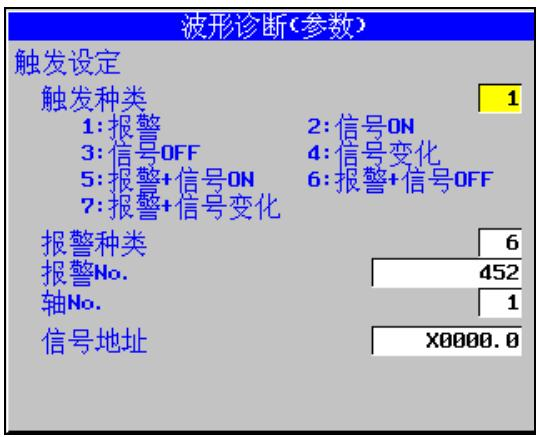

<details>
<summary>text_image</summary>

波形诊断(参数)
触发设定
触发种类
1:报警	2:信号ON
3:信号OFF	4:信号变化
5:报警+信号ON	6:报警+信号OFF
7:报警+信号变化
报警种类	6
报警No.	452
轴No.	1
信号地址	X0000.0
</details>

## - 触发种类

在波形诊断参数画面的跟踪设定的跟踪条件中，作为触发器指定事件发生的情况下（在跟踪条件中指定 2:之后 或 3:之前），设定触发器的种类。

跟踪条件为 2：之后时，发生所设定的触发器事件时，开始跟踪。跟踪条件为 3：之前时，由于触发器事件的发生而结束跟踪。


## - 报警种类

在触发种类中作为触发器而指定了报警发生时（触发种类别的设定值为 1、5、6 或 7），按照下表设定触发器的报警种类。不限定报警种类时，请将报警中信号 AL 设定为触发器。


## - 报警 No.

在报警种类中指定了 6:SV 报警、或者 9:SP 报警的情况下，以 1～9999 的整数输入成为对象的报警号。

以所有的报警号作为对象时，设定“-1”。

## - 轴 No.

在报警种类中指定了 6:SV 报警、或者 9:SP 报警的情况下，以轴号输入成为对象的报警轴。

以所有轴作为报警对象时，设定“-1”。

## 注释

多路径控制的情况下，以绝对轴号来指定轴号。不是路径内的相对轴号。

## · 信号地址

在触发器类别中作为触发器指定了信号时（触发种类的设定值为 2、3、4、5、6 或者 7），输入触发器的信号地址。在多路径 PMC 中，通过配合路径号予以指定，设定指定 PMC 路径的地址。

例：2:F0001.1

如上例所示，输入 “PMC 路径号” + “:” + “地址” 即可设定。此外，只有一个路径的标准 PMC 中，不必指定路径号。

## 注释

1 有关 PMC 路径号，请参阅 PMC Programming Manual (B-64513EN)（PMC 编程说明书）的“Multi-Path PMC Function”（多路径 PMC 功能）项。  
2 没有“:”键的键盘，可以用“;”或“/”键来代替“:”。

## 跟踪波形设定


<details>
<summary>text_image</summary>

波形诊断(参数)
跟踪波形设定
第1波形
跟踪数据种类
轴No.
纵轴刻度单位
颜色
第2波形
跟踪数据种类
轴No.
纵轴刻度单位
颜色
</details>

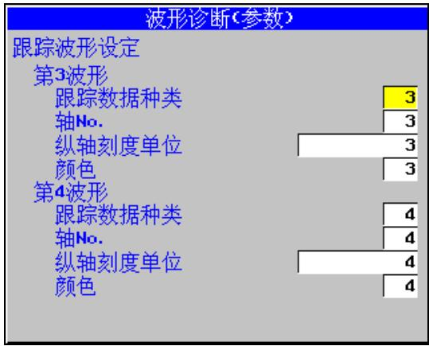

<details>
<summary>text_image</summary>

波形诊断(参数)
跟踪波形设定
第3波形
跟踪数据种类	3
轴No.	3
纵轴刻度单位	3
颜色	3
第4波形
跟踪数据种类	4
轴No.	4
纵轴刻度单位	4
颜色	4
</details>

## - 跟踪数据种类

按照如下方式设定将要跟踪的数据种类号。


### PMC报警: 设定值
- **故障内容**: 种类
- **处理办法**: 单位

### PMC报警: 0
- **故障内容**: (不跟踪)
- **处理办法**: 

### PMC报警: 1
- **故障内容**: 伺服的位置偏差值
- **处理办法**: Pulse(检测单位)

### PMC报警: 2
- **故障内容**: 分配后的伺服脉冲值
- **处理办法**: Pulse(检测单位)

### PMC报警: 3
- **故障内容**: 伺服的转矩值(实际电流)
- **处理办法**: %

### PMC报警: 4
- **故障内容**: 加/减速后的伺服脉冲值
- **处理办法**: Pulse(检测单位)

### PMC报警: 5
- **故障内容**: 伺服的实际速度
- **处理办法**: $min^{-1}$

### PMC报警: 6
- **故障内容**: 伺服的电流指令值
- **处理办法**: %

### PMC报警: 7
- **故障内容**: 伺服的热模拟数据
- **处理办法**: %

### PMC报警: 8
- **故障内容**: 所有轴的合成速度
- **处理办法**: mm/min 或者 RPM

### PMC报警: 9
- **故障内容**: 主轴的速度
- **处理办法**: $min^{-1}$

### PMC报警: 10
- **故障内容**: 主轴的负载表
- **处理办法**: %

### PMC报警: 11
- **故障内容**: 刚性攻丝的主轴换算位置偏差之差
- **处理办法**: Pulse(检测单位)


## 注释

伺服的转矩值（实际电流）和电流指令值为相对于参数(No.2086)（额定电流值）的百分比。

## - 轴 No. / 路径号

根据数据的种类，按照如下方式指定将要跟踪的轴号 / 路径号。


注释

多路径控制的情况下，以绝对轴号来指定轴号。不是路径内的相对轴号。

## - 纵轴刻度单位

设定横轴每一刻度的值。此设定对伺服关联数据和主轴关联数据有效。

设定范围：1～100000000

## - 颜色

按照如下方式设定波形的描绘颜色号。

编号表示相互关联的的系统颜色。


## 信号设定

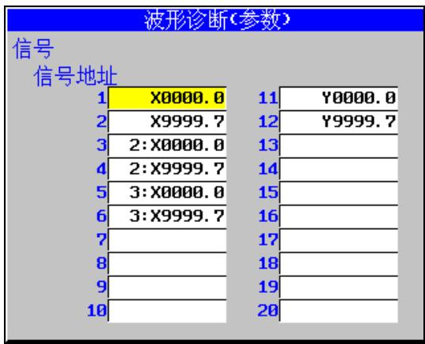

<details>
<summary>text_image</summary>

波形诊断(参数)
信号
信号地址
1	X0000.0	11	Y0000.0
2	X9999.7	12	Y9999.7
3	2:X0000.0	13
4	2:X9999.7	14
5	3:X0000.0	15
6	3:X9999.7	16
7		17
8		18
9		19
10		20
</details>

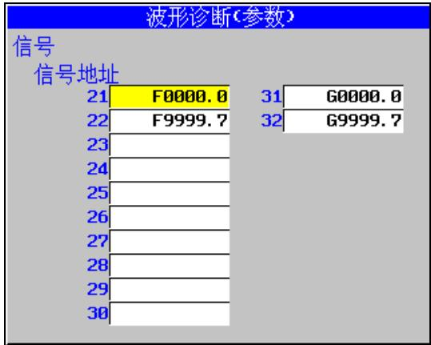

<details>
<summary>text_image</summary>

波形诊断(参数)
信号
信号地址
21 F0000.0 31 G0000.0
22 F9999.7 32 G9999.7
23 
24 
25 
26 
27 
28 
29 
30
</details>

## · 信号地址

跟踪输入/输出信号的 ON/OFF 状态时，设定该信号的地址。

在多路径 PMC 中，通过配合路径号予以指定，设定指定 PMC 路径的地址。

例：2:F0001.1

如上例所示，输入 “PMC 路径号” + “:” + “地址” 即可设定。此外，只有一个路径的标准 PMC 中，不必致定路径号。

## 注释

1 有关 PMC 路径号，请参阅 PMC Programming Manual (B-64513EN)（PMC 编程说明书）的“Multi-Path PMC Function”（多路径 PMC 功能）项。  
2 没有“:”键的键盘，可以用“;”或“/”键来代替“:”。  
3 对于信号数据来说，只要在地址 1～32 输入一个信号地址，即作为一个通道处理。  
4 不进行数据跟踪时，输入 “0”。  
5 最大同时测量数为 32。

## 选择项目向导

## - 报警种类

1. 光标处在触发设定、报警种类上时，按下软键[(操作)]，出现软键[说明]。


<details>
<summary>text_image</summary>

输入
说明 +
</details>

2. 按下软键 [说明]，出现报警种类列表。


### PMC报警: 报警种类
- **故障内容**: 
- **处理办法**: 

### PMC报警: 1: PW
- **故障内容**: 报警
- **处理办法**: 2: IO

### PMC报警: 3: PS
- **故障内容**: 报警
- **处理办法**: 4: OT

### PMC报警: 5: OH
- **故障内容**: 报警
- **处理办法**: 6: SV

### PMC报警: 7: SR
- **故障内容**: 报警
- **处理办法**: 8: MC

### PMC报警: 9: SP
- **故障内容**: 报警
- **处理办法**: 10: DS

### PMC报警: 11: IE
- **故障内容**: 报警
- **处理办法**: 12: BG

### PMC报警: 13: SN
- **故障内容**: 报警
- **处理办法**: 14: EX

### PMC报警: 15: PC
- **故障内容**: 报警
- **处理办法**: 


## - 跟踪数据种类

1. 光标处在跟踪波形设定、跟踪数据种类上时，按下软键[(操作)]，出现软键[说明]。  
2. 按下软键 [说明]，出现跟踪数据种类列表。

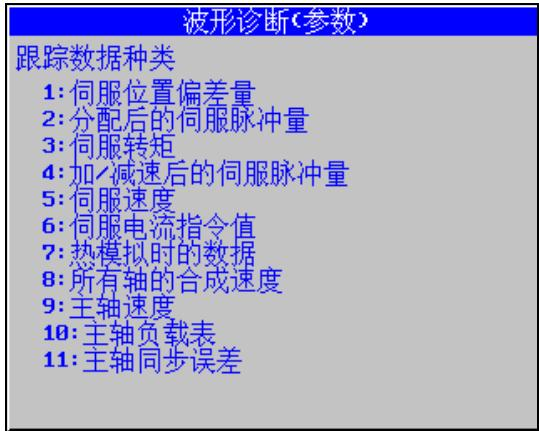

<details>
<summary>text_image</summary>

波形诊断(参数)
跟踪数据种类
1: 伺服位置偏差量
2: 分配后的伺服脉冲量
3: 伺服转矩
4: 加/减速后的伺服脉冲量
5: 伺服速度
6: 同服电流指令值
7: 热模拟时的数据
8: 所有轴的合成速度
9: 王轴速度
10: 主轴负载表
11: 主轴同步误差
</details>

## - 颜色

1. 光标处在跟踪波形设定、颜色上时，按下软键[(操作)]，出现软键[说明]。  
2. 按下软键 [说明]，出现颜色列表。


<details>
<summary>text_image</summary>

波形诊断(参数)
颜色
0 :
1 :
2 :
3 :
4 :
5 :
6 :
7 :
</details>

## 1.6.3 跟踪数据

## 开始跟踪

1 显示波形诊断图形画面  
2 按下软键 [跟踪]，开始跟踪。

画面上部显示出 “Now Sampling…” （目前正在采样）。跟踪结束时，“Now Sampling…” 显示消失。在数据跟踪中即使切换到其他画面，跟踪仍将继续进行。

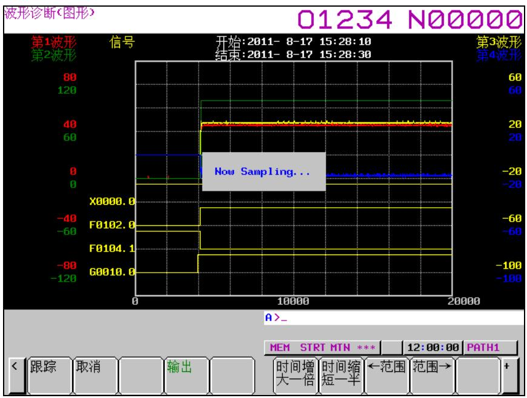

<details>
<summary>line chart</summary>

| Time   | Signal Value |
|--------|--------------|
| 0      | 0            |
| 10000  | 40           |
| 20000  | 40           |
| 30000  | 40           |
| 40000  | 40           |
| 50000  | 40           |
| 60000  | 40           |
| 70000  | 40           |
| 80000  | 40           |
| 90000  | 40           |
| 100000 | 40           |
| 110000 | 40           |
| 120000 | 40           |
| 130000 | 40           |
| 140000 | 40           |
| 150000 | 40           |
| 160000 | 40           |
| 170000 | 40           |
| 180000 | 40           |
| 190000 | 40           |
| 200000 | 40           |
</details>

## 取消跟踪

在跟踪执行过程中按下软键 [取消]，取消跟踪。

## 移动 / 放大 / 缩小波形


<details>
<summary>text_image</summary>

时间增
大一倍
时间缩
短一半
←范围
范围→
+
</details>

按下 [时间增大一倍]、[时间缩短一半]，1 个画面的时间轴长度分别被放大或缩小。波形不能完全显示在 1 个画面上，按下 [←范围]、[范围→] 来移动时间轴。


<details>
<summary>text_image</summary>

< 通道1 通道2 通道3 通道4
</details>

按下 [通道 1] [通道 2] [通道 3] [通道 4] 时，还可以显示出辅助菜单。

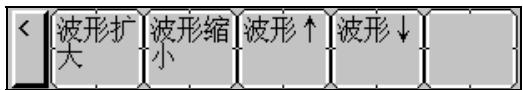

<details>
<summary>text_image</summary>

<波形扩大 波形缩小 波形↑ 波形↓
</details>

按下［波形扩大］［波形缩小］，1个画面的时间轴长度分别被放大或缩小。同时自动改变参数的横轴刻度单位值。改变刻度时，按照1,2,5,10,20,50,100...这样的方式进行。
按下［波形↑］［波形↓］，可以上下移动伺服和主轴关联的各波形。

## 显示信号数据


<details>
<summary>text_image</summary>

信号↑ 信号↓ +
</details>

最多可同时测量 32 个信号，但是显示仅为信号时不超过 9 个，与波形重叠时，可同时显示出 4 个。按下 [信号↑] [信号↓]，切换目前所显示信号的显示。

注释

信号数据不能移动。

## 1.6.4 输出数据

可以将波形诊断数据输出到 I/O 设备。

## 指定格式

可以选择并输出两种格式：FS16i/0i-C 兼容格式（下称 “0i-C 兼容格式”）和 FS30i/0i-D/F 格式（下称 “0i-F 格式”）。参数 IOF(No.10600#0)=0 时，选定 0i-F 格式；参数 IOF(No.10600#0)=1 时，选定 0i-C 兼容格式。

## 输出格式

已经跟踪的数据以下列所示格式的文本文件输入/输出。

- 标识符列表


## (1) 首标

0i-F 格式


<details>
<summary>text_image</summary>

T 1 C W A V E D I A G N O S ;
</details>

0i-C 兼容格式


<details>
<summary>text_image</summary>

T 0 C W A V E D I A G N O S ;
</details>

## (2) 跟踪开始 / 结束日期和时刻

\- 开始日期和时刻

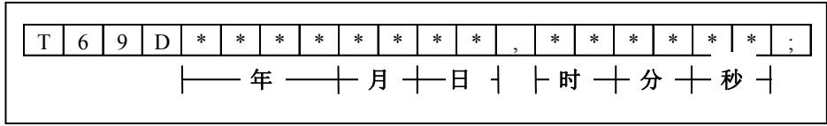

<details>
<summary>text_image</summary>

T 6 9 D * * * * * * * * *, * * * * * | * ; 
—— 年 —— 十 月 + 日 + 十 时 + 分 + 秒 +
</details>

\- 结束日期和时刻

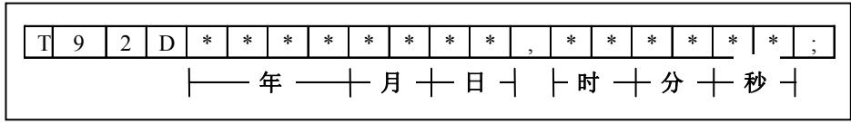

<details>
<summary>text_image</summary>

T 9 2 D * * * * * * * * *, * * * * * | * ; 
——年——月+日+时+分+秒+
</details>

## 注释

结束日期和时刻仅在 0i-F 格式的情形下被输出。

## (3) 波形采样周期

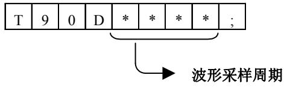

<details>
<summary>text_image</summary>

T 9 0 D * * * * ;
波形采样周期
</details>

## (4) 信号采样周期

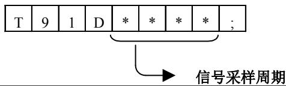

<details>
<summary>text_image</summary>

T 9 1 D * * * * ;
信号采样周期
</details>

## 注释

波形采样周期、信号采样周期仅在 0i-F 格式的情形下被输出。

## (5) 选择项目

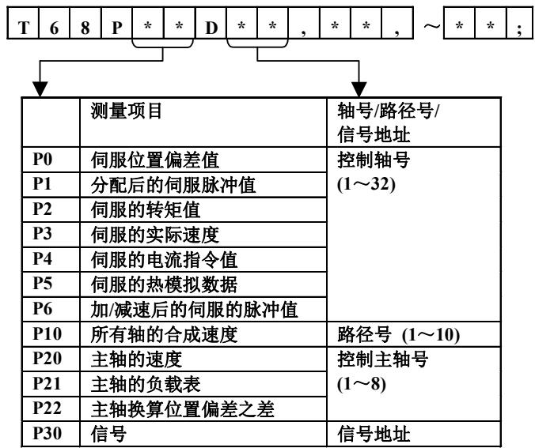

<details>
<summary>text_image</summary>

T 6 8 P * * D * * , * * , ~ * * ;
测量项目 轴号/路径号/
信号地址
P0 伺服位置偏差值 控制轴号
P1 分配后的伺服脉冲值 (1~32)
P2 伺服的转矩值
P3 伺服的实际速度
P4 伺服的电流指令值
P5 伺服的热模拟数据
P6 加/减速后的伺服的脉冲值
P10 所有轴的合成速度 路径号 (1~10)
P20 主轴的速度 控制主轴号
P21 主轴的负载表 (1~8)
P22 主轴换算位置偏差之差
P30 信号 信号地址
</details>

## 注释

P6～P30 仅在 0i-F 格式的情形下被输出。

(6) 波形诊断数据  
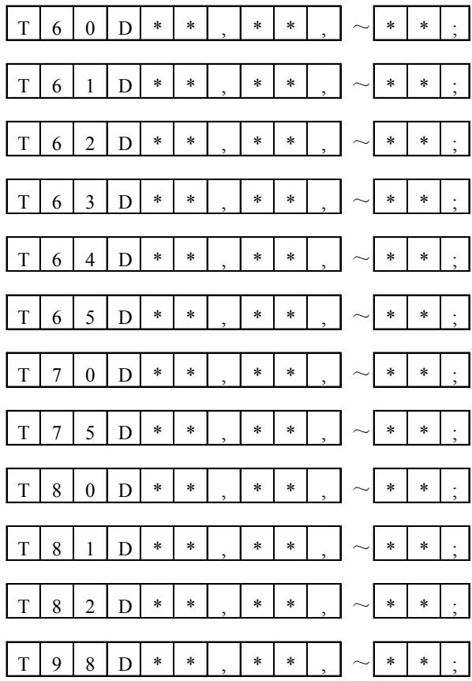

<details>
<summary>text_image</summary>

T 6 0 D * * , * * , ~ * * ;
T 6 1 D * * , * * , ~ * * ;
T 6 2 D * * , * * , ~ * * ;
T 6 3 D * * , * * , ~ * * ;
T 6 4 D * * , * * , ~ * * ;
T 6 5 D * * , * * , ~ * * ;
T 7 0 D * * , * * , ~ * * ;
T 7 5 D * * , * * , ~ * * ;
T 8 0 D * * , * * , ~ * * ;
T 8 1 D * * , * * , ~ * * ;
T 8 2 D * * , * * , ~ * * ;
T 9 8 D * * , * * , ~ * * ;
</details>

D\*\* \~ \*\* : 波形诊断数据 × 轴数 / 路径数 / 信号数

程序段按下列顺序被输出。

首标 (0i-C 兼容/0i-F 格式)

日期和时刻（测量开始）（0i-C 兼容/0i-F 格式）

日期和时刻（测量结束）（仅限 0i-F 格式）

波形测量周期 （仅限 0i-F 格式）

信号测量周期 （仅限 0i-F 格式）

选择项目 (0i-C 兼容/0i-F 格式)

波形诊断数据 (0i-C 兼容/0i-F 格式)

注释

在波形数据被全部输出之后，输出波形诊断数据的信号数据。

## - 文件例

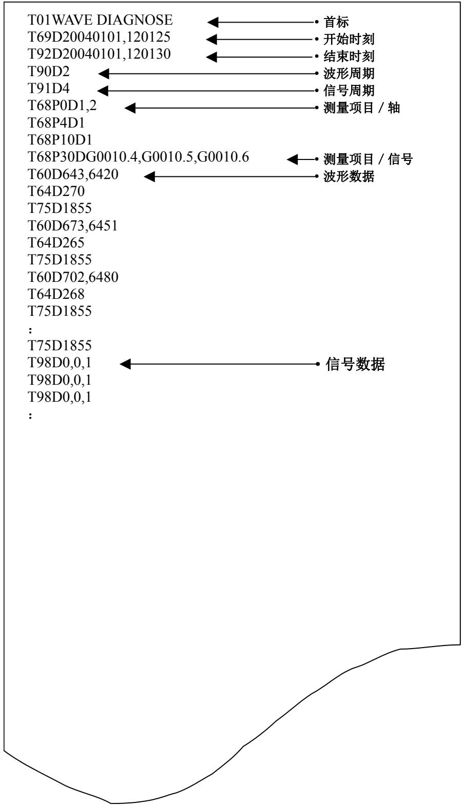

<details>
<summary>flowchart</summary>


```mermaid
graph TD
  A["T01WAVE DIAGNOSE"] --> B["首标"]
  C["T69D20040101,120125"] --> D["开始时刻"]
  E["T92D20040101,120130"] --> F["结束时刻"]
  G["T90D2"] --> H["波形周期"]
  I["T91D4"] --> J["信号周期"]
  K["T68P0D1,2"] --> L["测量项目/轴"]
  M["T68P4D1"] --> N["测量项目/信号"]
  O["T68P10D1"] --> P["波形数据"]
  Q["T68P30DG0010.4,G0010.5,G0010.6"] --> R["测量项目/信号"]
  S["T60D643,6420"] --> T["波形数据"]
  U["T64D270"] --> V["信号数据"]
  W["T75D1855"] --> X["信号数据"]
  Y["T60D673,6451"] --> Z["信号数据"]
  AA["T64D265"] --> AB["信号数据"]
  AC["T75D1855"] --> AD["信号数据"]
  AE["T60D702,6480"] --> AF["信号数据"]
  AG["T64D268"] --> AH["信号数据"]
  AI["T75D1855"] --> AJ["信号数据"]
  AK["T75D1855"] --> AL["信号数据"]
  AM["T98D0,0,1"] --> AN["信号数据"]
  AO["T98D0,0,1"] --> AP["信号数据"]
  AQ["T98D0,0,1"] --> AR["信号数据"]
```
</details>

## 输出文件

1 显示波形诊断图形画面。  
2 按下操作软键 [(操作)]，软键成为如下所示的操作选择状态。


### PMC报警: <
- **故障内容**: 跟踪
- **处理办法**: 取消


3 将方式改变为 EDIT 方式。  
4 将文件名输入到键入缓冲器中，按下软键 [输出]。不输入文件名时，默认的文件名为 “WAVE-DGN.TXT”。  
5 按下下面的软键 [执行]。开始数据的输出。

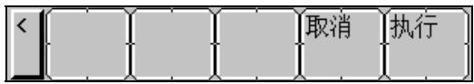

<details>
<summary>text_image</summary>

< 取消 执行
</details>

6 数据的输出结束、或者按下软键 [取消] 时，软键返回到最初的操作选择状态。

注释

在数据跟踪过程中不能输出数据。

参数


### PMC报警: 
- **故障内容**: #7
- **处理办法**: #6

### PMC报警: 10600
- **故障内容**: 
- **处理办法**: 


[输入类型] 参数输入

[数据类型] 位型

#0 IOF 波形诊断中的输出格式为

0: 30 i /0i-D/F 格式（0i-F 格式）。

1: 16 i /0i-C 格式（0i-C 兼容格式）。

## 1.7 颜色设定画面

可通过颜色设定画面进行 VGA 画面的颜色。

## 1.7.1 画面显示

1 按下功能键 SYSTEM。

2 按继续菜单键 ▷ 数次，显示软键 [颜色]。  
3 按下软键 [颜色]，出现颜色设定画面。

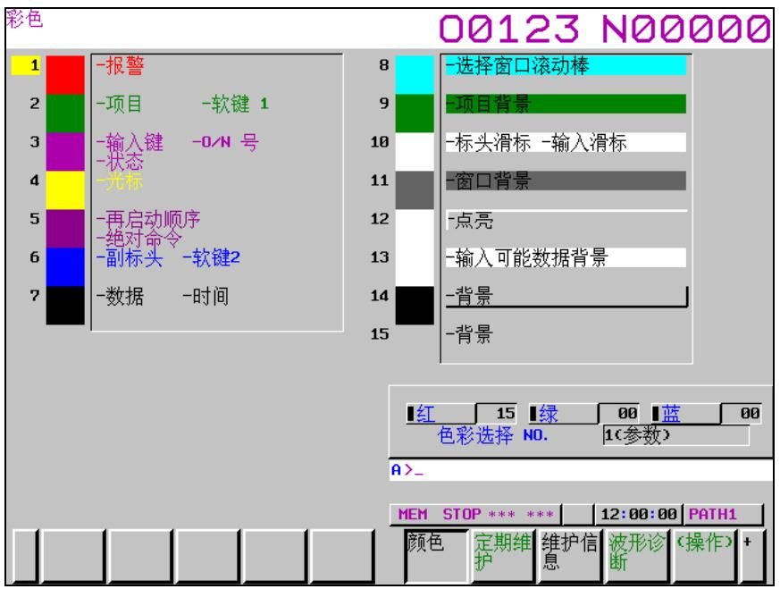

<details>
<summary>text_image</summary>

彩色
00123 N00000
1 -报警
2 -项目 -软键 1
3 -输入键 -0/N 号
-状态
4 -天标
5 -再启动顺序
-绝对命令
6 -副标头 -软键2
7 -数据 -时间
8 -选择窗口滚动棒
9 -项目背景
10 -标头滑标 -输入滑标
11 -窗口背景
12 -点亮
13 -输入可能数据背景
14 -背景
15 -背景
红 15 绿 00 蓝 00
色彩选择 NO. 1(参数)
A >_
MEM STOP *** 12:00:00 PATH1
颜色 定期维护 维护信息 波形诊断 (操作) +
0
</details>

## 1.7.2 颜色设定的操作

## - 改变颜色（调色板值）

1 按下软键 [(操作)]，切换至下一个软键。


### PMC报警: <
- **故障内容**: 红
- **处理办法**: 绿


2 将光标移动到想要改变调色板值的颜色号处。

按色素别显示出当前的调色板值。

3 按下软键 [红]、[绿] 以及 [蓝]，选择将要改变的色素。

可以同时进行色素的选择。

每当按下软键 [红] 、 [绿] 以及 [蓝] 时，重复选择和解除。

（在没有显示出软键 [红]、[绿] 以及 [蓝] 时，如果按下最右边的软键即可使其显示出来。）

4 软键 [亮]、[暗]，改变所选色素的照度。

## - 存储颜色（调色板值）

可以将颜色设定的调色板值存储起来。


### PMC报警: <
- **故障内容**: 红
- **处理办法**: 绿


1 按下软键 [颜色 1]、[颜色 2] 以及 [颜色 3]，选择存储区。

颜色 1……颜色 1（标准色）数据参数（No. 6581～6595）

颜色 2……颜色 2 数据参数（No. 10421～10435）

颜色 3……颜色 3 数据参数（No. 10461～10475）

2 按下软键 [存储器]。切换到下一个软键。


### PMC报警: <
- **故障内容**: 
- **处理办法**: 


3 接着，按下软键 [执行]，将当前的调色板设定值存储在所选的存储区中。

按下软键 [取消] 或者最左边的键时，则不存储当前的调色板设定值。

## - 调用颜色（调色板值）


### PMC报警: <
- **故障内容**: 红
- **处理办法**: 绿


1 按下软键 [颜色 1]、[颜色 2] 以及 [颜色 3]，选择已经存储了调色板数据的存储区。（尚未显示出软键 [颜色 1]、[颜色 2] 以及 [颜色 3] 时，如果按下最右边的软键即可使其显示出来。）

2 按下软键 [再调用]，切换至下一个软键。


### PMC报警: <
- **故障内容**: 
- **处理办法**: 


3 接着，按下软键 [执行]，从所选的存储区中调出调色板值并改变颜色。尚未存储调色板值时，本操作无效。当按下软键 [取消] 或者最左边的键时，不会执行调用操作。

## 1.7.3 参数


[数据类型] 2 字型

[数据单位] rrggbb 6 位数

(rr：红色数据、gg：绿色数据、bb：蓝色数据)

不到 6 位数时，不足的上位数的数据均作为 “0” 处理。

[数据范围] 各色数据 00～15（其值与颜色设定画面上的色调级别相同）

若是大于等于 16 的值，视为 15。

[例] 颜色的色调级别红色=1、绿色=2、蓝色=3时，参数值设定为10203。


[数据类型] 2 字型

[数据单位] rrggbb 6位数

(rr：红色数据、gg：绿色数据、bb：蓝色数据)

不到 6 位数时，不足的上位数的数据均作为 “0” 处理。

[数据范围] 各色数据 00～15（其值与颜色设定画面上的色调级别相同）

若是大于等于 16 的值，视为 15。

[例] 颜色的色调级别红色=1、绿色=2、蓝色=3时，参数值设定为10203。


[数据类型] 2 字型

[数据单位] rrggbb 6位数

(rr：红色数据、gg：绿色数据、bb：蓝色数据)

不到 6 位数时，不足的上位数的数据均作为 “0” 处理。

[数据范围] 各色数据 00～15（其值与颜色设定画面上的色调级别相同）

若是大于等于 16 的值，视为 15。

[例] 颜色的色调级别红色=1、绿色=2、蓝色=3时，参数值设定为10203。

## 1.7.4 注意事项

(1) 刚刚通电后的画面的颜色为颜色 1 的设定。
如果尚未存储颜色 1，则以发那科标准色予以显示。  
(2) 请勿直接用 MDI 键入方式改变 RGB 值的参数。在改变该数据时，务须执行颜色设定画面的存储操作。  
(3) RGB 值的参数中输入了错误的值而看不见画面显示时，在按住 $\boxed{\text{RESET}} + \boxed{\text{DELETE}}$ 键的状态下重新接通电源，就可清除所存储的所有颜色，改变为发那科标准色。但是，执行此操作时，参数程序等所有存储器的保存数据都将丢失，执行时应予充分注意。

## 1.8 Power Mate CNC管理器功能

把 FANUC 伺服单元 $\beta i$ 系列 I/O Link Option（以后称为 I/O Link $\beta i$ ）作为 CNC 的附加轴（从动装置）使用时，利用 Power Mate CNC 管理器功能，可以在 CNC 一侧显示和设定这些从动装置的各种数据。

可以进行下列显示和设定。

(1) 当前位置显示（绝对坐标 / 机床坐标）  
(2) 参数的显示和设定  
(3) 报警显示  
(4) 诊断显示  
(5) 系统配置画面显示

可以连接的从动装置，每个 I/O Link 的通道最多为 8 台。

## 1.8.1 画面显示

1. 按下功能键 SYSTEM。  
2. 按继续菜单键 ▷ 数次，显示软键 [P.MATE 管理器]。


<details>
<summary>text_image</summary>

FSSB 参数调整 P. MATE 管理器 (操作) +
</details>

3. 按下软键 [P.MATE 管理器]，出现 Power Mate CNC 管理器的初始画面即绝对坐标画面，通过软键选择下列项目。

绝对：绝对坐标显示

机床：机床坐标显示

参数：参数画面

信息：报警列表

诊断：诊断画面

系统构成：系统信息

在选择完上述各设定后，选择其他功能时，按下返回菜单键 △，再次使该软键显示出来并选择该功能。

4. Power Mate CNC 管理器功能的退出。

按下返回菜单键 1 次或 2 次时，显示出 CNC 系统的软键，退出 Power Mate CNC 管理器。

此外，通过按下 MDI 的功能键（POS、PROG、MESSAGE、etc.）选择其他功能，可以退出 Power Mate CNC 管理器功能。

## 从动装置的选择操作

在多个 I/O Link 通道中连接有从动装置时，通过按下按动软键 [(操作)] 所显示的 [NEXT CH]、[PREV.CH]，可以切换显示通道。

在画面上部，对于所连接的从动装置（最多为8个）显示出以下的信息。

- I/O Link 的组号（0～15）  
- 报警状态

在显示对象的从动装置（有源从动装置）编号中显示出光标。从动装置有多个时，通过按下软键 [后 SLAVE] 或 [前 SLAVE]，可以切换有源从动装置。

从动装置状态的显示和选择操作，可以在 Power Mate CNC 管理器功能的所有画面上进行。

## 当前位置显示画面

当前位置显示画面上显示从动装置的当前位置和实际进给速度。

所显示的当前位置如下所示。

- 绝对坐标（绝对坐标系中的当前位置）  
- 机床坐标（机床坐标系中的当前位置）

## 显示方法

按下软键 [绝对] 、 [机床] 时，分别按如下所示显示出绝对坐标和机床坐标画面。

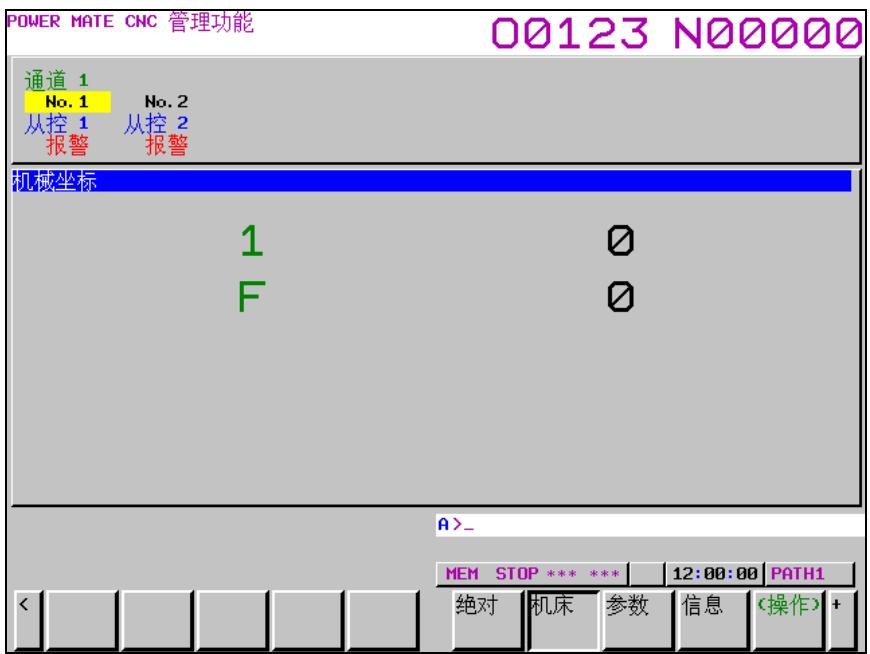

<details>
<summary>text_image</summary>

POWER MATE CNC 管理功能
00123 N00000
通道 1
No. 1	No. 2
从控 1	从控 2
报警	报警
机械坐标
1	Ø
F	Ø
A >_
MEM STOP *** ***
12:00:00 PATH1
绝对	机床	参数	信息	(操作) +
</details>

Power Mate CNC 管理器 机床坐标画面

## 轴名称显示

通过在 I/O Link $\beta i$ 一侧参数(No.0024,0025)中设定轴名称，可以进行变更。最多可以设定 2 个字符。（用 0～9、A～Z 的 ASCII 代码进行设定）未设定轴名称，或设定数据不适当时，轴名称变为 “1”。

另外，这一轴名称仅能够在 Power Mate CNC 管理器功能的位置显示中使用，与 CNC 一侧的控制轴没有任何关系。

## 参数画面

作为从动装置所搭载的各功能所需的参数，必须事前进行设定。

按下软键 [参数]，出现参数画面。

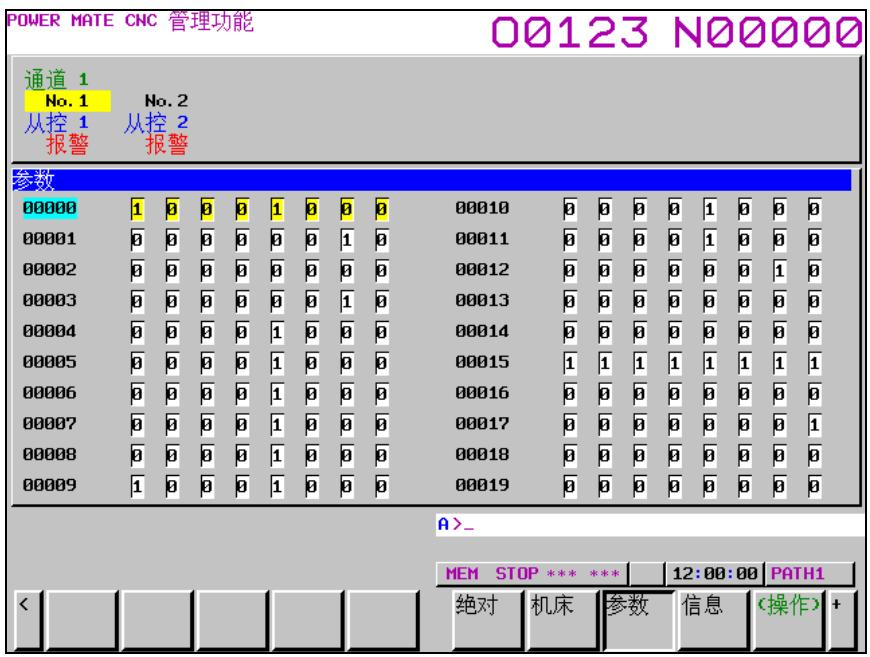

<details>
<summary>text_image</summary>

POWER MATE CNC 管理功能
00123 N00000
通道 1
No. 1 No. 2
从控 1 从控 2
报警 报警
参数
00000 1 0 0 0 1 0 0 0 00010 0 0 0 0 1 0 0 0
00001 0 0 0 0 0 0 1 0 00011 0 0 0 0 1 0 0 0
00002 0 0 0 0 0 0 0 0 0 00012 0 0 0 0 0 0 1 0
00003 0 0 0 0 0 0 1 0 00013 0 0 0 0 0 0 0 0
00004 0 0 0 0 1 0 0 0 00014 0 0 0 0 0 0 0 0
00005 0 0 0 0 1 0 0 0 00015 1 1 1 1 1 1 1
00006 0 0 0 0 1 0 0 0 00016 0 0 0 0 0 0 0
00007 0 0 0 1 0 0 0 1
00008 0 0 1 1 1
08889 1 1 1
A >_
MEM STOP *** ***
12:88:88 PATH1
<		绝对	机床	参数	信息	(操作) +
				(操作)
</details>

仅显示位型或 10 进制的数据。参数的详情，请参阅 FANUC SERVO MOTOR βi series I/O Link Option Maintenance Manual（选项维修说明书）。

\- 参数的选择和查找

1. 最初选择有源从动装置。  
2. 按下软键 [操作] 时，显示出下列软键。


<details>
<summary>text_image</summary>

< 搜索号码 READ PUNCH 输入 后SLAVE 前SLAVE NEXT PREV. E CH CH
</details>

3. 输入参数号，按下软键 [搜索号码] 时，进行查找。

按下光标键 ↑ ↓ ← → 、翻页键 ↑ PAGE PAGE 并移动光标，也可以选择所希望的参数号。

\- 参数的设定

可以从 CNC 直接设定从动装置的 I/O Link $\beta i$ 的参数。

1. 利用上述方法选择目的参数。  
2. 按下软键 [操作] 时，显示出下列软键。

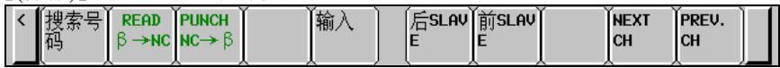

<details>
<summary>text_image</summary>

< 搜索号码 READ PUNCH 输入 后SLAVE 前SLAVE NEXT PREV. E CH CH
</details>

3. 输入设定数据。  
4. 按下软键 [输入]、或者 MDI 键 [INPUT]。

## 报警画面

从动装置一侧发生报警时，在画面上部的从动装置状态处显示“警告”。

这时，通过显示报警画面可以确认报警内容。

画面上最多可显示 40 个报警代码。

参数的详情，请参阅 FANUC SERVO MOTOR β i series I/O Link Option Maintenance Manual（选项维修说明书）。

## 显示方法

按下软键 [信息]。画面上仅显示错误代码。

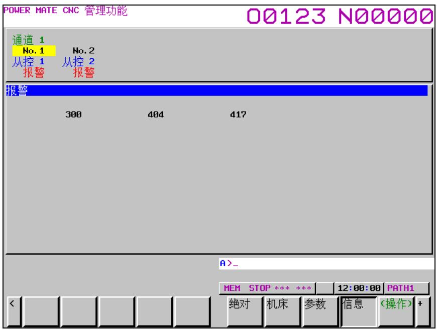

<details>
<summary>text_image</summary>

POWER MATE CNC 管理功能
00123 N00000
通道 1
No. 1	No. 2
从控 1	从控 2
报警	报警
报警
300	404	417
A >_
MEM STOP *** ***
12:00:00 PATH1
<	绝对	机床	参数	信息	(操作) +
<		机床	参数	信息	(操作)
</details>

从动装置 1 的 I/O Link β 的报警显示例

## 诊断画面

显示出从动装置的诊断信息。

诊断数据以位型或整数型（10 进制数）显示。诊断数据的详情，请参阅 FANUC SERVO MOTOR β iseries I/O Link Option Maintenance Manual（选项维修说明书）。

## 显示方法

1. 按下继续菜单键 ▶。  
2. 按下软键 [诊断]，出现诊断画面。

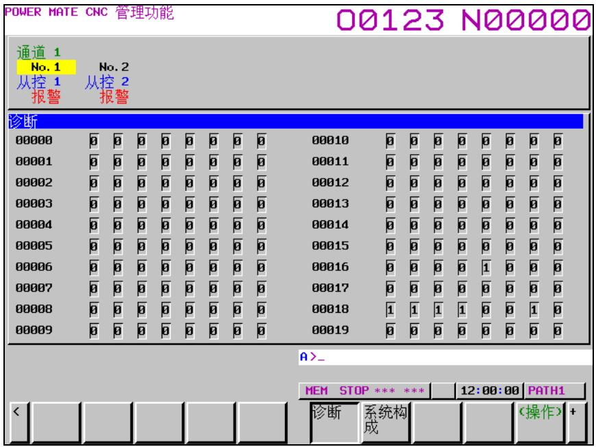

<details>
<summary>text_image</summary>

POWER MATE CNC 管理功能
00123 N00000
通道 1
No. 1 No. 2
从控 1 从控 2
报警 报警
诊断
00000 0 0 0 0 0 0 0 0 0 00010 0 0 0 0 0 0 0 0 0
00001 0 0 0 0 0 0 0 0 0 00011 0 0 0 0 0 0 0 0 0
00002 0 0 0 0 0 0 0 0 0 0 00012 0 0 0 0 0 0 0 0 0
00003 0 0 0 0 0 0 0 0 0 0 00013 0 0 0 0 0 0 0 0 0
00004 0 0 0 0 0 0 0 0 0 0 00014 0 0 0 0 0 0 0 0 0
00005 0 0 0 0 0 0 0 0 0 0 00015 0 0 0 0 0 0 0 0
00006 0 0 0 0 0 0 0 0 0 0 0
00016 1
1
1
1
1
1
1
1
1
1
1
1
1
1
A >_
MEM STOP *** ***
12:08:08 PATH1
诊断 系统构成 (操作) +
</details>

## 诊断数据的查找

1. 最初选择有源从动装置。  
2. 按下软键 [操作] 时，显示出下列软键。


<details>
<summary>text_image</summary>

< 搜索号码 READ PUNCH 输入 后SLAVE 前SLAVE NEXT PREV. CH
β→NC NC→β E E CH
</details>

3. 输入诊断号，按下软键 [搜索号码] 时，进行查找。

按下光标键 ↑ ↓ 、翻页键 ↑ PAGE PAGE 并移动光标，也可以选择所希望的诊断号

## 系统配置画面

显示从动装置的系统软件信息。

## 显示方法

1. 按下继续菜单键 ▶ 。  
2. 按下软键 [系统构成]，出现诊断画面。

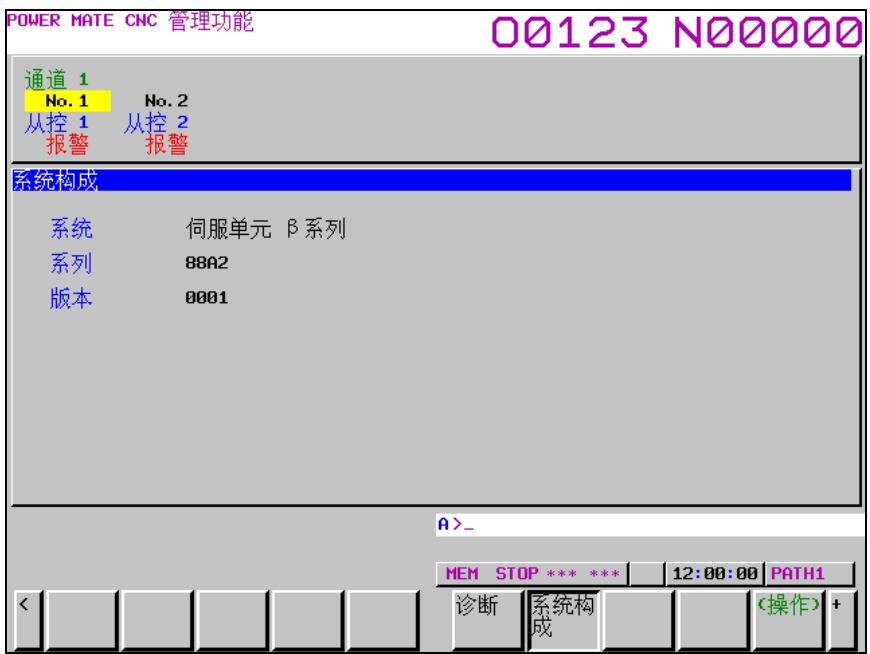

<details>
<summary>text_image</summary>

POWER MATE CNC 管理功能
00123 N00000
通道 1
No. 1 No. 2
从控 1 从控 2
报警 报警
系统构成
系统 伺服单元 β 系列
系列 88A2
版本 0001
A >_
MEM STOP *** ***
12:00:00 PATH1
诊断 系统构
成
(操作) +
</details>

I/O Link $\beta i$ 系统软件的系列和版本

## 1.8.2 参数输入/输出

## 参数输出

把参数作为程序格式的数据文件输出到 CNC 存储器或存储卡中。在参数(No.8760)中，设定用于登录的程序号的开头号。创建每一从动装置所决定编号的程序。

该编号输出到 CNC 存储器中时成为程序号。

输出到存储卡中时，创建一个文件，该文件将程序号作为文件名，将“PMM”作为扩展名。

程序号 $=$ 参数设定值（参数(No.8760））+（m-1）

```txt
×100+n×10
m: 通道号（1～4）
n: 组号
```

例如：当参数(No.8760)=8000 时

```csv
第 1ch (I/O Link β 组 0)
8000+0*100+0*10=8000
第 2ch (I/O Link β 组 1)
8000+1*100+1*10=8110
第 3ch (I/O Link β 组 2)
8000+2*100+2*10=8220
第 4ch (I/O Link β 组 3)
8000+3*100+3*10=8330
```

组号是由画面上部的从动装置状态所反相显示的从动装置编号。

通过将参数 PM0(No.0961#3) 设定为 1，可以仅通过组号设定将被输出的参数号。

选择用参数 MD1 和 MD2(No.0960#1、#2)输入的设备。

连接存储卡或在确认 CNC 存储器的可用区之后，进行以下的操作。

1. 多路径控制时，从路径 1 的画面进入 Power Mate CNC 管理器的画面。

2. 选择有源从动装置。

按下软键 [（操作）] 时，显示出下列软键。


### PMC报警: <
- **故障内容**: 搜索号码
- **处理办法**: READ $\beta \rightarrow NC$


3. 按下软键 [READ] （读入）时，显示出下列软键。


### PMC报警: <
- **故障内容**: 
- **处理办法**: 


4. 按下软键 [执行]。

输入中信息行中的 “INPUT” 字符闪烁显示。

## 注释

1 在 MEM 模式以外或急停状态下也可以保存参数。  
2 保存到存储卡中时，当存储卡内存在相同文件名的文件时不能保存。请删除存储卡内的文件，或通过参数（No.8760）的设定，变更文件名。

保存到程序区中时，根据参数 REP(No.3201#2) 的设定进行。

## 参数输入

把作为程序输出到 CNC 存储器或存储卡的参数数据文件输入到由程序号所决定的从动装置中。程序号、存储设备的决定方法与参数输出时相同。

1. 多路径控制时，从路径 1 的画面进入 Power Mate CNC 管理器的画面。  
2. 选择有源从动装置。  
3. 按下软键 [操作] 时，显示出下列软键。


### PMC报警: <
- **故障内容**: 搜索号码
- **处理办法**: READ $\beta \rightarrow NC$


4. 按下软键 $[PUNCH NC \rightarrow \beta]$ 时，显示出下列软键。


### PMC报警: <
- **故障内容**: 
- **处理办法**: 


5. 按下软键 [执行]。

输出中信息行中的 “OUTPUT” 字符闪烁显示。

## 注释

1 在 MEM 模式以外或急停状态下也可以输入参数。  
2 多路径时，仅在路径 1 的 Power Mate CNC 管理器画面可以进行参数的输入/输出操作。此外，唯有路径 1 的 CNC 存储器可进行输入/输出操作。

## 1.8.3 参数


### PMC报警: 
- **故障内容**: #7
- **处理办法**: #6

### PMC报警: 0960
- **故障内容**: 
- **处理办法**: 


[输入类型] 设定输入

[数据类型] 位路径型

#1 MD1

#2 MD2 设定从动装置的参数输入/输出目的地。

MD2 MD1


### PMC报警: 0
- **故障内容**: 0
- **处理办法**: 纸带存储器

### PMC报警: 0
- **故障内容**: 1
- **处理办法**: 存储卡


## #3 PMN 使得 Power Mate CNC 管理器功能

0: 有效。

1: 无效。（不进行与从动装置之间的通信）

## #4 PPE 基于 Power Mate CNC 管理器的参数设定

0: 始终可以进行而与 PWE 的设定值无关。

1: 随 PWE 的设定而定。


### PMC报警: 
- **故障内容**: #7
- **处理办法**: #6

### PMC报警: 0961
- **故障内容**: 
- **处理办法**: 


[输入类型] 参数输入

[数据类型] 位型

## #3 PMO 保存和恢复 I/O Link β 参数的程序号

0: 基于组号和通道号进行设定。

1: 仅基于组号进行设定。


[输入类型] 设定输入

[数据类型] 2 字路径型

[数据范围] 0 \~ 99999999

利用 Power Mate CNC 管理器功能，设定用以输入/输出从动装置一侧的数据（参数）的程序号。

在 I/O Link 的通道 m、组 n 的从动装置中使用

设定值 $+ (m-1) \times 100 + n \times 10$

的程序号。

设定值为 0 时，通道 1、组 0 的从动装置由于程序号成为 0 号，所以与 CNC 存储器之间不能进行数据的输入/输出操作。可以与存储卡之间进行数据的输入/输出操作。

(请设定一个所使用程序号不超过 99999999 的值)

## 警告

在 Power Mate CNC 管理器中发生报警时，显示出警告信息。


## 1.8.4 注意事项

## - I/O Link 的连接

将 I/O Link $\beta i$ 作为 I/O Link 的从动装置使用时，在 CNC 一侧进行 I/O 地址的分配。与从动装置一侧的输入/输出数据采用 16byte 单位，所以输入/输出点数务必指定 128 点。

可以连接的从动装置最多为8台。

模块名为 OC021（输入 16byte）、OC020（输出 16byte）。

BASE 始终为 0，SLOT 始终为 1。

## - Power Mate CNC 管理器忽略功能

对所连接的各从动装置，在必要的数据设定和确认结束后，为了使从 CNC 一侧的梯形图向各从动装置发出的指令优先执行，可以停止 Power Mate CNC 管理器功能的通信。

将参数 PMN（No.960#3）置于 1 时，通过 I/O Link 而与从动装置的通信，都对梯形图开放。另外，当该参数为 1 时，Power Mate CNC 管理器功能不起作用。

## - 数据的保护键

接通 CNC 的程序数据保护键时，不能把参数输入到 CNC 的程序存储器中。

## 1.9 SERVO GUIDE MATE

SERVO GUIDE MATE 可在画面上以图形形式显示与伺服电机、或主轴电机相关的各类数据。由此，便可以简单地测量机床精度，并可以轻易地了解由于时间变化、地震和机床的冲击而引起的精度变化。

## 概要

SERVO GUIDE MATE 采用图1.9 (a) SERVO GUIDE MATE 的配置概略所示配置，将由程序执行控制的伺服电机、或者主轴电机的反馈信息以图形形式予以显示。它具有放大显示各类数据随着时间的变化和电机的轨迹描绘、圆弧动作的误差等功能。

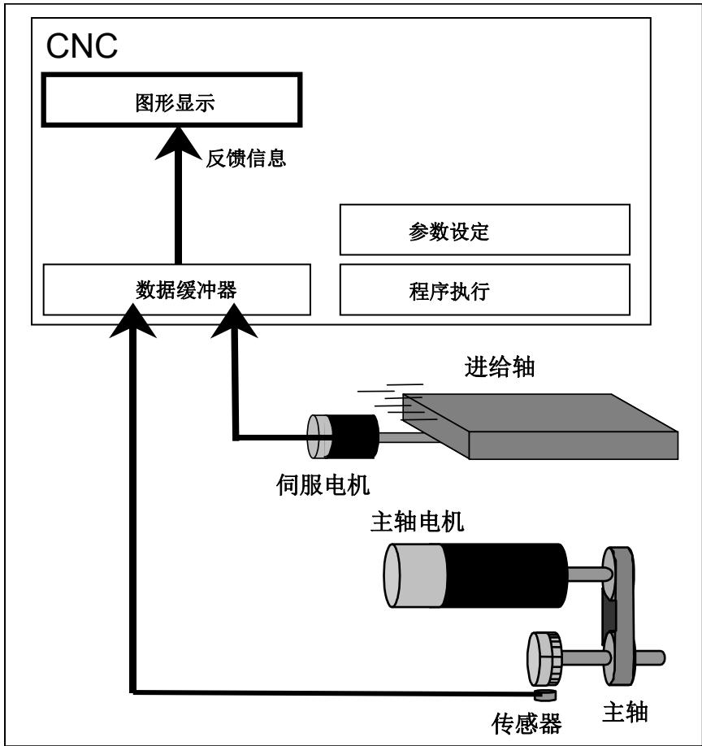

<details>
<summary>flowchart</summary>

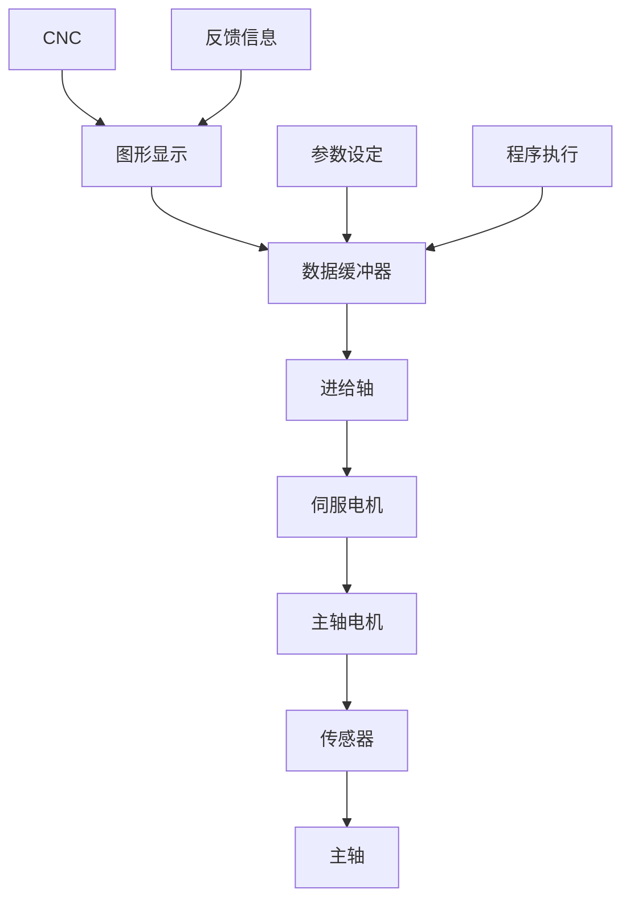
```mermaid
graph TD
  A["CNC"] --> B["图形显示"]
  B --> C["数据缓冲器"]
  C --> D["进给轴"]
  D --> E["伺服电机"]
  E --> F["主轴电机"]
  F --> G["传感器"]
  G --> H["主轴"]
  I["参数设定"] --> C
  J["程序执行"] --> C
  K["反馈信息"] --> B
```
</details>

图1.9 (a) SERVO GUIDE MATE 的配置概略

## 注意事项

本功能无法与伺服调整工具(FANUC SERVO GUIDE)并用。

## 1.9.1 波形显示

波形显示可以获取有关伺服电机和主轴电机的各类数据，并在用于进行测量数据分析的各类描绘方式下以图形形式进行显示。所显示的图形由下列2个要素组成。因此，要显示图形，除了必须具备测量数据外，还必须进行用于波形显示的运算设定。

1 测量数据

系指位置、转矩等由 CNC 获取的每个通道的原始数据。

2 运算处理

系指针对测量数据，归纳了进行某些运算处理的结果者。若不设定运算处理就不能显示图形。

因此，

波形显示（图形显示）= 测量数据 + 运算处理。

下面的项目中，测量数据使用通道(CH)，显示波形使用图(Draw)这样的表达方式。

CH1 : 测量数据 1

Draw3 : 显示波形 3

图 1.9(b) 显示概念图。

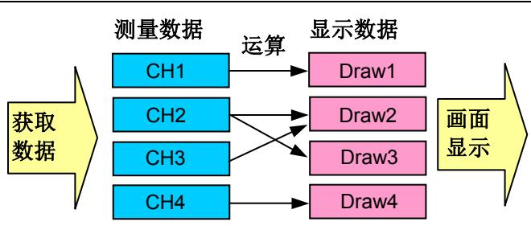

<details>
<summary>flowchart</summary>

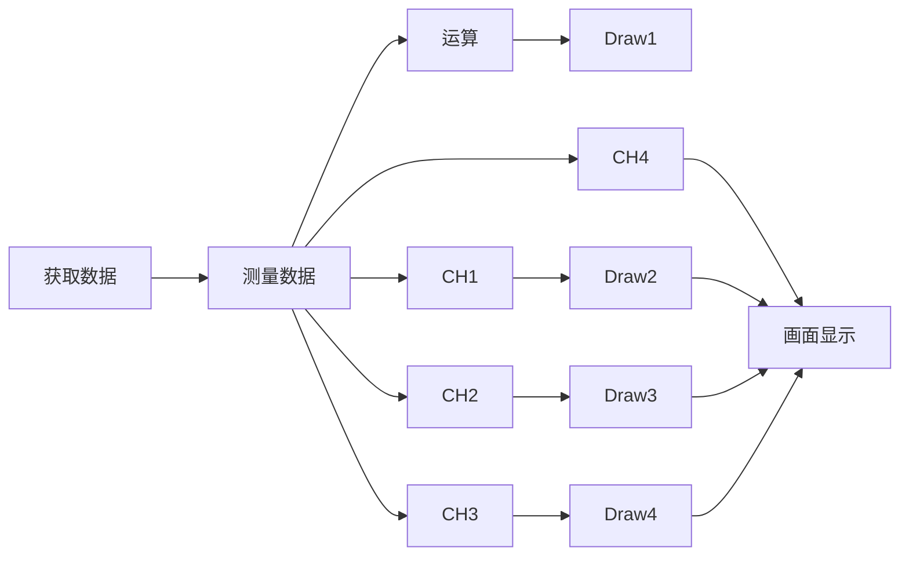
```mermaid
graph LR
  A["获取数据"] --> B["测量数据"]
  B --> C["运算"]
  C --> D["Draw1"]
  B --> E["CH1"]
  B --> F["CH2"]
  B --> G["CH3"]
  B --> H["CH4"]
  E --> I["Draw2"]
  F --> J["Draw3"]
  G --> K["Draw4"]
  H --> L["画面显示"]
  I --> L
  J --> L
  K --> L
```
</details>

图1.9 (b)

伺服电机和主轴电机的测量项目合在一起，最多可以同时测量 4 个通道。此外，每个测量项目最多可以测量 10000 个数据。

描绘方式有以下 5 种。

1 Y-Time 图形
这是如同示波器一样地以时间轴显示波形的一种方式。  
2 XY 图形
这是使用 2 个轴的数据显示二维轨迹的一种方式。  
3 圆形(Circle)图形这是在圆弧切削中放大显示起因于指定圆弧的轨迹误差的一种方式。  
4 傅立叶(Fourier)图形
这是针对 Y-Time 图形中所显示的范围进行数字傅立叶变换并显示频谱的一种方式。  
5 博德(Bode)图形
这是利用横轴对数图形显示博德线图的一种方式。

## 注意事项

## - 轴号

注释

多路径控制的情况下，以绝对轴号来指定轴号。不是路径内的相对轴号。

## 1.9.1.1 Y-Time图形

Y-Time 图形可针对测量数据，在时间轴上如图示波器一样地显示波形。

最多可同时显示 4 幅图（draws）。

## 显示和设定 Y-Time 图形的步骤

## 步骤

下面描述至测量数据显示的步骤。

1 按下功能键 SYSTEM。  
2 按继续菜单键 ▶ 数次，直到 [波形显示] 显示。  
3 按下软键 [波形显示]。  
4 按下软键 [Y-TIME]。出现图 1.9.1.1 (a) 所示的波形画面。

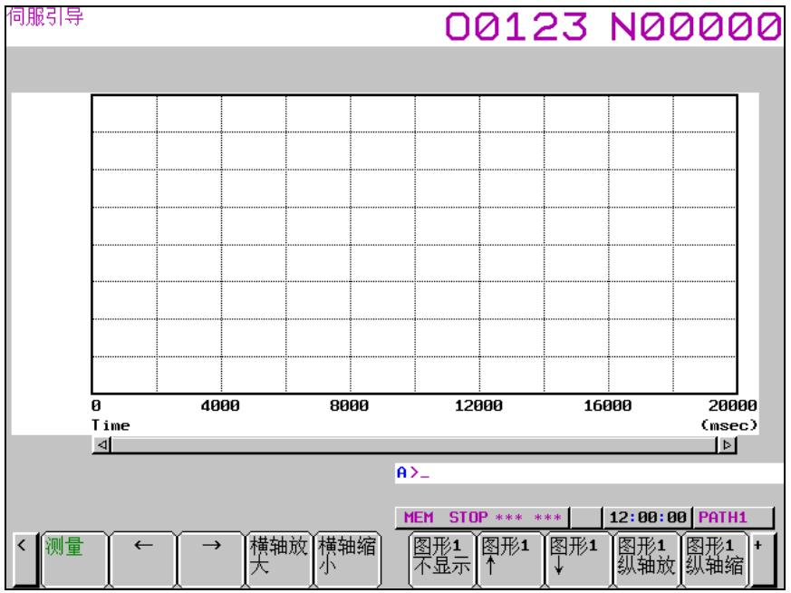

<details>
<summary>text_image</summary>

伺服引导
00123 N00000
Time
4000 8000 12000 16000 20000 (msec)
A >_
MEM STOP *** ***
12:08:00 PATH1
< 测量 ← → 横轴放 横轴缩
大 小
图形1 图形1 图形1
不显示 ↑ ↓
纵轴放 图形1
纵轴缩 +
</details>

图1.9.1.1 (a)

5 按下软键 [测量]。  
6 按下软键 [取数]。  
7 按下软键 [采样]。出现图 1.9.1.1 (b) 所示的测量设定画面。


<details>
<summary>text_image</summary>

伺服引导
00123 N00000
测量设定
测量数据点数 : 10000
触发系统 : 1
序.NO : 0
采样周期(伺服) : 9
(主轴) : 7
自动缩放 : 1
同步方式选择 : 1
日期 : Mon Oct 21 2002
时间 : 09:01:11
候补
采样周期(伺服)
1 : 100 ms
2 : 50 ms
3 : 20 ms
4 : 10 ms
5 : 5 ms
6 : 2 ms
7 : 1 ms
8 : 500 us
9 : 250 usec
10 : 125 us
11 : 62.5 us
A >_
MEM STOP *** ***
12:00:00 PATH1
< 图形显 列表 采样 通道设
示 定
</details>

图1.9.1.1 (b)

8 按下光标键，将光标移动到想要设定的参数位置。  
9 输入数据，按下 [INPUT] 键。  
10 重复 8 和 9 的步骤，设定所有的参数。  
11 按下软键 [通道设定]。出现图 1.9.1.1 (c) 所示的设定通道画面。

需要进行当前所显示的通道以外的设定时，按下翻页键 $\boxed{\uparrow}$ $\boxed{PAGE}$ ，显示目标通道的画面。


<details>
<summary>text_image</summary>

伺服引导
00123 N00000
设定通道
[ CH 1 ] [ CH 2 ]
轴 : 1 1
种类 : 2 16
单位 : 33 31
转换系数 : 100.000 100.000
转换基准 : 7282.000 -7282.000
原始值 : 0.000 0.000
扩展地址 :
偏移 :
说明
扭矩指令(TCMD) n 使用放大器的最大电流值进行设定,缺省值为100,该值为最大扭矩值的百分比。
候补
种类
5 : POSF 21 : SIN_T
1 : VCMD 15 : FREQ
2 : TCMD 16 : FRTCM
3 : SPEED 25 : OVCLV
4 : ERR 59 : S2ST4
7 : SYNC 63 : ERMON
8 : ABS
22 : DTRQ
24 : DLTCM
23 : SFERR
48 : IR
49 : IS
50 : IEFF
20 : ROTOR
A >_
MEM STOP *** *** 12:00:00 PATH1
< 图形显 列表 采样 通道设 定
</details>

图1.9.1.1 (c)

12 按下光标键，将光标移动到想要设定的参数位置。  
13 输入数据，按下 [INPUT] 键。  
14 重复 12 和 13 的步骤，设定所有的参数。  
15 按下软键 [图形显示]。  
16 按下软键 [运算/G 设定]。出现图 1.9.1.1 (d) 所示的运算 & 图形画面。

需要进行当前所显示的图（draw）以外的设定时，按下翻页键 $\boxed{\uparrow}$ PAGE $\boxed{\downarrow}$ ，显示目标图的画面。

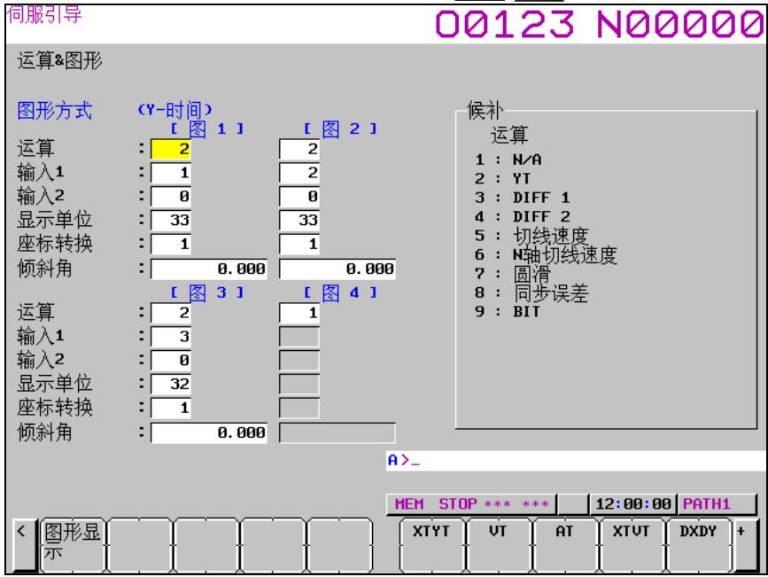

<details>
<summary>text_image</summary>

伺服引导
00123 N00000
运算&图形
图形方式 (Y-时间)
[图 1] [图 2]
运算 : 2 2
输入1 : 1 2
输入2 : 0 0
显示单位 : 33 33
座标转换 : 1 1
倾斜角 : 0.000 0.000
[图 3] [图 4]
运算 : 2 1
输入1 : 3
输入2 : 0
显示单位 : 32
座标转换 : 1
倾斜角 : 0.000
候补
运算
1 : N/A
2 : YT
3 : DIFF 1
4 : DIFF 2
5 : 切线速度
6 : N轴切线速度
7 : 圆滑
8 : 同步误差
9 : BIT
A>_ 
MEM STOP *** ***
12:00:00 PATH1
< 图形显
示 XTYT VT AT XTUT DXDY +
</details>

图1.9.1.1 (d)

17 按下光标键，将光标移动到想要设定的参数位置。  
18 输入数据，按下 [INPUT] 键。  
19 重复 17 和 18 的步骤，设定所有的参数。  
20 按下软键 [图形显示]。  
21 软键 [比例设定]。出现图 1.9.1.1 (e) 所示的缩放画面。


<details>
<summary>text_image</summary>

伺服引导
O0123 N00000
缩放(Y-TIME)
画图1(始点) : 0.000
(刻度) : 10.000
画图2(始点) : 0.000
(刻度) : 5.000
画图3(始点) : 600.000
(刻度) : 200.000
画图4(始点) : 0.000
(刻度) : 1.000
时间(始点) : 0.000
(刻度) : 400.000
候补
A >_
MEM STOP *** ***
12:00:00 PATH1
< 图形显
示
</details>

图1.9.1.1 (e)

22 按下光标键，将光标移动到想要设定的参数位置。  
23 输入数据，按下 [INPUT] 键。  
24 重复 22 和 23 的步骤，设定所有的参数。  
25 按下软键 [图形显示]。  
26 按下软键 [测量]。  
27 按下软键 [开始]。  
28 开始自动运行或者手动运行。  
29 测量结束后，出现图 1.9.1.1 (f) 所示的波形画面。

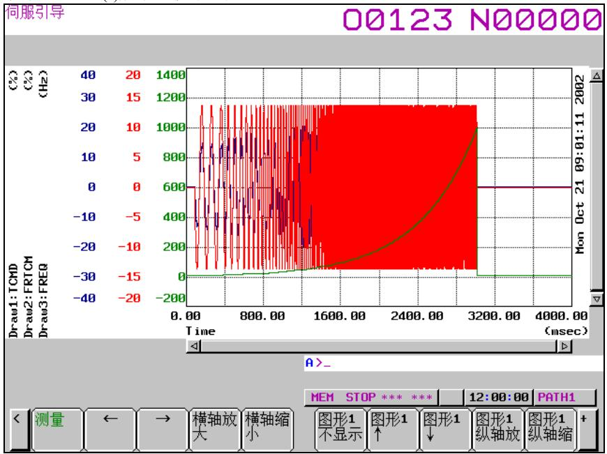

<details>
<summary>bar-line hybrid chart</summary>

| Time (msec) | Value (%) | Frequency (Hz) |
|-------------|-----------|----------------|
| 0.00        | 40        | 1400           |
| 800.00      | 30        | 1200           |
| 1600.00     | 20        | 1000           |
| 2400.00     | 10        | 800            |
| 3200.00     | 5         | 600            |
| 4000.00     | 0         | 400            |
| 800.00      | -10       | 200            |
| 1600.00     | -20       | 0              |
| 2400.00     | -30       | -15            |
| 3200.00     | -40       | -20            |
</details>

图1.9.1.1 (f)

## - 改变运算&图形画面

下面描述根据需要改变运算和图形设定的步骤。

1 按下软键 [运算/G 设定]。

出现图 1.9.1.1 (g) 所示的运算 & 图形画面。

需要进行当前所显示的图以外的设定时，按下翻页键 $\boxed{\uparrow}$ $\boxed{PAGE}$ ，显示目标图的画面。

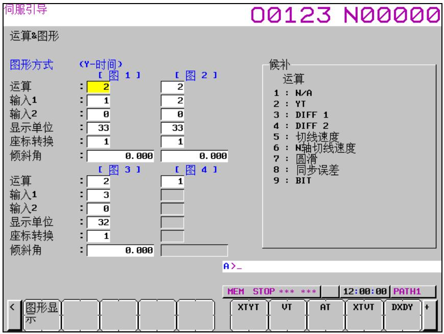

<details>
<summary>text_image</summary>

伺服引导
O0123 N00000
运算&图形
图形方式 (Y-时间)
[图 1] [图 2]
运算 : 2 2
输入1 : 1 2
输入2 : 0 0
显示单位 : 33 33
座标转换 : 1 1
倾斜角 : 0.000 0.000
候补
运算
1 : N/A
2 : YT
3 : DIFF 1
4 : DIFF 2
5 : 切线速度
6 : N轴切线速度
7 : 圆滑
8 : 同步误差
9 : BIT
运算 : 2 1
输入1 : 3
输入2 : 0
显示单位 : 32
座标转换 : 1
倾斜角 : 0.000
A >_
MEM STOP *** ***
12:00:00 PATH1
< 图形显
示 XTYT VT AT XTVT DXDY +
</details>

图1.9.1.1 (g)

2 按下光标键，将光标移动到想要设定的参数位置。  
3 输入数据，按下 [INPUT] 键。  
4 重复 2 和 3 的步骤，设定所有的参数。  
5 按下软键 [图形显示]。

按照新设定的运算和图形设定，显示出图 1.9.1.1 (h) 所示的波形画面。

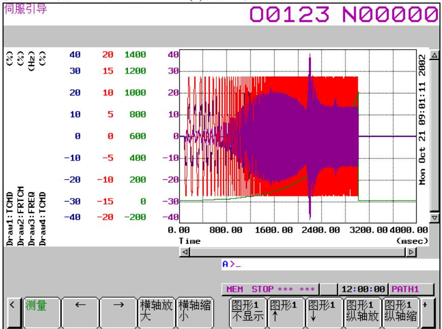

<details>
<summary>line chart</summary>

| Time (msec) | Value |
|-------------|-------|
| 0.00        | -40   |
| 800.00      | -30   |
| 1600.00     | -20   |
| 2400.00     | -15   |
| 3200.00     | -10   |
| 4000.00     | -5    |
| 4800.00     | 0     |
| 5600.00     | 5     |
| 6400.00     | 10    |
| 7200.00     | 15    |
| 8000.00     | 20    |
| 8800.00     | 25    |
| 9600.00     | 30    |
| 10400.00    | 35    |
| 11200.00    | 40    |
| 12000.00    | 45    |
| 12800.00    | 50    |
| 13600.00    | 55    |
| 14400.00    | 60    |
| 15200.00    | 65    |
| 16000.00    | 70    |
| 16800.00    | 75    |
| 17600.00    | 80    |
| 18400.00    | 85    |
| 19200.00    | 90    |
| 20000.00    | 95    |
| 20800.00    | 100   |
| 21600.00    | 105   |
| 22400.00    | 110   |
| 23200.00    | 115   |
| 24000.00    | 120   |
| 24800.00    | 125   |
| 25600.00    | 130   |
| 26400.00    | 135   |
| 27200.00    | 140   |
| 28000.00    | 145   |
| 28800.00    | 150   |
| 29600.00    | 155   |
| 30400.00    | 160   |
| 31200.00    | 165   |
| 32000.00    | 170   |
| 32800.00    | 175   |
| 33600.00    | 180   |
| 34400.00    | 185   |
| 35200.00    | 190   |
| 36000.00    | 195   |
| 36800.00    | 200   |
| 37600.00    | 205   |
| 38400.00    | 210   |
| 39200.00    | 215   |
| 48277.31   | -45   |
</details>

图1.9.1.1 (h)

## - 改变缩放画面

下面描述根据需要改变比例尺的步骤。

1 软键 [比例设定]。出现图 1.9.1.1 (i) 所示的缩放画面。

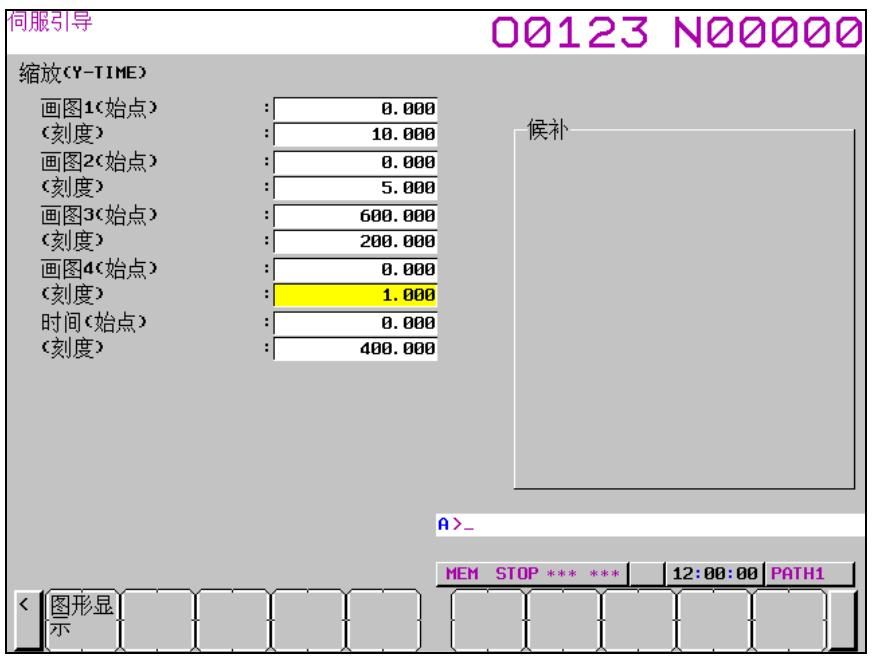

<details>
<summary>text_image</summary>

伺服引导
00123 N00000
缩放(Y-TIME)
画图1(始点) : 0.000
(刻度) : 10.000
画图2(始点) : 0.000
(刻度) : 5.000
画图3(始点) : 600.000
(刻度) : 200.000
画图4(始点) : 0.000
(刻度) : 1.000
时间(始点) : 0.000
(刻度) : 400.000
候补
A >_
MEM STOP *** ***
12:08:00 PATH1
< 图形显
示
</details>

图1.9.1.1 (i)

2 按下光标键，将光标移动到想要设定的参数位置。  
3 输入数据，按下 [INPUT] 键。  
4 重复 2 和 3 的步骤，设定所有的参数。  
5 按下软键 [图形显示]。

按照新设定的比例尺，显示出图 1.9.1.1 (j) 所示的波形画面。

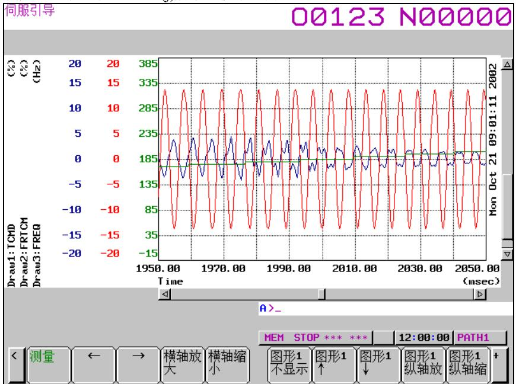

<details>
<summary>line chart</summary>

| Time (msec) | Red Line (%) | Blue Line (%) |
|-------------|--------------|---------------|
| 1950.00     | 385          | 185           |
| 1970.00     | 335          | 135           |
| 1990.00     | 285          | 85            |
| 2010.00     | 235          | 185           |
| 2030.00     | 185          | 135           |
| 2050.00     | 135          | 85            |
</details>

图1.9.1.1 (j)

## - Y-Time 图形操作

按下下面的软键，即可执行相应的操作。

- [测量]：进行有关测量的操作。  
- [←] : 向右边位移时间轴。  
- [→] : 向左边位移时间轴。  
- [横轴放大]：放大时间轴。  
- [横轴缩小]：缩小时间轴。  
- [图形 1 不显示]：切换 DRAW1 的显示/隐藏。  
- [图形 1 ↑] : 向下位移 DRAW1。

- [图形 1 ↓] : 向上位移 DRAW1。  
- [图形1纵轴放大]：放大DRAW1。  
- [图形1纵轴缩小]：缩小DRAW1。  
- [图形 2 不显示]：切换 DRAW2 的显示/隐藏。  
- [图形 2 ↑] : 向下位移 DRAW2。  
- [图形 2 ↓] : 向上位移 DRAW2。  
- [图形2纵轴放大]：放大DRAW2。  
- [图形2纵轴缩小]：缩小DRAW2。  
- [图形3不显示]：切换DRAW3的显示/隐藏。  
- [图形 3 ↑] : 向下位移 DRAW3。  
- [图形 3 ↓] : 向上位移 DRAW3。  
- [图形3纵轴放大]：放大DRAW3。  
- [图形3纵轴缩小]：缩小DRAW3。  
- [图形4不显示]：切换DRAW4的显示/隐藏。  
- [图形 4 ↑] : 向下位移 DRAW4。  
- [图形 4 ↓] : 向上位移 DRAW4。  
- [图形4纵轴放大]：放大DRAW4。  
- [图形4纵轴缩小]：缩小DRAW4。  
- [自动缩放]：自动进行比例缩放。  
- [纵轴扩大]：放大所有的 DRAW。  
- [纵轴缩小]：缩小所有的 DRAW。  
- [运算/G 设定]：进行运算和图形设定。  
- [比例设定]：进行比例尺设定。  
• [COM 1 输入] : 输入注释 1。  
• [COM 2 输入] : 输入注释 2。  
• [XY] : 转移到 XY 图形。  
- [圆]：转移到圆形(Circle)图形。  
- [FOURIER]：转换移到傅立叶(Fourier)图形。  
• [BODE]：转移到博德(Bode)图形。

## - 测量操作

按下软键 [测量]，即可执行与下列菜单对应的操作。

- [开始]：开始测量。  
- [起源]：设定原点值。  
- [停止] ：停止测量。  
- [取数]：进行有关测量的设定。

## - 改变测量的设定

1 软键 [测量] → [取数]，即可执行与下列菜单对应的操作。  
2 按下软键 [列表]。

出现 图 1.9.1.1 (k) 所示的列表画面。

需要进行当前所显示的通道以外的显示时，按下翻页键 ↑PAGE PAGE ↓，显示目标通道的画面。

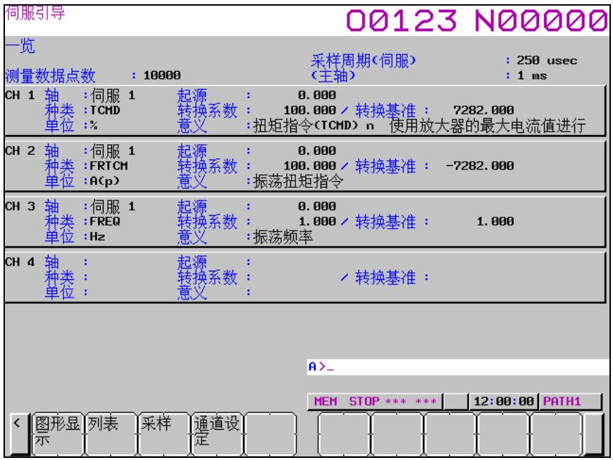

<details>
<summary>text_image</summary>

伺服引导
00123 N00000
一览
采样周期(伺服) : 250 usec
测量数据点数 : 10000 (主轴) : 1 ms
CH 1 轴 :伺服 1 起源 : 0.000
种类 :TCMD 转换系数 : 100.000 / 转换基准 : 7282.000
单位 :% 意义 :扭矩指令(TCMD)n 使用放大器的最大电流值进行
CH 2 轴 :伺服 1 起源 : 0.000
种类 :FRTCM 转换系数 : 100.000 / 转换基准 : -7282.000
单位 :A(p) 意义 :振荡扭矩指令
CH 3 轴 :伺服 1 起源 : 0.000
种类 :FREQ 转换系数 : 1.000 / 转换基准 : 1.000
单位 :Hz 意义 :振荡频率
CH 4 轴 : 起源 : 
种类 : 转换系数 : / 转换基准 :
单位 : 意义 :
A >_
MEM STOP *** *** 12:00:00 PATH1
< 图形显 列表 采样 通道设
示 定
</details>

图1.9.1.1 (k)

3 利用列表画面确认当前的设定。  
4 按下软键 [采样]。出现图 1.9.1.1 (l) 所示的测量设定画面。


<details>
<summary>text_image</summary>

伺服引导
00123 N00000
测量设定
测量数据点数 : 10000
触发系统 : 1
序.NO : 0
采样周期(伺服) : 9
(主轴) : 7
自动缩放 : 1
同步方式选择 : 1
日期 : Mon Oct 21 2002
时间 : 09:01:11
候补
采样周期(伺服)
1 : 100 ms
2 : 50 ms
3 : 20 ms
4 : 10 ms
5 : 5 ms
6 : 2 ms
7 : 1 ms
8 : 500 us
9 : 250 usec
10 : 125 us
11 : 62.5 us
A >_
MEM STOP *** ***
12:00:00 PATH1
< 图形显 列表 采样 通道设
示 定
</details>

图1.9.1.1 (l)

5 按下光标键，将光标移动到想要设定的参数位置。  
6 输入数据，按下 [INPUT] 键。  
7 重复 5 和 6 的步骤，设定所有的参数。  
8 按下软键 [通道设定]。出现图 1.9.1.1 (m) 所示的设定通道画面。
需要进行当前所显示的通道以外的设定时，按下翻页键 Page PAGE ，显示目标通道的画面。

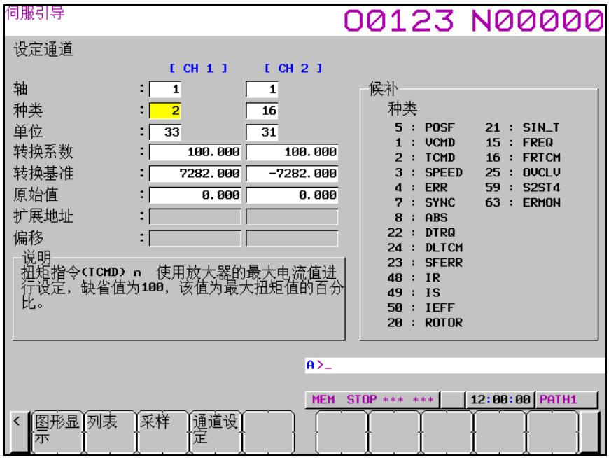

<details>
<summary>text_image</summary>

伺服引导
00123 N00000
设定通道
[ CH 1 ] [ CH 2 ]
轴 : 1 1
种类 : 2 16
单位 : 33 31
转换系数 : 100.000 100.000
转换基准 : 7282.000 -7282.000
原始值 : 0.000 0.000
扩展地址 :
偏移 :
说明
扭矩指令(TCMD) n 使用放大器的最大电流值进行设定,缺省值为100,该值为最大扭矩值的百分比。
候补
种类
5 : POSF 21 : SIN_T
1 : VCMD 15 : FREQ
2 : TCMD 16 : FRTCM
3 : SPEED 25 : OVCLV
4 : ERR 59 : S2ST4
7 : SYNC 63 : ERMON
8 : ABS
22 : DTRQ
24 : DLTCM
23 : SFERR
48 : IR
49 : IS
50 : IEFF
20 : ROTOR
A >_
MEM STOP *** *** 12:00:00 PATH1
< 图形显 列表 采样 通道设 定
</details>

图1.9.1.1 (m)

9 按下光标键，将光标移动到想要设定的参数位置。  
10 输入数据，按下 [INPUT] 键。  
11 重复 9 和 10 的步骤，设定所有的参数。  
12 按下软键 [图形显示]。出现图 1.9.1.1 (n) 所示的波形画面。


<details>
<summary>line chart</summary>

| Time (msec) | Value (%) | Frequency (Hz) |
|-------------|-----------|----------------|
| 0.00        | 40        | 1400           |
| 800.00      | 30        | 1200           |
| 1600.00     | 20        | 1000           |
| 2400.00     | 10        | 800            |
| 3200.00     | 5         | 600            |
| 4000.00     | 0         | 400            |
| 4800.00     | -10       | 200            |
| 5600.00     | -20       | 0              |
| 6400.00     | -30       | -15            |
| 7200.00     | -40       | -20            |
| 8000.00     | -40       | -20            |
| 8800.00     | -40       | -20            |
| 9600.00     | -40       | -20            |
| 10400.00    | -40       | -20            |
| 11200.00    | -40       | -20            |
| 12000.00    | -40       | -20            |
| 12800.00    | -40       | -20            |
| 13600.00    | -40       | -20            |
| 14400.00    | -40       | -20            |
| 15200.00    | -40       | -20            |
| 1600.00     | -40       | -20            |
| 1680.00     | -40       | -20            |
| 1760.00     | -40       | -20            |
| 1840.00     | -40       | -20            |
| 1920.00     | -40       | -20            |
| 200.00      | -40       | -20            |
| 268.75      | -40       | -20            |
| 336.5      | -40       | -20            |
| 415.25      | -40       | -20            |
| 494.1      | -40       | -20            |
| 573.85      | -40       | -20            |
| 653.7      | -40       | -20            |
| 733.5      | -40       | -20            |
| 813.25      | -40       | -20            |
| 893.1      | -40       | -20            |
| 973.85      | -40       | -20            |
| 1,367.5     | -40       | -20            |
| 1,853.25    | -40       | -20            |
| 2,347.1     | -40       | -20            |
| 3,733.85    | -40       | -20            |
| 4,367.7     | -40       | -20            |
| 5,733.5     | -40       | -20            |
| 6,367.3     | -40       | -20            |
| 7,733.1     | -40       | -20            |
| 8,367.9     | -40       | -20            |
| 9,733.7     | -40       | -20            |
| 1,367.5     | -40       | -20            |
| 1,853.25    | -40       | -20            |
| 2,347.1     | -40       | -20            |
| 3,733.85    | -40       | -20            |
| 5,367.7     | -40       | -20            |
| 6,133.5     | -40       | -20            |
| 6,733.3     | -40       | -20            |
| 7,367.1     | -40       | -20            |
| 8,133.85    | -40       | -20            |
| 8,733.7     | -40       | -20            |
| 9,367.5     | -40       | -20            |
| 1,367.3     | -40       | -20            |
| 1,853.1     | -40       | -20            |
| 2,347.9     | -40       | -20            |
| 3,733.7     | -40       | -20            |
| 5,367.5     | -40       | -20            |
| 6,133.3     | -40       | -20            |
| 6,733.1     | -40       | -20            |
| 7,367.9     | -40       | -20            |
| 8,133.7     | -40       | -20            |
| 8,733.5     | -40       | -20            |
| 9,367.3     | -40       | -2
</details>

图1.9.1.1 (n)

13 设定的内容从接下来进行测量的时候起有效。请结合新的通道设定改变运算和图形设定以及比例尺设定。

## 解释

- 设定测量设定画面  
- 测量数据点数

输入 1～10000 范围内的数值。设定内容为将要测量的数据点数，数据点数和采样周期的乘积就是数据的测量时间。在伺服和主轴上设定了不同的采样周期时，就应用采样周期较短一方的数据点数，采样周期较长一方的数据点数随着采样周期的比率逐渐减少。

## - 触发系统、序.NO

输入数值——路径和顺序号，指定测量开始的触发器。可以在路径中指定的数值，是将路径1作为1依次计数的连号，最大值为CNC中所设定的路径数。序.NO的输入范围为0～99999。为序.NO指定了0的情况下，从按下软键[测量]→[开始]的时刻起开始测量。

## - 采样周期(伺服)、(主轴)

利用数值个别指定伺服轴和主轴轴的采样周期。可以指定的数值，如表 1.9.1.1 (a) 采样周期所示。

表1.9.1.1 (a) 采样周期


### PMC报警: 输入数值
- **故障内容**: 含义(采样周期)
- **处理办法**: 伺服轴

### PMC报警: 1
- **故障内容**: 100ms
- **处理办法**: 可以指定

### PMC报警: 2
- **故障内容**: 50ms
- **处理办法**: 可以指定

### PMC报警: 3
- **故障内容**: 20ms
- **处理办法**: 可以指定

### PMC报警: 4
- **故障内容**: 10ms
- **处理办法**: 可以指定

### PMC报警: 5
- **故障内容**: 5ms
- **处理办法**: 可以指定

### PMC报警: 6
- **故障内容**: 2ms
- **处理办法**: 可以指定

### PMC报警: 7
- **故障内容**: 1ms
- **处理办法**: 可以指定

### PMC报警: 8
- **故障内容**: 500μs
- **处理办法**: 可以指定

### PMC报警: 9
- **故障内容**: 250μs
- **处理办法**: 可以指定

### PMC报警: 10
- **故障内容**: 125μs
- **处理办法**: 可以指定

### PMC报警: 11
- **故障内容**: 62.5μs
- **处理办法**: 可以指定


## - 自动缩放

选择是否在每次测量时利用数值自动地进行比例缩放。可以设定的数值为1（=:不执行）、2（=:仅执行1次）、3（=:每次执行）。进行自动比例缩放时，为使整个波形都落在图形的显示范围内部而改变比例尺，所以在观察波形大小变化这样的情况下，不使用自动比例缩放而将其固定起来则较为方便。

## - 同步方式选择

可以设定的数值为 1（=:不选择）、2（=:选择）。

Cs 轮廓控制等需要进行伺服轴和主轴插补的情况下，遇到采样周期相互不同的数据的时间同步不匹配时若进行相应设定，有时就较为方便。(有的情况下则没有效果。)

## - 日期、时间

显示进行数据测量的日期和时刻。（此项目为只读。）

## - 设定设定通道画面

通道设定可以指定测量数据的设定，每个通道最多可指定 4 个测量数据。务须从通道号较小的一方开始指定。

## - 轴

指定将要测量的数据的轴号。指定伺服轴的情况下，以正值指定控制轴号；指定主轴的情况下，以负值指定控制主轴号。可以设定的最大值分别为 CNC 中所设定的伺服轴数和主轴数。在将通道置于有效的情况下，务须从通道号较小的一方开始指定。指定 0 时，该通道就无效(没有测量)。

## - 种类

在选择了伺服轴的情况下，可以设定的数值如表1.9.1.1(b)伺服电机的测量数据种类所示。此外，在选择了主轴的情况下，如表1.9.1.1(c)主轴电机的测量数据种类所示。指定想要测量的数据的种类。

表1.9.1.1 (b) 伺服电机的测量数据种类


### PMC报警: 输入数值
- **故障内容**: 项目名称
- **处理办法**: 内容

### PMC报警: 5
- **故障内容**: POSF
- **处理办法**: 位置反馈累计值

### PMC报警: 1
- **故障内容**: VCMD
- **处理办法**: 速度指令

### PMC报警: 2
- **故障内容**: TCMD
- **处理办法**: 转矩指令

### PMC报警: 3
- **故障内容**: SPEED
- **处理办法**: 电机速度

### PMC报警: 4
- **故障内容**: ERR
- **处理办法**: 位置偏差

### PMC报警: 7
- **故障内容**: SYNC
- **处理办法**: 刚性攻丝同步误差(仅限攻丝轴)

### PMC报警: 8
- **故障内容**: ABS
- **处理办法**: 内置脉冲编码器的绝对位置

### PMC报警: 22
- **故障内容**: DTRQ
- **处理办法**: 外力干涉推测值

### PMC报警: 24
- **故障内容**: DLTCM
- **处理办法**: 同步轴的转矩差

### PMC报警: 23
- **故障内容**: SFERR
- **处理办法**: 双重位置反馈的半-全误差值

### PMC报警: 48
- **故障内容**: IR
- **处理办法**: R相电流值

### PMC报警: 49
- **故障内容**: IS
- **处理办法**: S相电流值

### PMC报警: 50
- **故障内容**: IEFF
- **处理办法**: 实际电流

### PMC报警: 20
- **故障内容**: ROTOR
- **处理办法**: 转子相位

### PMC报警: 21
- **故障内容**: SIN_T
- **处理办法**: 转子位置 SIN θ

### PMC报警: 15
- **故障内容**: FREQ
- **处理办法**: 外部干涉输入频率(用于频率特性的测量)

### PMC报警: 16
- **故障内容**: FRTCM
- **处理办法**: 外部干涉输入转矩(用于频率特性的测量)

### PMC报警: 25
- **故障内容**: OVCLV
- **处理办法**: OVC 级别


表1.9.1.1 (c) 主轴电机的测量数据种类


### PMC报警: 输入数值
- **故障内容**: 项目名称
- **处理办法**: 内容

### PMC报警: 1
- **故障内容**: SPEED
- **处理办法**: 电机速度

### PMC报警: 2
- **故障内容**: INORM
- **处理办法**: 电机电流的振幅

### PMC报警: 3
- **故障内容**: TCMD
- **处理办法**: 转矩指令

### PMC报警: 4
- **故障内容**: VCMD
- **处理办法**: 速度指令

### PMC报警: 5
- **故障内容**: VERR
- **处理办法**: 速度偏差

### PMC报警: 7
- **故障内容**: PERR1
- **处理办法**: 位置错误

### PMC报警: 8
- **故障内容**: ORERR
- **处理办法**: 定向时的位置错误

### PMC报警: 9
- **故障内容**: PCPOS
- **处理办法**: 位置反馈累计值

### PMC报警: 10
- **故障内容**: MCMD
- **处理办法**: 每个 ITP 周期的指令脉冲

### PMC报警: 11
- **故障内容**: PERR2
- **处理办法**: 位置错误

### PMC报警: 13
- **故障内容**: CSPOS
- **处理办法**: 位置反馈累计值

### PMC报警: 14
- **故障内容**: SPCMD
- **处理办法**: 速度指令数据

### PMC报警: 15
- **故障内容**: SPCT1
- **处理办法**: 主轴控制信号 1

### PMC报警: 16
- **故障内容**: SPCT2
- **处理办法**: 主轴控制信号 2

### PMC报警: 17
- **故障内容**: SPST1
- **处理办法**: 主轴状态信号 1

### PMC报警: 18
- **故障内容**: SPST2
- **处理办法**: 主轴状态信号 2

### PMC报警: 19
- **故障内容**: ORSEQ
- **处理办法**: 定向顺序数据

### PMC报警: 20
- **故障内容**: FREQ
- **处理办法**: 励振频率

### PMC报警: 21
- **故障内容**: FRTCM
- **处理办法**: 励振转矩指令

### PMC报警: 25
- **故障内容**: PA1
- **处理办法**: 电机传感器 A 相信号的 AD 值

### PMC报警: 26
- **故障内容**: PB1
- **处理办法**: 电机传感器 B 相信号的 AD 值

### PMC报警: 27
- **故障内容**: PA2
- **处理办法**: 主轴传感器 A 相信号的 AD 值

### PMC报警: 28
- **故障内容**: PB2
- **处理办法**: 主轴传感器 B 相信号的 AD 值

### PMC报警: 29
- **故障内容**: MFBDF
- **处理办法**: 电机反馈增量数据

### PMC报警: 30
- **故障内容**: SFBDF
- **处理办法**: 主轴反馈增量数据

### PMC报警: 32
- **故障内容**: DTRQ
- **处理办法**: 推测负载转矩


- 单位  
可以设定的数值如表1.9.1.1(d)测量数据单位所示。但是，如表1.9.1.1(e)测量数据单位的对应关系所示，不能进行对应于测量数据种类的单位以外的指定。通常不必改变已被自动设定的值。当由于极坐标变换等需要对旋转轴的实际位置进行运算时，必须选择deg。

表1.9.1.1 (d) 测量数据单位


### PMC报警: 输入数值
- **故障内容**: 单位
- **处理办法**: 输入数值

### PMC报警: 4
- **故障内容**: mm
- **处理办法**: 31

### PMC报警: 5
- **故障内容**: m
- **处理办法**: 33

### PMC报警: 6
- **故障内容**: μm
- **处理办法**: 34

### PMC报警: 7
- **故障内容**: nm
- **处理办法**: 35

### PMC报警: 8
- **故障内容**: inch
- **处理办法**: 32

### PMC报警: 9
- **故障内容**: deg
- **处理办法**: 36

### PMC报警: 14
- **故障内容**: m/min
- **处理办法**: 38

### PMC报警: 20
- **故障内容**: 1/min
- **处理办法**: 39


表1.9.1.1 (e) 测量数据单位的对应关系


### PMC报警: 伺服电机的数据种类
- **故障内容**: 对应单位
- **处理办法**: 主轴电机的数据种类

### PMC报警: 5:POSF
- **故障内容**: 4:mm6:μm8:inch9:deg
- **处理办法**: 1:SPEED

### PMC报警: 1:VCMD
- **故障内容**: 20:1/min14:m/min
- **处理办法**: 2:INORM

### PMC报警: 2:TCMD
- **故障内容**: 31:A(p)33:%
- **处理办法**: 3:TCMD

### PMC报警: 3:SPEED
- **故障内容**: 20:1/min14:m/min
- **处理办法**: 4:VCMD

### PMC报警: 4:ERR
- **故障内容**: 4:mm6:μm8:inch9:deg
- **处理办法**: 5:VERR

### PMC报警: 7:SYNC
- **故障内容**: 36:--
- **处理办法**: 7:PERR1

### PMC报警: 8:ABS
- **故障内容**: 4:mm6:μm8:inch9:deg
- **处理办法**: 8:ORERR

### PMC报警: 22:DTRQ
- **故障内容**: 31:A(p)
- **处理办法**: 9:PCPOS

### PMC报警: 24:DLTCM
- **故障内容**: 31:A(p)
- **处理办法**: 10:MCMD

### PMC报警: 23:SFERR
- **故障内容**: 4:mm6:μm8:inch9:deg
- **处理办法**: 11:PERR2

### PMC报警: 48:IR
- **故障内容**: 31:A(p)33:%
- **处理办法**: 13:CSPOS

### PMC报警: 49:IS
- **故障内容**: 31:A(p)33:%
- **处理办法**: 14:SPCMD

### PMC报警: 50:IEFF
- **故障内容**: 31:A(p)33:%
- **处理办法**: 15:SPCT1

### PMC报警: 20:ROTOR
- **故障内容**: 9:deg
- **处理办法**: 16:SPCT2

### PMC报警: 21:SINT
- **故障内容**: 36:--
- **处理办法**: 17:SPST1

### PMC报警: 15:FREQ
- **故障内容**: 32:Hz
- **处理办法**: 18:SPST2

### PMC报警: 16:FRTCM
- **故障内容**: 31:A(p)
- **处理办法**: 19:ORSEQ

### PMC报警: 25:OVCLV
- **故障内容**: 33:%
- **处理办法**: 20:FREQ

### PMC报警: 
- **故障内容**: 21:FRTCM
- **处理办法**: 31:A(p)


- 转换系数  
设定由各通道的种类所选数据的加权（相当于分子 = 物理量）。对于与 POSF 等的位置有关的数据，设定每一脉冲的移动距离，对于 VCMD、SPEED，设定 3750，对于 TCMD，设定使用中的放大器的最大电流值。

## - 转换基准

设定由各通道的种类所选数据的加权（相当于分母 = 原始数据单位）。通常使用在选择种类时被自动设定的值。与 POSF 等位置有关的数据中，通常系统自动设定 1，对于 VCMD、SPEED 系统自动设定 32768，对于 TCMD，系统自动设定 7282。

## - 原始值

设定在按下软键 [测量] → [起源] 时被作为各通道的初始值设定的值。

## - 扩展地址

通常不在不可输入的状态下使用。（此项目为只读。）

## - 偏移

通常不在不可输入的状态下使用。（选择种类时，其值在某些情况下会被自动设定。）

## - 设定运算&图形画面

设定运算和图形设定可以指定图形描绘的设定，每幅图最多可指定 4 个测量数据。

## - 运算

可以设定的数值如表 1.9.1.1 (f) Y-Time图形的运算所示。

如 表 1.9.1.1 (g) Y-Time图形的条件所示，不能指定没有满足图形的显示条件的运算。

表1.9.1.1 (f) Y-Time 图形的运算


### PMC报警: 输入数值
- **故障内容**: 运算的名称
- **处理办法**: 运算的含义

### PMC报警: 1
- **故障内容**: N/A
- **处理办法**: 隐藏。

### PMC报警: 2
- **故障内容**: Y-Time
- **处理办法**: 通常显示(不进行运算,原样显示所选通道的数据)输入1成为纵轴。可以选择所有测量通道。

### PMC报警: 3
- **故障内容**: Diff1 (VT)
- **处理办法**: 位置数据的1阶微分显示(相当于速度)输入1成为纵轴。仅可选择已经测量了位置的通道。

### PMC报警: 4
- **故障内容**: Diff2 (AT)
- **处理办法**: 位置数据的2阶微分显示(相当于加速度)输入1成为纵轴。仅可选择已经测量了位置的通道。

### PMC报警: 5
- **故障内容**: Tangent
- **处理办法**: 切线速度显示仅可选择已经测量了位置的通道。显示输入1和输入2的合成速度。

### PMC报警: 6
- **故障内容**: Tangent N
- **处理办法**: N轴切线速度显示仅可选择已经测量了位置的通道。显示从由输入1所指定通道到由输入2所指定通道的位置数据的合成速度。合成的通道均需要位置数据。

### PMC报警: 7
- **故障内容**: Smooth
- **处理办法**: 进给的平顺度显示仅可选择已经测量了位置的通道。显示将显示的开始时刻(始点)和结束时刻(终点)假设为在一定速度下发生移动时的偏离理想位置的程度。

### PMC报警: 8
- **故障内容**: Synchro
- **处理办法**: 同步误差显示仅可选择已经测量了位置的通道。显示输入1和输入2之差。目前输入1和输入2的比例关系仅限1比1的对应关系。

### PMC报警: 9
- **故障内容**: Bit
- **处理办法**: 位显示基于由输入1指定的通道的测量数据,显示由输入2指定的该位的状态。


表1.9.1.1 (g) Y-Time 图形的条件


### PMC报警: 运算
- **故障内容**: 坐标变换
- **处理办法**: 输入1

### PMC报警: 2:Y-Time
- **故障内容**: 1:Normal
- **处理办法**: 已测量的通道

### PMC报警: 2:Polar
- **故障内容**: 已测量了位置的通道(仅限单位为mm、μm、inch的数据)
- **处理办法**: 已测量了位置的通道(仅限单位为deg的数据)

### PMC报警: 3:Angular
- **故障内容**: 已测量了位置的通道
- **处理办法**: 已测量了位置的通道

### PMC报警: 3:Diff1(VT)
- **故障内容**: 1:Normal
- **处理办法**: 已测量了位置的通道

### PMC报警: 4:Diff2(AT)
- **故障内容**: 1:Normal
- **处理办法**: 已测量了位置的通道

### PMC报警: 5:Tangent
- **故障内容**: 1:Normal
- **处理办法**: 已测量了位置的通道

### PMC报警: 2:Polar
- **故障内容**: 已测量了位置的通道(仅限单位为mm、μm、inch的数据)
- **处理办法**: 已测量了位置的通道(仅限单位为deg的数据)

### PMC报警: 3:Angular
- **故障内容**: 已测量了位置的通道
- **处理办法**: 已测量了位置的通道

### PMC报警: 6 : Tangent N
- **故障内容**: 1 : Normal
- **处理办法**: 已测量了位置的通道

### PMC报警: 7 : Smooth
- **故障内容**: 1 : Normal
- **处理办法**: 已测量了位置的通道

### PMC报警: 8 : Synchro
- **故障内容**: 1 : Normal
- **处理办法**: 已测量的通道

### PMC报警: 9 : Bit
- **故障内容**: 1 : Normal
- **处理办法**: 已测量的通道


## - 输入1

可以设定的数值是将通道 1 作为 1 依次计数的连号。最大值为通过通道设定进行了测量设定的最大的通道号。如表 1.9.1.1 (g) Y-Time 图形的条件所示，不能指定没有满足图形的显示条件的输入 1。

## - 输入2

可以设定的数值通常是将通道1作为1依次计数的连号。最大值为通过通道设定进行了测量设定的最大的通道号。但是，运算中指定了Bit的情况下，是将位位置0作为10依次计数的连号。此时可以指定的最大值为表示位15的25。如表1.9.1.1(g)Y-Time图形的条件所示，不能指定没有满足图形的显示条件的输入2。

## - 显示单位

可以指定的数值，如表 1.9.1.1 (h) 显示单位。可以指定的显示单位的条件，如表 1.9.1.1 (i) Y-Time图形显示单位的对应关系所示。

表1.9.1.1 (h) 显示单位


### PMC报警: 输入数值
- **故障内容**: 单位
- **处理办法**: 输入数值

### PMC报警: 1
- **故障内容**: sec
- **处理办法**: 19

### PMC报警: 2
- **故障内容**: msec
- **处理办法**: 20

### PMC报警: 3
- **故障内容**: μsec
- **处理办法**: 21

### PMC报警: 4
- **故障内容**: mm
- **处理办法**: 22

### PMC报警: 5
- **故障内容**: m
- **处理办法**: 23

### PMC报警: 6
- **故障内容**: μm
- **处理办法**: 24

### PMC报警: 7
- **故障内容**: nm
- **处理办法**: 25

### PMC报警: 8
- **故障内容**: inch
- **处理办法**: 26

### PMC报警: 9
- **故障内容**: deg
- **处理办法**: 27

### PMC报警: 10
- **故障内容**: mdeg
- **处理办法**: 28

### PMC报警: 11
- **故障内容**: mm/sec
- **处理办法**: 29

### PMC报警: 12
- **故障内容**: mm/min
- **处理办法**: 30

### PMC报警: 13
- **故障内容**: m/sec
- **处理办法**: 31

### PMC报警: 14
- **故障内容**: m/min
- **处理办法**: 32

### PMC报警: 15
- **故障内容**: inch/sec
- **处理办法**: 33

### PMC报警: 16
- **故障内容**: inch/min
- **处理办法**: 34

### PMC报警: 17
- **故障内容**: deg/sec
- **处理办法**: 35

### PMC报警: 18
- **故障内容**: deg/min
- **处理办法**: 36


表1.9.1.1 (i) Y-Time 图形显示单位的对应关系


### PMC报警: 运算
- **故障内容**: 输入1测量数据的单位
- **处理办法**: 可以指定的显示单位

### PMC报警: 2:Y-Time
- **故障内容**: 4:mm5:m6:μm7:nm8:inch
- **处理办法**: 4:mm5:m6:μm7:nm8:inch

### PMC报警: 3:Diff1(VT)
- **故障内容**: 4:mm5:m6:μm7:nm8:inch
- **处理办法**: 11:mm/sec12:mm/min13:m/sec14:m/min15:inch/sec16:inch/min

### PMC报警: 4:Diff2(AT)
- **故障内容**: 4:mm5:m6:μm7:nm8:inch
- **处理办法**: 21:mm/sec/sec22:mm/min/min23:m/sec/sec24:m/min/min25:inch/sec/sec26:inch/min/min

### PMC报警: 5:Tangent
- **故障内容**: 4:mm5:m6:μm7:nm8:inch9:deg
- **处理办法**: 11:mm/sec12:mm/min13:m/sec14:m/min15:inch/sec16:inch/min

### PMC报警: 6:Tangent N
- **故障内容**: 4:mm5:m6:μm7:nm8:inch9:deg
- **处理办法**: 11:mm/sec12:mm/min13:m/sec14:m/min15:inch/sec16:inch/min

### PMC报警: 7: Smooth
- **故障内容**: 4:mm5:m6:μm7:nm8:inch9:deg
- **处理办法**: 4:mm5:m6:μm7:nm8:inch9:deg

### PMC报警: 8: Synchro
- **故障内容**: 测量单位不受影响
- **处理办法**: 4:mm5:m6:μm7:nm8:inch9:deg36:--

### PMC报警: 9: Bit
- **故障内容**: 测量单位不受影响
- **处理办法**: 没有显示单位的指定


## - 座标转换

可以设定的数值如下：1 表示Normal（没有坐标变换），2 表示Polar（极坐标插补的坐标变换），3 表示Angular（倾斜轴控制的坐标变换）。可以指定的坐标变换的条件，如表 1.9.1.1 (j) Y-Time图形坐标变换的对应关系所示。在指定Normal（没有坐标变换）时，没有条件。

表1.9.1.1 (j) Y-Time 图形坐标变换的对应关系


### PMC报警: 运算
- **故障内容**: 输入1
- **处理办法**: 输入2

### PMC报警: 2:Y-Time5:Tangent
- **故障内容**: 已测量了位置的通道(仅限单位为mm、μm、inch的数据)
- **处理办法**: 已测量了位置的通道(仅限单位为deg的数据)

### PMC报警: 已测量了位置的通道
- **故障内容**: 已测量了位置的通道
- **处理办法**: 3:Angular


## - 倾斜角

倾斜角度以 deg 为单位进行设定。设定的数值唯有在坐标变换中指定了 Angular（倾斜轴控制的坐标变换）的情况下才有效。

## - 设定缩放画面

比例尺设定允许用户为每幅图最多设定 4 种比例尺，并可对时间轴指定图形描绘的比例尺。

## - 始点

设定显示数据（画图 1～画图 4:纵轴）的中心坐标。

设定时间（横轴）的显示开始时间。

## - 刻度

设定显示数据（画图 1～画图 4:纵轴）的每一栅格的值。

设定时间（横轴）的每一栅格的时间。

## - 测量操作

## - 起源

在开始测量时，使通过设定通道画面设定在每一个通道上的原点值成为测量数据的初始值。该操作仅对已经设定了测量位置的通道有效。

## 限制

## - 数据的更新周期

与位置相关的数据以 1ms 为单位更新，与电流相关的数据以电流周期为单位更新。因此，即使指定了比数据的更新周期更短的采样周期，在数据更新周期的范围内，显示相同内容的数据。

## - 采样周期和测量通道数

具有如表 1.9.1.1 (k) 采样周期和测量通道数所示的限制。

表1.9.1.1 (k) 采样周期和测量通道数


此外，伺服轴、主轴轴具有如下限制。

1 每个伺服 DSP 可以获取的通道数

- 采样周期大于等于 $1\mathrm{ms}$ 、 $500\mu \mathrm{s}$ 、 $250\mu \mathrm{s}$ 时，至多可获取4个通道。  
- 采样周期为 $125\mu \mathrm{s}$ 时，至多可获取2个通道。  
- 采样周期为 $62.25\mu \mathrm{s}$ 时，仅可获取1个通道。

2 每个主轴可以获取的通道数

- 采样周期大于等于 $1 \mathrm{~ms}$ 时，至多可获取2个通道。  
- 采样周期为 $500\mathrm{ms}$ 时，仅可获取1个通道。

## 1.9.1.2 XY图形

该图形可针对测量数据，使用 2 个轴的数据显示二维轨迹。

最多可同时显示 2 幅图。

## 显示和设定 XY 图形的步骤

## 步骤

下面描述至测量数据显示的步骤。

1 按下功能键 SYSTEM。  
2 按继续菜单键 ▷ 数次，直到 [波形显示] 显示。  
3 按下软键 [波形显示]。  
4 按下软键 [XY]。

出现 图 1.9.1.2 (a) 所示的波形画面。

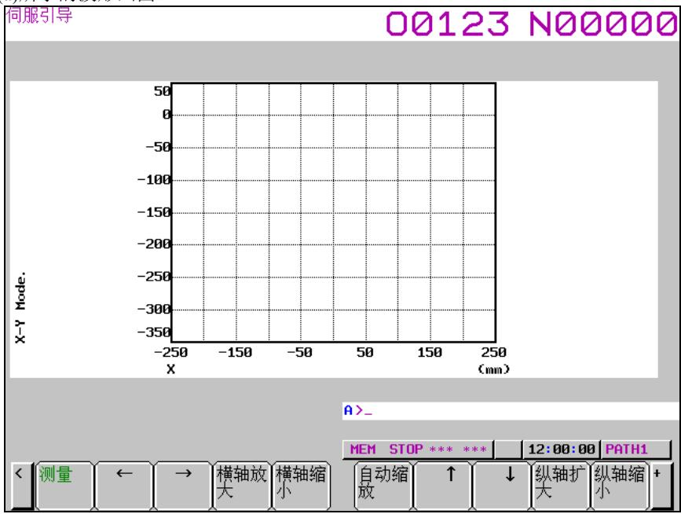

<details>
<summary>text_image</summary>

伺服引导
00123 N00000
X-Y Mode.
-250 -150 -50 50 150 250
X (mm)
A >_
MEM STOP *** ***
12:00:00 PATH1
< 测量 ← → 横轴放 横轴缩 小 自动缩 ↑ ↓ 纵轴扩 大 纵轴缩 小 +
</details>

图1.9.1.2 (a)

5 按下软键 [测量]。  
6 按下软键 [取数]。

7 按下软键 [采样]。出现图 1.9.1.2 (b) 所示的测量设定画面。


<details>
<summary>text_image</summary>

伺服引导
00123 N00000
测量设定
测量数据点数 : 10000
触发系统 : 1
序.NO : 0
采样周期(伺服) : 9
(主轴) : 7
自动缩放 : 1
同步方式选择 : 1
日期 : Mon Oct 21 2002
时间 : 09:01:11
候补
采样周期(伺服)
1 : 100 ms
2 : 50 ms
3 : 20 ms
4 : 10 ms
5 : 5 ms
6 : 2 ms
7 : 1 ms
8 : 500 us
9 : 250 usec
10 : 125 us
11 : 62.5 us
A >_
MEM STOP *** *** 12:00:00 PATH1
< 图形显 列表 采样 通道设
示 定
</details>

图1.9.1.2 (b)

8 按下光标键，将光标移动到想要设定的参数位置。  
9 输入数据，按下 [INPUT] 键。  
10 重复 8 和 9 的步骤，设定所有的参数。  
11 按下软键 [通道设定]。出现图 1.9.1.2 (c) 所示的设定通道画面。

需要进行当前所显示的通道以外的设定时，按下翻页键 $\boxed{\uparrow}$ PAGE $\boxed{\downarrow}$ ，显示目标通道的画面。

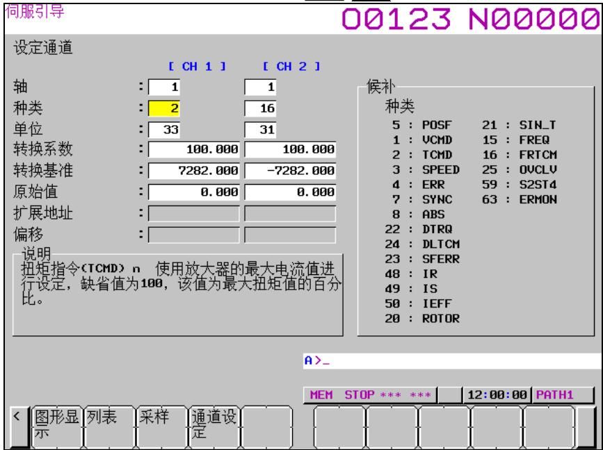

<details>
<summary>text_image</summary>

伺服引导
00123 N00000
设定通道
[ CH 1 ] [ CH 2 ]
轴 : 1 1
种类 : 2 16
单位 : 33 31
转换系数 : 100.000 100.000
转换基准 : 7282.000 -7282.000
原始值 : 0.000 0.000
扩展地址 :
偏移 :
说明
扭矩指令(TCMD) n 使用放大器的最大电流值进行设定, 缺省值为100, 该值为最大扭矩值的百分比。
候补
种类
5 : POSF 21 : SIN_T
1 : VCMD 15 : FREQ
2 : TCMD 16 : FRTCM
3 : SPEED 25 : OVCLV
4 : ERR 59 : S2ST4
7 : SYNC 63 : ERMON
8 : ABS
22 : DTRQ
24 : DLTCM
23 : SFERR
48 : IR
49 : IS
50 : IEFF
20 : ROTOR
A >_
MEM STOP *** ***
12:00:00 PATH1
< 图形显 列表 采样 通道设 定
</details>

图1.9.1.2 (c)

12 按下光标键，将光标移动到想要设定的参数位置。  
13 输入数据，按下 [INPUT] 键。  
14 重复 12 和 13 的步骤，设定所有的参数。  
15 按下软键 [图形显示]。

16 按下软键 [运算/G 设定]。出现图 1.9.1.2 (d) 所示的运算&图形画面。

需要进行当前所显示的图以外的设定时，按下翻页键 $\boxed{\uparrow}$ $\boxed{PAGE}$ $\boxed{PAGE}$ ，显示目标图的画面。

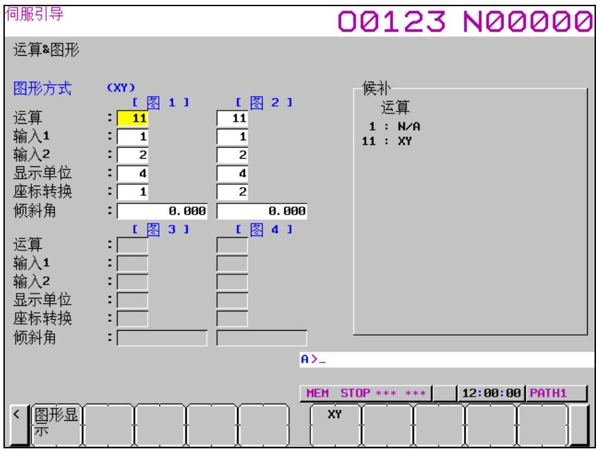

<details>
<summary>text_image</summary>

伺服引导
00123 N00000
运算&图形
图形方式 (XY)
[ 图 1 ] [ 图 2 ]
运算 : 11 11
输入1 : 1 1
输入2 : 2 2
显示单位 : 4 4
坐标转换 : 1 2
倾斜角 : 0.000 0.000
候补
运算
1 : N/A
11 : XY
运算 : 
输入1 : 
输入2 : 
显示单位 : 
坐标转换 : 
倾斜角 : 
A >_
MEM STOP *** ***
12:00:00 PATH1
< 图形显
示
XY
</details>

图1.9.1.2 (d)

17 按下光标键，将光标移动到想要设定的参数位置。  
18 输入数据，按下 [INPUT] 键。  
19 重复 17 和 18 的步骤，设定所有的参数。  
20 按下软键 [图形显示]。  
21 软键 [比例设定]。出现图 1.9.1.2 (e) 所示的缩放画面。

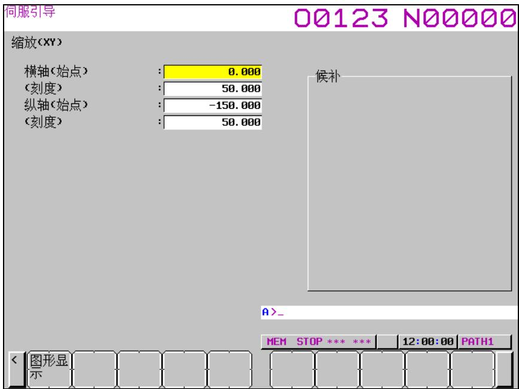

<details>
<summary>text_image</summary>

伺服引导
00123 N00000
缩放(XY)
横轴(始点) : 0.000
(刻度) : 50.000
纵轴(始点) : -150.000
(刻度) : 50.000
候补
A >_
MEM STOP *** ***
12:00:00 PATH1
< 图形显
示
</details>

图1.9.1.2 (e)

22 按下光标键，将光标移动到想要设定的参数位置。  
23 输入数据，按下 [INPUT] 键。  
24 重复 22 和 23 的步骤，设定所有的参数。

25 按下软键 [图形显示]。  
26 按下软键 [测量]。  
27 按下软键 [开始]。  
28 开始自动运行或者手动运行。  
29 测量结束后，出现图 1.9.1.2 (f) 所示的波形画面。

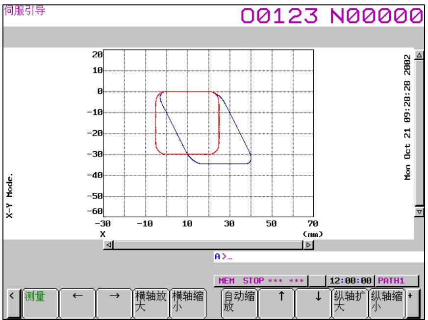

<details>
<summary>text_image</summary>

伺服引导
00123 N00000
Mon Oct 21 09:28:28 2002
X-Y Mode.
-30 -10 0 20
X (mm)
-30 10 20
-30 30 40
A >_
MEM STOP *** ***
12:00:00 PATH1
< 测量 ← → 横轴放 横轴缩 小 自动缩 放 ↑ ↓ 纵轴扩 大 纵轴缩 小 +
</details>

图1.9.1.2 (f)

## - 改变运算&图形画面

下面描述根据需要改变运算和图形设定的步骤。

1 按下软键 [运算/G 设定]。

出现 图 1.9.1.2 (g) 所示的运算 & 图形画面。

需要进行当前所显示的图以外的设定时，按下翻页键 $\boxed{\uparrow}$ PAGE $\boxed{\downarrow}$ ，显示目标图的画面。

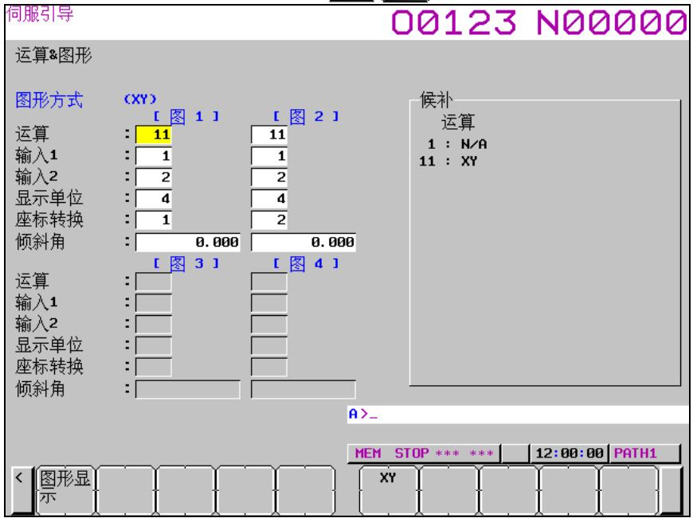

<details>
<summary>text_image</summary>

伺服引导
00123 N00000
运算&图形
图形方式 (XY)
[图 1] [图 2]
运算 : 11 11
输入1 : 1 1
输入2 : 2 2
显示单位 : 4 4
座标转换 : 1 2
倾斜角 : 0.000 0.000
候补
运算
1 : N/A
11 : XY
运算 :
输入1 :
输入2 :
显示单位 :
座标转换 :
倾斜角 :
[图 3] [图 4]
A >_
MEM STOP *** ***
12:00:00 PATH1
< 图形显
示
XY
</details>

图1.9.1.2 (g)

2 按下光标键，将光标移动到想要设定的参数位置。  
3 输入数据，按下 [INPUT] 键。

4 重复 2 和 3 的步骤，设定所有的参数。  
5 按下软键 [图形显示]。

按照新设定的运算和图形设定，显示出图 1.9.1.2 (h) 所示的波形画面。

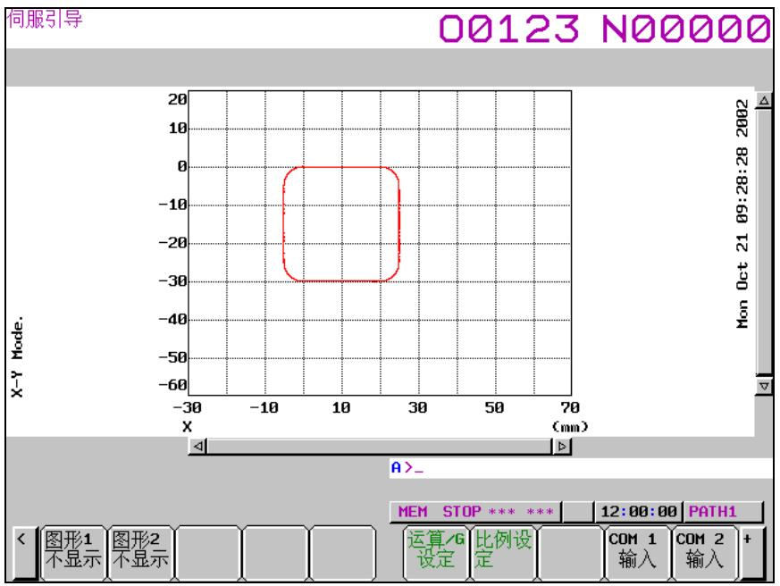

<details>
<summary>text_image</summary>

伺服引导
00123 N00000
Mon Oct 21 09:28:28 2002
X-Y Mode.
-30 -10 0 70
X (mm)
A >_
MEM STOP *** ***
12:08:00 PATH1
< 图形1
不显示
图形2
不显示
运算/G
设定
比例设
定
COM 1
输入
COM 2
输入
</details>

图1.9.1.2 (h)

## - 改变缩放画面

下面描述根据需要改变比例尺的步骤。

1 软键 [比例设定]。出现图 1.9.1.2 (i) 所示的缩放画面。


<details>
<summary>text_image</summary>

伺服引导
00123 N00000
缩放(XY)
横轴(始点) : 0.000
(刻度) : 50.000
纵轴(始点) : -150.000
(刻度) : 50.000
候补
A >_
MEM STOP *** ***
12:00:00 PATH1
< 图形显
示
</details>

图1.9.1.2 (i)

2 按下光标键，将光标移动到想要设定的参数位置。  
3 输入数据，按下 [INPUT] 键。  
4 重复 2 和 3 的步骤，设定所有的参数。  
5 按下软键 [图形显示]。

按照新设定的比例尺，显示出图 1.9.1.2 (j) 所示的波形画面。

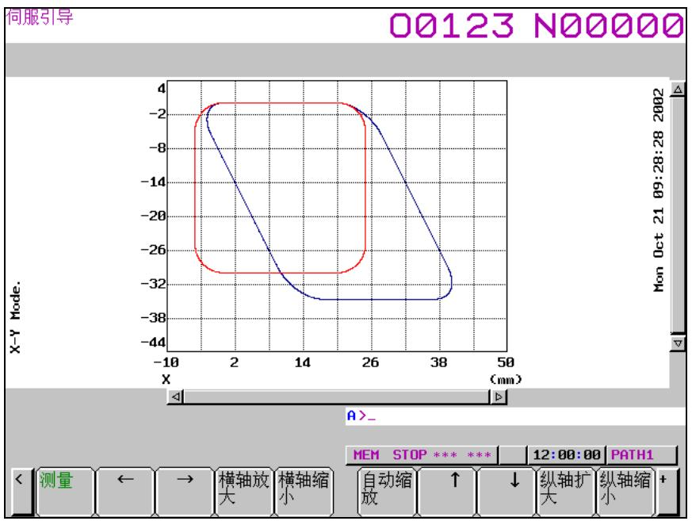

<details>
<summary>text_image</summary>

伺服引导
00123 N00000
Mon Oct 21 09:28:28 2002
X-Y Mode.
-10 -2 -4
X 26 38 (mm)
A >_
MEM STOP *** ***
12:08:00 PATH1
< 测量 ← → 横轴放 横轴缩 自动缩 ↑ ↓ 纵轴扩 纵轴缩 +
放 大 小
</details>

图1.9.1.2 (j)

## - XY 图形操作

按下下面的软键，即可执行相应的操作。

- [测量]：进行有关测量的操作。  
- [←] : 向右边位移横轴。  
- [→] : 向左边位移横轴。  
- [横轴放大]：放大横轴。  
- [横轴缩小]：缩小横轴。  
- [自动缩放]：自动进行比例缩放。  
- [↑]：向下位移纵轴。  
- [↓]：向上位移纵轴。  
- [纵轴扩大]：放大纵轴。  
- [纵轴缩小]：缩小纵轴。  
- [图形 1 不显示]：切换 DRAW1 的显示/隐藏。  
- [图形 2 不显示]：切换 DRAW2 的显示/隐藏。  
- [运算/G 设定]：进行运算和图形设定。  
- [比例设定]：进行比例尺设定。  
• [COM 1 输入] : 输入注释 1。  
• [COM 2 输入] : 输入注释 2。  
• [Y-TIME] : 转移到 Y-Time 图形。  
- [圆]：转移到圆形(Circle)图形。  
• [FOURIER]：转换移到傅立叶(Fourier)图形。  
• [BODE] : 转移到博德(Bode)图形。

## - 测量操作

按下软键 [测量]，即可执行与下列菜单对应的操作。

- [开始]：开始测量。  
- [起源]：设定原点值。  
- [停止] ：停止测量。  
- [取数]：进行有关测量的设定。

## - 改变测量的设定

1 软键 [测量] → [取数]，即可执行与下列菜单对应的操作。  
2 按下软键 [列表]。出现图 1.9.1.2 (k) 所示的列表画面。

需要进行当前所显示的通道以外的设定时，按下翻页键 Page PAGE ，显示目标通道的画面。


<details>
<summary>text_image</summary>

伺服引导
00123 N00000
一览
测量数据点数 : 10000
采样周期(伺服) : 250 usec
(主轴) : 1 ms
CH 1 轴 :伺服 1 起源 : 0.000
种类 :TCMD 转换系数 : 100.000 / 转换基准 : 7282.000
单位 :% 意义 :扭矩指令(TCMD)n 使用放大器的最大电流值进行
CH 2 轴 :伺服 1 起源 : 0.000
种类 :FRTCM 转换系数 : 100.000 / 转换基准 : -7282.000
单位 :A(p) 意义 :振荡扭矩指令
CH 3 轴 :伺服 1 起源 : 0.000
种类 :FREQ 转换系数 : 1.000 / 转换基准 : 1.000
单位 :Hz 意义 :振荡频率
CH 4 轴 : 起源 : 
种类 : 转换系数 : / 转换基准 :
单位 : 意义 :
A>_ 
MEM STOP *** *** 12:00:00 PATH1
< 图形显 列表 采样 通道设
示 定
</details>

图1.9.1.2 (k)

3 在列表画面上确认当前的设定。  
4 按下软键 [采样]。出现图 1.9.1.2 (l) 所示的测量设定画面。


<details>
<summary>text_image</summary>

伺服引导
00123 N00000
测量设定
测量数据点数 : 10000
触发系统 : 1
序.NO : 0
采样周期(伺服) : 9
(主轴) : 7
自动缩放 : 1
同步方式选择 : 1
日期 : Mon Oct 21 2002
时间 : 09:01:11
候补
采样周期(伺服)
1 : 100 ms
2 : 50 ms
3 : 20 ms
4 : 10 ms
5 : 5 ms
6 : 2 ms
7 : 1 ms
8 : 500 us
9 : 250 usec
10 : 125 us
11 : 62.5 us
A >_
MEM STOP *** ***
12:00:00 PATH1
< 图形显 列表 采样 通道设
示 定
</details>

图1.9.1.2 (l)

5 按下光标键，将光标移动到想要设定的参数位置。  
6 输入数据，按下 [INPUT] 键。  
7 重复 5 和 6 的步骤，设定所有的参数。  
8 按下软键 [通道设定]。出现图 1.9.1.2 (m) 所示的设定通道画面。
需要进行当前所显示的通道以外的设定时，按下翻页键 Page PAGE ，显示目标通道的画面。


<details>
<summary>text_image</summary>

伺服引导
00123 N00000
设定通道
[ CH 1 ] [ CH 2 ]
轴 : 1 1
种类 : 2 16
单位 : 33 31
转换系数 : 100.000 100.000
转换基准 : 7282.000 -7282.000
原始值 : 0.000 0.000
扩展地址 :
偏移 :
说明
扭矩指令(TCMD) n 使用放大器的最大电流值进行设定,缺省值为100,该值为最大扭矩值的百分比。
候补
种类
5 : POSF 21 : SIN_T
1 : VCMD 15 : FREQ
2 : TCMD 16 : FRTCM
3 : SPEED 25 : OVCLV
4 : ERR 59 : S2ST4
7 : SYNC 63 : ERMON
8 : ABS
22 : DTRQ
24 : DLTCM
23 : SFERR
48 : IR
49 : IS
50 : IEFF
20 : ROTOR
A >_
MEM STOP *** *** 12:00:00 PATH1
< 图形显 列表 采样 通道设 定
</details>

图1.9.1.2 (m)

9 按下光标键，将光标移动到想要设定的参数位置。  
10 输入数据，按下 [INPUT] 键。  
11 重复 9 和 10 的步骤，设定所有的参数。  
12 按下软键 [图形显示]。出现图 1.9.1.2 (n) 所示的波形画面。

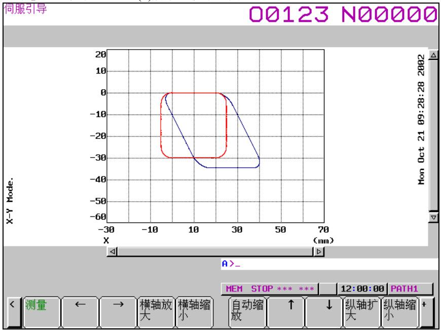

<details>
<summary>text_image</summary>

伺服引导
00123 N00000
X-Y Mode.
-30 -10 0 Mon Oct 21 09:28:28 2002
X (mm)
A >_
MEM STOP *** ***
12:00:00 PATH1
< 测量 ← → 横轴放大 横轴缩小 自动缩放 ↑ ↓ 纵轴扩大 纵轴缩小 +
测量 ← → 横轴放大 横轴缩小 自动缩放 ↑ ↓ 纵轴扩大 纵轴缩小 +
</details>

图1.9.1.2 (n)

13 设定的内容从接下来进行测量的时候起有效。请结合新的通道设定改变运算和图形设定以及比例尺设定。

## 解释

\- 设定测量设定画面

请参阅 Y-Time 图形的解释、测量设定画面的设定。

\- 设定设定通道画面

请参阅 Y-Time 图形的解释、设定通道画面的设定。

## - 设定运算&图形画面

设定运算和图形设定可以指定图形描绘的设定，每幅图最多可指定 2 个测量数据。

\- 运算

可以设定的数值如表 1.9.1.2 (a) XY图形的运算所示。

如表 1.9.1.2 (b) XY图形的条件所示，不能指定没有满足图形的显示条件的运算。

表1.9.1.2 (a) XY 图形的运算


### PMC报警: 输入数值
- **故障内容**: 运算的名称
- **处理办法**: 运算的含义

### PMC报警: 1
- **故障内容**: N/A
- **处理办法**: 隐藏。

### PMC报警: 11
- **故障内容**: XY
- **处理办法**: XY 显示输入 1 为横轴,输入 2 为纵轴。


表1.9.1.2 (b) XY 图形的条件


### PMC报警: 运算
- **故障内容**: 坐标变换
- **处理办法**: 输入1

### PMC报警: 11:XY
- **故障内容**: 1:Normal
- **处理办法**: 已测量了位置的通道

### PMC报警: 2:Polar
- **故障内容**: 已测量了位置的通道(仅限单位为mm、μm、inch的数据)
- **处理办法**: 已测量了位置的通道(仅限单位为deg的数据)

### PMC报警: 3:Angular
- **故障内容**: 已测量了位置的通道
- **处理办法**: 已测量了位置的通道


- 输入 1
可以设定的数值是将通道 1 作为 1 依次计数的连号。最大值为通过通道设定进行了测量设定的最大的通道号。如表 1.9.1.2 (b) XY 图形的条件所示，不能指定没有满足图形的显示条件的输入 1。  
- 输入 2
可以设定的数值是将通道 1 作为 1 依次计数的连号。最大值为通过通道设定进行了测量设定的最大的通道号。如表 1.9.1.2 (b) XY 图形的条件所示，不能指定没有满足图形的显示条件的输入 2。  
- 显示单位
可以设定的数值仅限 4（mm）。  
- 座标转换
可以设定的数值如下：1 表示Normal（没有坐标变换），2 表示Polar（极坐标插补的坐标变换），3 表示Angular（倾斜轴控制的坐标变换）。可以指定的坐标变换的条件，如表 1.9.1.2 (c) XY图形坐标变换的对应关系所示。

表1.9.1.2 (c) XY 图形坐标变换的对应关系


### PMC报警: 运算
- **故障内容**: 输入1
- **处理办法**: 输入2

### PMC报警: 11:XY
- **故障内容**: 已测量了位置的通道
- **处理办法**: 已测量了位置的通道

### PMC报警: 已测量了位置的通道(仅限单位为mm、μm、inch的数据)
- **故障内容**: 已测量了位置的通道(仅限单位为deg的数据)
- **处理办法**: 2:Polar

### PMC报警: 已测量了位置的通道
- **故障内容**: 已测量了位置的通道
- **处理办法**: 3:Angular


\- 倾斜角
倾斜角度以 deg 为单位进行设定。设定的数值唯有在坐标变换中指定了 Angular（倾斜轴控制的坐标变换）的情况下才有效。

## - 设定缩放画面

- 始点
设定显示数据横轴、纵轴各自的中心坐标。  
- 刻度
设定显示数据横轴、纵轴各自的每一栅格的值。

## - 测量操作

请参阅 Y-Time 图形的解释、测量操作。

## 限制

请参阅 Y-Time 图形的限制。

## 1.9.1.3 圆形(Circle)图形

该图形可针对测量数据，在圆弧切削中放大显示起因于指定圆弧的轨迹误差。

仅可显示 1 幅图。

## 显示和设定圆形(Circle)图形的步骤

## 步骤

下面描述至测量数据显示的步骤。

1 按下功能键 SYSTEM。  
2 按继续菜单键 ▶ 数次，直到 [波形显示] 显示。  
3 按下软键 [波形显示]。  
4 按下软键 [圆]。出现图 1.9.1.3 (a) 所示的波形画面。

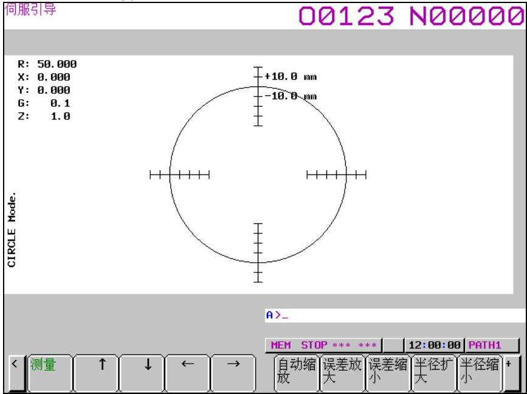

<details>
<summary>text_image</summary>

伺服引导
00123 N00000
R: 50.000
X: 0.000
Y: 0.000
G: 0.1
Z: 1.0
+10.0 mm
-10.0 mm
CIRCLE Mode.
A >_
MEM STOP *** ***
12:00:00 PATH1
< 测量 ↑ ↓ ← →
自动缩 放 误差放 大 误差缩 小 半径扩 大 半径缩 小 +
</details>

图1.9.1.3 (a)

5 按下软键 [测量]。  
6 按下软键 [取数]。  
7 按下软键 [采样]。出现图 1.9.1.3 (b) 所示的测量设定画面。

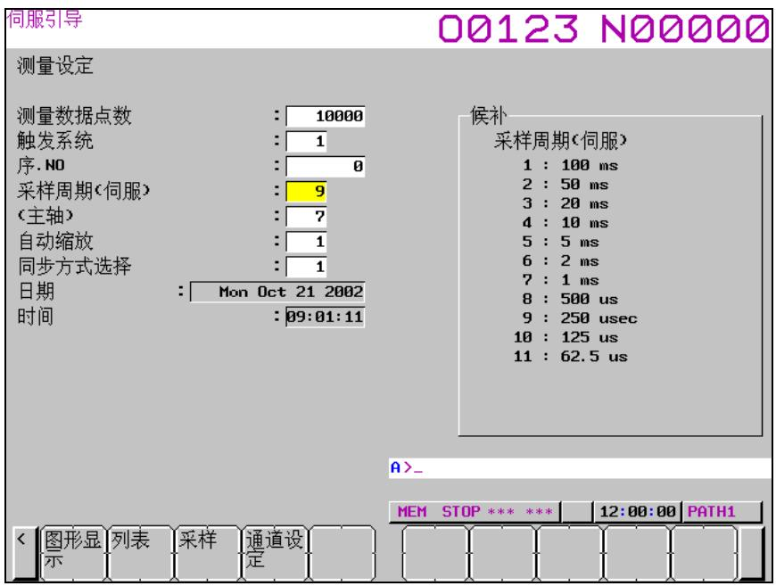

<details>
<summary>text_image</summary>

伺服引导
00123 N00000
测量设定
测量数据点数 : 10000
触发系统 : 1
序.NO : 0
采样周期(伺服) : 9
(主轴) : 7
自动缩放 : 1
同步方式选择 : 1
日期 : Mon Oct 21 2002
时间 : 09:01:11
候补
采样周期(伺服)
1 : 100 ms
2 : 50 ms
3 : 20 ms
4 : 10 ms
5 : 5 ms
6 : 2 ms
7 : 1 ms
8 : 500 us
9 : 250 usec
10 : 125 us
11 : 62.5 us
A >_
MEM STOP *** ***
12:00:00 PATH1
< 图形显 列表 采样 通道设
示 定
</details>

图1.9.1.3 (b)

8 按下光标键，将光标移动到想要设定的参数位置。  
9 输入数据，按下 [INPUT] 键。  
10 重复 8 和 9 的步骤，设定所有的参数。  
11 按下软键 [通道设定]。

出现图 1.9.1.3 (c) 所示的设定通道画面。

需要进行当前所显示的通道以外的设定时，按下翻页键 $\boxed{\uparrow}$ PAGE $\boxed{\downarrow}$ ，显示目标通道的画面。

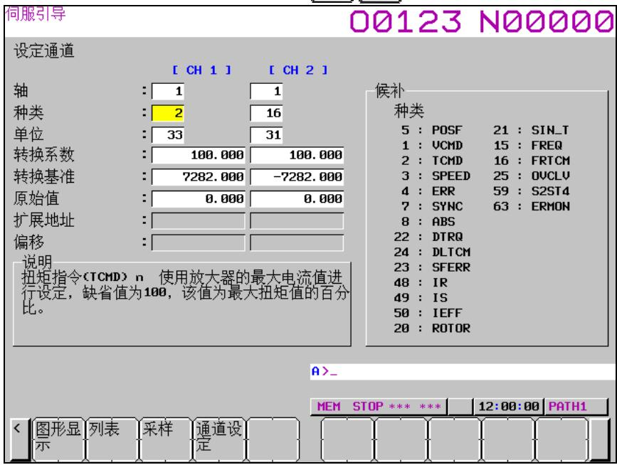

<details>
<summary>text_image</summary>

伺服引导
00123 N00000
设定通道
[ CH 1 ] [ CH 2 ]
轴 : 1 1
种类 : 2 16
单位 : 33 31
转换系数 : 100.000 100.000
转换基准 : 7282.000 -7282.000
原始值 : 0.000 0.000
扩展地址 :
偏移 :
说明
扭矩指令(TCMD) n 使用放大器的最大电流值进行设定, 缺省值为100, 该值为最大扭矩值的百分比。
候补
种类
5 : POSF 21 : SIN_T
1 : VCMD 15 : FREQ
2 : TCMD 16 : FRTCM
3 : SPEED 25 : OVCLV
4 : ERR 59 : S2ST4
7 : SYNC 63 : ERMON
8 : ABS
22 : DTRQ
24 : DLTCM
23 : SFERR
48 : IR
49 : IS
50 : IEFF
20 : ROTOR
A >_
MEM STOP *** ***
12:00:00 PATH1
< 图形显 列表 采样 通道设 定
</details>

图1.9.1.3 (c)

12 按下光标键，将光标移动到想要设定的参数位置。  
13 输入数据，按下 [INPUT] 键。  
14 重复 12 和 13 的步骤，设定所有的参数。  
15 按下软键 [图形显示]。  
16 按下软键 [运算/G 设定]。出现图 1.9.1.3 (d) 所示的运算 & 图形画面。

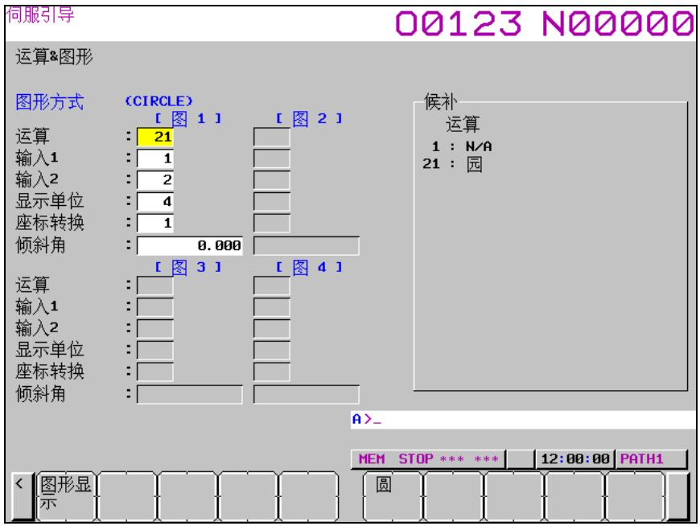

<details>
<summary>text_image</summary>

伺服引导
O0123 N00000
运算&图形
图形方式 (CIRCLE)
[ 图 1 ] [ 图 2 ]
运算 : 21
输入1 : 1
输入2 : 2
显示单位 : 4
座标转换 : 1
倾斜角 : 0.000
候补
运算
1 : N/A
21 : 园
[ 图 3 ] [ 图 4 ]
运算 :
输入1 :
输入2 :
显示单位 :
座标转换 :
倾斜角 :
A >_
MEM STOP *** ***
12:00:00 PATH1
< 图形显
示
</details>

图1.9.1.3 (d)

17 按下光标键，将光标移动到想要设定的参数位置。  
18 输入数据，按下 [INPUT] 键。  
19 重复 17 和 18 的步骤，设定所有的参数。  
20 按下软键 [图形显示]。  
21 软键 [比例设定]。出现图 1.9.1.3 (e) 所示的缩放画面。

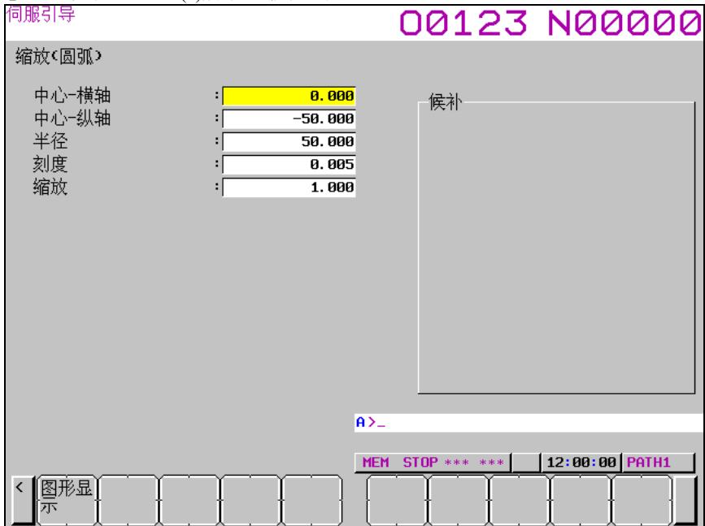

<details>
<summary>text_image</summary>

伺服引导
00123 N00000
缩放(圆弧)
中心-横轴 : 0.000
中心-纵轴 : -50.000
半径 : 50.000
刻度 : 0.005
缩放 : 1.000
候补
A >_
MEM STOP *** ***
12:00:00 PATH1
< 图形显
示
</details>

图1.9.1.3 (e)

22 按下光标键，将光标移动到想要设定的参数位置。  
23 输入数据，按下 [INPUT] 键。  
24 重复 22 和 23 的步骤，设定所有的参数。  
25 按下软键 [图形显示]。  
26 按下软键 [测量]。  
27 按下软键 [开始]。  
28 开始自动运行或者手动运行。  
29 测量结束后，出现图 1.9.1.3 (f) 所示的波形画面。

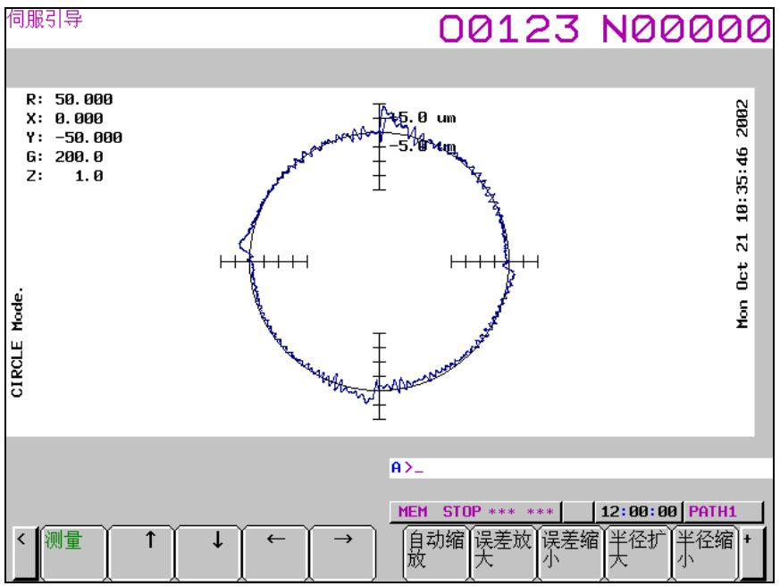

<details>
<summary>line chart</summary>

| R | X | Y | G | Z |
| --- | --- | --- | --- | --- |
| 50.000 | 0.000 | -50.000 | 200.0 | 1.0 |
|  |  |  |  |  |
|  |  |  |  |  |
|  |  |  |  |  |
|  |  |  |  |  |
|  |  |  |  |  |
|  |  |  |  |  |
|  |  |  |  |  |
|  |  |  |  |  |
|  |  |  |  |  |
|  |  |  |  |  |
</details>

图1.9.1.3 (f)

## - 改变运算&图形画面

下面描述根据需要改变运算和图形设定的步骤。

1 按下软键 [运算/G 设定]。出现图 1.9.1.3 (g) 所示的运算 & 图形画面。

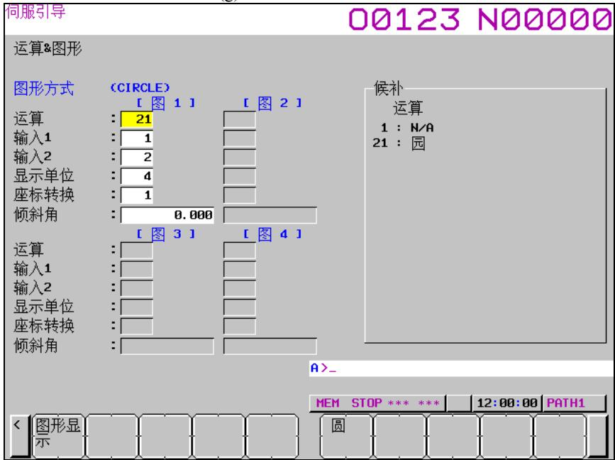

<details>
<summary>text_image</summary>

伺服引导
00123 N00000
运算&图形
图形方式 (CIRCLE)
[图 1] [图 2]
运算 : 21
输入1 : 1
输入2 : 2
显示单位 : 4
座标转换 : 1
倾斜角 : 0.000
候补
运算
1 : N/A
21 : 园
[图 3] [图 4]
运算 :
输入1 :
输入2 :
显示单位 :
座标转换 :
倾斜角 :
A>_ 
MEM STOP *** ***
12:00:00 PATH1
< 图形显
示
</details>

图1.9.1.3 (g)

2 按下光标键，将光标移动到想要设定的参数位置。  
3 输入数据，按下 [NPUT] 键。  
4 重复 2 和 3 的步骤，设定所有的参数。  
5 按下软键 [图形显示]。

按照新设定的运算和图形设定，显示出图 1.9.1.3 (h) 所示的波形画面。

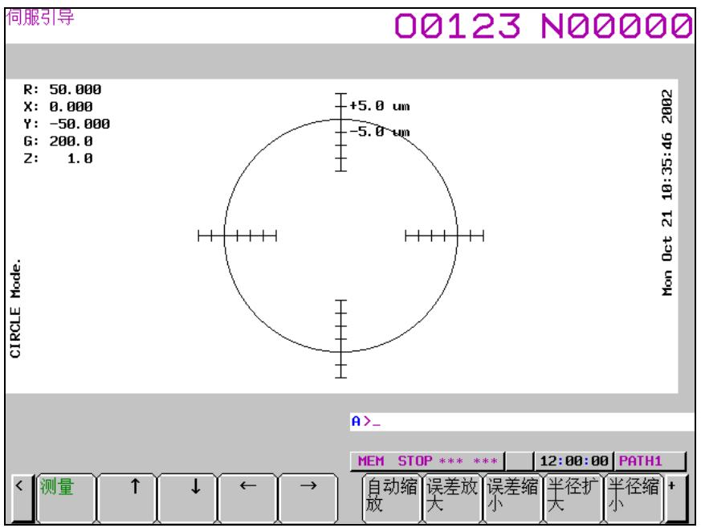

<details>
<summary>text_image</summary>

伺服引导
00123 N00000
R: 50.000
X: 0.000
Y: -50.000
G: 200.0
Z: 1.0
+5.0 um
-5.0 um
Mon Oct 21 10:35:46 2002
CIRCLE Mode.
A >_
MEM STOP *** ***
12:00:00 PATH1
< 测量 ↑ ↓ ← →
自动缩 放 误差放 大 误差缩 小 半径扩 大 半径缩 小 +
</details>

图1.9.1.3 (h)

## - 改变缩放画面

下面描述根据需要改变比例尺的步骤。

1 软键 [比例设定]。出现图 1.9.1.3 (i) 所示的缩放画面。


<details>
<summary>text_image</summary>

伺服引导
00123 N00000
缩放(圆弧)
中心-横轴 : 0.000
中心-纵轴 : -50.000
半径 : 50.000
刻度 : 0.005
缩放 : 1.000
候补
A >_
MEM STOP *** ***
12:00:00 PATH1
< 图形显
示
</details>

图1.9.1.3 (i)

2 按下光标键，将光标移动到想要设定的参数位置。  
3 输入数据，按下 [INPUT] 键。  
4 重复 2 和 3 的步骤，设定所有的参数。  
5 按下软键 [图形显示]。

按照新设定的比例尺，显示出图 1.9.1.3 (j) 所示的波形画面。

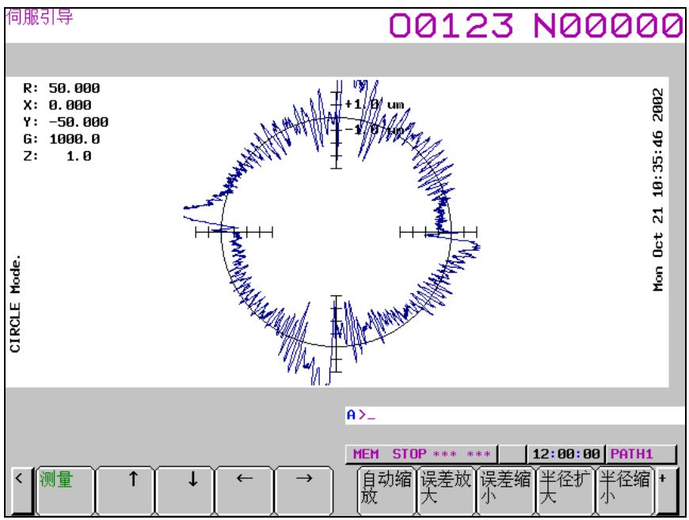

<details>
<summary>line chart</summary>

| Parameter | Value     |
| --------- | --------- |
| R         | 50.000    |
| X         | 0.000     |
| Y         | -50.000   |
| G         | 1000.0    |
| Z         | 1.0       |
</details>

图1.9.1.3 (j)

## - Circle 图形操作

按下下面的软键，即可执行相应的操作。

- [测量]：进行有关测量的操作。  
- [←] : 向左移动中心坐标位置。  
- [→] : 向右移动中心坐标位置。  
• [↑]：向上移动中心坐标位置。  
- [↓]：向下移动中心坐标位置。  
- [自动缩放]：自动进行比例缩放。  
- [误差放大]：放大误差。  
- [误差缩小]：缩小误差。  
- [半径扩大]：放大半径。  
- [半径缩小]：缩小半径。  
- [图形 1 不显示]：切换 DRAW1 的显示/隐藏。  
- [比例放大]：放大Zoom。  
- [比例缩小]：缩小Zoom。  
- [运算/G 设定]：进行运算和图形设定。  
- [比例设定]：进行比例尺设定。  
• [C1-INP] : 输入注释 1。  
• [C2-INP] : 输入注释 2。  
• [Y-TIME] : 转移到 Y-Time 图形。  
• [XY] ：转移到 XY 图形。  
• [FOURIE] : 转换移到傅立叶(Fourier)图形。  
• [BODE] : 转移到博德(Bode)图形。

## - 测量操作

按下软键 [测量]，即可执行与下列菜单对应的操作。

- [开始]：开始测量。  
- [起源]：设定原点值。  
- [停止] ：停止测量。  
- [取数]：进行有关测量的设定。

## - 改变测量的设定

1 软键 [测量] → [取数]，即可执行与下列菜单对应的操作。  
2 按下软键 [列表]。出现图 1.9.1.3 (k) 所示的列表画面。

需要进行当前所显示的通道以外的显示时，按下翻页键 $\uparrow$ | PAGE ↓ | ，显示目标通道的画面。


<details>
<summary>text_image</summary>

伺服引导
00123 N00000
一览
测量数据点数 : 10000
采样周期(伺服) : 250 usec
(主轴) : 1 ms
CH 1 轴 :伺服 1 起源 : 0.000
种类 :TCMD 转换系数 : 100.000 / 转换基准 : 7282.000
单位 :% 意义 :扭矩指令(TCMD)n 使用放大器的最大电流值进行
CH 2 轴 :伺服 1 起源 : 0.000
种类 :FRTCM 转换系数 : 100.000 / 转换基准 : -7282.000
单位 :A(p) 意义 :振荡扭矩指令
CH 3 轴 :伺服 1 起源 : 0.000
种类 :FREQ 转换系数 : 1.000 / 转换基准 : 1.000
单位 :Hz 意义 :振荡频率
CH 4 轴 : 起源 :
种类 : 转换系数 : / 转换基准 :
单位 : 意义 :
A >_
MEM STOP *** *** 12:00:00 PATH1
< 图形显 列表 采样 通道设
示 定
</details>

图1.9.1.3 (k)

3 利用列表画面确认当前的设定。  
4 按下软键 [采样]。出现图 1.9.1.3 (l) 所示的测量设定画面。

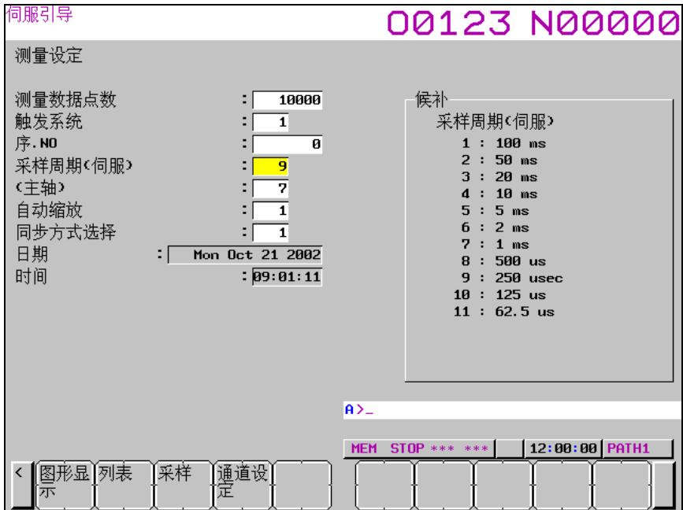

<details>
<summary>text_image</summary>

伺服引导
00123 N00000
测量设定
测量数据点数 : 10000
触发系统 : 1
序.NO : 0
采样周期(伺服) : 9
(主轴) : 7
自动缩放 : 1
同步方式选择 : 1
日期 : Mon Oct 21 2002
时间 : 09:01:11
候补
采样周期(伺服)
1 : 100 ms
2 : 50 ms
3 : 20 ms
4 : 10 ms
5 : 5 ms
6 : 2 ms
7 : 1 ms
8 : 500 us
9 : 250 usec
10 : 125 us
11 : 62.5 us
A >_
MEM STOP *** ***
12:00:00 PATH1
< 图形显 列表 采样 通道设
示 定
</details>

图1.9.1.3 (l)

5 按下光标键，将光标移动到想要设定的参数位置。  
6 输入数据，按下 [INPUT] 键。  
7 重复 5 和 6 的步骤，设定所有的参数。  
8 按下软键 [通道设定]。出现图 1.9.1.3 (m) 所示的设定通道画面。

需要进行当前所显示的通道以外的设定时，按下翻页键 $\boxed{\uparrow}$ $\boxed{PAGE}$ ，显示目标通道的画面。


<details>
<summary>text_image</summary>

伺服引导
00123 N00000
设定通道
[ CH 1 ] [ CH 2 ]
轴 : 1 1
种类 : 2 16
单位 : 33 31
转换系数 : 100.000 100.000
转换基准 : 7282.000 -7282.000
原始值 : 0.000 0.000
扩展地址 :
偏移 :
说明
扭矩指令(TCMD) n 使用放大器的最大电流值进行设定,缺省值为100,该值为最大扭矩值的百分比。
候补
种类
5 : POSF 21 : SIN_T
1 : VCMD 15 : FREQ
2 : TCMD 16 : FRTCM
3 : SPEED 25 : OVCLV
4 : ERR 59 : S2ST4
7 : SYNC 63 : ERMON
8 : ABS
22 : DTRQ
24 : DLTCM
23 : SFERR
48 : IR
49 : IS
50 : IEFF
20 : ROTOR
A >_
MEM STOP *** *** 12:00:00 PATH1
< 图形显 列表 采样 通道设 定
</details>

图1.9.1.3 (m)

9 按下光标键，将光标移动到想要设定的参数位置。  
10 输入数据，按下 [INPUT] 键。  
11 重复 9 和 10 的步骤，设定所有的参数。  
12 按下软键 [图形显示]。出现图 1.9.1.3 (n) 所示的波形画面。

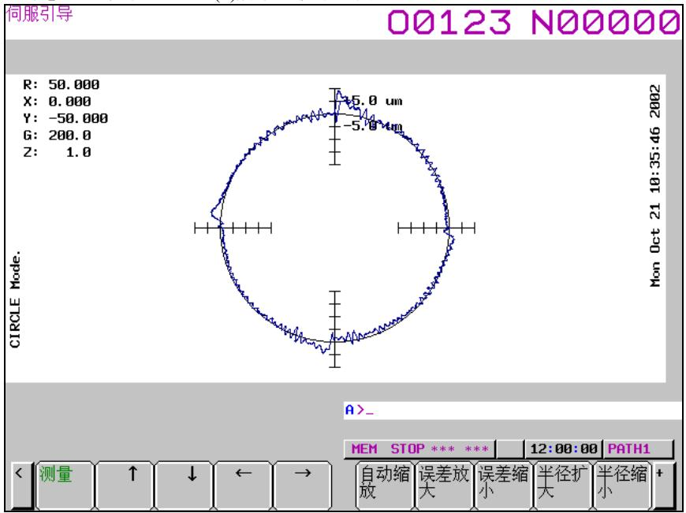

<details>
<summary>text_image</summary>

伺服引导
O0123 N00000
R: 50.000
X: 0.000
Y: -50.000
G: 200.0
Z: 1.0
5.0 um
-5.0 um
Mon Oct 21 10:35:46 2002
CIRCLE Mode.
A >_
MEM STOP *** ***
12:00:00 PATH1
< 测量 ↑ ↓ ← →
自动缩 效 大 误差缩 小 半径扩 大 半径缩 小 +
+
</details>

图1.9.1.3 (n)

13 设定的内容从接下来进行测量的时候起有效。请结合新的通道设定改变运算和图形设定以及比例尺设定。

## 解释

\- 设定测量设定画面

请参阅 Y-Time 图形的解释、测量设定画面的设定。

\- 设定设定通道画面

请参阅 Y-Time 图形的解释、设定通道画面的设定。

## - 设定运算&图形画面

可以在运算和图形设定中指定图形描绘的设定。

\- 运算

可以设定的数值如表 1.9.1.3 (a) 圆形图形的运算所示。

如 表 1.9.1.3 (b) 圆形图形的条件所示，不能指定没有满足图形的显示条件的运算。

表1.9.1.3 (a) 圆形图形的运算


### PMC报警: 输入数值
- **故障内容**: 运算的名称
- **处理办法**: 运算的含义

### PMC报警: 1
- **故障内容**: N/A
- **处理办法**: 隐藏。

### PMC报警: 21
- **故障内容**: Circle
- **处理办法**: 圆弧误差显示输入1为横轴,输入2为纵轴。用于计算误差的基准圆弧,在比例尺的页上进行设定。


表1.9.1.3 (b) 圆形图形的条件


### PMC报警: 运算
- **故障内容**: 坐标变换
- **处理办法**: 输入1

### PMC报警: 21 : Circle
- **故障内容**: 1 : Normal
- **处理办法**: 已测量了位置的通道

### PMC报警: 2 : Polar
- **故障内容**: 已测量了位置的通道(仅限单位为mm、μm、inch的数据)
- **处理办法**: 已测量了位置的通道(仅限单位为deg的数据)

### PMC报警: 3 : Angular
- **故障内容**: 已测量了位置的通道
- **处理办法**: 已测量了位置的通道


\- 输入1

可以设定的数值是将通道 1 作为 1 依次计数的连号。最大值为通过通道设定进行了测量设定的最大的通道号。如表 1.9.1.3 (b) 圆形图形的条件所示，不能指定没有满足图形的显示条件的输入 1。

\- 输入2

可以设定的数值是将通道 1 作为 1 依次计数的连号。最大值为通过通道设定进行了测量设定的最大的通道号。如表 1.9.1.3 (b) 圆形图形的条件所示，不能指定没有满足图形的显示条件的输入 2。

\- 显示单位

可以设定的数值仅限 4（mm）。

\- 座标转换

可以设定的数值如下：1 表示Normal（没有坐标变换），2 表示Polar（极坐标插补的坐标变换），3 表示Angular（倾斜轴控制的坐标变换）。可以指定的坐标变换的条件，如表 1.9.1.3 (c) 圆形图形坐标变换的对应关系所示。

表1.9.1.3 (c) 圆形图形坐标变换的对应关系


### PMC报警: 运算
- **故障内容**: 输入1
- **处理办法**: 输入2

### PMC报警: 21: Circle
- **故障内容**: 已测量了位置的通道
- **处理办法**: 已测量了位置的通道

### PMC报警: 已测量了位置的通道(仅限单位为mm、μm、inch的数据)
- **故障内容**: 已测量了位置的通道(仅限单位为deg的数据)
- **处理办法**: 2: Polar

### PMC报警: 已测量了位置的通道
- **故障内容**: 已测量了位置的通道
- **处理办法**: 3: Angular


\- 倾斜角

倾斜角度以 deg 为单位进行设定。设定的数值唯有在坐标变换中指定了 Angular（倾斜轴控制的坐标变换）的情况下才有效。

## - 设定缩放画面

\- 中心

设定圆弧的中心坐标（横轴、纵轴各自的坐标）。

\- 半径

设定圆弧的半径。

\- 刻度

设定圆弧显示的比例尺。

\- '缩放

设定在象限切换点（各轴的方向反转点）放大显示到中心角方向时的放大倍率。这在观察象限突出情况的细节时极为有效。通常将此值设定为 1.0。

## - 测量操作

请参阅 Y-Time 图形的解释、测量操作。

## 限制

请参阅 Y-Time 图形的限制。

## 1.9.1.4 傅立叶(Fourier)图形

该图形可以针对 Y-Time 图形中所显示的范围进行数字傅立叶变换并显示频谱。

最多可同时显示 4 幅图。

## 显示和设定傅立叶(Fourier)图形的步骤

## 步骤

下面描述至测量数据显示的步骤。

1 按照 Y-Time 图形的步骤显示 Y-Time 图形。  
2 按下软键 [FOURIER]。出现图 1.9.1.4(a) 所示的波形画面。

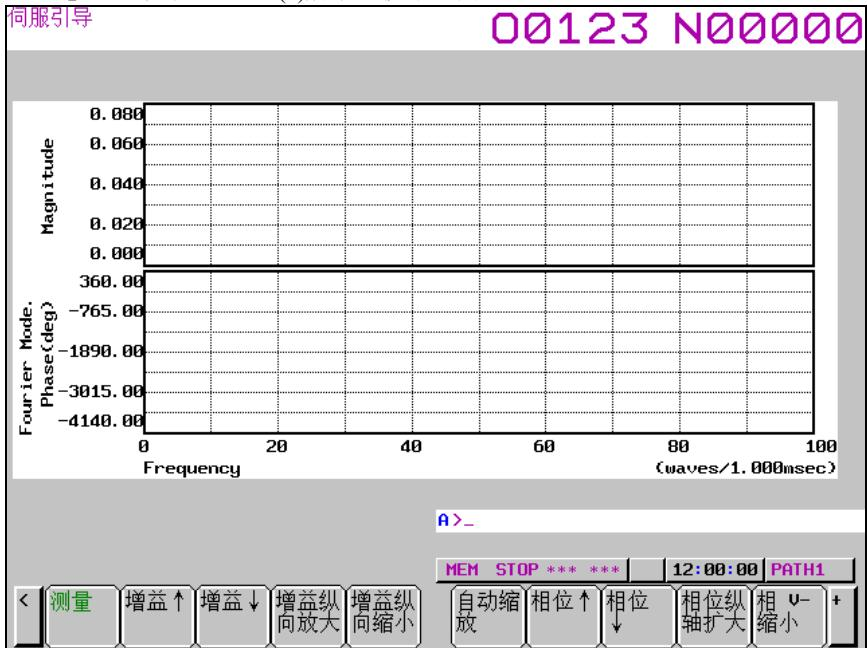

<details>
<summary>line chart</summary>

| Frequency (waves/1.000msec) | Magnitude | Fourier Mode, Phase(deg) |
| --------------------------- | --------- | ------------------------ |
| 0                           | 0.080     | -765.00                  |
| 20                          | 0.060     | -1890.00                 |
| 40                          | 0.040     | -3015.00                 |
| 60                          | 0.020     | -4140.00                 |
| 80                          | 0.000     | 368.00                   |
| 100                         | 0.080     | 0.080                    |
</details>

图1.9.1.4 (a)

3 按下软键 [运算/G 设定]。出现图 1.9.1.4 (b) 所示的运算 & 图形画面。

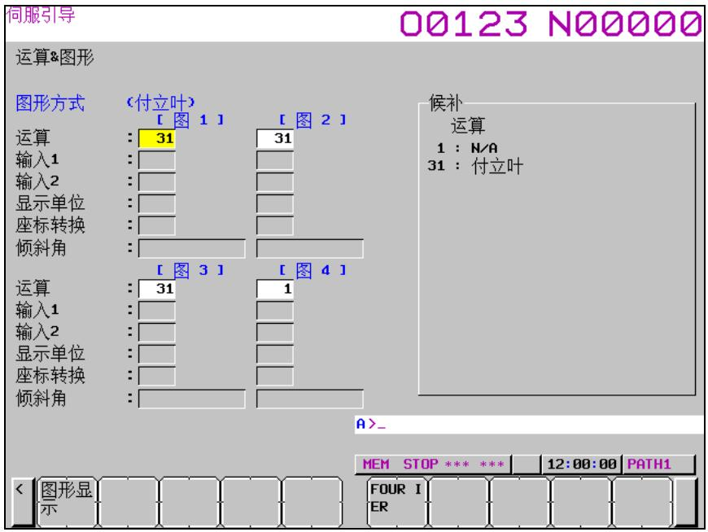

<details>
<summary>text_image</summary>

伺服引导
O0123 N00000
运算&图形
图形方式	(付立叶)
[图 1]	[图 2]
运算	: 31	31
输入1	
输入2	
显示单位	
座标转换	
倾斜角	
[图 3]	[图 4]
运算	: 31	1
输入1	
输入2	
显示单位	
座标转换	
倾斜角	
候补
运算
1 : N/A
31 : 付立叶
A >_
MEM STOP *** ***
12:00:00 PATH1
< 图形显
示
FOUR I
ER
</details>

图1.9.1.4 (b)

4 按下光标键，将光标移动到想要设定的参数位置。  
5 输入数据，按下 [INPUT] 键。  
6 重复 4 和 5 的步骤，设定所有的参数。  
7 按下软键 [图形显示]。  
8 软键 [比例设定]。出现图 1.9.1.4 (c) 所示的缩放画面。

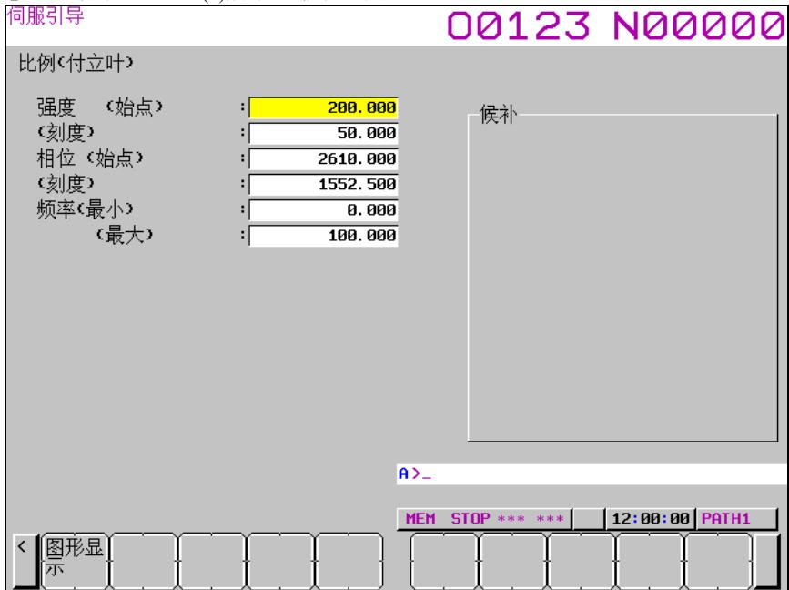

<details>
<summary>text_image</summary>

伺服引导
00123 N00000
比例(付立叶)
强度 (始点) : 200.000
(刻度) : 50.000
相位 (始点) : 2610.000
(刻度) : 1552.500
频率(最小) : 0.000
(最大) : 100.000
候补
A >_
MEM STOP *** ***
12:00:00 PATH1
< 图形显
示
</details>

图1.9.1.4 (c)

9 按下光标键，将光标移动到想要设定的参数位置。

10 输入数据，按下 [INPUT] 键。  
11 重复 9 和 10 的步骤，设定所有的参数。  
12 按下软键 [图形显示]。出现图 1.9.1.4 (d) 所示的波形画面。

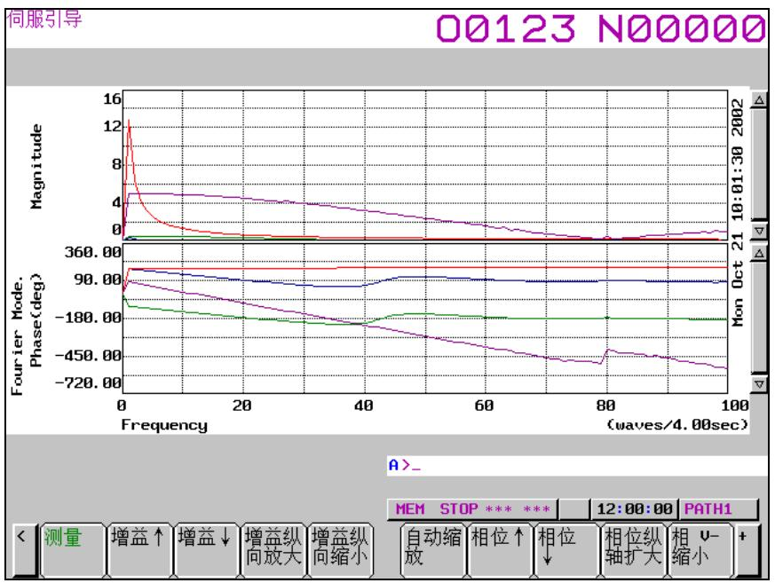

<details>
<summary>line chart</summary>

| Frequency (waves/4.00sec) | Magnitude | Fourier Mode. Phase (deg) |
| ------------------------- | --------- | ------------------------- |
| 0                         | 16        | 360.00                    |
| 20                        | 4         | 90.00                     |
| 40                        | 0         | -180.00                   |
| 60                        | -4        | -450.00                   |
| 80                        | -7        | -720.00                   |
| 100                       | -7        | -720.00                   |
</details>

图1.9.1.4 (d)

## - 改变运算&图形画面

下面描述根据需要改变运算和图形设定的步骤。

1 按下软键 [运算/G 设定]。出现图 1.9.1.4 (e) 所示的运算 & 图形画面。


<details>
<summary>text_image</summary>

同服引导
00123 N00000
运算&图形
图形方式 (付立叶)
[图 1] [图 2]
运算 : 31 31
输入1 :
输入2 :
显示单位 :
座标转换 :
倾斜角 :
[图 3] [图 4]
运算 : 31 1
输入1 :
输入2 :
显示单位 :
座标转换 :
倾斜角 :
A >_
MEM STOP *** ***
12:00:00 PATH1
< 图形显
示
FOUR I
ER
</details>

图1.9.1.4 (e)

2 按下光标键，将光标移动到想要设定的参数位置。  
3 输入数据，按下 [INPUT] 键。  
4 重复 2 和 3 的步骤，设定所有的参数。  
5 按下软键 [图形显示]。

按照新设定的运算和图形设定，显示出图 1.9.1.4 (f) 所示的波形画面。

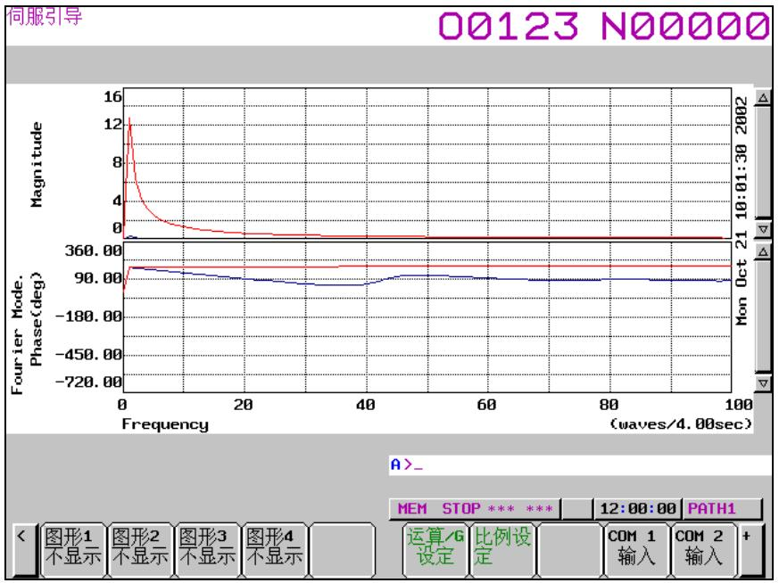

<details>
<summary>line chart</summary>

| Frequency (waves/4.00sec) | Magnitude | Fourier Mode (deg) |
| -------------------------- | --------- | ------------------ |
| 0                          | 12        | 98.00              |
| 20                         | ~1        | ~98.00             |
| 40                         | ~0.5      | ~98.00             |
| 60                         | ~0.5      | ~98.00             |
| 80                         | ~0.5      | ~98.00             |
| 100                        | ~0.5      | ~98.00             |
</details>

图1.9.1.4 (f)

## - 改变缩放画面

下面描述根据需要改变比例尺的步骤。

1 软键 [比例设定]。出现图 1.9.1.4 (g) 所示的缩放画面。

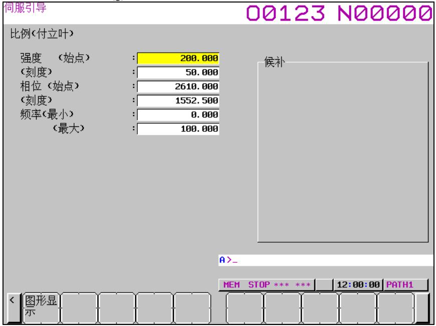

<details>
<summary>text_image</summary>

伺服引导
00123 N00000
比例(付立叶)
强度 (始点) : 200.000
(刻度) : 50.000
相位 (始点) : 2610.000
(刻度) : 1552.500
频率(最小) : 0.000
(最大) : 100.000
候补
A >_
MEM STOP *** ***
12:00:00 PATH1
< 图形显
示
</details>

图1.9.1.4 (g)

2 按下光标键，将光标移动到想要设定的参数位置。  
3 输入数据，按下 [INPUT] 键。  
4 重复 2 和 3 的步骤，设定所有的参数。  
5 按下软键 [图形显示]。

按照新设定的比例尺，显示出图 1.9.1.4 (h) 所示的波形画面。

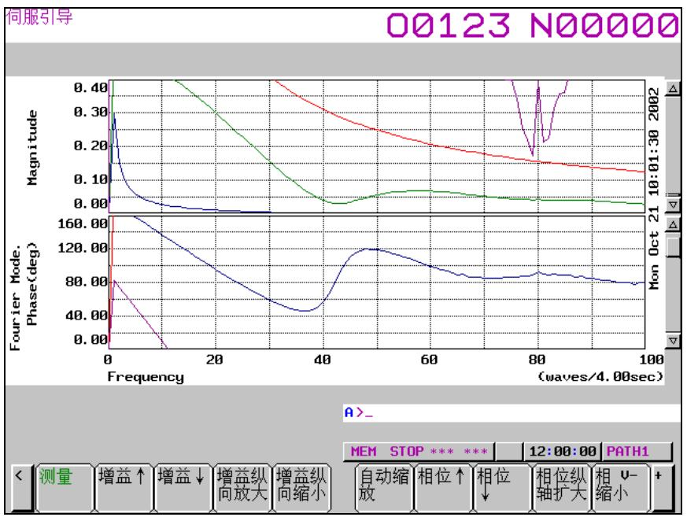

<details>
<summary>line chart</summary>

| Frequency (waves/4.00sec) | Magnitude | Fourier Mode. Phase (deg) |
| -------------------------- | --------- | ------------------------- |
| 0                          | 0.40      | 160.00                    |
| 20                         | 0.30      | 120.00                    |
| 40                         | 0.20      | 80.00                     |
| 60                         | 0.15      | 80.00                     |
| 80                         | 0.10      | 80.00                     |
| 100                        | 0.10      | 80.00                     |
</details>

图1.9.1.4 (h)

## - Fourier 图形操作

按下下面的软键，即可执行相应的操作。

- [测量]：进行有关测量的操作。  
- [增益↑]：向下位移强度的图形。  
- [增益↓]：向上位移强度的图形。  
- [增益纵向放大]：放大强度的图形。  
- [增益纵向缩小]：缩小强度的图形。  
- [自动缩放]：自动进行比例缩放。  
- [相位↑]：向下位移相位的图形。  
- [相位 ↓] ：向上位移相位的图形。  
- [相位纵轴扩大]：放大相位的图形。  
- [相 V-缩小]：缩小相位的图形。  
- [图形1不显示]：切换DRAW1的显示/隐藏。  
- [图形 2 不显示]：切换 DRAW2 的显示/隐藏。  
- [图形 3 不显示]：切换 DRAW3 的显示/隐藏。  
- [图形 4 不显示]：切换 DRAW4 的显示/隐藏。  
- [运算/G 设定]：进行运算和图形设定。  
- [比例设定]：进行比例尺设定。  
• [COM 1 输入]：输入注释 1。  
• [COM 2 输入]：输入注释 2。  
• [Y-TIME] : 转移到 Y-Time 图形。  
- [XY] ：转移到 XY 图形。  
- [圆]：转移到圆形(Circle)图形。  
• [BODE]：转移到博德(Bode)图形。

## 解释

## - 设定运算&图形画面

设定运算和图形设定可以指定图形描绘的设定，每幅图最多可指定 4 个测量数据。

\- 运算

可以设定的数值如表 1.9.1.4 (a) 傅立叶图形的运算所示。

如表 1.9.1.4 (b) 傅立叶图形的条件所示，不能指定没有满足图形的显示条件的运算。

表1.9.1.4 (a) 傅立叶图形的运算


### PMC报警: 输入数值
- **故障内容**: 运算的名称
- **处理办法**: 运算的含义

### PMC报警: 1
- **故障内容**: N/A
- **处理办法**: 隐藏。

### PMC报警: 31
- **故障内容**: Fourier
- **处理办法**: 进行数字傅立叶变化并显示频谱。


表1.9.1.4 (b) 傅立叶图形的条件


### PMC报警: 运算
- **故障内容**: 条件
- **处理办法**: 备注

### PMC报警: 31 : Fourier
- **故障内容**: Y-Time 图形的图(draw)和傅立叶(Fourier)图形的图 1 比 1 对应。傅立叶(Fourier)运算的设定,仅限于对应的 Y-Time 图形的图有效的情况。
- **处理办法**: 


## - 设定缩放画面

- 始点
设定图形的中心强度数据、相位数据各自的值。  
- 刻度设定每一栅格的值。  
- 频率
分别设定横轴的最小值和最大值。由于单位依赖于 Y-Time 图形所选的时间范围，因此 1 = 1 Hz 这样的等式并非总能成立。

（例）在选择 0.1. 秒的时间范围时，相当于 $1 = 1 \, Hz$ 。

## 限制

请参阅 Y-Time 图形的限制。

## 1.9.1.5 博德(Bode)图形

该图形可针对测量数据，在横轴对数图上显示博德线图。

仅可显示 1 幅图。

## 显示和设定博德(Bode)图形的步骤

## 步骤

要显示博德图形，需要进行基于伺服软件的自动励振（干扰输入功能）的参数设定。

下面描述至测量数据显示的步骤。

1 按下功能键 SYSTEM。

2 一直按到显示 [参数] 为止。  
3 设定下列参数。

No.2326（干扰输入增益） 建议值：500

No.2327（干扰输入开始频率） 建议值：20

No.2328（干扰输入结束频率） 建议值：1000

No.2329（干扰输入测定点数） 建议值：3

4 将参数 DSTIN(No.2270#7)从 0 变更为 1 时，开始干扰输入。开始测定时需要进行本操作，因而通过程序数据输入 (G10)，预先制作将参数 DSTIN(No.2270#7)从 0 变更为 1 的程序。

程序例：Z 轴（第 3 轴）励振的情形（参数 G1B(No.3454#4)="1" 的情形）


5 按继续菜单键 $\boxed{\triangleright}$ 数次，直到[波形显示]显示。  
6 按下软键 [波形显示]。  
7 按下软键 [BODE]。出现图 1.9.1.5 (a) 所示的波形画面。

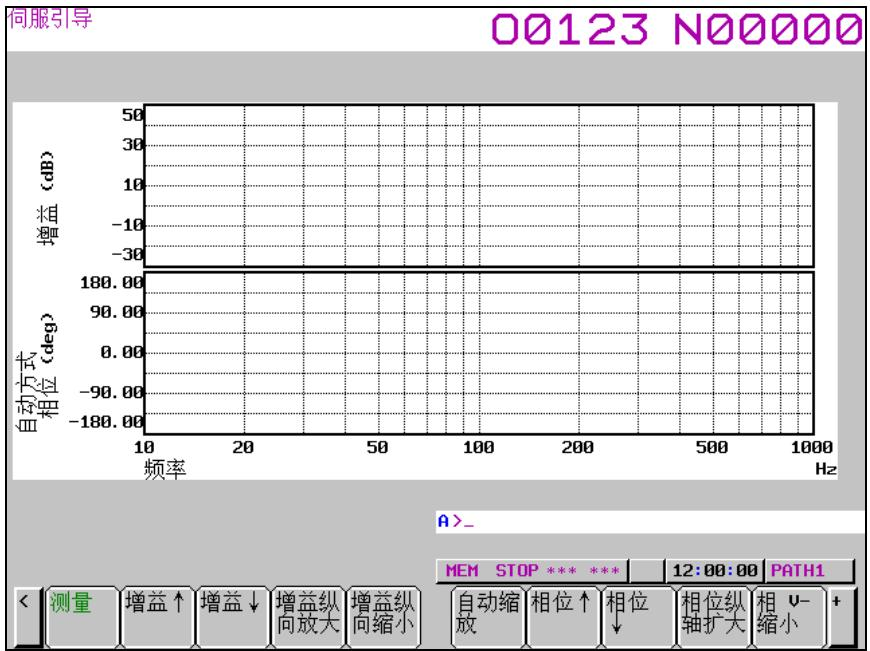

<details>
<summary>line chart</summary>

| 频率 (Hz) | 增益 (dB) | 相位 (deg) |
| ---------- | --------- | ---------- |
| 10         | -30       | -180.00    |
| 20         | 0         | -90.00     |
| 50         | 180.00    | 0.00       |
| 100        | 0         | 90.00      |
| 200        | 180.00    | 180.00     |
| 500        | 0         | 90.00      |
| 1000       | 180.00    | 180.00     |
</details>

图1.9.1.5 (a)

8 按下软键 [测量]。  
9 按下软键 [取数]。  
10 按下软键 [采样]。出现图 1.9.1.5 (b) 所示的测量设定画面。

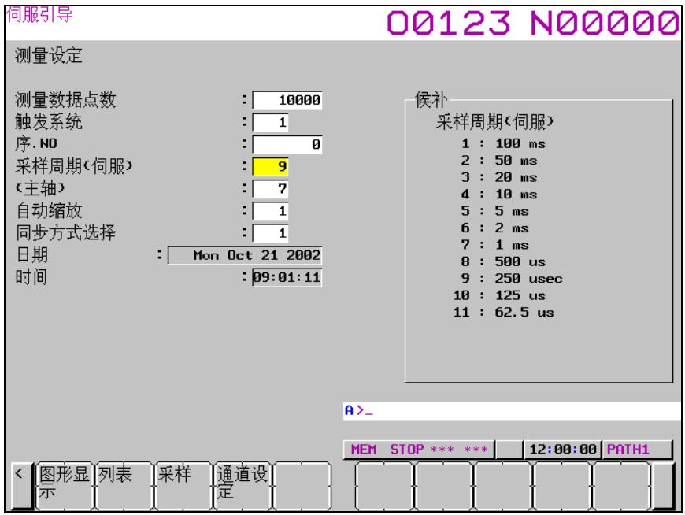

<details>
<summary>text_image</summary>

伺服引导
00123 N00000
测量设定
测量数据点数 : 10000
触发系统 : 1
序.NO : 0
采样周期(伺服) : 9
(主轴) : 7
自动缩放 : 1
同步方式选择 : 1
日期 : Mon Oct 21 2002
时间 : 09:01:11
候补
采样周期(伺服)
1 : 100 ms
2 : 50 ms
3 : 20 ms
4 : 10 ms
5 : 5 ms
6 : 2 ms
7 : 1 ms
8 : 500 us
9 : 250 usec
10 : 125 us
11 : 62.5 us
A >_
MEM STOP *** ***
12:00:00 PATH1
< 图形显 列表 采样 通道设
示 定
</details>

图1.9.1.5 (b)

11 按下光标键，将光标移动到想要设定的参数位置。  
12 输入数据，按下 [INPUT] 键。  
13 重复 11 和 12 的步骤，设定所有的参数。  
14 按下软键 [通道设定]。出现图 1.9.1.5 (c) 所示的设定通道画面。

需要进行当前所显示的通道以外的设定时，按下翻页键 $\boxed{\uparrow}$ PAGE $\boxed{\downarrow}$ ，显示目标通道的画面。


<details>
<summary>text_image</summary>

伺服引导
00123 N00000
设定通道
[ CH 1 ] [ CH 2 ]
轴 : 1 1
种类 : 2 16
单位 : 33 31
转换系数 : 100.000 100.000
转换基准 : 7282.000 -7282.000
原始值 : 0.000 0.000
扩展地址 :
偏移 :
说明
扭矩指令(TCMD) n 使用放大器的最大电流值进行设定, 缺省值为100, 该值为最大扭矩值的百分比。
候补
种类
5 : POSF 21 : SIN_T
1 : VCMD 15 : FREQ
2 : TCMD 16 : FRTCM
3 : SPEED 25 : OVCLV
4 : ERR 59 : S2ST4
7 : SYNC 63 : ERMON
8 : ABS
22 : DTRQ
24 : DLTCM
23 : SFERR
48 : IR
49 : IS
50 : IEFF
20 : ROTOR
A >_
MEM STOP *** ***
12:00:00 PATH1
< 图形显 列表 采样 通道设 定
</details>

图1.9.1.5 (c)

15 按下光标键，将光标移动到想要设定的参数位置。  
16 输入数据，按下 [INPUT] 键。  
17 重复 15 和 16 的步骤，设定所有的参数。

要显示博德(Bode)图形，请按照表 1.9.1.5(a)博德图形的通道设定所示进行设定。此时，务须将通道 4 置于无效(通道 4 的轴为 0)。

表1.9.1.5 (a) 博德图形的通道设定


### PMC报警: 
- **故障内容**: 通道1
- **处理办法**: 通道2

### PMC报警: 种类
- **故障内容**: 2:TCMD
- **处理办法**: 16:FRTCM

### PMC报警: 单位
- **故障内容**: 33:%
- **处理办法**: 33:A(p)

### PMC报警: 转换系数
- **故障内容**: 100
- **处理办法**: 100

### PMC报警: 转换基准
- **故障内容**: 7282
- **处理办法**: -7282

### PMC报警: 原始值
- **故障内容**: 0
- **处理办法**: 0


此外，请设定与步骤 4 中准备的程序相应的触发。

(作为举例列举的程序的情况下, 作为触发用的 N 号设定”1”。)

18 按下软键 [图形显示]。  
19 按下软键 [运算/G 设定]。出现图 1.9.1.5 (d) 所示的运算 & 图形画面。

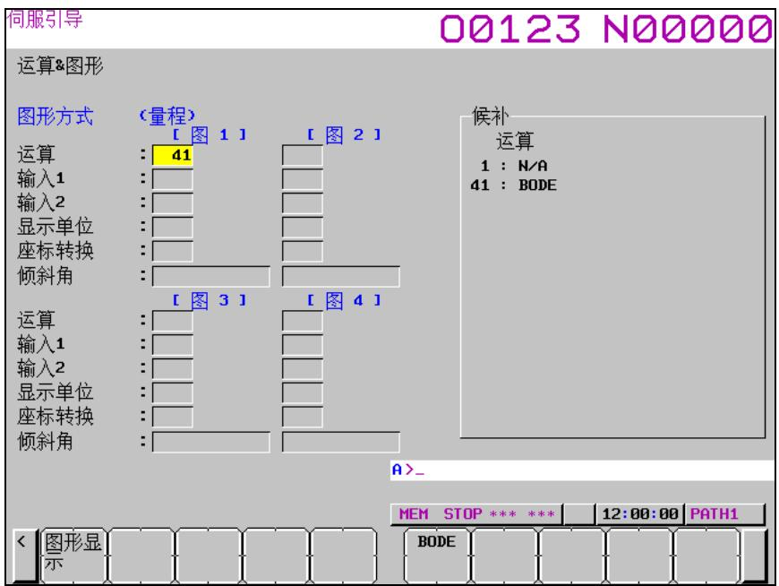

<details>
<summary>text_image</summary>

伺服引导
00123 N00000
运算&图形
图形方式 (量程)
[图 1] [图 2]
运算 : 41
输入1 :
输入2 :
显示单位 :
座标转换 :
倾斜角 :
[图 3] [图 4]
运算 :
输入1 :
输入2 :
显示单位 :
座标转换 :
倾斜角 :
候补
运算
1 : N/A
41 : BODE
A >_
MEM STOP *** ***
12:00:00 PATH1
< 图形显
示
BODE
</details>

图1.9.1.5 (d)

20 按下光标键，将光标移动到想要设定的参数位置。  
21 输入数据，按下 [INPUT] 键。  
22 按下软键 [图形显示]。  
23 软键 [比例设定]。出现图 1.9.1.5 (e) 所示的缩放画面。

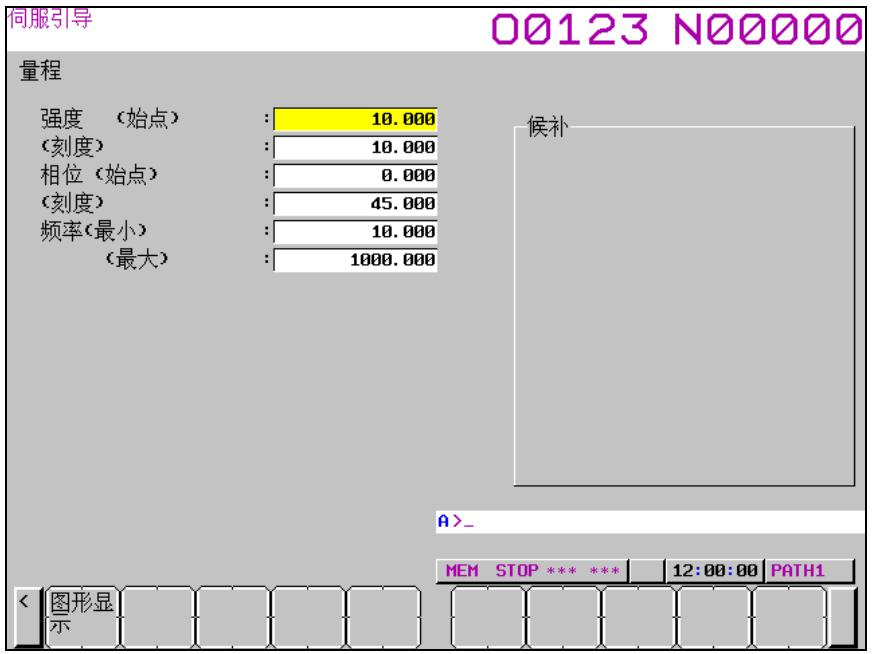

<details>
<summary>text_image</summary>

伺服引导
00123 N00000
量程
强度（始点）：10.000
（刻度）：10.000
相位（始点）：0.000
（刻度）：45.000
频率（最小）：10.000
（最大）：1000.000
候补
A >_
MEM STOP *** ***
12:00:00 PATH1
<图形显
示
</details>

图1.9.1.5 (e)

24 按下光标键，将光标移动到想要设定的参数位置。  
25 输入数据，按下 [INPUT] 键。  
26 重复 24 和 25 的步骤，设定所有的参数。  
27 按下软键 [图形显示]。  
28 按下软键 [测量]。  
29 按下软键 [开始]。  
30 自动运行步骤 4 中准备的程序。  
31 测量结束后，出现图 1.9.1.5 (f) 所示的波形画面。

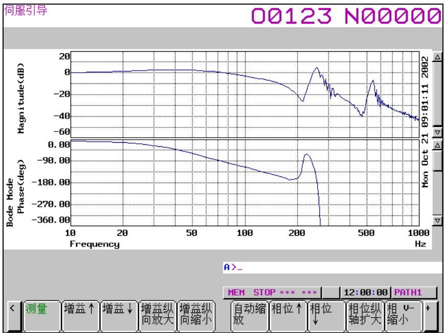

<details>
<summary>line chart</summary>

| Frequency (Hz) | Magnitude (dB) | Phase (deg) |
| -------------- | -------------- | ----------- |
| 10             | 0.00           | -90.00      |
| 20             | 0.00           | -180.00     |
| 50             | 0.00           | -270.00     |
| 100            | -20.00         | -360.00     |
| 200            | -40.00         | -360.00     |
| 500            | -40.00         | -360.00     |
| 1000           | -40.00         | -360.00     |
</details>

图1.9.1.5 (f)

## - 改变运算&图形画面

下面描述根据需要改变运算和图形设定的步骤。

1 按下软键 [运算/G 设定]。出现图 1.9.1.5 (g) 所示的运算 & 图形画面。

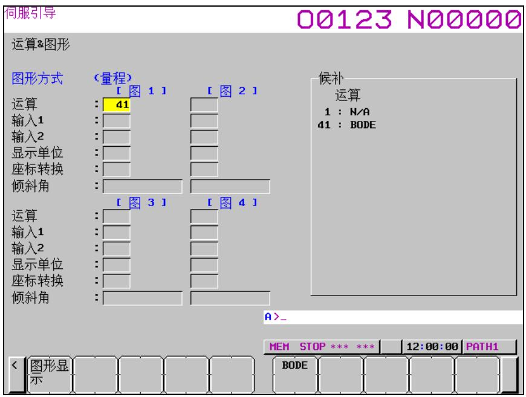

<details>
<summary>text_image</summary>

伺服引导
00123 N00000
运算&图形
图形方式 (量程)
[图 1] [图 2]
运算 : 41
输入1 :
输入2 :
显示单位 :
座标转换 :
倾斜角 :
[图 3] [图 4]
运算 : :
输入1 :
输入2 :
显示单位 :
座标转换 :
倾斜角 :
候补
运算
1 : N/A
41 : BODE
A >_
MEM STOP *** ***
12:00:00 PATH1
< 图形显
示
BODE
</details>

图1.9.1.5 (g)

2 按下光标键，将光标移动到想要设定的参数位置。  
3 输入数据，按下 [INPUT] 键。  
4 按下软键 [图形显示]。

按照新设定的运算和图形设定，显示出图 1.9.1.5 (h) 所示的波形画面。

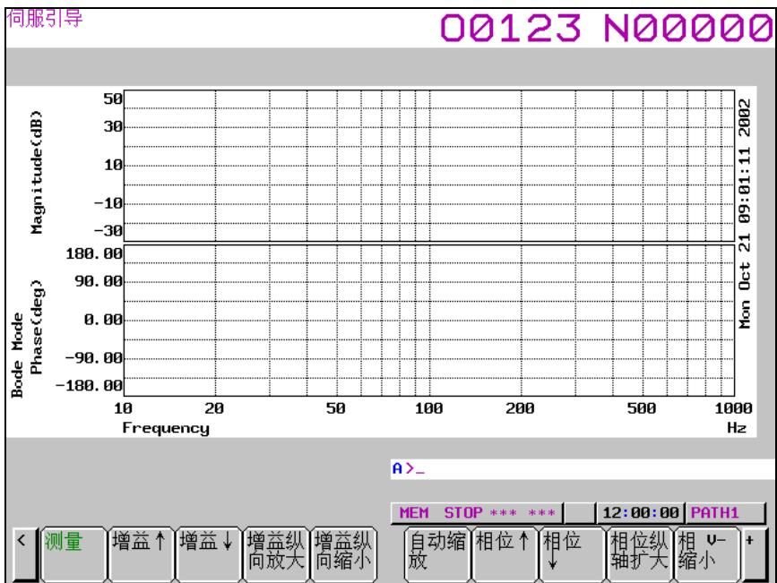

<details>
<summary>line chart</summary>

| Frequency (Hz) | Magnitude (dB) |
| -------------- | -------------- |
| 180.00         | -30            |
| 90.00          | 0.00           |
| 0.00           | 180.00         |
| -90.00         | -180.00        |
| -180.00        | 50             |
</details>

图1.9.1.5 (h)

## - 改变缩放画面

下面描述根据需要改变比例尺的步骤。

1 软键 [比例设定]。出现图 1.9.1.5 (i) 所示的缩放画面。

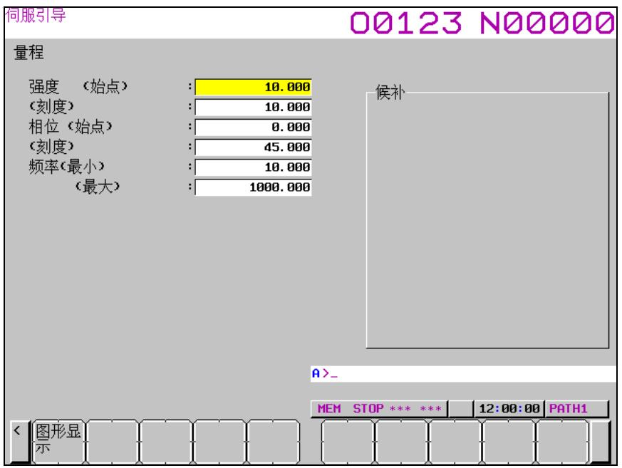

<details>
<summary>text_image</summary>

伺服引导
00123 N00000
量程
强度（始点）：10.000
（刻度）：10.000
相位（始点）：0.000
（刻度）：45.000
频率（最小）：10.000
（最大）：1000.000
候补
A>__
MEM STOP *** ***
12:00:00 PATH1
<图形显
示
</details>

图1.9.1.5 (i)

2 按下光标键，将光标移动到想要设定的参数位置。  
3 输入数据，按下 [INPUT] 键。  
4 重复 2 和 3 的步骤，设定所有的参数。  
5 按下软键 [图形显示]。

按照新设定的比例尺，显示出图 1.9.1.5 (j) 所示的波形画面。

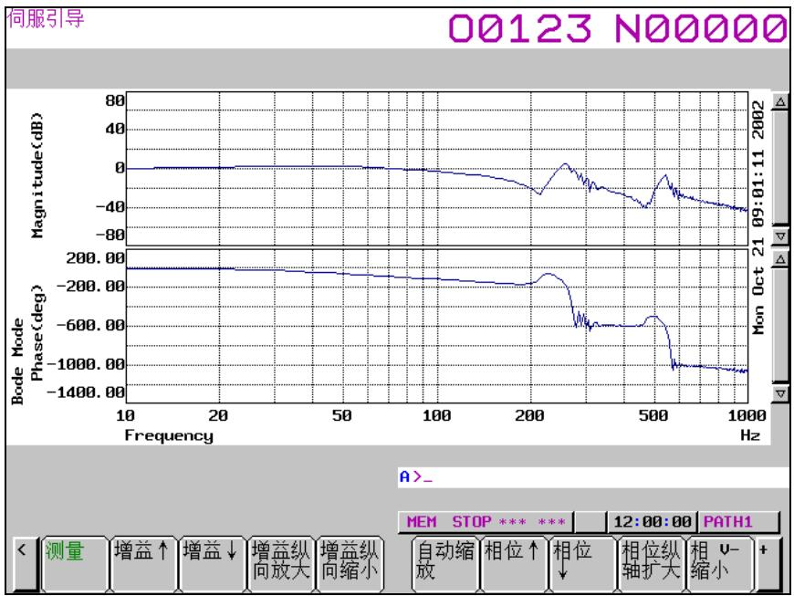

<details>
<summary>line chart</summary>

| Frequency (Hz) | Magnitude (dB) | Phase (deg) |
| -------------- | -------------- | ----------- |
| 10             | 0              | -200.00     |
| 20             | 0              | -200.00     |
| 50             | 0              | -200.00     |
| 100            | 0              | -200.00     |
| 200            | -20            | -200.00     |
| 500            | -40            | -600.00     |
| 1000           | -40            | -1400.00    |
</details>

图1.9.1.5 (j)

## - Bode 图形操作

按下下面的软键，即可执行相应的操作。

- [测量]：进行有关测量的操作。  
- [增益↑]：向下位移强度的图形。  
- [增益↓]：向上位移强度的图形。  
- [增益纵向放大]：放大强度的图形。  
- [增益纵向缩小]：缩小强度的图形。  
- [自动缩放]：自动进行比例缩放。

- [相位↑]：向下位移相位的图形。  
- [相位 ↓] ：向上位移相位的图形。  
- [相位纵轴扩大]：放大相位的图形。  
- [相 V-缩小]：缩小相位的图形。  
- [图形 1 不显示]：切换 DRAW1 的显示/隐藏。  
- [运算/G 设定]：进行运算和图形设定。  
- [比例设定]：进行比例尺设定。  
• [COM 1 输入] : 输入注释 1。  
• [COM 2 输入] : 输入注释 2。  
• [Y-TIME] : 转移到 Y-Time 图形。  
• [XY] ：转移到 XY 图形。  
- [圆]：转移到圆形(Circle)图形。  
• [FOURIER]：转换移到傅立叶(Fourier)图形。

## - 测量操作

按下软键 [测量]，即可执行与下列菜单对应的操作。

- [开始]：开始测量。  
- [起源]：设定原点值。  
- [停止] ：停止测量。  
- [取数]：进行有关测量的设定。

## - 改变测量的设定

1 软键 [测量] → [取数]，即可执行与下列菜单对应的操作。  
2 按下软键 [列表]。出现图 1.9.1.5 (k) 所示的列表画面。

需要进行当前所显示的通道以外的显示时，按下翻页键 ↑ PAGE ↓ ，显示目标通道的画面。

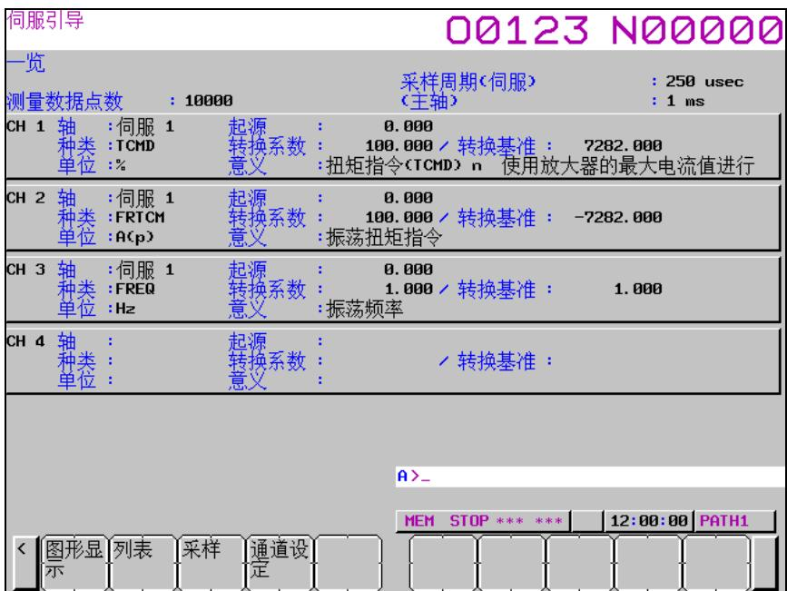

<details>
<summary>text_image</summary>

伺服引导
00123 N00000
一览
测量数据点数 : 10000
采样周期(伺服) : 250 usec
(主轴) : 1 ms
CH 1 轴 :伺服 1 起源 : 0.000
种类 :TCMD 转换系数 : 100.000 / 转换基准 : 7282.000
单位 :% 意义 :扭矩指令(TCMD)n 使用放大器的最大电流值进行
CH 2 轴 :伺服 1 起源 : 0.000
种类 :FRTCM 转换系数 : 100.000 / 转换基准 : -7282.000
单位 :A(p) 意义 :振荡扭矩指令
CH 3 轴 :伺服 1 起源 : 0.000
种类 :FREQ 转换系数 : 1.000 / 转换基准 : 1.000
单位 :Hz 意义 :振荡频率
CH 4 轴 : 起源 : 
种类 : 转换系数 : / 转换基准 :
单位 : 意义 :
A >_
MEM STOP *** ***
12:00:00 PATH1
< 图形显 列表 采样 通道设
示 定
</details>

图1.9.1.5 (k)

3 利用列表画面确认当前的设定。  
4 按下软键 [采样]。出现图 1.9.1.5 (l) 所示的测量设定画面。


<details>
<summary>text_image</summary>

伺服引导
00123 N00000
测量设定
测量数据点数 : 10000
触发系统 : 1
序.NO : 0
采样周期(伺服) : 9
(主轴) : 7
自动缩放 : 1
同步方式选择 : 1
日期 : Mon Oct 21 2002
时间 : 09:01:11
候补
采样周期(伺服)
1 : 100 ms
2 : 50 ms
3 : 20 ms
4 : 10 ms
5 : 5 ms
6 : 2 ms
7 : 1 ms
8 : 500 us
9 : 250 usec
10 : 125 us
11 : 62.5 us
A >_
MEM STOP *** ***
12:00:00 PATH1
< 图形显 列表 采样 通道设
示 定
</details>

图1.9.1.5 (l)

5 按下光标键，将光标移动到想要设定的参数位置。  
6 输入数据，按下 [INPUT] 键。  
7 重复 5 和 6 的步骤，设定所有的参数。  
8 按下软键 [通道设定]。出现图 1.9.1.5 (m) 所示的设定通道画面。

需要进行当前所显示的通道以外的设定时，按下翻页键 $\boxed{\uparrow}$ PAGE $\boxed{\downarrow}$ ，显示目标通道的画面。


<details>
<summary>text_image</summary>

伺服引导
00123 N00000
设定通道
[ CH 1 ] [ CH 2 ]
轴 : 1 1
种类 : 2 16
单位 : 33 31
转换系数 : 100.000 100.000
转换基准 : 7282.000 -7282.000
原始值 : 0.000 0.000
扩展地址 :
偏移 :
说明
扭矩指令(TCMD) n 使用放大器的最大电流值进行设定, 缺省值为100, 该值为最大扭矩值的百分比。
候补
种类
5 : POSF 21 : SIN_T
1 : VCMD 15 : FREQ
2 : TCMD 16 : FRTCM
3 : SPEED 25 : OVCLV
4 : ERR 59 : S2ST4
7 : SYNC 63 : ERMON
8 : ABS
22 : DTRQ
24 : DLTCM
23 : SFERR
48 : IR
49 : IS
50 : IEFF
20 : ROTOR
A >_
MEM STOP *** ***
12:00:00 PATH1
< 图形显 列表 采样 通道设 定
</details>

图1.9.1.5 (m)

9 按下光标键，将光标移动到想要设定的参数位置。

10 输入数据，按下 [INPUT] 键。  
11 重复 9 和 10 的步骤，设定所有的参数。  
12 按下软键 [图形显示]。出现图 1.9.1.5 (n) 所示的波形画面。

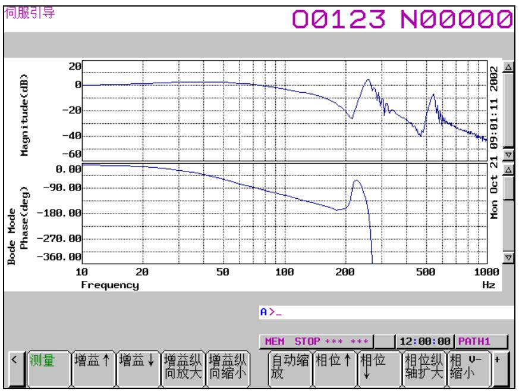

<details>
<summary>line chart</summary>

| Frequency (Hz) | Magnitude (dB) | Phase (deg) |
| -------------- | -------------- | ----------- |
| 10             | 0              | -90.00      |
| 20             | 0              | -90.00      |
| 50             | 0              | -90.00      |
| 100            | -20            | -180.00     |
| 200            | -40            | -270.00     |
| 500            | -40            | -360.00     |
| 1000           | -40            | -360.00     |
</details>

图1.9.1.5 (n)

13 设定的内容从接下来进行测量的时候起有效。请结合新的通道设定改变运算和图形设定以及比例尺设定。

## 解释

## - 设定测量设定画面

请参阅 Y-Time 图形的解释、测量设定画面的设定。

## - 设定设定通道画面

请参阅 Y-Time 图形的解释、设定通道画面的设定。

## - 设定运算&图形画面

可以在运算和图形设定中指定图形描绘的设定。

\- 运算

可以设定的数值如表 1.9.1.5 (b) 博德图形的运算所示。

如 表 1.9.1.5 (c) 博德图形的条件所示，不能指定没有满足图形的显示条件的运算。

表1.9.1.5 (b) 博德图形的运算


### PMC报警: 输入数值
- **故障内容**: 运算的名称
- **处理办法**: 运算的含义

### PMC报警: 1
- **故障内容**: N/A
- **处理办法**: 隐藏。

### PMC报警: 41
- **故障内容**: Bode
- **处理办法**: 利用横轴对数图形显示博德线图。


表1.9.1.5 (c) 博德图形的条件


### PMC报警: 
- **故障内容**: 通道1
- **处理办法**: 通道2

### PMC报警: 种类
- **故障内容**: 2:TCMD
- **处理办法**: 16:FRTCM

### PMC报警: 单位
- **故障内容**: 33:%
- **处理办法**: 33:%

### PMC报警: 转换系数
- **故障内容**: 100
- **处理办法**: 100

### PMC报警: 转换基准
- **故障内容**: 7282
- **处理办法**: -7282

### PMC报警: 原始值
- **故障内容**: 0
- **处理办法**: 0


## - 设定缩放画面

- 始点  
设定图形的中心强度数据、相位数据值。  
- 刻度  
设定每一栅格的值。  
- 频率  
设定横轴的最小值和最大值。单位为 Hz。

## - 测量操作

请参阅 Y-Time 图形的解释、测量操作。

## 限制

请参阅 Y-Time 图形的限制。

## 1.9.1.6 参数


### PMC报警: 
- **故障内容**: #7
- **处理办法**: #6

### PMC报警: 2270
- **故障内容**: DSTIN
- **处理办法**: DSTTAN


[输入类型] 参数输入

[数据类型] 位轴型

#3 ACREF 自适应减振滤波器

0: 无效

1: 有效

本功能有效的情况下，请将其暂时设为无效后使用干扰输入功能。

（即使是基于干扰输入功能的励振，减振过滤器也会跟随轴的振动而变化之故）

#4 DSTMV 通常设定 0。

#5 DSTWAV 干扰输入的输入波形

0: SIN 波

1: 方形波

通常设定 0。

#6 DSTTN 干扰

0: 只限于单轴输入

1: L、M 轴同时输入

通常设定 0。在同步轴、串联轴上仅设定 L 轴端

#7 DSTIN 干扰输入

0: 停止

1: 开始

触发 $0 \rightarrow 1$ ，开始干扰输入。

2326

干扰输入增益

[输入类型] 参数输入

[数据类型] 字轴型

[数据单位] TCMD 单位(放大器最大电流为 7282)

[数据范围] 0\~7282

通常设定 500 左右的值，励振机床，使其发出轻轻的响声。

## 2327

## 干扰输入开始频率

[输入类型] 参数输入

[数据类型] 字轴型

[数据单位] Hz

[数据范围] 1～2000

[设定标准] 10

设定励振开始频率。

## 2328

## 干扰输入结束频率

[输入类型] 参数输入

[数据类型] 字轴型

[数据单位] Hz

[数据范围] 1～2000

[设定标准] 1000

设定励振结束频率。

## 2329

## 干扰输入测定点数

[输入类型] 参数输入

[数据类型] 字轴型

[设定标准] 3

设定干扰输入功能的测定点数（励振次数）。

干扰输入功能的详情，请参照伺服的参数说明书(B-65270CM)。

## 3454


### PMC报警: #7
- **故障内容**: #6
- **处理办法**: #5


### PMC报警: 
- **故障内容**: 
- **处理办法**: 


[输入类型] 参数输入

[数据类型] 位路径型

#4 G1B 在可编程参数输入中，使得特定位参数的变更指令

0: 无效。

1: 有效。（由 Q\_来指令位号。）

## 1.10 维护信息画面

维护信息画面，是发那科以及机械制造商的维修服务人员进行维修时可以记录维护信息的画面。作为其特点可列举如下。

- 可由MDI键输入字母。（半角日本假名输入仅限日语显示）  
- 记录画面可通过行单位的卷动来进行参照。  
- 可以输入或输出进行了编辑的维护信息。  
- 记录被保存到 FLASH-ROM 中。  
- 可以显示全角代码（Shift JIS）。

## 1.10.1 维护信息画面的显示方法

1. 按下功能键 □ SYSTEM。  
2. 按下继续菜单键 ▷ 数次，直到软键 [维护信息] 显示出来。  
3. 按下软键 [维护信息]，出现维护信息画面。

选择维护画面时，显示最新信息（信息的最后）。

在最底下显示状态（方式、空字符数、光标行、列数）。

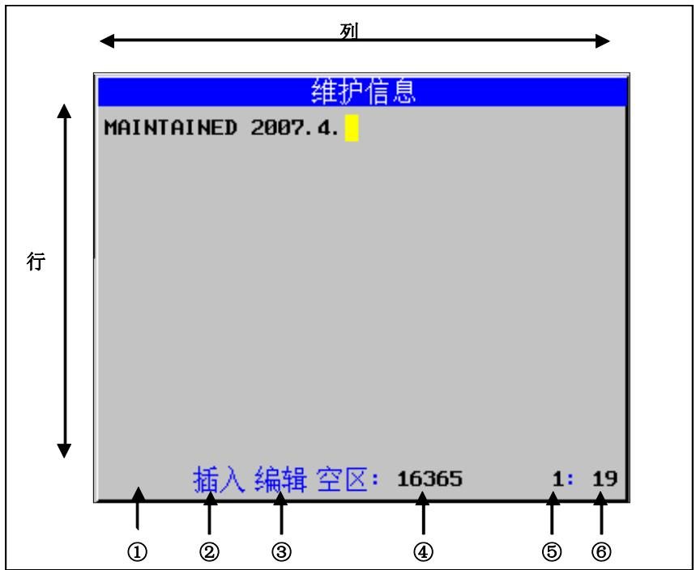

<details>
<summary>text_image</summary>

列
维护信息
MAINTAINED 2007.4.
行
插入 编辑 空区: 16365 1: 19
① ② ③ ④ ⑤ ⑥
</details>

图1.10.1 (a) 维护信息画面

状态显示

① KN / ABC ......KN : 半角片假名输入方式。
......ABC : 英文字母输入方式。  
② 覆盖 / 插入……覆盖 ：覆盖输入方式。
……插入 ：插入输入方式。  
③ 编辑 / 读入……编辑 ：编辑方式，可以进行编辑。
……读入 ：读入方式，不可进行编辑。  
④ 空字符数……半角字符的空字符数。  
⑤ 当前光标行……当前光标所指向的行的位置。  
⑥ 当前光标列数……当前光标所指向的列的位置。

## 注释

各显示器可以显示的行、列数如下所示。

- 10.4 英寸显示器......37 个字符×12 行  
- 8.4 英寸显示器....38 个字符×11 行  
- 15英寸显示器....38个字符 $\times 19$ 行

## 1.10.2 维护信息画面的操作

维护信息画面上，具有读入方式和编辑方式，通过软键 [编辑]、[结束] 来选择。

初始状态为读入方式。希望进行编辑时，按下 [（操作）]、[编辑]，进入编辑方式。编辑结束时，务必按下 [结束]，选择 [保存] 或 [退出]。不予保存时，编辑的内容将会丢失。

记录内容读入时的画面的卷动，通过 MDI 面板的光标键或者翻页键进行。

为进行编辑（字符的输入）或者读入，使用如下键。

表1.10.2 (a) 维护信息画面(编辑)操作表


### PMC报警: 方式
- **故障内容**: 按键操作
- **处理办法**: 用途

### PMC报警: 读入
- **故障内容**: 软键
- **处理办法**: 

### PMC报警: 
- **故障内容**: 
- **处理办法**: 以画面单位上下卷动。

### PMC报警: 编辑
- **故障内容**: 软键
- **处理办法**: 

### PMC报警: 
- **故障内容**: 键
- **处理办法**: 可以切换插入方式和覆盖方式。

### PMC报警: 
- **故障内容**: 键
- **处理办法**: 键入缓冲器内没有字符时,删除光标位置的1个字符。键入缓冲器内有字符时,清除缓冲器内的字符。

### PMC报警: 
- **故障内容**: 键
- **处理办法**: 键入缓冲器内没有字符时,删除光标前的1个字符。键入缓冲器内有字符时,删除缓冲器内的1个字符。

### PMC报警: 
- **故障内容**: 键
- **处理办法**: 键入缓冲器内没有字符时,换行。键入缓冲器内有字符时,向信息画面输出缓冲器内的字符。


## 1.10.3 维护信息画面上的半角假名输入

按下软键 [KN/ABC]，即可切换半角假名输入方式和英文字母输入方式。半角假名输入时，画面左下方的状态从 “ABC” 改变为 “KN”。

半角假名输入方式时，字符在罗马字输入下被变换为片假名而输入。

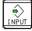


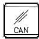

键被按下时，向维护信息输出键入缓冲器的字符。

键被按下时，清除键入缓冲器的字符，删除维护信息的光标所指向的1个字符。

键被按下时，返回变换，键入缓冲器的字符被删除1个。但是，键入缓冲器内没有字符时，删除维护信息中光标

前的 1 个字符。

## 1.10.4 维护信息画面上发生的告警

维护信息画面上，发生如下告警。

表1.10.4 (a)


## 1.10.5 参数


### PMC报警: 
- **故障内容**: #7
- **处理办法**: #6

### PMC报警: 3116
- **故障内容**: MDC
- **处理办法**: 


[输入类型] 参数输入

[数据类型] 位型

#7 MDC 能否擦除全部维护信息数据

0: 不能够擦除。

1: 能够擦除。


### PMC报警: 
- **故障内容**: #7
- **处理办法**: #6

### PMC报警: 3206
- **故障内容**: 
- **处理办法**: 


[输入类型] 参数输入

[数据类型] 位型

#1 MIF 是否禁止在维护信息画面上的编辑

0: 不予禁止。

1: 予以禁止。


### PMC报警: 
- **故障内容**: #7
- **处理办法**: #6

### PMC报警: 8901
- **故障内容**: MEN
- **处理办法**: 


[输入类型] 参数输入

[数据类型] 位型

#7 MEN 是否进行定期维护画面的显示

0: 予以进行。

1: 不予进行。

## 1.10.6 履历功能概要

可以记录操作者执行的操作和发生的报警、外部操作信息等履历，对该履历进行确认，或者进行履历数据的输出。

1 记录履历的条件

a 显示画面  
记录显示有操作履历画面以外的画面时的履历。  
b 信号选择  
可以选择最多 60 个记录履历的输入输出信号。

c 参数设定

可以通过参数个别设定是否进行 MDI 键的操作履历、外部操作信息的履历、外部报警/信息的添加、参数/刀具偏置/工件偏置（工件偏移量）/用户用程序公共变量、输入输出信号的操作履历等、各数据变更履历的记录。

d 存储保持容量

存储保持容量已满时，按照最先保存的数据顺序进行删除。存储容量，若只是 MDI 键的操作履历，大约可以记录 8000 个履历。

2 数据输出

可以将所保持的全部履历数据输出到外部 I/O 设备。（见输出全部履历数据项）

3 履历的清除

参数 EKE(No.3195#7)为 1 时，显示软键 [清除]，即可清除履历数据。


### PMC报警: 
- **故障内容**: #7
- **处理办法**: #6

### PMC报警: 3195
- **故障内容**: EKE
- **处理办法**: 


[数据类型] 位型

#7 EKE 是否显示擦除全部履历数据的软键 [清除]

0: 不予显示。

1: 予以显示。

## 注释

1 即使在切断电源之后，履历数据也不会丢失。  
但是，进行存储器清除操作时，履历数据也将被清除。  
2 请在设定画面上正确设定日期和时刻。  
3 报警、外部操作信息、操作、输入输出信号等、全部履历数据被综合在一起，保持在单一的存储区内。因此，存储保持容量已满时，与履历的种类无关，由最先保存的数据按照顺序被清除。  
此外，进行履历数据的清除时，全履历数据将被清除，在进行清除时需要注意。  
另外，无法针对每个履历进行个别清除。

## 1.10.6.1 异常履历

从已记录的全部履历数据中，只抽取出报警履历，显示在画面上。另外，履历数据量超过存储保持容量的情况下，从最早保存的履历数据按照顺序被自动清除。

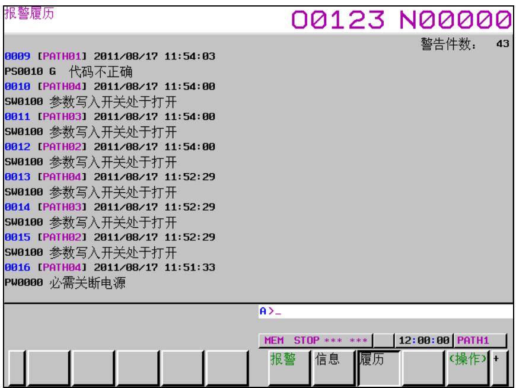

<details>
<summary>text_image</summary>

报警履历
00123 N00000
警告件数: 43
0009 [PATH01] 2011/08/17 11:54:03
PS0010 G 代码不正确
0010 [PATH04] 2011/08/17 11:54:00
SW0100 参数写入开关处于打开
0011 [PATH03] 2011/08/17 11:54:00
SW0100 参数写入开关处于打开
0012 [PATH02] 2011/08/17 11:54:00
SW0100 参数写入开关处于打开
0013 [PATH04] 2011/08/17 11:52:29
SW0100 参数写入开关处于打开
0014 [PATH03] 2011/08/17 11:52:29
SW0100 参数写入开关处于打开
0015 [PATH02] 2011/08/17 11:52:29
SW0100 参数写入开关处于打开
0016 [PATH04] 2011/08/17 11:51:33
PW0000 必需关断电源
A >_
MEM STOP *** ***
12:00:00 PATH1
报警 信息 履历 (操作) +
</details>

图1.10.6.1 (a) 报警履历画面

## 画面显示

将发生的报警，按照最新发生的新顺序进行显示。

各自的报警显示的信息如下所示。

路径名称（限于多路径运行时）

报警发生日期和时刻

报警的类别和编号

报警信息

## 注释

为将外部报警、宏报警的信息也作为履历数据加以记录，需要将参数 EAH(No.3112 #3) 设定为 1，同时将参数 HAL(No.3196 #7) 设定为 0。

另外，发生报警后改变了路径名称、轴名称、主轴名称等的情况下，报警履历画面上以变更后的名称予以显示。此外，模态‘O’数据，在程序名称的情况下，成为最初5个字符的输出。

## ·步骤

1 按功能键 $\boxed{\text{SYSTEM}}$ ，显示参数等的画面。  
2 按下返回菜单键。  
3 在显示软键 [履历] 之前，按住继续菜单键 ▷。  
4 按下软键 [履历]，显示出报警履历画面。  
5 通过翻页键 PAGE ，进行上一页、下一页的画面切换。

## 周边轴控制的报警履历显示

周边轴控制 1 中发生了报警时，在报警履历画面上，按如下所示方式在"PERIPHERAL 01"的下方显示。周边轴控制 2,3 时，在"PERIPHERAL 02", "PERIPHERAL 03"的下方显示。

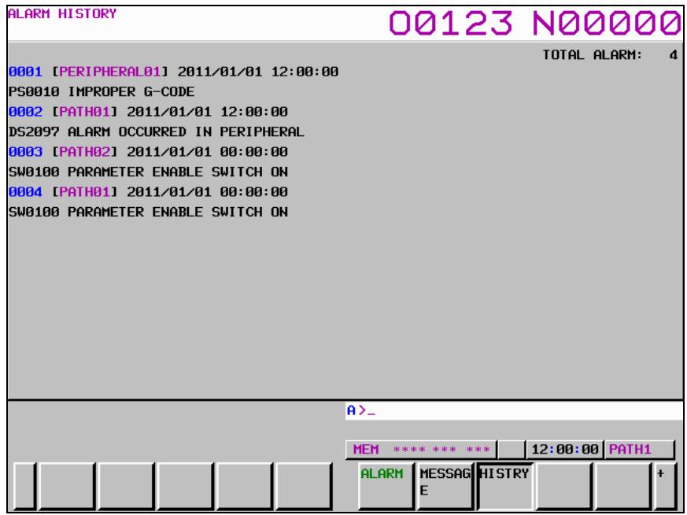

<details>
<summary>text_image</summary>

ALARM HISTORY
00123 N00000
TOTAL ALARM: 4
0001 [PERIPHERAL01] 2011/01/01 12:00:00
PS0010 IMPROPER G-CODE
0002 [PATH01] 2011/01/01 12:00:00
DS2097 ALARM OCCURRED IN PERIPHERAL
0003 [PATH02] 2011/01/01 00:00:00
SW0100 PARAMETER ENABLE SWITCH ON
0004 [PATH01] 2011/01/01 00:00:00
SW0100 PARAMETER ENABLE SWITCH ON

A >_
MEM **** *** *** 12:00:00 PATH1
ALARM MESSAGE HISTORY
+
</details>

图1.10.6.1 (b) 周边轴控制的报警履历显示（10.4"显示器）

## 从报警履历画面清除履历数据

## ·步骤

1 显示报警履历画面。  
2 按下软键 [(操作)]。  
3 按下软键 [清除] 时，清除全部履历数据。

## 注释

进行清除时，不仅清除报警履历，而且还清除外部操作信息履历、操作履历等其他履历数据。不能个别清除这些数据。

## 报警履历的保持

报警履历，被保持在与其他履历数据（按键操作履历、信号变更履历等）相同的存储区中。因此，因其它履历数据而超过存储保持容量时，清除报警履历。

设定为参数 SAH(No.11354#2)=1 时，向操作履历的存储区记录报警履历数据，同时保持报警履历的独立区域。由此，即使在因其它履历数据而超过存储保持容量的情况下，可以最多保持 50 件报警履历。

但是，不会向报警履历的独立区域记录附加信息（报警发生时的模态数据和绝对坐标值以及机械坐标值）。（向操作履历的存储区记录附加信息。）

## 报警履历的清除

设定为参数 SAH(No.11354#2)=1 的情况下，在报警履历画面上清除履历时，只清除报警履历。此外，即使在操作履历画面、外部操作信息画面上进行履历的清除，报警履历也不会被清除。

参数设定


### PMC报警: 
- **故障内容**: #7
- **处理办法**: #6

### PMC报警: 11354
- **故障内容**: 
- **处理办法**: 


[数据类型] 位型

#2 SAH 在因报警以外的履历而超过履历数据的存储保持容量时，报警履历

0: 被清除。

1: 保持到最新 50 件。

## 关于外部报警、宏报警的显示

根据下列参数，在发生外部报警或者宏报警时，不仅在报警履历中记录报警号，还可以记录报警信息。


### PMC报警: 
- **故障内容**: #7
- **处理办法**: #6

### PMC报警: 3112
- **故障内容**: 
- **处理办法**: 


[数据类型] 位型

#3 EAH 是否在报警履历功能中记录外部报警/宏报警的信息

0: 不予记录。

1: 予以记录。

## 注释

1 本参数只有在参数 HAL(No.3196#7)为 0 的情况下有效。  
2 已使用各国语言 PMC 信息功能时，若切换 CNC 画面的显示语言设定，则显示中的外部报警信息将被再次记录到报警履历中。


### PMC报警: 
- **故障内容**: #7
- **处理办法**: #6

### PMC报警: 3196
- **故障内容**: HAL
- **处理办法**: 


[输入类型] 参数输入

[数据类型] 位型

#7 HAL 发生报警时，是否在操作履历以及报警履历上记录附加信息（发生报警时的模态数据和绝对坐标值以及机械坐标值）

0: 予以记录。

1: 不予记录。

## 注释

1 报警、操作、外部操作信息以及数据变更履历等保持在相同的存储区中，因而在由于其它履历数据而超过存储保持容量时，报警履历在有的情况下会被清除。  
2 能够存储的履历的最大数，限于报警的情况下如下所示。

参数 HAL(No.3196#7)为 1 时，约 4000 件

参数 HAL(No.3196#7)为 0 时，还记录发生报警时的模态信息和坐标值，所以随系统而不同。（例：5 轴系统的情况下，约 280 件；10 轴系统的情况下约 200 件）

但是，参数EAH(No.3112#3)为1时，还记录宏报警、外部报警的信息，所以件数会相应减少。

## 1.10.6.2 外部操作信息履历

从已记录的全部履历数据中，只抽取出外部操作信息履历和宏信息履历，显示在画面上。另外，履历数据量超过存储保持容量的情况下，从最早保存的履历数据按照顺序被自动清除。

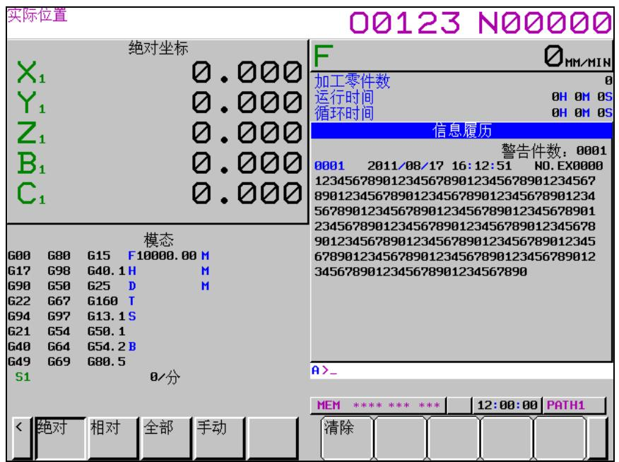

<details>
<summary>text_image</summary>

实际位置
00123 N00000
绝对坐标
X₁ 0.000
Y₁ 0.000
Z₁ 0.000
B₁ 0.000
C₁ 0.000
模态
G00 G80 G15 F10000.00 M
G17 G98 G40.1 H M
G90 G50 G25 D M
G22 G67 G160 T
G94 G97 G13.1 S
G21 G54 G58.1
G40 G64 G54.2 B
G49 G69 G88.5
S1 0/分
F
MM/MIN
加工零件数 0
运行时间 0H 0M 0S
循环时间 0H 0M 0S
信息履历
警告件数: 0001
0001 2011/08/17 16:12:51 NO.EX0000
1234567890123456789012345678901234567
8901234567890123456789012345678901234
5678901234567890123456789012345678901
2345678901234567890123456789012345678
9012345678901234567890123456789012345
6789012345678901234567890123456789012
3456789012345678901234567890
A >_
MEM **** *** *** 12:00:00 PATH1
< 绝对 相对 全部 手动 清除
</details>

图1.10.6.2 (a) 外部操作信息履历画面

## 画面显示

## ·步骤

1 按下功能键 [IMAGE]。  
2 在显示软键 [信息履历] 之前，按住继续菜单键 ▶。  
3 按下软键 [信息履历]，显示出外部操作信息履历画面。  
4 通过翻页键 $\boxed{\uparrow}$ PAGE $\boxed{\downarrow}$ ，可以显示上一页、下一页。

## 注释

1 外部操作信息、操作、报警以及数据变更履历等保持在相同的存储区中，因而在由于其它履历数据而超过存储保持容量时，外部操作信息履历在有的情况下会被清除。  
2 能够存储的最大个数，限于外部操作信息的情况下约为 150 件。

## 从外部操作信息履历画面清除履历数据

## ·步骤

1 显示外部操作信息履历画面。  
2 按下软键 [(操作)]  
3 按下软键 [清除] 时，清除全部履历数据。

## 注释

进行清除时，不仅清除外部操作信息履历，而且还清除操作履历、报警履历等其他履历数据。不能个别清除这些数据。

## 外部操作信息履历的保持

外部操作信息履历，被保持在与其他履历数据（按键操作履历、信号变更履历等）相同的区域中。因此，因其它履历数据而超过存储保持容量时，清除外部操作信息履历。

设定为参数 SOH(No.11354#3)=1 时，向操作履历的存储区记录外部操作信息履历数据，同时保持外部操作信息履历的独立区域。由此，即使在因其它履历数据而超过存储保持容量的情况下，也可以多保持外部操作信息履历。

## 外部操作信息履历的清除

设定为参数 SOH(No.11354#3)=1 的情况下，在外部操作信息履历画面进行履历的清除时，只清除外部操作信息履历。此外，即使在操作履历画面、报警履历画面上进行履历的清除，外部操作信息履历也不会被清除。

## 外部操作信息履历的字符数和件数

设定为参数 SOH(No.11354#3)=1 的情况下，通过参数 MS0,MS1(No.3113#6,#7) 来设定外部操作信息履历中记录的字符数以及件数。能够通过各设定记录的字符数和件数，如表 1.10.6.2 (a) 所示。

表1.10.6.2 (a)


### PMC报警: 参数
- **故障内容**: 最大字符数
- **处理办法**: 件数

### PMC报警: MS0=0
- **故障内容**: MS1=0
- **处理办法**: 255 个字符

### PMC报警: MS0=1
- **故障内容**: MS1=0
- **处理办法**: 200 个字符

### PMC报警: MS0=0
- **故障内容**: MS1=1
- **处理办法**: 100 个字符

### PMC报警: MS0=1
- **故障内容**: MS1=1
- **处理办法**: 50 个字符


## 参数设定


### PMC报警: 
- **故障内容**: #7
- **处理办法**: #6

### PMC报警: 3112
- **故障内容**: 
- **处理办法**: 


[输入类型] 参数输入

[数据类型] 位型

#2 OMH 是否显示外部操作信息履历画面

0: 不予显示。

1: 予以显示。


### PMC报警: 
- **故障内容**: #7
- **处理办法**: #6

### PMC报警: 3113
- **故障内容**: MS1
- **处理办法**: MS0


[输入类型] 参数输入

[数据类型] 位型

#0 HMC 外部操作信息履历的内容

0: 无法清除。

1: 可以清除。

注释

本参数只有在参数 SOH(No.11354#3)=1 的情况下有效。

#6 MS0

#7 MS1 作为外部操作信息履历保持的字符数和履历个数的组合，按照表1.10.6.2(b)进行设定。

表1.10.6.2 (b)


### PMC报警: 参数
- **故障内容**: 最大字符数
- **处理办法**: 件数

### PMC报警: MS0=0
- **故障内容**: MS1=0
- **处理办法**: 255 个字符

### PMC报警: MS0=1
- **故障内容**: MS1=0
- **处理办法**: 200 个字符

### PMC报警: MS0=0
- **故障内容**: MS1=1
- **处理办法**: 100 个字符

### PMC报警: MS0=1
- **故障内容**: MS1=1
- **处理办法**: 50 个字符


## 注释

1 可最多用 255 个字符来指令外部操作信息，但通过参数 MS0,MS1(No.3113#6,#7) 的组合，即可限制作为外部操作信息履历保留的字符数，选择履历个数。  
2 参数 MS0,MS1(No.3113#6,#7)的设定，从下次接通电源时起有效。此时，清除外部操作信息履历。  
3 即使改变参数 MS0,MS1(No.3113#6,#7)的设定，也不会发生报警(PS000)。但是，要将设定置于有效，需要重新通电。  
4 使用基于字符代码的输入(半角片假名、汉字等)的情况下，记录到外部操作信息履历中的字符数，有时会比参数 MS0,MS1(No.3113#6,#7)所设定的最大字符数少。


### PMC报警: 
- **故障内容**: #7
- **处理办法**: #6

### PMC报警: 3196
- **故障内容**: 
- **处理办法**: HOM


[输入类型] 参数输入

[数据类型] 位型

#6 HOM 是否记录外部操作信息和宏信息履历

0: 予以记录。

1: 不予记录。

## 注释

已使用各国语言 PMC 信息功能时，若切换 CNC 画面的显示语言设定，则显示中的外部操作信息将被再次记录到外部操作信息履历中。


### PMC报警: 
- **故障内容**: #7
- **处理办法**: #6

### PMC报警: 11354
- **故障内容**: 
- **处理办法**: 


[输入类型] 参数输入

[数据类型] 位型

#3 SOH 在因外部操作信息履历以外的数据超过履历数据的存储保持容量时，外部操作信息履历

0: 被清除。

1: 予以保存。

## 注释

1 参数 SOH(No.11354#3) 的设定，从下次接通电源时起有效。此时，所有履历数据（操作履历、报警履历、外部操作信息履历）都被清除。  
2 设定为参数 SOH(No.11354#3)=1 的情况下，能够保持的操作履历数据的件数减少。能够记录的操作履历的件数如下所示。  
No.11354#3=0 … 约 8000 件  
=1 … 约 7500 件  
※ 件数是限于记录下按键操作履历时的件数。

## 1.10.6.3 操作履历

该功能在发生故障或发出报警时，显示出操作者执行什么样的键入操作或信号操作，发生了什么样的报警的履历。存储的内容有如下一些。

a 操作履历

i 操作者进行的 MDI 键的操作

ii 输入输出信号(X,Y,G,F)的 ON、OFF 的切换

b 异常履历

i 发生的报警

ii 报警发生时执行的程序段的模态信息和坐标值

(画面上不予显示)

c 数据的变更履历

i 刀具偏置数据的变更

(参数 HTO(No.3196#0)为 1 时)

ii 刀具偏置数据/扩展工件偏置数据/工件偏移量（T 系列）的变更

(参数 HWO(No.3196#1)为 1 时)

iii 参数的变更

(参数 HPM(No.3196#2)为 1 时)

iv 用户宏程序公共变量数据的变更

(参数 HMV(No.3196#3)为 1 时)

d 外部操作信息履历以及宏信息履历

(参数 HOM(No.3196#6)为 0 时)

e 时间戳（日期和时刻）

除了一部分外，操作履历、报警履历的履历数据可以在操作履历画面上进行参照。（数据的变更履历、外部操作信息履历、报警信息不予显示）

此外，可以将所记录的全部履历数据输出到外部 I/O 设备。

## 注释

可以存储的最大个数，若限于 MDI 键的操作履历，可记录大约 8000 个履历，而由于每个履历数据的大小不同，可存储的最大个数不是固定不变的。

参数设定


### PMC报警: 
- **故障内容**: #7
- **处理办法**: #6

### PMC报警: 3106
- **故障内容**: 
- **处理办法**: 


#4 OPH 是否显示操作履历画面

0: 不予显示。

1: 予以显示。

3122

在操作履历中记录时刻的周期

[输入类型] 参数输入

[数据类型] 字型

[数据单位] 分钟

[数据范围] 0 \~ 1440

针对每个设定的时间，将时刻记录在操作履历中。

设定值为 0 的情况下，视为 10 分钟。

但是，在时间内没有记录数据时，则不予记录时刻。

## 注释

本参数在全部路径中都需要设定相同的值。


### PMC报警: 
- **故障内容**: #7
- **处理办法**: #6

### PMC报警: 3195
- **故障内容**: EKE
- **处理办法**: HDE


[输入类型] 参数输入

[数据类型] 位型

#5 HKE 是否登录按键操作的履历

0: 予以登录。

1: 不予登录。

#6 HDE 是否登录 DI/DO 的履历

0: 予以登录。

1: 不予登录。

#7 EKE 是否显示擦除全部履历数据的软键 [清除]

0: 不予显示。

1: 予以显示。


### PMC报警: 
- **故障内容**: #7
- **处理办法**: #6

### PMC报警: 3196
- **故障内容**: HAL
- **处理办法**: HOM


[输入类型] 参数输入

[数据类型] 位型

#0 HTO 是否记录刀具偏置数据的变更履历

0: 不予记录。

1: 予以记录。

#1 HWO 是否记录刀具偏置数据/扩展工件偏置数据/工件偏移量(T 系统)的变更履历

0: 不予记录。

1: 予以记录。

#2 HPM 是否记录参数的变更履历

0: 不予记录。

1: 予以记录。

#3 HMV 是否记录用户宏程序公共变量的变更履历

0: 不予记录。

1: 予以记录。

#6 HOM 是否记录外部操作消息以及宏消息的履历

0: 予以记录。

1: 不予记录。

#7 HAL 发生报警时，是否在操作履历以及报警履历上记录附加信息（发生报警时的模态数据和绝对坐标值以及机械坐标值）

0: 予以记录。

1: 不予记录。

希望从报警详细信息记录更多的报警履历个数时，将本参数设定为1。此外，希望记录的10个G代码模态组号，设定在参数(No.12990～12999)中。


[输入类型] 参数输入

[数据类型] 字节路径型

[数据范围] 1～最大G代码组数

设定发生报警时记录在报警履历和操作履历中的 G 代码模态组号。

※ 设定数据范围外的值时，记录 01～10 组的状态。

## 画面显示

## ·步骤

1 按下功能键 SYSTEM。

2 在显示软键 [操作履历] 之前，按住继续菜单键。

3 按下软键 [操作履历]，并按下新显示的软键 [操作履历] 时，显示操作履历画面。

4 希望显示后续的操作履历时，通过翻页键 PAGE PAGE ↓，进行向上一页、下一页的画面切换。

希望显示页和页之间的内容时，请按下光标键 $\boxed{\leftarrow}$ $\boxed{\rightarrow}$ 。画面按照每半页显示的方式变动。

(但是, 8.4 英寸显示器中, 成为偏移一列的显示)

此外，在显示有操作履历画面的状态下，通过按下软键[(操作)]，即可进行如下的软键操作。

a 以 [顶部] 显示开头页（最早的数据）。

b 以 [最后] 显示最后页（最新的数据）。  
c 以 [搜索号码] 显示所指定的操作履历数据。

（例）在 50 [搜索号码] 的操作中显示第 50 个数据。

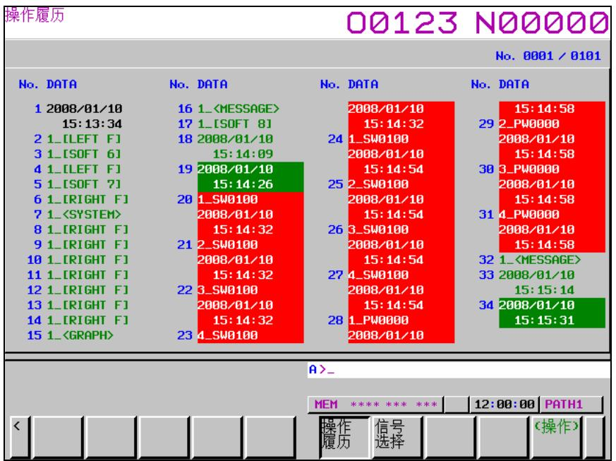

<details>
<summary>text_image</summary>

操作履历
00123 N00000
No. 0001 / 0101
No. DATA	No. DATA	No. DATA	No. DATA
1 2008/01/10	16 1_<MESSAGE>	2008/01/10	15:14:58
15:13:34	17 1_[SOFT 8]	15:14:32	29 2_PW0000
2 1_[LEFT F]	18 2008/01/10	24 1_SW0100	2008/01/10
3 1_[SOFT 6]	15:14:09	2008/01/10	15:14:58
4 1_[LEFT F]	19 2008/01/10	15:14:54	30 3_PW0000
5 1_[SOFT ?]	15:14:26	25 2_SW0100	2008/01/10
6 1_[RIGHT F]	20 1_SW0100	2008/01/10	15:14:58
7 1_<SYSTEM>	2008/01/10	15:14:54	31 4_PW0000
8 1_[RIGHT F]	15:14:32	26 3_SW0100	2008/01/10
9 1_[RIGHT F]	21 2_SW0100	2008/01/10	15:14:58
10 1_[RIGHT F]	2008/01/10	15:14:54	32 1_<MESSAGE>
11 1_[RIGHT F]	15:14:32	27 4_SW0100	33 2008/01/10
12 1_[RIGHT F]	22 3_SW0100	2008/01/10	15:15:14
13 1_[RIGHT F]	2008/01/10	15:14:54	34 2008/01/10
14 1_[RIGHT F]	15:14:32	28 1_PW0000	15:15:31
15 1_<GRAPH>	23 4_SW0100	2008/01/10

A >_
MEM **** *** ***
MEM **** *** ***
12:00:00 PATHI
操作
信号
操作
履历
选择
(操作)
</details>

图1.10.6.3 (a) 操作履历画面

## 显示内容

1 连续号以及显示开始履历号/总履历数

在所记录的各履历数据的左边，显示连续号。此外，连续号越小的编号，保存的数据时间越早。

画面右上方显示出显示开始履历号 / 总履历数。但是，画面上没有显示的履历数据数，则不包含在总履历数中。

2 数据

\- MDI 键

参数 HKE(No.3195#5)为 0 时，记录按键操作。

诸如 1\_ [LEFT F], 2\_ [LEFT F] 那样地在路径号中连续显示按键操作。（路径数为 1 时，不显示路径号）此外，P\_ [LEFT F] 等的 P\_ 表示来自外部的按键操作。

i 地址键、数值键

直接显示 A～Z、0～9、;、+、-等字符。显示为黑色字符。

ii 功能菜单键、操作菜单键、软键

[LEFT F]、[SOFT 1]～[SOFT 10]、[RIGHT F]等以[]括起来显示。显示为绿色字符。

iii 功能键、翻页键、光标键、其他

<POS>、<SYSTEM>、<PAGE ↑>、<CUR →>、<RESET>、<INPUT>等以<>括起来显示。显示为绿色字符。

iv 通电时的按键

以绿底白字显示。

\- 输入输出信号

参数 HDE(No.3195 #6)为 0 时，记录在操作履历信号选择画面上指定的输入输出信号。记录按每个位显示信号的地址和位的变化。显示为紫色字符。

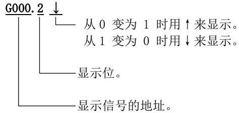

<details>
<summary>text_image</summary>

G000.2 ↓
从 0 变为 1 时用↑来显示。
从 1 变为 0 时用↓来显示。
显示位。
显示信号的地址。
</details>

## 注释

1 在相同的时机相同地址的多个位发生变化时，作为一个履历数据来处理。  
2 不到 4msec 的信号变化，不作为履历数据来处理。

\- 报警

操作履历画面上显示报警号和发生时刻。

显示为红底白字。

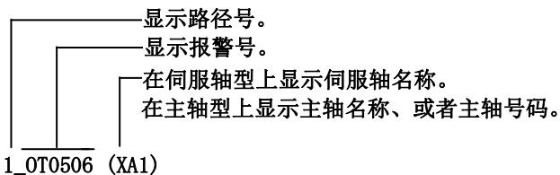

<details>
<summary>flowchart</summary>

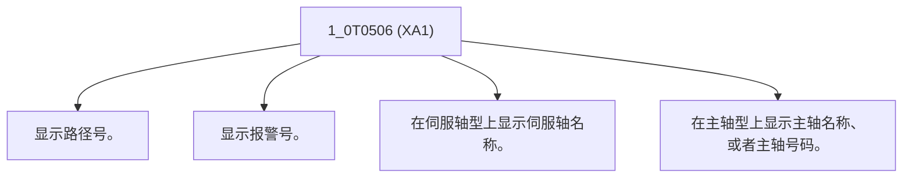
```mermaid
graph TD
  A["1_0T0506 (XA1)"] --> B["显示路径号。"]
  A --> C["显示报警号。"]
  A --> D["在伺服轴型上显示伺服轴名称。"]
  A --> E["在主轴型上显示主轴名称、或者主轴号码。"]
```
</details>

2004/01/11 用 2 行显示发生的年月日、时刻。

11:22:33

另外，发生报警后改变了路径名称、轴名称、主轴名称等的情况下，以变更后的名称予以显示。

\- 日期和时刻

分 2 行显示如下内容的日期和时刻。

i 接通电源的日期和时刻。显示为绿底白字。  
ii 切断电源的日期和时刻。显示为绿色字符。  
iii 日期改变时的日期。显示为黑色字符。  
iv 每经过参数(No.3122)中设定一定时间的日期和时刻。显示为黑色字符。  
v 删除履历数据的日期和时刻。显示为黑色字符。

## 注释

1 每一定时间的时刻的存储中，一定时间内没有存储数据时，不予存储此时的时刻。（日期变更引起的时刻的存储，视为有存储数据）  
2 变更CNC系统的日期和时刻时，所变更的日期和时刻有时被作为iii或iv的日期和时刻进行记录。

## 画面上不会显示的履历数据

除了显示的 MDI 键、输入输出信号状态、已发生的报警、外部操作信息（操作履历画面上不予显示）、时间戳的各履历数据外，可以与时刻一起记录下列数据。这些履历数据不能显示在画面上，但是可以输出到外部 I/O 设备。（见输出全部履历数据项）

1 报警发生时候的详细数据

参数 HAL(No.3196 #7)为 0 时，与报警号以及发生时刻一起，记录报警发生时执行中的程序段的 10 个 G 代码模态和第 2 辅助功能代码 D,E,F,H,M,N,O,S,T 和绝对坐标值以及机械坐标值。

记录的 10 个 G 代码模态，在参数(No.12990\~No.12999)中设定组号。没有指定的情况下，记录 01～10 组的 G 代码模态。

## 注释

模态‘O’数据，在程序名称的情况下，只记录最初的5个字符。

希望记录比报警发生时的详细数据更多的件数时，将参数 HAL(No.3196 #7) 设定为 1。

2 外部报警信息、宏报警信息

参数 EAH(No.3112 #3)为 1 时，可以将外部报警、宏报警信息都作为履历数据记录下来。但是，记录的字符数是最初的 64 个字符。

## 注释

为将外部报警、宏报警的信息也作为履历数据加以记录，需要将参数 EAH(No.3112 #3) 设定为 1，同时将参数 HAL(No.3196 #7) 设定为 0。

3 刀具偏置数据的变更

参数 HTO(No.3196 #0)为 1 时，在变更刀具偏置数据的情况下，与已变更的刀具偏置号、类别一起，记录变更前的刀具偏置数据和变更后的刀具偏置数据以及变更时间。

## 4 工件偏置/扩展工件偏置/工件偏移（T 系列）数据的变更

参数 HWO(No.3196 #1) 为 1 时，在已变更工件偏置数据的情况下，与已变更的工件偏置号一起，记录变更前的工件偏置数据和变更后的工件偏置数据以及变更时刻。变更扩展工件偏置、工件偏移量（T 系列的情形）时也予以记录。

## 5 参数的变更

参数 HPM(No.3196 #2)为 1 时，在已变更参数的情况下，与已变更的参数号、型式（轴型、主轴型、路径型、机械组型）一起，记录变更前的参数数据和变更后的参数数据以及变更时刻。

## 注释

通电时的变更、以及与密码和按键变更相关的履历不予记录。

## 6 用户宏程序公共变量(\#100～#999)的变更

参数 HMV(No.3196 #3)为 1 时，在已变更用户宏程序公共变量的情况下，与已变更的公共变量号一起，记录变更前的公共变量值和变更后的公共变量值以及变更时刻。

## 周边轴控制的报警履历

周边轴控制 1 中发生了报警时，在操作履历画面上，按如下所示方式在路径编号的显示部位显示"P1"。周边轴控制 2,3 时，显示"P2", "P3"。

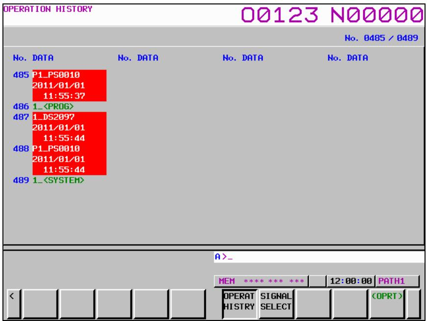

<details>
<summary>text_image</summary>

OPERATION HISTORY
00123 N00000
No. 0485 / 0489
No. DATA	No. DATA	No. DATA	No. DATA
485 P1_PS0010
2011/01/01
11:55:37
486 1_<PROG>
487 1_DS2097
2011/01/01
11:55:44
488 P1_PS0010
2011/01/01
11:55:44
489 1_<SYSTEM>
A >_
MEM **** *** ***
12:00:00 PATH1
<	OPERAT	SIGNAL
HISTRY	SELECT		(OPRT)
</details>

图1.10.6.3 (b) 周边轴控制的报警履历显示（10.4”显示器）

## 从操作履历画面清除履历数据

## ·步骤

1 显示操作履历画面。  
2 按下软键 [(操作)]。  
3 按下软键 [清除]。  
4 按下软键 [执行] 时，清除全部履历数据。

## 注释

进行清除时，不仅清除操作履历，而且还清除外部操作信息履历、操作履历等其他履历数据。不能个别清除这些数据。

## 1.10.6.4 操作履历信号选择

可以进行记录履历的输入输出信号的选择。此外，信号最多可以设定 60 个。

## 数据的设定

1 按下功能键 SYSTEM。  
2 在显示软键 [操作履历] 之前，按住继续菜单键 ▶。  
3 按下软键 [操作履历]。  
4 按下软键 [信号选择]，显示出操作履历信号选择画面。  
5 按下软键 [(操作)]。  
6 按下光标移动键 $\boxed{\uparrow}$ $\boxed{\downarrow}$ ，将光标移动到希望设定的位置。  
7 键入信号种类(X,G,F,Y) + 地址后，按下 INPUT。

例）输入了 G0004 [NPUT] 的情形下，

在 ADDRES 位置，设定已输入的信号地址 “G0004”，在信号位置设定初始值 “00000000”。

8 选择成为履历对象的位。

变更所指定的信号地址的所有位时，光标如“00000000”所示，在所有位都反相显示的状态下按下软键[ON:1]、[OFF:0]时，成为“11111111”或者“00000000”。

变更特定的位时，通过光标移动键←→将光标指向要变更的位，按下[ON:1]、[OFF:0]时，所选的位成为1或者0。

9 信号选择最多可以选择 60 个地址。此外，并非必定要从 No.1 开始连续设定。

## 注释

1 操作履历信号选择画面的显示中不记录履历。  
2 输入输出信号中可以设定的地址仅限 X, Y, G, F。此外，尚未设定的数据显示\*\*\*\*\*\*。  
3 即使设定了地址，所有位都是0的情况下不记录履历。  
4 输入信号的 ON/OFF 宽在 4msec 以下的情况下，不进行向履历数据的记录。此外，有的信号不予记录。  
5 选择信号数较多的情况下，处理速度会下降。

## 个别数据的清除

1 显示操作履历信号选择画面。  
2 将光标移动到希望清除的数据位置。  
3 按下软键 [删除]。  
4 按下软键 [执行]。

## 全部数据的清除

1 显示操作履历信号选择画面。  
2 按下软键 [全删除]。  
3 按下软键 [执行]。

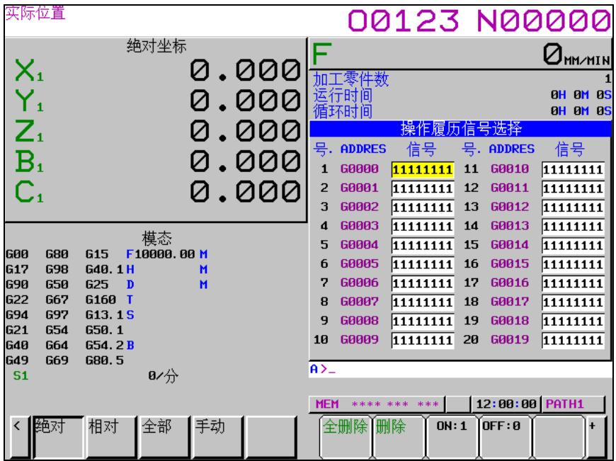

<details>
<summary>text_image</summary>

实际位置
00123 N00000
绝对坐标
X₁ 0.000
Y₁ 0.000
Z₁ 0.000
B₁ 0.000
C₁ 0.000
模态
G00 G80 G15 F10000.00 M
G17 G98 G40.1 H M
G90 G50 G25 D M
G22 G67 G160 T
G94 G97 G13.1 S
G21 G54 G50.1
G40 G64 G54.2 B
G49 G69 G80.5
S1 0/分
F
MM/MIN
加工零件数 1
运行时间 0H 0M 0S
循环时间 0H 0M 0S
操作履历信号选择
号. ADDRES 信号 号. ADDRES 信号
1 G0000 11111111 11 G0010 11111111
2 G0001 11111111 12 G0011 11111111
3 G0002 11111111 13 G0012 11111111
4 G0003 11111111 14 G0013 11111111
5 G0004 11111111 15 G0014 11111111
6 G0005 11111111 16 G0015 11111111
7 G0006 11111111 17 G0016 11111111
8 G0007 11111111 18 G0017 11111111
9 G0008 11111111 19 G0018 11111111
10 G0009 1111111<fcel>A >_
MEM **** *** ***  12:00:00 PATHI
全删除 删除 ON: Ⅰ OFF: Ⅱ +
</details>

图1.10.6.4 (a) 操作履历信号选择画面

## 通过参数进行的选择

参数 PHS(No.3206#4)为 1 时，可以通过参数来设定记录履历的输入输出信号的选择。

这种情况下，在操作履历信号选择画面上选择或解除信号时，对应的参数值会被自动变更。此外，在参数画面上变更参数值时，操作履历信号选择画面的显示也被变更。

有关输入操作也相同。在操作履历信号选择画面上进行操作履历信号选择数据的输入时，对应的参数值会被自动变更。此外，在参数画面上进行参数输入时，操作履历信号选择画面的显示也会被变更。

可通过参数设定的数据，是在 60 个数据中的开头 20 个数据。

## 参数设定


### PMC报警: 
- **故障内容**: #7
- **处理办法**: #6

### PMC报警: 3206
- **故障内容**: 
- **处理办法**: 


[输入类型] 参数输入

[数据类型] 位型

#4 PHS 是否使操作履历信号选择与参数联动

0: 不予联动。

操作履历信号选择的追加和删除，在操作履历信号选择画面上进行。

即使改变参数(No.24901～No.24920、No.12801～No.12820、No.12841～No.12860、No.12881～No.12900)，对于操作履历信号选择不会产生影响。

即使由参数(No.24901～No.24920、No.12801～No.12820、No.12841～No.12860、No.12881～No.12900)

指定的地址信号发生变化，也不会留在履历中。

1: 予以联动。

操作履历信号选择，可以在操作履历信号选择画面上进行，也可以通过设定参数进行。

## 注释

将本参数变更为1时，目前的操作履历信号选择数据会被反映到参数(No.24901～No.24920、No.12801～No.12900)中。

24901

\~

24920

操作履历信号选择的 PMC 路径号(No.01)

\~

操作履历信号选择的 PMC 路径号(No.20)

[输入类型] 参数输入

[数据类型] 字节型

[数据范围] 0\~3

设定 No.1～No.20 的操作履历信号选择的 PMC 路径号。

PMC 路径号和设定值的对应如表1.10.6.4(a)所示。

表1.10.6.4 (a)


本参数按如表1.10.6.4(b)所示方式，与其它参数成对。

表1.10.6.4 (b)


### PMC报警: No.
- **故障内容**: PMC 路径号
- **处理办法**: 地址种类

### PMC报警: 01
- **故障内容**: No.24901
- **处理办法**: No.12801

### PMC报警: 02
- **故障内容**: No.24902
- **处理办法**: No.12802

### PMC报警: 03
- **故障内容**: No.24903
- **处理办法**: No.12803

### PMC报警: ...
- **故障内容**: ...
- **处理办法**: ...

### PMC报警: 20
- **故障内容**: No.24920
- **处理办法**: No.12820


## 注释

1 可通过参数进行选择和解除的操作履历信号，为 60 组中开头数起的 20 组。此外，从操作履历信号选择画面指定操作履历信号时，PMC 路径号被固定为第 1PMC。  
2 解除信号选择时，设定 0（零）。
此时，在与该信号对应的地址种类(No.12801～No.12820)、地址号（No.12841～No.12860）和位号（No.12881～No.12900）中，设定 0 作为初始值。  
3 设定 PMC 路径号时，在与该信号对应的地址种类(No.12801～No.12820)中设定 1，在地址号(No.12841～No.12860)和位号(No.12881～No.12900)中设定 0 作为初始值。
（例） 设定 No.24901=1 时，按如下方式进行初始化。

No.12801=1 地址种类

No.12841=0 地址号

No.12881=00000000 位号

此时，在意设定了与该信号对应的地址种类(No.12801～No.12820)的情况下，地址种类(No.12801～No.12820)、地址号（No.12841～No.12860）和位号（No.12881～No.12900）不会被初始化。

4 试图设定无法进行设定的值时，显示告警“数据超限”，请重新进行设定。

12801

\~

12820

操作履历信号选择的地址种类 (No.01)

\~

操作履历信号选择的地址种类 (No.20)

[输入类型] 参数输入

[数据类型] 字节型

[数据范围] 0\~4

设定 No.1～No.20 的操作履历信号选择的地址种类。

地址种类和设定值的对应如表1.10.6.4(c)所示。

表1.10.6.4 (c)


本参数按如表1.10.6.4(d)所示方式，与其它参数成对。

表1.10.6.4 (d)


### PMC报警: No.
- **故障内容**: PMC 路径号
- **处理办法**: 地址种类

### PMC报警: 01
- **故障内容**: No.24901
- **处理办法**: No.12801

### PMC报警: 02
- **故障内容**: No.24902
- **处理办法**: No.12802

### PMC报警: 03
- **故障内容**: No.24903
- **处理办法**: No.12803

### PMC报警: ...
- **故障内容**: ...
- **处理办法**: ...

### PMC报警: 20
- **故障内容**: No.24920
- **处理办法**: No.12820


## 注释

1 可通过参数进行选择和解除的操作履历信号，为 60 组中开头数起的 20 组。此外，从操作履历信号选择画面指定操作履历信号时，PMC 路径号被固定为第 1PMC。  
2 解除信号选择时，设定 0（零）。
此时，在与该信号对应的地址号（No.12841～No.12860）和位号（No.12881～No.12900）中，设定 0 作为初始值。  
3 设定地址种类时，在与该信号对应的 PMC 路径号(No.24901～No.24920)中设定 1，在地址号(No.12841～No.12860)和位号(No.12881～No.12900)中设定 0 作为初始值。
（例） 设定 No.12801=2 时，按如下方式进行初始化。

No.24901=1 PMC 路径号

No.12841=0 地址号

No.12881=00000000 位号

但是，在已设定了该信号对应的 PMC 路径号(No.24901～No.24920)的情况下，PMC 路径号(No.24901～No.24920)不会被初始化。

4 试图设定无法进行设定的值时，显示告警 “数据超限”，请重新进行设定。


[输入类型] 参数输入  
[数据类型] 字型  
[数据范围] G,F,X,Y 信号的地址范围，请参照 PMC 编程说明书(B-64513EN)。

设定 No.1～No.20 的操作履历信号选择的地址号。

本参数按如表1.10.6.4(e)所示方式，与其它参数成对。

表1.10.6.4 (e)


### PMC报警: No.
- **故障内容**: PMC 路径号
- **处理办法**: 地址种类

### PMC报警: 01
- **故障内容**: No.24901
- **处理办法**: No.12801

### PMC报警: 02
- **故障内容**: No.24902
- **处理办法**: No.12802

### PMC报警: 03
- **故障内容**: No.24903
- **处理办法**: No.12803

### PMC报警: ...
- **故障内容**: ...
- **处理办法**: ...

### PMC报警: 20
- **故障内容**: No.24920
- **处理办法**: No.12820


## 注释

1 可通过参数进行选择和解除的操作履历信号，为 60 组中开头数起的 20 组。  
2 设定地址号时，在与该信号对应的位号（No.12881～No.12900）中，设定 0 作为初始值。  
3 试图设定无法设定的值时、以及与该信号对应的地址种类 (No.12801～12820) 的值为 0 时，显示告警 “数据超限”，请重新进行设定。


### PMC报警: 12881~
- **故障内容**: RB7
- **处理办法**: RB6

### PMC报警: RB7
- **故障内容**: RB6
- **处理办法**: RB5


[输入类型] 参数输入

[数据类型] 位型

RB7 \~ RB0 是否保留与参数(No.12801～12860)设定的操作履历信号选择的地址对应的 No.1～No.20 的操作履历信号选择的各位(RB7～RB0)的履历

0: 不予保留。（该位不记录履历。）

1：予以保留。（记录该位的履历。）

本参数按如表1.10.6.4 (f)所示方式，与其它参数成对。

表1.10.6.4 (f)


### PMC报警: No.
- **故障内容**: PMC 路径号
- **处理办法**: 地址种类

### PMC报警: 01
- **故障内容**: No.24901
- **处理办法**: No.12801

### PMC报警: 02
- **故障内容**: No.24902
- **处理办法**: No.12802

### PMC报警: 03
- **故障内容**: No.24903
- **处理办法**: No.12803

### PMC报警: ...
- **故障内容**: ...
- **处理办法**: ...

### PMC报警: 20
- **故障内容**: No.24920
- **处理办法**: No.12820


## 1.10.6.5 输出全部履历数据

可以向外部 I/O 设备输出全部履历数据。

另外，无法个别输出各履历数据。

## 步骤

1 将输出设备设为可输出状态。  
2 选择 EDIT 方式。  
3 按下功能键 SYSTEM。  
4 在显示软键 [操作履历] 之前，按住继续菜单键 ▶。  
5 按下软键 [操作履历]，并按下新显示的软键 [操作履历] 时，显示操作履历画面。  
6 按下软键 [(操作)]。  
7 按下软键 [输出]。  
8 输入文件名，按下软键 [执行]。  
此外，没有输入文件名而按下了软键 [执行] 的情况下，输出文件名成为“OPRT\_HIS.TXT”。

## 输出格式

履历按照如下格式作为 ASCII 文件而被输出。

1 MDI 键

在紧跟 “MDI” 后，按照 “路径号\_”、“键数据”、“输入时刻” 的顺序被输出。

(接通电源时输入的键数据以 “Power on MDI” 来表示)

```txt
<例>
MDI 01_A 12:23:34
MDI 02_<CAN> 12:23:34
MDI 02_[SOFT HF1] 12:23:35
MDI P_<RESET> 12:34:56
Power on MDI 01_<RESET> 12:34:56
```

2 输入输出信号

在紧跟 “DI/DO” 后，按照 “PMC 号\_”、“信号地址和位状态”、“变更时刻”的顺序被输出。

<例>

```txt
DI/DO 1_F0002.2_on 12:34:56
DI/DO 1_G0043.0_off G0043.1_off 12:35:00
```

(同一地址、多个位的例子)

3 报警

在紧跟 “Alarm” 后，按照 “路径号\_”、“种类”、“报警号”、“G 代码模态数据”、“G 代码以外的模态数据”、各轴的 “绝对坐标值”、“机械坐标值”、“发生日期和时刻” 的顺序被输出。

另外，报警发生时执行中的程序段中有指令的模态数据之前，输出“\*”。

<例>

\- Alarm 01\_SR01973

```txt
*G0. G97. G69. G99. G21. G50.2 G25. G13.1 B0. D0. E0. *F100. H0. M10. *N123. Test_S1000. T1010. X1 ABS 197.999 MCN 197.999 Y1 ABS -199806.00 MCN -199806.00 Z1 ABS 297.009 MCN 0.123 C1 ABS 10395.999 MCN 0.000 at 2007/09/01 19:03:28
```

• Alarm 02\_OT00506(ZA2)

```txt
*G1. G17. G90. G22. G94. G20. *G42. G49. G80. G12.1 B0. *D12. E0. *F100. H34. M0. *N123. O123 S0. T0. X2 ABS 123.999 MCN 234.000 Y2 ABS -123.00 MCN -234.00 ZA2 ABS 1234.567 MCN -1234.567 at 2007/09/01 12:34:56
```

\- 发生报警时，没有记录附加信息（参数 HAL(No.3196 #7)为 1）的情况下，只输出“路径号\_”、“报警号”、“发生日期和时刻”。

```batch
Alarm 01_OT00506(XC1) at 2007/09/01 22:08:32
Alarm 02 SW00100 at 2007/09/01 19:07:52
```

\- 记录外部报警/宏报警信息（参数 HAL（No.3196#7）为 0 且参数 EAH(No.3112 #3)为 1）的情况下，同时输出信息。

```batch
Alarm 01_MC00001 Message ATC ALARM
G0. G97. G69. G99. G21. G40. G25. G22. G80. D0. E0. F0. H0. M0. N0. O9999 S0. T0.
X2 ABS 10.000 MCN 0.000Y2 ABS 123.000 MCN 0.000Z2 ABS 0.000 MCN 0.000 at 2007/09/01 10:06:43
```

## 4 外部操作信息

在紧跟 “EXT\_Message” 后，按照 “信息号”、“信息”、“发生日期和时刻” 的顺序被输出。

<例>

```txt
EXT_Message 01234 OIL PRESSURE DECREASE at 2007/09/01 2:38:43
```

## 5 刀具偏置数据的变更

在紧跟 “Tool Offset” 后，按照 “路径号\_”、“种类”、“偏置号”、“变更前偏置数据”、“变更后偏置数据”、“变更时刻”的顺序被输出。种类如下所示。

M/T 通用 : G=形状补偿、W=磨损补偿

M 系列 : H=刀具长度补偿、D=刀具径补偿

T 系列 : R=刀尖半径补偿、 T=刀尖方向、 X2,Z2,Y2=第 2 形状补偿

<例>

```txt
Tool Offset 01_X0002 0.000 → 1 at 12:15:43
Tool Offset 02_XW0001 -9999.999 → 9999.999 at 12:15:46
Tool Offset 01_RG0032 0.000 → 0.003 at 12:15:52
Tool Offset 02_T0001 5. → 2. at 19:34:11
Tool Offset 02_W0123 -10.000 → 123.456 at 10:28:58
Tool Offset 01_HG0456 0.000 → 999.999 at 11:37:40
Tool Offset 01_ 0064 12.340 → 12.569 at 11:39:42
```

## 6 工件偏置/扩展工件偏置/工件偏移（T 系列）数据变更

在紧跟 “Work Offset/EXT Work Offset/Work Shift” 的各名称后，按照 “路径号\_（轴名称）”、“种类”、“偏置号”、“变更前偏置数据”、“变更后偏置数据”、“变更时刻”的顺序被输出。

<例>

```txt
Work Offset 01_G55(XA1) 15.000 → 0.007 at 09:23:03
Work Offset 02_EXT(Z2) 0.000 → 300.003 at 09:22:50
EXT Work Offset 02_G54.1P300 (Y2) 123.456 → 9999.999 at 12:15:46
Work Shift (X) 02_999999.999 → 999999.999 at 10:22:37
```

## 7 参数的变更

在紧跟 “Paramater” 后，按照 “类型”、“参数号”、“变更前参数”、“变更后参数”、“变更时刻”的顺序被输出。

类型如下所示。

路径型：以 Path type 来表示，在路径号之前附加 L。

轴型：以 Axis type 来表示，在轴号之前附加 A。

主轴型：以 Spindle type 来表示，在主轴号之前附加 S。

机械组型：以 Machine type 来表示，在机械组号之前附加 T。

其他：类型不予输出。

<例>

```txt
Parameter N03112 00000100 → 00001100 at 11:18:40
```

```txt
Parameter Path type N01410 L02 0.000 → 1000.000 at 18:58:48
Parameter Axis type N01423 A04(B2) 0.000 → 10000.000 at 18:58:48
Parameter Spindle type N04011 S1(S) 10011010 → 10011010 at 18:58:53
Parameter Machine type N06310 T01 0 → -32768 at 19:21:13
```

8 用户宏程序公共变量(\#100～#999)的变更

在紧跟 “Macro valuable” 后，按照 “路径号\_”、“#变量号”、“变更前公共变量值”、“变更后公共变量值”、“变更时刻”的顺序被输出。

另外，变量值按照 $M \times (10^{**}(-E))$ 的数据格式被输出。

<例>

- 将第1路径的#149从<空>变更为12.345的情形  
Macro variable 01 #149 Empty → 123450000\*(10\*\*-7) at 15:02:35  
- 将第2路径的#549从-12.345变更为123456789012的情形  
Macro variable 02 #549 -123450000\*(10\*\*-7) →123456789\*(10\*\*3) at 15:03:27

9 日期和时刻

Power on at 2007/09/01 17:11:17 （电源接通的日期和时刻）

Power off at 2007/09/01 17:49:17 （电源切断的日期和时刻）

Date 2007/09/01 00:00:00 （日期发生变更的记录）

Time stamp at 2007/09/01 15:51:00 （每经过一定时间的记录）

Data delete at 2007/09/01 10:56:18 （删除履历数据时的日期和时刻）

## 1.11 FSSB连接状态画面

可以在 FSSB 连接状态画面上，简单确认 FSSB 线路中从控单元的连接状态。

发生 FSSB 通信报警时，从发生异常的部位开始之前的单元颜色发生变化，可以简单地诊断哪个从控单元间发生了异常。此外，最多可以确认过去 2 次系统报警发生时的连接状态。

## 1.11.1 显示方法

FSSB 连接状态画面的显示方法如下所示。


2 在显示软键 [FSSB] 之前，按住继续菜单键 ▶。  
3 按下软键 [FSSB]。  
4 在显示软键 [连接状态] 之前，按住继续菜单键 ▶。  
5 按下软键 [连接状态]。

## 1.11.2 FSSB通信异常诊断显示

在 FSSB 连接状态画面上已经建立 FSSB 通信的从控和连接器呈蓝色显示, 因异常而 FSSB 通信尚未建立的从控单元和连接器呈红色显示。

通过本画面，可以轻易地确定 FSSB 上发生问题的部位。

FSSB 通信异常诊断显示包括如下的种类。

1. 现在显示  
2. 报警显示  
3. 系统报警履历 1 显示  
4. 系统报警履历 2 显示

现在显示，显示现在的 FSSB 连接状态。

报警显示，在诊断现在发生的 FSSB 相关报警时显示。

系统报警履历 1 显示以及系统报警履历 2 显示，在诊断过去发生的 FSSB 相关系统报警(履历)时显示。

系统报警履历 1 为最新的履历，系统报警履历 2 为履历 1 后续的新近发生的履历。

报警显示、系统报警履历 1 显示、系统报警履历 2 显示，在过去至少有一次正常进行了 FSSB 设定时可以显示。

## 1.11.2.1 现在显示

现在显示，显示现在的 FSSB 连接状态。

可通过软键 [当前] 进行显示。

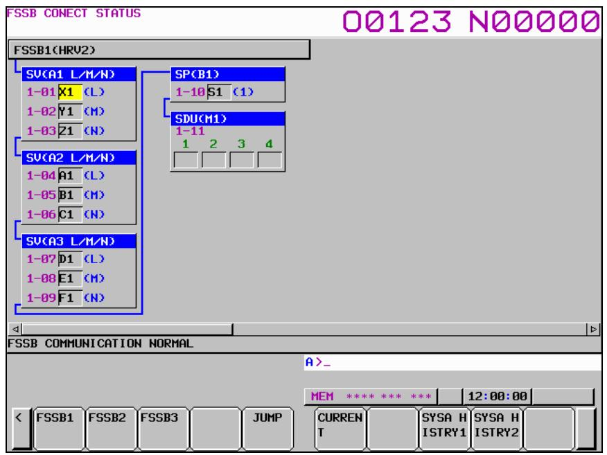

<details>
<summary>text_image</summary>

FSSB CONNECT STATUS
00123 N00000
FSSB1(HRV2)
SV(A1 L/M/N)
1-01 X1 (L)
1-02 Y1 (M)
1-03 Z1 (N)
SP(B1)
1-10 S1 (1)
SDU(M1)
1-11
1 2 3 4
SV(A2 L/M/N)
1-04 A1 (L)
1-05 B1 (M)
1-06 C1 (N)
SV(A3 L/M/N)
1-07 D1 (L)
1-08 E1 (M)
1-09 F1 (N)
FSSB COMMUNICATION NORMAL
A >_
MEM **** *** 12:00:00
< FSSB1 FSSB2 FSSB3 JUMP CURRENT SYSA H ISTRY1 SYSA H ISTRY2
</details>

## 1.11.2.2 报警显示

报警显示对过去正常启动的 FSSB 连接状态和现在的 FSSB 连接状态进行比较，用红色显示有差异的部分。可通过软键 [报警] 来显示。

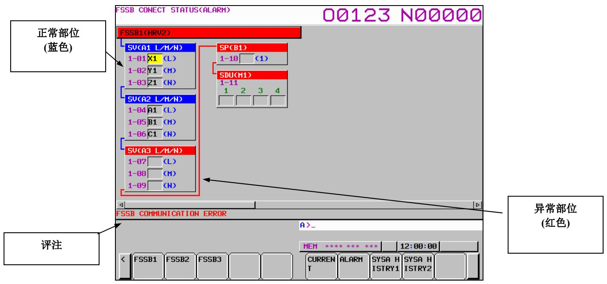

<details>
<summary>text_image</summary>

FSSB CONNECT STATUS(ALARM)
00123 N00000
正常部位
(蓝色)
FSSB1(HRV2)
SV(A1 L/M/N)
1-01 X1 (L)
1-02 Y1 (M)
1-03 Z1 (N)
SP(B1)
1-10 (1)
SDU(M1)
1-11
1 2 3 4
SV(A2 L/M/N)
1-04 A1 (L)
1-05 B1 (M)
1-06 C1 (N)
SV(A3 L/M/N)
1-07 (L)
1-08 (M)
1-09 (N)
FSSB COMMUNICATION ERROR
A>
MEM **** *** 12:00:00
< FSSB1 FSSB2 FSSB3
CURRENT ALARM SYSA H ISTRY1 SYSA H ISTRY2
评注
异常部位
(红色)
</details>

评注部分显示 “FSSB 通信异常”。

## 1.11.2.3 系统报警履历显示

系统报警履历 1 显示以及系统报警履历 2 显示，根据过去正常启动的 FSSB 连接状态、和系统报警履历的信息，用红色显示有问题的部分。

可通过软键 [SYS 报警履历 1] 以及 [SYS 报警履历 2] 进行显示。

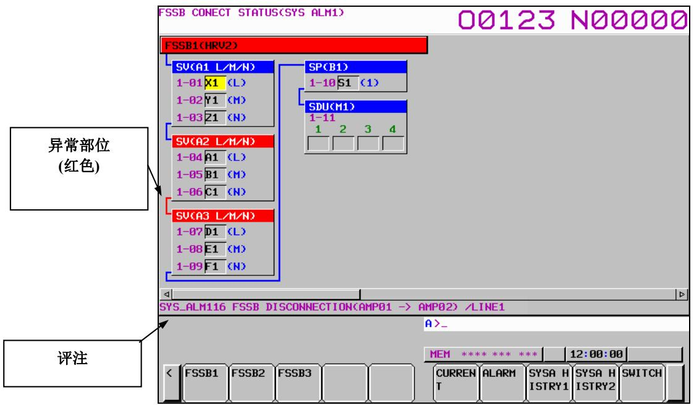

<details>
<summary>text_image</summary>

FSSB CONNECT STATUS(SYS ALM1)
00123 N00000
FSSB1(HRV2)
SV(A1 L/M/N)
1-01 X1 (L)
1-02 Y1 (M)
1-03 Z1 (N)
SP(B1)
1-10 S1 (1)
SDU(M1)
1-11
1 2 3 4
异常部位
(红色)
SV(A2 L/M/N)
1-04 A1 (L)
1-05 B1 (M)
1-06 C1 (N)
SV(A3 L/M/N)
1-07 D1 (L)
1-08 E1 (M)
1-09 F1 (N)
SYS_ALM116 FSSB DISCONNECTION(AMP01 -> AMP02) /LINE1
评注
A>
MEM **** *** ***
12:00:00
FSSB1 FSSB2 FSSB3
CURRENT ALARM SYSA H ISTRY1 SYSA H ISTRY2 SWITCH
</details>

评注部分显示系统报警履历的内容以及系统报警的发生日期时间。

通过软键 [切换] 来切换系统报警履历的内容和发生日期时间。

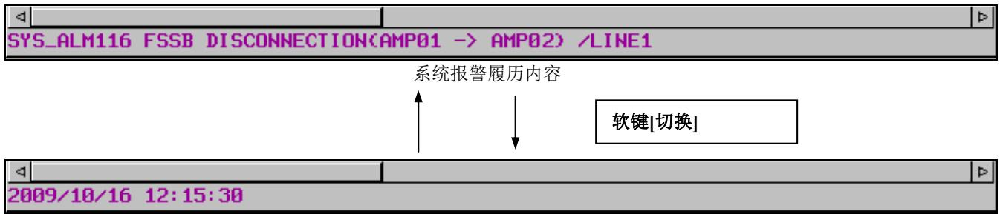

<details>
<summary>text_image</summary>

SYS_ALM116 FSSB DISCONNECTION(AMP01 -> AMP02) /LINE1
系统报警履历内容
软键[切换]
2009/10/16 12:15:30
</details>

系统报警发生日期时间

## 1.12 维护监视器

可以确认 CNC 和放大器、电源等的维护所需的状态。

## 步骤

1 按下功能键 □ SYSTEM。  
2 在显示软键 [维护监视器] 之前，按住继续菜单键 ▶。  
3 按下软键 [维护监视器]。

## 1.12.1 风扇监视器画面

按下软键 [风扇监视]，显示风扇监视器画面。

可以一并确认 CNC、伺服放大器、主轴放大器、共同电源的风扇状态。

状态显示中显示有 “FAN” 时，通过确认本画面，就可以调查哪个风扇上发生了异常。

如下图所示，显示 CNC、共同电源、伺服放大器、主轴放大器的风扇。

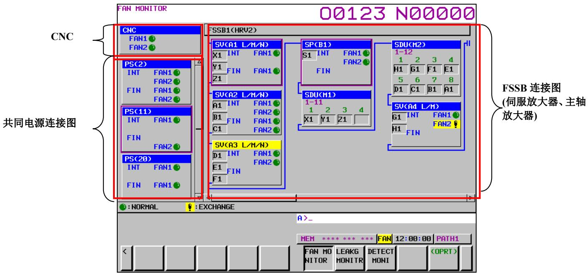

<details>
<summary>text_image</summary>

FAN MONITOR
00123 N00000
CNC
FAN1
FAN2
共同电源连接图
PS(2)
INT FAN1
FAN2
FIN FAN1
FAN2
PS(11)
INT FAN1
FIN
FAN2
PS(20)
INT FAN1
FIN FAN1
FSSB1(HRV2)
SV(A1 L/M/N)
X1 INT FAN1
Y1 FIN FAN1
Z1
GP(B1)
S1 INT FAN1
FIN
SDU(M2)
I-12
1 2 3 4
H1 G1 F1 E1
5 6 7 8
D1 C1 B1 A1
SDU(M1)
I-11
1 2 3 4
X1 Y1 Z1
SV(A3 L/M/N)
D1 INT FAN1
E1 FIN
F1
SDU(M2)
I-12
1 2 3 4
H1 G1 F1 E1
5 6 7 8
D1 C1 B1 A1
SDU(M1)
I-11
1 2 3 4
X1 Y1 Z1
SV(A4 L/M)
G1 INT FAN1
H1 FIN
FAN2!
FSSB 连接图
(伺服放大器、主轴
放大器)
: NORMAL      : EXCHANGE
A >_
MEM **** *** *** FAN 12:00:00 PATH1
FAN MO LEAKG DETECT (OPRT)
NITOR MONITR MONI
</details>

## FSSB 连接图

通过←→键来左右卷动FSSB连接图。此外，利用↑PAGE PAGE↓键每3列左右卷动FSSB连接图。

## 共同电源连接图

共同电源中最多连接两个内部冷却风扇，两个散热器冷却风扇。

共同电源的图上部，显示有表示共同电源的"PS"的字符，在其旁边显示有放大器组编号。

共同电源、和与其连接的伺服放大器和主轴放大器的组属于相同的放大器组编号。

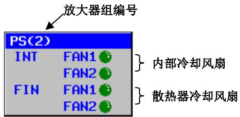

<details>
<summary>text_image</summary>

放大器组编号
PS(2)
INT	FAN1
	FAN2
FIN	FAN1
	FAN2
} 内部冷却风扇
} 散热器冷却风扇
</details>

通过↑↓键选择共同电源，则以紫色强调显示所选的共同电源上所连接的伺服放大器和主轴放大器。

## 风扇状态

：正常 正常旋转。

：需要更换 风扇发生异常，或者快到使用寿命。更换风扇。

## 注释

1 FSSB 的连接尚未正确进行时，本画面不会正常显示。  
2 风扇尚未连接时，风扇状态为空白。  
3 本画面在显示中不会自动更新。要更新为最新信息时，暂时切换到其他画面后，再次显示本画面。

## 1.12.2 绝缘劣化监视器画面

若按下软键 [绝缘劣化监视]，则会显示绝缘劣化检测信息画面。

可以在本画面上确认伺服放大器、主轴放大器的绝缘劣化信息。状态显示中显示有 “LKG” 时，通过确认本画面，就可以检查在哪个轴发生了异常。

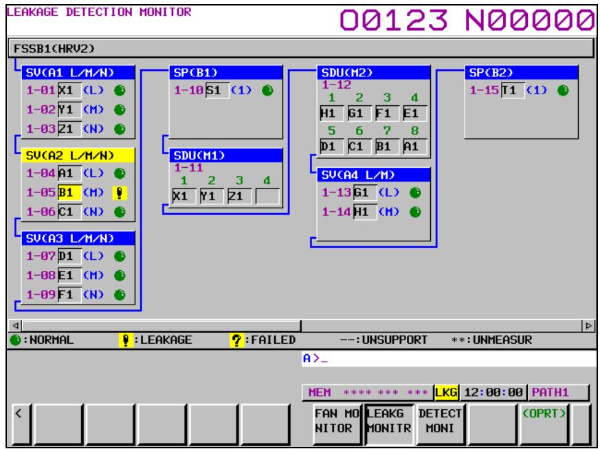

<details>
<summary>text_image</summary>

LEAKAGE DETECTION MONITOR
00123 N00000
FSSB1(HRV2)
SV(A1 L/M/N)
1-01 X1 (L)
1-02 Y1 (M)
1-03 Z1 (N)
SP(B1)
1-10 S1 (1)
SDU(M2)
1-12
1 2 3 4
H1 G1 F1 E1
5 6 7 8
D1 C1 B1 A1
SP(B2)
1-15 T1 (1)
SV(A2 L/M/N)
1-04 A1 (L)
1-05 B1 (M)
1-06 C1 (N)
SDU(M1)
1-11
X1 Y1 Z1
SV(A4 L/M)
1-13 G1 (L)
1-14 H1 (M)
SV(A3 L/M/N)
1-07 D1 (L)
1-08 E1 (M)
1-09 F1 (N)
: NORMAL : LEAKAGE ? : FAILED --: UNSUPPORT **: UNMEASUR
A >_
MEM **** *** *** LKG 12:00:00 PATH1
< FAN MO LEAKG DETECT
NITOR MONITR MONI (OPRT)
</details>

## 绝缘劣化状态

①：正常 绝缘电阻值正常。

：绝缘劣化 绝缘电阻值下降。请进行检查。

？：测量失败 绝缘电阻值的测量失败。请进行检查。

--：不对应您所使用的伺服放大器、主轴放大器不对应绝缘电阻值的测量。

\*\*：测量未实施 绝缘电阻值尚未实施。

详情请参阅诊断数据 No.1700、No.1701(伺服)、No.1702、No.1703（主轴）。

## 注释

1 FSSB 的连接尚未正确进行时，本画面不会正常显示。  
2 本画面在显示中不会自动更新。要更新为最新信息时，暂时切换到其他画面后，再次显示本画面。

## 1.13 系统警告履历画面

系统警告履历画面，最多可以显示 2 个过去发生的系统警告。此外，可以将系统警告信息输出到外部设备中。

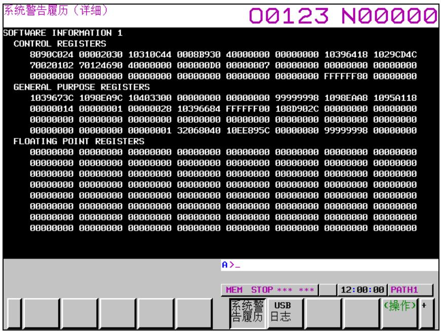

<details>
<summary>text_image</summary>

系统警告履历（详细）
00123 N00000
SOFTWARE INFORMATION 1
CONTROL REGISTERS
8090C024 00002030 10310C44 00088930 40000000 00000000 10396418 1029CD4C
70020102 70124690 40000000 000000D0 000000D7 000000D0 000000D0 00000D0
000000D 000000D 00000D1D 0000D1D 000D1D FFFFF8D 000D1D
GENERAL PURPOSE REGISTERS
1039673C 1098EA9C 104D33D 000D1D 99999998 1098EAA8 1095A118
88888814 88888814 88888828 1D396684 FFFFFF1D 1D8D9D2C 8888882B 8888882B
8888882B 8888882B 8888882B 8888882B 8888882B
FLOATING POINT REGISTERS
8888882B 8888882B 8888882B 32D6B4D 1BEE6B5C 9999999B 9999999B
A >_
MEM STOP *** ***
12:00:00 PATH1
系统警
告履历 USB
日志
（操作）+
</details>

图1.13 (a) 系统警告履历画面

## 1.13.1 系统警告履历一览画面

系统警告履历一览画面上，如图 1.13.1 (a) 所示显示现在记录的系统警告履历的一览。

通过参数 NMH(No.3103#2) 的设定，可以显示包含最新的系统警告信息在内的最大 2 个系统警告信息。

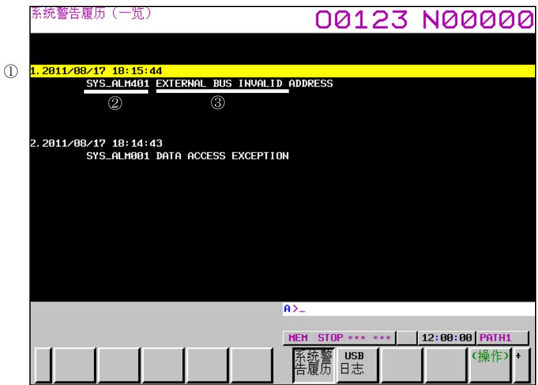

<details>
<summary>text_image</summary>

系统警告履历（一览）
00123 N00000
①
1. 2011/08/17 18:15:44
SYS_ALM401 EXTERNAL_BUS INVALID ADDRESS
②    ③
2. 2011/08/17 18:14:43
SYS_ALM001 DATA ACCESS EXCEPTION
A >_
MEM STOP *** ***
12:00:00 PATH1
系统警
告履历 USB
日志
(操作) +
</details>

图1.13.1 (a) 系统警告履历一览画面

显示的信息如下所示。

① 系统报警发生日期和时刻  
② 系统报警编号  
③ 系统报警信息

## 步骤

1 按下功能键 [IMAGE]。  
2 在显示软键 [系统警告履历] 之前，按住继续菜单键 ▶。  
3 按下软键 [系统警告履历]。  
4 显示如图 1.13.1 (a) 所示的系统警告履历一览画面。

## 1.13.2 系统警告履历详细画面

显示系统警告的详细内容。可以切换使用翻页键，显示的页面。

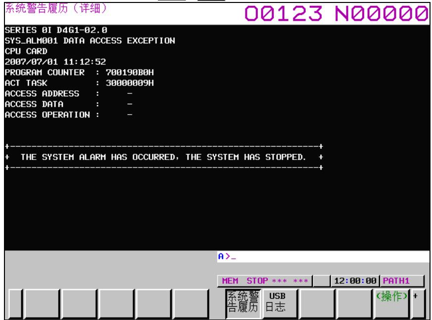

<details>
<summary>text_image</summary>

系统警告履历（详细）
00123 N00000
SERIES 01 D4G1-02.0
SYS_ALM001 DATA ACCESS EXCEPTION
CPU CARD
2007/07/01 11:12:52
PROGRAM COUNTER : 700190B0H
ACT TASK : 30000009H
ACCESS ADDRESS : -
ACCESS DATA : -
ACCESS OPERATION : -
+----+
+ THE SYSTEM ALARM HAS OCCURRED, THE SYSTEM HAS STOPPED. +
+----+
A >_
MEM STOP *** ***
12:00:00 PATH1
系统警告履历 USB 日志 (操作) +
</details>

图1.13.2 (a) 系统警告履历详细画面

## 步骤

1 在系统警告履历一览画面上，使用光标键 $\boxed{\uparrow}$ ， $\boxed{\downarrow}$ ，将光标指向希望显示详细内容的系统警告履历上。  
2 按下 [INPUT] 键。或者，按下软键 [(操作)] 后，按下软键 [选择]。  
3 显示所选系统警告履历的详细内容。

要从系统警告履历详细画面返回一览画面，执行如下步骤。

1 在系统警告履历详细画面上，按下软键[(操作)]后，按下软键[返回]。  
2 显示系统警告履历的一览画面。

## 1.13.3 输出系统警告履历

系统警告履历输出到外部设备中。

## 步骤

1 在系统警告履历详细画面上，按下软键[(操作)]后，按下软键[输出]。  
2 为指定将要输出的文件名，键入文件名。省略文件名时，就采用默认的文件名“SYS-ALM.TXT”。  
3 按下软键 [执行]。

## 1.13.4 参数


### PMC报警: 
- **故障内容**: #7
- **处理办法**: #6

### PMC报警: 3103
- **故障内容**: 
- **处理办法**: 


[输入类型] 参数输入

[数据类型] 位型

#2 NMH 系统警告履历画面

0: 不予显示。

1: 予以显示。

## 1.14 机械状态监视功能

## 1.14.1 概述

本功能用来监视机械的状态，在发生主轴碰撞等异常时，将该时刻的操作履历、坐标值、实际速度等 CNC 信息保存在 CNC 的存储器中。已被保存的 CNC 信息，可有效运用于调查机械异常的原因中。

机械状态的监视，通过机床制造商创建的梯形程序来进行。利用 CNC 报警的检测和多传感器单元、异常负荷检测功能(注释)，监视冲撞值和异常负荷扭矩。发生主轴碰撞等异常时，梯形程序通过信号向 CNC 通知发生了异常的情况。

CNC 被通过信号通知机械的异常时，将该时刻的 CNC 信息保存在 CNC 内部存储器中。

机床制造商或者、机械的维护担当人员，可通过保存下来的 CNC 信息，调查机械异常的发生原因。异常时的 CNC 信息，最多可以保存 100 件，因而可追溯到过去，调查判断为异常的状态。

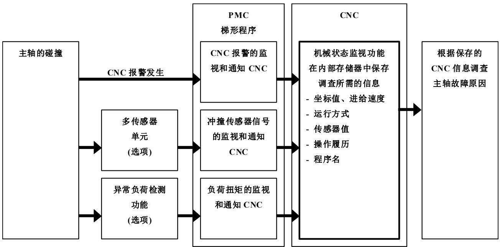

<details>
<summary>flowchart</summary>

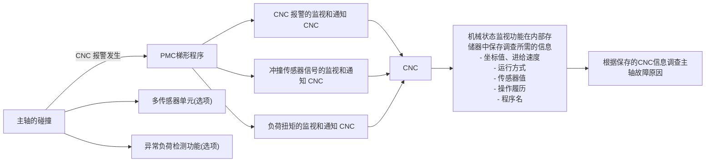
```mermaid
graph LR
  A["主轴的碰撞"] -->|CNC 报警发生| B["PMC梯形程序"]
  A --> C["多传感器单元(选项)"]
  A --> D["异常负荷检测功能(选项)"]
  B --> E["CNC 报警的监视和通知 CNC"]
  B --> F["冲撞传感器信号的监视和通知 CNC"]
  B --> G["负荷扭矩的监视和通知 CNC"]
  E --> H["CNC"]
  F --> H
  G --> H
  H --> I["机械状态监视功能在内部存储器中保存调查所需的信息<br>- 坐标值、进给速度<br>- 运行方式<br>- 传感器值<br>- 操作履历<br>- 程序名"]
  I --> J["根据保存的CNC信息调查主轴故障原因"]
```
</details>

图1.14.1 (a) 机械状态监视功能的概要(主轴碰撞例)

本功能中提供有如下两个画面。

(1) MACHINE STATUS MONITOR(机械状态监视)画面  
(2) MACHINE STATUS HISTORY(机械状态履历)画面

MACHINE STATUS MONITOR 画面上, 可以监控通过参数设定的4字节部分的PMC信号和现在的多传感器单元的信号。可以在 MACHINE STATUS HISTORY 画面上显示机械状态履历保存委托信号成为“1”时刻的 CNC 的状态和信号值。

可通过本画面确认譬如在主轴碰撞时的 CNC 的状态(坐标和程序等)和多传感器单元的信号。此外，还可以将所显示的这些信息输出到外部设备。

履历的件数超过 100 件时，最早保存的履历将被盖写。

为了避免暂时保存的履历在 8 日期间不被盖写，1 日保存的次数受到限制。

本功能属于选项。

## 注释

多传感器单元属于选项。有关这些规格，请参阅如下手册。

\- 多传感器单元

CONNECTION MANUAL (HARDWARE)（连接说明书（硬件篇））(B-64603EN)

## 1.14.2 MACHINE STATUS MONITOR画面

MACHINE STATUS MONITOR 画面上，可以监控通过参数设定的 4PMC 信号和现在的多传感器单元的信号。

MACHINE STATUS MONITOR 画面的显示方法如下所示。

(1) 按下功能键 SYSTEM。  
(2) 在显示软键 [MACHINMONITR] 之前，按住继续菜单键 ▶。  
(3) 按下软键 [MACHINMONITR]，显示 MACHINE STATUS MONITOR 画面。

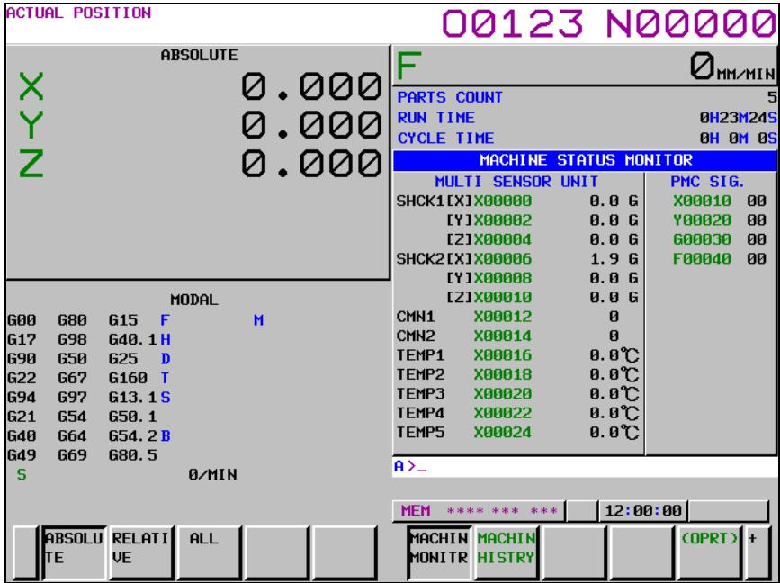

<details>
<summary>text_image</summary>

ACTUAL POSITION
00123 N00000
ABSOLUTE
X 0.000
Y 0.000
Z 0.000
F
MM/MIN
PARTS COUNT 5
RUN TIME 0H23N24S
CYCLE TIME 0H 0M 0S
MACHINE STATUS MONITOR
MULTI SENSOR UNIT PMC SIG.
SHCK1[X]X00000 0.0 G X00010 00
[Y]X00002 0.0 G Y00020 00
[Z]X00004 0.0 G G00030 00
SHCK2[X]X00006 1.9 G F00040 00
[Y]X00008 0.0 G
[Z]X00010 0.0 G
MODAL
G88 G88 G15 F M
G17 G98 G40.1 H
G98 G58 G25 D
G22 G67 G160 T
G94 G97 G13.1 S
G21 G54 G58.1
G48 G64 G54.2 B
G49 G69 G88.5
S 0/MIN
A >_
MEM **** **** *** 12:00:00
ABSOLU RELATI ALL MACHIN MACHIN (OPRT) +
TE VE HISTORY MONITR HISTORY
</details>

图 1.14.2 (a) MACHINE STATUS MONITOR画面（多传感器单元连接时）

## 注释

本画面只有在参数 MSM(No.11372#3) 被设定为 1 时显示。

## 1.14.2.1 PMC信号的监视

可以在 MACHINE STATUS MONITOR 画面上监控由参数所指定的 4 字节部分的 PMC 信号。

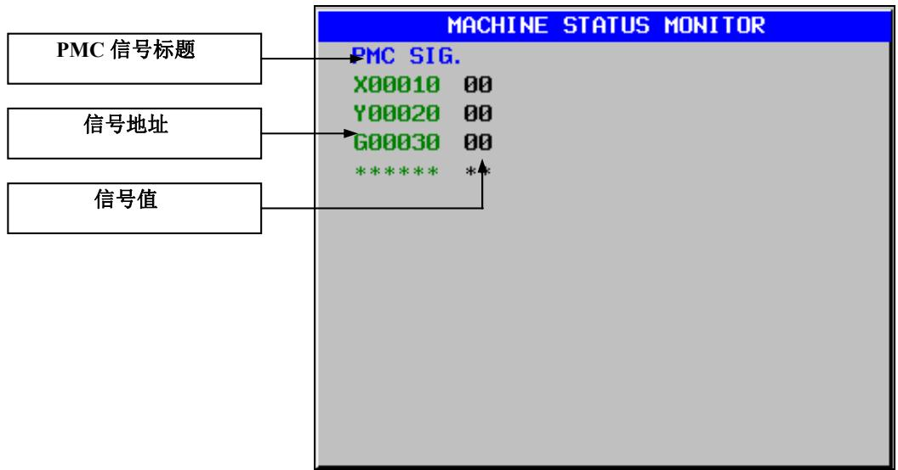

<details>
<summary>text_image</summary>

MACHINE STATUS MONITOR
PMC 信号标题
PMC SIG.
X00010 00
Y00020 00
G00030 00
********* *
信号地址
信号值
</details>

图 1.14.2.1 (a) PMC信号的监视

显示内容的详情如下所示。

## PMC 信号标题

显示可通过参数指定的 PMC 信号的标题。

PMC 信号最多可以指定 4 字节部分。

## 信号地址

显示通过参数指定的 PMC 信号的地址。

参数尚未设定时，显示“\*\*\*\*”。

多路径PMC时，在地址之前显示PMC路径编号。(参见图 1.14.2.1(b))

## 信号值

以 16 进制数来显示通过参数指定的 PMC 信号地址的实时值。

参数尚未设定时，显示“\*\*\*\*”。


<details>
<summary>flowchart</summary>

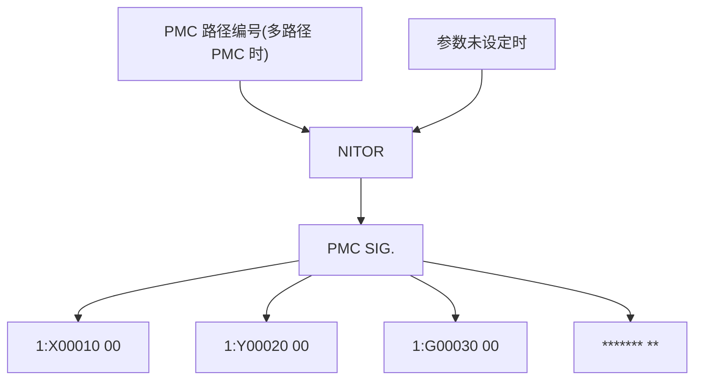
```mermaid
graph TD
  A["PMC 路径编号(多路径 PMC 时)"] --> B["NITOR"]
  B --> C["PMC SIG."]
  C --> D["1:X00010 00"]
  C --> E["1:Y00020 00"]
  C --> F["1:G00030 00"]
  C --> G["******* **"]
  H["参数未设定时"] --> B
```
</details>

图 1.14.2.1(b) PMC信号值

## 1.14.2.2 连接有多传感器单元的情形

连接有多传感器单元时，MACHINE STATUS MONITOR 画面按如下所示方式显示。

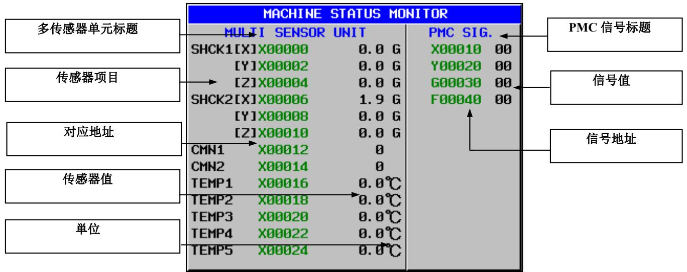

<details>
<summary>flowchart</summary>

```mermaid
graph TD
  A["多传感器单元标题"] --> B["MULTI SENSOR UNIT"]
  C["传感器项目"] --> D["SHCK1[X"]X00000 0.0 G]
  C --> E["[Y"]X00002 0.0 G]
  C --> F["[Z"]X00004 0.0 G]
  C --> G["SHCK2[X"]X00006 1.9 G]
  C --> H["[Y"]X00008 0.0 G]
  C --> I["[Z"]X00010 0.0 G]
  J["对应地址"] --> K["CMN1 X00012 0"]
  J --> L["CMN2 X00014 0"]
  J --> M["TEMP1 X00016 0.0°C"]
  N["传感器值"] --> O["TEMP2 X00018 0.0°C"]
  N --> P["TEMP3 X00020 0.0°C"]
  N --> Q["TEMP4 X00022 0.0°C"]
  R["单位"] --> S["TEMP5 X00024 0.0°C"]
  T["PMC信号标题"] --> U["X00018 00"]
  T --> V["Y00020 00"]
  T --> W["G00030 00"]
  T --> X["F00040 00"]
  Y["信号值"] --> Z
  AA["信号地址"] --> AB
```
</details>

图 1.14.2.2 (a) 有多传感器单元  
显示内容的详情如下所示。

## 多传感器单元标题

连接有多传感器单元时，显示本标题。

## 多路径 PMC 系统的情形

多路径 PMC 系统时，在标题旁显示多传感器单元所连接的 PMC 路径编号。

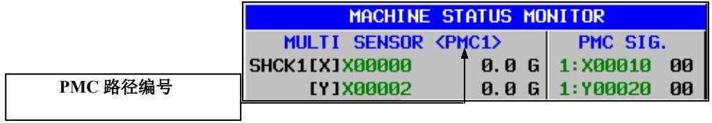

<details>
<summary>text_image</summary>

MACHINE STATUS MONITOR
MULTI SENSOR <PMC1>
SHCK1[X]X00000 0.0 G 1:X00010 00
[Y]X00002 0.0 G 1:Y00020 00
PMC 路径编号
</details>

图 1.14.2.2 (b) PMC 路径编号

## 连接有多个多传感器单元的情形

多传感器单元最多可以连接 4 台。

连接有多个多传感器单元时，显示所显示的多传感器单元编号(MSU 编号)和连接数。

多传感器单元编号，在与 I/O Link 连接的多传感器单元中，从靠近 CNC 的数起，依次为 1,2,3,4。

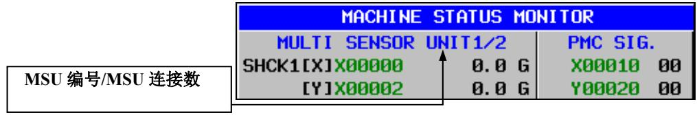

<details>
<summary>text_image</summary>

MACHINE STATUS MONITOR
MULTI SENSOR UNIT1/2	PMC SIG.
SHCK1[X]X00000	0.0 G	X00010 00
[Y]X00002	0.0 G	Y00020 00
MSU 编号/MSU 连接数
</details>

图 1.14.2.2 (c) 多传感器单元编号和连接数

## 多路径PMC系统中连接有多个多传感器单元的情形

多路径 PMC 系统中连接有多个多传感器单元时，在标题旁显示所显示的多传感器单元编号(MSU 编号)的连接数、以及所连接的 PMC 路径编号。


<details>
<summary>flowchart</summary>

```mermaid
graph TD
  A["MACHINE STATUS MONITOR"] --> B["MULTI SENSOR1/2"]
  A --> C["<PMC1>"]
  A --> D["PMC SIG."]
  B --> E["SHCK1[X"]X00000]
  B --> F["[Y"]X00002]
  C --> G["1:X00010 00"]
  C --> H["1:Y00020 00"]
  D --> I["PMC 路径编号"]
```
</details>

图 1.14.2.2 (d) 多传感器单元编号、连接数和PMC路径编号

## 传感器项目

显示如下传感器项目。

\- 冲撞传感器(X,Y,Z 方向) : 2CH

- 通用模拟输入 : 2CH  
- 温度传感器 : 8CH

无法一次显示全部传感器时，可通过按下翻页键 Page 来切换页面。


## 地址

显示已被分配给各传感器的地址。

## 传感器值

显示各传感器所输出的传感器值。

## 单位

显示各传感器值的单位。

## PMC 信号标题

请参阅 1.14.2.1。

## 信号地址

请参阅 1.14.2.1。

## 信号值

请参阅 1.14.2.1。

## 操作

若按下软键 [(操作)]，则显示如下软键。

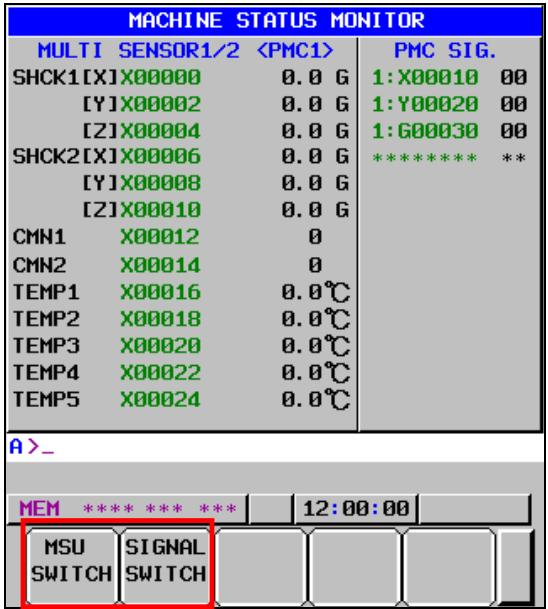

<details>
<summary>text_image</summary>

MACHINE STATUS MONITOR
MULTI SENSOR1/2 <PMC1> PMC SIG.
SHCK1[X]X00000 0.0 G 1:X00010 00
[Y]X00002 0.0 G 1:Y00020 00
[Z]X00004 0.0 G 1:G00030 00
SHCK2[X]X00006 0.0 G ********** **
[Y]X00008 0.0 G
[Z]X00010 0.0 G
CMN1 X00012 0
CMN2 X00014 0
TEMP1 X00016 0.0℃
TEMP2 X00018 0.0℃
TEMP3 X00020 0.0℃
TEMP4 X00022 0.0℃
TEMP5 X00024 0.0℃
A >_
MEM **** *** ***
MSU SIGNAL
SWITCH SWITCH
</details>

图 1.14.2.2 (e) 操作软键

## 软键 [MSU SWITCH]

本软键在连接有多个多传感器单元时显示。

通过按下本软键，即可切换要显示的多传感器单元。

譬如，多传感器单元连接有 4 个时，每次按下本软键，显示都会按 [MULTI SENSOR1] (多传感器单元 1)→ [MULTI SENSOR2] → [MULTI SENSOR3] → [MULTI SENSOR4] → [MULTI SENSOR1] 的方式切换。

## 软键 [SIGNALSWITCH]

按下本软键，可以切换 X 信号显示和 Y 信号显示。

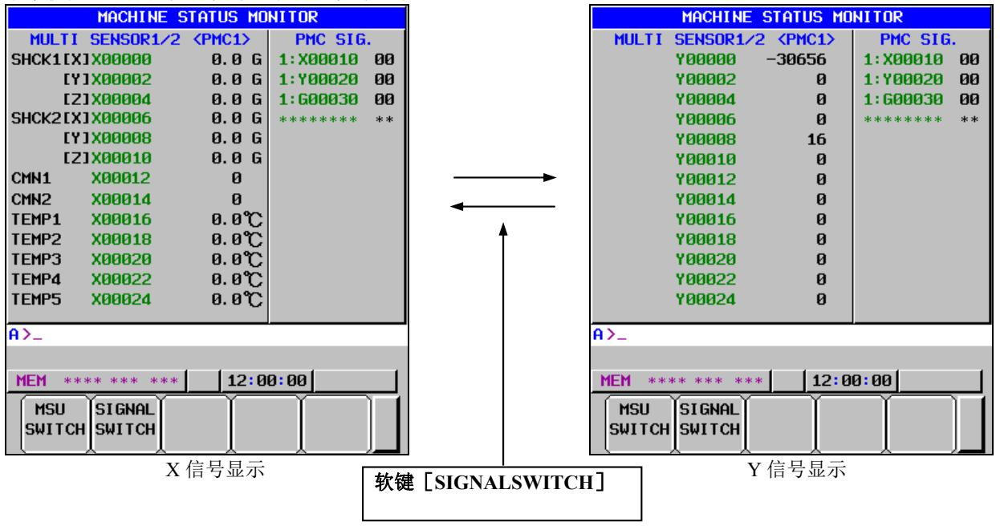

<details>
<summary>flowchart</summary>

```mermaid
graph TD
    subgraph X["X信号显示"]
  A["SHCK1[X"]X00000 0.0 G] --> B["SHCK2[X"]X00006 0.0 G ******* **]
  C["SHCK1[X"]X00002 0.0 G] --> D["SHCK2[X"]X00004 0.0 G 1:Y00020 00]
  E["SHCK2[X"]X00008 0.0 G] --> F["SHCK2[X"]X00010 0.0 G 1:G00030 00]
  G["CMN1 X00012 0"] --> H["CMN2 X00014 0"]
  I["TEMP1 X00016 0.0°C"] --> J["TEMP2 X00018 0.0°C"]
  K["TEMP3 X00020 0.0°C"] --> L["TEMP4 X00022 0.0°C"]
  M["TEMP5 X00024 0.0°C"] --> N["TEMP5 X00024 0.0°C"]
    end

    subgraph Y["Y信号显示"]
  O["PSMC SIG."] --> P["PSMC SIG."]
  Q["PSMC SIG."] --> R["PSMC SIG."]
  S["PSMC SIG."] --> T["PSMC SIG."]
  U["PSMC SIG."] --> V["PSMC SIG."]
  W["PSMC SIG."] --> X["PSMC SIG."]
  Y["PSMC SIG."] --> Z["PSMC SIG."]
  AA["PSMC SIG."] --> AB["PSMC SIG."]
  AC["PSMC SIG."] --> AD["PSMC SIG."]
  AE["PSMC SIG."] --> AF["PSMC SIG."]
  AG["PSMC SIG."] --> AH["PSMC SIG."]
  AI["PSMC SIG."] --> AJ["PSMC SIG."]
  AK["PSMC SIG."] --> AL["PSMC SIG."]
  AM["PSMC SIG."] --> AN["PSMC SIG."]
  AO["PSMC SIG."] --> AP["PSMC SIG."]
  AQ["PSMC SIG."] --> AR["PSMC SIG."]
  AS["PSMC SIG."] --> AT["PSMC SIG."]
  AU["PSMC SIG."] --> AV["PSMC SIG."]
  AW["PSMC SIG."] --> AX["PSMC SIG."]
    end

    subgraph SIGNALSWITCH["软键[SIGNALSWITCH]"]
        A2A["X信号显示"]
        A2B["A>_<br>    end<br><br>    subgraph SIGNALSWITCH_2[&quot;软键[SIGNALSWITCH"]"]
        A2C["A>_<br>    end<br><br>    subgraph SIGNALSWITCH_3[&quot;软键[SIGNALSWITCH"]"]
        A2D[A>_
    end

    style A fill:#f9f,stroke:#333
    style B fill:#ccf,stroke:#333
    style C fill:#cfc,stroke:#333
    style D fill:#fcc,stroke:#333
    style E fill:#cff,stroke:#333
    style F fill:#ffc,stroke:#333
    style G fill:#fcf,stroke:#333
    style H fill:#cff,stroke:#333
    style I fill:#ffc,stroke:#333
    style J fill:#cfc,stroke:#333
    style K fill:#fcc,stroke:#333
    style L fill:#ffc,stroke:#333
    style M fill:#cfc,stroke:#333
    style N fill:#fcc,stroke:#333
    style O fill:#ffc,stroke:#333
    style P fill:#cfc,stroke:#333
    style Q fill:#fcc,stroke:#333
    style R fill:#cfc,stroke:#333
    style S fill:#fcc,stroke:#333
    style T fill:#cfc,stroke:#333
    style U fill:#fcc,stroke:#333
    style V fill:#cfc,stroke:#333
    style W fill:#fcc,stroke:#333
    style X fill:#fff,stroke:#333
    style Y fill:#fff,stroke:#333
```
</details>

## 翻页键

通过按下翻页键 $\boxed{\uparrow}$ PAGE $\boxed{\downarrow}$ ，可以显示第2页的传感器信号信息。

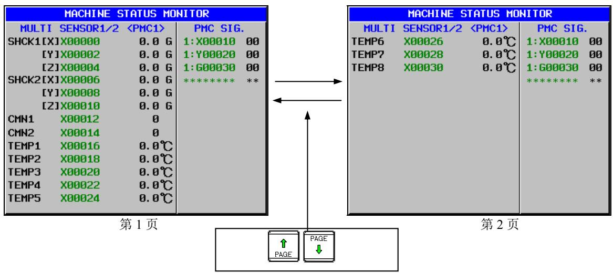

<details>
<summary>flowchart</summary>

```mermaid
graph TD
  A["MACHINE STATUS MONITOR"] --> B["第1页"]
  B --> C["第2页"]
    subgraph Panel 1
        D["MULTI SENSOR1/2 <PMC1>"]
  E["SHCK1[X"]X00000 0.0 G] --> F["1:X00010 00"]
  G["[Y"]X00002 0.0 G] --> H["1:Y00020 00"]
  I["[Z"]X00004 0.0 G] --> J["1:600030 00"]
  K["SHCK2[X"]X00006 0.0 G] --> L["********** * *"]
  M["[Y"]X00008 0.0 G] --> N[" "]
  O["[Z"]X00010 0.0 G] --> P[" "]
  Q["CMN1 X00012 0"] --> R[" "]
  S["CMN2 X00014 0"] --> T["TEMP1 X00016 0.0℃"]
  U["TEMP2 X00018 0.0℃"] --> V["TEMP3 X00020 0.0℃"]
  W["TEMP4 X00022 0.0℃"] --> X["TEMP5 X00024 0.0℃"]
    end
    subgraph Panel 2
        Y["MULTI SENSOR1/2 <PMC1>"]
  Z["TEMP6 X00026 0.0℃"] --> AA["1:X00010 00"]
  AB["TEMP7 X00028 0.0℃"] --> AC["1:Y00020 00"]
  AD["TEMP8 X00030 0.0℃"] --> AE["1:600030 00"]
        AF[" "]
        AG[" "]
    end
```
</details>

## 1.14.3 MACHINE STATUS HISTORY画面

CNC 在机械状态履历保存委托信号 MSUSRQ<G0534.6>成为"1"时，在 CNC 内部作为履历保存 PMC 信号、CNC 状态、操作履历。

可以在 MACHINE STATUS HISTORY 画面上显示所保存的履历。

由此，譬如在主轴碰撞时可以确认 NC 的状态(坐标和程序等)和操作履历，并可简单进行故障原因的追查和恢复。

可以保存在 CNC 内部的履历件数最多为 100 件。

## 注释

1 履历件数达到最大履历件数的情况下，在机械状态履历保存委托信号成为“1”时，最早保存的履历将被擦除，最新的信息将被保存起来。  
2 请勿在 MACHINE STATUS HISTORY 画面显示中将机械状态保存委托信号设定为"1"。这种情况下，从 MACHINE STATUS HISTORY 画面切换到别的画面时的 CNC 信息将被保存起来。

作为履历保存的 CNC 状态如下所示。

表 1.14.3 (a) <被保存的CNC信息一览>


MACHINE STATUS HISTORY 画面由如下 3 个画面构成。

(A)MACHINE STATUS HISTORY 一览画面  
(B)MACHINE STATUS HISTORY CNC 数据画面  
(C)MACHINE STATUS HISTORY 操作履历画面

MACHINE STATUS HISTORY 画面的显示方法如下所示。

(1) 按下功能键 ▶ SYSTEM。

(2) 在显示软键 [MACHINHISTRY] 之前，按住 [+ ] 键。  
(3) 按下软键 [MACHINHISTRY]。  
(4) 若按下软键 [LIST] (一览)，则会显示 MACHINE STATUS HISTORY 一览画面。  
(5) 若按下软键 [CNC DATA] (CNC 数据)，则会显示 MACHINE STATUS HISTORY CNC 数据画面。  
(6) 若按下软键 [OPERATHISTRY] (操作履历)，则会显示 MACHINE STATUS HISTORY 操作履历画面。

## 1.14.3.1 MACHINE STATUS HISTORY 一览画面

MACHINE STATUS HISTORY 一览画面，按如下所示方式区分为 3 个显示区域。

(1) 共同区域  
(2) 履历一览区域  
(3) 详细数据区域

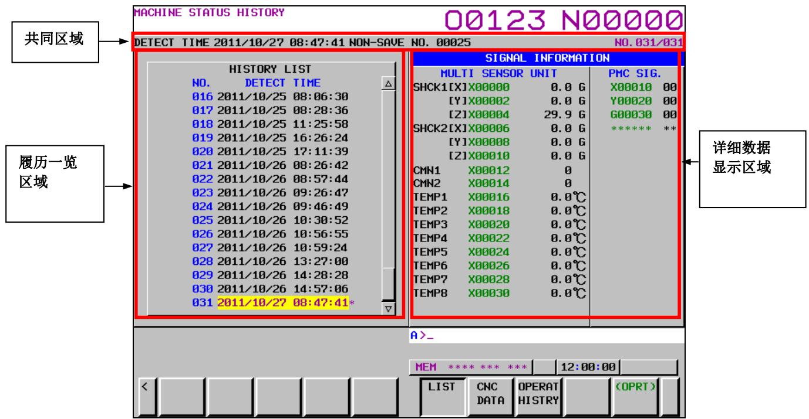

<details>
<summary>text_image</summary>

MACHINE STATUS HISTORY
00123 N00000
DETECT TIME 2011/10/27 08:47:41 NON-SAVE NO. 00025
NO. 031/031
共同区域
HISTORY LIST
NO. DETECT TIME
016 2011/10/25 08:06:30
017 2011/10/25 08:28:36
018 2011/10/25 11:25:58
019 2011/10/25 16:26:24
020 2011/10/25 17:11:39
021 2011/10/26 08:26:42
022 2011/10/26 08:57:44
023 2011/10/26 09:26:47
024 2011/10/26 09:46:49
025 2011/10/26 10:30:52
026 2011/10/26 10:56:55
027 2011/10/26 10:59:24
028 2011/10/26 13:27:00
029 2011/10/26 14:28:28
030 2011/10/26 14:57:06
031 2011/10/27 08:47:41*
SIGNAL INFORMATION
MULTI SENSOR UNIT PMC SIG.
SHCK1[X]X00000 0.0 G X00010 00
[Y]X00002 0.0 G Y00020 00
[Z]X00004 29.9 G G00030 00
SHCK2[X]X00006 0.0 G ***** **
[Y]X00008 0.0 G
[Z]X00010 0.0 G
CMN1 X00012 0
CMN2 X00014 0
TEMP1 X00016 0.0℃
TEMP2 X00018 0.0℃
TEMP3 X00020 0.0℃
TEMP4 X00022 0.0℃
TEMP5 X00024 0.0℃
TEMP6 X00026 0.0℃
TEMP7 X00028 0.0℃
TEMP8 X00030 0.0℃
A >_
MEM **** *** *** 12:00:00
LIST CNC OPERAT (OPRT)
DATA HISTORY
</details>

图 1.14.3.1 (a) MACHINE STATUS HISTORY 一览画面

共同区域中显示所选履历编号的检测日期时间和非保存履历数等共同信息。

履历一览区域中显示 CNC 内部保存的所有履历的检测日期时间的履历一览信息。

详细数据显示区域中显示所选履历编号的详细数据。

详细数据包括

(a) 信号信息  
(b) CNC 信息  
(c) 操作履历信息

它们可通过光标移动键←以及→来选择。

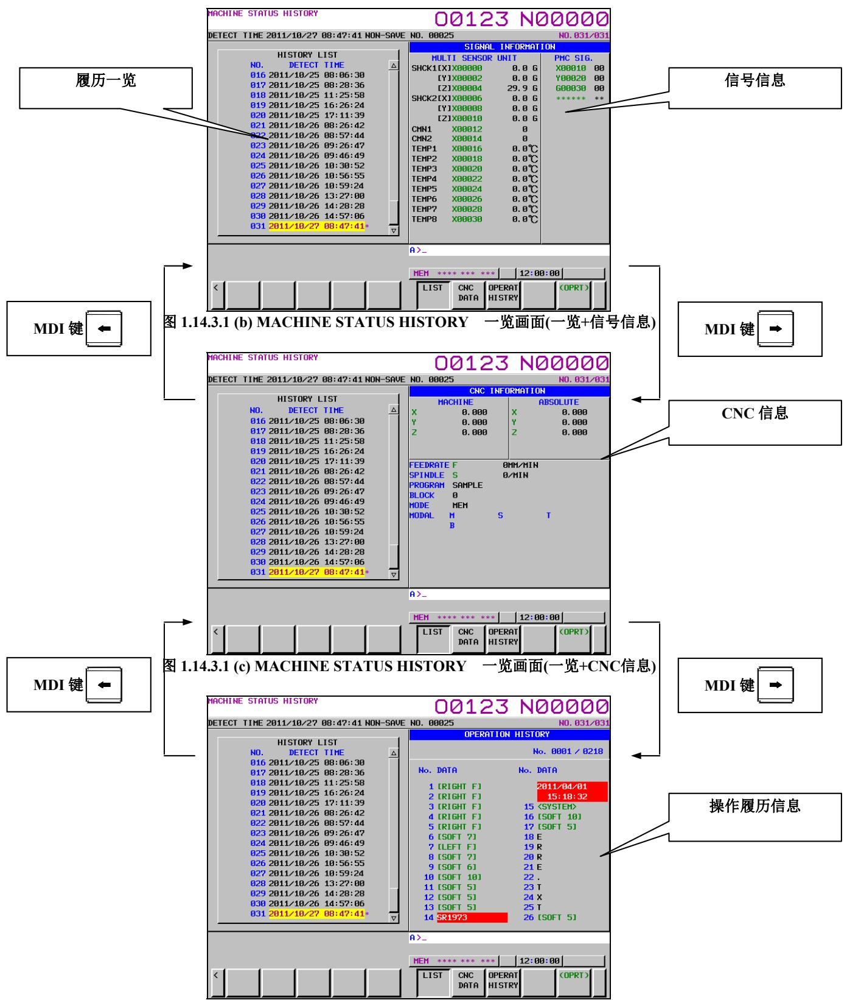

<details>
<summary>text_image</summary>

MACHINE STATUS HISTORY
00123 N00000
DETECT TIME 2011/10/27 08:47:41 NON-SAVE NO. 00025
NO. 031/031
SIGNAL INFORMATION
MULTI SENSOR UNIT PHC SIG.
SHCK1[X]X00000 0.0 G X00010 00
[Y]X00002 0.0 G Y00020 00
[Z]X00004 29.9 G G00030 00
SHCK2[X]X00006 0.0 G ******
[Y]X00008 0.0 G
[Z]X00010 0.0 G
CNM1 X00012 0
CNM2 X00014 0
TEMP1 X00016 0.0°C
TEMP2 X00018 0.0°C
TEMP3 X00020 0.0°C
TEMP4 X00022 0.0°C
TEMP5 X00024 0.0°C
TEMP6 X00026 0.0°C
TEMP7 X00028 0.0°C
TEMP8 X00030 0.0°C
信号信息
A >_
MEM **** **** 12:08:08
LIST CNC OPERAT (OPRT)
MDI 键 ←
图 1.14.3.1 (b) MACHINE STATUS HISTORY 一览画面(一览+信号信息)
MACHINE STATUS HISTORY
DETECT TIME 2011/10/27 08:47:41 NON-SAVE NO. 00025
NO. 031/031
CNC INFORMATION
MACHINE ABSOLUTE
X 0.000 X 0.000
Y 0.000 Y 0.000
Z 0.000 Z 0.000
FEEDRATE F ONMM/MIN
SPINDLE S O/MIN
PROGRAM SAMPLE
BLOCK 8
MODE MEM
MODAL M S T
B
MDI 键 ←
图 1.14.3.1 (c) MACHINE STATUS HISTORY 一览画面(一览+CNC信息)
MACHINE STATUS HISTORY
DETECT TIME 2011/10/27 08:47:41 NON-SAVE NO. 00025
NO. 031/031
OPERATION HISTORY
No. 8881 / 8218
No. DATA No. DATA
1 [RIGHT F] 2811/84/81
2 [RIGHT F] 15:18:32
3 [RIGHT F] 15 SYSTEM
4 [RIGHT F] 16 SOFT 18
5 [RIGHT F] 17 SOFT 5]
6 [SOFT ?] 18 E
7 [LEFT F] 19 R
8 [SOFT ?] 28 R
9 [SOFT 6] 21 E
10 [SOFT 18] 22 -
11 [SOFT 5] 23 T
12 [SOFT 5] 24 X
13 [SOFT 5] 25 T
14 SR1973 26 [SOFT 5]
MDI 键 →
操作履历信息
A >_
MEM **** **** 12:88:88
LIST CNC OPERAT (OPRT)
</details>

图 1.14.3.1 (d) MACHINE STATUS HISTORY 一览画面(一览+操作履历信息)

## 共同信息

画面上部显示出共同信息。

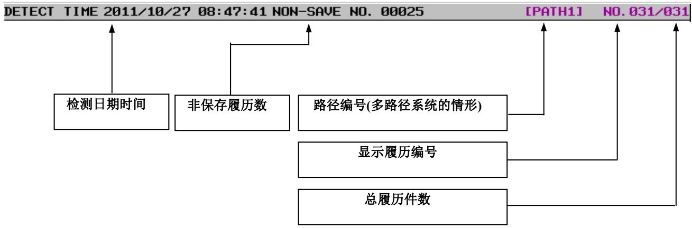

<details>
<summary>flowchart</summary>

```mermaid
graph TD
  A["检测日期时间"] --> B["非保存履历数"]
  B --> C["路径编号(多路径系统的情形)"]
  C --> D["显示履历编号"]
  D --> E["总履历件数"]
  E --> F["[PATH1"] NO.031/031]
```
</details>

图 1.14.3.1 (e) 共同信息

(1) 显示履历编号
显示所选的履历编号。履历编号越小，表示其越为早期保存的数据。  
(2) 总履历件数
显示在 CNC 内部保存的机械状态监视履历的总件数。  
(3) 检测日期时间
机械状态履历保存委托信号 MSUSRQ<G0534.6>成为”1”，显示保存履历的日期时间。  
(4) 路径编号
多个路径系统时，显示履历的路径编号。  
(5) 非保存履历数
显示通过保存次数限制 CNC 信息未被作为履历保存起来的件数。
非保存履历数为 0 时不予显示。
最大计数数为 65535 次。

## 履历一览信息

在履历一览画面的左半分区域显示履历一览信息。

显示履历编号和检测日期时间。

非保存履历数不是 0 时，字符的颜色呈紫色显示。此外，附加上 \* 标记。

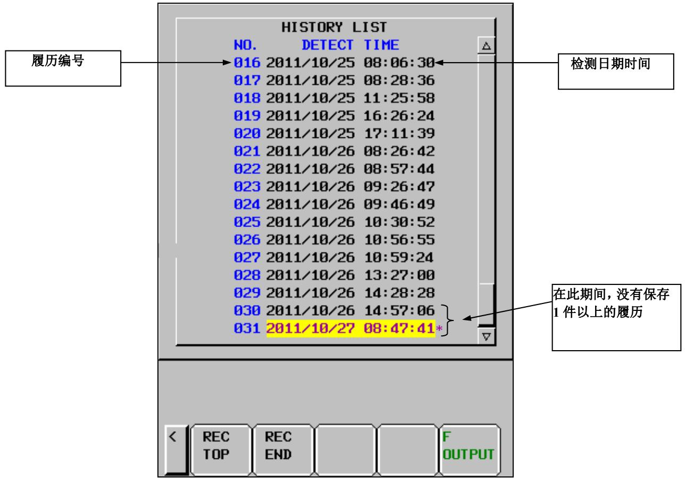

<details>
<summary>text_image</summary>

HISTORY LIST
NO. DETECT TIME
016 2011/10/25 08:06:30
017 2011/10/25 08:28:36
018 2011/10/25 11:25:58
019 2011/10/25 16:26:24
020 2011/10/25 17:11:39
021 2011/10/26 08:26:42
022 2011/10/26 08:57:44
023 2011/10/26 09:26:47
024 2011/10/26 09:46:49
025 2011/10/26 10:30:52
026 2011/10/26 10:56:55
027 2011/10/26 10:59:24
028 2011/10/26 13:27:00
029 2011/10/26 14:28:28
030 2011/10/26 14:57:06
031 2011/10/27 08:47:41*
检测日期时间
在此期间,没有保存
1件以上的履历
< REC TOP REC END F OUTPUT
</details>

图 1.14.3.1 (f) 履历一览

## 履历一览中的操作

(1) 光标移动键、翻页键

可通过光标移动键 ↑ ↓ 、翻页键 ↑ PAGE PAGE ↓ 使得光标上下移动，改变要选择/显示的履历编号。

(2) 软键 [REC TOP]、[REC END]

若按下软键 [REC TOP] (履历顶部)，则选择/显示最早保存的履历信息。

若按下软键 [REC END] (履历底部)，则选择/显示最新保存的履历信息。

(3) 软键 [输出]

处于急停状态、或者 EDIT 方式时若按下软键 [输出]，则向如下的软键转变。


<details>
<summary>text_image</summary>

< CAN EXEC
</details>

若键入任意的文件名，按下软键 [执行]，则可输出 CNC 内部保存的全部履历。

在没有键入任何数据的状态下按下软键 [执行] 时，文件名成为”MSRHSTRY.TXT”。

## 信号信息

可以在履历一览画面的右半分区域显示信号信息。

显示通过履历编号选择的履历编号的信号信息。

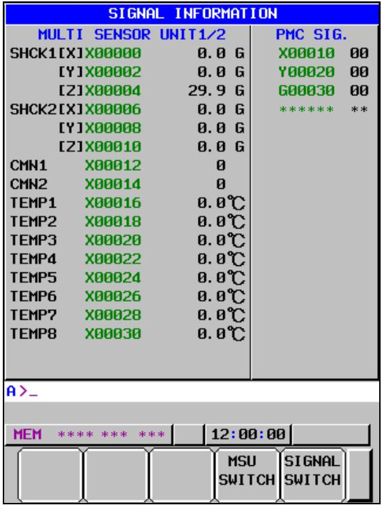

<details>
<summary>text_image</summary>

SIGNAL INFORMATION
MULTI SENSOR UNIT1/2
SHCK1[X]X00000 0.0 G
[Y]X00002 0.0 G
[Z]X00004 29.9 G
SHCK2[X]X00006 0.0 G
[Y]X00008 0.0 G
[Z]X00010 0.0 G
CMN1 X00012 0
CMN2 X00014 0
TEMP1 X00016 0.0℃
TEMP2 X00018 0.0℃
TEMP3 X00020 0.0℃
TEMP4 X00022 0.0℃
TEMP5 X00024 0.0℃
TEMP6 X00026 0.0℃
TEMP7 X00028 0.0℃
TEMP8 X00030 0.0℃
A >_
MEM **** *** ***
12:00:00
MSU SIGNAL
SWITCH SWITCH
</details>

图 1.14.3.1 (g) 信号信息

显示内容以及操作与 MACHINE STATUS MONITOR 画面相同。

详情请参阅 1.14.2.1、1.14.2.2。

## CNC 信息

可以在履历一览画面的右半部分的区域显示 CNC 信息。

显示通过履历编号选择的日期时间中的 CNC 信息。

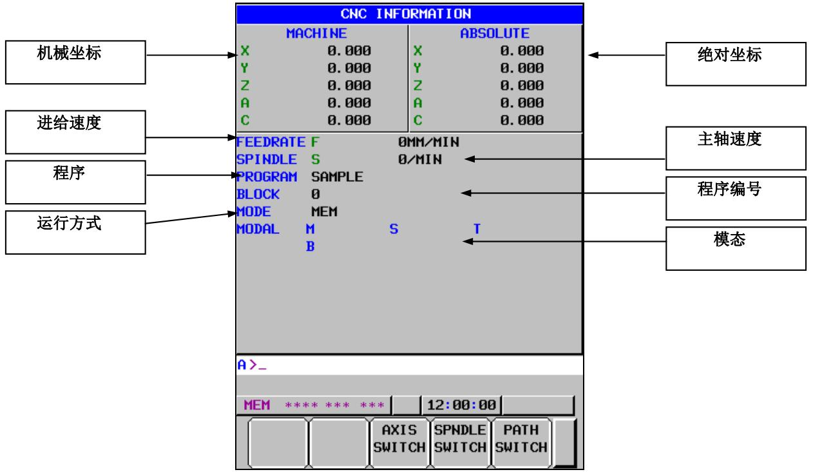

<details>
<summary>flowchart</summary>

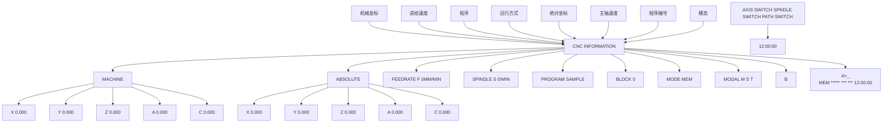
```mermaid
graph TD
  A["机械坐标"] --> B["CNC INFORMATION"]
  C["进给速度"] --> B
  D["程序"] --> B
  E["运行方式"] --> B
  B --> F["MACHINE"]
  B --> G["ABSOLUTE"]
  F --> H["X 0.000"]
  F --> I["Y 0.000"]
  F --> J["Z 0.000"]
  F --> K["A 0.000"]
  F --> L["C 0.000"]
  G --> M["X 0.000"]
  G --> N["Y 0.000"]
  G --> O["Z 0.000"]
  G --> P["A 0.000"]
  G --> Q["C 0.000"]
    
  B --> R["FEEDRATE F 0MM/MIN"]
  B --> S["SPINDLE S 0/MIN"]
  B --> T["PROGRAM SAMPLE"]
  B --> U["BLOCK 0"]
  B --> V["MODE MEM"]
  B --> W["MODAL M S T"]
  B --> X["B"]
    
  B --> Y["A>_<br>MEM ***** *** *** 12:00:00"]
    
  Z["绝对坐标"] --> B
  AA["主轴速度"] --> B
  AB["程序编号"] --> B
  AC["模态"] --> B
    
  AD["AXIS SWITCH SPNDLE SWITCH PATH SWITCH"] --> AE["12:00:00"]
```
</details>

图 1.14.3.1 (h) CNC信息

(1) 机械坐标

显示机械坐标。

控制轴为 6 轴以上的系统时，通过按小软键 [AXIS SWITCH] (轴切换)，显示第 6 轴以后的坐标。

(2) 绝对坐标

显示绝对坐标。

控制轴为 6 轴以上的系统时，通过按下软键 [AXIS SWITCH]，显示第 6 轴以后的坐标。

(3) 进给速度

显示进给速度。

(4) 主轴速度

显示出主轴速度。

控制主轴为 2 轴以上时，通过按下软键 [SPNDLESWITCH] (主轴切换)，即显示第 2 轴以后的主轴速度。

(5) 运行方式

显示运行方式。

(6) 模态

显示模态。

可显示的模态为 M,S,T,B。

## CNC 信息中的操作

(1) 软键 [AXIS SWITCH]

软键 [AXIS SWITCH] 在控制轴为 6 轴以上的系统时显示。

通过按下本软键，即可显示机械坐标和绝对坐标的第6轴以后的坐标。

(2) 软键 [SPNDLESWITCH]

软键 [SPNDLESWITCH] 在控制主轴为 2 轴以上的系统时显示。

通过按下本软键，即可显示第 2 轴以后的主轴速度。

(3) 软键 [PATH SWITCH]

软键 [PATH SWITCH] (路径切换) 在多路径系统时显示。

通过按下本软键，即可切换要显示的路径。

## 操作履历信息

可以在履历一览画面的右半部分的区域显示操作履历信息。

显示将通过履历编号选择的日期时间作为最后的操作履历。

操作履历只通过 MDI 键大约保存 400 个。

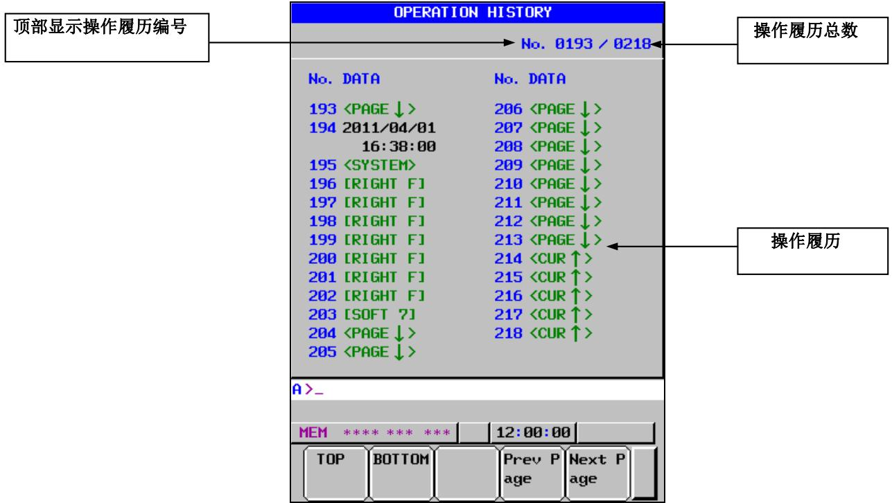

<details>
<summary>text_image</summary>

顶部显示操作履历编号
OPERATION HISTORY
No. 0193 / 0218
操作履历总数
No. DATA	No. DATA
193 <PAGE ↓>	206 <PAGE ↓>
194 2011/04/01	207 <PAGE ↓>
16:38:00	208 <PAGE ↓>
195 <SYSTEM>	209 <PAGE ↓>
196 [RIGHT F]	210 <PAGE ↓>
197 [RIGHT F]	211 <PAGE ↓>
198 [RIGHT F]	212 <PAGE ↓>
199 [RIGHT F]	213 <PAGE ↓>
200 [RIGHT F]	214 <CUR ↑>
201 [RIGHT F]	215 <CUR ↑>
202 [RIGHT F]	216 <CUR ↑>
203 [SOFT ?]	217 <CUR ↑>
204 <PAGE ↓>	218 <CUR ↑>
205 <PAGE ↓>
A >_
MEM **** *** ***
12:00:00
TOP	BOTTOM	Prev Page	Next Page
操作履历
</details>

图 1.14.3.1 (i) 操作履历信息

## 操作履历信息中的操作

(1) 软键 [顶部]
显示最早保存的操作履历。

(2) 软键 [底部]
显示最新保存的操作履历。

(3) 软键 [前一页]
转移到前面一页。

(4) 软键 [下一页]
转移到后面一页。

## 1.14.3.2 MACHINE STATUS HISTORY CNC数据画面

在 MACHINE STATUS HISTORY CNC 数据画面上，同时显示共同信息、信号信息、CNC 信息。

由 MACHINE STATUS HISTORY 的各画面，按下软键 [CNC DATA]，则会显示 MACHINE STATUS HISTORY CNC 数据画面。


### PMC报警: MULTI SENSOR UNIT1/2
- **故障内容**: PMC SIG.
- **处理办法**: MACHINE

### PMC报警: SHCK1[X]X00000
- **故障内容**: 0.0 G
- **处理办法**: X00010 00

### PMC报警: [Y]X00002
- **故障内容**: 0.0 G
- **处理办法**: Y00028 00

### PMC报警: [Z]X00004
- **故障内容**: 29.9 G
- **处理办法**: G00030 00

### PMC报警: SHCK2[X]X00006
- **故障内容**: 1.9 G
- **处理办法**: ********** **

### PMC报警: [Y]X00008
- **故障内容**: 0.0 G
- **处理办法**: 

### PMC报警: [Z]X00010
- **故障内容**: 0.0 G
- **处理办法**: 

### PMC报警: CMN1 XOOO12
- **故障内容**: θ
- **处理办法**: 

### PMC报警: CMN2 XOOO14
- **故障内容**: θ
- **处理办法**: 

### PMC报警: TEMP1 XOOO16
- **故障内容**: 0.0℃
- **处理办法**: 

### PMC报警: TEMP2 XOOO18
- **故障内容**: 0.0℃
- **处理办法**: 

### PMC报警: TEMP3 XOOO20
- **故障内容**: 0.0℃
- **处理办法**: 

### PMC报警: TEMP4 XOOO22
- **故障内容**: 0.0℃
- **处理办法**: 

### PMC报警: TEMP5 XOOO24
- **故障内容**: 0.0℃
- **处理办法**: 

### PMC报警: TEMP6 XOOO26
- **故障内容**: 0.0℃
- **处理办法**: 

### PMC报警: TEMP7 XOOO28
- **故障内容**: 0.0℃
- **处理办法**: 

### PMC报警: TEMP8 XOOO30
- **故障内容**: 0.0℃
- **处理办法**: 

### PMC报警: 
- **故障内容**: 
- **处理办法**: 

### PMC报警: 
- **故障内容**: 
- **处理办法**: 

### PMC报警: 
- **故障内容**: 
- **处理办法**: 

### PMC报警: 
- **故障内容**: 
- **处理办法**: 

### PMC报警: 
- **故障内容**: 
- **处理办法**: 

### PMC报警: 
- **故障内容**: 
- **处理办法**: 


图 1.14.3.2 CNC 数据画面

有关各信息请参阅 1.14.3.1。

## 1.14.3.3 MACHINE STATUS HISTORY 操作履历画面

在 MACHINE STATUS HISTORY 操作履历画面上同时显示共同信息和操作履历信息。

由 MACHINE STATUS HISTORY 的各画面按下软键 [OPERATHISTRY]，则会显示 MACHINE STATUS HISTORY 操作履历画面。

操作履历信息在整个画面上显示。

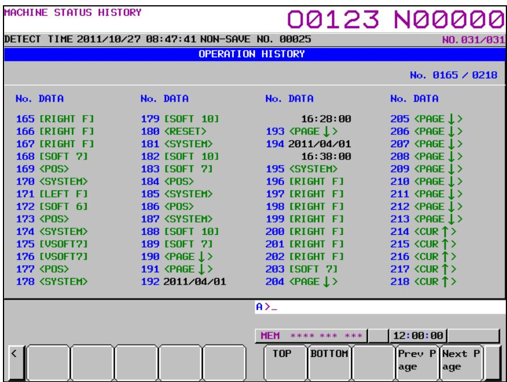

<details>
<summary>text_image</summary>

MACHINE STATUS HISTORY
00123 N00000
DETECT TIME 2011/10/27 08:47:41 NON-SAVE NO. 00025
NO. 031/031
OPERATION HISTORY
No. 0165 / 0218
No. DATA	No. DATA	No. DATA	No. DATA
165 [RIGHT F]	179 [SOFT 10]	16:28:00	205
166 [RIGHT F]	180<RESET>	193<PAGE ↓>	206<PAGE ↓>
167 [RIGHT F]	181<SYSTEM>	194 2011/04/01	207<PAGE ↓>
168 [SOFT ?]	182 [SOFT 10]	16:38:00	208<PAGE ↓>
169<POS>	183 [SOFT ?]	195<SYSTEM>	209<PAGE ↓>
170<SYSTEM>	184<POS>	196 [RIGHT F]	210<PAGE ↓>
171 [LEFT F]	185<SYSTEM>	197 [RIGHT F]	211<PAGE ↓>
172 [SOFT 6]	186<POS>	198 [RIGHT F]	212<PAGE ↓>
173<POS>	187<SYSTEM>	199 [RIGHT F]	213<PAGE ↓>
174<SYSTEM>	188 [SOFT 10]	200 [RIGHT F]	214<CUR ↑>
175 [VSOFT?]	189 [SOFT ?]	201 [RIGHT F]	215<CUR ↑>
176 [VSOFT?]	190<PAGE ↓>	202 [RIGHT F]	216<CUR ↑>
177<POS>	191<PAGE ↓>	203 [SOFT ?]	217<CUR ↑>
178<SYSTEM>	192 2011/04/01	204<PAGE ↓>	218<CUR ↑>
A >_
MEM **** *** ***
TOP	BOTTOM	Prev Page Next Page
</details>

图 1.14.3.3 操作履历画面

有关显示内容和操作，请参阅 1.14.3.1 的操作履历信息。

## 1.14.3.4 履历的输出

若在 MACHINE STATUS HISTORY 一览画面上按下软键 [输出]，则可输出在 CNC 内部保存的履历。输出的文件构成如下所示。


图 1.14.3.4 (a) 全履历文件构成

## 标头

标头中输出总履历个数和文件信息。文件信息用于维护。

```txt
NUMBER OF HISTORY : 010 ←总履历件数
FILE INFORMATION : 1-100-10-9 ←文件信息(用于维护)
```

## 各履历编号数据

向各履历输出履历编号、检测日期时间、非保存履历数、多传感器单元数据(全MSU部分)、PMC信号数据、CNC信息(全路径部分)、辅助信息。

(1) 履历编号、检测日期时间以及非保存履历数

履历编号、检测日期时间以及非保存履历数按如下所示方式输出。

```txt
[HISTORY NO.001] ---- ←履历编号
DETECT TIME : 2010/03/10 21:15:07 ←检测日期时间
NON-SAVE NO.: 00025 ←非保存履历数
```

(2) 多传感器单元数据

连接有多个多传感器单元时，按如下所示方式输出所有多传感器单元的数据。

MULTI SENSOR UNIT DATA :

```txt
<MULTI SENSOR UNIT NO.1>
SHOCK1 X(X00000) : 0.0 [G]
SHOCK1 Y(X00002) : 0.0 [G]
SHOCK1 Z(X00004) : 29.9 [G]
SHOCK2 X(X00006) : 1.9 [G]
SHOCK2 Y(X00008) : 0.0 [G]
SHOCK2 Z(X00010) : 0.0 [G]
COMMON1 (X00012) : 0 [-]
COMMON2 (X00014) : 0 [-]
TEMP1 (X00016) : 0.0 [C]
TEMP2 (X00018) : 0.0 [C]
TEMP3 (X00020) : 0.0 [C]
TEMP4 (X00022) : 0.0 [C]
```


### PMC报警: TEMP5
- **故障内容**: (X00024) :
- **处理办法**: 0.0

### PMC报警: TEMP6
- **故障内容**: (X00026) :
- **处理办法**: 0.0

### PMC报警: TEMP7
- **故障内容**: (X00028) :
- **处理办法**: 0.0

### PMC报警: TEMP8
- **故障内容**: (X00030) :
- **处理办法**: 0.0

### PMC报警: 
- **故障内容**: (Y00000) : -30656
- **处理办法**: 

### PMC报警: 
- **故障内容**: (Y00002) :
- **处理办法**: 0

### PMC报警: 
- **故障内容**: (Y00004) :
- **处理办法**: 0

### PMC报警: 
- **故障内容**: (Y00006) :
- **处理办法**: 0

### PMC报警: 
- **故障内容**: (Y00008) :
- **处理办法**: 16

### PMC报警: 
- **故障内容**: (Y00010) :
- **处理办法**: 0

### PMC报警: 
- **故障内容**: (Y00012) :
- **处理办法**: 0

### PMC报警: 
- **故障内容**: (Y00014) :
- **处理办法**: 0

### PMC报警: 
- **故障内容**: (Y00016) :
- **处理办法**: 0

### PMC报警: 
- **故障内容**: (Y00018) :
- **处理办法**: 0

### PMC报警: 
- **故障内容**: (Y00020) :
- **处理办法**: 0

### PMC报警: 
- **故障内容**: (Y00022) :
- **处理办法**: 0

### PMC报警: 
- **故障内容**: (Y00024) :
- **处理办法**: 0

### PMC报警: 
- **故障内容**: (Y00026) :
- **处理办法**: 0

### PMC报警: 
- **故障内容**: (Y00028) :
- **处理办法**: 0

### PMC报警: 
- **故障内容**: (Y00030) :
- **处理办法**: 0


## (3) PMC 信号数据

按如下所示方输出 PMC 信号数据。

单路径 PMC 系统的情形:

PMC SIGNAL DATA :

X00000 0x3F

X00001 0x04

Y00000 0x00

Y00008 0xF0

多路径 PMC 系统的情形:

PMC SIGNAL DATA :

1:X00000 0x3F

1:X00001 0x04

1:Y00000 0x00

1:Y00008 0xF0

## (4) CNC 信息

按如下所示方式输出 CNC 信息。多路径系统时，输出所有路径的数据。

CNC DATA :


## (5) 操作履历

按如下所示方式输出操作履历。

OPERATION HISTORY :

MDI 01\_ [RIGHT F] 12:02:13

MDI 01 [RIGHT F] 12:02:14

MDI 01 [RIGHT F] 12:02:15

MDI 01\_ [RIGHT F] 12:02:15

MDI 01\_ [SOFT HF7] 12:02:16

MDI 01\_<Cursor Down> 12:02:26

MDI 01\_<Cursor Down> 12:02:26

:

## (6) 辅助信息

按如下所示方式输出辅助信息。本信息用于维护。

AUX INFO :0-0

## 1.15 故障诊断

## 1.15.1 概述

发生伺服报警 / 主轴报警 / CNC 报警时，通过按照本功能的引导进行诊断，就可轻易地查清报警的原因。

此外，伺服的热模拟数据、或者干扰负荷水平值大于指定值（故障预测水平）时，通过使用故障预测信号，即可事前检测故障而使得机械安全停止。

下面介绍使用了故障诊断功能的报警发生原因追踪方法例。

## 发生了报警 “SV0410 停止时误差太大” 的情形

下面就发生如下报警 “SV0410 停止时误差太大” 时调查原因的步骤进行说明。

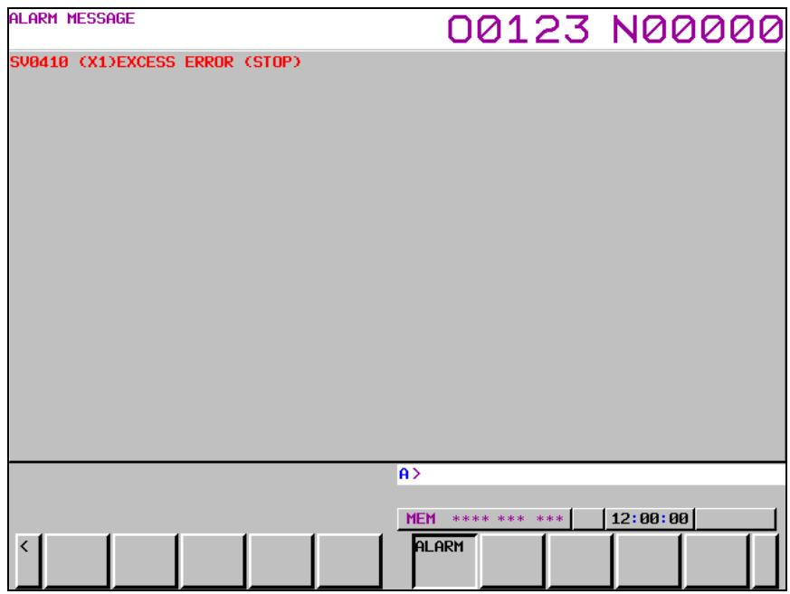

<details>
<summary>text_image</summary>

ALARM MESSAGE
00123 N00000
SV0410 (X1)EXCESS ERROR (STOP)
A >
MEM **** *** 12:00:00
< ALARM
</details>

图1.15.1 (a) 报警信息画面（10.4”显示器）

停止时误差过大报警的发生要因可能有多个，可通过如下步骤对于显示在画面上的提问通过软键回答“是的”“无”，追踪发生原因。

1 按下返回软键 [<] 后直至显示软键 [引导] [显示器] [W.图形]，按下继续菜单键 ▶。  
2 按下软键 [引导]。


<details>
<summary>text_image</summary>

ABSOLU
TE RELATI
VE ALL
GUIDE ONIT W. GRPH
(OPRT) +
(OPRT)
</details>

图1.15.1 (b) 故障诊断指南画面选择软键（10.4”显示器）

显示如下画面，按下软键 [是的]。

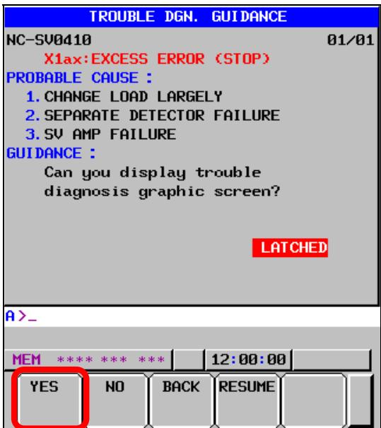

<details>
<summary>text_image</summary>

TROUBLE DGN. GUIDANCE
NC-SV0410 01/01
X1ax:EXCESS ERROR (STOP)
PROBABLE CAUSE :
1.CHANGE LOAD LARGELY
2.SEPARATE DETECTOR FAILURE
3.SV AMP FAILURE
GUIDANCE :
Can you display trouble
diagnosis graphic screen?
LATCHED
A >_
MEM **** *** ***
12:00:00
YES NO BACK RESUME
</details>

图1.15.1 (c) 故障诊断指南画面（10.4”显示器）

显示如下引导。

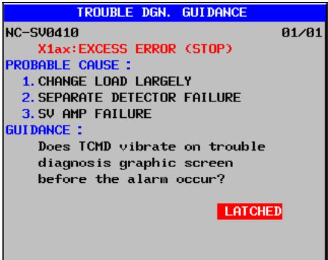

<details>
<summary>text_image</summary>

TROUBLE DGN. GUIDANCE
NC-SV0410 01/01
X1ax:EXCESS ERROR (STOP)
PROBABLE CAUSE :
1.CHANGE LOAD LARGELY
2.SEPARATE DETECTOR FAILURE
3.SV AMP FAILURE
GUIDANCE :
Does TCMD vibrate on trouble
diagnosis graphic screen
before the alarm occur?
LATCHED
</details>

图1.15.1 (d) 故障诊断指南画面（10.4”显示器）

按照上述引导，显示用于诊断的图形画面以确认电流指令。

通过如下步骤显示用于诊断的图形画面。

1 按下返回软键 [<]。  
2 按下软键 [W.图形]。


<details>
<summary>text_image</summary>

ABSOLU TE RELATI VE ALL GUIDE MONIT W. GRPH (OPRT) +
</details>

图1.15.1 (e) 故障诊断图形画面选择软键（10.4”显示器）

3 按下软键 [W.参数]。


<details>
<summary>text_image</summary>

ABSOLUTE RELATIVE ALL
J. PRM L_ADJ. TRB LV (OPRT)
</details>

图1.15.1 (f) 故障诊断参数画面选择软键（10.4”显示器）

按如下所示方式设定图形显示所需的参数。

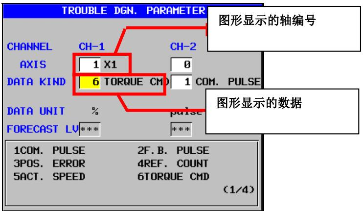

<details>
<summary>text_image</summary>

TROUBLE DGN. PARAMETER
CHANNEL CH-1 CH-2
AXIS 1 X1 0
DATA KIND 6 TORQUE CMD 1 COM. PULSE
DATA UNIT % pulse
FORECAST LV *** ***
1COM. PULSE 2F.B. PULSE
3POS. ERROR 4REF. COUNT
5ACT. SPEED 6TORQUE CMD
(1/4)
图形显示的轴编号
图形显示的数据
</details>

图1.15.1 (g) 故障诊断参数画面（10.4”显示器）

通过在 “轴” 旁的显示框内输入轴编号，选择要显示的轴。

通过在 “数据种类” 旁的显示框内输入数据种类编号，选择要显示的数据种类。

本次为了确认 X1 轴的电流指令的波形，在轴编号中设定 “1”，在数据种类编号中设定 “6”。

通过如下步骤显示用于诊断的图形画面。

1 按下返回软键 [<]。  
2 按下软键 [G.调整]。


<details>
<summary>text_image</summary>

ABSOLUTE RELATIVE ALL W. PRM G_ADJ. TRB LV (OPRT)
</details>

图1.15.1 (h)  
故障诊断图形画面选择软键（10.4”显示器）

按如下所示方式显示刚发生报警前的电流指令的图形。

右端的箭头所示的纵线表示报警发生的时间。

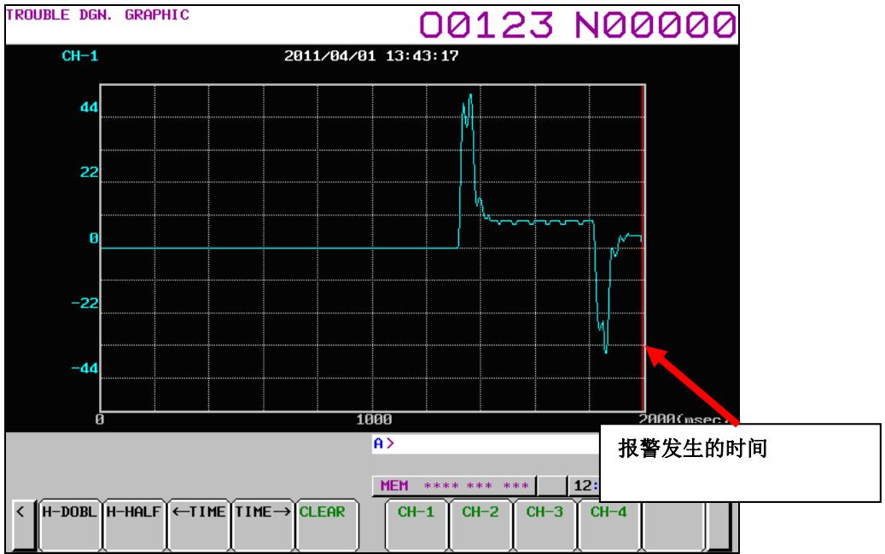

<details>
<summary>line chart</summary>

| Time (ms) | Value |
|-----------|-------|
| 0         | 0     |
| 1000      | 0     |
| 2000      | -44   |
</details>

图1.15.1 (i) 故障诊断图形画面（10.4”显示器）

由此图形可以判断电流指令没有振动，因而，返回原先的引导画面，按下 [无]。

通过执行如下步骤显示引导画面。

1 按下返回软键 [<]。  
2 按下软键 [引导]。

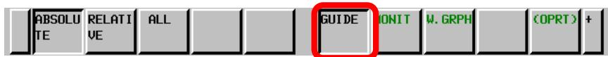

<details>
<summary>text_image</summary>

ABSOLU TE RELATI VE ALL
GUIDE MONIT W. GRPH (OPRT) +
</details>

图1.15.1 (j)  
故障诊断指南画面选择软键（10.4”显示器）

在故障诊断指南画面上按下软键[(操作)]后，按下[无]。

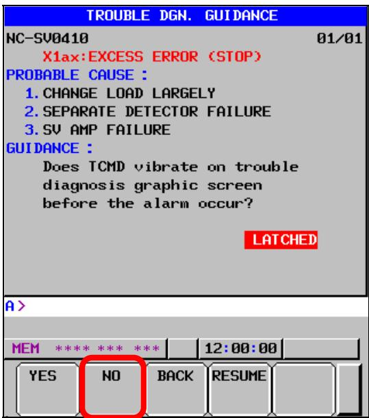

<details>
<summary>text_image</summary>

TROUBLE DGN. GUIDANCE
NC-SV0410                    01/01
X1ax:EXCESS ERROR (STOP)
PROBABLE CAUSE :
1.CHANGE LOAD LARGELY
2.SEPARATE DETECTOR FAILURE
3.SV AMP FAILURE
GUIDANCE :
Does TCMD vibrate on trouble
diagnosis graphic screen
before the alarm occur?
LATCHED
A >
MEM **** *** ***
12:00:00
YES    NO    BACK    RESUME
</details>

图1.15.1 (k) 故障诊断指南画面（10.4”显示器）

若按下 [无]，则会显示如下所示的引导。

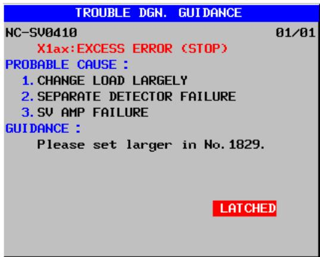

<details>
<summary>text_image</summary>

TROUBLE DGN. GUIDANCE
NC-SV0410                    01/01
X1ax:EXCESS ERROR (STOP)
PROBABLE CAUSE :
1.CHANGE LOAD LARGELY
2.SEPARATE DETECTOR FAILURE
3.SV AMP FAILURE
GUIDANCE :
Please set larger in No.1829.
LATCHED
</details>

图1.15.1 (l) 故障诊断指南画面（10.4”显示器）

这样就可以确定报警的原因，可按照显示内容采取对策。

## 1.15.2 报警发生原因的调查步骤

发生伺服/主轴报警时，可通过如下步骤调查发生原因。

## 注释

为了进行伺服报警 / 主轴报警发生时的故障诊断，故障诊断画面的状态显示必须是 “采样中”。如果状态显示不是 “采样中” 时，请参阅 1.15.4 项 “故障诊断监视画面” 中所述的 “保持数据的擦除”，务必将其置于 “采样中” 的状态。

## 调查步骤（8.4/10.4”显示器的情形）

## 步骤

1 按下功能键 MESSAGE，显示出信息画面。  
2 按下返回软键 [<] 后直至显示软键 [引导] [显示器] [W.图形]，按下继续菜单键 ▶。  
3 按下软键 [引导]。

显示故障诊断指南画面。

在故障诊断指南画面上，显示用来确定已发生的报警原因之引导。

通过参照故障诊断监视器画面的伺服/主轴监视器信息和故障诊断图形画面的波形数据、诊断画面等，以软键[是的][无]进行回答，来显示报警的发生原因和对应方法。

## 调查步骤（15/19”显示器的情形）

## 步骤

1 按下功能键 [MESSAGE]，显示出信息画面。  
2 直至显示竖排软键 [引导] [显示器] [W.图形]，按下竖排软键 [下一页]。  
3 按下竖排软键 [引导]。

显示故障诊断指南画面。

在故障诊断指南画面上，显示用来确定已发生的报警原因之引导。

通过参照故障诊断监视器画面的伺服/主轴监视器信息和故障诊断图形画面的波形数据、诊断画面等，以横排软键[是的] [无] 进行回答，来显示报警的发生原因和对应方法。

## 1.15.3 故障诊断指南画面

## 概述

在本画面上，显示用来确定已发生的报警原因之引导。按照引导进行确认/并采取对策，通过以“是的”/“无”的方式进行回答，就可在短时间内确定报警原因。

## 显示故障诊断指南画面的步骤（8.4/10.4”显示器的情形）

## 步骤

1 按下功能键
MESSAGE  
2 在显示软键 [引导] 之前，按住继续菜单键 ▷。  
3 按下软键 [引导]。如下所示，显示故障诊断指南画面。

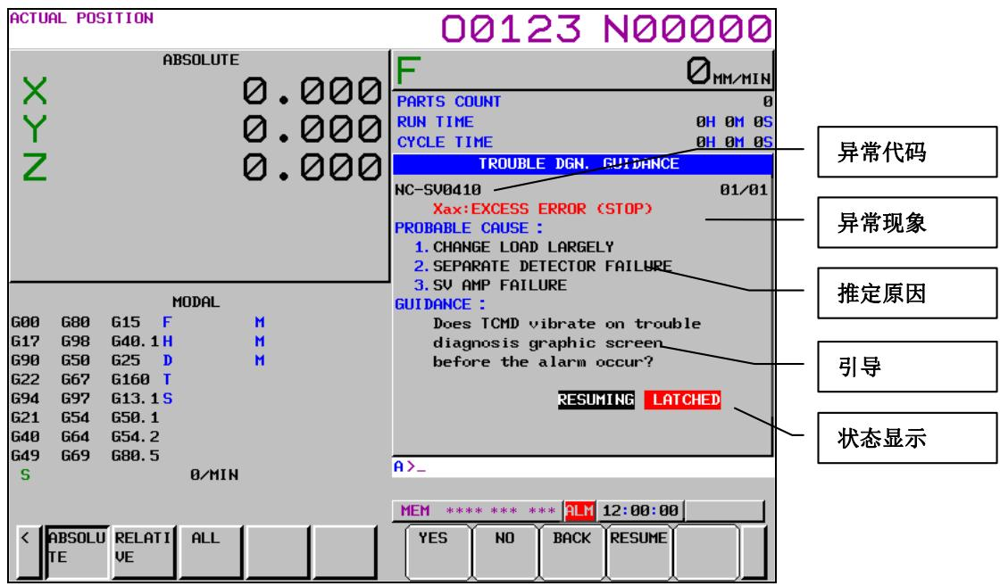

<details>
<summary>text_image</summary>

ACTUAL POSITION
00123 N00000
ABSOLUTE
X 0.000
Y 0.000
Z 0.000
F 0 MM/MIN
PARTS COUNT 0
RUN TIME 0H 0M 0S
CYCLE TIME 0H 0M 0S
TROUBLE DGN. GUIDANCE
NC-SV0410 01/01
Xax:EXCESS ERROR (STOP)
PROBABLE CAUSE :
1.CHANGE LOAD LARGELY
2.SEPARATE DETECTOR FAILURE
3.SV AMP FAILURE
GUIDANCE :
Does TCMD vibrate on trouble
diagnosis graphic screen
before the alarm occur?
RESUMING LATCHED
G00 G80 G15 F M
G17 G98 G40.1 H M
G90 G50 G25 D M
G22 G67 G160 T
G94 G97 G13.1 S
G21 G54 G50.1
G40 G64 G54.2
G49 G69 G80.5
S 0/MIN
A >_
MEM **** **** ALN 12:00:00
< ABSOLU RELATI ALL YES NO BACK RESUME
异常代码
异常现象
推定原因
引导
状态显示
</details>

图1.15.3 (a) 故障诊断指南画面（10.4”显示器）

## 显示故障诊断指南画面的步骤（15/19”显示器的情形）

## 步骤

1 按下功能键 MESSAGE。  
2 直至显示竖排软键 [引导]，按下竖排软键 [下一页]。  
3 按下竖排软键 [引导]。显示故障诊断指南画面。

## 解释

## - 显示内容

异常代码：作为用来分类报警的代码，显示“NC”-“报警种类+报警编号”。

异常現象：报警的内容。

推定原因：报警的主要发生原因。

引导：显示用来确定报警原因而进行确认的内容和对应方法。

状态显示:

“继续”：

按下软键 [继续]，显示切断电源之前曾经显示的“引导”时予以显示。

“采样中” / ”保持”:

CNC 备有两种状态，通常运行时始终对伺服 / 主轴信息进行采样的状态（监视中状态）、和发生伺服 / 主轴报警，该采样已停止的状态（保持状态）。

“采样中” / ”保持”显示，表示该两种状态。

发生伺服 / 主轴报警时，停止伺服 / 主轴监视器信息的采样，将报警发生时的数据保持在 CNC 内部。

报警发生后处于 “保持” 状态时，若切换到故障诊断指南画面，显示针对伺服 / 主轴报警的诊断，则根据发生报警时的伺服 / 主轴信息，在 CNC 内部部分地自动进行诊断。

另外，若不开始采样，在后续发生报警时，故障诊断指南画面上进行诊断的报警编号、与报警发生时保持监视器信息时的报警编号将会不同，有可能无法进行正确的诊断。这种情况下，“保持”状态的显示会闪烁。

在针对报警的发生原因和对应方法后，为了再次开始采样，请在故障诊断监视器画面 / 故障诊断图形画面 / 故障预测水平设定画面的任何一个画面上执行保持数据的擦除。

通过执行保持数据的擦除，“保持”状态就会切换到“采样中”状态，并重新开始伺服 / 主轴监视器信息的采样。

## 操作

在故障诊断指南画面上按下软键[(操作)]。（限于8.4/10.4”显示器的情形）

## - 引导的切换

软键 [是的] / [无]:

请确认 “引导” 部分显示的内容，通过软键 [是的] / [无] 输入结果。根据所输入的结果，显示出接下来应该予以确认的处置方法。

CNC 有的时候会自动进行确认、判断（自动诊断）。

此时，“引导”内容并不被显示出来，但是，根据该结果，自动转入后续的“引导”。发生报警时，在保持伺服/主轴监视器信息后暂时切断电源时，不执行自动诊断。

软键 [返回]:

返回引导 1 个步骤。按错了软键 [是的] / [无] 等时，可以逆溯引导。

软键 [继续] :

再显示在切断电源之前曾经显示的“引导”内容。一次也没有执行引导时，不会显示软键[继续]。

可根据再显示的引导进行后续的诊断。

但是，无法通过软键 [返回] 而返回到比按下了软键 [继续] 的位置更靠前的位置。

在通过软键 [继续] 重新开始的诊断中，状态显示显示出“继续”。

## - 报警的切换

同时发生多个报警时，通过按下翻页键 / PAGE ，即可切换显示引导的报警。

## 1.15.4 故障诊断监视画面

## 概述

显示伺服报警 / 主轴报警诊断所需的发生报警时的信息。

作为发生报警时的信息，可以显示 “当前最新报警” 以及紧靠其前的 4 个采样部分的 “报警前 1～4” 的伺服 / 主轴监视器信息。

此外，也可以显示通常运行时的伺服 / 主轴监视器信息 “当前”。

## 显示故障诊断监视画面的步骤（8.4/10.4”显示器的情形）

## 步骤

1 按下功能键 [IMAGE]。

2 在显示软键 [显示器] 之前，按住继续菜单键 ▶。

3 按下软键 [显示器]。

最新发生报警时的X轴（伺服）数据显示中的示例）

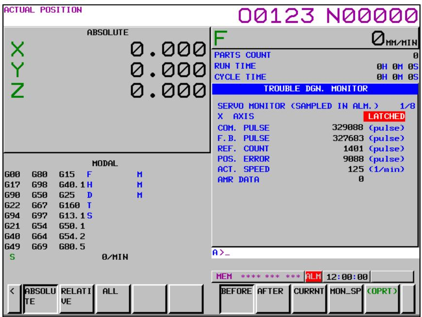

<details>
<summary>text_image</summary>

ACTUAL POSITION
00123 N00000
ABSOLUTE
X 0.000
Y 0.000
Z 0.000
F 0 MM/MIN
PARTS COUNT 0
RUN TIME 0H 0M 0S
CYCLE TIME 0H 0M 0S
TROUBLE DGN. MONITOR
SERVO MONITOR (SAMPLED IN ALM.) 1/8
X AXIS LATCHED
COM. PULSE 329088 (pulse)
F.B. PULSE 327683 (pulse)
REF. COUNT 1401 (pulse)
POS. ERROR 9088 (pulse)
ACT. SPEED 125 (1/min)
AMR DATA 0
MODAL
G00 G80 G15 F M
G17 G98 G40.1 H M
G90 G50 G25 D M
G22 G67 G160 T
G94 G97 G13.1 S
G21 G54 G50.1
G40 G64 G54.2
G49 G69 G80.5
S 0/MIN
A >_
MEM **** *** ALM 12:00:00
< ABSOLU RELATI ALL BEFORE AFTER CURRENT MON_SP OPRT
</details>

图1.15.4 (a) 故障诊断监视画面（10.4”显示器）

4 若按下软键［主轴］/［伺服］，就可以切换伺服监视器信息画面和主轴监视器信息画面。

## 显示故障诊断监视画面的步骤（15/19”显示器的情形）

## 步骤

1 按下功能键 ? MESSAGE。

2 直至显示竖排软键 [显示器]，按下竖排软键 [下一页]。  
3 按下竖排软键 [显示器]。  
4 若按下竖排软键 [主轴] / [伺服]，就可以切换伺服监视器信息画面和主轴监视器信息画面。

## 解释

## - 关于监视器画面的显示数据

监视器画面上显示的数据的种类，如下表所示。

表1.15.4 (a) 伺服相关数据


### PMC报警: 数据(单位)
- **故障内容**: 数据类型
- **处理办法**: 显示范围

### PMC报警: 指令累计值(pulse)
- **故障内容**: 2字型
- **处理办法**: ±99999999

### PMC报警: 反馈脉冲(pulse)
- **故障内容**: 2字型
- **处理办法**: ±99999999

### PMC报警: 参考计数器(pulse)
- **故障内容**: 2字型
- **处理办法**: ±99999999

### PMC报警: 位置偏差量(pulse)
- **故障内容**: 2字型
- **处理办法**: ±99999999

### PMC报警: 实际速度(1/min)
- **故障内容**: 字型
- **处理办法**: -32768~+32767

### PMC报警: AMR数据
- **故障内容**: 字型
- **处理办法**: 0~+255

### PMC报警: 扭矩命令过滤器(%)
- **故障内容**: 字型
- **处理办法**: ±400

### PMC报警: 有效电流值(%)
- **故障内容**: 字型
- **处理办法**: ±400

### PMC报警: 电机电流(A)
- **故障内容**: 字型
- **处理办法**: ±4096

### PMC报警: 干扰级别(%)
- **故障内容**: 字型
- **处理办法**: 0~+200

### PMC报警: 热量模拟(%)
- **故障内容**: 字型
- **处理办法**: 0~+100

### PMC报警: 任意时间
- **故障内容**: 字型
- **处理办法**: -32768~+32767

### PMC报警: 任意时间2
- **故障内容**: 字型
- **处理办法**: -32768~+32767

### PMC报警: DC母线电压(V)
- **故障内容**: 字型
- **处理办法**: 0~+1023

### PMC报警: 电源电压有效值(Vrms)
- **故障内容**: 字型
- **处理办法**: 0~+1023

### PMC报警: 电源电压不平衡率(%)
- **故障内容**: 字型
- **处理办法**: 0~+15.5

### PMC报警: PS 电源电压THD (%)
- **故障内容**: 字型
- **处理办法**: 0~+31.5

### PMC报警: PS 电流(A)
- **故障内容**: 字型
- **处理办法**: 0~+2047

### PMC报警: PS 状态标记1
- **故障内容**: 位型
- **处理办法**: 0/1

### PMC报警: PS 状态标记2
- **故障内容**: 位型
- **处理办法**: 0/1

### PMC报警: PS 状态标记3
- **故障内容**: 位型
- **处理办法**: 0/1

### PMC报警: PS 状态标记4
- **故障内容**: 位型
- **处理办法**: 0/1

### PMC报警: PS 输入电源的频率(Hz)
- **故障内容**: 字型
- **处理办法**: 0~+102.3

### PMC报警: SV绝缘检测信息
- **故障内容**: 字节型
- **处理办法**: 0~3F

### PMC报警: 伺服绝缘电阻值(MΩ)
- **故障内容**: 字型
- **处理办法**: 0~+102.1

### PMC报警: PS 内部温度(°C)
- **故障内容**: 字节型
- **处理办法**: 0~+255

### PMC报警: PS 散热器温度(°C)
- **故障内容**: 字节型
- **处理办法**: 0~+255

### PMC报警: SV 内部温度(°C)
- **故障内容**: 字节型
- **处理办法**: 0~+255

### PMC报警: SV 散热器温度(°C)
- **故障内容**: 字节型
- **处理办法**: 0~+255

### PMC报警: 放大器组/从
- **故障内容**: 字节型
- **处理办法**: 0~+255

### PMC报警: PS 诊断信息
- **故障内容**: 字型
- **处理办法**: 0~FFFF

### PMC报警: AMP 通讯错误信息
- **故障内容**: 字型
- **处理办法**: 0~FFFF

### PMC报警: 伺服诊断信息
- **故障内容**: 字型
- **处理办法**: 0~FFFF

### PMC报警: SV FSSB 上 Slave 错误信息
- **故障内容**: 2 字型
- **处理办法**: 0~FFFF

### PMC报警: SV FSSB 下 Slave 错误信息
- **故障内容**: 2 字型
- **处理办法**: 0~FFFF

### PMC报警: SV FSSB UPR.JTR.
- **故障内容**: 2 字型
- **处理办法**: 0~FFFF

### PMC报警: SV FSSB LWR.JTR.
- **故障内容**: 2 字型
- **处理办法**: 0~FFFF

### PMC报警: SDU FSSB UPR.ERR.
- **故障内容**: 2 字型
- **处理办法**: 0~FFFF

### PMC报警: SDU FSSB LWR.ERR.
- **故障内容**: 2 字型
- **处理办法**: 0~FFFF

### PMC报警: SDU FSSB UPR.JTR.
- **故障内容**: 2 字型
- **处理办法**: 0~FFFF

### PMC报警: SDU FSSB LWR.JTR.
- **故障内容**: 2 字型
- **处理办法**: 0~FFFF

### PMC报警: 内置编码器输入CNT
- **故障内容**: 字型
- **处理办法**: 0~+65535

### PMC报警: 内置编码器通信CNT
- **故障内容**: 字型
- **处理办法**: 0~+65535

### PMC报警: 内置编码器报警
- **故障内容**: 字型
- **处理办法**: 0~FFFF

### PMC报警: 外部编码器输入CNT
- **故障内容**: 字型
- **处理办法**: 0~+65535

### PMC报警: 外部编码器通信CNT
- **故障内容**: 字型
- **处理办法**: 0~+65535

### PMC报警: 外部编码器报警
- **故障内容**: 字型
- **处理办法**: 0~FFFF

### PMC报警: SV 数据1
- **故障内容**: 字型
- **处理办法**: -32768~+32767

### PMC报警: SV 数据2
- **故障内容**: 字型
- **处理办法**: -32768~+32767

### PMC报警: SV 数据3
- **故障内容**: 字型
- **处理办法**: -32768~+32767

### PMC报警: SV 数据4
- **故障内容**: 字型
- **处理办法**: -32768~+32767


## 注释

1 所载的显示范围为作为监视器功能可以显示的范围，并不表示系统的性能和额定值。  
2 任意数据 1～2、SV 数据 1～4 在我公司进行维护时使用。  
3 电压、电流、频率、电阻值、温度的显示值为大致值，包含有误差。需要正确的值时，请使用专用的测量器直接进行测量。  
4 PS 状态旗标 1\~4 在本公司维护时使用。  
5 FSSB 的错误、抖晃数据是表示 FSSB 的通信状态的数据。在本公进行维护时使用。  
6 G321 以及 G331 系列的系统中不予显示。  
7 G321 以及 G331 系列的系统中显示在第 3 页。

表1.15.4 (b) 主轴相关数据


### PMC报警: 数据(单位)
- **故障内容**: 数据类型
- **处理办法**: 显示范围

### PMC报警: 操作
- **故障内容**: 字符串
- **处理办法**: ******

### PMC报警: 齿轮/输出选择
- **故障内容**: 字符串
- **处理办法**: ******

### PMC报警: 指令脉冲数(pulse)
- **故障内容**: 2字型
- **处理办法**: ±99999999

### PMC报警: 指令速度(1/min)
- **故障内容**: 字型
- **处理办法**: -32768~+32767

### PMC报警: 控制输入信号
- **故障内容**: 字符串
- **处理办法**: ******

### PMC报警: 控制输出信号
- **故障内容**: 字符串
- **处理办法**: ******

### PMC报警: 主轴速度(1/min)
- **故障内容**: 字型
- **处理办法**: -32768~+32767

### PMC报警: 实际电机速度(1/min)
- **故障内容**: 字型
- **处理办法**: -32768~+32767

### PMC报警: 负载表(%)
- **故障内容**: 字型
- **处理办法**: 0~+10000

### PMC报警: 扭矩指令(%)
- **故障内容**: 字型
- **处理办法**: -100~+100

### PMC报警: 电机电流值(A)
- **故障内容**: 字型
- **处理办法**: -4096~+4095

### PMC报警: 热量模拟(电机)(%)
- **故障内容**: 字节型
- **处理办法**: 0~+100

### PMC报警: 热量模拟(放大器))(%)
- **故障内容**: 字节型
- **处理办法**: 0~+100

### PMC报警: 位置偏差量(pulse)
- **故障内容**: 2字型
- **处理办法**: ±99999999

### PMC报警: 同步误差(pulse)
- **故障内容**: 2字型
- **处理办法**: ±99999999

### PMC报警: DC母线电压(V)
- **故障内容**: 字型
- **处理办法**: 0~+1023

### PMC报警: 电源电压有效值(Vrms)
- **故障内容**: 字型
- **处理办法**: 0~+1023

### PMC报警: 电源电压不平衡率(%)
- **故障内容**: 字型
- **处理办法**: 0~+15.5

### PMC报警: PS电源电压THDTHD(%)
- **故障内容**: 字型
- **处理办法**: 0~+31.5

### PMC报警: PS电流(A)
- **故障内容**: 字型
- **处理办法**: 0~+1023

### PMC报警: PS状态标记1
- **故障内容**: 位型
- **处理办法**: 0/1

### PMC报警: PS状态标记2
- **故障内容**: 位型
- **处理办法**: 0/1

### PMC报警: PS状态标记3
- **故障内容**: 位型
- **处理办法**: 0/1

### PMC报警: PS状态标记4
- **故障内容**: 位型
- **处理办法**: 0/1

### PMC报警: PS输入电源的频率(Hz)
- **故障内容**: 字型
- **处理办法**: 0~+102.3

### PMC报警: SP绝缘检查信息
- **故障内容**: 字节型
- **处理办法**: 0~3F

### PMC报警: SP绝缘电阻值(MΩ)
- **故障内容**: 字型
- **处理办法**: 0~+102.1

### PMC报警: PS内部温度(°C)
- **故障内容**: 字节型
- **处理办法**: 0~+255

### PMC报警: PS散热器温度(°C)
- **故障内容**: 字节型
- **处理办法**: 0~+255

### PMC报警: SP内部温度(°C)
- **故障内容**: 字节型
- **处理办法**: 0~+255

### PMC报警: 主轴散热器温度(°C)
- **故障内容**: 字节型
- **处理办法**: 0~+255

### PMC报警: 放大器组/从
- **故障内容**: 字节型
- **处理办法**: 0~+255

### PMC报警: PS诊断信息
- **故障内容**: 字型
- **处理办法**: 0~FFFF

### PMC报警: AMP通讯错误信息
- **故障内容**: 字型
- **处理办法**: 0~FFFF

### PMC报警: 主轴诊断信息
- **故障内容**: 字型
- **处理办法**: 0~FFFF

### PMC报警: SP FSSB上行错误
- **故障内容**: 2字型
- **处理办法**: 0~FFFF

### PMC报警: SP FSSB 下行错误
- **故障内容**: 2 字型
- **处理办法**: 0 ~ FFFF

### PMC报警: SP FSSB UPR.JTR.
- **故障内容**: 2 字型
- **处理办法**: 0 ~ FFFF

### PMC报警: AMP FSSB LWR.JTR.
- **故障内容**: 2 字型
- **处理办法**: 0 ~ FFFF

### PMC报警: 内嵌 A/B 相振幅(V)
- **故障内容**: 字节型
- **处理办法**: 0 ~ +2.55

### PMC报警: 内嵌 A/B 相最大振幅(mV)
- **故障内容**: 字节型
- **处理办法**: 0 ~ +1270

### PMC报警: 内嵌 A/B 相偏移量 A (mV)
- **故障内容**: 字节型
- **处理办法**: -1280 ~ +1270

### PMC报警: 内嵌 A/B 相偏移量 B (mV)
- **故障内容**: 字节型
- **处理办法**: -1280 ~ +1270

### PMC报警: 内嵌 A/B 相噪音 CNT
- **故障内容**: 字型
- **处理办法**: -32768 ~ +32767

### PMC报警: 外部 A/B 相振幅(V)
- **故障内容**: 字节型
- **处理办法**: 0 ~ +2.55

### PMC报警: 外部 A/B 相最大变化(mV)
- **故障内容**: 字节型
- **处理办法**: 0 ~ +1270

### PMC报警: 外部 A/B 相补偿 A (mV)
- **故障内容**: 字节型
- **处理办法**: -1280 ~ +1270

### PMC报警: 外部 A/B 相补偿 B (mV)
- **故障内容**: 字节型
- **处理办法**: -1280 ~ +1270

### PMC报警: 外部 A/B 相干扰 CNT
- **故障内容**: 字型
- **处理办法**: -32768 ~ +32767

### PMC报警: 内置串行输入 CNT
- **故障内容**: 字型
- **处理办法**: 0 ~ +65535

### PMC报警: 内置串行通信 CNT
- **故障内容**: 字型
- **处理办法**: 0 ~ +65535

### PMC报警: 内置串行通信 CNT
- **故障内容**: 字型
- **处理办法**: 0 ~ FFFF

### PMC报警: 外部串行输入 CNT
- **故障内容**: 字型
- **处理办法**: 0 ~ +65535

### PMC报警: 外部串行通信 CNT
- **故障内容**: 字型
- **处理办法**: 0 ~ +65535

### PMC报警: EXT.SRAL WRN.
- **故障内容**: 字型
- **处理办法**: 0 ~ FFFF

### PMC报警: SP 数据 1
- **故障内容**: 字型
- **处理办法**: -32768 ~ +32767

### PMC报警: SP 数据 2
- **故障内容**: 字型
- **处理办法**: -32768 ~ +32767

### PMC报警: SP 数据 3
- **故障内容**: 字型
- **处理办法**: -32768 ~ +32767

### PMC报警: SP 数据 4
- **故障内容**: 字型
- **处理办法**: -32768 ~ +32767


## 注释

1 所载的显示范围为作为监视器功能可以显示的范围，并不表示系统的性能和额定值。  
2 指令速度(1/min)、实际电机速度(1/min)

要显示指令速度、实际电机速度，需要设定电机最高转速的参数。

\- No.4020: 主要主轴的电机最高转速

\- No.4196: 次级主轴的电机最高转速

(使用主轴切换功能时)

3 电压、电流、频率、电阻值、温度的显示值为大致值，包含有误差。需要正确的值时，请使用专用的测量器直接进行测量。  
4 SP 数据 1\~4 在本公司进行维护时使用。  
5 PS 状态旗标 1～4 在本公司维护时使用。  
6 FSSB的错误、抖晃数据是表示FSSB的通信状态的数据。在本公进行维护时使用。  
7 G321 以及 G331 系列的系统中不予显示。

表1.15.4 (c) 其他显示项目


### PMC报警: 数据
- **故障内容**: 数据类型
- **处理办法**: 显示页码

### PMC报警: 进给保持时间:日
- **故障内容**: 年(公历后2位数)/月(2位数)/日(2位数)
- **处理办法**: 8(伺服)/9(主轴)


## 操作

## - 伺服监视器信息画面

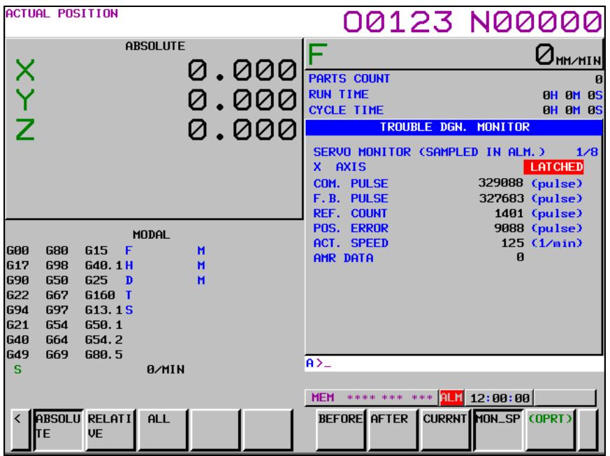

<details>
<summary>text_image</summary>

ACTUAL POSITION
00123 N00000
ABSOLUTE
X 0.000
Y 0.000
Z 0.000
F 0MM/MIN
PARTS COUNT 0
RUN TIME 0H 0M 0S
CYCLE TIME 0H 0M 0S
TROUBLE DGN. MONITOR
SERVO MONITOR (SAMPLED IN ALM.) 1/8
X AXIS LATCHED
COM. PULSE 329088 (pulse)
F.B. PULSE 327683 (pulse)
REF. COUNT 1401 (pulse)
POS. ERROR 9088 (pulse)
ACT. SPEED 125 (1/min)
AMR DATA 0
MODAL
G00 G80 G15 F M
G17 G98 G40.1 H M
G90 G50 G25 D M
G22 G67 G160 T
G94 G97 G13.1 S
G21 G54 G50.1
G40 G64 G54.2
G49 G69 G80.5
S 0/MIN
A >_
MEM **** *** ALM 12:00:00
< ABSOLU RELAT ALL BEFORE AFTER CURRENT MON_SP OPRT )
</details>

图1.15.4 (b) 故障诊断监视画面（伺服监视器信息）（10.4”显示器）

可以选择通过软键 [发生时] / [当前] / [前] / [后] 而显示的伺服监视器信息。

每次执行操作，切换显示软键 [发生时] 和 [当前]。

此外，软键 [前] / [后] 在按下了软键 [发生时] 时显示，按下软键 [当前] 时不会显示。

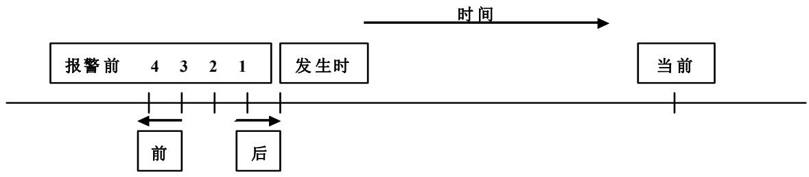

<details>
<summary>flowchart</summary>

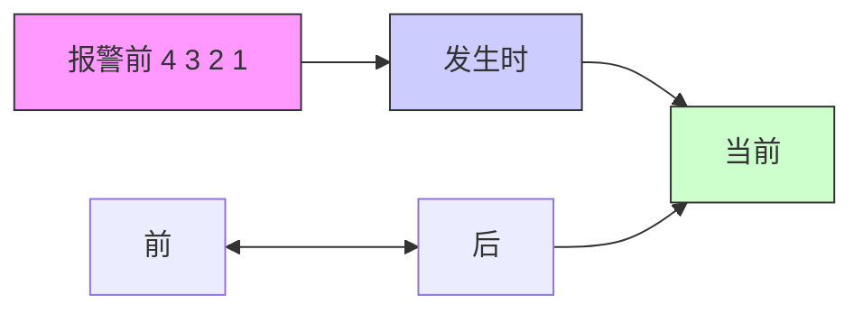
```mermaid
graph LR
  A["报警前 4 3 2 1"] --> B["发生时"]
  B --> C["当前"]
    D["前"] <--> E["后"]
  E --> C
    style A fill:#f9f,stroke:#333
    style B fill:#ccf,stroke:#333
    style C fill:#cfc,stroke:#333
```
</details>

软键 [发生时]：显示发生报警时的伺服监视器信息。

软键 [当前]：显示当前的伺服监视器信息。

软键 [ 前 ]：发生伺服 / 主轴报警，成为 “保持” 状态时，在 CNC 内部保存刚发生报警前的截止到 4 个采样前的数据。

通过按下此键，对于所保存的伺服监视器信息，切换显示当前最新报警→报警前1→报警前2→报警前3→报警前4。

软键 [ 后 ]：对于与上述一样保存的伺服监视器信息，切换显示报警前 4 → 报警前 3 → 报警前 2 → 报警前 1 → 当前最新报警。

软键 [主轴]：显示主轴监视器信息画面。

## 注释

第 4 页以后的报警前 1～4 的监视器信息不予显示。

## - 主轴监视器信息画面

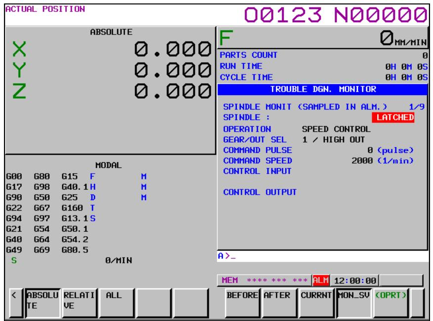

<details>
<summary>text_image</summary>

ACTUAL POSITION
00123 N00000
ABSOLUTE
X 0.000
Y 0.000
Z 0.000
F 0MM/MIN
PARTS COUNT 0
RUN TIME 0H 0M 0S
CYCLE TIME 0H 0M 0S
TROUBLE DGN. MONITOR
SPINDLE MONIT (SAMPLED IN ALM.) 1/9
SPINDLE : LATCHED
OPERATION SPEED CONTROL
GEAR/OUT SEL 1 / HIGH OUT
COMMAND PULSE 0 (pulse)
COMMAND SPEED 2000 (1/min)
CONTROL INPUT
CONTROL OUTPUT
MODAL
G00 G80 G15 F M
G17 G98 G40.1 H M
G90 G50 G25 D M
G22 G67 G160 T
G94 G97 G13.1 S
G21 G54 G50.1
G40 G64 G54.2
G49 G69 G80.5
S 0/MIN
A >_
MEM **** *** ALM 12:00:00
< ABSOLU RELAT ALL BEFORE AFTER CURRENT MON_SV (OPRT)
</details>

图1.15.4 (c) 故障诊断监视画面（主轴监视器信息）（10.4”显示器）

可以选择通过软键 [发生时] / [当前] / [前] / [后] 而显示的主轴监视器信息。

每次执行操作，切换显示软键 [发生时] 和 [当前]。

此外，软键 [前] / [后] 在按下了软键 [发生时] 时显示，按下软键 [当前] 时不会显示。

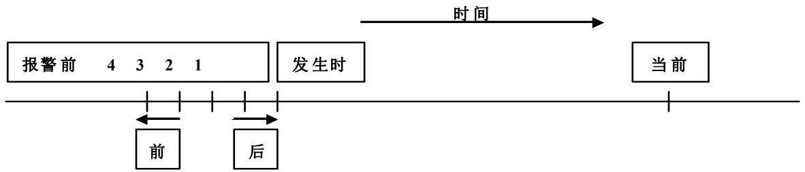

<details>
<summary>flowchart</summary>


```mermaid
graph LR
  A["报警前 4 3 2 1"] --> B["发生时"]
  B --> C["当前"]
    D["前"] <--> E["后"]
  E --> C
    style A fill:#f9f,stroke:#333
    style B fill:#ccf,stroke:#333
    style C fill:#cfc,stroke:#333
```
</details>

软键 [发生时]：显示发生报警时的主轴监视器信息。

软键 [当前]：显示当前的主轴监视器信息。

软键 [ 前 ]：发生伺服 / 主轴报警，成为 “保持” 状态时，在 CNC 内部保存刚发生报警前的截止到 4 个采样前的数据。

通过按下此键，对于所保存的主轴监视器信息，切换显示当前最新报警→报警前1→报警前2→报警前3→报警前4。

软键 [ 后 ]：对于与上述一样保存的主轴监视器信息，切换显示报警前 4 → 报警前 3 → 报警前 2 → 报警前 1 → 当前最新报警。

软键 [伺服]：显示伺服监视器信息画面。

## 注释

可通过上述操作显示的主轴监视器信息，限于从第2页至第3页的项目。

第1页和第4页以后的项目，在状态显示为“采样中”时，当前值、状态显示为“保持”时显示发生报警时的值。

## - 页面的切换

按下翻页键 ↑ PAGE 显示上一页，按下翻页键 ↓ PAGE 则显示下一页。

## - 各轴信息的切换

按下光标键←显示之前的轴信息，按下光标键→则显示后续的轴信息。

## - 发生报警时数据的保持

在状态显示为“采样中”的状态下，新发生伺服报警 / 主轴报警时，保持报警发生轴的“最新报警发生时的数据”以及“报警发生前 1～4 的数据”。

由此，监视器画面右上的状态显示的“采样中”转变为“保持”。

## 注释

发生多个轴同时发生报警时，伺服/主轴都只保持最小轴编号的轴数据。

## - 保持数据的擦除

请在所有的伺服 / 主轴报警解除后，擦除 “最新报警发生时的数据” 以及 “报警发生前 1～4 的数据”。

由此，监视器画面右上的状态显示的“保持”转变为“采样中”。

此外，同时显示在故障诊断图形画面上的图形数据（每个轴的各种数据）也将被擦除。

## 擦除保持数据的操作步骤（8.4/10.4”显示器的情形）

1 在故障诊断监视器画面 / 故障诊断图形画面 / 故障诊断参数画面的任何一个画面上，若按下软键 [(操作)]，则会切换为如下的软键显示。（下图为故障诊断监视器画面）

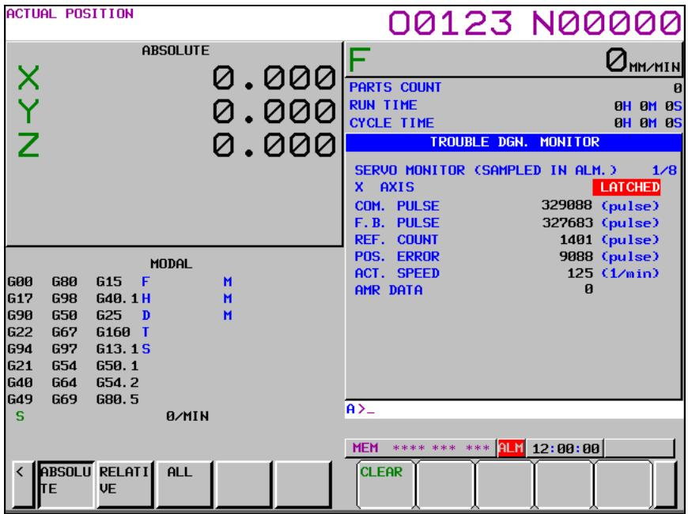

<details>
<summary>text_image</summary>

ACTUAL POSITION
O0123 N00000
ABSOLUTE
X 0.000
Y 0.000
Z 0.000
F 0 MM/MIN
PARTS COUNT 0
RUN TIME 0H 0M 0S
CYCLE TIME 0H 0M 0S
TROUBLE DGN. MONITOR
SERVO MONITOR (SAMPLED IN ALM.) 1/8
X AXIS LATCHED
COM. PULSE 329088 (pulse)
F. B. PULSE 327683 (pulse)
REF. COUNT 1401 (pulse)
POS. ERROR 9088 (pulse)
ACT. SPEED 125 (1/min)
AMR DATA 0
MODAL
G00 G80 G15 F M
G17 G98 G40.1 H M
G90 G50 G25 D M
G22 G67 G160 T
G94 G97 G13.1 S
G21 G54 G50.1
G40 G64 G54.2
G49 G69 G80.5
S 0/MIN
A >_
MEM ***** *** ALM 12:00:00
< ABSOLU RELATI ALL CLEAR
</details>

图1.15.4 (d) 故障诊断监视画面（10.4”显示器）

2 按下软键 [清除]。切换为如下的软键显示。

取消擦除操作时，按下软键 [取消]。

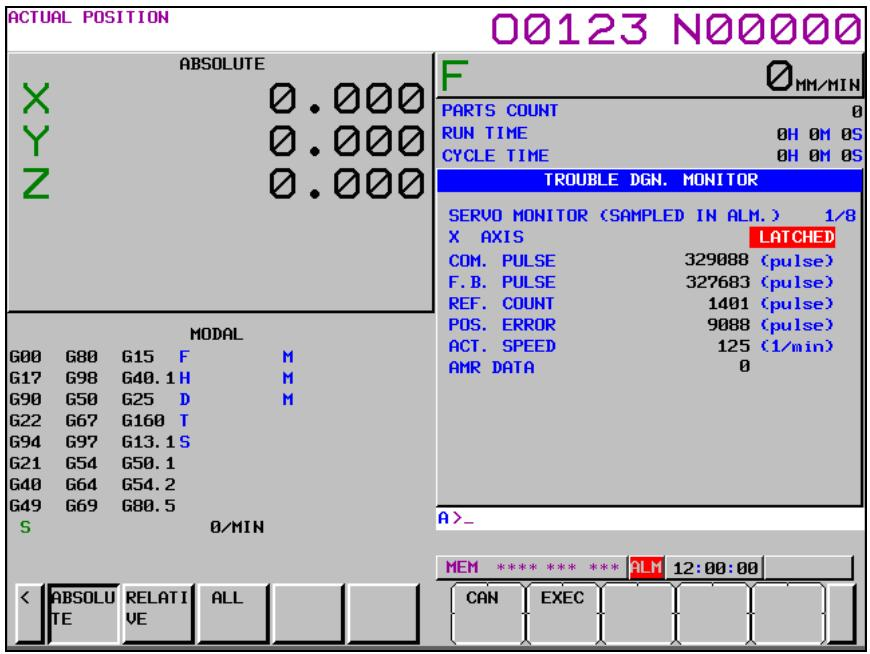

<details>
<summary>text_image</summary>

ACTUAL POSITION
O0123 N00000
ABSOLUTE
X 0.000
Y 0.000
Z 0.000
F 0 MM/MIN
PARTS COUNT 0
RUN TIME 0H 0M 0S
CYCLE TIME 0H 0M 0S
TROUBLE DGN. MONITOR
SERVO MONITOR (SAMPLED IN ALM.) 1/8
X AXIS LATCHED
COM. PULSE 329088 (pulse)
F.B. PULSE 327683 (pulse)
REF. COUNT 1401 (pulse)
POS. ERROR 9088 (pulse)
ACT. SPEED 125 (1/min)
AMR DATA 0
MODAL
G00 G80 G15 F M
G17 G98 G40.1 H M
G90 G50 G25 D M
G22 G67 G160 T
G94 G97 G13.1 S
G21 G54 G50.1
G40 G64 G54.2
G49 G69 G80.5
S 0/MIN
A >_
MEM **** *** ALM 12:00:00
< ABSOLU RELATI ALL CAN EXEC
</details>

图1.15.4 (e) 故障诊断监视画面（10.4”显示器）

3 按下软键 [执行]。

监视器画面右上的状态显示的“保持”转变为“采样中”。

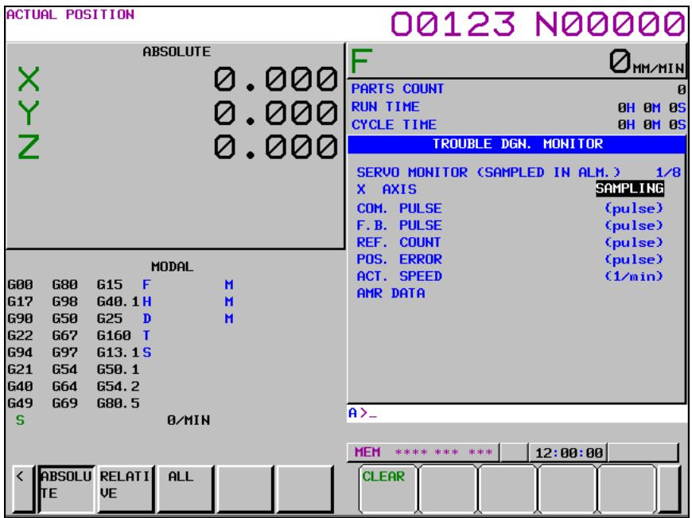

<details>
<summary>text_image</summary>

ACTUAL POSITION
00123 N00000
ABSOLUTE
X 0.000
Y 0.000
Z 0.000
F 0MM/MIN
PARTS COUNT 0
RUN TIME 0H 0M 0S
CYCLE TIME 0H 0M 0S
TROUBLE DGN. MONITOR
SERVO MONITOR (SAMPLED IN ALM.) 1/8
X AXIS SAMPLING
COM. PULSE (pulse)
F.B. PULSE (pulse)
REF. COUNT (pulse)
POS. ERROR (pulse)
ACT. SPEED (1/min)
AMR DATA
MODAL
G00 G80 G15 F M
G17 G98 G40.1 H M
G90 G50 G25 D M
G22 G67 G160 T
G94 G97 G13.1 S
G21 G54 G50.1
G40 G64 G54.2
G49 G69 G80.5
S 0/MIN
A >_
MEM **** *** 12:00:00
< ABSOLU RELATI ALL
CLEAR
</details>

图1.15.4 (f) 故障诊断监视画面（10.4”显示器）

## 擦除保持数据的操作步骤（15/19”显示器的情形）

1 在故障诊断监视器画面 / 故障诊断图形画面 / 故障诊断参数画面的任何一个画面上，显示横排软键 [清除]。  
2 按下横排软键 [清除]。

取消擦除操作时，按下横排软键 [取消]。

3 按下横排软键 [执行]。

画面右上的状态显示的“保持”转变为“采样中”。

## 1.15.5 故障诊断图形画面

## 概述

显示伺服报警 / 主轴报警发生时的诊断所需的、报警发生前的波形数据。

## 故障诊断图形画面

在画面上对报警发生前的数秒钟的伺服数据、主轴数据进行波形显示。

最多可以同时显示 4 类数据。

要显示的数据，在故障诊断参数画面上进行设定。

## 显示 1.15.5 故障诊断图形画面的步骤（8.4/10.4”显示器的情形）

## 步骤

1 按下功能键
MESSAGE。  
2 在显示软键 [W.图形] 之前，按住继续菜单键 ▶。  
3 按下软键 [W.图形]。  
4 按下软键 [G.调整]。

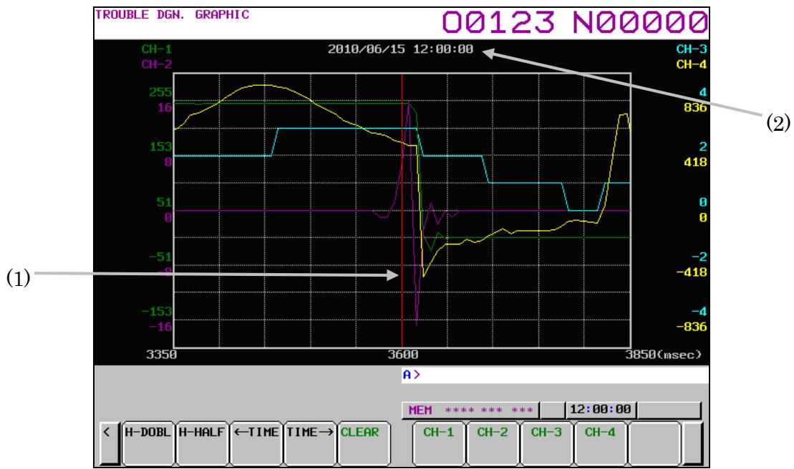

<details>
<summary>line chart</summary>

| Time (msec) | CH-1 | CH-2 | CH-3 | CH-4 |
|-------------|------|------|------|------|
| 3350        | 16   | 153  | 8    | 4    |
| 3600        | -153 | -9   | -4   | -836 |
| 3850        | 836  | 418  | 0    | 0    |
</details>

图1.15.5 (a) 故障诊断图形画面（10.4”显示器）

## - 显示内容

(1) 通过红色的竖线，显示报警发生的位置（时间）。  
(2) 显示发生报警的日期时间。

## 显示 1.15.5 故障诊断图形画面的步骤（15/19”显示器的情形）

## 步骤

1 按下功能键 [IMAGE]。  
2 直至显示竖排软键 [W.图形]，按下竖排软键 [下一页]。  
3 按下竖排软键 [W.图形]。  
4 按下竖排软键 [G.调整]。

## 操作

## - 位置和倍率的变更

若按下软键 [G.调整]，则会显示如下软键。

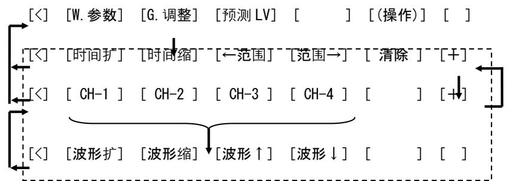

<details>
<summary>flowchart</summary>

```mermaid
graph TD
  A["<<"] --> B["[W. 参数"] [G. 调整] [预测 LV] [ ] [(操作)] [ ]
  B --> C["[<<"] [时间扩] [时间缩] [←范围] [范围→] [清除] [+]
  C --> D["[<<"] [CH-1] [CH-2] [CH-3] [CH-4] [ ] [+]]
  D --> E["[<<"] [波形扩] [波形缩] [波形↑] [波形↓] [ ] [ ]
```
</details>

[时间扩]：扩大时间轴的长度。

[时间缩]：缩小时间轴的长度。

[←范围]：向左侧移动时间轴。

[范围 $\rightarrow$ ]：向右侧移动时间轴。

[CH-1]：选择针对通道1的波形的操作。

[CH-2]：选择针对通道2的波形的操作。

[CH-3]：选择针对通道3的波形的操作。

[CH-4]：选择针对通道4的波形的操作。

[波形扩]：针对所选的波形，扩大纵轴的长度。

[波形缩]：针对所选的波形，缩小纵轴的长度。

[波形↑]：向上方向移动所选的波形。

[波形↓]：向下方向移动所选的波形。

时间轴（横轴）在通道 1～4 中共同。

可以针对每个通道变更纵轴的位置和显示倍率。

## 用于图形画面显示的参数设定

在故障诊断参数画面上显示 / 设定在故障诊断图形画面上显示的数据种类、数据单位。

## 显示故障诊断参数画面的步骤（8.4/10.4”显示器的情形）

## 步骤

1 按下功能键
MESSAGE。

2 在显示软键 [W.图形] 之前，按住继续菜单键 ▶。

3 按下软键 [W.图形]。

4 按下软键 [W.参数]。

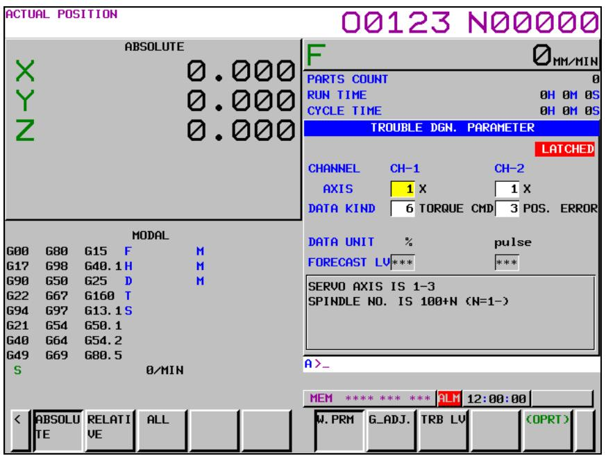

<details>
<summary>text_image</summary>

ACTUAL POSITION
00123 N00000
ABSOLUTE
X 0.000
Y 0.000
Z 0.000
F 0 MM/MIN
PARTS COUNT 0
RUN TIME 0H 0M 0S
CYCLE TIME 0H 0M 0S
TROUBLE DGN. PARAMETER
LATCHED
CHANNEL CH-1 CH-2
AXIS 1 X 1 X
DATA KIND 6 TORQUE CMD 3 POS. ERROR
MODAL
G00 G80 G15 F M
G17 G98 G40.1 H M
G90 G50 G25 D M
G22 G67 G160 T
G94 G97 G13.1 S
G21 G54 G50.1
G40 G64 G54.2
G49 G69 G80.5
S 0/MIN
DATA UNIT % pulse
FORECAST LV*** ***
SERVO AXIS IS 1-3
SPINDLE NO. IS 100+N (N=1-)
A >_
MEM ***** *** ALM 12:00:00
< ABSOLU RELAT ALL W.PRM G_ADJ. TRB LV (OPRT)
</details>

图1.15.5(b) 故障诊断参数画面（10.4”显示器）

## 显示故障诊断参数画面的步骤（15/19”显示器的情形）

## 步骤

1 按下功能键 [MESSAGE]。  
2 直至显示竖排软键 [W.图形]，按下竖排软键 [下一页]。  
3 按下竖排软键 [W.图形]。  
4 按下竖排软键 [W.参数]。

## 解释

## - 显示内容

通道:

显示波形的通道。可使用的通道数最多为 4 个通道，请从第 1 通道起来依次设定数据。

轴:

进行波形显示的轴的轴编号。可手动设定。故障诊断指南画面的诊断所需的数据有时会被自动设定。

数据种类:

进行波形显示的数据的种类。可手动设定。故障诊断指南画面的诊断所需的数据有时会被自动设定。

数据单位：

显示数据的单位。对应于数据的种类而被自动变更，无法手动设定。

预测水平:

成为输出故障预测信号的判断基准的值。可手动设定。

各设定项目的引导:

显示针对上述各设定项目的引导。

## 操作

## - 数据的设定

1 通过光标键将光标指向要设定的项目。  
2 通过数值键输入值，按下输入键 [INPUT]。

通过上述操作，即可变更如下各项目的内容。

轴:

若是伺服轴，设定控制轴编号。

譬如，若是伺服第 1 轴，则设定 “1”。

若是主轴，则设定 100 + 控制主轴编号。

譬如，若是第1主轴，则设定“101”。

## 注释

若是多路径系统，请在控制轴编号以及控制主轴编号中设定路径内的轴编号。

数据种类:

设定在数据类型的项目中的值如下所示。

表1.15.5 (a) 伺服电机的数据种类


表1.15.5 (b) 主轴电机的数据种类


## 注释

1 各数据种类，作为可同时进行波形显示的组合，按如下方式记进行分类。

- 设定值 1 \~ 1 7  
- 设定值 18、19  
- 设定值 20、21、30、31  
- 设定值 22、23、24、25、26、27、28、

32、33、34、35、36、37、38

因此，在数据种类中输入设定值时，若在其它通道的数据种类中设定相同组合以外的值，则会发出警告“数据设定错误”。

2 显示设定值 20 以上的数据种类的波形时，请设定为急停状态。  
3 电压、电流值属于大致值，其中包含误差。需要正确的值时，请使用专用的测量器直接进行测量。

## 1.15.6 故障预测水平设定画面

设定伺服电机的故障预测水平。

可设定热模拟、以及干扰负荷水平的故障水平。

## 解释

## 热模拟

根据伺服电机的实际电流，进行电机以及放大器的发热量的模拟。若此热模拟数据达到 100%，则电机或者放大器会引起过热，发出“软过热继电器(OVC)”的报警。在下列情形下会增大。

1) 加减速频度高的运行  
2) 切削负荷非常大的状态持续的运行  
3) 因机械与工件的接触等原因，电机即使发挥全扭矩，机械也不会按照指令方式运动

## 干扰负荷水平

电机的输出扭矩中，排除了为使电机以及机械惯量加减速的扭矩而得的值，表示电机从机械受到的扭矩。

在下列情形下会增大。

1) 机械与工件接触  
2) 切削负荷变大

可以通过本功能来监视这些值的增加，在机械故障和报警发生前发出警告。

## 显示故障预测水平设定画面的步骤（8.4/10.4”显示器的情形）

## 步骤

1 按下功能键 MESSAGE。  
2 在显示软键 [W.图形] 之前，按住继续菜单键 ▶。  
3 按下软键 [W.图形]。  
4 按下软键 [预测 LV]。

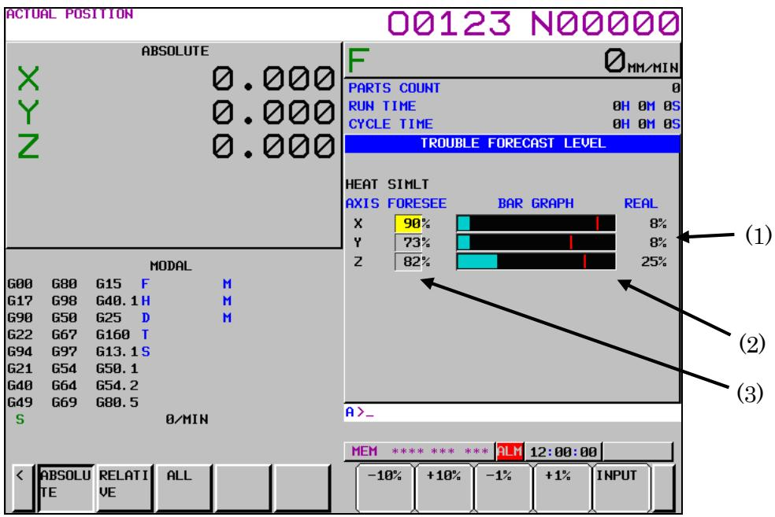

<details>
<summary>text_image</summary>

ACTUAL POSITION
00123 N00000
ABSOLUTE
X 0.000
Y 0.000
Z 0.000
F 0 MM/MIN
PARTS COUNT 0
RUN TIME 0H 0M 0S
CYCLE TIME 0H 0M 0S
TROUBLE FORECAST LEVEL
HEAT SIMLT
AXIS FORESEE BAR GRAPH REAL
X 90% 8%
Y 73% 8%
Z 82% 25%
MODAL
G00 G80 G15 F M
G17 G98 G40.1 H M
G90 G50 G25 D M
G22 G67 G160 T
G94 G97 G13.1 S
G21 G54 G50.1
G40 G64 G54.2
G49 G69 G80.5
S 0/MIN
A >_
MEM **** *** ALM 12:00:00
< ABSOLU RELAT ALL -10% +10% -1% +1% INPUT
</details>

图1.15.6 (a) 故障预测水平设定画面（10.4”显示器）

## - 显示内容

(1) 以附带符号的方式显示现在的热模拟、干扰负荷水平值。  
(2) 以 BAR 方式显示现在的热模拟、干扰负荷水平量。

淡蓝色部：表示现在的热模拟、干扰负荷水平量。

红线部：表示故障预测水平量。

(3) 显示故障预测水平值。

负数据也取绝对值，向正方向显示。

## 显示故障预测水平设定画面的步骤（15/19”显示器的情形）

## 步骤

1 按下功能键
MESSAGE。  
2 直至显示竖排软键 [W.图形]，按下竖排软键 [下一页]。  
3 按下竖排软键 [W.图形]。  
4 按下竖排软键 [预测 LV]。

## 操作

## - 故障预测水平的设定

1 选择同希望通过翻页键 / 设定的项目（热模拟或者干扰负荷水平）。  
2 选择希望通过光标键 / 进行设定的轴。  
3 通过数值键输入值后，按下输入键 [NPUT] 或者软键 [输入]，预测水平即被输入。

所输入的故障预测水平，被设定在参数 No.8860、No.8861 中。

## - 故障预测水平的变更

若按下软键 [预测 LV]，则会显示如下软键。

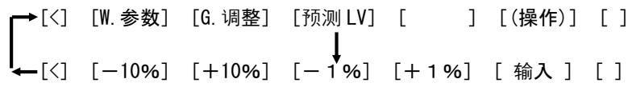

<details>
<summary>text_image</summary>

[<] [W. 参数] [G. 调整] [预测 LV] [ ] [(操作)] [ ]
[<] [-10%] [+10%] [-1%] [+1%] [输入] [ ]
</details>

$[-10\%]$ ：设预测水平为 $-10\%$ 。

$[+10\%]$ ：设预测水平为 $+10\%$ 。

$[-1\%]$ ：设预测水平为 $-1\%$ 。

$[+10\%]$ ：设预测水平为 $+1\%$ 。

[输入]：在预测水平中输入基于数值键的值。

## - 故障预测信号

伺服轴的热模拟数据或者干扰负荷水平值大于故障预测水平时，输出故障预测信号 TDSML1～8<Fn298>或者 TDFTR1～8<Fn299>。

是否进行故障预告，则通过参数 TRSx(No.8855#0)、TRFx(No.8855#1) 来设定。

## - 故障诊断参数画面上的故障预测水平的设定

也可以在故障诊断参数画面进行故障预测水平的设定。

1 显示故障诊断参数画面。  
2 通过光标键将光标指向要设定的项目。  
3 在伺服轴中设定轴。  
4 在热模拟(7)、或者干扰负荷水平(9)中设定数据种类。  
5 “预测水平”旁的编辑框可以进行编辑，因而输入希望在该轴设定的故障预测水平。

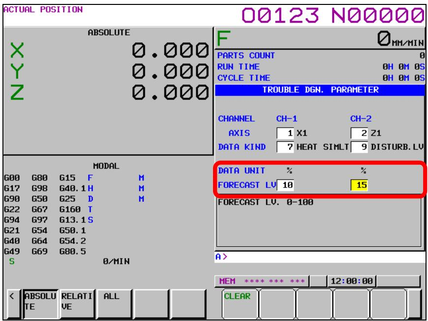

<details>
<summary>text_image</summary>

ACTUAL POSITION
00123 N00000
ABSOLUTE
X 0.000
Y 0.000
Z 0.000
F
MM/MIN
PARTS COUNT 0
RUN TIME 0H 0M 0S
CYCLE TIME 0H 0M 0S
TROUBLE DGN. PARAMETER
CHANNEL CH-1 CH-2
AXIS 1 X1 2 Z1
DATA KIND 7 HEAT SIMLT 9 DISTURB.LV
MODAL
G00 G80 G15 F M
G17 G98 G40.1 H M
G90 G50 G25 D M
G22 G67 G160 T
G94 G97 G13.1 S
G21 G54 G50.1
G40 G64 G54.2
G49 G69 G80.5
S 0/MIN
DATA UNIT %
FORECAST LV 10 15
FORECAST LV. 0-100
A >
MEM **** *** *** 12:00:00
< ABSOLU RELATI ALL CLEAR
</details>

图1.15.6 (b) 故障诊断参数画面上的故障预测水平的设定

## 1.15.7 参数


<details>
<summary>text_image</summary>

8850
#7 #6 #5 #4 #3 #2 #1 #0
MDG
</details>

[输入类型] 参数输入

[数据类型] 位型

#0 MDG 使故障诊断功能

0: 有效。

1: 无效。

注释

在设定完此参数后，需要暂时切断电源。


### PMC报警: 
- **故障内容**: #7
- **处理办法**: #6

### PMC报警: 8855
- **故障内容**: 
- **处理办法**: 


[输入类型] 参数输入

[数据类型] 位轴型

#0 TRSx 是否进行故障诊断功能下的伺服轴的热模拟数据的故障预测

0: 不予进行。

1: 予以进行。（请在参数 No.8860 中设定预测水平。）

#1 TRFx 是否进行故障诊断功能下的伺服轴的干扰负荷水平值的故障预测

0: 不予进行。

1: 予以进行。（请在参数 No.8861 中设定预测水平。）

8860

热模拟数据的故障预测水平

[输入类型] 参数输入

[数据类型] 字轴型

[数据单位] %

[数据范围] 0 \~ 100

设定故障诊断功能下的伺服轴的热模拟数据的故障预测水平。

8861

干扰负荷水平值的故障预测水平

[输入类型] 参数输入

[数据类型] 字轴型

[数据单位] %

[数据范围] 0 \~ 100

设定故障诊断功能下的伺服轴的干扰负荷水平值的故障预测水平。

## 1.15.8 信号

## 热模拟数据故障预测信号 TDSML1\~TDSML8<Fn298>

[分类] 输出信号

[功能] 通知热模拟数据已经超过故障预测水平的情况。

[输出条件] 伺服的热模拟数据大于故障预测水平的值期间，该信号被设定为"1"。

## 干扰负荷水平值故障预测信号 TDFTR1\~TDFTR8<Fn299>

[分类] 输出信号

[功能] 通过干扰负荷水平值已经超过故障预测水平的情况。

[输出条件] 伺服的干扰负荷水平值大于故障预测水平的值期间，该信号被设定为"1"。

信号地址


### PMC报警: 
- **故障内容**: #7
- **处理办法**: #6

### PMC报警: Fn298
- **故障内容**: TDSML8
- **处理办法**: TDSML7

### PMC报警: 
- **故障内容**: #7
- **处理办法**: #6

### PMC报警: Fn299
- **故障内容**: TDFTR8
- **处理办法**: TDFTR7


## 1.15.9 限制事项

## - 关于 I/O Link $\beta i$ 放大器的使用

对于在基于 I/O Link $\beta i$ 放大器的电机上发生的报警，无法进行故障诊断。

## - 关于与波形诊断功能的并用

通过波形诊断功能对伺服 / 主轴相关的数据、以及机械信号进行追踪时，不执行故障诊断图形画面上显示的波形数据的采样。

## - 关于 NC GUIDE / NC GUIDE PRO

NC GUIDE / NC GUIDE PRO 中没有本功能。

## 1.16 机械报警诊断

## 1.16.1 概述

机床上发生刀具的破损或冷却液不足时等机械固有的问题时，需要通过报警显示和警告信息通知操作员。

外部报警、宏报警、操作信息功能等，可以通过机床制造商进自定义而显示这样的机械固有报警和信息。

本功能中，对于此机床制造商进行自定义的报警和信息，可以追加用来进一步确定要因的诊断信息。追加的诊断信息在发生机械固有的报警等时，在故障诊断功能的引导画面上进行显示而可以将其用来确定报警的原因。

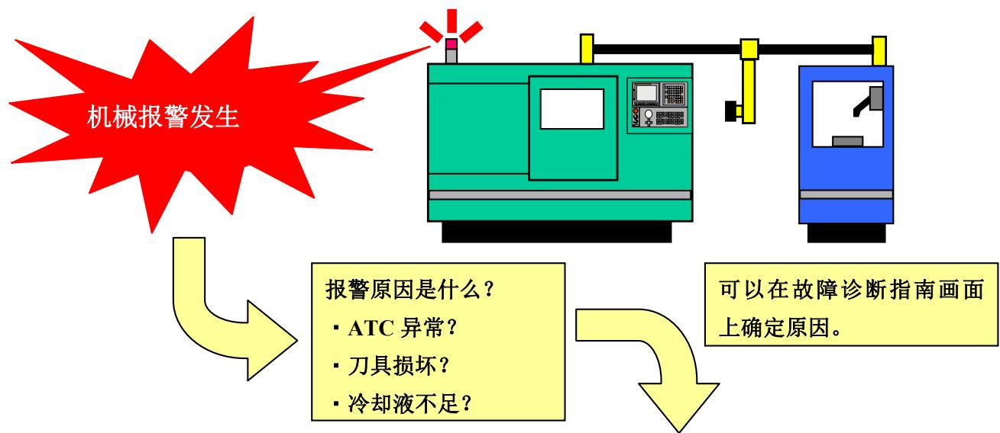

<details>
<summary>flowchart</summary>

```mermaid
graph TD
  A["机械报警发生"] --> B["报警原因是什么？"]
  B --> C["ATC异常？"]
  B --> D["刀具损坏？"]
  B --> E["冷却液不足？"]
  C --> F["可以在故障诊断指南画面上确定原因。"]
  D --> F
  E --> F
```
</details>

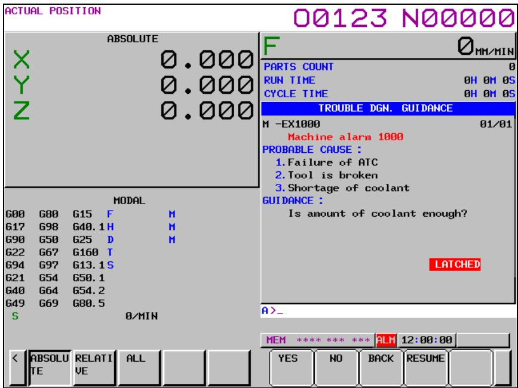

<details>
<summary>text_image</summary>

ACTUAL POSITION
00123 N00000
ABSOLUTE
X 0.000
Y 0.000
Z 0.000
F 0 MM/MIN
PARTS COUNT 0
RUN TIME 0H 0M 0S
CYCLE TIME 0H 0M 0S
TROUBLE DGN. GUIDANCE
M -EX1000 01/01
Machine alarm 1000
PROBABLE CAUSE :
1.Failure of ATC
2.Tool is broken
3.Shortage of coolant
GUIDANCE :
Is amount of coolant enough?
LATCHED
MODAL
G00 G80 G15 F M
G17 G98 G40.1 H M
G90 G50 G25 D M
G22 G67 G160 T
G94 G97 G13.1 S
G21 G54 G50.1
G40 G64 G54.2
G49 G69 G80.5
S 0/MIN
A >_
MEM **** *** ALM 12:00:00
< ABSOLU RELAT ALL YES NO BACK RESUME
</details>

图1.16.1 (a) 故障诊断指南画面（10.4inch）

要追加诊断信息，使用电脑工具 “Guidance Table for Machine Alarm Diagnosis”（机械报警诊断用引导表），创建在画面显示的诊断信息数据，并将该数据转换成存储卡格式的文件。

若将该文件加载到 CNC 中，就可以在画面上显示已追加的诊断信息。

## 1.16.2 可追加的报警和操作信息的种类

可追加到故障诊断信息中的机械侧的报警和操作信息如下所示。

## 1. 外部报警

## 2. 宏报警

## 3. 外部操作信息

## 1.16.3 可诊断的编号

机械侧的报警和操作信息中，可在故障诊断指南画面上诊断的报警编号和信息编号如下所示。

## 1. 外部报警

表1.16.3 (a) 可诊断的报警编号（外部报警）


### PMC报警: 报警编号
- **故障内容**: 1000~1999
- **处理办法**: 0~4095


## 2. 宏报警

表1.16.3 (b) 可诊断的报警编号（宏报警）


### PMC报警: 报警编号
- **故障内容**: 3000~3200
- **处理办法**: 0~4095


## 3. 外部操作信息

表1.16.3 (c) 可诊断的信息编号（外部操作信息）


### PMC报警: 信息编号
- **故障内容**: 2000~2999
- **处理办法**: 0~4095


## 注释

1 外部操作信息中可诊断的信息编号，取决于参数 No.6310 的设定。  
2 上述可诊断的编号处于CNC画面上所显示的编号范围内，与各功能中实际设定的编号不同。有关各功能中实际设定的编号，请参阅如下说明书。  
- 外部报警 / 外部操作信息  
PMC PROGRAMMING MANUAL（PMC 编程说明书）(B-64513EN) “INSTRUCTIONS RELATED TO CNC FUNCTIONS”（CNC 功能相关的指令）  
- 宏报警  
操作说明书（车床系统/加工中心系统通用）(B-64604CM)“用户宏程序”

## 1.16.4 创建故障诊断信息所需的环境

要创建在故障诊断指南画面上显示的故障诊断信息，需要如下的动作环境以及电脑工具 “Guidance Table for Machine Alarm Diagnosis”。

准备在如下规格中动作的电脑，按照下一章所述的步骤安装此工具。

## - 动作环境


※ Microsoft、Windows、Windows Vista、以及 Excel 是美国微软公司的注册商标。

## 注释

“Guidance Table for Machine Alarm Diagnosis”不包含在机械报警诊断功能的选项中。

请另行购买 “CNC Application Development Kit” （CNC 应用软件开发组件）(A08B-9010-J555#ZZ12)。

## 1.16.5 Guidance Table for Machine Alarm Diagnosis

创建在故障诊断指南画面上显示的故障诊断信息时，使用本工具。请按照如下步骤，将本工具安装到电脑中，创建故障诊断信息。

## 1.16.5.1 安装步骤

本工具的安装步骤如下所示。

1 启动安装用磁盘（A08B-9010-J555#ZZ12）内的 SETUP.EXE。  
2 在如下的设置对话框中指定安装目的地的文件夹，按下<Next>按钮。

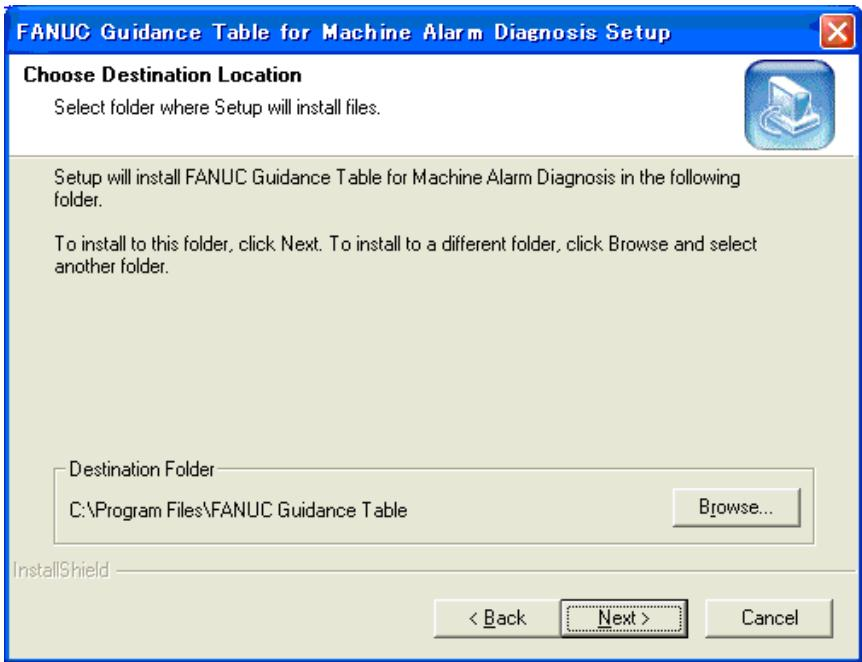

<details>
<summary>text_image</summary>

FANUC Guidance Table for Machine Alarm Diagnosis Setup
Choose Destination Location
Select folder where Setup will install files.
Setup will install FANUC Guidance Table for Machine Alarm Diagnosis in the following folder.
To install to this folder, click Next. To install to a different folder, click Browse and select another folder.
Destination Folder
C:\Program Files\FANUC Guidance Table
Browse...
InstallShield
< Back	Next >	Cancel
</details>

图1.16.5.1 (a)

## 注释

若按下<Browse>按钮，可以变更安装目的地。

3 若在安装的确认对话框中按下<Next>按钮，就会开始安装。  
4 安装正常结束后，显示通知安装完成的信息框，在开始菜单中追加 “FANUC Guidance Table”。

## 1.16.5.2 卸载步骤

本工具的卸载步骤如下所示。

1 打开控制面板。  
2 打开 [添加或删除程序]，从现在已被安装的程序中，选择 “FANUC Guidance Table for Machine Alarm Diagnosis”。

## 注释

Windows Vista 时，打开 [程序的卸载]。

3 按下<删除（或卸载）>按钮，显示请求卸载确认的信息框。若按下<确定>按钮，本工具即被卸载。

## 1.16.5.3 创建故障诊断信息输入文件

输入故障诊断信息的 Excel 文件，按如下所示方式予以创建。

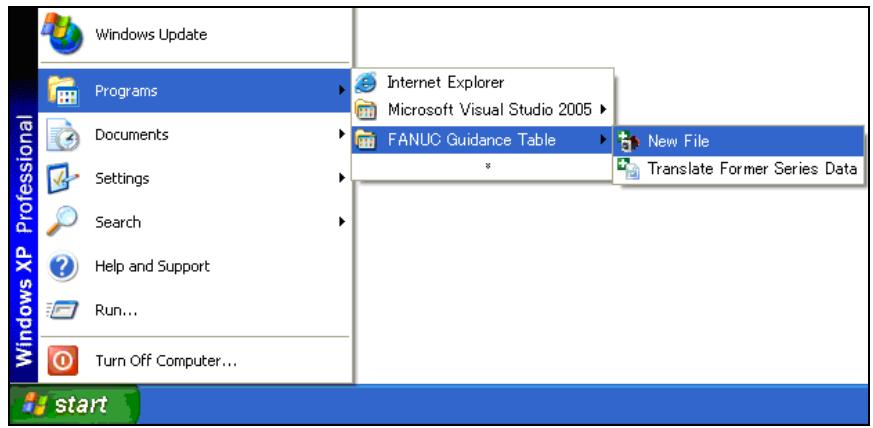

<details>
<summary>text_image</summary>

Windows Update
Programs
Documents
Settings
Search
Help and Support
Run...
Turn Off Computer...
Internet Explorer
Microsoft Visual Studio 2005
FANUC Guidance Table
New File
*
Translate Former Series Data
start
</details>

图1.16.5.3 (a)

1 选择 [开始菜单] → [程序(P)] → [FANUC Guidance Table] → [New File] （新建）。显示新建文件的对话框。

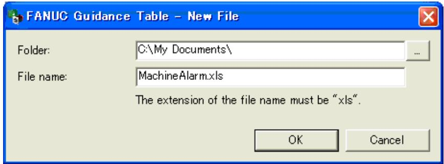

<details>
<summary>text_image</summary>

FANUC Guidance Table - New File
Folder: C:\My Documents\
File name: MachineAlarm.xls
The extension of the file name must be "xls".
OK Cancel
</details>

图1.16.5.3 (b)

2 在如下的对话框中，输入 Excel 文件的创建目的地文件夹名、和要创建的 Excel 文件的名称。

## 注释

1 文件名的扩展名固定为 xls（Excel 工作簿格式）。即使输入 xls 以外的扩展也将被忽略，转换为 xls。  
2 文件创建失败时，“A trouble diagnosis message file cannot be made.”(未能创建故障诊断信息文件。)的信息框将会随同如下的失败原因一起被显示。  
- The specified file name is not correct. (指定的文件名非法。)  
- The specified file has already existed. (指定的文件已存在。)  
- (创建目的地文件夹) is not found. (（创建目的地文件夹）找不到。)  
- Files in (创建目的地文件夹) cannot be written. (（创建目的地文件夹）的文件被设定为只读。)  
- The disk space in (创建目的地文件夹) is not enough to make a new file. (创建目的地文件夹) 的磁盘的可用空间不足。)

3 点击 [OK] 按钮。在指定的文件夹中，以所指定的文件名创建 Excel 文件。

若以 Excel 打开已创建的文件，就可以输入故障诊断信息。

## 1.16.5.4 故障诊断信息输入文件的构成

在输入故障诊断信息的 Excel 文件中，提供有两张表。

- [Overall] (整体) 表 · · · · · 进行整体的操作以及设定的表  
- [Guidance] (引导) 表 · · · 输入信息字符串的表


<details>
<summary>text_image</summary>

14
15
Overall Guidance
Ready 100% -
</details>

图1.16.5.4 (a)

## - 关于 [Overall] 表的构成

[Overall] 表中，可通过下图(1)～(3)的操作按钮，创建故障诊断信息。此外，还可以进行表内的显示语言（日/英）的变更、和各国语言的设定。

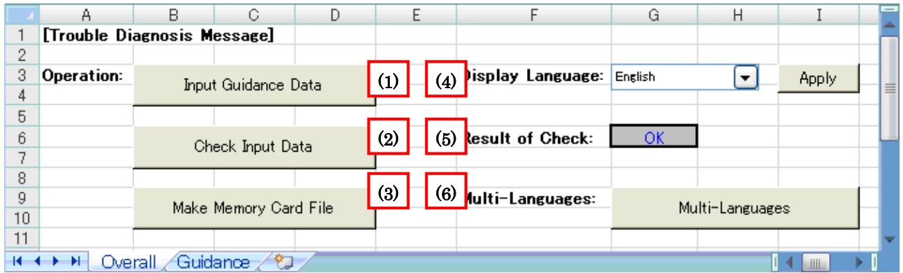

<details>
<summary>text_image</summary>

[Trouble Diagnosis Message]
Operation: Input Guidance Data (1) (4) Display Language: English Apply
Check Input Data (2) (5) Result of Check: OK
Make Memory Card File (3) (6) Multi-Languages: Multi-Languages
</details>

图1.16.5.4 (b)

- 各项目的概要


### PMC报警: 项目
- **故障内容**: 项目名
- **处理办法**: 说明

### PMC报警: (1)
- **故障内容**: Input Guidance Data(输入引导数据)
- **处理办法**: 显示用来输入故障诊断信息的[Guidance]表。

### PMC报警: (2)
- **故障内容**: Check Input Data(检查输入数据)
- **处理办法**: 对于数值的范围和无法使用的字符等、输入[Guidance]表中的所有数据进行检查。

### PMC报警: (3)
- **故障内容**: Make Memory Card File(创建存储卡文件)
- **处理办法**: 根据输入到[Guidance]表中的数据,创建可读入到CNC中存储卡格式的文件。

### PMC报警: (4)
- **故障内容**: Display Language(显示语言)
- **处理办法**: 若在列表框中选择语言按下Apply(变更)按钮,则可以变更在表内的显示语言。可选择日文或者英文。

### PMC报警: (5)
- **故障内容**: Result of Check(检查结果)
- **处理办法**: 显示输入数据的检查结果。

### PMC报警: (6)
- **故障内容**: Multi-Languages(各国语言)
- **处理办法**: 进行用来输入多种语言信息的设定。


## - 关于 [Guidance] 表的构成

在 [Guidance] 表中，输入个别的报警或者操作信息的编号和信息。

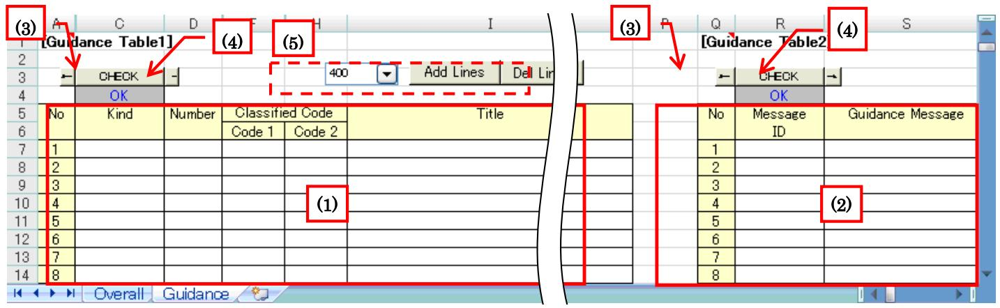

<details>
<summary>text_image</summary>

(3)
[Guidance Table1]
(4)
(5)
No
Kind
Number
Classified Code
Title
Code 1
Code 2
(1)
(3)
[Guidance Table2]
(4)
No
Message
ID
Guidance Message
1
2
3
4
5
6
7
8
(2)
</details>

图1.16.5.4 (c)

## - 各项目的概要


### PMC报警: 项目
- **故障内容**: 项目名
- **处理办法**: 说明

### PMC报警: (1)
- **故障内容**: Guidance Table1(引导表1)
- **处理办法**: 用来输入报警或者操作信息的编号和标题的表。

### PMC报警: (2)
- **故障内容**: Guidance Table2(引导表2)
- **处理办法**: 用来输入针对报警或者操作信息的操作员的提问和指示的表。

### PMC报警: (3)
- **故障内容**: 页面移动
- **处理办法**: 在 Guidance Table1, 2 之间切换显示。

### PMC报警: (4)
- **故障内容**: 检查输入数据
- **处理办法**: 检查各引导表内的输入数据。

### PMC报警: (5)
- **故障内容**: 行数设定
- **处理办法**: 限于组合框中指定的行数,在 Guidance Table1 或者 2 的表的末尾追加行,或者从末尾删除行。另外,引导表的全部行数,最小为 30 行,最大为 2000 行。


## 1.16.6 创建故障诊断信息

故障诊断信息，按照顺序操作 [Overall] 表中的下图(1)～(3)的操作按钮并进行创建。创建步骤的概要如下所示。

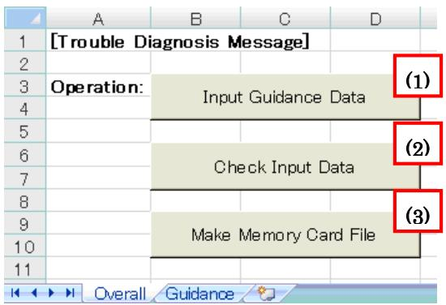

<details>
<summary>text_image</summary>

[Trouble Diagnosis Message]
Operation:
Input Guidance Data
Check Input Data
Make Memory Card File
</details>

图1.16.6 (a)

(1) 引导数据输入  
显示用来输入故障诊断信息的数据的 [Guidance] 表。

(2) 输入数据检查

检查输入到 [Guidance] 表中的引导数据。

## (3) 创建存储卡文件

根据输入到 [Guidance] 表中的引导数据创建存储卡格式的文件。

下面说明各操作的详情。

## 1.16.6.1 输入引导数据

若点击 [Overall] 表的 [Input Guidance Data] 按钮，则会显示 [Guidance] 表。

按照下一页以后的说明，在 Guidance Table1 和 Guidance Table2 中输入数据。

输入到各引导表中的数据，如下图所示显示在故障诊断指南画面中。

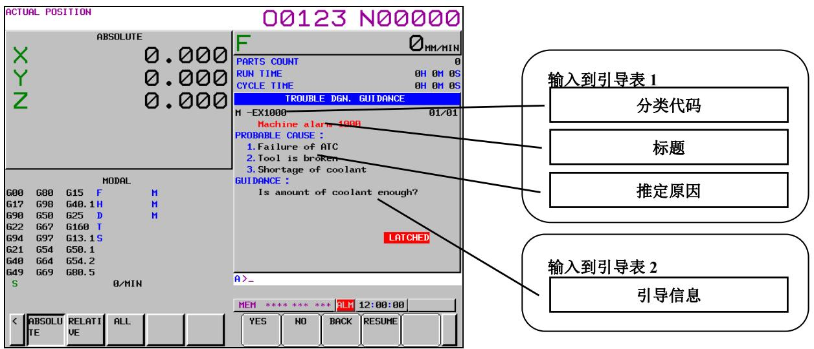

<details>
<summary>text_image</summary>

ACTUAL POSITION
00123 N00000
ABSOLUTE
X 0.0000
Y 0.0000
Z 0.0000
F 0 MM/MIN
PARTS COUNT 0
RUN TIME 0H 0M 0S
CYCLE TIME 0H 0M 0S
TROUBLE DGN, GUIDANCE
M -EX1000 01/01
Machine alarm 1999
PROBABLE CAUSE :
1.Failure of ATC
2.Tool is broken
3.Shortage of coolant
GUIDANCE :
Is amount of coolant enough?
LATCHED
G80 G80 G15 F M
G17 G98 G40.1 H M
G90 G50 G25 D M
G22 G67 G160 T
G94 G97 G13.1 S
G21 G54 G50.1
G40 G64 G54.2
G49 G69 G80.5
S 0/MIN
A >_
MEM **** *** *** ALH 12:00:00
< ABSOLU TE RELATI VE ALL YES NO BACK RESUME 输入到引导表1
分类代码
标题
推定原因
输入到引导表2
引导信息
</details>

图1.16.6.1 (a)

表1.16.6.1 (a) 故障诊断指南画面的显示项目


## 注释

各显示项目中可指定的字符，只限于可在CNC画面显示的字符。详情请参阅如下说明书。操作说明书（车床系统/加工中心系统通用）(B-64604CM)“附录G字符-代码对应表”

## - 关于 Guidance Table1 的输入内容


### PMC报警: No
- **故障内容**: Kind
- **处理办法**: Number

### PMC报警: Code 1
- **故障内容**: Code 2
- **处理办法**: First Line

### PMC报警: 1
- **故障内容**: 
- **处理办法**: 

### PMC报警: 2
- **故障内容**: (1)
- **处理办法**: 

### PMC报警: 3
- **故障内容**: 
- **处理办法**: 


表1.16.6.1 (b) Guidance Table 1 各项目的说明


### PMC报警: 項目
- **故障内容**: 說明
- **处理办法**: 入力内容

### PMC报警: (1)
- **故障内容**: Kind(类别)
- **处理办法**: 输入针对报警或者操作信息的类别。可以指定如下字符。EX:外部报警MC:宏报警OP:外部操作信息注释若输入上述以外的类别,则在输入数据检查时会出错。

### PMC报警: (2)
- **故障内容**: Number(编号)
- **处理办法**: 输入外部报警、宏报警、或者操作信息的编号。

### PMC报警: (3)
- **故障内容**: Classified Code(分类代码)
- **处理办法**: 输入“Code 1”(代码1)以及“Code 2”(代码2)的2种代码。在故障诊断指南画面的第1行,显示“代码1-代码2”。

### PMC报警: Code 1
- **故障内容**: 输入报警或者操作信息的区分。
- **处理办法**: 半角2个字符(全角1个字符)以内

### PMC报警: Code 2
- **故障内容**: 输入报警或者操作信息的编号。
- **处理办法**: 半角16个字符(全角8个字符)以内

### PMC报警: (4)
- **故障内容**: Title(标题)
- **处理办法**: 输入在故障诊断指南画面的第2行显示的字符串。

### PMC报警: (5)
- **故障内容**: Probable Cause(推定原因)
- **处理办法**: 输入在故障诊断指南画面的推定原因部显示的字符串。

### PMC报警: (6)
- **故障内容**: Message ID(信息ID)
- **处理办法**: 输入在报警或者操作信息发生后,最初在引导部显示的引导信息的信息ID。例 针对外部报警1000号的开头的信息ID:EX1000A注释有关信息ID,请参阅下一项“关于Guidance Table2的输入内容”的说明。

### PMC报警: (7)
- **故障内容**: Additional Infomation (Reserved)(附加信息)(保留)
- **处理办法**: 请勿使用本项。


## - 关于 Guidance Table2 的输入内容


### PMC报警: No
- **故障内容**: Message ID
- **处理办法**: Guidance Message

### PMC报警: 1
- **故障内容**: 
- **处理办法**: 

### PMC报警: 2
- **故障内容**: (1)
- **处理办法**: (2)

### PMC报警: 3
- **故障内容**: 
- **处理办法**: 


表1.16.6.1 (c) Guidance Table2 各项目的说明


### PMC报警: 項目
- **故障内容**: 說明
- **处理办法**: 入力内容

### PMC报警: (1)
- **故障内容**: Message ID(信息ID)
- **处理办法**: 用来识别2的引导信息的字符串。例1. 针对外部报警1000号的开头的信息ID: EX1000A例2. 针对外部报警1000号的第二个信息ID: EX1000B注释以“M”+“数值”开始的字符串,作为信息ID使用,该信息ID表示从NC报警用的引导表向着机械侧的引导表2的跳转目的地,因而请勿使用以“M”+“数值”开始的字符串。

### PMC报警: (2)
- **故障内容**: Guidance Message(引导信息)
- **处理办法**: 故障诊断指南画面的“引导”部分显示的信息。记述针对操作员的提问和对应办法。注释引导信息显示在故障诊断指南画面上时,针对每半角32个字符(全角16个字符)自动换行。希望在任意的位置换行时,请输入"\n"。\n"不作为字符计数。此外,信息的行数,包括自动换行在内,应在4行以内。

### PMC报警: (3)
- **故障内容**: Next Message ID(后续信息ID)
- **处理办法**: 输入针对各引导信息的提问,在按下软键[是的]或者[无]时的跳过目的地的信息ID。什么也没有(无跳过目的地)时,请输入"-1"。

### PMC报警: (4)
- **故障内容**: Notes(备注)
- **处理办法**: 使用于评注等的填写。


## 1.16.6.2 检查输入数据

若点击 [Overall] 表的 [Check Input Data] 按钮，则会对于 [Guidance] 表内的所有输入数据，就数值的范围、字符数、无法使用的字符、信息的行数进行检查。


<details>
<summary>flowchart</summary>

```mermaid
graph LR
  A["Result of Check: Unchecked"] --> B["OK"]
```
</details>

检查完成后，[Overall] 表的 [Result of Check] 的字符串从 “Unchecked”（未检查）转变为 “OK”（检查完毕）。

注释
若在成为 “OK” 之后，编辑 [Guidance] 表，则返回 “Unchecked”。

发生错误时，按如下所示方式，检查结果的字符串转变为 “NG”（错误），检查结果下的单元格中显示发生错误的表和引导表的名称。

Result of Check: NG
Guidance - [Guidance Table1]

若点击引导表的名称，则会显示发生了错误的引导表。

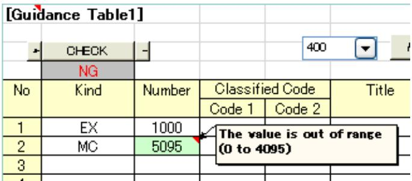

<details>
<summary>text_image</summary>

[Guidance Table1]
CHECK
NG
No	Kind	Number	Classified Code	Title
Code 1	Code 2
1	EX	1000	The value is out of range
2	MC	5095	(0 to 4095)
</details>

图1.16.6.2 (a)

在引导表内，发生了错误的单元格的颜色转变为绿色，如上图所示，错误信息被作为单元格的评注而附加。此错误信息的一览如下所示。

- Input a number.(请输入数值。)  
- The value is out of range (n to m).(范围外的值(n\~m)。)  
- Input a string within n characters (m in multi-bytes characters).(请在半角 n 个字符(全角 m 个字符)以内输入。)  
- The line number is over limit n.(行数超过了 n 行。)  
- The message referenced by the ID is not found.(没有参照中的信息 ID。)  
- The kind(s) cannot be specified.(无法指定的类别。)

※m, n 表示数字，s 表示字符串

## 注释

1 通过点击各引导表上显示的 [CHECK] 按钮，即可针对每张引导表进行输入数据的检查。这种情况下，如下图所示，在 [CHECK] 按钮下的单元格中显示检查的结果。


<details>
<summary>text_image</summary>

CHECK
Unchecked
o Kind Nu
→
CHECK
OK
o Kind Nu
</details>

2 多张引导表中发生了错误时，在 [Overall] 表的 [Result of Check] 中，显示最初发生错误的引导表的名称。各引导表的检查结果，请通过 [CHECK] 按钮下的显示进行确认。

此外，在信息 ID 中输入了表示从 NC 报警用的引导表向着机械侧的 Guidance Table 2 的跳转目的地的字符串时，单元格的颜色成为淡蓝色。

例）


## 1.16.6.3 创建存储卡文件

若点击 [Overall] 表的 [Make Memory Card File] 按钮，则会显示如下对话框。


<details>
<summary>text_image</summary>

FANUC Guidance Table - Make Memory Card File
Destination folder: C:\My Documents
File name: GUI_USR.MEM
OK Cancel
</details>

图1.16.6.3 (a)

请按照如下的步骤，创建可读入到 CNC 的存储卡格式的文件。

1 [Destination folder]（创建目的地文件夹）中指定文件创建目的地的文件夹名。

2 在 [File name] （文件名）中指定要创建的文件名称。

默认情况下已指定 “GUI USR.MEM”。

文件名中没有指定扩展名时，在文件名自动追加扩展名"MEM"。

3 点击 [OK] 按钮。

存储卡格式的文件创建结束后，显示 “Making the memory card format file is completed.” (存储卡格式的文件已被创建。) 的信息框。

## 注释

1 可指定的文件名只限于半角英文数字的短文件名（MS-DOS 8.3 格式）。

除此以外的文件名下，无法读入到 CNC 中。

2 创建目的地文件夹中有与指定的文件名同名的文件时，文件始终被覆盖。  
3 存储卡格式的文件创建失败时，显示 “The memory card format file cannot be made.” (存储卡格式的文件未能创建。) 的信息框将会随同如下的失败原因一起被显示。

- The input data have not been checked on (表名) – Guidance Table (1 或者 2) ((表名) - 引导表 (1 或者 2) 的输入数据尚未被检查。)  
- There are error(s) of the input data on (表名) – Guidance Table (1 或者 2)（（表名） - 引导表（1 或者 2）的输入数据有错。）  
- The specified file name is not correct. (所指定的文件名非法。)  
- (创建目的地文件夹) is not found.（（创建目的地文件夹）找不到。）  
- Files in (创建目的地文件夹) cannot be written.（（创建目的地文件夹）的文件被设定为只读。）  
- The disk space in (创建目的地文件夹) is not enough to make a new file.（（创建目的地文件夹）的磁盘的可用空间不足。）

若使用 CNC 的 BOOT 功能项 CNC 加载已创建的文件，则在外部报警、宏报警或者操作信息发生时，可以在故障诊断指南画面上显示该故障诊断信息。

## 注释

有关 CNC 的 BOOT 功能，请参阅 “附录 C. 引导系统”。

## 1.16.6.4 从CNC报警用引导表向机械侧引导表转移

在基于 CNC 具有的 NC 报警用引导表的诊断之后下出的结论是 “机械侧需要诊断” 时，调用以 “M” + “数值” 开始的字符串所表示的信息 ID，向着基于机械侧的引导表的诊断。

若创建针对下表所示信息 ID 的引导信息，则可在 NC 侧的诊断后，向着基于 MTB 所创建的故障诊断信息的诊断转移。

表1.16.6.4 (a) 预留出来的信息 ID


### PMC报警: 项
- **故障内容**: 信息 ID
- **处理办法**: 标题

### PMC报警: 1
- **故障内容**: M205
- **处理办法**: 刚性攻丝方式 DI 信号 关闭

### PMC报警: 2
- **故障内容**: M409
- **处理办法**: 检测的转矩异常

### PMC报警: 3
- **故障内容**: M410
- **处理办法**: 停止时误差太大

### PMC报警: 4
- **故障内容**: M411
- **处理办法**: 移动时误差太大

### PMC报警: 5
- **故障内容**: M420
- **处理办法**: 同步转矩差太大

### PMC报警: 6
- **故障内容**: M421
- **处理办法**: 超差 (半闭环)

### PMC报警: 7
- **故障内容**: M436
- **处理办法**: 软过热继电器(OVC)


## 注释

上述以外的以“M”+“数值”开始的基于字符串的信息 ID 无法使用。

## 1.16.7 创建各国语言信息

要根据 CNC 的显示语言，改变在故障诊断指南画面上显示的信息的语言，需要针对每种显示语言输入信息，并创建存储卡格式的文件。

每种显示语言的信息输入，在各国语言信息用的表上进行。

## 注释

输入到 [Guidance] 表的信息的语言，作为“英文”处理。

需要英文以外的语言时，请按照下一章的步骤，创建各国语言信息。

## 1.16.7.1 创建各国语言信息用表

按照如下所示的方式创建各国语言信息用的表。


<details>
<summary>text_image</summary>

FANUC Guidance Table - Multi-Languages
Make sheet:
English
Japanese
German
French
Spanish
Italian
Traditional Chinese
Simplified Chinese
Korean
Portuguese
Dutch
Danish
Swedish
Hungarian
Czech
Polish
Russian
Turkish
Output file:
English
Japanese
German
French
Spanish
Italian
Traditional Chinese
Simplified Chinese
Korean
Portuguese
Dutch
Danish
Swedish
Hungarian
Czech
Polish
Russian
Turkish
OK
Cancel
</details>

图1.16.7.1 (a)

1 点击 [Overall] 表的 [Multi-Languages] 按钮。显示如下对话框。  
2 对于要创建表的语言，勾选 [Make sheet]（创建表）列表的复选框。可以勾选多个复选框。通过勾选此复选框，就可以变更与 [Output file]（输出存储卡文件）列表对应的语言的复选框。  
3 对于可以同时向 CNC 读入的存储卡格式的文件输出的语言，勾选 [Output file] 列表的复选框。复选框为英文以外时之多可以勾选 5 个。无法勾选 6 个以上的复选框。

4 点击 [OK] 按钮。

如下所示，创建 2 中选择的语言表。


<details>
<summary>text_image</summary>

Overall Guidance Japanese German French
</details>

用于各国语言信息的表

## 注释

1 迟滞的语言只限于上页的对话框中显示的语言（18 国语言）。  
2 可同时向存储卡格式的文件输出的语言数之多为6种语言（英文+5国语言）。  
3 若创建各国语言信息用的表，则 [Guidance] 表的语言自动地成为“英文”。此外，上页的对话框中，[Make sheet] 列表和 [Output file] 列表的英文复选框在默认情况下已被勾选，无法变更。  
4 在创建各国语言信息用的表之前，在 [Guidance] 表中输入英文以外的信息时，可通过 Excel 上的剪切&粘贴操作将 [Guidance] 表的内容移动到相应语言的表中。  
5 要删除已创建的表，在上页的对话框中，不勾选相应语言的 [Make sheet] 列表的复选框。

## 1.16.7.2 输入各国语言信息用表

各国语言信息用表的输入方法，与 “创建故障诊断信息” 中说明的 [Guidance] 表的输入方法相同。但是，只能输入 3 个项目，即 Title（标题）、Probable Cause（推定原因）、Guidance Message（引导信息）。

有关其他的项目，将自动复制并显示 [Guidance] 表中输入的数据。


### PMC报警: No
- **故障内容**: Kind
- **处理办法**: Number

### PMC报警: Code 1
- **故障内容**: Code 2
- **处理办法**: First Line

### PMC报警: 1
- **故障内容**: EX
- **处理办法**: 1000

### PMC报警: 2
- **故障内容**: MC
- **处理办法**: 3000

### PMC报警: 3
- **故障内容**: 
- **处理办法**: 


图1.16.7.2 (a) 各国语言信息用表：Guidance Table1


### PMC报警: No
- **故障内容**: Message ID
- **处理办法**: Guidance Message

### PMC报警: 1
- **故障内容**: 
- **处理办法**: 

### PMC报警: 2
- **故障内容**: 
- **处理办法**: 

### PMC报警: 3
- **故障内容**: 
- **处理办法**: 


图1.16.7.2 (b) 各国语言信息用表：Guidance Table2

在各国语言信息用表中输入数据后，请按照“创建故障诊断信息”的步骤，进行输入数据的检查和存储卡文件的创建。

## 注释

通过向存储卡文件输出的各国语言信息，在故障诊断指南画面上显示的信息的语言，按照 CNC 的显示语言自动切换。

但是，存储卡文件中不存在与 CNC 上所指定的显示语言相同的语言的信息时，显示输入到 “Guidance” 表中的信息。

## 1.16.8 注意事项

## - 关于故障诊断信息的 Excel 文件

使用 “Guidance Table for Machine Alarm Diagnosis” 时，请通过 Excel 2007 的安全中心将宏功能设定为 “启用”。如果宏功能被设定为 “禁用”，则将无法创建故障诊断信息的创建。

通过安全中心设定“可信场所”并启用宏功能，请将故障诊断信息输入文件的文件夹、和安装了 Guidance Table for Machine Alarm Diagnosis 的文件夹都设定为 “可信场所”。

## 1.16.9 变换旧机种(Series 0i /0i Mate-B/C, Series 16i /18i /21i-B)数据

旧机种(Series 0i /0i Mate-B/C, Series 16i /18i /21i-B)的故障诊断信息创建中使用的 Excel 文件、和存储卡格式的文件，无法在本功能的对象机种(Series 0i-F)上使用。

请按照如下说明，变换旧机种用的 Excel 文件，重新创建存储卡格式的文件。

1 选择 [开始菜单] → [程序(P)] → [FANUC Guidance Table] → [Translate Former Series data] （旧机种数据变换）。


<details>
<summary>text_image</summary>

Internet Explorer
Microsoft Visual Studio 2005 ▶
FANUC Guidance Table ▶
* New File
Translate Former Series Data
</details>

图1.16.9 (a)

2 在所显示的对话框中，在 [Source File name] (变换源文件名) 中指定旧机种用的 Excel 文件名称，在 [Destination file name] (输出目的地文件名) 中指定输出目的地 Excel 文件名称。

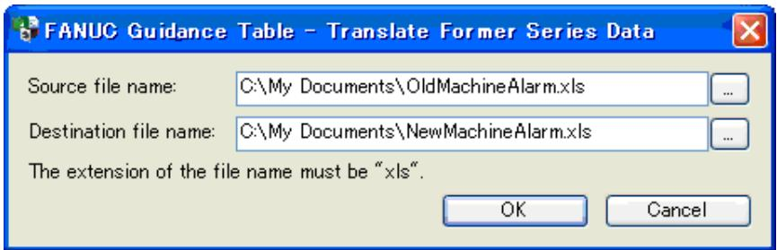

<details>
<summary>text_image</summary>

FANUC Guidance Table - Translate Former Series Data
Source file name: C:\My Documents\OldMachineAlarm.xls
Destination file name: C:\My Documents\NewMachineAlarm.xls
The extension of the file name must be "xls".
OK	Cancel
</details>

图1.16.9 (b)

3 点击 [OK] 按钮。新建在 2 的 [Destination file name] 中指定的 Excel 文件。  
4 利用创建的 Excel 文件，按照 “创建故障诊断信息” 的步骤，进行输入数据的检查和存储卡文件的创建。

## 注释

1 [Source File name] 以及 [Destination file name] 要以全路径指定。无法省略路径名。文件名的扩展名固定为 xls（Excel 工作簿格式）。即使输入 xls 以外的扩展也将被忽略，转换为 xls。  
2 Guidance Table1 的 “Kind” （类别）在变换时按照 “Number” （编号）被自动输入。

- 编号 1000～1999 → EX （外部报警）  
- 编号 2000～2999 → OP （外部操作信息）  
- 编号 3000～3200 → MC （宏报警）

3 若数据的变换失败，“The data cannot be translated.” (数据的变换无法进行。)的信息框将会随同如下的失败原因一起被显示。

- (变换源文件) is not found. (（变换源文件）找不到。)  
- (输出目的地文件夹) is not found. （（输出目的地文件夹）找不到。）  
- Files in (输出目的地文件夹) cannot be written.（（输出目的地文件夹）的文件被设定为只读。）  
- The disk space in (输出目的地文件夹) is not enough to make a new file（（输出目的地文件夹）的磁盘的可用空间不足。）  
- (输出目的地文件) has already existed.（（输出目的地文件）文件已存在。）

4 旧机种中，在分别创建用于日文和英文的 Excel 文件时，在分别变换两个文件后，在英文文件中创建用于日文信息的表。并且，通过 Excel 上的剪切&粘贴操作，将日文文件的 [Guidance] 表的内容移动到英文文件的用于日文的表中，汇总为 1 个 Excel 文件。

## 1.17 存储器内容显示画面

可以从指定的地址显示出 CNC 的存储器内容。

## 存储器内容显示画面的显示方法

1 为显示存储器内容显示画面，将参数 MEM(No.8950#0) 设定为 1。  
2 按下功能键 SYSTEM。  
3 按下继续菜单键▶，再按下章节选择软键[存储器]。出现如下画面。

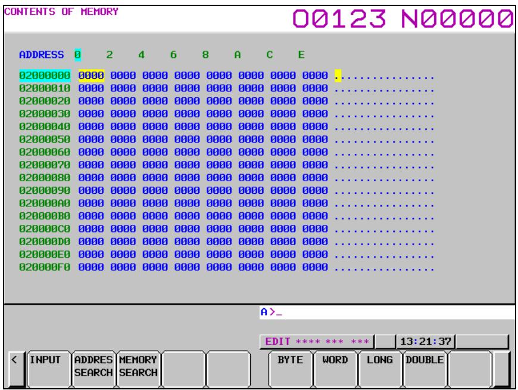

<details>
<summary>text_image</summary>

CONTENTS OF MEMORY
00123 N00000
ADDRESS 0 2 4 6 8 A C E
02000000 0000 0000 0000 0000 0000 0000 0000 0000 ......
02000010 0000 0000 0000 0000 0000 0000 0000 0000 ......
02000020 0000 0000 0000 0000 0000 0000 0000 0000 ......
02000030 0000 0000 0000 0000 0000 0000 0000 0000 ......
02000040 0000 0000 0000 0000 0000 0000 0000 0000 ......
02000050 0000 0000 0000 0000 0000 0000 0000 000
. ......
. ......
. ......
. ......
. ......
. ......
. ......
. ......
. ......
. ......
. ......
. ......
. ......
. ......
. ......
. ......
. ......
. ......
. ......
. ......
. ......
. ......
. ......
. ......
. ......
. ......
. ......
. ......
. ......
. ......
. ......
. ......
. ......
. ......
32
A >_
EDIT ***** *** 13:21:37
< INPUT ADDRESS MEMORY BYTE WORD LONG DOUBLE
SEARCH SEARCH
</details>

图 1.17 (a) 存储器内容显示画面

4 键入希望使其显示的地址(16 进制)，按下 [地址检索] 键，从指定地址开始显示 256 字节。(例：输入 100000 后按下软键 [地址检索] 键时，从 100000H 开始显示)  
5 显示数据的切换，可通过翻页键 PAGE 、光标移动键 进行。  
6 按下软键 [字节]、[字]、[LONG]（长）、[双重]，选择希望显示的每个数据类型。

## 解释

可以从下面的 4 类中选择用来显示存储器内容的格式。

字节显示（1 字节 16 进制显示）

字显示（2 字节 16 进制显示）

LONG 显示（4 字节 16 进制显示）

双重显示（8 字节 10 进制显示：双倍精度可变小数点型显示）

在 1 个画面上显示出 256 字节的存储器内容。

## 注释

1 输入地址时，末尾不必添加表示 16 进制的 “H”。如果添加上，则会有格式不正确这样的警告显示。  
2 显示格式为字显示的情况下，所输入的地址以 2 字节为单位取整。若是 LONG 显示和双重显示的情形，则以 4 字节为单位取整。


## 警告

1 输入地址搜索中禁止存取的存储器的地址时，将会发生系统报警。  
进行地址搜索时，要充分确认是否为可以存取的地址，地址输入是否正确。  
2 本功能是以维护为目的的功能，一般用户请勿使用。

## 2 控制单元的硬件

本章就控制单元的硬件配置、各种印刷板及其安装位置、LED 显示以及设置进行记述。

## 2.1 硬件的配置例

## 2.1.1 显示器一体型控制单元的配置例

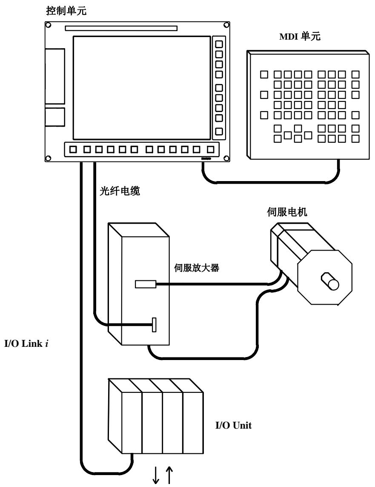

<details>
<summary>flowchart</summary>

```mermaid
graph TD
  A["控制单元"] --> B["光纤电缆"]
  C["MDI单元"] --> D["伺服电机"]
  B --> E["I/O Link i"]
  D --> F["I/O Unit"]
  E --> G["↓"]
  F --> H["↑"]
```
</details>

机床操作面板和强电盘电路等

## 2.2 硬件概要

## 2.2.1 显示器一体型控制单元的概要

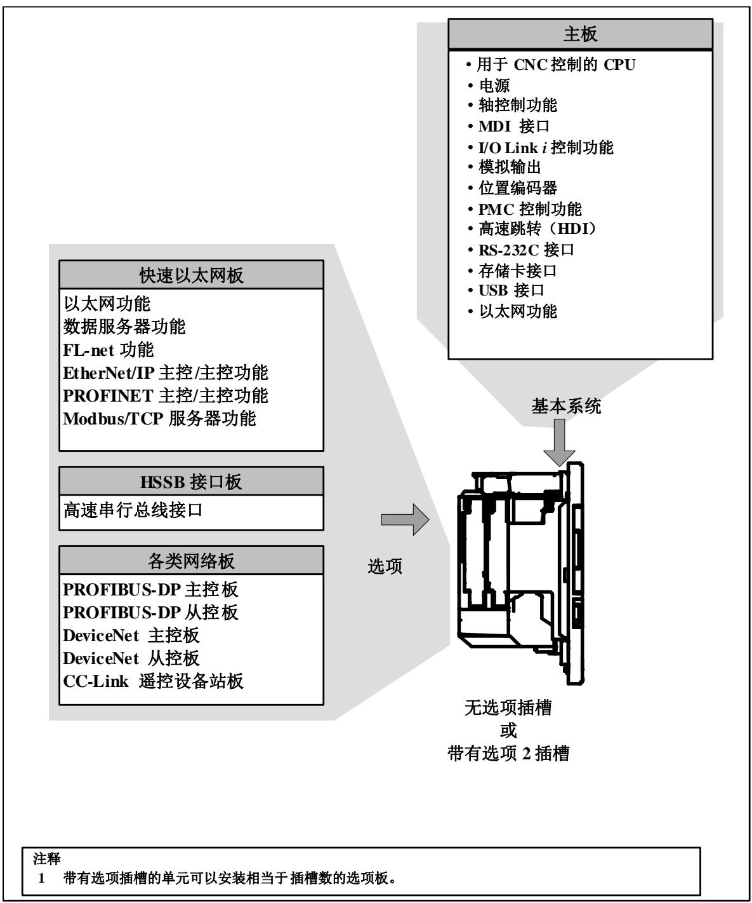

<details>
<summary>flowchart</summary>

```mermaid
graph TD
  A["主板"] --> B["快速以太网板"]
  A --> C["HSSB接口板"]
  A --> D["各类网络板"]
  B --> E["快速以太网功能"]
  B --> F["数据服务器功能"]
  B --> G["FL-net功能"]
  B --> H["EtherNet/IP主控/主控功能"]
  B --> I["PROFINET主控/主控功能"]
  B --> J["Modbus/TCP服务器功能"]
  C --> K["高速串行总线接口"]
  D --> L["PROFIBUS-DP主控板"]
  D --> M["PROFIBUS-DP从控板"]
  D --> N["DeviceNet主控板"]
  D --> O["DeviceNet从控板"]
  D --> P["CC-Link遥控设备站板"]
  C --> Q["无选项插槽或带有选项2插槽"]
  Q --> R["注释1 带有选项插槽的单元可以安装相当于插槽数的选项板。"]
    style A fill:#f9f,stroke:#333
    style B fill:#ccf,stroke:#333
    style C fill:#cfc,stroke:#333
    style D fill:#fcc,stroke:#333
    style E fill:#ffc,stroke:#333
    style F fill:#ffc,stroke:#333
    style G fill:#ffc,stroke:#333
    style H fill:#ffc,stroke:#333
    style I fill:#ffc,stroke:#333
    style J fill:#ffc,stroke:#333
    style K fill:#ffc,stroke:#333
    style L fill:#ffc,stroke:#333
    style M fill:#ffc,stroke:#333
    style N fill:#ffc,stroke:#333
    style O fill:#ffc,stroke:#333
    style P fill:#ffc,stroke:#333
    style Q fill:#ffc,stroke:#333
    style R fill:#ffc,stroke:#333
```
</details>

## 2.3 综合连接图

## 2.3.1 控制单元的连接图

基本单元A的情形  
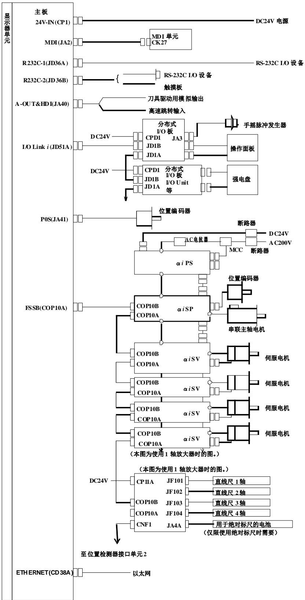

<details>
<summary>flowchart</summary>

```mermaid
graph TD
  A["主板"] --> B["24V-IN(CP1)"]
  A --> C["MDI(JA2)"]
  A --> D["R232C-1(JD36A)"]
  A --> E["R232C-2(JD36B)"]
  A --> F["A-OUT&HD I(JA40)"]
  A --> G["I/O Link i (JD51A)"]
  A --> H["P0S(JA41)"]
  A --> I["FSSB(COP10A)"]
  A --> J["ETHERNET(CD38A)"]
    
  B --> K["DC24V电源"]
  C --> L["MDI单元CK27"]
  D --> M["RS-232C I/O设备"]
  E --> N["触摸板"]
  F --> O["刀具驱动用模拟输出"]
  F --> P["高速跳转输入"]
  G --> Q["CPD1 JA3"]
  G --> R["CPD1 JA3"]
  G --> S["CPD1 JA3"]
  G --> T["CPD1 JA3"]
  G --> U["CPD1 JA3"]
  G --> V["CPD1 JA3"]
  G --> W["CPD1 JA3"]
  G --> X["CPD1 JA3"]
    
  Q --> Y["操作面板"]
  R --> Z["操作面板"]
  S --> AA["操作面板"]
  T --> AB["操作面板"]
  U --> AC["操作面板"]
  V --> AD["操作面板"]
  W --> AE["操作面板"]
    
  H --> AF["位置编码器"]
  H --> AG["断路器"]
  H --> AH["AC电抗器"]
  H --> AI["MCC断路器"]
    
  I --> AJ["αiPS"]
  I --> AK["位置编码器"]
  I --> AL["COP10B αiSP"]
  I --> AM["COP10A 串联主轴电机"]
    
  J --> AN["COP10B αiSV"]
  J --> AO["COP10A 伺服电机"]
    
  K --> AP["COP10B αiSV"]
  K --> AQ["COP10A 伺服电机"]
    
  L --> AR["COP10B αiSV"]
  L --> AS["COP10A 伺服电机"]
    
  M --> AT["COP10B αiSV"]
  M --> AU["COP10A 伺服电机"]
    
  N --> AV["COP10B αiSV"]
  N --> AW["COP10A 伺服电机"]
    
  O --> AX["COP10B αiSV"]
  O --> AY["COP10A 伺服电机"]
    
  P --> AZ["COP10B αiSV"]
  P --> BA["COP10A 伺服电机"]
    
  Q --> BB["COP10B αiSP"]
  Q --> BC["COP10A 伺服电机"]
    
  R --> BD["COP10B αiSP"]
  R --> BE["COP10A 伺服电机"]
    
  S --> BF["COP10B αiSP"]
  S --> BG["COP10A 伺服电机"]
    
  T --> BH["COP10B αiSP"]
  T --> BI["COP10A 伺服电机"]
    
  U --> BJ["COP10B αiSP"]
  U --> BK["COP10A 伺服电机"]
    
  V --> BL["COP10B αiSP"]
  V --> BM["COP10A 伺服电机"]
    
  W --> BN["COP10B αiSP"]
  W --> BO["COP10A 伺服电机"]
    
  AX --> BP["COP10B αiSP"]
  AX --> BQ["COP10A 伺服电机"]
    
  Y --> BR["COP10B αiSP"]
  Y --> BS["COP10A 伺服电机"]
    
  Z --> BT["COP10B αiSP"]
  Z --> BU["COP10A 伺服电机"]
    
  AA --> BV["COP10B αiSP"]
  AA --> BW["COP10A 伺服电机"]
    
  AB --> BX["COP10B αiSP"]
  AB --> BY["COP10A 伺服电机"]
    
  AC --> BZ["COP10B αiSP"]
  AC --> CA["COP10A 伺服电机"]
    
  AD --> CB["COP10B αiSP"]
  AD --> CC["COP10A 伺服电机"]
    
  AE --> DA["COP10B αiSP"]
  AE --> DB["COP10A 伺服电机"]
    
  AF --> DC["COP10B αiSP"]
  AF --> DD["COP10A 伺服电机"]
    
  AG --> DE["COP10B αiSP"]
  AG --> DF["COP10A 伺服电机"]
    
  AH --> DG["COP10B αiSP"]
  AH --> DH["COP10A 伺服电机"]
    
  AI --> DI["COP10B αiSP"]
  AI --> DJ["COP10A 伺服电机"]
    
  AJ --> DK["COP10B αiSP"]
  AJ --> DL["COP10A 伺服电机"]
    
  AK --> DM["COP10B αiSP"]
  AK --> DN["COP10A 伺服电机"]
    
  AL --> DO["COP10B αiSP"]
  AL --> DP["COP10A 伺服电机"]
    
  AM --> Q["DCE24V电源"]
    
  AP --> R["DC24V电源开关"]
    
  AQ["至位置检测器接口单元2"] --> AR["ETHERNET(CD38A)"]
    
    AS["以太网"] -.-> AQ
```
</details>

基本单元G的情形  
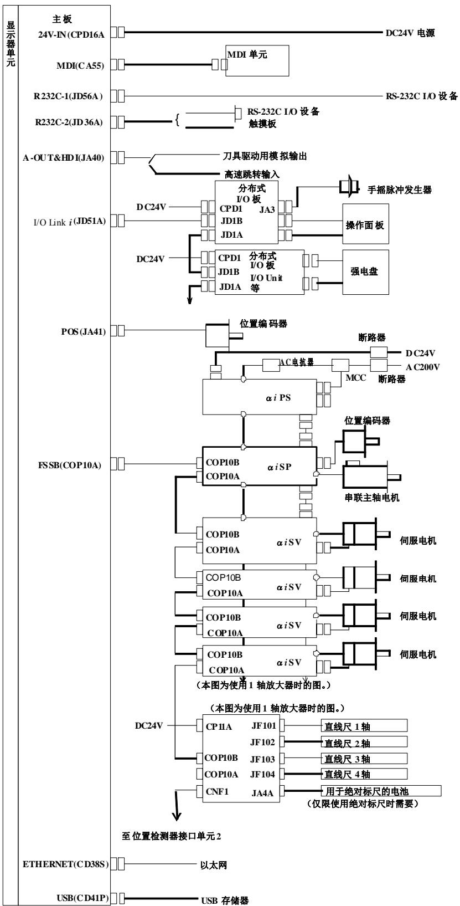

<details>
<summary>flowchart</summary>

```mermaid
graph TD
  A["显示器单元"] --> B["主板"]
  A --> C["MDI(CA55)"]
  A --> D["R232C-1(JD56A)"]
  A --> E["R232C-2(JD36A)"]
  A --> F["A-OUT&HD I(JA40)"]
  A --> G["I/O Link i(JD51A)"]
  A --> H["POS(JA41)"]
  A --> I["FSSB(COP10A)"]
  A --> J["ETHERNET(CD38S)"]
  A --> K["USB(CD41P)"]

  B --> L["DC24V 电源"]
  C --> M["MDI 单元"]
  D --> N["RS-232C I/O 设备"]
  E --> O["触摸板"]
  F --> P["刀具驱动用模拟输出"]
  G --> Q["高速跳转输入"]
  H --> R["分布式 I/O 板 CPD1 JA3 JD1B 操作面板"]
  I --> S["位置编码器"]
  I --> T["AC电抗器"]
  I --> U["MCC 断路器"]
  I --> V["αi PS"]
  I --> W["αiSP"]
  I --> X["串联主轴电机"]

  Q --> Y["手摇脉冲发生器"]
  R --> Z["操作面板"]
  S --> AA["CPD1 分布式 I/O 板 JD1B I/O Unit 等 强电盘"]
  T --> AB["断路器"]
  U --> AC["DC24V AC200V"]
  V --> AD["位置编码器"]

  I --> AE["COP10B COP10A αiSP"]
  I --> AF["COP10B COP10A αiSV"]
  I --> AG["COP10B COP10A αiSV"]
  I --> AH["COP10B COP10A αiSV"]
  I --> AI["COP10B COP10A αiSV"]

  AE --> AJ["伺服电机"]
  AF --> AK["伺服电机"]
  AG --> AL["伺服电机"]
  AH --> AM["伺服电机"]

  AI --> AN["伺服电机"]

  AJ --> AO["直线尺 1 轴"]
  AJ --> AP["直线尺 2 轴"]
  AJ --> AQ["直线尺 3 轴"]
  AJ --> AR["直线尺 4 轴"]

  AK --> AS["用于绝对标尺的电池 (仅限使用绝对标尺时需要)"]
  AL --> AT["直线尺 1 轴"]

  AM --> AU["直线尺 2 轴"]

  AN --> AV["直线尺 3 轴"]

  AO --> AW["直线尺 4 轴"]

  AP --> AX["直线尺 2 轴"]

  AQ --> AY["直线尺 3 轴"]

  AR --> AZ["直线尺 4 轴"]

  AS --> BA["直线尺 1 轴"]

  AT --> BB["直线尺 2 轴"]

  AU --> BC["直线尺 3 轴"]

  AV --> BD["直线尺 4 轴"]

  AW --> BE["直线尺 1 轴"]

  AX --> BF["直线尺 2 轴"]

  AY --> BG["直线尺 3 轴"]

  AZ --> BH["直线尺 4 轴"]

  BB --> BI["直线尺 1 轴"]

  AC --> BJ["直线尺 2 轴"]

  AD --> BK["直线尺 3 轴"]

  AE --> BL["点位检测器接口单元2"]
  AF --> BL
  AG --> BL
  AH --> BL
  AI --> BL
  AJ --> BL
  AK --> BL
  AL --> BL
  AM --> BN["至位置检测器接口单元2"]
  AN --> BN
  AO --> BN
  AP --> BN
  AH --> BN
```
</details>


### PMC报警: 选项插槽
- **故障内容**: 快速以太网板小型闪存卡ETHERNET(CD38R)
- **处理办法**: 请使用发那科制小型闪存卡。以太网、FL-net等


## 2.4 显示器一体型控制单元的硬件

## 2.4.1 显示器一体型控制单元（8.4”LCD单元和10.4”LCD单元A）

## - 主板规格

基本单元 A（A02B-0338-B500,B502）的情形


### PMC报警: 名称
- **故障内容**: 规格
- **处理办法**: 备注

### PMC报警: 主板
- **故障内容**: A17B-8100-0200
- **处理办法**: 


基本单元 G（A02B-0338-B510,B512）的情形


### PMC报警: 名称
- **故障内容**: 规格
- **处理办法**: 备注

### PMC报警: 主板
- **故障内容**: A17B-8100-0126
- **处理办法**: 


## - 连接器的安装位置

基本单元 A 的情形

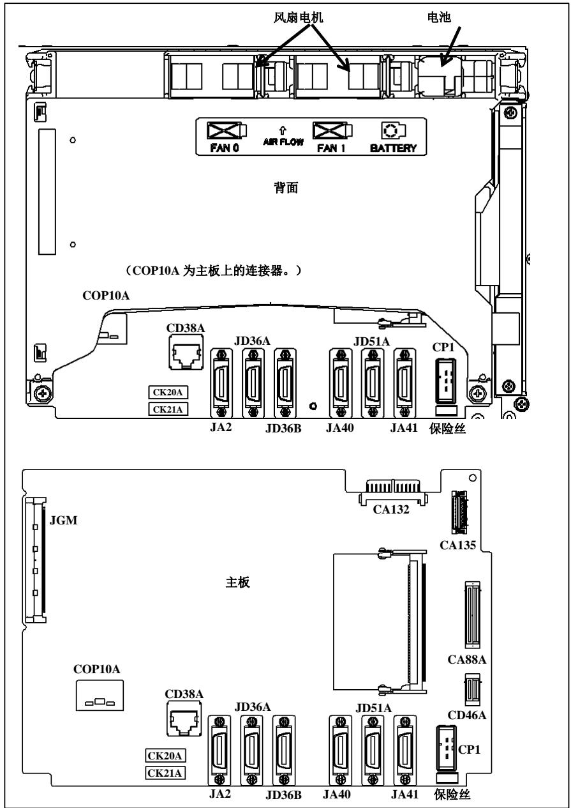

<details>
<summary>text_image</summary>

风扇电机
电池
FAN 0 AIR FLOW FAN 1 BATTERY
背面
(COP10A为主板上的连接器。)
COP10A
CD38A
JD36A
JD51A
CP1
CK20A
CK21A
JA2 JD36B JA40 JA41 保险丝
JGM
主板
CA132
CA135
CD38A
JC38A
JC38A
JC38A
JC38A
JC38A
JC38A
JC38A
JC38A
JC38A
JC38A
JC38A
JC38A
JC38A
JC38A
JC38A
JC38A
JC38A
JC38A
JC38A
JC38A
JA2 JD36B JA40 JA41 保险丝
CK20A
CK21A
CA132
CA135
CA88A
CD46A
CP1
</details>

2. 控制单元的硬件  
B-64605CM/01


基本单元G的情形  
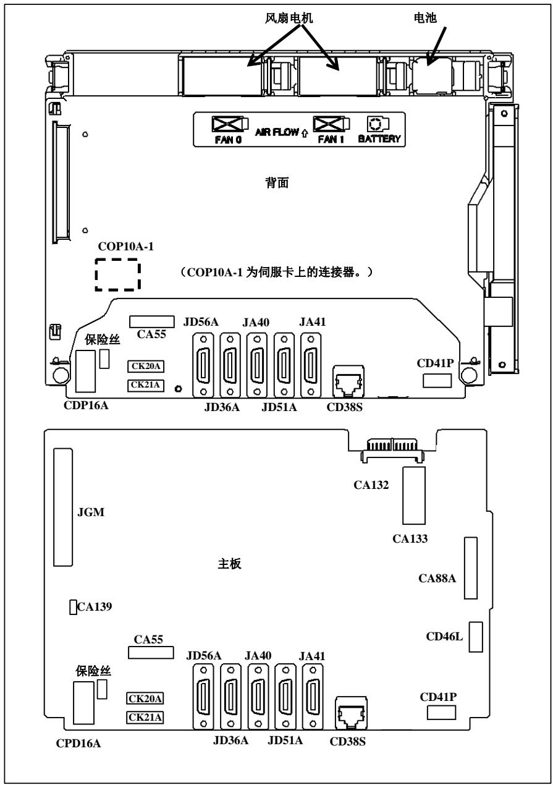

<details>
<summary>text_image</summary>

风扇电机
电池
FAN 0 AIR FLOW ↑ FAN 1 BATTERY
背面
COP10A-1
(COP10A-1为伺服卡上的连接器。)
保险丝
CA55 JD56A JA40 JA41
CK20A
CK21A
CD41P
CDP16A JD36A JD51A CD38S
JGM
主板
CA132
CA133
CA88A
CD46L
CA139
保险丝
CA55 JD56A JA40 JA41
CK20A
CK21A
CD41P
CPD16A JD36A JD51A CD38S
</details>


## - 各种印刷板的安装位置

基本单元A的情形

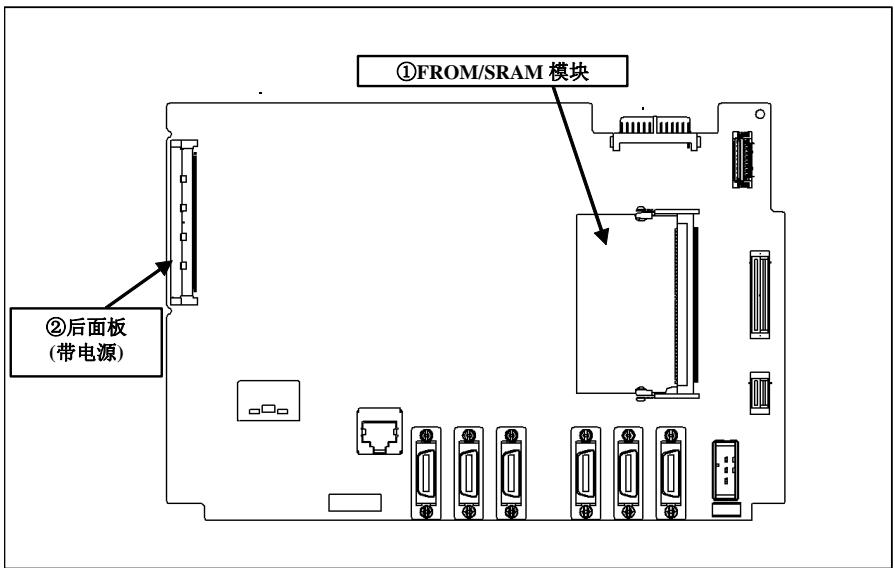

<details>
<summary>text_image</summary>

①FROM/SRAM 模块
②后面板
(带电源)
</details>


### PMC报警: No.
- **故障内容**: 名称
- **处理办法**: 规格

### PMC报警: 1
- **故障内容**: FROM/SRAM 模块
- **处理办法**: A20B-3900-0302

### PMC报警: 2
- **故障内容**: 后面板(带电源)
- **处理办法**: A20B-8200-0650


基本单元G的情形  
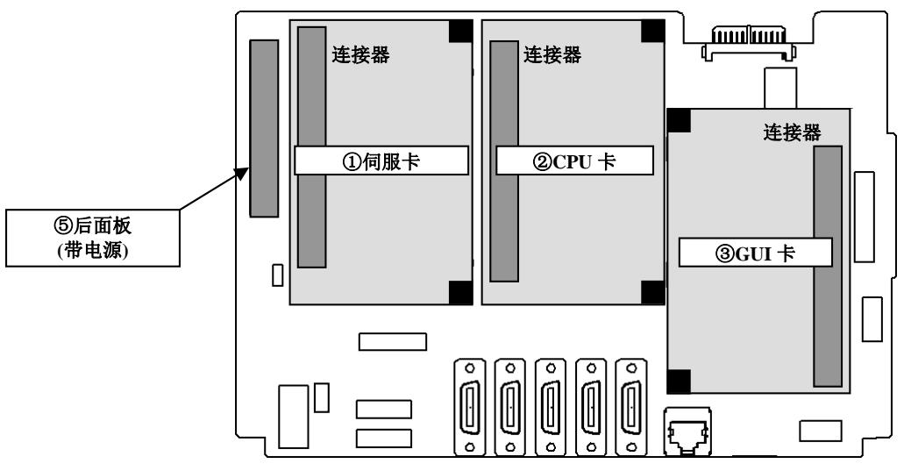

<details>
<summary>text_image</summary>

⑤后面板
(带电源)
①伺服卡
②CPU 卡
③GUI 卡
连接器
连接器
连接器
</details>

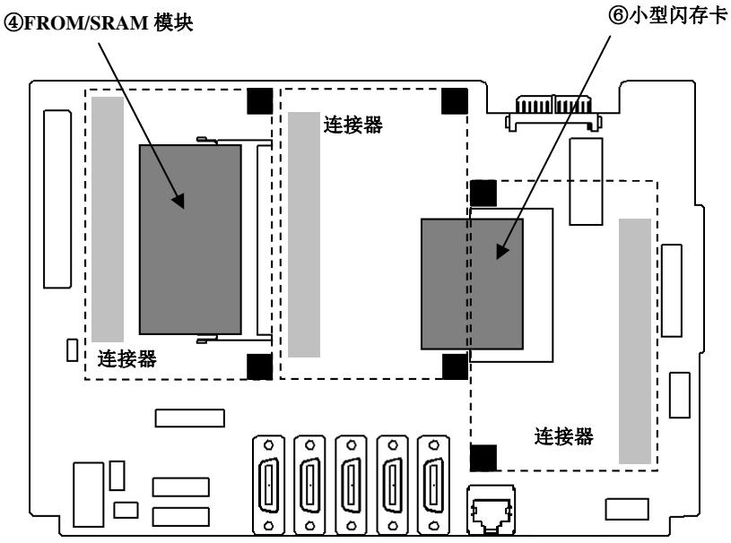

<details>
<summary>text_image</summary>

④FROM/SRAM 模块
连接器
⑥小型闪存卡
连接器
连接器
</details>


### PMC报警: No.
- **故障内容**: 名称
- **处理办法**: 规格

### PMC报警: 1
- **故障内容**: 伺服卡
- **处理办法**: A20B-3300-0778

### PMC报警: 2
- **故障内容**: CPU 卡
- **处理办法**: A20B-3300-0656

### PMC报警: 3
- **故障内容**: GUI 卡
- **处理办法**: A20B-3300-0821

### PMC报警: 4
- **故障内容**: FROM/SRAM 模块
- **处理办法**: A20B-3900-0302

### PMC报警: 5
- **故障内容**: 后面板(带电源)
- **处理办法**: A20B-8200-0650

### PMC报警: 6
- **故障内容**: 小型闪存卡
- **处理办法**: A87L-0001-0173#512MBE


## - 方框图

基本单元A的情形  
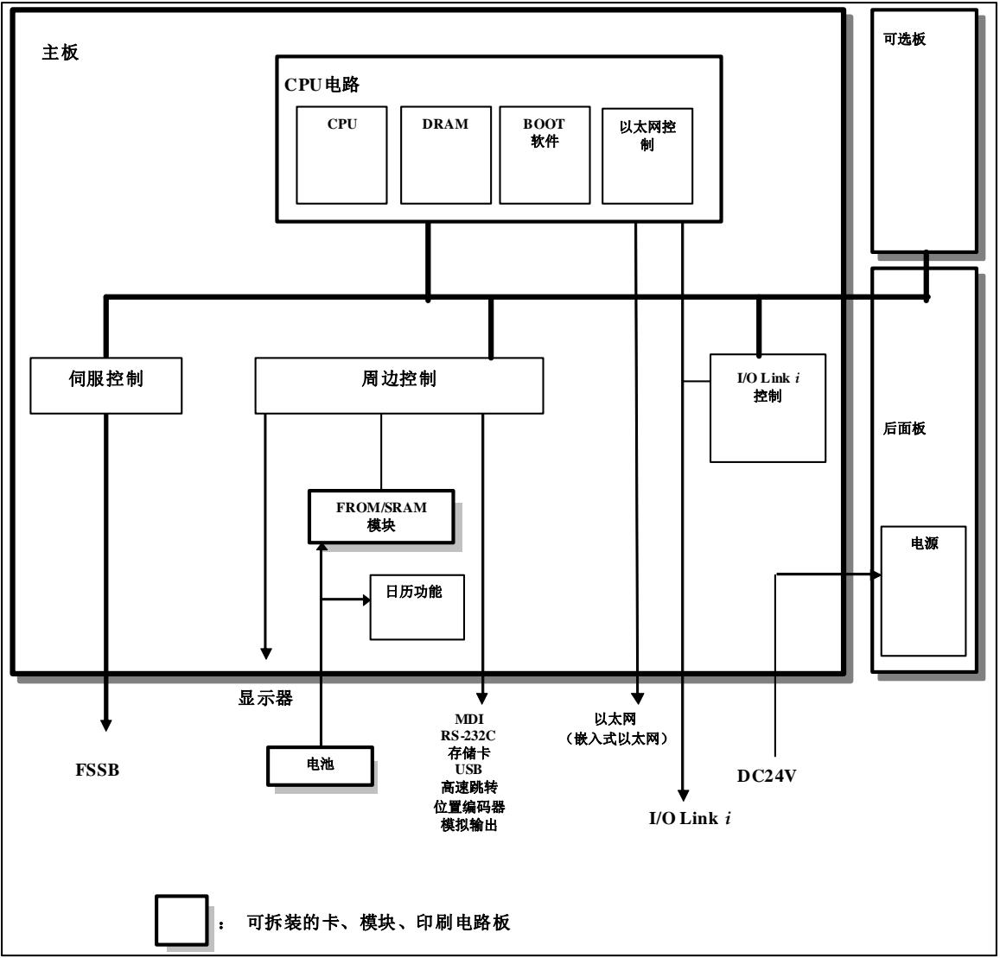

<details>
<summary>flowchart</summary>

```mermaid
graph TD
  A["主板"] --> B["CPU电路"]
  B --> C["CPU"]
  B --> D["DRAM"]
  B --> E["BOOT软件"]
  B --> F["以太网控制"]
  G["可选板"] --> H["后面板"]
  G --> I["电源"]
  J["伺服控制"] --> K["显示器"]
  L["周边控制"] --> M["FROM/SRAM模块"]
  N["I/O Link i控制"] --> O["日历功能"]
  P["FSSB"] --> Q["电池"]
  R["DC24V"] --> S["I/O Link i"]
  T["显示器"] --> U["MDI RS-232C 存储卡 USB 高速跳转 位置编码器 模拟输出"]
  V["以太网 (嵌入式以太网)"] --> W["I/O Link i"]
  X["可拆装的卡、模块、印刷电路板"] --> Y["显示器"]
```
</details>

基本单元G的情形  
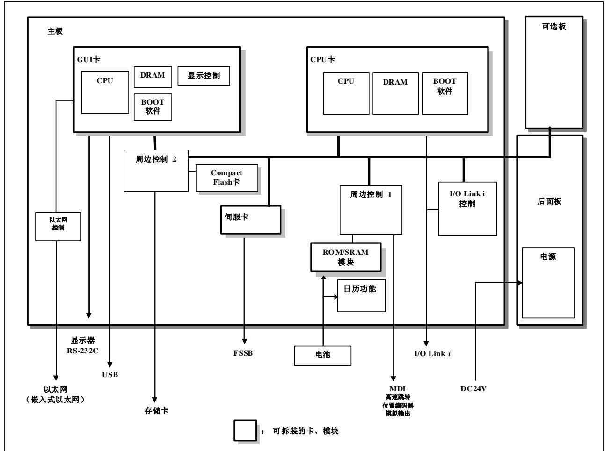

<details>
<summary>flowchart</summary>

```mermaid
graph TD
  A["主板"] --> B["GUI卡"]
  A --> C["CPU"]
  A --> D["DRAM"]
  A --> E["显示控制"]
  A --> F["BOOT软件"]
  A --> G["以太网控制"]
  A --> H["显示器 RS-232C"]
  A --> I["USB"]
  A --> J["存储卡"]
  K["可选板"] --> L["后面板"]
  K --> M["电源"]
  K --> N["I/O Link i 控制"]
  K --> O["ROM/SRAM 模块"]
  K --> P["日历功能"]
  K --> Q["电池"]
  K --> R["MDI 高速跳转 位置编码器 模拟输出"]
  K --> S["I/O Link i"]
  K --> T["DC24V"]
  U["电脑"] --> V["ROM/SRAM 模块"]
  W["电脑"] --> X["日历功能"]
  Y["电脑"] --> Z["ROM/SRAM 模块"]
  AA["电脑"] --> AB["日历功能"]
  AC["电脑"] --> AD["ROM/SRAM 模块"]
  AE["电脑"] --> AF["日历功能"]
  AG["电脑"] --> AH["ROM/SRAM 模块"]
  AI["电脑"] --> AJ["日历功能"]
  AK["电脑"] --> AL["ROM/SRAM 模块"]
  AM["电脑"] --> AN["日历功能"]
  AO["电脑"] --> AP["ROM/SRAM 模块"]
  AQ["电脑"] --> AR["日历功能"]
  AS["电脑"] --> AT["ROM/SRAM 模块"]
  AU["电脑"] --> AV["日历功能"]
  AW["电脑"] --> AX["ROM/SRAM 模块"]
  AY["电脑"] --> AZ["可拆装的卡、模块"]
```
</details>

## - LED 显示

基本单元 A 的情形  
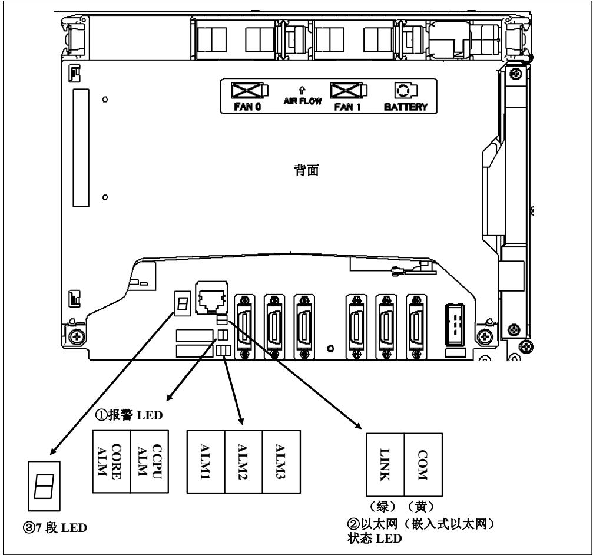

<details>
<summary>text_image</summary>

FAN 0
AIR FLOW
FAN 1
BATTERY
背面
①报警 LED
CORE CPU
ALM ALM1 ALM2 ALM3
(绿) (黄)
②以太网（嵌入式以太网）
状态 LED
③7 段 LED
</details>

① 报警 LED 显示（红色 LED）


### PMC报警: CORE ALM
- **故障内容**: ALM
- **处理办法**: CCPU ALM

### PMC报警: 1
- **故障内容**: 2
- **处理办法**: 3

### PMC报警: ◇
- **故障内容**: □
- **处理办法**: ■

### PMC报警: ◇
- **故障内容**: ■
- **处理办法**: ■

### PMC报警: ◇
- **故障内容**: □
- **处理办法**: □

### PMC报警: ◇
- **故障内容**: ■
- **处理办法**: □

### PMC报警: ◇
- **故障内容**: □
- **处理办法**: ■

### PMC报警: ◇
- **故障内容**: ■
- **处理办法**: ■

### PMC报警: ◇
- **故障内容**: ◇
- **处理办法**: ◇

### PMC报警: ■
- **故障内容**: ◇
- **处理办法**: ◇


■：点亮 □：熄灭 ◇：无关

② 以太网（嵌入式以太网）状态 LED


## ③ 7 段 LED

请参照附录 E. “LED 显示”。

基本单元G的情形  
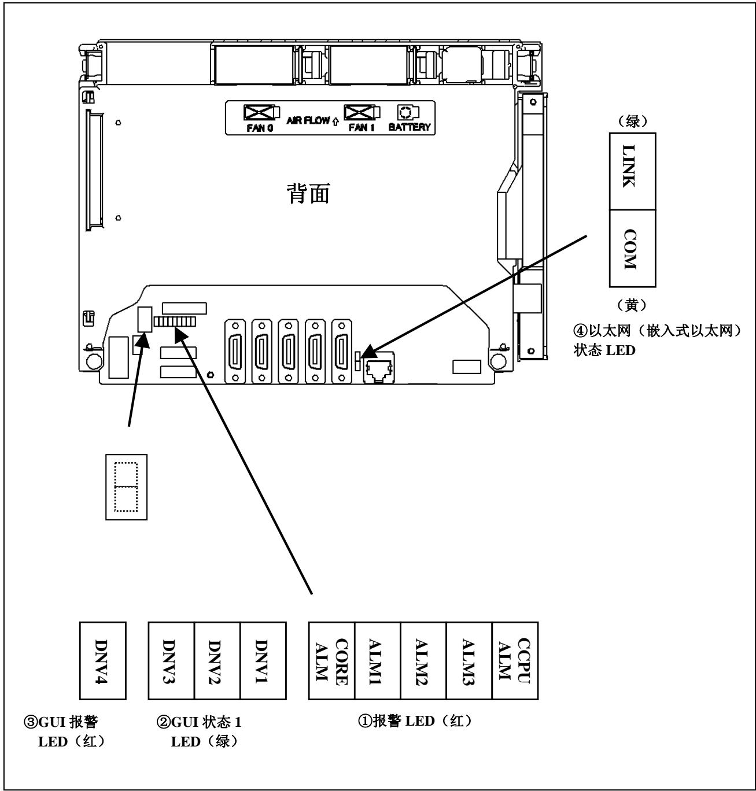

<details>
<summary>text_image</summary>

背面
④以太网（嵌入式以太网）
状态 LED
①报警 LED（红）
②GUI 状态 1
LED（绿）
③GUI 报警
LED（红）
④以太网（嵌入式以太网）
状态 LED
LINK
COM
FAN 0 AIR FLOW ↑ FAN 1 BATTERY
(DNV4) DNV3 DNV2 DNV1 CORE ALM1 ALM2 ALM3 CPU ALM
①报警 LED（红）
</details>

① 报警 LED（红色 LED）


### PMC报警: COREALM
- **故障内容**: ALM
- **处理办法**: CCPUALM

### PMC报警: 1
- **故障内容**: 2
- **处理办法**: 3

### PMC报警: ◇
- **故障内容**: □
- **处理办法**: ■

### PMC报警: ◇
- **故障内容**: ■
- **处理办法**: ■

### PMC报警: ◇
- **故障内容**: □
- **处理办法**: □

### PMC报警: ◇
- **故障内容**: ■
- **处理办法**: □

### PMC报警: ◇
- **故障内容**: □
- **处理办法**: ■

### PMC报警: ◇
- **故障内容**: ■
- **处理办法**: ■

### PMC报警: ◇
- **故障内容**: ◇
- **处理办法**: ◇

### PMC报警: ■
- **故障内容**: ◇
- **处理办法**: ◇


■：点亮 □：熄灭 ◇：无关

② GUI 状态 1 LED（绿色 LED）预留。  
③ GUI 状态 2 LED（绿色 LED）


### PMC报警: No.
- **故障内容**: LED
- **处理办法**: 含义

### PMC报警: 1
- **故障内容**: $\square$
- **处理办法**: $\square$

### PMC报警: 2
- **故障内容**: $\blacksquare$
- **处理办法**: $\blacksquare$

### PMC报警: 3
- **故障内容**: $\blacksquare$
- **处理办法**: $\square$

### PMC报警: 4
- **故障内容**: $\square$
- **处理办法**: $\blacksquare$

### PMC报警: 5
- **故障内容**: $\star$
- **处理办法**: $\square$

### PMC报警: 6
- **故障内容**: $\star$
- **处理办法**: $\star$


■：点亮 □：熄灭 ☆：闪烁

④ GUI 报警 LED（红色 LED）


⑤ LEDP（绿色 LED）


⑥ 以太网（嵌入式以太网）状态 LED


LED 显示（GUI 卡）

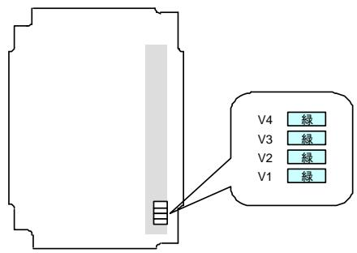

<details>
<summary>text_image</summary>

V4 綠
V3 綠
V2 綠
V1 綠
</details>


### PMC报警: LED
- **故障内容**: 状态
- **处理办法**: 停止时的含义

### PMC报警: V4
- **故障内容**: V3
- **处理办法**: V2

### PMC报警: ☐
- **故障内容**: ☐
- **处理办法**: ☐

### PMC报警: ■
- **故障内容**: ■
- **处理办法**: ■

### PMC报警: ■
- **故障内容**: ■
- **处理办法**: ☐

### PMC报警: ■
- **故障内容**: ☐
- **处理办法**: ■

### PMC报警: ■
- **故障内容**: ☐
- **处理办法**: ☐

### PMC报警: ☐
- **故障内容**: ■
- **处理办法**: ■

### PMC报警: ☐
- **故障内容**: ■
- **处理办法**: ☐

### PMC报警: ☐
- **故障内容**: ☐
- **处理办法**: ■

### PMC报警: ■
- **故障内容**: ■
- **处理办法**: ■

### PMC报警: ■
- **故障内容**: ■
- **处理办法**: □

### PMC报警: ■
- **故障内容**: □
- **处理办法**: ■

### PMC报警: ■
- **故障内容**: □
- **处理办法**: □

### PMC报警: □
- **故障内容**: ■
- **处理办法**: ■

### PMC报警: □
- **故障内容**: ■
- **处理办法**: □

### PMC报警: □
- **故障内容**: □
- **处理办法**: ■

### PMC报警: □
- **故障内容**: □
- **处理办法**: □

### PMC报警: □
- **故障内容**: □
- **处理办法**: □

### PMC报警: □
- **故障内容**: □
- **处理办法**: ☆

### PMC报警: □
- **故障内容**: ☆
- **处理办法**: □

### PMC报警: □
- **故障内容**: ☆
- **处理办法**: ☆

### PMC报警: ☆
- **故障内容**: □
- **处理办法**: □

### PMC报警: ☆
- **故障内容**: ☆
- **处理办法**: ☆


□：熄灭、■：点亮、☆：闪烁

风扇适配器板规格

基本单元 A 的情形


### PMC报警: 名称
- **故障内容**: 规格
- **处理办法**: 备注

### PMC报警: 风扇适配器板
- **故障内容**: 8.4"LCD/MDI 单元用
- **处理办法**: A20B-8201-0153


基本单元G的情形


### PMC报警: 名称
- **故障内容**: 规格
- **处理办法**: 备注

### PMC报警: 风扇适配器板
- **故障内容**: 15”LCD 单元用
- **处理办法**: A20B-8201-0155


\- 风扇适配器部分的配置


<details>
<summary>flowchart</summary>

```mermaid
graph LR
  A["LCD单元"] --> B["风扇适配器板"]
  B --> C["主板"]
  B --> D["CA158"]
  B --> E["CA132"]
  C --> F["CA132"]
```
</details>

## - 风扇适配器的位置

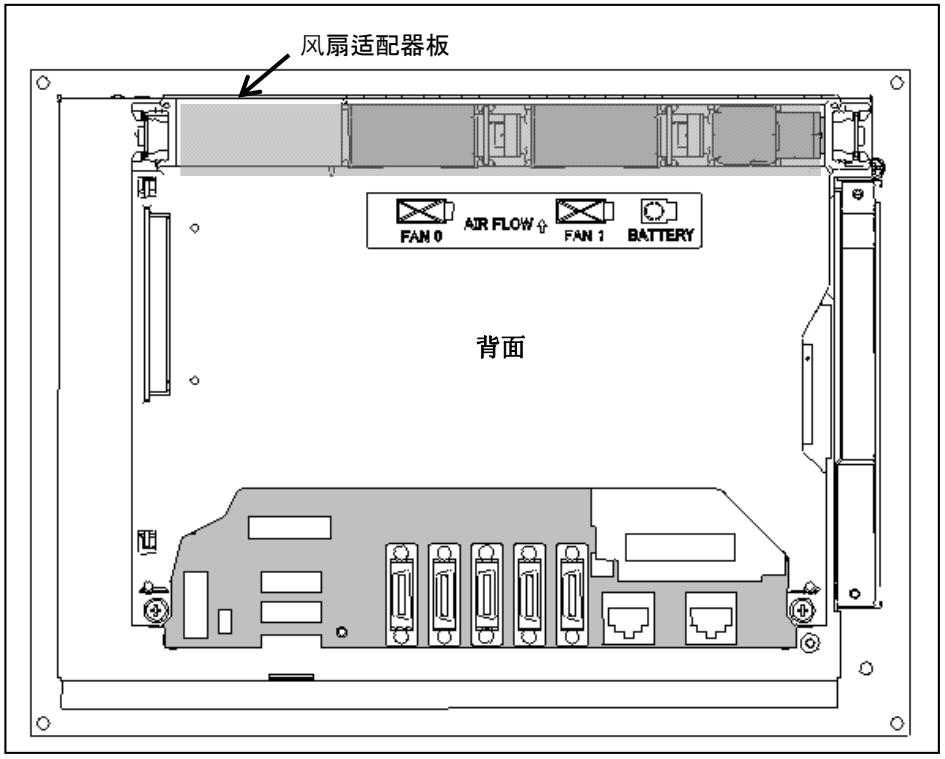

<details>
<summary>text_image</summary>

风扇适配器板
FAN 0 AIR FLOW ↑ FAN 1 BATTERY
背面
</details>

## 2.5 选项板的硬件

## 2.5.1 快速以太网板

- 规格


### PMC报警: 名称
- **故障内容**: 规格
- **处理办法**: 备注

### PMC报警: 快速以太网板
- **故障内容**: A20B-8101-0770
- **处理办法**: 


注释

参数设定中除了以太网功能外还作为数据服务器功能和 FL-net 功能使用。

## - 连接器的安装位置

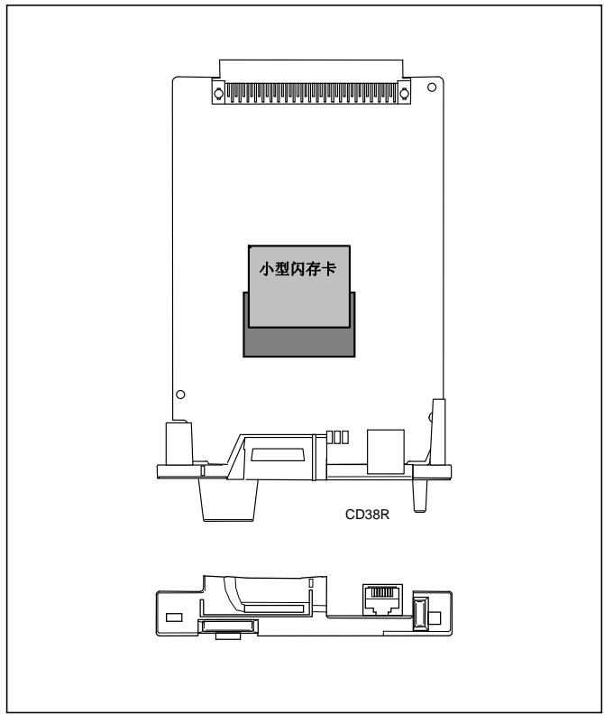

<details>
<summary>text_image</summary>

小型闪存卡
CD38R
</details>


## - LED 显示

此板有 4 个 LED。

下面示出 LED 的位置及显示内容。

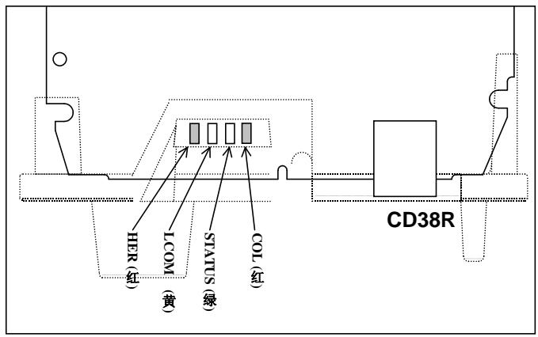

<details>
<summary>text_image</summary>

HER (红)
LCOM (黄)
STATUS (绿)
COL (红)
CD38R
</details>

注释

前面板以虚线表示。

在下面的说明中，LED 点亮状态用如下符号表示：

□：熄灭

■：点亮

☆：闪烁

STATUS 的 LED 显示变化（通电时）


### PMC报警: LED 显示
- **故障内容**: 状态
- **处理办法**: 含义

### PMC报警: □
- **故障内容**: 电源断开
- **处理办法**: 

### PMC报警: ■
- **故障内容**: 刚刚通电后
- **处理办法**: 这是电源刚接通后的初始状态。在此状态下停止的情况下,是由于下面的其中一个原因。→ 有可能 CNC 的通信软件尚未正常运行。确认是否已正确安装通信软件。→ 可能是由于硬件不良所致。更换此板。

### PMC报警: ☆
- **故障内容**: 启动完成
- **处理办法**: 已经在正常状态下启动。


STATUS 的 LED 显示（正常动作中）


### PMC报警: LED 显示
- **故障内容**: 状态
- **处理办法**: 含义

### PMC报警: ☆
- **故障内容**: 正常的状态
- **处理办法**: 在正常动作。


LCOM 的 LED 显示


### PMC报警: LED 显示
- **故障内容**: 状态
- **处理办法**: 含义

### PMC报警: $\square$
- **故障内容**: 与 HUB 尚未连接中
- **处理办法**: 与 HUB 间的连接异常。在没有接通 HUB 电源的情况下,LED 也会熄灭。确认是否已与 HUB 正确连接。

### PMC报警: ■
- **故障内容**: 与 HUB 连接中
- **处理办法**: 正在与 HUB 连接。

### PMC报警: ☆
- **故障内容**: 收发中
- **处理办法**: 正在收发数据。


COL 的 LED 显示


### PMC报警: LED 显示
- **故障内容**: 状态
- **处理办法**: 含义

### PMC报警: □
- **故障内容**: 正常的状态
- **处理办法**: 在正常动作。

### PMC报警: ■☆
- **故障内容**: 发生冲突中(发生了数据的冲突)
- **处理办法**: 在以太网通讯流量(通讯量)大时,或环境噪声大时,点亮或频繁闪烁。


HER 的 LED 显示


### PMC报警: LED 显示
- **故障内容**: 状态
- **处理办法**: 含义

### PMC报警: □
- **故障内容**: 正常的状态
- **处理办法**: 在正常动作。

### PMC报警: ■
- **故障内容**: 硬件中检测出错误
- **处理办法**: 可能是此板的不良或者噪声引起的错误动作。


## 2.5.2 HSSB接口板

- 规格


### PMC报警: 名称
- **故障内容**: 规格
- **处理办法**: 备注

### PMC报警: HSSB 接口板
- **故障内容**: A20B-8101-0111
- **处理办法**: 


- 连接器、LED 的安装位置以及 LED 显示  
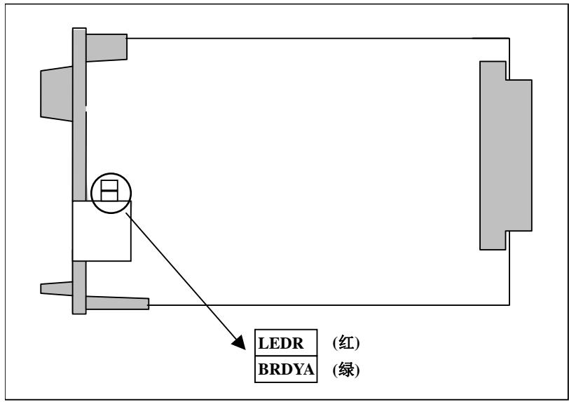

<details>
<summary>text_image</summary>

LEDR (红)
BRDYA (绿)
</details>


- LED 显示


## 2.5.3 PROFIBUS-DP板

- 规格


### PMC报警: 名称
- **故障内容**: 规格
- **处理办法**: 备注

### PMC报警: PROFIBUS-DP 主控板
- **故障内容**: A20B-8101-0050
- **处理办法**: 

### PMC报警: PROFIBUS-DP 从控板
- **故障内容**: A20B-8101-0100
- **处理办法**: 


\- 连接器的安装位置

\- PROFIBUS-DP 主控板

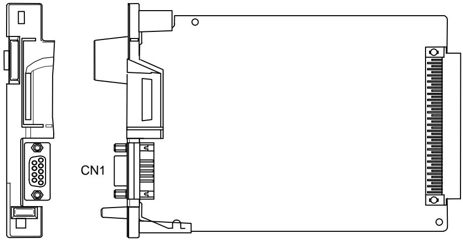

<details>
<summary>natural_image</summary>

Technical line drawing of a device rear panel with connectors and ports (no text or symbols)
</details>


• PROFIBUS-DP 从控板

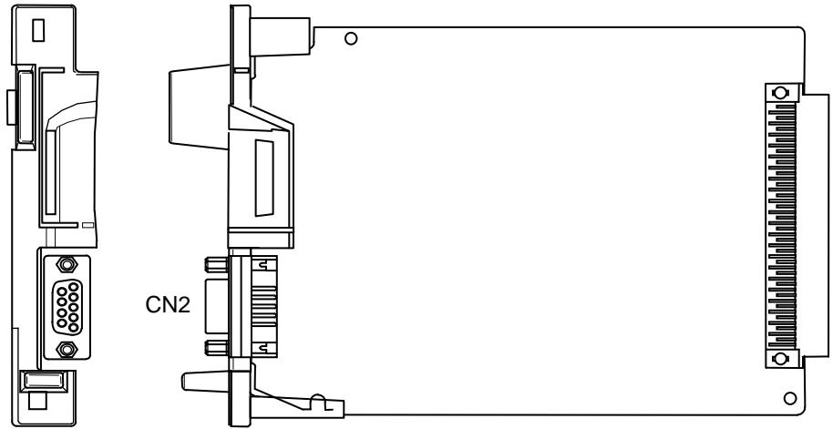

<details>
<summary>natural_image</summary>

Technical line drawing of a device rear panel with connectors and ports (no text or symbols)
</details>


- LED 显示及其内容  
• PROFIBUS-DP 主控板

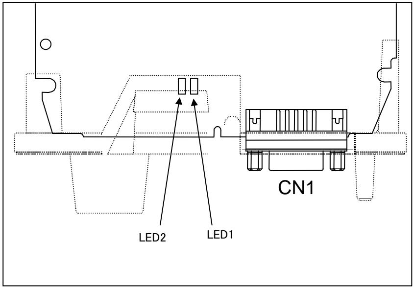

<details>
<summary>text_image</summary>

CN1
LED2
LED1
</details>


- LED 显示


### PMC报警: 名称
- **故障内容**: 颜色
- **处理办法**: 内容

### PMC报警: LED1
- **故障内容**: 绿
- **处理办法**: 表示此板的CPU已开始工作。点亮:RESET(复位)被解除,CPU已开始工作。通电时熄灭。

### PMC报警: LED2
- **故障内容**: 绿
- **处理办法**: 表示通信在正常进行着。点亮:通信在正常进行着。熄灭:尚未进行通信。通电时熄灭。


• PROFIBUS-DP 从控板  
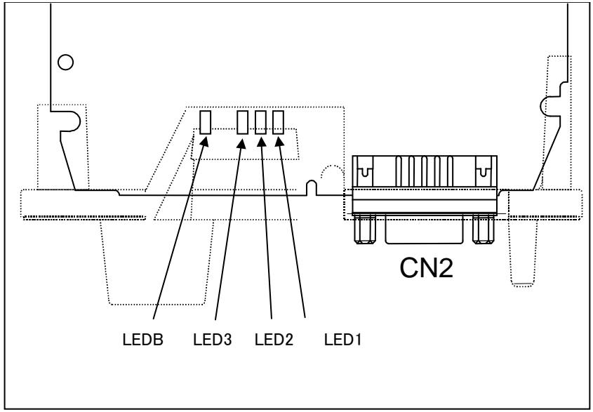

<details>
<summary>text_image</summary>

CN2
LEDB LED3 LED2 LED1
</details>


- LED 显示


### PMC报警: 名称
- **故障内容**: 颜色
- **处理办法**: 内容

### PMC报警: LED1
- **故障内容**: 绿
- **处理办法**: 表示此板的CPU已开始工作。点亮:RESET(复位)被解除,CPU已开始工作。通电时熄灭。

### PMC报警: LED2
- **故障内容**: 绿
- **处理办法**: 表示已经开始通讯。点亮:已经开始通讯。通电时,或在下列情况下熄灭。尚未接收参数数据和配置数据时接收到非法的参数数据和配置数据时

### PMC报警: LED3
- **故障内容**: 绿
- **处理办法**: 表示通信在正常进行着。点亮:通信在正常进行着。熄灭:尚未进行通信。通电时熄灭。

### PMC报警: LEDB
- **故障内容**: 红
- **处理办法**: 表示此板上发生了RAM奇偶校验报警。点亮:发生了RAM奇偶校验报警。通电时熄灭。一旦点亮以后就一直持续到电源切断为止。


## 2.5.4 DeviceNet板

规格


### PMC报警: 名称
- **故障内容**: 规格
- **处理办法**: 备注

### PMC报警: DeviceNet 主控板
- **故障内容**: A20B-8101-0220
- **处理办法**: 

### PMC报警: DeviceNet 从控板
- **故障内容**: A20B-8101-0330
- **处理办法**: 


## 连接器和 LED 的安装位置

- DeviceNet 主控板  
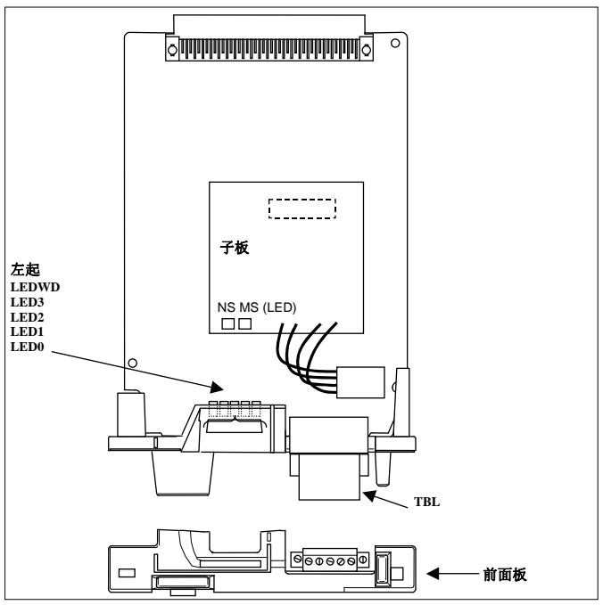

<details>
<summary>text_image</summary>

左起
LEDWD
LED3
LED2
LED1
LED0
子板
NS MS (LED)
TBL
前面板
</details>


- DeviceNet 从控板

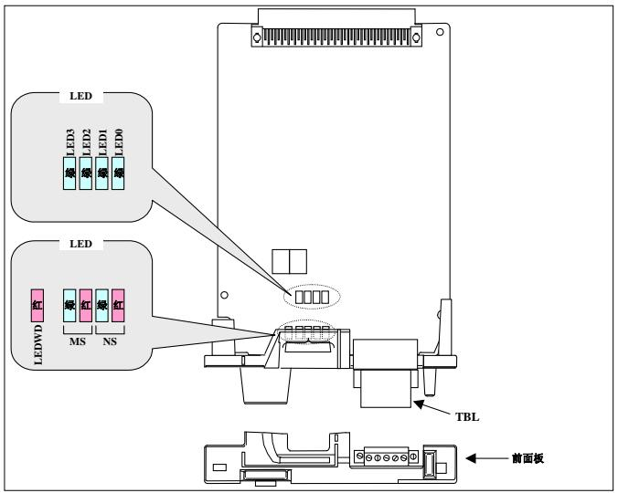

<details>
<summary>text_image</summary>

LED
LED3 LED2 LED1 LED0
LED
LED
LEDWD 红 红 红
MS NS
TBL
前面板
</details>


## LED 显示及其内容

## - DeviceNet 主控板

此板上有 4 个绿色 LED 和 1 个红色 LED，作为用于状态显示的 LED。此外，内部的子板上呈红/绿两色点亮的 2 个 LED。


### PMC报警: 名称
- **故障内容**: 颜色
- **处理办法**: 含义

### PMC报警: LED0~3
- **故障内容**: 绿
- **处理办法**: 表示 DeviceNet 应用软件的启动状态。

### PMC报警: LEDWD
- **故障内容**: 红
- **处理办法**: 表示子板的异常。

### PMC报警: MS
- **故障内容**: 红/绿
- **处理办法**: 表示模块状态,意味着自身节点的状态。

### PMC报警: NS
- **故障内容**: 红/绿
- **处理办法**: 表示网络状态,意味着包含其自身节点的网络整体的状态。


在下面的说明中，LED 点亮状态用如下符号表示：

□：熄灭 ■：点亮 ☆：闪烁 ◇：无关

## LED0、LED1、LED2、LED3 的 LED 显示变化（通电时）


### PMC报警: LED3210
- **故障内容**: 通电后的状态
- **处理办法**: 通电后停止时的处置

### PMC报警: ☐☐☐☐
- **故障内容**: 电源断开
- **处理办法**: 

### PMC报警: ■■■■
- **故障内容**: 通电后,DeviceNet应用软件也不开始启动。
- **处理办法**: DeviceNet应用软件尚未正常运行。确认是否已正确安装本软件。

### PMC报警: ☐☐☐☐
- **故障内容**: 子板的固件正在执行初始化
- **处理办法**: 请更换DeviceNet主控板。

### PMC报警: ☐☐■■
- **故障内容**: 正在读出DeviceNet参数
- **处理办法**: 确认是否已购买DeviceNet主控功能(软件选项)。

### PMC报警: ☐■☐☐
- **故障内容**: DeviceNet参数的“网络”正在确认“联机”
- **处理办法**: 请将DeviceNet参数的“网络”设定为“联机”。

### PMC报警: ☐■☐■
- **故障内容**: 正在设定DeviceNet参数的总线参数
- **处理办法**: 请更换DeviceNet主控板。

### PMC报警: ☐■■☐
- **故障内容**: 正在设定DeviceNet参数的从控参数
- **处理办法**: 请正确设定DeviceNet参数的从控参数。设定正确时,更换DeviceNet主控板。

### PMC报警: ☐■■■
- **故障内容**: 正在检查MAC ID的重复
- **处理办法**: 确认是否与从控设备的MAC ID重复。确认电缆是否已正确连接。确认是否已经供给用于通信的电源。确认从控设备是否已经通电。

### PMC报警: ■☐☐☐
- **故障内容**: DeviceNet应用软件的初始化结束,开始I/O通信。
- **处理办法**: 


LED0、LED1、LED2、LED3 的 LED 显示变化（发生异常时）


### PMC报警: LED3 2 1 0
- **故障内容**: 状态
- **处理办法**: 含义

### PMC报警: □□□□↑↓■■■■(反复)
- **故障内容**: 子板异常
- **处理办法**: 这是子板的故障。请更换 DeviceNet 主控板。


LEDWD 的 LED 显示


### PMC报警: LED 显示
- **故障内容**: 状态
- **处理办法**: 含义

### PMC报警: ■
- **故障内容**: 子板异常
- **处理办法**: 这是子板的故障。请更换 DeviceNet 主控板。


MS、NS 的 LED 显示（正常动作中）


### PMC报警: LED 显示
- **故障内容**: 状态
- **处理办法**: 含义

### PMC报警: MS □NS □
- **故障内容**: 刚刚通电后
- **处理办法**: 子板的 MPU 处在复位状态。

### PMC报警: MS ☆ 绿NS □
- **故障内容**: 正在进行初始化处理
- **处理办法**: 子板的固件正在进行初始化处理。

### PMC报警: MS ■ 绿NS □
- **故障内容**: 正在检查 MAC ID 是否重复
- **处理办法**: 子板的固件正在检查 MAC ID 是否重复。

### PMC报警: MS ■ 绿NS ☆ 绿
- **故障内容**: I/O 通信处在停止状态
- **处理办法**: 子板的固件停止 I/O 通信。

### PMC报警: MS ■ 绿NS ■ 绿
- **故障内容**: 正在进行 I/O 通信
- **处理办法**: 子板的固件在正常进行 I/O 通信。


MS、NS 的 LED 显示（发生异常时）


### PMC报警: LED 显示
- **故障内容**: 状态
- **处理办法**: 异常内容和处理办法

### PMC报警: MS ☆红NS ◇
- **故障内容**: 子板异常
- **处理办法**: MAC ID、通信速度的设定异常、或者子板的故障。设定正确时,更换 DeviceNet 主控板。

### PMC报警: MS ■红NS □
- **故障内容**: 子板异常
- **处理办法**: 这是子板的故障。请更换 DeviceNet 主控板。

### PMC报警: MS ◇NS ■红
- **故障内容**: MAC ID 重复
- **处理办法**: MAC ID 重复。请确认下列项目。→检查所有节点的 MAC ID、MAC ID 是否重复?

### PMC报警: MS ◇NS □
- **故障内容**: 网络电源异常
- **处理办法**: 尚未供给用于通信的电源。请确认下列项目。→确认是否已经正确供给用于通信的电源。

### PMC报警: MS ◇NS ☆红
- **故障内容**: 没有从动装置
- **处理办法**: 没有从动装置存在。请确认下列项目。→从动装置的电源是否已经接通?→所有节点的通信速度设定是否相同?→电缆长度是否适当?→电缆是否松弛或者断线?→终端电阻是否只在干线的两端?→噪声对策是否适当?


## DeviceNet 从控板

本板上,作为状态显示用的 LED,有 4 个绿色 LED (LED0～3)和 1 个红色 LED(LEDWD),进而还有 2 类 LED(MS 和 NS),其各具备一个红色 LED 和绿色 LED。


### PMC报警: 名称
- **故障内容**: 颜色
- **处理办法**: 含义

### PMC报警: LED0~3
- **故障内容**: 绿
- **处理办法**: 表示 DeviceNet 应用软件的启动状态。

### PMC报警: LEDWD
- **故障内容**: 红
- **处理办法**: 表示 DeviceNet 从控板的异常。

### PMC报警: MS
- **故障内容**: 绿
- **处理办法**: 表示模块状态,意味着自身节点的状态。

### PMC报警: NS
- **故障内容**: 绿
- **处理办法**: 表示网络状态,意味着包含其自身节点的网络整体的状态。


在下面的说明中，LED 点亮状态用如下符号表示：

□：熄灭 ■：点亮 ☆：闪烁 ◇：无关 ?：不确定

## LED0、LED1、LED2、LED3 的 LED 显示变化


### PMC报警: LED3210
- **故障内容**: 通电后停止时的状态和原因
- **处理办法**: 通电后停止时的处理办法

### PMC报警: □□□□
- **故障内容**: 电源断开
- **处理办法**: 

### PMC报警: ■■■■
- **故障内容**: 通电后,DeviceNet应用软件也不开始启动。或者,DeviceNet从控功能(软件选项)尚未处在有效状态。
- **处理办法**: DeviceNet应用软件尚未正常运行。确认是否已正确安装本软件。或者确认是否已经购买DeviceNet从控功能(软件选项)。请更换DeviceNet从控板。

### PMC报警: □□■□
- **故障内容**: 线路波特率检测中
- **处理办法**: 确认与DeviceNet主控板之间的通讯状态。有可能是由于网络电源异常,确认是否已经供给用于通讯的电源。无法恢复的情况下,更换DeviceNet从控板。


## LEDWD 的 LED 显示


### PMC报警: LED 显示
- **故障内容**: 状态
- **处理办法**: 含义

### PMC报警: ■
- **故障内容**: 板异常
- **处理办法**: 这是 DeviceNet 从控板的故障。请更换 DeviceNet 从控板。


## MS、NS 的 LED 显示（正常动作中）

正常动作中，只要通讯正常建立，就意味着已成为“I/O 通讯正常”状态。


### PMC报警: LED 显示
- **故障内容**: 状态
- **处理办法**: 含义

### PMC报警: MS □ 绿MS □ 红NS □ 绿NS □ 红
- **故障内容**: 刚刚通电后
- **处理办法**: 板的 MPU 处在复位状态,或者在复位解除后,板的固件正在进行初始化。

### PMC报警: MS ■ 绿MS □ 红NS □ 绿NS □ 红
- **故障内容**: 通讯准备中
- **处理办法**: 板的固件在按照以下步骤进行处理。1DeviceNet 应用软件的初始化完成等待2波特率检测3MAC ID 重复检测

### PMC报警: MS ■ 绿MS □ 红NS ☆ 绿NS □ 红
- **故障内容**: I/O 通讯建立等待
- **处理办法**: 各状态与 DeviceNet MPU 状态变化对应。


## MS、NS 的 LED 显示（发生无法恢复的异常时）

发生无法恢复的异常时，是指一旦发生异常，若不再次接通本从控站的电源就无法恢复的情形。


### PMC报警: LED 显示
- **故障内容**: LED3 2 1 0
- **处理办法**: 状态

### PMC报警: MS ◇ 绿MS ◇ 红NS □ 绿NS ■ 红
- **故障内容**: ■□□□↑↓□□■□(反复)
- **处理办法**: MAC ID 重复

### PMC报警: ■□□□↑↓□□■■(反复)
- **故障内容**: Buoff 检测
- **处理办法**: 确认以下项目,并重新接通从控装置的电源。→所有节点的通信速度设定是否相同?→电缆长度是否适当?→电缆是否松弛或者断线?→终端电阻是否只在干线的两端?→噪声对策是否适当?

### PMC报警: MS □ 绿MS ■ 红NS ◇ 绿NS ◇ 红
- **故障内容**: ■□□□↑↓□???(反复)
- **处理办法**: 板异常

### PMC报警: MS ◇ 绿MS ◇ 红NS ◇ 绿NS ◇ 红
- **故障内容**: □□□□↑↓■■■■(反复)
- **处理办法**: 这是 CNC 侧的恢复无法进行的异常。


## 2.5.5 CC-Link板

规格


### PMC报警: 名称
- **故障内容**: 规格
- **处理办法**: 备注

### PMC报警: CC-Link 遥控设备站板
- **故障内容**: A20B-8101-0551
- **处理办法**: 


连接器和 LED 的安装位置

\- CC-Link 遥控设备站板

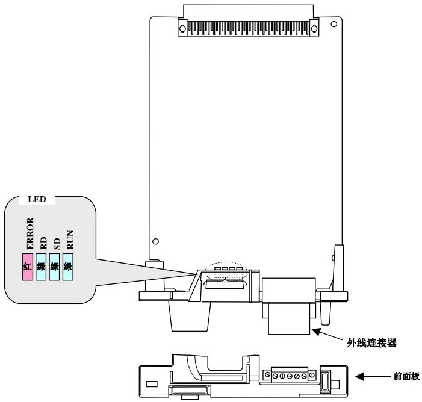

<details>
<summary>text_image</summary>

LED
ERROR
RD
SD
RUN
红
绿
绿
绿
外线连接器
前面板
</details>

## LED 显示及其内容

\- CC-Link 遥控设备站板

此板上有 3 个绿色 LED 和 1 个红色 LED，作为用于状态显示的 LED。


### PMC报警: 名称
- **故障内容**: 颜色
- **处理办法**: 点亮

### PMC报警: RUN
- **故障内容**: 绿
- **处理办法**: 在线

### PMC报警: SD
- **故障内容**: 绿
- **处理办法**: 数据发送中

### PMC报警: RD
- **故障内容**: 绿
- **处理办法**: 通道载波检测

### PMC报警: ERROR
- **故障内容**: 红
- **处理办法**: CRC 错误检测


在通常的正常通信状态下，成为如下所示的点亮状态。


注释

SD在其网络上的设备较少时会高速闪烁，因而有的情况下在目视时看上好像不是闪烁而好像是点亮。

## 异常发生时的 LED 显示

成为如下的 LED 状态时，请按照下表确认设定

□：熄灭 ■：点亮 ☆：闪烁 ◇：无关


### PMC报警: LED
- **故障内容**: 状态的含义
- **处理办法**: 确认项目

### PMC报警: RUN
- **故障内容**: SD
- **处理办法**: RD

### PMC报警: ◇
- **故障内容**: ◇
- **处理办法**: ◇

### PMC报警: ■
- **故障内容**: □
- **处理办法**: ■

### PMC报警: □
- **故障内容**: ☆
- **处理办法**: ■

### PMC报警: □
- **故障内容**: □
- **处理办法**: ■

### PMC报警: □
- **故障内容**: □
- **处理办法**: □


## 2.6 设置环境

## 2.6.1 电柜外部的环境条件

发那科公司所提供的控制单元和周边各单元在设计时以将其收放在密封的电柜内为前提条件。这里所说的电柜是指下列所示者。

- 收放在控制单元和周边单元内的、由机床制造商制作的电柜  
- 收放在显示单元、MDI单元和操作盘内的、由机床制造商制作的操作用悬吊开关盒  
- 其他类似上述者

这些电柜的设置环境条件如下所示。


### PMC报警: 电柜外部的周围温度
- **故障内容**: 运行时
- **处理办法**: 0°C~45°C

### PMC报警: 湿度
- **故障内容**: 通常
- **处理办法**: 相对湿度75%以下。不应有结露。

### PMC报警: 振动
- **故障内容**: 运行时
- **处理办法**: 4.9m/s2(0.5G)以下

### PMC报警: 标高
- **故障内容**: 运行时
- **处理办法**: 1000m以下(参照2.7.2项的注释1)


## 2.6.2 控制单元的设置条件


### PMC报警: 环境温度
- **故障内容**: 运行时
- **处理办法**: 0°C~58°C

### PMC报警: 湿度
- **故障内容**: 通常
- **处理办法**: 相对湿度75%以下。不应有结露。

### PMC报警: 振动
- **故障内容**: 运行时
- **处理办法**: 4.9m/s2(0.5G)以下。我公司评价试验已在符合IEC 60068-2-6的如下条件下实施。10~58Hz:0.075mm(振幅)58~500Hz:9.8m/s2(1.0G)振动方向:X,Y,Z的各方向扫描次数:10循环

### PMC报警: 标高
- **故障内容**: 运行时
- **处理办法**: 1000m以下(注释1)


## 注释

1 控制单元的设置场所超过标高 1000m 时，机柜内部的控制单元的环境温度上限受到限制。从标高 1000m 起，每上升 100m 应使机柜内部的控制单元的容许环境温度的上限降低 1.0℃。

例）运转时的周围温度规定 $0^{\circ}C \sim 55^{\circ}C$ 的控制单元，在标高 1750m 下使用的情形

$55^{\circ}\mathrm{C} - (1750\mathrm{m - }1000\mathrm{m}) / 100\mathrm{m}\times 1.0^{\circ}\mathrm{C} = 47.5^{\circ}\mathrm{C}$

因此，容许环境温度就是 $0^{\circ}C \sim 47.5^{\circ}C$ 。

2 使用另行规定了设置条件的单元时，需要同时满足该规定。

## 2.7 针对接地、噪声的注意事项

电柜和悬吊开关盒内部，已经采取接地线的连接和电缆线的布线上的分离等、通常针对触电和噪声的对策。为更换安装在电柜和悬吊开关盒上的控制单元以及周边单元等装置而拆下接地线时、以及暂时变更其它的连接电缆的路径和捆绑状态时，基本上要恢复到原先的连接状态。无法正确恢复这些连接状态时，有可能导致触电、噪声的引发、单元的错误动作。

本节中，就电缆的分离思路、以及作为噪声对策的噪声抑制器、电缆的缆夹以及屏蔽处理、雷涌保护器进行描述。

## 2.7.1 电缆的分离

按照下面所示对 CNC 机床上所使用的电缆进行分类。对于各群组的电缆，需要处理办法栏进行处理。

表 2.7.1 电缆的分类


### PMC报警: 组
- **故障内容**: 信号内容
- **处理办法**: 处理办法

### PMC报警: A
- **故障内容**: 1次端AC电源线
- **处理办法**: 请与B、C组的电缆分开捆绑 $^{(注释1)}$ ,或者进行电磁屏蔽 $^{(注释2)}$ 。请参阅2.8.2项的噪声抑制器,在电磁线圈、继电器上安装灭弧器或二极管。

### PMC报警: B
- **故障内容**: DC电磁线圈(DC24V)
- **处理办法**: 请在DC电磁线圈、继电器上安装二极管。请与A组电缆分开捆绑,或者采用电磁屏蔽。请尽可能与C组分开。最好应用2.8.3项的屏蔽处理。

### PMC报警: C
- **故障内容**: I/O Link 电缆
- **处理办法**: 请与 A 组电缆分开捆绑,或者采用电磁屏蔽。请尽可能与 B 组分开。务须进行 2.8.3 项描述的屏蔽处理。


## 注释

1 与某组的电缆分开捆绑，意为“与某组的电缆离开 10 cm 以上而单独捆绑”。  
2 所谓电磁屏蔽，是指“用已经接地的金属板(铁制)对组与组之间进行屏蔽处理”。  
3 MDI 用电缆在 50cm 长以内的情况下，无须进行屏蔽。


## 注意

有关电缆的线长，请选择适当的长度。电缆不宜过长，否则会导致抗噪声下降，并有可能诱发其他电缆产生噪声。此外，如果将多余的电缆卷绕起来处理，会导致感应增大，在信号的 ON/OFF 时会引发非常高的电压，从而导致故障或者噪声引起的错误动作，应予注意。

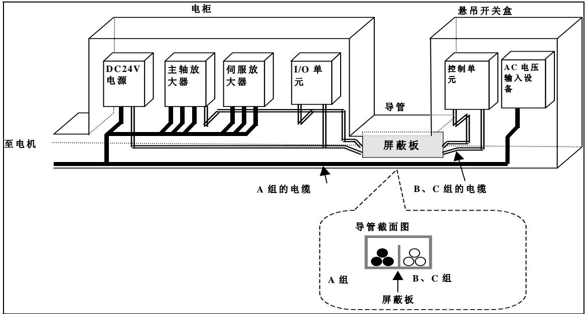

<details>
<summary>flowchart</summary>

```mermaid
graph TD
  A["电柜"] --> B["DC24V电源"]
  A --> C["主轴放大器"]
  A --> D["伺服放大器"]
  A --> E["I/O单元"]
  F["悬吊开关盒"] --> G["控制单元"]
  F --> H["AC电压输入设备"]
  I["至电机"] --> J["屏蔽板"]
  K["A组的电缆"] --> J
  L["B、C组的电缆"] --> J
  M["导管截面图"] --> N["A组"]
  M --> O["B、C组"]
  P["屏蔽板"] --> Q["导管"]
```
</details>

图 2.7.1 电缆布线布局示例

## 2.7.2 噪声抑制器

作为针对强电盘上使用的电磁线圈、继电器等传动装置的噪声对策，需要使用噪声抑制器。

将电能转换为机械动作的传动装置，由于是电感负载，在断续时会与回路的寄生容量共振，在接点中产生伴随电压急速上升和下降的间歇电弧，会导致电磁波的产生而影响电子回路。为了采取预防对策，对电感负载需要进行如下处理。

1) 请参照针对 2.7.1 项 “电缆的分离” 的 A 组、B 组的处理办法，在交流回路的电感负载中使用 CR 减振器(Snubber) 回路，直流回路的情况下请使用二极管。  
2) 选定时，请参照如下“二极管的选定和使用上的注意事项”。

## CR 减振器的选定和使用上的注意事项

\- 交流回路中请使用 CR 减振器(Snubber)。

电压钳位元件的压敏电阻虽然能够限制振动电压波形的峰值，但是无法缓和电压的急剧变化。因此，建议使用 CR 减振器。

\- CR 减振器的电阻和电容器的规格，基于电感负载的稳态电流值 I(A) 以及直流电阻值 RL(Ω)，

1) CR 减振器的电阻值: R ≅ RL(Ω)

2) CR 减振器的静电电容值: $\frac{\mathrm{I}^2}{10} \leq \mathrm{C} \leq \frac{\mathrm{I}^2}{20}$ ( $\mu\mathrm{F}$ )

\- 将 CR 减振器配置在电感负载的附近，布线要尽量短。

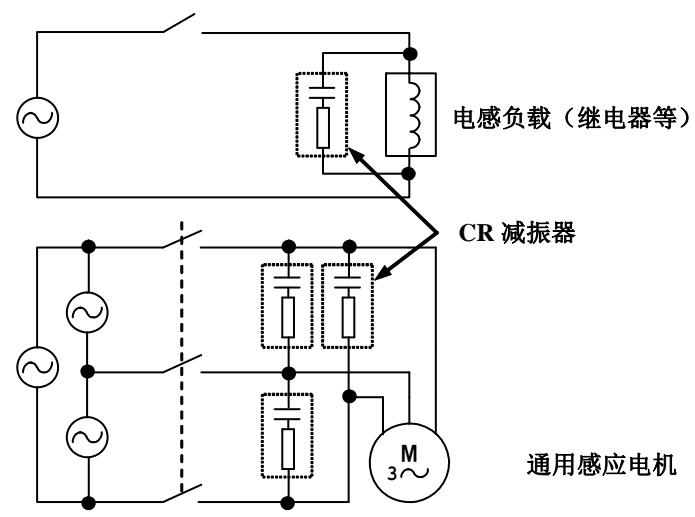

<details>
<summary>text_image</summary>

电感负载（继电器等）
CR 减振器
通用感应电机
</details>

图 2.7.2 (a) CR 减振器的应用例

## 二极管的选定和使用上的注意事项

- 直流驱动回路的噪声抑制器上可以使用二极管（freewheeling diode）。  
- 二极管的规格，请根据电感负载(电磁线圈、继电器线圈、电机)的驱动电压和电流，设定为

1) 额定电压：向电感负载的施加电压的大约 2 倍

2) 额定电流：向电感负载的稳态电流的大约 2 倍

\- 将二极管配置在电感负载两端的附近，布线要尽量短。

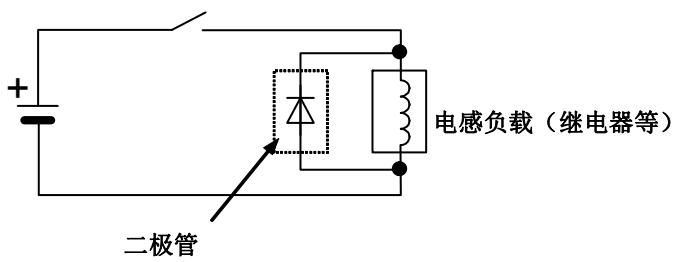

<details>
<summary>text_image</summary>

+
二极管
电感负载（继电器等）
</details>

图 2.7.2 (b) 二极管的应用例

## 2.7.3 电缆夹和屏蔽处理

为了抑制来自外部的噪声的影响，拉接到本控制单元以及伺服放大器、主轴放大器等上的电缆中需要进行屏蔽处理的电缆已被夹住 (有关信号线，基本上需要进行屏蔽装夹)。

剥除电缆的部分包覆使屏蔽外表皮露出，用电缆夹配件将该部分推压到接地板上。此时，接地板和屏蔽外表皮的接触部分成为面接触。需要设法扩大接触面积。

电缆夹用接地板，需要按照图 2.8.3 (a) 所示方式设置。

使用多点接地方式时，剥掉将屏蔽装夹用接地板连接到电柜上的部分涂装，使其面接触。

使用中继连接器等使电缆分离的情况下，需要进行预防在两电缆的屏蔽中继部分中断、阻抗增大的处理。此外，在电柜的入口处分离的情况下，也需要对直到机电柜电缆的连接目的地进行屏蔽，因而需要进行同样的处理。

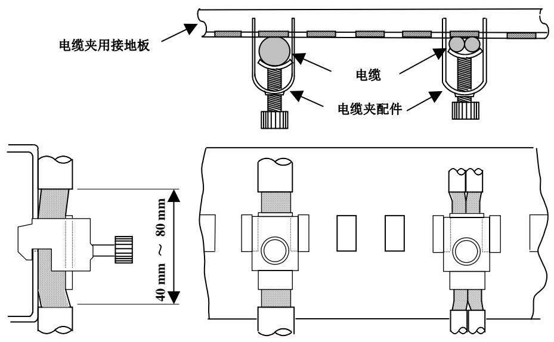

<details>
<summary>text_image</summary>

电缆夹用接地板
电缆
电缆夹配件
80 mm
40 mm
</details>

图 2.7.3 (a) 电缆夹 (1)

注释

将引入控制单元、放大器的电缆归放到紧靠每个单元的附近并将其屏蔽外表皮夹起来。

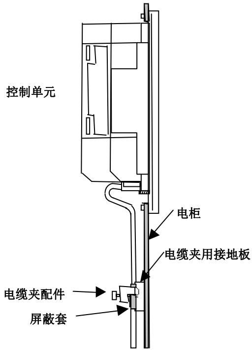

<details>
<summary>text_image</summary>

控制单元
电柜
电缆夹用接地板
电缆夹配件
屏蔽套
</details>

图 2.7.3 (b) 电缆夹 (2)

电缆夹用接地板请准备如下形状的。

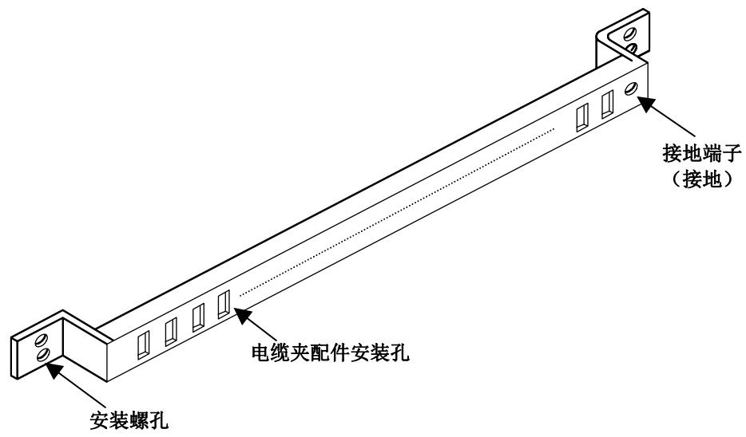

<details>
<summary>text_image</summary>

接地端子
（接地）
电缆夹配件安装孔
安装螺孔
</details>

图 2.7.3 (c) 电缆夹用接地板（外形图）

电缆夹用接地板应使用厚 2mm 以上的铁板，表面应进行镀镍处理。

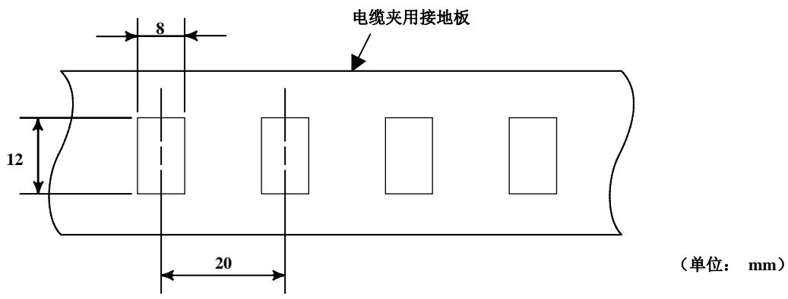

<details>
<summary>text_image</summary>

电缆夹用接地板
8
12
20
（单位： mm）
</details>

图 2.7.3 (d) 电缆夹用接地板（钻孔图）  
参考

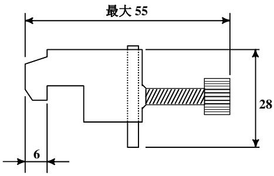

<details>
<summary>text_image</summary>

最大 55
6
28
</details>

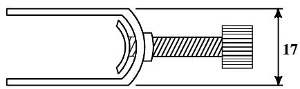

<details>
<summary>natural_image</summary>

Technical line drawing of a mechanical component with a central threaded shaft and flange (no text or symbols)
</details>

(单位: mm)  
图 2.7.3 (e) 电缆夹配件（外形图）

电缆夹配件的备货规格

A02B-0303-K001（电缆夹配件8个）

## 2.7.4 雷涌保护器

为了保护装置免受雷击引起的雷涌电压的影响，输入电源的线间以及接地间设置雷涌保护器将十分有效。但是，这并非保证可对所有雷涌都能够进行保护。雷涌保护器的设置方法以下所示。

## 设置方法

按照下图所示方式将雷涌对策的雷涌吸收元件安装在输入电源部上。下图为没有虚线部的绝缘变压器的情形。有绝缘变压器的情况下，不需要雷涌吸收元件②（接地间）。

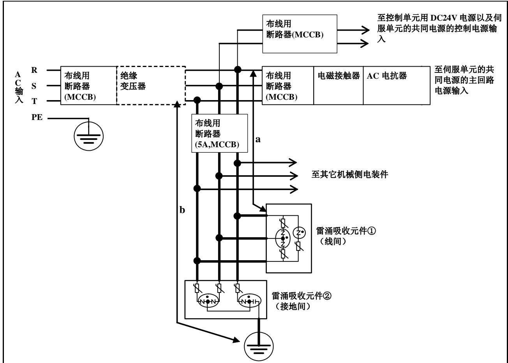

<details>
<summary>flowchart</summary>

```mermaid
graph TD
  A["AC输入"] --> B["R"]
  A --> C["S"]
  A --> D["T"]
  A --> E["PE"]
  B --> F["布线用断路器(MCCB)"]
  C --> F
  D --> F
  E --> F
  F --> G["绝缘变压器"]
  G --> H["布线用断路器(5A,MCCB)"]
  H --> I["a"]
  H --> J["b"]
  I --> K["至其它机械侧电装件"]
  J --> L["雷涌吸收元件①(线间)"]
  L --> M["雷涌吸收元件②(接地间)"]
  M --> N["至控制单元用DC24V电源以及伺服单元的共同电源的控制电源输入"]
  M --> O["至伺服单元的共同电源的主回路电源输入"]
  P["布线用断路器(MCCB)"] --> Q["至控制单元用DC24V电源以及伺服单元的共同电源的控制电源输入"]
  P --> R["布线用断路器(MCCB)"]
  P --> S["电磁接触器"]
  P --> T["AC电抗器"]
```
</details>

图 2.7.4 向 AC 200V 线路设置雷涌保护器的示例


## 注意

1 为提高雷涌吸收效果，应尽量设法缩短粗线的布线。

线材 : 导体截面积 $2mm^{2}$ 以上

线长 雷涌吸收素子①的连接线长a以及雷涌吸收素子②的连接线长b在线长合计 $2\mathrm{m}$ 以下

2 向电源线路施加过电压(AC1000V, AC1500V)而进行绝缘抗压试验时，根据施加电压，会导致雷涌吸收元件动作，因而需要拆除雷涌吸收元件②后进行试验。  
3 在向雷涌吸收元件施加允许以上的浪涌电压而导致雷涌吸收元件的短路故障时，为保护线而需要布线用断路器(5A)。

## 注释

雷涌吸收元件①、②在通常情况下不会有电流流过，因而布线用断路器(5A)可以与其它机床侧电装件合用。可以在伺服单元的共同电源的控制电源和主轴电机的风扇电机用电源上使用。

## 3 更换控制单元的维修部件

## 3.1 更换时的注意事项

## !

## 警告

1 更换作业应由在维修及安全方面受过充分培训的人员进行。在打开机柜进行更换作业时，小心不要接触高压电路部分（标有△标记并配有绝缘盖）。触摸不加盖板的高压电路，会导致触电。  
2 务必在断开外部供给电源的状态下进行。若不断开电源，恐会导致触电、破损、破裂等。
在仅仅断开控制单元电源的情况下，伺服装置等电源有可能尚处在激活状态，在更换单元时，可能会导致单元的损坏或触电。  
3 为了预防静电引起的破损，触摸到印刷电路板或单元的情形以及连接电缆时，应采取适当措施，如戴上腕带。人体发出的静电，有时会损坏电路。  
4 伺服放大器和主轴放大器上，即使在断开电源稍过一会之后仍然有残余电压，触摸这类设备会导致触电。请在断开电源经过20分后再更换放大器。  
5 更换单元时，应使更换前的单元与更换后的单元的设定和参数保持一致。（详情请参阅该装置的说明书。）如果不是在相同状态下进行运转，则会因为机床预想不到的动作而损坏工件和机床，或导致操作者受伤。  
6 通电中发生异常响声、异味、冒烟、起火、异常发热等从外观来看明显是硬件故障的现象时，应迅速断开电源。否则恐会导致火灾、破损、破裂、误动作等。  
7 控制单元、伺服放大器、主轴电机等的散热片，即使在断开电源后也将处于高温，触摸该部位恐会导致烫伤。请在确认冷却后进行操作。  
8 更换重物时，必须有2名以上的作业人员配合进行。如果仅由1名作业人员进行，有时会由于更换单元的落下而导致作业人员受伤。  
9 要注意避免损坏电缆。否则会导致触电等。  
10 要穿着考虑安全的服装进行作业。否则恐会导致受伤、触电等。  
11 请勿湿者手进行作业。否则恐会导致触电或损坏电路。

## 注释

1 FROM/SRAM 模块更换时，由我公司维修服务部门进行系统软件的安装。  
2 显示器使用非常精密的加工技术制作而成，但是由于其特性，有时会存在像素缺陷和经常点亮的像素。但是这并非故障，请予谅解。  
显示器上所使用的背光灯是具有寿命的部件，随着长期使用，其亮度将会下降。虽然采用 FA 用的长寿命背光灯，但是根据使用环境，特别是使用温度，亮度下降将会加速，有时会难于亮灯。  
此外，在不使用时，通过屏幕保护功能使得画面灭灯，实际上可以经减缓亮度的下降。但是，请勿频繁进行画面的显示 / 灭灯。进行 30 分钟以上的画面灭灯将有一定的效果。

## 3.1.1 关于选项信息文件

本控制单元对应 “FANUC 遥控选项系统”。选项参数被作为选项信息文件（文件名 “OPRM INF”）保存在 FROM 内。

## 恢复选项信息文件时的注意事项

1) 在进行 SRAM 数据和用户文件的备份时，请同时进行 FROM 内的选项信息文件（文件名 “OPRM INF”）的备份。选项信息文件的备份，在选项信息损坏时等恢复作业中需要用上。  
2) 进行选项信息文件的恢复操作时，通电时会发生 “PS5523 选项认证等待状态” 报警，需要在有效期限内（报警发生后 30 天以内），进行基于我公司服务的选项参数的认证作业。（只要是在有效期限内，只要按下复位键，就可以取消报警 PS5523。）  
有关认证作业，请委托我公司维修服务部门进行。

## 3.1.2 单元的安装和拆卸

一体型控制单元、显示单元、MDI 单元以及机床操作面板有两种类型：从单元背面用 M4 螺母进行固定的类型和从单元前面用 M3 螺钉进行固定的类型。有关从前面进行安装的单元，四角的螺钉安装孔上已安装有螺帽。
从用 M3 螺钉进行固定的前述单元的机柜等上进行拆除以及安装，要按照如下步骤注意螺帽地进行。

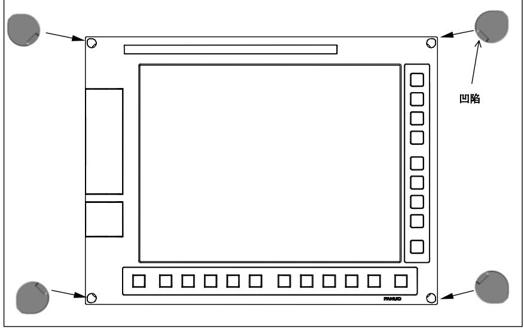

<details>
<summary>text_image</summary>

凹陷
PANJO
</details>

## 拆卸方法

1. 将精密螺丝刀（一）等插入四角的螺钉安装孔上安装的螺帽的凹陷处，拉出螺帽。  
2. 转动螺帽下的螺丝，拆下单元。

## 安装方法

1. 用螺钉固定四角的螺钉安装孔。用适当的安装力矩拧紧螺钉。  
2. 注意使螺帽的凹陷位置成为与图中所示相同的方向，将螺帽安装在螺钉安装孔上。进行按压，直到螺帽的表面与单元的表面成为相同的高度。

注释

请按照如下规格选购螺帽。

A02B-0319-K190: 内装螺帽 100 个

A02B-0319-K191：内装螺帽5个

## 3.1.3 关于单元以及接地端子安装时的安装力矩

本说明书所载的单元类以及接地端子的安装中使用的螺钉和螺母的安装力矩，按照如下规定。


但是，位置检测器接口单元等、安装部为成形品时的安装力矩如下所示。


## 注意

紧固螺钉时，务必遵守上述规定进行安装。紧固得太松，紧固得太紧，都将会导致单元落下、破损、错误动作等。

特别是带有触摸板的单元，上述规定以外的安装力矩时，控制引致触摸板的动作不良，要严格遵守安装力矩的规定。

注释

有关另行规定了设置条件的单元，则应优先考虑该规定。

## 3.1.4 关于密封件

发那科公司提供的显示器和操作面板类等各单元，以使用密封件并以规定的螺钉扭矩安装为前提设计而成。没有正确安装的情况下，恐会导致单元的破损和错误动作，因而务必使用密封件并以规定的螺钉扭矩进行安装。为了避免在更换后切削液等侵入内部，要小心谨慎地进行密封件的更换。另外，要注意如下事项安装密封件。

密封件上设有螺孔时，要做到没有接缝。否则切削液将会从接缝中侵入，导致故障。

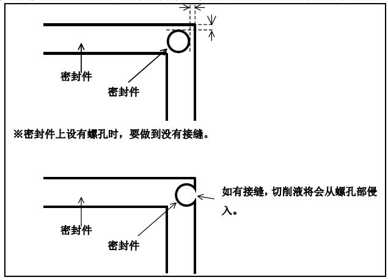

<details>
<summary>text_image</summary>

密封件
密封件
※密封件上设有螺孔时，要做到没有接缝。
如有接缝，切削液将会从螺孔部侵入。
</details>

## 关于显示器、MDI 单元以及机床操作面板用密封件

有关显示器、MDI 单元以及机床操作面板上使用的密封件的厚度、硬度，要以如下值为大致标准。

厚度: 1.4mm(含两面胶布)

硬度: 8(阿斯卡 C)

另外，可以从发那科公司购买如下密封件。本密封件具有导电性，安装到机柜和悬吊开关盒时，在单元、机柜和悬吊开关盒之间电气间隙将会消失，作为电磁波的屏蔽等 EMC 对策也有效。


## 注意

1 上述密封件，虽然已经通过各种切削液实施了评价，但是并非对所有切削液都具有耐受性。譬如，对于含有活性度非常高的硫磺或者氯的切削液和碱性度高的水溶性切削液等，则并不具有耐受性。  
2 要按照随附的注意事项粘贴上述密封件。

有关显示器、MDI单元以及机床操作面板，要注意避免在机柜和悬吊开关盒的安装面和单元周缘间夹住密封件地安装密封件。

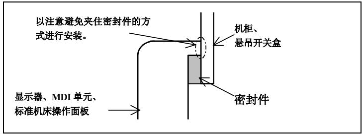

<details>
<summary>text_image</summary>

以注意避免夹住密封件的方式进行安装。
机柜、
悬吊开关盒
显示器、MDI单元、
标准机床操作面板
密封件
</details>

## 3.2 更换主板


## 注意

进行更换作业前，要对 CNC 的 SRAM 内的数据（参数、程序等）进行备份。因为在更换作业中，有可能导致 SRAM 内的数据丢失。备份方法，请参阅第 5 章 输入/输出数据以及附录 C 引导系统。同时参照 3.1.1 项 关于选项信息文件。

## 3.2.1 显示器一体型控制单元

## 更换步骤

1) 拆除控制单元上连接的电缆类，参照 3.1.2 项 “单元的安装和拆卸”，从机柜等上拆除控制单元。  
2) 从主板上拧下壳体单元下侧的 2 个螺钉。在结构上采用无法从壳体单元上拧下螺钉。  
3) 一边拆除闩锁在壳体单元上部两侧的基座金属板上的卡爪，一边拉出壳体单元。可以在安装着后面板、风扇电机以及锂电池的状态下拉出。

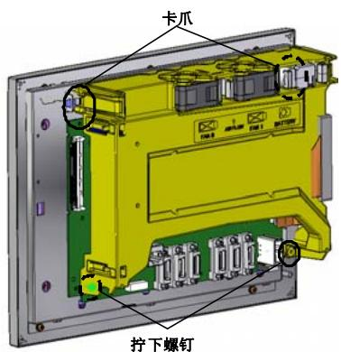

<details>
<summary>text_image</summary>

卡爪
拧下螺钉
</details>

注释）在结构上采用无法从壳体上拧下螺钉。

4) 拆除主板上的连接器上所连接的各电缆，拧下固定着主板的螺钉。

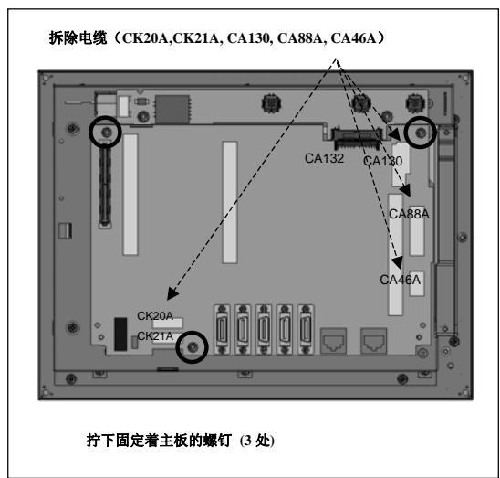

<details>
<summary>text_image</summary>

拆除电缆（CK20A, CK21A, CA130, CA88A, CA46A）
CA132
CA130
CA88A
CA46A
CK20A
CK21A
拧下固定着主板的螺钉（3处）
</details>

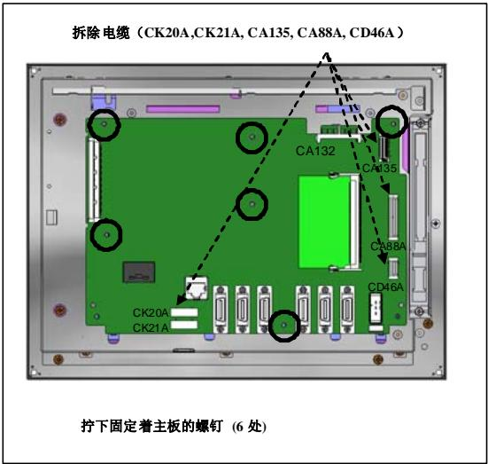

<details>
<summary>text_image</summary>

拆除电缆（CK20A,CK21A,CA135,CA88A,CD46A）
CA132
CA135
CA88A
CD46A
CK20A
CK21A
拧下固定着主板的螺钉（6处）
</details>

带有 10.4” LCD 单元的情形

5) 通过连接器 CA132（风扇适配器用），连接有主板和风扇适配器，请一边将主板向下错开，一边将其拆除。  
6) 换装主板上的 FROM/SRAM 模块，更换主板。  
7) 将主板和风扇适配器连接起来，用螺钉固定主板。此外，将各电缆重新装到主板上的连接器上。要注意避免弄错电缆类的安装。  
8) 将壳体对准在螺钉以及闩锁的位置，慢慢地嵌入。嵌入时要确认已切实地将安装在壳体上的后面板和主板的连接器连接起来，并注意避免施加过猛的外力。确认壳体单元已切实锁住后，拧紧壳体单元的螺钉。此外，要确认风扇电机以及电池已切实连接好。  
9) 请参阅 3.1.2 项 “单元的安装和拆卸”，将机柜等安装在控制单元上。重新装上控制单元上所连接的电缆类。要注意避免弄错电缆类的安装。

注释

更换带有触摸板的控制单元上的主板时，需要进行触摸板的校正。有关触摸板的校正方法，请参阅3.13节。

## 3.3 更换LCD单元

## 3.3.1 显示器一体型控制单元（8.4”LCD单元和10.4”LCD单元）


## 注意

进行更换作业前，要对 CNC 的 SRAM 内的数据（参数、程序等）进行备份。因为在更换作业中，有可能导致 SRAM 内的数据丢失。备份方法，请参阅第 5 章 输入/输出数据，附录 C 引导系统以及附录 H 存储器清除。同时参照 3.1.1 项 关于选项信息文件。

## 更换步骤

1) 拧下下部的螺钉，拆除闩锁在上部的卡爪，同时拉出壳体单元。

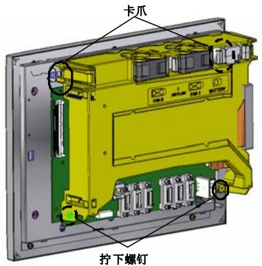

<details>
<summary>text_image</summary>

卡爪
拧下螺钉
</details>

注释）在结构上采用无法从壳体上拧下螺钉。

2) 拆除主板的各连接器上所连接的电缆，并拧下固定用的螺钉。

拆除电缆（CK20A, CK21A, CA135, CA88A, CA46A）  
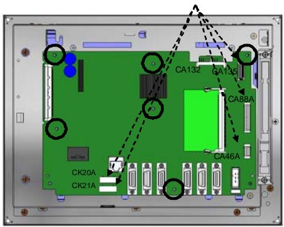

<details>
<summary>text_image</summary>

CA132
CA135
CA88A
CA46A
CK20A
CK21A
</details>

拧下固定着主板的螺钉（6处）

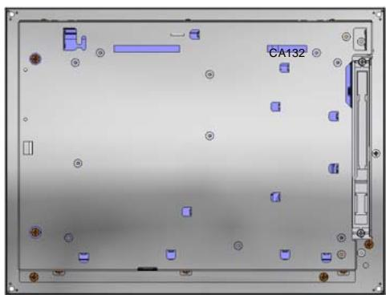

<details>
<summary>natural_image</summary>

Technical diagram of a device casing with labeled components and connectors (no readable text or symbols)
</details>

LCD单元的背面图

## 10.4” LCD 单元 A 的情形

3) 在更换目的地的 LCD 单元换装上主板。  
4) 重新安装电缆、螺钉以及壳体单元。

## 注释

1 更换步骤也请参照 3.2.1 项 显示器一体型控制单元的主板更换步骤。  
2 更换带有触摸板的控制单元的 LCD 单元时，对于触摸板控制印刷板也要进行换装。此外，还需要进行触摸板的校正。有关触摸板的校正方法，请参阅 3.14 节。

## 3.4 卡PCB的拆装


## 注意

进行更换作业前，要对 CNC 的 SRAM 内的数据（参数、程序等）进行备份。因为在更换作业中，有可能导致 SRAM 内的数据丢失。备份方法，请参阅第 5 章 输入/输出数据以及附录 C 引导系统。同时参照 3.1.1 项关于选项信息文件。

卡 PCB 只有基本单元 G 已经安装。基本单元 A 上没有安装。

## 拆卸方法

1. 向外侧拉固定着卡 PCB（伺服卡、CPU 以及 GUI 卡）的垫片（2 处）的卡爪，拆除闩锁。（图 a）  
2. 将卡 PCB 向上方拔出。（图 b）

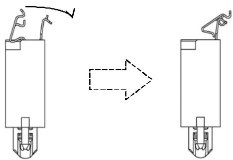

<details>
<summary>natural_image</summary>

Diagram showing a device being processed from a left-side component to a right-side component, with no visible text or symbols.
</details>

图a

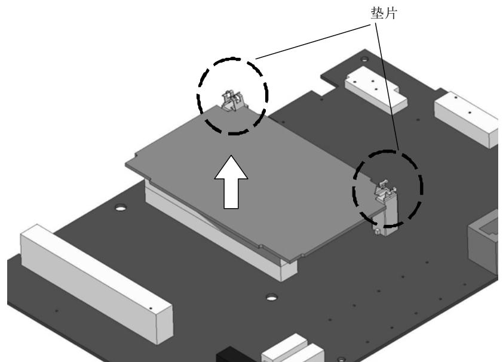

<details>
<summary>text_image</summary>

垫片
</details>

图b

## 安装方法

1. 确认垫片配件已经被提起。（图 a）  
2. 为对准卡 PCB 的安装位置，如图 c 所示使垫片抵接于卡 PCB 的垫片固定部端面上，对好位置。（此时若将连接器一侧少许抬高而仅使垫片一侧下垂，则较容易使基板抵接于垫片并定好位置。）  
3. 在使基板与垫片对准的状态下，慢慢地下调连接器一侧，使得连接器相互接触。（图 d）  
4. 慢慢地将卡 PCB 的连接器一侧推进去。此时，应推压连接器背面一侧附近的基板。连接器的插入大约需要 10kgf 左右的力量。若在超过这一力量下仍然难以嵌合，位置偏离的可能性较大，这种情况下会导致连接器破损，应重新进行定位操作。  
5. 将垫片配件推压进去。（图 e）


## 注意

进行连接器的连接时，请勿用手指按压卡PCB上的散热片。否则会导致受伤、卡PCB的破损。

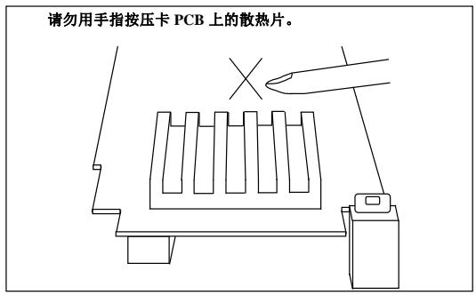

<details>
<summary>text_image</summary>

请勿用手指按压卡 PCB 上的散热片。
</details>

图c  
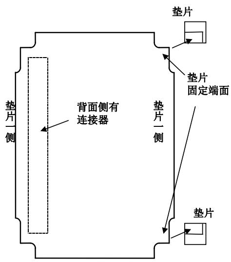

<details>
<summary>text_image</summary>

垫片
垫片
固定端面
垫片
垫片
背面侧有
连接器
垫片一侧
垫片一侧
</details>

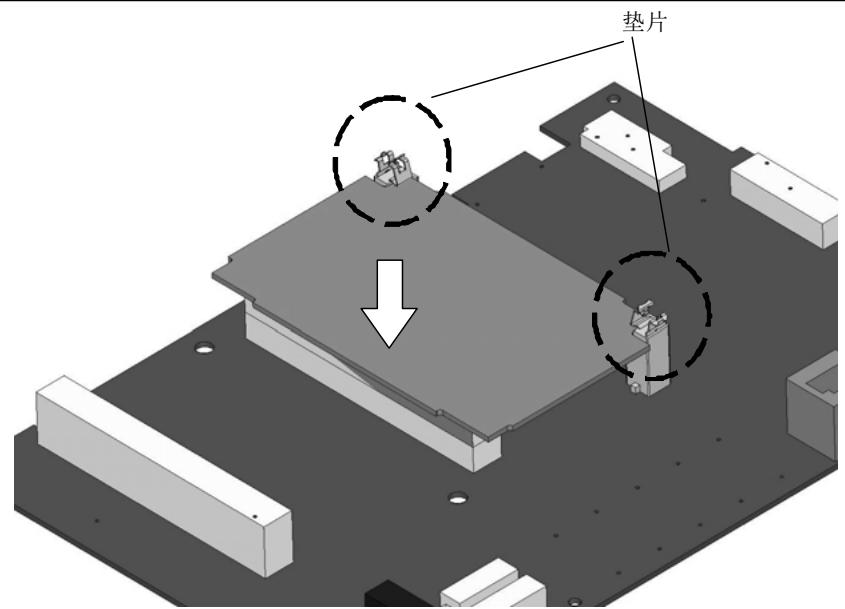

<details>
<summary>text_image</summary>

垫片
</details>

图d

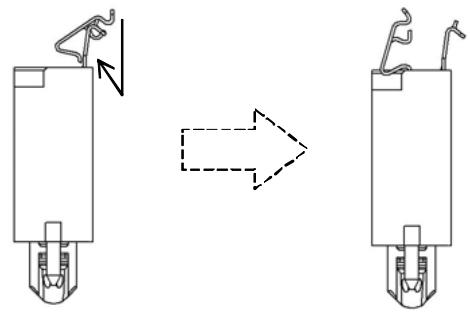

<details>
<summary>natural_image</summary>

Diagram showing a device with a switch and two connected components, one solid and one dashed, both without any text or symbols.
</details>

图e

## 3.5 FROM/SRAM模块的拆装方法


## 注意

在进行更换作业之前，请对存储在FROM/SRAM模块中的数据进行备份。备份方法以及再设定方法，请参阅第5章输入/输出数据以及附录C引导系统。同时参照3.1.1项关于选项信息文件。

## 注释

FROM/SRAM 模块更换时，由我公司维修服务部门进行系统软件的安装。

## 拆卸方法

1) 将插口的卡爪向外打开。（图 a）  
2) 朝斜上方拔出模块。（图 b）

## 安装方法

1) 将 B 面(模块上记载有 SIDE-B 的一面)朝上，将模块斜着插入模块插口。（图 b）  
2) 放倒模块，直到其锁紧。（图 c）

此时，请按压图中☆的2点将其放倒。

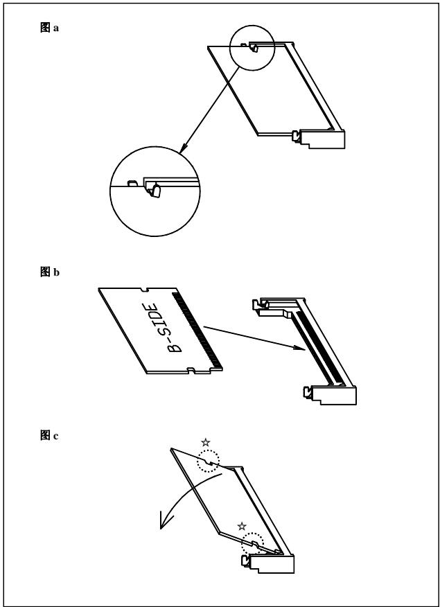

<details>
<summary>text_image</summary>

图 a
图 b
图 c
</details>

## 3.6 印刷板上小型闪存卡的拆装


## 注意

在进行小型闪存卡的更换作业前，要对 CNC 的 SRAM 内的数据（参数、程序等）进行备份。因为在更换作业中，有可能导致 SRAM 内的数据丢失。备份方法，请参阅第 5 章 输入/输出数据以及附录 C 引导系统。同时参照 3.1.1 项 关于选项信息文件。

印刷板有在印刷板上安装小型闪存卡的类型。若是安装小型闪存卡的印刷板，要按照如下步骤进行更换作业。

## 拆卸方法

将制动器的卡爪向上方提起，拉出制动器。将止动销推到里侧，拉出卡。

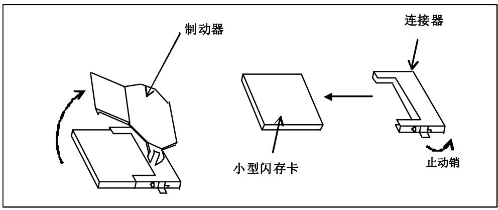

<details>
<summary>flowchart</summary>

```mermaid
graph TD
  A["制动器"] --> B["小型闪存卡"]
  B --> C["连接器"]
  C --> D["止动销"]
```
</details>

## 安装方法

将卡插入连接器，安装制动器。

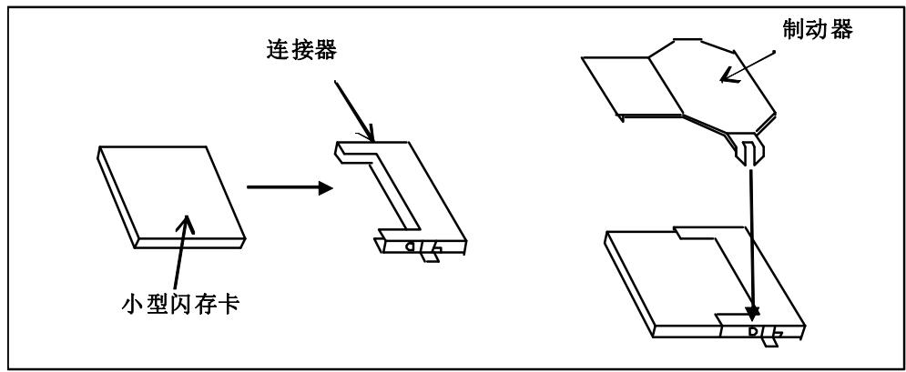

<details>
<summary>text_image</summary>

连接器
小型闪存卡
制动器
</details>

## 3.7 可选板的拆装

## 拆卸方法

1. 拆下在拉出连接于可选板的电缆和可选板时相互干涉的电缆。  
2. 抓住把手 A 和 B。  
3. 抓住把手 A，一边解除闩锁一边拉出可选板。

## 安装方法


## 注意

将可选板拆入到机架里侧。在与机架里侧的后面板的连接器尚未嵌合的状态下通电时，会导致故障和系统报警。

1. 抓住把手 A 和 B，插入到机架里侧，与后面板的连接器嵌合起来。此时，要确认 A 的卡瓜已被切实闩锁住，可选板表面与周围处于相同的高度。  
2. 重新正确安装已经拆下来的电缆。

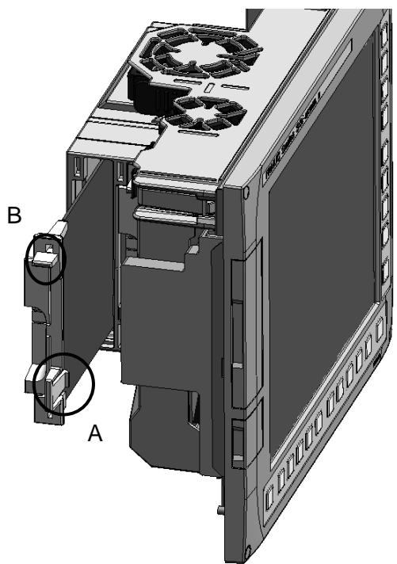

<details>
<summary>natural_image</summary>

3D technical diagram of a computer drive casing with labeled ports A and B, showing internal components and fan-like structure (no text or symbols beyond labels)
</details>

一体型的情形

## 有关可选板的安装位置

有关可选板的安装，规定了应该安装的插槽位置。在追加和维修可选板时，请按照如下规则安装可选板。

通过表 3.8.1 来确认要安装的可选板，从编号小的可选板，按照插槽 1、插槽 2 的顺序安装。

表 3.8.1 可选板


显示器一体型控  
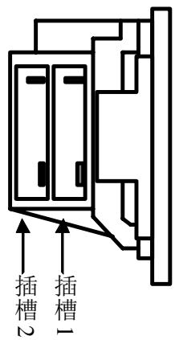

<details>
<summary>text_image</summary>

插槽2
插槽1
</details>

## 3.8 更换保险丝


## 警告

在进行保险丝的更换作业之前，要排除保险丝烧断的原因后再进行。

因此，必须由在维修及安全方面受过充分培训的人员进行。

在打开机柜更换保险丝时，小心不要接触高压电路部分（标有△标记并配有绝缘盖）。如取下盖板，接触该部分，就会触电。

## 3.8.1 显示器一体型控制单元

## 基本单元 A

保险丝的安装位置

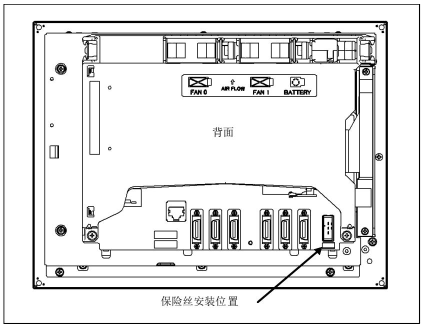

<details>
<summary>text_image</summary>

FAN 0 AIR FLOW FAN 1 BATTERY
背面
保险丝安装位置
</details>

保险丝的备货规格


## 基本单元G

保险丝的安装位置

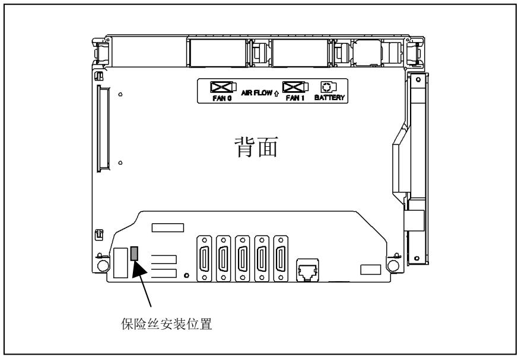

<details>
<summary>text_image</summary>

FAN 0 AIR FLOW φ FAN 1 BATTERY
背面
保险丝安装位置
</details>

保险丝的备货规格


## 3.9 更换控制单元的存储器备份电池

偏置数据和系统参数都存储在控制单元的 SRAM 存储器中。SRAM 是靠安装在控制单元的电池盒中的锂电池提供电源的。因此，即使主电源断开，上述数据也不会丢失。

当电池的电压下降时，在显示器画面上则闪烁显示警告信息 “BAT”。同时向 PMC 输出电池报警信号。报警闪烁显示或被输出时，要尽快更换电池。1 周只是一个大致标准，实际能够使用多长时间，则因不同的系统配置而有所差异。

如果电池的电压进一步下降，则不能对存储器提供电源。在这种情况下接通控制单元的外部电源，就会因存储器中所保存数据的丢失而发生系统报警。在更换完电池后，就需要清除存储器的全部内容，然后重新输入数据。

因此，FANUC 公司建议用户不管是否产生电池报警而每年定期更换一次电池。

下面两类电池可供使用。

- 使用安装在控制单元内的锂电池的方法。  
- 在控制单元外部装配电池盒，使用市面上出售的碱性干电池（一号）的方法。

注释

发那科在出货时，标准情况下已经将锂电池安装在控制单元上。该电池可将存储器内保存的数据保持一年。

## 3.9.1 更换锂电池的方法

## 显示器一体型控制单元的情形

请预先准备锂电池（备货规格：A02B-0323-K102）。

① 接通机床（控制单元）的电源大约 30 秒左右，然后断开电源。  
② 拉出控制单元背面的锂电池。（抓住锂电池的闩锁部分，一边拆除电池盒上附带的卡爪一边将其跟前拉出。）

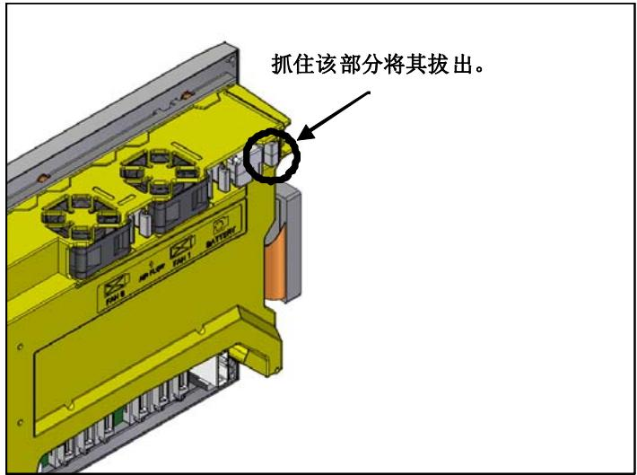

<details>
<summary>text_image</summary>

抓住该部分将其拔出。
</details>

③ 安装上预先准备好的锂电池。（予以推压，直到锂电池的卡爪进入壳体。）确认闩锁已经切实挂住。

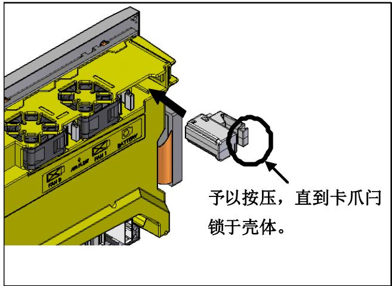

<details>
<summary>text_image</summary>

予以按压，直到卡爪闩锁于壳体。
</details>


## 警告

如果没有正确更换锂电池，可能会导致爆炸。

请勿更换为指定锂电池(A02B-0323-K102)以外的电池。


## 注意

从①到③的步骤应在30分钟内完成。

请注意，如果电池脱开的时间太长，SRAM 中保存的数据将会丢失。

在进行更换作业前，请将SRAM内的数据统一保存起来。这样，即使SRAM中保存的数据丢失，恢复起来也较为简单。

有关统一保存以及修复的操作方法，请参阅第5章 输入/输出数据以及附录C引导系统。

## 注释

关于更换下来的电池，应按照设置机床的所在国及管辖该设置场所的自治团体规定的条例等，作为工业废料进行妥善处理。此外，废弃之前应用胶带等进行绝缘处理，以免端子形成短路。

## 3.9.2 市面出售的碱性干电池（一号）电池的更换方法

可以在控制单元外部设置电池盒，取代安装在控制单元上的锂电池而使用市面出售的碱性干电池（一号）。

## 控制单元和电池盒的连接方法

要在电池盒（A02B-0236-C282）上连接电池电缆（A02B-0323-K103）使用。

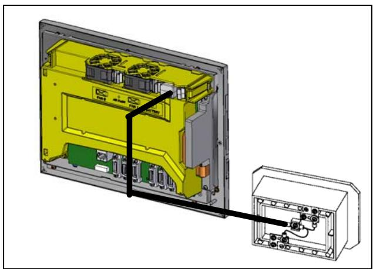

<details>
<summary>natural_image</summary>

3D diagram of an electronic device showing internal components and wiring, no text or symbols present
</details>

控制单元和电池盒的连接示例

## 注释

1 本电池电缆的连接器部分的嵌合采用简易锁住方式，所以，应在没有绷紧力的状态下将离开连接器一侧 $500\mathrm{mm}$ 以内的电缆部分固定起来，以避免因电缆的自重或电缆的绷紧力而造成连接器脱落。  
2 本电池电缆，务必与有可能成为动力线等的噪声源的装置分离。

## 更换市面出售的碱性干电池（一号）

① 请使用市面上出售的碱性干电池（一号）。  
② 接通机械（控制单元）的电源。  
③ 取下电池盒的盖子。  
④ 请注意朝向更换干电池。  
⑤ 安装电池盒的盖子。


## 注意

在切断电源的状态下更换电池时，请采用与上述更换锂电池相同的方法更换。

在连接电池时，请注意电池的正负极性。弄错极性连接时，会导致电池发热、破裂、起火。

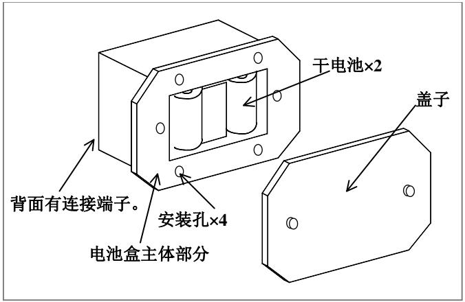

<details>
<summary>text_image</summary>

干电池×2
盖子
背面有连接端子。
安装孔×4
电池盒主体部分
</details>

## 3.10 更换风扇

检测出风扇电机的转速下降时，在 LCD 画面上闪烁显示 “FAN” 的警告信息。

进一步地，在检测出风扇电机停止等异常的情况下，根据过热报警和系统报警，系统的动作将会停止，所以在显示有“FAN”警告的阶段，应尽快更换风扇电机。

## 3.10.1 显示器一体型控制单元

- 风扇电机的规格


### PMC报警: 
- **故障内容**: 规格
- **处理办法**: 备注

### PMC报警: 不带选项插槽的单元
- **故障内容**: A02B-0323-K120
- **处理办法**: 

### PMC报警: 带 2 个选项插槽的单元
- **故障内容**: A02B-0323-K125
- **处理办法**: 


## 更换方法

1. 更换风扇电机时，务须切断机床（控制单元）的电源。  
2. 拆下安装在壳体上的风扇电机。抓住风扇电机的闩锁部分，一边拆除壳体上附带的卡爪一边将其拔出。  
3. 安装要安装到壳体上去的风扇电机。安装完后，确认风扇电机的卡爪与壳体切实闩锁在一起。

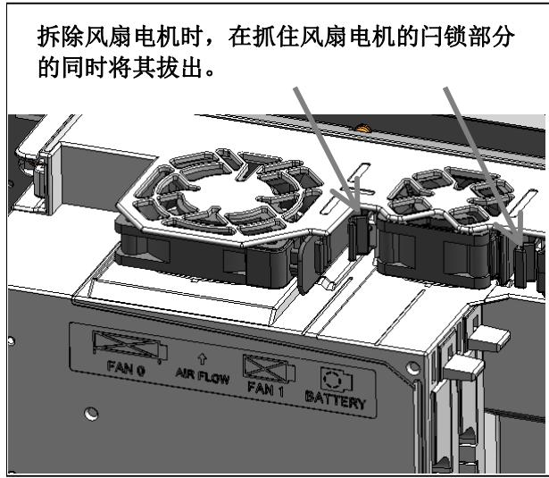

<details>
<summary>text_image</summary>

拆除风扇电机时，在抓住风扇电机的闩锁部分的同时将其拔出。
FAN 0 AIR FLOW FAN 1 BATTERY
</details>

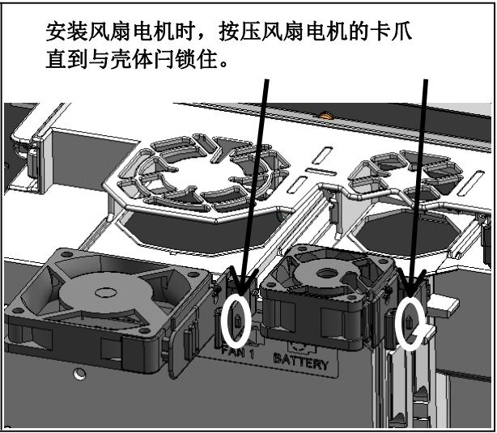

<details>
<summary>text_image</summary>

安装风扇电机时，按压风扇电机的卡爪
直到与壳体闩锁住。
</details>

## 3.11 更换保护盖板

## 3.11.1 更换LCD保护盖板

- LCD 保护盖板的规格


### PMC报警: 画面尺寸
- **故障内容**: LCD 保护盖板的规格
- **处理办法**: 备注

### PMC报警: 8.4”
- **故障内容**: A02B-0323-K112
- **处理办法**: 

### PMC报警: 10.4”
- **故障内容**: A02B-0323-K113
- **处理办法**: 

### PMC报警: 12.1”
- **故障内容**: A02B-0323-K114
- **处理办法**: 

### PMC报警: 15”
- **故障内容**: A02B-0323-K115
- **处理办法**: 


## - LCD 保护盖板的粘贴方法

预先在画面上粘贴有保护盖板或触摸板保护用膜片时，要将其从画面上撕下来。有的情况下，画面上会留有粘结剂，要使用粘性胶布将其彻底去掉。在用溶剂进行擦拭时，反而会弄脏画面。

粘贴保护盖板之前，要充分擦除铭牌以及 LCD 表面、软键表面的污渍、油分。擦拭时，要使用酒精或者稀释后的中性洗剂（厨房用中性洗剂等）。使用中性洗剂时，事后要用蘸水擦拭，避免留下洗剂的成分。留有油分和洗剂的成分时，保护盖板片就会轻易脱落。确认铭牌已经干燥，按照如下步骤粘贴保护盖板。

## - 8.4” LCD/MDI 单元的情形

1. 注意以两面胶布不会与软键部、LCD 部以及 PCMCIA 接口和 USB 端口盖重合的方式定位。  
2. 位置对合好之后，以蹭擦两面胶布部分的方式细心按压。使得手指沿着粘贴面慢慢地反复移动，增加其密贴性。  
3. 保护盖板表面，粘贴有用来防止表面划伤、污渍的薄片，要将其撕下。

1) 8.4” LCD/MDI(横型)的情形

保护盖板的背面贴有剥离膜。

如下图所示，切开剥离膜的上下 2 处，撕下左侧的斜线部分。

要注意避免切到保护盖板。

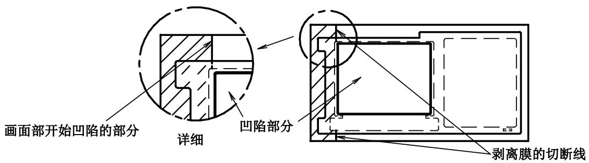

<details>
<summary>text_image</summary>

画面部开始凹陷的部分
详细
凹陷部分
剥离膜的切断线
</details>

① 将保护盖板轻轻对合于显示单元的前面，进行画面中央部分的定位。  
注意避免保护盖板的凹陷部分与显示器的铭牌重叠。  
② 只轻轻按压保护盖板的左侧(撕下剥离膜的位置)暂时固定。  
③ 提起附带剥离膜的右侧，从左侧慢慢地撕下剥离膜。

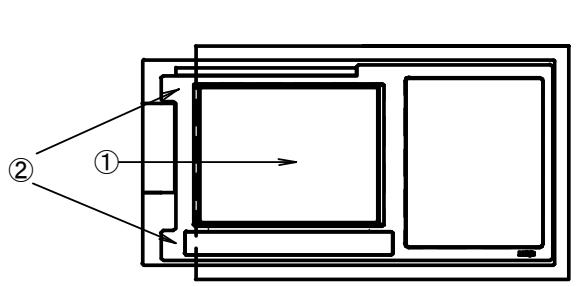

<details>
<summary>text_image</summary>

Diagram showing a device with labeled components and directional arrows, likely illustrating a system or process flow.
</details>

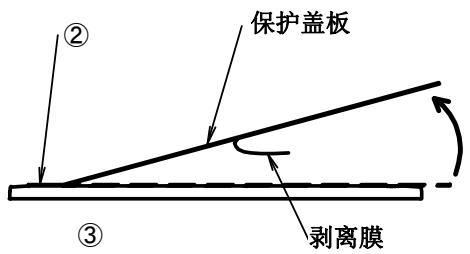

<details>
<summary>text_image</summary>

②
保护盖板
③
剥离膜
</details>

再次定位后，以将 LCD 部和保护盖板之间的空气向右方向挤出的方式进行粘贴。由此，就可以贴好。位置完全决定后，以蹭擦两面胶布部分的方式细心按压。使得手指沿着粘贴面慢慢地反复移动，增加其密贴性。

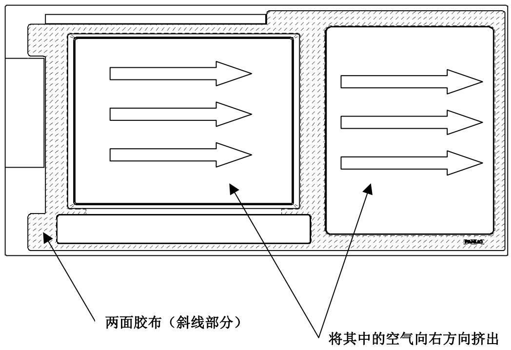

<details>
<summary>text_image</summary>

两面胶布（斜线部分）
将其中的空气向右方向挤出
</details>

2) 8.4”竖型 LCD/MDI 的情形

保护盖板的背面贴有剥离膜。

如下图所示，切开剥离膜的左右 2 处，撕下上侧的斜线部分。

要注意避免切到保护盖板。

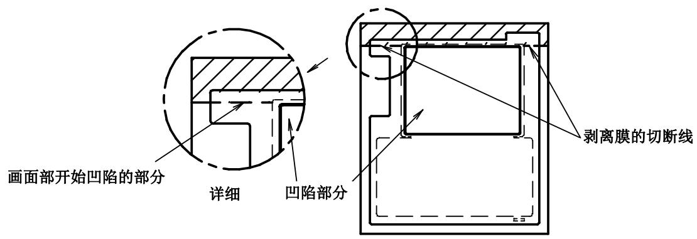

<details>
<summary>text_image</summary>

画面部开始凹陷的部分
详细
凹陷部分
剥离膜的切断线
</details>

① 将保护盖板轻轻对合于显示单元的前面，进行画面中央部分的定位。  
② 只轻轻按压保护盖板的上侧(撕下剥离膜的位置)暂时固定。  
③ 提起附带剥离膜的下侧，从上侧慢慢地撕下剥离膜。

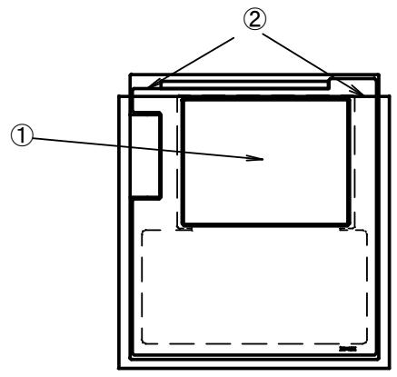

<details>
<summary>text_image</summary>

Technical diagram showing a cross-section of a mechanical or architectural component with labeled parts ① and ②.
</details>

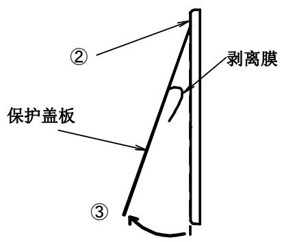

<details>
<summary>text_image</summary>

②
保护盖板
③
剥离膜
</details>

再次定位后，以将 LCD 部和保护盖板之间的空气向下方向挤出的方式进行粘贴。由此，就可以贴好。位置完全决定后，以蹭擦两面胶布部分的方式细心按压。使得手指沿着粘贴面慢慢地反复移动，增加其密贴性。

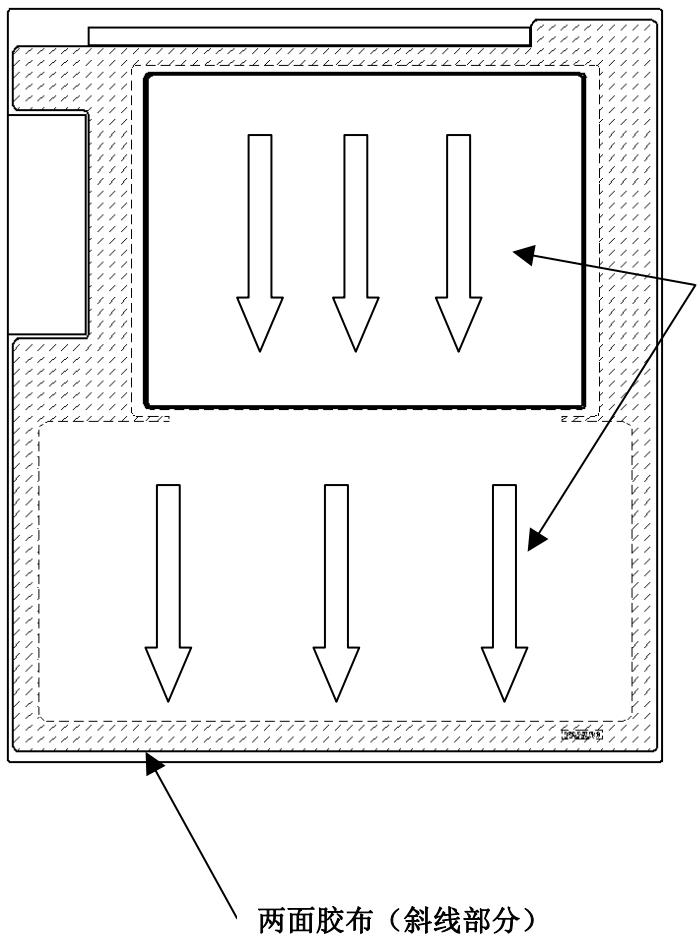

<details>
<summary>text_image</summary>

两面胶布（斜线部分）
</details>

将其中的空气向下方向挤出

## - 10.4”和 15”LCD 单元的情形

1. LCD用的保护盖板，对应显示部的形状而凹陷下去。以使该凹陷部分在图中箭头所示位置对准于铭牌边框的方式，并注意避免两面胶布与软键部分重合进行定位。  
2. 定位后，如果以将 LCD 部和保护盖板之间的空气向右挤出的方式进行粘贴，就容易贴好。位置完全决定后，以蹭擦两面胶布部分的方式细心按压。使得手指沿着粘贴面慢慢地反复移动，增加其密贴性。  
3. 通电后，确认带有触摸板的单元上没有触摸板被持续按压的部分。此外，还要确认触摸板正常工作。

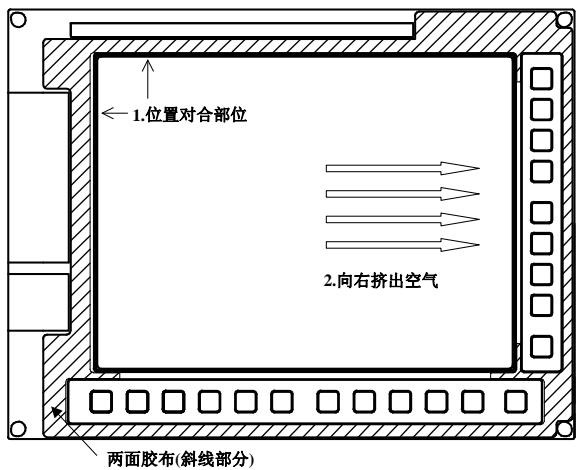

<details>
<summary>text_image</summary>

1.位置对合部位
2.向右挤出空气
两面胶布(斜线部分)
</details>

## 3.11.2 更换键盘盖罩

- 键盘盖罩的规格


### PMC报警: 单元的种类
- **故障内容**: 键盘盖罩的规格
- **处理办法**: 备注

### PMC报警: 机床操作面板主面板安全机床操作面板
- **故障内容**: A02B-0323-K041
- **处理办法**: 

### PMC报警: 标准 MDI 单元
- **故障内容**: A02B-0323-K042
- **处理办法**: 

### PMC报警: 小型 MDI 单元
- **故障内容**: A02B-0323-K043
- **处理办法**: 

### PMC报警: QWERTY type A MDI 单元
- **故障内容**: A02B-0323-K044
- **处理办法**: 

### PMC报警: QWERTY type B MDI 单元
- **故障内容**: A02B-0323-K045
- **处理办法**: 


## - 键盘盖罩的粘贴方法

预先粘贴有键盘盖罩时，请将其从单元上揭下。有的情况下单元表面留有粘着剂，请使用粘性胶带将其彻底清除掉。用溶剂去擦拭，有时反而会弄得更脏。

在粘贴键盘盖罩之前，请充分擦掉铭牌上的污渍和油污。擦拭时请使用酒精或者稀释后的中性洗剂（厨房用中性洗剂等）。使用中性洗剂时，要事后用水擦拭，确保没有洗剂成分残留。铭牌上有油污和洗剂的成分残留时，盖罩将很容易剥落。确认盖罩已经干燥，按照如下步骤粘贴盖罩。

根据各单元而有多种键盘盖罩，但是粘贴方法都相同。这里列出粘贴到标准 MDI 单元的示例。

1. 键盘盖罩没有粘贴位置的基准。从左右任何一侧将剥离纸撕下 $1 \sim 2$ 列，以使得上下拐角的按键和键盘盖罩的成形上升沿部的间隔相同的方式予以定位。（图3.12.2(a)）  
2. 一边撕下剥离纸，一边粘贴键盘盖罩。此时，要注意如下几点。

(a) 请勿接触两面胶布的粘着部。  
(b) 键盘盖罩采用柔软的材质做成，若用力拉伸将会变形，粘贴时不要将其拉伸。

3. 以搓揉两面胶布的方式切实按压。（图 3.12.2(b)）

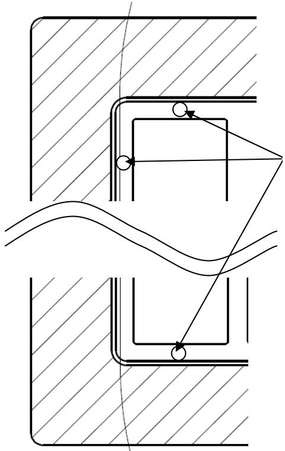

<details>
<summary>natural_image</summary>

Pure mechanical diagram showing two cross-sectional views with hatched regions and internal components, no text or symbols present.
</details>

以成为相同间隔的方式予以定位。

两面胶布（斜线部分）  
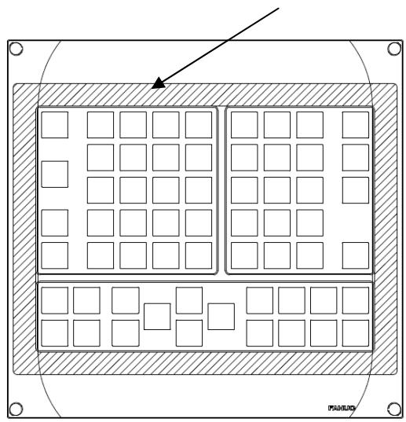

<details>
<summary>natural_image</summary>

Technical diagram of a dual-panel electronic component with hatched areas and mounting holes (no text or symbols)
</details>

图3.11.2 (b)  
图3.11.2 (a)

## 3.12 更换触摸板保护膜

若是带有触摸板的单元，为了保护触摸板，在触摸板的表面覆盖有一层保护膜。当该保护膜上有伤痕或污渍等导致画面看不清时，更换保护膜。请准备好下列所示的物品。

1) 保护膜  
2) 酒精或者中性洗剂（厨房用中性洗剂等）  
3) 柔软的布块 （使用中性洗剂的情形）

触摸板保护膜的规格


### PMC报警: 画面尺寸
- **故障内容**: 规格
- **处理办法**: 备注

### PMC报警: 8.4”
- **故障内容**: A02B-0309-K132
- **处理办法**: 

### PMC报警: 10.4”
- **故障内容**: A02B-0236-K110
- **处理办法**: 

### PMC报警: 15”
- **故障内容**: A08B-0082-K020
- **处理办法**: 


## - 更换方法

1) 更换前的处理

① 请切断显示器主体部分的电源。  
② 揭下用旧的保护膜。  
③ 留有粘结剂时，要使用粘性胶布将其彻底去掉。

在用溶剂进行擦拭时，反而会弄脏画面。

④ 使用酒精或者稀释后的中性洗剂，擦掉粘附在触摸板表面的油分等污渍。  
⑤ 使用中性洗剂时，用沾湿的柔软布块彻底擦除洗剂。

触摸板表面白浊时，由于还留有油分，因此需要彻底擦净。

如果触摸板表面留有油分和洗剂，保护膜就难以切实贴紧，这样就容易剥落。

⑥ 请用干软布充分擦掉水分。

## 2) 粘贴保护膜

① 将突出部分叠入表面一侧（衬纸的相反一侧）。


<details>
<summary>text_image</summary>

折痕
</details>

② 揭下反面的衬纸。

③ 在对准位置之后，首先贴好上下底边。

此时，确认保护膜的每一边没有碰到饰框。

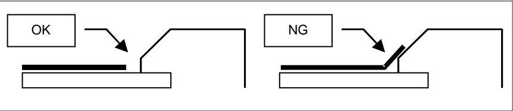

<details>
<summary>flowchart</summary>

```mermaid
graph TD
  A["OK"] --> B["Branch"]
  C["NG"] --> D["Branch"]
```
</details>

④ 挤出触摸板和保护膜之间的空气，贴好左右边。

不要在贴好部分保护膜的状态下拉伸保护膜，或者修正其位置上的偏离。

⑤ 从上面按压 4 边的粘结剂，使得保护膜的整面都充分贴牢。

确认保护膜的 4 个角落和 4 边是否鼓起。

## 3) 更换后的确认

① 确认保护膜表面没有“褶皱”部分。

② 通电后，确认触摸板上没有被持续按压的部分。

③ 按住触摸板，确认其正常工作。

## 3.13 校正触摸板

## - 需要进行校正的条件

触摸板按下的位置与识别位置偏离时，请进行校正。

此外，在进行维修作业时，有的情况下也需要进行校正。

触摸板需要校正的条件如下所示。

1. 更换带有触摸板的一体型控制单元的情形;  
2. 更换带有触摸板的一体型控制单元上的主板的情形;  
3. 更换了触摸板控制板时；  
4. 进行了存储器全部清除时。

## - 相关参数


### PMC报警: 
- **故障内容**: #7
- **处理办法**: #6

### PMC报警: 3113
- **故障内容**: 
- **处理办法**: 


[输入类型] 参数输入

[数据类型] 位型

#5 DCL 触摸面板的定标画面

0: 无效。

1: 有效。

通常将此参数设为 “0”。唯在更换面板、执行存储器全部清除操作时才需要对触摸面板进行校正。只有在对触摸板进行校正时才将参数设定为 1，校正结束后应将其设定为 0。


### PMC报警: 
- **故障内容**: #7
- **处理办法**: #6

### PMC报警: 3119
- **故障内容**: 
- **处理办法**: 


[输入类型] 参数输入

[数据类型] 位型

## 注释

在设定完此参数后，需要暂时切断电源。

## #2 DDS 触摸板

0: 有效。

1: 无效。

启动时需要使触摸板暂时失效的情况下可将此参数设定为 1。

## 触摸板的校正方法

## 注释

一体型控制单元（基本单元 G）时的校正方法将在后面叙述。

## 校正作业步骤

1) 将触摸面板的定标画面置于有效。（将参数 DCL (No.3113#5) 设定为 1。）  
2) 按下功能键 ▶ SYSTEM。  
3) 按继续菜单键 ▶ 数次，显示软键 [触摸板]。  
4) 按下软键 [触摸板]、[(操作)]，显示软键 [TP 补偿]。

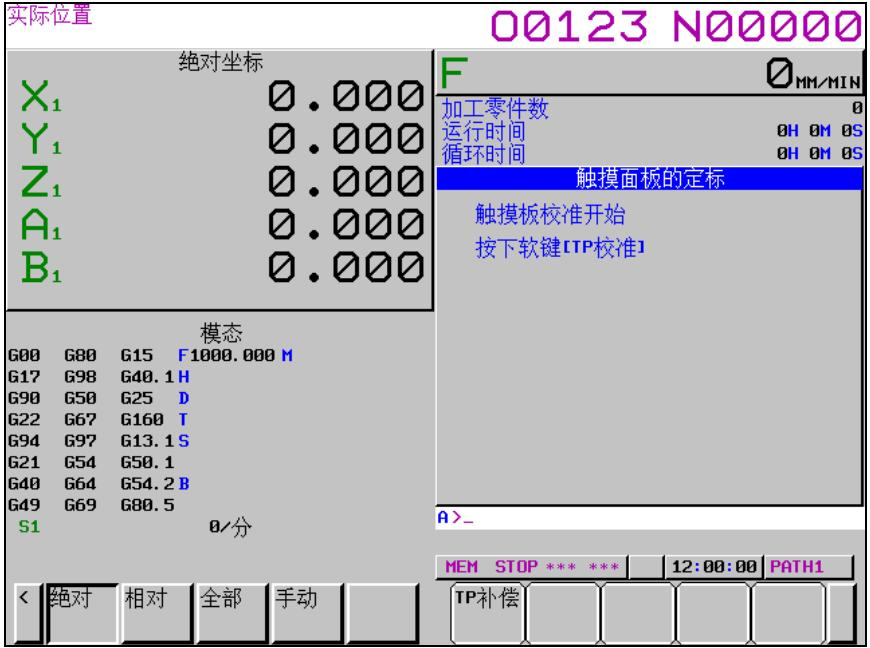

<details>
<summary>text_image</summary>

实际位置
00123 N00000
绝对坐标
X₁ 0.000
Y₁ 0.000
Z₁ 0.000
A₁ 0.000
B₁ 0.000
模态
G80 G80 G15 F1000.000 M
G17 G98 G40.1 H
G90 G50 G25 D
G22 G67 G160 T
G94 G97 G13.1 S
G21 G54 G50.1
G40 G64 G54.2 B
G49 G69 G80.5
S1 0/分
F
MM/MIN
加工零件数 0
运行时间 0H 0M 0S
循环时间 0H 0M 0S
触摸面板的定标
触摸板校准开始
按下软键[TP校准]
A >_
MEM STOP *** *** 12:00:00 PATH1
< 绝对 相对 全部 手动
TP补偿
</details>

5) 按下软键 [TP 补偿]，出现触摸屏补偿画面。

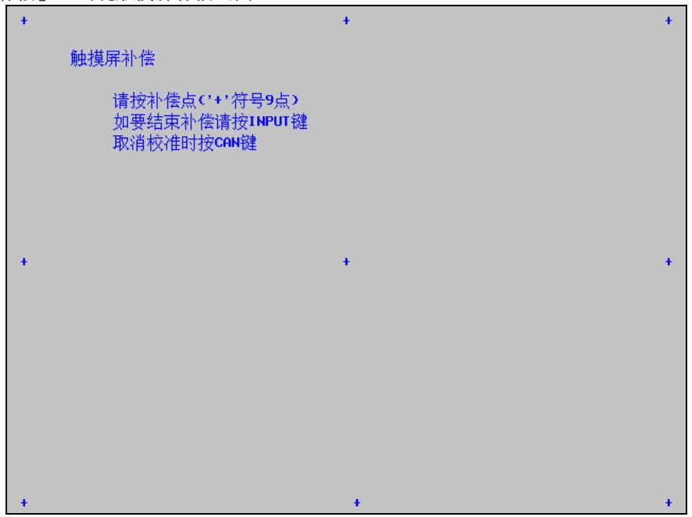

<details>
<summary>text_image</summary>

触摸屏补偿
请按补偿点('+'符号9点)
如要结束补偿请按INPUT键
取消校准时按CAN键
</details>

6) 用专用触笔按下补偿点（9 点）。正常按下的情况下，“+”号变为“○”号。当偏离“+”号按下时，出现“偏离了+符号。请重按。”这样的提示信息。  
7）在输入补偿点（9点）之后，按下键，结束校正。中止校正或者重新校正时，按下键。返回上一画面。在输入9点补偿点之前，按下键，校正即被中断。  
8) 当正常结束时，出现 “定标结束” 这样的提示信息。  
9) 校正作业结束时，为了预防错误操作，将触摸屏补偿画面设定为无效。（将参数 DCL (No.3113#5) 设定为 0）。

触摸板的校正方法（一体型控制单元（基本单元 G）的情形）

## 4 其他单元的维护

## 4.1 其他单元的共同事项

## - 更换保险丝


## 警告

在进行保险丝的更换作业之前，要排除保险丝烧断的原因后再进行。

因此，必须由在维修及安全方面受过充分培训的人员进行。

在打开机柜更换保险丝时，小心不要接触高压电路部分（标有△标记并配有绝缘盖）。如取下盖板，接触该部分，就会触电。

有关各单元的保险丝的安装位置，请参阅本章各单元的章节或者项目。

此外，有关各单元的保险丝规格，请参阅附录 B “单元、印刷电路板以及消耗品一览”。

## 4.2 I/O Link i 对应单元

## 4.2.1 I/O Link i 对应单元共同事项

## - I/O Link $i$ 对应单元的LED的显示内容

I/O Link i，作为标准规格每个单元安装有 3 种 LED “LINK”（绿色）、“ALM”（红色）、“FUSE”（红色）。下面示出各自的 LED 所表示的概要。

LED “LINK”（绿色） 表示单元的通信状态。

LED “ALM”（红色） 表示单元中发生的报警。

LED “FUSE”（红色） 表示单元保险丝异常的有无。

有关 LED 的点亮状态及其显示内容，请参阅 10.26 节。

## - 关于状态报警

I/O 单元的某些部分，有的具有检测 DO 报警（DO 的接地故障等¥）和 DO 公共电压的异常等单元的各种异常的功能。I/O Link i 上，将检测出的信息叫做状态报警，与 DI 信号独立地通知 CNC，因而无需向 X 地址分配。有异常时，PMC 报警画面上显示表示异常发生部位的 PMC 报警信息。

"WN69 I/O Link i DO ALARM (CHn Gxx Syy zz : PMCm Ybbb= \*\*H )"

这表示在通道 n、组编号 xx、插槽编号 yy、插槽内的字节地址 zz、PMC 路径 a、Ybbb 地址的 DO 中发生了接地故障。此外，\*\*H 以 16 进制数来表示已发生报警的位。插槽编号 yy 以及插槽内的字节地址 zz 和各单元的异常发生部位的对应关系，请参见本节的各单元项。

另外，PMC 系统继电器区域也被以相同的方式输出状态报警信息。有关输出到 PMC 系统继电器区域中信息详情，请参阅 B-64603CM “FANUC Series 0i-MODEL F CONNECTION MANUAL (HARDWARE)”（连接说明书(硬件篇)）。

## 注释

状态报警发生一次时，直至切断电源为止不会被清除。电源切断后，排除原因，重新通电。

## 4.2.2 接线盘I/O模块 [支持I/O Link i]

- 规格


### PMC报警: 名称
- **故障内容**: 备货规格
- **处理办法**: 规格

### PMC报警: 接线盘I/O模块(基本模块)
- **故障内容**: A03B-0824-C001
- **处理办法**: DI/DO:24/16

### PMC报警: 接线盘I/O模块(扩展模块A)
- **故障内容**: A03B-0824-C002
- **处理办法**: DI/DO:24/16带有手摇脉冲发生器接口

### PMC报警: 接线盘I/O模块(扩展模块B)
- **故障内容**: A03B-0824-C003
- **处理办法**: DI/DO:24/16不带手摇脉冲发生器接口

### PMC报警: 接线盘I/O模块(扩展模块C)
- **故障内容**: A03B-0824-C004
- **处理办法**: DO:162A输出模块

### PMC报警: 接线盘I/O模块(扩展模块D)
- **故障内容**: A03B-0824-C005
- **处理办法**: 模拟输入模块

### PMC报警: 保险丝(预备品)
- **故障内容**: A03B-0815-K002
- **处理办法**: 1A(基本模块用)

### PMC报警: 模块间扁平电缆
- **故障内容**: A03B-0815-K100
- **处理办法**: 电缆长度20mm模块间隔为32mm时符合


- 连接器以及保险丝的安装位置

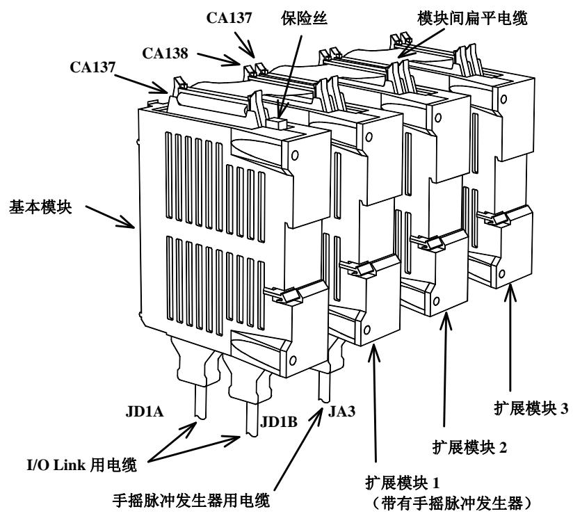

<details>
<summary>text_image</summary>

基本模块
DA137
CA138
CA137
保险丝
模块间扁平电缆
扩展模块 2
扩展模块 3
JA3
JA1B
JD1A
手摇脉冲发生器用电缆
I/O Link 用电缆
扩展模块 1
（带有手摇脉冲发生器）
</details>


## - 关于LED

基本模块上安装有绿色 LED “LINK” 和红色 LED “ALM”、“FUSE”。

有关各 LED 的状态和接线盘 I/O 模块的状态的对应，请参阅 4.2.1 项。

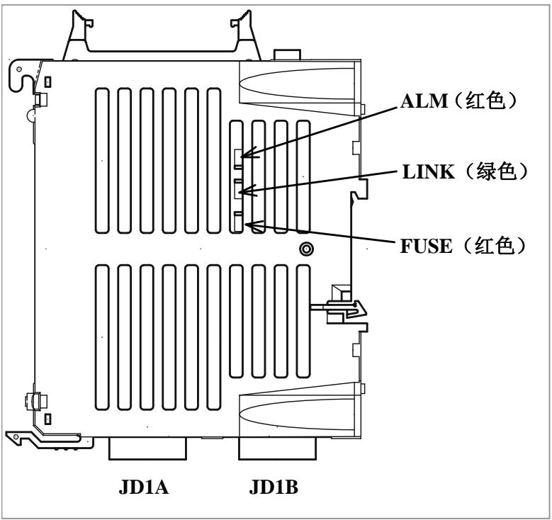

<details>
<summary>text_image</summary>

ALM（红色）
LINK（绿色）
FUSE（红色）
JD1A JD1B
</details>

## - 关于旋转开关


## 注意

扩展模块的旋转开关，在跳过途中的扩展模块（插槽）进行连接时使用。

更换扩展模块时，务必将旋转开关设定为与更换前的模块相同。

有关设定方法（设定部位和设定方法）

设定部位（旋转开关）位于扩展模块的下图位置。改变设定时，使用尖端宽为 $2.5\mathrm{mm}$ 左右的一字改锥转动旋转开关。

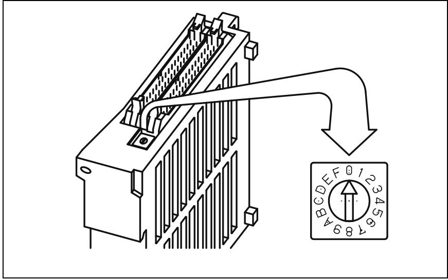

<details>
<summary>text_image</summary>

Technical diagram showing a device with labeled buttons and an arrow indicating direction, including a circular dial labeled 78-96.
</details>

## - 关于 PMC 报警信息与异常发生部位的对应

有关因 I/O Link i 连接而在本模块中发生状态报警时在 PMC 报警画面上所显示的 PMC 报警信息“WN69 I/O Link i DO 报警 (CHn Gxx Syy zz :PMCa Ybbb = \*\*H)”，插槽号码 yy 以及插槽内的字节地址 zz 与异常发生部位的对应如下表所示。


### PMC报警: 01
- **故障内容**: 00
- **处理办法**: 基本模块

### PMC报警: 01
- **故障内容**: 基本模块
- **处理办法**: 第1字节

### PMC报警: 02
- **故障内容**: 00
- **处理办法**: 扩展模块1

### PMC报警: 01
- **故障内容**: 扩展模块1
- **处理办法**: 第1字节

### PMC报警: 03
- **故障内容**: 00
- **处理办法**: 扩展模块2

### PMC报警: 01
- **故障内容**: 扩展模块2
- **处理办法**: 第1字节

### PMC报警: 04
- **故障内容**: 00
- **处理办法**: 扩展模块3

### PMC报警: 01
- **故障内容**: 扩展模块3
- **处理办法**: 第1字节


## 4.2.3 操作面板I/O模块（矩阵输入对应） [支持I/O Link i]

\- 规格


### PMC报警: 名称
- **故障内容**: 备货规格
- **处理办法**: 备注

### PMC报警: 操作面板 I/O 模块
- **故障内容**: A03B-0824-K200(A20B-2102-0170)
- **处理办法**: 

### PMC报警: 保险丝(预备品)
- **故障内容**: A03B-0815-K001
- **处理办法**: 1A


\- 连接器、LED 以及保险丝的安装位置

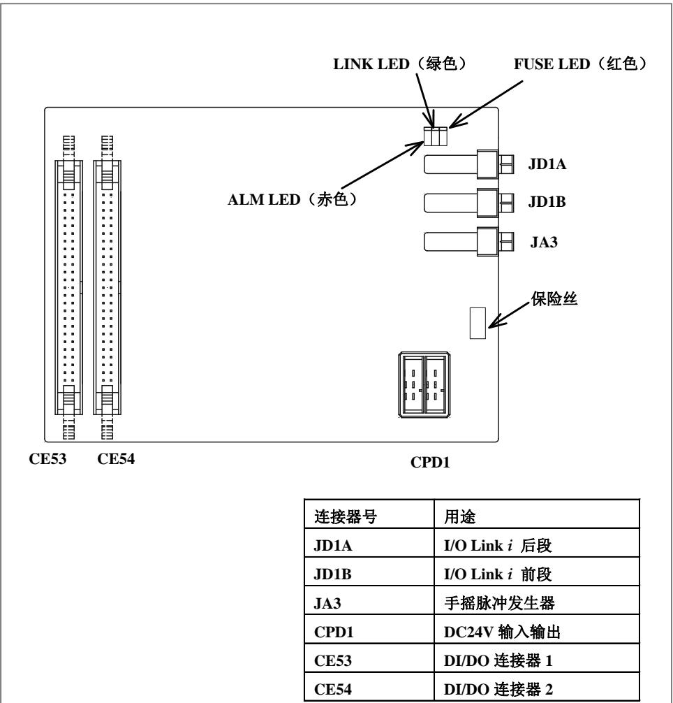

<details>
<summary>text_image</summary>

LINK LED（绿色）
FUSE LED（红色）
ALM LED（赤色）
JD1A
JD1B
JA3
保险丝
CE53 CE54 CPD1
连接器号 用途
JD1A I/O Link i 后段
JD1B I/O Link i 前段
JA3 手摇脉冲发生器
CPD1 DC24V 输入输出
CE53 DI/DO 连接器 1
CE54 DI/DO 连接器 2
</details>

## - 关于LED

操作盘 I/O 模块上，如上所述，安装有绿色 LED “LINK” 和红色 LED “ALM”、“FUSE”。

有关各 LED 的状态和操作盘 I/O 模块的状态的对应，请参阅 4.2.1 项。

## - 关于 PMC 报警信息与异常发生部位的对应

有关因 I/O Link i 连接而在本模块中发生状态报警时在 PMC 报警画面上所显示的 PMC 报警信息“WN69 I/O Link i DO 报警 (CHn Gxx Syy zz :PMCa Ybbb = \*\*H)”，插槽号码 yy 以及插槽内的字节地址 zz 与异常发生部位的对应如下表所示。


### PMC报警: 01
- **故障内容**: 00
- **处理办法**: 第 0 字节的 DO 接地故障


※本模块中，DO 报警以字节单位予以检测。无法以位单位进行检测。即使在任何一个位中发生 DO 接地故障的情况下，发生位也会被作为 “01H” 而显示在 PMC 报警信息中。

## 4.2.4 操作面板I/O模块以及强电盘I/O模块连接 [支持I/O Link i]

- 规格


### PMC报警: 名称
- **故障内容**: 备货规格
- **处理办法**: 备注

### PMC报警: 操作面板I/O模块(带有MPG接口)
- **故障内容**: A03B-0824-K202(A20B-2004-0690)
- **处理办法**: DI:48点DO:32点带有MPG接口

### PMC报警: 强电盘I/O模块(不带MPG接口)
- **故障内容**: A03B-0824-K203(A20B-2004-0691)
- **处理办法**: DI:48点DO:32点不带MPG接口

### PMC报警: 保险丝(预备品)
- **故障内容**: A03B-0815-K001
- **处理办法**: 1A


## - 连接器、LED 以及保险丝的安装位置

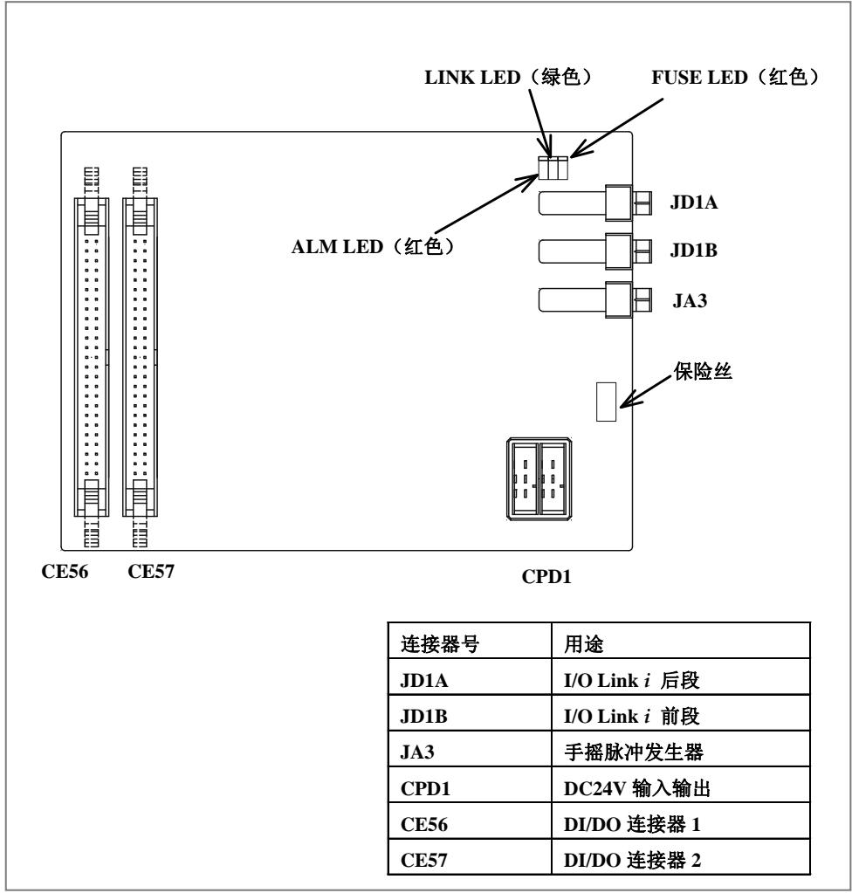

<details>
<summary>text_image</summary>

LINK LED（绿色）
FUSE LED（红色）
ALM LED（红色）
JD1A
JD1B
JA3
保险丝
CE56 CE57 CPD1
连接器号 用途
JD1A I/O Link i 后段
JD1B I/O Link i 前段
JA3 手摇脉冲发生器
CPD1 DC24V 输入输出
CE56 DI/DO 连接器 1
CE57 DI/DO 连接器 2
</details>

## - 关于LED

操作面板 I/O 模块上，如上所述，安装有绿色 LED “LINK” 和红色 LED “ALM”、“FUSE”。

有关各 LED 的状态和操作盘 I/O 模块的状态的对应，请参阅 4.2.1 项。

## - 关于 PMC 报警信息与异常发生部位的对应

有关因 I/O Link i 连接而在本模块中发生状态报警时在 PMC 报警画面上所显示的 PMC 报警信息“WN69 I/O Link i DO 报警 (CHn Gxx Syy zz :PMCa Ybbb = \*\*H)”，插槽号码 yy 以及插槽内的字节地址 zz 与异常发生部位的对应如下表所示。


### PMC报警: 01
- **故障内容**: 00
- **处理办法**: 第 0 字节的 DO 接地故障 **H 位的 DO 接地故障


## 4.2.5 接线盘I/O模块 type-2 [支持I/O Link i]

- 规格


### PMC报警: 名称
- **故障内容**: 备货规格
- **处理办法**: 规格

### PMC报警: 分布式I/O type-2(基本模块B1)
- **故障内容**: A03B-0824-C040
- **处理办法**: DI/DO=48/32带有MPG接口

### PMC报警: 分布式I/O type-2(基本模块B2)
- **故障内容**: A03B-0824-C041
- **处理办法**: DI/DO=48/32不带MPG接口

### PMC报警: 分布式I/O type-2(扩展模块E1)
- **故障内容**: A03B-0824-C042
- **处理办法**: DI/DO=48/32

### PMC报警: 保险丝(预备品)
- **故障内容**: A03B-0815-K002
- **处理办法**: 1A(基本模块用)

### PMC报警: 模块间扁平电缆
- **故障内容**: A03B-0815-K102
- **处理办法**: 电缆长度35mm模块间隔5mm


## - 连接器、LED 以及保险丝的安装位置

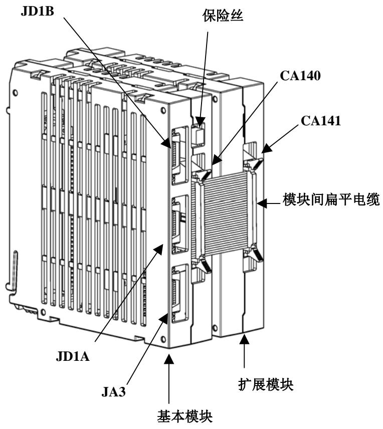

<details>
<summary>text_image</summary>

JD1B
保险丝
CA140
CA141
模块间扁平电缆
JD1A
JA3
扩展模块
基本模块
</details>

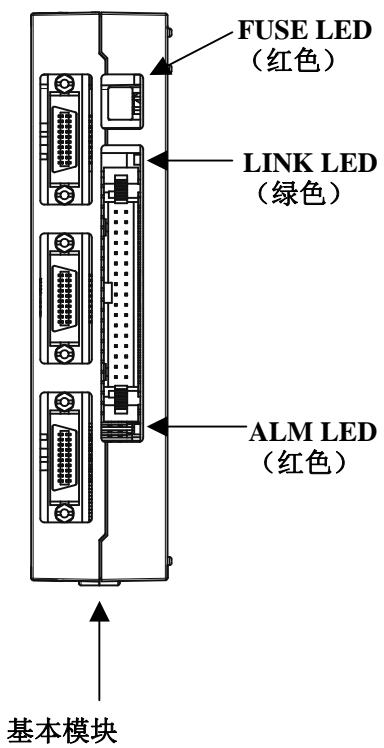

<details>
<summary>text_image</summary>

FUSE LED
(红色)
LINK LED
(绿色)
ALM LED
(红色)
基本模块
</details>


## - 关于LED

基本模块上安装有绿色 LED “LINK” 和红色 LED “ALM”、“FUSE”。

有关各 LED 的状态和接线盘 I/O type-2 的状态的对应，请参阅 4.2.1 项。

- 有关与插槽号码、插槽内的字节地址的对应  
- 关于 PMC 报警信息与异常发生部位的对应

有关因 I/O Link i 连接而在本模块中发生状态报警时在 PMC 报警画面上所显示的 PMC 报警信息“WN69 I/O Link i DO 报警 (CHn Gxx Syy zz :PMCa Ybbb = \*\*H)”，插槽号码 yy 以及插槽内的字节地址 zz 与异常发生部位的对应如下表所示。


### PMC报警: 01
- **故障内容**: 00
- **处理办法**: 基本模块 第 0 字节 **H 位的 DO 接地故障

### PMC报警: 02
- **故障内容**: 00
- **处理办法**: 扩展模块 第 0 字节 **H 位的 DO 接地故障


## 4.2.6 端子台型I/O模块 [支持I/O Link i]

- 规格


### PMC报警: 名称
- **故障内容**: 备货规格
- **处理办法**: 规格

### PMC报警: 基本模块
- **故障内容**: A03B-0823-C011
- **处理办法**: DI/DO: 24/16

### PMC报警: 扩展模块 A
- **故障内容**: A03B-0823-C012
- **处理办法**: DI/DO: 24/16 带有 MPG 接口

### PMC报警: 扩展模块 B
- **故障内容**: A03B-0823-C013
- **处理办法**: DI/DO: 24/16 不带 MPG 接口

### PMC报警: 扩展模块 C
- **故障内容**: A03B-0823-C014
- **处理办法**: DO: 162A 输出模块

### PMC报警: 扩展模块 D
- **故障内容**: A03B-0823-C015
- **处理办法**: 模拟输入模块

### PMC报警: 扩展模块 E
- **故障内容**: A03B-0823-C016
- **处理办法**: 模拟输出模块

### PMC报警: 保险丝(预备品)
- **故障内容**: A03B-0823-K001
- **处理办法**: 2A(基本模块用)

### PMC报警: 预备端子台组件(基本、扩展模块 A,B 用)
- **故障内容**: A03B-0823-K020
- **处理办法**: 电缆侧端子台组件(T1~T4 各装有 1 个)

### PMC报警: 预备端子台组件(扩展模块 C 用)
- **故障内容**: A03B-0823-K011
- **处理办法**: 扩展模块 C 用电缆侧端子台组件(T1,T2 各装有 1 个)

### PMC报警: 预备端子台组件(扩展模块 D 用)
- **故障内容**: A03B-0823-K012
- **处理办法**: 扩展模块 D 用电缆侧端子台组件(T1,T2 各装有 1 个)

### PMC报警: 预备端子台组件(扩展模块 E 用)
- **故障内容**: A03B-0823-K013
- **处理办法**: 扩展模块 E 用电缆侧端子台组件(T1,T2 各装有 1 个)

### PMC报警: 模块间连接电缆 A
- **故障内容**: A03B-0823-K100
- **处理办法**: 电缆长度 100mm·52 极连接扩展模块时使用。


注释

预备端子台组件，是附加在本体上出货的电缆侧端子台的更换用组件。

\- 连接器和保险丝、LED等的安装位置

基本模块

A03B-0823-C011

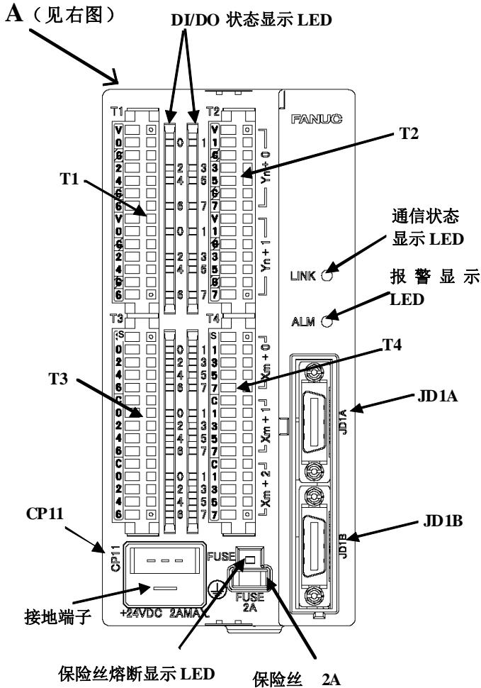

<details>
<summary>text_image</summary>

A（见右图）
DI/DO 状态显示 LED
T1
T2
FANUC
T1
T3
CP11
接地端子
+24VDC 2AMAX
保险丝熔断显示 LED
保险丝 2A
T2
T4
LINK
ALM
通信状态
显示 LED
报警显示
LED
JD1A
JD1B
</details>

从左图的A方向看到的图  
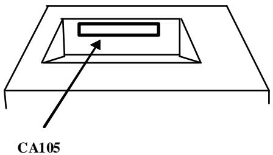

<details>
<summary>text_image</summary>

CA105
</details>


LED 显示内容


### PMC报警: LINK
- **故障内容**: 显示通信状态
- **处理办法**: 各 LED 的状态和端子台类型 I/O 模块的状态的对应,请参照 4.2.1 项。


扩展模块 A A03B-0823-C012

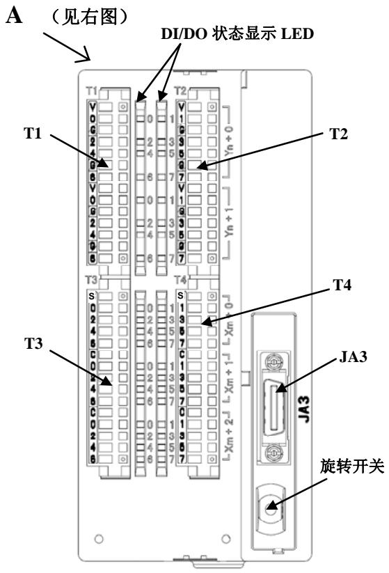

<details>
<summary>text_image</summary>

A （见右图）
DI/DO 状态显示 LED
T1
T2
T3
T4
T3
JA3
旋转开关
</details>

从左图的A方向看到的图(A03B-0823-C012,C013共通)

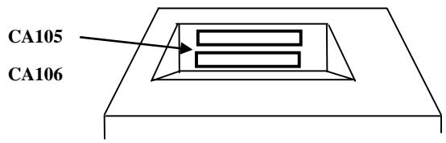

<details>
<summary>text_image</summary>

CA105
CA106
</details>


扩展模块 B A03B-0823-C013

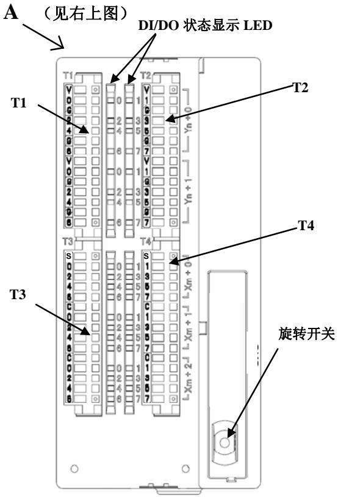

<details>
<summary>text_image</summary>

A （见右上图）
DI/DO 状态显示 LED
T1
T2
T3
T4
旋转开关
</details>


LED 显示内容(A03B-0823-C012,C013 共通)


扩展模块 C A03B-0823-C014  
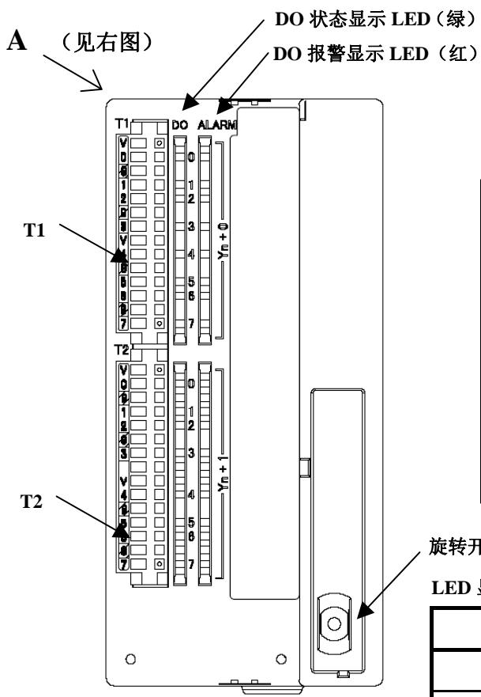

<details>
<summary>text_image</summary>

A （见右图）
DO 状态显示 LED（绿）
DO 报警显示 LED（红）
T1
T2
旋转开
LED
</details>

从左图的 A 方向看到的图(A03B-0823-C014,C015 共通)  
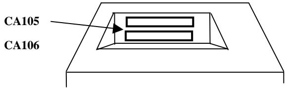

<details>
<summary>text_image</summary>

CA105
CA106
</details>


旋转开关

LED 显示内容


扩展模块 D A03B-0823-C015

A、（见右上图）  
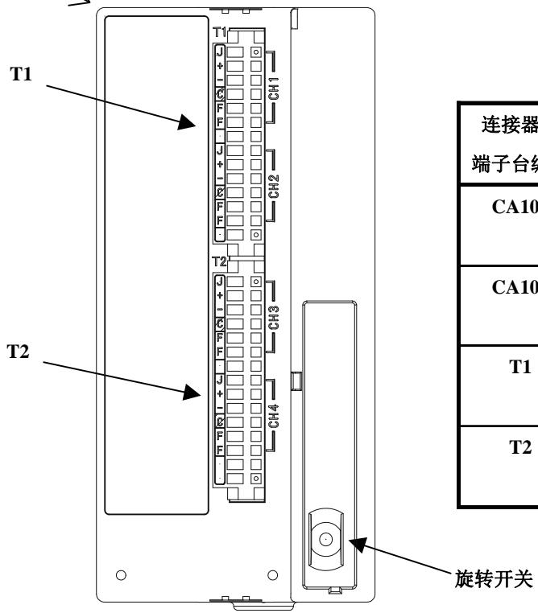

<details>
<summary>text_image</summary>

T1
T2
连接器
端子台综
CA10
CA10
T1
T2
旋转开关
</details>


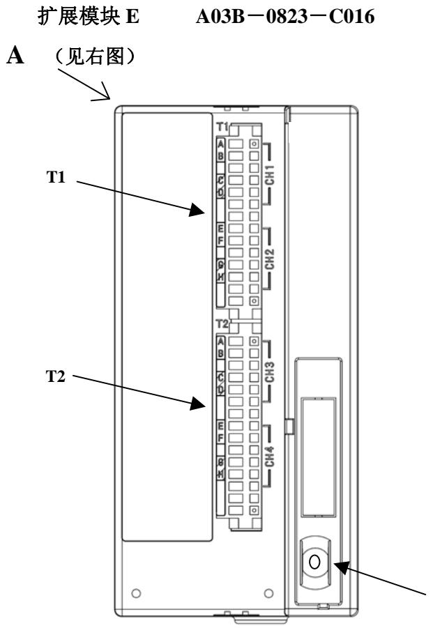

<details>
<summary>text_image</summary>

扩展模块 E
A03B-0823-C016
A （见右图）
T1
T2
</details>

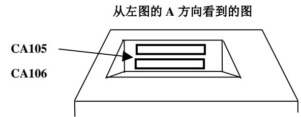

<details>
<summary>text_image</summary>

从左图的 A 方向看到的图
CA105
CA106
</details>


## 扩展模块 C 的保护功能起作用时的状态

扩展模块 C 上在 DO 中发生异常，保护功能起作用时的 DO 的输出状态和报警数据的状态，如下所示。


### PMC报警: 状态
- **故障内容**: PMC 输出
- **处理办法**: 模块的DO输出

### PMC报警: 通常动作
- **故障内容**: 0
- **处理办法**: OFF

### PMC报警: 1
- **故障内容**: ON
- **处理办法**: 点亮

### PMC报警: 过热保护功能动作
- **故障内容**: 0
- **处理办法**: OFF

### PMC报警: 1
- **故障内容**: OFF
- **处理办法**: 熄灭

### PMC报警: 过电压保护功能动作
- **故障内容**: 0
- **处理办法**: OFF

### PMC报警: 1
- **故障内容**: OFF
- **处理办法**: 熄灭

### PMC报警: 断线检测
- **故障内容**: 0
- **处理办法**: OFF

### PMC报警: 1
- **故障内容**: ON
- **处理办法**: 点亮


## 注意

1 不管连接方法如何，DO 的异常信息将被传输至 DI 区域。不会被传输至系统继电器区域。  
2 上述保护功能中，过热保护功能和过电压保护功能作用时，在排除原因之前，将所属位的 DO 持续置于 OFF。排除原因时，DO 即使不用再启动系统也会重新接通。  
3 断线检测，通过利用模块内的输出元件监视 DO 接通时所连接的流向负荷的电流值来进行。检测出的电流值成为大约 100mA 以下时，视为已经检测出断线。因此，在连接负荷电流较小的设备（LED 等）时，执行断线检测而成为 DO 报警状态，但是与其它的保护功能不同，DO 不会成为 OFF。此外，在一度成为断线状态而后又成为连线状态时，即使不用再启动系统也会解除断线检测。  
4 在负荷的额定电流值比断线检测电流值大的情况下，如同电磁阀等那样流入负荷的电流升高较慢时，升高时，断线检测功能将会起作用。这种情况下，将 DO 置于 ON 后经过一定时间后，若以参照分配给 DI 的 DO 异常信息的方式进行编程，则可以避免升高时的断线检测功能。

## - 关于旋转开关

## 注释

更换扩展模块时，务必将旋转开关设定为与更换前的模块相同。

通过改变扩展模块中的设定（旋转开关），即可跳过中间的扩展模块进行连接。详请请参阅 4.2.2 接线盘 I/O 模块 关于旋转开关的项目。

## - 关于 PMC 报警信息与异常发生部位的对应

有关因 I/O Link i 连接而在本模块中发生状态报警时在 PMC 报警画面上所显示的 PMC 报警信息“WN69 I/O Link i DO 报警 (CHn Gxx Syy zz :PMCa Ybbb = \*\*H)”，插槽号码 yy 以及插槽内的字节地址 zz 与异常发生部位的对应如下表所示。


### PMC报警: 01
- **故障内容**: 00
- **处理办法**: 基本模块 第 0 字节 **H 位的 DO 接地故障

### PMC报警: 02
- **故障内容**: 00
- **处理办法**: 扩展模块 1 第 0 字节 **H 位的 DO 接地故障

### PMC报警: 03
- **故障内容**: 00
- **处理办法**: 扩展模块 2 第 0 字节 **H 位的 DO 接地故障

### PMC报警: 04
- **故障内容**: 00
- **处理办法**: 扩展模块 3 第 0 字节 **H 位的 DO 接地故障


## 4.2.7 I/O Link连接单元 [支持I/O Link i]

规格


## 连接器、保险丝的安装位置

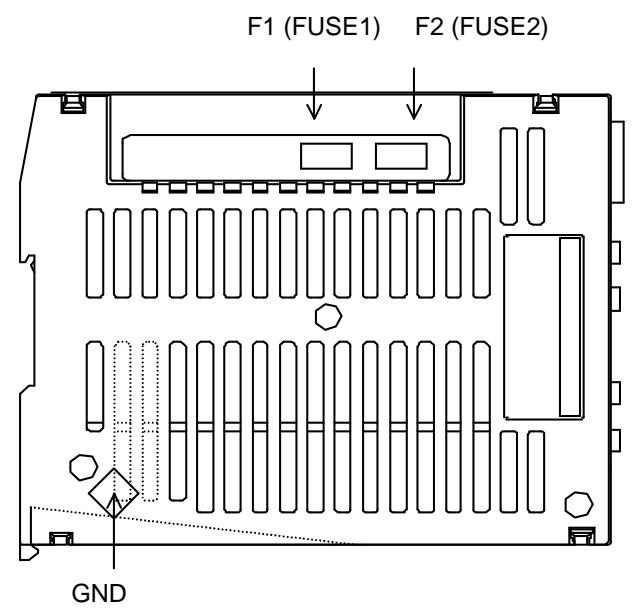

<details>
<summary>text_image</summary>

F1 (FUSE1) F2 (FUSE2)
GND
</details>

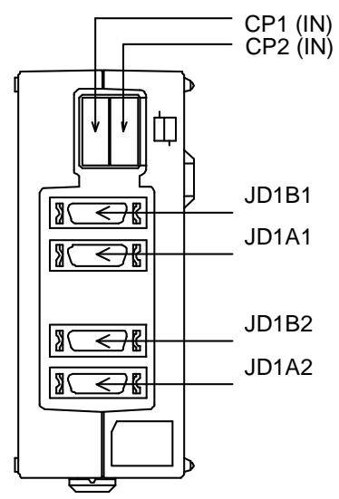

<details>
<summary>text_image</summary>

CP1 (IN)
CP2 (IN)
JD1B1
JD1A1
JD1B2
JD1A2
</details>


## - LED 显示

I/O Link 连接单元，I/O Link 有 2 个通道，如下图所示那样，对每个 I/O Link 的通道，安装有绿色 LED “LINKn” 和红色 LED “ALMn”、“FUSEn”。（n 为 1 或者 2）

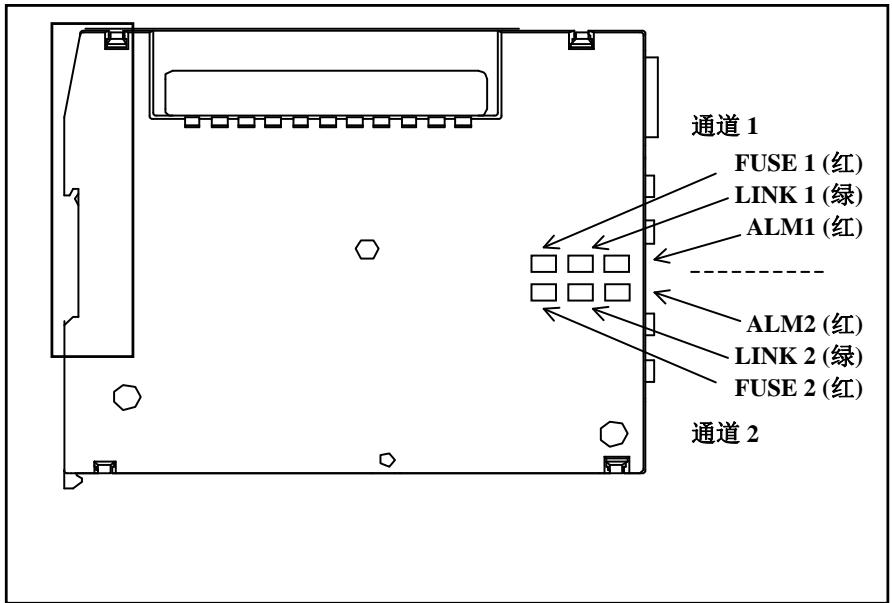

<details>
<summary>text_image</summary>

通道 1
FUSE 1 (红)
LINK 1 (绿)
ALM1 (红)
ALM2 (红)
LINK 2 (绿)
FUSE 2 (红)
通道 2
</details>

有关各 LED 的状态和 I/O Link 连接单元的状态的对应，请参阅 4.2.1 项。


## 注意

I/O Link 连接单元，I/O Link 有 2 个通道，需要对每个通道供给 24V。

LED “LINK1” 点亮或者不闪烁时，确认连接器 CP1 侧的 24V。

LED “LINK2” 点亮或者不闪烁时，确认连接器 CP2 侧的 24V。

## 4.2.8 机械操作面板 [支持I/O Link i]

- 规格


### PMC报警: 名称
- **故障内容**: 规格
- **处理办法**: 备注

### PMC报警: 床操作面板主面板
- **故障内容**: A02B-0323-C231
- **处理办法**: 

### PMC报警: 安全机床操作面板
- **故障内容**: A02B-0323-C234
- **处理办法**: 

### PMC报警: 安全机床操作面板 type B
- **故障内容**: A02B-0323-C235
- **处理办法**: 

### PMC报警: 机床操作面板副面板 AA
- **故障内容**: A02B-0236-C237
- **处理办法**: 

### PMC报警: 机床操作面板副面板 D
- **故障内容**: A02B-0236-C244
- **处理办法**: 

### PMC报警: 透明键顶组件(透明键顶 55 个)
- **故障内容**: A02B-0236-K170
- **处理办法**: 

### PMC报警: 空格键顶组件(无印字键顶 55 个)
- **故障内容**: A02B-0236-K171
- **处理办法**: 标准机床操作面板主面板用

### PMC报警: 符号英文键顶组件(带有印字的键顶 34+无印字键顶 21 个)
- **故障内容**: A02B-0236-K174
- **处理办法**: 标准机床操作面板主面板用

### PMC报警: 空格键顶组件(无印字的红色键顶 100 个)
- **故障内容**: A02B-0236-K175
- **处理办法**: 标准机床操作面板主面板用

### PMC报警: 空格键顶组件(无印字的绿色键顶 100 个)
- **故障内容**: A02B-0236-K176
- **处理办法**: 标准机床操作面板主面板用

### PMC报警: 空格键顶组件(无印字的蓝色键顶 100 个)
- **故障内容**: A02B-0236-K177
- **处理办法**: 标准机床操作面板主面板用

### PMC报警: 空格键顶组件(无印字的黄色键顶 100 个)
- **故障内容**: A02B-0236-K178
- **处理办法**: 标准机床操作面板主面板用

### PMC报警: 键盘盖罩
- **故障内容**: A02B-0323-K041
- **处理办法**: 标准机床操作面板主面板、安全机床操作面板、安全机床操作面板 type B 用

### PMC报警: 螺帽(内装 5 个)
- **故障内容**: A02B-0319-K191
- **处理办法**: 

### PMC报警: 保险丝 1A(预备品)
- **故障内容**: A03B-0815-K001
- **处理办法**: 


## - 连接器以及保险丝的安装位置

标准机床操作面板主面板  
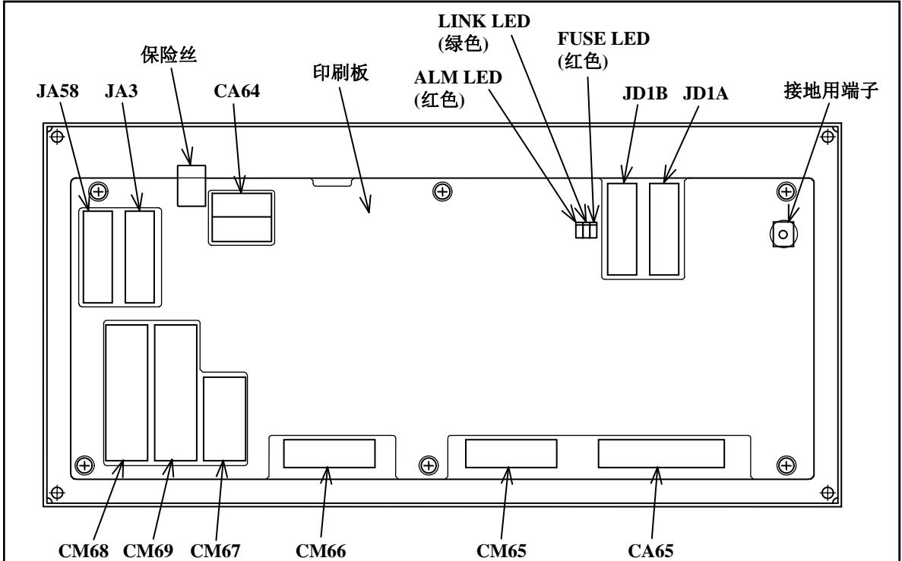

<details>
<summary>text_image</summary>

JA58
JA3
保险丝
CA64
印刷板
LINK LED
(绿色)
ALM LED
(红色)
FUSE LED
(红色)
JD1B JD1A
接地用端子
CM68 CM69 CM67 CM66
CM65 CA65
</details>

主面板的背面


安全机床操作面板·安全机床操作面板 type B  
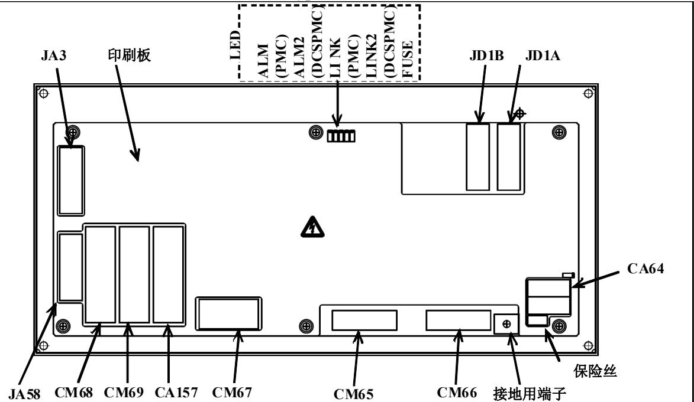

<details>
<summary>text_image</summary>

JA3
印刷板
LED
ALM (PMC)
ALM2 (DCSPMC)
LI NK (PMC)
LINK2 (DCSPMC)
FUSE
JD1B
JD1A
JA58 CM68 CM69 CA157 CM67
CA64
CM65 CM66 接地用端子
保险丝
</details>

安全机床操作面板的背面


## - 关于LED

安装在标准机床操作面板主面板背面一侧的印刷板上，如上图所示那样安装有绿色 LED “LINK” 和红色 LED “ALM”、“FUSE”。

安装在安全机床操作面板、安全机床操作面板 type B 背面一侧的印刷板上，如上图所示那样安装有绿色 LED “LINK”、“LINK2” 和红色 LED “ALM”、“ALM2”、“FUSE”。

有关各 LED 的状态和主面板的状态的对应，请参照 4.2.1 项。

## - 关于 PMC 报警信息与异常发生部位的对应

有关因 I/O Link i 连接而在本操作面板中发生状态报警时在 PMC 报警画面上所显示的 PMC 报警信息“WN69 I/O Link i DO 报警 (CHn Gxx Syy zz :PMCa Ybbb = \*\*H)”，插槽号码 yy 以及插槽内的字节地址 zz 与异常发生部位的对应如下表所示。


### PMC报警: 01
- **故障内容**: 05
- **处理办法**: 第 5 字节 **H 位的 DO 接地故障


※第 0～4 字节中不会发生 DO 报警。

## 4.2.9 操作面板连接单元（源型输出）[对应I/O Link i]

规格


### PMC报警: 名称
- **故障内容**: 备货规格
- **处理办法**: 规格

### PMC报警: 操作面板连接单元(源型输出 B)
- **故障内容**: A16B-2204-0260
- **处理办法**: DI:96 点DO:64 点

### PMC报警: 操作面板连接单元(源型输出 A)
- **故障内容**: A16B-2204-0261
- **处理办法**: DI:64 点DO:32 点

### PMC报警: 保险丝(预备品)
- **故障内容**: A02B-0163-K111
- **处理办法**: 3.2A


- 连接器、LED 以及保险丝的安装位置

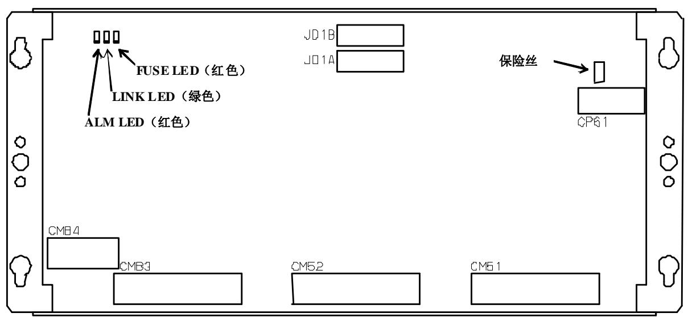

<details>
<summary>text_image</summary>

FUSE LED（红色）
LINK LED（绿色）
ALM LED（红色）
JD 1B
JD 1A
保险丝
CP61
CMB4
CMB3
CM52
CM51
</details>


## - 关于LED

如上所述，本印刷板上安装有绿色 LED “LINK” 和红色 LED “ALM”、“FUSE”。

有关各 LED 的状态和操作面板连接单元的状态对应，请参阅 4.2.1 项。

## - 关于PMC报警信息与异常发生部位的对应

有关因 I/O Link i 连接而在本操作面板中发生状态报警时在 PMC 报警画面上所显示的 PMC 报警信息“WN69 I/O Link i DO 报警 (CHn Gxx Syy zz :PMCa Ybbb = \*\*H)”，插槽号码 yy 以及插槽内的字节地址 zz 与异常发生部位的对应如下表所示。

A16B-2204-0260 的情形


### PMC报警: 01
- **故障内容**: 00
- **处理办法**: 第 0 字节 **H 位的 DO 接地故障


A16B-2204-0261 的情形


### PMC报警: 01
- **故障内容**: 00
- **处理办法**: 第 0 字节 **H 位的 DO 接地故障


## 4.2.10 安全IO单元 [I/O Link i专用]

规格


### PMC报警: 名称
- **故障内容**: 备货规格
- **处理办法**: 规格

### PMC报警: 安全 IO 单元
- **故障内容**: A03B-0821-C002
- **处理办法**: 

### PMC报警: 保险丝(预备品)
- **故障内容**: A03B-0815-K001
- **处理办法**: 1A


## - 连接器、LED 以及保险丝的安装位置

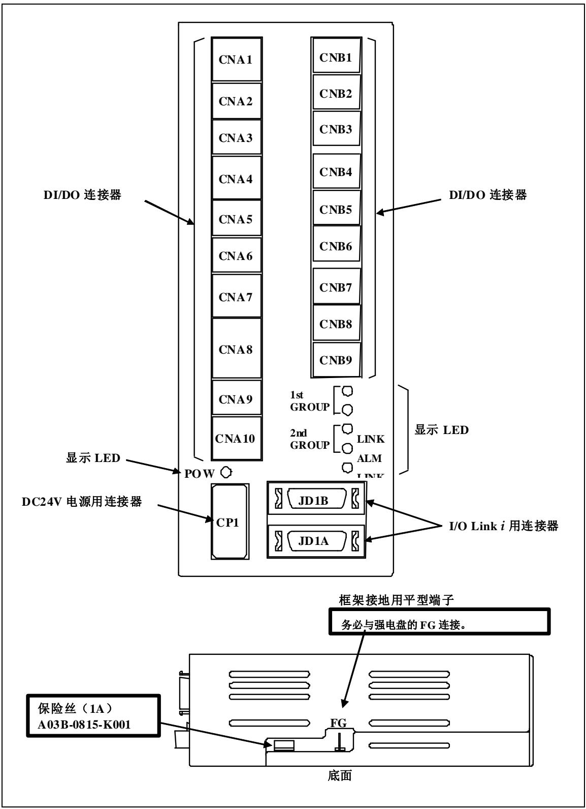

<details>
<summary>flowchart</summary>

```mermaid
graph TD
  A["DI/DO 连接器"] --> B["CNA1"]
  A --> C["CNA2"]
  A --> D["CNA3"]
  A --> E["CNA4"]
  A --> F["CNA5"]
  A --> G["CNA6"]
  A --> H["CNA7"]
  A --> I["CNA8"]
  A --> J["CNA9"]
  A --> K["CNA10"]
  L["显示 LED"] --> M["POW"]
  N["DC24V 电源用连接器"] --> O["CP1"]
  P["DI/DO 连接器"] --> Q["1st GROUP"]
  P --> R["2nd GROUP"]
  P --> S["LINK ALM LINK"]
  T["I/O Link i 用连接器"] --> U["JD1B"]
  T --> V["JD1A"]
  W["保险丝 (1A) A03B-0815-K001"] --> X["FG"]
  Y["框架接地用平型端子"] --> Z["务必与强电盘的 FG 连接。"]
  AA["底面"] --> AB["接地符号"]
```
</details>


## - 关于LED

如上所述，本单元上安装有绿色 LED “POW”、“LINK” 和红色 LED “ALM”、“FUSE”。

有关各 LED 的状态和安全 IO 单元的状态对应，请参阅 4.2.1 项。

## - 关于 PMC 报警信息与异常发生部位的对应

有关因 I/O Link i 连接而在本模块中发生状态报警时在 PMC 报警画面上所显示的 PMC 报警信息“WN69 I/O Link i DO 报警 (CHn Gxx Syy zz :PMCa Ybbb = \*\*H)”，插槽号码 yy 以及插槽内的字节地址 zz 与异常发生部位的对应如下表所示。


### PMC报警: 组编号Gyy
- **故障内容**: 插槽号码Syy
- **处理办法**: 插槽内的字节地址zz

### PMC报警: 0~23(第1组PMC侧)
- **故障内容**: 01
- **处理办法**: 00

### PMC报警: 0~23(第2组DCSPMC侧)
- **故障内容**: 01
- **处理办法**: 00


## 4.2.11 安全功能对应操作面板I/O模块（I/O Link i专用）

规格


### PMC报警: 名称
- **故障内容**: 备货规格
- **处理办法**: 规格

### PMC报警: 安全功能对应操作面板 I/O 模块(类型 A)
- **故障内容**: A20B-2200-0471
- **处理办法**: 

### PMC报警: 安全功能对应操作面板 I/O 模块(类型 B)
- **故障内容**: A20B-2200-0470
- **处理办法**: 

### PMC报警: 保险丝(预备品)
- **故障内容**: A03B-0815-K001
- **处理办法**: 1A


## - 连接器、LED 以及保险丝的安装位置

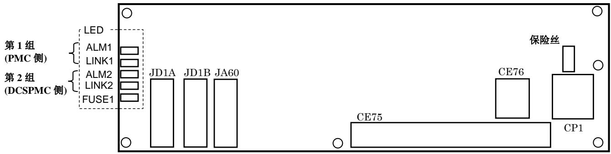

<details>
<summary>text_image</summary>

第1组
(PMC侧)
第2组
(DCSPMC侧)
LED
ALM1
LINK1
ALM2
LINK2
FUSE1
JD1A JD1B JA60
CE75
CE76
CP1
保险丝
</details>


## - 关于LED

如上所述，本单元上安装有绿色 LED “LINK1”（第 1 组 PMC 侧）“LINK2”（第 2 组 DCSPMC 侧）和红色 LED “ALM1”（第 1 组 PMC 侧）“ALM2”（第 2 组 DCSPMC 侧）、“FUSE1”。

有关各 LED 的状态和安全功能对应操作面板 I/O 模块的状态对应，请参阅 4.2.1 项。

## - 关于 PMC 报警信息与异常发生部位的对应

有关因 I/O Link i 连接而在本模块中发生状态报警时在 PMC 报警画面上所显示的 PMC 报警信息“WN69 I/O Link i DO 报警 (CHn Gxx Syy zz :PMCa Ybbb = \*\*H)”，插槽号码 yy 以及插槽内的字节地址 zz 与异常发生部位的对应如下表所示。

4.其他单元的维护  
B-64605CM/01


### PMC报警: 组编号Gyy
- **故障内容**: 插槽号码Syy
- **处理办法**: 插槽内的字节地址zz

### PMC报警: 0~23(第1组PMC侧)
- **故障内容**: 01
- **处理办法**: 00


## 4.2.12 强电盘用I/O单元（对应I/O Link i）

- 规格


### PMC报警: 名称
- **故障内容**: 备货规格
- **处理办法**: 规格

### PMC报警: 强电盘用 I/O 单元
- **故障内容**: A02B-0319-C001
- **处理办法**: DI/DO=96/64, 附带 MPG 接口

### PMC报警: 保险丝(预备品)
- **故障内容**: A03B-0815-K001
- **处理办法**: 1A


- 连接器、LED 以及保险丝的安装位置

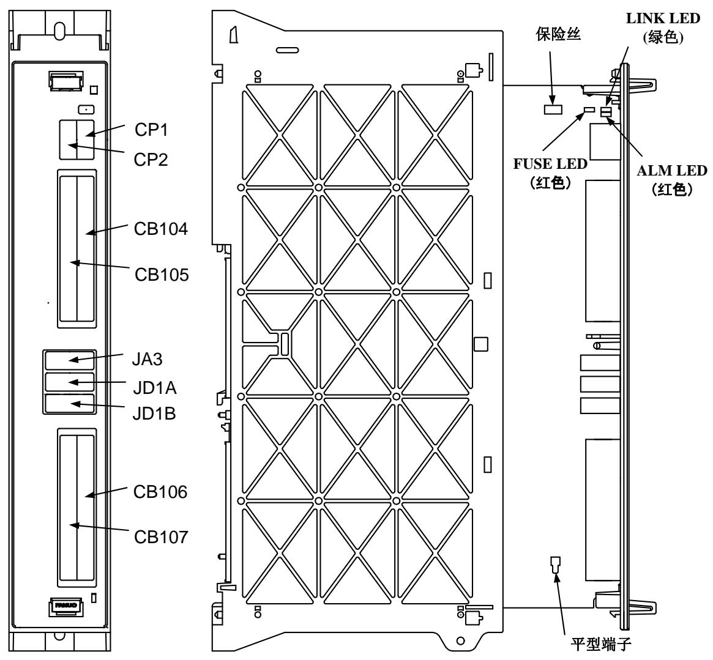


## - 关于LED

强电盘用 I/O 单元上安装有绿色 LED “LINK” 和红色 LED “ALM”、“FUSE”。

有关各 LED 的状态和安全功能对应操作面板 I/O 模块的状态对应，请参阅 4.2.1 项。

## - 关于 PMC 报警信息与异常发生部位的对应

有关因 I/O Link i 连接而在本模块中发生状态报警时在 PMC 报警画面上所显示的 PMC 报警信息“WN69 I/O Link i DO 报警 (CHn Gxx Syy zz :PMCa Ybbb = \*\*H)”，插槽号码 yy 以及插槽内的字节地址 zz 与异常发生部位的对应如下表所示。


### PMC报警: 01
- **故障内容**: 00
- **处理办法**: 第 0 字节 **H 位的 DO 接地故障


## 4.3 位置检测器接口单元

- 规格


- 连接器的安装位置  
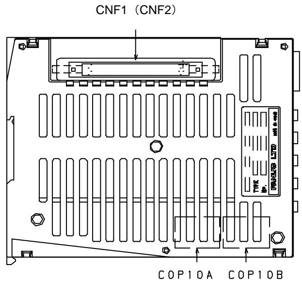

<details>
<summary>text_image</summary>

CNF1 (CNF2)
COP10A COP10B
</details>

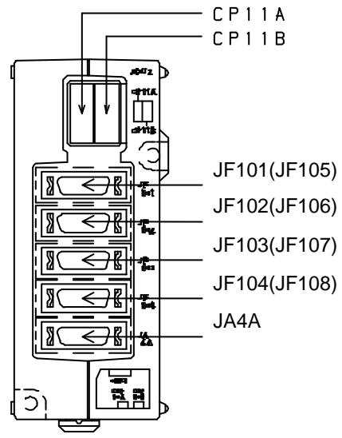

<details>
<summary>text_image</summary>

CP11A
CP11B
JF101(JF105)
JF102(JF106)
JF103(JF107)
JF104(JF108)
JA4A
</details>

括弧内表示附加单元


括弧内表示附加单元

## - LED 显示

基本单元柜内基板上安装有用于状态显示的 LED。有 2 个绿色 LED：“POWER”和“LINK”，以及 2 个红色 LED：“ERR1”和“ERR2”。LED 的位置及显示内容如下所示。

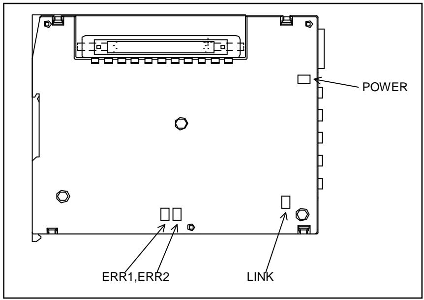

<details>
<summary>text_image</summary>

POWER
ERR1,ERR2
LINK
</details>

LED 的显示内容


### PMC报警: No.
- **故障内容**: LED
- **处理办法**: 显示内容

### PMC报警: 1
- **故障内容**: POWER
- **处理办法**: 在通电状态下点亮

### PMC报警: 2
- **故障内容**: LINK
- **处理办法**: 进行 FSSB 的通讯时点亮

### PMC报警: 3
- **故障内容**: ERR1
- **处理办法**: COP10A(后段)发生断线时点亮

### PMC报警: 4
- **故障内容**: ERR2
- **处理办法**: COP10B(前段)发生断线时点亮


## 4.4 模拟输入位置检测器接口单元

- 规格


作为附加单元，可以使用上一项的 A02B-0323-C204。

- 连接器的安装位置  
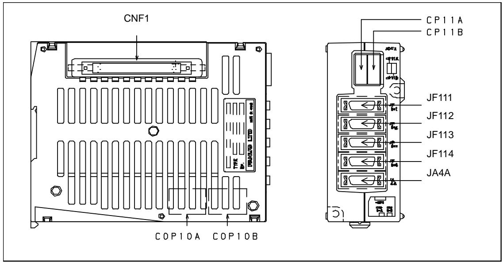

<details>
<summary>text_image</summary>

CNF1
CP11A
CP11B
JF111
JF112
JF113
JF114
JA4A
COP10A COP10B
</details>

括弧内表示附加单元


## - LED 显示

基本单元柜内基板上安装有用于状态显示的 LED。2 个绿色 LED：“POWER”和“LINK”，以及 2 个红色 LED：“ERR1”和“ERR2”。LED 的位置及显示内容如下所示。

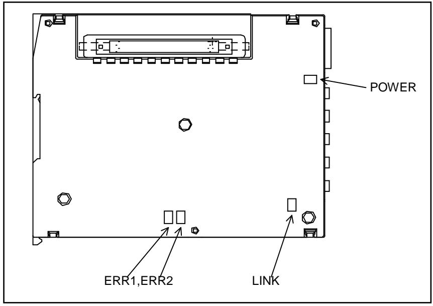

<details>
<summary>text_image</summary>

POWER
ERR1,ERR2
LINK
</details>

LED 的显示内容


### PMC报警: No.
- **故障内容**: LED
- **处理办法**: 显示内容

### PMC报警: 1
- **故障内容**: POWER
- **处理办法**: 在通电状态下点亮

### PMC报警: 2
- **故障内容**: LINK
- **处理办法**: 进行 FSSB 的通讯时点亮

### PMC报警: 3
- **故障内容**: ERR1
- **处理办法**: COP10A(后段)发生断线时点亮

### PMC报警: 4
- **故障内容**: ERR2
- **处理办法**: COP10B(前段)发生断线时点亮


## 4.5 PANEL i

有关 PANEL i 的电池、风扇更换以外的维修，请参阅 “FANUC PANEL i CONNECTION AND MAINTENANCE MANUAL”（连接 • 维修说明书）(B-64223EN/02)。

Core2 Duo 版薄型 PANEL i 的电池和风扇的更换方法，有关电池请参阅 3.10.1 项，有关风扇请参阅 3.11.1 项。

## 4.5.1 电池的更换方法

PANEL i 的 BIOS 设定内容，存储在 PANEL i 主板上的 LSI 中。该 LSI 的电源，已通过安装在 PANEL i 上的后备用电池进行后备。即使主电源断开，上述数据也不会丢失。

当电池的电压下降时，在通电时的画面上显示 “CMOS Battery Low” （CMOS 电池电压下降）的 BIOS 消息。此外，已经正确装配硬件监控器（HardMntr.exe）的情况下，在系统启动后监控器画面自动打开，显示 “CMOS Battery : Low”。显示报警后，用户应尽快更换电池。

当电池的电压继续下降时，就无法再进行 BIOS 设定内容的备份，需要进行内容的全清以及再设定。因此，发那科公司建议用户不管是否有无电池报警，每年定期更换一次电池。

在进行更换作业前,请预先准备锂电池(备货规格:A02B-0200-K102(Pentium M 版/Pentium III 版)、A02B-0323-K102 (Core2 Duo 版))。

请按照如下方法更换电池。

(1) 在接通电源 5 秒钟以上后，断开 PANEL i 的电源，从面板上取下，以便从背面进行操作。  
(2) Pentium M 版/Pentium III 版：拆下锂电池的连接器，将电池从电池保持器上拆下来。

Core2 Duo 版：解除锂电池侧面的闩锁，从电池盒上拆下。

(3) Pentium M 版/Pentium III 版：在 5 分钟之内插入新电池的连接器(BAT1)，将电池安装在电池保持器上。

Core2 Duo 版：在 5 分以内将新的电池插入电池盒内。确认闩锁已经切实挂住。

(4) 重新设置 PANEL i。  
(5) 通电，确认 BIOS 参数没有丢失（启动时不会出现错误）。

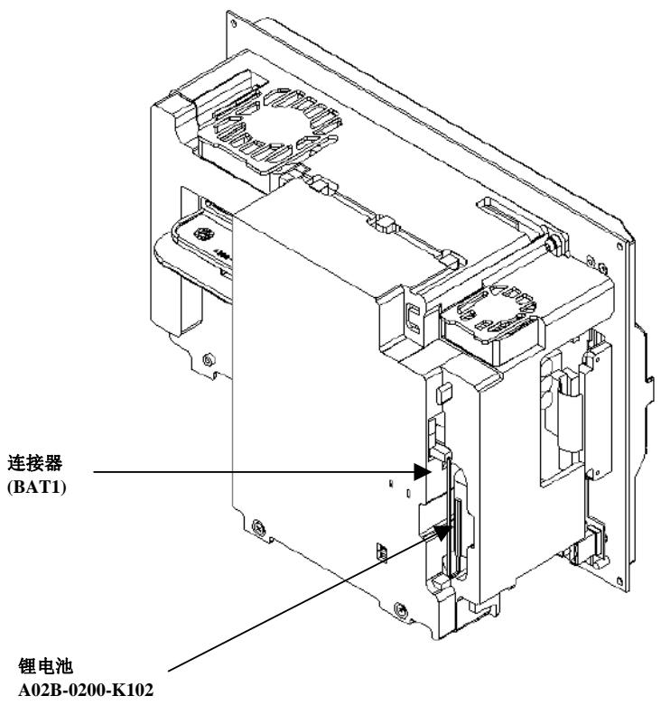

<details>
<summary>text_image</summary>

连接器
(BAT1)
锂电池
A02B-0200-K102
</details>

图 4.5.1 (a) 更换电池（Pentium M 版/Pentium III 版）

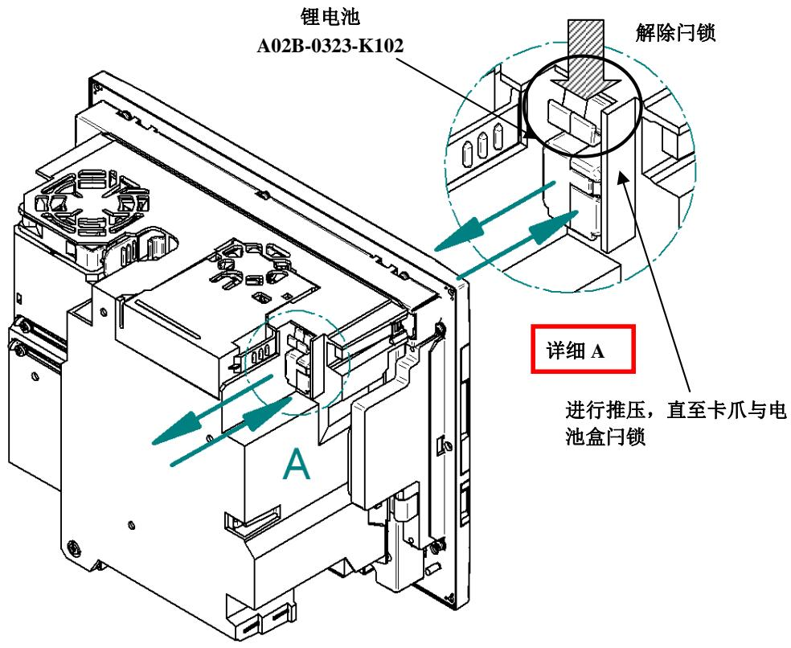

<details>
<summary>text_image</summary>

锂电池
A02B-0323-K102
解除闩锁
详细 A
进行推压，直至卡爪与电
池盒闩锁
A
</details>

图 4.5.1 (b) 更换电池(Core2 Duo 版)


## 警告

如果没有正确更换锂电池，可能会导致爆炸。

请勿更换为指定锂电池（Pentium M 版/Pentium III 版：A02B-0200-K102、Core2 Duo 版：A02B-0323-K102）以外的电池。


## 注意

从连接器上取下用旧的电池后，在 5 分钟内将新电池插入连接器。

只要按照下列要领更换电池，BIOS 设定内容一般不会丢失。但在万一数据丢失的情况下，通电时会出现 251: System CMOS checksum bad - Default configuration used. 和 “Press <F2> to enter SETUP” 这样的提示信息。若是在非默认的 BIOS 设定下使用 PANEL i ，则应重新进行 BIOS 设定。通常在默认值的状态下使用。

## 注释

关于更换下来的电池，应按照设置机床的所在国及管辖该设置场所的自治团体规定的条例等，作为工业废料进行妥善处理。此外，废弃之前应用胶带等进行绝缘处理，以免端子形成短路。

## 4.5.2 风扇的更换方法

## 4.5.2.1 更换PANEL i主体部分的风扇

(1) 将 PANEL i 的电源置于 OFF。  
(2) 准备新的风扇。  
(3) 拆下风扇的连接器。

Pentium M 版/Pentium III 版：连接器上加有闩锁。按照下图所示用一字改锥一边接触闩锁，一边拔出连接器。

Core2 Duo 版：闩锁已锁定在风扇侧面。如图 4.5.2 (b1～b3) 所示，在解除闩锁的同时，拆除风扇。（在已经安装有 PCI 板，无法笔直拔出时，请沿着上方向避开板而予以拆除。）

(4) 更换风扇。此时，注意不要弄错风扇的安装方向。  
(5) 安装新的风扇。

Pentium M 版/Pentium III 版: 将 60mm 方形风扇（备货规格: A08B-0084-K101）插入 CPE11B，将 40mm 方形风扇（备货规格: A08B-0084-K100）插入 CPB11A，注意不要弄错。而后，以避免弄错风扇安装方向的方式予以安装。

Core2 Duo 版：(i) 插入 60mm 方形风扇。图 4.5.2 (b1)

(ii) 将 40mm 方形风扇安装到风扇盖板上。图 4.5.2 (b2)  
(iii) 将附带有 40mm 方形风扇的风扇盖板插入壳体内。图 4.5.2 (b3)

(注释：请勿弄错 2 个风扇予以插入。)

（备货规格：包含有 A02B-0323-K125、60mm 方形 · 40mm 方形 2 个风扇。）

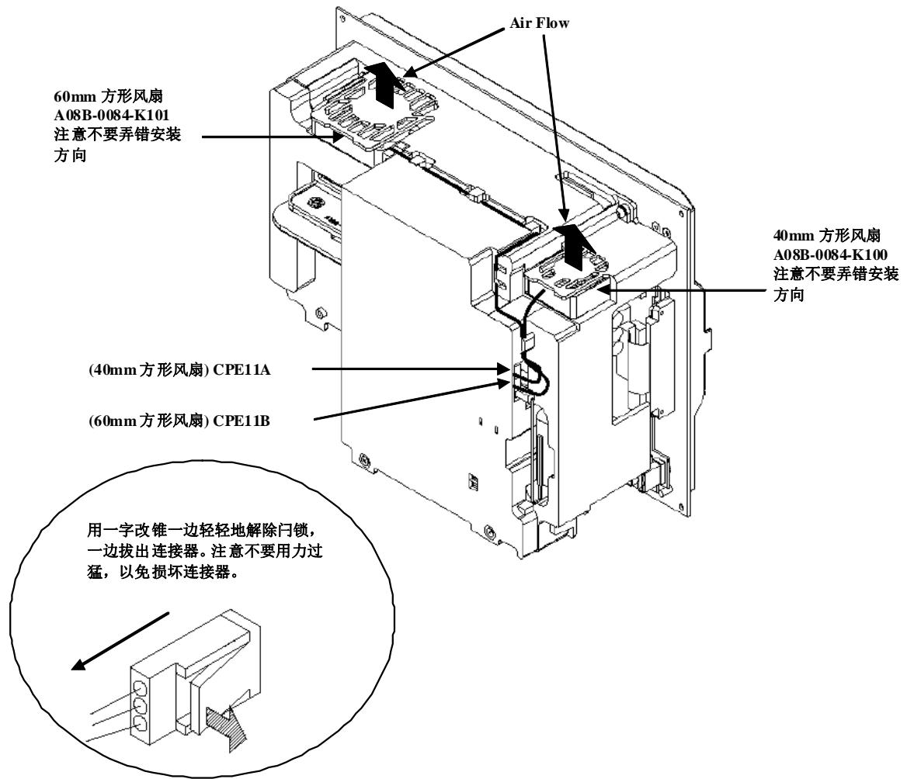

<details>
<summary>text_image</summary>

Air Flow
60mm 方形风扇
A08B-0084-K101
注意不要弄错安装
方向
40mm 方形风扇
A08B-0084-K100
注意不要弄错安装
方向
(40mm 方形风扇) CPE11A
(60mm 方形风扇) CPE11B
用一字改锥一边轻轻地解除闩锁，
一边拔出连接器。注意不要用力过
猛，以免损坏连接器。
</details>

图 4.5.2 (a) 更换风扇（Pentium M 版/Pentium III 版）

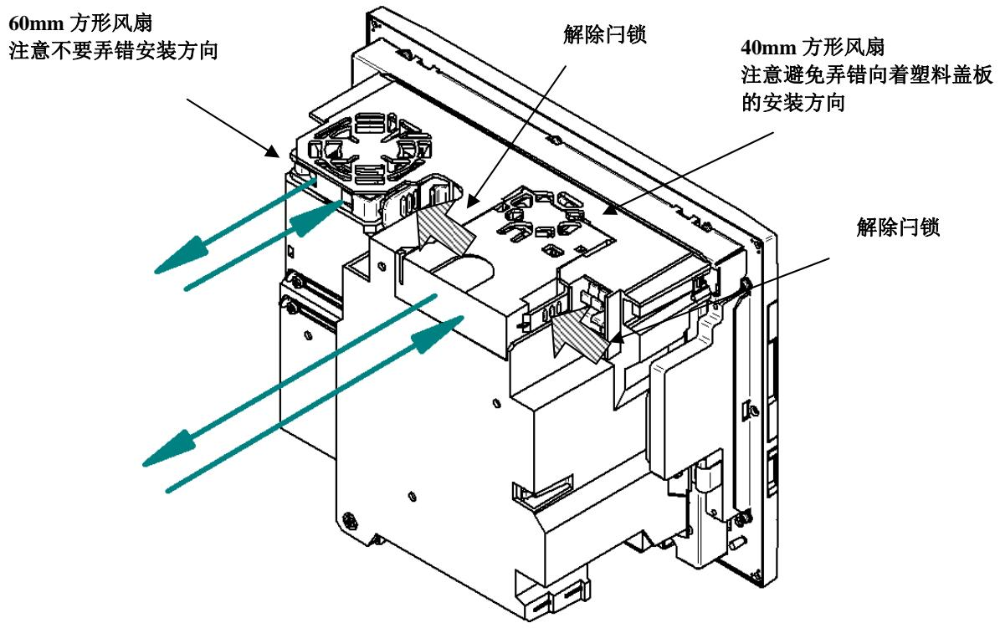

<details>
<summary>text_image</summary>

60mm 方形风扇
注意不要弄错安装方向
解除闩锁
40mm 方形风扇
注意避免弄错向着塑料盖板
的安装方向
解除闩锁
</details>

图4.5.2(b1) 更换风扇（Core2 Duo版）

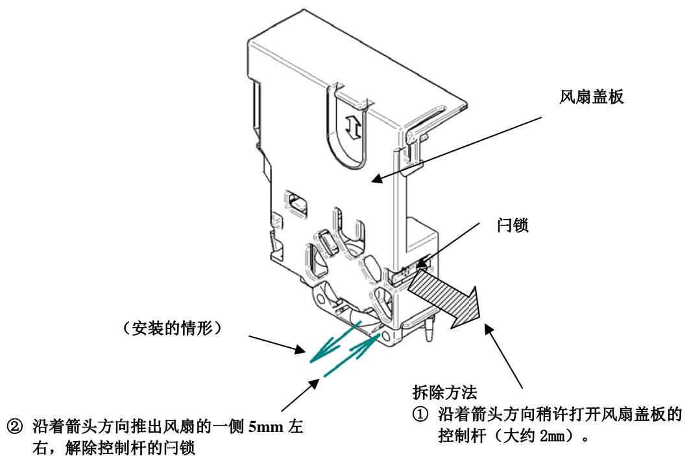

<details>
<summary>text_image</summary>

风扇盖板
闩锁
（安装的情形）
拆除方法
① 沿着箭头方向稍许打开风扇盖板的控制杆（大约 2mm）。
② 沿着箭头方向推出风扇的一侧 5mm 左右，解除控制杆的闩锁
</details>

图 4.5.2 (b2) 40mm 方形风扇的拆除（1）

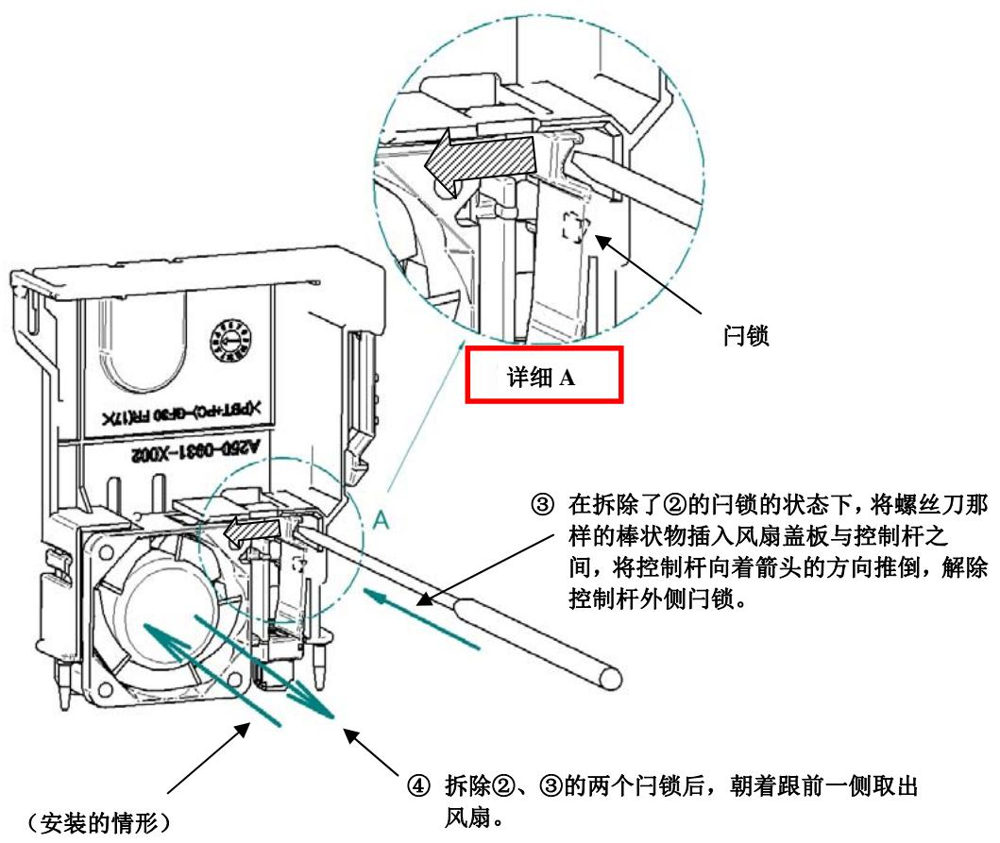

<details>
<summary>text_image</summary>

XPTP+PO-QF30 FR(17K)
A250-0031-X002
XPTP+PO-QF30 FR(17K)
详细 A
③ 在拆除了②的闩锁的状态下，将螺丝刀那样的棒状物插入风扇盖板与控制杆之间，将控制杆向着箭头的方向推倒，解除控制杆外侧闩锁。
④ 拆除②、③的两个闩锁后，朝着跟前一侧取出风扇。
（安装的情形）
</details>

图 4.5.2 (b3) 40mm 方形风扇的拆除（2）

## 4.5.2.2 更换用于HDD的风扇

(1) 将 PANEL i 的电源置于 OFF。  
(2) 准备新的风扇。

Pentium M 版/Pentium III 版: A08B-0084-K102

Core2 Duo 版: A08B-0088-K100

(3) 拆下电源板上的风扇连接器。

Pentium M 版/Pentium III 版：连接器(CPE11C)上加有闩锁。一边稍许提起连接器地拆下闩锁，一边将其拔出。Core2 Duo 版：连接器（CA97L）闩锁已锁定。一边按闩锁，一边将其拔出。

(4) 拧下固定风扇的 2 个螺丝，拆下风扇。  
(5) 用 2 个螺丝固定新风扇，连接到连接器(CPE11C)上。注意不要弄错此时的安装方向。

注释

若是汽车制造商规格的单元，在更换风扇时，请拆下 HDD 单元。

至电源印制电路板

CPE11C (3 插脚) (Pentium M 版 / Pentium III 版)

至 CA97L (Core2 Duo 版)

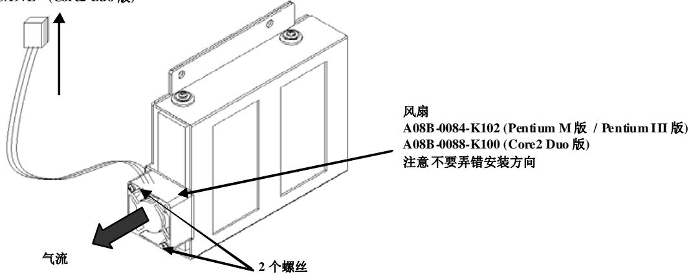

<details>
<summary>text_image</summary>

风扇
A08B-0084-K102 (Pentium M 版 / Pentium III 版)
A08B-0088-K100 (Core2 Duo 版)
注意不要弄错安装方向
气流
2 个螺丝
</details>

图 4.5.2 (c) 更换 HDD 的风扇

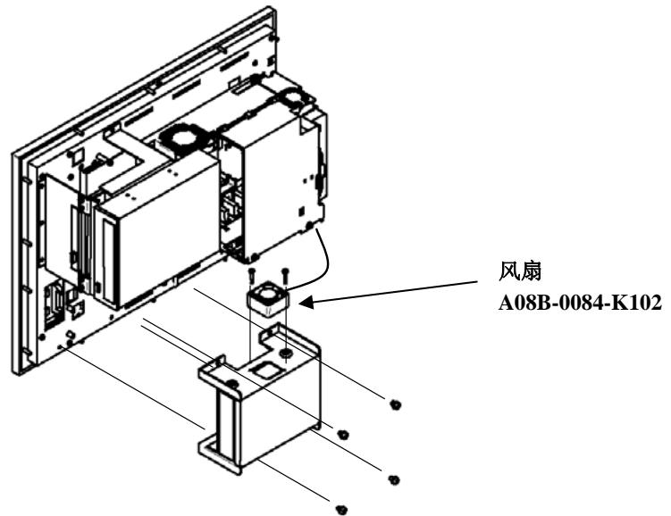

<details>
<summary>text_image</summary>

风扇
A08B-0084-K102
</details>

图 4.5.2 (d) 更换 HDD 的风扇(汽车制造商规格的单元) (Pentium M 版/Pentium III 版)

## 4.5.3 触摸板保护膜的更换方法

带有触摸板的 PANEL i，为了保护其触摸板，在触摸板的表面覆盖有一层保护膜。当该保护膜上有伤痕或污垢等导致画面看不清时，更换保护膜。有关触摸板保护膜的更换方法，请参阅 3.12 节。

## 4.6 更换绝对脉冲编码器的电池

## 4.6.1 概要

\- 绝对脉冲编码器的电池电压下降时，系统会发出报警 307 或者 306，CNC 画面下侧的 CNC 状态显示中，进行如下显示。

报警 308（电池电压下降报警 2）："APC"的字符反相闪烁显示

报警 307（电池电压下降报警）："APC"的字符反相闪烁显示

报警 306（电池零报警）："ALM"的字符反相闪烁显示

\- 发生报警307（电池电压下降报警）时，应尽快更换电池。

请在 1～2 周内更换，实际上会因脉冲编码器的连接数量不同而有所变化。

\- 发出报警 306（电池零报警）时，脉冲编码器进入不保持绝对位置的初始状态。因为会同时发生报警 300（返回参考点请求报警），所以需要进行返回参考点操作。

\- 请按照如下大致标准定期更换电池。

• A06B-6050-K061 或者 1 号碱性干电池（LR20）：2 年（每 6 轴）

\- A06B-6114-K504 : 1年（每3轴）

## 注释

上述寿命为使用我公司制绝对脉冲编码器时的大致时间。实际的电池寿命，会因检测器的种类等机械构成的不同而有所变化。详情可向机械制造商洽询。

## 4.6.2 电池的更换步骤

请在接通机械电源的状态下更换电池，以免绝对脉冲编码器的绝对位置信息丢失。更换步骤如下所示。

① 确认已经接通伺服放大器的电源。  
② 确认机械已处在紧急停止状态（电机处在非励磁状态）。  
③ 确认用于伺服放大器的 DC 链路充电的 LED 指示灯已经熄灭。  
④ 取下用旧的电池，装上新电池。

另外，有关分离式电池盒、及伺服放大器内置电池的更换作业的详情，在后面进行叙述。

## 警告

- $\alpha i$ 、 $\alpha iS$ 系列伺服电机、以及 $\beta iS$ 系列伺服电机 $\beta iS0.4 \sim \beta iS22$ 的绝对脉冲编码器上，内置有后备电容。由此，即使切断伺服放大器的电源更换电池，只要在 10 分钟之内完成更换作业，也不需要执行返回参考点操作。电池更换作业超过 10 分钟时，请在通电状态下进行作业。  
- 更换电池时，为了预防触电，请勿触摸强电盘内的金属部分。  
- 伺服放大器内部，使用大容量的电解电容器，在切断电源后的一段时间内仍然持续充电的状态。根据保养目的等，在接触伺服放大器前，请通过用测试仪测定 DC 链路部残留电压，并确认充电显示 LED (红色) 处于熄灭状态，充分确保安全。  
- 请勿换上指定外的电池。此外，要注意电池的极性。使用指定外的电池或者弄错极性，会导致电池发热、破裂、起火、绝对脉冲编码器内的绝对位置信息丢失。  
- 请将电池的连接器切实地插入正确的位置。

## 4.6.3 分离式电池盒的电池更换

按照如下步骤，更换电池盒内的电池。

① 拧松电池盒的螺丝，拆下盖子。  
② 更换电池盒内的电池（注意极性）。  
③ 安装电池盒的盖子。

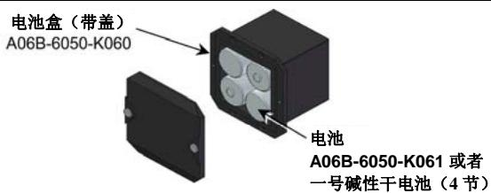

<details>
<summary>text_image</summary>

电池盒（带盖）
A06B-6050-K060
电池
A06B-6050-K061 或者
一号碱性干电池（4节）
</details>

## 注意

- 电池，可使用市面上出售的1号碱性干电池（LR20，4节）。A06B-6050-K061是由我公司作为选项提供的电池（4节组）。  
- 电池要4节都换上新的。新旧电池混合使用时，会导致绝对脉冲编码器内的绝对位置信息丢失。

## 4.6.4 伺服放大器内置电池的更换

按照如下步骤更换专用的锂电池。

① 拆除电池用盖板。  
② 更换专用的锂电池。  
③ 安装电池用盖板。

## 注意

- 电池不是市面出售品，请务必从我公司购买。因此，建议准备好备用的电池。  
- 在使用内置电池时，千万不要连接到连接器 CXA2A/CXA2B 的 BATL(B3)上。此外，请勿复数的电池连接在相同的 BATL(B3)线上。电池的输出电压相互间有可能形成短路，从而致使电池温度升高，这是极其危险的。  
- 在将电池安装在伺服放大器上时，请从电缆有富余的方向进行安装。若在电池电缆处在绷紧的状态下进行安装，就有可能导致接触不良。  
- CX5X的+6V和0V发生短路时，会导致电池的发热、破裂、起火、绝对脉冲编码器内的绝对位置信息丢失。  
- 插入连接器时，请向着连接器插脚方向，沿水平方向插入。

## [电池的连接方法]

$\beta i$ SV4 及 $\beta i$ SV20 的电池，已通过电池盒被安装在放大器主体的底面。

其他的 $\beta i$ 系列放大器以及 $\alpha i$ 系列放大器的电池，已被安装在放大器主体的正面。

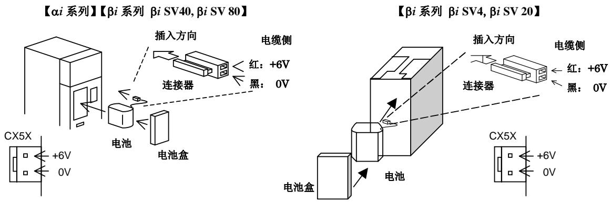

<details>
<summary>text_image</summary>

【αi 系列】【βi 系列 βi SV40, βi SV 80】
插入方向
电缆侧
红: +6V
黑: 0V
连接器
电池盒
CX5X
+6V
0V
电池盒
【βi 系列 βi SV4, βi SV 20】
插入方向
电缆侧
红: +6V
黑: 0V
连接器
电池盒
CX5X
+6V
0V
</details>

[电池的组合及外形]


### PMC报警: 电池订购规格图号
- **故障内容**: 适用伺服放大器
- **处理办法**: 电池盒订购规格图号

### PMC报警: A06B-6114-K504
- **故障内容**: αi系列
- **处理办法**: 60/90mm宽幅

### PMC报警: αi系列
- **故障内容**: 150/300mm宽幅
- **处理办法**: A06B-6114-K506

### PMC报警: βi系列
- **故障内容**: βi SV(2轴)
- **处理办法**: A06B-6114-K505

### PMC报警: A06B-6093-K001
- **故障内容**: βi系列
- **处理办法**: βi SV4,20

### PMC报警: βi系列
- **故障内容**: βi SV40,80
- **处理办法**: A06B-6093-K002


## 用过的电池

关于更换下来的电池，应按照设置机床的所在国及管辖该设置场所的有关部门规定的条例，作为工业废料进行妥善处理。

## 5 输入/输出数据

更换 FROM/SRAM 模块时，需要对数据进行重新设定。本章就输入/输出数参数、零件程序、刀具偏置量到软盘等外部 I/O 设备中的方法进行描述。

5.1 输入/输出所需的参数设定方法....310  
5.2 输入/输出数据....311  
5.3 自动数据备份....317  
5.4 批量数据保存/恢复 321

## 5.1 输入/输出所需的参数设定方法

## 参数的设定步骤

首先，按照下列 1～3 的步骤将参数的写入设定为有效。

1 选择 MDI 方式或设定为急停状态。  
2 按功能键 OFS 数次，再按下软件 [设定]，显示“设定(手持盒)”画面。  
3 将光标对准在“写参数”上，按下 1 INPUT。

此时，发出“报警100”。

4 按功能键 $\boxed{\text{SYCTEM}}$ 数次，选择参数画面。

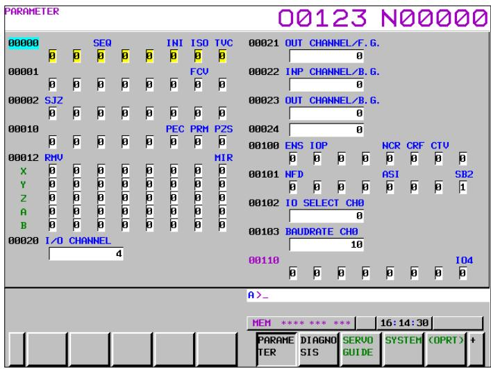

<details>
<summary>text_image</summary>

PARAMETER
00123 N00000
00000 SEQ INI ISO TVC 00021 OUT CHANNEL/F.G.
00001 FCU 00022 INP CHANNEL/B.G.
00002 SJZ 00023 OUT CHANNEL/B.G.
00010 PEC PRM PZS 00024
00012 RHU MIR 00108 ENS IOP NCR CRF CTV
X 0 0 0 0 0 0 0 0 0 0 0 0 0 0 0
Y 0 0 0 0 0 0 0 0 0 0 0 0 0 0 0
Z 0 0 0 0 0 0 0 0 0 0 0 0 0 0
A 0 0 0 0 0 0 0 0 0 0 0 0
B 0 0 0 0 0 0 0 0 0 0 0
00028 I/O CHANNEL
4
A >_
HEM **** *** ***
16:14:38
PARAMETER DIAGNOSIS SERVO GUIDE SYSTEM (OPRT) +
I O4
</details>

以位(bit)为单位设定光标显示时，依次按下

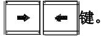

5 按下软键 [(操作)] 时，显示出下列操作菜单。

① 软键 [搜索号码]：可以进行号码搜索。

例) 参数号 → [搜索号码]

② 软键 [ON:1]：将光标位置的值设定为“1”。（仅限位型参数）  
③ 软键 [OFF:0] ：将光标位置的值设定为 “0”。（仅限位型参数）  
④ 软键 [+输入]：将所输入的值加到光标位置的数据上。（仅限字型）  
⑤ 软键 [输入] ：将所输入的值输入到光标位置。  
⑥ 软键 [读入] ：从阅 RS232C 接口输入参数。  
⑦ 软键 [输出]：将参数输出到阅 RS232C 接口。

6 等参数设定结束后，将设定画面的“写参数”设定为“0”，按下 $\boxed{\text{RESET}}$ ，解除“报警100”。

7 便利的设定方法

① 要以位为单位改变设定时

按下←→，光标就成为1位大小，由此便可以位为单位进行设定。(仅限位型参数)

② 要从光标位置连续设定数据时，使用 $E_{EOB}$ 。

(例 1) 输入 · 1 ↓ # 2 = 3 ← [4] EEOB ← [4] W5 SP 6 A 7 EEOB D 9 D 9 D 9 D 9 INPUT 时，


<details>
<summary>text_image</summary>

0
1234
0
4567
0
9999
0
0
</details>

(例 2) 输入 1 #2 =3 4 EEOB EEOB D9 D9 D9 D9 INPUT 时，


<details>
<summary>text_image</summary>

0
0 ⇒ 1234
0
0
0
9999
0
</details>

③ 要设定相同数据时，使用 =。

(例 1) 输入 1 #2 =3 [4 EEOB = EEOB = INPUT 时，


<details>
<summary>text_image</summary>

0
0 ⇒ 1234
0
0
0
1234
1234
0
</details>

④ 以位型数据应用时，

(例 1) 输入 $\boxed{\cdot\quad\uparrow}$ $\boxed{\cdot\quad\uparrow}$ $\boxed{E_{EOB}}$ = $\boxed{E_{EOB}}$ = INPUT 时，

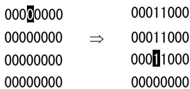

<details>
<summary>text_image</summary>

00000000
00000000
00000000
00000000
00000000
→
00011000
00011000
00011000
00000000
</details>

8 参数设定结束后，将设定画面的“写参数”重新设定为“0”。

## 5.2 输入/输出数据

CNC 中存储着下列数据。

请在控制装置正常工作时事先将这些数据输出到 I/O 设备。

(1) CNC 参数  
(2) PMC 参数  
(3) 螺距误差补偿值  
(4) 用户宏程序的变量值  
(5) 刀具补偿值  
(6) 零件程序（加工程序、用户宏程序）

## 5.2.1 确认数据输出所需的参数

※报警状态下不能输出数据，应予注意。

输出所需的参数如下所示。

标有☆号者表示使用 FANUC 公司制造的输入/输出设备情况下的标准设定。有关这些设定，请根据实际使用的设备进行设定。

（要改变参数，应在 MDI 方式或者急停状态下进行。）


### PMC报警: 
- **故障内容**: #7
- **处理办法**: #6

### PMC报警: 0000
- **故障内容**: 
- **处理办法**: 


ISO

0: 以 EIA 代码输出。

1: 以 ISO 代码输出。（FANUC 磁带的情形）

## 注释

1 存储卡的输入输出设定，通过参数 ISO(No.0139#0) 进行。  
2 USB 存储器的输入输出设定，通过参数 ISU(No.11505#0) 进行。

0020

## I/O CHANNEL 的选择

☆0:通道1（主板的JD56A）

1: 通道 1（主板的 JD56A）  
2: 通道 2（主板的 JD36A）

4: 存储卡接口

17: USB 存储器接口

※ 此操作例中，将 I/O 设备连接到 JD56A 上，进行数据的输入/输出。（I / O 通道=0）


### PMC报警: 
- **故障内容**: #7
- **处理办法**: #6

### PMC报警: 0101
- **故障内容**: NFD
- **处理办法**: 


NFD

0: 输出数据时，在数据前后输出馈送。  
1: 输出数据时，不在数据前后输出馈送。

ASI ☆ 0: 输入/输出时，使用 EIA 或者 ISO 代码。

1: 使用 ASCII 代码。  
0: 将停止位设为 1 位。

SB2

☆ 1: 将停止位设为 2 位。

0102

## 输入 / 输出设备的规格编号


0103

## 波特率（传输速度的设定）

1:50

7: 600

11: 9600

3: 110

8: 1200

12: 19200 [BPS]

4: 150

9: 2400

6: 300

☆10: 4800


### PMC报警: 
- **故障内容**: #7
- **处理办法**: #6

### PMC报警: 0139
- **故障内容**: 
- **处理办法**: 


ISO

0: 以 ASCII 代码输出。

1: 以 ISO 代码输出。（存储卡时）

## 警告

1 输入 ASCII 代码的数据以外的情况下，请将本参数设定为 “1” 进行基于 ISO 代码的输入输出。  
2 基于 ASCII 代码的数据的输入输出中，由于没有包含奇偶性信息，在输入输出中即使万一发生数据损坏也无法检测，十分危险。  
3 有关基于存储器卡的 DNC 运行，也请将本参数设定为“1”，在 ISO 代码下进行 DNC 运行。基于 ASCII 代码的数据的输入中，由于没有包含奇偶性信息，在程序加载中即使万一发生数据损坏也无法进行检测，十分危险。

## 注释

发那科公司提供在市面出售的电脑上将 ASCII 代码的文件转换为 ISO 代码的工具(FANUC ISO Converter)，请使用该工具。


### PMC报警: 
- **故障内容**: #7
- **处理办法**: #6

### PMC报警: 11505
- **故障内容**: 
- **处理办法**: 


ISU

0: 以 ASCII 代码输出。

1: 以 ISO 代码输出。（USB 存储器时）

## 警告

1 输入 ASCII 代码的数据以外的情况下，请将本参数设定为 “1” 进行基于 ISO 代码的输入输出。  
2 基于ASCII代码的数据的输入输出中，由于没有包含奇偶性信息，在输入输出中即使万一发生数据损坏也无法检测，十分危险。

## 注释

发那科公司提供在市面出售的电脑上将 ASCII 代码的文件转换为 ISO 代码的工具(FANUC ISO Converter)，请使用该工具。

## 5.2.2 输出CNC参数

1 选择 EDIT(编辑)方式或设定为紧急停止状态。  
2 按下功能键 [SYSTEM]，再按下软键 [参数] 选择参数画面。  
3 按下软键[(操作)]，再按下继续菜单键 ▷。  
4 按下软键 [输出]，再按下 [执行] 键，开始参数的输出。

## 5.2.3 输出螺距误差补偿值

1 选择 EDIT（编辑）方式。  
2 按功能键 ▶、和 ▶ 数次，按下 [螺补]，选择螺距误差补偿值的设定画面。  
3 按下软键[(操作)]，再按下功能菜单键 ▷。  
4 按下软键 [输出]，再按下 [执行] 键，开始螺距误差补偿值的输出。

## 5.2.4 输出用户宏程序变量的变量值

附加有用户宏程序功能时，输出变量号 500 号以后的值。

1 选择 EDIT（编辑）方式。  
2 按下功能键  
3 按下功能菜单键 ▷，按下软键 [宏程序]，选择用户宏程序变量画面。  
4 按下软键[(操作)]，再按下继续菜单键 ▷。  
5 按下软键 [输出]，再按下 [执行] 键，开始用户宏程序变量的变量值输出。

## 5.2.5 输出刀具补偿值

1 选择 EDIT（编辑）方式。  
2 按下功能键，再按下软键 [刀偏]，选择刀具补偿显示画面。  
3 再按下 [(操作)] 键，并按下继续菜单键 ▷。  
4 按下软键 [输出]，并按下 [执行] 键，开始刀具补偿值的输出。

## 5.2.6 输出零件程序

1 进行下一个参数的确认。如果设定了与☆标记不同的 “1”，则选择 MDI 方式，重新将其设定为 “0”。在改变参数设定时，本作业结束后应回复到原先的设定。


### PMC报警: 
- **故障内容**: #7
- **处理办法**: #6

### PMC报警: 3202
- **故障内容**: 
- **处理办法**: 


NE9 ☆ 0: 也可以编辑 9000\~9999 号程序。

1: 保护 9000\~9999 号程序。

(不再输出已被保护的程序。)

NE8 ☆ 0: 也可以编辑 8000\~8999 号程序。

1: 保护 8000\~8999 号程序。

(不再输出已被保护的程序。)

2 选择 EDIT（编辑）方式。  
3 按下 PROG 键，再按下软键 [程序]，显示程序内容。  
4 再按下 [(操作)] 键，按下软键 ▷。  
5 从 MDI 键输入想要输出的程序号。  
要输出所有程序时，输入 $^{P}0$ $^{+}-$ $^{D}9$ $^{D}9$ $^{D}9$ $^{D}9$ 。  
6 按下 [输出] 键，并按下 [执行] 键，开始程序的输出。

## 5.2.7 输入CNC参数

1 设定为急停状态。  
2 确认数据输入所需的参数正确。  
标有☆号者表示使用 FANUC 公司制造的输入/输出设备情况下的标准设定。有关这些设定，请根据实际使用的设备进行设定。  
① 按 键数次，再按下软键 [设定]，显示设定画面。  
② 确认 “写参数=1”。  
③ 按下 键和软键 [参数]，选择参数画面。

0020

## I/O CHANNEL 的选择

☆ 0: 通道 1（主板的 JD56A）

1: 通道 1（主板的 JD56A）  
2: 通道 2（主板的 JD36A）  
4: 存储卡接口  
17: USB 存储器接口


### PMC报警: 
- **故障内容**: #7
- **处理办法**: #6

### PMC报警: 0101
- **故障内容**: NFD
- **处理办法**: 


NFD

0: 输出数据时，在数据前后输出馈送。  
1: 输出数据时，不在数据前后输出馈送。  
0: 使用 EIA 或者 ISO 代码。  
1: 输入数据时，使用 ASCII 代码。  
0: 将停止位设为 1 位。

☆ 1: 将停止位设为 2 位。

0102

## 输入 / 输出设备的规格编号


0103

## 波特率（传输速度的设定）

1:50

7: 600

11: 9600

3: 110

8: 1200

12: 19200 [BPS]

4:150

9: 2400

6:300

☆10: 4800

3 按下继续菜单键 ▶。  
4 按下 [读入] 软键，再按下 [执行] 键，开始参数的输入。  
5 参数输入结束后，暂时断开电源，然后再通电。  
6 带有绝对脉冲编码器的装置会发出报警 DS0300，请再次执行返回参考点操作。


### PMC报警: 
- **故障内容**: #7
- **处理办法**: #6

### PMC报警: 0139
- **故障内容**: 
- **处理办法**: 


ISO

0: 以 ASCII 代码输入。

1: 以 ISO 代码输入。（存储卡时）

## 警告

1 输入 ASCII 代码的数据以外的情况下，请将本参数设定为 “1” 进行基于 ISO 代码的输入输出。  
2 基于 ASCII 代码的数据的输入输出中，由于没有包含奇偶性信息，在输入输出中即使万一发生数据损坏也无法检测，十分危险。  
3 有关基于存储器卡的 DNC 运行，也请将本参数设定为“1”，在 ISO 代码下进行 DNC 运行。基于 ASCII 代码的数据的输入中，由于没有包含奇偶性信息，在程序加载中即使万一发生数据损坏也无法进行检测，十分危险。

## 注释

发那科公司提供在市面出售的电脑上将 ASCII 代码的文件转换为 ISO 代码的工具(FANUC ISO Converter)，请使用该工具。


### PMC报警: 
- **故障内容**: #7
- **处理办法**: #6

### PMC报警: 11505
- **故障内容**: 
- **处理办法**: 


ISU

0: 以 ASCII 代码输入。

1: 以 ISO 代码输入。（USB 存储器时）

## 警告

1 输入 ASCII 代码的数据以外的情况下，请将本参数设定为 “1” 进行基于 ISO 代码的输入输出。  
2 基于ASCII代码的数据的输入输出中，由于没有包含奇偶性信息，在输入输出中即使万一发生数据损坏也无法检测，十分危险。

## 注释

发那科公司提供在市面出售的电脑上将 ASCII 代码的文件转换为 ISO 代码的工具(FANUC ISO Converter)，请使用该工具。

## 5.2.8 输入螺距误差补偿值

1 解除急停，选择 EDIT（编辑）方式。  
2 同上一项一样，确认设定画面的“写参数=1”。  
3 按下功能键 PROG，再按下软键 [程序]，选择程序内容显示画面。  
4 按功能键 数次，再按下软键 [参数]、[螺补]，选择螺距误差值的设定画面。  
5 按功能键 和 数次，按下 [螺补]，选择螺距误差值的设定画面。  
6 按下软键 [(操作)]，再按下 ▷ 键。  
7 按下 [读入] 软键，再按下 [执行] 键，开始螺距误差补偿值的输入。  
8 读取结束后，按下功能键 2 次，显示设定画面，将 “写参数” 重新设定为 “0”。

## 5.2.9 输入用户宏程序变量值

※附加有用户宏程序变量功能时，输入变量值。

1 选择 EDIT（编辑）方式。  
2 按下功能键 PROG，再按下软键 [程序]，选程序内容显示画面。  
3 按功能键 ▶ 和 ▶ 数次，按下 [螺补]，选择螺距误差值的设定画面。  
4 按下软键[(操作)]，再按下▶键。  
5 按下 [读入] 软键，再按下 [执行] 键，开始螺距误差补偿值的输入。

## 5.2.10 输入刀具补偿值

1 选择 EDIT（编辑）方式。  
2 将程序保护置于 OFF（KEY1=1）。  
3 按下功能键，再按下软键 [刀偏]，选择刀具补偿值显示画面。  
4 按下软键[(操作)]，再按下▶键。  
5 按下 [读入] 键，并按下 [执行] 键，开始数据输入。

## 5.2.11 输入零件程序

确认下述参数。如果与☆标记的设定不同，仅在进行本作业的期间重新设定。（改变设定时，在 MDI 方式下进行。）


### PMC报警: 
- **故障内容**: #7
- **处理办法**: #6

### PMC报警: 3201
- **故障内容**: 
- **处理办法**: NPE


NPE 记录到纸带存储编辑区时，将 M02、M30、M99

0: 视为程序的结尾。

☆ 1: 不视为程序的结尾。

RAL 记录程序时

☆ 0: 记录所有程序。

1: 1 只记录一个程序。


### PMC报警: 
- **故障内容**: #7
- **处理办法**: #6

### PMC报警: 3202
- **故障内容**: 
- **处理办法**: 


NE9 ☆ 0: 也可以编辑 9000\~9999 号程序。

1: 保护 9000\~9999 号程序。

NE8 ☆ 0: 也可以编辑 8000\~8999 号程序。

1: 保护 8000\~8999 号程序。

※ 若是 PPR，则不需要第 4 项。

1 确认已经处在 EDIT（编辑）方式。

2 将程序保护置于 OFF（KEY3=1）。

3 按下功能键 PROG，再按下软键 [程序]，选程序内容显示画面。

4 按下软键 [读入]，并按下 [执行]，开始数据输入。

## 5.3

## 自动数据备份

可以将 CNC 的 FROM/SRAM 中所保存的数据自动备份到不需要电池的 FROM 中，并根据需要加以恢复。在由于电池耗尽等不测事态而导致 CNC 的数据丢失时，可以简单恢复数据。

此外，通过参数设定，最多可以保存相当于 3 次量的备份数据。可以将 CNC 数据迅速切换到机床调整后的状态和任意的备份状态。

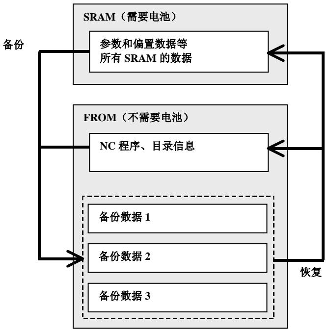

<details>
<summary>flowchart</summary>

```mermaid
graph TD
  A["SRAM（需要电池）"] --> B["参数和偏置数据等\n所有 SRAM 的数据"]
  C["FROM（不需要电池）"] --> D["NC 程序、目录信息"]
  E["备份数据 1"] --> F["备份数据 2"]
  G["备份数据 3"] --> H["备份数据 3"]
  I["备份"] --> A
  J["恢复"] --> C
```
</details>

## 解释

## - 备份的数据

将 CNC 的如下数据备份到不需要电池的 FROM 中。

- 保存在不需要电池的 FROM 中的 NC 程序、目录信息  
- 保存在需要电池的SRAM中的参数、偏置等各类数据

FROM 的 NC 程序和目录信息的备份，在将参数 AAP(No.10340 #2) 设定为 1 时有效。数据的大小和备份所需时间随程序容量而改变，请根据需要进行设定。

通过参数 No.10342 的设定，最多可以保存相当于 3 次量的备份数据。

## - 数据备份的方法

有如下 3 种备份数据的方法。

1. 接通电源时每次都自动备份数据  
2. 接通电源时每经过指定天数自动备份数据  
3. 在紧急停止时通过开始操作自动备份数据

## - 接通电源时每次都自动备份数据

接通电源时，可以自动备份该时刻的 CNC 的数据。

要将本功能设定为有效，需要进行如下设定。

- 将参数 ABP(No.10340#0)设定为 1  
- 在参数(No.10342)中设定 1 以上的值  
- 同时备份 FROM 的 NC 程序和目录信息时，将参数 AAP(No.10340#2)设定为 1

## - 接通电源时每经过指定天数自动备份数据

可以在经过从上次进行数据备份之日起所设定的天数后接通电源时，自动备份该时刻的 CNC 的数据。

要将本功能设定为有效，需要进行如下设定。

- 上述接通电源时每次自动备份数据处在有效的设定  
- 以天数在参数(No.10341)中设定周期地进行自动数据备份的间隔

## - 在紧急停止时通过开始操作自动备份数据

通过在紧急停止状态下进行数据备份操作，可以备份该时刻的 CNC 的数据。在加工的预先准备完成时和假日前等任意时机无须切断 CNC 的电源就可以进行数据备份。

要将本功能设定为有效，需要进行如下设定。

- 在参数(No.10342)中设定 1 以上的值  
- 同时备份 FROM 的 NC 程序和目录信息时，将参数 AAP(No.10340#2)设定为 1

## [数据备份步骤]

1. 设定为紧急停止状态。  
2. 将参数 EEB(No.10340#7) 设定为 1 时，系统开始数据备份。本参数在数据备份刚刚开始后成为 0。  
3. 数据备份执行状态，可以通过后述的诊断画面的 No.1016 进行确认。

## 注释

从开始数据备份到数据备份结束需要耗费时间，在数据备份中更新数据时，有时与备份后数据之间难于取得整合性。紧急停止中更新CNC的数据时，请根据自动数据备份执行中信号ATBK进行适当处理。

## - 数据备份的执行情况

接通电源时数据备份中，以 10 个“.”来显示执行状况。比如，数据备份完成时，显示为“AUTO BACKUP:......END”。此外，可以在诊断画面上确认如下状态。

- No.1016#0(AEX): 数据备份执行中  
• No.1016#6(ACM): 已经执行完数据备份  
• No.1016#7(ANG): 数据备份中发生错误  
• No.1016#1(DT1), #2(DT2), #3(DT3): 已更新的数据编号

## - 禁止覆盖的备份数据

可以将出厂时的状态和机床调整后的状态作为禁止覆盖的备份数据加以保存起来。参数(No.10342)的备份数据个数需要设定2个以上，其中的第1个数据为禁止盖写的备份数据。

要将本功能设定为有效，需要进行如下设定。

- 将参数 ABI(No.10340#1)设定为 1  
- 在参数(No.10342)中设定 2 以上的值  
- 同时备份 FROM 的 NC 程序和目录信息时，将参数 AAP(No.10340#2)设定为 1

## [数据备份步骤]

1. 将参数 EIB(No.10340#6) 设定为 1。  
2. 断开 CNC 的电源，而后再接通电源。接通电源时，自动更新第 1 个备份数据，参数 EIB(No.10340#6) 成为 0。

第 2, 第 3 个备份数据，根据其他的数据备份（接通电源时每次都自动备份数据、接通电源时每经过指定天数自动备份数据、通过紧急停止时的开始操作备份数据）而被更新。

## - 奇偶校验

进行数据备份时，务必进行奇偶校验。如果检测出错误，则不进行数据备份。

## - 备份数据的恢复

通过 BOOT SYSTEM 进行如下操作，即可恢复保存在 FROM 内的备份数据。

1. 选择 BOOT 的 TOP 菜单的 “7. SRAM DATA UTILITY” 时，显示如下菜单，选择 “3”。

SRAM DATA UTILITY  
```txt
1. SRAM BACKUP (CNC -> MEMORY CARD)
2. SRAM RESTORE (MEMORY CARD -> CNC)
3. AUTO BKUP RESTORE (FROM -> CNC)
4. END
```

2. 从如下菜单选择数据，执行数据恢复。

AUTO BACKUP DATA RESTORE  
```txt
1. BACKUP DATA1 yyyy/mm/dd **:**:**  
2. BACKUP DATA2 yyyy/mm/dd **:**:**  
3. BACKUP DATA3 yyyy/mm/dd **:**:**  
4. END
```

3. 退出 BOOT。

## 信号

## 自动数据备份执行中信号 ATBK<F0520.0>

[分类] 输出信号

[功能] 执行自动数据备份时成为“1”。紧急停止中更新CNC的数据时，请根据该信号进行适当处理。

信号地址


### PMC报警: 
- **故障内容**: #7
- **处理办法**: #6

### PMC报警: F0520
- **故障内容**: 
- **处理办法**: 


参数


### PMC报警: 
- **故障内容**: #7
- **处理办法**: #6

### PMC报警: 10340
- **故障内容**: EEB
- **处理办法**: EIB


[输入类型] 参数输入
[数据类型] 系统共同型

#0 ABP 将通电时的自动数据备份置于

0: 无效。

1: 有效。

#1 ABI 将禁止覆盖的备份数据置于

0: 无效。

1: 有效。

#2 AAP 将 FROM 的 NC 程序和目录信息的备份置于

0: 无效。

1: 有效。

#6 EIB 是否更新下次 CNC 的电源 ON 时禁止覆盖的备份数据

0: 不予更新。

1: 予以更新。

## 注释

本参数在参数 (No.10342) 被设定为 2 以上，参数 ABI(No.10340#1)=1 时有效。

#7 EEB 是否执行紧急停止时的备份

0: 不予执行。

1: 予以执行。

## 注释

本参数在参数(No.10342)被设定为1以上时有效。

## 10341

## 周期性地进行自动数据备份的间隔

[输入类型] 参数输入
[数据类型] 字系统共同型
[数据单位] 无单位
[数据范围] 0 \~ 365

在周期性地进行自动数据备份的情况下，以天数设定该间隔。在从上次进行备份之日起经过设定天数后通电时，进行数据备份。设定值为0时，该功能无效。

## 10342

## 备份数据的个数

## 注释

在设定完此参数后，需要暂时切断电源。

[输入类型] 参数输入  
[数据类型] 字节系统共同型  
[数据单位] 无单位  
[数据范围] $0 \sim 3$

此参数设定备份数据的个数。设定值为 0 时，不进行备份。

## 诊断画面

可以确认数据备份的执行状态。


### PMC报警: 
- **故障内容**: #7
- **处理办法**: #6

### PMC报警: 1016
- **故障内容**: ANG
- **处理办法**: ACM


#0 AEX 是否已经执行自动数据备份

0: 尚未执行。

1: 已经执行。

#1 DT1 在上次的数据备份中

0: 尚未更新数据 1。

1: 已经更新了数据 1。

#2 DT2 在上次的数据备份中

0: 尚未更新数据 2。

1: 已经更新了数据 2。

#3 DT3 在上次的数据备份中

0: 尚未更新数据 3。

1: 已经更新了数据 3。

#6 ACM 是否已经执行自动数据备份

0: 尚未执行。

1: 已经执行完毕。

#7 ANG 在自动数据备份中是否已经发生错误

0: 尚未发生。

1: 已经发生。

## 注意


## 注意

1 可以在参数(No.10342)(保存备份数据的次数)中设定的值,根据程序容量、SRAM 容量、所使用的 FROM/SRAM 模块而受到制约。  
2 数据备份中和数据恢复中请勿切断 NC 的电源。  
3 已经恢复备份数据的情况下，自动数据备份的参数成为数据备份时刻的设定，所以要根据需要变更设定。

## 5.4 批量数据保存/恢复

若选择 IPL 监控器菜单的 “12.BATCH DATA BACKUP/RESTORE”（批量数据保存/恢复），则可通过一次操作向输入输出设备（存储卡、或 USB 存储器）输出（保存）如下数据。此外，通过一次操作输出的数据，也可全部进行输入（恢复）。

- 在 CNC 主板上通过电池后备的 SRAM 数据  
- PMC 梯形程序和 C 语言执行器的应用等机床制造商创建的用户文件

有关 IPL 监控器的详情，请参阅本说明书的 “附录 I IPL 监控器”。

## 5.4.1 批量保存/恢复菜单的显示和输入输出接口

批量数据保存/恢复，通过 IPL 监控器上所显示的批量保存/恢复菜单来执行。

## 批量保存/恢复菜单的显示步骤

1. 显示 IPL 监控器。

同时按下 MDI 键[．]和[-]，接通电源。

有关步骤的详情，请参阅本说明书的“附录 I IPL 监控器”。

2. 通过 MDI 键或者电脑的键盘输入希望操作的菜单的编号。要进行批量保存/恢复操作，请输入"12"。

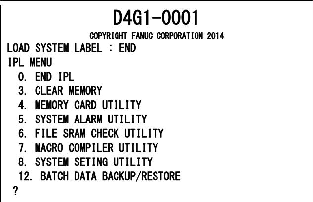

<details>
<summary>text_image</summary>

D4G1-0001
COPYRIGHT FANUC CORPORATION 2014
LOAD SYSTEM LABEL : END
IPL MENU
0. END IPL
3. CLEAR MEMORY
4. MEMORY CARD UTILITY
5. SYSTEM ALARM UTILITY
6. FILE SRAM CHECK UTILITY
7. MACRO COMPILER UTILITY
8. SYSTEM SETING UTILITY
12. BATCH DATA BACKUP/RESTORE
?
</details>

3. 若在 IPL 监控器上输入批量保存/恢复操作的菜单编号"12"，就会显示批量保存/恢复菜单。

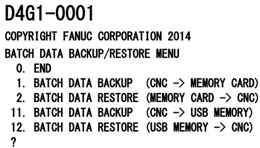

<details>
<summary>text_image</summary>

D4G1-0001
COPYRIGHT FANUC CORPORATION 2014
BATCH DATA BACKUP/RESTORE MENU
0. END
1. BATCH DATA BACKUP (CNC -> MEMORY CARD)
2. BATCH DATA RESTORE (MEMORY CARD -> CNC)
11. BATCH DATA BACKUP (CNC -> USB MEMORY)
12. BATCH DATA RESTORE (USB MEMORY -> CNC)
?
</details>

## 输入输出界面

电脑功能和其以外的功能中，数据的输入输出界面不同。

电脑功能以外的功能:

插入显示器旁的插槽中的输入输出设备（存储卡、USB 存储器）

电脑功能:

由 NCBOOT32 指定的电脑上的文件夹

在 IPL 监控器上，请通过弹出式菜单的 “Setting” 进行设定。没有设定时，输入输出文件夹将被成为 C 驱动的根文件夹（<C:\>）。

## 5.4.2 数据批量保存

可以将 SRAM 数据和用户文件保存在输入输出设备中。

保存操作，通过 IPL 监控器的批量保存/恢复菜单进行。


## 注意

1 批量保存功能下保存到输入输出设备中的信息，全都只在相同的硬件配置、相同的选项配置的 CNC 上具有兼容性。  
2 利用本功能输出的文件的文件名已被固定。输入输出设备内已经有相同名称的文件时，该文件将被盖写。使用本功能时，建议用户将输入/输出设备置于清零的状态。

## 批量保存操作说明

通过批量保存/恢复菜单的保存操作，将 SRAM 数据和用户文件保存到输入输出设备中。

有关将被保存的数据种类和文件名，请参阅本说明书的“5.4.4 保存文件例”。

## 操作步骤

1. 将输入输出设备（存储卡、USB 存储器）安装到 CNC 上。  
2. 在 IPL 监控器上选择批量保存/恢复菜单。  
3. 使用存储卡时，通过 MDI 键输入"1"，使用 USB 存储器，通过 MDI 键输入"11"。

```txt
D4G1-0001
COPYRIGHT FANUC CORPORATION 2014
BATCH DATA BACKUP/RESTORE MENU
0. END
1. BATCH DATA BACKUP (CNC -> MEMORY CARD)
2. BATCH DATA RESTORE (MEMORY CARD -> CNC)
11. BATCH DATA BACKUP (CNC -> USB MEMORY)
12. BATCH DATA RESTORE (USB MEMORY -> CNC)
?
```

4. 显示确认信息，执行批量保存时，通过 MDI 键输入 "1"。
输入 "0" 时，不会执行批量保存，再次显示批量保存/恢复菜单。

例. 确认信息（存储卡）

```txt
BATCH DATA BACKUP (CNC -> MEMORY CARD)
BATCH DATA BACKUP OK ? (NO=0, YES=1)
```

5. 批量保存中显示保存处理的进展状况。

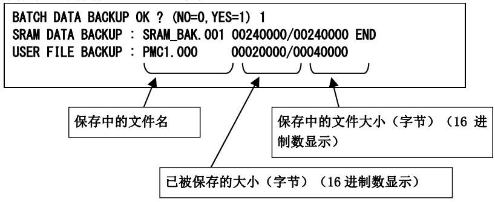

<details>
<summary>flowchart</summary>

```mermaid
graph TD
  A["BATCH DATA BACKUP OK ? (NO=0, YES=1) 1"] --> B["SRAM DATA BACKUP : SRAM_BAK.001 00240000/00240000 END"]
  B --> C["USER FILE BACKUP : PMC1.000 00020000/00040000"]
  C --> D["保存中的文件名"]
  C --> E["保存中的文件大小（字节）（16 进制数显示）"]
  D --> F["已被保存的大小（字节）（16 进制数显示）"]
```
</details>

6. 批量保存结束后，在文件大小旁显示信息"END"，再次显示批量保存/恢复菜单。通过 MDI 键输入"0"，结束批量保存/恢复菜单。

## 发生错误的情形

批量保存执行时发生错误时，画面上以红字显示信息，并再次显示批量保存/恢复菜单。有关错误的内容、对策，请参阅本说明书的“5.4.5 错误消息”。

## 限制

批量保存功能下保存到输入输出设备中的信息，全都只在相同的硬件配置、相同的选项配置的 CNC 上具有兼容性。  
2. 文件被保存在输入输出设备的根目录（最上层级）。无法将文件保存在子目录中。  
3. 向输入输出设备输出的文件名已被固定。有关文件名，请参阅本说明书的“5.4.4 保存文件例”。  
输入输出设备内已经有相同名称的文件时，该文件将被盖写。  
4. 建议用户在进行批量保存操作之前，对输入输出设备进行格式化。  
通过电脑进行格式化时，存储卡以FAT16格式进行格式化，USB存储器以FAT16/FAT32格式进行格式化。  
采用除此以外的格式进行格式化时将无法使用。  
5. SRAM 数据的保存时发生错误时，用户文件不会被保存起来。  
6. 选项信息文件 "OPRM\_INF.000" 在用户文件的保存时会被保存起来。  
7. 批量保存中无法中断保存处理。  
8. 请勿在批量保存中切断 CNC 的电源。若在批量保存中切断电源，保存将不会正常完成。

## 5.4.3 数据批量恢复

可以将数据批量保存中保存的 SRAM 数据和用户文件读入到 CNC 的 SRAM/FROM 模块中。

恢复操作，通过 IPL 监控器的批量保存/恢复菜单进行。


## 注意

1 批量保存功能下保存到输入输出设备中的信息，全都只在相同的硬件配置、相同的选项配置的 CNC 上具有兼容性。  
2 选项信息文件被恢复时，若启动 NC 则会成为认证等待状态，需要进行认证作作业。若处于与 CNC 的选项信息相同的状态时，选项信息文件不会被恢复。  
3 不仅是数据批量保存中保存的文件将被恢复，输入输出设备内的所有文件都将被恢复。请在输入输出设备中只存储要恢复的文件。

## 批量恢复操作说明

通过批量保存/恢复菜单的恢复操作，从输入输出设备恢复 SRAM 数据和用户文件。

## 恢复处理的顺序

数据批量保存功能下保存的各数据将按照如下顺序被恢复。

1. 选项信息文件  
2. SRAM 数据  
3. 用户文件（选项信息文件以外的文件）

## 恢复文件的文件名

将被恢复的 SRAM 数据的文件名，采用固定的文件名"SRAM\_BAK.001"。

将被恢复的选项信息文件、以及用户文件，不是基于输入输出设备上的文件名来决定，而是基于嵌入到文件中的文件名信息来决定的。

## 注释

请勿变更数据批量保存功能下保存的文件的文件名。

否则会恢复意想不到的选项信息文件、或者用户文件。

## 操作步骤

1. 将输入输出设备（存储卡、USB 存储器）安装到 CNC 上。  
2. 在 IPL 监控器上选择批量保存/恢复菜单。  
3. 使用存储卡时，通过 MDI 键输入"2"，使用 USB 存储器，通过 MDI 键输入"12"。

D4G1-0001  
```txt
COPYRIGHT FANUC CORPORATION 2014
BATCH DATA BACKUP/RESTORE MENU
```

0. END

```txt
1. BATCH DATA BACKUP (CNC -> MEMORY CARD)
2. BATCH DATA RESTORE (MEMORY CARD -> CNC)
11. BATCH DATA BACKUP (CNC -> USB MEMORY)
12. BATCH DATA RESTORE (USB MEMORY -> CNC)
```

4. 显示确认信息，执行批量恢复时，通过 MDI 键输入 "1"。

输入"0"时，不会执行批量恢复，再次显示批量保存/恢复菜单。

例. 确认信息（存储卡）

```txt
BATCH DATA RESTORE (MEMORY CARD -> CNC)
BATCH DATA RESTORE OK ? (NO=0, YES=1)
```

5. 批量恢复中显示恢复处理的进展状况。

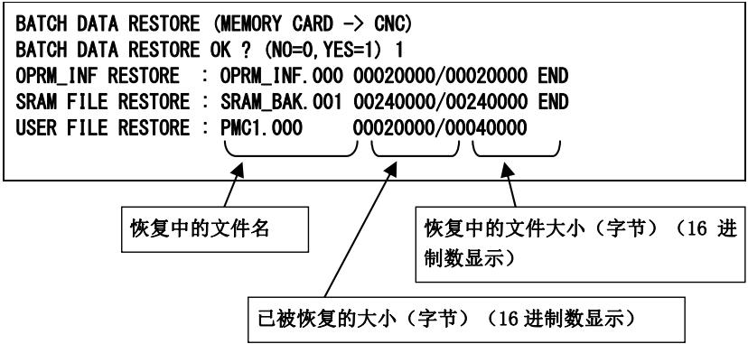

<details>
<summary>flowchart</summary>

```mermaid
graph TD
  A["BATCH DATA RESTORE (MEMORY CARD --> CNC)"] --> B["OK ? (NO=0, YES=1) 1"]
  B --> C["OPRM_INF RESTORE : OPRM_INF.000 00020000/00020000 END"]
  C --> D["SRAM FILE RESTORE : SRAM_BAK.001 00240000/00240000 END"]
  D --> E["USER FILE RESTORE : PMC1.000 00020000/00040000"]
  E --> F["恢复中的文件名"]
  E --> G["恢复中的文件大小（字节）（16 进制数显示）"]
  F --> H["已被恢复的大小（字节）（16 进制数显示）"]
```
</details>

6. 批量恢复结束后，画面上显示信息"POWER MUST BE OFF."（必须关电）。请在切断电源后，重新接通电源。显示此信息时，无法受理基于 MDI 键的输入等操作。

D4G1-0001  
```txt
COPYRIGHT FANUC CORPORATION 2014
BATCH DATA RESTORE (MEMORY CARD -> CNC)
BATCH DATA RESTORE OK ? (NO=0, YES=1) 1
OPRM_INF RESTORE : OPRM_INF.000 00020000/00020000 END
SRAM FILE RESTORE : SRAM_BAK.001 00240000/00240000 END
USER FILE RESTORE : PMC1.000 00040000/00040000 END
POWER MUST BE OFF.
```

7. 选项信息文件被恢复时，若再启动 NC 则会成为认证等待状态，需要进行选项参数的认证作业。

## 发生错误的情形

批量恢复执行时发生错误时，画面上会以红字显示错误信息。

有关错误的内容、对策，请参阅本说明书的“5.4.5 错误消息”。

## 限制

批量保存功能下保存到输入输出设备中的信息，全都只在相同的硬件配置、相同的选项配置的 CNC 上具有兼容性。

2 选项信息文件被恢复时，若启动 NC 则会成为认证等待状态，需要进行认证作作业。

若处于与 CNC 的选项信息相同的状态时，选项信息文件不会被恢复。此时，显示如下消息。

```txt
OPRM_INF RESTORE : LOADING SKIP. NO NECESSITY FOR LOADING.
```

3. 输入输出设备的根目录（最上层级）内的所有文件都会被恢复。请在根目录（最上层级）中只存储要恢复的文件。无法恢复子目录内的文件。  
4. 输入输出设备内没有选项信息文件时，画面上会显示错误信息"FILE NOT FOUND"(没有找到文件)。这种情况下，选项信息文件以外的文件也会被恢复。  
5. 输入输出设备内没有 SRAM 文件时，画面上会显示错误信息"FILE NOT FOUND"。这种情况下，SRAM 文件以外的文件也会被恢复。

选项信息文件、SRAM 文件都不存在时，按如下所示方式显示。

```txt
OPRM_INF RESTORE : FILE NOT FOUND
SRAM FILE RESTORE : SRAM_BAK.001 FILE NOT FOUND
```

6. 批量恢复中无法中断恢复处理。  
7. 请勿在批量恢复中切断 CNC 的电源。若在批量恢复中切断电源，恢复中的数据将不会被正常恢复。

## 5.4.4 保存文件例

下面所示为在本功能下输出的文件例。

SRAM 数据和被加载到 FROM 中的所有用户文件都会被保存起来。

表 5.4.4.(a) 文件一览


### PMC报警: 文件内容
- **故障内容**: 文件名
- **处理办法**: 备注

### PMC报警: CNC 存储器(SRAM 文件)
- **故障内容**: SRAM_BAK.001
- **处理办法**: SRAM 数据

### PMC报警: 选项信息文件
- **故障内容**: OPRM_INF.000
- **处理办法**: 

### PMC报警: PMC 顺序程序
- **故障内容**: PMCn.000
- **处理办法**: n: 路径号

### PMC报警: PMC 顺序程序(双检安全)
- **故障内容**: PMCS.000
- **处理办法**: 

### PMC报警: PMC 各国语言数据
- **故障内容**: MnPMCMSG.000
- **处理办法**: n: 路径号

### PMC报警: 应用数据(C 语言执行器)
- **故障内容**: CEX_nnM.000
- **处理办法**: nn: 05, 10, 15, 20, 25, 30, 35, 40, 50, 60, 70, 80, 90, A0 的任何一个

### PMC报警: 用户数据文件(C 语言执行器)
- **故障内容**: CEXnxxxx.000
- **处理办法**: n: 1 个字符的数字x: 1 个字符的任意英文数字

### PMC报警: 应用数据(宏执行器)
- **故障内容**: PDnnxxxx.000
- **处理办法**: n: PCODE 号xxxx: 数据大小

### PMC报警: 应用数据(FANUC PICTURE)
- **故障内容**: FPF_xxx.000
- **处理办法**: xxx: 数据大小

### PMC报警: 画面数据(FANUC PICTURE)
- **故障内容**: FPF0xx.000
- **处理办法**: xx: 数据大小

### PMC报警: 机械操作菜单数据
- **故障内容**: EXSFTKEY.000
- **处理办法**: 

### PMC报警: I/O 配置数据
- **故障内容**: IOCONF.000
- **处理办法**: 

### PMC报警: 机械报警诊断数据
- **故障内容**: TDG-DATA.000
- **处理办法**: 

### PMC报警: 备份数据(自动数据备份)
- **故障内容**: ATn_BKUP.000
- **处理办法**: n: 1, 2, 3


## 注释

1 向输入输出设备输出的文件名已被固定。  
2 输入输出设备内已经有相同名称的文件时，该文件将被盖写。  
3 被输出的用户文件根据选项配置而不同。

## 5.4.5 错误消息

批量保存/恢复执行时发生错误时，显示如下信息。

表 5.4.5.(a) 信息一览


## 6 CNC 和 PMC 之间的接口

本章就 PMC 功能的概要以及 CNC 与 PMC 之间的接口进行描述。

6.1 什么是PMC 328  
6.2 PMC画面的操作 329  
6.3 CNC-PMC间接口信号 332

## 6.1 什么是PMC

所谓 PMC（Programmable Machine Controller），就是利用内置在 CNC 的 PC（Programmable Controller）执行机床的顺序控制（主轴旋转、换刀、机床操作面板的控制等）的可编程机床控制器。

所谓顺序控制，就是按照事先确定的顺序或逻辑，对控制的每一个阶段依次进行的控制。

用来对机床进行顺序控制的程序叫做顺序程序，通常广泛应用于基于梯形语言（Ladder language）的顺序程序。

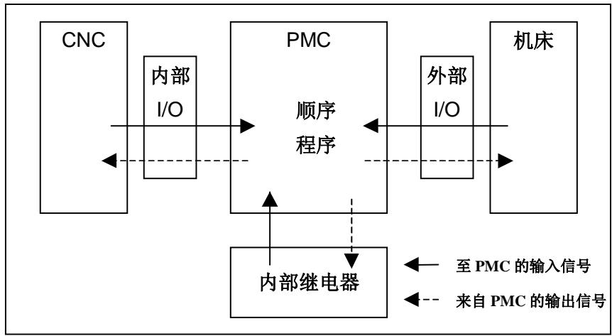

<details>
<summary>flowchart</summary>

```mermaid
graph TD
  A["CNC"] --> B["内部 I/O"]
  B --> C["PMC 顺序程序"]
  C --> D["外部 I/O"]
  D --> E["机床"]
  F["内部继电器"] --> C
    style F stroke-dasharray: 5 5
    note1["← 至 PMC 的输入信号"] -.-> C
    note2["←-- 来自 PMC 的输出信号"] -.-> C
```
</details>

图6.1 PMC 的基本配置

## 6.2 PMC画面的操作

下面说明 PMC 画面的基本配置。

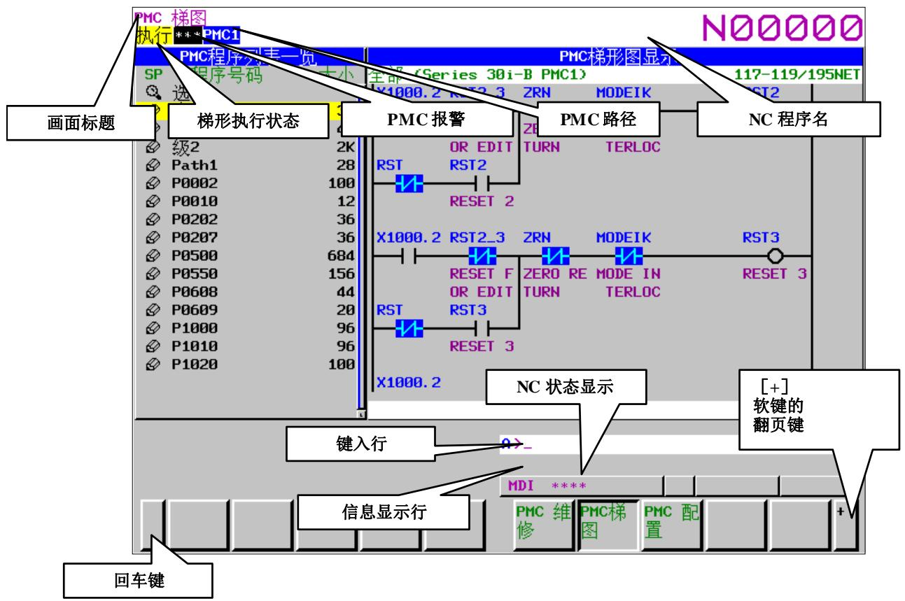

<details>
<summary>flowchart</summary>

```mermaid
graph TD
  A["PMC 梯图"] --> B["执行 * * * PMC1"]
  B --> C["PMC程序列表一览"]
  C --> D["SP 程序号码 小步 (Series 30i-B PMC1)"]
  D --> E["选"]
  E --> F["NC梯形图显示"]
  F --> G["117-119/195NET"]
  F --> H["ST2"]
  F --> I["NC 程序名"]
    
  J["画面标题"] --> K["梯形执行状态"]
  K --> L["级2 2K Path1 28 P0002 100 P0010 12 P0202 36 P0207 36 P0500 684 P0550 156 P0608 44 P0609 20 P1000 96 P1010 96 P1020 100"]
  L --> M["PMC 报警"]
  M --> N["RST OR EDIT RST2"]
  N --> O["RESET 2"]
  O --> P["X1000.2 RST2_3 ZRN MODEIK"]
  P --> Q["RESET F ZERO RE MODE IN"]
  Q --> R["OR EDIT TURN TERLOC"]
  R --> S["RST RST3"]
  S --> T["RESET 3"]
  T --> U["X1000.2 NC 状态显示"]
    
  V["键入行"] --> W["->"]
  X["信息显示行"] --> Y["MDI ****"]
    
  Z["回车键"] --> AA["+"]
    
  AB["[+"] 软键的翻页键] --> AC["+"]
```
</details>

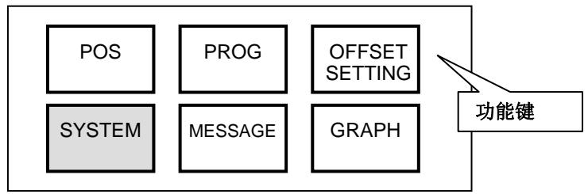

<details>
<summary>flowchart</summary>

```mermaid
graph TD
  A["POS"] --> B["OFFSET SETTING"]
  C["PROG"] --> B
  D["SYSTEM"] --> E["MESSAGE"]
  F["GRAPH"] --> G["OUTPUT"]
  H["功能键"] --> I["OUTPUT"]
```
</details>

- 画面标题：显示PMC的各辅助菜单名。  
- 梯形执行状态：显示梯形的执行状态。  
- PMC 报警：显示 PMC 报警的发生情况。  
- PMC 路径：显示当前所选的 PMC 路径。  
- NC 程序名：显示当前所选的 NC 程序名。  
- 键入行：这是用于数值和字符串输入的键入行。  
- 信息显示行：显示错误信息和警告信息。  
- NC 状态显示：显示 NC 方式、NC 程序的执行情况、当前的 NC 路径号。  
- 回车键：在从 PMC 的操作菜单切换到 PMC 的各辅助菜单，从 PMC 的各辅助菜单切换到 PMC 主菜单时操作回车键。  
- 软键的翻页键：用于切换软键的页面。

## 有关 PMC 画面

在 NC 系统中，按下<SYSTEM>功能键并用 [+] 软键翻动软键的页面时，出现 PMC 主菜单。

PMC 主菜单根据用途，分为下列 3 种辅助菜单。

- PMC 维护  
- PMC 梯图  
- PMC 配置

下面就每个 PMC 辅助菜单的用途进行说明。

(1) PMC 维护菜单  
该菜单显示 PMC 信号状态的监控、追踪、PMC 数据的显示/编辑等与 PMC 的维护相关的画面。

(2) PMC 梯图菜单

该菜单显示与梯形的显示/编辑相关的画面。

(3) PMC 配置菜单

该菜单显示构成顺序程序的梯形以外的数据的显示/编辑、PMC 功能的设定画面。

本说明书中就 PMC 维护菜单和 PMC 梯形显示/编辑的各画面的概要进行说明。有关详细说明和 PMC 配置菜单的说明，请参阅 “PMC Programming Manual(B-64513EN)（PMC 编程说明书）。

## 6.2.1 各PMC画面的变化图

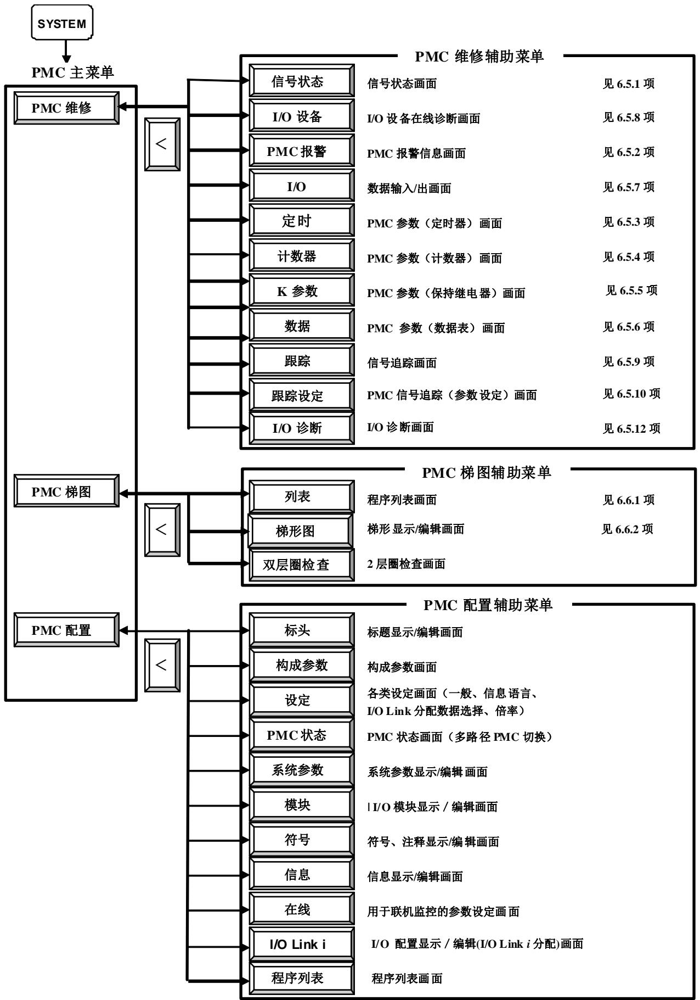

<details>
<summary>flowchart</summary>

```mermaid
graph TD
  A["SYSTEM"] --> B["PMC 主菜单"]
  B --> C["PMC 维修"]
  C --> D["信号状态"]
  D --> E["信号状态画面"]
  E --> F["见 6.5.1 项"]
  C --> G["I/O 设备"]
  G --> H["I/O 设备在线诊断画面"]
  H --> I["见 6.5.8 项"]
  C --> J["PMC 报警"]
  J --> K["PMC 报警信息画面"]
  K --> L["见 6.5.2 项"]
  C --> M["I/O"]
  M --> N["数据输入/出画面"]
  N --> O["见 6.5.7 项"]
  C --> P["定时"]
  P --> Q["PMC 参数（定时器）画面"]
  Q --> R["见 6.5.3 项"]
  C --> S["计数器"]
  S --> T["PMC 参数（计数器）画面"]
  T --> U["见 6.5.4 项"]
  C --> V["K 参数"]
  V --> W["PMC 参数（保持继电器）画面"]
  W --> X["见 6.5.5 项"]
  C --> Y["数据"]
  Y --> Z["PMC 参数（数据表）画面"]
  Z --> AA["见 6.5.6 项"]
  C --> AB["跟踪"]
  AB --> AC["信号追踪画面"]
  AC --> AD["见 6.5.9 项"]
  C --> AE["跟踪设定"]
  AE --> AF["PMC 信号追踪（参数设定）画面"]
  AF --> AG["见 6.5.10 项"]
  C --> AH["I/O 诊断"]
  AH --> AI["I/O 诊断画面"]
  AI --> AJ["见 6.5.12 项"]
    
  B --> AK["PMC 梯图"]
  AK --> AL["列表"]
  AL --> AM["程序列表画面"]
  AM --> AN["见 6.6.1 项"]
  AL --> AO["梯形图"]
  AO --> AP["梯形显示/编辑画面"]
  AP --> AQ["见 6.6.2 项"]
  AL --> AR["双层圈检查"]
  AR --> AS["2 层圈检查画面"]
    
  B --> AT["PMC 配置"]
  AT --> AU["标头"]
  AU --> AV["标题显示/编辑画面"]
  AV --> AW["构成参数画面"]
  AW --> AX["构成参数画面"]
  AT --> AY["设定"]
  AY --> AZ["各类设定画面（一般、信息语言、I/O Link 分配数据选择、倍率）"]
  AT --> BA["PMC 状态"]
  BA --> BB["PMC 状态画面（多路径 PMC 切换）"]
  BA --> BC["系统参数"]
  BC --> BD["系统参数显示/编辑画面"]
  AT --> BE["模块"]
  BE --> BF["I/O 模块显示 / 编辑画面"]
  AT --> BG["符号"]
  BG --> BH["符号、注释显示/编辑画面"]
  AT --> BI["信息"]
  BI --> BJ["信息显示/编辑画面"]
  AT --> BK["在线"]
  BK --> BL["用于联机监控的参数设定画面"]
  AT --> BM["I/O Link i"]
  BM --> BN["I/O 配置显示 / 编辑(I/O Link i 分配)画面"]
  AT --> BO["程序列表"]
  BO --> BP["程序列表画面"]
```
</details>

## 6.3 CNC-PMC间接口信号

CNC 和 PMC 间的接口信号的地址关系如下所示。

【以一个 PMC 控制一个路经的例子】  
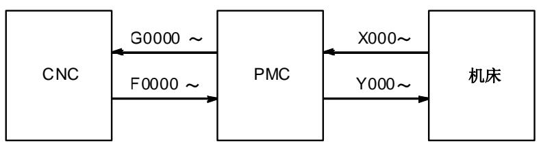

<details>
<summary>flowchart</summary>

```mermaid
graph LR
  A["CNC"] -->|G0000 ~ F0000 ~| B["PMC"]
  B -->|X000~ Y000~| C["机床"]
```
</details>

【以一个 PMC 控制两个路经的例子】  
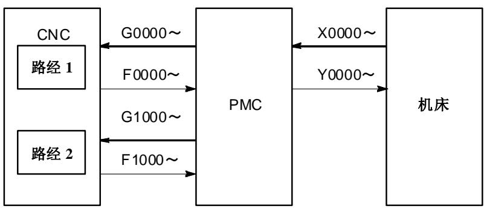

<details>
<summary>flowchart</summary>

```mermaid
graph LR
  A["CNC 路经 1"] -->|G0000~| B["PMC"]
  C["路径 2"] -->|F1000~| B
  B -->|X0000~| D["机床"]
  B -->|Y0000~| D
  B -->|G1000~| A
```
</details>

【以多路径 PMC 系统控制多路径 CNC 的例子】  
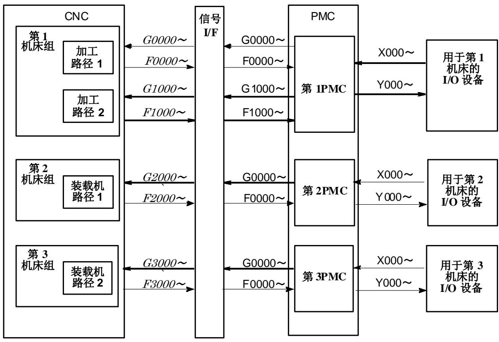

<details>
<summary>flowchart</summary>

```mermaid
graph LR
    subgraph CNC
  A["第1机床组"] -->|G0000~F0000~| B["信号 I/F"]
  C["加工路径1"] -->|G1000~F1000~| B
  D["加工路径2"] -->|G1000~F1000~| B
    end

    subgraph I_F["信号 I/F"]
  E["第1PMC"] -->|X000~Y000~| F["用于第1机床的I/O设备"]
    end

    subgraph PMC
  G["第2PMC"] -->|X000~Y000~| H["用于第2机床的I/O设备"]
    end

    subgraph I_F_2["信号 I/F"]
  I["第3PMC"] -->|X000~Y000~| J["用于第3机床的I/O设备"]
    end

  A -->|G0000~F0000~| B
  C -->|G1000~F1000~| B
  D -->|G1000~F1000~| B
  E -->|G2000~F2000~| B
  G -->|G3000~F3000~| B
  I -->|G0000~F0000~| B
  I -->|G1000~F1000~| B
  I -->|G2000~F2000~| B
  I -->|G3000~F3000~| B
```
</details>

## 注释

多路径 PMC 系统中，每个 PMC 都具有独立的信号区。从 0 号起分配各自的 PMC 的 F,G,X,Y 信号地址。与此相对，从 CNC 看的 F、G 信号地址则为按照路径号顺序被固定起来的地址。各梯形图中编程的 F、G 信号地址，与 CNC 看的 F,G 信号地址编号不同，请予注意。

## 7 嵌入式以太网功能

## 本章就嵌入式以太网功能进行描述

7.1 内置以太网端口和PCMCIA以太网卡 334  
7.2 设定嵌入式以太网功能....335  
7.3 变更嵌入式以太网的设备....384  
7.4 嵌入式以太网的操作....385  
7.5 嵌入式以太网的再启动 388  
7.6 嵌入式以太网的维护画面....389  
7.7 嵌入式以太网的记录画面....392

## 7.1 内置以太网端口和PCMCIA以太网卡

嵌入式以太网功能下，通过选择内置以太网端口和 PCMCIA 以太网卡的 2 个连接部位的其中之一即可进行使用。此外，还可以选择使内嵌以太网功能停止。

将 PCMCIA 以太网卡插入到存储卡插槽中，即可进行临时通信。

## 注意

1 首次使用内置以太网功能时，请向贵公司的网络管理员咨询，注意 IP 地址等的设定，并进行充分的通信测试。如果弄错 IP 地址等的设定，将有可能使通信故障等的影响波及到整个网络。在发生了通信故障的状态下使用时，将会间隙发生 FOCAS2/Ethernet 功能和 FTP 传输功能的通信故障，有时还会导致 CNC 系统出错，所以要予以充分注意。  
2 即便是非 CNC 的通信对方的电脑等装置处在相同的网络上，也会增大 CNC 的通信处理负载。  
应避免连接到整个工厂的网络上，请使用路由器等装置，将连接CNC的网络和连接除此之外的网络分离开来。  
3 由于需要将PCMCIA以太网卡插入到存储卡插槽中使用，因此，在使用时，卡主体部分处在鼓出的状态。在使用PCMCIA以太网卡时，一定要注意勿使物体碰撞卡或损坏卡。  
此外，使用完以后要尽快拔出，以免网卡被损坏。

## 注释

1 PCMCIA 以太网卡请使用发那科公司的指定产品。不能使用市面上出售的产品。  
2 PCMCIA 以太网卡使用于 FANUC LADDER-Ⅲ和 SERVO GUIDE（伺服向导）。  
3 PCMCIA 以太网卡，如上项所述用于临时通信，不要将其用在常规的通信中。

相关的 NC 参数


### PMC报警: 
- **故障内容**: #7
- **处理办法**: #6

### PMC报警: 14880
- **故障内容**: 
- **处理办法**: 


[输入类型] 参数输入

[数据类型] 位型

#0 ETH 是否使用嵌入式以太网功能（内置以太网端口/PCMCIA 以太网卡）

0: 使用。

1: 不使用。

注释

在设定完此参数后，需要暂时切断电源。

## 7.2 设定嵌入式以太网功能

下面就嵌入式以太网功能的每个参数设定进行说明。

## 7.2.1 FOCAS2/Ethernet功能的设定

下面就嵌入式以太网功能中，用来使 FOCAS2/Ethernet 功能动作的所需设定进行说明。

## 首次使用 FOCAS2/Ethernet 功能时的注意事项

## 注释

1 使用 FOCAS2/Ethernet 功能，由客户独自创建的应用软件，应使用内置以太网端口。  
2 FOCAS2/Ethernet 功能最多准许 5 台 FOCAS2/Ethernet 客户机连接到每台 CNC 上。  
3 如果从多个应用软件或者多台电脑同时执行存取操作，CNC 一侧的通信负荷将会加大，这样就会导致通信速度减慢。  
4 FOCAS2/Ethernet 功能下，可由机床制造商或终端用户利用 FOCAS2 程序库软件来自由创建电脑侧软件。因此，有时会依赖于电脑侧的环境而通信的时机等会发生变化。通信时，包括电脑一侧的通信在内，应在充分确认作为整个系统没有问题后使用。

## 首次使用 CNC 画面显示功能时的注意事项

## 注释

CNC 画面显示功能最多允许 1 台 CNC 画面显示功能客户机连接到每台 CNC 上。

## 7.2.1.1 FOCAS2/Ethernet设定画面的操作

在以太网参数设定画面上，设定用来操作 FOCAS2/Ethernet 功能的参数。

## 步骤

1 按下功能键


2 软键上显示出 [内藏口] 和 [PCMCIA 卡] （没有软键时请按下继续菜单键）。

3 按下软键 [内藏口]，再按下用于内置以太网端口的 [PCMCIA 卡]，出现用于 PCMCIA 以太网卡的 “以太网设定画面”。

4 按下软键 [公共] 和 [FOCAS2]，在各自显示的设定项目中输入参数。

## 注释

1 内置以太网端口和PCMCIA以太网卡的参数均为独立的参数。  
2 用于 PCMCIA 以太网卡的 FOCAS2/Ethernet 功能的设定，在连接伺服向导和 FANUC LADDER-Ⅲ的情况下进行设定。

## 共同画面（基本）

按下软键 [公共] 时，出现共同画面（基本）。


<details>
<summary>text_image</summary>

共同:设定[内置]
基本
1/2
MAC 地址
080019000001
IP 地址
192.168.0.100
子网掩码
255.255.255.0
路由器地址
192.168.0.253
DHCP CLIENT
0
设备有效	内置板
A>__
MEM STOP *** ***
12:00:00 PATH1
公共	FOCAS2	FTP
传送		(操作) +
</details>

共同画面（基本）

设定项目


显示项目


## FOCAS2 画面

按下软键 [FOCAS2]，出现 FOCAS2 画面。


<details>
<summary>text_image</summary>

FOCAS2/ETHERNET: SET [EMBEDDED]
基本
口编号（TCP）	8193
口编号（UDP）	0
时间间隔	0
设备有效	内置板
A >_
MEM STOP *** ***
12:00:00 PATH1
公共	FOCAS2	FTP
传送	(操作) +
</details>

FOCAS2 画面

设定项目


## PCMCIA 以太网卡的初始设定

为便于伺服向导和 FANUC LADDER-III 之间的连接，PCMCIA 以太网卡在出厂时，已经设定了如下标准设定值。

IP 地址 : 192.168.1.1

子网掩码 : 255.255.255.0

路由器地址 : 无

口编号（TCP）:8193

口编号（UDP）:0

时间间隔 : 0

一旦设定完以后，如果在 IP 地址中设定空白（空格），则会返回到标准设定值。

内置以太网端口没有标准设定值。

## 7.2.1.2 FOCAS2/Ethernet功能的设定例

下面示出为使 FOCAS2/Ethernet 功能操作的设定例。

通过此设定，1 台电脑通过 FOCAS2 / Ethernet 与 2 台 CNC 连接。

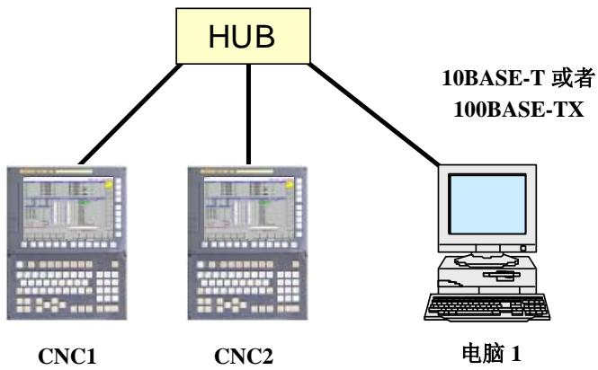

<details>
<summary>flowchart</summary>

```mermaid
graph TD
  A["HUB"] --> B["CNC1"]
  A --> C["CNC2"]
  A --> D["电脑 1"]
  A --> E["10BASE-T 或者 100BASE-TX"]
```
</details>


### PMC报警: 
- **故障内容**: CNC1
- **处理办法**: CNC2

### PMC报警: IP 地址
- **故障内容**: 192.168.0.100
- **处理办法**: 192.168.0.101

### PMC报警: 子网掩码
- **故障内容**: 255.255.255.0
- **处理办法**: 255.255.255.0

### PMC报警: 路由器地址
- **故障内容**: 无
- **处理办法**: 无

### PMC报警: 口编号(TCP)
- **故障内容**: 8193
- **处理办法**: 8193

### PMC报警: 口编号(UDP)
- **故障内容**: 0
- **处理办法**: 0

### PMC报警: 时间间隔
- **故障内容**: 0
- **处理办法**: 0


在“以太网参数画面”上设定。


### PMC报警: CNC1
- **故障内容**: NC IP 地址
- **处理办法**: 192.168.0.100

### PMC报警: CNC2
- **故障内容**: NC IP 地址
- **处理办法**: 192.168.0.101


在电脑(Windows2000/XP/Vista)的“Microsoft TCP/IP的属性”中设定。

在数据窗口程序库函数“cnc\_allclibhndl3的自变量”中指定。

## 7.2.2 FTP文件传送功能的设定

下面就嵌入式以太网功能中，用来使 FTP 文件传送功能动作的所需设定进行说明。

## 首次使用 FTP 文件传输功能时的注意事项

## 注释

1 在使用 FTP 文件传输功能时，应使用内置以太网端口。  
2 在 FTP 文件传输功能中，每台 CNC 可以连接的 FTP 通信数为 1。  
3 在利用 FTP 文件传输功能与主机通信时，根据电脑一侧的环境有可能影响到通信动作，在进行通信时，包括电脑一侧的通信在内，应在充分确认作为整个系统没有问题后使用。  
4 为了使得主机作为 FTP 服务器动作，必须在主机中使 FTP 服务器的软件运行。  
5 主机文件列表显示中记录在主机中的文件数较多时，主机文件列表显示速度会变慢。这种情况下，请采取对策，如区分记录文件的文件夹等。

## 7.2.2.1 FTP文件传输设定画面的操作

在以太网设定画面上，设定用来操作 FTP 文件传输功能的参数。

## 步骤

1 按下功能键 SYSTEM。

2 软键上显示出 [内藏口] （没有软键时请按下继续菜单键）。  
3 按下软键 [内藏口]，出现用于内置以太网端口的“以太网设定画面”。  
4 按下软键 [公共] 和 [FTP 传送]，在各自显示的设定项目中输入参数。

## 注释

内置以太网端口和PCMCIA以太网卡的参数均为独立的参数。

按下软键 [PCMCIA 卡]，即可进行用于 PCMCIA 以太网卡的设定，但是这是用于维护的设定，通常情况下不必设定。

## 共同画面（基本）

按下软键 [公共] 时，出现共同画面（基本）。


<details>
<summary>text_image</summary>

共同:设定[内置]
基本
1/2
MAC 地址
080019000001
IP 地址
192.168.0.100
子网掩码
255.255.255.0
路由器地址
192.168.0.253
DHCP CLIENT
0
设备有效
内置板
A>__
MEM STOP *** ***
12:00:00 PATH1
公共 FOCAS2 FTP
传送 (操作) +
(操作)
</details>

共同画面（基本）

设定项目


显示项目


## FTP 传输画面（连接 1、连接 2、连接 3）

按下软键 [FTP 传送]，出现 FTP 传输画面。

通过翻页键 PAGE PAGE 可进行连接 1、2、3 共 3 台主机的设定。

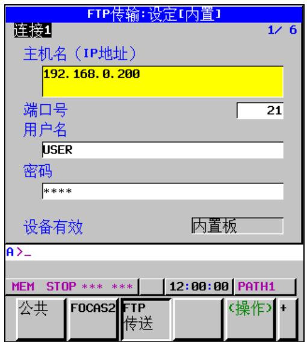

<details>
<summary>text_image</summary>

FTP传输:设定[内置]
连接1
1/ 6
主机名（IP地址）
192.168.0.200
端口号
21
用户名
USER
密码
****
设备有效
内置板
A >_
MEM STOP *** ***
12:00:00 PATH1
公共 FOCAS2 FTP
传送 （操作）+
</details>

FTP 传输画面（第 1 页）

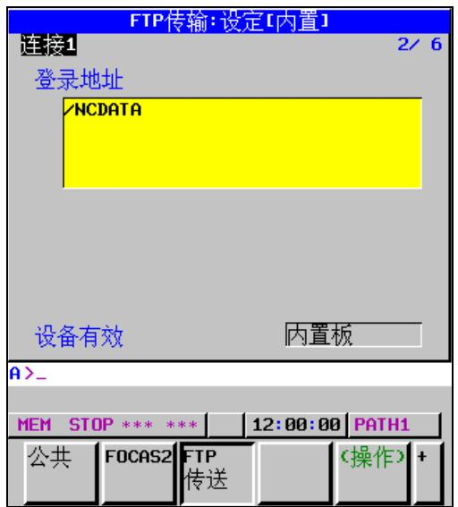

<details>
<summary>text_image</summary>

FTP传输:设定[内置]
连接1
2/6
登录地址
NCDATA
设备有效	内置板
A>__
MEM STOP *** ***
12:00:00 PATH1
公共	FOCAS2	FTP
传送	(操作) +
</details>

FTP 传输画面（第 2 页）

设定项目


## 操作

选择连接。

1 按下软键[(操作)]时，显示[选择主机]。按下此键，显示软键[连接1]、[连接2]、[连接3]。


<details>
<summary>text_image</summary>

选择主机
再起动
内嵌/PCM CIA
输入
</details>


<details>
<summary>text_image</summary>

连接1 连接2 连接3
</details>

2 根据希望连接的主机，按下软键 [连接 1]、[连接 2]、或 [连接 3]，画面标头的连接 1、2、3 将反相显示。画面标头已被反相显示的连接就是主机的连接目标。

连接1 → 连接1

选择了连接1的情形

## 7.2.2.2 相关的NC参数

与 FTP 文件传送功能相关的 NC 参数如下所示。


[输入类型] 设定输入

[数据类型] 字节型

[数据范围] 9：作为输入 / 输出设备选择嵌入式以太网。


### PMC报警: 
- **故障内容**: #7
- **处理办法**: #6

### PMC报警: 14880
- **故障内容**: 
- **处理办法**: 


[输入类型] 参数输入

[数据类型] 位型

#1 PCH 开始 FTP 文件传输功能的通信时，是否进行基于 PING 的 FTP 服务器的存在确认

0: 进行确认。

1: 不进行确认。

## 注释

通常情况下将参数设定为进行确认(0)。

不进行基于PING的FTP服务器存在确认(1)时，FTP服务器如果不存在于网络，就会有错误显示，在某些情况下，到识别出错误之前需要数十秒钟。

主要是由于完全方面的问题，有时将电脑一侧设定为对 PING 指令不予应答。如果与这样的电脑进行 FTP 文件传输，请将参数设定为不进行确认(1)。


### PMC报警: 
- **故障内容**: #7
- **处理办法**: #6

### PMC报警: 14883
- **故障内容**: PSV
- **处理办法**: 


[输入类型] 参数输入

[数据类型] 位型

#7 PSV FTP 文件传输功能的 FTP 客户机

0: 在有源方式下动作。

1: 在无源方式下动作。

## 7.2.2.3 FTP文件传输功能的设定例

下面示出为使 FTP 文件传输功能操作的设定例（电脑的 OS 使用 WindowsXP Professional）。

通过此设定，1 台电脑通过 FTP 文件传输功能与 2 台 CNC 连接。

- 在电脑 1 上，FTP 服务器功能操作。  
- 在 CNC1、CNC2 上，作为 FTP 文件传输功能，FTP 客户机操作。


<details>
<summary>flowchart</summary>

```mermaid
graph TD
  A["HUB"] --> B["CNC1"]
  A --> C["CNC2"]
  A --> D["电脑 1"]
  A --> E["10BASE-T 或者 100BASE-TX"]
```
</details>


### PMC报警: 
- **故障内容**: CNC1
- **处理办法**: CNC2

### PMC报警: IP地址
- **故障内容**: 192.168.0.100
- **处理办法**: 192.168.0.101

### PMC报警: 子网掩码
- **故障内容**: 255.255.255.0
- **处理办法**: 255.255.255.0

### PMC报警: 路由器地址
- **故障内容**: 无
- **处理办法**: 无

### PMC报警: 连接主计算机1
- **故障内容**: 端口号
- **处理办法**: 21

### PMC报警: IP地址
- **故障内容**: 192.168.0.200
- **处理办法**: 192.168.0.200

### PMC报警: 用户名
- **故障内容**: User
- **处理办法**: user

### PMC报警: 密码
- **故障内容**: User
- **处理办法**: user

### PMC报警: 登录地址
- **故障内容**: 无
- **处理办法**: 无

### PMC报警: NC参数No.20
- **故障内容**: 9
- **处理办法**: 9


## 7.2.3 设定DNS/DHCP功能

DNS/DHCP 功能通过使用共同画面（详情）和 NC 参数进行设定。

## 7.2.3.1 设定DNS

下面说明为使 DNS 操作的设定步骤。

## 步骤

1 参考后述的 “相关的 NC 参数”，将 DNS 客户机功能设定为有效。  
在共同画面（详情）的 DNS 客户机中输入 “1”，可以将 DNS 客户机功能设定为有效。  
2 设置主计算机的 DNS 服务器。  
3 与 DNS 服务器运行的主计算机（下称 DNS 服务器）连接，重新启动 CNC，按下功能键 ☐ SYSTEM。  
4 按下软键 [内藏口]，接着再按下 [公共]，显示 “共同画面（详情）”。  
5 在 DNS IP 地址中输入 DNS 服务器的 IP 地址。

## 共同画面（详情）

按下软键 [公共]，按下翻页键

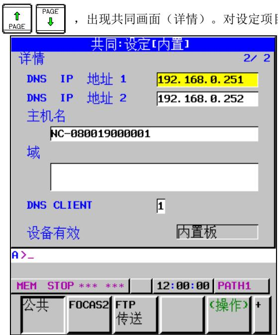

<details>
<summary>text_image</summary>

共同:设定[内置]
详情
2/ 2
DNS IP 地址 1 192.168.0.251
DNS IP 地址 2 192.168.0.252
主机名
NC-080019000001
域
DNS CLIENT 1
设备有效 内置板
A >_
MEM STOP *** ***
12:00:00 PATH1
公共 FOCAS2 FTP
传送 (操作) +
(操作)
</details>

共同画面（详情）

设定项目


## 7.2.3.2 设定DHCP

下面说明为使 DHCP 操作的设定步骤

## 步骤

1 参考后述的 “相关的 NC 参数”，将 DHCP 客户机功能设定为有效。  
在共同画面（基本）的 DHCP 客户机中输入 “1”，可以将 DHCP 客户机功能设定为有效。  
2 设置主计算机的 DHCP 服务器。  
3 与 DHCP 服务器运行的主计算机（下称 DHCP 服务器）连接，重新启动 CNC，按下功能键 ▶ SYSTEM。  
4 按下软键 [内藏口]，接着再按下 [公共]，显示 “共同画面”。  
5 当 CNC 的 DHCP 客户机功能有效而与 DHCP 服务器之间的连接成功时，DHCP 服务将自动设定如下项目。

- IP 地址  
- 子网掩码  
- 路由器地址  
- DNS IP 地址  
- 域

与 DHCP 服务器之间的连接失败时，“DHCP ERROR”显示在各项目中。

6 当 DNS 客户机功能同时有效，DHCP 服务器和 DNS 服务器协同工作时（DNS 服务器支持动态 DNS 时），输入主计算机名。

## 共同画面（基本、详情）

按下软键 [公共]，按下翻页键


在与 DHCP 服务器之间的连接成功，可以获取设定数据时，出现如下所示画面。

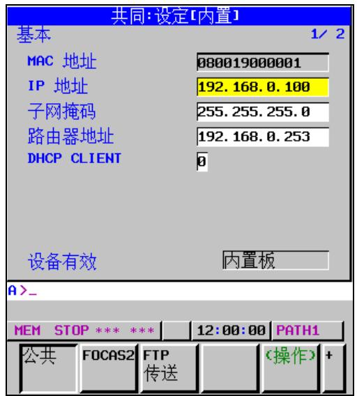

<details>
<summary>text_image</summary>

共同:设定[内置]
基本
1/2
MAC 地址
080019000001
IP 地址
192.168.0.100
子网掩码
255.255.255.0
路由器地址
192.168.0.253
DHCP CLIENT
0
设备有效
内置板
A >_
MEM STOP *** ***
12:00:00 PATH1
公共 FOCAS2 FTP
传送 (操作) +
(操作)
</details>

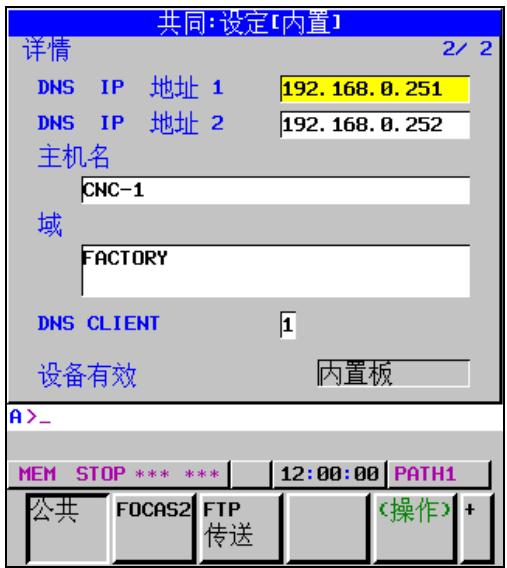

<details>
<summary>text_image</summary>

共同: 设定[内置]
详情
2/ 2
DNS IP 地址 1 192.168.0.251
DNS IP 地址 2 192.168.0.252
主机名
CNC-1
域
FACTORY
DNS CLIENT 1
设备有效 内置板
A >_
MEM STOP *** ***
12:00:00 PATH1
公共 FOCAS2 FTP
传送 (操作) +
</details>

与 DHCP 服务器之间的连接成功的情形

在不设定主计算机名的情况下，CNC以“NC-<MAC地址>”这样的格式自动设定主计算机名。


<details>
<summary>text_image</summary>

主机名
NC-080019000001
</details>

被自动设定的主计算机名的例子

当与 DHCP 服务器之间的连接失败时，出现如下所示画面。

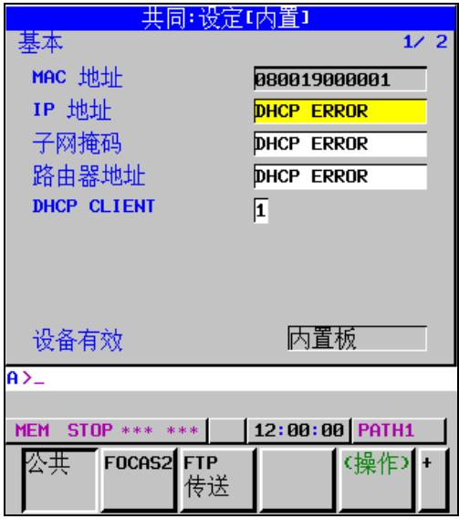

<details>
<summary>text_image</summary>

共同:设定[内置]
基本
1/2
MAC 地址
080019000001
IP 地址
DHCP ERROR
子网掩码
DHCP ERROR
路由器地址
DHCP ERROR
DHCP CLIENT
1
设备有效
内置板
A>_-
MEM STOP *** ***
12:00:00 PATH1
公共 FOCAS2 FTP
传送 (操作) +
(操作)
</details>

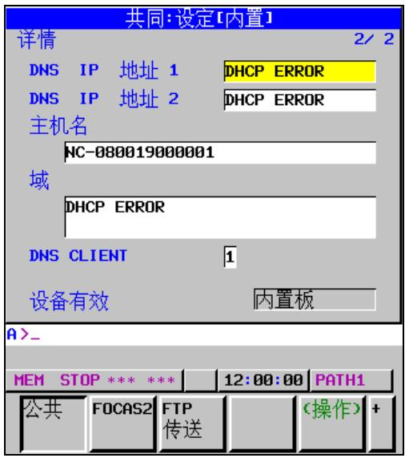

<details>
<summary>text_image</summary>

共同: 设定[内置]
详情
2/ 2
DNS IP 地址 1 DHCP ERROR
DNS IP 地址 2 DHCP ERROR
主机名
NC-080019000001
域
DHCP ERROR
DNS CLIENT 1
设备有效 内置板
A >_
MEM STOP *** ***
12:00:00 PATH1
公共 FOCAS2 FTP
传送 (操作) +
</details>

与 DHCP 服务器之间的连接失败的情形

检查项目


设定项目


显示项目


## 7.2.3.3 相关的NC参数


### PMC报警: 
- **故障内容**: #7
- **处理办法**: #6

### PMC报警: 14880
- **故障内容**: 
- **处理办法**: DHC


[输入类型] 参数输入

[数据类型] 位型


#5 DNS 是否在内置端口中使用 DNS 客户机功能

0: 不使用。

1: 使用。

此值也会在共同画面（详情）的 DNS 客户机中显示，也可进行设定。

#6 DHC 是否在内置端口使用 DHCP 客户机功能

0: 不使用。

1: 使用。

此值也会在共同画面（详情）的 DHCP 客户机中显示，也可进行设定。

## 7.2.4 设定CNC画面显示功能

CNC 画面表示功能，可以在 Windows 电脑上实现与 CNC 相同的显示以及操作。

有关 CNC 画面显示功能的一般使用方法等，请参阅 “CNC Screen Display Function OPERATOR'S MANUAL”（CNC 画面显示功能 操作说明书）（B-63164EN）。

## 注释

1 画面的更新周期相比 CNC 的专用显示器变慢。  
因此，请作为辅助显示器来使用。  
2 在进行高速高精度加工等 CPU 负荷较大的处理时以及包含 CPU 负荷较大的选项之系统配置的机械上，CNC 画面显示功能的画面的更新周期有时候会变慢。  
即使使用高性能的电脑，画面的更新周期也不会变快。  
因此，根据机械的系统配置，基于嵌入式以太网的 CNC 画面显示功能有时无法充分发挥其性能。  
3 嵌入式以太网中，在与 CNC 画面显示功能同时使用其它通信功能（FOCAS2/Ethernet 功能等）的情况下，会影响到画面显示速度等，因而在使用 CNC 画面显示功能时，请勿同时在嵌入式以太网上使用其它的通信功能。

## 7.2.4.1 设定画面的操作

这里就 CNC 画面显示功能的参数设定画面进行说明。

## 步骤

1 按下功能键 ▶ SYSTEM。

2 软键上显示出 [内藏口] （没有软键时请按下继续菜单键）。  
3 按下软键 [内藏口]，出现用于以太网设定画面。  
4 按下软键 [公共] 和 [FOCAS2]，在各自显示的设定项目中输入参数。

## 共同画面（基本）

按下软键 [公共] 时，出现共同画面（基本）。


<details>
<summary>text_image</summary>

共同:设定[内置]
基本
1/2
MAC 地址
080019000001
IP 地址
192.168.0.100
子网掩码
255.255.255.0
路由器地址
192.168.0.253
DHCP CLIENT
0
设备有效
内置板
A>__
MEM STOP *** ***
12:00:00 PATH1
公共 FOCAS2 FTP
传送 (操作) +
(操作)
</details>

共同画面（基本）

设定项目


显示项目


## FOCAS2 画面

按下软键 [FOCAS2]，出现 FOCAS2 画面。

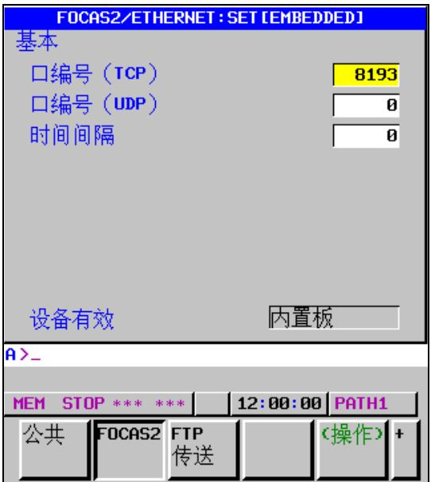

<details>
<summary>text_image</summary>

FOCAS2/ETHERNET: SET [EMBEDDED]
基本
口编号（TCP）	8193
口编号（UDP）	0
时间间隔	0
设备有效	内置板
A >_
MEM STOP *** ***
12:00:00 PATH1
公共	FOCAS2	FTP
传送	(操作) +
</details>

FOCAS2 画面

设定项目


## 7.2.5 机床远程诊断功能的设定

机床远程诊断组件，是为了便于进行基于机床制造商的机床远程支持的一种工具。

在嵌入式以太网和快速以太网上，作为与机床远程诊断组件通信的功能，机床远程诊断功能将会工作。

有关机床远程诊断组件一般的使用方法等，请参阅“Machine Remote Diagnosis Package OPERATOR'S MANUAL”（机床远程诊断组件 操作说明书）（B-63734EN）。

注释

使用机床远程诊断组件用 CNC 画面显示功能时，适用 “设定 CNC 画面显示功能” 的注释，因而也务必要确认 “设定 CNC 画面显示功能” 的注释。

## 7.2.5.1 相关的NC参数

在嵌入式以太网上与机床远程诊断组件通信时，需要设定如下参数。


### PMC报警: 
- **故障内容**: #7
- **处理办法**: #6

### PMC报警: 8706
- **故障内容**: 
- **处理办法**: MRD


[输入类型]

[数据类型]


### PMC报警: #7
- **故障内容**: #6
- **处理办法**: #5

### PMC报警: 
- **故障内容**: MRD
- **处理办法**: 


#6 MRD 机械远程诊断功能所使用的通信设备的种类

0: 不使用机械远程诊断功能。

1: 使用快速以太网板。

## 注释

在设定完此参数后，需要暂时切断电源。


### PMC报警: 
- **故障内容**: #7
- **处理办法**: #6

### PMC报警: 14880
- **故障内容**: 
- **处理办法**: 


[输入类型]

参数输入

[数据类型]

位型

#1 PCH 在机械远程诊断功能中，开始通信时是否进行基于 PING 的服务器存在确认

0: 予以进行。

1: 不予进行。

## 注释

通过公司内部 LAN 等与远程诊断接收服务器连接时，通常设定 0。

将其设定为1而不进行基于PING的服务器存在确认时，若网络中没有服务器，进行错误识别前有时需要数十秒钟的时间。

经由因特网连接时，设定1。


### PMC报警: 14882
- **故障内容**: 
- **处理办法**: 


[输入类型]

参数输入

[数据类型]

位型

## 注释

在设定了本参数时，需要切断电源或者重新启动嵌入式以太网。

#0 ERD 是否在嵌入式以太网功能中使用机床远程诊断功能

0: 不予使用。

1: 予以使用。

## 7.2.5.2 机床远程诊断功能的操作

## 步骤

1 按下功能键


2 软键上显示出 [内藏口] （没有软键时请按下继续菜单键）。  
3 按下软键 [内藏口]，出现用于以太网设定画面。  
4 按下软键 [公共]、[FOCAS2] 和 [远程诊断]，在各自显示的设定项目中输入参数。

## 注释

1 内置以太网端口和 PCMCIA 以太网卡的参数均为独立的参数。  
2 按下软键[PCMCIA 卡]，即可进行用于 PCMCIA 以太网卡的设定，但是这是用于维护的设定，通常情况下不必设定。

## 共同画面（基本）

按下软键 [公共] 时，出现共同画面（基本）。


<details>
<summary>text_image</summary>

共同:设定[内置]
基本
1/2
MAC 地址
080019000001
IP 地址
192.168.0.100
子网掩码
255.255.255.0
路由器地址
192.168.0.253
DHCP CLIENT
0
设备有效
内置板
A>__
MEM STOP *** ***
12:00:00 PATH1
公共 FOCAS2 FTP
传送 (操作) +
(操作)
</details>

共同画面（基本）

设定项目


显示项目


## FOCAS2 画面

按下软键 [FOCAS2]，出现 FOCAS2 画面。

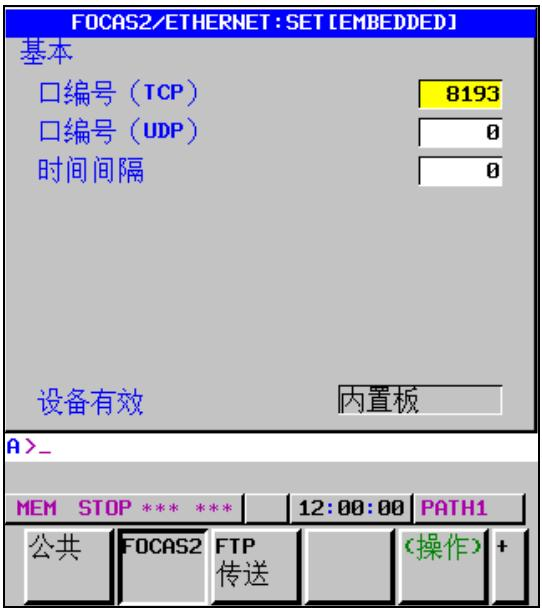

<details>
<summary>text_image</summary>

FOCAS2/ETHERNET:SET [EMBEDDED]
基本
口编号（TCP）
8193
口编号（UDP）
0
时间间隔
0
设备有效	内置板
A >_
MEM STOP *** ***
12:00:00 PATH1
公共	FOCAS2	FTP
传送	(操作) +
</details>

FOCAS2 画面

设定项目


## 机床远程诊断画面（公共）

按下软键 [远程诊断]，出现机床远程诊断画面（公共）。

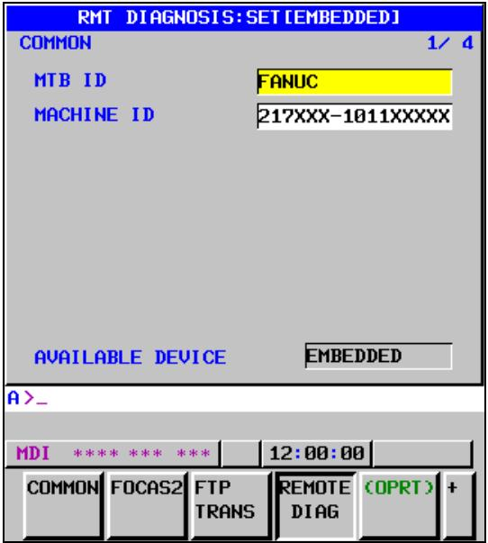

<details>
<summary>text_image</summary>

RMT DIAGNOSIS: SET [EMBEDDED]
COMMON
1/ 4
MTB ID
FANUC
MACHINE ID
217XXX-1011XXXXX
AVAILABLE DEVICE
EMBEDDED
A >_
MDI **** *** ***
12:00:00
COMMON FOCAS2 FTP
TRANS REMOTE (OPRT) +
DIAG
</details>

机床远程诊断画面（公共）

设定项目


## 机床远程诊断画面（查询 1、查询 2、查询 3）

按下软键 [远程诊断]，出现机床远程诊断画面。

通过翻页键 PAGE PAGE 可以进行查询 1,2,3 的 3 台主机的设定。

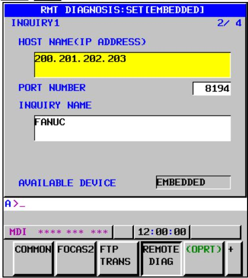

<details>
<summary>text_image</summary>

RMT DIAGNOSIS: SET[EMBEDDED]
INQUIRY1
2/4
HOST NAME(IP ADDRESS)
200.201.202.203
PORT NUMBER
8194
INQUIRY NAME
FANUC
AVAILABLE DEVICE
EMBEDDED
A >_
MDI **** **** ***
12:00:00
COMMON FOCAS2 FTP
TRANS REMOTE (OPRT) +
DIAG DIAG
</details>

(DNS 功能无效的情形)


<details>
<summary>text_image</summary>

RMT DIAGNOSIS:SET [EMBEDDED]
INQUIRY1
2/4
HOST NAME(IP ADDRESS)
RMTDIAG.FANUC.CO.JP
PORT NUMBER
8194
INQUIRY NAME
FANUC
AVAILABLE DEVICE
EMBEDDED
A >_
MDI **** **** ***
12:00:00
COMMON FOCAS2 FTP
TRANS REMOTE
DIAG (OPRT) +
(0)
</details>

(DNS 功能有效的情形)  
机床远程诊断画面（查询 1）

设定项目


## 7.2.5.3 来自PMC的机床远程诊断功能的控制

可以使用来自 PMC 的信号，进行机床远程诊断功能的开始和强行结束的控制，或者向 PMC 的梯形程序通知机床远程诊断功能的状态以及错误号。

信号说明


### PMC报警: 编号
- **故障内容**: #7
- **处理办法**: #6

### PMC报警: G0141
- **故障内容**: 
- **处理办法**: 


DIAREQ <G0141.5>

[名称] 机床远程诊断委托请求信号

[分类] 输入信号

[功能] 请求机床远程诊断的开始。

[操作] 通过设定 “1” 对因应于查询编号的信号（INQU0<G0141.0>～INQU2<G0141.2>）的查询请求机床远程诊断的开始。接收完成信号（RMTEND<F0083.6>）或接收拒绝信号（RMTCAN<F0083.7>）为 “1” 时，将本信号设定为 “0”。

DIASTP <G0141.4>

[名称] 机床远程诊断中止请求信号

[分类] 输入信号

[功能] 请求机床远程诊断的强行结束。

[操作] 通过设定 “1”，向机床远程诊断接收服务器请求强行结束。机床远程诊断中止接收完成信号（RMTCLS<F0082.3>）成为 “1” 时，将本信号设定为 “0”。

INQU2 <G0141.2>

INQU1 <G0141.1>

INQU0 <G0141.0>

[名称] 查询号的选择信号

[分类] 输入信号

[功能] 开始机床远程诊断的查询。

[操作] 开始机床远程诊断的查询，从如下表中选择。


### PMC报警: INQU2
- **故障内容**: INQU1
- **处理办法**: INQU0

### PMC报警: 0
- **故障内容**: 0
- **处理办法**: 0

### PMC报警: 0
- **故障内容**: 0
- **处理办法**: 1

### PMC报警: 0
- **故障内容**: 1
- **处理办法**: 0

### PMC报警: 0
- **故障内容**: 1
- **处理办法**: 1


### PMC报警: 编号
- **故障内容**: #7
- **处理办法**: #6

### PMC报警: F0082
- **故障内容**: 
- **处理办法**: 


RMTCLS <F0082.3>

[名称] 机床远程诊断中止接收完成信号

[分类] 输出信号

[功能] 通知已经接收机床远程诊断中止请求。

[输出条件] 机床远程诊断中止请求信号（DIASTP<G0141.4>）成为“1”时，在中断机床远程诊断时，本信号成为“1”。机床远程诊断中止请求信号（DIASTP<G0141.4>）成为“0”时，本信号成为“0”。


### PMC报警: 编号
- **故障内容**: #7
- **处理办法**: #6

### PMC报警: F0083
- **故障内容**: RMTCAN
- **处理办法**: RMTEND


RMTCAN <F0083.7>

[名称] 机床远程诊断接收拒绝信号

[分类] 输出信号

[功能] 通知已经拒绝机床远程诊断委托请求。

[输出条件] 机床远程诊断委托请求信号（DIAREQ<G0141.5>）成为“1”时，向机床远程诊断接收服务器请求机床远程诊断的开始，拒绝请求时，本信号成为“1”。机床远程诊断委托请求信号（DIAREQ<G0141.5>）成为“0”时，本信号成为“0”。

## RMTEND <F0083.6>

[名称] 机床远程诊断接收完成信号  
[分类] 输出信号  
[功能] 通知已通过机床远程诊断接收服务器接收到机床远程诊断委托请求。

[输出条件] 机床远程诊断委托请求信号（DIAREQ<G0141.5>）成为“1”时，向机床远程诊断接收服务器请求机床远程诊断的开始，接收请求时，本信号成为“1”。机床远程诊断委托请求信号（DIAREQ<G0141.5>）成为“0”时，本信号成为“0”。

DIAST5 <F0083.5>

DIAST4 <F0083.4>

DIAST3 <F0083.3>

DIAST2 <F0083.2>

DIAST1 <F0083.1>

DIAST0 <F0083.0>

[名称] 机床远程诊断状态的通知信号  
[分类] 输出信号  
[功能] 通知机床远程诊断的状态。

[输出条件] 按照下表所示方式通知机床远程诊断的状态。


### PMC报警: DIAST5
- **故障内容**: DIAST4
- **处理办法**: DIAST3

### PMC报警: 0
- **故障内容**: 0
- **处理办法**: 0

### PMC报警: 0
- **故障内容**: 0
- **处理办法**: 0

### PMC报警: 0
- **故障内容**: 0
- **处理办法**: 0

### PMC报警: 0
- **故障内容**: 0
- **处理办法**: 0

### PMC报警: 0
- **故障内容**: 0
- **处理办法**: 0

### PMC报警: 0
- **故障内容**: 0
- **处理办法**: 0

### PMC报警: 0
- **故障内容**: 0
- **处理办法**: 0

### PMC报警: 0
- **故障内容**: 0
- **处理办法**: 0

### PMC报警: 0
- **故障内容**: 0
- **处理办法**: 1

### PMC报警: 0
- **故障内容**: 0
- **处理办法**: 1


### PMC报警: 编号
- **故障内容**: #7
- **处理办法**: #6

### PMC报警: F0088
- **故障内容**: DIAER7
- **处理办法**: DIAER6


DIAER7 <F0088.7>

DIAER6 <F0088.6>

DIAER5 <F0088.5>

DIAER4 <F0088.4>

DIAER3 <F0088.3>

DIAER2 <F0088.2>

DIAER1 <F0088.1>

DIAER0 <F0088.0>

[名称] 机床远程诊断错误号的通知信号  
[分类] 输出信号  
[功能] 通知机床远程诊断的错误号。

[输出条件] 表示机床远程诊断的错误号。其值为 0～255 的二进制格式。

## 信号的时间图

## 已受理机床远程诊断的开始的情形

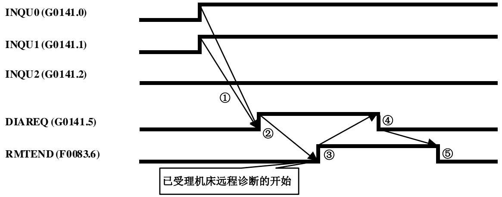

<details>
<summary>flowchart</summary>

```mermaid
graph TD
  A["INQU0 (G0141.0)"] --> B["①"]
  C["INQU1 (G0141.1)"] --> D["②"]
  E["INQU2 (G0141.2)"] --> F["③"]
  G["DIAREQ (G0141.5)"] --> H["④"]
  I["RMTEND (F0083.6)"] --> J["⑤"]
  K["已受理机床远程诊断的开始"] --> L["③"]
  L --> M["④"]
  M --> N["⑤"]
```
</details>

① 在将机床远程诊断委托请求信号（DIAREQ）设定为“1”之前，通过查询号的信号（INQU0, INQU1, INQU2），选择开始远程诊断功能的查询。本例中，假设 INQU0=1、INQU1=1、INQU2=0，选择“查询3”。  
② 将机床远程诊断委托请求信号（DIAREQ）设定为“1”。  
③ 机床远程诊断组件接收到诊断开始的请求时，机床远程诊断接收完成信号（RMTEND）成为“1”。  
④ 机床远程诊断接收完成信号（RMTEND）成为“1”时，将机床远程诊断委托请求信号（DIAREQ）设定为“0”。  
⑤ 在将机床远程诊断委托请求信号（DIAREQ）设定为“0”时，机床远程诊断接收完成信号（RMTEND）成为“0”。

## 已拒绝机床远程诊断的开始的情形

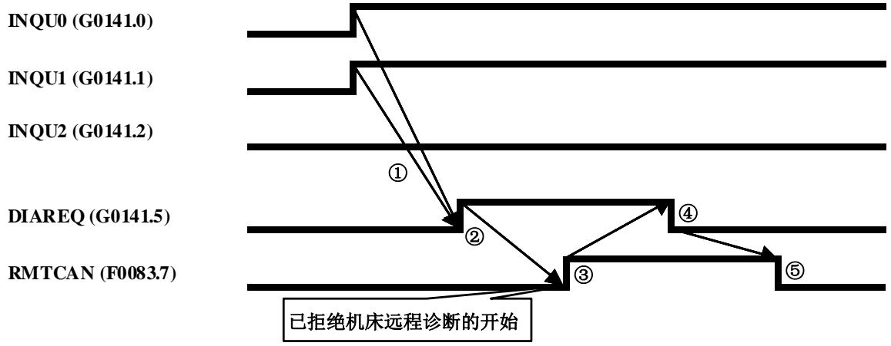

<details>
<summary>flowchart</summary>

```mermaid
graph TD
  A["INQU0 (G0141.0)"] --> B["①"]
  C["INQU1 (G0141.1)"] --> D["②"]
  E["INQU2 (G0141.2)"] --> F["③"]
  G["DIAREQ (G0141.5)"] --> H["④"]
  I["RMTCAN (F0083.7)"] --> J["⑤"]
  K["已拒绝机床远程诊断的开始"] --> L["③"]
  L --> M["④"]
  M --> N["⑤"]
```
</details>

① 在将机床远程诊断委托请求信号（DIAREQ）设定为“1”之前，通过查询号的信号（INQU0, INQU1, INQU2），选择开始远程诊断功能的查询。本例中，假设 INQU0=1、INQU1=1、INQU2=0，选择“查询3”。  
② 将机床远程诊断委托请求信号（DIAREQ）设定为 “1”。  
③ 机床远程诊断组件拒绝诊断开始的请求时，机床远程诊断接收拒绝信号（RMTCAN）成为“1”。  
④ 机床远程诊断接收拒绝信号（RMTCAN）成为“1”时，将机床远程诊断委托请求信号（DIAREQ）设定为“0”。  
⑤ 在将机床远程诊断委托请求信号（DIAREQ）设定为“0”时，机床远程诊断接收拒绝信号（RMTCAN）成为“0”。

## 强行结束机床远程诊断时

DIASTP (G0141.4)

RMTCLS (F0082.3)


<details>
<summary>flowchart</summary>

```mermaid
graph TD
  A["① 已强行关断机床远程诊断"] --> B["②"]
  B --> C["③"]
  C --> A
```
</details>

① 在将机床远程诊断中止请求信号（DIASTP）设定为 “1” 时，机床远程诊断功能将被强制结束。强制结束完成后，机床远程诊断中止接收完成信号 (RMTCLS) 成为 “1”。  
② 机床远程诊断中止接收完成信号（RMTCLS）成为“1”时，将机床远程诊断中止请求信号（DIASTP）设定为“0”。  
③ 在将机床远程诊断中止请求信号（DIASTP）设定为“0”时，机床远程诊断中止接收完成信号（RMTCLS）成为“0”。

## 7.2.5.4 机床远程诊断画面的操作

## 步骤

1 按下功能键 SYSTEM。  
2 软键上显示出 [RMTDGN]。（没有出现软键时，按下继续键。）  
3 按下软键 [RMTDGN] 时，出现 “机床远程诊断画面”。

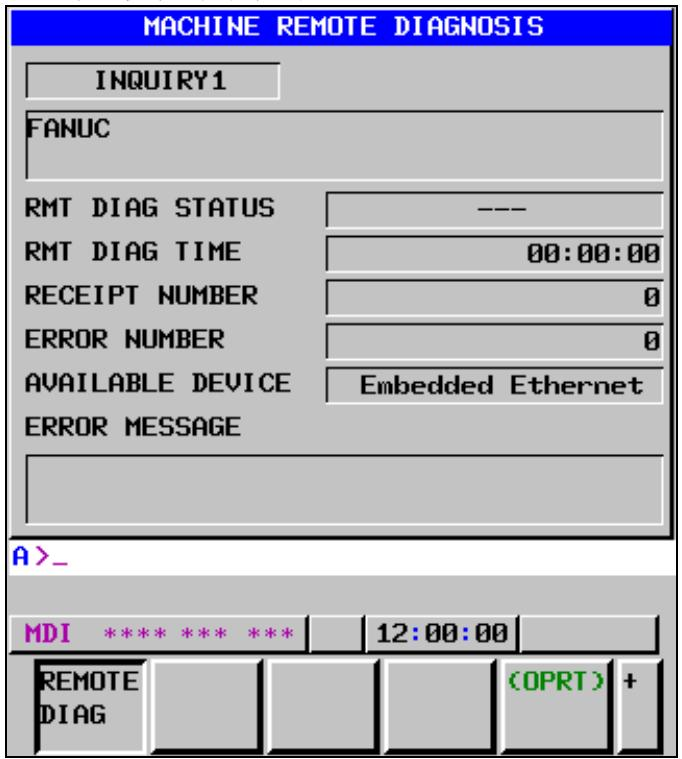

<details>
<summary>text_image</summary>

MACHINE REMOTE DIAGNOSIS
INQUIRY1
FANUC
RMT DIAG STATUS	---
RMT DIAG TIME	00:00:00
RECEIPT NUMBER	0
ERROR NUMBER	0
AVAILABLE DEVICE	Embedded Ethernet
ERROR MESSAGE
A >_
MDI	****	***	***
12:00:00
REMOTE
DIAG		(OPRT)	+
</details>

机床远程诊断画面

4 按下软键 [(操作)] 时，显示可以操作的软键。


<details>
<summary>text_image</summary>

DIAG
OPEN
DIAG
CLOSE
INQUIR
Y1
INQUIR
Y2
INQUIR
Y3
</details>

机床远程诊断画面的软键

## 显示项目

## 询问号码

显示用来表示机床远程诊断接收服务器的询问号码。

显示 “询问 1”、“询问 2”、“询问 3”的其中之一。

## 询问

显示用来识别机床远程诊断接收服务器的信息。

## 远程诊断状态

显示机床远程诊断的状态。

## 远程诊断时间

显示机床远程诊断从开始到结束的时间。

每次开始诊断，就从 “00:00:00” 进行时间的累计。

## 接收号码

表示机床远程诊断接收服务器所发行的接收号码。

## 错误号码

表示机床远程诊断功能中发生的错误号码。

## 有效设备

表示机床远程诊断功能能够动作的通讯设备的种类。

## 错误信息

表示机床远程诊断功能中发生的错误信息。

## 操作列表

## 开启诊断

开始机床远程诊断。

## 关闭诊断

强行关断机床远程诊断。

## 询问1

选择询问 1。

## 询问 2

选择询问 2。

## 询问3

选择询问 3。

## 询问的选择

从询问 1 到询问 3 中选择询问。

1 按下软键 [(操作)]。  
2 按下软键 [询问 1] 时，选择询问 1。  
3 同样，按下软键 [询问 2] 时，选择询问 2，按下软键 [询问 3] 时，选择询问 3。

## 诊断的开始

开始诊断。

1 按下软键 [(操作)]。  
2 按下软键[开启诊断]，机床远程诊断接收服务器进行诊断请求。  
3 机床远程诊断接收服务器接收诊断请求时，开始进行诊断。

诊断状态


错误号码和错误信息


### PMC报警: 号码
- **故障内容**: 错误信息
- **处理办法**: 含义与处理方法

### PMC报警: 1
- **故障内容**: Diagnosis is busy
- **处理办法**: 诊断中按下了软键[开启诊断]。

### PMC报警: 2
- **故障内容**: Router isn't alive
- **处理办法**: 可能是由于路由器的IP地址错误,或者路由器的电源尚未接通。确认路由器的IP地址,并确认路由器是否已经接通电源。

### PMC报警: 3
- **故障内容**: Receipt Server isn't alive
- **处理办法**: 可能是由于机床远程诊断接收服务器的IP地址错误,或者机床远程诊断接收服务器的电源尚未接通。确认机床远程诊断接收服务器的IP地址,并确认机床远程诊断接收服务器是否已经接通电源。

### PMC报警: 4
- **故障内容**: System error
- **处理办法**: 发生了系统错误。确认“以太网日志”画面的日志信息,并联系我公司。

### PMC报警: 5
- **故障内容**: Invalid Inquiry number.
- **处理办法**: 可能是由于在询问中设定了设定范围外的值。确认是否已经正确设定了询问。

### PMC报警: 6
- **故障内容**: Invalid IP Address
- **处理办法**: 按照IP地址的指定格式,设定IP地址。

### PMC报警: 7
- **故障内容**: Invalid PORT number
- **处理办法**: 可能是由于在端口号中设定了设定范围外的值。确认是否已经正确设定了端口号。

### PMC报警: 8
- **故障内容**: Invalid Router IP Address
- **处理办法**: 按照IP地址的指定格式,设定路由器的IP地址。

### PMC报警: 9
- **故障内容**: Socket error
- **处理办法**: 由于下列所示的原因而发生了通讯错误。请确认网络布线和噪声对策等。√网络的质量下降,不再能够接收来自通讯对方的电脑的数据,逻辑通讯线路被切断。√通讯对方电脑上的软件强制地切断了逻辑通讯线路。√以太网电缆脱落。

### PMC报警: 11
- **故障内容**: Invalid Request
- **处理办法**: CNC内发生与机床远程诊断相关的内部错误。确认“以太网日志”画面的日志信息,并联系我公司。

### PMC报警: 12
- **故障内容**: Invalid Packet
- **处理办法**: 接收到了无法识别的数据包。确认“以太网日志”画面的日志信息,并联系我公司。

### PMC报警: 13
- **故障内容**: Diagnosis was already stopped
- **处理办法**: 非诊断中时按下了软键[关闭诊断]。

### PMC报警: 17
- **故障内容**: Receive error
- **处理办法**: 数据接收失败。请参照号码9,确认网络布线和噪声对策等。

### PMC报警: 19
- **故障内容**: HeartBeat timeout
- **处理办法**: 与机床远程诊断接收服务器之间的通讯中断。请参照号码9,确认网络布线和噪声对策等。

### PMC报警: 20
- **故障内容**: HeartBeat error
- **处理办法**: 机床远程诊断HeartBeat数据包的发送失败。请参照号码9,确认网络布线和噪声对策等。

### PMC报警: 22
- **故障内容**: DNS error
- **处理办法**: 试图利用DNS功能连接到机床远程诊断接收服务器,但是未能连接上。可能是由于DNS服务器的IP地址错误,或者DNS服务器的电源尚未接通。确认DNS服务器的IP地址,并确认DNS服务器是否已经接通电源。


## 诊断的强行关断

通常，从机床远程诊断接收服务器一侧进行关断，但是也可以从CNC一侧进行强制关断。

1 按下软键 [(操作)]。  
2 按下软键 [关闭诊断] 时，强行关断诊断。

## 7.2.6 CNC主导信息通知功能的设定

下面就嵌入式以太网功能中，用来使 CNC 主导信息通知功能动作的所需设定进行说明。

## 7.2.6.1 概述

下面就 CNC 主导信息通知功能的概要以及执行步骤进行说明。

## CNC 主导信息通知功能概要

下面就 CNC 主导信息通知功能的概要进行说明。

所谓 CNC 主导信息通知功能，是指按照 NC 程序或梯形程序发出的指令从 CNC 自发地向电脑的应用程序通知信息（CNC/PMC 数据）的功能。使用本功能则无须进行定期询问 CNC 状态的电脑应用程序的处理。

使用以往功能时  


<details>
<summary>flowchart</summary>

```mermaid
graph LR
  A["应用程序"] --> B["询问应答"]
  B --> C["设备检测"]
  C --> D["CNC/PMC 数据的变化"]
```
</details>

使用 CNC 主导信息通知功能时  


<details>
<summary>flowchart</summary>

```mermaid
graph LR
  A["NC 程序或梯形程序"] -->|通知| B["应用程序"]
  C["NC 程序或梯形程序 检测 CNC/PMC 数据的变化"] --> A
  D["应用程序从 CNC 接收通知"] --> B
```
</details>

注释

CNC 主导信息通知功能是 FOCAS2/Ethernet 功能的一部分。

## CNC 主导信息通知功能的执行步骤

下面就 CNC 主导信息通知功能的执行步骤进行说明。

## 1 电脑侧的准备工作

创建使用 CNC 主导信息通知功能用 FOCAS2 函数的应用程序，在 CNC 主导信息服务器的电脑上进行安装。有关使用 CNC 主导信息通知功能用 FOCAS2 函数的应用程序的创建方法及 CNC 主导信息服务器的安装方法，请参阅 FOCAS1/2 程序库中随附的“Data Window Library Operator's Manual”（数据窗口程序库操作说明书）的“5.UNSOLICITED MESSAGING FUNCTION”（5. CNC 主导信息通知功能）。

## 2 CNC 侧的准备工作

创建控制 CNC 主导信息发送的 NC 程序或梯形程序。

有关 NC 程序或梯形程序的创建方法，请参阅 “执行方式” 项。

## 3 CNC 主导信息通知功能的通信参数的设定

为使用 CNC 主导信息通知功能，必须进行以下通讯参数设定。

(1) 为使用 FOCAS2/Ethernet 功能的设定

(2) CNC 主导信息通知功能用参数的设定

关于(2)，包括从 CNC 画面进行设定（CNC 方式）及从电脑进行设定（电脑方式），两种情况均可进行设定。

有关(1)、(2)的设定方法，请参阅“FOCAS2/Ethernet功能的设定”项～“从电脑进行设定时”项。

## 4 CNC 程序或梯形图程序开始运行

开始运行步骤 2 “CNC 侧的准备工作” 所创建的 NC 程序或梯形程序。此时，只要不运行下一步骤即步骤 5 “CNC 主导信息通知功能的开始”，CNC 主导信息就不会被发送至电脑。

## 5 CNC 主导信息通知功能的开始

由电脑执行 FOCAS2 函数 cnc\_unsolicstart。由此，CNC 变为 NC 程序或梯形程序发出的等待发送信息请求状态（状态名称 “发送准备”）。一旦 NC 程序或梯形程序产生发送信息的请求时，系统就会自动向电脑发送 CNC 主导信息。

## 6 CNC 主导信息通知功能的结束

希望终止 CNC 主导信息发送时，通过电脑执行 FOCAS2 函数 cnc\_unsolicstop。由此，即便 NC 程序或梯形程序发出发送信息请求，CNC 也将称为不发送信息的状态（状态名称 “停止”）。

## 7.2.6.2 FOCAS2/Ethernet功能的设定

下面就为使 CNC 主导信息通知功能动作的 FOCAS2/Ethernet 功能的设定进行说明。

## 步骤

1 参考后述的 “相关的 NC 参数”，将 CNC 主导消息通知功能置于有效。  
2 重新启动 CNC，按下功能键 SYSTEM。  
3 软键上显示出 [内藏口]。（没有软键时请按下继续菜单键）。  
4 按下软键 [内藏口]，出现用于内置以太网端口的以太网设定画面。  
5 按下 [公共]、[FOCAS2]，进行各自画面的设定。  
6 按下软键 [主导信息]，出现 CNC 主导信息画面。（没有软键 [主导信息] 时，请按下继续菜单键。）有关 CNC 主导信息画面的详情，请参阅 “方式的选择” 项以后章节的内容。

## 共同画面（基本）

按下软键 [公共] 时，出现共同画面（基本）。

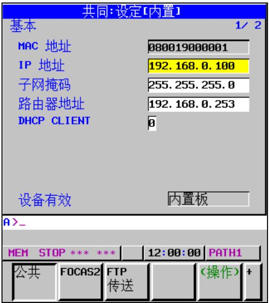

<details>
<summary>text_image</summary>

共同:设定[内置]
基本
1/2
MAC 地址
080019000001
IP 地址
192.168.0.100
子网掩码
255.255.255.0
路由器地址
192.168.0.253
DHCP CLIENT
0
设备有效
内置板
A>__
MEM STOP *** ***
12:00:00 PATH1
公共 FOCAS2 FTP
传送 (操作) +
(操作)
</details>

共同画面（基本）

设定项目


显示项目


注释

共同画面的第2页（详情画面），在使用DNS/DHCP功能时进行设定。详情请参阅“设定DNS/DHCP功能”项。

## 共同画面（详情）

使用 DNS 客户机功能时，按下软键 [公共]，按下翻页键 ↑ PAGE ↓ ，出现共同画面（详情）。对设定项目的 DNS IP 地址进行设定。


<details>
<summary>text_image</summary>

共同:设定[内置]
详情
2/ 2
DNS IP 地址 1 192.168.0.251
DNS IP 地址 2 192.168.0.252
主机名
CNC-1
域
FACTORY
DNS CLIENT 1
设备有效 内置板
A >_
MEM STOP *** ***
12:00:00 PATH1
公共 FOCAS2 FTP
传送 (操作) +
(操作)
</details>

共同画面（详情）

设定项目


## FOCAS2 画面

按下软键 [FOCAS2]，出现 FOCAS2 画面。

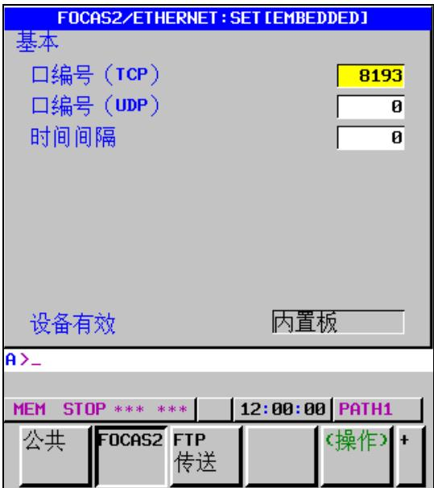

<details>
<summary>text_image</summary>

FOCAS2/ETHERNET:SET [EMBEDDED]
基本
口编号（TCP）	8193
口编号（UDP）	0
时间间隔	0
设备有效	内置板
A>__
MEM STOP *** ***
12:00:00 PATH1
公共	FOCAS2 FTP	(操作) +
传送
</details>

FOCAS2 画面

设定项目


## 7.2.6.3 方式的选择

下面就设定 CNC 主导信息通知功能时的方式选择进行说明。

## CNC 主导信息画面（基本）

按下软键 [主导信息]，出现 CNC 主导信息画面（基本）。

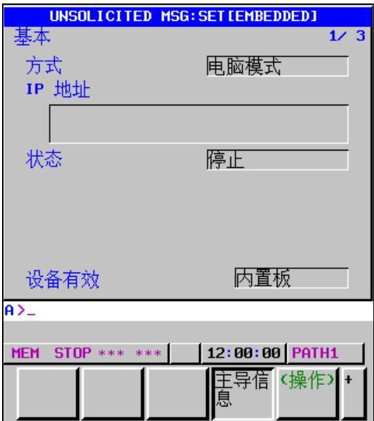

<details>
<summary>text_image</summary>

UNSOLICITED MSG:SET [EMBEDDED]
基本
1/ 3
方式	电脑模式
IP 地址
状态	停止
设备有效	内置板
A >_
MEM STOP *** ***
12:00:00 PATH1
主导信(操作) +
息
</details>

CNC 主导信息画面 1（基本）

设定项目


## 注释

1 初次使用时，方式为“电脑模式”。  
2 只在“停止”状态时可进行方式变更。有关“停止”状态，请参阅下述显示项目。  
3 将方式由“CNC模式”变更为“电脑模式”时，在CNC画面设定的参数将全部被清除。  
4 方式变更，只可在有效设备一侧进行。

## 操作

进行方式变更。

1 按下软键 [（操作）]，显示软键 [模式]。


<details>
<summary>text_image</summary>

模式
</details>

2 按下软键 [模式]，显示软键 [CNC 模式]、[电脑模式]。

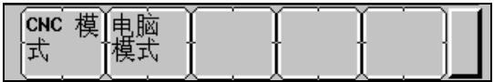

<details>
<summary>text_image</summary>

CNC 模 电脑
式 模式
</details>

显示项目


## 注释

1 从状态 “停止” 到 “发信准备”，需要在电脑侧执行 FOCAS2 函数 cnc\_unsolicstart。  
2 从其他状态到“停止”，需要在电脑侧执行 FOCAS2 函数 cnc\_unsolicstop。  
3 有关状态的时间图，请参阅“执行方式”项。

## 7.2.6.4 从CNC画面进行设定时

下面就从 CNC 主导信息画面进行设定的方法进行说明。

## 注释

1 为使从 CNC 画面进行的设定有效，进行 CNC 主导信息通讯，必须按照以下步骤进行操作。

(1) 设定 CNC 主导信息画面（连接）的全部设定项目  
(2) 执行软键 [（操作）] → [适用]  
(3) 从电脑执行 CNC 主导信息开始（FOCAS2 函数 cnc\_unsolicstart）

2 CNC 主导信息画面（连接）的设定项目的输入及软键 [（操作）] → [适用] 的执行，只在 “停止” 状态下可用。有关 “停止” 状态，请参阅 “方式的选择” 项显示项目。

3 虽然可以在无效的设备一侧的设定画面上进行设定项目的输入，但是软键 [（操作）] → [适用] 的执行，只可在有效的设备一侧进行。

## CNC 主导信息画面（连接）

按下软键 [主导信息]，用翻页键 ↑ PAGE ↓ 打开第 2 页、第 3 页，显示 CNC 主导信息画面（连接）。

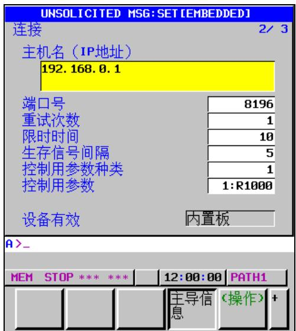

<details>
<summary>text_image</summary>

UNSOLICITED MSG:SET [EMBEDDED]
连接
2/3
主机名（IP地址）
192.168.0.1
端口号	8196
重试次数	1
限时时间	10
生存信号间隔	5
控制用参数种类	1
控制用参数	1:R1000
设备有效	内置板
A>__
MEM STOP *** ***
12:00:00 PATH1
主导信(操作) +
息
</details>

CNC 主导信息画面 2（连接）

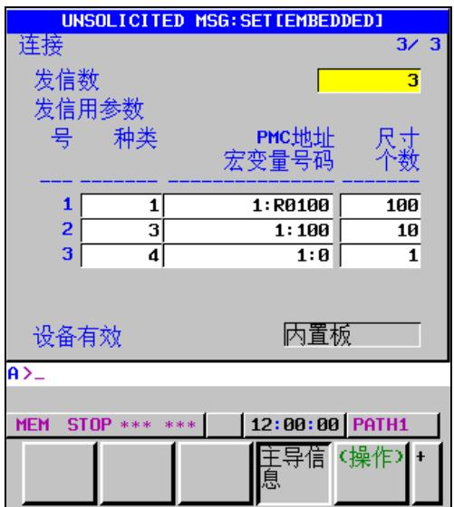

<details>
<summary>text_image</summary>

UNSOLICITED MSG: SET [EMBEDDED]
连接
3/ 3
发信数
3
发信用参数
号 种类 PMC地址 尺寸
宏变量号码 个数
1 1 1: R0100 100
2 3 1: 100 10
3 4 1: 0 1
设备有效 内置板
A >_
MEM STOP *** *** 12:00:00 PATH1
主导信 (操作) +
息
</details>

CNC 主导信息画面 3（连接）

设定项目


## 注意

1 PMC 区域的 R 区域、非保持型存储器的 E 区域，在刚刚通电后全都为 0。  
2 PMC区域的E区域通常是非保持型存储器，但是也可通过选项而作为保持型存储器来使用。  
使用保持型存储器时，即使切断电源内容也会被保持起来，因而在下次通电时为了避免错误动作，要予以充分注意。

## 注释

1 进行控制用参数的“种类”的PMC地址指定，有应答通知模式和简易模式，有关这两种模式的详情，请参阅后述的“执行方式”项。  
2 PMC 地址的可设定范围，随有效的 PMC 存储器类型而不同。有关详情，请参阅 PMC Programming Manual(B-64513EN)（PMC 编程说明书）。  
3 用户宏变量号和RTM变量号码的可设定范围因有效选项而有所不同。有关详情，请参阅车床系统/加工中心系统通用操作说明书（B-64604CM）。  
4 请将发送数和发送用参数（NO.1～3）的有效数量设定一致。如，发送数为“3”，若 NO.1～3 的发送用参数中存在 1 个无效值，执行软键 [适用] 时会出现错误。

## 关于 PMC 地址的设定

在设定控制用 PMC 地址以及发送用 PMC 地址时，按如下方式予以指定。

## 输入格式）

<路径号>: <PMC 地址>

譬如，若是 PMC 第 2 路径的 R0500 时，输入 “2：R500”。

省略<路径号>时，将(R500)作为第1路径(1:R0500)来对待。

没有<：>键时，可以用</>键或者<EOB>键来代用，也可以省略“：”。

希望清除已设定的“<路径号>: <PMC 地址>”时，输入“”（空白）。（显示“---”。）这种情况下，成为不使用 PMC 区域的设定。

## 关于宏变量的设定

在设定控制用宏变量以及发送用宏变量时，请按如下方式予以指定。

## 输入格式）

<路径号>: <变量号>

譬如，CNC 第 2 路径的变量号为#100 时，输入 “2：100”。

省略＜路径号＞时，将(500)作为第1路径(1:100)来对待。

没有<：>键时，可以用</>键或者<EOB>键来代用，也可以省略“：”。

希望清除已设定的“<路径号>：<变量号>”时，输入“”（空白）。（显示“---”。）这种情况下，成为不使用宏变量的设定。

## 操作

将 CNC 主导信息画面（连接）的全部设定项目的设定值置于有效。

1 按下软键 [（操作）]，显示软键 [适用]。


<details>
<summary>text_image</summary>

适用
输入
</details>

2 按下软键 [适用]。

## 7.2.6.5 从电脑进行设定时

从电脑进行设定时，使用以下 FOCAS2 函数创建应用程序，进行设定。

\- cnc\_wrunsolicprm2 CNC主导信息用参数的设定2

\- cnc\_unsolicstart CNC主导信息开始

有关详情，请参阅 FOCAS1/2 程序库中随附的“Data Window Library Operator's Manual”（数据窗口程序库操作说明书）的“5.UNSOLICITED MESSAGING FUNCTION”（5. CNC 主导信息通知功能）。

## 注释

1 为开始进行 CNC 主导信息通讯，执行 FOCAS2 函数 cnc\_wrunsolicprm2 后，要执行 CNC 主导信息开始（FOCAS2 函数 cnc\_unsolicstart）。  
2 FOCAS2 函数 cnc\_wrunsolicprm2，只在“停止”状态可以执行。有关“状态”的详情，请参阅“方式的选择”项显示项目。  
3 执行 FOCAS2 函数 cnc\_wrunsolicprm2 时，在 CNC 主导信息画面（连接）显示从电脑进行设定的内容。

## 7.2.6.6 执行方式

下面就执行 CNC 主导信息通知功能的方法进行说明。

CNC 主导信息通知功能的执行有以下 3 种。

- 在梯形程序中，通过应答通知模式使用控制用 PMC 地址的情形  
- 在梯形程序中，通过简易模式使用控制用 PMC 地址的情形  
- 在 NC 程序中，通过简易模式使用控制用宏变量的情形

## 注释

1 在梯形程序中，有应答通知模式和简易模式。主要不同点在于，应答通知模式时数据发送的应答 RES\_CODE 会通知给梯形程序，简易模式时不通知。希望挪用 Series16i 等使用的逻辑梯形程序时，请使用应答通知模式。无需 RES\_CODE，或新建梯形程序时，简易模式亦可。  
2 RES\_CODE 检查出 0x00 或 0x01 以外的情形时，会记录在以太网日志画面上。  
3 有关 RES\_CODE 的详情，请参阅 FOCAS1/2 程序库中随附的“Data Window Library Operator's Manual”（数据窗口程序库操作说明书）的“5.UNSOLICITED MESSAGING FUNCTION”（5. CNC 主导信息通知功能）。

## 使用控制用 PMC 地址时（应答通知模式）

下面就在梯形程序中通过应答通知模式使用控制用 PMC 地址的情形进行说明。

## 注释

可以设定 PMC 地址作为控制用，可以设定宏变量作为发送用。请注意，此时从梯形程序无法辨明发送的宏变量是哪个时机读出的值。

在以下说明中，控制用/发送用都以 PMC 地址的情形示例。

## 控制用 PMC 地址的信号说明

下面就为执行 CNC 主导信息通知功能的控制用 PMC 地址的信号的详情进行示例。控制用 PMC 地址的区域为 2 字节。下面就使用控制用 PMC 地址 “Rxxxx”（省略 PMC 路径号）的情况进行示例。


### PMC报警: 编号
- **故障内容**: #7
- **处理办法**: #6

### PMC报警: Rxxxx
- **故障内容**: REQ
- **处理办法**: 


REQ <Rxxxx#7>

[名称] 信息发送请求信号

[分类] 输入信号

[功能] 请求发送 CNC 主导信息。

[动作] 梯形程序准备好向发送用 PMC 地址发送信息后，将本信号置于 “1”。由此，信息被发送至电脑。


### PMC报警: 编号
- **故障内容**: #7
- **处理办法**: #6

### PMC报警: Rxxxx+1
- **故障内容**: RES
- **处理办法**: COM


RES <Rxxxx+1#7>

[名称] 信息应答的接收信号

[分类] 输出信号

[功能] 通知接收 CNC 主导信息的应答。

[输出条件] 信息被电脑接收后，向 CNC（通讯機能）发送信息的应答。CNC（通讯功能）接收该应答后，本信号变为 “1”。梯形程序在本信号变为 “1” 时，读取 RES\_CODE，将 REQ 置于 “0”。由此，CNC（通讯機能）在将 RES\_CODE 清零后，将本信号置于 “0”。

```txt
COM <Rxxxx+1#6>
```

[名称] 信息发送开始信号  
[分类] 输出信号  
[功能] 通知开始发送 CNC 主导信息。

[输出条件] 开始向电脑发送信息，则本信号变为 “1”，发送完成后变为 “0”。

```txt
RES_CODE <Rxxxx+1#0>~<Rxxxx+1#5>
```

[名称] 信息应答的接收结果信号  
[分类] 输出信号  
[功能] 通知 CNC 主导信息应答的接收结果。

[输出条件] 设定信息应答的接收结果。梯形程序在读取本信号后，将 REQ 置于 “0”。由此，CNC（通讯功能）将本信号清零。

## 注释

有关 RES\_CODE 的详情，请参阅 FOCAS1/2 程序库中随附的“Data Window Library Operator's Manual”（数据窗口程序库操作说明书）的“5.UNSOLICITED MESSAGING FUNCTION”（5. CNC 主导信息通知功能）。

## 控制用 PMC 地址信号的时间图

下面就应答通知模式的情况下控制用 PMC 地址信号的时间图进行说明。

以下就接收 FOCAS2 函数 cnc\_unsolicstart 后发送 1 次 CNC 主导信息之后，接收 FOCAS2 函数 cnc\_unsolicstop 的情况进行示例。

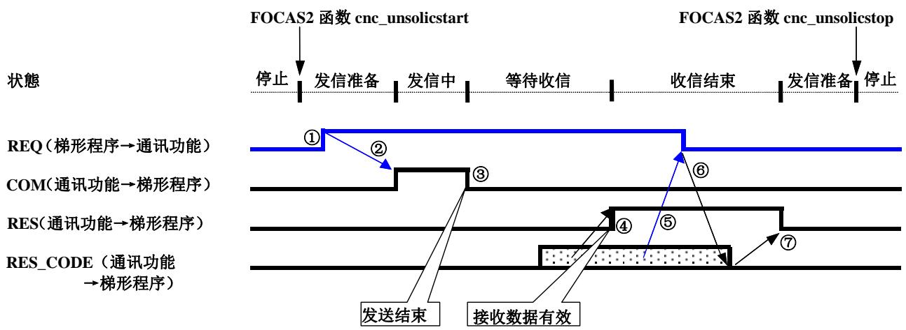

<details>
<summary>flowchart</summary>

```mermaid
graph TD
  A["状态"] --> B["FOCAS2 函数 cnc_unsolicstart"]
  B --> C["停止"]
  C --> D["发信准备"]
  D --> E["发信中"]
  E --> F["等待收信"]
  F --> G["收信结束"]
  G --> H["发信准备"]
  H --> I["停止"]
    
  J["REQ (梯形程序→通讯功能)"] --> K["①"]
  L["COM (通讯功能→梯形程序)"] --> M["②"]
  N["RES (通讯功能→梯形程序)"] --> O["③"]
  P["RES_CODE (通讯功能→梯形程序)"] --> Q["④"]
  R["发送结束"] --> S["接收数据有效"]
  T["⑥"] --> U["⑦"]
```
</details>

① 梯形程序确认 RES 为 “0” 后，准备信息，将 REQ 置于 “1”。  
② 因 REQ 为 “1”，通讯功能将 COM 置于 “1” 后，发送信息。  
③ 通讯功能完成信息发送后，将 COM 置于 “0”。  
④ 通讯功能接收信息应答后，设定 RES\_CODE，将 RES 置于 “1”。  
⑤ 因 RES 为 “1”，梯形程序读取 RES\_CODE 后，将 REQ 置于 “0”。  
⑥ 因 REQ 为 “0”，通讯功能将 RES\_CODE 清零。  
⑦ 通讯功能将 RES 置于 “0”。

## 注释

有关 “状态” 的详情，请参阅 “方式的选择” 项显示项目。

## 使用控制用 PMC 地址时（简易模式）

下面就在梯形程序中通过简易模式使用控制用 PMC 地址的情形进行说明。

## 注释

可以设定 PMC 地址作为控制用，可以设定宏变量作为发送用。请注意，此时从梯形程序无法辨明发送的宏变量是哪个时机读出的值。

在以下说明中，控制用/发送用都以PMC地址的情形示例。

## 控制用 PMC 地址的信号说明

下面就为执行 CNC 主导信息通知功能的控制用 PMC 地址的信号的详情进行示例。控制用 PMC 地址的区域为 1 字节。下面就使用控制用 PMC 地址 “Rxxxx”（省略 PMC 路径号）的情况进行示例。


### PMC报警: 编号
- **故障内容**: #7
- **处理办法**: #6

### PMC报警: Rxxxx
- **故障内容**: REQ
- **处理办法**: 


REQ <Rxxxx#7>

[名称] 信息发送请求信号

[分类] 输入/输出信号

[功能] 请求发送 CNC 主导信息。

[动作] 梯形程序准备好向发送用 PMC 地址发送信息后，将本信号置于 “1”，信息就被发送至电脑。接收信息应答后，CNC（通讯功能）将本信号清零。

## 控制用 PMC 地址信号的时间图

下面就简易模式的情形下控制用 PMC 地址信号的时间图进行说明。

以下就接收 FOCAS2 函数 cnc\_unsolicstart 后发送 1 次 CNC 主导信息之后，接收 FOCAS2 函数 cnc\_unsolicstop 的情况进行示例。

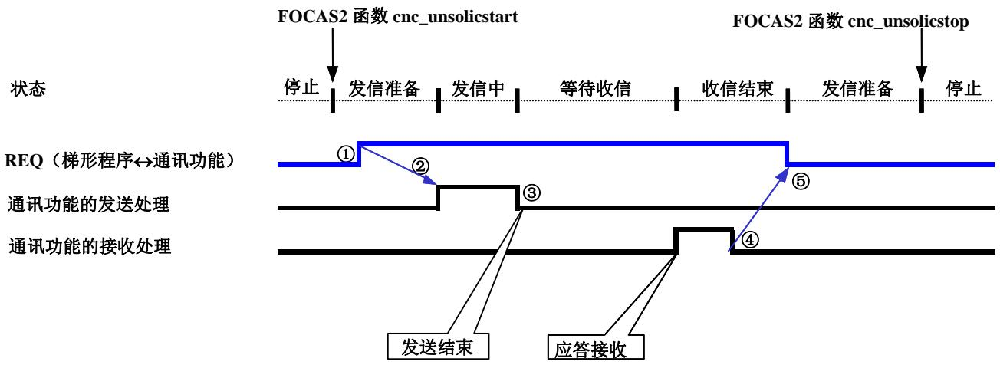

<details>
<summary>flowchart</summary>

```mermaid
graph TD
  A["状态"] --> B["FOCAS2 函数 cnc_unsolicstart"]
  B --> C["停止"]
  C --> D["发信准备"]
  D --> E["发信中"]
  E --> F["等待收信"]
  F --> G["收信结束"]
  G --> H["发信准备"]
  H --> I["停止"]
    
  J["通讯功能的发送处理"] --> K["①"]
  L["通讯功能的接收处理"] --> M["②"]
  N["③"] --> O["④"]
  P["⑤"] --> Q["⑥"]
  R["发送结束"] --> S["应答接收"]
```
</details>

① 梯形程序确认 REQ 为 “0” 后，准备信息，将 REQ 置于 “1”。  
② REQ 为 “1”，因此通讯功能发送信息。  
③ 通讯功能完成信息发送处理。  
④ 通讯功能接收信息应答后，完成接收处理。  
⑤ 通讯功能已完成接收处理，所以将 REQ 置于 “0”。

## 注释

有关“状态”的详情，请参阅“方式的选择”项显示项目。

## 使用控制用宏变量时（简易模式）

下面就在 NC 形程序中通过简易模式使用控制用宏变量的情形进行说明。

控制用宏变量中有用户宏变量和 RTM 变量，执行方法相同。

## 注释

可以设定宏变量作为控制用，设定PMC地址作为发送用。请注意，此时从NC程序无法辨明发送的PMC地址是哪个时机读出的值。

在以下说明中，控制用/发送用都以宏变量的情形示例。

## 控制用宏变量的说明

下面就为执行 CNC 主导信息通知功能的控制用宏变量的详情进行示例。控制用宏变量为 1 个。

以下以使用控制用宏变量号“#xxxx”（省略 CNC 路径号）的情形进行示例。

REQ <#xxxx>

[名称] 信息发送请求变量

[分类] 输入/输出变量

[功能] 请求发送 CNC 主导信息。

[动作] NC 程序准备好向发送用宏变量发送信息后，将本信号置于 “1”，信息就被发送至电脑。接收信息应答后，CNC（通讯功能）将本信号清零。

## 注释

REQ 的输入输出值为实数。因此，“0”代表“0.0”“1”代表“1.0”。

## 控制用宏变量的时间图

下面就简易模式的情形下控制用宏变量的时间图进行说明。

以下就接收 FOCAS2 函数 cnc\_unsolicstart 后发送 1 次 CNC 主导信息之后，接收 FOCAS2 函数 cnc\_unsolicstop 的情况进行示例。

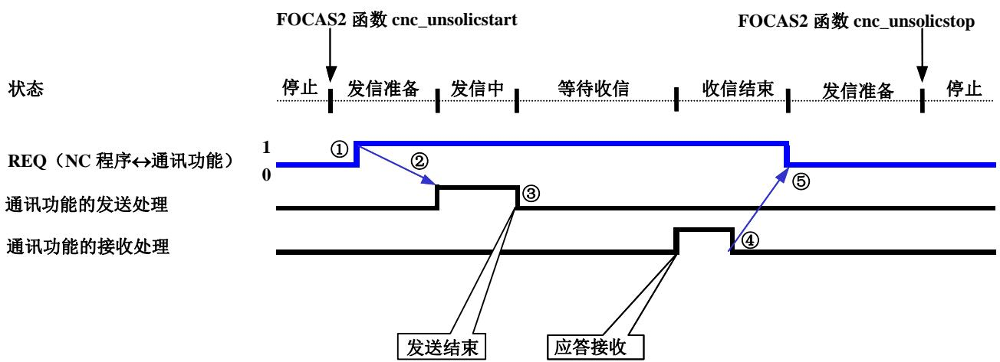

<details>
<summary>flowchart</summary>

```mermaid
graph TD
  A["状态"] --> B["FOCAS2 函数 cnc_unsolicstart"]
  B --> C["停止"]
  C --> D["发信准备"]
  D --> E["发信中"]
  E --> F["等待收信"]
  F --> G["收信结束"]
  G --> H["发信准备"]
  H --> I["停止"]
  I --> J["FOCAS2 函数 cnc_unsolicstop"]
    
  K["REQ (NC 程序↔通讯功能)"] --> L["通讯功能的发送处理"]
  L --> M["通讯功能的接收处理"]
    
  N["① 发送结束"] --> O["②"]
  O --> P["③"]
  P --> Q["④"]
  Q --> R["⑤"]
  R --> S["⑥"]
```
</details>

① NC 程序确认 REQ 为 “0” 后，准备信息，将 REQ 置于 “1”。  
② REQ 为 “1”，因此通讯功能发送信息。  
③ 通讯功能完成信息发送处理。  
④ 通讯功能接收信息应答后，完成接收处理。  
⑤ 通讯功能已完成接收处理，所以将 REQ 置于 “0”。

## 注释

有关 “状态” 的详情，请参阅 “方式的选择” 项显示项目。

## 使用控制用宏变量时的示例

下面示出使用控制用宏变量时的示例。

○使用例

[内容]

CNC 路径号码 1 的 NC 程序中，将任意的 NC 指令开始的年月日、以及时刻作为 CNC 主导信息通知电脑。

[设定]

作为控制用宏变量，使用非保持型RTM变量号码#0(REQ)。另一方面，作为发送用宏变量，使用在CNC内受到管理的年月日、以及时刻(系统变量号码#3011, #3012)。


### PMC报警: 
- **故障内容**: 种类
- **处理办法**: 3

### PMC报警: 
- **故障内容**: 种类
- **处理办法**: 3


[NC 程序例]

由 RTM 的规格，与紧之后的 NC 指令同步地执行 RTM。此时，不会影响到紧之后的 NC 指令的动作时机。因此，如下所示的 NC 程序的情况下，将 NC 指令 2 开始的年月日、以及时刻作为 CNC 主导信息通知电脑。

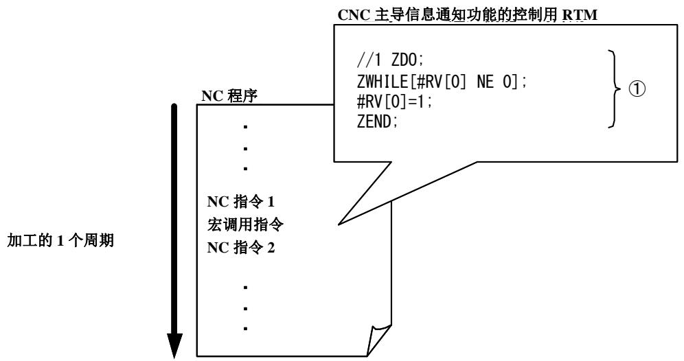

<details>
<summary>flowchart</summary>

```mermaid
graph TD
  A["加工的1个周期"] --> B["NC程序"]
  B --> C["NC指令1"]
  C --> D["宏调用指令"]
  D --> E["NC指令2"]
  E --> F["..."]
  G["CNC主导信息通知功能的控制用RTM"] --> H["/1 ZDO; ZWHILE[#RV[0"] NE 0]; #RV["0"]=1; ZEND; }①]
```
</details>

(参考) 例中的①，对应前述的时间图的号码。

## 注释

1 作为控制用宏使用用户宏的情况下，注意会影响到 NC 指令的动作时机。譬如，通过用户宏来替换前述的控制用 RTM 的示例时，只要控制用宏变量不变化，就不再执行 NC 指令 2。  
2 有关用户宏、以及RTM的详情，请参阅车床系统/加工中心系统操作说明书(B-64604CM)。

## 7.2.6.7 相关的NC参数


### PMC报警: 
- **故障内容**: #7
- **处理办法**: #6

### PMC报警: 14880
- **故障内容**: 
- **处理办法**: 


[输入类型] 参数输入

[数据类型] 位型

#4 UNM 是否在内置以太网端口使用 CNC 主导消息通知功能

0: 不使用。

1: 使用。

注释

设定了该参数时，需要切断电源或者重新启动嵌入式以太网。


### PMC报警: 
- **故障内容**: #7
- **处理办法**: #6

### PMC报警: 14882
- **故障内容**: 
- **处理办法**: 


[输入类型] 参数输入

[数据类型] 位型

#4 UNS 内置以太网端口上的 CNC 主导消息通知功能中，从连接中的 CNC 主导消息服务器以外的服务器指定了 CNC 主导消息通知功能结束时，

0: 拒绝结束。

1: 同意结束。

注释

在改变此参数时，需要切断电源或者重新启动嵌入式以太网。

## 7.2.7 设定CNC画面Web服务器功能

下面就嵌入式以太网功能中，用来使 CNC 画面 Web 服务器功能动作的所需设定进行说明。

## 7.2.7.1 概述

这里就 CNC 画面 Web 服务器功能的概述以及执行步骤进行说明。

## CNC 画面 Web 服务器功能的概述

这里就 CNC 画面 Web 服务器功能的概述进行说明。

可以在 CNC 上通过以太网连接的便携式终端的 Web 浏览器上，进行 CNC 画面的显示和切换。

Web 浏览器上，直接显示在 CNC 标准显示器上显示的画面。

此外，在 Web 浏览器上进行的画面切换，也会被反映到 CNC 标准显示器中。

要使用本功能，需要有 “CNC 画面 Web 服务器功能” 的 CNC 软件选项。

## 注释

1 本功能只可以进行 CNC 画面的显示和 CNC 画面的切换。无法进行数据输入输出操作等。  
2 无法取代 CNC 标准显示器而使用便携式终端。  
3 也可以在电脑的 Web 浏览器上进行连接。  
4 根据便携式终端以及 Web 浏览器，动作会有所差异。  
5 Web 浏览器上显示的画面的更新周期，慢于 CNC 标准显示器。

此外，在如下情况下将会更慢。

- 多轴多路径等 CPU 负荷较大的系统配置  
- 微小程序段的程序运行等 CPU 负荷较大的运行状态  
- CNC 与便携式终端的通信状态较差的环境


## 警告

请勿在画面上进行基于虚拟 MDI 键盘和软键的数据输入、机床制造商所创建的机床操作面板画面等、与机床的动作相联的操作。根据通信状态，会出现画面上的按钮被按下的状态持续、和即使松开按钮反应也变得缓慢的现象，因而有可能引起预料外的机械动作，或导致刀具和机械以及工件破损、或者致使人员受伤。

因此，在基于本功能的连接中，要监视 Web 浏览器连接状态信号 WBCNT<F0578.2>，采取措施禁止数据的输入和从画面进行的操作。

## CNC 画面 Web 服务器功能的连接形态

便携式终端和 CNC，使用嵌入式以太网和无线 LAN 设备进行连接。

便携式终端和无线 LAN 设备的连接方法，请参照各设备的说明书。

在便携式终端上启动 Web 浏览器，输入 URI，与 CNC 连接。

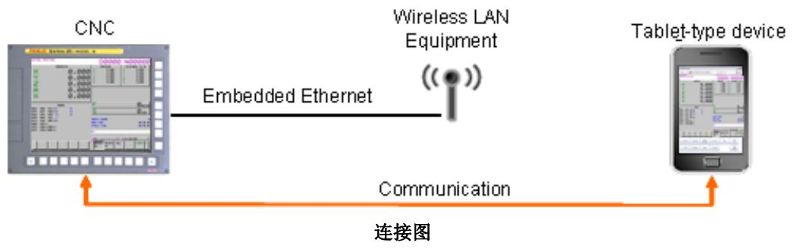

<details>
<summary>flowchart</summary>

```mermaid
graph LR
  A["CNC"] -->|Embedded Ethernet| B["Wireless LAN Equipment"]
  B --> C["Tablet-type device"]
  C -->|Communication| A
    style A fill:#f9f,stroke:#333
    style B fill:#ccf,stroke:#333
    style C fill:#cfc,stroke:#333
```
</details>

## 注释

1 无法从多个便携式终端同时连接。只有可以连接最初的便携式终端。  
2 使用 CNC 画面显示功能在电脑上显示 CNC 画面期间，无法通过本功能进行连接。

可以与便携式终端连接 CNC 如下表所示。

表7.2.7.1 (a) 可连接 CNC 显示器


## 注释

1 利用本功能在 CNC 与便携式终端连接中，根据 CNC 的系统配置和运转状态，CNC 画面的更新有时会暂停。但是，对于 CNC 的自动运行则没有影响。  
2 i Pendant 连接中，无法使用本功能。  
3 PCMCIA 以太网卡上无法使用本功能。

## 7.2.7.2 设定WEB SERVER功能

这里就为了使 CNC 画面 Web 服务器功能动作的 WEB SERVER 功能设定进行说明。

## 步骤

1 参考后述的 “相关的参数”，将 CNC 画面 Web 服务器功能设定为有效。  
2 启动 CNC，按下功能键 SYSTEM。  
3 显示软键 [内藏口]。（没有软键时请按下继续菜单键。）  
4 按下软键 [内藏口]，显示用于内置以太网端口的“以太网设定画面”。  
5 按下软键 [WEB]，显示 WEB SERVER 设定画面。（没有软键 [WEB] 时请按下继续菜单键。）  
6 设定各项目后，重新启动嵌入式以太网。

## WEB SERVER 设定画面

按下软键 [WEB]，显示 WEB SERVER 设定画面。

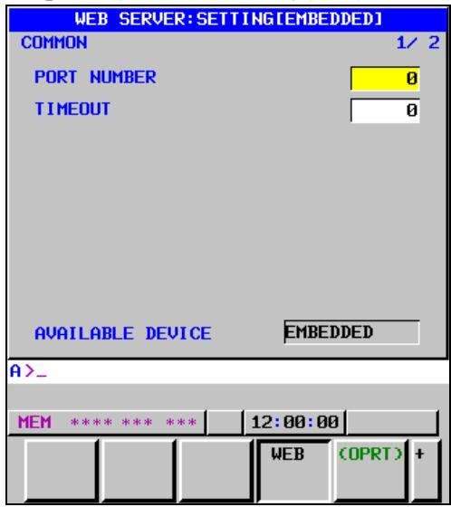

<details>
<summary>text_image</summary>

WEB SERVER:SETTING[EMBEDDED]
COMMON
1/ 2
PORT NUMBER
0
TIMEOUT
0
AVAILABLE DEVICE
EMBEDDED
A >_
MEM **** **** ***
12:00:00
WEB (OPRT) +
+
</details>

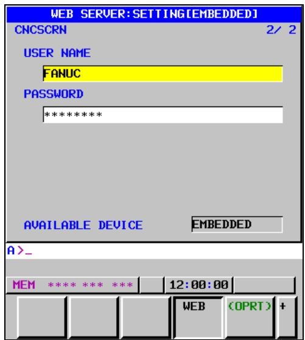

<details>
<summary>text_image</summary>

WEB SERVER: SETTING[EMBEDDED]
CNCSCRN 2/2
USER NAME
FANUC
PASSWORD
**********
AVAILABLE DEVICE EMBEDDED
A >_
MEM **** *** 12:00:00
WEB (OPRT) +
</details>

WEB SERVER 设定画面

设定项目


## 7.2.7.3 CNC画面Web服务器功能的操作

这里就 CNC 画面 Web 服务器功能的操作方法进行说明。

## 启动 CNC 画面 Web 服务器功能

## 步骤

1 接通 CNC 的电源。  
2 等待 CNC 的启动完成。  
3 在便携式终端上启动 Web 浏览器，输入 URI(Uniform Resource Identifier) “http://<IP 地址>(:端口号)]/cncscrn/”。最后的“/”不能省略。

（例 1）IP 地址(192.168.1.1)、端口号(0 或者 80)的情形

在地址条中输入 “http://192.168.1.1/cncscrn/”。


输入例1

（例 2）IP 地址(192.168.1.1)、Web 浏览器连接用端口号(8501)的情形

在地址条中输入 “http://192.168.1.1:8501/cncscrn/”。


<details>
<summary>text_image</summary>

http://192.168.1.1:8501/cncscrn/|
</details>

输入例2

4 显示登入画面，输入用户名和密码，按下[login]按钮。


<details>
<summary>text_image</summary>

User Certification
USER NAME : FANUC
PASSWORD : ..........
login
</details>

登入画面

## 注释

1 Web 浏览器连接禁止信号 WBEND<G0579.5>为“1”时，显示错误“Access Denied : Forbidden by signal”。  
2 Web 浏览器连接状态信号 WBCNT<F0578.2>为“1”时，显示错误“Access Denied: Doubly access”。  
3 参数 WAL(No.14882#6)为 0，连续 5 次登入失败时，在重新接通 CNC 的电源之前，将无法继续使用 CNC 画面 Web 服务器功能。

5 Web 浏览器上显示 CNC 画面。

Web 浏览器连接状态信号 WBCNT<F0578.2>成为"1"。

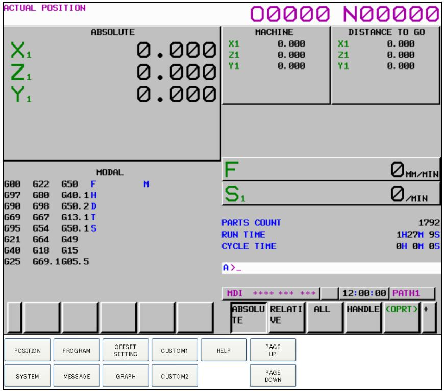

<details>
<summary>text_image</summary>

ACTUAL POSITION
00000 N00000
ABSOLUTE
X1 0.000
Z1 0.000
Y1 0.000
MACHINE
X1 0.000
Z1 0.000
Y1 0.000
DISTANCE TO GO
X1 0.000
Z1 0.000
Y1 0.000
MODAL
G00 G22 G50 F M
G97 G88 G48.1 H
G90 G98 G50.2 D
G69 G67 G13.1 T
G95 G54 G50.1 S
G21 G64 G49
G40 G18 G15
G25 G69.1 G05.5
F 0 MM/MIN
S1 0 /MIN
PARTS COUNT 1792
RUN TIME 1H2?M 9S
CYCLE TIME 0H 0M 0S
A >_
MDI **** *** ***
12:00:00 PATH1
ABSOLU TE RELATI VE ALL HANDLE (OPRT) +
POSITION PROGRAM OFFSET CUSTOM1 HELP PAGE UP
SYSTEM MESSAGE GRAPH CUSTOM2 PAGE DOWN
</details>

Web 浏览器上的 CNC 画面

## 注释

画面的更新周期相比 CNC 的标准显示器变得缓慢。

## 结束 CNC 画面 Web 服务器功能

与 CNC 的通信，在如下任何一种情况下结束。

- 结束了便携式终端的 Web 浏览器时  
- CNC 与便携式终端的连接被切断时  
- 将 Web 浏览器连接禁止信号 WBEND<G0579.5>设定为"1"时  
- 使用 CNC 画面显示功能在电脑上显示 CNC 画面时

经过了 WEB SERVER 设定画面上所指定的限时时间后，Web 浏览器连接状态信号 WBCNT<F0578.2>成为"0"。

要再连接时，在确认 Web 浏览器连接状态信号 WBCNT<F0578.2>已成为"0"后，执行“启动 CNC 画面 Web 服务器功能”的步骤 3。

## 注释

即使在与 CNC 的通信结束，Web 浏览器连接状态信号 WBCNT<F0578.2>为 “1” 期间，也无法进行基于 CNC 的 MDI 键以及触摸板的操作。无法操作的时间，最长为限时时间中设定的时间。

## Web 浏览器上的操作方法

这里就 Web 浏览器上的操作方法进行说明。

## 注释

Web 浏览器上连接中，无法进行基于 CNC 的 MDI 键的操作以及基于触摸板的操作。但是，CNC 的复位键以及外部键输入始终有效。

## 基于按钮的操作

功能键以及帮助键、翻页键以按钮方式显示。

若按下这些按钮，CNC 画面将根据各键而被切换。


<details>
<summary>flowchart</summary>

```mermaid
graph LR
  A["POSITION"] --> B["PROGRAM"]
  B --> C["OFFSET SETTING"]
  C --> D["CUSTOM1"]
  D --> E["HELP"]
  E --> F["PAGE UP"]
  G["SYSTEM"] --> H["MESSAGE"]
  H --> I["GRAPH"]
  I --> J["CUSTOM2"]
  J --> K["PAGE DOWN"]
```
</details>

Web 浏览器的按钮

## 注释

上述以外的键（地址和数字、记号等）无法输入。

## 基于触摸屏的操作

轻击 可以按下 CNC 画面上的软键和按钮。

通过按下功能键和翻页键，即可进行基于各键的 CNC 操作。

双击 调整 CNC 画面，以适合终端的画面尺寸。

捏放/捏挤 进行 CNC 画面的缩放。捏放操作画面将会放大，捏挤操作画面将会缩小。

有关各操作的说明，请参阅便携式终端的说明书。

## 注释

1 在机床制造商通过 C 语言执行器所创建的画面上执行轻击操作，必须对应基于触摸板的操作。  
2 捏放/捏挤的操作中，与 CNC 的通信有时会被中断。在经过限时时间所设定的时间后，CNC 与便携式终端的通信将会被切断。

## 基于本体朝向的操作

通过改变便携式终端本体的纵/横朝向，就会自动切换显示器的显示方向。

## CNC 数据的外部输入输出

在操作 Web 浏览器上的 CNC 进行数据的外部输入输出，作为输入输出对象的数据将被按照 CNC 的设定，在 CNC 一侧执行输入输出。

无法在 Web 浏览器一侧输入或输出数据。

## 显示语言

Web 浏览器的标题和按钮以英文的方式显示。

## 注释

CNC 画面的显示语言，按照 CNC 的设定而显示。

## 显示画面的种类

Web 浏览器上所显示的 CNC 的画面，是与 CNC 上所显示的画面相同的画面。无法显示与 CNC 不同尺寸和种类的画面。

## 注释

1 无法显示 CNC 的 BOOT 画面以及 IPL 画面。  
2 CNC 上发生系统报警时，便携式终端的连接将会被切断。Web 浏览器上不会显示系统报警画面。

## 7.2.7.4 相关的信号

## 信号

## Web 浏览器连接禁止信号 WBEND<G0579.5>

[分类] 输入信号

[功能] 禁止基于 Web 浏览器的连接。

[操作] "0"时，允许基于Web浏览器的连接。

"1"时，禁止基于Web浏览器的连接。Web浏览器连接中，切断连接。

## Web 浏览器连接状态信号 WBCNT<F0578.2>

[分类] 输出信号

[功能] 表示基于 Web 浏览器的连接状态。

[输出条件] 已通过 Web 浏览器连接时，成为"1"。

尚未通过 Web 浏览器连接时，成为"0"。

## 注释

有关基于虚拟 MDI 键和软键的数据输入、机床制造商所创建的机床操作面板画面等与机械的动作相联的操作，要采取措施监视本信号并禁止操作。

信号地址


### PMC报警: 
- **故障内容**: #7
- **处理办法**: #6

### PMC报警: G0579
- **故障内容**: 
- **处理办法**: 

### PMC报警: 
- **故障内容**: #7
- **处理办法**: #6

### PMC报警: F0578
- **故障内容**: 
- **处理办法**: 


## 7.2.7.5 相关的参数


### PMC报警: 
- **故障内容**: #7
- **处理办法**: #6

### PMC报警: 11373
- **故障内容**: WSE
- **处理办法**: 


[输入类型] 参数输入

[数据类型] 位型

## 注释

在设定完此参数后，需要暂时切断电源。

#7 WSE 是否使用 CNC 画面 Web 服务器功能

0: 不予使用。

1: 予以使用。


### PMC报警: 
- **故障内容**: #7
- **处理办法**: #6

### PMC报警: 14882
- **故障内容**: 
- **处理办法**: WAL


[输入类型] 参数输入

[数据类型] 位型

## 注释

在设定完此参数后，需要暂时切断电源。

#6 WAL CNC 画面 Web 服务器功能中，登入连续 5 次失败时，可否继续使用功能

0: 无法使用。

1: 可以使用。

## 注释

无法再使用 CNC 画面 Web 服务器功能时，请重新接通 CNC 的电源。

## 7.2.8 CNC状态通知功能

下面就嵌入式以太网功能中，用来使 CNC 状态通知功能动作的所需设定进行说明。

## 7.2.8.1 概述

即使不在机床前面，作为了解报警发生的方法，备有 CNC 状态通知功能。

CNC 状态通知功能，可经由嵌入式以太网，向便携式终端和电脑的邮件软件通知记载有 CNC 的状态（譬如，报警号和报警信息）的电子邮件。

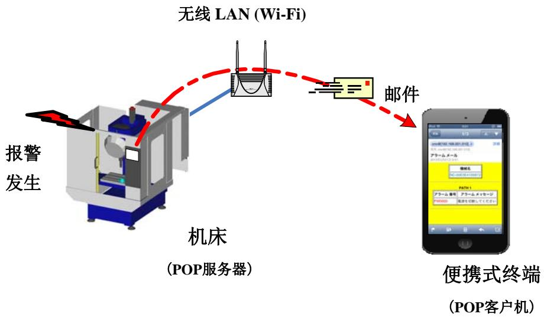

<details>
<summary>flowchart</summary>

```mermaid
graph TD
  A["无线 LAN (Wi-Fi)"] --> B["报警发生"]
  B --> C["机床 (POP服务器)"]
  C --> D["邮件"]
  D --> E["便携式终端 (POP客户机)"]
```
</details>

## 注释

1 要使用本功能，需要有 “CNC 状态通知功能” （R975）的软件选项。  
2 本功能在嵌入式以太网的内置端口中动作。在 PCMCIA LAN 卡上不会动作。  
3 为了发送电子邮件，本功能在中途不使用邮件服务器因此，限于在公司内部 LAN 的网络内使用。无法向因特网邮件那样的外部设备发送电子邮件。  
4 本功能，由便携式终端的邮件软件从 CNC 读出电子邮件。因此，电子邮件会在便携式终端的邮件软件获取的时机被读出。  
5 上图所示为无线 LAN 上与便携式终端通信的情况，但是也可以使电脑与有线 LAN 进行通信而使用。  
6 本功能不是利用手机网络的短讯。  
因此，不能连接无线 LAN 的手机等将无法使用。

## 7.2.8.2 电子邮件的内容

通知 CNC 状态的电子邮件将被发送到便携式终端和电脑的邮件软件中。

电子邮件包括两种，“报警邮件”和“状态邮件”。

此外，CNC 画面的显示语言，在日文、英文、中文简体体字的情况下，邮件的标题以及各项目名以各自的语言予以显示。

其他语言的情况下，邮件的标题和及各项目名则以英文显示。

## 报警邮件

报警邮件，通知 CNC 的报警状态。

报警邮件被创建的时机如下所示。

① 新发生报警时  
② 报警消除时  
③ 报警的发生个数发生了变化时

发生过个报警时，通过一封报警邮件通知多个报警。

一封报警邮件中包含的报警个数最多为 10 个，10 个以上的报警不予通知。

被通知的报警顺序，为在 CNC 的报警画面显示的顺序。

另外，多路径 CNC 的情况下，按照从第一路径开始的顺序获取报警。因此，第一路径发生 10 个以上的报警时，在第二路径以后的路径中发生的报警将不予通知。

此外，CNC 画面的显示语言为日文、英文、中文简体字的情况下，还可以通知报警信息。

其他语言的情况下，只通知报警号。

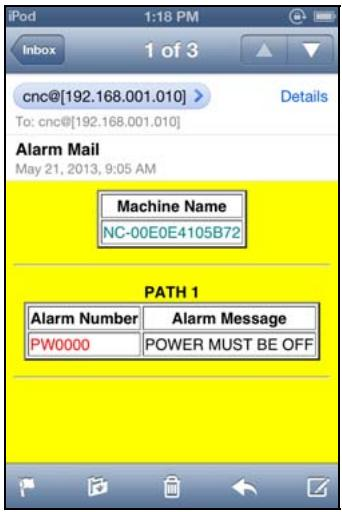

<details>
<summary>text_image</summary>

cnc@[192.168.001.010] > Details
To: cnc@[192.168.001.010]
Alarm Mail
May 21, 2013, 9:05 AM
Machine Name
NC-00E0E4105B72
PATH 1
Alarm Number Alarm Message
PW0000 POWER MUST BE OFF
</details>

报警发生的情形

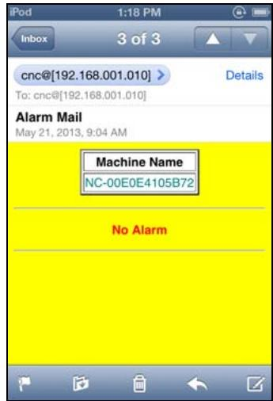

<details>
<summary>text_image</summary>

cnc@[192.168.001.010] >
To: cnc@[192.168.001.010]
Alarm Mail
May 21, 2013, 9:04 AM
Machine Name
NC-00E0E4105B72
No Alarm
</details>

报警消除的情形  
报警邮件

## 注释

发生以下报警时，通过电子邮件通知报警状态。

- PS/BG/SR/SW/SV/OT/IO/PW/SP/OH/DS/IE 的各报警  
- 外部报警信息（EX 报警）  
- 用户宏变量#3000的宏报警信息（MC报警）

## 状态邮件

状态子邮件，在参数 SNP（No.14884#5）为 1 时，通知加工部件总数、加工部件数、所需部件数的计数器值。

状态邮件被创建的时机如下所示。

① 加工部件数的计数器值发生变化时

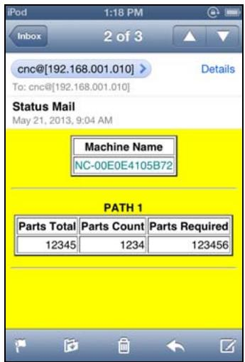

<details>
<summary>text_image</summary>

cnc@[192.168.001.010] > Details
To: cnc@[192.168.001.010]
Status Mail
May 21, 2013, 9:04 AM
Machine Name
NC-00E0E4105B72
PATH 1
Parts Total Parts Count Parts Required
12345 1234 123456
</details>

状态邮件

## 注释

即使是在多路径 CNC 的情况下，也只通知第一路径的加工部件总数、加工部件数、所要部件数。

第二路径以后的路径中即使加工部件数发生变化也不予通知。

## 7.2.8.3 与CNC画面Web服务器功能协同运行

CNC 画面 Web 服务器功能有效时，邮件内容包含有 CNC 画面 Web 服务器功能的 URI（CNC screen），若点击该 URI，Web 浏览器上就可显示 CNC 画面。

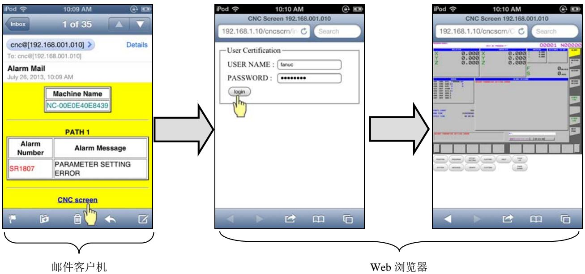

<details>
<summary>flowchart</summary>

```mermaid
graph LR
  A["邮件客户机"] --> B["CNC Screen 10:10 AM"]
  B --> C["Web 浏览器"]
    subgraph sg["邮件客户机"]
        D["Machine Name NC-00E0E40E8439"]
        E["PATH 1"]
        F["Alarm Number"]
        G["Alarm Message"]
        H["SR1807"]
        I["PARAMETER SETTING ERROR"]
        J["CNC screen"]
    end

    subgraph Web 浏览器
        K["User Certification USER NAME : fanuc PASSWORD : ********* login"]
    end

  D --> L["CNC Screen 10:10 AM"]
  L --> M["10:10 AM"]

    style A fill:#FFD700,stroke:#333
    style B fill:#FFD700,stroke:#333
    style C fill:#FFD700,stroke:#333
    style D fill:#FFD700,stroke:#333
    style E fill:#FFD700,stroke:#333
    style F fill:#FFD700,stroke:#333
    style G fill:#FFD700,stroke:#333
    style H fill:#FFD700,stroke:#333
    style I fill:#FFD700,stroke:#333
    style J fill:#FFD700,stroke:#333
```
</details>

与 CNC 画面 Web 服务器功能协同运行

## 注释

1 需要 CNC 画面 Web 服务器功能选项(R728)。  
2 有关 CNC 画面 Web 服务器功能的详情，请参阅 CNC 画面 Web 服务器功能的设定项。

## 7.2.8.4 设定CNC状态通知功能

这里就为了使 CNC 状态通知功能动作的 CNC 的设定进行说明。

关于便携式终端(POP 客户机)的设定，请参阅各便携式终端的手册、技术报告(A-94974)。

## 步骤

1 按下功能键 $\boxed{\text{SYSTEM}}$ 。

2 软键上显示出 [内藏口] （没有软键时请按下继续菜单键）。  
3 按下软键 [内藏口]，出现用于以太网设定画面。  
4 按下软键 [公共] 和 [MAIL]，在所显示的设定项目中输入参数。

## 共同画面（基本）

按下软键 [公共] 时，出现共同画面（基本）。


<details>
<summary>text_image</summary>

共同:设定[内置]
基本
1/2
MAC 地址
080019000001
IP 地址
192.168.0.100
子网掩码
255.255.255.0
路由器地址
192.168.0.253
DHCP CLIENT
0
设备有效	内置板
A>__
MEM STOP *** ***
12:00:00 PATH1
公共	FOCAS2	FTP
传送	(操作) +
</details>

共同画面（基本）

设定项目


显示项目


## 公共画面（详情）

按下软键 [公共]，若按下翻页键 $\boxed{\uparrow}$ PAGE $\boxed{\downarrow}$ ，则将显示公共画面（详情）。

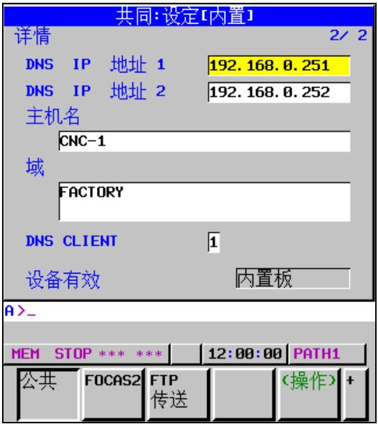

<details>
<summary>text_image</summary>

共同:设定[内置]
详情
2/2
DNS IP 地址 1 192.168.0.251
DNS IP 地址 2 192.168.0.252
主机名
CNC-1
域
FACTORY
DNS CLIENT 1
设备有效 内置板
A>__
MEM STOP *** ***
12:00:00 PATH1
公共 FOCAS2 FTP
传送 (操作) +
(操作)
</details>

公共画面（详情）

设定项目


## 邮件设定画面

按下软键 [MAIL]，显示邮件设定画面。

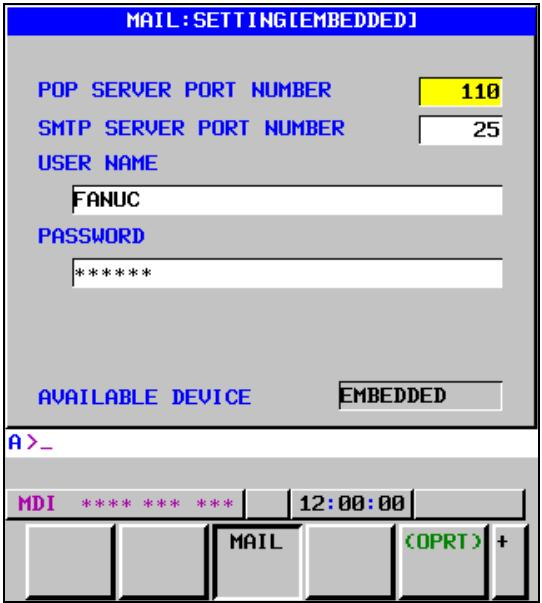

<details>
<summary>text_image</summary>

MAIL:SETTING[EMBEDDED]
POP SERVER PORT NUMBER 110
SMTP SERVER PORT NUMBER 25
USER NAME
FANUC
PASSWORD
********
AVAILABLE DEVICE EMBEDDED
A >_
MDI **** *** *** 12:00:00
MAIL (OPRT) +
</details>

邮件设定画面

设定项目


## 注释

1 SMTP实际上不使用，但是，根据作为连接目的地的便携式终端的邮件软件，在进行邮件帐号的设定时，有的情况要进行使用了SMTP协议的通信确认，并需要进行设定。  
2 为了登入到 CNC（POP 服务器），使得便携式终端（POP 客户机）的邮件帐号的用户名和密码与本设定保持一致。  
但是，CNC 的用户名、密码两者都没有设定时，CNC 不进行用户名以及密码的确认。因此，这种情况下，与便携式终端的用户名以及密码的设定无关，必定能够登入。

## 7.2.8.5 相关的NC参数


### PMC报警: 
- **故障内容**: #7
- **处理办法**: #6

### PMC报警: 14884
- **故障内容**: SNE
- **处理办法**: SNM


[输入类型] 参数输入

[数据类型] 位型

## 注释

在设定完此参数后，需要暂时切断电源。

#7 SNE 是否使用 CNC 状态通知功能

0: 不予使用。

1: 予以使用。

## 注释

若不设定本参数，CNC状态通知功能的设定参数等画面就不予显示。

#6 SNM CNC の显示语言为日文、英文、中文简体时，是否在通过 CNC 状态通知功能通知的报警邮件中包含报警信息

0: 包含。

1: 不包含。

## 注释

CNC 画面的显示语言为日文、英文、中文简体字以外的情况下，不包含报警信息而与本参数无关。只通知报警号。

#5 SNP 在通过 CNC 状态通知功能通知的状态邮件中是否包含加工部件总数、加工部件数、所需部件数

0: 不包含。

1: 包含。

#0 SNL CNC 状态通知功能中，连续 5 次登入失败时，是否可继续使用功能

0: 无法继续使用。

1: 可以使用。
## 注释

无法使用 CNC 状态通知功能时，请重新接通 CNC 的电源。

## 7.2.9 通信参数的备份/恢复

下面就为将嵌入式以太网的通信参数备份到存储卡或者 USB 存储器的操作以及恢复的操作进行说明。备份/恢复到存储卡或者 USB 存储器，通过 NC 参数 No.20 来设定。有关 USB 存储器的规格和限制事项，请参阅车床系统 / 加工中心系统通用操作说明书(B-64604CM)的 “USB 功能”。

1 按下功能键 ▶ SYSTEM。

2. 软键上显示出 [内藏口] 和 [PCMCIA 卡] （没有软键时请按下继续菜单键）。  
3. 按下软键 [内藏口]，出现用于内置以太网端口的 “以太网设定画面”。按下 [PCMCIA 卡] 时，出现用于 PCMCIA 以太网卡的 “以太网设定画面”。  
4. 按下软键 [公共] — [(操作)] 之后，按下软键 [+ ] 时，如下所示显示通信参数的备份 / 恢复用的软键 [备份]、[恢复]、[全备份]、[全恢复]。  
5. 按下软键 [备份]、[恢复]、[全备份]、[全恢复] 的其中一个软键时，显示软键 [执行]、[取消]。  
6. 把将要备份或者恢复的文件名输入键入缓冲区，按下软键 [执行] 时，执行各自的操作。执行过程中，闪烁显示 “执行中”。

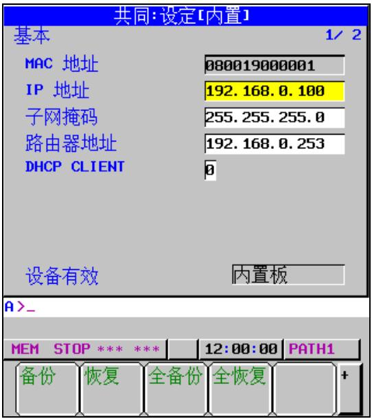

<details>
<summary>text_image</summary>

共同:设定[内置]
基本
1/2
MAC 地址
080019000001
IP 地址
192.168.0.100
子网掩码
255.255.255.0
路由器地址
192.168.0.253
DHCP CLIENT
0
设备有效	内置板
A>__
MEM STOP *** ***
12:00:00 PATH1
备份	恢复	全备份	全恢复	+
</details>

## 备份

将保存在 CNC 主体的 SRAM 内的嵌入式以太网的通信参数保存到存储卡中。

另外，在键入缓冲区中已经指定了文件名的情况下，以所指定的文件名保存到存储卡等中。尚未指定文件名的情况下，使用 “EMBETHER.MEM” 这一文件名。

## 恢复

读出保存在存储卡等中的嵌入式以太网的通信参数，保存到 CNC 主体的 SRAM 中。

另外，键入缓冲区中已经指定了文件名的情况下，从存储卡等中读出所指定的文件名，尚未指定文件名的情况下，使用“EMBETHER.MEM”这一文件名。

## 全备份

将保存在 CNC 主体的 SRAM 内的嵌入式以太网、快速以太网/快速数据服务器、PROFIBUS-DP 主控/从控装置、DeviceNet 主控/从控装置、FL-net、CC-Link 遥控设备、EtherNet/IP 扫描仪/适配器、Modbus/TCP 服务器、PROFINET IO 控制器/IO 设备的有效的全部通信参数保存到存储卡中。

另外，在键入缓冲区中已经指定了文件名的情况下，以所指定的文件名保存到存储卡等中。尚未指定文件名的情况下，使用 “NETWORK.MEM” 这一文件名。

## 全恢复

读出保存在存储卡等内的嵌入式以太网、快速以太网/快速数据服务器、PROFIBUS-DP 主控/从控装置、DeviceNet 主控/从控装置、FL-net、CC-Link 遥控设备、EtherNet/IP 扫描仪/适配器、Modbus/TCP 服务器、PROFINET IO 控制器/IO 设备的有效的全部通信参数，保存到 CNC 主体的 SRAM 中。

但是，相对于有效参数的通信功能在 CNC 一侧无效的情况下，该部分的通信参数不会被保存到 SRAM 中。

另外，键入缓冲区中已经指定了文件名的情况下，从存储卡等中读出所指定的文件名，尚未指定文件名的情况下，使用“NETWORK.MEM”这一文件名。


## 注意

在向存储卡和USB存储器等外部I/O设备存取期间，请勿切断CNC的电源或拆除外部I/O设备。否则将会损坏外部I/O设备。

## 注释

1 通信参数的备份/恢复，只有在 MDI 方式、EDIT 方式或者紧急停止时才可以进行操作。  
2 执行通信参数的恢复时，成为要求切断电源的报警状态。

## 相关的 NC 参数

0020

I/O CHANNEL : I/O 设备的选择或者前台用输入设备的接口编号

[输入类型] 设定输入

[数据类型] 字节型

[数据范围] 4：作为输入 / 输出设备选择存储卡。  
17: 作为输入 / 输出设备选择 USB 存储器。  
无法使用上述以外的 I/O 设备进行通信参数的备份/恢复。

## 7.3 变更嵌入式以太网的设备

嵌入式以太网有两种：内置以太网端口和 PCMCIA 以太网卡。

要切换这两种设备，需要进行画面操作。

## 步骤

1 按下功能键 SYSTEM。

2 软键上显示 [内藏口] 和 [PCMCIA 卡]。（没有软键时，按下继续菜单键。）

3 按下软键 [内藏口] 或者 [PCMCIA 卡]，再按下软键 [公共]，接着按下 [(操作)]，显示软键 [内嵌/PCMCIA]。

4 每次按下软键 [内嵌/PCMCIA]，即切换有效的设备。

## 注释

1 已经切换的设备信息被存储在非易失性存储器中。  
因此，下次接通电源时，可以原封不动地利用上次所选的设备。

2 使用 CNC 主导信息通知功能时，要注意如下几点。

- 不管 CNC 主导信息的发送状态如何，都强制地从状态“停止”开始。  
- 控制用参数为应答通知方式时，向梯形程序通知 RES、以及 RES\_CODE(0x01)。  
- 控制用参数为简易方式时，清除REQ。

## 7.4 嵌入式以太网的操作

## 7.4.1 FTP文件传输功能

下面就 FTP 文件传输功能的操作进行说明。

## 主机文件列表显示

显示出主机文件列表。

## 步骤

1 按下功能键 SYSTEM。

2 按下软键 [目录]，出现程序目录画面。（没有出现软键时，按下继续菜单键。）

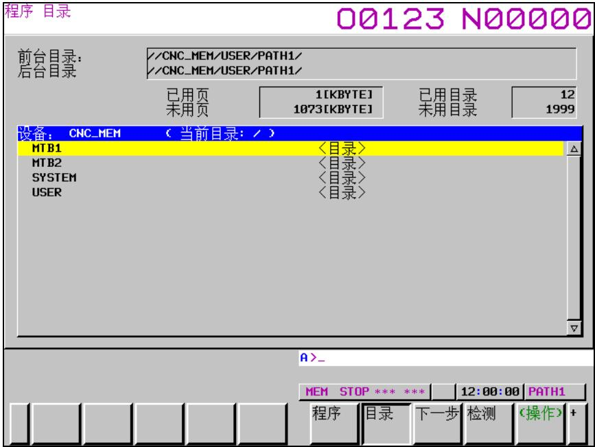

<details>
<summary>text_image</summary>

程序 目录
00123 N00000
前台目录: /CNC_MEM/USER/PATH1/
后台目录: /CNC_MEM/USER/PATH1/
已用页 1[KBYTE] 已用目录 12
未用页 1073[KBYTE] 未用目录 1999
设备: CNC_MEM (当前目录: /)
MTB1 <目录>
MTB2 <目录>
SYSTEM <目录>
USER <目录>
A>_ 
MEM STOP *** *** 12:00:00 PATH1
程序 目录 下一步 检测 <操作>
+
</details>

3 按下软键 [ (操作) ]，再按下软键 [ 设备选择 ]，显示可以选择设备的软键。


<details>
<summary>text_image</summary>

< CNC
MEM 存储卡 内置以太网 DTSUR DTSUR主机 USB内存
</details>

4 按下软键 [内置以太网]，程序目录画面改变为主计算机的硬盘内容（内嵌以太网主机文件列表画面），这样就可对文件进行操作。

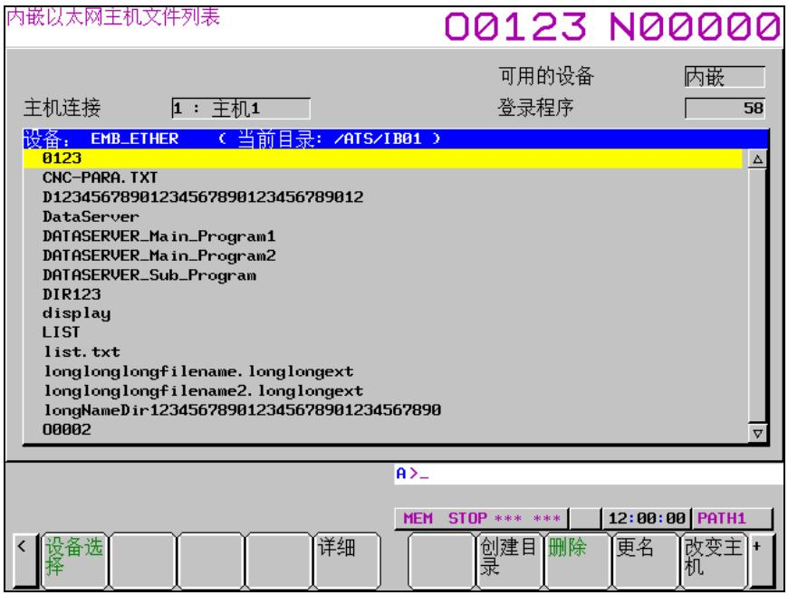

<details>
<summary>text_image</summary>

内嵌以太网主机文件列表
00123 N00000
主机连接 1 : 主机1 可用的设备 内嵌
登录程序 58
设备: EMB_ETHER ( 当前目录: /ATS/IB01 )
0123
CNC-PARA.TXT
D12345678901234567890123456789012
DataServer
DATASERVER_Main_Program1
DATASERVER_Main_Program2
DATASERVER_Sub_Program
DIR123
display
LIST
list.txt
longlonglongfilename.longlongext
longlonglongfilename2.longlongext
longNameDir123456789012345678901234567890
00002
A >_
MEM STOP *** 12:00:00 PATH1
< 设备选 择 详细 创建目 录 删除 更名 改变主 机 +
</details>

内嵌以太网主机文件列表画面

## 注释

1 使用 FTP 文件传输功能时，确认有效的设备为内置以太网端口。

“主机文件列表画面”的连接目的地由下列2个条件决定。

(1) 确认可用的设备为内置以太网端口。选择通过以太网设定画面的“设备选择”进行。  
(2) 可以从连接 1、2、3 中选择主机。请按照本节后述的“选择连接主计算机”进行选择。

2 不能正确显示包含汉字、日文平假名和片假名的文件名。

5 文件列表不能全部显示在 1 页中时，可通过翻页键 PAGE PAG切换画面。

## 显示项目

## 设备有效

显示当前所选的任一设备。

确认已经选定内置以太网端口。

## 主机连接

显示当前连接的主机的主机号码。

## 登录程序

显示记录在当前连接的主计算机的文件夹中的文件数。

## 设备

显示当前的设备。在选择嵌入式以太网的主计算机文件列表时，显示“EMB\_ETHER”。

## 当前目录

显示当前的主计算机内的作业文件夹。

## 文件列表

显示主计算机内的文件和文件夹信息。

## 操作列表

## 设备选择

可以选择程序目录画面上的设备。选择嵌入式以太网的主机文件列表时，按下软键 [内置以太网]。

## 概略 / 详细

将文件列表的内容切换到概略显示或详细显示。

## 创建目录

在当前的作业文件夹下新建子文件夹。

## 删除

删除文件或文件夹。

## 更名

改变文件名或文件夹名。

## 改变主机

改变连接目的地的主计算机。

## 检索

在当前文件夹内查找文件。

## 更新

刷新以太网的主机文件列表画面的显示内容。

## 7.4.1.1 显示和操作文件列表

## 更新、概略、详细

刷新文件列表的内容，切换显示内容。

1 按下软键 [更新]，刷新文件列表的内容。  
2 按下软键 [概略]，仅显示文件名。  
3 按下软键 [详细]，显示出文件属性、大小、日期、文件名。

## 注释

详细显示中所显示的内容，随主计算机一侧的FTP服务器的设定而定。

## 移动文件夹

移动文件夹。

1 利用光标键 ↓ ↑ ，选择希望移动的文件夹。  
2 按下 MDI 键 [INPUT]。

## 创建目录

新建文件夹。

1 移动到希望新建文件夹的文件夹位置。  
2 輸入文件夹名称。  
3 按下软键 [创建目录]。

## 删除

删除文件或文件夹。

1 利用光标键 ↓ ↑ 选择希望删除的文件或者文件夹。

2 按下软键 [删除]。

- 执行删除操作时，按下软键 [执行]。  
- 取消操作时，按下软键 [取消]。

## 删除（多个文件）

一次性删除多个文件。

1 按下软键 [选择开始]。

2 利用光标键 ↓ ↑ 选择希望删除的文件。

3 按下软键 [选择]。

所选文件反相显示。

对于希望删除的文件，重复 2 和 3 的操作。

4 按下软键 [删除]。

- 执行删除操作时，按下软键 [执行]。  
- 取消操作时，按下软键 [取消]。

## 注释

一次可以选择的文件数最多为 10 个文件。

## 更名

改变文件或文件夹名。

1 利用光标键 ↓ ↑ 选择希望改名的文件。

2 键入新的文件名或者文件夹名。

3 按下软键 [更名]。

## 检索

在当前的作业文件夹中查找文件。

1 输入文件名。  
2 按下软键 [检索]。

## 改变主机

改变连接的主计算机。

1 按下软键 [改变主机]。
连接主计算机号，按照 $1 \rightarrow 2 \rightarrow 3 \rightarrow 1$ 的顺序改变。

## 7.5 嵌入式以太网的再启动

可以再启动嵌入式以太网的通信。

## 步骤

1 按下功能键 SYSTEM。

2 软键上显示 [内藏口] 和 [PCMCIA 卡]。（没有软键时，按下继续菜单键。）  
3 按下软键 [内藏口] 或者 [PCMCIA 卡]，再按下软键 [公共]，接着按下 [(操作)]，显示出软键 [再起动]。  
4 按下软件 [再起动]，在复位嵌入式以太网的通信处理之后，重新启动。

## 注释

1 按下软件 [再起动] 时，即使存在正在执行中的通信处理，系统也将被强制中断。  
2 本功能是基于软件执行的再启动操作。因此，根据条件，有的情况下不能再启动。  
3 使用 CNC 主导信息通知功能时，要注意如下几点。

\- 不管 CNC 主导信息的发送状态如何，都强制地从状态“停止”开始。

\- 控制用参数为应答通知方式时，向梯形程序通知 RES、以及 RES\_CODE(0x01)。

\- 控制用参数为简易方式时，清除REQ。

## 7.6 嵌入式以太网的维护画面

嵌入式以太网功能备有专用的维护画面。

可以在维护画面上进行嵌入式以太网功能的操作检查等。

## PING 画面的显示和操作

## 步骤

1 按下功能键 SYSTEM。

2 软键上显示 [内藏口] 和 [PCMCIA 卡]。（没有软键时，按下继续菜单键。）  
3 按下软键 [内藏口]，出现用于内置以太网端口的“以太网设定画面”。按下 [PCMCIA 卡]，出现用于 PCMCIA 以太网卡的“以太网设定画面”。  
4 按下软键 [PING]，接着按下 [(操作)]。  
5 按下软键 [PING FTP1]，向 FTP 文件传送目的地 1 发送 PING 指令。同样，[PING FTP2]、[PING FTP3] 分别向连接 2、3 发送 PING 指令。

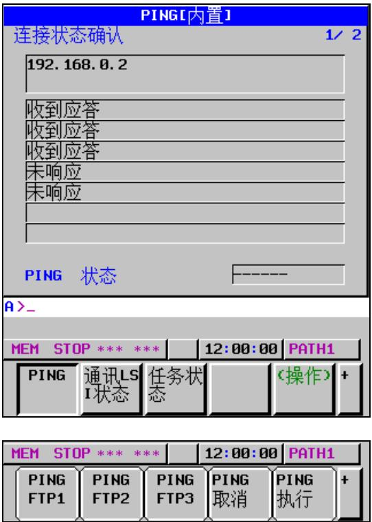

<details>
<summary>text_image</summary>

PING[内置]
连接状态确认
1/ 2
192.168.0.2
收到应答
收到应答
收到应答
未响应
未响应
PING 状态
A >_
MEM STOP *** ***
12:00:00 PATH1
PING 通讯LS
I状态 任务状
态
(操作) +
MEM STOP *** ***
12:00:00 PATH1
PING
FTP1
PING
FTP2
PING
FTP3
PING
取消
PING
执行
+
</details>

  
PING 连接状态画面

6 希望向任意的对方发送 PING 指令时, 将发送目的地地址输入到 PING 设定画面。(通过翻页键 PAGE PAGE 进行切换。)

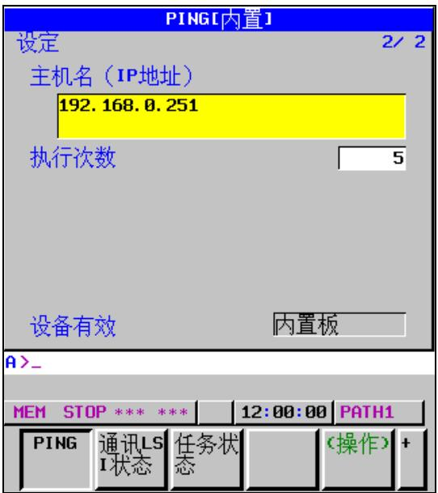

<details>
<summary>text_image</summary>

PING[内置]
设定
2/2
主机名（IP地址）
192.168.0.251
执行次数
5
设备有效
内置板
A>__
MEM STOP *** ***
12:00:00 PATH1
PING 通讯LS 任务状
I状态 态
（操作）+
</details>

PING 设定画面

7 输入地址和执行次数后，按下软键 [PING 执行]，向已经输入的对方发送相当于执行次数的 PING 指令。  
8 在中途停止 PING 指令的发送时，按下软键 [PING 取消]。

## 显示通信状态画面

## 步骤

1 按下功能键 SYSTEM。

2 软键上显示 [内藏口] 和 [PCMCIA 卡]。（没有软键时，按下继续菜单键。）  
3 按下软键 [内藏口]，出现用于内置以太网端口的“以太网设定画面”。按下 [PCMCIA 卡]，出现用于 PCMCIA 以太网卡的“以太网设定画面”。  
4 按下软键 [通讯 LSI 状态]，显示以太网的通信状态。

5 通过按下翻页键

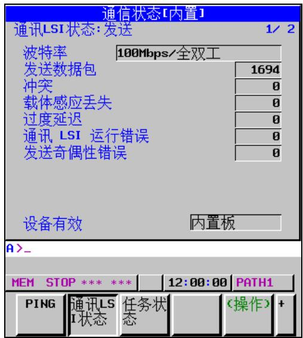

<details>
<summary>text_image</summary>

通信状态[内置]
通讯LSI状态: 发送 1/2
波特率 100Mbps/全双工
发送数据包 1694
冲突 0
载体感应丢失 0
过度延迟 0
通讯 LSI 运行错误 0
发送奇偶性错误 0
设备有效 内置板
A >_
MEM STOP *** *** 12:00:00 PATH1
PING 通讯LSI状态 任务状态 (操作) +
</details>

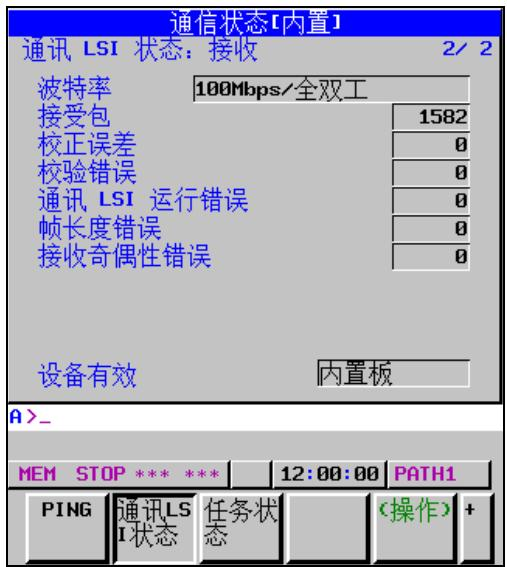

<details>
<summary>text_image</summary>

通信状态[内置]
通讯 LSI 状态: 接收 2/2
波特率 100Mbps/全双工
接受包 1582
校正误差 0
校验错误 0
通讯 LSI 运行错误 0
帧长度错误 0
接收奇偶性错误 0
设备有效 内置板
A>__
MEM STOP *** *** 12:00:00 PATH1
PING 通讯LSI状态 任务状态 (操作) +
(操作)
</details>

通信状态画面

显示项目


## 任务状态画面的显示

## 步骤

1 按下功能键 □ SYSTEM。  
2 软键上显示 [内藏口] 和 [PCMCIA 卡]。（没有软键时，按下继续菜单键。）  
3 按下软键 [内藏口]，出现用于内置以太网端口的“以太网设定画面”。按下 [PCMCIA 卡]，出现用于 PCMCIA 以太网卡的“以太网设定画面”。  
4 按下软键 [任务状态]，显示嵌入式以太网的任务状态。

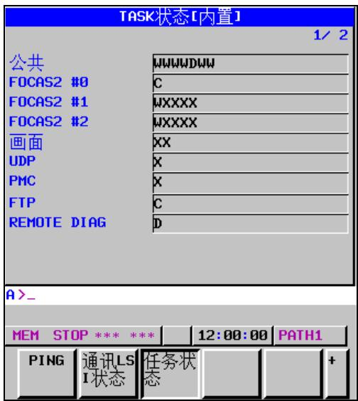

<details>
<summary>text_image</summary>

TASK状态[内置]
1/ 2
公共
FOCAS2 #0
FOCAS2 #1
FOCAS2 #2
画面
UDP
PMC
FTP
REMOTE DIAG
WWWDDWW
C
XXXXX
XXXXX
XX
X
X
C
D
A >_
MEM STOP *** ***
12:00:00 PATH1
PING 通讯LSI状态 任务状态 +
</details>

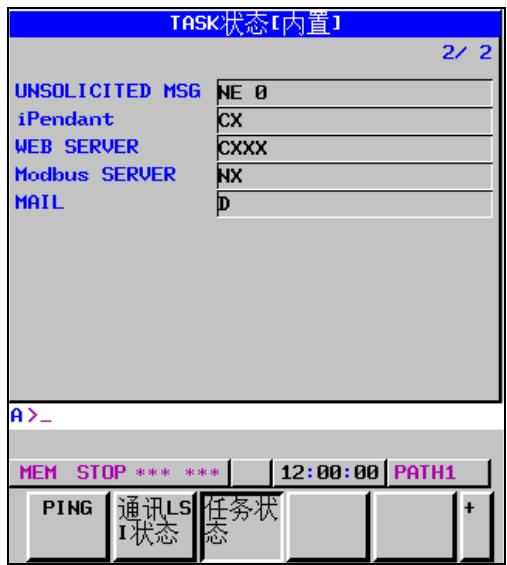

<details>
<summary>text_image</summary>

TASK状态[内置]
2/ 2
UNSOLICITED MSG NE 0
iPendant CX
WEB SERVER CXXX
Modbus SERVER NX
MAIL D
A >_
MEM STOP *** ***
12:00:00 PATH1
PING 通讯LS 任务状 态
I状态
</details>

任务状态画面

各符号的含义如下所示。


## 7.7 嵌入式以太网的记录画面

该画面显示有关嵌入式以太网功能的记录。

## 注释

1 基于嵌入式以太网功能的数据传送中发生报警(SR2032)“嵌入式以太网/数据服务器错误”的情况下，请在嵌入式以太网的记录画面上确认详细错误。  
2 嵌入式以太网功能的记录信息会被记录在易失性存储器中，通过切断 CNC 的电源断而被清除。记录信息的确认，要在错误发生后切断电源之前进行。

## 显示记录画面

## 步骤

1 按下功能键


2 按下软键 [内嵌日志]，出现用于内置以太网端口的 “记录画面”。按下 [PCMCIA 日志]，出现用于 PCMCIA 以太网卡的 “记录画面”。（没有软键时，按下继续菜单键。）

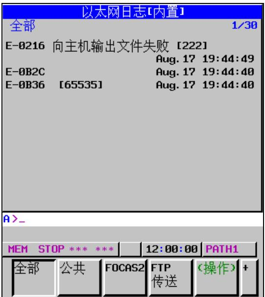

<details>
<summary>text_image</summary>

以太网日志[内置]
全部
1/30
E-0216 向主机输出文件失败 [222]
Aug. 17 19:44:49
E-0B2C
Aug. 17 19:44:40
E-0B36 [65535]
Aug. 17 19:44:40
A >_
MEM STOP *** ***
12:00:00 PATH1
全部 公共 FOCAS2 FTP (操作) +
传送
</details>

记录画面

最新的错误记录显示在画面的最上面。错误记录的右边为发生该错误时的日期和时刻。日期和时刻的显示格式以“MMM.DD hh:mm:ss”显示月（MMM）日（DD）时（hh）分（mm）秒（ss）。上图上段的例子表示“8月17日19时44分49秒”。

要清除记录，在按下软键[(操作)]之后，按下软键[清除]。


<details>
<summary>text_image</summary>

清除
</details>

通过操作嵌入式以太网记录画面的软键，按照每一功能显示记录。

(1) 软键 [全部]  
显示有关嵌入式以太网的所有记录。  
(2) 软键 [公共]  
显示有关嵌入式以太网功能的参数设定和基本的通信功能的记录。  
(3) 软键 [FOCAS2]  
显示有关 FOCAS2/Ethernet 功能的记录。  
(4) 软键 [FTP 传送]  
显示与 FTP 文件传送相关的记录。  
(5) 软键 [主导信息]  
显示有关 CNC 主导信息通知功能的记录。  
(6) 软键 [WEB]  
显示有关 CNC 画面 Web 服务器功能的记录。  
(7) 软键 [Modbus]  
显示有关 Modbus/TCP 服务器功能的记录。  
(8) 软键 [RMTDGN]  
显示有关机床远程诊断的记录。  
(9) 软键 [MAIL]  
显示有关 CNC 状态通知功能的记录。

错误和信息


### PMC报警: 错误号
- **故障内容**: 记录信息
- **处理办法**: 含义与处理方法

### PMC报警: E-0118E-0119
- **故障内容**: 等待 FOCAS2 pdu 时发生错误
- **处理办法**: 由于下列任一原因而发生了通信错误。网络的质量下降,不再能够接收来自通信对方的电脑的数据,逻辑通信线路被切断。通信对方电脑上的软件强制地切断了逻辑通信线路。以太网电缆脱落。

### PMC报警: E-011A
- **故障内容**: 所有的通讯通道忙
- **处理办法**: FOCAS2/Ethernet 的通信线路都在使用之中。

### PMC报警: E-0126
- **故障内容**: 远程诊断服务器无响应
- **处理办法**: 可能是由于机床远程诊断接收服务器的 IP 地址错误,或者机床远程诊断接收服务器的电源尚未接通。确认机床远程诊断接收服务器的 IP 地址,并确认机床远程诊断接收服务器是否已经接通电源。或者,可能是由于为提高安全级(防火墙等)而存在不响应于 PING 指令的机床远程诊断接收服务器。请在将参数 (No.14880#1)设定为 1 后再次进行连接。

### PMC报警: E-0148
- **故障内容**: CNC 主导信息通知功能的参数保存失败
- **处理办法**: 接收 FOCAS2 函数 cnc_wrunsolicprm2 时,因下列某种原因致使 CNC 主导信息通知功能的参数保存失败。CNC 主导信息通知功能方式不是“电脑方式”。CNC 主导信息通知功能方式不是“停止”。FOCAS2 函数 cnc_wrunsolicprm2 的自变量在“CNC 主导信息用参数”中存在非法值。

### PMC报警: E-0149
- **故障内容**: 受信 CNC 主导信息通知功能的参数不正确
- **处理办法**: 接收到 FOCAS2 函数 cnc_wrunsolicprm2、cnc_rdunsolicprm2、cnc_unsolicstart、或 cnc_unsolicstop 时,检测出了自变量“CNC 主导信息用参数号”的非法。

### PMC报警: E-0200
- **故障内容**: 收到来自 FTP 服务器的信息
- **处理办法**: 原样显示由 FTP 服务器传送过来的信息。

### PMC报警: E-0202
- **故障内容**: 连接 FTP 服务器失败
- **处理办法**: 有可能 FTP 服务器的软件尚未运行。请运行 FTP 服务器的软件。

### PMC报警: E-0207
- **故障内容**: 未找到路由器
- **处理办法**: 可能是由于路由器的 IP 地址错误,或者路由器的电源尚未接通。确认路由器的 IP 地址,并确认路由器是否已经接通电源。

### PMC报警: E-0208
- **故障内容**: 未找到 FTP 服务器
- **处理办法**: 可能是由于 FTP 服务器的 IP 地址错误,或者 FTP 服务器的电源尚未接通。确认 FTP 服务器的 IP 地址,并确认 FTP 服务器是否已经接通电源。

### PMC报警: E-020B
- **故障内容**: 不能登录到 FTP 服务器
- **处理办法**: 确认用于登录 FTP 服务器的用户名和密码。

### PMC报警: E-020C
- **故障内容**: FTP 服务器参数错误
- **处理办法**: 确认用于登录 FTP 服务器的用户名和密码。

### PMC报警: E-020D
- **故障内容**: 改变主机的工作目录失败
- **处理办法**: 确认登录 FTP 服务器的作业文件夹。

### PMC报警: E-041A
- **故障内容**: 帧传送失败 (TCP)
- **处理办法**: 由于下列任一原因而发生了通信错误。网络的质量下降,不再能够接收来自通信对方的电脑的数据,逻辑通信线路被切断。通信对方电脑上的软件强制地切断了逻辑通信线路。以太网电缆脱落。

### PMC报警: E-0901
- **故障内容**: 不能读取 MAC 地址
- **处理办法**: 可能是由于硬件中没有写入 MAC 地址。或者硬件已经损坏。

### PMC报警: E-0A06
- **故障内容**: 网络太忙
- **处理办法**: 网络中流过过量的数据。需要采取分割网络的对策。

### PMC报警: E-0B00
- **故障内容**: 本地 IP 地址错误
- **处理办法**: 按照 IP 地址的指定格式,设定 IP 地址。

### PMC报警: E-0B01
- **故障内容**: 本地 IP 地址未设定
- **处理办法**: 设定 IP 地址。

### PMC报警: E-0B02
- **故障内容**: 子网掩码错误
- **处理办法**: 按照子网掩码的指定格式,设定子网掩码。

### PMC报警: E-0B03
- **故障内容**: 未设定子网掩码
- **处理办法**: 设定子网掩码。

### PMC报警: E-0B04
- **故障内容**: 路由器 IP 地址错误
- **处理办法**: 可能是由于本地节点的 IP 地址和路由器的 IP 地址的等级不匹配。

### PMC报警: E-0B05
- **故障内容**: DNS 服务器的 IP 地址错误
- **处理办法**: 可能是由于本地节点的 IP 地址和 DNS 服务器的 IP 地址的等级不匹配。

### PMC报警: E-0B06
- **故障内容**: 本地主机名错误
- **处理办法**: 确认主机名的设定。

### PMC报警: E-0B07
- **故障内容**: 本地域名错误
- **处理办法**: 确认域名的设定。

### PMC报警: E-0B08
- **故障内容**: TCP 端口号错误
- **处理办法**: 可能是由于设定了设定范围外的值。

### PMC报警: E-0B09
- **故障内容**: UDP 端口号错误
- **处理办法**: 可能是由于设定了设定范围外的值。

### PMC报警: E-0B0B
- **故障内容**: 远程 FTP 服务器的 IP 地址错误
- **处理办法**: 按照 IP 地址的指定格式,设定 IP 地址。

### PMC报警: E-0B0C
- **故障内容**: 远程 FTP 服务器的端口号错误
- **处理办法**: 可能是由于设定了设定范围外的值。

### PMC报警: E-0B0D
- **故障内容**: 远程 FTP 服务器的用户名错误
- **处理办法**: 可能是由于在用户名中设定了不可使用的字符。

### PMC报警: E-0B0E
- **故障内容**: 远程 FTP 服务器的密码错误
- **处理办法**: 可能是由于在密码中设定了不可使用的字符。

### PMC报警: E-0B0F
- **故障内容**: 远程 FTP 服务器的登陆目录错误
- **处理办法**: 可能是由于在登录目录中设定了不可使用的字符。

### PMC报警: E-0B18
- **故障内容**: 由于 DHCP 有效所以不能设定
- **处理办法**: 要使其能够设定,应将 DHCP 客户机功能设定为无效。

### PMC报警: E-0B19E-0B1A
- **故障内容**: 未找到内嵌以太网口
- **处理办法**: 不能识别嵌入式以太网的软件或者硬件。确认是否已经安装软件。确认硬件是否故障。

### PMC报警: E-0B27
- **故障内容**: 没有 CNC 主导信息通知功能
- **处理办法**: 尚未满足使用 CNC 主导信息通知功能的软件条件。可能是因为下列原因所致。- 尚未设定为使用 CNC 主导信息通知功能的 NC 参数。有关 NC 参数,请参阅“CNC 主导信息通知功能的设定”项。

### PMC报警: E-0B29
- **故障内容**: CNC 主导信息通知功能的模式不正确
- **处理办法**: 在 CNC 方式下,FOCAS2 函数 cnc_wrunsolicprm2 无法执行。

### PMC报警: E-0B2A
- **故障内容**: CNC 主导信息通知功能的状态不正确
- **处理办法**: CNC 主导信息通知功能的状态尚未设为“停止”,因此 CNC 主导信息通知功能用参数更新失败。可能是因为下列原因所致。- 将状态置于非“停止”时,执行了 FOCAS2 函数cnc_wrunsolicprm2 或 cnc_unsolicstart。- 将状态置于非“停止”时,按下了软键[适用]。

### PMC报警: E-0B2B
- **故障内容**: CNC 主导信息通知功能的参数更新失败
- **处理办法**: 更新 CNC 主导信息通知功能的参数更新失败。可能是因为下列原因所致。- E-0B29 或 E-0B2A 发生问题。- CNC 主导信息通知功能用参数中存在非法值。

### PMC报警: E-0B44
- **故障内容**: CNC 主导信息通知功能送信用参数中有无效的数值
- **处理办法**: 在 CNC 主导信息通知功能用参数中,发送数量或发送用参数 NO.1~3 中存在无效值。

### PMC报警: E-0B45
- **故障内容**: CNC 主导信息通知功能的送信尺寸的总和超过了允许范围
- **处理办法**: 在 CNC 主导信息通知功能用参数中,发送用参数 NO.1~3 的总计发送信息大小超过可指定的最大字节数。有关可指定的最大字节数,请参照附录“从 CNC 画面进行设定时”项的设定项目“发信用参数”。

### PMC报警: E-0B47
- **故障内容**: TCP port number of Modbus/TCP Server is wrong
- **处理办法**: 设定了 0。使用时,请设定 TCP 端口号。

### PMC报警: E-0B48
- **故障内容**: Status PMC address of Modbus/TCP Server is out of range
- **处理办法**: 设定了设定范围外的值。确认状态 PMC 地址的设定。

### PMC报警: E-0B49
- **故障内容**: Data PMC address of Modbus/TCP Server is wrong
- **处理办法**: 设定了奇数地址。确认数据 PMC 地址的设定。

### PMC报警: E-0B4A
- **故障内容**: Data PMC address of Modbus/TCP Server is out of range
- **处理办法**: 设定了设定范围外的值。确认数据 PMC 地址或者数据大小的设定。

### PMC报警: E-0B4B
- **故障内容**: Modbus area of Modbus/TCP Server is out of range
- **处理办法**: 设定了设定范围外的值。确认数据 Modbus 地址或者数据大小的设定。

### PMC报警: E-1001
- **故障内容**: All Modbus communication paths are busy
- **处理办法**: 连接中的通信目的地(Modbus/TCP 客户机)超过了可连接的最大站数。与通信目的地(Modbus/TCP 客户机)的通信被按照连接较先的顺序而切断。

### PMC报警: E-1003
- **故障内容**: Version number of Modbus packet is wrong
- **处理办法**: 按照 Modbus/TCP 的协议指定正确的版本号。

### PMC报警: E-1004
- **故障内容**: Length of Modbus packet is wrong
- **处理办法**: 按照 Modbus/TCP 的协议指定正确的大小。

### PMC报警: E-100B
- **故障内容**: Function code of Modbus packet is wrong
- **处理办法**: 功能代码有可能超出支持范围。

### PMC报警: E-1015E-1016
- **故障内容**: Data address of Modbus packet is wrong
- **处理办法**: 按照 Modbus/TCP 的协议指定正确的数据地址。

### PMC报警: E-1017E-1018E-1019
- **故障内容**: Data value of Modbus packet is wrong
- **处理办法**: 按照 Modbus/TCP 的协议指定正确的数据值。

### PMC报警: E-101A
- **故障内容**: Data address that client requested is out of range (1-3)
- **处理办法**: 尚未对来自连接中的通信目的地(Modbus/TCP 客户机)要求的 Modbus 区域分配 PMC 区域。分配 PMC 区域。

### PMC报警: E-1300
- **故障内容**: (Sent message to Web browser)
- **处理办法**: 这是为了将 Web 服务器上检测的错误通知 Web 浏览器而发送的信息。

### PMC报警: E-1301
- **故障内容**: User name is not set
- **处理办法**: 设定用户名。

### PMC报警: E-1302
- **故障内容**: Password is not set
- **处理办法**: 设定密码。

### PMC报警: E-1303
- **故障内容**: User name is wrong
- **处理办法**: 确认用户名。

### PMC报警: E-1304
- **故障内容**: Password is wrong
- **处理办法**: 确认密码。

### PMC报警: E-1305
- **故障内容**: All communication paths are busy
- **处理办法**: 与Web浏览器的通信线路全被使用中。

### PMC报警: E-1306
- **故障内容**: Session ended
- **处理办法**: 结束了与Web浏览器的连接。

### PMC报警: E-1307
- **故障内容**: Session canceled
- **处理办法**: 因如下任何一个原因,强制结束了与Web浏览器的连接。√ Web浏览器连接禁止信号WBEND成了”1”。√ 使用CNC画面显示功能在电脑上显示了CNC画面。

### PMC报警: E-1308
- **故障内容**: Session started
- **处理办法**: 开始了与Web浏览器的连接。

### PMC报警: E-1309
- **故障内容**: Login failed
- **处理办法**: 无法继续使用CNC画面Web服务器功能。重新接通CNC的电源。

### PMC报警: E-1400
- **故障内容**: (Sent message to POP client)
- **处理办法**: 这是发送给邮件软件的错误信息。通常不会发生。

### PMC报警: E-1401
- **故障内容**: (Sent message to SMTP client)
- **处理办法**: 这是发送给邮件软件的错误信息。通常不会发生。

### PMC报警: E-1402
- **故障内容**: User name is not set
- **处理办法**: 设定用户名。

### PMC报警: E-1403
- **故障内容**: Password is not set
- **处理办法**: 设定密码。

### PMC报警: E-1404
- **故障内容**: User name is wrong
- **处理办法**: 设定用户名。

### PMC报警: E-1405
- **故障内容**: Password is wrong
- **处理办法**: 设定密码。

### PMC报警: E-1406
- **故障内容**: Login failed
- **处理办法**: 不再能够继续使用CNC状态通知功能。重新接通CNC的电源。

### PMC报警: E-XXXX
- **故障内容**: (无信息)
- **处理办法**: 这是系统内部错误。请告知错误号。


## 8

## 数字伺服

本章就数字伺服的维护中所需的伺服调整画面的显示内容和参考点返回位置的调整等进行描述。

8.1 伺服参数的初始设定方法....397  
8.2 FSSB设定画面....402  
8.3 伺服调整画面....413  
8.4 调整返回参考点位置（挡块方式） 414  
8.5 无挡块参考点设定....416  
8.6 αi伺服的警告接口....418  
8.7 αi伺服信息画面 420

## 8.1 伺服参数的初始设定方法

本节说明在机床的现场调试等中初始设定数字伺服参数的情况。

1. 在急停状态下将电源至于 ON。  
2. 设定用于显示伺服的设定调整画面的参数。


### PMC报警: 
- **故障内容**: #7
- **处理办法**: #6

### PMC报警: 3111
- **故障内容**: 
- **处理办法**: 


[输入类型] 设定输入

[数据类型] 位路径型

#0 SVS 是否进行伺服设定画面、伺服调整画面的显示

0: 不进行。

1: 进行。

3. 暂时将电源置于 OFF，然后再将其置于 ON。

4. 在下面的步骤中，显示出伺服参数的设定画面。

按下键、[SV参数]。

5. 利用光标翻页键，输入初始设定所需的数据。

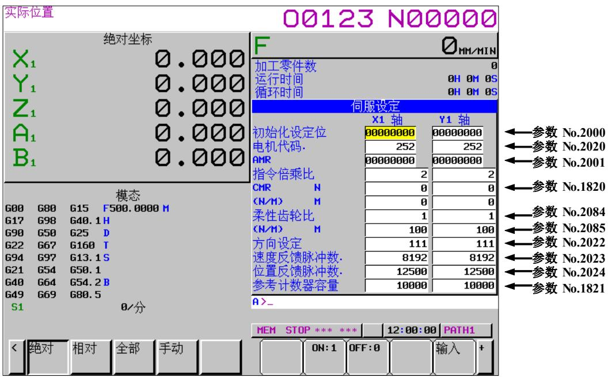

<details>
<summary>text_image</summary>

实际位置
00123 N00000
绝对坐标
X₁ 0.000
Y₁ 0.000
Z₁ 0.000
A₁ 0.000
B₁ 0.000
模态
G00 G80 G15 F500.0000 M
G17 G98 G40.1 H
G90 G50 G25 D
G22 G67 G160 T
G94 G97 G13.1 S
G21 G54 G50.1
G40 G64 G54.2 B
G49 G69 G80.5
S1 0/分
F
MM/MIN
加工零件数 0
运行时间 0H 0M 0S
循环时间 0H 0M 0S
伺服设定
X1 轴 Y1 轴
初始化设定位 00000000 00000000
电机代码· 252 252
AMR 00000000 00000000
指令倍乘比 2 2
CMR N 0 0
(N/M) M 0 0
柔性齿轮比 1 1
(N/M) M 100 100
方向设定 111 111
速度反馈脉冲数· 8192 8192
位置反馈脉冲数· 12500 12500
参考计数器容量 10000 10000
A >_
MEM STOP *** *** 12:00:00 PATH1
< 绝对 相对 全部 手动 ON:1 OFF:0 输入 +
</details>

## (1) 初始设定位


### PMC报警: 
- **故障内容**: #7
- **处理办法**: #6

### PMC报警: 2000
- **故障内容**: 
- **处理办法**: 


#0 PLC0 0: 原样使用参数(No.2023、No.2024)的值。

1: 使参数(No.2023、No.2024)的值在增大 10 倍。

#1 DGPR 0: 进行数字伺服参数的初始化设定。

1: 不进行数字伺服参数的初始化设定。

## (2) 电机代码

根据所使用的伺服电机，设定记载在 FANUC AC SERVO MOTOR 参数说明书（B-65270）中的电机型号。

## (3) 任意 AMR 功能


### PMC报警: 
- **故障内容**: #7
- **处理办法**: #6

### PMC报警: 2001
- **故障内容**: AMR7
- **处理办法**: AMR6


※ 设定 “00000000”。

## (4) CMR


① CMR 由 1/2 变为 1/27 时

$$
\mathrm{设定值} = \frac {1}{\mathrm{CMR}} + 1 0 0
$$

② CMR 由 0.5 变为 48 时

$$
\text { 设定值 } = 2 \times \mathrm{CMR}
$$

(5) 暂时将电源置于 OFF，然后再将其置于 ON。

(6) 进给齿轮（F·FG）的 N/M


### PMC报警: $\frac{\text{F} \cdot \text{FG 的分子 (≤ 32767)}}{\text{F} \cdot \text{FG 的分母 (≤ 32767)}$ (注释 1)
- **故障内容**: =
- **处理办法**: $\frac{\text{电机每转动一圈所需的位置反馈脉冲数}}{100 \text{万 (注释 2)}}$ 的约分数


(例) 在半闭环中检测出 $1 \mu m$ 时


### PMC报警: 滚珠丝杠的导程(mm/rev)
- **故障内容**: 所需的位置脉冲数(脉冲/rev)
- **处理办法**: F·FG

### PMC报警: 10
- **故障内容**: 10000
- **处理办法**: 1/100

### PMC报警: 20
- **故障内容**: 20000
- **处理办法**: 2/100 或 1/50

### PMC报警: 30
- **故障内容**: 30000
- **处理办法**: 3/100


(例) 在旋转轴、减速比为 10:1 下检测出 1/1000 度时

电机每转动一圈时，工作台就转动 360/10 度。

工作台每 1 度的位置反馈脉冲数需要 1000 脉冲。

电机每转动 1 圈所需的位置反馈脉冲数为

$360/10 \times 1000 = 36000$ 脉冲 参考计数器=36000

$$
\frac {\mathrm{F} \cdot \mathrm{FG} \text {的分子}}{\mathrm{F} \cdot \mathrm{FG} \text {的分母}} = \frac {3 6 0 0 0}{1 0 0 \text {万}} = \frac {3 6}{1 0 0 0}
$$

其他的 FFG（分子 / 分母）设定例，减速比为 1:1


### PMC报警: 6mm
- **故障内容**: 8mm
- **处理办法**: 10mm

### PMC报警: 1μm
- **故障内容**: 6 / 1000
- **处理办法**: 8 / 1000

### PMC报警: 0.5μm
- **故障内容**: 12 / 1000
- **处理办法**: 16 / 1000

### PMC报警: 0.1μm
- **故障内容**: 60 / 1000
- **处理办法**: 80 / 1000


(例) 使用 $0.5 \mu m$ 光栅尺检测 $1 \mu m$ 时，设定为

$$
\frac {\mathrm{F} \cdot \mathrm{FG} \text {的分子}}{\mathrm{F} \cdot \mathrm{FG} \text {的分母}} = \frac {\mathrm{L} / 1}{\mathrm{L} / 0 . 5} = \frac {1}{2} 。
$$

其他的 FFG（分子 / 分母）设定例


### PMC报警: 1μm
- **故障内容**: 0.5μm
- **处理办法**: 0.1μm

### PMC报警: 1μm
- **故障内容**: 1/1
- **处理办法**: 1/2

### PMC报警: 0.5μm
- **故障内容**: —
- **处理办法**: 1/1

### PMC报警: 0.1μm
- **故障内容**: —
- **处理办法**: —


## (7) 方向设定


111: 正向（从脉冲编码器一侧看沿顺时针方向旋转）  
-111: 反向（从脉冲编码器一侧看沿逆时针方向旋转）

## (8) 速度反馈脉冲数、位置反馈脉冲数


### PMC报警: 
- **故障内容**: 半闭环
- **处理办法**: 全闭环

### PMC报警: 并行型
- **故障内容**: 串行线性光栅尺
- **处理办法**: 串行旋转光栅尺

### PMC报警: 指令单位(μm)
- **故障内容**: 1/0.1
- **处理办法**: 1/0.1

### PMC报警: 初始化设定位
- **故障内容**: b0=0
- **处理办法**: b0=0

### PMC报警: 速度反馈脉冲数
- **故障内容**: 8192
- **处理办法**: 8192

### PMC报警: 位置反馈脉冲数
- **故障内容**: 12500(*1)
- **处理办法**: (*2-例1)


速度反馈脉冲数请设定 8192。若是线性电机，请按照 α i series 参数说明书的“线性电机的参数设定”项进行设定。

## 注释

1 位置反馈脉冲数的设定 半闭环的情形（上述表中(\*1)) 设定 12500。  
2 位置反馈脉冲数的设定 全闭环的情形（上述表中(\*2))
在位置反馈脉冲数中设定电机转动一圈时从外置检测器反馈的脉冲数。（位置反馈脉冲数的计算，与柔性进给齿轮无关。）
例1)
在使用导程为10mm的滚珠丝杠（直接连接）、具有1脉冲0.5μm的分辨率的外置检测器的情形下电机每转动一圈来自外置检测器的反馈脉冲数为10/0.0005=20,000。因此，位置反馈脉冲数为20,000。
例2)
使用每转动1圈具有100万脉冲的分辨率的串行旋转光栅尺时的位置反馈脉冲数的设定，例外地由于下式计算：12500×（电机●工作台之间的减速比）  
比如，电机●工作台之间的减速比为 10:1 时，位置反馈脉冲数则为： $12,500 \times (1/10) = 1250$  
3 位置反馈脉冲数的设定大于32767时如下所示，请使用位置反馈脉冲变换系数设定位置脉冲。

使用位置反馈脉冲变换系数，以两个参数的乘积设定位置反馈脉冲数。

2024

位置反馈脉冲数

2185

位置反馈脉冲数变换系数

(设定例)

使用最小分辨率为 $0.1 \mu m$ 的光栅尺，电机每转动一圈的移动距离为 16mm 的情形

由于 $\mathrm{Ns} =$ 电机每转动一圈的移动距离 $(\mathrm{mm})/$ 检测器的最小分辨率 $(\mathrm{mm})$

$$
= 1 6 \mathrm{mm} / 0. 0 0 0 1 \mathrm{mm} = 1 6 0 0 0 0 (> 3 2 7 6 7) = 1 0 0 0 0 \times 1 6,
$$

所以进行如下设定:

A（参数 No.2024）=10000

B（参数 No.2185）=16

## 注释

电机的检测器为 $\alpha i$ 脉冲编码器的情形（速度反馈脉冲数 $= 8192$ ），请尽可能为变换系数选择2的乘方值(2,4,8,...)。（软件内部中所使用的位置增益值将更加准确）

## (9) 参考计数器

1821

每个轴的参考计数器容量（0～999999999）

## 1) 半闭环的情形

参考计数器=电机每转动一圈所需的位置反馈脉冲数或其整数分之一

## 注释

旋转轴上电机和工作台的旋转比不是整数时，需要设定参考计数器的容量，以使参考计数器 $= 0$ 的点（栅格点）相对于工作台总是出现在相同位置。

设定例）

$\alpha i$ 脉冲编码器、半闭环（1 $\mu$ m 检测）


### PMC报警: 滚珠丝杠的导程(mm/转)
- **故障内容**: 所需的位置反馈脉冲数(脉冲/转)
- **处理办法**: 参考计数器

### PMC报警: 10
- **故障内容**: 10000
- **处理办法**: 10000

### PMC报警: 20
- **故障内容**: 20000
- **处理办法**: 20000

### PMC报警: 30
- **故障内容**: 30000
- **处理办法**: 30000


电机每转动一圈所需的位置反馈脉冲数和参考计数器的设定有误差时，由于起点位置关系，参考点位置出现标准偏差。

在这种情形下，虽然需要通过改变检测单位进行设定，以便消除误差，但是，也可以通过分数来设定参考计数器。

设定例）

检测单位 =1 μm、滚珠丝杠的导程=20mm/转、减速比=1/17 的系统

a) 以分数设定参考计数器容量的方法

电机每转动一圈所需的位置反馈脉冲数=20000/17

设定下列参数。

1821

每个轴的参考计数器容量（分子）（0～999999999）

2179

每个轴的参考计数器容量（分母）（0～100）

分母的参数在伺服设定画面上不予显示，所以，需要从参数画面进行设定。

在本例中，假定分子=20000，分母=17。

## 注释

参考计数器本身只取整数值，因此，若以分数设定参考计数器的容量，参考计数器 $= 0$ 的点的间隔，就会成为经过补偿后的形式。

（从脉冲控制的原理上来看，不到1脉冲的位置由于得不到控制，因此，需要进行栅格间隔的补偿，以使栅格点的误差总保持在不到1个检测单位的水平。）

b) 改变检测单位的方法

电机每转动一圈所需的位置反馈脉冲数=20000/17

使下面的参数都增大 17 倍，将检测单位改变为 $1/17 \mu m$ 。


因为检测单位由 $1 \mu m$ 改变为 $1/17 \mu m$ ，故需要将用检测单位设定的参数全都增大 17 倍。

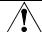

## 注意

除了上述情形外，尚有以检测单位设定的参数。

通过上述变更，即可消除电机每转动一圈所需的位置反馈脉冲数和参考计数器的误差。

电机每转动一圈所需的位置反馈脉冲数=20000

参考计数器=20000

2) 全闭环的情形

## 参考计数器 $=\mathbf{Z}$ 相（参考点）的间隔/检测单位或者其整数分之一

参考计数器不是整数时，请参阅半闭环的例子。

## 注释

旋转轴上外置检测器和工作台的旋转比不是整数倍时，需要设定参考计数器的容量，以使参考计数器 $= 0$ 的点（栅格点）相对于工作台总是出现在相同位置。

设定例）

例 1) Z 相的间隔=50mm、检测单位=1 μm 的情形

参考计数器=50,000/1=50,000

例 2)旋转轴上检测单位 =0.001°的情形

参考计数器=360/0.001=360,000

例 3) 光栅尺等 Z 相只有一个的情形

为参考计数器设定 10000、50000 等整数值。

6. 将电源置于 OFF，然后再将其置于 ON。

## 8.2 FSSB设定画面

通过将 CNC 控制部和多个伺服放大器之间用一根光纤电缆连接起来的高速串行伺服总线 (FSSB: Fanuc Serial Servo Bus)，即可大幅减少机床的电装部所需的电缆。

通过利用 FSSB 设定画面，输入轴和放大器的关系，进行轴设定的自动计算，即自动计算参数(No.1023, 2013#0, 2014#0, 3717, 11802#4, 24000～24095, 24096～24103)。

## 显示

在 FSSB 设定画面上，将基于 FSSB 的放大器和轴的信息显示在 FSSB 设定画面。此外，还可以设定放大器和轴的信息。

1 按下功能键 SYSTEM。

2 按继续菜单键 ▷ 数次，显示出 [FSSB]。

3 按下软键 [FSSB]，切换到“连接状态”画面（或者以前所选的 FSSB 设定画面），显示出如下软键。

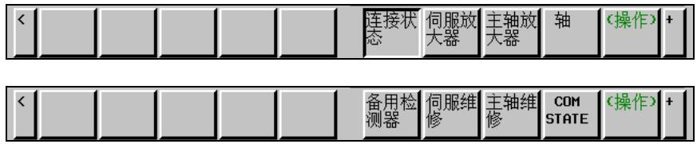

<details>
<summary>text_image</summary>

<连接状态 伺服放大器 主轴放大器 轴 (操作) +
备用检测器 伺服维修 主轴维修 COM STATE (操作) +
</details>

FSSB 设定画面上具有 7 个画面：连接状态、伺服放大器设定、主轴放大器设定、位置检测器接口单元、轴设定、伺服放大器维修、主轴放大器维修。

按下软键 [连接状态] 时，切换到 “连接状态” 画面。

按下软键 [伺服放大器] 时，切换到 “伺服放大器设定” 画面。

按下软键 [主轴放大器] 时，切换到 “主轴放大器设定” 画面。

按下软键 [轴] 时，切换到 “轴设定” 画面。

按下软键 [备用检测器] 时，切换到 “位置检测器接口单元” 画面。

按下软键 [伺服维修] 时，切换到 “伺服放大器维修” 画面。

按下软键 [主轴维修] 时，切换到 “主轴放大器维修” 画面。

## (1) 连接状态画面

在连接状态画面上，显示连接在 FSSB 上的从控装置通电时的连接状态。

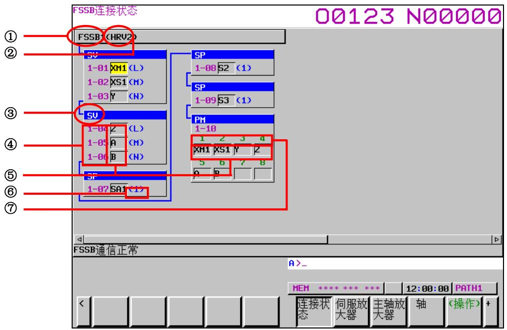

<details>
<summary>text_image</summary>

FSSB连接状态
00123 N00000
① FSSB(HRV2)
② SV
1-01 XM1 (L)
1-02 XS1 (M)
1-03 Y (N)
③ SU
1-04 Z (L)
1-05 A (M)
1-06 B (N)
④ SP
1-09 S3 (1)
⑤ PM
1-10
XM1 XS1 Y 2
⑥ P
⑦
FSSB通信正常
A >_
MEM **** *** 12:00:00 PATH1
<  连接状态 伺服放大器 主轴放大器 轴 （操作） +
</details>

连接状态画面上显示如下项目。

① FSSB1....FSSB 线号

显示 FSSB 线路号码。（FSSB1: 第一 FSSB 线）

② HRV2,HRV3,HRV—……电流控制周期

显示各 FSSB 线路的电流控制周期。FSSB 上尚未连接伺服放大器时以及发生了与 FSSB 相关的报警时，会显示 “HRV—”。

③ SV,SP,PM……从控装置类型

显示连接在 FSSB 上的从控装置的,2-01～2-32,3-01～3-32 从控装置号

在 FSSB 线路号码和 “-”（连字符）的后面，显示从控装置号码（线路中连接顺序）。（每一条线路的最大从控装置数为 32 个）

⑤ XM1,XS1,Y,Z,A,B……程序轴名称、主轴名称

显示各放大器、位置检测器接口单元上所设定的程序轴名称、主轴名称。

⑥ L,M,N,1 ....放大器中的号码

放大器中显示第几个。（L:伺服放大器第1轴，M:伺服放大器第2轴，N:伺服放大器第3轴，1:主轴放大器第1轴）

⑦ 1\~8 连接器号码

显示位置检测器接口单元的连接器号码。

## (2) 伺服放大器设定画面

在伺服放大器设定画面上，显示伺服放大器的信息。

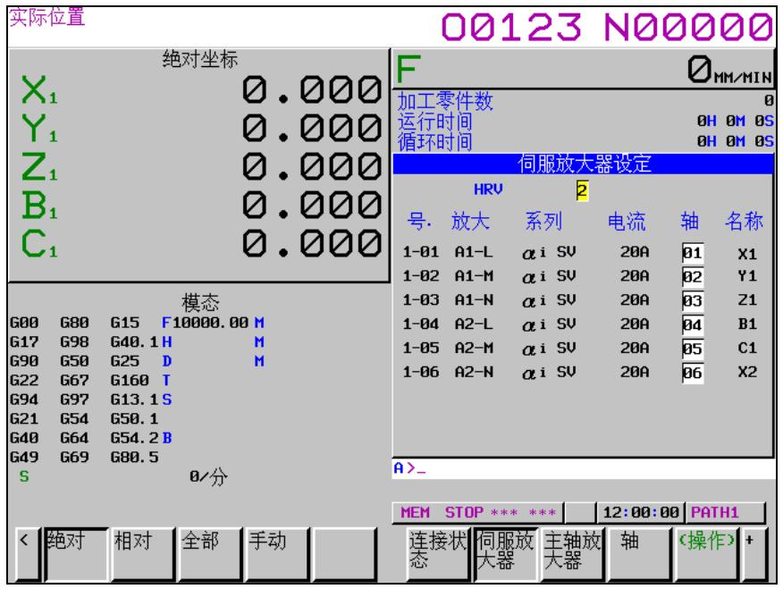

<details>
<summary>text_image</summary>

实际位置
00123 N00000
绝对坐标
X₁ 0.000
Y₁ 0.000
Z₁ 0.000
B₁ 0.000
C₁ 0.000
模态
G00 G80 G15 F10000.00 M
G17 G98 G40.1 H M
G90 G50 G25 D M
G22 G67 G160 T
G94 G97 G13.1 S
G21 G54 G50.1
G40 G64 G54.2 B
G49 G69 G80.5
S 0/分
F
MM/MIN
加工零件数 0
运行时间 0H 0M 0S
循环时间 0H 0M 0S
伺服放大器设定
HRV 2
号. 放大 系列 电流 轴 名称
1-01 A1-L αi SV 20A 01 X1
1-02 A1-M αi SV 20A 02 Y1
1-03 A1-N αi SV 20A 03 Z1
1-04 A2-L αi SV 20A 04 B1
1-05 A2-M αi SV 20A 05 C1
1-06 A2-N αi SV 20A 06 X2
A >_
MEM STOP *** *** 12:00:00 PATH1
连接状态 伺服放大器 主轴放大器 轴 (操作) +
< 绝对 相对 全部 手动
</details>

伺服放大器设定画面上显示如下项目。

\- HRV …… 电流控制周期

显示 FSSB 自动设定时设定的电流控制周期。此值并不表示现在有效的电流控制周期的设定。（2:伺服 HRV2 控制、3:伺服 HRV3 控制）

\- 号……从控装置号

在 FSSB 线路号码（1: 第一 FSSB 线）和 “-”（连字符）的后面，显示从控装置号码（线路中连接顺序）。（每一条线路的最大从控装置数为 32 个）

\- 放大……放大器类型

在表示伺服放大器开头字符的“A”后面，从靠近CNC一侧数起显示表示第几台伺服放大器的数字和表示伺服放大器中第几轴的字母（L:第1轴，M:第2轴，N:第3轴）。

\- 作为伺服放大器信息，显示下列项目的信息。

\- 系列 ...... 伺服放大器单元的种类、系列

( $\beta i$ SV 与系列名的显示不对应。)

\- 电流 ...... 最大电流值

\- 轴……控制轴号

显示分配给伺服放大器的控制轴号码。发生与 FSSB 相关的报警时，或者尚未分配控制轴号码时，显示 “0”。

\- 名称............程序轴名称

显示对应于控制轴号的参数(No.1020)的程序轴名称。轴号为“0”时不予显示。

## (3) 主轴放大器设定画面

在主轴放大器设定画面上，显示主轴放大器的信息。

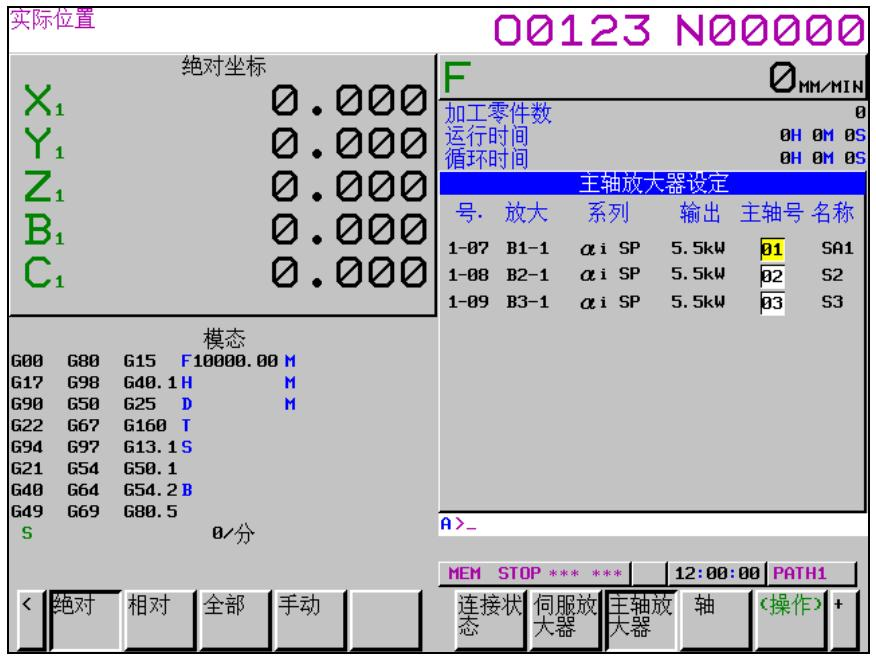

<details>
<summary>text_image</summary>

实际位置
00123 N00000
绝对坐标
X₁ 0.000
Y₁ 0.000
Z₁ 0.000
B₁ 0.000
C₁ 0.000
模态
G00 G80 G15 F10000.00 M
G17 G98 G40.1 H M
G90 G50 G25 D M
G22 G67 G160 T
G94 G97 G13.1 S
G21 G54 G50.1
G40 G64 G54.2 B
G49 G69 G80.5
S 0/分
F
MM/MIN
加工零件数 0
运行时间 0H 0M 0S
循环时间 0H 0M 0S
主轴放大器设定
号. 放大 系列 输出 主轴号 名称
1-07 B1-1 αi SP 5.5kW 81 SA1
1-08 B2-1 αi SP 5.5kW 82 S2
1-09 B3-1 αi SP 5.5kW 83 S3
A >_
MEM STOP *** *** 12:00:00 PATH1
连接状态 伺服放大器 主轴放大器 轴 (操作) +
< 绝对 相对 全部 手动
</details>

主轴放大器设定画面上显示如下项目。

\- 号……从控装置号

在 FSSB 线路号码和 “-”（连字符）的后面，显示从控装置号码（线路中连接顺序）。（每一条线路的最大从控装置数为 32 个）

\- 放大……放大器类型

在表示主轴放大器开头字符的 “B” 后面，从靠近 CNC 一侧数起显示表示第几台主轴放大器的数字和表示主轴放大器中第几轴的字母（1:主轴第 1 轴）。

\- 作为放大器信息，显示下列项目的信息。

\- 系列 …… 主轴放大器单元的种类、系列

\- 输出 ...... 最大输出

\- 主轴号……主轴号

显示分配给主轴放大器的主轴号码。发生与 FSSB 相关的报警时，或者尚未分配主轴号码时，显示 “0”。

\- 名称……主轴名称

显示对应于主轴号的主轴名称。主轴号为 “0” 时不予显示。

## (4) 轴设定画面

在轴设定画面上显示轴信息。

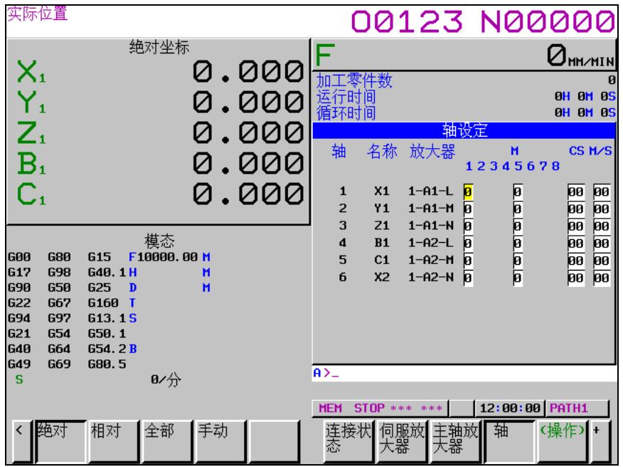

<details>
<summary>text_image</summary>

实际位置
00123 N00000
绝对坐标
X₁ 0.000
Y₁ 0.000
Z₁ 0.000
B₁ 0.000
C₁ 0.000
模态
G00 G80 G15 F10000.00 M
G17 G98 G40.1 H M
G90 G50 G25 D M
G22 G67 G160 T
G94 G97 G13.1 S
G21 G54 G50.1
G40 G64 G54.2 B
G49 G69 G80.5
S 0/分
F
MM/MIN
加工零件数 0
运行时间 0H 0M 0S
循环时间 0H 0M 0S
轴设定
轴 名称 放大器 M CS M/S
1 2 3 4 5 6 7 8
1 X1 1-A1-L 0 0 00 00
2 Y1 1-A1-M 0 0 00 00
3 Z1 1-A1-N 0 0 00 00
4 B1 1-A2-L 0 0 00 00
5 C1 1-A2-M 0 0 00 00
6 X2 1-A2-N 0 0 00 00
A >_
MEM STOP *** *** 12:00:00 PATH1
连接状态 伺服放大器 主轴放大器 轴 (操作) +
< 绝对 相对 全部 手动
</details>

轴设定画面上显示如下项目。无法设定项目不予显示。（上图表示连接了第1台和第5台位置检测器接口单元，可以使用Cs轮廓控制和双电机驱动控制的情形。）

- 轴……控制轴号  
按照 NC 的控制轴顺序显示。  
- 名称……每个轴的程序轴名称  
- 放大器……连接在每个轴上的伺服放大器的 FSSB 线路号码和放大器类型  
- M1 ......第 1 台位置检测器接口单元的连接器号码  
- M2......第 2 台位置检测器接口单元的连接器号码  
- M3 ......第 3 台位置检测器接口单元的连接器号码  
- M4......第 4 台位置检测器接口单元的连接器号码  
- M5 ......第 5 台位置检测器接口单元的连接器号码  
- M6......第6台位置检测器接口单元的连接器号码  
- M7 ......第 7 台位置检测器接口单元的连接器号码  
- M8......第 8 台位置检测器接口单元的连接器号码显示 FSSB 自动设定时设定的连接器号码。

\- CS......Cs 轮廓控制轴
显示 FSSB 自动设定时设定的 Cs 轮廓控制轴的主轴号码。

\- M/S......主动轴/从动轴（从动轴 / 虚设轴）
显示 FSSB 自动设定时设定的双电机驱动控制的主动轴、从动轴的设定，或者电子齿轮箱(EGB)的从动轴、虚设轴的设定。

另外，M1～8、Cs、M/S 的值为 FSSB 自动设定时设定的值，并不表示现在有效的设定。通电后的第一次显示上一次正常设定的值。此外，发生与 FSSB 相关的报警时，显示 “0”。

## 注释

0i-F 中，可以使用 FSSB 第 1 线路、位置检测器接口 1～4 台。

## (5) 位置检测器接口单元画面

在位置检测器接口单元画面上，显示位置检测器接口单元画面的信息。

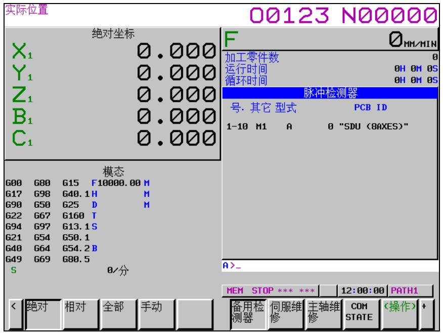

<details>
<summary>text_image</summary>

实际位置
00123 N00000
绝对坐标
X₁ 0.000
Y₁ 0.000
Z₁ 0.000
B₁ 0.000
C₁ 0.000
F 0MM/MIN
加工零件数 0
运行时间 0H 0M 0S
循环时间 0H 0M 0S
脉冲检测器
号. 其它 型式 PCB ID
1-10 M1 A 0 "SDU (BAXES)"
模态
G80 G80 G15 F10000.00 M
G17 G98 G40.1 H M
G90 G50 G25 D M
G22 G67 G160 T
G94 G97 G13.1 S
G21 G54 G50.1
G40 G64 G54.2 B
G49 G69 G80.5
S 0/分
A >_
MEM STOP *** ***
12:00:00 PATH1
< 绝对 相对 全部 手动
备用检 伺服维 主轴维 COM （操作） +
测器 修 修 STATE
</details>

位置检测器接口单元画面上显示如下项目。

\- 号……从控装置号

在 FSSB 线路号码（1: 第一 FSSB 线）和“-”（连字符）的后面，显示从控装置号码（线路中连接顺序）。（每一条线路的最大从控装置数为 32，但是位置检测器接口单元的每一条线路的最大数为 4）

\- 作为位置检测器接口单元信息，显示下列项目的信息。

\- 其它

在表示位置检测器接口单元的开头字母 “M” 之后，显示从靠近 CNC 一侧数起的表示第几台位置检测器接口单元的数字。

\- 型式

位置检测器接口单元的型式，以字母予以显示。

\- PCB ID

显示位置检测器接口单元的 ID。

此外，若是位置检测器模块（8 轴），“SDU (8AXES)”显示在位置检测器接口单元的 ID 之后，若是位置检测器模块（4 轴），“SDU (4AXES)”显示在位置检测器接口单元的 ID 之后。

## (6) 伺服放大器维修画面

在伺服放大器维修画面上显示伺服放大器的维护信息。

伺服放大器维护画面有下列 2 个画面，通过光标键←→进行切换。

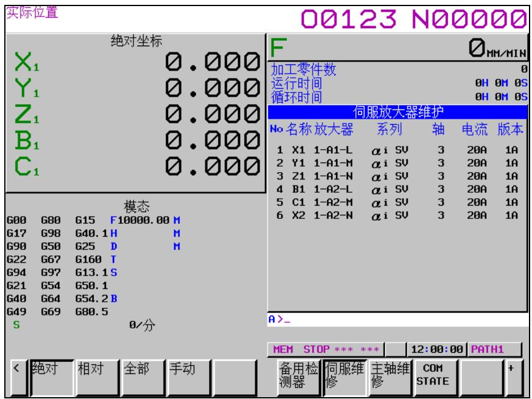

<details>
<summary>text_image</summary>

实际位置
00123 N00000
绝对坐标
X₁ 0.000
Y₁ 0.000
Z₁ 0.000
B₁ 0.000
C₁ 0.000
模态
G00 G80 G15 F10000.00 M
G17 G98 G40.1 H M
G90 G50 G25 D M
G22 G67 G160 T
G94 G97 G13.1 S
G21 G54 G50.1
G40 G64 G54.2 B
G49 G69 G80.5
S 0/分
F
MM/MIN
加工零件数 0
运行时间 0H 0M 0S
循环时间 0H 0M 0S
伺服放大器维护
No 名称 放大器 系列 轴 电流 版本
1 X1 1-A1-L αi SV 3 20A 1A
2 Y1 1-A1-M αi SV 3 20A 1A
3 Z1 1-A1-N αi SV 3 20A 1A
4 B1 1-A2-L αi SV 3 20A 1A
5 C1 1-A2-M αi SV 3 20A 1A
6 X2 1-A2-N αi SV 3 20A 1A
A >_
MEM STOP *** *** 12:00:00 PATH1
< 绝对 相对 全部 手动
备用检 伺服维 主轴维 COM
测器 修 修 STATE
</details>

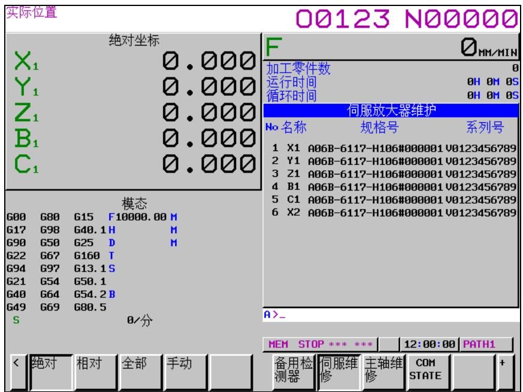

<details>
<summary>text_image</summary>

实际位置
00123 N00000
绝对坐标
X₁ 0.000
Y₁ 0.000
Z₁ 0.000
B₁ 0.000
C₁ 0.000
模态
G00 G80 G15 F10000.00 M
G17 G98 G40.1 H M
G90 G50 G25 D M
G22 G67 G160 T
G94 G97 G13.1 S
G21 G54 G50.1
G40 G64 G54.2 B
G49 G69 G80.5
S 0/分
F MM/MIN
加工零件数 0
运行时间 0H 0M 0S
循环时间 0H 0M 0S
伺服放大器维护
No 名称 规格号 系列号
1 X1 A06B-6117-H106#000001 V0123456789
2 Y1 A06B-6117-H106#000001 V0123456789
3 Z1 A06B-6117-H106#000001 V0123456789
4 B1 A06B-6117-H106#000001 V0123456789
5 C1 A06B-6117-H106#000001 V0123456789
6 X2 A06B-6117-H106#000001 V0123456789
A >_
MEM STOP *** 12:00:00 PATH1
< 绝对 相对 全部 手动
备用检 伺服维 主轴维 COM
测器 修 修 STATE
</details>

伺服放大器维修画面上显示如下项目。

- No......控制轴号  
- 名称……每个轴的程序轴名称  
- 放大器....连接在每个轴上的伺服放大器的FSSB线路号码和放大器类型  
- 系列……连接在每个轴上的伺服放大器的伺服放大器单元的种类、系列（ $\beta i$ SV与系列名的显示不对应。）  
- 轴……连接在每个轴上的伺服放大器的伺服放大器最大轴数  
- 电流……连接在每个轴上的伺服放大器的最大电流值  
- 版本……连接在每个轴上的伺服放大器的单元版本  
- 规格号……连接在每个轴上的伺服放大器的放大器图号  
- 系列号……连接在每个轴上的伺服放大器的序列号

## (7) 主轴放大器维修画面

在主轴放大器维修画面上显示主轴放大器的维护信息。

主轴放大器维护画面有下列 2 个画面，通过光标键 ← → 进行切换。

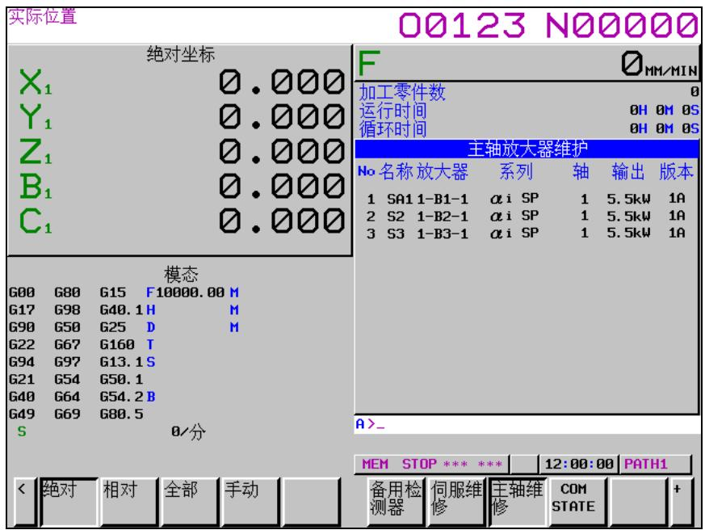

<details>
<summary>text_image</summary>

实际位置
00123 N00000
绝对坐标
X₁ 0.000
Y₁ 0.000
Z₁ 0.000
B₁ 0.000
C₁ 0.000
模态
G00 G80 G15 F10000.00 M
G17 G98 G40.1 H M
G90 G50 G25 D M
G22 G67 G160 T
G94 G97 G13.1 S
G21 G54 G50.1
G40 G64 G54.2 B
G49 G69 G80.5
S 0/分
F
MM/MIN
加工零件数 0
运行时间 0H 0M 0S
循环时间 0H 0M 0S
主轴放大器维护
No 名称 放大器 系列 轴 输出 版本
1 SA1 1-B1-1 αi SP 1 5.5kW 1A
2 S2 1-B2-1 αi SP 1 5.5kW 1A
3 S3 1-B3-1 αi SP 1 5.5kW 1A
A >_
MEM STOP *** *** 12:00:00 PATH1
< 绝对 相对 全部 手动
备用检 伺服维 主轴维 COM
测器 修 维 CHM STATE
</details>

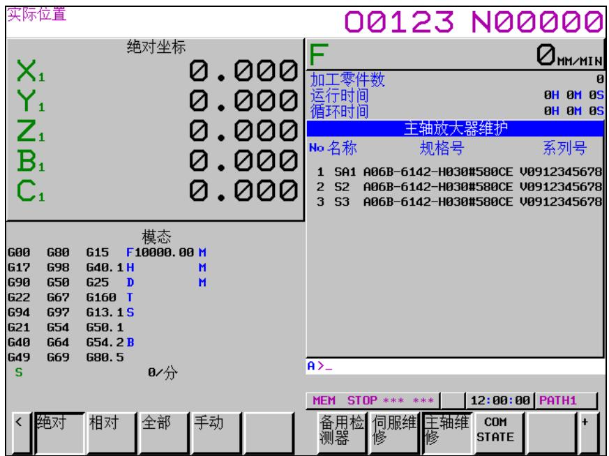

<details>
<summary>text_image</summary>

实际位置
00123 N00000
绝对坐标
X₁ 0.000
Y₁ 0.000
Z₁ 0.000
B₁ 0.000
C₁ 0.000
F
MM/MIN
加工零件数 0
运行时间 0H 0M 0S
循环时间 0H 0M 0S
主轴放大器维护
No 名称 规格号 系列号
1 SA1 A06B-6142-H030#580CE V0912345678
2 S2 A06B-6142-H030#580CE V0912345678
3 S3 A06B-6142-H030#580CE V0912345678
模态
G00 G80 G15 F10000.00 M
G17 G98 G40.1 H M
G90 G50 G25 D M
G22 G67 G160 T
G94 G97 G13.1 S
G21 G54 G50.1
G40 G64 G54.2 B
G49 G69 G80.5
S 0/分
A >_
MEM STOP *** ***
12:00:00 PATH1
< 绝对 相对 全部 手动
备用检 伺服维 主轴维 COM
测器 修 修 STATE
</details>

主轴放大器维修画面上显示如下项目。

- No....主轴号  
- 名称……主轴名称  
- 放大器....连接在每个轴上的主轴放大器的FSSB线路号码和放大器类型  
- 系列……连接在每个轴上的主轴放大器的主轴放大器单元的种类、系列  
- 轴……连接在每个轴上的主轴放大器的主轴放大器最大轴数  
- 输出……连接在每个轴上的主轴放大器的额定输出  
- 版本……连接在每个轴上的主轴放大器的单元版本  
- 规格号……连接在每个轴上的主轴放大器的放大器图号  
- 系列号……连接在每个轴上的主轴放大器的序列号

## FSSB 自动设定的步骤

进行 FSSB 自动设定时，在如下(1)～(3)的 FSSB 设定画面上进行设定。

(1) 伺服放大器设定画面

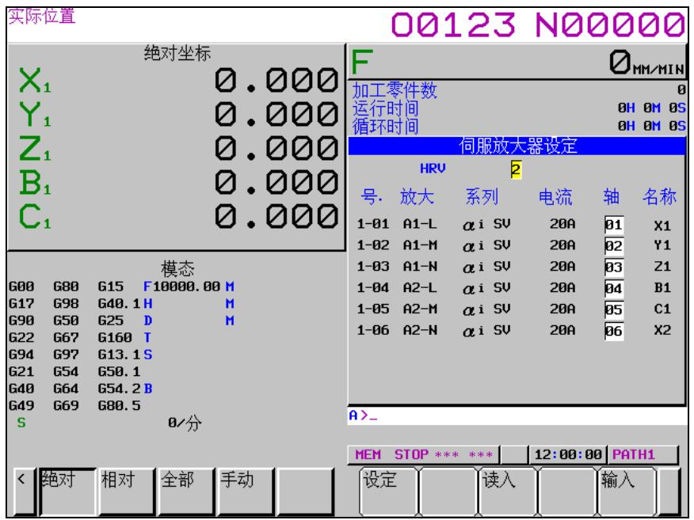

<details>
<summary>text_image</summary>

实际位置
00123 N00000
绝对坐标
X₁ 0.000
Y₁ 0.000
Z₁ 0.000
B₁ 0.000
C₁ 0.000
模态
G00 G80 G15 F10000.00 M
G17 G98 G40.1 H M
G90 G50 G25 D M
G22 G67 G160 T
G94 G97 G13.1 S
G21 G54 G50.1
G40 G64 G54.2 B
G49 G69 G80.5
S 0/分
F
MM/MIN
加工零件数 0
运行时间 0H 0M 0S
循环时间 0H 0M 0S
伺服放大器设定
HRV 2
号. 放大 系列 电流 轴 名称
1-01 A1-L αi SV 20A 01 X1
1-02 A1-M αi SV 20A 02 Y1
1-03 A1-N αi SV 20A 03 Z1
1-04 A2-L αi SV 20A 04 B1
1-05 A2-M αi SV 20A 05 C1
1-06 A2-N αi SV 20A 06 X2
A >_
MEM STOP *** *** 12:00:00 PATH1
< 绝对 相对 全部 手动 设定 读入 输入
</details>

伺服放大器设定画面上可以设定如下项目。

\- HRV …… 电流控制周期

在“2”～“3”的范围内输入电流控制周期。

当输入了范围外的值时，发出警告 “数据超限”。

\- 轴……控制轴号

在 “0”～最大控制轴数的范围内输入控制轴号。

当输入了范围外的值时，发出警告“数据超限”。设定了”0”时，为不使用该伺服放大器的设定。

(2) 主轴放大器设定画面

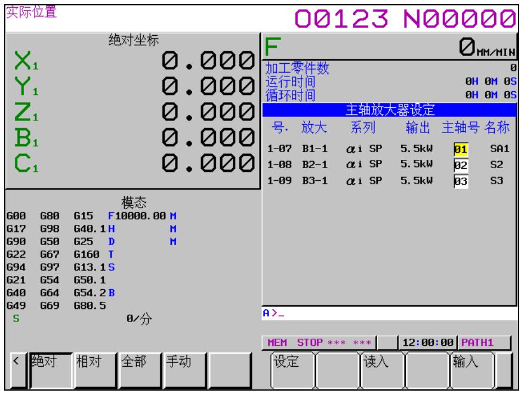

<details>
<summary>text_image</summary>

实际位置
00123 N00000
绝对坐标
X₁ 0.000
Y₁ 0.000
Z₁ 0.000
B₁ 0.000
C₁ 0.000
模态
G80 G80 G15 F10000.00 M
G17 G98 G40.1 H M
G90 G50 G25 D M
G22 G67 G160 T
G94 G97 G13.1 S
G21 G54 G50.1
G40 G64 G54.2 B
G49 G69 G80.5
S 0/分
F
MM/MIN
加工零件数 0
运行时间 0H 0M 0S
循环时间 0H 0M 0S
主轴放大器设定
号. 放大 系列 输出 主轴号 名称
1-07 B1-1 αi SP 5.5kW 01 SA1
1-08 B2-1 αi SP 5.5kW 02 S2
1-09 B3-1 αi SP 5.5kW 03 S3
A >_
MEM STOP *** 12:00:00 PATH1
< 绝对 相对 全部 手动 设定 读入 输入
</details>

主轴放大器设定画面上可以设定如下项目。

\- 主轴号……主轴号

在 “0”～最大主轴数的范围内输入主轴号。

当输入了范围外的值时，发出警告“数据超限”。设定了”0”时，为不使用该主轴放大器的设定。

## (3) 轴设定画面

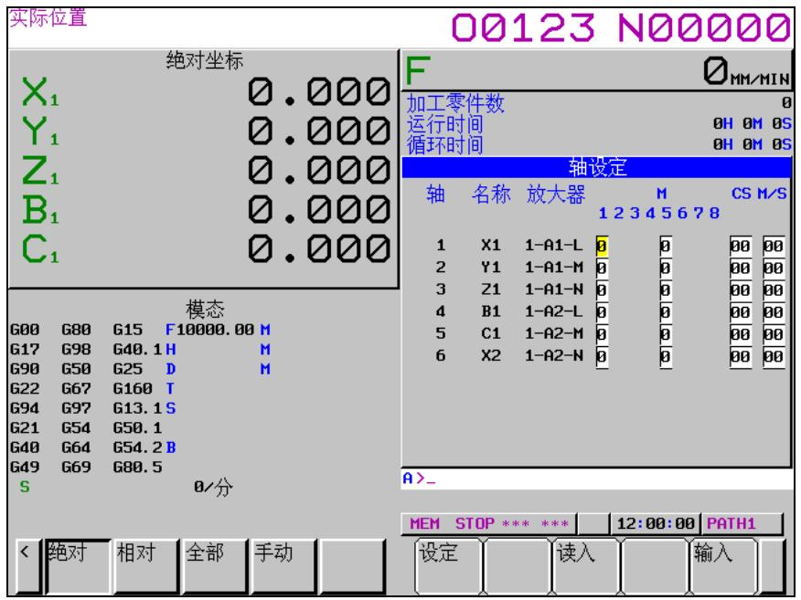

<details>
<summary>text_image</summary>

实际位置
00123 N00000
绝对坐标
X₁ 0.000
Y₁ 0.000
Z₁ 0.000
B₁ 0.000
C₁ 0.000
模态
G00 G80 G15 F10000.00 M
G17 G98 G40.1 H M
G90 G50 G25 D M
G22 G67 G160 T
G94 G97 G13.1 S
G21 G54 G50.1
G40 G64 G54.2 B
G49 G69 G80.5
S 0/分
F 0MM/MIN
加工零件数 0
运行时间 0H 0M 0S
循环时间 0H 0M 0S
轴设定
轴 名称 放大器 M CS M/S
1 2 3 4 5 6 7 8
1 X1 1-A1-L 0 0 00 00
2 Y1 1-A1-M 0 0 00 00
3 Z1 1-A1-N 0 0 00 00
4 B1 1-A2-L 0 0 00 00
5 C1 1-A2-M 0 0 00 00
6 X2 1-A2-N 0 0 00 00
A >_
MEM STOP *** *** 12:00:00 PATH1
< 绝对 相对 全部 手动 设定 读入 输入
</details>

轴设定画面上可以设定如下项目。

- M1 ......第 1 台位置检测器接口单元的连接器号码  
- M2 ......第 2 台位置检测器接口单元的连接器号码  
- M3 ......第 3 台位置检测器接口单元的连接器号码  
- M4......第 4 台位置检测器接口单元的连接器号码  
- M5 ......第 5 台位置检测器接口单元的连接器号码  
• M6......第 6 台位置检测器接口单元的连接器号码  
- M7 ......第 7 台位置检测器接口单元的连接器号码  
- M8......第8台位置检测器接口单元的连接器号码

对于使用各位置检测器接口单元的轴，以 1～8（位置检测器接口单元的最大连接器数范围内）输入该连接器号。不使用各位置检测器接口单元时，输入 “0”。输入了超出范围的值时，发出警告 “数据超限”。尚未连接的位置检测器接口单元的项目不予显示，无法进行输入。


- CS …… Cs 轮廓控制轴  
若是 Cs 轮廓控制轴，以 1～最大主轴数输入主轴号。不使用 Cs 轮廓控制轴时，输入 "0"。输入了超出范围的值时，发出警告 “数据超限”。无法使用 Cs 轮廓控制时，项目不予显示而无法进行输入。

\- M/S ……主动轴/从动轴（从动轴 / 虚设轴）

对于双电机驱动控制的主轴轴、从动轴，请在1～最大控制轴数的范围内设定奇数（主动轴）、偶数（从动轴）连续的号码。此外，对于电子齿轮箱(EGB)的从动轴、虚设轴，请在1～最大控制轴数的范围内设定奇数（从动轴）、偶数（虚设轴）连续的号码。输入了超出范围的值时，发出警告“数据超限”。另外，对于EGB的从动轴、虚设轴，请将参数SYN(No.2011#0)设定为1。双电机驱动控制和电子齿轮箱都无法使用的情况下，项目不予显示而无法进行输入。

在 FSSB 设定画面（连接状态画面、伺服放大器维修画面、主轴放大器维修画面除外）上，按下软键 [(操作)] 时，显示如下软键。


<details>
<summary>text_image</summary>

< 绝对 相对 全部 手动 设定 读入 输入
</details>

输入数据时，设定为 MDI 方式或者紧急停止状态，使光标移动到输入项目位置，键入后按下软键 [输入]。

(或者按下 MDI 面板上的 INPUT 键)

输入后按下软键 [设定]，如设定值有误，则发出如下警告；如果正确，即设定 FSSB 相关的参数。在输入错误值等时，若希望返回到上一次正常设定的值，按下软键 [读入]。

此外，通电后的第一次显示上一次正常设定的值。

## 注释

0i-F 中，可以使用 FSSB 第 1 线路、位置检测器接口 1～4 台。

## FSSB 自动设定警告

FSSB 自动设定时，在设定值有误的情况下，发生如下警告。另外，EGB 虚设轴的设定，是指参数 SYN(No.2011#0)=1 的轴在轴设定画面上在 M/S 中设定了偶数的情形。EGB 从动轴的设定，是指参数 SYN(No.2011#0)=1 的轴在轴设定画面上在 M/S 中设定了奇数的情形。


## 8.3 伺服调整画面

## 8.3.1 参数的设定

设定显示伺服调整画面的参数。


### PMC报警: 
- **故障内容**: #7
- **处理办法**: #6

### PMC报警: 3111
- **故障内容**: 
- **处理办法**: 


[输入类型] 参数输入

[数据类型] 位路径型

#0 SVS 是否进行伺服设定画面、伺服调整画面的显示

0: 不进行。

1: 进行。

## 8.3.2 显示伺服调整画面

1. 按下功能键 ▶ SYSTEM 、 ▶ 、软键 [SV 参数]。

2. 按下软键 [SV 调整]，选择伺服调整画面。

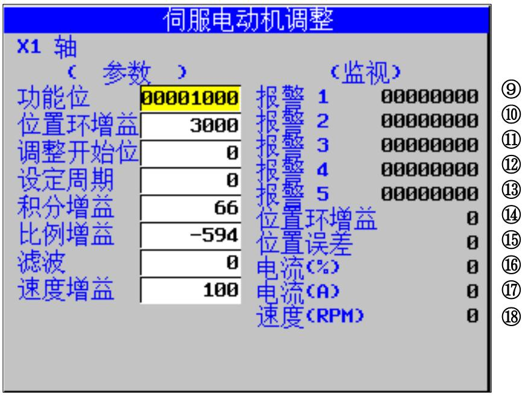

<details>
<summary>text_image</summary>

伺服电动机调整
X1 轴
（ 参数 ） （监视）
功能位	00001000 报警 1	00000000
位置环增益	3000 报警 2	00000000
调整开始位	0 报警 3	00000000
设定周期	0 报警 4	00000000
积分增益	66 报警 5	00000000
比例增益	-594 位置环增益	0
滤波	0 位置误差	0
速度增益	100 电流(%)	0
速度(RPM)	0
⑨
⑩
⑪
⑫
⑬
⑭
⑮
⑯
⑰
⑱
</details>

① 功能位 : 参数(No.2003)  
② 位置环增益 : 参数(No.1825)  
③ 调整开始位：  
④ 设定周期：  
⑤ 积分增益 : 参数(No.2043)  
⑥ 比例增益 : 参数(No.2044)  
⑦ 滤波 : 参数(No.2067)  
⑧ 速度增益 : 设定值= $\frac{(\text{参数 No.2021}) + 256}{256} \times 100$  
⑨ 报警 1 : 诊断号 200 号  
⑩ 报警 2 : 诊断号 201 号  
(1) 报警 3 : 诊断号 202 号  
⑫ 报警 4 : 诊断号 203 号  
⑬ 报警 5 : 诊断号 204 号

⑭ 位置环增益：表示实际环路增益。  
⑮ 位置误差：表示实际位置误差值 (诊断号 300)。  
⑯ 电流（%）：以相对于电机额定值的百分比表示电流值。（参数 SPF(No.2014#5)=0 时）  
负载(%) : 以相对于电机额定值的百分比显示输出值。（参数 SPF(No.2014#5)=1 时）  
⑰ 电流(A) : 以 A（峰值）表示实际电流。（参数 SPF(No.2014#5)=1 时不予显示。）  
⑱ 速度(RPM) ： 表示电机实际转速。


### PMC报警: #7
- **故障内容**: #6
- **处理办法**: #5

### PMC报警: OVL
- **故障内容**: LVA
- **处理办法**: OVC

### PMC报警: ALD
- **故障内容**: 
- **处理办法**: 

### PMC报警: 
- **故障内容**: CSA
- **处理办法**: BLA

### PMC报警: DTE
- **故障内容**: CRC
- **处理办法**: STB

### PMC报警: 
- **故障内容**: OFS
- **处理办法**: MCC


注释

空栏不是报警代码。

## 8.4 调整返回参考点位置（挡块方式）

概述  
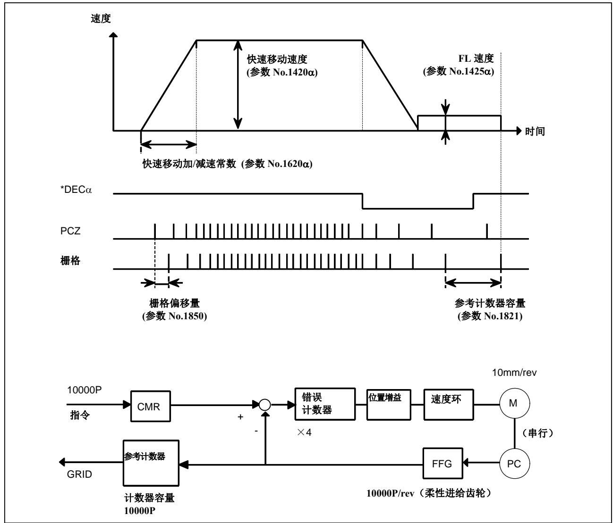

<details>
<summary>flowchart</summary>

```mermaid
graph TD
  A["速度"] --> B["快速移动加/减速常数 (参数 No.1620α)"]
  B --> C["FL 速度 (参数 No.1425α)"]
  C --> D["时间"]
  D --> E["PCZ"]
  E --> F["栅格"]
  F --> G["栅格偏移量 (参数 No.1850)"]
  G --> H["参考计数器容量 (参数 No.1821)"]
  H --> I["10mm/rev"]
  I --> J["错误计数器"]
  J --> K["位置增益"]
  K --> L["速度环"]
  L --> M["M (串行)"]
  M --> N["FFG"]
  N --> O["PC"]
  O --> P["计数器容量 10000P"]
  P --> Q["+"]
  Q --> R["×4"]
  R --> S["-"]
  S --> T["指令 10000P"]
  T --> U["CMR"]
  U --> V["计数器容量 10000P"]
  V --> W["GRID"]
  W --> X["参考计数器"]
  X --> Y["10000P/rev (柔性进给齿轮)"]
```
</details>

参数  
相关的参数有如下一些。


### PMC报警: 
- **故障内容**: #7
- **处理办法**: #6

### PMC报警: 1005
- **故障内容**: 
- **处理办法**: 


[输入类型] 参数输入

[数据类型] 位轴型

#1 DLZx 将无挡块参考点设定功能设定为

0: 无效。

1: 有效。

1821

每个轴的参考计数器容量

注释

在设定完此参数后，需要暂时切断电源。

[输入类型] 参数输入

[数据类型] 2 字轴型

[数据单位] 检测单位

[数据范围] 0 \~ 999999999

此参数设定参考计数器的容量。

参考计数器的容量，指定为执行栅格方式的返回参考点的栅格间隔。设定值在 0 以下时，将其视为 10000。

在使用附有绝对地址参照标记的光栅尺时，设定标记 1 的间隔。

1850

每个轴的栅格偏移量/参考点偏移量

注释

在设定完此参数后，需要暂时切断电源。

[输入类型] 参数输入

[数据类型] 2 字轴型

[数据单位] 检测单位

[数据范围] -99999999 \~ 99999999

此参数为每个轴设定使参考点位置偏移的栅格偏移量或者参考点偏移量。

可以设定的栅格量为参考计数器容量以下的值。

参数 SFDx(No.1008#4)为 “0” 时，成为栅格偏移量，为 “1” 时成为参考点偏移量。

注释

若是无挡块参考点设定，仅可使用栅格偏移。（不能使用参考点偏移。）

1815

#7 #6 #5 #4 #3 #2 #1 #0


### PMC报警: 
- **故障内容**: APCx
- **处理办法**: APZx


[输入类型] 参数输入

[数据类型] 位轴型

注释

在设定完此参数后，需要暂时切断电源。

#1 OPTx 作为位置检测器，

0: 不使用外置脉冲编码器。

1: 使用外置脉冲编码器。

## 注释

使用带有参照标记的光栅尺、或者带有绝对地址原点的光栅尺（全闭环系统）时，将参数值设定为“1”。

#4 APZx 作为位置检测器使用绝对位置检测器时，机械位置与绝对位置检测器之间的位置对应关系

0: 尚未建立。

1: 已经结束。

使用绝对位置检测器时，在进行第 1 次调节时或更换绝对位置检测器时，务须将其设定为 “0”，再次通电后，通过执行手动返回参考点等操作进行绝对位置检测器的原点设定。由此，完成机械位置与绝对位置检测器之间的位置对应，此参数即被自动设定为 “1”。

#5 APCx 位置检测器为

0: 绝对位置检测器以外的检测器。

1: 绝对位置检测器（绝对脉冲编码器）。

## - 外置脉冲编码器、光栅尺的情形

1821

每个轴的参考计数器容量

通常，将电机每转动一圈的反馈脉冲数作为参考计数器容量予以设定。

※ 光栅尺上多处具有参照标记的情况下，有时将该距离以整数相除的值作为参考计数器容量予以设定。

(例)

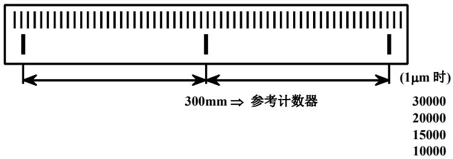

<details>
<summary>text_image</summary>

300mm ⇒ 参考计数器
(1μm 时)
30000
20000
15000
10000
</details>

## 8.5 无挡块参考点设定

这是即使在机床可动部尚未安装用于返回参考点的挡块和用于减速的限位开关的情况下，也可以使其返回到机床制造商所确定的参考（基准）点的功能。

使用绝对位置检测器的情况下，一度设定的参考点即使在切断电源之后仍然后会被保持起来。因此，在更换绝对位置检测器时，或者绝对位置丢失等情况下，进行此设定。

## 概述

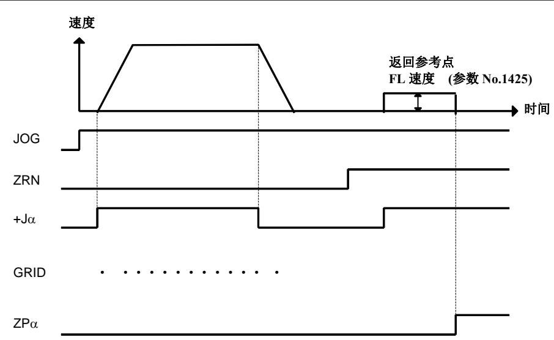

<details>
<summary>line chart</summary>

| Time | JOG | ZRN | +Jα | GRID | ZPα |
|------|-----|-----|-----|------|-----|
| Start | Low | Low | Low | - | - |
| Midpoint | High | Low | Low | - | - |
| Final | - | - | - | - | - |
</details>

## 操作

① 在 JOG 进给下朝着参考点返回方向，将希望设定参考点的轴定位于紧靠参考点的附近位置。  
② 选择手动参考点返回方式，将希望设定参考点的轴的进给轴方向选择信号（正向或者负向）设定为“1”。  
③ 定位于以从当前点到参数 ZMIx(No.1006#5) 中所确定的参考点返回方向的最靠近栅格（基于位置检测器的每转信号的电气格子）位置，将该点作为参考点。  
④ 确认已经到位后，参考点返回结束信号(ZP1)和参考点建立信号(ZRF1)即被设定为“1”。  
※ 在参考点设定完以后，将 ZRN 信号设定为 “1”，通过手动方式赋予轴向信号，刀具就返回到参考点。

## 参数

相关的参数有如下一些。


### PMC报警: 
- **故障内容**: #7
- **处理办法**: #6

### PMC报警: 1005
- **故障内容**: 
- **处理办法**: 


[输入类型] 参数输入

[数据类型] 位轴型

#1 DLZx 将无挡块参考点设定功能设定为

0: 无效。

1: 有效。


### PMC报警: 
- **故障内容**: #7
- **处理办法**: #6

### PMC报警: 1006
- **故障内容**: 
- **处理办法**: 


[输入类型] 参数输入

[数据类型] 位轴型

注释

在设定完此参数后，需要暂时切断电源。

#5 ZMIx 手动返回参考点的方向为

0: 正方向。

1: 负方向。

## 8.6 α i伺服的警告接口

## 概述

在 $\alpha i$ 伺服系统中，有关下列对象报警，可在发出报警之前通知警告状态。

进入警告状态时，系统通知 PMC。

此信号，譬如在发出警告到成为伺服报警之前的期间，可在机床一侧执行退刀操作。

## 信号

## 伺服警告详细信号 SVWRN1～4 <F093.4～F093.7>

[分类] 输出信号

[功能] 根据伺服放大器的状态，通知对应的警告信号。

[输出条件] 下面示出伺服放大器的警告状态和对应的警告信号。


### PMC报警: 对应的报警信息
- **故障内容**: 警告状态信号
- **处理办法**: 警告状态信号发生后,到发出报警之前的时间

### PMC报警: SVWRN4<F093.7>
- **故障内容**: SVWRN3<F093.6>
- **处理办法**: SVWRN2<F093.5>

### PMC报警: SV0444 逆变器冷却风扇故障
- **故障内容**: 1
- **处理办法**: 0

### PMC报警: SV0601 逆变器散热风扇故障
- **故障内容**: 1
- **处理办法**: 0

### PMC报警: SV0040 PS EXTERNAL INPUTCOMPONENT ERROR(外部输入设备异常)
- **故障内容**: 1
- **处理办法**: 0

### PMC报警: SV0443 变频器冷却风扇故障
- **故障内容**: 1
- **处理办法**: 1

### PMC报警: SV0606 变频器冷却风扇故障
- **故障内容**: 1
- **处理办法**: 1

### PMC报警: SV0431 变频器过载
- **故障内容**: 1
- **处理办法**: 1


下面示出警告处理的时间图。

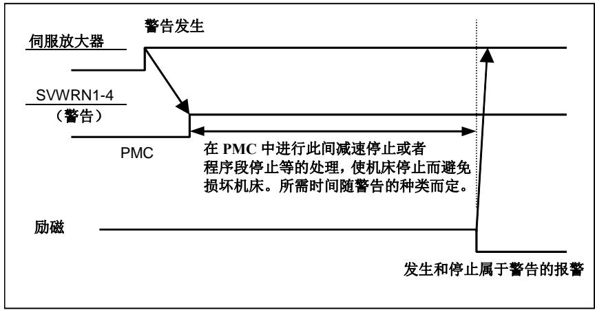

<details>
<summary>flowchart</summary>

```mermaid
graph TD
  A["伺服放大器"] --> B["警告发生"]
  C["SVWRN1-4 (警告)"] --> D["在 PMC 中进行此间减速停止或者程序段停止等的处理，使机床停止而避免损坏机床。所需时间随警告的种类而定。"]
  E["PMC"] --> D
  F["励磁"] --> G["发生和停止属于警告的报警"]
```
</details>

信号地址


### PMC报警: 
- **故障内容**: #7
- **处理办法**: #6

### PMC报警: F093
- **故障内容**: SVWRN4
- **处理办法**: SVWRN3


## ai 伺服放大器的警告状态报警

参数 SWP(No.1807#2)=0 时，在成为 $\alpha i$ 伺服放大器警告状态时，除了伺服警告详细信号输出外，发生 DS 报警。

因如下报警自动运行成为进给暂停状态，包括 PMC 轴在内，全部控制轴减速停止。伺服电机的励磁不会在警告状态报警下失效。


### PMC报警: 伺服放大器在警告状态下的报警号码
- **故障内容**: 伺服放大器在报警状态下的报警号码
- **处理办法**: 报警信息

### PMC报警: DS0608
- **故障内容**: SV0444
- **处理办法**: 逆变器冷却风扇故障

### PMC报警: DS0609
- **故障内容**: SV0601
- **处理办法**: 逆变器散热风扇故障

### PMC报警: DS0610
- **故障内容**: SV0443
- **处理办法**: 变频器冷却风扇故障

### PMC报警: DS0611
- **故障内容**: SV0606
- **处理办法**: 变频器冷却风扇故障

### PMC报警: DS0612
- **故障内容**: SV0431
- **处理办法**: 变频器过载

### PMC报警: DS0613
- **故障内容**: SV0607
- **处理办法**: 变频器主电源缺相


上述警告状态下发生报警后， $\alpha i$ 伺服放大器实际成为报警状态时，伺服电机的励磁失效，追加显示报警状态下的报警号码。

参数 SWP(No.1807#2)=1 时， $\alpha i$ 伺服放大器成为警告状态时，只输出伺服警告详细信号，不会发生警告状态下的报警(报警 DS0608～DS0613)。自动运行中成为警告状态时，自动运行继续进行，因而请在伺服电机的励磁失效之前，使用伺服警告详细信号使得轴减速停止。若不进行减速停止的处理，在轴移动中会导致励磁突然失效，要予以注意。

参数


### PMC报警: 
- **故障内容**: #7
- **处理办法**: #6

### PMC报警: 1807
- **故障内容**: 
- **处理办法**: 


[输入类型] 参数输入

[数据类型] 位路径型

#2 SWP 指定 $\alpha i$ 伺服放大器的警告状态(风扇停止等)下的动作。

0: 放大器处在警告状态时，发出报警。自动运行进入进给暂停状态，伺服轴减速停止。

1: 放大器处在警告状态时，不发出报警。自动运行继续进行。从警告状态进入报警状态时，伺服的励磁失效。

## 注意

在设定为参数 SWP(No.1807#2)=1，外部风扇处于停止的状态下继续运行时，根据运行条件，有可能由于伺服放大器过热而发生“过热报警”、“IPM 报警”、“VRDY-OFF 报警”。发生这些报警时，放大器的励磁失效，伺服电机通过动态制动器而停止，由于是从高速旋转的停止而停止距离延长，因而有损坏工件和刀具的危险性。设定为参数 SWP(No.1807#2)=1 后运行，是在更换风扇之前的暂时措施，希望用户在理解这一点基础上使用。另外，在风扇停止后，应尽快更换风扇，并将参数 SWP(No.1807#2)重新设定为 0。

设定为参数 SWP (No.1807#2)=1 时，外部风扇处在停止状态，可以通过 NC 画面上警告字符 [FAN] 的闪烁显示进行识别，但是，用户应当在机床端监视输出到 PMC 的警告信号，采取相应的措施，提醒操作者处在风扇停止状态下运行设备。

## 8.7 $\alpha i$ 伺服信息画面

## 概述

在 $\alpha i$ 伺服系统中，获取由各连接设备输出的ID信息，输出到CNC画面上。

具有 ID 信息的设备有如下一些。

（注释：即使属于下列设备，在某些情况下没有 ID 信息。）

- 伺服电机  
- 脉冲编码器  
- 伺服放大器(SV)  
- 共同电源(PS)

CNC 首次启动时，自动地从各连接设备读出并记录 ID 信息。从下一次起，对首次记录的信息和当前读出的 ID 信息进行比较，由此就可以监视所连接的设备变更情况。（当记录与实际情况不一致时，显示表示警告的标记(\*)。）

可以对存储的 ID 信息进行编辑。由此，就可以显示不具备 ID 信息的设备的 ID 信息。（但是，与实际情况不一致时，显示表示警告的标记(\*)。）

参数


### PMC报警: 
- **故障内容**: #7
- **处理办法**: #6

### PMC报警: 11320
- **故障内容**: 
- **处理办法**: 


[输入类型] 参数输入

[数据类型] 位路径型

#1 IDC 是否显示统一更新伺服·主轴信息画面的 ID 信息的软键 [ID 数据全更新]

0: 不予显示。

1: 予以显示。

## 注释

唯在参数 IDW(No.13112#0)=1 时 IDC 有效。


### PMC报警: 
- **故障内容**: #7
- **处理办法**: #6

### PMC报警: 13112
- **故障内容**: 
- **处理办法**: 


[输入类型] 参数输入

[数据类型] 位路径型

#0 IDW 是否禁止对伺服或主轴的信息画面进行编辑

0: 禁止。  
1: 不禁止。

#1 SVI 是否显示伺服信息画面

0: 予以显示。  
1: 不予显示。

## 显示伺服信息画面

1 按下功能键 SYSTEM，按下软键 [系统]。  
2 按下软键 [伺服信息] 时，出现如下所示画面。

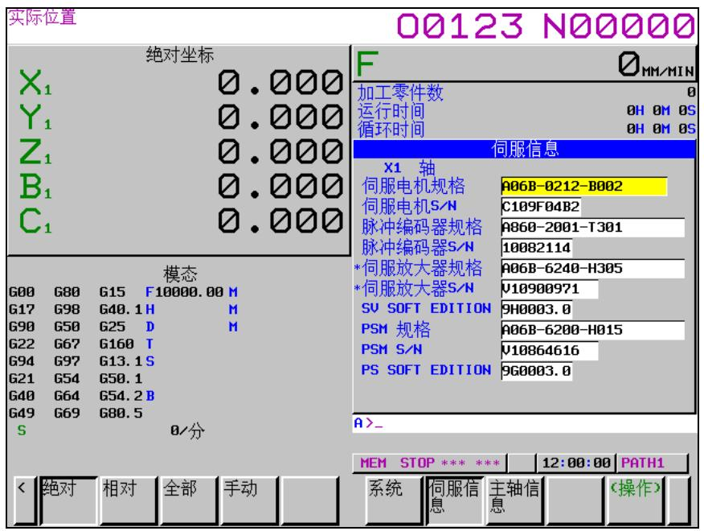

<details>
<summary>text_image</summary>

实际位置
00123 N00000
绝对坐标
X₁ 0.000
Y₁ 0.000
Z₁ 0.000
B₁ 0.000
C₁ 0.000
模态
G00 G80 G15 F10000.00 M
G17 G98 G40.1 H M
G90 G50 G25 D M
G22 G67 G160 T
G94 G97 G13.1 S
G21 G54 G50.1
G40 G64 G54.2 B
G49 G69 G80.5
S 0/分
F 0MM/MIN
加工零件数 0
运行时间 0H 0M 0S
循环时间 0H 0M 0S
伺服信息
X1 轴
伺服电机规格 A06B-0212-B002
伺服电机S/N C109F04B2
脉冲编码器规格 A860-2001-T301
脉冲编码器S/N 10082114
*伺服放大器规格 A06B-6240-H305
*伺服放大器S/N V10900971
SV SOFT EDITION 9H0003.0
PSM 规格 A06B-6200-H015
PSM S/N V18864616
PS SOFT EDITION 9G0003.0
A>_
MEM STOP *** 12:00:00 PATH1
< 绝对 相对 全部 手动 系统 伺服信 主轴信 （操作）
</details>

※ 伺服信息被保存在 FLASH-ROM 中。  
画面所显示的 ID 信息与实际 ID 信息不一致的项目，在项目的左侧显示 “\*”。

## 补充说明

此功能在即使因为需要修理等正当的理由而进行更换的情况，也会检测该更换并显示“\*”标记。

要擦除“\*”标记的显示，请参阅后述的编辑，按照下列步骤更新已被登录的数据。

(1) 可进行编辑。（参数 IDW(No.13112#0)=1）  
(2) 在编辑画面，将光标移动到希望擦除 “\*” 标记的项目。  
(3) 通过软键 [读取 ID] → [输入] → [保存] 进行操作。

此外，为了统一更新所有项目，取消‘\*’标记，请按下软键 [ID 数据全更新] （参数 IDC(No.11320#1)=1）。

## 编辑伺服信息画面

1 设定参数 IDW(No.13112#0)=1。  
2 按下机床操作面板上的 MDI 开关。  
3 按照 “显示伺服信息画面” 的步骤显示如下所示画面。

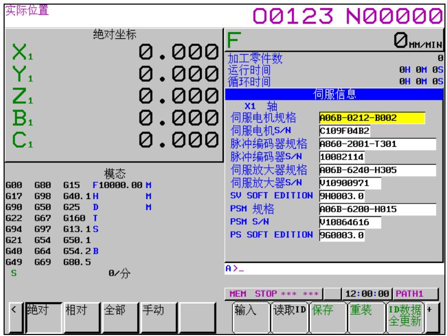

<details>
<summary>text_image</summary>

实际位置
O0123 N00000
绝对坐标
X₁ 0.000
Y₁ 0.000
Z₁ 0.000
B₁ 0.000
C₁ 0.000
模态
G00 G80 G15 F10000.00 M
G17 G98 G40.1 H M
G90 G50 G25 D M
G22 G67 G160 T
G94 G97 G13.1 S
G21 G54 G50.1
G40 G64 G54.2 B
G49 G69 G80.5
S 0/分
F
MM/MIN
加工零件数 0
运行时间 0H 0M 0S
循环时间 0H 0M 0S
伺服信息
X1 轴
伺服电机规格 A06B-0212-B002
伺服电机S/N C109F04B2
脉冲编码器规格 A860-2001-T301
脉冲编码器S/N 10082114
伺服放大器规格 A06B-6240-H305
伺服放大器S/N V10900971
SU SOFT EDITION 9H0003.0
PSM 规格 A06B-6200-H015
PSM S/N V10864616
PS SOFT EDITION 9G0003.0
A >_
MEM STOP *** 12:00:00 PATH1
< 绝对 相对 全部 手动 输入 读取ID 保存 重装 ID数据全更新 +
</details>

4 通过光标键 $\boxed{\uparrow}$ $\boxed{\downarrow}$ ，移动画面上的光标。

画面操作


### PMC报警: 方式
- **故障内容**: 按键操作
- **处理办法**: 用途

### PMC报警: 参照(※1)
- **故障内容**: 翻页键
- **处理办法**: 上下滚动画面。

### PMC报警: 编辑(※2)
- **故障内容**: 软键[输入][读取 ID][保存][重装][ID 数据全更新] (※4)
- **处理办法**: 将所选中的光标位置的 ID 信息改变为键入缓冲区内的字符串。将所选中的光标位置的连接设备具有 ID 信息传输到键入缓冲区。只有左侧显示“*”(※3)的项目有效。将在伺服信息画面上改变的 ID 信息保存在 FLASH-ROM 中。取消在伺服信息画面上改变的 ID 信息,由 FLASH-ROM 上重新加载。对于全部轴统一更新伺服·主轴信息画面上显示的各连接设备的 ID 信息。


(※1) 参照方式：参数 IDW(No.13112#0)=0 的情形  
(※2) 编辑方式：参数 IDW=1 的情形  
(※3) 画面所显示的 ID 信息与实际 ID 信息不一致的项目，在下列项目的左侧显示 “\*”。  
(※4) 参数 IDC(No.11320#1)=1 的情形

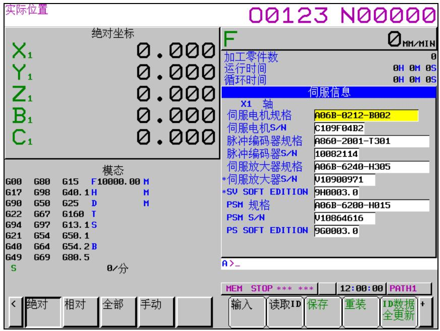

<details>
<summary>text_image</summary>

实际位置
O0123 N00000
绝对坐标
X₁ 0.000
Y₁ 0.000
Z₁ 0.000
B₁ 0.000
C₁ 0.000
模态
G00 G80 G15 F10000.00 M
G17 G98 G40.1 H M
G90 G50 G25 D M
G22 G67 G160 T
G94 G97 G13.1 S
G21 G54 G50.1
G40 G64 G54.2 B
G49 G69 G80.5
S 0/分
F MM/MIN
加工零件数 0
运行时间 0H 0M 0S
循环时间 0H 0M 0S
伺服信息
X1 轴
伺服电机规格 A06B-0212-B002
伺服电机S/N C109F04B2
脉冲编码器规格 A86B-2001-T301
脉冲编码器S/N 10082114
伺服放大器规格 A06B-6240-H305
*伺服放大器S/N V10900971
*SV SOFT EDITION 9H0003.0
PSM 规格 A06B-6200-H015
PSM S/N V10864616
PS SOFT EDITION 9G0003.0
A >_
MEM STOP *** 12:00:00 PATH1
< 绝对 相对 全部 手动 输入 读取ID 保存 重装 ID数据全更新 +
</details>

注释

非 $\alpha i$ 伺服系统的轴，不能获取各连接设备的ID信息。

## 9 AC 主轴

本章将就串行接口主轴放大器的概要、参数等进行描述。

## 9.1 串行接口AC主轴 ..... 424

9.1.1 主轴控制概要....424  
9.1.2 主轴设定调整画面....426  
9.1.3 标准参数的自动设定....433  
9.1.4 警告接口....434  
9.1.5 主轴信息画面....435

## 9.1 串行接口AC主轴

## 9.1.1 主轴控制概要

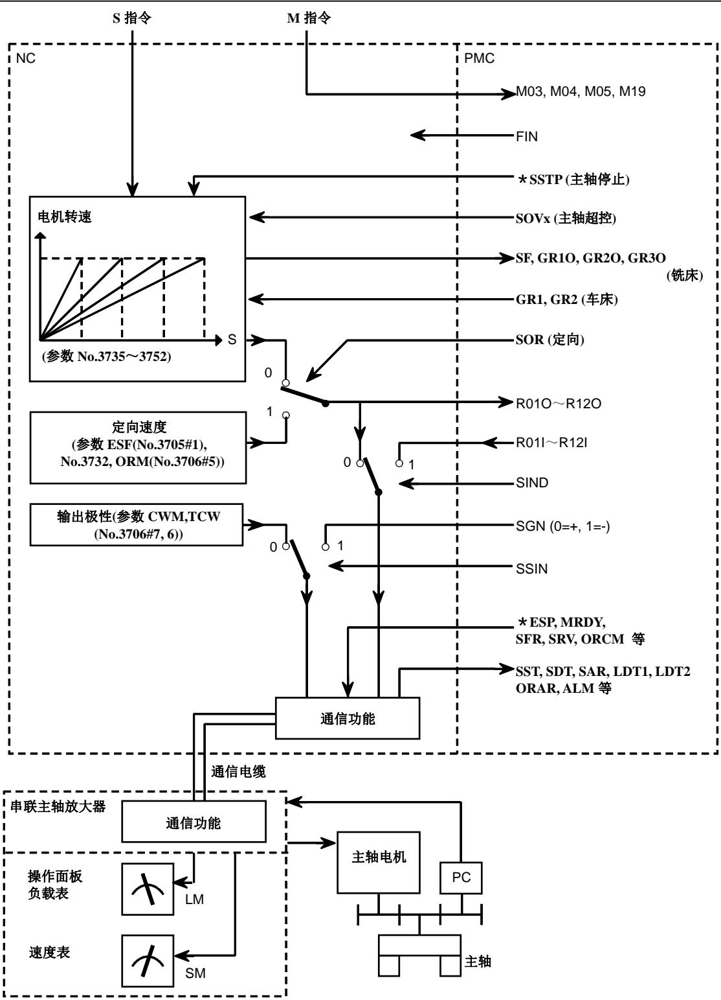

<details>
<summary>flowchart</summary>

```mermaid
graph TD
  A["S指令"] --> B["电机转速"]
  C["M指令"] --> D["电机转速"]
  B --> E["(参数 No.3735~3752)"]
  D --> F["(参数 No.3735~3752)"]
  E --> G["定向速度"]
  F --> H["定向速度"]
  G --> I["(参数 ESF(No.3705#1), No.3732, ORM(No.3706#5))"]
  H --> J["(参数 ESF(No.3705#1), No.3732, ORM(No.3706#5))"]
  I --> K["输出极性(参数 CWM,TCW (No.3706#7, 6))"]
  J --> L["输出极性(参数 CWM,TCW (No.3706#7, 6))"]
  K --> M["通信功能"]
  L --> M
  M --> N["通信电缆"]
  N --> O["通信功能"]
  O --> P["主轴电机"]
  P --> Q["PC"]
  Q --> R["主轴"]
  S["操作面板负载表"] --> T["LM"]
  T --> U["通信电缆"]
  V["速度表"] --> W["SM"]
  W --> X["主轴"]
  Y["NC"] --> Z["电机转速"]
  AA["PMC"] --> AB["*SSTP(主轴停止)"]
  AC["SOVx(主轴超控)"] --> AD["SF, GR1O, GR2O, GR3O"]
  AE["GR1, GR2(车床)"] --> AF["GR1, GR2(车床)"]
  AG["SOR(定向)"] --> AH["R01O~R12O"]
  AI["R01I~R12I"] --> AJ["SIND"]
  AK["SIN"] --> AL["SGN (0=+, 1=)"]
  AM["*ESP, MRDY, SFR, SRV, ORCM 等"] --> AN["SST, SDT, SAR, LDT1, LDT2 ORAR, ALM 等"]
```
</details>

## 9.1.1.1 加工中心系统齿轮切换方式A（参数SGB(No.3705#2)=0）

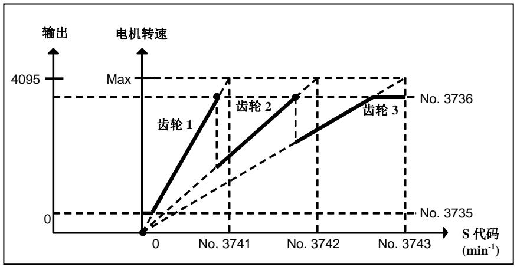

<details>
<summary>line chart</summary>

| S代码 (min⁻¹) | 输出 | 齿轮 1 | 齿轮 2 | 齿轮 3 |
| ------------- | ---- | ------ | ------ | ------ |
| 0             | 0    | 0      | 0      | 0      |
| No. 3741      | 4095 | 4095   | 4095   | 4095   |
| No. 3742      | 4095 | 4095   | 4095   | 4095   |
| No. 3743      | 4095 | 4095   | 4095   | 4095   |
</details>

## 9.1.1.2 加工中心系统齿轮切换方式B（参数SGB(No.3705#2) = 1）

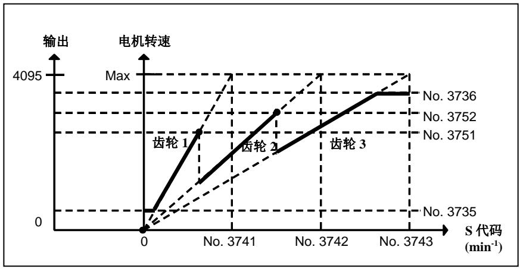

<details>
<summary>line chart</summary>

| S代码 (min⁻¹) | 输出 | 齿轮1 | 齿轮2 | 齿轮3 |
| ------------- | ---- | ----- | ----- | ----- |
| 0             | 0    |       |       |       |
| 3741          |      | 4095  |       |       |
| 3742          |      |       |       |       |
| 3743          | 4095 |       |       | 4095  |
</details>

## 9.1.1.3 车床系统

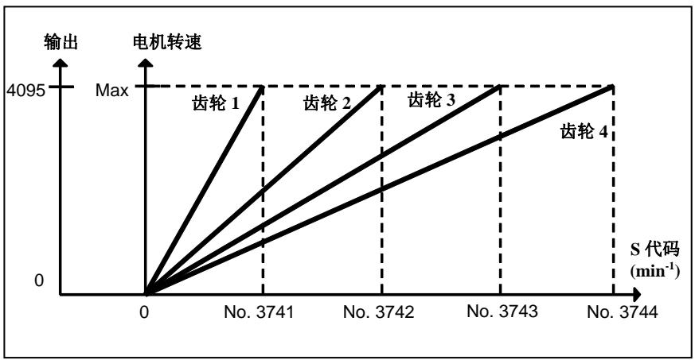

<details>
<summary>line chart</summary>

| S代码 (min⁻¹) | 齿轮 1 | 齿轮 2 | 齿轮 3 | 齿轮 4 |
| ------------- | ------ | ------ | ------ | ------ |
| 0             | 0      | 0      | 0      | 0      |
| No. 3741      | 4095   |        |        |        |
| No. 3742      |        | 4095   |        |        |
| No. 3743      |        |        | 4095   |        |
| No. 3744      |        |        |        | 4095   |
</details>

## 9.1.2 主轴设定调整画面

## 9.1.2.1 显示方法

## (1) 确认参数的设定。


### PMC报警: 
- **故障内容**: #7
- **处理办法**: #6

### PMC报警: 3111
- **故障内容**: 
- **处理办法**: 


[输入类型] 设定输入

[数据类型] 位路径型

## #1 SPS 是否进行主轴调整画面的显示

0: 不进行。

1: 进行。

(2) 按功能键 $\boxed{\text{SYSTEM}}$ ，出现参数等的画面。  
(3) 按下继续菜单键 ▷ 。  
(4) 按下软键 [主轴设定] 时，出现主轴设定调整画面。  
(5) 备有如下画面，可以通过软键选择。

① [主轴设定] : 主轴设定画面  
② [主轴调整] : 主轴调整画面  
③ [主轴监视] : 主轴监控器画面

(6) 可以选择通过翻页键 $\boxed{\uparrow}$ $\boxed{\downarrow}$ 显示的主轴。

(仅限连接有多个串行主轴的情形。)

## 9.1.2.2 主轴设定画面

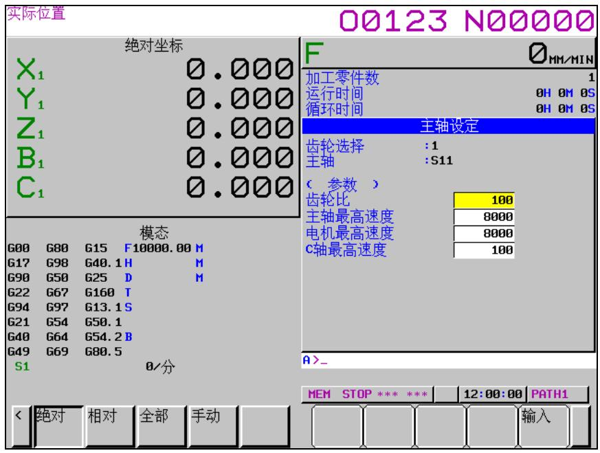

<details>
<summary>text_image</summary>

实际位置
00123 N00000
绝对坐标
X₁ 0.000
Y₁ 0.000
Z₁ 0.000
B₁ 0.000
C₁ 0.000
F 0MM/MIN
加工零件数 1
运行时间 0H 0M 0S
循环时间 0H 0M 0S
主轴设定
齿轮选择 :1
主轴 :S11
( 参数 )
齿轮比 100
主轴最高速度 8000
电机最高速度 8000
C轴最高速度 100
模态
G80 G80 G15 F10000.00 M
G17 G98 G40.1 H M
G90 G50 G25 D M
G22 G67 G160 T
G94 G97 G13.1 S
G21 G54 G50.1
G40 G64 G54.2 B
G49 G69 G80.5
S1 0/分
A >_
MEM STOP *** *** 12:00:00 PATH1
< 绝对 相对 全部 手动 输入
</details>

## - 齿轮选择

显示机床一侧的齿轮选择状态。


### PMC报警: 显示
- **故障内容**: CTH1
- **处理办法**: CTH2

### PMC报警: 1
- **故障内容**: 0
- **处理办法**: 0

### PMC报警: 2
- **故障内容**: 0
- **处理办法**: 1

### PMC报警: 3
- **故障内容**: 1
- **处理办法**: 0

### PMC报警: 4
- **故障内容**: 1
- **处理办法**: 1


## - 主轴

选择属于相对于哪个主轴的数据。

S11：第1主轴的主主轴电机  
S12：第1主轴的副主轴电机  
S21: 第 2 主轴的主主轴电机  
S22：第2主轴的副主轴电机

主主轴、副主轴，通过主轴切换控制来进行切换。主轴切换控制，是利用1台主轴放大器来切换并驱动2台主轴电机的一种功能。详情请参阅FANUC AC SPINDLE MOTOR $\alpha i / \beta i$ series, FANUC BUILT-IN SPINDLE MOTOR Bi series参数说明书(B-65280CM)中的“主轴切换控制”项。

## - 参数


### PMC报警: 
- **故障内容**: S11:第1主
- **处理办法**: S12:第1副

### PMC报警: 齿轮比(HIGH)
- **故障内容**: 4056
- **处理办法**: 4216

### PMC报警: 齿轮比(MEDIUM HIGH)
- **故障内容**: 4057
- **处理办法**: 4057

### PMC报警: 齿轮比(MEDIUM LOW)
- **故障内容**: 4058
- **处理办法**: 4217

### PMC报警: 齿轮比(LOW)
- **故障内容**: 4059
- **处理办法**: 4059

### PMC报警: 主轴最高速度(齿轮1)
- **故障内容**: 3741
- **处理办法**: 3741

### PMC报警: 主轴最高速度(齿轮2)
- **故障内容**: 3742
- **处理办法**: 3742

### PMC报警: 主轴最高速度(齿轮3)
- **故障内容**: 3743
- **处理办法**: 3743

### PMC报警: 主轴最高速度(齿轮4)
- **故障内容**: 3744
- **处理办法**: 3744

### PMC报警: 电机最高速度
- **故障内容**: 4020
- **处理办法**: 4196

### PMC报警: C轴最高速度
- **故障内容**: 4021
- **处理办法**: 无


## 9.1.2.3 主轴调整画面

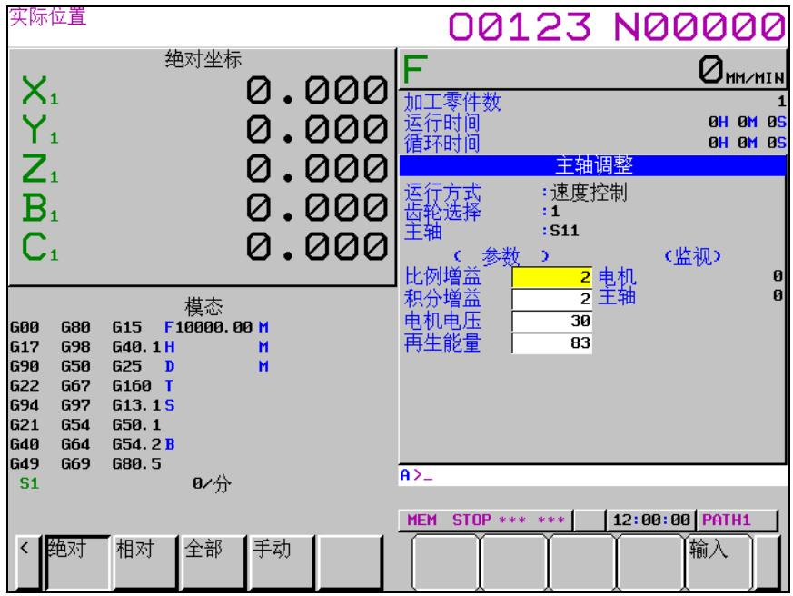

<details>
<summary>text_image</summary>

实际位置
00123 N00000
绝对坐标
X₁ 0.000
Y₁ 0.000
Z₁ 0.000
B₁ 0.000
C₁ 0.000
F 0 MM/MIN
加工零件数 1
运行时间 0H 0M 0S
循环时间 0H 0M 0S
主轴调整
运行方式 :速度控制
齿轮选择 :1
主轴 :S11
( 参数 ) (监视)
模态
G80 G80 G15 F10000.00 M
G17 G98 G40.1 H M
G90 G50 G25 D M
G22 G67 G160 T
G94 G97 G13.1 S
G21 G54 G50.1
G40 G64 G54.2 B
G49 G69 G80.5
S1 0/分
A >_
MEM STOP *** *** 12:00:00 PATH1
< 绝对 相对 全部 手动 输入
</details>

## - 运行方式

① : 通常运转

② : 定向  
③ : 同步控制  
④ : 刚性攻丝  
⑤ : Cs 轮廓控制  
⑥ : 主轴定位控制

## - 齿轮选择

## - 主轴

全都与主轴设定画面的内容相同。

## - 参数显示

参数的显示项目根据运转方式而发生变化。


### PMC报警: 主轴定位控制
- **故障内容**: 通常运转
- **处理办法**: 定向

### PMC报警: 比例增益
- **故障内容**: 比例增益
- **处理办法**: 比例增益

### PMC报警: 积分增益
- **故障内容**: 积分增益
- **处理办法**: 积分增益

### PMC报警: 位置环增益
- **故障内容**: 电机电压
- **处理办法**: 位置环增益

### PMC报警: 电机电压
- **故障内容**: 再生能量
- **处理办法**: 电机电压

### PMC报警: 回零增益(%)
- **故障内容**: 
- **处理办法**: 定向增益(%)

### PMC报警: 参考点偏移
- **故障内容**: 
- **处理办法**: 停止位置位移

### PMC报警: 
- **故障内容**: 
- **处理办法**: 参考点偏移


\*1) 对应于显示项目的参数号，请参阅“与调整画面上的运转方式对应的参数号”项。

## - 监控器显示

监控器的显示项目根据运转方式而发生变化。


### PMC报警: 主轴定位控制
- **故障内容**: 通常运转
- **处理办法**: 定向

### PMC报警: 电机速度
- **故障内容**: 电机速度
- **处理办法**: 电机速度

### PMC报警: 进给速度
- **故障内容**: 主轴速度
- **处理办法**: 主轴速度

### PMC报警: 位置偏差 S
- **故障内容**: 
- **处理办法**: 位置误差 S

### PMC报警: 
- **故障内容**: 
- **处理办法**: 

### PMC报警: 
- **故障内容**: 
- **处理办法**: 


\*1)

电机速度 $\left[\mathrm{min}^{-1}\right] = \frac{\mid\text{主轴数据}\mid}{16383}\times$ 电机最高转速 $(^{*})$

(\*) 参数 No.4020: 主、参数 No.4196: 副

## 9.1.2.4 主轴监控画面

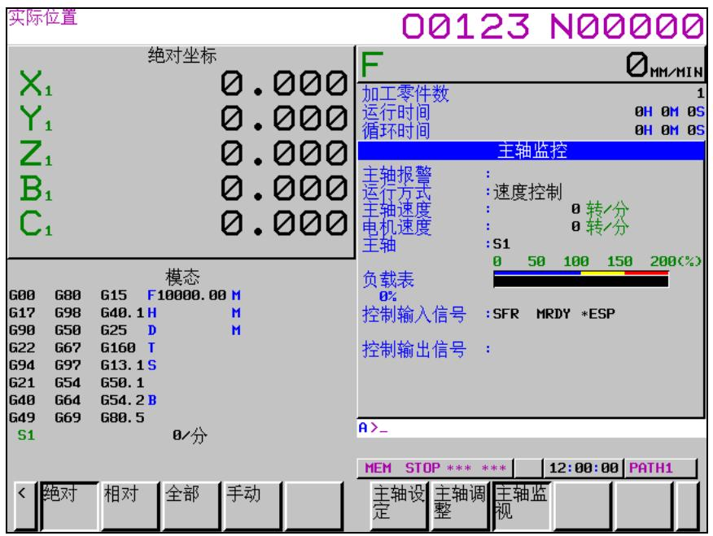

<details>
<summary>text_image</summary>

实际位置
00123 N00000
绝对坐标
X₁ 0.000
Y₁ 0.000
Z₁ 0.000
B₁ 0.000
C₁ 0.000
模态
G00 G80 G15 F10000.00 M
G17 G98 G40.1 H M
G90 G50 G25 D M
G22 G67 G160 T
G94 G97 G13.1 S
G21 G54 G50.1
G40 G64 G54.2 B
G49 G69 G80.5
S1 0/分
F
MM/MIN
加工零件数 1
运行时间 0H 0M 0S
循环时间 0H 0M 0S
主轴监控
主轴报警 : 
运行方式 : 速度控制
主轴速度 : 0 转/分
电机速度 : 0 转/分
主轴 : S1
负载表 0%
控制输入信号 : SFR MRDY *ESP
控制输出信号 :
A >_
MEM STOP *** ***
12:00:00 PATH1
< 绝对 相对 全部 手动
主轴设 定 主轴调 整 主轴监 视
</details>

- 主轴报警


### PMC报警: 9001:电机过热
- **故障内容**: 9058:PS主回路过载
- **处理办法**: 9132:串行传感器数据错误

### PMC报警: 9002:速度偏差过大
- **故障内容**: 9059:PS内部冷却风扇停止
- **处理办法**: 9133:串行传感器数据传输错误

### PMC报警: 9003:DC LINK 保险熔断
- **故障内容**: 9061:半闭环超差
- **处理办法**: 9134:串行传感器软相位

### PMC报警: 9004:电源缺相/保险熔断
- **故障内容**: 9065:磁极确定动作时的移动量异常
- **处理办法**: 9135:安全速度为0错误(SP)

### PMC报警: 9006:温度传感器断线
- **故障内容**: 9066:主轴放大器间通信异常
- **处理办法**: 9136:安全速度0判断不一致(SP)

### PMC报警: 9007:超速
- **故障内容**: 9067:FSC/EGB指令错误
- **处理办法**: 9137:SP设备通信异常

### PMC报警: 9009:主回路过载
- **故障内容**: 9068:ILLEGAL SPINDLE PARAMETER
- **处理办法**: 9139:串行传感器脉冲丢失

### PMC报警: 9011:DC链路过电压
- **故障内容**: 9069:安全速度超过
- **处理办法**: 9140:串行传感器计数丢失

### PMC报警: 9012:DC链路过电流
- **故障内容**: 9070:轴数据异常
- **处理办法**: 9141:串行传感器一转信号未检测

### PMC报警: 9013:CPU内部数据存储器异常
- **故障内容**: 9071:安全参数异常
- **处理办法**: 9142:串行传感器异常

### PMC报警: 9014:软件不匹配
- **故障内容**: 9072:电机速度判定不一致
- **处理办法**: 9143:Cs轴高速切换指令异常

### PMC报警: 9015:输出切换/主轴切换报警
- **故障内容**: 9073:电机传感器断线
- **处理办法**: 9144:电流检测回路异常

### PMC报警: 9016:RAM异常
- **故障内容**: 9074:CPU测试报警
- **处理办法**: 9145:驱动电源电压低

### PMC报警: 9017:ID号奇偶校验异常
- **故障内容**: 9075:CRC测试报警
- **处理办法**: 9146:SP:INTERNAL OVERHEAT

### PMC报警: 9018:和数校验异常
- **故障内容**: 9076:安全功能没有执行
- **处理办法**: 9148:AXIS NUMBER NOT SET

### PMC报警: 9019:U相电流偏置过大
- **故障内容**: 9077:轴号判定不一致
- **处理办法**: 9149:EXT. CURRENT FB U-OFFSET

### PMC报警: 9020:V相电流偏置过大
- **故障内容**: 9078:安全参数判定不一致
- **处理办法**: 9150:EXT. CURRENT FB V-OFFSET

### PMC报警: 9021:位置传感器的极性错误设定
- **故障内容**: 9079:初始测试动作异常
- **处理办法**: 9151:FILTER MODULE ERROR

### PMC报警: 9022:SP过载电流
- **故障内容**: 9080:其它主轴放大器报警
- **处理办法**: 9152:EXT. CUR. FB DISCONNECT

### PMC报警: 9024:串行传送错误
- **故障内容**: 9081:电机传感器一转信号错误检测
- **处理办法**: 9153:SP NO FAILURE

### PMC报警: 9027:位置编码器断线
- **故障内容**: 9082:尚未检测出电机传感器一转信号
- **处理办法**: 9154:PHASE OPEN

### PMC报警: 9029:短暂过载
- **故障内容**: 9083:电机传感器信号异常
- **处理办法**: 9155:FAILURE OF SP (OPEN)

### PMC报警: 9030:输入电路过流
- **故障内容**: 9084:主轴传感器断线
- **处理办法**: 9156:FAILURE OF CURRENT CTRL.

### PMC报警: 9031:电机受到限制
- **故障内容**: 9085:主轴传感器一转信号错误检测
- **处理办法**: 9157:FAILURE OF SP (SHORT)

### PMC报警: 9032:用于传输的RAM异常
- **故障内容**: 9086:尚未检测出主轴传感器一转信号
- **处理办法**: 9159:MISMATCHED FUNCTION CODE

### PMC报警: 9033:DC LINK 充电不足
- **故障内容**: 9087:主轴传感器信号异常
- **处理办法**: 9160:HERMISTOR DISCONNECTION

### PMC报警: 9034:参数设定异常
- **故障内容**: 9088:散热器冷却风扇停止
- **处理办法**: 9161:POW. CABLE SHORT CIRCUIT

### PMC报警: 9036:错误计数器溢出
- **故障内容**: 9089:子模块SM(SSM)异常
- **处理办法**: 9162:DELAY OF SP POS. DATA

### PMC报警: 9037:速度检测器设定错误
- **故障内容**: 9090:异常回转
- **处理办法**: 9163:ILLEGAL SP POS. DATA

### PMC报警: 9041:位置编码器一转信号错误检测
- **故障内容**: 9091:磁极位置计数异常
- **处理办法**: 9164:FAILURE OF MASTER SENSOR

### PMC报警: 9042:尚未检测位置编码器一转信号
- **故障内容**: 9092:超过速度指令基准
- **处理办法**: 9165:CONTROL METHOD CHANGED

### PMC报警: 9043:差速位置编码器信号断线
- **故障内容**: 9110:放大器间通信异常
- **处理办法**: 9167:FAILURE OF SP CONTROL SEQUENCE

### PMC报警: 9046:切螺纹时PC一转信号错误
- **故障内容**: 9111:PS控制电源低电压
- **处理办法**: 9204:PS SOFT THERMAL

### PMC报警: 9047:位置编码器信号异常
- **故障内容**: 9112:PS再生电流过大1
- **处理办法**: 9211:PS ILLEGAL PARAMETER

### PMC报警: 9049:速度值太大
- **故障内容**: 9113:PS散热器冷却风扇停止
- **处理办法**: 9212:PS HARDWARE ERROR

### PMC报警: 9050:主轴速度太大
- **故障内容**: 9120:通信数据报警
- **处理办法**: 9213:PS EXTERNAL INPUT COMPONENT ERROR

### PMC报警: 9051:DC LINK 电压低
- **故障内容**: 9121:通信数据报警
- **处理办法**: 9214:PS PFB-R ERROR

### PMC报警: 9052:ITP信号的异常I
- **故障内容**: 9122:通信数据报警
- **处理办法**: 9215:PS PFB-C ERROR

### PMC报警: 9053:ITP信号的异常II
- **故障内容**: 9123:主轴切换电路异常
- **处理办法**: 9216:PS SUB MODULE ERROR

### PMC报警: 9054:过载电流
- **故障内容**: 9128:主轴同步控制速度偏差过大
- **处理办法**: 

### PMC报警: 9055:动力线异常
- **故障内容**: 9129:主轴同步控制位置误差过大
- **处理办法**: 

### PMC报警: 9056:内部冷却风扇停止
- **故障内容**: 9130:串联控制扭矩极性异常
- **处理办法**: 

### PMC报警: 9057:PS再生电流过大2
- **故障内容**: 9131:主轴调整功能报警
- **处理办法**: 


## - 运行方式

运转方式中显示出下列 6 种方式。

a. 通常运转  
b. 定向  
c. 同步运转  
d. 刚性攻丝  
e. Cs 轮廓控制  
f. 主轴定位控制

## - 负载表

以 10% 为单位的程序段予以显示。


(\*) 参数 No.4127: 主高速绕组

参数 No.4274: 副高速绕组

参数 No.4093: 主低速绕组

参数 No.4279:

副低速绕组

## - 控制输入信号

下列信号中，最多显示 10 个处在 ON 的信号。


## - 控制输出信号

下列信号中，最多显示 10 个处在 ON 的信号。


## 9.1.2.5 与调整画面上的运转方式对应的参数号

- 通常运转方式


### PMC报警: 
- **故障内容**: S11:第1主
- **处理办法**: S12:第1副

### PMC报警: 比例增益(HIGH)
- **故障内容**: 4040
- **处理办法**: 4206

### PMC报警: 比例增益(LOW)
- **故障内容**: 4041
- **处理办法**: 4207

### PMC报警: 积分增益(HIGH)
- **故障内容**: 4048
- **处理办法**: 4212

### PMC报警: 积分增益(LOW)
- **故障内容**: 4049
- **处理办法**: 4049

### PMC报警: 电机电压
- **故障内容**: 4083
- **处理办法**: 4236

### PMC报警: 再生能量
- **故障内容**: 4080
- **处理办法**: 4231


- 定向方式


### PMC报警: 
- **故障内容**: S11:第1主
- **处理办法**: S12:第1副

### PMC报警: 比例增益(HIGH)
- **故障内容**: 4042
- **处理办法**: 4208

### PMC报警: 比例增益(LOW)
- **故障内容**: 4043
- **处理办法**: 4209

### PMC报警: 积分增益(HIGH)
- **故障内容**: 4050
- **处理办法**: 4213

### PMC报警: 积分增益(LOW)
- **故障内容**: 4051
- **处理办法**: 4051

### PMC报警: 位置环增益(HIGH)
- **故障内容**: 4060
- **处理办法**: 4218

### PMC报警: 位置环增益(MED.HIGH)
- **故障内容**: 4061
- **处理办法**: 4061

### PMC报警: 位置环增益(MED.LOW)
- **故障内容**: 4062
- **处理办法**: 4219

### PMC报警: 位置环增益(LOW)
- **故障内容**: 4063
- **处理办法**: 4063

### PMC报警: 电机电压
- **故障内容**: 4084
- **处理办法**: 4237

### PMC报警: 定向结束时增益改变
- **故障内容**: 4064
- **处理办法**: 4220

### PMC报警: 停止位置位移
- **故障内容**: 4077
- **处理办法**: 4228

### PMC报警: PC方式定向停止位置
- **故障内容**: 4031
- **处理办法**: 4204


- 同步控制方式


### PMC报警: 
- **故障内容**: S11:第1主
- **处理办法**: S12:第1副

### PMC报警: 比例增益(HIGH)
- **故障内容**: 4044
- **处理办法**: 4210

### PMC报警: 比例增益(LOW)
- **故障内容**: 4045
- **处理办法**: 4211

### PMC报警: 积分增益(HIGH)
- **故障内容**: 4052
- **处理办法**: 4214

### PMC报警: 积分增益(LOW)
- **故障内容**: 4053
- **处理办法**: 4053

### PMC报警: 位置环增益(HIGH)
- **故障内容**: 4065
- **处理办法**: 4221

### PMC报警: 位置环增益(MED.HIGH)
- **故障内容**: 4066
- **处理办法**: 4066

### PMC报警: 位置环增益(MED.LOW)
- **故障内容**: 4067
- **处理办法**: 4222

### PMC报警: 位置环增益(LOW)
- **故障内容**: 4068
- **处理办法**: 4068

### PMC报警: 电机电压
- **故障内容**: 4085
- **处理办法**: 4238

### PMC报警: 加/减速常数
- **故障内容**: 4032
- **处理办法**: 

### PMC报警: 主轴相位同步控制位移量
- **故障内容**: 4034
- **处理办法**: 


- 刚性攻丝方式


### PMC报警: 
- **故障内容**: S11:第1主
- **处理办法**: S12:第1副

### PMC报警: 比例增益(HIGH)
- **故障内容**: 4044
- **处理办法**: 4210

### PMC报警: 比例增益(LOW)
- **故障内容**: 4045
- **处理办法**: 4211

### PMC报警: 积分增益(HIGH)
- **故障内容**: 4052
- **处理办法**: 4214

### PMC报警: 积分增益(LOW)
- **故障内容**: 4053
- **处理办法**: 4053

### PMC报警: 位置环增益(HIGH)
- **故障内容**: 4065
- **处理办法**: 4221

### PMC报警: 位置环增益(MED.HIGH)
- **故障内容**: 4066
- **处理办法**: 4066

### PMC报警: 位置环增益(MED.LOW)
- **故障内容**: 4067
- **处理办法**: 4222

### PMC报警: 位置环增益(LOW)
- **故障内容**: 4068
- **处理办法**: 4068

### PMC报警: 电机电压
- **故障内容**: 4085
- **处理办法**: 4238

### PMC报警: 回零增益变更比率
- **故障内容**: 4091
- **处理办法**: 4239

### PMC报警: 伺服方式时栅格位移量
- **故障内容**: 4073
- **处理办法**: 4223


- Cs 轮廓控制方式


### PMC报警: 
- **故障内容**: S11:第1主
- **处理办法**: S12:第1副

### PMC报警: 比例增益(HIGH)
- **故障内容**: 4046
- **处理办法**: 

### PMC报警: 比例增益(LOW)
- **故障内容**: 4047
- **处理办法**: 

### PMC报警: 积分增益(HIGH)
- **故障内容**: 4054
- **处理办法**: 

### PMC报警: 积分增益(LOW)
- **故障内容**: 4055
- **处理办法**: 4055

### PMC报警: 位置环增益(HIGH)
- **故障内容**: 4069
- **处理办法**: 

### PMC报警: 位置环增益(MED.HIGH)
- **故障内容**: 4070
- **处理办法**: 4070

### PMC报警: 位置环增益(MED.LOW)
- **故障内容**: 4071
- **处理办法**: 

### PMC报警: 位置环增益(LOW)
- **故障内容**: 4072
- **处理办法**: 4072

### PMC报警: 电机电压
- **故障内容**: 4086
- **处理办法**: 

### PMC报警: 回零增益变更比率
- **故障内容**: 4092
- **处理办法**: 

### PMC报警: 参考点偏移
- **故障内容**: 4135
- **处理办法**: 


- 主轴定位控制方式


### PMC报警: 
- **故障内容**: S11:第1主
- **处理办法**: S12:第1副

### PMC报警: 比例增益(HIGH)
- **故障内容**: 4044
- **处理办法**: 4210

### PMC报警: 比例增益(LOW)
- **故障内容**: 4045
- **处理办法**: 4211

### PMC报警: 积分增益(HIGH)
- **故障内容**: 4052
- **处理办法**: 4214

### PMC报警: 积分增益(LOW)
- **故障内容**: 4053
- **处理办法**: 4053

### PMC报警: 位置环增益(HIGH)
- **故障内容**: 4065
- **处理办法**: 4221

### PMC报警: 位置环增益(MED.HIG)
- **故障内容**: 4066
- **处理办法**: 4066

### PMC报警: 位置环增益(MED.LOW)
- **故障内容**: 4067
- **处理办法**: 4222

### PMC报警: 位置环增益(LOW)
- **故障内容**: 4068
- **处理办法**: 4068

### PMC报警: 电机电压
- **故障内容**: 4085
- **处理办法**: 4238

### PMC报警: 回零增益
- **故障内容**: 4091
- **处理办法**: 4239

### PMC报警: 参考点偏移
- **故障内容**: 4073
- **处理办法**: 4223


## 9.1.3 标准参数的自动设定

可以自动设定有关电机的(每一种型号)标准参数。

※ 但是，按照什么样的方式控制电机，随机床制造商的规格而有所不同，所以，由机床制造商确定的参数，在此功能中被作为标准值(初始值)予以设定。

因此，自动运行机床的情况下，务须按照参数列表（4000号以后），正确设定参数。

1. 在急停状态下将电源置于 ON。  
2. 将参数 LDSP(No. 4019#7) 设定为 “1”。


### PMC报警: 
- **故障内容**: #7
- **处理办法**: #6

### PMC报警: 4019
- **故障内容**: LDSP
- **处理办法**: 


[输入类型] 参数输入

[数据类型] 位主轴型

#7 LDSP 是否进行串行接口主轴的参数自动设定

0: 不进行自动设定。

1: 进行自动设定。

3. 设定电机型号。


### PMC报警: 代码
- **故障内容**: 电机型号
- **处理办法**: 放大器

### PMC报警: 301
- **故障内容**: $\alpha iI 0.5/10000 (3000/10000min^{-1})$
- **处理办法**: $\alpha iSP2.2-B$

### PMC报警: 302
- **故障内容**: $\alpha iI 1/10000 (3000/10000min^{-1})$
- **处理办法**: $\alpha iSP2.2-B$

### PMC报警: 304
- **故障内容**: $\alpha iI 1.5/10000 (1500/10000min^{-1})$
- **处理办法**: $\alpha iSP5.5-B$

### PMC报警: 305
- **故障内容**: $\alpha iI 1.5/15000 (3000/150000min^{-1})$
- **处理办法**: $\alpha iSP15-B$

### PMC报警: 306
- **故障内容**: $\alpha iI 2/10000 (1500/10000min^{-1})$
- **处理办法**: $\alpha iSP5.5-B$

### PMC报警: 307
- **故障内容**: $\alpha iI 2/15000 (3000/15000min^{-1})$
- **处理办法**: $\alpha iSP22-B$

### PMC报警: 308
- **故障内容**: $\alpha iI 3/10000 (1500/10000min^{-1})$
- **处理办法**: $\alpha iSP5.5-B$

### PMC报警: 309
- **故障内容**: $\alpha iI 3/12000 (1500/12000min^{-1})$
- **处理办法**: $\alpha iSP11-B$

### PMC报警: 310
- **故障内容**: $\alpha iI 6/10000 (1500/10000min^{-1})$
- **处理办法**: $\alpha iSP11-B$

### PMC报警: 311
- **故障内容**: $\alpha iI 0.5/10000HV (3000/10000min^{-1})$
- **处理办法**: $\alpha iSP5.5HV-B$

### PMC报警: 312
- **故障内容**: $\alpha iI 8/8000 (1500/8000min^{-1})$
- **处理办法**: $\alpha iSP11-B$

### PMC报警: 313
- **故障内容**: $\alpha iI 1/10000HV (3000/10000min^{-1})$
- **处理办法**: $\alpha iSP5.5HV-B$

### PMC报警: 314
- **故障内容**: $\alpha iI 12/7000 (1500/7000min^{-1})$
- **处理办法**: $\alpha iSP15-B$

### PMC报警: 315
- **故障内容**: $\alpha iI 1.5/10000HV (1500/10000min^{-1})$
- **处理办法**: $\alpha iSP5.5HV-B$

### PMC报警: 316
- **故障内容**: $\alpha iI 15/7000 (1500/7000min^{-1})$
- **处理办法**: $\alpha iSP22-B$

### PMC报警: 317
- **故障内容**: $\alpha iI 2/10000HV (1500/10000min^{-1})$
- **处理办法**: $\alpha iSP5.5HV-B$

### PMC报警: 318
- **故障内容**: $\alpha iI 18/7000 (1500/7000min^{-1})$
- **处理办法**: $\alpha iSP22-B$

### PMC报警: 319
- **故障内容**: $\alpha iI 3/10000HV (1500/10000min^{-1})$
- **处理办法**: $\alpha iSP5.5HV-B$

### PMC报警: 320
- **故障内容**: $\alpha iI 22/7000 (1500/7000min^{-1})$
- **处理办法**: $\alpha iSP26-B$

### PMC报警: 321
- **故障内容**: $\alpha iI 6/10000HV (1500/10000min^{-1})$
- **处理办法**: $\alpha iSP11HV-B$

### PMC报警: 322
- **故障内容**: $\alpha iI 30/6000 (1150/6000min^{-1})$
- **处理办法**: $\alpha iSP45-B$

### PMC报警: 323
- **故障内容**: $\alpha iI$  40/6000 (1500/6000min $^{-1}$ )
- **处理办法**: $\alpha iSP45-B$

### PMC报警: 324
- **故障内容**: $\alpha iI$  50/4500 (1150/4500min $^{-1}$ )
- **处理办法**: $\alpha iSP55-B$

### PMC报警: 325
- **故障内容**: $\alpha iI$  8/8000HV (1500/8000min $^{-1}$ )
- **处理办法**: $\alpha iSP11HV-B$

### PMC报警: 326
- **故障内容**: $\alpha iI$  12/7000HV (1500/7000min $^{-1}$ )
- **处理办法**: $\alpha iSP15HV-B$

### PMC报警: 327
- **故障内容**: $\alpha iI$  15/7000HV (1500/7000min $^{-1}$ )
- **处理办法**: $\alpha iSP30HV-B$

### PMC报警: 328
- **故障内容**: $\alpha iI$  22/7000HV (1500/7000min $^{-1}$ )
- **处理办法**: $\alpha iSP30HV-B$

### PMC报警: 329
- **故障内容**: $\alpha iI$  30/6000HV (1150/6000min $^{-1}$ )
- **处理办法**: $\alpha iSP45HV-B$

### PMC报警: 401
- **故障内容**: $\alpha iI$  6/12000 (1500/12000, 4000/12000min $^{-1}$ )
- **处理办法**: $\alpha iSP11-B$

### PMC报警: 402
- **故障内容**: $\alpha iI$  8/10000 (1500/10000, 4000/10000min $^{-1}$ )
- **处理办法**: $\alpha iSP11-B$

### PMC报警: 403
- **故障内容**: $\alpha iI$  12/10000 (1500/10000, 4000/10000min $^{-1}$ )
- **处理办法**: $\alpha iSP15-B$

### PMC报警: 404
- **故障内容**: $\alpha iI$  15/10000 (1500/10000, 4000/10000min $^{-1}$ )
- **处理办法**: $\alpha iSP22-B$

### PMC报警: 405
- **故障内容**: $\alpha iI$  18/10000 (1500/10000, 4000/10000min $^{-1}$ )
- **处理办法**: $\alpha iSP22-B$

### PMC报警: 406
- **故障内容**: $\alpha iI$  22/10000 (1500/10000, 4000/10000min $^{-1}$ )
- **处理办法**: $\alpha iSP26-B$

### PMC报警: 407
- **故障内容**: $\alpha iIP$  12/6000 (500/1500, 750/6000min $^{-1}$ )
- **处理办法**: $\alpha iSP11-B$

### PMC报警: 408
- **故障内容**: $\alpha iIP$  15/6000 (500/1500, 750/6000min $^{-1}$ )
- **处理办法**: $\alpha iSP15-B$

### PMC报警: 409
- **故障内容**: $\alpha iIP$  18/6000 (500/1500, 750/6000min $^{-1}$ )
- **处理办法**: $\alpha iSP15-B$

### PMC报警: 410
- **故障内容**: $\alpha iIP$  22/6000 (500/1500, 750/6000min $^{-1}$ )
- **处理办法**: $\alpha iSP22-B$

### PMC报警: 411
- **故障内容**: $\alpha iIP$  30/6000 (400/1500, 575/6000min $^{-1}$ )
- **处理办法**: $\alpha iSP22-B$

### PMC报警: 412
- **故障内容**: $\alpha iIP$  40/6000 (400/1500, 575/6000min $^{-1}$ )
- **处理办法**: $\alpha iSP26-B$

### PMC报警: 413
- **故障内容**: $\alpha iIP$  50/6000 (575/1500, 1200/6000min $^{-1}$ )
- **处理办法**: $\alpha iSP26-B$

### PMC报警: 414
- **故障内容**: $\alpha iIP$  60/4500 (400/1500, 750/4500min $^{-1}$ )
- **处理办法**: $\alpha iSP30-B$

### PMC报警: 415
- **故障内容**: $\alpha iI$  100/4000HV (1000/3000, 2000/4000min $^{-1}$ )
- **处理办法**: $\alpha iSP75HV-B$

### PMC报警: 418
- **故障内容**: $\alpha iIP$  40/6000HV (400/1500, 575/6000min $^{-1}$ )
- **处理办法**: $\alpha iSP30HV-B$


4. 将电源置于 OFF，然后再将其置于 ON。  
参数即被读入。

## 9.1.4 警告接口

## 概述

可以在发生报警之前，通知警告状态。进入警告状态时，系统通知 PMC。

此信号，譬如在从发出警告到成为过热报警的期间，用来减轻切削负载或者退出刀具。另外，诊断画面中还会显示警告号。

## 信号

主轴警告详细信号 SPWRN1～9<F264.0～F264.7, F265.0>

[分类] 输出信号

[功能] 根据主轴放大器的状态，通知对应的警告号。

[输出条件] 当主轴放大器进入警告状态时，作为9bit的二进制数据，从SPWRN1～SPWRN9输出警告号。多个主轴放大器中发出警告时，输出轴号最小的主轴的警告号。

警告号与内容的对应关系如下所示。


### PMC报警: 警告号
- **故障内容**: 内容
- **处理办法**: 详情

### PMC报警: 01
- **故障内容**: 电机过热
- **处理办法**: 电机温度超过告警检测水平(通过参数设定)时,输出告警信号。此时主轴将继续运行,应根据需要,利用PMC进行适当处理。电机温度达到过热检测水平时,发出报警。

### PMC报警: 56
- **故障内容**: 冷却风扇故障
- **处理办法**: 内部冷却风扇停止时输出警告信号。此时主轴将继续运行,应根据需要,利用PMC进行适当处理。在输出警告信号后的大约1分钟内发出报警。

### PMC报警: 58
- **故障内容**: 变频器过载
- **处理办法**: 共同电源(PS)的主回路过载时就输出警告信号。此时主轴将继续运行,应根据需要,利用PMC进行适当处理。输出警告信号后,经过一定时间时发出报警。

### PMC报警: 59
- **故障内容**: 变频器冷却风扇故障
- **处理办法**: 共同电源(PS)的冷却风扇停止时就输出警告信号。此时主轴将继续运行,应根据需要,利用PMC进行适当处理。在输出警告信号后的大约1分钟内发出报警。

### PMC报警: 88
- **故障内容**: 散热风扇故障
- **处理办法**: 散热器冷却风扇停止时输出警告信号。此时主轴将继续运行,应根据需要,利用PMC进行适当处理。主回路过热时就发出报警。

### PMC报警: 113
- **故障内容**: 变频器散热扇停转
- **处理办法**: 共同电源(PS)的散热器冷却风扇停止时就输出警告信号。此时主轴将继续运行,应根据需要,利用PMC进行适当处理。共同电源(PS)主回路过热时就发出报警。

### PMC报警: 213
- **故障内容**: PS外部输入设备异常
- **处理办法**: 电源变压器或者输入过滤器成为过载时,输出警告信号。此时主轴的运转继续进行,所以要根据需要,利用PMC进行处理。警告信号输出后经过一定时间后发出报警。


信号地址


### PMC报警: 
- **故障内容**: #7
- **处理办法**: #6

### PMC报警: F264
- **故障内容**: SPWRN8
- **处理办法**: SPWRN7

### PMC报警: F265
- **故障内容**: 
- **处理办法**: 


## 诊断显示

警告的状态显示在如下诊断画面上。


[数据类型] 字主轴型

显示发生在各主轴中的警告号。

尚未发生警告的情况下显示 “0”。

## 9.1.5 主轴信息画面

## 概述

在 $\alpha i$ 主轴系统中，获取由各连接设备输出的 ID 信息，显示于 CNC 画面。

具有 ID 信息的设备有如下一些。

（注释：即使属于下列设备，在某些情况下也不具 ID 信息。）

\- 主轴放大器(SP)

\- 共同电源(PS)

从下一次起，对首次记录的信息和当前读出的 ID 信息进行比较，由此就可以监视所连接的设备变更情况。（当记录与实际情况不一致时，显示出表示警告的标记(\*)。）

可以对存储的 ID 信息进行编辑。由此，就可以显示不具备 ID 信息的设备的 ID 信息。（但是，与实际情况不一致时，显示出表示警告的标记(\*)。）

参数


### PMC报警: 
- **故障内容**: #7
- **处理办法**: #6

### PMC报警: 11320
- **故障内容**: 
- **处理办法**: 


[输入类型] 参数输入

[数据类型] 位路径型

#1 IDC 是否显示统一更新伺服·主轴信息画面的 ID 信息的软键 [ID 数据全更新]

0: 不予显示。

1: 予以显示。

## 注释

唯在参数 IDW(No.13112#0)=1 时 IDC 有效。


### PMC报警: 
- **故障内容**: #7
- **处理办法**: #6

### PMC报警: 13112
- **故障内容**: 
- **处理办法**: 


[输入类型] 参数输入

[数据类型] 位路径型

#0 IDW 是否禁止对伺服或主轴的信息画面进行编辑

0: 禁止。

1: 不禁止。

#2 SPI 是否显示主轴信息画面

0: 予以显示。

1: 不予显示。

## 显示主轴信息画面

1. 按下功能键 $\boxed{\text{SYSTEM}}$ ，再按下软键[系统]。

2. 按下软键 [主轴信息]，显示如下所示画面。

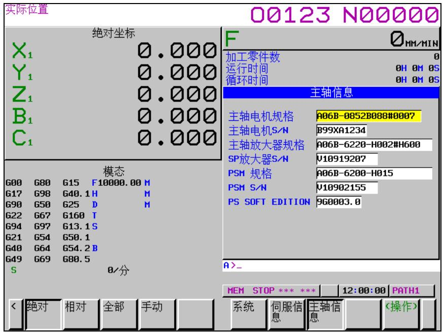

<details>
<summary>text_image</summary>

实际位置
00123 N00000
绝对坐标
X₁ 0.000
Y₁ 0.000
Z₁ 0.000
B₁ 0.000
C₁ 0.000
模态
G00 G80 G15 F10000.00 M
G17 G98 G40.1 H M
G90 G50 G25 D M
G22 G67 G160 T
G94 G97 G13.1 S
G21 G54 G50.1
G40 G64 G54.2 B
G49 G69 G80.5
S 0/分
F 0MM/MIN
加工零件数 0
运行时间 0H 0M 0S
循环时间 0H 0M 0S
主轴信息
主轴电机规格 A06B-0852B088#0007
主轴电机S/N B99XA1234
主轴放大器规格 A06B-6220-H002#H600
SP放大器S/N V10919287
PSM 规格 A06B-6200-H015
PSM S/N V10902155
PS SOFT EDITION 9G0003.8
A >_
MEM STOP *** 12:00:00 PATH1
< 绝对 相对 全部 手动 系统 伺服信 主轴信 （操作）
息 息
</details>

图9.1.5 (a) 主轴信息画面的显示

※1 主轴信息被保存在 FLASH-ROM 中。

画面所显示的 ID 信息与实际 ID 信息不一致的项目，在项目的左侧显示出 “\*”。

※2 主轴的电机规格和电机串行 No. 不会被自动读出。建议输入各电机的信息（方法将在后面叙述）。通过输入信息，即可便于维护。

## - 主轴切换控制

主轴切换控制时，同时显示副主轴一侧的 ID 信息。

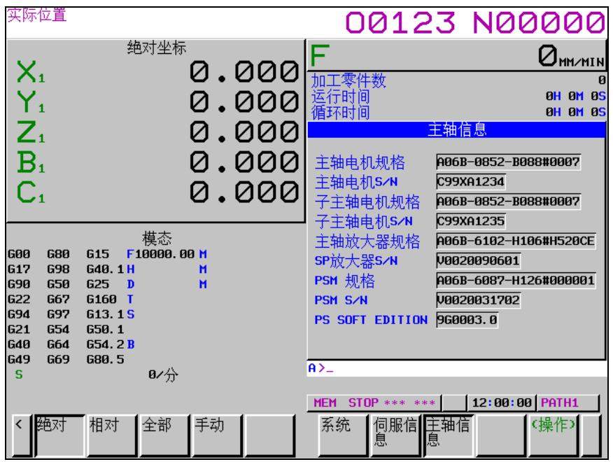

<details>
<summary>text_image</summary>

实际位置
00123 N00000
绝对坐标
X₁ 0.000
Y₁ 0.000
Z₁ 0.000
B₁ 0.000
C₁ 0.000
模态
G00 G80 G15 F10000.00 M
G17 G98 G40.1 H M
G90 G50 G25 D M
G22 G67 G160 T
G94 G97 G13.1 S
G21 G54 G50.1
G40 G64 G54.2 B
G49 G69 G80.5
S 0/分
F
MM/MIN
加工零件数 0
运行时间 0H 0M 0S
循环时间 0H 0M 0S
主轴信息
主轴电机规格 A06B-0852-B088#000?
主轴电机S/N C99XA1234
子主轴电机规格 A06B-0852-B088#000?
子主轴电机S/N C99XA1235
主轴放大器规格 A06B-6102-H106#H520CE
SP放大器S/N V0020090601
PSM 规格 A06B-6087-H126#000001
PSM S/N V0020031702
PS SOFT EDITION 9G0003.0
A >_
MEM STOP *** 12:00:00 PATH1
< 绝对 相对 全部 手动 系统 伺服信 主轴信 （操作）
</details>

图9.1.5 (b) 主轴切换控制

## 补充说明

此功能在即使因为需要修理等正当的理由而进行更换的情况，也会检测该更换并显示“\*”标记。

要擦除“\*”标记的显示，请参阅后述的编辑，按照下列步骤更新已被登录的数据。

(1) 可进行编辑。（参数 IDW(No.13112#0)=1）

(2) 在编辑画面，将光标移动到希望擦除 “\*” 标记的项目。

(3) 通过软键 [读取 ID] → [输入] → [保存] 进行操作。

此外，为了统一更新所有项目，取消‘\*’标记，请按下软键 [ID 数据全更新] （参数 IDC(No.11320#1)=1）。

## 编辑主轴信息画面

1 设定参数 IDW(No.13112#0)=1。  
2 按下机床操作面板上的 MDI 开关。  
3 按照 “显示主轴信息画面” 的步骤显示如下所示画面。

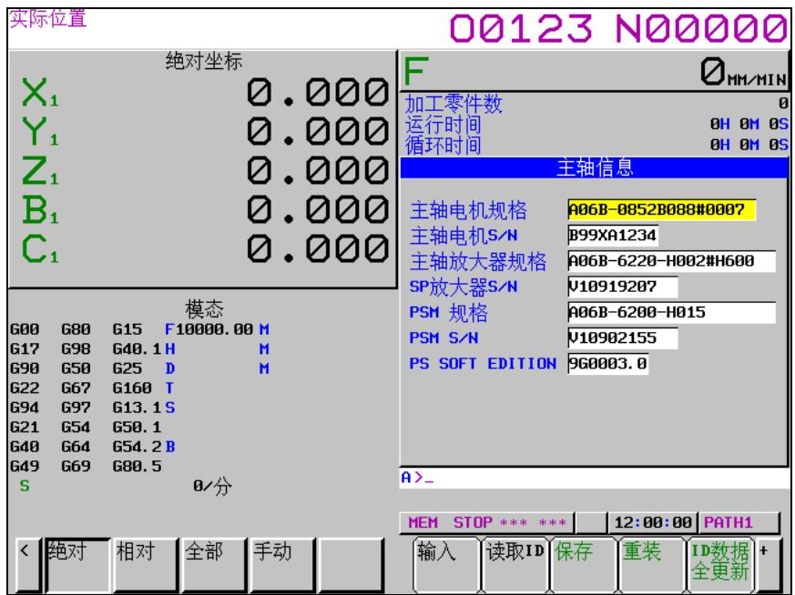

<details>
<summary>text_image</summary>

实际位置
00123 N00000
绝对坐标
X₁ 0.000
Y₁ 0.000
Z₁ 0.000
B₁ 0.000
C₁ 0.000
模态
G00 G80 G15 F10000.00 M
G17 G98 G40.1 H M
G90 G50 G25 D M
G22 G67 G160 T
G94 G97 G13.1 S
G21 G54 G50.1
G40 G64 G54.2 B
G49 G69 G80.5
S 0/分
F
MM/MIN
加工零件数 0
运行时间 0H 0M 0S
循环时间 0H 0M 0S
主轴信息
主轴电机规格 A06B-0852B088#0007
主轴电机S/N B99XA1234
主轴放大器规格 A06B-6220-H002#H600
SP放大器S/N V10919207
PSM 规格 A06B-6200-H015
PSM S/N V10902155
PS SOFT EDITION PG0003.0
A>
MEM STOP *** ***
12:00:00 PATH1
输入 读取ID 保存 重装 ID数据全更新 +
< 绝对 相对 全部 手动
</details>

图9.1.5 (c) 主轴信息画面的编辑

4 通过光标键 $\boxed{\uparrow}$ $\boxed{\downarrow}$ ，移动画面上的光标。

## 编辑画面上的操作

表9.1.5 (a) 操作一览


### PMC报警: 方式
- **故障内容**: 按键操作
- **处理办法**: 用途

### PMC报警: 参照(※1)
- **故障内容**: 翻页键
- **处理办法**: 上下滚动画面。

### PMC报警: 编辑(※2)
- **故障内容**: 软键[输入][读取 ID][保存][重装][ID 数据全更新] (※4)
- **处理办法**: 将所选中的光标位置的 ID 信息改变为键入缓冲区内的字符串。将所选中的光标位置的连接设备具有 ID 信息传输到键入缓冲区。只有左侧显示“*”(※3)的项目有效。将在主轴信息画面上改变的 ID 信息保存在 FLASH-ROM 中。取消在主轴信息画面上改变的 ID 信息,由 FLASH-ROM 上重新加载。对于全部轴统一更新伺服·主轴信息画面上显示的各连接设备的 ID 信息。


(※1) 参照方式：参数 IDW(No.13112#0)=0 的情形  
(※2) 编辑方式：参数 IDW=1 的情形  
(※3) 画面所显示的 ID 信息与实际 ID 信息不一致的项目，在下列项目的左侧显示 “\*”。  
(※4) 参数 IDC(No.11320#1)=1 的情形


<details>
<summary>text_image</summary>

实际位置
00123 N00000
绝对坐标
X₁ 0.000
Y₁ 0.000
Z₁ 0.000
B₁ 0.000
C₁ 0.000
模态
G00 G80 G15 F10000.00 M
G17 G98 G40.1 H M
G90 G50 G25 D M
G22 G67 G160 T
G94 G97 G13.1 S
G21 G54 G50.1
G40 G64 G54.2 B
G49 G69 G80.5
S 0/分
F
MM/MIN
加工零件数 0
运行时间 0H 0M 0S
循环时间 0H 0M 0S
主轴信息
主轴电机规格 A06B-0852B088#0007
主轴电机S/N B99XA1234
*主轴放大器规格 A06B-6220-H002#H600
*SP放大器S/N V10919287
PSM 规格 A06B-6200-H015
PSM S/N V10902155
PS SOFT EDITION PG0003.0
A >_
MEM STOP *** *** 12:00:00 PATH1
< 绝对 相对 全部 手动 输入 读取ID 保存 重装 ID数据全更新 +
</details>

图9.1.5 (d) 编辑画面上的操作

## 10 故障排除步骤

本章就 CNC 一侧的故障排除步骤进行描述。

10.1 发生故障时的处理方法.....439

10.2 不能进行手动和自动运行....441

10.3 不能进行慢进（JOG）运行 ....443

10.4 不能进行手动手轮运行....446

10.5 不能进行自动运行 ....450

10.6 自动运行起动信号断开....455

10.7 通电后LCD上没有任何显示....456

10.8 不能进行I/O的输入/输出，不能正确输入/输出 ..... 457

10.9 连接板I/O上数据被输入到意料外的地址中.....458

10.10 没有数据输出到连接板I/O上的扩展单元中.....459

10.11 报警SR0085～87（RS232C接口相关） 460

10.12 报警PS0090（参考点返回位置异常） 464

10.13 报警DS0300（参考点返回请求） 465

10.14 报警SV0401（伺服准备就绪信号断开）....466

10.15 报警SV0404（伺服准备就绪信号接通） 468

10.16 报警SV0462（CNC数据传输失败）
报警SV0463（从属数据传输失败）.....468

10.17 报警SV0417（数字伺服系统异常） 469

10.18 报警OH0700（过热：控制单元） 469

10.19 报警OH0701（过热：风扇电机） 469

10.20 报警SV5134（FSSB：开机超时）
报警SV5137（FSSB：配置错误）
报警SV5197（FSSB：开机超时）....470

10.21 报警SV5136（FSSB: 放大器数不足） 470

10.22 伺服报警....470

10.23 主轴报警 471

10.24 系统报警 471

10.25 与PMC、I/O Link相关的系统报警 479

10.26 I/O Link i 对应单元的LED 485

## 10.1 发生故障时的处理方法

为在发生故障的情况下尽快恢复，最为重要的是要正确把握故障情况，进行适当的处理。因此，请按照下面描述的项目确认故障情况。


<details>
<summary>flowchart</summary>

```mermaid
graph TD
  A["发生在什么时候？"] --> D["把握故障情况"]
  B["因哪项操作引起的？"] --> D
  C["发生了什么故障？"] --> D
  D --> E["进行适当处理"]
  E --> F["恢复"]
```
</details>

## 10.1.1 检查故障发生情况

① 什么时候/发生几次（发生频次）  
② 在执行什么样的操作时  
③ 发生了什么样的故障？

对上述事项进行检查。

另外，系统报警的情况下，请按照 10.24 节同时获取系统报警信息。

① 故障是在“什么时候”发生的？

- 发生故障的日期和时刻？  
- 是在运行时发生的吗？（是在运行几个小时后发生的？）  
- 是在通电时发生的吗？  
- 发生故障时是否有雷击或停电等影响电源的外部干扰因素？

故障发生了“几次”？

- 是否只发生过一次？  
- 是否发生过多次？（发生频次为：？次/小时，？次/日、？次/月）

② 是在执行 “什么样的操作时” 发生的？

- 故障发生时 NC 处在什么方式？  
(JOG 方式/存储器方式/MDI 方式/参考点返回方式)  
- 程序运行时的情况 · · ·  
发生在程序的哪个部位？  
程序号 / 顺序号?

程序内容?

是在轴移动中发生的吗？

是在 M/S/T 代码执行中发生的吗?

故障的发生是否与程序相关？

- 在进行相同操作时，是否发生相同故障？  
(确认故障的再现性)  
- 是在数据输入/输出时发生的吗？

<进给轴和主轴>

- 发生与进给轴伺服相关的故障时  
(1) 是否在进给速度处在低速下和高速下都会发生?  
(2) 是否在移动特定的轴时发生？(电缆断线的情形)  
- 发生与主轴相关的故障时  
故障是在通电源时、加速时、减速时、稳定旋转时的哪种情况下发生的？

③ 发生了“什么样的故障”？

- 报警显示画面上所显示的报警内容？  
(务须确认 SV 报警、OT 报警、SP 报警发生在 “第几轴”。)  
- 画面的显示是否正常?  
- 加工尺寸不良时  
(1) 尺寸相差多少?  
(2) 位置显示画面上显示的尺寸是否也有问题?  
(3) 偏置值是否正常?

④ 关于其他信息

- 噪声的发生源是否就在装置附近？  
故障发生频次较少时，可能是由于电源电压等外力干扰引起的噪声所致，是否在相同电源线上，连接了其他的机床和电焊机？  
如果连接了上述设备，应检查这些动作和故障发生之间是否存在某种关系。(检查噪声源)  
- 是否在机床一侧采取了防止噪声的对策？请参阅2.8节针对接地、噪声的注意事项。
- 有关输入电源电压，应就以下几点进行确认。

(1) 电压是否发生变动?  
(2) 相间电压是否有差异?

(3) 是否供应了正常的电压？

- 周围的温度是多少度？  
- 是否向控制单元施加过大的振动力量?

⑤ 在向发那科公司联系时，请确认下列项目。

(1) CNC 装置名称  
(2) 机床制造商名称、机床的型号  
(3) CNC 的软件系列 / 版本  
(4) 伺服放大器及伺服电机的规格（发生与伺服相关的故障时）  
(5) 主轴放大器及主轴电机的规格（发生与主轴相关的故障时）

\- CNC 装置、伺服 / 主轴放大器的安装位置请参阅机床制造商发行的安装图。

\- 发那科公司的规格以下列所示编号形式予以显示。

伺服 / 主轴放大器……A06B-□□□□-H□□□

伺服 / 主轴电机……A06B-□□□□-B□□□

注释

□代表某个数字。

## 10.2 不能进行手动和自动运行

## 要点

(1) 手动和自动运行均不能操作时，按照下列步骤进行检查。  
(2) 确认位置显示正常操作。  
(3) 通过 CNC 的状态显示进行确认。  
(4) 通过 CNC 的诊断功能确认内部状态。

## 原因与处理办法

## 1 位置显示（相对·绝对·机床坐标）不会改变时

(1) 确认 CNC 的状态显示(详情见 “CNC 状态显示” 项)

a. 处在急停状态（急停信号被置于 ON）

出现 EMG 的显示时，表示输入了急停信号，通过 PMC 的信号状态画面确认下列信号。


### PMC报警: 
- **故障内容**: #7
- **处理办法**: #6

### PMC报警: X0008
- **故障内容**: 
- **处理办法**: 

### PMC报警: G0008
- **故障内容**: 
- **处理办法**: 


\*ESP 为 “0” 时表示输入了急停信号。

b. 处在复位状态（复位被置于 ON）

出现 “RESET” 的显示时，其中之一的复位在起作用，通过 PMC 的信号状态画面确认下列信号。

① 来自 PMC 的输入信号在起作用


### PMC报警: 
- **故障内容**: #7
- **处理办法**: #6

### PMC报警: G0008
- **故障内容**: ERS
- **处理办法**: RRW


ERS 为 “1”，表示输入了外部复位信号。  
RRW 为 “1”，表示输入了复位&重绕信号。

② MDI 单元的 RESET 键在起作用

上项①的信号处在 OFF 时，有可能 RESET 键在起作用，用测试仪检查 RESET 键的接点。

如有异常，更换 MDI 单元。

c. 确认方式选择的状态显示。

画面下部按照下列方式显示机床操作面板的方式的状态。

没有显示时，说明尚未正确输入下列方式选择信号，通过 PMC 的信号状态画面确认方式选择信号。（显示的细节，见 “CNC 状态显示” 项）

(显示例)

JOG : 慢进(JOG)方式

HND : 手动手轮(MPG)方式

MDI : 手动数据输入(MDI)方式

MEM : 自动运行（存储器）方式

EDIT : EDIT（存储器编辑）方式

<方式选择信号>


### PMC报警: G0043
- **故障内容**: #7
- **处理办法**: #6

### PMC报警: 
- **故障内容**: 
- **处理办法**: 

### PMC报警: 
- **故障内容**: 
- **处理办法**: 

### PMC报警: 慢进(JOG)方式
- **故障内容**: 1
- **处理办法**: 0

### PMC报警: 手动手轮(MPG)方式
- **故障内容**: 1
- **处理办法**: 0

### PMC报警: 手动数据输入(MDI)方式
- **故障内容**: 0
- **处理办法**: 0

### PMC报警: 自动运行(存储器)方式
- **故障内容**: 0
- **处理办法**: 0

### PMC报警: EDIT(存储器编辑)方式
- **故障内容**: 0
- **处理办法**: 1


(2) 确认 CNC 诊断数据 No. 0000, 1010。

检查各项目的右边显示有“1”的项目。


### PMC报警: 1010D.
- **故障内容**: RST
- **处理办法**: ERS


※ A.～D.项与手动和自动运行相关，详情如下所示。

A. 进行到位检查（定位确认）。

显示轴移动尚未结束，确认下一个诊断数据。(在下列条件下，被设定为“1”)

诊断 0300 位置偏差量 > 参数(No. 1826) 到位宽度

① 按照参数列表确认参数的设定值。


B. 手动进给速度倍率为 0%。

在 PMC 的信号状态画面上确认信号。


### PMC报警: 
- **故障内容**: #7
- **处理办法**: #6

### PMC报警: G0010
- **故障内容**: *JV7
- **处理办法**: *JV6

### PMC报警: G0011
- **故障内容**: *JV15
- **处理办法**: *JV14


倍率为 0% 时，上述地址的所有位都成为

“1111……1111”或者“0000……0000”。


### PMC报警: 1111
- **故障内容**: 1111
- **处理办法**: 1111

### PMC报警: 1111
- **故障内容**: 1111
- **处理办法**: 1111

### PMC报警: 
- **故障内容**: :
- **处理办法**: 

### PMC报警: 1101
- **故障内容**: 1000
- **处理办法**: 1110

### PMC报警: 
- **故障内容**: :
- **处理办法**: 

### PMC报警: 0000
- **故障内容**: 0000
- **处理办法**: 0000

### PMC报警: 0000
- **故障内容**: 0000
- **处理办法**: 0000


C. 输入了联锁（禁止轴移动）/启动锁住信号。

联锁功能备有几个种类，根据机床制造商使用哪个联锁信号，通过参数进行设定，首先确认下列设定。


### PMC报警: 
- **故障内容**: #7
- **处理办法**: #6

### PMC报警: 3003
- **故障内容**: 
- **处理办法**: 

### PMC报警: 
- **故障内容**: #0 (ITL)
- **处理办法**: 为0,表示联锁信号(*IT)有效。至1

### PMC报警: 
- **故障内容**: #2 (ITX)
- **处理办法**: 为0,表示联锁信号(*ITn)有效。至2


在 PMC 的信号状态画面上，确认上述参数所选的有效联锁信号状态。

① 输入了联锁信号（\*IT、\*CSL、\*BSL）


### PMC报警: 
- **故障内容**: #7
- **处理办法**: #6

### PMC报警: G0008
- **故障内容**: 
- **处理办法**: 


\*IT、\*CSL、\*BSL 为 “0”，表示输入了联锁信号。

② 输入了各轴联锁信号（\*ITn）


### PMC报警: 
- **故障内容**: #7
- **处理办法**: #6

### PMC报警: G0130
- **故障内容**: *IT8
- **处理办法**: *IT7


\*ITn 为 “0”，表示输入了联锁信号。

D. NC 处在复位状态。

在这一状态下，上述 1.(1).b 的状态显示也显示出 “RESET”，手动运行和自动运行都完全不能操作，请参阅 “不能进行手动和自动运行” 项并进行检查。

E. 分配轴信号的地址不正确。

CNC 各轴和 PMC 接口地址的关系已通过参数进行设定，确认如下设定。


## 2 位置显示的“机床坐标”不会更新时

输入了机床锁住信号（MLK）。


### PMC报警: 
- **故障内容**: #7
- **处理办法**: #6

### PMC报警: G0044
- **故障内容**: 
- **处理办法**: 

### PMC报警: G0108
- **故障内容**: MLK8
- **处理办法**: MLK7


MLK 所有轴机床锁住

MLKn 每个轴机床锁住

各信号为 “1”，表示输入了机床锁住信号。

## 10.3 不能进行慢进（JOG）运行

## 要点

(1) 确认位置显示正常操作。  
(2) 通过 CNC 的状态显示进行确认。  
(3) 通过 CNC 诊断功能确认内部状态。

## 原因与处理办法

## 1 位置显示（相对·绝对·机床坐标）完全不会改变时

(1) 在确认（尚未选择 JOG 方式）状态显示中只要显示有方式选择的状态显示和 JOG 就属于正常。没有显示时，说明尚未正确选择下列方式选择信号，通过 PMC 的信号状态画面确认方式选择信号。

<方式选择信号>


### PMC报警: 
- **故障内容**: #7
- **处理办法**: #6

### PMC报警: G0043
- **故障内容**: 
- **处理办法**: 

### PMC报警: 
- **故障内容**: 
- **处理办法**: 

### PMC报警: 
- **故障内容**: 慢进(JOG)方式时
- **处理办法**: 


(2) 尚未输入进给轴方向选择信号。
在 PMC 的信号状态画面上确认信号。


### PMC报警: 
- **故障内容**: #7
- **处理办法**: #6

### PMC报警: G0100
- **故障内容**: +J8
- **处理办法**: +J7

### PMC报警: G0102
- **故障内容**: -J8
- **处理办法**: -J7


为 “1”，表示输入了进给轴方向选择。

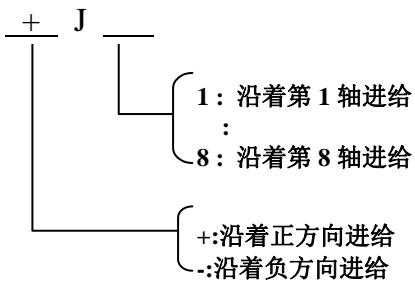

<details>
<summary>flowchart</summary>

```mermaid
graph TD
  A["+"] --> B["J"]
  B --> C["1: 沿着第1轴进给"]
  B --> D["8: 沿着第8轴进给"]
  B --> E["+:沿着正方向进给"]
  B --> F["-:沿着负方向进给"]
```
</details>

例）正常时，在按下操作面板的“+X”的按钮时，信号+Jn显示出“1”。

※ 此信号在检测出信号上升后有效，所以，在选择 JOG 方式之前输入了方向选择信号时，不会进行轴移动，应在暂时将其值设定为 “0” 后重新确认。

(3) 确认 CNC 的诊断数据 No.0000, 1010。
检查各项目的右边显示有 “1” 的项目。

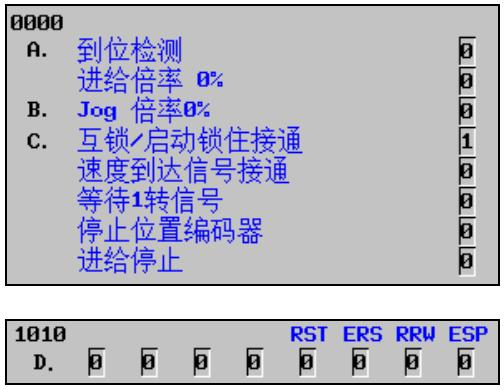

<details>
<summary>text_image</summary>

0000
A. 到位检测
进给倍率 0%
B. Jog 倍率0%
C. 互锁/启动锁住接通
速度到达信号接通
等待1转信号
停止位置编码器
进给停止
1010
D. RST ERS RRW ESP
</details>

※ A.～D.项与手动运行相关，详情如下所示。

A. 进行到位检查（定位确认）。
显示轴移动尚未结束，确认下一个诊断数据。（在下列条件下，被设定为“1”）
诊断 0300 位置偏差量 > 参数(No. 1826) 到位宽度

① 按照参数列表确认参数的设定值。


B. 手动进给速度倍率为 0%。

在 PMC 的信号状态画面上确认信号。


### PMC报警: 
- **故障内容**: #7
- **处理办法**: #6

### PMC报警: G0010
- **故障内容**: *JV7
- **处理办法**: *JV6

### PMC报警: G0011
- **故障内容**: *JV15
- **处理办法**: *JV14


倍率为 0% 时，上述地址的所有位都成为 “1111……1111” 或者 “0000……0000”。


### PMC报警: 1111
- **故障内容**: 1111
- **处理办法**: 1111

### PMC报警: 1111
- **故障内容**: 1111
- **处理办法**: 1111

### PMC报警: 
- **故障内容**: :
- **处理办法**: 

### PMC报警: 1101
- **故障内容**: 1000
- **处理办法**: 1110

### PMC报警: 
- **故障内容**: :
- **处理办法**: 

### PMC报警: 0000
- **故障内容**: 0000
- **处理办法**: 0000

### PMC报警: 0000
- **故障内容**: 0000
- **处理办法**: 0000


C. 输入了联锁（禁止轴移动）/启动锁住信号。

联锁功能备有几个种类，根据机床制造商使用哪个联锁信号，通过参数进行设定，首先确认下列设定。


### PMC报警: 
- **故障内容**: #7
- **处理办法**: #6

### PMC报警: 3003
- **故障内容**: 
- **处理办法**: 


#0 (ITL) 为 “0”，表示联锁信号（\*IT）有效。 至①

#2 (ITX) 为 “0”，表示联锁信号（\*ITn）有效。至②

在 PMC 的信号状态画面上，确认上述参数所选的有效联锁信号状态。

① 输入了联锁信号（\*IT）


### PMC报警: 
- **故障内容**: #7
- **处理办法**: #6

### PMC报警: G0008
- **故障内容**: 
- **处理办法**: 


\*IT 为 “0”，表示输入了联锁信号。

② 输入了各轴联锁信号（\*ITn）


### PMC报警: 
- **故障内容**: #7
- **处理办法**: #6

### PMC报警: G0130
- **故障内容**: *IT8
- **处理办法**: *IT7


\*ITn 为 “0”，表示输入了联锁信号。

D. CNC 处在复位状态。

处在这一状态时，手动运行和自动运行均不能操作，请参阅“不能进行手动和自动运行”项并进行检查。

(4) 手动进给速度（参数）不正确。


(5) 选择了手动每转进给

以与主轴的旋转取得同步的速度进给轴的功能，是否使用此功能，通过下列参数来选择。


### PMC报警: 
- **故障内容**: #7
- **处理办法**: #6

### PMC报警: 1402
- **故障内容**: 
- **处理办法**: 


JRV JOG 进给和增量进给

0: 选择每分钟进给。

## 1: 选择每转进给。

a. 设定为 “1” 时，在主轴的旋转上乘以同步计算轴的进给速度，请旋转主轴。  
b. 即使旋转主轴，轴仍然不移动时，检查安装在主轴一侧的检测器（位置编码器），并检查位置编码器与 CNC 间的电缆的断线或接地故障情况。

(6) 指定轴为分度工作台分度轴<仅限加工中心系统>

分度工作台分度轴（B 轴）不能进行 JOG 进给、增量进给、以及手动手轮进给。

## 10.4 不能进行手动手轮运行

## 要点

不能进行手动手轮运行时，可能是由于下列原因。

- 伺服尚未被激活。  
- 手摇脉冲发生器尚未正确连接到 I/O 模块。  
- 尚未进行 I/O 模块的 I/O Link $i$ 的分配，或分配不正确。  
- 由于参数设定错误，尚未输入相关的输入信号。

此外，通过 CNC 诊断功能确认内部状态。

## 原因与处理办法

## 1 伺服尚未被激活

确认伺服放大器的 LED 是否显示出 “0”。若是 “0” 以外的显示，说明伺服尚未被激活。这种情况下，JOG 运行和自动运行都不会操作。

确认伺服相关参数，并确认布线情况。

## 2 确认手摇脉冲发生器

## (1) 电缆的不良（断线等）

参照下图，检查是否存在电缆的断线、接地故障等异常。

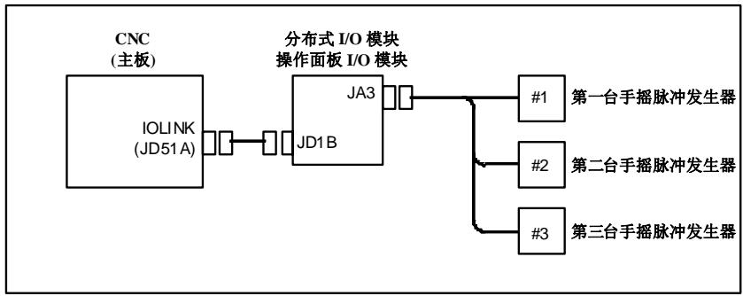

<details>
<summary>flowchart</summary>

```mermaid
graph LR
  A["CNC (主板)"] --> B["IOLINK (JD51A)"]
  B --> C["JA3"]
  C --> D["#1 第一台手摇脉冲发生器"]
  C --> E["#2 第二台手摇脉冲发生器"]
  C --> F["#3 第三台手摇脉冲发生器"]
  C --> G["JO1B"]
  G --> H["分布式 I/O 模块 操作面板 I/O 模块"]
```
</details>

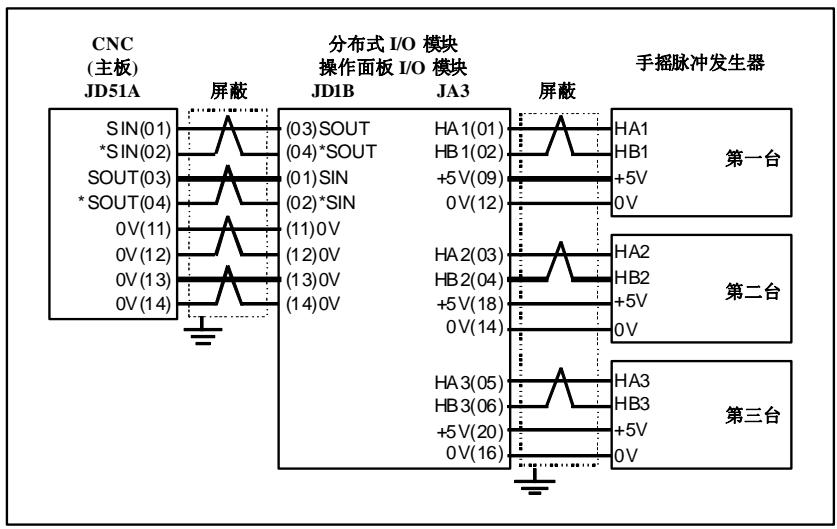

<details>
<summary>text_image</summary>

CNC
(主板)
JD51A
屏蔽
分布式 I/O 模块
操作面板 I/O 模块
JA3
屏蔽
手摇脉冲发生器
SIN(01)
*SIN(02)
SOUT(03)
*SOUT(04)
0V(11)
0V(12)
0V(13)
0V(14)
(03)SOUT
(04)*SOUT
(01)SIN
(02)*SIN
(11)0V
(12)0V
(13)0V
(14)0V
HA1(01)
HB1(02)
+5V(09)
0V(12)
HA2(03)
HB2(04)
+5V(18)
0V(14)
HA3(05)
HB3(06)
+5V(20)
0V(16)
HA1
HB1
+5V
0V
第一台
第二台
第三台
</details>

## (2) 手摇脉冲发生器的不良

旋转手摇脉冲发生器时，会输出下列所示信号，利用手摇脉冲发生器背面的螺丝接线端，通过示波器进行测量，如果尚未输入信号，同时测量+5V的电压。

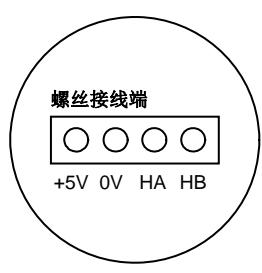

<details>
<summary>text_image</summary>

螺丝接线端
+5V 0V HA HB
</details>

手摇脉冲发生器背面

HA: 手摇脉冲发生器 A 相信号

HB: 手摇脉冲发生器 B 相信号

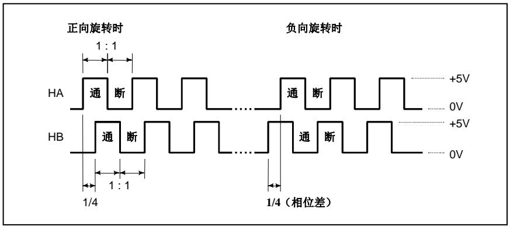

<details>
<summary>text_image</summary>

正向旋转时
1:1
HA 通断
...
通断
+5V
0V
HB 通断
...
通断
+5V
0V
1/4
1:1
1/4（相位差）
</details>

同时确认通：断比率以及 HA/HB 的相位差等。

## 3 确认参数、输入信号

(详情请参阅 “CNC 状态显示” 项。)

## (1) 确认 CNC 状态显示（显示在画面的左下）。

选择手动手轮方式时，只要显示出 “HND”，方式选择就属于正常。

当没有显示出 “HND” 时，说明下列方式选择信号尚未正确输入，所以应根据 PMC 的信号状态画面确认方式选择信号。


### PMC报警: 
- **故障内容**: #7
- **处理办法**: #6

### PMC报警: G0043
- **故障内容**: 
- **处理办法**: 

### PMC报警: 
- **故障内容**: 
- **处理办法**: 

### PMC报警: 
- **故障内容**: 手动手轮方式时
- **处理办法**: 


## (2) 尚未输入手动手轮进给轴选择信号

通过 PMC 的信号状态画面确认信号。


### PMC报警: 
- **故障内容**: #7
- **处理办法**: #6

### PMC报警: G0018
- **故障内容**: HS2D
- **处理办法**: HS2C

### PMC报警: G0019
- **故障内容**: 
- **处理办法**: 

### PMC报警: G0020
- **故障内容**: 
- **处理办法**: 

### PMC报警: G0379
- **故障内容**: 
- **处理办法**: 

### PMC报警: G0411
- **故障内容**: 
- **处理办法**: 

### PMC报警: G0412
- **故障内容**: 
- **处理办法**: 


### PMC报警: 
- **故障内容**: #7
- **处理办法**: #6

### PMC报警: G0018
- **故障内容**: HS2D
- **处理办法**: HS2C

### PMC报警: G0019
- **故障内容**: 
- **处理办法**: 

### PMC报警: G0020
- **故障内容**: 
- **处理办法**: 

### PMC报警: G0379
- **故障内容**: 
- **处理办法**: 

### PMC报警: G0411
- **故障内容**: 
- **处理办法**: 

### PMC报警: G0412
- **故障内容**: 
- **处理办法**: 


选择机床操作面板的用于手动手轮进给的轴选择开关时，只要上述信号按照如下方式被输入就属于正常。


### PMC报警: 选择轴
- **故障内容**: HSnE
- **处理办法**: HSnD

### PMC报警: 无选择
- **故障内容**: 0
- **处理办法**: 0

### PMC报警: 第1轴
- **故障内容**: 0
- **处理办法**: 0

### PMC报警: 第2轴
- **故障内容**: 0
- **处理办法**: 0

### PMC报警: 第3轴
- **故障内容**: 0
- **处理办法**: 0

### PMC报警: 第4轴
- **故障内容**: 0
- **处理办法**: 0

### PMC报警: 第5轴
- **故障内容**: 0
- **处理办法**: 0

### PMC报警: 第6轴
- **故障内容**: 0
- **处理办法**: 0

### PMC报警: 第7轴
- **故障内容**: 0
- **处理办法**: 0

### PMC报警: 第8轴
- **故障内容**: 0
- **处理办法**: 1

### PMC报警: 第9轴
- **故障内容**: 0
- **处理办法**: 1

### PMC报警: 第10轴
- **故障内容**: 0
- **处理办法**: 1

### PMC报警: 第11轴
- **故障内容**: 0
- **处理办法**: 1

### PMC报警: 第12轴
- **故障内容**: 0
- **处理办法**: 1

### PMC报警: 第13轴
- **故障内容**: 0
- **处理办法**: 1

### PMC报警: 第14轴
- **故障内容**: 0
- **处理办法**: 1

### PMC报警: 第15轴
- **故障内容**: 0
- **处理办法**: 1

### PMC报警: 第16轴
- **故障内容**: 1
- **处理办法**: 0

### PMC报警: 第17轴
- **故障内容**: 1
- **处理办法**: 0

### PMC报警: 第18轴
- **故障内容**: 1
- **处理办法**: 0

### PMC报警: 第19轴
- **故障内容**: 1
- **处理办法**: 0

### PMC报警: 第20轴
- **故障内容**: 1
- **处理办法**: 0

### PMC报警: 第21轴
- **故障内容**: 1
- **处理办法**: 0

### PMC报警: 第22轴
- **故障内容**: 1
- **处理办法**: 0

### PMC报警: 第23轴
- **故障内容**: 1
- **处理办法**: 0

### PMC报警: 第24轴
- **故障内容**: 1
- **处理办法**: 1


## 注释

n 为手摇脉冲发生器（MPG）的编号，最多可以使用 5 台手摇脉冲发生器的选择信号。以 A～E 的 5 位代码进行轴选择。

## (3) 手动手轮进给的倍率的选择不正确。

通过 PMC 的信号状态画面确认信号。此外，基于参数列表确认下列相关参数。


### PMC报警: 
- **故障内容**: #7
- **处理办法**: #6

### PMC报警: G0019
- **故障内容**: 
- **处理办法**: 


手轮方式时，切换每步的移动量。


### PMC报警: MP2
- **故障内容**: MP1
- **处理办法**: 断续进给

### PMC报警: 0
- **故障内容**: 0
- **处理办法**: $\times$  1

### PMC报警: 0
- **故障内容**: 1
- **处理办法**: $\times$  10

### PMC报警: 1
- **故障内容**: 0
- **处理办法**: $\times$  100

### PMC报警: 1
- **故障内容**: 1
- **处理办法**: $\times$  1000


### PMC报警: 
- **故障内容**: #7
- **处理办法**: #6

### PMC报警: 7100
- **故障内容**: 
- **处理办法**: 


#5 MPX 手轮进给中，手轮移动量选择信号

0: 将第 1 台手摇脉冲发生器用的信号 MP1,MP2<G019.4,5>作为各手摇脉冲发生器共同的信号来使用。  
1: 针对每台手摇脉冲发生器使用各自的手动手轮进给移动量选择信号。

第 1 台手摇脉冲发生器: MP1, MP2 < G019.4, 5 >

第 2 台手摇脉冲发生器: MP21, MP22 < G087.0, 1>

第 3 台手摇脉冲发生器: MP31, MP32 < G087.3, 4>

第 4 台手摇脉冲发生器: MP41, MP42 < G087.6, 7>

第 5 台手摇脉冲发生器: MP51, MP52 < G380.0, 1 >


### PMC报警: 7102
- **故障内容**: #7
- **处理办法**: #6


## (4) 指定轴为分度工作台分度轴<仅限加工中心系统>

分度工作台分度轴（B 轴）不能进行 JOG 进给、增量进给、以及手动手轮进给。

## 4 确认 CNC 诊断功能

(1) 确认 CNC 诊断数据 No.0000, 1010。

检查各项目的右边显示有 “1” 的项目。

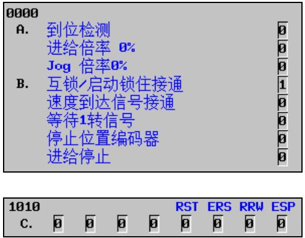

<details>
<summary>text_image</summary>

0000
A. 到位检测
进给倍率 0%
Jog 倍率0%
B. 互锁/启动锁住接通
速度到达信号接通
等待1转信号
停止位置编码器
进给停止
1010
C. RST ERS RRW ESP
</details>

※ A.～C.项与手动运行相关，详情如下所示。

A. 进行到位检查（定位确认）。

显示轴移动尚未结束，确认下一个诊断数据。（在下列条件下，被设定为“1”。）

诊断 0300 位置偏差量 > 参数(No. 1826) 到位宽度

① 按照参数列表确认参数的设定值。

1825

每个轴的伺服环路增益 （标准值：3000）

B. 输入了联锁（禁止轴移动）/启动锁住信号。

联锁功能备有几个种类，根据机床制造商使用哪个联锁信号，通过参数进行设定，首先确认下列设定。


### PMC报警: 
- **故障内容**: #7
- **处理办法**: #6

### PMC报警: 3003
- **故障内容**: 
- **处理办法**: 


#0 (ITL) 为 “0”，表示联锁信号（\*IT）有效。至①

#2 (ITX) 为 “0”，表示联锁信号（\*ITn）有效。至②

在 PMC 的信号状态画面上，确认上述参数所选的有效联锁信号状态。

① 输入了联锁信号（\*IT）


### PMC报警: 
- **故障内容**: #7
- **处理办法**: #6

### PMC报警: G0008
- **故障内容**: 
- **处理办法**: 


\*IT 为 “0”，表示输入了联锁信号。

② 输入了各轴联锁信号（\*ITn）


### PMC报警: 
- **故障内容**: #7
- **处理办法**: #6

### PMC报警: G0130
- **故障内容**: *IT8
- **处理办法**: *IT7


\*ITn 为 “0”，表示输入了联锁信号。

C. CNC 处在复位状态。

处在这一状态时，手动运行和自动运行均不能操作，请参阅“不能进行手动和自动运行”项并进行检查。

## 10.5 不能进行自动运行

## 要点

(1) 在手动运行下确认是否操作  
(2) 确认机床操作面板的启动指示灯状态  
(3) 确认 CNC 的状态显示

## 原因与处理办法

即使在手动运行下也不会操作时，参照 “不能进行慢进（JOG）运行” 并进行检查。

根据 CNC 的状态显示的 “方式选择状态”，确认是否选择了正确的方式。此外，以同样方式确认 “自动运行状态”，这样就可以确认自动运行处在起动、进给暂停或停止中的哪一种状态。

## 1 自动运行不会起动（启动指示灯不会点亮）时

画面下的 CNC 的状态显示中，显示出 “\*\*\*\*”。

(1) 方式选择信号不正确

机床操作面板的方式选择信号没有正确输入时，会出现如下显示。

MDI : 手动数据输入(MDI)方式

MEM : 存储器运行方式

RMT :遥控运行方式

没有正确显示时，通过下面的 PMC 的信号状态画面确认下列方式信号。


### PMC报警: 
- **故障内容**: #7
- **处理办法**: #6

### PMC报警: G0043
- **故障内容**: 
- **处理办法**: 


### PMC报警: DNCI
- **故障内容**: MD4
- **处理办法**: MD2

### PMC报警: -
- **故障内容**: 0
- **处理办法**: 0

### PMC报警: 0
- **故障内容**: 0
- **处理办法**: 0

### PMC报警: 1
- **故障内容**: 0
- **处理办法**: 0


## (2) 尚未输入自动运行起动（启动）信号

按下自动运行起动按钮时信号变为 “1”，松开按钮时信号变为 “0”，自动运行的起动在其从 “1” 改变为 “0” 时起作用，所以，可通过 PMC 的信号状态画面确认信号的状态。


### PMC报警: 
- **故障内容**: #7
- **处理办法**: #6

### PMC报警: G0007
- **故障内容**: 
- **处理办法**: 


ST 自动运行起动（启动）信号

## (3) 输入了自动运行暂停（进给暂停）信号

尚未按下自动运行暂停按钮时，只要进给暂停信号为 “1” 就属于正常，所以可通过 PMC 的信号状态画面确认信号的状态。


### PMC报警: 
- **故障内容**: #7
- **处理办法**: #6

### PMC报警: G0008
- **故障内容**: 
- **处理办法**: 


\*SP 自动运行暂停（进给暂停）信号

## 2 自动运行起动中（启动指示灯点亮）时

画面下的 CNC 的状态显示中，显示出 “STRT”。

(1) 确认显示在 CNC 的诊断数据 No.0 中的内容。检查各项目的右边显示有 “1” 的项目。

诊断

0

CNC 的内部状态 1

[数据类型] 位型

名称 显示“1”时的插补状态

a. 到位检测 到位检测中。  
b. 进给倍率 0% 进给速度倍率为 0%。  
c. Jog 倍率 0% JOG 进给速度倍率为 0%。  
d. 互锁/启动锁住接通 互锁 / 启动锁住接通。  
e. 速度到达信号接通 等待速度到达信号接通。

等待 1 转信号 螺纹切削中等待主轴 1 转信号。

停止位置编码器 主轴每转进给中等待位置编码器的旋转。

※ 从 a.～e. 的项目与自动运行相关联。详情如下所示。

## a. 到位检测（定位确认）中。

表示对应轴的定位（G00）尚未到达指令位置的状态。

通过检查伺服的位置偏差量确定定位是否已经结束，所以对如下诊断数据进行确认。

诊断 300 位置误差量 > 参数(No. 1826) 到位宽度

位置偏差量在轴的定位结束时，几乎接近 “0”，当成为参数中设定的到位宽度以内值时，定位结束，执行下一个程序段。

## b. 进给速度倍率处在 0%。

对于由程序指定的进给速度，通过如下倍率信号计算实际进给速度，所以可通过 PMC 的信号状态画面确认信号的状态。

## - 通常的倍率信号


### PMC报警: 
- **故障内容**: #7
- **处理办法**: #6

### PMC报警: G0012
- **故障内容**: *FV7
- **处理办法**: *FV6


\*FVn 切削进给倍率

<第2倍率信号（选项）>

对于上述倍率信号，可以通过下列信号应用更加细分的倍率。

是否使用该特性，应参阅机床制造商提供的资料。


### PMC报警: 
- **故障内容**: #7
- **处理办法**: #6

### PMC报警: G0013
- **故障内容**: *AFV7
- **处理办法**: *AFV6


\*AFVn 第 2 切削进给倍率

## - 倍率信号的状态


## c. 手动进给速度倍率为 0%（仅限空运行时）

通常，手动进给速度倍率功能使用慢进（JOG），而在自动运行中，当空运行信号 DRN 成为 “1” 时，对于由下列参数设定的进给速度，已计算了基于此信号的倍率值的进给速度有效。


### PMC报警: 
- **故障内容**: #7
- **处理办法**: #6

### PMC报警: G0046
- **故障内容**: DRN
- **处理办法**: 


DRN 为 “1”，输入了空运行信号。


设定了基于如下倍率信号的、100%时的速度。


### PMC报警: 
- **故障内容**: #7
- **处理办法**: #6

### PMC报警: G0010
- **故障内容**: *JV7
- **处理办法**: *JV6


### PMC报警: G0011
- **故障内容**: *JV15
- **处理办法**: *JV14


倍率为 0% 时，上述地址的所有位成为 “1111…1111” 或者 “0000…0000”。


### PMC报警: 1111
- **故障内容**: 1111
- **处理办法**: 1111

### PMC报警: 1111
- **故障内容**: 1111
- **处理办法**: 1111

### PMC报警: 
- **故障内容**: :
- **处理办法**: 

### PMC报警: 1101
- **故障内容**: 1000
- **处理办法**: 1110

### PMC报警: 
- **故障内容**: :
- **处理办法**: 

### PMC报警: 0000
- **故障内容**: 0000
- **处理办法**: 0000

### PMC报警: 0000
- **故障内容**: 0000
- **处理办法**: 0000


## d. 输入了联锁（禁止轴移动）信号。

联锁功能备有几个种类，根据机床制造商使用哪个联锁（信号），通过参数予以选择，首先确认下列设定。


### PMC报警: 
- **故障内容**: #7
- **处理办法**: #6

### PMC报警: 3003
- **故障内容**: 
- **处理办法**: 


ITL 0: 联锁信号（\*IT）有效。  
ITX 0: 联锁信号（\*ITn）有效。

对应于所设定位的信号在起作用，所以可通过 PMC 的信号状态画面确认下一个信号。

① 输入了联锁信号（\*IT、\*CSL、\*BSL）


### PMC报警: 
- **故障内容**: #7
- **处理办法**: #6

### PMC报警: G0008
- **故障内容**: 
- **处理办法**: 


\*IT、\*CSL、\*BSL 为 “0”，表示从 PMC 一侧输入了联锁信号。

② 输入了各轴联锁信号（\*ITn）


### PMC报警: 
- **故障内容**: #7
- **处理办法**: #6

### PMC报警: G0130
- **故障内容**: *IT8
- **处理办法**: *IT7


\*ITn 为 “0”，联锁信号被从 PMC 一侧输入到对应的轴。

③ 表示对于被拆除的轴指定了轴移动指令。

※ 此功能唯在 CNC 一侧的参数 RMBx(No.1005#7)=1 时有效。

此功能是否起作用，可通过 PMC 的信号状态画面确认下列信号，对显示有 “1” 的轴进行检查。

1) 从 PMC 输入了轴拆除信号（DTCHn）。


### PMC报警: 
- **故障内容**: #7
- **处理办法**: #6

### PMC报警: G0124
- **故障内容**: DTCH8
- **处理办法**: DTCH7


DTCHn 为 “1”，表示对应的轴已被拆除。

在 CNC 一侧的下列参数中，轴拆除功能对于相应的轴处在有效状态。


### PMC报警: 
- **故障内容**: #7
- **处理办法**: #6

### PMC报警: 0012
- **故障内容**: RMVx
- **处理办法**: 


RMVx 各轴的控制轴拆除的设定

0: 不会拆除控制轴。

1: 拆除控制轴。（与控制轴拆除信号 DTCH1, DTCH2, ... 等同。）

e. 等待主轴速度到达信号的输入

对于由程序指定的主轴转速，表示尚未到达实际的转速之状态。

通过 PMC 的信号状态画面确认信号的状态。


### PMC报警: 
- **故障内容**: #7
- **处理办法**: #6

### PMC报警: G0029
- **故障内容**: 
- **处理办法**: 


SAR 为 “0”，主轴转速尚未到达指令转速。

※ 参数 SAR(No.3708#0)=1 时，此功能有效。

(2) 仅在定位(G00)的快速移动时不会操作时确认下列参数以及发自 PMC 的信号。

a. 快速移动速度的设定值


b. 快速移动倍率信号


### PMC报警: 
- **故障内容**: #7
- **处理办法**: #6

### PMC报警: G0014
- **故障内容**: 
- **处理办法**: 


### PMC报警: G0096
- **故障内容**: HROV
- **处理办法**: *HROV6


### PMC报警: ROV1
- **故障内容**: ROV2
- **处理办法**: 倍率

### PMC报警: 0
- **故障内容**: 0
- **处理办法**: 100%

### PMC报警: 1
- **故障内容**: 1
- **处理办法**: 50%

### PMC报警: 0
- **故障内容**: 1
- **处理办法**: 25%

### PMC报警: 1
- **故障内容**: 1
- **处理办法**: F0


(3) 仅在切削进给(G00 以外)时不会操作时

a. 参数的最大切削进给速度的设定有误。

切削进给(G00 以外)被钳制在此上限速度。

1430

## 每个轴的最大切削进给速度

b. 进给速度被每转进给(mm/rev)指定时

① 位置编码器没有旋转。

检查主轴和位置编码器之间的连接。

可能是由于下列不良造成的。

- 同步皮带断线  
- 按键脱落  
- 连接部松动  
- 信号电缆的连接器松动

② 位置编码器不良

c. 不能通过螺纹切削指令操作时

① 位置编码器没有旋转。

检查主轴和位置编码器之间的连接。

可能是由于下列不良造成的。

- 同步皮带断线  
- 按键脱落  
- 连接部松动  
- 信号电缆的连接器松动

② 位置编码器不良

与位置编码器之间的连接若是串联主轴伺服的情形，连接到主轴放大器；若是模拟接口的情形，则连接到 CNC 一侧。

有关连接的详情，请参阅下面的内容。

发自位置编码器的 A 相 / B 相信号是否已被正确读取，也可通过画面的显示（位置显示画面）观测主轴的实际转速来做出判断。（但是，参数 DPS (No.3105#2) 为 0 时不予显示。）

## - $\alpha i$ 系列主轴放大器的情形

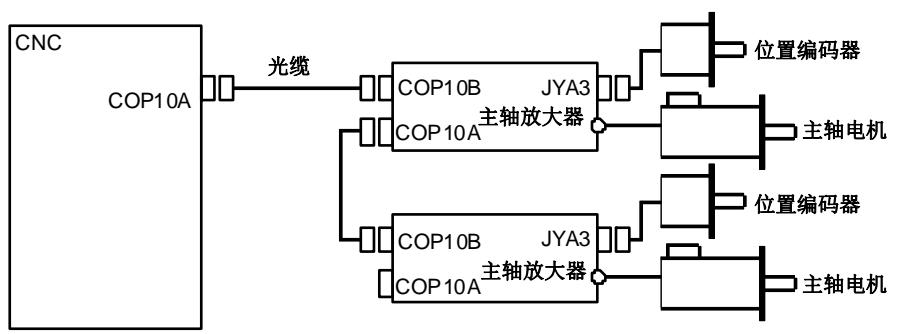

<details>
<summary>flowchart</summary>

```mermaid
graph LR
  A["CNC"] -->|光缆| B["COP10B"]
  A --> C["COP10A"]
  B --> D["主轴放大器"]
  C --> E["主轴放大器"]
  D --> F["位置编码器"]
  E --> G["位置编码器"]
  F --> H["主轴电机"]
  G --> I["主轴电机"]
```
</details>

d. 指定了进给速度的指令（F 指令）为 0 的切削进给程序段。

参数 FCO(No.1404#7)为 1 时, 进给速度的指令(F 指令)即使是 0 也不会发生报警(PS0011), “切削速度为 0 （未指令）”。

## 10.6 自动运行起动信号断开

## 要点

(1) 在开始自动运行之后又停止时,按照此步骤进行检查。  
(2) 确认机床操作面板的自动运行起动中（循环启动）指示灯。  
(3) 确认 CNC 一侧的诊断功能。

## 原因与处理办法

在 PMC 的信号状态画面上确认相关的信号状态。

## a. 输入了急停信号


### PMC报警: 
- **故障内容**: #7
- **处理办法**: #6

### PMC报警: X0008
- **故障内容**: 
- **处理办法**: 

### PMC报警: G0008
- **故障内容**: 
- **处理办法**: 


\*ESP 为 “0” 时，表示输入了急停信号。

## b. 输入了外部复位信号


### PMC报警: 
- **故障内容**: #7
- **处理办法**: #6

### PMC报警: G0008
- **故障内容**: ERS
- **处理办法**: 


ERS 为 “1” 时，表示输入了外部复位信号。  
※ 此信号通常在程序结束等时指定了 M02 并从 PMC 一侧作为确认信号来使用，在执行 M02 时，成为输入了外部复位信号的状态。

## c. 按下了 MDI 的复位按钮

表示由于在自动运行中按下了 MDI 单元的 RESET 键，使自动运行进入复位状态。

## d. 输入了复位&重绕信号


### PMC报警: 
- **故障内容**: #7
- **处理办法**: #6

### PMC报警: G0008
- **故障内容**: 
- **处理办法**: RRW


RRW 为 “1”，表示输入了复位 & 重绕信号。  
※ 本信号通常在程序结束等时通过 M30 从 PMC 一侧作为确认信号来使用，在程序结束之后，成为输入了复位 & 重绕信号的状态。

## e. 发生了伺服报警

表示由于在自动运行中发生了其中之一的伺服报警，使自动运行进入复位状态，操作停止。

## f. 自动运行进入暂停状态

暂停状态是由于下列原因引起的。

① 在自动运行中，方式选择切换为其它手动运行方式时  
② 输入了自动运行暂停（进给暂停）信号时

## - 方式选择信号


### PMC报警: 
- **故障内容**: #7
- **处理办法**: #6

### PMC报警: G0043
- **故障内容**: 
- **处理办法**: 

### PMC报警: 
- **故障内容**: 
- **处理办法**: 

### PMC报警: 自动运行
- **故障内容**: 存储器编辑(EDIT)
- **处理办法**: 0

### PMC报警: 自动运行(AUTO)
- **故障内容**: 0
- **处理办法**: 0

### PMC报警: 手动数据输入(MDI)
- **故障内容**: 0
- **处理办法**: 0

### PMC报警: 手动运行
- **故障内容**: 慢进(JOG)
- **处理办法**: 1

### PMC报警: 手轮/断续进给
- **故障内容**: 1
- **处理办法**: 0

### PMC报警: TEACH IN HANDLE
- **故障内容**: 1
- **处理办法**: 1

### PMC报警: TEACH IN JOG
- **故障内容**: 1
- **处理办法**: 1


## - 自动运行暂停信号


### PMC报警: 
- **故障内容**: #7
- **处理办法**: #6

### PMC报警: G0008
- **故障内容**: 
- **处理办法**: 


\*SP 为 “0”，表示输入了自动运行暂停信号。

## g. 自动运行中成为单程序段停止


### PMC报警: 
- **故障内容**: #7
- **处理办法**: #6

### PMC报警: G0046
- **故障内容**: 
- **处理办法**: 


SBK 为 “1”，表示输入了单程序段信号。

## 10.7 通电后LCD上没有任何显示

## 原因与处理办法

通电后 LCD 上没有任何显示的情形，以及停留在显示 “LOADING GRAPHIC SYSTEM”（加载图形系统）的情形，可能是由于下列原因造成的。

## - 显示器一体型的情形

- 有的 LCD 电缆、背景灯电缆尚未连接。  
- 所需软件尚未安装。  
- 主板、GUI 卡、CPU 卡、风扇适配器板不良。

注释：GUI 卡、CPU 卡、伺服卡只限于 15"显示器（基本单元 G）。

8.4”显示器、10.4”显示器（基本单元 A）上没有安装 GUI 卡、CPU 卡、伺服卡。

## - LED 显示

请参照主板的 LED 显示项节，确认主板的 LED 电量情况。

如果主板正常启动，LED 的显示通常运行，则可能是由于电缆漏连，或风扇适配器电路板不良等显示系统的不良。

在启动处理过程中停止时，可能是由于硬件的不良(包括安装不良)，或没有安装所需软件等。

## - LCD 电缆、背景灯的连线

请确认背景灯连接器及 LCD 连接器是否与电缆切实连接。

这些电缆在发那科公司出厂时已经连好，但需要进行维修而拆下电缆时，特别要引起注意。

## - 没有安装所需软件

FROM 中没有储存所需软件时，CNC 可能无法启动。

## - 印制电路板的不良

有时，由于主板及 GUI 卡的故障或安装不良，也会导致 CNC 无法启动。

请确认卡 PCB 与主板上的连接器紧密嵌合。

进行以上处理仍无法修复时，请更换 GUI 卡、CPU 卡和主板。有关 GUI 卡、CPU 卡的安装位置（15"显示器），请参阅 2.3.1 项。此外，有关更换，请参阅 3.4 节。

## 10.8 不能进行I/O的输入/输出，不能正确输入/输出

## 原因与处理办法

I/O Link i 没有连接时，或来自 I/O 设备的信号无法从 CNC 一侧正常输入时，或来自 CNC 的信号无法输出到 I/O 设备时，可能是由于如下原因造成的。

- I/O 设备的电源没有接通，或电压不合适。  
- I/O Link $i$ 电缆连接错误。电缆的连接不正确。  
- 尚未进行正确的接地处理。  
- 输入 / 输出信号连接错误。  
- 没有进行 I/O Link $i$ 的分配，或分配不正确。

## - PMC 报警

## ER97 I/O Link 连接异常

PMC 的报警画面上显示出 “ER97 I/O Link FAILURE(CHx Gyy)” 时，说明 I/O Link i 的通道 xx 的 I/O 设备的连接台数与 I/O Link i 的分配台数不匹配。

## - PMC 的 I/O Link 画面

从功能键的菜单选择 [PMC 维修] → [I/O 设备]，显示出 CNC 一侧所识别的 I/O 设备。可用此画面确认设备是否已经正常连接。

画面显示例

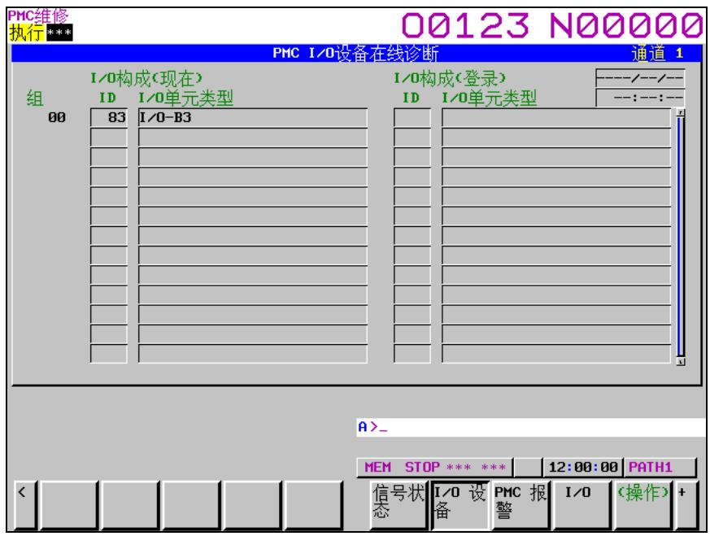

<details>
<summary>text_image</summary>

PMC维修
执行***
00123 N00000
PHC I/O设备在线诊断
通道 1
组	 I/O构成(现在)	 I/O构成(登录)
ID	I/O单元类型	ID	I/O单元类型
83	I/O-B3
A >_
MEM STOP *** ***
12:00:00 PATH1
信号状态	I/O 设备	PMC 报警	I/O	(操作) +
</details>

此例表示下图所示的 I/O Link 连接。

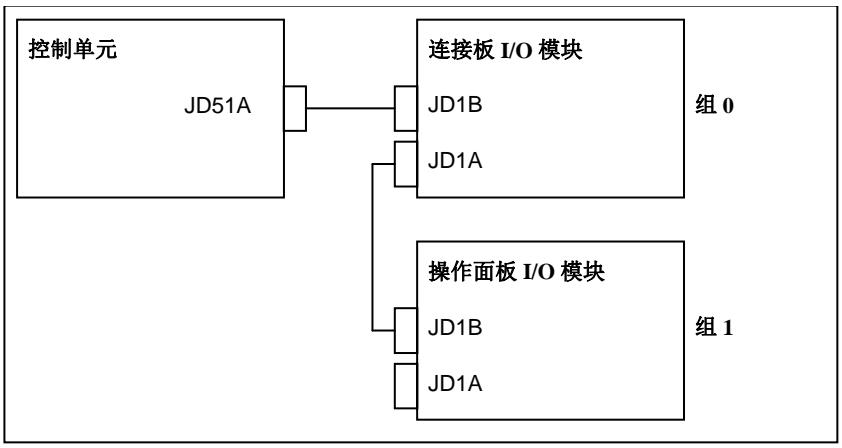

<details>
<summary>flowchart</summary>

```mermaid
graph TD
  A["控制单元"] --> B["接线器"]
  B --> C["连接板 I/O 模块"]
  C --> D["组 0"]
  B --> E["接线器"]
  E --> F["操作面板 I/O 模块"]
  F --> G["组 1"]
  B --> H["接线器"]
  H --> I["接线器"]
    style A fill:#f9f,stroke:#333
    style B fill:#ccf,stroke:#333
    style C fill:#cfc,stroke:#333
    style D fill:#fcc,stroke:#333
    style E fill:#cff,stroke:#333
    style F fill:#ffc,stroke:#333
    style G fill:#fcc,stroke:#333
```
</details>

## - 确认 I/O 设备的电源

确认已连接的 I/O 设备的电源是否正确连接，是否为规定的供电电压。

确认通电顺序是否正确。

I/O 设备的通电时机：在接通 CNC 的电源之前，还是在接通 CNC 的电源之后 500ms 以内

此外，切断 CNC 的电源时，也需要切断 I/O 设备的电源。（详情情参阅 “CONNECTION MANUAL

(HARDWARE)(B-64603EN)”（连接说明书（硬件篇））的“TURNING ON AND OFF THE POWER TO THE CONTROL

UNIT”（控制单元电源的通/断）章节。）

## - 电缆的连接

I/O Link i 的电缆如上例所示，与 JD1A（JD51A）和 JD1B 连接。JD1A（JD51A）为高位单元，JD1B 为低位单元。此外，请确认电缆连接是否有误。

## - 地线的连接

确认是否已经连接地线，连接是否松动。

## - I/O 的连接

确认连接到各 I/O 设备的输入 / 输出信号的连接是否正确。

若是操作面板 I/O 模块及连接板 I/O 模块，要确认输入信号的 0V 或 +24V 是否连接到了共用跨接引脚，输出信号的 +24V 是否连接到了 DO 共用端。

## - I/O Link $i$ 的分配

确认 I/O Link i 或 I/O Link 的分配是否正确设定。

从功能键 $\boxed{\text{SYSTEM}}$ 的菜单选择 [PMC 配置] $\rightarrow$ [模块] $\rightarrow$ [编辑]，显示出分配编辑画面。

编辑腕分配后，务必在 PMC 数据输入/输出画面上将顺序程序写入闪存 ROM。如不进行此项操作，切断电源时，编辑的内容将会丢失。

## 10.9 连接板I/O上数据被输入到意料外的地址中

在将连接板 I/O 上理应输入到 X004 的数据输入到 X010 时等将数据输入到错误的地址中时,可能是由于下列原因造成的。

(1) I/O Link i 的分配错误。

→ 按照第 10.8 节进行确认。

(2) 各单元的连接器连接(CA52→CA53)错误

如果弄错连接，将会导致如下所示那样扩展单元 1 被分配在扩展单元 3 的地址中的情形。

→ 请按照下例连接单元间的电缆。

正确的连接例（从X0开始分配的情形）  
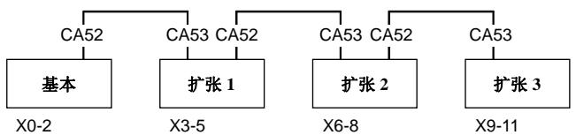

<details>
<summary>flowchart</summary>

```mermaid
graph TD
  A["基本"] --> B["CA52"]
  C["扩张 1"] --> D["CA53 CA52"]
  E["扩张 2"] --> F["CA53 CA52"]
  G["扩张 3"] --> H["CA53"]
  I["X0-2"] --> A
  J["X3-5"] --> C
  K["X6-8"] --> E
  L["X9-11"] --> G
```
</details>

错误连接例（从X0开始分配的情形）

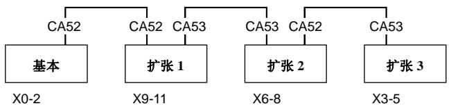

<details>
<summary>flowchart</summary>

```mermaid
graph TD
  A["基本"] --> B["CA52"]
  C["扩张 1"] --> D["CA52"]
  E["扩张 2"] --> F["CA53"]
  G["扩张 3"] --> H["CA53"]
  I["X0-2"] --> J["扩张 1"]
  K["X9-11"] --> L["扩张 1"]
  M["X6-8"] --> N["扩张 2"]
  O["X3-5"] --> P["扩张 3"]
```
</details>

(3) 各扩展单元的旋转开关设定错误。

旋转开关设定=1 时，跳过 1 个单元分配，旋转开关设定=2 时，跳过 2 个单元分配。通常设定 0。（没有旋转开关时，不能跳过单元。）

→ 请参阅下例以及 “CONNECTION MANUAL (HARDWARE) (B-64603EN)” （连接说明书 (硬件篇)）。

例）扩展单元1的旋转开关 $= 1$  
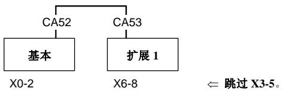

<details>
<summary>flowchart</summary>

```mermaid
graph TD
  A["基本"] --> B["CA52"]
  C["扩展1"] --> D["X6-8"]
    style A fill:#f9f,stroke:#333
    style C fill:#f9f,stroke:#333
```
</details>

## 10.10 没有数据输出到连接板I/O上的扩展单元中

可能是由于尚未向基本或扩展单元供电。

→ 在尚未输入/输出 DI 和 DO 的情况下，确认各模块的 18 号引脚和 50 号引脚是否已经接通+24V 电源。  
→ 在已经输入了 DI 而尚未输出 DO 的情况下，确认各模块的 1 号引脚和 33 号引脚是否已经接通+24V 电源。

## 10.11 报警SR0085～87（RS232C接口相关）

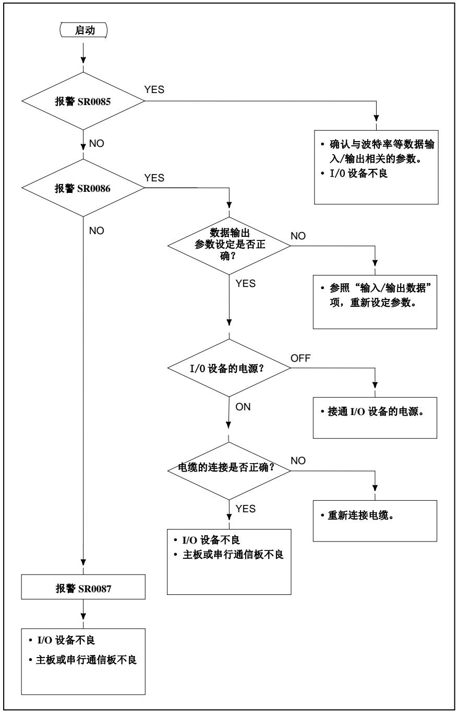

<details>
<summary>flowchart</summary>

```mermaid
graph TD
  A["启动"] --> B{报警 SR0085}
  B -->|YES| C["确认与波特率等数据输入/输出相关的参数。<br>I/O设备不良"]
  B -->|NO| D{报警 SR0086}
  D -->|YES| E["数据输出参数设定是否正确？"]
  D -->|NO| F{I/O设备的电源？}
  E -->|YES| G["参照“输入/输出数据”项，重新设定参数。"]
  E -->|NO| H["接通 I/O 设备的电源。"]
  F -->|OFF| I["电缆的连接是否正确？"]
  F -->|NO| J["重新连接电缆。"]
  G --> K["I/O 设备不良<br>主板或串行通信板不良"]
  H --> L["报警 SR0087"]
  I --> M["报警 SR0087"]
  J --> N["报警 SR0087"]
  K --> O["I/O 设备不良<br>主板或串行通信板不良"]
```
</details>

## 原因

(a) 与 RS232C 接口相关的参数设定不正确。请检查如下的设定数据及参数。  
(b) 外部输入 / 输出设备或主计算机不良  
(c) 主板或串行通信板不良  
(d) NC 与输入 / 输出设备之间的电缆不良

## 处理办法

(a) 与 RS232C 接口相关的参数设定不正确。请检查如下的设定数据及参数。

## - 设定

穿孔代码 = 0 或者 1 (0:EIA 1:ISO)

请根据输出设备的类型，选择 ISO 或 EIA。

如果穿孔代码不合适，则会发生报警(SR0086), “DR 信号关闭”。

- 参数


### PMC报警: 功能\参数 No.0020的设定值
- **故障内容**: 0
- **处理办法**: 1

### PMC报警: 进给相关参数
- **故障内容**: 0101#7
- **处理办法**: 0111#7

### PMC报警: 数据输入时代码
- **故障内容**: 0101#3
- **处理办法**: 0111#3

### PMC报警: 停止位
- **故障内容**: 0101#0
- **处理办法**: 0111#0

### PMC报警: 输入/输出设备种类的设定
- **故障内容**: 102
- **处理办法**: 112

### PMC报警: 波特率
- **故障内容**: 103
- **处理办法**: 113

### PMC报警: 通信方法
- **故障内容**: 0135#3
- **处理办法**: -


## 注释

## 1 上述数值表示参数号和位编号。

例）101#7：表示101号参数的第7位。


### PMC报警: 
- **故障内容**: #7
- **处理办法**: #6

### PMC报警: 0101
- **故障内容**: NFD
- **处理办法**: 

### PMC报警: 0111
- **故障内容**: 
- **处理办法**: 

### PMC报警: 0121
- **故障内容**: 
- **处理办法**: 


NFD 0: 数据输出时，在数据的前后输出进给（feed）。（FANUC PPR）

1: 数据输出时，在数据的前后不输出进给。（标准）

ASI 0: 数据输入时的代码为 EIA 或 ISO 代码(自动判别)

1: 数据输入时的代码为 ASCII 代码

SB2 0: 停止位的位数为 1 位

1: 停止位的位数为 2 位


### PMC报警: 设定值
- **故障内容**: 波特率
- **处理办法**: 11

### PMC报警: 7
- **故障内容**: 600
- **处理办法**: 12

### PMC报警: 8
- **故障内容**: 1200
- **处理办法**: 

### PMC报警: 9
- **故障内容**: 2400
- **处理办法**: 

### PMC报警: 10
- **故障内容**: 4800
- **处理办法**: 


(b) 外部输入 / 输出设备或主计算机不良

(i) 请确认与外部输入 / 输出设备主计算机的通信相关的设定是否与 NC 一侧的设定相同。（波特率、停止位等的设定）不同时，请变更设定值。  
(ii) 输入 / 输出设备有备用设备时，请用备用的输入 / 输出设备确认能否进行通信。

(c) 主板或串行通信板不良

(i) 参数（No.0020）为 “0” 或 “1” 或 “2” 时（主板的 JD36A 或 JD56A、JD36A 或 JD36B）可能是由于主板不良，请予更换。

(d) CNC 与输入 / 输出设备之间的电缆不良

请检查 CNC 与输入 / 输出设备之间的电缆有无断线？有无错误连线？

## - 连接

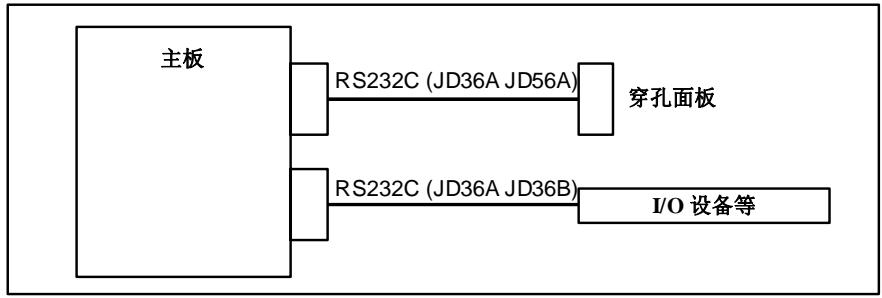

<details>
<summary>flowchart</summary>

```mermaid
graph LR
  A["主板"] --> B["穿孔面板"]
  A --> C["I/O 设备等"]
  B --> D["RS232C (JD36A JD56A)"]
  C --> E["RS232C (JD36A JD36B)"]
```
</details>

- 电缆连接  
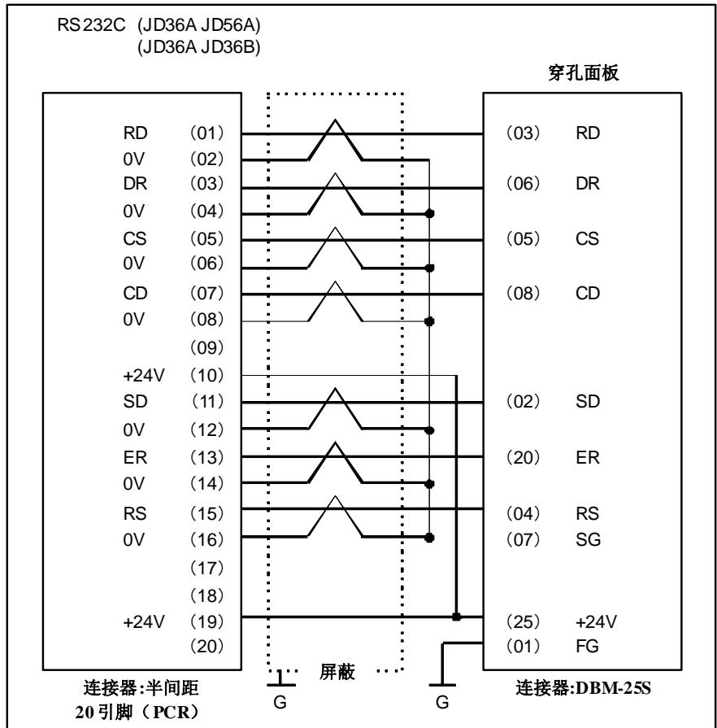

<details>
<summary>line chart</summary>

| 连接器:半间距 20 引脚 (PCR) | RD (01) | 0V (02) | DR (03) | 0V (04) | CS (05) | 0V (06) | CD (07) | 0V (08) | +24V (10) | SD (11) | 0V (12) | ER (13) | 0V (14) | RS (15) | 0V (16) | +24V (19) | 20 |
| --- | --- | --- | --- | --- | --- | --- | --- | --- | --- | --- | --- | --- | --- | --- | --- | --- | --- |
| -------------------------- | ------- | ------- | ------- | ------- | ------- | ------- | ------- | ------- | --------- | ------- | ------- | ------- | ------- | ------- | ------- | --------- | -- |
| 接触 |  |  |  |  |  |  |  |  |  |  |  |  |  |  |  |  |  |
| 穿孔面板 | (03) | RD |  |  |  |  |  |  |  |  |  |  |  |  |  |  |  |
| 接触 | (06) | DR |  |  |  |  |  |  |  |  |  |  |  |  |  |  |  |
| 接触 | (05) | CS |  |  |  |  |  |  |  |  |  |  |  |  |  |  |  |
| 接触 | (08) | CD |  |  |  |  |  |  |  |  |  |  |  |  |  |  |  |
| 接触 | (02) | SD |  |  |  |  |  |  |  |  |  |  |  |  |  |  |  |
| 接触 | (20) | ER |  |  |  |  |  |  |  |  |  |  |  |  |  |  |  |
| 接触 | (04) | RS |  |  |  |  |  |  |  |  |  |  |  |  |  |  |  |
| 接触 | (07) | SG |  |  |  |  |  |  |  |  |  |  |  |  |  |  |  |
</details>

## 10.12 报警PS0090（参考点返回位置异常）

## 内容

不满足 “向参考点返回方向发出 128 个或多个脉冲的位置偏差量(DGN.300)时，接收 1 次或更多次每转信号” 的条件时，返回参考点。

## 处理办法

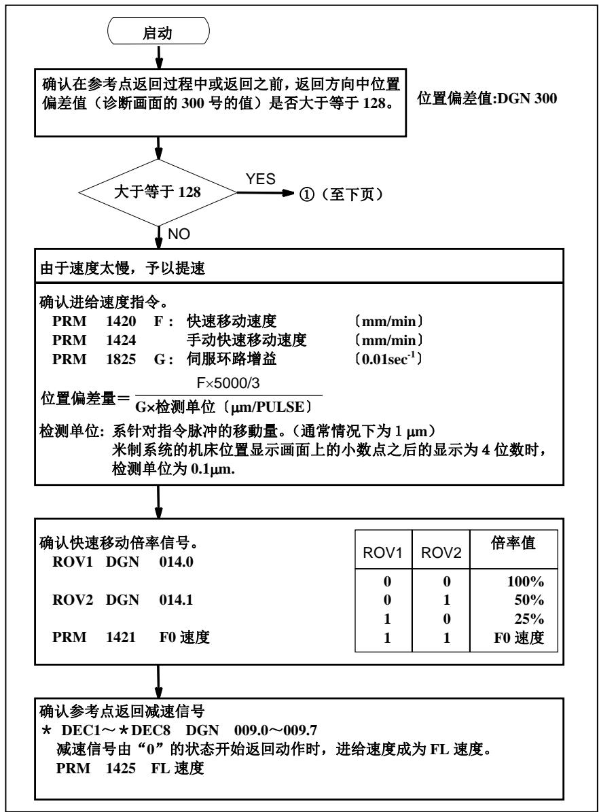

<details>
<summary>flowchart</summary>

```mermaid
graph TD
  A["启动"] --> B["确认在参考点返回过程中或返回之前，返回方向中位置偏差值（诊断画面的300号的值）是否大于等于128。"]
  B --> C{大于等于128}
  C -->|YES| D["①（至下页）"]
  C -->|NO| E["由于速度太慢，予以提速"]
  E --> F["确认进给速度指令。"]
  F --> G["PRM 1420 F: 快速移动速度 (mm/min)"]
  F --> H["PRM 1424 手动快速移动速度 (mm/min)"]
  F --> I["PRM 1825 G: 伺服环路增益 (0.01sec⁻¹)"]
  G --> J["位置偏差量 = F×5000/3 / G×检测单位 (μm/PULSE)"]
  H --> J
  I --> J
  J --> K["检测单位：系针对指令脉冲的移動量。（通常情况下为1 μm）\n米制系统的机床位置显示画面上的小数点之后的显示为4位数时，\n检测单位为0.1μm."]
  K --> L["确认快速移动倍率信号。"]
  L --> M["ROV1 DGN 014.0"]
  L --> N["ROV2 DGN 014.1"]
  L --> O["PRM 1421 F0 速度"]
  M --> P["0"]
  M --> Q["0"]
  M --> R["1"]
  N --> S["1"]
  N --> T["1"]
  P --> U["倍率值 100%"]
  Q --> V["倍率值 50%"]
  R --> W["倍率值 25%"]
  S --> X["F0 速度"]
  T --> X
  U --> Y["确认参考点返回减速信号\n* DEC1~*DEC8 DGN 009.0~009.7\n减速信号由“0”的状态开始返回动作时，进给速度成为FL速度。\nPRM 1425 FL 速度"]
```
</details>

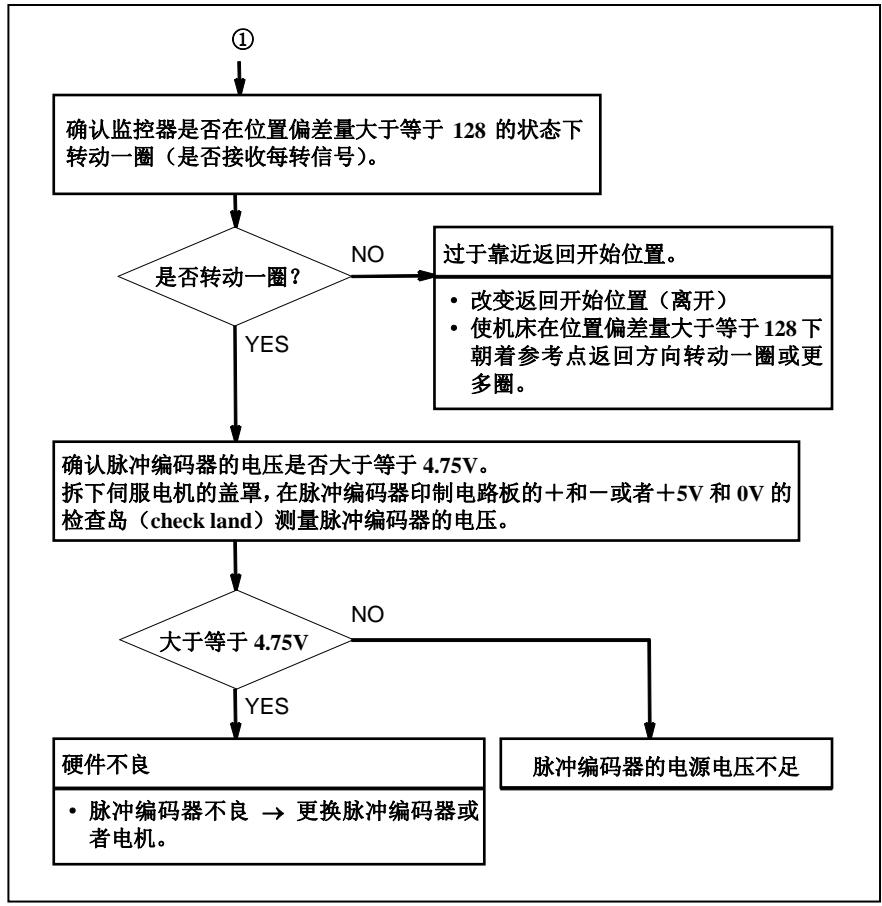

<details>
<summary>flowchart</summary>

```mermaid
graph TD
  A["①"] --> B["确认监控器是否在位置偏差量大于等于128的状态下转动一圈（是否接收每转信号）"]
  B --> C{是否转动一圈?}
  C -->|NO| D["过于靠近返回开始位置。"]
  C -->|YES| E["确认脉冲编码器的电压是否大于等于4.75V。拆下伺服电机的盖罩，在脉冲编码器印制电路板的+和-或者+5V和0V的检查岛（check land）测量脉冲编码器的电压。"]
  E --> F{大于等于4.75V}
  F -->|NO| G["硬件不良"]
  F -->|YES| H["脉冲编码器的电源电压不足"]
  D --> I["改变返回开始位置（离开）"]
  D --> J["使机床在位置偏差量大于等于128下朝着参考点返回方向转动一圈或更多圈。"]
```
</details>


## 注意

(1) 更换脉冲编码器或电机后，参考点或机床的标准位置与更换前不同，请进行正确的调整设定。

## 参考

位置偏差量需要 128 个或更多个脉冲的速度，是因为达不到这个速度时，电机的每转信号有误差，可能无法进行正确的位置检测。

参数(No.2000#0)=1 时，位置偏差量需要 1280 个或更多个脉冲的速度。

此外，参数(No.1836)，作为可被视为进行参考点返回的位置偏差量，可设定为128以下的数值。（设定值为0时视其为128。参数(No.2000#0)=1时，按设定值的10倍的数值进行检查。）

## 10.13 报警DS0300（参考点返回请求）

串行脉冲发生器内的机床的绝对位置数据被弄丢。

〔更换串行脉冲发生器时，或者拆卸串行脉冲发生器的位置返回信号线时发生。〕

## 处理办法

需要通过下列方法重新存储机床的位置。

## - 有参考点返回功能时

1 只有发生了报警的轴才执行手动参考点返回操作。

在发生了其他报警并可执行手动参考点返回操作的情况下，在暂时改变为参数 APCx(No.1815#5)=0 之后，解除其他报警，而后执行手动参考点返回操作。

2 在参考点返回操作结束后，按下 RESET 键解除报警。

## - 没有参考点返回功能时

进行无挡块参考点设定，并存储参考点。

## - 改变串行脉冲发生器时

参考点的停止位置与以前的位置不同，请改变栅格位移值（参数(No.1850)）并正确调整停止位置。

相关参数


### PMC报警: 
- **故障内容**: #7
- **处理办法**: #6

### PMC报警: 1815
- **故障内容**: 
- **处理办法**: 


#4 APZx 作为位置检测器使用绝对位置检测器时，机械位置与绝对位置检测器之间的位置对应关系

0: 尚未建立。

1: 已经建立。

使用绝对位置检测器时，在进行第 1 次调节时或更换绝对位置检测器时，务须将其设定为 “0”，再次通电后，通过执行手动返回参考点等操作进行绝对位置检测器的原点设定。由此，完成机械位置与绝对位置检测器之间的位置对应，此参数即被自动设定为 “1”。

#5 APCx 位置检测器为

0: 绝对位置检测器以外的检测器。

1: 绝对位置检测器（绝对脉冲编码器）。

## 10.14 报警SV0401（伺服准备就绪信号断开）

## 原因与处理办法

伺服放大器伺服准备就绪信号(VRDY)尚未被置于 ON 时，或在运行过程中被置于 OFF 时发生此报警。

也可能因发生了其他伺服报警，而二次性发生此报警，此时，应对首先发生的报警进行处理。

请确认放大器周围的强电回路。此外，也有可能是由于伺服放大器、主板（基本单元 A）、CNC 一侧的伺服卡（基本单元 G）不良所致。

## - 关于 VRDY

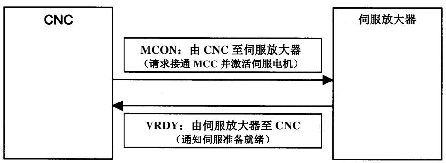

<details>
<summary>flowchart</summary>

```mermaid
graph LR
  A["CNC"] --> B["MCON: 由 CNC 至伺服放大器\n(请求接通 MCC 并激活伺服电机)"]
  A --> C["VRDY: 由伺服放大器至 CNC\n(通知伺服准备就绪)"]
  B --> D["伺服放大器"]
  C --> D
```
</details>

这些信息的传递均通过 FSSB(光缆)进行。

## - 放大器周边的连接例（模式图）

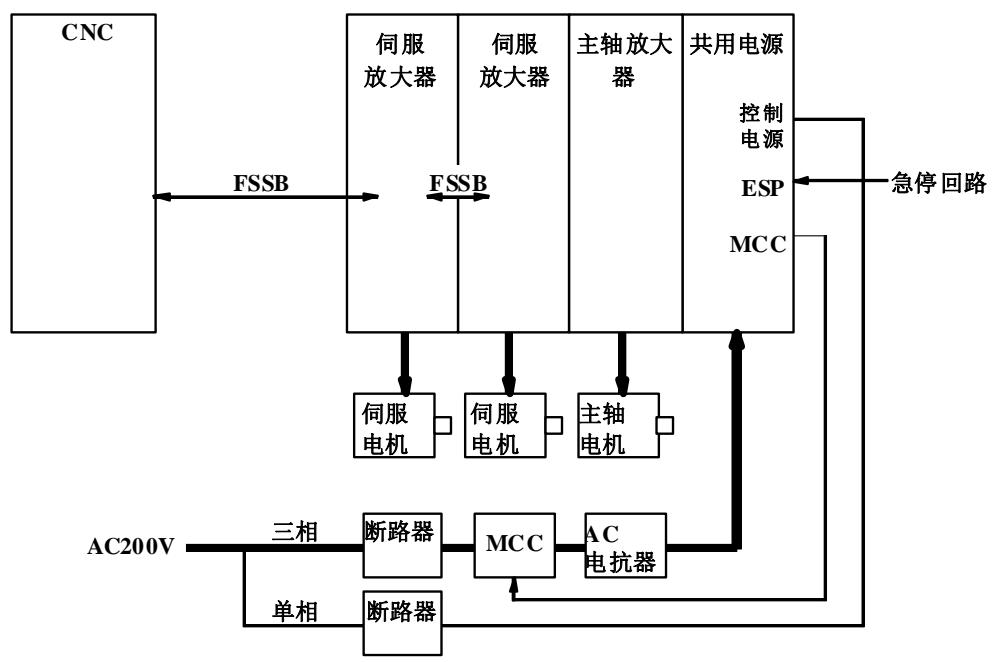

<details>
<summary>flowchart</summary>

```mermaid
graph TD
  A["CNC"] -->|FSSB| B["伺服放大器"]
  B -->|FSSB| C["伺服放大器"]
  C --> D["主轴放大器"]
  D --> E["共用电源"]
  E --> F["控制电源"]
  E --> G["ESP"]
  E --> H["MCC"]
  I["伺服电机"] --> J["伺服电机"]
  K["主轴电机"] --> L["主轴电机"]
  M["AC200V"] --> N["三相"]
  M --> O["断路器"]
  P["单相"] --> Q["断路器"]
  R["AC电抗器"] --> S["MCC"]
  T["急停回路"] --> U["控制电源"]
  V["断路器"] --> W["三相"]
```
</details>

## 确认要点

- 共用电源的控制电源是否接通？  
- 急停是否已被解除？  
- MCC 是否已经接通？除共用电源的 MCC 接点外，外部也组装有 MCC 程序时，也要进行相应的确认。  
- 是否提供了用于驱动 MCC 的电源？  
- 断路器是否已经接通？  
- 共用电源及主轴放大器是否发生了某种报警？确认诊断数据 No.358（VRDY-OFF 信息）（详情请参阅“诊断功能”项）

## - 更换伺服放大器

如放大器周围的强电回路没有什么不良时，应更换伺服放大器。

## - 更换主板、伺服卡

如进行上述处理后仍无法恢复，请更换主板(基本单元 A)、伺服卡（基本单元 G）。

## 10.15 报警SV0404（伺服准备就绪信号接通）

## 原因与处理办法

伺服放大器的伺服准备就绪信号(VRDY)一直为 ON 时发生此报警。

可能是由于伺服放大器、主板、CNC一侧的伺服卡不良所致。

## - 关于 VRDY

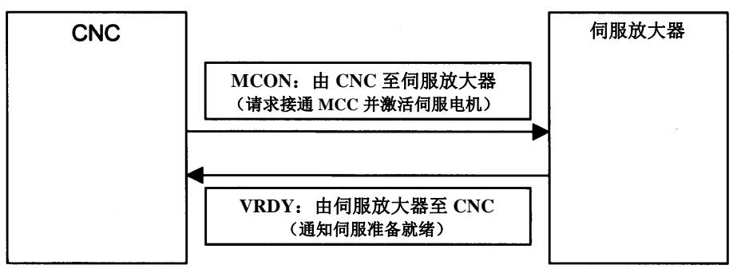

<details>
<summary>flowchart</summary>

```mermaid
graph LR
  A["CNC"] -->|MCON: 由 CNC 至伺服放大器 请求接通 MCC 并激活伺服电机| B["伺服放大器"]
  A -->|VRDY: 由伺服放大器至 CNC 通知伺服准备就绪| B
```
</details>

这些信息的传递均通过 FSSB(光缆)进行。

CNC 将 MCON 置于 OFF 时，若 VRDY 仍保持 ON，或 CNC 将 MCON 置于 ON 前，VRDY 处在 ON 的情况下，会发生此报警。

## - 更换伺服放大器

可能是由于伺服放大器不良。请更换伺服放大器。

## - 更换主板、伺服卡

即使更换伺服放大器也无法恢复时，请更换主板（基本单元 A）、伺服卡（基本单元 G）。

## 10.16 报警SV0462（CNC数据传输失败）

## 报警SV0463（从属数据传输失败）

## 原因与处理办法

由于 FSSB 通信错误，从动装置一侧(伺服放大器一侧)无法正确接收数据时，发生报警(SV0462)。

由于 FSSB 通信错误，CNC 一侧无法正确接收数据时，发生报警(SV0463)。

发生这些报警时，报警信息中显示出现故障的轴号(轴名称)。

## - 伺服放大器或光缆

可能是由于报警信息中所显示轴号的放大器与 CNC 控制部分之间的某根光缆不良。

也可能是由于显示出其轴号的放大器前的某个放大器不良。

## - 主板、伺服卡

可能是由于主板（基本单元 A）、安装在 CNC 一侧的伺服卡（基本单元 G）不良所致。

## 10.17 报警SV0417（数字伺服系统异常）

用于数字伺服的参数设定值异常

\- 数字伺服相关参数的设定值有误。请在确认诊断数据 No.203#4, No.280, No.352 后，就相应的伺服参数变更设定（详情请参阅“诊断功能”项）

## 原因

① 确认诊断数据 No.203#4，调查报警检测部位。

诊断数据 No.203#4=0 的情形：CNC 检测出的参数非法。详情确认诊断数据 No.280。

诊断数据 No.203#4=1 的情形：伺服检测出的参数非法。详情确认诊断数据 No.352。

② CNC 检测出的参数非法时，确认诊断数据 No.280、以及如下的参数设定值。

参数 No. 2020 : 电机型号

参数 No. 2022 : 电机旋转方向

参数 No. 2023 : 速度反馈脉冲数

参数 No. 2024 : 位置反馈脉冲数

参数 No. 1023 : 伺服轴号

参数 No. 2084 ：柔性进给齿轮的比率

参数 No. 2085 : 柔性进给齿轮的比率

参数 No.2211#6 : 使用 2 绕组电机

参数 No.2211#7：使用 4 绕组电机

③ 伺服检测出的参数非法时，请通过诊断数据 No.352 确认要因后，对相应的伺服参数进行修正。有关诊断数据 No.352 的值以及应对方法，请参阅伺服装置的参数说明书。

## 10.18 报警OH0700（过热：控制单元）

## 原因与处理办法

CNC 控制单元的环境温度过高时发生此报警。CNC 的环境温度应低于设置条件即下列温度。

显示器一体型 $58^{\circ}$ C

## - 环境温度

主板上安装有温度监控回路，当环境温度过高时，就会发生此报警。

请对装有 CNC 控制单元的控制柜采取相应措施，以使其达到正常的温度范围（显示器一体型：0～58℃）。

环境温度显然没有异常时，可能是由于主板不良。

## 10.19 报警OH0701（过热：风扇电机）

## 原因与处理办法

风扇电机出现异常，如 CNC 运行过程中风扇电机停转等时，发生此报警。

## - 风扇电机

风扇电机设定在 CNC 控制单元的顶部。CNC 上附设有此风扇电机的转速检测回路，在发生停转等异常情况时，会发生此报警。

发生此报警时，请参照“更换风扇电机”项，更换风扇电机或风扇单元。

## 10.20 报警SV5134（FSSB：开机超时）

报警SV5137（FSSB：配置错误）

报警SV5197（FSSB：开机超时）

## 原因与处理办法

由于连接到 FSSB 的伺服放大器等的从动装置及光缆、伺服卡不良而发生此项报警。此外，FSSB 相关参数的设定值有误时会发生报警。请确认诊断数据 No.3510, No.3511, No.3513 后，就相应的参数变更设定。（详情请参阅“诊断功能”项。）


### PMC报警: 编号
- **故障内容**: 信息
- **处理办法**: 内容

### PMC报警: 5134
- **故障内容**: FSSB: 开机超时
- **处理办法**: 初始化时并没有使 FSSB 处于打开待用状态。可能是由于伺服卡不良。

### PMC报警: 5137
- **故障内容**: FSSB: 配置错误
- **处理办法**: 发生了 FSSB 配置错误。/所连接的放大器类型与 FSSB 设定值存在差异。

### PMC报警: 5197
- **故障内容**: FSSB: 开机超时
- **处理办法**: 虽然 FSSB 初始化已经结束但尚未打开。/CNC 与放大器的连接不正确。


## - 确认参数设定

确认与 FSSB 相关的参数设定是否正确。

## - 伺服放大器的电源

确认连接于 FSSB 的伺服放大器的电源。

## - 更换主板、伺服卡、光缆、伺服放大器

更换主板（基本单元 A）、CNC 一侧的伺服卡（基本单元 G）。

依次更换连接于 FSSB 的光缆及伺服放大器，确定不良部位。

## 10.21 报警SV5136（FSSB：放大器数不足）

## 原因与处理办法

相对于控制轴的数量，FSSB 上识别出的伺服放大器数量不够。

## - FSSB 设定画面

请在发生报警的状态下，显示 FSSB 设定画面的放大器设定画面。这里只显示出 FSSB 上识别的伺服放大器。

## - 光缆或伺服放大器

可能是由于所识别的最后一个放大器与后面的放大器之间的连接光缆不良。

也可能是由于该光缆连接的两端的某个放大器不良。另外，请确认该放大器的电源。

## - 伺服放大器的电源异常

如果伺服放大器内的电源发生异常，也会发生此报警。除放大器控制电源电压降低外，例如，脉冲编码器电缆的+5V接触器接地，就会出现电源异常。

## - 主板、伺服卡

可能是由于主板（基本单元 A）、安装在 CNC 一侧的伺服卡（基本单元 G）不良所致。

## 10.22 伺服报警

有关伺服报警，在附录 A 中登载其列表。此外，关于伺服放大器、伺服电机要因而引起的报警，请参阅 FANUC AC SERVO MOTOR αi series, AC SPINDLE MOTOR αi series, SERVO AMPLIFIER αi series 维修说明书(B-65285CM)。

检查的结果，如果是由于 CNC 一侧硬件不良造成的，更换主板（基本单元 A）、伺服卡（基本单元 G）。

## 10.23 主轴报警

有关下列主轴报警，请参阅 FANUC AC SERVO MOTOR $\alpha i$ series, AC SPINDLE MOTOR $\alpha i$ series, SERVO AMPLIFIER $\alpha i$ series 维修说明书（B-65285CM）。


## 10.24 系统报警

## 10.24.1 概述

载检测出不能维持系统正常动作的状态时，转移到称作系统报警状态的特殊的处理状态。进入系统报警状态时，在切换 CNC 的画面的同时，执行下列操作。

- 断开伺服、主轴放大器的励磁  
- 切断 I/O Link $i$ 的通信

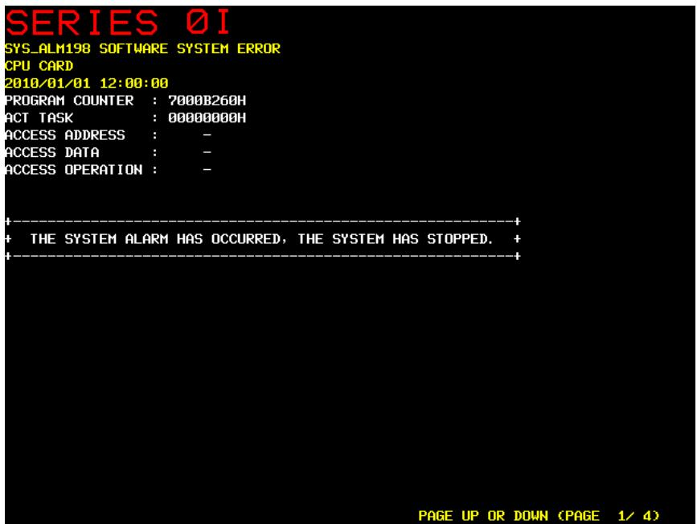

<details>
<summary>text_image</summary>

SERIES 01
SYS_ALM198 SOFTWARE SYSTEM ERROR
CPU CARD
2010/01/01 12:00:00
PROGRAM COUNTER : 7000B260H
ACT TASK : 00000000H
ACCESS ADDRESS : -
ACCESS DATA : -
ACCESS OPERATION : -
+----+
+ THE SYSTEM ALARM HAS OCCURRED, THE SYSTEM HAS STOPPED. +
+----+
</details>

图10.24.1 (a) 系统报警的画面例

## 系统报警的种类

系统报警可分为下列 3 种。

- 由软件检测的报警  
- 由硬件检测的报警  
- 其他报警

## 软件检测

主要由 CNC 系统软件来检测软件的异常。

典型的异常原因为:

- 检测基于内部状态监视软件的处理 / 数据的矛盾  
- 数据 / 命令范围外的存取  
- 除以零  
- 堆栈上溢  
- 堆栈下溢  
- DRAM 和数校验错误

## 硬件检测

主要由硬件来检测硬件的异常。

典型的异常原因为:

- 奇偶校验错误（DRAM、SRAM、超高速缓存）  
- 总线错误  
- 电源报警  
- FSSB 电缆断线

## 其他

其他原因为:

\- 由周边软件检测的报警

伺服软件（看门狗等）

PMC 软件（I/O Link 通信异常等）

## 10.24.2 在系统报警画面上的操作

## 系统报警画面的说明

发生系统报警时，切换到图 10.24.2 (a) 所示的画面。

该画面叫做系统报警画面。

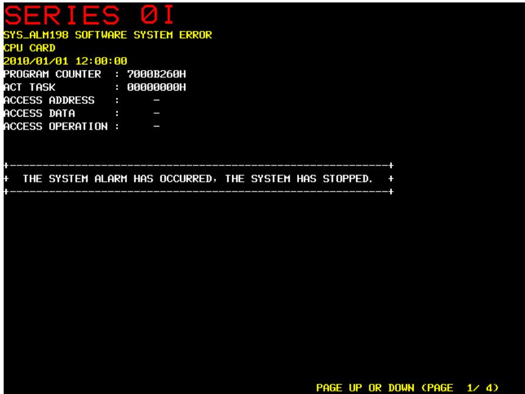

<details>
<summary>text_image</summary>

SERIES 01
SYS_ALM198 SOFTWARE SYSTEM ERROR
CPU CARD
2010/01/01 12:00:00
PROGRAM COUNTER : 7000B260H
ACT TASK : 00000000H
ACCESS ADDRESS : -
ACCESS DATA : -
ACCESS OPERATION : -
+----+
+ THE SYSTEM ALARM HAS OCCURRED, THE SYSTEM HAS STOPPED. +
+----+
PAGE UP OR DOWN (PAGE 1/4)
</details>

图10.24.2 (a) 系统报警画面

系统报警画面由多页信息构成。

按键操作如下所示。


页面的切换


执行 IPL 监控

## 保存系统报警信息

发生系统报警时的各类信息，被保存在 SRAM 中。

SRAM 中可以保存最近发生的 2 次系统报警信息。

在保持 2 次信息的状态下发生第 3 次系统报警时，放弃最早发生的系统报警信息，而将新的报警信息保存起来。

所保存的系统报警信息可以从 IPL 画面输出到存储卡中。

## 输出系统报警信息

系统报警信息，可以从系统警告履历画面或者 IPL 画面将所保存的系统报警信息输出到存储卡中。通过系统警告履历画面进行输出的方法，请参阅本说明书 “1.13 系统警告履历画面”。通过 IPL 画面进行输出的方法如下所示。

1. 启动 IPL 监控器。

在发生系统报警时显示出系统报警画面的情况下，按下 RESET 键。

暂时断开电源时，一边按“—”和“．”一边通电。

2. 在 IPL 监控器画面上输入 5，选择 “5. SYSTEM ALARM UTILITY”（系统报警公用程序）。

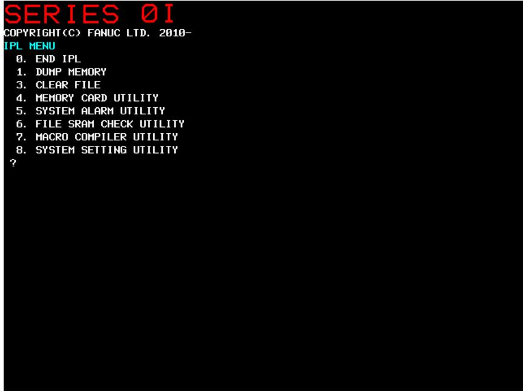

<details>
<summary>text_image</summary>

SERIES 0I
COPYRIGHT(C) FANUC LTD. 2010-
IPL MENU
0. END IPL
1. DUMP MEMORY
3. CLEAR FILE
4. MEMORY CARD UTILITY
5. SYSTEM ALARM UTILITY
6. FILE SRAM CHECK UTILITY
7. MACRO COMPILER UTILITY
8. SYSTEM SETTING UTILITY
?
</details>

3. 输入 2，选择 “2. OUTPUT SYSTEM ALARM FILE”（输入系统报警文件）。

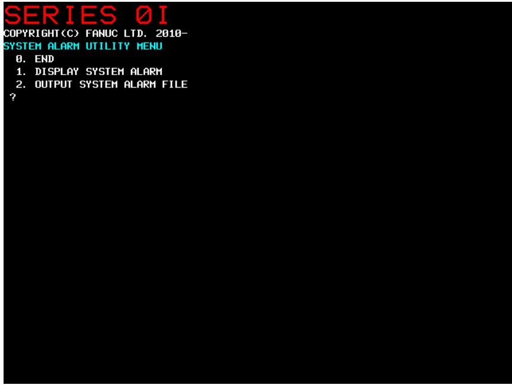

<details>
<summary>text_image</summary>

SERIES 0I
COPYRIGHT(C) FANUC LTD. 2010-
SYSTEM ALARM UTILITY MENU
0. END
1. DISPLAY SYSTEM ALARM
2. OUTPUT SYSTEM ALARM FILE
?
</details>

4. 从系统报警画面执行 IPL 监控器时，输入 2，选择 “2. OUTPUT SYSTEM ALARM FILE FROM DRAM”（从 DRAM 输出系统报警）。暂时断开电源，输入 1，选择 “1. OUTPUT SYSTEM ALARM FILE FROM FILE-RAM”（从文件 RAM 输出系统报警）。

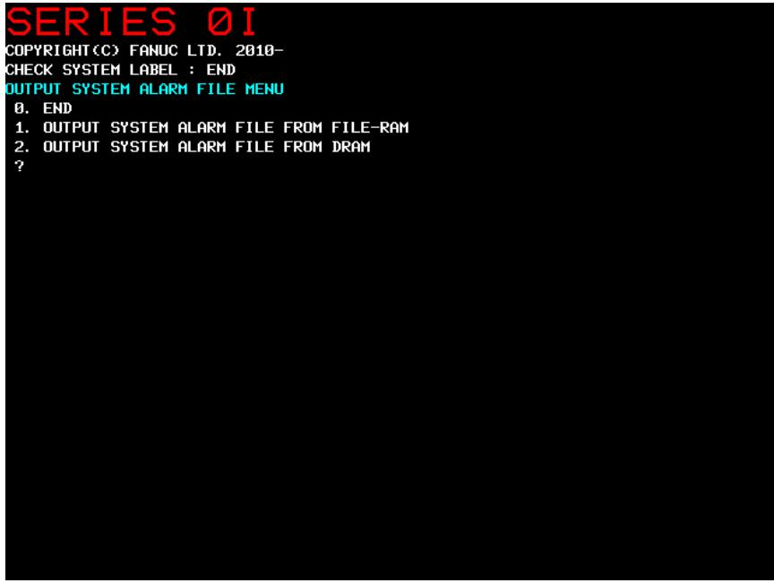

<details>
<summary>text_image</summary>

SERIES 01
COPYRIGHT(C) FANUC LTD. 2010-
CHECK SYSTEM LABEL : END
OUTPUT SYSTEM ALARM FILE MENU
0. END
1. OUTPUT SYSTEM ALARM FILE FROM FILE-RAM
2. OUTPUT SYSTEM ALARM FILE FROM DRAM
?
</details>

5. 在 4. 中选择 1 时，显示出所保存的系统报警的列表，输入希望输出的文件号。

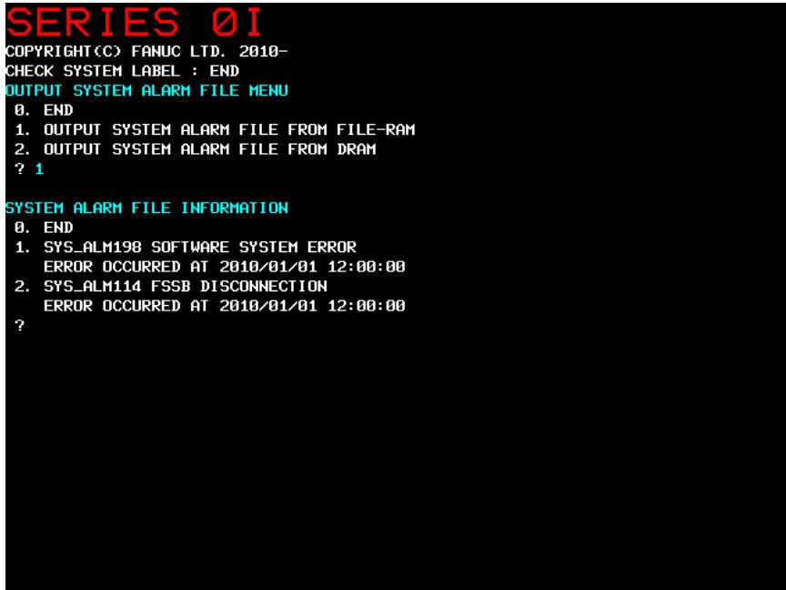

<details>
<summary>text_image</summary>

SERIES 01
COPYRIGHT(C) FANUC LTD. 2010-
CHECK SYSTEM LABEL : END
OUTPUT SYSTEM ALARM FILE MENU
0. END
1. OUTPUT SYSTEM ALARM FILE FROM FILE-RAM
2. OUTPUT SYSTEM ALARM FILE FROM DRAM
? 1
SYSTEM ALARM FILE INFORMATION
0. END
1. SYS_ALM198 SOFTWARE SYSTEM ERROR
ERROR OCCURRED AT 2010/01/01 12:00:00
2. SYS_ALM114 FSSB DISCONNECTION
ERROR OCCURRED AT 2010/01/01 12:00:00
?
</details>

6. 输入文件名，执行输出。

## SERIES 0I

COPYRIGHT(C) FANUC LTD. 2010-CHECK SYSTEM LABEL : END

OUTPUT SYSTEM ALARM FILE MENU

0. END  
1. OUTPUT SYSTEM ALARM FILE FROM FILE-RAM  
2. OUTPUT SYSTEM ALARM FILE FROM DRAM  
? 1

SYSTEM ALARM FILE INFORMATION

0. END

1. SYS\_ALM198 SOFTWARE SYSTEM ERROR
ERROR OCCURRED AT 2010/01/01 12:00:00

2. SYS\_ALM114 FSSB DISCONNECTION
ERROR OCCURRED AT 2010/01/01 12:00:00

? 1

MEM\_CARD FILE NAME ? SYS\_ALM1.TXT

## 注释

1 输出到存储卡的文件名，请以文件名主体（8个字符）.扩展名（3个字符）的形式使用。文件名和扩展名的开头字符，请使用英文字母或数字。  
2 输出到存储卡的文件名中使用如下字符时，利用个人电脑读取数据时，会遇到故障。请勿使用这些字符。句点只有在文件名和扩展名的区隔中可以使用。

."/ [ ] :;=,\*?<>+(间隔字符)

3 输出到存储卡的文件名中使用如下名称时，利用个人电脑读取数据时，会遇到故障。请勿使用这些文件名。

CON, AUX, COM1, COM2, COM3, COM4, LPT1, LPT2, LPT3, PRN, NUL

## 10.24.3 硬件检测的系统报警

硬件检测出错误时的系统报警画面的构成基本上如下图所示。

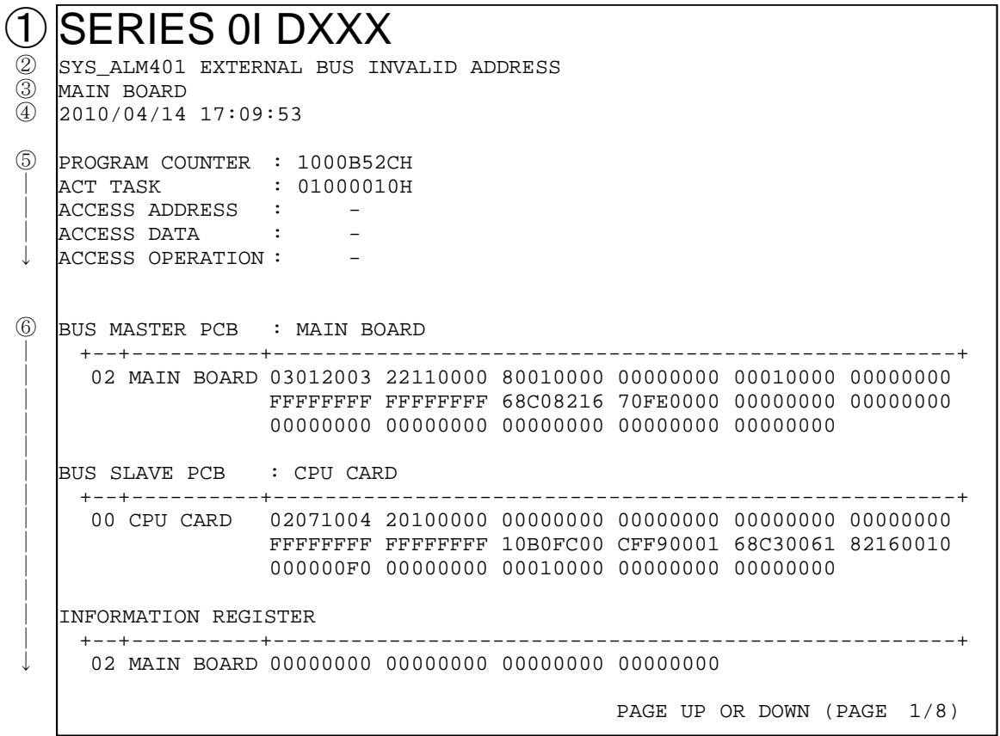

<details>
<summary>text_image</summary>

SERIES 01 DXXX
2 SYS_ALM401 EXTERNAL BUS INVALID ADDRESS
3 MAIN BOARD
4 2010/04/14 17:09:53
5 
6 BUS MASTER PCB : MAIN BOARD
+----+----+
02 MAIN BOARD 03012003 22110000 80010000 00000000 00010000 00000000
FFFFFFFF FFFFFFFF 68C08216 70FE0000 00000000 00000000
00000000 00000000 00000000 00000000 00000000
BUS SLAVE PCB : CPU CARD
+----+----+
00 CPU CARD 02071004 20100000 00000000 00000000 00000000 0000000
FFFFFFFF FFFFFFFF 10B0FCO0 CFF90001 68C30061 82160010
00000F0 00000F1 1B1D1D1D1D1D1D1D1D1D1D1D1D1D1D1D1D1D1D1D1D1D1D1D1D1D1D1D1D1D1D1D1D1D1D1D1D1D1D1D1D1D1D1D1D1D1D1D1D1D1D1
INFORMATION REGISTER
+----+----+
2 MAIN BOARD 0000F1F 2222222222222222222222222222222222222222222222222222222222
PAGE UP OR DOWN (PAGE 1/8)
</details>

[信息画面的说明]

①：装置名称、CNC 系统软件的系列、版本  
②：系统报警号、错误信息  
③: 可能性最大的不良部位  
④：错误发生时刻  
⑤：错误发生时的软件错误信息等  
⑥：错误发生时的总线信息

## 注释

③中显示出可能性最大的不良部位。以该部位为中心检查是否存在不良。有关③中显示的部位的更换外有可需要要进行处理的报警信息，请参阅表10.24.3(a)。

系统报警的画面信息，由显示器的 PCMCIA 端口，可作为文本文件输出。请在获取信息的基础上与我公司的服务部门联系。有关输出方法，请参阅 “在系统报警画面上的操作” 项。

表 10.24.3 (a)


### PMC报警: 信息
- **故障内容**: 内容
- **处理办法**: 原因

### PMC报警: SYS_ALM401 EXTERNAL BUS INVALID ADDRESS
- **故障内容**: CNC 的总线上发生了问题。
- **处理办法**: 可能是由于印刷板的不良或外来噪声的影响所致。

### PMC报警: SYS_ALM403 S-BUS TIME OUT ERROR
- **故障内容**: CNC 的总线上发生了问题。
- **处理办法**: 可能是由于印刷板的不良所致。

### PMC报警: SYS_ALM404ECCUNCORRECTABLEERROR
- **故障内容**: CNC的总线上发生了问题。
- **处理办法**: 可能是由于印刷板的不良或外来噪声的影响所致。

### PMC报警: SYS_ALM502NOISE ON POWERSUPPLY
- **故障内容**: 表示CNC的电源中发生了噪声或瞬断。
- **处理办法**: 这是电源系统的异常。


## 10.24.4 系统报警 114\~160 (FSSB的报警)

## 原因

FSSB 上检测出报警。

## 注释

报警信息中显示故障部位。表示部位的信息中的单词的含义如下所示。

MAIN：CNC 内的伺服卡

AMPx：表示从各线路的 CNC 数起第 x 台伺服放大器或者主轴放大器。

2 轴放大器、3 轴放大器也作为 1 台计数。

SDUx：从各线路的CNC数起第 $\mathbf{x}$ 台位置检测器接口单元

LINEx：发生了报警的FSSB线路。

信息后面显示有/LINEx的情况下，表示主板（基本单元A）以及伺服卡（基本单元G）上的光连接器的编号。

LINE1：主板上的COP10A以及伺服卡上的COP10A-1


## 10.25 与PMC、I/O Link相关的系统报警

显示如下所示的系统报警(SYS\_ALM194,195,196,197)和报警号码(PCxxx)时，属于 PMC、I/O Link i、I/O Link 相关的系统报警。原因可能是 PMC 控制电路部的故障、I/O Link 通信异常等。

## SERIES 0I DXXX

SYS\_ALM197 EMBEDDED SOFTWARE SYSTEM ERROR
PLEASE CHECK THE FOLLOWING INFORMATION:
2010/04/18 12:00:00
EMBEDDED SOFTWARE SYSTEM ERROR:(40xx-xxxx)
PC097 LADDER CRC ERROR (DCSPMC)

----<ERROR POSITION>----

CPU CARD

PAGE UP OR DOWN (PAGE 1 / 5)

## 系统报警 197, 199(PMC一般)

系 PMC 相关的系统报警。有关报警的内容，请参阅 “附录 A.2.2 PMC 系统报警信息”。

## 显示例

## SERIES 0I DXXX

SYS\_ALM197 EMBEDDED SOFTWARE SYSTEM ERROR

PLEASE CHECK THE FOLLOWING INFORMATION:

2010/04/18 12:00:00

EMBEDDED SOFTWARE SYSTEM ERROR:(40xx-xxxx)

PC097 LADDER CRC ERROR (DCSPMC)

----<ERROR POSITION>----

CPU CARD

PAGE UP OR DOWN (PAGE 1 / 5)

系统报警 197 的情形

## SERIES 0I DXXX

SYS\_ALM199 NON MASK INTERRUPT

OTHER-CPU

2010/04/18 12:00:00

PROGRAM COUNTER : \_\_\_\_

ACT TASK : \_\_\_\_

ACCESS ADDRESS : \_\_\_\_ - \_\_\_\_

ACCESS DATA : \_\_\_\_ - \_\_\_\_

ACCESS OPERATION: \_\_\_\_ - \_\_\_\_

+----+

\+ THE SYSTEM ALARM HAS OCCURRED, THE SYSTEM HAS STOPPED. +

PAGE UP OR DOWN (PAGE 1 / 5)

## 系统报警 199 的情形（第 1 页）

## SERIES 0I DXXX

SYS\_ALM199 NON MASK INTERRUPT

OTHER-CPU

2010/04/18 12:00:00

OPTION BOARD SYSTEM ERROR:(40xx-xxxx)

PC098 PMC SOFTWARE ECC ERROR (xxxxxxxx:xx)

----<ERROR POSITION>----

MAIN BOARD

00000000 00000000 00000000 00000000 00000000 00000000 00000000 00000000 00000000

00000000 00000000 00000000 00000000 00000000

00000000 00000000 00000000 00000000 00000000 00000000 00000000 00000000 00000000

00000000 00000000 00000000 00000000 00000000 00000000 00000000 00000000

00000000 00000000 00000000 00000000 00000000 00000000 00000000 00000000

00000000 00000000 00000000 00000000 00000000 00000000 00000000 00000000 00000000

00000000 00000000 00000000 00000000 00000000 00000000 00000000 00000000 00000000

00000000 00000000 00000000 00000000 00000000 00000000 00000000 00000000

00000000 00000000 00000000 00000000 00000000 00000000 00000000 00000000 00000000

00000000 00000000 00000000 00000000 00000000 00000000 00000000 00000000 00000000

00000000 00000000 00000000 00000000 00000000 00000000 00000000 00000000 00000000

00000000 00000000 00000000 00000000 00000000 00000000 00000000 00000000

PAGE UP OR DOWN (PAGE 2 / 5)

## 系统报警 199 的情形（第 2 页）

## 系统报警 196(PMC监控)

系 PMC 监控的系统报警。有关报警的内容，请参阅 “附录 A.2.2 PMC 系统报警信息”。

## 显示例

## SERIES 0I DXXX

SYS\_ALM196 PMC WATCH DOG ALARM

MAIN BOARD

2010/04/18 12:00:00

EMBEDDED SOFTWARE SYSTEM ERROR:(40xx-xxxx)

PC073 WATCH-DOG ALARM(CNC<->PMC)

----<ERROR POSITION>----

MAIN BOARD

PAGE UP OR DOWN (PAGE 1 / 5)

## 系统报警 195(I/O Link相关)

系 I/O Link 相关的系统报警。有关报警的内容，请参阅 “附录 A.2.2 PMC 系统报警信息”。

## 显示例

## SERIES 0I DXXX

SYS\_ALM195 IO LINK ALARM

IO LINK

2008/11/18 12:00:00

EMBEDDED SOFTWARE SYSTEM ERROR(40XX-XXXX)

PC050 I/O LINK ER1 CH1:GR03:xx

COMMUNICATION ALARM AT CH1 : GROUP 03

----<ERROR POSITION>----

CH1 / GROUP03

RT=0,0,0,0,0,0,0,0,0,0,0,0,0,0,0

G00=00,00,00,00 G01=00,00,00,00

G02=00,00,00,00 G03=3C,3C,3C,00

G04=00,00,00,00 G05=00,00,00,00

G06=00,00,00,00 G07=00,00,00,00

G08=00,00,00,00 G09=00,00,00,00

G10=00,00,00,00 G11=00,00,00,00

G12=00,00,00,00 G13=00,00,00,00

G14=00,00,00,00 G15=00,00,00,00

PAGE UP OR DOWN (PAGE 1 / 5)

## 系统报警 194(I/O Link i 相关)

系 I/O Link i 相关的系统报警。有关报警的内容，请参阅 “附录 A.2.2 PMC 系统报警信息”。

## 显示例

## SERIES 0I DXXX

SYS\_ALM194 IO LINK I ALARM

IO LINK I

2008/11/18 12:00:00

EMBEDDED SOFTWARE SYSTEM ERROR(40XX-XXXX)

PC052 I/O LINK I

PMC LSI RAM PARITY ERROR

----<ERROR POSITION>----

MAIN BORAD

MA=03,FF,00,00,00,80 ME=00,00 GE=10,00 TOC=02 TTOC=05

$\mathrm{RT} = 0,0,0,0,0,0,0,0,0,0,0,0,0,0,0,0,0,0,0,0,0,0,0,0$

PAGE UP OR DOWN (PAGE 1 / 5)

## 主控装置硬件不良的情形

## SERIES 0I DXXX

SYS\_ALM194 IO LINK I ALARM

IO LINK I

2008/11/18 12:00:00

EMBEDDED SOFTWARE SYSTEM ERROR(40XX-XXXX)

PC053 I/O LINK I

SLAVE LSI RAM PARITY ERROR

----<ERROR POSITION>----

CH1 / UNIT3(GROUP2) : I/O UNIT-A

MA=03,FF,00,00,00,80 ME=00,00 GE=10,00 TOC=02 TTOC=05

$\mathrm{RT} = 0,0,3,0,0,0,0,0,0,0,0,0,0,0,0,0,0,0,0,0,0,0,0,0$

G02 RC=03 RT=05 H=00001000,00001000,00001000,00000000

PAGE UP OR DOWN (PAGE 1 / 5)

## 通道 1 的第 3 个单元(组 2)硬件不良的情形

SERIES 0I DXXX  
```txt
SYS_ALM194 IO LINK I ALARM
IO LINK I
2008/11/18 12:00:00

EMBEDDED SOFTWARE SYSTEM ERROR(40XX-XXXX)
PC058 I/O LINK I
SLAVE LSI EXTERNAL ALARM

----<ERROR POSITION>----
CH1 / UNIT3(GROUP2) : I/O UNIT-A

----

MA=03,FF,00,00,00,80 ME=00,00 GE=10,00 TOC=02 TTOC=05
RT=0,0,3,3,0,0,0,0,0,0,0,0,0,0,0,0,0,0,0,0,0,0,0,0,0,0,0,0,0,0,0,0,0,0,0,0,0,0,0,0,0,0,0,0,0,0,0,0,0,0,0,0,0,0,
```

PAGE UP OR DOWN (PAGE 1 / 5)

通道 1 的第 3 个安全 I/O 单元(组 2,3)内发生连接不良的情形  
SERIES 0I DXXX  
```txt
SYS_ALM194 IO LINK I ALARM
IO LINK I
2008/11/18 12:00:00

EMBEDDED SOFTWARE SYSTEM ERROR(40XX-XXXX)
PC054 I/O LINK I
ABNORMAL POWER SUPPLY

----<ERROR POSITION>----
CH1 / UNIT3(GROUP2) : I/O UNIT-A

----

MA=03,FF,00,00,00,80 ME=00,00 GE=10,00 TOC=02 TTOC=05
RT=0,0,3,0,0,0,0,0,0,0,0,0,0,0,0,0,0,0,0,0,0,0,0,0,0,0,0,0,0,0,0,0,0,0,0,0,0,0,0,0,0,0,0,0,0,0,0,0,0,0,0,0,0,
```

PAGE UP OR DOWN (PAGE 1 / 5)

通道 1 的第 3 个单元(组 2)中发生了电源断开报警的情形

SERIES 0I DXXX  
```txt
SYS_ALM194 IO LINK I ALARM
IO LINK I
2008/11/18 12:00:00

EMBEDDED SOFTWARE SYSTEM ERROR(40XX-XXXX)
PC055 I/O LINK I
I/O LINK I SENDING DATA FAILURE

----<ERROR POSITION >----
CH1 / UNIT2(GROUP1) <-> UNIT3(GROUP2)
UNIT2 : I/O UNIT-A
UNIT3 : ID=0xA5

----
MA=03,FF,00,00,00,80 ME=00,00 GE=10,00 TOC=02 TTOC=05
RT=3,3,3,3,0,0,0,0,0,0,0,0,0,0,0,0,0,0,0,0,0,0,0,0,0,0,0,0,0,0,0,0,0,0,0,0,0,0,0,0,0,0,0,0,0,0,0,0,0,0,0,0,0,0,5
G00 RC=03 RT=05 H=00001000,00001000,00001000,00000000
G01 RC=04 RT=05 H=00011000,00011000,00011000,00111000
G02 RC=03 RT=05 H=00111000,00111000,00111000,00111111
G03 RC=03 RT=05 H=01111111,11111111
G13 RC=33 RT=33 RT=33 RT=33 RT=33 RT=33 RT=33 RT=33 RT=33 RT=33 RT=33 RT=33 RT=33 RT=33 RT=33 RT=33 RT=33 RT=33 RT=33 RT=33 RT=33 RT=33 RT=33 RT=33 RT=33 RT=33
```

PAGE UP OR DOWN (PAGE 1 / 5)

通道 1 的第 2 个单元(组 1)和第 3 个(组 2)的单元之间发生了通信报警的情形  
SERIES 0I DXXX  
```txt
SYS_ALM194 IO LINK I ALARM
IO LINK I
2008/11/18 12:00:00

EMBEDDED SOFTWARE SYSTEM ERROR(40XX-XXXX)
PC056 I/O LINK I
I/O LINK I DISCONNECTION

----<ERROR POSITION>----
CH1 / UNIT2(GROUP1) <-> UNIT3(GROUP2)
UNIT2 : I/O UNIT-A
UNIT3 : ID=0xA5

----

MA=03,FF,00,00,00,80 ME=00,00 GE=10,00 TOC=02 TTOC=05
RT=3,3,3,3,0,0,0,0,0,0,0,0,0,0,0,0,0,0,0,0,0,0,0,0,0,0,0,0,0,0,0,0,0,0,0,0,0,0,0,0,0,0,0,0,0,0,0,0,0,0,0,0,0,0,5
G00 RC=03 RT=05 H=00001000,00001000,00001000,00001000,00001111
G01 RC=04 RT=05 H=001111111111111111111111111111111111111111111111111111111
G02 RC=03 RT=05 H=00111111111111111111111111111111111111111
G03 RC=03 RT=05 H=0011111111111111111111111111
```  
通道1的第2个单元(组1)和第3个(组2)单元之间的硬件连接不良而发生了报警的情形

PAGE UP OR DOWN (PAGE 1 / 5)

## SERIES 0I DXXX

SYS\_ALM194 IO LINK I ALARM

IO LINK I

2008/11/18 12:00:00

EMBEDDED SOFTWARE SYSTEM ERROR(40XX-XXXX)

PC057 I/O LINK I

SAFETY I/O ALARM

----<ERROR POSITION>----

CH1 / UNIT2(GROUP1) : I/O UNIT-A

MA=03,FF,00,00,00,80 ME=00,00 GE=10,00 TOC=02 TTOC=05

RT=0,3,0,0,0,0,0,0,0,0,0,0,0,0,0,0,0,0,0,0,0,0,0

DA=00,02,00,10 DOC=00,00,00,02 DIC=00,00,00,03

DST=00,00,01,00,03,03

G01 RC=04 RT=05 H=00011000,00011000,00011000,00011000

PAGE UP OR DOWN (PAGE 1 / 5)

通道1的第2个单元(组1)中发生了DCSPMC的报警的情形

## 10.26 I/O Link i 对应单元的LED

## 10.26.1 I/O Link i 对应单元的LED的显示内容

I/O Link i，作为标准规格每个单元安装有 3 种 LED “LINK”（绿色）、“ALM”（红色）、“FUSE（红色）”。根据这些 LED 的状态，可以了解单元的状态。

LED 的点亮状态及其显示内容如下所示。


## LED “LINK” (绿色)

LED “LINK”（绿色），表示单元的通信状态。下面示出 LED 的各状态的显示内容。


### PMC报警: 动作模式
- **故障内容**: LED的状态
- **处理办法**: 显示内容

### PMC报警: 共同
- **故障内容**: 熄灭
- **处理办法**: 电源 OFF

### PMC报警: 点亮
- **故障内容**: 电源 ON(通信开始前状态)
- **处理办法**: 

### PMC报警: 闪烁(高速 1:1)
- **故障内容**: 通信停止状态
- **处理办法**: 因报警而通信停止的状态。请根据下列红色 LED 的状态、或者 CNC 的画面显示特定原因。

### PMC报警: I/O Link i
- **故障内容**: 闪烁(1:1)
- **处理办法**: 通信状态

### PMC报警: 闪烁(3:1)
- **故障内容**: 通信状态(使用双检安全)
- **处理办法**: 


## LED “ALM” (红色)

LED “ALM” (红色)，表示在单元、或者其后段的单元发生的报警。下面示出 LED 的各状态的显示内容。


### PMC报警: 动作模式
- **故障内容**: LED的状态
- **处理办法**: 显示内容

### PMC报警: 共同
- **故障内容**: 熄灭
- **处理办法**: 正常状态 或者 电源 OFF

### PMC报警: I/O Link i
- **故障内容**: 点亮
- **处理办法**: 发生报警

### PMC报警: 闪烁(1:1)
- **故障内容**: 与后段的单元之间发生断线
- **处理办法**: 从本单元的 JD1A,确认是否有连接后段的单元的 JD1B 之间的电缆的不良或者连接不良。此外,有可能发生噪声。确认在周围是否发生噪声。

### PMC报警: 闪烁(3:1)
- **故障内容**: 在后段的单元发生包含瞬断的电源异常
- **处理办法**: 特定后段单元中的电源异常的原因并予以排除。

### PMC报警: 闪烁(1:3)
- **故障内容**: 发生状态报警
- **处理办法**: 发生了 DO 接地故障等状态报警。特定 DO 接地故障等原因并予以排除。


## LED “FUSE” (红色)

LED “FUSE”（红色），表示保险丝异常的有无。下面示出 LED 的各状态的显示内容。


### PMC报警: 动作模式
- **故障内容**: LED的状态
- **处理办法**: 显示内容

### PMC报警: 共同
- **故障内容**: 熄灭
- **处理办法**: 保险丝正常 或者电源OFF

### PMC报警: 点亮
- **故障内容**: 保险丝熔断
- **处理办法**: 更换保险丝。


## 10.26.2 I/O Link i 中的单元LED

下面示出基于 I/O Link i 中各单元的 LED 的显示、和据此推测出的单元的状态。另外，有关各单元 LED 的点亮状态，则用下表来表示。


### PMC报警: ALM
- **故障内容**: LINK
- **处理办法**: FUSE

### PMC报警: ■
- **故障内容**: ■
- **处理办法**: ■


### PMC报警: □
- **故障内容**: 熄灭
- **处理办法**: 

### PMC报警: ■
- **故障内容**: 点亮
- **处理办法**: 

### PMC报警: ☆
- **故障内容**: 闪烁(1:1)
- **处理办法**: 点亮 = 约0.5秒 熄灭 = 约0.5秒

### PMC报警: ★
- **故障内容**: 闪烁(3:1)
- **处理办法**: 点亮 = 约1.5秒 熄灭 = 约0.5秒

### PMC报警: ▲
- **故障内容**: 闪烁(1:3)
- **处理办法**: 点亮 = 约0.5秒 熄灭 = 约1.5秒

### PMC报警: ◎
- **故障内容**: 闪烁(高速1:1)
- **处理办法**: 点亮 = 约0.25秒 熄灭 = 约0.25秒


(1) 各单元的所有 LED 都处在熄灭状态的情形各单元处于通电前的状态。

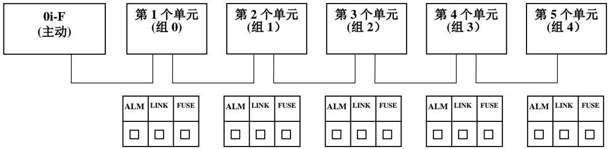

<details>
<summary>flowchart</summary>

```mermaid
graph TD
  A["0i-F (主动)"] --> B["第1个单元 (组0)"]
  A --> C["第2个单元 (组1)"]
  A --> D["第3个单元 (组2)"]
  A --> E["第4个单元 (组3)"]
  A --> F["第5个单元 (组4)"]
  B --> G["ALM"]
  B --> H["LINK"]
  B --> I["FUSE"]
  C --> J["ALM"]
  C --> K["LINK"]
  C --> L["FUSE"]
  D --> M["ALM"]
  D --> N["LINK"]
  D --> O["FUSE"]
  E --> P["ALM"]
  E --> Q["LINK"]
  E --> R["FUSE"]
  F --> S["ALM"]
  F --> T["LINK"]
  F --> U["FUSE"]
    G & H & I & J & K & L & M & N & O & P & Q & R & S & T & U & V & W & X & Y & Z & A
```
</details>

(2) 各单元的 “LINK” 处于点亮状态的情形
各单元在通电后处于 I/O Link i 开始通信前的状态。

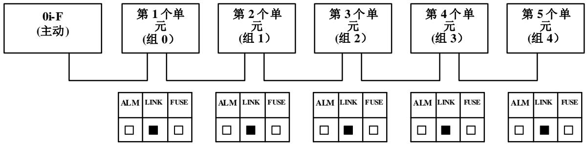

<details>
<summary>flowchart</summary>

```mermaid
graph TD
  A["0i-F (主动)"] --> B["第1个单元 (组0)"]
  B --> C["第2个单元 (组1)"]
  C --> D["第3个单元 (组2)"]
  D --> E["第4个单元 (组3)"]
  E --> F["第5个单元 (组4)"]
  B --> G["ALM LINK FUSE"]
  C --> H["ALM LINK FUSE"]
  D --> I["ALM LINK FUSE"]
  E --> J["ALM LINK FUSE"]
  F --> K["ALM LINK FUSE"]
  G --> L["□ ■ □"]
  H --> M["□ ■ □"]
  I --> N["□ ■ □"]
  J --> O["□ ■ □"]
  K --> P["□ ■ □"]
```
</details>

(3) 各单元的 “LINK” 处于 1:1 或者 3:1 的闪烁状态的情形
I/O Link i 正常通信中的状态。在作为双检安全使用的单元中，“LINK”处于3:1的闪烁状态。

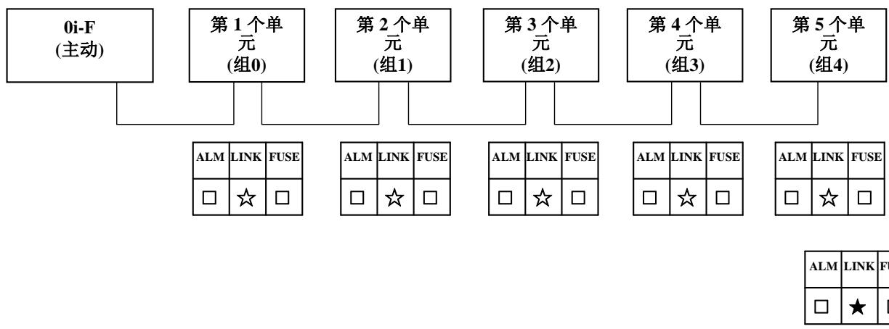

<details>
<summary>flowchart</summary>

```mermaid
graph TD
  A["0i-F (主动)"] --> B["第1个单元 (组0)"]
  A --> C["第2个单元 (组1)"]
  A --> D["第3个单元 (组2)"]
  A --> E["第4个单元 (组3)"]
  A --> F["第5个单元 (组4)"]
  B --> G["ALM LINK FUSE"]
  C --> H["ALM LINK FUSE"]
  D --> I["ALM LINK FUSE"]
  E --> J["ALM LINK FUSE"]
  F --> K["ALM LINK FUSE"]
  G --> L["□ ☆ □"]
  H --> M["□ ☆ □"]
  I --> N["□ ☆ □"]
  J --> O["□ ☆ □"]
  K --> P["□ ☆ □"]
```
</details>

使用双检安全的单元的情形

(4) 有 “ALM” 以 1:1 闪烁的单元的情形

在相应单元及紧靠其后的单元之间，因通信电缆的不良或者连接不良等理由，推测发生了通信线路的断线、或者噪声引起的故障。

另外，这种情况下，在较推测通信线路断线的场所更靠前的单元中 “LINK” 成为高速的 1:1 的闪烁状态，并在其后的单元中 “LINK” 成为点亮状态。

根据 “ALM” 以 1:1 闪烁的单元的 JD1A，确认连接紧靠其后的单元的 JD1B 的电缆不良、连接不良、周围的噪声状况。

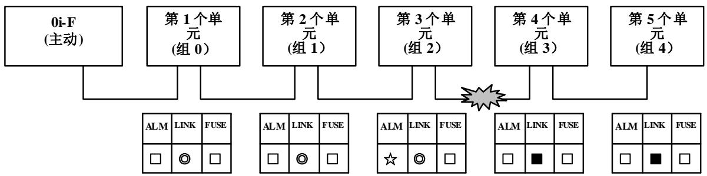

<details>
<summary>flowchart</summary>

```mermaid
graph TD
  A["0i-F (主动)"] --> B["第1个单元 (组0)"]
  B --> C["第2个单元 (组1)"]
  C --> D["第3个单元 (组2)"]
  D --> E["第4个单元 (组3)"]
  E --> F["第5个单元 (组4)"]
  B --> G["ALM LINK FUSE"]
  C --> H["ALM LINK FUSE"]
  D --> I["ALM LINK FUSE"]
  E --> J["ALM LINK FUSE"]
  F --> K["ALM LINK FUSE"]
  G --> L["□ ◎ □"]
  H --> M["□ ◎ □"]
  I --> N["☆ ◎ □"]
  J --> O["□ ■ □"]
  K --> P["□ ■ □"]
```
</details>

(5) 有 “ALM” 以 3:1 闪烁的单元的情形

(i) 在紧靠 “ALM” 以 3:1 闪烁的单元之后的单元中 LED 全都处在熄灭状态的情形

在 LED 全都处在熄灭状态的单元中，推测发生了电压值的异常。

另外，这种情况下，在较推测电压值异常的单元更靠前的单元中 “LINK” 成为高速的 1:1 的闪烁状态，并在其后的单元中 “LINK” 成为点亮状态。

确认在 LED 全都处在熄灭状态下的单元中电压值正常。

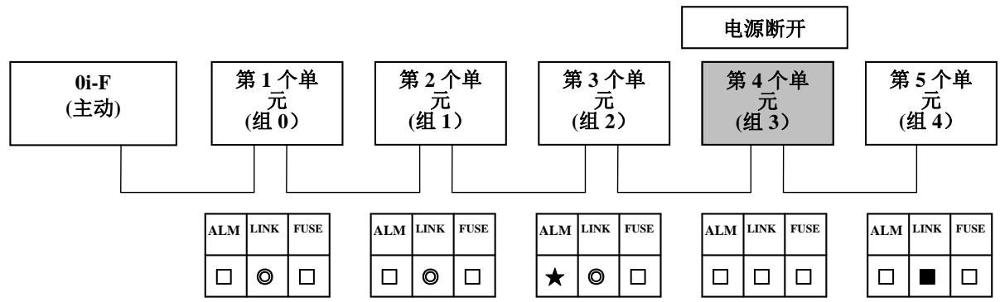

<details>
<summary>flowchart</summary>

```mermaid
graph TD
  A["0i-F (主动)"] --> B["第1个单元 (组0)"]
  B --> C["第2个单元 (组1)"]
  C --> D["第3个单元 (组2)"]
  D --> E["第4个单元 (组3)"]
  E --> F["第5个单元 (组4)"]
  F --> G["电源断开"]
  G --> H["ALM LINK FUSE"]
  H --> I["□ ◎ □"]
  G --> J["ALM LINK FUSE"]
  J --> K["□ ◎ □"]
  G --> L["ALM LINK FUSE"]
  L --> M["★ ◎ □"]
  G --> N["ALM LINK FUSE"]
  N --> O["□ □ □"]
  G --> P["ALM LINK FUSE"]
  P --> Q["□ ■ □"]
```
</details>

(ii) 在紧靠 “ALM” 以 3:1 闪烁的单元之后的单元中 “LINK” 处在点亮状态的情形

在紧靠 “ALM” 以 3:1 闪烁的单元之后的单元中，推测出引起了电源的瞬断。

另外，这种情况下，在较推测出电源瞬断的单元之前的单元中，“LINK”成为高速的1:1闪烁状态。此外，推测电源瞬的单元以及较其后的单元中，“LINK”成为点亮状态。

在紧靠 “ALM” 以 3:1 闪烁的单元之后的单元中，确认是否引起了电源的瞬断。

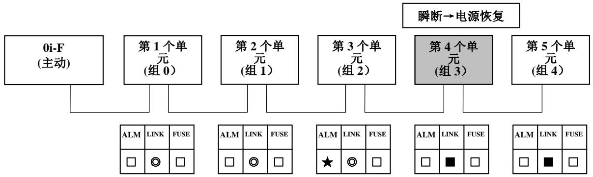

<details>
<summary>flowchart</summary>

```mermaid
graph TD
  A["0i-F (主动)"] --> B["第1个单元 (组0)"]
  B --> C["第2个单元 (组1)"]
  C --> D["第3个单元 (组2)"]
  D --> E["第4个单元 (组3)"]
  E --> F["第5个单元 (组4)"]
  F --> G["瞬断→电源恢复"]
  G --> H["ALM LINK FUSE"]
  H --> I["□ ◎ □"]
  G --> J["ALM LINK FUSE"]
  J --> K["□ ◎ □"]
  G --> L["ALM LINK FUSE"]
  L --> M["★ ◎ □"]
  G --> N["ALM LINK FUSE"]
  N --> O["□ ■ □"]
  G --> P["ALM LINK FUSE"]
  P --> Q["□ ■ □"]
```
</details>

(iii) 在紧靠 “ALM” 以 3:1 闪烁的单元之后的单元中 “FUSE” 处在点亮状态的情形

推测在 “FUSE” 点亮的单元中保险丝已熔断。

另外，这种情况下，在较推测保险丝熔断的单元更靠前的单元中 “LINK” 成为高速的 1:1 的闪烁状态，并在其后的单元中 “LINK” 成为点亮状态。

更换 “FUSE” 点亮中的单元的保险丝。另外，有关保险丝的更换，请参阅第 3 章。

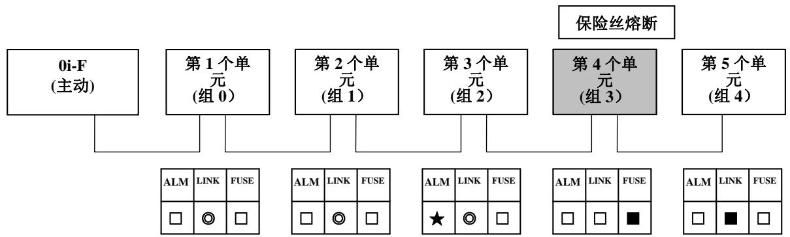

<details>
<summary>flowchart</summary>

```mermaid
graph TD
  A["0i-F (主动)"] --> B["第1个单元 (组0)"]
  B --> C["第2个单元 (组1)"]
  C --> D["第3个单元 (组2)"]
  D --> E["第4个单元 (组3)"]
  E --> F["第5个单元 (组4)"]
  F --> G["ALM LINK FUSE"]
  G --> H["□ ◎ □"]
  C --> I["ALM LINK FUSE"]
  I --> J["□ ◎ □"]
  D --> K["ALM LINK FUSE"]
  K --> L["★ ◎ □"]
  E --> M["ALM LINK FUSE"]
  M --> N["□ □ ■"]
  F --> O["ALM LINK FUSE"]
  O --> P["□ ■ □"]
    style A fill:#f9f,stroke:#333
    style B fill:#ccf,stroke:#333
    style C fill:#ccf,stroke:#333
    style D fill:#ccf,stroke:#333
    style E fill:#ccf,stroke:#333
    style F fill:#ccf,stroke:#333
    style G fill:#cfc,stroke:#333
    style H fill:#fcc,stroke:#333
    style I fill:#fcc,stroke:#333
    style J fill:#fcc,stroke:#333
    style K fill:#fcc,stroke:#333
    style L fill:#fcc,stroke:#333
    style M fill:#fcc,stroke:#333
    style N fill:#fcc,stroke:#333
    style O fill:#fcc,stroke:#333
```
</details>

(6) 所有的单元中 “LINK” 处在高速的 1:1 闪烁状态的情形

(i) 有 “ALM” 点亮中的单元的情形

推测在相应的单元中发生了报警。可能是由于硬件不良所致，请更换该单元。

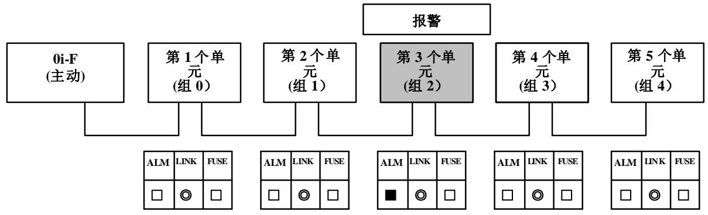

<details>
<summary>flowchart</summary>

```mermaid
graph TD
  A["报警"] --> B["0i-F (主动)"]
  A --> C["第1个单元 (组0)"]
  A --> D["第2个单元 (组1)"]
  A --> E["第3个单元 (组2)"]
  A --> F["第4个单元 (组3)"]
  A --> G["第5个单元 (组4)"]
  C --> H["ALM LINK FUSE"]
  C --> I["ALM LINK FUSE"]
  D --> J["ALM LINK FUSE"]
  D --> K["ALM LINK FUSE"]
  E --> L["ALM LINK FUSE"]
  E --> M["ALM LINK FUSE"]
  F --> N["ALM LINK FUSE"]
  F --> O["ALM LINK FUSE"]
  G --> P["ALM LINK FUSE"]
  G --> Q["ALM LINK FUSE"]
```
</details>

(ii) 所有的单元中 “ALM” 处在熄灭状态的情形

可能是由于噪声引起的故障，或者在主控装置中发生了异常。请同时确认画面上所显示的报警。

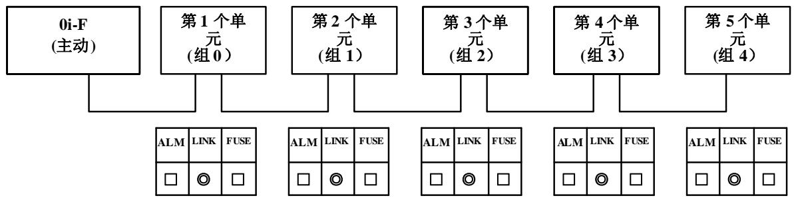

<details>
<summary>flowchart</summary>

```mermaid
graph TD
  A["0i-F (主动)"] --> B["第1个单元 (组0)"]
  B --> C["第2个单元 (组1)"]
  C --> D["第3个单元 (组2)"]
  D --> E["第4个单元 (组3)"]
  E --> F["第5个单元 (组4)"]
  B --> G["ALM LINK FUSE"]
  C --> H["ALM LINK FUSE"]
  D --> I["ALM LINK FUSE"]
  E --> J["ALM LINK FUSE"]
  F --> K["ALM LINK FUSE"]
  G --> L["□ ◎ □"]
  H --> M["□ ◎ □"]
  I --> N["□ ◎ □"]
  J --> O["□ ◎ □"]
  K --> P["□ ◎ □"]
```
</details>

(7) 有 “ALM” 以 1:3 闪烁的单元的情形推测在相应的单元中发生了状态报警。

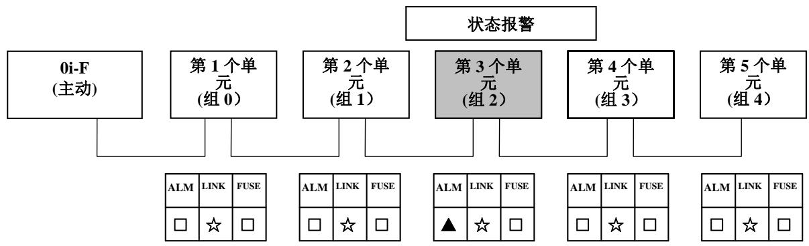

<details>
<summary>flowchart</summary>

```mermaid
graph TD
  A["状态报警"] --> B["0i-F (主动)"]
  A --> C["第1个单元 (组0)"]
  A --> D["第2个单元 (组1)"]
  A --> E["第3个单元 (组2)"]
  A --> F["第4个单元 (组3)"]
  A --> G["第5个单元 (组4)"]
  C --> H["ALM LINK FUSE"]
  D --> I["ALM LINK FUSE"]
  E --> J["ALM LINK FUSE"]
  F --> K["ALM LINK FUSE"]
  G --> L["ALM LINK FUSE"]
  H --> M["□ ☆ □"]
  I --> N["□ ☆ □"]
  J --> O["▲ ☆ □"]
  K --> P["□ ☆ □"]
  L --> Q["□ ☆ □"]
```
</details>

注释

状态报警是表示DO接地故障和DOCOM异常等单元状态的报警。有关详细内容，请参阅4.2.1项。

## 11 电机、检测器和放大器的维修检查

本章记述与电机、检测器、放大器的维修检查相关的基本内容。

11.1 与电机及放大器相关的说明书一览.....492  
11.2 电机及检测器的维修检查.....493

11.2.1 与电机及检测器的维修检查相关的警告、注意、注释.....493  
11.2.2 电机的维修检查（全部机型共同事项）.....494

11.2.2.1 主要的检查项目 494  
11.2.2.2 电机的定期清扫 ..... 496  
11.2.2.3 电机清扫时的注意事项.....496  
11.2.2.4 与切削液相关的注意事项（参考）.....496

11.2.3 直线电机的维修检查....497

11.2.3.1 直线电机（磁钢板）的外观检查.....497

11.2.4 检测器的保养.....497

11.2.4.1 内置型检测器（αi、βi脉冲编码器）的报警和处理方法 497  
11.2.4.2 位置检测器的报警和处理方法.....498  
11.2.4.3 处理方法详细 499  
11.2.4.4 βiS电机的脉冲编码器的维修 500

11.3 伺服放大器的维修检查.....501

11.3.1 与伺服放大器的维修检查相关的警告、注意、注释....501  
11.3.2 伺服放大器的维修检查....503

11.3.3 伺服放大器的维修....503

11.3.3.1 伺服放大器动作状态的显示....503  
11.3.3.2 更换风扇电机 509  
11.3.3.3 更换印刷电路板上的保险丝....527

## 11.1 与电机及放大器相关的说明书一览

电机及放大器的详细说明，登载于下表的各说明书中。用户在进行定期检查等维护时，请向机械制造商咨询，同时根据需要获取下表中登载的说明书的最新版。另外，有关各装置的重量和绕组电阻值等的规格，登载于各自的“规格说明书”中。


### PMC报警: 说明书的名称
- **故障内容**: 说明书的种类
- **处理办法**: 说明书编号

### PMC报警: FANUC AC SERVO MOTOR αi series
- **故障内容**: 规格说明书
- **处理办法**: B-65262EN

### PMC报警: FANUC AC SERVO MOTOR βis series
- **故障内容**: 规格说明书
- **处理办法**: B-65302EN

### PMC报警: FANUC SYNCHROUNOUS BUILT-IN SERVO MOTOR DiS series
- **故障内容**: 规格说明书
- **处理办法**: B-65332EN

### PMC报警: FANUC LINEAR MOTOR LiS series
- **故障内容**: 规格说明书
- **处理办法**: B-65382EN

### PMC报警: FANUC AC SPINDLE MOTOR αi series
- **故障内容**: 规格说明书
- **处理办法**: B-65272EN

### PMC报警: FANUC AC SPINDLE MOTOR βi series
- **故障内容**: 规格说明书
- **处理办法**: B-65312EN

### PMC报警: FANUC BUILT-IN SPINDLE MOTOR BiI series
- **故障内容**: 规格说明书
- **处理办法**: B-65292EN

### PMC报警: FANUC SYNCHROUNOUS BUILT-IN SPINDLE MOTOR BiS series
- **故障内容**: 规格说明书
- **处理办法**: B-65342EN

### PMC报警: FANUC - NSK SPINDLE UNIT series
- **故障内容**: 规格说明书
- **处理办法**: B-65352EN

### PMC报警: FANUC SERVO AMPLIFIER αi series
- **故障内容**: 规格说明书
- **处理办法**: B-65412EN

### PMC报警: FANUC SERVO AMPLIFIER βi series
- **故障内容**: 规格说明书
- **处理办法**: B-65322EN

### PMC报警: FANUC SERVO AMPLIFIER βi-B series
- **故障内容**: 规格说明书
- **处理办法**: B-65422EN

### PMC报警: FANUC AC SERVO MOTOR αi seriesFANUC AC SERVO MOTOR βi seriesFANUC LINEAR MOTOR LiS seriesFANUC SYNCHRONOUS BUILT-IN SERVO MOTOR DiS series
- **故障内容**: 参数说明书
- **处理办法**: B-65270CM

### PMC报警: FANUC AC SPINDLE MOTOR αi/βi seriesBUILT-IN SPINDLE MOTOR Bi series
- **故障内容**: 参数说明书
- **处理办法**: B-65280CM

### PMC报警: FANUC AC SERVO MOTOR αis/αi seriesAC SPINDLE MOTOR αi seriesSERVO AMPLIFIER αi series
- **故障内容**: 维修说明书
- **处理办法**: B-65285CM

### PMC报警: FANUC AC SERVO MOTOR βis seriesAC SPINDLE MOTOR βi seriesSERVO AMPLIFIER βi series
- **故障内容**: 维修说明书
- **处理办法**: B-65325CM

### PMC报警: FANUC SERVO AMPLIFIER βi series
- **故障内容**: 维修说明书
- **处理办法**: B-65395CM

### PMC报警: FANUC SERVO GUIDE
- **故障内容**: 操作说明书
- **处理办法**: B-65404CM

### PMC报警: FANUC AC SERVO MOTOR αis/αi/βis series
- **故障内容**: 伺服调整步骤书(基础篇)
- **处理办法**: B-65264CM


## 11.2 电机及检测器的维修检查

## 11.2.1 与电机及检测器的维修检查相关的警告、注意、注释

这里，就电机及检测器的维修检查作业中的、与安全相关的注意事项，根据其程度记载了“警告”、“注意”、“注释”。请在充分理解内容的基础上遵守内容，进行作业。

## 警告

## ● 维修检查电机时，要穿上安全的服装，在安全的作业环境下进行作业。

- 为预防边缘和突起部引起的受伤、和触电事故，要戴上手套，穿上安全鞋后进行作业。  
- 为在万一发生事故的情况下，能马上进行处理，尽量由多人进行作业。  
- 电机是具有一定重量的物体。为预防受伤，请根据需要使用起重机等设备。有关电机的重量，请参阅各电机的规格说明书（前面提到的）。  
- 应防止衣服和手指等被卷入电机，或者与可动部分发生冲撞。为避免受伤请不要站在电机的旋转方向（前进方向）。请事先确认电机驱动时不会有物体飞散。

## ● 请注意触电和火灾等。

- 请勿湿手进行作业。  
- 为防止触电，通电时请避免端子等导体露出。  
- 在接触电机及其周边时，请切断电源，同时采取充分的安全对策。  
- 电源切断后（5分钟以上）动力线端子之间还有高电压，所以请勿接触动力线端子或将其与其他设备连接。  
- 端子的松动和脱落、端子相互间的短路、端子的接地故障，恐会导致异常发热、起火、火灾、电机损坏，所以要避免出现这样的情况。  
- 附近有可燃物时，可能会导致起火、爆炸，十分危险。请勿靠近可燃物。

## ● 请勿拆解或加工电机。

直线电机、同步内装伺服电机、同步内装主轴电机等上面，使用了非常强力的磁铁，医疗仪器等靠近此类设备时，可能发生误动作而危及病人生命。此外，不管对哪种类型的电机，都会引起故障，所以请勿进行我公司指定外的拆解或者加工。

## 注意

## ● 请切实进行指定条件的冷却。

没有满足指定的冷却条件时（冷却不充分或者过度冷却的情形），会导致故障。所以要通过定期检查排除冷却管路的堵塞、漏液、风扇电机的故障等。请勿在冷却系统异常的状态下驱动电机。

## ● 请勿改变系统配置。

请勿改变正常运转时的系统配置。有的情况下会导致事故和故障。因维修而拆除电缆时，要做上标记使其能切实回复到原先的状态。

## ● 电机的螺孔应只使用于电机的移动。

请勿利用电机的螺孔，一起吊运或者移动电机以外的设备。否则恐会导致电机破损。另外有的电机必须按照指定的位置和方向吊运。详情请参阅各电机的规格说明书（前面提到的）。

## ● 请勿接触运转中或刚刚停止的电机。

由于运转时的发热，恐会导致烫伤，因此请勿在电机充分冷却之前触摸电机。

## 注释

## - 请勿撕掉标牌。

在维修时取下的标牌，要进行妥善保管以免丢失。

## ● 请勿坐靠电机，请避免使电机受到冲击。

可能导致电机变形、损坏，或者给电机部件造成不良影响，从而不再能够进行正常运转。此外，请勿将电机堆放。

## ● 电机等的电气试验（绕组电阻、绝缘电阻等）及其通电，要遵守指定的条件。

- 电气试验要按照指定的方法进行。进行指定外的试验，可能损坏电机。  
- 为防止损坏内部元件，请勿对脉冲编码器等检测器进行耐压试验和绝缘试验（兆测试），或者外加商用电源。

## ● 请进行定期维修、检查（外观检查、绕组电阻、绝缘电阻等的测量等）、清扫。

为长期安全使用电机，请进行定期的维修、检查和清扫。但是，过度的检查（耐压测试等）可能会导致绕组的损伤，请予注意。有关绕组电阻值，请参阅各电机的规格说明书（本篇中登载了说明书编号）。有关绝缘电阻，在后面进行叙述。

## 注释

- 本篇把重心放在我公司制造的电机及检测器单体的维修检查上。根据机械的种类和结构，有的情况下未必与描述内容都相符，所以在阅读本篇内容时，请同时参阅机械的说明书。此外，如有不明白的地方，不要依靠主观判断，请向机械制造商或我公司维修服务部门咨询。  
- 有关各电机的规格详情，请参阅前面提到的说明书一览，或根据需要获取说明书的最新版。

## 11.2.2 电机的维修检查（全部机型共同事项）

本节中登载有不依赖于电机型号的、与维修检查相关的共同事项。关于各电机特有的事项，请参阅后述的各电机的相关内容。

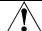

## 注意

- 维修检查的方法根据机械而存在许多不同的部分。此外，有的机械，某些情况下用户自身难于进行定期检查和定期清扫。如有不清楚的地方，请向机械制造商查询，在此基础上切实地完善能够进行定期检查和定期清扫的体制。  
- 请在机械制造商指定的规格范围内使用机械。进行规格外的使用方法时，恐会缩短电机的寿命，或引发故障。

## 11.2.2.1 主要的检查项目

下表中汇总了电机的主要检查项目。对于其中的任何一个项目，在有异常的情况下都应马上停止机械的使用，通过修理或者更换，恢复正常，同时，进行原因的调查并排除异常，防止再发生。难以处理时或无法防止再发等时，请向机械制造商或我公司维修服务部门咨询。


### PMC报警: 电机的外观
- **故障内容**: 裂纹和变形
- **处理办法**: 请确认电机上是否有划伤、裂纹、变形、鼓起等。能够看到电机内部时或电机与周边部件发生干涉时,要赶快进行电机或者周边部件的更换。电机表面的剥落和划伤较为轻微的情况下,有时可进行修补,请向我公司维修服务部门咨询。

### PMC报警: 使用条件
- **故障内容**: 温度和湿度等
- **处理办法**: 请按照机械的使用条件。有关各电机使用条件的详情,请通过各规格说明书予以确认。一般情况下,需要保持在周围温度0~40°C(主轴单元为30°C)、不会结露的状态。在振动剧烈的场所,有时会损坏电机部件。

### PMC报警: 连接状态
- **故障内容**: 电缆类
- **处理办法**: 请确认是否有电缆包覆的损坏和导体的露出、导线管和电缆支架的损坏、异常的弯曲、端子的松动等。有液体渗漏痕迹时,恐会导致液体进入电机内部和连接器内部等处,需要进行确认,并采取预防对策。

### PMC报警: 电机的动作
- **故障内容**: 响声和振动
- **处理办法**: 不仅在电机旋转(轴移动)中进行确认,也要确认其停止时的响声和振动,是否有与正常有所不同。电机旋转时的异常响声,有可能是因为轴承和电机内部的异常所致。

### PMC报警: 电机的电气特性
- **故障内容**: 绕组电阻
- **处理办法**: 电阻值超过规定范围时,需要更换电机。注释:进行绕组电阻测量时,请使电机与放大器断开,通过最靠近电机的动力线或者连接器部进行测量。

### PMC报警: 冷却风扇(带有风扇的电机)
- **故障内容**: 响声和振动
- **处理办法**: 请确认没有异常的响声和振动,可正常送风。在电机停止中也有异常响声时,可能是由于风扇电机的异常所致。

### PMC报警: 强制冷却装置(使用液冷等外部冷却装置的情形)
- **故障内容**: 结露(过冷却)
- **处理办法**: 请确认不会由于强制冷却而导致电机表面结露。特别是在机械停止后,冷却装置继续运转的情况下容易发生结露,请一定予以确认。电机表面的结露和水滴,恐会缩短电机的寿命,所以要马上将其擦掉,同时需要采取预防对策。


## 绝缘电阻的测量

这是使用自 $\alpha i-B$ 放大器应用的放大器内置的绝缘劣化检测功能、分离式绝缘劣化检测模块、或者兆欧表（DC500V）测量绕组～框架间的绝缘电阻时的判定基准。


出现绝缘电阻值在短暂时间内剧烈下降，或者断路器跳闸时，切削液等可能已从外部侵入电机内或者电缆内。请向机械制造商或者我公司维修服务部门联系，并确认处理方法。

## 注意

- 请拆除动力线，在电机处于单体的状态下测量绕组电阻值及绝缘电阻。在连接放大器的状态下测量绝缘电阻时，会导致放大器的损坏。  
- 测量绝缘电阻时，若将电机保持在对其施加电压的状态，反而会导致电机绝缘劣化。请在最短的时间内进行绝缘电阻的测量。  
- 拆除动力线等的连接时，要注意做好标记，以便正确回复到原先的状态。

## 11.2.2.2 电机的定期清扫

切屑和废屑的蓄积等，会留下故障的后患，所以需要进行定期清扫。此外，若对长时间粘附有切削液等化学物质的状态置之不管，则恐会由于材料的化学变化等严重缩短电机寿命。在进行液冷和空冷等强制冷却的情况下，请确认冷却管和风扇的堵塞等，定期进行检查清扫，以使冷媒顺畅流通，电机被切实冷却。


## 警告

根据电机的种类，在进行操作时会伴随危险，需要事先进行安全教育。此外，有的机械用户难于自行进行清扫。用户在进行自行清扫前，有关清扫方法和安全等事宜，应事先向机械制造商进行确认和咨询。

## 11.2.2.3 电机清扫时的注意事项

电机是电气部件，应与几乎与所有的液体隔离。在除掉切屑、废屑、切削液等进行清扫时，要注意如下事项。


## 11.2.2.4 与切削液相关的注意事项（参考）

所使用的切削液有的会给电机和放大器带来较大影响，即使没有直接撒上切削液，有时也会因为雾气和周围气体等而导致如下故障，请予以充分注意。


即使是这里没有记载的切削液，也有可能引发各种无法预测的到的问题。在发生有可能是切削液方面的原因的麻烦时，请向机械制造商或者我公司维修服务部门咨询。

## 11.2.3 直线电机的维修检查

在直线电机的磁钢板的表面嵌装有非常强力的磁铁。请在充分理解其危险性的基础上进行作业。

## 警告

- 我公司的直线电机上使用了非常强力的磁钢，如果错误操作，恐会引起重大的事故，十分危险。特别是，佩戴心脏起搏器等医疗仪器者，医疗仪器的误动作会危及生命，请勿靠近直线电机。  
- 要靠近或者接触直线电机进行作业时，需要事先进行安全教育。详情请向机械制造商或者我公司维修服务部门咨询。

## 11.2.3.1 直线电机（磁钢板）的外观检查

清扫时，同时进行外观检查。电机的裂纹和切口、变形等，在不久就可能导致重大的故障，务必联系机械制造商。此外，电机的擦伤等有时也是今后发生故障的预兆，需要引起注意并采取适当对策。下面记述磁钢板的外观检查的大致标准。※ 有关线圈滑块（带有动力线的一侧），请参阅前面提及的“主要的检查项目”。

磁钢板（有时也用不锈钢盖板遮盖）的外观


## 11.2.4 检测器的保养

## 注意

- 脉冲编码器等的检测器属于精密仪器。操作时要避免冲击。此外，还要注意避免粘附上切屑、垃圾和切削液等。  
- 请正确、切实地安装连接器。安装不良将会导致报警等发生。  
- 检测器和连接器类安装不好时，切削液会侵入内部，有时需要予以更换。这种情况下，请联系机械制造商或者我公司维修服务部门。

## 注释

使用我公司制以外的检测器时，详情请向机械制造商或者检测器制造商查询。

## 11.2.4.1 内置型检测器（αi、βi脉冲编码器）的报警和处理方法

对象为直接与控制装置（CNC、伺服放大器）连接的的内置型检测器。

请根据报警号及报警内容等，按照下一节记载的“处理方法详细”进行处理。


### PMC报警: 报警号:报警
- **故障内容**: 内容
- **处理办法**: 可能的原因

### PMC报警: 361:相位异常(内装)
- **故障内容**: •脉冲编码器内通信异常•ID数据异常
- **处理办法**: •脉冲编码器异常•干扰

### PMC报警: 364:软相位报警(内装)
- **故障内容**: 位置数据异常
- **处理办法**: •干扰•切削液侵入

### PMC报警: 365:LED异常(内装)
- **故障内容**: LED断线
- **处理办法**: •脉冲编码器异常

### PMC报警: 366:脉冲丢失(内装)
- **故障内容**: 内部信号振幅小
- **处理办法**: •脉冲编码器异常•干扰

### PMC报警: 367:计数值丢失(内装)
- **故障内容**: 位置数据误计数
- **处理办法**: •脉冲编码器异常•干扰


11.电机、检测器和放大器的维修检查  
B-64605CM/01


### PMC报警: 报警号:报警
- **故障内容**: 内容
- **处理办法**: 可能的原因

### PMC报警: 368:串行数据错误(内装)
- **故障内容**: 通信停止
- **处理办法**: ·电缆断线·脉冲编码器异常·干扰

### PMC报警: 369:数据传送错误(内装)
- **故障内容**: 通信数据异常
- **处理办法**: ·干扰

### PMC报警: 453:软断线报警
- **故障内容**: 位置—磁极数据异常
- **处理办法**: ·脉冲编码器异常·切削液侵入


## 11.2.4.2 位置检测器的报警和处理方法

以经由位置检测器接口单元（SDU）而连接于控制装置的分离型型检测器为对象。

请根据报警号及报警内容等，按照下一节记载的“处理方法详细”进行处理。


### PMC报警: 报警号:报警
- **故障内容**: 内容
- **处理办法**: 可能的原因

### PMC报警: 380:LED异常(分离型)
- **故障内容**: LED断线
- **处理办法**: ·检测器异常

### PMC报警: 385:串行数据错误(分离型)
- **故障内容**: 通信停止
- **处理办法**: ·电缆断线·干扰·检测器故障

### PMC报警: 386:数据传送错误(分离型)
- **故障内容**: 通信数据异常
- **处理办法**: ·干扰


## 11.2.4.3 处理方法详细

## (1) 确认干扰影响

检查 CNC 装置的诊断数据 No.356（内置型检测器时）、No.357（分离型型检测器时）的显示值。

通常显示为零，但是在受干扰后来自脉冲编码器的位置数据会发生紊乱的计数值。此值在 CNC 装置的电源切断时被清除，电源接通时显示零。

## (2) 电缆检测

请确认反馈电缆是否断线，连接器是否正确嵌合。

## (3) 更换脉冲编码器

## (3)-1 脉冲编码器的更换步骤

① 拧下 4 个用于固定脉冲编码器的 M4 内六角螺栓。无需拧松固定着脉冲编码器盖板的 M3 螺栓。（右图）  
② 拆下脉冲编码器和欧氏联轴节（参照下图）。  
③ 在电机上安装新的脉冲编码器和欧氏联轴节。使欧氏联轴节对相接头与欧氏联轴节的朝向一致、齿间啮合。

按压脉冲编码器，直到将 O 形环收入在电机和脉冲编码器的嵌合处。此时，请注意避免安装在脉冲编码器上的 O 形环损坏。

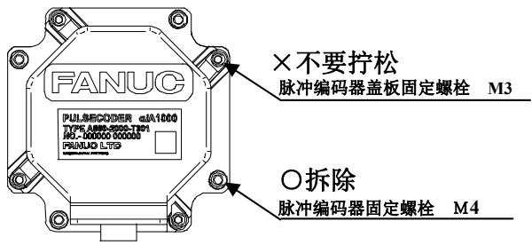

<details>
<summary>text_image</summary>

FANUC
PULSECODER qJA1000
TYPE A48-500-TB1
M3-100000 000000
PROUD LTS
×不要拧松
脉冲编码器盖板固定螺栓 M3
○拆除
脉冲编码器固定螺栓 M4
</details>

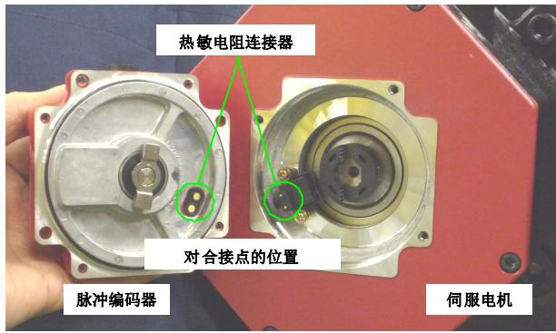

<details>
<summary>text_image</summary>

热敏电阻连接器
对合接点的位置
脉冲编码器
伺服电机
</details>

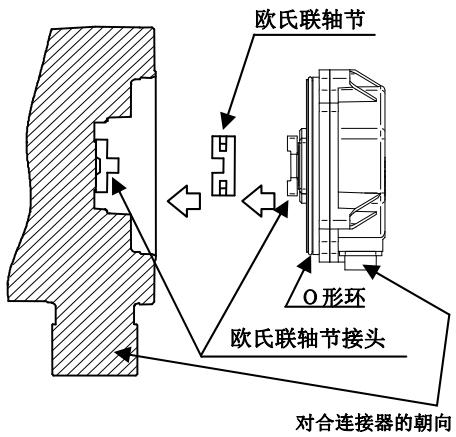

<details>
<summary>text_image</summary>

欧氏联轴节
O形环
欧氏联轴节接头
对合连接器的朝向
</details>

安装时脉冲编码器的反馈电缆连接器的朝向与伺服电机的动力连接器朝向应相同。或者使伺服电机、脉冲编码器各自的热敏电阻连接器的接点一致（左图）。

④ 按照与拆除脉冲编码器（①）相反的顺序，用 4 个 M4 内六角螺栓来固定脉冲编码器。（适量扭矩：1.5Nm）

## (3)-2 反馈电缆的嵌合作业步骤

请按照如下步骤嵌合反馈电缆的连接器，确认切实嵌合。

① 嵌合面、及键方向的确认

确认嵌合部分没有垃圾和油等的粘附物。

② 嵌合作业

按右图所示位置拿住连接器，笔直嵌合，确认有响声。

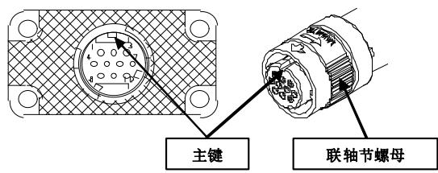

<details>
<summary>text_image</summary>

主键
联轴节螺母
</details>

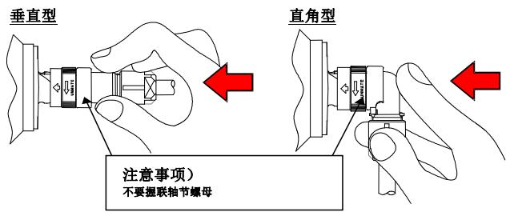

<details>
<summary>text_image</summary>

垂直型
直角型
注意事项）
不要提联轴节螺母
</details>

③ 嵌合状态的确认

1. 请确认连接器的箭头处在右图所示的中心位

置。没有处在中心位置时，用手将耦合器螺母拧到正常位置。

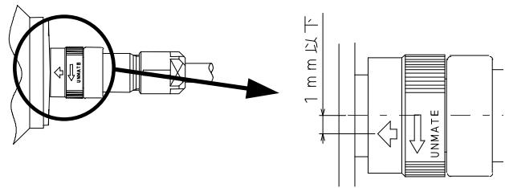

<details>
<summary>text_image</summary>

UNMATE
1 mm 以下
UNMATE
</details>

2. 按与②相同的位置拿住连接器，向后方笔直轻轻拉，确认连接器不会脱落。此时，请勿拉伸电缆。

## (4) 用户难以应对时

因检测器的异常和干扰引起的故障等，用户难以应对时，请向机械制造商或者我公司维修服务部门咨询。

## 11.2.4.4 $\beta$ iS电机的脉冲编码器的维修

下表的与电机的脉冲编码器相关联的故障，需要对整台电机进行维修（更换）（无法进行脉冲编码器单体的维修）。


### PMC报警: 电机型号
- **故障内容**: 电机规格
- **处理办法**: 备注

### PMC报警: βiS 0.2/5000
- **故障内容**: A06B-0111-Bx03#□□□□
- **处理办法**: x=1,2,4,5

### PMC报警: βiS 0.4/5000
- **故障内容**: A06B-0114-Bx03#□□□□A06B-2114-Bx03#□□□□
- **处理办法**: x=1,2,4,5


## 11.3 伺服放大器的维修检查

## 11.3.1 与伺服放大器的维修检查相关的警告、注意、注释

这里，就伺服放大器（指电机驱动装置、是共同电源、伺服放大器、主轴放大器和其它辅助模块的总称）的维修检查作业中的、与安全相关的注意事项，根据其程度记载了“警告”、“注意”、“注释”。请在充分理解后遵照说明，进行作业。

## 警告

● 在维修检查伺服放大器时，要穿上安全的服装，在安全的作业环境下进行作业。

- 为预防边缘和突起部引起的受伤、和触电事故，要在戴上手套，穿上安全鞋。  
- 为在万一发生事故时能得到及时处理，尽量由多人参加作业。  
- 伺服放大器及 AC 电抗器都是重物。在进行输送、或安装到强电盘上时，请予注意。另外，还要注意避免手指被夹在强电盘和伺服放大器之间。

● 接通电源前要检查电控柜的门扇。  
- 在维修作业期间外请将装有伺服放大器的电控柜的门扇，关紧锁上。  
● 需打开电控柜的门扇时，应由接受过该机械、装置的相关训练的人员，断开电控柜的输入断路器和供应给电控柜的工厂侧的短路器的电源之后再打开门扇。  
● 请注意防止触电和火灾等事故。

- 由于调整机械等原因而需要打开门扉运转时，请注意避免手或工具接触到加有电压的部位。这种情况下，请由接受过维修训练的相关人员来进行作业。  
- 为了使非专业的维修服务人员无法在伺服放大器通电状态下打开强电盘，要将其锁好。  
- 机械的操作员需要打开强电盘进行某种操作时，必须先接受充分的安全教育，或者追加防护盖板并采取相应的对策，以免操作员接触到强电。  
- 伺服放大器内部，使用大容量的电解电容器，在切断电源后的一段时间内仍然保持充电状态。维修时要接触到伺服放大器时，请测试 DC 链路部残留电压，并确认充电显示用 LED (红色) 处于灭灯状态后，方可开始作业。  
- 结线结束后，务必关闭伺服放大器的盖板。  
- 螺丝的松弛、连接器的插入不良，将会导致电机误动作、发热、接地故障和短路事故。特别是，大电流流过的电源线、电机动力线以及DC链路连接部的接触不良，有可能引发火灾。请按规定的螺丝拧紧力矩切实紧固。  
- 再生放电单元以及散热装置的表面温度很高。请勿直接用手触摸。

● 在维修检查后首次运转机械时，请确认机械是否按照指令动作。

- 给电机的指令要从很小值开始，使其慢慢地启动以检查其是否按照指令动作。电机没有按照指令动作时，要马上执行紧急停止操作。  
- 请确认按下紧急停止按钮时电机能快速停止，并切断伺服放大器输入部的电磁接触器。

● 发生报警时的注意事项

- 在发生报警而导致机械停止运转时，务必确认报警号。有的报警，在没有更换部件就再次通电时，将会导致其他的部件损坏，从而难以查清真正的原因。  
- 请在切实排除故障原因之后进行报警复位操作。

● 运转中电机发出异常响声或振动时，请立即停下电机。

\- 在电机发生异常响声或振动的状态下继续使用时，会导致伺服放大器故障。

● 请勿拆解或加工伺服放大器。

否则会导致故障，所以请勿进行我公司指定外的拆解或加工。

## 注意

## - 伺服放大器的更换和布线时的注意事项

- 伺服放大器的更换和结线，请由接受过该机械、装置的相关训练的人员来进行。  
- 更换伺服放大器时，请确认与电机的组合是否正确。  
- 请确认伺服放大器是否已切实安装在电控柜上。电控柜和伺服放大器的安装面之间有间隙时，受来自外部的粉尘侵入等影响，有可能妨碍到伺服放大器的正常动作。  
- 请将电源线、电机动力线和信号线连接于正确的端子、连接器上。  
- 如果没有特别载明，请勿在接通电源的状态下进行连接器的插拔操作。否则会导致伺服放大器的故障。  
- 拆装伺服放大器时，要注意避免手指被夹在伺服放大器和电控柜之间。  
- 注意避免弄丢拧下来的螺丝。若弄丢的螺丝留在放大器内部的状态下通电，则有可能损坏机械。  
- 请注意避免电源线、动力线的接地故障和短路。  
- 要避免让线材受到弯曲应力的影响。此外，要切实进行线材的末端处理。

## ● 请注意伺服放大器取的操作。

- 请勿拆解伺服放大器。电容器上有时残留有电荷，恐会导致触电。  
- 请避免伺服放大器受冲撞。否则会损坏部件而引发动作不良。  
- 请勿向塑料部分施加不必要的外力。塑料部分出现裂纹时，会导致内部的部件损坏，使得伺服放大器不再能够正常运转，有时还会因裂开的部分而致伤，请予注意。

## ● 请注意伺服放大器的使用环境。

- 应避免导电性、可燃性、腐蚀性的异物和雾气、水滴的侵入。这类物质侵入后，有可能导致伺服放大器的破裂、破损、误动作等。  
- 要注意避免切削液、油雾、切削屑等粘附于暴露在电控柜外部的散热装置以及风扇电机上。有时会导致无法正常动作。此外，还会导致风扇电机和半导体的寿命缩短。

## ● 定期对散热装置、风扇电机进行清扫。

- 请定期更换电控柜的过滤网。  
- 在清扫散热装置的时候要先切断电源，确认散热装置的温度已降到与室温相当的程度。在刚刚切断电源之后，散热装置的温度还非常高，有可能导致烫伤。  
- 通过风力进行清扫的时候，请注意尘埃的飞散。伺服放大器或周边设备上粘附有导电性的尘埃时，会导致故障。

## 注释

● 在机械或装置的门扇附近要确保留有用于维修的空间。  
● 请勿座靠在伺服放大器上，或使其受冲击。  
● 请勿撕掉铭牌。

- 维修时为特定伺服放大器的机型需要使用铭牌。  
- 铭牌被取下时，要加以妥善保管以免丢失。

## 注释

- 本篇将描述重点放在我公司制的伺服放大器的维修检查上。机械的种类和结构，有的情况下未必与描述内容都相符，所以在参阅本篇内容时，请同时参阅机械的说明书。此外，如有不明白的地方，不要依靠主观判断，请向机械制造商或我公司维修服务部门咨询。  
- 有关各伺服放大器的规格详情，请参阅前面提到的说明书一览，或根据需要获取说明书的最新版。

## 11.3.2 伺服放大器的维修检查

为了长期安全使用伺服放大器，请进行日常和定期检查。


## 注意

- 维修检查的方法根据机械而存在许多不同的部分。此外，有的机械，某些情况下用户自己难于进行定期检查和定期清扫。如有不清楚的地方，请向机械制造商查询，在此基础上切实地完善能够进行定期检查和定期清扫的体制。  
- 请在机械制造商指定的规格范围内使用机械。进行规格外的使用方法时，恐会导致伺服放大器的寿命缩短，或引发故障。


### PMC报警: 检查部位
- **故障内容**: 检查项目
- **处理办法**: 检查周期

### PMC报警: 动作环境
- **故障内容**: 环境温度
- **处理办法**: ○

### PMC报警: 湿度
- **故障内容**: ○
- **处理办法**: 

### PMC报警: 尘埃、油雾
- **故障内容**: ○
- **处理办法**: 

### PMC报警: 冷却风通道
- **故障内容**: ○
- **处理办法**: 

### PMC报警: 异常振动、响声
- **故障内容**: ○
- **处理办法**: 

### PMC报警: 电源电压
- **故障内容**: ○
- **处理办法**: 

### PMC报警: 伺服放大器
- **故障内容**: 整体
- **处理办法**: ○

### PMC报警: 螺丝
- **故障内容**: 
- **处理办法**: ○

### PMC报警: 风扇电机 (注释1)(注释2)
- **故障内容**: ○
- **处理办法**: 

### PMC报警: 连接器
- **故障内容**: 
- **处理办法**: ○

### PMC报警: 电缆
- **故障内容**: 
- **处理办法**: ○

### PMC报警: CNC
- **故障内容**: 绝对 (注释2)脉冲编码器用电池
- **处理办法**: ○

### PMC报警: 外部设备
- **故障内容**: 电磁接触器
- **处理办法**: 

### PMC报警: 漏电断路器
- **故障内容**: 
- **处理办法**: ○

### PMC报警: A C电抗器
- **故障内容**: 
- **处理办法**: ○


## 注释

1 风扇电机是需要定期维修的部件，建议用户进行日常检查，并进行预防性更换。  
2 风扇电机、电池是需要定期维修的部件，建议准好备用品。

## 11.3.3 伺服放大器的维修

## 11.3.3.1 伺服放大器动作状态的显示

通过伺服放大器前面的 STATUS 显示，可以弄清伺服放大器的动作状态（正常动作、报警的类别等）。请在进行维修检查时、以及设备发生故障等时使用。


## 注意

伺服放大器内发生的故障，有时是由于多个不同的原因重合在一起造成的，要彻底查清原因往往很困难。此外，如果进行错误处理，反而会导致故障进一步恶化，因此，详细分析故障的情况，弄清真正的原因十分重要。即使暂时看起来好像已经排除了异常，有时异常会再度发生而导致更加重大的异常或故障，在弄不清根本的原因和处理方法时，不要依靠主观判断，请进行适当处理，如向机械制造商或我公司维修服务部门查询。

## 【αi-B 系列】

(1)共同电源


### PMC报警: STATUS的显示位置
- **故障内容**: STATUS显示
- **处理办法**: 内容

### PMC报警: 
- **故障内容**: 无显示
- **处理办法**: STATUS显示LED尚未点亮。控制电源未接通或者硬件不良


(2)伺服放大器


### PMC报警: STATUS的显示位置
- **故障内容**: STATUS显示
- **处理办法**: 内容

### PMC报警: 
- **故障内容**: 无显示
- **处理办法**: STATUS显示LED尚未点亮。控制电源未接通或者硬件不良


(3)主轴放大器


### PMC报警: STATUS的显示位置
- **故障内容**: STATUS显示
- **处理办法**: 内容

### PMC报警: 
- **故障内容**: 无显示
- **处理办法**: STATUS显示LED尚未点亮。控制电源未接通或者硬件不良


【βi SV-B 系列】  
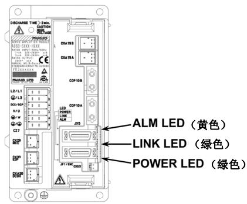

<details>
<summary>text_image</summary>

DISCHARGE TIME
CA170N
INT 168
PAN320
MENI-500-0000
MENI-500-0000
MENI-500-0000
MENI-500-0000
MENI-500-0000
L2/L1
G/LS
RG/EXP
V/V
W/V
CE7
ALM LED（黄色）
LINK LED（绿色）
POWER LED（绿色）
</details>

(1) $\beta i\mathrm{SV4 - B}$ , $\beta i\mathrm{SV20 - B}$

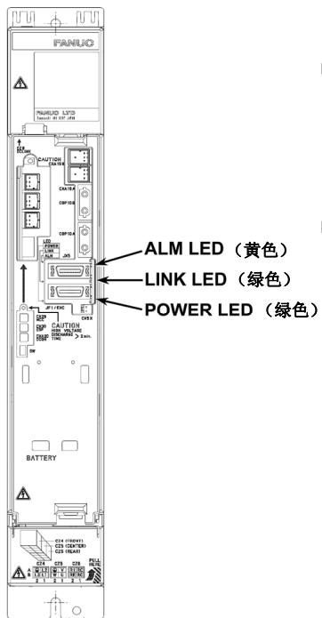

<details>
<summary>text_image</summary>

FANJO
ALM LED（黄色）
LINK LED（绿色）
POWER LED（绿色）
BATTERY
Q44 (FR001)
Q35 (C971)
Q28 (RE03)
Q14 (F001)
Q05 (F001)
Q04 (F001)
Q03 (F001)
Q02 (F001)
Q01 (F001)
</details>

(2) $\beta i$ SV40-B, $\beta i$ SV80-B, $\beta i$ SV10HV-B, $\beta i$ SV20HV-B, $\beta i$ SV40HV-B

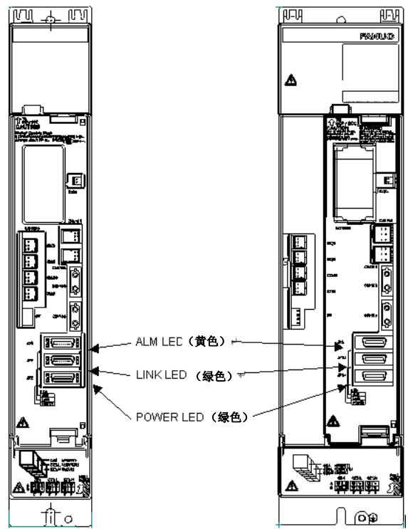

<details>
<summary>text_image</summary>

ALM LED (黄色)
LINK LED (绿色)
POWER LED (绿色)
</details>

(3) βiSV20/20-B  
(4) $\beta iSV40/40-B$


【βi SVSP-B 系列】  
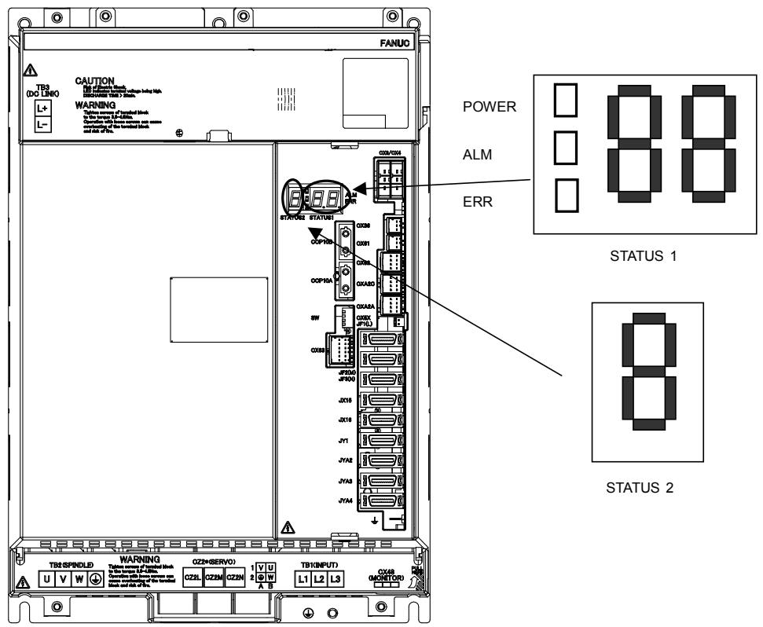

<details>
<summary>text_image</summary>

FANUC
TB3
(Do Link)
CAUTION
The following blocks are being in the following blocks:
L+
L-
WARNING
Turning amounts of terminal block
to the above level of 100000000000000000000000000000000000000000000000000000000000000000000000000000
POWER
ALM
ERR
STATUS 1
STATUS 2
STATION STATUS
COS/FOX
COSM
COSR1
COSR2
COSAR
SW
COSA
COSX
JYU1
COSB
JF5D0
JF5D1
JX18
JX19
JY1
JY4A
JY4B
JY4A
JY4A
TBI/SPINDL
WARNING
TBI/SPINDL/TBI/SPINDL Block
To the above level of 10000000000000000000000000000000000000000
CZM/SERVO1
V U
CZL CZM CZN 2 @ W
L1 L2 L3
CUXO
GONATORD
U V W
</details>


### PMC报警: No.
- **故障内容**: POWER
- **处理办法**: ALM

### PMC报警: 1
- **故障内容**: 
- **处理办法**: 

### PMC报警: 2
- **故障内容**: 亮灯
- **处理办法**: 

### PMC报警: 3
- **故障内容**: 亮灯
- **处理办法**: 

### PMC报警: 4
- **故障内容**: 亮灯
- **处理办法**: 

### PMC报警: 5
- **故障内容**: 亮灯
- **处理办法**: 

### PMC报警: 6
- **故障内容**: 亮灯
- **处理办法**: 亮灯

### PMC报警: 7
- **故障内容**: 亮灯
- **处理办法**: 


11.电机、检测器和放大器的维修检查  
B-64605CM/01


## 11.3.3.2 更换风扇电机

## 【αi-B 系列】

## (1) 60mm 宽单元，90mm 宽单元的风扇单元拆除方法

(1) 抓住内部冷却风扇单元的把手（2 处），向着上方向提起。（内部冷却风扇单元的拆除完成）  
(2) 解除 DC 链路端子台盖板的开闭锁定，打开 DC 链路端子台盖板，确认 DC 链路的放电（LED 已灭灯），拆除 DC 链路短路条。  
(3) 从 DC 链路端子台旁的开口部插入螺丝刀，拧松散热器冷却风扇单元下侧的螺丝（1 处）。  
(4) 拧松散热器冷却风扇单元上侧的螺丝（60mm 宽为 1 处，90mm 宽为 2 处）。  
(5) 向跟前一方拉出散热器冷却风扇单元。（散热器冷却风扇单元的拆除完成）  
(6) 安装时，按照与上述相反的步骤进行。

补充：安装内部风扇单元时，有的情况下连接器的嵌合位置会偏离，难以进行安装，这种情况下，在向左推压内部风扇单元的里侧的突起部分的同时进行安装。

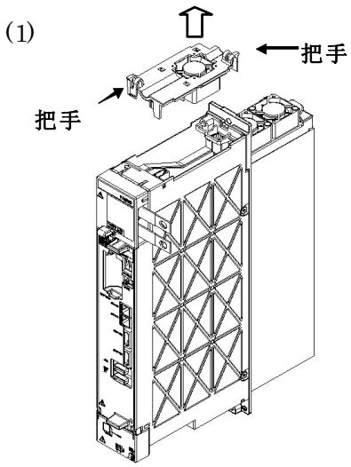

<details>
<summary>text_image</summary>

(1)
把手
把手
</details>

(2)  
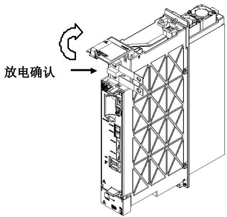

<details>
<summary>text_image</summary>

放电确认
</details>

(3)  
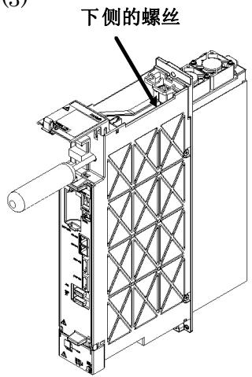

<details>
<summary>text_image</summary>

下侧的螺丝
</details>

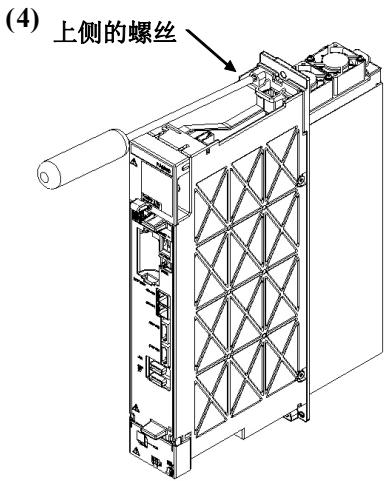

<details>
<summary>text_image</summary>

(4) 上侧的螺丝
</details>

(5)  
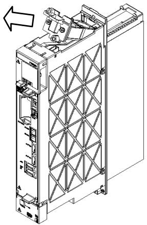

<details>
<summary>natural_image</summary>

Technical line drawing of a server rack with triangular mesh structure and mounting bracket (no text or symbols)
</details>

补充  
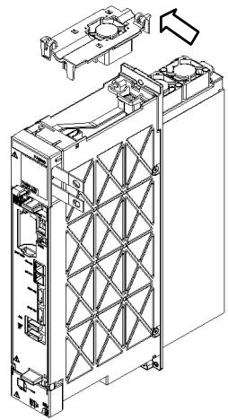

<details>
<summary>natural_image</summary>

Technical line drawing of an electronic device casing with internal components and mounting bracket (no text or symbols)
</details>

## (2) 150mm、300mm 宽单元的风扇单元拆除方法

(1) 抓住内部冷却风扇单元的把手（2 处），向着上方向提起。（内部冷却风扇单元的拆除完成）  
(2) 解除 DC 链路端子台盖板的开闭锁定，打开 DC 链路端子台盖板，确认 DC 链路的放电（LED 已灭灯），拆除 DC 链路短路条。  
(3) 从 DC 链路端子台旁的开口部插入螺丝刀，拧松散热器冷却风扇单元下侧的螺丝（1 处）。  
(4) 拧松散热器冷却风扇单元上侧的螺丝（1处）。  
(5) 向跟前一方拉出散热器冷却风扇单元。（散热器冷却风扇单元的拆除完成）  
(6) 安装时，按照与上述相反的步骤进行。

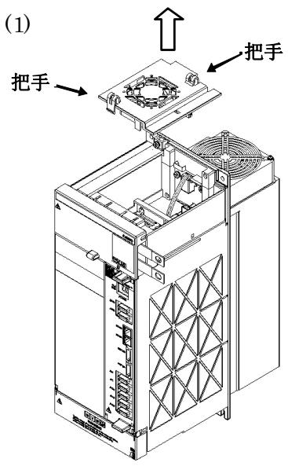

<details>
<summary>text_image</summary>

(1)
把手
把手
</details>

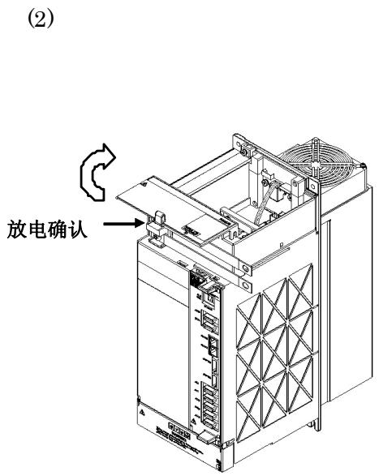

<details>
<summary>text_image</summary>

(2)
放电确认
</details>

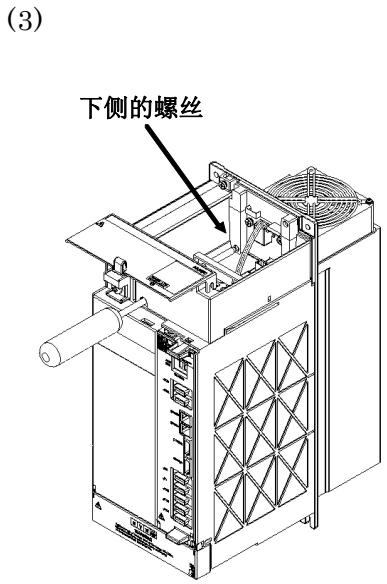

<details>
<summary>text_image</summary>

(3)
下侧的螺丝
</details>

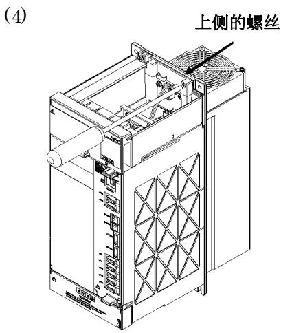

<details>
<summary>text_image</summary>

(4)
上侧的螺丝
</details>

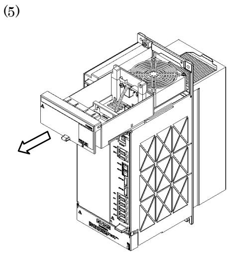

<details>
<summary>natural_image</summary>

Technical line drawing of an internal server or rack unit with ventilation ducts and cooling fans (no text or symbols)
</details>

## (3) 从内部冷却风扇单元拆除风扇电机的方法

(1) 从壳体上拆除连接器（1 处或者 2 处）。详情请参阅下图。

① 将 3mm 以下的一字形螺丝刀插入壳体和连接器的间隙中。  
② 使得一字形螺丝刀向着箭头的方向倾斜。  
③ 向着箭头方向拆除连接器。

①  


<details>
<summary>text_image</summary>

一字形螺丝刀
倾斜
</details>

(2) 从壳体上拆除风扇电机。

· 60mm 宽用内部冷却风扇单元（连接器不同的有 3 类）  
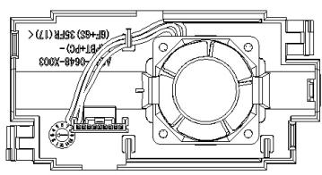

<details>
<summary>text_image</summary>

Ø1+Ø35 35FR (17)
Ø1+Ø40-1000
</details>

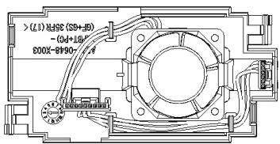

<details>
<summary>text_image</summary>

(1)RHS2 (59+30)
-(34+15)
D000-8-90-1
4
</details>

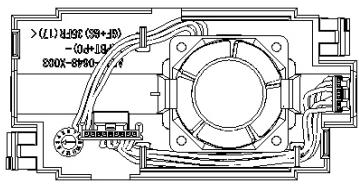

<details>
<summary>text_image</summary>

(L1) L192C (38+20)
-(0+19)
200X-8P400
</details>

90mm 宽用内部冷却风扇单元  
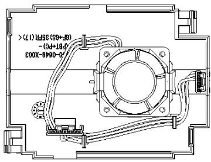

<details>
<summary>text_image</summary>

(p5-65)35R1(17)
(p5+04+04-04-04-04-04-04-04-04-04-04-04-04-04-04-04-04-04-04-04-04-04-04-04-04-04-04-04-04-04-04-04-04-04-04-2
</details>

150mm 宽用内部冷却风扇单元  
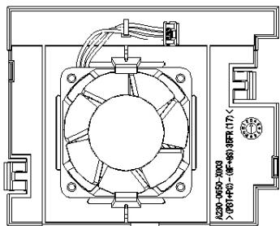

<details>
<summary>text_image</summary>

A20-0650-3008
> P01+P01 - (BF-46) BFR (17)
</details>

更换风扇电机时，注意风扇电机本体的朝向（安装到放大器上时，标牌在上侧）、连接器的朝向

## (4) 从散热器冷却风扇单元拆除风扇电机的方法

(1) 150mm 宽、300mm 宽用散热器冷却风扇单元，从风扇连接器上拆除中继连接器。详情请参阅下图。（60mm 宽、90mm 宽用散热器冷却风扇单元上没有中继连接器。）

① 将一字形螺丝刀插入壳体和连接器的间隙中。  
② 使得一字形螺丝刀向着箭头的方向倾斜。  
③ 向着箭头方向拆除连接器。

①  
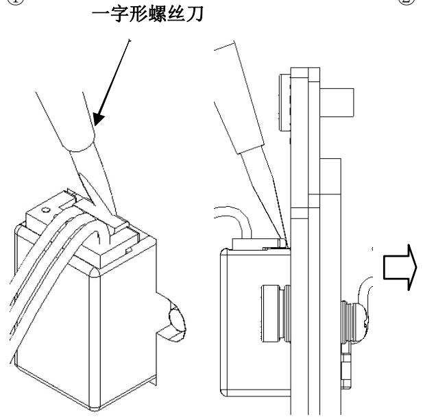

<details>
<summary>text_image</summary>

一字形螺丝刀
</details>

②

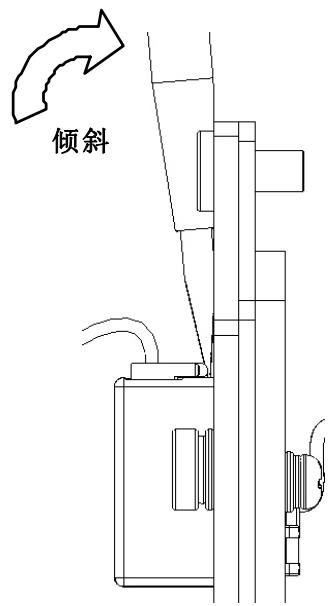

<details>
<summary>text_image</summary>

倾斜
</details>

③

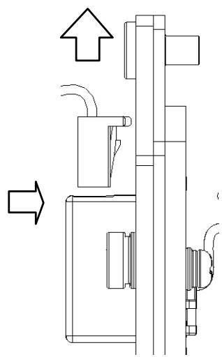

<details>
<summary>natural_image</summary>

Pure mechanical assembly diagram without any text, numbers, or symbols
</details>

(2) 拧下固定着风扇电机的螺丝（2处或者4处）。  
(3) 拧下固定着风扇电机连接器的螺丝（2处）。

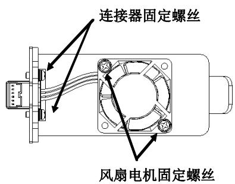

<details>
<summary>text_image</summary>

连接器固定螺丝
风扇电机固定螺丝
</details>

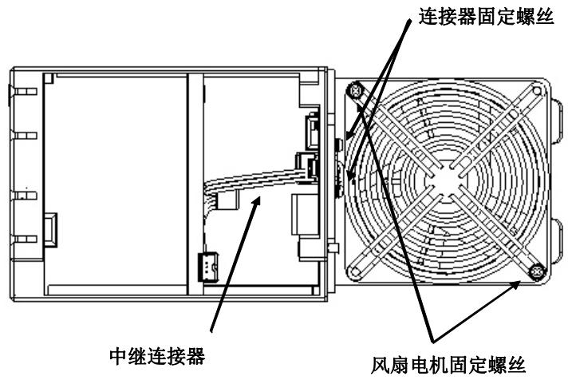

<details>
<summary>text_image</summary>

连接器固定螺丝
中继连接器
风扇电机固定螺丝
</details>

60mm 宽用散热器冷却风扇单元（风扇电机数不同的两类）

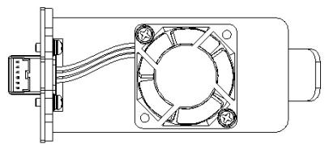

<details>
<summary>natural_image</summary>

Technical line drawing of a mechanical component with mounting flanges and wiring (no text or symbols)
</details>

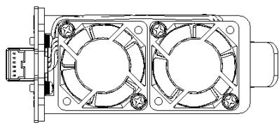

<details>
<summary>natural_image</summary>

Technical line drawing of a dual-flower electrical connector with mounting holes and a fuse (no text or symbols)
</details>

90mm 宽用散热器冷却风扇单元

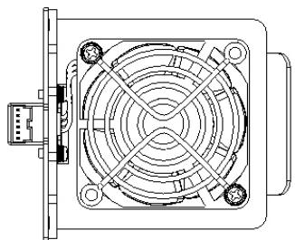

<details>
<summary>natural_image</summary>

Technical line drawing of an electrical fan assembly (no text or symbols)
</details>

150mm 宽用散热器冷却风扇单元

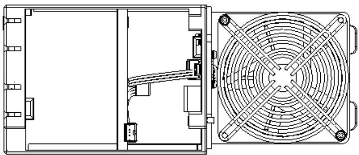

<details>
<summary>natural_image</summary>

Technical line drawing of a mechanical fan assembly with mounting brackets and internal components (no text or symbols)
</details>

更换风扇电机时，注意风扇电机本体的朝向（安装到放大器上时，标牌在上侧）、连接器的朝向

## (5) 维护用风扇单元、风扇电机的图号

· 共同电源


### PMC报警: 型号名
- **故障内容**: 内部冷却风扇
- **处理办法**: 散热器冷却风扇

### PMC报警: 风扇单元
- **故障内容**: 风扇电机
- **处理办法**: 风扇单元

### PMC报警: $\alpha iPS 7.5-B$
- **故障内容**: A06B-6200-C607
- **处理办法**: A90L-0001-0580#B

### PMC报警: $\alpha iPS 11-B$  $\alpha iPS 15-B$
- **故障内容**: A06B-6200-C609
- **处理办法**: A90L-0001-0580#B

### PMC报警: $\alpha iPS 26-B$  $\alpha iPS 30-B$  $\alpha iPS 37-B$
- **故障内容**: A06B-6200-C610
- **处理办法**: A90L-0001-0581

### PMC报警: $\alpha iPS 11HV-B$  $\alpha iPS 18HV-B$
- **故障内容**: A06B-6200-C609
- **处理办法**: A90L-0001-0580#B

### PMC报警: $\alpha iPS 30HV-B$  $\alpha iPS 45HV-B$  $\alpha iPS 60HV-B$
- **故障内容**: A06B-6200-C610
- **处理办法**: A90L-0001-0581


通常请以风扇电机单体进行维护。风扇安装部的塑料盖板已经破损时，备货风扇单元。风扇单元由风扇电机和风扇电机安装用盖组合而成。(参阅上述风扇电机的更换方法)

- 主轴放大器


### PMC报警: 型号名
- **故障内容**: 内部冷却风扇
- **处理办法**: 散热器冷却风扇

### PMC报警: 风扇单元
- **故障内容**: 风扇电机
- **处理办法**: 风扇单元

### PMC报警: $\alpha iSP 2.2-B$
- **故障内容**: A06B-6200-C606
- **处理办法**: A90L-0001-0580#A

### PMC报警: $\alpha iSP 5.5-B$
- **故障内容**: A06B-6200-C607
- **处理办法**: A90L-0001-0580#B

### PMC报警: $\alpha iSP 11-B$  $\alpha iSP 15-B$
- **故障内容**: A06B-6200-C609
- **处理办法**: A90L-0001-0580#B

### PMC报警: $\alpha iSP 22-B$  $\alpha iSP 26-B$  $\alpha iSP 30-B$
- **故障内容**: A06B-6200-C610
- **处理办法**: A90L-0001-0581

### PMC报警: $\alpha iSP 37-B$
- **故障内容**: A06B-6200-C610
- **处理办法**: A90L-0001-0581

### PMC报警: $\alpha iSP 5.5HV-B$
- **故障内容**: A06B-6200-C608
- **处理办法**: A90L-0001-0580#C

### PMC报警: $\alpha iSP 11HV-B$  $\alpha iSP 15HV-B$
- **故障内容**: A06B-6200-C609
- **处理办法**: A90L-0001-0580#B

### PMC报警: $\alpha iSP 22HV-B$  $\alpha iSP 30HV-B$
- **故障内容**: A06B-6200-C610
- **处理办法**: A90L-0001-0581

### PMC报警: $\alpha iSP 45HV-B$
- **故障内容**: A06B-6200-C610
- **处理办法**: A90L-0001-0581


通常请以风扇电机单体进行维护。风扇安装部的塑料盖板已经破损时，备货风扇单元。风扇单元由风扇电机和风扇电机安装用盖组合而成。(参阅上述风扇电机的更换方法)

- 伺服主轴多轴放大器


### PMC报警: 型号名
- **故障内容**: 内部冷却风扇
- **处理办法**: 散热器冷却风扇

### PMC报警: 风扇单元
- **故障内容**: 风扇电机
- **处理办法**: 风扇单元

### PMC报警: αiSVP20/20/20-5.5-B
- **故障内容**: A06B-6200-C609
- **处理办法**: A90L-0001-0580#B

### PMC报警: αiSVP10/10/10-5.5HV-B
- **故障内容**: A06B-6200-C609
- **处理办法**: A90L-0001-0580#B


通常请以风扇电机单体进行维护。风扇安装部的塑料盖板已经破损时，备货风扇单元。风扇单元由风扇电机和风扇电机安装用盖组合而成。(参阅上述风扇电机的更换方法)

\- 伺服放大器

(1) 1 轴


### PMC报警: 型号名
- **故障内容**: 内部冷却风扇
- **处理办法**: 散热器冷却风扇

### PMC报警: 风扇单元
- **故障内容**: 风扇电机
- **处理办法**: 风扇单元

### PMC报警: $\alpha iSV 4-B$
- **故障内容**: A06B-6200-C606
- **处理办法**: A90L-0001-0580#A

### PMC报警: $\alpha iSV 160-B$
- **故障内容**: A06B-6200-C608
- **处理办法**: A90L-0001-0580#C

### PMC报警: $\alpha iSV 360-B$
- **故障内容**: A06B-6200-C610
- **处理办法**: A90L-0001-0581

### PMC报警: $\alpha iSV 160L-B$
- **故障内容**: A06B-6200-C609
- **处理办法**: A90L-0001-0580#B

### PMC报警: $\alpha iSV 10HV-B$
- **故障内容**: A06B-6200-C606
- **处理办法**: A90L-0001-0580#A

### PMC报警: $\alpha iSV 80HV-B$
- **故障内容**: A06B-6200-C608
- **处理办法**: A90L-0001-0580#C

### PMC报警: $\alpha iSV 180HV-B$
- **故障内容**: A06B-6200-C610
- **处理办法**: A90L-0001-0581


(2) 2 轴


### PMC报警: 型号名
- **故障内容**: 内部冷却风扇
- **处理办法**: 散热器冷却风扇

### PMC报警: 风扇单元
- **故障内容**: 风扇电机
- **处理办法**: 风扇单元

### PMC报警: $\alpha iSV 4/4-B$  $\alpha iSV 4/20-B$  $\alpha iSV 20/20-B$  $\alpha iSV 20/40-B$
- **故障内容**: A06B-6200-C606
- **处理办法**: A90L-0001-0580#A

### PMC报警: $\alpha iSV 40/40-B$  $\alpha iSV 40/80-B$  $\alpha iSV 80/80-B$
- **故障内容**: A06B-6200-C607
- **处理办法**: A90L-0001-0580#B

### PMC报警: $\alpha iSV 80/160-B$  $\alpha iSV 160/160-B$
- **故障内容**: A06B-6200-C609
- **处理办法**: A90L-0001-0580#B

### PMC报警: $\alpha iSV 10/10HV-B$  $\alpha iSV 10/20HV-B$
- **故障内容**: A06B-6200-C606
- **处理办法**: A90L-0001-0580#A

### PMC报警: $\alpha iSV 20/20HV-B$  $\alpha iSV 20/40HV-B$  $\alpha iSV 40/40HV-B$
- **故障内容**: A06B-6200-C607
- **处理办法**: A90L-0001-0580#B

### PMC报警: $\alpha iSV 40/80HV-B$  $\alpha iSV 80/80HV-B$
- **故障内容**: A06B-6200-C609
- **处理办法**: A90L-0001-0580#B


(3) 3 轴


### PMC报警: 型号名
- **故障内容**: 内部冷却风扇
- **处理办法**: 散热器冷却风扇

### PMC报警: 风扇单元
- **故障内容**: 风扇电机
- **处理办法**: 风扇单元

### PMC报警: αiSV 4/4/4-BαiSV 20/20/20-BαiSV 20/20/40-B
- **故障内容**: A06B-6200-C606
- **处理办法**: A90L-0001-0580#A

### PMC报警: αiSV 40/40/40-B
- **故障内容**: A06B-6200-C608
- **处理办法**: A90L-0001-0580#C

### PMC报警: αiSV 10/10/10HV-BαiSV 10/10/20HV-B
- **故障内容**: A06B-6200-C606
- **处理办法**: A90L-0001-0580#A

### PMC报警: αiSV 20/20/20HV-B
- **故障内容**: A06B-6200-C608
- **处理办法**: A90L-0001-0580#C


通常请以风扇电机单体进行维护。风扇安装部的塑料盖板已经破损时，备货风扇单元。风扇单元由风扇电机和风扇电机安装用盖组合而成。(参阅上述风扇电机的更换方法)

## 【βi SV-B 系列】

## (1) $\beta i\mathrm{SV4 - B},\beta i\mathrm{SV20 - B}$ 的风扇单元拆除方法

(1) 向上拔出风扇连接器。  
(2) 推压风扇单元正面而拆下卡爪。  
(3) 拆除风扇单元后的挂钩。  
(4) 斜向提起。

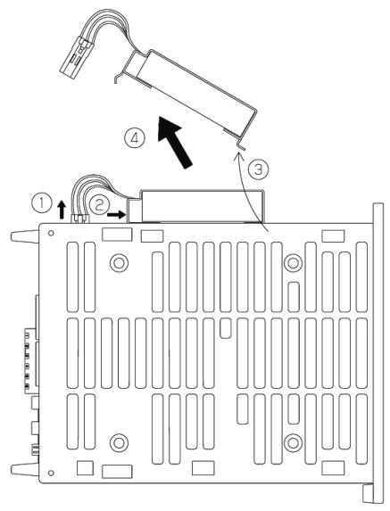

<details>
<summary>text_image</summary>

Technical diagram of a device rear panel with labeled components and directional arrows indicating assembly or movement.
</details>

更换风扇电机时，注意风扇电机的朝向以及电缆拉出位置  
风扇电机
吹处方向  
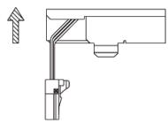

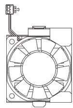  
风扇单元

风扇单元安装用切口孔  
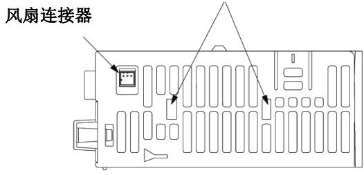

<details>
<summary>text_image</summary>

风扇连接器
</details>

(2) $\beta i\mathrm{SV}40 - \mathrm{B},\beta i\mathrm{SV}80 - \mathrm{B},\beta i\mathrm{SV}10\mathrm{HV - B},\beta i\mathrm{SV}20\mathrm{HV - B},\beta i\mathrm{SV}40\mathrm{HV - B},\beta i\mathrm{SV}20 / 20 - \mathrm{B}$ 的内部冷却风扇单元拆除方法

(1) 抓住风扇单元的 2 处卡爪，沿箭头方向(图中上方向)提起。

抓住风扇单元的卡爪（2处），向着箭头方向（图中的上方向）提起  
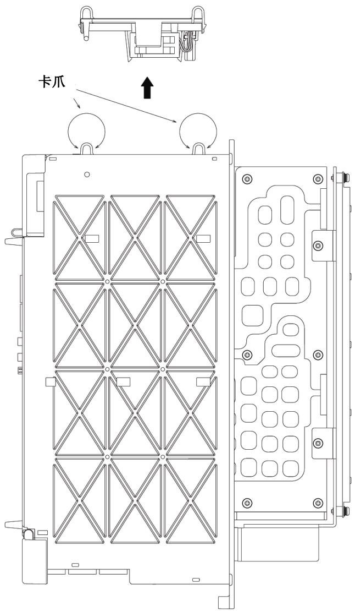

<details>
<summary>text_image</summary>

卡爪
</details>

更换风扇电机时，注意风扇电机本体的朝向以及连接器的朝向  
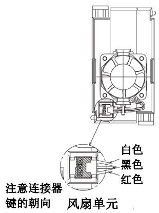

<details>
<summary>text_image</summary>

注意连接器
键的朝向 风扇单元
白色
黑色
红色
</details>

## (3) $\beta iSV40/40-B$ 的风扇单元拆除方法

(1) 抓住风扇单元的卡爪（2处），向着头方向(图中的上方向)提起。

抓住风扇单元的卡爪（2处），向着箭头方向（图中的上方向）提起  
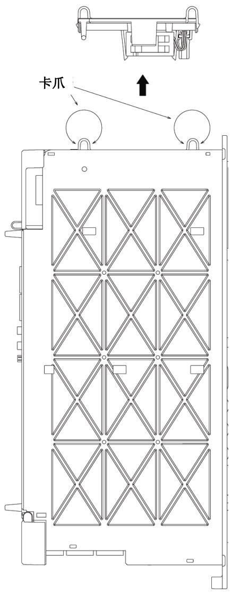

<details>
<summary>text_image</summary>

卡爪
</details>

更换风扇电机时，注意风扇电机本体的朝向以及连接器的朝向  
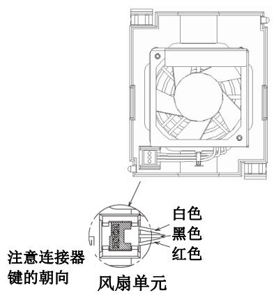

<details>
<summary>text_image</summary>

注意连接器
键的朝向
风扇单元
白色
黑色
红色
</details>

## (4) $\beta iSV80-B$ , $\beta iSV40HV-B$ 的散热器冷却风扇单元拆除方法

(1) 拧下金属板安装螺丝（4 个），拉出风扇单元。

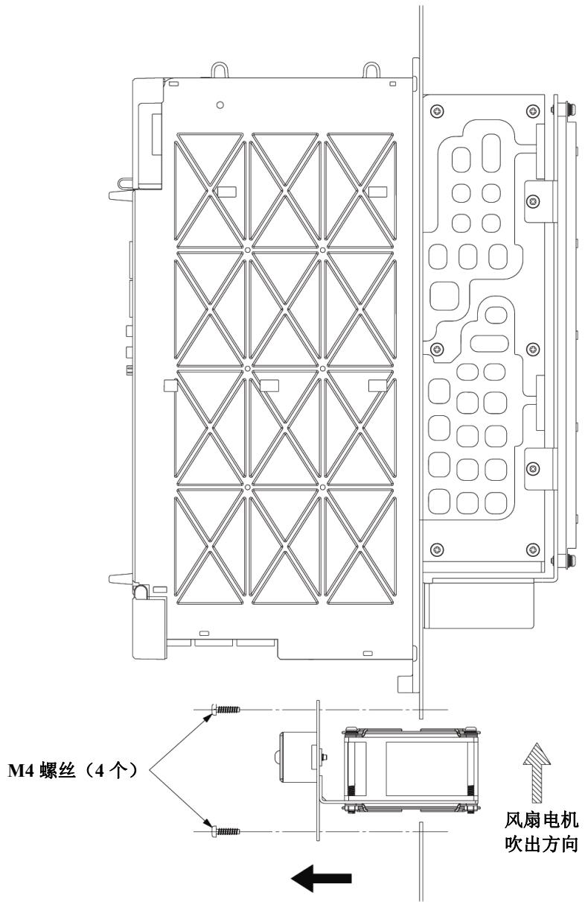

<details>
<summary>text_image</summary>

M4螺丝（4个）
风扇电机
吹出方向
</details>

## (5) 从风扇单元拆除风扇电机的方法（ $\beta iSV4-B, \beta iSV20-B$ ）

## (a) A06B-6134-K003

(1) 以使风扇电机的一侧（壳体上没有制动器的一侧）从盖板离开的方式提起，一边提起一边从壳体的制动器方向向着风扇电机中心推压。

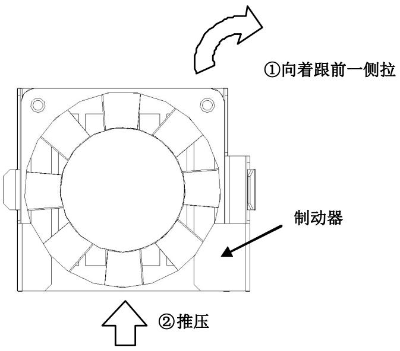

<details>
<summary>text_image</summary>

①向着跟前一侧拉
制动器
②推压
</details>

更换风扇电机时，注意风扇电机本体的朝向（安装到放大器上时，标牌在上侧）

## (b) A06B-6134-K005

(1) 一边拉其中一方壳体的卡爪，一边利用螺丝刀等工具拆除风扇。

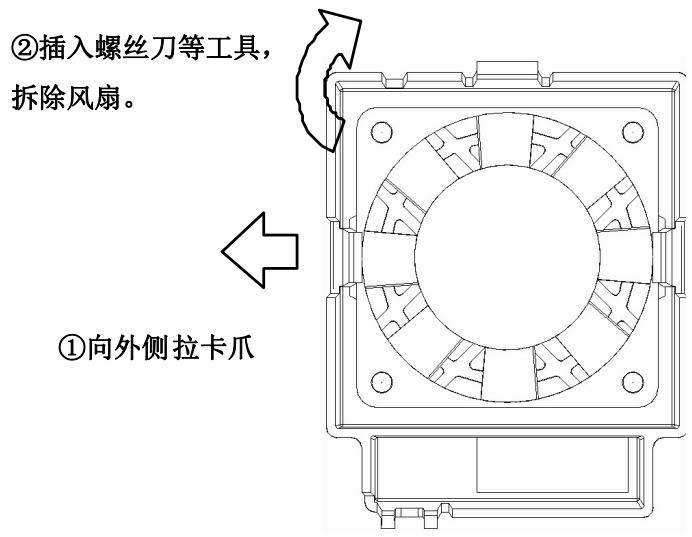

<details>
<summary>text_image</summary>

②插入螺丝刀等工具，
拆除风扇。
①向外侧拉卡爪
</details>

更换风扇电机时，注意风扇电机本体的朝向（安装到放大器上时，标牌在上侧）

## (6) 从风扇单元拆除风扇电机的方法（ $\beta i$ SV40-B, $\beta i$ SV80-B, $\beta i$ SV10HV-B, $\beta i$ SV20HV-B, $\beta i$ SV40HV-B, $\beta i$ SV20/20-B）

## (1) 从壳体上拆除连接器。

①将一字形螺丝刀等工具插入壳体和连接器之间。  
②使得已插入的螺丝刀等工具倾斜。

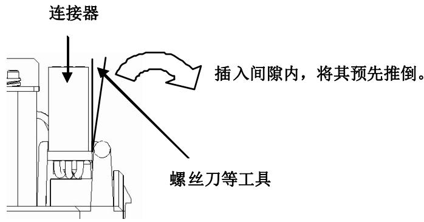

<details>
<summary>text_image</summary>

连接器
插入间隙内，将其预先推倒。
螺丝刀等工具
</details>

## (2) 以打开壳体的卡爪的方式拉动，拆除连接器

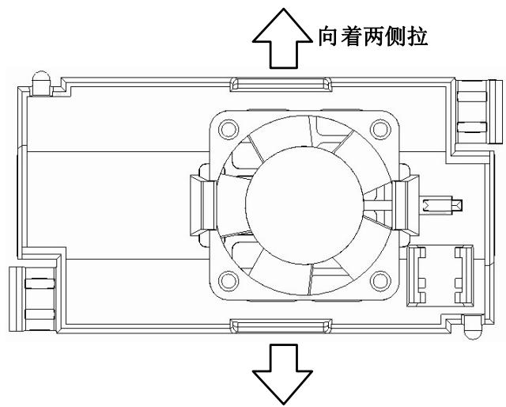

<details>
<summary>text_image</summary>

向着两侧拉
</details>

更换风扇电机时，注意风扇电机本体的朝向（安装到放大器上时，标牌在上侧）、连接器的朝向

## (7) 从风扇单元拆除风扇电机的方法（ $\beta i$ SV40/40-B）

## (1) 从壳体上拆除连接器。

①将一字形螺丝刀等工具插入壳体和连接器之间。  
②使得已插入的螺丝刀等工具倾斜。

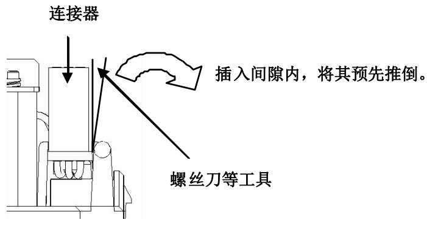

<details>
<summary>text_image</summary>

连接器
插入间隙内，将其预先推倒。
螺丝刀等工具
</details>

## (2) 拧下固定着风扇电机的螺丝（2 处）。

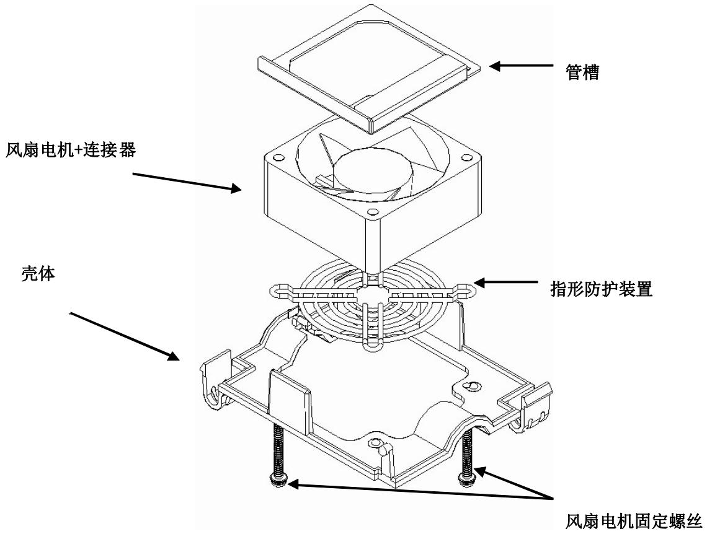

<details>
<summary>text_image</summary>

管槽
风扇电机+连接器
壳体
指形防护装置
风扇电机固定螺丝
</details>

更换风扇电机时，风扇电机本体的朝向（安装到放大器上时，标牌在上侧）、连接器的朝向、管槽的朝向（折叠与连接器相反的一侧）

## (8) 维护用风扇单元的图号

(1) 1 轴


### PMC报警: 型号名
- **故障内容**: 内部冷却风扇
- **处理办法**: 散热器冷却风扇

### PMC报警: 风扇单元
- **故障内容**: 风扇电机
- **处理办法**: 风扇单元

### PMC报警: βiSV 4-BβiSV 20-B
- **故障内容**: A06B-6134-K003(金属板类型)A06B-6134-K005(树脂类型)
- **处理办法**: A90L-0001-0423#50

### PMC报警: βiSV 40-B
- **故障内容**: A06B-6110-C605
- **处理办法**: A90L-0001-0510

### PMC报警: βiSV 80-B
- **故障内容**: A06B-6110-C605
- **处理办法**: A90L-0001-0510

### PMC报警: βiSV 10HV-BβiSV 20HV-B
- **故障内容**: A06B-6110-C605
- **处理办法**: A90L-0001-0510

### PMC报警: βiSV 40HV-B
- **故障内容**: A06B-6110-C605
- **处理办法**: A90L-0001-0510


(2) 2 轴


### PMC报警: 型号名
- **故障内容**: 内部冷却风扇
- **处理办法**: 散热器冷却风扇

### PMC报警: 风扇单元
- **故障内容**: 风扇电机
- **处理办法**: 风扇单元

### PMC报警: βiSV 20/20-B(A06B-6166-H201)
- **故障内容**: A06B-6110-C605
- **处理办法**: A90L-0001-0510

### PMC报警: βiSV 20/20-B(A06B-6166-H201#A)
- **故障内容**: -
- **处理办法**: -

### PMC报警: βiSV 40/40-B
- **故障内容**: A06B-6110-C641
- **处理办法**: A90L-0001-0569


## 【βi SVSP-B 系列】

## (1) 风扇单元拆除方法

(1) 解除 DC 链路端子台盖板的开闭锁定，打开 DC 链路端子台盖板，确认 DC 链路的放电（LED 已灭灯），拆除 DC 链路短路条。  
(2) 从 DC 链路端子台旁的开口部插入螺丝刀，拧松风扇单元下侧的螺丝（3 处）。  
(3) 拧松风扇单元上侧的螺丝（3 处）。  
(4) 打开 DC 链路端子台盖板，向跟前一侧拉出风扇单元。  
(5) 安装时，按照与上述相反的步骤进行。

(1)  
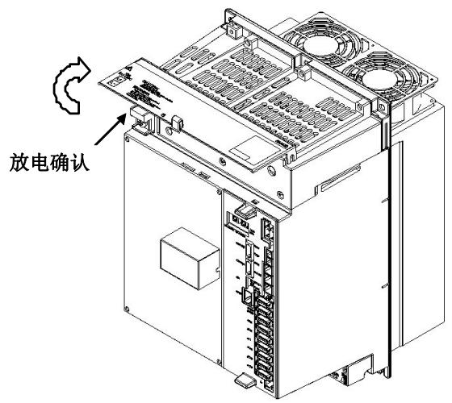

<details>
<summary>text_image</summary>

放电确认
</details>

(2)  
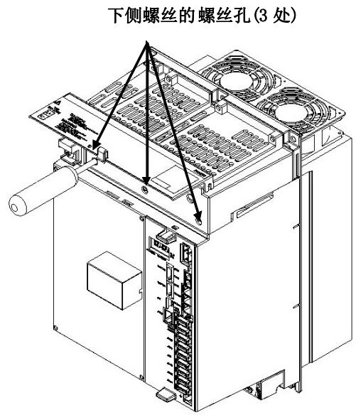

<details>
<summary>text_image</summary>

下侧螺丝的螺丝孔(3处)
</details>

(3)  
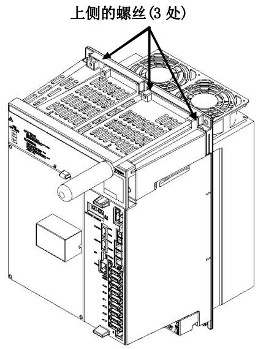

<details>
<summary>text_image</summary>

上侧的螺丝(3处)
</details>

(4)  
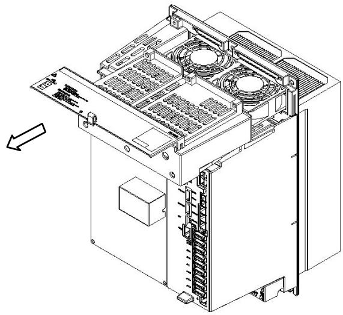

<details>
<summary>natural_image</summary>

Technical line drawing of an internal server rack with cooling fans and ventilation slots (no text or labels)
</details>

## (2) 从风扇单元拆除风扇电机的方法

(1) 从风扇的连接器上拆除中继连接器。详情请参阅下图。

① 将 3mm 以下的一字形螺丝刀插入壳体和连接器的间隙中。  
② 使得一字形螺丝刀向着箭头的方向倾斜。  
③ 向着箭头方向拆除连接器。

①  
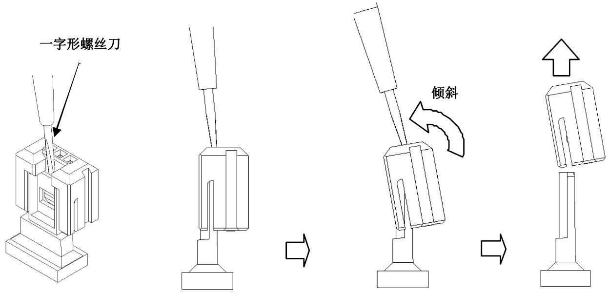

<details>
<summary>text_image</summary>

一字形螺丝刀
倾斜
</details>

(2) 拧下固定着风扇电机的螺丝（2处或者4处）。  
(3) 拧下固定着风扇电机连接器的螺丝（2处）。

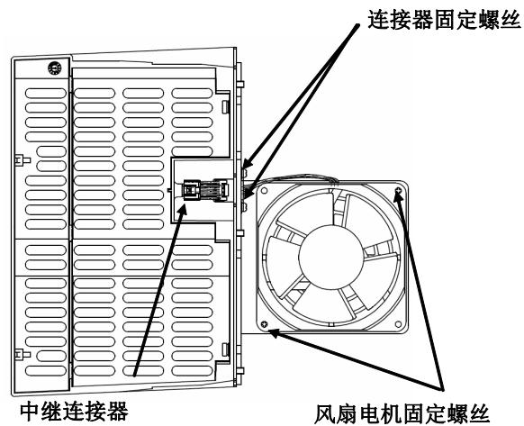

<details>
<summary>text_image</summary>

连接器固定螺丝
中继连接器
风扇电机固定螺丝
</details>

1个风扇电机的情形  
(自放大器下表面看的图)

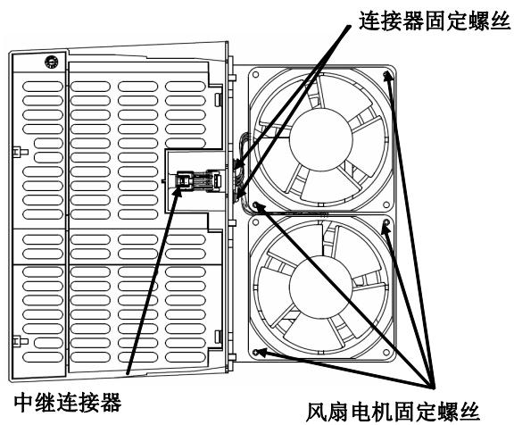

<details>
<summary>text_image</summary>

连接器固定螺丝
中继连接器
风扇电机固定螺丝
</details>

2个风扇电机的情形  
(自放大器下表面看的图)

## (3) 维护用风扇单元、风扇电机的图号


### PMC报警: 型号名
- **故障内容**: 内部冷却风扇
- **处理办法**: 散热器冷却风扇

### PMC报警: 风扇单元
- **故障内容**: 风扇电机
- **处理办法**: 风扇单元

### PMC报警: βiSVSP 20/20-7.5-BβiSVSP 20/20-11-BβiSVSP 40/40-15-BβiSVSP 20/20/40-7.5-BβiSVSP 20/20/40-11-BβiSVSP 40/40/40-11-BβiSVSP 40/40/40-15-BβiSVSP 40/40/80-15-B
- **故障内容**: -
- **处理办法**: -

### PMC报警: βiSVSP 40/40-18-BβiSVSP 80/80-18-BβiSVSP 40/40/80-18-BβiSVSP 80/80/80-18-B
- **故障内容**: -
- **处理办法**: -


## 11.3.3.3 更换印刷电路板上的保险丝

## 【αi-B 系列】

$\alpha i$ 系列可从伺服放大器正面插拔控制印刷电路板。

插拔控制印刷电路板的作业，共同电源、伺服放大器、主轴放大器全部相同。

## 注释

1 保险丝烧断时，可能是因为连接到伺服放大器的其他设备(传感器等)的电源短路所致。

请先确认其他设备有无异常后再更换。

如果无法排除原因，保险丝再度烧断的可能性很大。

2 不要使用非 FANUC 提供的保险丝。  
3 要对照印刷电路板上的标注与产品上的标记，不要弄错保险丝的额定值。  
4 DC24V 电源输入用连接器（CXA2D）、或者、放大器间通信用连接器(CXA2A/B)的 24V 与 0V 的线路入如果反向连接，保险丝将会熔断。

[对策]

1. 更换保险丝。  
2. 进行正确连接。

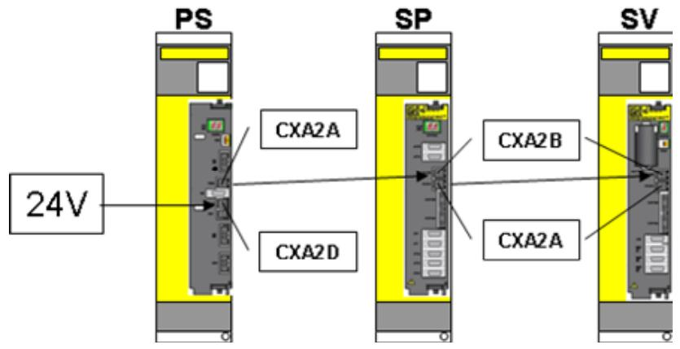

<details>
<summary>text_image</summary>

24V
PS
CPX2A
CPX2D
SP
CPX2B
CPX2A
SV
</details>

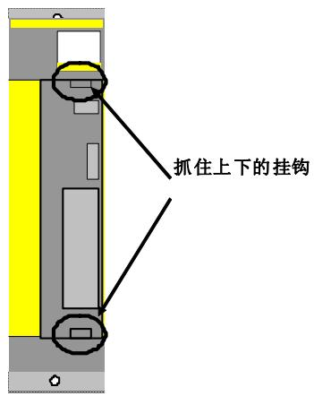

<details>
<summary>text_image</summary>

抓住上下的挂钩
</details>

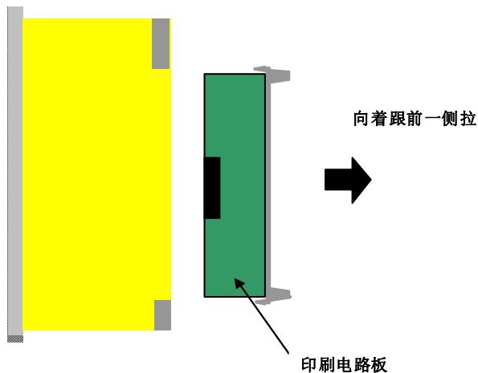

<details>
<summary>text_image</summary>

向着跟前一侧拉
印刷电路板
</details>

步骤与插入印刷电路板时相反。请确认上下的挂钩已“咔哒”一声扣紧外壳。没有扣紧时外壳会翘起，此时，请再次拔出，重新插入。

## (1) 共同电源

共同电源的印刷电路板上装有一种保险丝。


### PMC报警: 部件编号
- **故障内容**: 发那科图号
- **处理办法**: 额定值

### PMC报警: FU1
- **故障内容**: A60L-0001-0290#LM32C
- **处理办法**: 3.2A/48V


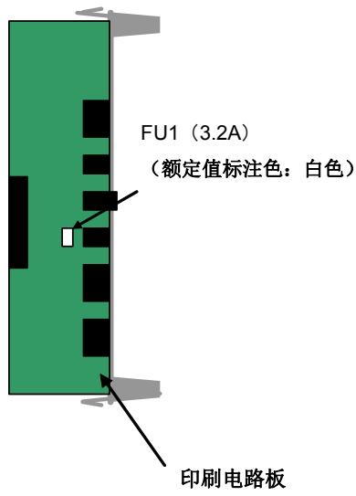

<details>
<summary>text_image</summary>

FU1 (3.2A)
(额定值标注色: 白色)
印刷电路板
</details>

## (2) 伺服放大器

伺服放大器的印刷电路板上装有一种保险丝。


### PMC报警: 部件编号
- **故障内容**: 发那科图号
- **处理办法**: 额定值

### PMC报警: FU1
- **故障内容**: A60L-0001-0290#LM32C
- **处理办法**: 3.2A/48V


(1) 60/90mm 宽伺服放大器

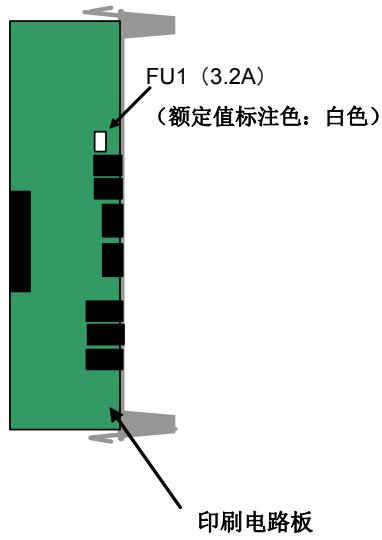

<details>
<summary>text_image</summary>

FU1 (3.2A)
(额定值标注色: 白色)
印刷电路板
</details>

## (3) 主轴放大器

主轴放大器的印刷电路板上装有一种保险丝。


### PMC报警: 部件编号
- **故障内容**: 发那科图号
- **处理办法**: 额定值

### PMC报警: F1
- **故障内容**: A60L-0001-0290#LM32C
- **处理办法**: 3.2A/48V


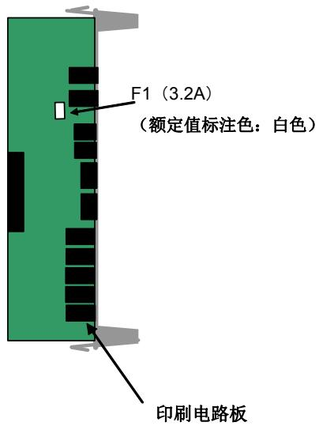

<details>
<summary>text_image</summary>

F1 (3.2A)
(额定值标注色: 白色)
印刷电路板
</details>

## (4) 伺服主轴多軸放大器

伺服主轴多轴放大器的印刷电路板上装有一种保险丝。


### PMC报警: 部件编号
- **故障内容**: 发那科图号
- **处理办法**: 额定值

### PMC报警: F1
- **故障内容**: A60L-0001-0290#LM32C
- **处理办法**: 3.2A/48V


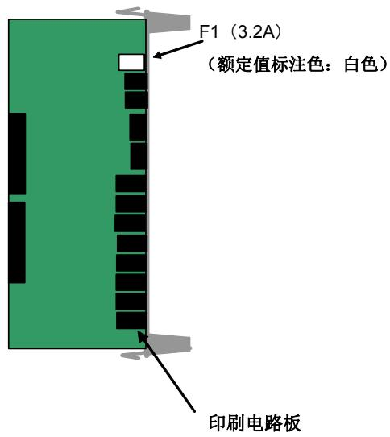

<details>
<summary>text_image</summary>

F1 (3.2A)
(额定值标注色: 白色)
印刷电路板
</details>

## 【βi SV-B 系列】

βi SV 系列可从伺服放大器正面插拔控制印刷电路板。

插拔控制印刷电路板的作业，与 $\alpha i$ 系列相同。

## 注释

1 保险丝烧断时，可能是因为连接到伺服放大器的其他设备(传感器等)的电源短路所致。  
请先确认其他设备有无异常后再更换。  
如果无法排除原因，保险丝再度烧断的可能性很大。

2 不要使用非 FANUC 提供的保险丝。

3 要对照印刷电路板上的标注与产品上的标记，不要弄错保险丝的额定值。

4. DC24V 电源输入用连接器（CXA19B/A）的 24V 与 0V 的线路若反向连接，保险丝将会熔断。

[对策]

1. 更换保险丝。  
2. 进行正确连接。

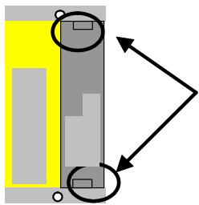

<details>
<summary>flowchart</summary>

```mermaid
graph TD
  A["Top"] --> B{Decision}
  B -->|Yes| C["Process"]
  B -->|No| D["End"]
```
</details>

抓住上下的挂钩

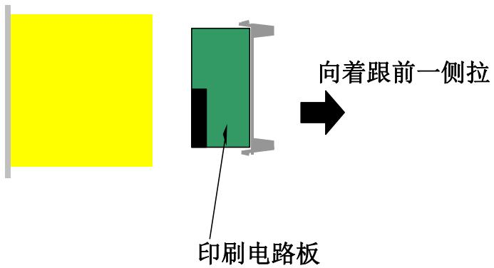

<details>
<summary>text_image</summary>

向着跟前一侧拉
印刷电路板
</details>

步骤与插入印刷电路板时相反。请确认上下的挂钩已“咔哒”一声扣紧外壳。没有扣紧时外壳会翘起，此时，请再次拔出，重新插入。

βiSV-B 的印刷电路板上装有一种保险丝。


### PMC报警: 部件编号
- **故障内容**: 发那科图号
- **处理办法**: 额定值

### PMC报警: FU1
- **故障内容**: A60L-0001-0290#LM32C
- **处理办法**: 3.2A/48V


(1) 1 轴βiSV-B  
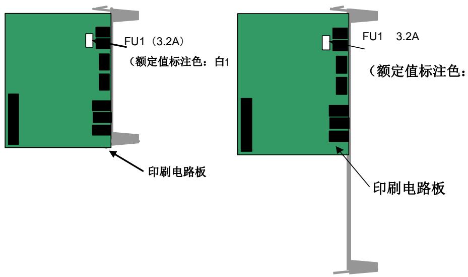

<details>
<summary>text_image</summary>

FU1 (3.2A)
(额定值标注色: 白1
印刷电路板
FU1 3.2A
(额定值标注色:
印刷电路板
</details>

(2) 2 轴βiSV-B

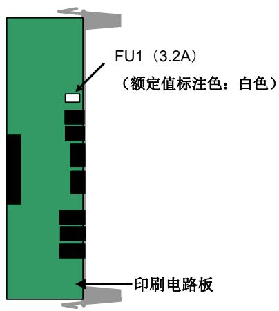

<details>
<summary>text_image</summary>

FU1 (3.2A)
(额定值标注色: 白色)
印刷电路板
</details>

## 【βi SVSP-B 系列】

βi SVSP 系列可从伺服放大器正面插拔控制印刷电路板。

插拔控制印刷电路板的作业，与 $\alpha i$ 系列相同。

## 注释

1 保险丝烧断时，可能是因为连接到伺服放大器的其他设备(传感器等)的电源短路所致。  
请先确认其他设备有无异常后再更换。  
如果无法排除原因，保险丝再度烧断的可能性很大。  
2 不要使用非 FANUC 提供的保险丝。  
3 要对照印刷电路板上的标注与产品上的标记，不要弄错保险丝的额定值。  
4 DC24V 电源输入用连接器（CXA2C）、或者、放大器间通信用连接器(CXA2A/B)的 24V 与 0V 的线路入如果反向连接，保险丝将会熔断。  
[对策]  
1. 更换保险丝。  
2. 进行正确连接。  
1. 更换保险丝。
2. 进行正确连接。

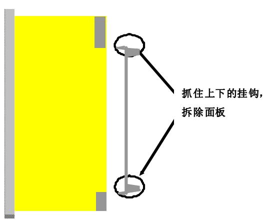

<details>
<summary>text_image</summary>

抓住上下的挂钩，
拆除面板
</details>

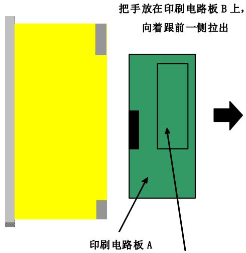

<details>
<summary>text_image</summary>

把手放在印刷电路板B上，
向着跟前一侧拉出
印刷电路板A
</details>

印刷电路板B

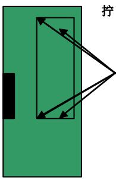

<details>
<summary>flowchart</summary>

```mermaid
graph TD
  A["Start"] --> B{拧}
  B --> C["End"]
    style A fill:#99ccff,stroke:#333
    style B fill:#99ccff,stroke:#333
    style C fill:#99ccff,stroke:#333
```
</details>

拧下固定着两块印刷电路板的螺丝，拆  
除印刷电路板 B  
螺丝固定位置

步骤与插入印刷电路板时相反。请确认上下的挂钩已“咔哒”一声扣紧外壳。没有扣紧时外壳会翘起，此时，请再次拔出，重新插入。

βiSVSP-B 的印刷电路板上装有一种保险丝。


### PMC报警: 部件编号
- **故障内容**: 发那科图号
- **处理办法**: 额定值

### PMC报警: FU2
- **故障内容**: A60L-0001-0290#LM50C
- **处理办法**: 5.0A/48V


FU2（5.0A）（额定值标注色：白色）  
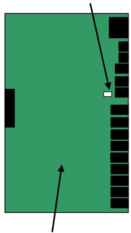

<details>
<summary>natural_image</summary>

Green circuit board with black components and directional arrows indicating flow or movement (no text or symbols)
</details>

印刷电路板 A

附录

## A

## 报警列表

## A.1 报警列表（CNC）....537

(1) 与程序操作相关的报警（PS报警）....537  
(2) 与后台编辑相关的报警（BG报警）....537  
(3) 与通信相关的报警（SR报警）....537  
(4) 参数写入状态下的报警（SW报警）....564  
(5) 伺服报警（SV报警）....564  
(6) 与超程相关的报警（OT报警）....569  
(7) 与存储器文件相关的报警（IO报警）....570  
(8) 请求切断电源的报警（PW报警） 570  
(9) 与主轴相关的报警（SP报警）....572  
(10) 过热报警（OH报警）....574  
(11) 其他报警（DS报警）....574  
(12) 与错误操作防止功能相关的报警（IE报警）....578

## A.2 报警列表(PMC)....580

A.2.1 显示在PMC报警画面的信息....580  
A.2.2 PMC系统报警信息....587

## A.3 报警列表(串行主轴)....592

## A.4 错误代码列表(串行主轴)....600

## A.1

## 报警列表（CNC）

(1) 与程序操作相关的报警（PS 报警）  
(2) 与后台编辑相关的报警（BG 报警）  
(3) 与通信相关的报警（SR 报警）

这些报警种类的报警号为公用的编号。

根据报警的状态，以

PS “报警号” 例）PS0003

BG “报警号” 例）BG0085

SR “报警号” 例）SR0001

的方式予以显示。


### PMC报警: 报警号
- **故障内容**: 信息
- **处理办法**: 内容

### PMC报警: 0001
- **故障内容**: TH 错误
- **处理办法**: 输入设备的读入过程中检测出了 TH 错误。引起 TH 错误的读入代码和是从程序段数起的第几个字符,可通过诊断画面进行确认。

### PMC报警: 0002
- **故障内容**: TV 校验错误
- **处理办法**: 在单程序段的 TV 检查中检测出了错误。通过将参数 TVC(No.0000#0)设定为 0 可以使系统不进行 TV 检查。

### PMC报警: 0003
- **故障内容**: 数位太多
- **处理办法**: 指定了比 NC 指令的字更多的容许位数。此容许位数根据功能和地址而有所不同。

### PMC报警: 0004
- **故障内容**: 程序的开头无地址
- **处理办法**: NC 语句的地址+数值不属于字格式。或者在用户宏程序中没有保留字、或不符合句法时也会发出此报警。

### PMC报警: 0005
- **故障内容**: 地址后无数据
- **处理办法**: 不是 NC 语句的地址+数值的字格式。或者用户宏程序中没有保留字、或不符合句法时会发出此报警。

### PMC报警: 0006
- **故障内容**: 负号使用非法
- **处理办法**: 在 NC 指令的字、系统变量中指定了负号。

### PMC报警: 0007
- **故障内容**: 小数点使用非法
- **处理办法**: 在不允许使用小数点的地址中指定了小数点。或者指定了 2 个或更多个小数点。

### PMC报警: 0009
- **故障内容**: NC 地址不对
- **处理办法**: 指定了不可在 NC 语句中指定的地址。或者尚未设定参数 (No.1020)。

### PMC报警: 0010
- **故障内容**: G 代码不正确
- **处理办法**: 指定了不可使用的 G 代码。

### PMC报警: 0011
- **故障内容**: 切削速度为0(未指令)
- **处理办法**: 1)切削进给速度的指令F代码被设定为0。2)刚性攻丝指令时,F指令相对于S指令非常小的情况下,由于刀具不能在编程的导程下进行切削,因此会发出此报警。

### PMC报警: 0015
- **故障内容**: 同时控制轴数太多
- **处理办法**: 发出了比可同时控制的轴数多的移动指令。请附加同时控制轴的扩展选项,或将程序指令的移动轴分割为两个程序段。

### PMC报警: 0020
- **故障内容**: 半径值超差
- **处理办法**: 指定了起点端和终点端的半径值之差比参数(No.3410)的设定值更大的圆弧。请检查程序的圆弧中心指令I、J、K。使参数(No.3410)的值变大情况下的移动路径,成为螺旋形状。

### PMC报警: 0021
- **故障内容**: 非法平面选择
- **处理办法**: 平面选择G17~G19有误。重新审视程序,检查是否没有同时指定基本3轴的平行轴。在圆弧插补情形下,如果包含平面选择以外的轴指令,会发出此报警。要指定3轴或更多轴的指令时,需要有与其分别对应的螺旋插补选项。

### PMC报警: 0022
- **故障内容**: 未发现R或I,J,K指令
- **处理办法**: 在圆弧插补中,没有设定R(弧半径)或I、J和K(从起点到弧心的距离)。

### PMC报警: 0025
- **故障内容**: 在快速移动方式圆弧切削
- **处理办法**: 在圆弧插补方式(G02、G03)下,指定了F0(F1位进给或者反向进给的快速移动)。

### PMC报警: 0027
- **故障内容**: G43/G44中没有轴指令
- **处理办法**: 在G43/G44程序段中没有为C型刀具长度补偿指定轴。没有取消偏置,但是另一个轴试图进行C型刀具长度补偿。在相同程序段中为C型刀具长度补偿指定了多个轴指令。

### PMC报警: 0029
- **故障内容**: 刀偏值非法
- **处理办法**: 偏置号不正确。

### PMC报警: 0030
- **故障内容**: 刀偏号非法
- **处理办法**: 指定了不可指定的偏置号。

### PMC报警: 0031
- **故障内容**: G10中的P指令非法
- **处理办法**: G10的L号中没有所属的数据输入或与之对应的选项。没有数据设定地址P、R等的指令。存在着与数据设定无关的地址指令。根据L号,指定的地址分别不同。指令地址值的符号、小数点、范围有误。

### PMC报警: 0032
- **故障内容**: G10中的刀偏值非法
- **处理办法**: 在偏置值程序输入(G10)中,或在用系统变量写入偏置值时,指定的偏置值过大。

### PMC报警: 0033
- **故障内容**: G41/G42无交点
- **处理办法**: 不能为刀具径补偿或刀尖半径补偿求出交点。请修改程序。

### PMC报警: 0034
- **故障内容**: 在起刀/退刀段不允许切圆弧
- **处理办法**: 在刀具径补偿或刀尖半径补偿中,试图在G02/G03方式下执行启动或取消指令。请修改程序。

### PMC报警: 0035
- **故障内容**: 不能指令G31
- **处理办法**: 处在不可指定G31的状态。不能取消组07的G代码(刀具径补偿或刀尖半径补偿等)时,会发出此报警。在扭矩极限跳转指令(G31P98/P99)中尚未指定扭矩极限。请在PMC窗口等中指定,或者在地址Q中指定扭矩极限倍率的指令。

### PMC报警: 0037
- **故障内容**: G41/G42中不能改变平面
- **处理办法**: 在刀具径补偿或刀尖半径补偿中切换到补偿平面G17/G18/G19。请修改程序。

### PMC报警: 0041
- **故障内容**: G41/G42中发生干涉
- **处理办法**: 在刀具径补偿或刀尖半径补偿中会出现过切。请修改程序。

### PMC报警: 0042
- **故障内容**: CRC中不允许G45/G48
- **处理办法**: 在刀具径补偿方式下,指定了刀具位置补偿(G45~G48)。请修改程序。

### PMC报警: 0044
- **故障内容**: 固定循环中不允许指令G27-G30
- **处理办法**: 在固定循环方式中指定了G27~G30。请修改程序。

### PMC报警: 0045
- **故障内容**: 在(G73/G83)中未找到地址Q
- **处理办法**: 在高速钻深孔循环(G73)、钻深孔循环(G83)中,没有基于地址Q指定每次的进刀量,或者指定了Q0。请修改程序。

### PMC报警: 0046
- **故障内容**: 第2,3,4参考点返回指令非法
- **处理办法**: 第2、第3、第4参考点返回指令有误。(地址P指定有误。)

### PMC报警: 0047
- **故障内容**: 坐标轴选择非法
- **处理办法**: 在三维坐标变换的启动时,指定了两个或更多个相同方向的轴(基准轴和平行轴)。

### PMC报警: 0048
- **故障内容**: 未找到基本3轴
- **处理办法**: 在三维坐标变换的启动时,省略Xp、Yp和Zp时使用的三个基准轴在参数(No.1022)中进行设定。

### PMC报警: 0049
- **故障内容**: 非法指令(G68/G69)
- **处理办法**: 在指定三维坐标变换(G68、G69)时,尚未取消刀具长度补偿。或者,三维坐标变换(G68、G69)与刀具长度补偿(G43、G44、G49)的指令没有相互嵌套。或者在刀具长度补偿中指定了三维坐标变换,进而又指定了刀具长度补偿的指令。

### PMC报警: 0050
- **故障内容**: 在第3段不允许倒角/拐角
- **处理办法**: 在螺纹切削的程序段中,指定了倒角或倒圆指令。请修改程序。

### PMC报警: 0051
- **故障内容**: 倒角/倒圆后无移动
- **处理办法**: 指定倒角、倒圆的程序段的下一程序段中移动或移动量不恰当。重新审视程序指令。

### PMC报警: 0052
- **故障内容**: 倒角/拐角后不是G01
- **处理办法**: 指定了紧跟倒角/倒圆的程序段不是G01(或者垂直的直线)。请修改程序。

### PMC报警: 0053
- **故障内容**: 地址指令太多
- **处理办法**: 在倒角/倒圆指令中,指定了2个或更多个I、J、K、R。

### PMC报警: 0054
- **故障内容**: 倒角/拐角后不允许锥型加工
- **处理办法**: 指定了倒角/倒圆的程序段中含有圆锥指令。请修改程序。

### PMC报警: 0055
- **故障内容**: 倒角/倒圆后无移动值
- **处理办法**: 在指定了倒角/倒圆的程序段中,移动量小于倒角/倒圆的值。请修改程序。

### PMC报警: 0056
- **故障内容**: 倒角/拐角中无终点或角度值
- **处理办法**: 在图纸尺寸直接输入中,在只指定角度(Aa)的程序段后面的程序段指令中没有终点位置指令,也没有角度指令。请修改程序。

### PMC报警: 0057
- **故障内容**: 不能计算出程序段终点
- **处理办法**: 在图纸尺寸直接输入中,没有正确计算程序段的终点。请修改程序。

### PMC报警: 0058
- **故障内容**: 找不到终点
- **处理办法**: 在图纸尺寸直接输入的程序中,没有找到程序段的终点。请修改程序。

### PMC报警: 0060
- **故障内容**: 找不到顺序号
- **处理办法**: [外部数据输入/输出]在程序号、顺序号搜索中没有指定的编号。虽然有刀具数据的筒号或偏置量输入/输出请求,但在通电后尚未执行一次刀具号输入。没有对应于所输入的刀具号的刀具数据。[外部工件号搜索]扎不到与指定的工件号对应的程序。[程序再启动]在程序再启动顺序号指定中,没有找到指定的顺序号。

### PMC报警: 0061
- **故障内容**: 多重循环程序段中未指令P或Q
- **处理办法**: 复合型固定循环(G70、G71、G72、G73)指令程序段中没有指定地址P或Q。

### PMC报警: 0062
- **故障内容**: 粗车循环中切削量无效
- **处理办法**: 复合型固定循环的粗削循环(G71、G72)中切削量为0或者负。

### PMC报警: 0063
- **故障内容**: 未找到指定顺序号的程序段
- **处理办法**: 在复合型固定循环(G70、G71、G72、G73)指令程序段的P、Q中找不到指定顺序号的程序段。

### PMC报警: 0064
- **故障内容**: 精车形状不是单调变化的
- **处理办法**: 复合型固定循环的粗削循环(G71、G72)的形状程序中,平面第1轴的指令不是单调增加或者单调减少。

### PMC报警: 0065
- **故障内容**: 形状程序的第1段不是G00/G01
- **处理办法**: 由复合型固定循环(G70、G71、G72、G73)的P指定的形状程序的开头程序段中尚未指定G00或者G01

### PMC报警: 0066
- **故障内容**: 多重循环程序段有不允许的指令
- **处理办法**: 复合型固定循环(G70、G71、G72、G73)的指令程序段中不可使用的指令。

### PMC报警: 0067
- **故障内容**: 多重循环指令不在零件程序存储区中
- **处理办法**: 复合型固定循环(G70、G71、G72、G73)的指令尚未记录到程序存储区。

### PMC报警: 0069
- **故障内容**: 形状程序的最后程序段是无效指令
- **处理办法**: 复合型固定循环(G70、G71、G72、G73)的形状程序的最终程序段的指令处在倒角/倒圆指令的中途。

### PMC报警: 0070
- **故障内容**: 存储器无程序空间
- **处理办法**: 存储器的存储空间不足。删除不需要的程序,然后重新进行程序记录。

### PMC报警: 0071
- **故障内容**: 数据未找到
- **处理办法**: 找不到要搜索的地址数据。在外部程序号搜索中,找不到指定的程序号。在程序再启动的程序段号指定中,找不到指定的程序段号。重新检查将被搜索的数据。

### PMC报警: 0072
- **故障内容**: 程序太多
- **处理办法**: 登录的程序数超出了最大数。删除不必要的程序,重新进行程序记录。

### PMC报警: 0073
- **故障内容**: 程序号已使用
- **处理办法**: 试图记录一个与已被记录的程序号相同的程序号。改变程序或删除不需要的程序,重新进行程序记录。

### PMC报警: 0074
- **故障内容**: 程序号非法
- **处理办法**: 程序号超出1~9999的范围。请修改程序号。

### PMC报警: 0075
- **故障内容**: 保护
- **处理办法**: 试图用被保护的号码登录程序。在程序的核对中,加密程序的密码不同。试图在主程序中选择后台编辑中的程序。试图通过子程序调用后台编辑中的程序。

### PMC报警: 0076
- **故障内容**: 程序未找到
- **处理办法**: 子程序调用/宏程序调用/图形复制中没有指定的程序。M/G/T/S代码被M98、G65、G66、G66.1、中断型用户宏程序的P指令以外的指令调用,程序被第2辅助功能代码调用。在这些调用中没有程序时,也会发出此报警。

### PMC报警: 0077
- **故障内容**: 子程序,宏程序调用嵌套层数太多
- **处理办法**: 超出了子程序调用和用户宏程序调用的嵌套最大值。外部存储器或子程序调用中又指定了子程序调用。

### PMC报警: 0078
- **故障内容**: 顺序号未找到
- **处理办法**: 在顺序号搜索中,找不到指定的顺序号。找不到以GOTO--、M99P--指定的跳转目的地的顺序号。

### PMC报警: 0079
- **故障内容**: 存储卡和内存中程序不一致
- **处理办法**: 试图读入的程序无法与存储器内的程序进行核对。参数NPE(No.3201#6)设定为1时,不可连续核对多个程序。在将参数NPE(No.3201#6)设定为0后进行核对。

### PMC报警: 0080
- **故障内容**: G37测量位置到达信号输入错误
- **处理办法**: ·加工中心系统的情形在刀具长度自动测量功能(G37)中,测量位置到达信号在参数(No.6254)(ε值)中指定的区域跟前成为“1”。或者一直到最后也没有成为“1”。·车床系统的情形在刀具自动补偿功能(G36、G37)中,用参数(No.6254、6255)(ε值)设定的区域内测量位置到达信号(XAE1、XAE2)不会成为“1”。

### PMC报警: 0081
- **故障内容**: G37中H代码未指定
- **处理办法**: ·加工中心系统的情形在刀具长度自动测量功能下,没有指定H代码就指定了刀具长度自动测量(G37)。请修改程序。·车床系统的情形在刀具自动补偿功能中,没有指定T代码就指定了刀具自动补偿(G36、G37)。请修改程序。

### PMC报警: 0082
- **故障内容**: G37与H代码在同一段指令
- **处理办法**: ·加工中心系统的情形在刀具长度自动测量功能下,H代码和刀具长度自动测量(G37)被指定在相同程序段中。请修改程序。·车床系统的情形在刀具自动补偿功能中,T代码和刀具自动补偿(G36、G37)指定在相同程序段中。请修改程序。

### PMC报警: 0083
- **故障内容**: G37轴指令不正确
- **处理办法**: ·加工中心系统的情形在刀具自动补偿功能(G37)中,错误地指定了轴指令。或移动指令为增量指令。请修改程序。·车床系统的情形在刀具自动补偿功能(G36、G37)中,错误地指定了轴指令。或指令为增量指令。请修改程序。

### PMC报警: 0085
- **故障内容**: 通讯错误
- **处理办法**: 在从连接于RS232C接口1的输入/输出设备读取接收到的字符之前,接收到了下一个字符。用RS232C接口1读入数据时,发生超程、奇偶校验错误或帧错误。输入数据的位数或波特率的设置或I/O设备规格号不正确。

### PMC报警: 0086
- **故障内容**: DR信号关闭
- **处理办法**: 用RS232C接口1输入/输出数据时,I/O设备的待用信号(DR)被切断。可能是因为I/O设备的电源被切断,或没有连接电缆线,或印刷电路板不良。

### PMC报警: 0087
- **故障内容**: 缓冲器溢出
- **处理办法**: 用RS232C接口1向存储器读入数据时,虽然设定读入停止指令,但是,读完10个字符后输入不中断。可能是因为I/O设备或印刷电路板不良。

### PMC报警: 0090
- **故障内容**: 未完成回参考点
- **处理办法**: 1. 参考点返回不能正常进行,一般是因为参考点返回的起点离参考点太近或速度太低。使起点离参考点足够位置,或为参考点返回设定足够快的速度后再执行参考点返回操作。2. 在无法建立原点的状态下,试图执行基于参考点返回的绝对位置检测器的原点设定。手动运行电机,使其旋转1周以上,暂时断开CNC和伺服放大器的电源,然后再进行绝对位置检测器的原点设定。

### PMC报警: 0091
- **故障内容**: 在进给暂停状态不能手动回参考点
- **处理办法**: 在自动运行暂停状态,不能进行手动参考点返回。请在自动运行停止状态或者复位状态下进行手动参考点返回。

### PMC报警: 0092
- **故障内容**: 回零检查(G27)错误
- **处理办法**: G27中指定的轴尚未返回原点。重新审视为返回原点而编写的程序。

### PMC报警: 0094
- **故障内容**: 不允许用P型(COORD CHG)
- **处理办法**: 当程序再启动时,不能设定P型。(自动运行中断后,进行坐标系设置操作。)按照操作说明书进行正确的操作。

### PMC报警: 0095
- **故障内容**: 不允许用P型(EXT OFS CHG)
- **处理办法**: 当程序再启动时,不能设定P型。(自动运行中断后,外部工件偏置值改变。)按照操作说明书进行正确的操作。

### PMC报警: 0096
- **故障内容**: 不允许用P型(WRK OFS CHG)
- **处理办法**: 当程序再启动时,不能设定P型。(自动运行中断后,工件偏置值改变。)按照操作说明书进行正确的操作。

### PMC报警: 0097
- **故障内容**: 不允许用P型(AUTO EXEC)
- **处理办法**: 当程序再启动时,不能设定P型。(接通电源后,紧急停机,或警报器094~097被复位后,没有进行一次自动运行。)请执行自动运行。

### PMC报警: 0098
- **故障内容**: 按顺序返回时发现了G28
- **处理办法**: 接通电源或紧急停机和搜索期间发现G28时之后,指定了程序再启动指令而没有进行参考点返回的操作。请执行参考点返回操作。

### PMC报警: 0099
- **故障内容**: 检索后不允许用MDI执行
- **处理办法**: 在程序再启动的过程中,完成搜索之后,通过MDI下达移动指令。

### PMC报警: 0109
- **故障内容**: G08格式错误
- **处理办法**: 在G08后的P值为0或1以外的数值,或没有指定该数值。

### PMC报警: 0110
- **故障内容**: 溢出:整数
- **处理办法**: 运算过程中整数值超出了容许范围。

### PMC报警: 0111
- **故障内容**: 溢出:浮点
- **处理办法**: 运算过程中小数值(浮动小数点格式数据)超出了容许范围。

### PMC报警: 0112
- **故障内容**: 被0除
- **处理办法**: 在用户宏程序语句的除法运算中数被0除。

### PMC报警: 0114
- **故障内容**: 宏程序表达式格式非法
- **处理办法**: 用户宏程序语句的表达式描述有误。参数程序的格式有误。

### PMC报警: 0115
- **故障内容**: 变量号超限
- **处理办法**: 指定了不可在用户宏程序的局部变量、公共变量或者系统变量中使用的编号。在EGB轴跳转功能或柔性同步控制跳转功能(G31.8)中,指令了不存在的用户宏程序变量号,或者存储跳转位置的用户宏程序变量不足。

### PMC报警: 0116
- **故障内容**: 变量写保护
- **处理办法**: 在表达式的左边使用了只可在用户宏程序语句的表达式的右边使用的变量。

### PMC报警: 0118
- **故障内容**: 括号重数太多
- **处理办法**: 用户宏程序语句的括弧[]的嵌套超出容许范围。[]的嵌套包括函数的[]为5层。

### PMC报警: 0119
- **故障内容**: 变量值超限
- **处理办法**: 用户宏程序的函数的自变量值超出容许范围。

### PMC报警: 0122
- **故障内容**: 宏程序调用重数太多
- **处理办法**: 用户宏程序调用的嵌套超出了容许范围。

### PMC报警: 0123
- **故障内容**: GOTO/WHILE/DO的使用方式非法
- **处理办法**: DNC方式的主程序中有GOTO语句或者WHILE-DO语句。

### PMC报警: 0124
- **故障内容**: 没有“END”语句
- **处理办法**: 找不到与用户宏程序语句的DO指令对应的END指令。

### PMC报警: 0125
- **故障内容**: 宏程序语句格式错误
- **处理办法**: 用户宏程序语句的格式有误。

### PMC报警: 0126
- **故障内容**: DO非法循环数
- **处理办法**: 用户宏程序的DO语句和END语句的编号有误,或者超出了容许范围(1~3)。

### PMC报警: 0127
- **故障内容**: NC, MACRO语句重复
- **处理办法**: NC语句和宏语句指定在同一程序段。

### PMC报警: 0128
- **故障内容**: 非法的宏程序顺序号
- **处理办法**: 在顺序号搜索中,没有发现指定的顺序号。找不到以GOTO--、M99P--指定的跳转目的地的顺序号。

### PMC报警: 0129
- **故障内容**: 用“G”作为变量
- **处理办法**: 在宏程序调用的自变量中使用了无法指令的地址。确认是否为可以在该宏程序调用中进行指令的地址。已将扩展轴名称的轴地址作为自变量指令时,确认参数(No.11647)的设定。

### PMC报警: 0130
- **故障内容**: NC和PMC的轴控指令发生竞争
- **处理办法**: NC指令和PMC轴控制指令相互冲突。请修改程序或者梯形程序。

### PMC报警: 0136
- **故障内容**: 分度台轴不能与其它轴同时指令
- **处理办法**: 在相同程序段指定了主轴定位轴和其他轴。

### PMC报警: 0137
- **故障内容**: M代码和运动指令在同一段
- **处理办法**: 在相同程序段指定了主轴定位轴和其他轴。

### PMC报警: 0139
- **故障内容**: 不能改变 PMC 控制轴
- **处理办法**: 针对 PMC 轴控制中的轴进行了 PMC 轴的选择。

### PMC报警: 0140
- **故障内容**: 程序号已使用
- **处理办法**: 试图在后台选择或删除在前台选择的程序。请正确进行后台编辑的操作。

### PMC报警: 0142
- **故障内容**: 非法缩放比
- **处理办法**: 比例缩放倍率为 0 倍或者大于等于 10000 倍。请修改比例缩放的倍率设定值。(G51P...或者 G51I_J_K...或者参数(No.5411、No.5421))

### PMC报警: 0143
- **故障内容**: 指令数据溢出
- **处理办法**: CNC 内部数据的存储长度发生溢出。比例缩放、坐标旋转、圆柱插补等内部计算结果溢出数据存储长度的情况下发生此报警。此外,在读入手动干预量的过程中也会发出此报警。

### PMC报警: 0144
- **故障内容**: 平面选择非法
- **处理办法**: 坐标旋转平面和圆弧或刀具径补偿或刀尖半径补偿平面必须是相同的。请修改程序。

### PMC报警: 0145
- **故障内容**: 非法使用 G12.1/G13.1
- **处理办法**: 极坐标插补方式的平面选择参数(No.5460)(直线轴)、参数(No.5461)(旋转轴)的轴号查出 1~控制数的范围。

### PMC报警: 0146
- **故障内容**: 非法使用 G 代码
- **处理办法**: 存在着极坐标插补方式时或者取消方式时的模态 G 代码组合不容许的 G 代码。必须是下列 G 代码。G40,G50.1,G69.1如果已经处在极坐标插补方式,则指定了不可指定的 G 代码。不可指定下列 G 代码。G27、G28、G30、G31~G31.4、G37~G37.3、G52、G92、G53、G17~G19、G81~G89、G68不可指定 01 组为 G01、G02、G03 以外的 G 代码。

### PMC报警: 0149
- **故障内容**: G10 L3 中格式错误
- **处理办法**: 在刀具寿命管理数据的登录(G10L3~G11)中,指令了 Q1,Q2,P1,P2 以外的地址或者不可使用的地址。

### PMC报警: 0150
- **故障内容**: 刀具寿命组号非法
- **处理办法**: 刀具组号超过最大允许值。刀具组号(G10 L3;指令后的 P)或者加工程序中的刀具寿命管理用 T 代码指令所指定的组号超过最大值。

### PMC报警: 0151
- **故障内容**: 未找到该组刀具寿命数据
- **处理办法**: 加工程序中所指令的刀具组尚未设定在刀具寿命管理数据中。

### PMC报警: 0152
- **故障内容**: 超过最大刀具数量
- **处理办法**: 1 组内的登录刀具数量超过了可以登录的最大数量。

### PMC报警: 0153
- **故障内容**: 未找到 T 代码
- **处理办法**: 登录刀具寿命数据时,在应该指定 T 代码的程序段中,尚未指定 T 代码。或者在换刀方式 D 下,单独指令了 M06。请修改程序。

### PMC报警: 0154
- **故障内容**: 未使用寿命组中的刀具
- **处理办法**: · 刀具管理指令的情形在尚未将刀具管理数据号分配给主轴位置的状态下指定了 H99 或者 D99。请修改程序。· 刀具寿命管理指令場合没有使用属于组的刀具时,指定了 H99 指令、D99 指令、或参数(No13265,13266)中所设定的 H/D 代码。

### PMC报警: 0155
- **故障内容**: M06 中的 T 代码非法
- **处理办法**: 在加工程序中,与 M06 处在相同程序段中的 T 代码与目前使用中的组不对应。请修改程序。

### PMC报警: 0156
- **故障内容**: 未发现 P/L 指令
- **处理办法**: 在设置刀具组的程序开头,没有指定 P、L 指令。请修改程序。

### PMC报警: 0157
- **故障内容**: 刀具组数太多
- **处理办法**: 刀具寿命管理数据的登录中,P(组号)、L(刀具的寿命)的组设定指令程序段数超过了最大组个数。

### PMC报警: 0158
- **故障内容**: 非法的刀具寿命数据
- **处理办法**: 试图设定的刀具寿命值太大。请修改设定值。

### PMC报警: 0159
- **故障内容**: 刀具数据设定不完全
- **处理办法**: 刀具寿命管理数据由于某种理由而损坏。在 G10L3;或 MDI 输入中,请重新进行刀具组、组内的刀具数据登录。

### PMC报警: 0160
- **故障内容**: 等待M代码不匹配
- **处理办法**: 等待M代码不匹配。1作为没有P指令的等待M代码在路径1和路径2之间指定了不同的M代码时。2虽然是相同的P指令,但是等待M代码不一致时。3虽然等待M代码一致,但是P指令不一致时(P指令在指定二进制值的情形下发生此报警)4等待M代码一致而在相互的P指令的组合号中存在不同的编号时。(P指令以路径号的组合指定时发生此报警)5同时指定了没有P指令的等待M代码(双路径等待)和带有P指令的等待M代码(3个或更多个路径等待)时6在3个或更多个路径中指定了没有P指令的等待M代码时7同时指令了开始位置等待和无P指令的等待M代码时8在周边轴控制中,指令了在参数(No.8110,No.8111)中设定的等待M代码时

### PMC报警: 0161
- **故障内容**: 等待M代码的P不对
- **处理办法**: 等待M代码的P非法。1地址P的值为负时2指定了与系统构成相互矛盾的值P时3在3或更多个路径系统中指定了没有P指令等待的M代码(双路径等待)。4同时指令了P7和L0时

### PMC报警: 0163
- **故障内容**: G68/G69中非法指令
- **处理办法**: 在均衡切削中,没有单独指定G68/G69。均衡切削组合指定(地址P)的值非法。

### PMC报警: 0169
- **故障内容**: 非法刀具几何形状数据
- **处理办法**: 在干扰检查中,刀具形状的数据不正确。正确设定数据,或者选择正确的刀具形状。

### PMC报警: 0175
- **故障内容**: G07.1插补轴错
- **处理办法**: 指定了不能进行圆柱插补的轴。请在G07.1的程序段中指定2轴或更多轴。取消圆柱插补时指定了非圆柱插补方式的轴。圆柱插补轴对旋转轴(设为参数ROT(No.1006#0)=1和参数No.1260)指定圆弧指令时,在参数No.1022中,请勿设定0,而应从指定平行轴的5、6、7中设定任一值。

### PMC报警: 0176
- **故障内容**: G代码使用错误(G07.1)
- **处理办法**: 指定了在圆柱插补方式下不能使用的G代码。当指定了01组的G代码为G00方式或G00时,将发出此报警。请在解除圆柱插补方式之后再指定G00。

### PMC报警: 0177
- **故障内容**: 代码检查和错误(G05)
- **处理办法**: 发生和数校验错误。

### PMC报警: 0178
- **故障内容**: 非法指令G05
- **处理办法**: 下列情况下将发出此报警。1参数(No.7501#4~#6)的设定非法。2在下列方式中指令了G05。虚拟轴插补(G07)圆柱插补(G07.1)极坐标插补(G12.1)极坐标指令(G16)主轴波动检测(G26)刀具径、刀尖半径补偿(G41/G42)法线方向控制(G41.1/G42.1)比例缩放(G51)可编程镜像(G51.1)坐标系旋转(G68)固定循环(G81~G89)周速恒定(G96)宏中断(M96)3在伺服无效化功能和磁极位置检测并用的轴中指令了G05。

### PMC报警: 0190
- **故障内容**: 轴选择非法(G96)
- **处理办法**: G96的程序段中指定的P值或者参数(No.3770)的值有误。基于多主轴的地址P的主轴选择、或基于扩展主轴名称的主轴选择有效时,无法进行周速恒定控制中作为计算基准的轴的选择指令(G96 P_; )。

### PMC报警: 0194
- **故障内容**: 在主轴同步方式指令了其它主轴指令
- **处理办法**: 在主轴同步控制方式或主轴简单同步控制方式中,指定了Cs轮廓控制方式、主轴定位指令或者刚性攻丝方式。

### PMC报警: 0197
- **故障内容**: 在主轴转速控制方式指令了C轴控制
- **处理办法**: 当Cs轮廓控制切换信号切断时,程序设定了沿Cs轴的移动指令。

### PMC报警: 0200
- **故障内容**: 非法的S代码指令
- **处理办法**: 在刚性攻丝时,S的值超出范围或没有设定。刚性攻丝时S的可指定的最大值由参数(No.5241~5243)设定。请改变参数设定值或修改程序。

### PMC报警: 0201
- **故障内容**: 在刚性攻丝中未指令进给速度
- **处理办法**: 切削进给速度的指令F代码被设定为0。刚性攻丝指令时,F指令相对于S指令非常小的情况下,由于刀具不能在编程导程下进行切削,因此会发出此报警。

### PMC报警: 0202
- **故障内容**: 位置LSI溢出
- **处理办法**: 在刚性攻丝时,主轴分配值过大。(系统错误)

### PMC报警: 0203
- **故障内容**: 刚性攻丝的指令错误
- **处理办法**: 在刚性攻丝时,刚性M代码(M29)的位置不对,或S指令不正确。请修改程序。

### PMC报警: 0204
- **故障内容**: 非法的轴运行
- **处理办法**: 在刚性攻丝时,在刚性M代码(M29)和G84(G74)程序段之间指定了轴运行。请修改程序。

### PMC报警: 0205
- **故障内容**: 刚性攻丝方式DI信号关闭
- **处理办法**: 当执行G84(G74)时,虽然在刚性攻丝下指定了刚性M代码(M29),但是,刚性攻丝DI信号没有处在ON。请参考PMC梯形图,找出DI信号没有接通的原因。

### PMC报警: 0206
- **故障内容**: 不能改变平面(刚性攻丝)
- **处理办法**: 在刚性方式中指定了平面转换。请修改程序。

### PMC报警: 0207
- **故障内容**: 攻丝数据不对
- **处理办法**: 在刚性攻丝中所指定的距离太短或太长。

### PMC报警: 0210
- **故障内容**: 不能指令M198/M99
- **处理办法**: 1. 在预定运行中执行了M198、M99。或在DNC运行中执行了M198。请修改程序。2. 在复合型固定循环的凹孔加工过程中,指定了中断型宏程序并执行了M99。

### PMC报警: 0213
- **故障内容**: 同步方式指令非法
- **处理办法**: 在进给轴同步控制中,同步运行中发生了如下异常。1 程序向从动轴发出移动指令。2 对从动轴执行了手动运行(JOG进给、增量进给)。3 接通电源后,程序在不执行手动参考点返回的情况下发出自动参考点返回指令。

### PMC报警: 0214
- **故障内容**: 同步方式指令非法
- **处理办法**: 在同步控制时,执行了坐标系设定或位移型刀具补偿。请修改程序。

### PMC报警: 0217
- **故障内容**: G51.2 指令重复
- **处理办法**: 在G51.2的多边形方式中,又指定了G51.2。请修改程序。

### PMC报警: 0218
- **故障内容**: 未发现P/Q指令
- **处理办法**: 在G51.2的程序段尚未指定P或者Q。或者指定了超出范围的值。请修改程序。在主轴间多边形加工的情形下,本报警发生原因的细节,显示在诊断数据(No.0471)中。

### PMC报警: 0219
- **故障内容**: 不是单程序段
- **处理办法**: G51.2或G50.2与其他的指令在相同程序段中指定。请在别的程序段中修改程序。

### PMC报警: 0220
- **故障内容**: 同步方式中的指令非法
- **处理办法**: 在同步运行中,对同步轴的移动指令是由NC程序或PMC同步轴的轴控制发出的。请修改程序或者检查PMC梯形程序。

### PMC报警: 0221
- **故障内容**: 同步方式指令非法
- **处理办法**: 试图同时进行多边形加工同步运行和Cs轴控制或均衡切削。请修改程序。

### PMC报警: 0224
- **故障内容**: 回零未结束
- **处理办法**: 在自动运行开始之前,没有执行参考点返回。(限于参数ZRNx(No.1005#0)为0时)请执行参考点返回操作。

### PMC报警: 0230
- **故障内容**: 未找到R代码
- **处理办法**: 在G161的程序段中尚未指令切削量R。或者,R的指令值为负。请修改程序。

### PMC报警: 0231
- **故障内容**: G10或L52的格式错误
- **处理办法**: 在可编程参数输入中存在指令格式错误。

### PMC报警: 0232
- **故障内容**: 螺旋轴指令太多
- **处理办法**: 在螺旋插补方式中,将3个或更多个轴指定为螺旋轴。螺旋插补B的情形下,将5个或更多个轴指定为螺旋轴。

### PMC报警: 0233
- **故障内容**: 设备忙
- **处理办法**: 试图使用诸如通过RS-232-C接口连接的装置时,别的用户正在使用这些装置。

### PMC报警: 0245
- **故障内容**: 本段不允许T代码
- **处理办法**: 在与T代码相同的程序段中,指定了不能指定的G代码(G50,G10,G04,G28,G28.2,G29,G30,G30.2,G30.1,G53)。

### PMC报警: 0247
- **故障内容**: 数据输出代码中发现错误
- **处理办法**: 在输出加密的程序中,穿孔代码成为EIA。请在指定ISO后输出。

### PMC报警: 0250
- **故障内容**: 换刀的Z轴指令错误
- **处理办法**: 在与M06指令相同的程序段中指定了Z轴的移动指令。

### PMC报警: 0251
- **故障内容**: 换刀的T指令错误
- **处理办法**: 在M06T□□中指定了无法使用的T代码。

### PMC报警: 0300
- **故障内容**: 比例缩放指令非法
- **处理办法**: 指定了不能在比例缩放中指定的G代码。请修改程序。T系列下,在比例缩放中指定下列功能时,发出本报警。·精削循环(G70、G72)·外径粗削循环(G71、G73)·端面粗削循环(G72、G74)·闭环切削循环(G73、G75)·端面切断循环(G74、G76)·外径、内径切断循环(G75、G77)·复合型螺纹切削循环(G76、G78)·正面钻孔循环(G83、G83)·正面攻丝循环(G84、G84)·正面镗孔循环(G85、G85)·侧面钻孔循环(G87、G87)·侧面攻丝循环(G88、G88)·侧面镗孔循环(G89、G89)·外径/内径车削循环(G77、G20)·螺纹切削循环(G78、G21)·端面车削循环(G79、G24)(G代码按照体系B、C的顺序)

### PMC报警: 0301
- **故障内容**: 禁止重新设定回参考点
- **处理办法**: 在无挡块参考点返回中,禁止重新设定参考点的参数IDGx(No.1012#0)被设定为“1”时,试图执行手动参考点返回操作。

### PMC报警: 0302
- **故障内容**: 不能用无挡块回参考点方式
- **处理办法**: 不能为无挡块参考点返回设定参考点。可能是下列原因引起的。·在JOG进给中,没有将轴朝着参考点返回方向移动。·轴沿着与手动参考点返回方向相反的方向移动。·由于尚未捕捉到位置检测器的一转信号,所以尚未建立手动参考点返回用栅格。(诊断数据(No.0201#6)必须为1。)

### PMC报警: 0303
- **故障内容**: 未完成回参考点
- **处理办法**: 在Cs轮廓控制任意位置参考点设定有效(参数CRF(No.3700#0)=1)的情形下,将串联主轴切换为Cs轮廓控制方式后,尚未执行一次参考点返回操作就对Cs轮廓控制轴指定了G00指令。请在执行基于G28指令的参考点返回后指定G00指令。

### PMC报警: 0304
- **故障内容**: 未建立零点即指令G28
- **处理办法**: 在尚未建立参考点时指定了参考点自动返回(G28)。

### PMC报警: 0305
- **故障内容**: 中间点未指令
- **处理办法**: 通电后在没有没有执行一次G28(参考点自动返回)、G30(第2、第3、第4参考点返回)的状态下,指定了G29(从参考点返回)。

### PMC报警: 0306
- **故障内容**: 倒角/倒圆指令轴不符
- **处理办法**: 在指定了倒角的程序段中,移动轴和I、J、K指令的对应关系不匹配。

### PMC报警: 0307
- **故障内容**: 不能用机械挡块设定回参考点
- **处理办法**: 试图对使用无挡块参考点设定功能的轴进行撞块式参考点设定。

### PMC报警: 0308
- **故障内容**: G72.1嵌套错误
- **处理办法**: 在G72.1旋转复制中再次指定了G72.1。

### PMC报警: 0309
- **故障内容**: G72.2嵌套错误
- **处理办法**: G72.2平行复制中再次指定了G72.2。

### PMC报警: 0310
- **故障内容**: 在存储卡中未发现指定文件。
- **处理办法**: 在子程序/宏程序调用中找不到指定的文件。

### PMC报警: 0311
- **故障内容**: 格式错误(1)
- **处理办法**: 基于文件名称的子程序/宏程序调用的格式非法。

### PMC报警: 0312
- **故障内容**: 图纸尺寸直接输入中指令非法
- **处理办法**: 图纸尺寸直接输入的指令非法。指定了不能在图纸尺寸直接输入中指定的G代码。在连续的图纸尺寸直接输入的指令中,没有移动的程序段有2个或更多个。或者在图纸尺寸直接输入中以没有指定“,”的方法(参数CCR(No.3405#4)=1)指定了“,”。

### PMC报警: 0313
- **故障内容**: 螺距指令非法
- **处理办法**: 在可变导程螺纹切削中,以地址K指定的导程的增减值超过了最大指令值。或者发出了使导程成为负值的指令。

### PMC报警: 0314
- **故障内容**: 非法设定多面体轴
- **处理办法**: 多边形加工的轴设定非法。多边形加工的情形尚未指定刀具旋转轴。(参数(No.7610))主轴间多边形加工的情形尚未设定有效的主轴。(参数(No.7640~7643))·指定了串联主轴以外的主轴。·尚未连接主轴。多边形加工和主轴间多边形加工同时使用的情形·多边形加工方式中,变更了选择多边形加工类型的参数(No.7605)。·多边形加工中使用的主轴与主轴间多边形加工中使用的主轴重复。

### PMC报警: 0315
- **故障内容**: 螺纹切削循环刀尖角度指令错误
- **处理办法**: 这是不能在复合型固定循环的螺纹切削循环(G76)中使用刀尖角度的值。

### PMC报警: 0316
- **故障内容**: 螺纹切削循环的切削量错误
- **处理办法**: 这是在复合型固定循环的螺纹切削循环(G76)中最小切削量比螺纹牙高度更大的值。

### PMC报警: 0317
- **故障内容**: 螺纹切削循环螺纹指令错误
- **处理办法**: 复合型固定循环的螺纹切削循环(G76)中螺纹牙的高度或者切削量为0或者负。

### PMC报警: 0318
- **故障内容**: 钻孔循环的空刀量不对
- **处理办法**: 复合型固定循环的切断循环(G74、G75)中虽然缩回的方向没有确定但Δd为负。

### PMC报警: 0319
- **故障内容**: 钻孔循环的终点指令错误
- **处理办法**: 复合型固定循环的切断循环(G74、G75)中虽然Δi或者Δk的移动量为0但U或者W为非0值。

### PMC报警: 0320
- **故障内容**: 钻孔循环的移动量/切削量错误
- **处理办法**: 复合型固定循环的切断循环(G74、G75)中Δi或者Δk(移动量/切削量)为负。

### PMC报警: 0321
- **故障内容**: 重复循环次数错误
- **处理办法**: 复合型固定循环的闭环循环(G73)中重复次数为0或者负。

### PMC报警: 0322
- **故障内容**: 精车形状超过起始点
- **处理办法**: 在复合型固定循环的粗削循环(G71、G72)的形状程序中指定了超出循环开始点的形状。

### PMC报警: 0323
- **故障内容**: 形状程序的第1段为2型指令
- **处理办法**: 用复合型固定循环的粗削循环(G71、G72)的P指定的形状程序的开头程序段中指定了类型II。若是G71,则为Z(W)指令。若是G72,则为X(U)指令。

### PMC报警: 0324
- **故障内容**: 在复和循环中指令了中断型宏指令
- **处理办法**: 在复合型固定循环(G70、G71、G72、G73)中执行了中断型宏程序。

### PMC报警: 0325
- **故障内容**: 不能用于形状程序的指令
- **处理办法**: 1)指定了不可在复合型固定循环(G70、G71、G72、G73)的形状程序中使用的指令。2)在复合型车削用固定循环(G70)的精切循环的形状程序中可指令刀尖R补偿时(参数NT2(No.5106#3)=1),在形状程序的开始程序段以外处指令了G41、G42。

### PMC报警: 0326
- **故障内容**: 形状程序的最后段是直接图纸尺寸编程
- **处理办法**: 复合型固定循环(G70、G71、G72、G73)的形状程序的最终程序段的指令处在图纸尺寸直接输入指令的中途。

### PMC报警: 0327
- **故障内容**: 复合循环不能模态
- **处理办法**: 在不可指定的模态状态下指定了复合型固定循环(G70、G71、G72、G73)。

### PMC报警: 0328
- **故障内容**: 刀尖半径补偿工作位置不对
- **处理办法**: 刀尖半径补偿的工件侧指定(G41、G42)对于复合型固定循环(G71、G72)的工件端不合适。

### PMC报警: 0329
- **故障内容**: 精车形状不是单调变化的
- **处理办法**: 平面第2轴的指令在复合型固定循环的粗削循环(G71、G72)的形状程序中不是单调增加或者单调减少。

### PMC报警: 0330
- **故障内容**: 车削固定循环中角度指令错误
- **处理办法**: 在单一型固定循环(G90、G92、G94)中指定了平面以外的轴指令。

### PMC报警: 0331
- **故障内容**: 在AX[]中轴号错误
- **处理办法**: 在AX[]的轴号中指定了非法的值。

### PMC报警: 0332
- **故障内容**: 在AXNUM[]中轴地址错误
- **处理办法**: 在AXNUM[]中指定了非法的轴地址。

### PMC报警: 0333
- **故障内容**: 主轴指令太多
- **处理办法**: 在使用扩展主轴名称时,相同程序段中存在多个主轴指令。主轴指令在相同程序段内只可有一个。

### PMC报警: 0334
- **故障内容**: 输入值超出有效范围
- **处理办法**: 指定了超出有效设定范围的偏置数据。(错误操作防止功能)

### PMC报警: 0335
- **故障内容**: 多个M代码
- **处理办法**: 在与基于M代码的外围设备间的等待功能中,在等待M代码的程序段中同时指定了其它的M代码。

### PMC报警: 0336
- **故障内容**: 刀具补偿指令多于2轴
- **处理办法**: 没有取消偏置,但是另一个轴试图进行C型刀具长度补偿。或在G43/G44程序段中没有为C型刀具长度补偿指定轴。

### PMC报警: 0337
- **故障内容**: 超过最大增量值
- **处理办法**: 指令值超出了最大增量值。(错误操作防止功能)

### PMC报警: 0340
- **故障内容**: 非法再启动(纳米平滑)
- **处理办法**: 在手动绝对接通的状态进行手动干预后,试图以纳米平滑加工重新开始运行。

### PMC报警: 0341
- **故障内容**: 指令段太多(纳米平滑)
- **处理办法**: 超出了纳米平滑加工方式中的可以连续指定的程序段数。

### PMC报警: 0342
- **故障内容**: 在纳米平滑方式宏程序指令有效
- **处理办法**: 纳米平滑加工方式中用户宏程序中断有效。此外,在用户宏程序中断处在有效的状态下,指定了纳米平滑加工方式。

### PMC报警: 0343
- **故障内容**: 纳米平滑方式指令错误
- **处理办法**: 在纳米平滑加工中指定了G43、G44、G49。

### PMC报警: 0344
- **故障内容**: 不能连续纳米平滑
- **处理办法**: 指定了不可继续执行纳米平滑加工的指令或者执行行了如此操作。

### PMC报警: 0345
- **故障内容**: 换刀的Z轴位置错误
- **处理办法**: 刀具更换Z轴位置非法

### PMC报警: 0346
- **故障内容**: 换刀的刀具号错误
- **处理办法**: 刀具更换刀具位置尚未建立

### PMC报警: 0347
- **故障内容**: 换刀指令错误(在同一段)
- **处理办法**: 刀具更换同时指令非法

### PMC报警: 0348
- **故障内容**: 换刀Z轴位置未建立
- **处理办法**: 刀具更换Z轴位置尚未建立

### PMC报警: 0349
- **故障内容**: 换刀时主轴未停止
- **处理办法**: 刀具更换主轴尚未完全停止

### PMC报警: 0350
- **故障内容**: 同步控制轴号参数设定错误
- **处理办法**: 同步控制轴号(参数(No.8180))的设定非法。

### PMC报警: 0351
- **故障内容**: 由于轴在移动,不能开始/解除控制
- **处理办法**: 试图在同步控制对象轴处在移动中时通过同步控制轴选择信号开始或者解除同步控制。

### PMC报警: 0352
- **故障内容**: 同步控制构成错误
- **处理办法**: 1) 试图对已经处在同步/混合/重叠中的轴执行同步控制时2) 试图对母子孙关系进一步使其曾孙执行同步时3) 试图在母子孙关系尚未建立的设定下开始同步控制时发生此错误报警。

### PMC报警: 0353
- **故障内容**: 指令了不能移动的轴
- **处理办法**: · 同步的情形1) 对于参数NUMx(No.8163#7)=1的轴指定了移动指令时2) 对于从动轴指定了移动指令时· 混合的情形1) 对于参数设定为NUMx(No.8163#7)=1的轴,指定了移动指令时2) 对于参数设定为MUMx(No.8162#7)=1的轴,指定了移动指令时发生报警。

### PMC报警: 0354
- **故障内容**: 在同步控制方式参考点未确立时指令了G28
- **处理办法**: 同步控制中对于停车中的主动轴指定了G28时,在尚未建立从动轴的参考点的情况下发生报警。

### PMC报警: 0355
- **故障内容**: 混合控制轴号参数设定错误
- **处理办法**: 混合控制轴号(参数(No.8183))的设定非法。

### PMC报警: 0356
- **故障内容**: 由于轴在移动,混合控制不能使用
- **处理办法**: 试图在混合控制对象轴处在移动中时通过混合控制轴选择信号开始或者解除混合控制。

### PMC报警: 0357
- **故障内容**: 混合控制轴构成错误
- **处理办法**: 试图对已经处在同步/混合/重叠中的轴执行混合控制时发生此错误报警。

### PMC报警: 0359
- **故障内容**: 在混合控制方式参考点未确立时指令了G28
- **处理办法**: 混合控制中对混合轴指定了G28时,在混合对方的参考点尚未建立的情况下发生报警。

### PMC报警: 0360
- **故障内容**: 重叠控制轴号参数设定错误
- **处理办法**: 重叠控制轴号(参数(No.8186))的设定非法。

### PMC报警: 0361
- **故障内容**: 由于轴在移动,重叠控制不能使用
- **处理办法**: 试图在重叠控制对象轴处在移动中时通过重叠控制轴选择信号开始或者解除重叠控制。

### PMC报警: 0362
- **故障内容**: 重叠控制轴构成错误
- **处理办法**: 1) 试图对已经处在同步/混合/重叠中的轴执行重叠控制时2) 试图对母子孙关系进一步使其曾孙执行同步时发生此错误报警。

### PMC报警: 0363
- **故障内容**: 对重叠控制的从属轴指令了G28
- **处理办法**: 对于重叠控制中的重叠控制从动轴指定G28时发生报警。

### PMC报警: 0364
- **故障内容**: 对重叠控制的从属轴指令了G53
- **处理办法**: 重叠控制中,主动轴处在移动中而对从动轴指定了G53时发生报警。

### PMC报警: 0365
- **故障内容**: 各轨迹的伺服轴/主轴数太多
- **处理办法**: 超出了可以在一个路径内使用的最大控制轴数或者最大控制主轴数。(装料器路径的情形下,每个路径的轴数设定为5轴或更多轴时,发出本报警。)

### PMC报警: 0366
- **故障内容**: 命令中有刀具台方式中不能使用的G代码
- **处理办法**: 选择转台方式的刀具更换方式(参数TCT(No.5040#3)=0),指定了G43、G43.7。

### PMC报警: 0367
- **故障内容**: 同步控制中,参数PKUx(No.8162#2)为0时,指定有三维坐标变换命令。
- **处理办法**: 同步控制中,在参数PKUx(No.8162#2)为0下指定了三维坐标变换。

### PMC报警: 0368
- **故障内容**: 没有取消刀具补偿
- **处理办法**: 选择了ATC方式的刀具更换方式(参数TCT (No.5040#3)=1)时,在G43方式中指定了G43.7。或者在G43.7方式中指定了G43。在留有刀具偏置的状态下变更参数TCT (No.5040#3)后,指令了刀具偏置。

### PMC报警: 0369
- **故障内容**: G31 格式错误
- **处理办法**: 在扭矩极限跳转指令(G31P98/P99)中,尚未指定轴指令,或者指定了2轴或更多轴的轴指令。在扭矩极限跳转指令中,地址Q的指令值超出超出范围。地址Q的指令范围为1~254。没有连续高速跳转的选项。

### PMC报警: 0370
- **故障内容**: G31P/G04Q 不正确
- **处理办法**: 1) G31 的地址P的指令值超出范围。地址P的范围在多级跳转功能下为1~4。2) G04 的地址Q的指令值超出范围。地址Q的范围在多级跳转功能下为1~4。3) 虽然没有多级跳转功能的选项而用G31指定了P1-4,用G04指定了Q1-4。4)G72 或G74 中,地址P的指令值在范围外。地址P的范围在多重跳步功能下为1~4。或者,虽然没有多重跳步功能的选项,却在G72 或G74 中指令了P1-4。

### PMC报警: 0371
- **故障内容**: G10 或 L50 的格式错误
- **处理办法**: 试图通过可编程参数输入的指令格式改变“密钥和程序的加密功能”即密码 (No.3220)、密钥 (No.3221)、保护范围 (No.3222、No.3223)的参数。请修改程序。

### PMC报警: 0372
- **故障内容**: 未完成回参考点
- **处理办法**: 在倾斜轴控制中的手动参考点返回及通电后尚未执行一次参考点返回的状态下试图执行参考点自动返回操作,或在倾斜轴的参考点返回尚未结束的状态下执行正交轴的参考点返回操作。在完成倾斜轴的参考点返回操作的状态,执行正交轴的参考点返回操作。

### PMC报警: 0373
- **故障内容**: 高速跳跃信号选择不正确
- **处理办法**: 在各跳转指令(G31、G31P1~G31P4)以及暂停指令(G04、G04Q1~G04Q4)中,在不同的路径中选择了相同高速跳转信号。

### PMC报警: 0374
- **故障内容**: 刀具管理数据登记不正确 (G10)
- **处理办法**: 在以下的操作、动作中进行了G10L75/L76的数据记录。从PMC窗口记录数据从FOCAS2记录数据利用其他路径中的G10L75/L76记录数据在上述处理结束后,重新指定G10L75/L76。

### PMC报警: 0375
- **故障内容**: 无法进行倾斜轴控制(同步:混合:重叠)
- **处理办法**: 轴构成为不能进行倾斜轴控制。(1)与倾斜轴控制相关的所有轴尚未进入同步控制方式时,或者倾斜轴之间和正交轴之间尚未处在同步控制时。(2)与倾斜轴控制相关的所有轴尚未进入混合控制方式时,或者倾斜轴之间和正交轴之间尚未处在同步控制时。(3)将与倾斜轴控制相关的轴设定为重叠控制方式时。

### PMC报警: 0376
- **故障内容**: 原点光栅:参数不正确
- **处理办法**: 1 分离式脉冲编码器的参数OPTx (No.1815#1)有效时,参数 (No.2002#3)无效。2 绝对位置检测器的参数APCx (No.1815#5)有效。

### PMC报警: 0387
- **故障内容**: 非法远程控制DI/DO变量
- **处理办法**: 不存在具有指定信号地址(字母、数字)的DI/DO变量。

### PMC报警: 0389
- **故障内容**: 非法远程控制信号位
- **处理办法**: 不可以用DI/DO信号指定0~7以外的位。

### PMC报警: 0390
- **故障内容**: 非法宏变量
- **处理办法**: 使用了实时用户宏程序中尚未支持的宏变量。

### PMC报警: 0391
- **故障内容**: 远程控制分支超出
- **处理办法**: 超出了实时用户宏程序支持的转移数。

### PMC报警: 0392
- **故障内容**: 太多语句控制
- **处理办法**: 使用了多个实时宏程序指令内中控制RTM的保留字(ZONCE,ZEDGE,ZWHILE,ZDO,ZEND,G65,M99)。

### PMC报警: 0393
- **故障内容**: 没有语句控制
- **处理办法**: 实时宏程序指令中没有应该代入的数据。

### PMC报警: 0394
- **故障内容**: 非法语句控制
- **处理办法**: 控制RTM的保留字(ZONCE,ZEDGE,ZWHILE,ZDO,ZEND,G65,M99)的对应关系有误。

### PMC报警: 0395
- **故障内容**: 非法NC命令控制
- **处理办法**: 没有正确描述子程序调用、或者来自子程序的返回控制代码G65、M99。

### PMC报警: 0396
- **故障内容**: 非法远程控制语句控制
- **处理办法**: 在非实时宏程序指令中使用了控制RTM的保留字(ZONCE,ZEDGE,ZWHILE,ZDO,ZEND)的任一方。

### PMC报警: 0397
- **故障内容**: 远程控制缓冲区溢出
- **处理办法**: 实时宏程序指令的缓冲器没有可用空间。缓冲中的实时宏程序指令作为触发的预读程序段数太多。

### PMC报警: 0398
- **故障内容**: ID 溢出
- **处理办法**: 在预读程序段中,具有相同 ID 的实时宏程序指令太多。

### PMC报警: 0399
- **故障内容**: 同时执行 ID
- **处理办法**: 试图将具有相同 ID 的实时宏程序指令作为相同的 NC 语句进行触发后执行。

### PMC报警: 0400
- **故障内容**: ONESHOT CMDOVER
- **处理办法**: 单步实时宏程序指令数太多。

### PMC报警: 0401
- **故障内容**: 同时指定了太多的指令数
- **处理办法**: 超出了可以同时执行的实时宏程序指令的个数。

### PMC报警: 0402
- **故障内容**: 远程控制中使用非法标记
- **处理办法**: 检测出了实时用户宏程序尚未支持的符号、变量或者函数。

### PMC报警: 0403
- **故障内容**: 存取远程保护变量
- **处理办法**: 试图存取受到保护的变量。

### PMC报警: 0404
- **故障内容**: 远程控制错误
- **处理办法**: 发生了有关实时宏程序指令的错误。

### PMC报警: 0406
- **故障内容**: 代码区域不足
- **处理办法**: 实时宏程序区域的存储容量不足

### PMC报警: 0407
- **故障内容**: 远程控制方式中双倍削减
- **处理办法**: 试图在编译方式中再将其设定为编译方式。

### PMC报警: 0408
- **故障内容**: 不允许 G90
- **处理办法**: 不能指定绝对指令。

### PMC报警: 0409
- **故障内容**: 非法轴号
- **处理办法**: 轴号非法。

### PMC报警: 0410
- **故障内容**: G28 的中间点没有指定为 0 点
- **处理办法**: G28 的中间点的指定为非 0。

### PMC报警: 0411
- **故障内容**: 超过最多控制轴数
- **处理办法**: 超出了最大同时控制轴数。

### PMC报警: 0412
- **故障内容**: 使用非法 G 代码
- **处理办法**: 使用了不可使用的 G 代码。

### PMC报警: 0413
- **故障内容**: 非法地址
- **处理办法**: 使用了不可使用的地址。

### PMC报警: 0415
- **故障内容**: 组正在使用中
- **处理办法**: 指定轴所属的组正在使用中。

### PMC报警: 0416
- **故障内容**: 轴不能使用
- **处理办法**: 不可使用指定轴。

### PMC报警: 0417
- **故障内容**: 轴不能移动
- **处理办法**: 指定轴处在不可动作的状态。

### PMC报警: 0418
- **故障内容**: 非法进给速度设定
- **处理办法**: 进给速度的设定有误。

### PMC报警: 0419
- **故障内容**: 非法距离设定
- **处理办法**: 移动量的数据超出范围。

### PMC报警: 0420
- **故障内容**: 常数 P
- **处理办法**: 没有用常量指定子程序。

### PMC报警: 0421
- **故障内容**: 非法 G54 变量
- **处理办法**: G65 中使用了非法的自变量 L。

### PMC报警: 0422
- **故障内容**: 非法 G54 变量
- **处理办法**: G65 中使用了非法的自变量。

### PMC报警: 0424
- **故障内容**: 一组中多轴
- **处理办法**: 多个轴使用 1 组。

### PMC报警: 0429
- **故障内容**: G10.6 非法指令
- **处理办法**: 在螺纹切削的程序段中开始收回时,对于螺纹切削的长轴方向指定了收回指令。

### PMC报警: 0430
- **故障内容**: 刀具寿命组数为 0
- **处理办法**: 刀具寿命管理组数参数(No.6813)被设定为 0。

### PMC报警: 0431
- **故障内容**: 刀具寿命 T/R 数据不正确
- **处理办法**: 任意组号(T)或重设计数值(R)非法。

### PMC报警: 0438
- **故障内容**: 刀具方向补偿时参数不正确
- **处理办法**: 参数不正确。进行刀具前端点保持型刀具轴方向控制(G53.6)时- 插补前加/减速无效。请设定参数(No.1660)。- 快速移动插补前加/减速无效。请设定参数 LRP(No.1401#1)、FRP(No.19501#5)、(No.1671)。- 构成机械的参数(No.19680~No.19714)不正确。- 由参数(No.19681、No.19686)设定的轴不是旋转轴。- 尚未在参数(No.1022)中设定基本 3 轴。

### PMC报警: 0445
- **故障内容**: 轴进给命令不正确
- **处理办法**: 旋转控制方式中指令了定位。请确认 SV 旋转控制方式中信号。

### PMC报警: 0446
- **故障内容**: 不是单程序段
- **处理办法**: G96.1,G96.2,G96.3,G96.4 被在与其他的指令相同的程序段中指令。请修改程序。

### PMC报警: 0447
- **故障内容**: SETTING 数据非法
- **处理办法**: 旋转刀具轴的设定不正确。请确认基于伺服电机的主轴控制功能的参数。

### PMC报警: 0451
- **故障内容**: 辅助功能表命令不正确
- **处理办法**: 试图通过辅助功能表中输出 M 代码时,PMC 梯图顺序尚未执行以前的 M 代码的完成处理。

### PMC报警: 0455
- **故障内容**: 磨削用固定循环中命令错误
- **处理办法**: 磨削用固定循环中1)I,J,K 指令的符号不一致。2)尚未指定磨削轴的移动量。

### PMC报警: 0456
- **故障内容**: 磨削用固定循环中参数设定错误
- **处理办法**: 与磨削用固定循环相关的参数设定错误。可能是由于下列原因所致。1)磨削轴的轴号设定(参数(No.5176~5179))错误。2)修整轴的轴号设定(参数(No.5180~5183))错误。3)切削轴、磨削轴、修整轴(仅限M系列)的轴号重叠。

### PMC报警: 0459
- **故障内容**: 所有平行轴处于驻留状态
- **处理办法**: 通过自动运行指令的轴,所有轴都处在驻留状态。

### PMC报警: 0460
- **故障内容**: 焊炬控制轴号码不正确
- **处理办法**: 参数(No.5490)(焊炬控制轴)中设定的轴号的值超过控制轴数。

### PMC报警: 0461
- **故障内容**: 焊炬旋转轴设定不正确
- **处理办法**: 焊炬旋转轴不是旋转轴的参数设定(参数 $ROTx(No.1006#0)=1$ )。

### PMC报警: 0492
- **故障内容**: 干扰检测形状不正确:[对象物名称]
- **处理办法**: CNC内置型三维干扰检测中指定的[对象物名称]的形状数据不正确。

### PMC报警: 0493
- **故障内容**: 干扰检测移动轴不正确:[对象物名称]
- **处理办法**: CNC内置型三维干扰检测中指定的[对象物名称]的移动轴数据不正确。

### PMC报警: 0494
- **故障内容**: 三维干扰检测功能无效
- **处理办法**: 已通过参数ICE(No.10930#0)设定使得CNC内置型三维干扰检测功能无效。

### PMC报警: 0495
- **故障内容**: 进行干扰检测的图形过多
- **处理办法**: 除了刀具外的包含在全部干扰检测对象物中的直方体合计数超过23。

### PMC报警: 0496
- **故障内容**: G22.2中P,Q命令有错误
- **处理办法**: G22.2指令中P,Q指令超出范围,或尚未指令。请修改程序。

### PMC报警: 0497
- **故障内容**: 刀具管理功能的干扰检测刀具形状无法做成
- **处理办法**: 参数ICT(No.10930#2)的设定中虽已设定为基于刀具管理功能自动创建刀具形状,而没有刀具管理功能的选项。

### PMC报警: 0501
- **故障内容**: 指定的M代码无法执行
- **处理办法**: 由参数(No.11631~No.11646)设定的M代码,被在执行宏、宏中断、基于G/M代码的宏调用、或者基于T/S/第2辅助功能代码的子程序调用以外处指令。

### PMC报警: 0502
- **故障内容**: 非法使用G代码
- **处理办法**: 1)指令了路径间柔性同步方式下无法使用的G代码。2)指令了在重叠先行状态下无法使用的G代码。

### PMC报警: 0503
- **故障内容**: 不能进行重叠的模式状态
- **处理办法**: 属于无法重叠的G代码的模态状态。

### PMC报警: 0509
- **故障内容**: 无法指令刀具位置补偿
- **处理办法**: ·在与螺纹切削相同的程序段中指令了刀具位置补偿(车床系统)。·在比例缩放、坐标旋转、可编程镜像方式中指令了刀具位置补偿(车床系统)。

### PMC报警: 0511
- **故障内容**: Cs高速切换格式错误
- **处理办法**: Cs轮廓控制高速切换的格式不正确。

### PMC报警: 0512
- **故障内容**: 不能使用Cs高速切换指令
- **处理办法**: Cs轮廓控制高速切换中,无法进行如下指令。·移动指令·同步/混合/重叠控制·主轴指令同步控制·简易主轴电子齿轮箱·手动参考点返回

### PMC报警: 0513
- **故障内容**: Cs高速切换指令设定错误
- **处理办法**: Cs轮廓控制高速切换的设定不正确。可能是由于下列原因所致。·Cs轮廓控制高速切换的M代码的值,在多个Cs轮廓控制轴中重复。·Cs轮廓控制高速切换完成信号CSMCx不成为”1”,返还相对Cs轮廓控制高速切换的M代码的FIN。

### PMC报警: 0514
- **故障内容**: 任意轴切换指令不正确
- **处理办法**: 1)在任意轴切换中,对于未开启的轴进行了取得指令。2)用G52.1,G52.2,G52.3指令的P,Q,R,I,J,K,L的值不正确。3)参数(No.11560)的值重复。4)对于已经开启的轴,进行了开启指令(G52.1)。5)在参数FAN(No.11562#1)的值不同的轴相互间进行了更换。6)未取消偏置就进行了任意轴切换。

### PMC报警: 0527
- **故障内容**: ILLEGAL DATA IN PITCHERROR
- **处理办法**: 通过参数设定,在判断为需要检查的螺距误差补偿点,有与邻接的补偿点之间的差超过了-128~+127的范围的数据。请修改螺距误差补偿数据,或变更参数。

### PMC报警: 0528
- **故障内容**: THREADING FORMAT ERROR
- **处理办法**: 任意速度螺纹切削的格式不正确。

### PMC报警: 0529
- **故障内容**: THREADING COMMAND IMPOSSIBLE
- **处理办法**: 1)任意速度螺纹切削方式中,无法进行如下指令。螺纹切削(G32)、螺纹切削循环(G92)、复合型螺纹切削循环(G76,G76.7)以外的螺纹切削指令锥度角度比之前程序段小。(连续螺纹切削)或者,切削角度比锥度角度小。(螺纹切削循环)连续螺纹切削中,在自动计算的加速度下无法减速到速度0的指令。同步/混合、重叠控制手动参考点返回主轴简易同步控制简易主轴电子齿轮箱2)Cs轮廓控制中指令了任意速度螺纹切削。3)主轴软件不对应任意速度螺纹切削。4)不得在任意速度螺纹切削方式中进行复位而将Cs轮廓控制切换信号置于“0”。

### PMC报警: 0530
- **故障内容**: EXCESS VELOCITY IN THREADING
- **处理办法**: 任意速度螺纹切削进给轴的速度超过了最大切削速度。

### PMC报警: 0531
- **故障内容**: THREADING PARAMETER ERROR
- **处理办法**: 任意速度螺纹切削的参数设定不正确。可能是由于下列原因所致。任意速度螺纹切削开始的M代码值在多个Cs轮廓控制轴中重复。任意速度螺纹切削取消的M代码值在多个Cs轮廓控制轴中重复。进给轴的加速度(参数(No.11492))比主轴(Cs轮廓控制轴)的加速度(参数(No.11030~No.11032,No.25710~No.25712))小。

### PMC报警: 0532
- **故障内容**: RE-MACHINING OF THREAD CUTTING IMPOSSIBLE
- **处理办法**: 无法执行螺纹切削再加工。可能是由于下列原因所致。尚未进行螺纹槽的测量。螺纹切削指令的坐标值相对于螺纹槽的测量数据不适当。对于平面第1轴、平面第2轴应用了镜像。

### PMC报警: 0538
- **故障内容**: OFFSET IS NOT CANCELED
- **处理办法**: 在复合型车削用固定循环(G70)的精切循环的形状程序中可指令刀尖R补偿时(参数NT2(No.5106#3)=1),在形状程序的最终程序段中尚未指令G40。

### PMC报警: 0539
- **故障内容**: MAX SP SPEED CLAMP COMMAND ERROR
- **处理办法**: 主轴最高转速钳制指令错误。无法在主轴最高转速钳制指令中指令扩展主轴名称。

### PMC报警: 0542
- **故障内容**: ILLEGAL PATH BY MANUAL ABSOLUTE
- **处理办法**: 通过手动绝对ON,进行了补偿路径不正确的指令。请在G02/G03之前插入绝对指令。

### PMC报警: 601
- **故障内容**: ILLEGAL AXIS COMMAND FOR SERVO MOTOR SPINDLE
- **处理办法**: 在基于伺服电机的主轴控制的主轴专用伺服轴中指令了移动。请修改程序。

### PMC报警: 602
- **故障内容**: SPINDLE SELECT COMMAND ERROR (SERVO MOTOR SPINDLE)
- **处理办法**: 尚未正确选择基于伺服电机的主轴控制轴。多主轴控制有效时,请确认所选主轴是否为伺服电机主轴。多主轴控制无效时,请确认执行了SV旋转轴控制方式指令的路径的第1主轴是否为伺服电机主轴。

### PMC报警: 1001
- **故障内容**: 轴控制方式非法
- **处理办法**: 轴控制方式非法。

### PMC报警: 1013
- **故障内容**: 程序号位置错误
- **处理办法**: 地址O或者N被指定在本来不该存在的场所(宏语句后等)。

### PMC报警: 1014
- **故障内容**: 程序号格式错误
- **处理办法**: 地址O或者N后没有编号。

### PMC报警: 1016
- **故障内容**: 没有EOB
- **处理办法**: 没有MDI方式下输入的程序最后的EOB(程序段末尾)。

### PMC报警: 1059
- **故障内容**: 在缓冲方式指令
- **处理办法**: 自动运行中,存在预读的程序段时,手动干预量补偿请求信号MIGET被设定为“1”。在将手动干预量读到自动运行中时,需要以阻止缓冲的M代码指令操作手动干预量补偿请求信号MIGET的顺序。

### PMC报警: 1077
- **故障内容**: 程序在使用
- **处理办法**: 试图在前台执行后台编辑中的程序。不能执行正在编辑中的程序,因此,请在结束编辑后重新运行。

### PMC报警: 1079
- **故障内容**: 未找到程序文件
- **处理办法**: 指定文件号的程序尚未被记录在外部设备中。(外部设备子程序调用)

### PMC报警: 1080
- **故障内容**: 外设子程序调用重复
- **处理办法**: 从外部设备程序调用中被调用的子程序以后的子程序又进行了外部设备子程序调用。

### PMC报警: 1081
- **故障内容**: 外设子程序调用方式错误
- **处理办法**: 这是不能够进行外部设备子程序调用的方式。

### PMC报警: 1090
- **故障内容**: NC 程序文中有格式错误
- **处理办法**: NC 程序语句的注释节、程序名以及目录名以外处,包含有小写字母。

### PMC报警: 1091
- **故障内容**: 子程序调用字重复
- **处理办法**: 子程序调用指令在相同程序段中出现 2 次或更多次。

### PMC报警: 1092
- **故障内容**: 宏程序调用语句重复
- **处理办法**: 宏程序调用指令在相同程序段中出现 2 次或更多次。

### PMC报警: 1093
- **故障内容**: NC 字/M99 重复
- **处理办法**: 在宏模态调用状态下,在与 M99 相同的程序段中,指定了 O、N、P、L 以外的地址。

### PMC报警: 1095
- **故障内容**: 2 型变量太多
- **处理办法**: 在用户宏程序的自变量指定II(A,B,C,I,J,K,I,J,K,...)中虽然 I、J、K 只有 10 组却指定了 11 组或更多组。

### PMC报警: 1096
- **故障内容**: 非法变量名称
- **处理办法**: 指定了不可使用的变量名称。指定了不可作为变量名称指定的代码。[#_OFSxx]的指令与刀具补偿存储器的选项构成不一致。

### PMC报警: 1097
- **故障内容**: 变量名太长
- **处理办法**: 指定的变量名称过长。

### PMC报警: 1098
- **故障内容**: 没有变量名称
- **处理办法**: 指定的变量名称由于尚未记录而不可使用。

### PMC报警: 1099
- **故障内容**: []中的后缀非法
- **处理办法**: 尚未对需要基于[ ]的下标的变量名称指定下标。对不需要基于[ ]的下标的变量名称指定了下标。基于所指定[ ]的下标的值超出范围。

### PMC报警: 1100
- **故障内容**: 取消错误(无模态调用)
- **处理办法**: 虽然不是宏模态调用方式(G66)而指定了调用方式取消(G67)。

### PMC报警: 1101
- **故障内容**: 非法 CNC 语句分割
- **处理办法**: 在包含移动指令的不可进行用户宏程序中断的状态下,执行了中断。

### PMC报警: 1115
- **故障内容**: 读取被保护变量
- **处理办法**: 在表达式右边使用了只能在用户宏程序语句的表达式左边使用的变量。

### PMC报警: 1120
- **故障内容**: 非法变量格式
- **处理办法**: 在具有 2 个自变量的函数(ATAN、POW)中,自变量指定有误。

### PMC报警: 1124
- **故障内容**: 没有 DO 语句
- **处理办法**: 找不到对应于用户宏程序的 END 指令的 DO 指令。

### PMC报警: 1128
- **故障内容**: 顺序号超限
- **处理办法**: 用户宏程序语句的 GOTO 指令等的跳转目的地顺序号为超出 1~99999999 范围的值。

### PMC报警: 1131
- **故障内容**: 没有开括号(
- **处理办法**: 用户宏程序语句中“[”的个数比“]”的个数少。

### PMC报警: 1132
- **故障内容**: 没有闭括号)
- **处理办法**: 用户宏程序语句中“[”的个数比“[”的个数少。

### PMC报警: 1133
- **故障内容**: 没有“=”
- **处理办法**: 用户宏程序语句的运算指令中,“=”的代入指令空缺。

### PMC报警: 1137
- **故障内容**: 如果文件格式错误
- **处理办法**: 用户宏程序的 IF 语句格式有误。

### PMC报警: 1138
- **故障内容**: WHILE 语句格式错误
- **处理办法**: 用户宏程序的 WHILE 语句格式有误。

### PMC报警: 1139
- **故障内容**: SETVN 语句格式错误
- **处理办法**: 用户宏程序的 SETVN 语句格式有误。

### PMC报警: 1141
- **故障内容**: 变量名中非法字符
- **处理办法**: 用户宏程序的 SETVN 语句中使用了不可在变量名中使用的字符。

### PMC报警: 1142
- **故障内容**: 变量名太长 (SETVN)
- **处理办法**: 试图在用户宏程序的 SETVN 语句中记录的变量名的字符数超过 8 个字符。

### PMC报警: 1143
- **故障内容**: BPRNT/DPRNT 语句格式错误
- **处理办法**: BPRNT 语句或者 DPRNT 语句格式有误。

### PMC报警: 1144
- **故障内容**: G10 格式错误
- **处理办法**: G10 的 L 号中没有对应的数据输入或者对应的选项。没有数据设定地址 P、R 等指令。存在着与数据设定无关的地址指令。根据 L 号,指定的地址各不相同。指令地址值的符号、小数点、范围有误。

### PMC报警: 1145
- **故障内容**: G10.1 超时
- **处理办法**: 相对于 G10.1 指令的 PMC 侧的响应超过时间。

### PMC报警: 1146
- **故障内容**: G10.1 格式错误
- **处理办法**: G10.1 指令格式有误。

### PMC报警: 1152
- **故障内容**: G31.9/G31.8 格式错误
- **处理办法**: 如下所示那样 G31.9(连续高速跳转)、或 G31.8(EGB 跳转/柔性同步控制跳转)程序段的格式错误。尚未在 G31.9、或者 G31.8 的程序段中指定轴地址。在 G31.9、或者 G31.8 的程序段中指定了多个轴地址。尚未在 G31.9、或者 G31.8 的程序段中指定 P。柔性同步方式中,在从动轴以外的轴中指令了 G31.8。柔性同步方式中,G31.8 的程序段的 Q 指令在范围外。

### PMC报警: 1153
- **故障内容**: G31.9 不能用
- **处理办法**: 处在不可指定 G31.9 的模态状态。组 07 的 G 代码(刀具径补偿等)为非取消时,若指定 G31.9,则会发出此报警。

### PMC报警: 1160
- **故障内容**: 指令数据溢出
- **处理办法**: CNC 内部的位置数据发生上溢。此外,坐标变换、偏置或手动干预量的读入等计算结果,如果目标位置超过最大行程的指令,也会发生报警。

### PMC报警: 1196
- **故障内容**: 钻孔轴的选择非法
- **处理办法**: 钻孔固定循环的钻孔轴的指令不正确。或是因为在固定循环的 G 代码指令程序段中没有指定钻孔轴的 Z 点指令。

### PMC报警: 1200
- **故障内容**: 脉冲编码器非法回零
- **处理办法**: 栅格方式参考点返回中,一转信号没有来到距离减速用挡块之前的位置,因此不能求出栅格位置。或者在松开减速用的极限开关(减速信号*DEC 返回为“1”)之前,一次也没有达到参数(No.1841)中所设定的超过伺服错误量的进给速度时,会发出此报警。

### PMC报警: 1202
- **故障内容**: G93 中未指令 F
- **处理办法**: 在反比时间指定方式(G93)下,不将 F 代码作为模态码来处理,因此,必须在每个程序段中指定。

### PMC报警: 1223
- **故障内容**: 主轴细则错误
- **处理办法**: 在控制对象的主轴尚未正确设定的状态下,执行了使用主轴的指令。

### PMC报警: 1298
- **故障内容**: 公/英 制转换指令非法
- **处理办法**: 在米制/英制变换时发生了错误。

### PMC报警: 1300
- **故障内容**: 非法地址
- **处理办法**: 在从纸带加载参数或者螺距误差补偿数据、或者通过 G10 进行参数输入时,虽然参数不是轴型却指定了轴号地址。螺距误差补偿数据不指定轴号。

### PMC报警: 1301
- **故障内容**: 地址丢失
- **处理办法**: 在从纸带加载参数或者螺距误差补偿数据、或者通过 G10 进行参数输入时,虽然参数是轴型却没有指定轴号。或者没有数据号地址 N、设定数据地址 P 或者 R 指令。

### PMC报警: 1302
- **故障内容**: 非法数据号
- **处理办法**: 在从纸带加载参数或者螺距误差补偿数据、或者通过 G10 进行参数输入时,被设定为一个不存在数据号指令的编号。加工条件选择功能或者加工面品位级别调整功能的指令中,地址 R 的值非法。其他字的数值非法时,也会发出此报警。

### PMC报警: 1303
- **故障内容**: 非法轴号
- **处理办法**: 在从纸带加载参数、或者通过 G10 进行参数输入时,轴号地址的指令超出最大控制轴数的范围。

### PMC报警: 1304
- **故障内容**: 数位太多
- **处理办法**: 在从纸带加载参数或者螺距误差补偿数据时,数据的位数超出容许值。

### PMC报警: 1305
- **故障内容**: 数据超限
- **处理办法**: 在从纸带加载参数或者螺距误差补偿数据时,数据超出范围。在通过 G10 输入数据时,与 L 号对应的每个数据设定地址的值超出范围。NC 指令的字中有的也具有指令范围,如果超过此范围,就会发出此报警。

### PMC报警: 1306
- **故障内容**: 轴号丢失
- **处理办法**: 从纸带加载参数,在没有必要指定轴号(地址 A)的参数中,没有该指定。

### PMC报警: 1307
- **故障内容**: 负号使用非法
- **处理办法**: 在从纸带加载参数或者螺距误差补偿数据、或者通过 G10 进行参数输入时,数据符号的使用方法有误。为不可使用符号的地址指定了一个符号。

### PMC报警: 1308
- **故障内容**: 没有数据
- **处理办法**: 在从纸带加载参数或者螺距误差补偿数据时,没有在地址之后指定数值。

### PMC报警: 1332
- **故障内容**: 数据写入锁住错误
- **处理办法**: 在从纸带加载参数、螺距误差补偿数据、工件坐标系数据时,不能加载数据。

### PMC报警: 1333
- **故障内容**: 数据写入错误
- **处理办法**: 在从纸带加载各类数据时,不能写入数据。

### PMC报警: 1370
- **故障内容**: 参数设定错误(DM3H-1)
- **处理办法**: 在三维手轮进给的参数设定中设定了超出范围的数据。

### PMC报警: 1371
- **故障内容**: 参数设定错误(DM3H-2)
- **处理办法**: 在三维手轮进给的参数设定中,旋转轴的设定不正确。

### PMC报警: 1372
- **故障内容**: 参数设定错误(DM3H-3)
- **处理办法**: 在三维手轮进给的参数设定中,主动轴的设定不正确。

### PMC报警: 1470
- **故障内容**: G40.1~G42.1 参数丢失
- **处理办法**: 与法线方向控制相关的参数设定油污。在参数(No.5480)中设定法线方向控制轴的轴号,但是,轴号不在控制轴数的范围内。作为法线方向控制轴的轴没有作为旋转轴来设定(参数 $ROTx(No.1006\#0)=1$ 、参数(No.1022)=0)。

### PMC报警: 1471
- **故障内容**: 法线方向控制不正确命令
- **处理办法**: 在法线方向控制方式中指令了无法指令的 G 代码。

### PMC报警: 1508
- **故障内容**: M 代码重复(分度台反向)
- **处理办法**: 具有设定了与此 M 代码相同代码的功能。(分度工作台分度)

### PMC报警: 1509
- **故障内容**: M 代码重复(主轴位置定向)
- **处理办法**: 具有设定了与此 M 代码相同代码的功能。(主轴定位、定向)

### PMC报警: 1510
- **故障内容**: M 代码重复(主轴定位)
- **处理办法**: 具有设定了与此 M 代码相同代码的功能。(主轴定位、定位)

### PMC报警: 1511
- **故障内容**: M 代码重复(主轴定位方式解除)
- **处理办法**: 具有设定了与此 M 代码相同代码的功能。(主轴定位、方式解除)

### PMC报警: 1537
- **故障内容**: 地址 F 未溢出 (倍率)
- **处理办法**: 给 F 指令应用倍率的速度过慢。

### PMC报警: 1538
- **故障内容**: 地址 F 溢出 (倍率)
- **处理办法**: 给 F 指令应用倍率的速度过快。

### PMC报警: 1539
- **故障内容**: 地址 E 未溢出 (倍率)
- **处理办法**: 给 E 指令应用倍率的速度过慢。

### PMC报警: 1540
- **故障内容**: 地址 E 溢出 (倍率)
- **处理办法**: 给 E 指令应用倍率的速度过快。

### PMC报警: 1541
- **故障内容**: S 指令为 0
- **处理办法**: S 指令为 0。

### PMC报警: 1542
- **故障内容**: 进给速度为 0 (E 代码)
- **处理办法**: 进给速度(E 指令)为 0。

### PMC报警: 1543
- **故障内容**: 齿轮比设定错误
- **处理办法**: 在主轴定位功能中,主轴和位置编码器之间的齿轮比、或者位置编码器的脉冲数的设定非法。

### PMC报警: 1561
- **故障内容**: 非法分度角
- **处理办法**: 所指定的旋转角度不是最小分度角度的整数倍。

### PMC报警: 1564
- **故障内容**: 分度台轴与其它轴同时指令
- **处理办法**: 分度工作台分度轴与其他轴指定在相同程序段中。

### PMC报警: 1567
- **故障内容**: 分度台轴轴指令重复
- **处理办法**: 对移动中或者分度工作台分度的顺序尚未结束的轴指定了分度工作台分度的指令。

### PMC报警: 1580
- **故障内容**: 保护码报警 (口令或保护键)
- **处理办法**: 读入程序时,纸带上的密码不等于 0,指定的密码与纸带上的密码不匹配。在输出加密程序时,密码不在 1~99999999 范围内。密码的参数为 (No.3220)。

### PMC报警: 1581
- **故障内容**: 保护码报警 (参数)
- **处理办法**: 在输出加密程序时,输出代码指定为 EIA 代码。请将参数 ISO(No.0000#1)设定为 1。在程序的加密、机密保护中执行了错误操作。试图在锁定状态下执行保护范围的程序编辑、删除、范围指定输出时,会发出此报警。此外,在解锁状态的范围指定输出中,指定了超出保护范围的程序。保护范围为参数(No.3222)中所设定的程序号~参数(No.3223)中所设定的程序号。此两者为 0 时,保护范围为 O9000~O9999。

### PMC报警: 1590
- **故障内容**: TH 错误
- **处理办法**: 在从输入设备读入数据时检测出了 TH 错误。引起 TH 错误的读入代码和从程序段起的第几个字符,可以通过诊断画面进行确认。

### PMC报警: 1591
- **故障内容**: TV 校验错误
- **处理办法**: 在单程序段的 TV 检查中检测出了错误。可以通过参数 TVC(No.0000#0)来抑制 TV 检查。

### PMC报警: 1593
- **故障内容**: EGB 参数设定错误
- **处理办法**: 与 EGB 相关的参数设定错误(1) 参数 SYN(No.2011#0)的设定不正确。(2) 由 G81 指定的从动轴没有作为旋转轴来设定。(参数 ROTx(No.1006#0))(3) 尚未设定每旋转一周的脉冲数(参数(No.7772、No.7773)或者、参数(No.7782、No.7783))。(4) 没有用滚齿机兼容指令设定参数(No.7710)。(5) 尚未设定基于信号的伺服 EGB 同步的同步比(参数 (No.7784,7785))。

### PMC报警: 1594
- **故障内容**: EGB 格式错误
- **处理办法**: EGB 指令的程序段格式错误。(1) 没有在 G81 的程序段中指定 T(齿目数)。(2) 在 G81 的程序段中用 T、L、P、Q 任一方指定了超出指令范围的数据。(3) 在 G81 的程序段中指定了 P 或 Q。。

### PMC报警: 1595
- **故障内容**: EGB 方式指令非法
- **处理办法**: 在基于 EGB 的同步中指定了不得指定的指令。(1) 基于 G27、G28、G29、G30、G33、G53 等的从动轴指令(2) 基于 G20、G21 等的英制 / 米制变换指令(3) 参数 ECN(No.7731#3)=0 时基于 G81 的同步开始指令

### PMC报警: 1596
- **故障内容**: EGB 溢出
- **处理办法**: 同步系数的计算中发生上溢。

### PMC报警: 1597
- **故障内容**: EGB 自动相位格式错误
- **处理办法**: EGB 自动相位调整中 G80 或 G81 程序段格式错误。(1) R 为超出指令范围的数据。

### PMC报警: 1598
- **故障内容**: EGB 自动相位参数设定错误
- **处理办法**: 与 EGB 自动相位调整相关的参数设定错误(1) 加 / 减速用的参数不正确。(2) 自动相位调整的参数不正确。

### PMC报警: 1805
- **故障内容**: 输入/输出 I/F 指令非法
- **处理办法**: [输入/输出设备]试图在输入/输出设备的输入/输出处理中指定非法的指令。[G30 参考点返回]指定了第2~第4参考点返回的P地址号分别超出2~4的范围。[每转暂停]每转暂停指令时,主轴旋转指令为0。

### PMC报警: 1806
- **故障内容**: 设备型式不符
- **处理办法**: 在设定中指定了所选输入/输出设备无法执行的指令。不是FANUC磁盘而指定了倒带到文件开头,就会发出此报警。

### PMC报警: 1807
- **故障内容**: 输入/输出参数设定错误
- **处理办法**: 指定了没有添加选项的输入/输出接口。针对与外部输入/输出设备之间的波特率、停止位、通信协议选择,参数设定有误。

### PMC报警: 1808
- **故障内容**: 有2个设备打开
- **处理办法**: 对于输入/输出中的设备,执行了打开操作。

### PMC报警: 1809
- **故障内容**: G41/G42 中非法指令
- **处理办法**: 与指定方向刀具长度补偿相关的参数不正确。在指定方向刀具长度补偿方式下指定了旋转轴。

### PMC报警: 1820
- **故障内容**: 信号状态不正确
- **处理办法**: 基于各轴工件坐标系预置信号的包含进行预置的轴的路径的轴没有全轴停止,或者在指令中的状态下,接通了各轴工件坐标系预置信号。在指令基于各轴工件坐标系预置信号的进行预置的M代码时,尚未接通各轴工件坐标系预置信号。辅助功能锁定处在有效状态。参数PGS(No.3001#6)被设定为“0”(在高速程序检测方式中,不进行M,S,T,B代码的输出)时,在高速程序检测方式中指令了各轴工件坐标系预置信号接通用的M代码。

### PMC报警: 1823
- **故障内容**: 数据格式错误(1)
- **处理办法**: 没有从连接于RS232C接口1的输入/输出设备检测出接收到的字符的停止位。

### PMC报警: 1830
- **故障内容**: DR信号关闭(2)
- **处理办法**: 用RS232C接口2输入/输出数据时,I/O设备的待用信号(DR)被切断。可能是因为I/O设备的电源被断开,或没有连接电缆线,或印刷电路板不良。

### PMC报警: 1832
- **故障内容**: 通讯错误(2)
- **处理办法**: 用RS232C接口2读入数据时,发生超程、奇偶校验错误或帧错误。输入数据的位数或波特率的设置或I/O设备规格号不正确。

### PMC报警: 1833
- **故障内容**: 数据格式错误(2)
- **处理办法**: 没有从连接于RS232C接口2的输入/输出设备检测出接收到的字符的停止位。

### PMC报警: 1834
- **故障内容**: 缓冲器溢出(2)
- **处理办法**: 用RS232C接口2向存储器读入数据时,虽然设定读入停止指令,但是,读10个字符后输入不中断。可能是因为I/O设备或印刷电路板不良。

### PMC报警: 1889
- **故障内容**: G54.3指令非法
- **处理办法**: G54.3程序段的指令有误。(1)以不可指定的方式指定了G54.3。(2)没有在单独程序段下指定。

### PMC报警: 1912
- **故障内容**: V-设备驱动器错误(打开)
- **处理办法**: 设备驱动程序控制中发生了错误。

### PMC报警: 1919
- **故障内容**: 不可恢复错误
- **处理办法**: USB文件系统中发生了无法恢复的错误。要进行恢复,需要暂时切断电源。

### PMC报警: 1924
- **故障内容**: 预料外错误(USB存储器)
- **处理办法**: USB文件系统中发生了非预期错误。

### PMC报警: 1925
- **故障内容**: 非法路径/文件(USB存储器)
- **处理办法**: 路径/文件名的指定不正确。

### PMC报警: 1926
- **故障内容**: 拒绝访问(USB存储器)
- **处理办法**: 未能访问USB存储器。

### PMC报警: 1927
- **故障内容**: 格式化中(USB存储器)
- **处理办法**: USB存储器在格式化中。

### PMC报警: 1928
- **故障内容**: 未找到硬件(USB存储器)
- **处理办法**: 尚未插入USB存储器。请确认连接。

### PMC报警: 1930
- **故障内容**: 再启动后指令不正确
- **处理办法**: 再启动程序段不是如下程序段。(1)绝对指令的程序段(2)G00/G01指令的程序段作为再启动程序段,请选择满足(1)(2)的程序段。

### PMC报警: 1931
- **故障内容**: 再启动后模式不正确
- **处理办法**: 在禁止抑制运动的模式下,指定了抑制运动。作为再启动程序段,请选择可进行抑制运动的模式的程序段。

### PMC报警: 1932
- **故障内容**: 容量不足(USB存储器)
- **处理办法**: USB存储器容量不足。

### PMC报警: 1937
- **故障内容**: 设备不良(USB存储器)
- **处理办法**: USB存储器的格式不正确。请按照FAT或者FAT32进行格式化,即便这样做也解决不了问题时,请更换USB存储器。

### PMC报警: 1938
- **故障内容**: 文件末尾(USB存储器)
- **处理办法**: 在读入EOR(%)前检测出了文件的终端。文件有可能已被破坏。

### PMC报警: 1939
- **故障内容**: 未定义错误(USB存储器)
- **处理办法**: 发生了未定义错误。

### PMC报警: 1951
- **故障内容**: 设备占用(USB存储器)
- **处理办法**: USB存储器处于占用状态。

### PMC报警: 1952
- **故障内容**: 文件数过多(USB存储器)
- **处理办法**: 打开中文件超过了可同时打开的文件数。

### PMC报警: 1953
- **故障内容**: 访问中被移除(USB存储器)
- **处理办法**: 向USB存储器访问中,移除了USB存储器。

### PMC报警: 1954
- **故障内容**: 路径/文件已存在(USB存储器)
- **处理办法**: 所指定的路径/文件已经存在。

### PMC报警: 1955
- **故障内容**: 路径/文件未找到(USB存储器)
- **处理办法**: 找不到指定的路径/文件。

### PMC报警: 1956
- **故障内容**: 过电流(USB存储器)
- **处理办法**: USB存储器中发生过电流。请更换USB存储器。

### PMC报警: 1957
- **故障内容**: 奇偶错误(USB存储器)
- **处理办法**: USB存储器中发生了奇偶错误。请暂时切断CNC的电源。

### PMC报警: 1960
- **故障内容**: 存取错误(存储卡)
- **处理办法**: 存储卡存取非法。读入时发生此报警时,对EOR代码不进行检测,一直读到文件最后。

### PMC报警: 1961
- **故障内容**: 未就绪(存储卡)
- **处理办法**: 存储卡尚未做好准备。

### PMC报警: 1962
- **故障内容**: 卡已满(存储卡)
- **处理办法**: 存储卡的可用空间不足。

### PMC报警: 1963
- **故障内容**: 卡被保护(存储卡)
- **处理办法**: 存储卡处在禁止写入状态。

### PMC报警: 1964
- **故障内容**: 卡未安装(存储卡)
- **处理办法**: 不能识别存储卡。

### PMC报警: 1965
- **故障内容**: 目录已满(存储卡)
- **处理办法**: 不能在存储卡的根目录中创建文件。

### PMC报警: 1966
- **故障内容**: 文件未找到(存储卡)
- **处理办法**: 存储卡上找不到指定的文件。

### PMC报警: 1967
- **故障内容**: 文件被保护(存储卡)
- **处理办法**: 存储卡处在禁止写入状态。

### PMC报警: 1968
- **故障内容**: 非法文件名(存储卡)
- **处理办法**: 存储卡的文件名非法。

### PMC报警: 1969
- **故障内容**: 格式化不对(存储卡)
- **处理办法**: 请进行文件名的检查。

### PMC报警: 1970
- **故障内容**: 卡型不对(存储卡)
- **处理办法**: 这是不能使用的存储卡。

### PMC报警: 1971
- **故障内容**: 擦除错误(存储卡)
- **处理办法**: 擦除存储卡时发生错误。

### PMC报警: 1972
- **故障内容**: 电池电压低(存储卡)
- **处理办法**: 存储卡的电池不足。

### PMC报警: 1973
- **故障内容**: 已存在同名文件
- **处理办法**: 存储卡上已经存在同名文件。

### PMC报警: 2032
- **故障内容**: 嵌入式以太网/数据服务器错误
- **处理办法**: 在嵌入式以太网/数据服务器功能中,返还了错误。详情请确认嵌入式以太网或数据服务器的错误消息画面。

### PMC报警: 2038
- **故障内容**: 通信功能组合非法
- **处理办法**: 通信功能的硬件或者软件选项的组合非法。向诊断数据No.4400,4401通知非法组合的详细。

### PMC报警: 2052
- **故障内容**: #500--#549P代码公共宏变量选择错误(不能用SETVN)
- **处理办法**: 不能输入变量名称。不可对P-CODE宏公共变量#500~#549指定SETVN。

### PMC报警: 2053
- **故障内容**: P-CODE变量号码在范围外
- **处理办法**: 试图输入系统中不存在的P-CODE专用变量。

### PMC报警: 2054
- **故障内容**: 扩展P-CODE变量号码在范围外
- **处理办法**: 试图输入系统中不存在的扩展P-CODE专用变量。

### PMC报警: 2070
- **故障内容**: G02.1/G03.1格式错误
- **处理办法**: ·格式有误。·指令的圆弧超出了可插补的范围。

### PMC报警: 2090
- **故障内容**: 找不到中断程序段
- **处理办法**: 暂时执行而求出的加工中断程序段的终点坐标与存储的加工中断程序段的终点坐标不同。可能是如下原因所致:·通常运行中计数的执行程序段数与暂时执行的程序段数不一致。·中断程序后,执行了中断程序段以前的程序段数和移动量发生变化的程序编辑,因而中断程序段的终点坐标发生了变化。·变更了偏置量。·变更了坐标系。

### PMC报警: 2095
- **故障内容**: ILLEGAL REGISTER OF PEAX PROGRAM
- **处理办法**: 因如下原因,无法登录周边轴控制程序。·在G101(或G102,G103)指令后,在没有G100指令的状态下检测出了程序末尾。·在与周边轴控制程序的登录开始指令(G101,G102,G103)相同的程序段中没有Q指令。(只限于某个路径的轴已被作为多个周边轴控制的周边轴分配的情形)

### PMC报警: 4010
- **故障内容**: 输出缓冲器实数值非法:
- **处理办法**: 输出缓冲器的实数值指定有误。

### PMC报警: 4500
- **故障内容**: REPOSITIONING COMMANDERROR
- **处理办法**: (1)在工件卡紧M代码、或者工件松开M代码尚未设定的状态下,指令了自动再定位(G75)。(2)同时指令了自动再定位指令(G75)和M代码、或者T代码。(3)圆弧插补(G02/G03)指令中指令了工件卡紧M代码。或者,在指令工件卡紧M代码后,指令了圆弧插补。(4)在坐标旋转方式(G84)中指令了工件卡紧M代码。或者,在指令工件卡紧M代码后,指令了坐标旋转。(5)在刀具径补偿方式(G41/G42)中指令了工件卡紧M代码。或者,在指令工件卡紧M代码后,指令了刀具径补偿。

### PMC报警: 4502
- **故障内容**: ILLEGAL COMMAND IN BOLTHOLE
- **处理办法**: 在如下状态下,执行了螺栓孔圆周(G26)指令。•尚未指令I,J,K指令的其中一个•I指令值(r)≤0•K指令值(n)=0

### PMC报警: 4503
- **故障内容**: ILLEGAL COMMAND IN LINEAT ANGLE
- **处理办法**: 在如下状态下,执行了画出角度(G76)指令。•尚未指令I,J,K指令的其中一个•K指令值(n)≤0

### PMC报警: 4504
- **故障内容**: ILLEGAL COMMAND IN ARC
- **处理办法**: 在如下状态下,执行了圆弧(G77)指令。•尚未指令I,J,P,K指令的其中一个•I指令值(r)≤0•K指令值(n)≤0

### PMC报警: 4505
- **故障内容**: ILLEGAL COMMAND IN GRID
- **处理办法**: 在如下状态下,执行了栅格(G78,G79)指令。•尚未指令I,J,P,K指令的其中一个•P指令值(nx)≤0•K指令值(ny)≤0

### PMC报警: 4506
- **故障内容**: ILLEGAL COMMAND IN SHAREPROOFS
- **处理办法**: 在如下状态下,执行了分配校验(G86)指令。•尚未指令I,J,P指令的其中一个•参数AIP(No.16202#0)=0时|I指令值(l)|<1.5×|P指令值(w1)|•参数AIP(No.16202#0)=1时|I指令值(l)|<|P指令值(w1)|•P指令值(w1)=0

### PMC报警: 4507
- **故障内容**: ILLEGAL COMMAND INSQUARE
- **处理办法**: 在如下状态下,执行了矩形(G87)指令。•尚未指令I,J,P指令的其中一个•P指令值(w1)≤0•Q指令值(w2)≤0•|I指令值(lx)|<3×|P指令值(w1)|•|J指令值(ly)|<3×|Q指令值(w2)|

### PMC报警: 4508
- **故障内容**: ILLEGAL COMMAND INRADIUS
- **处理办法**: 在如下状态下,执行了半径(G88)指令。•尚未指令I,J,K,P,Q指令的其中一个•I指令值(r)≤0•Q指令值(p)≤0•圆弧内侧指定(d<0=下刀具直径(|d|)为指令圆弧直径(2r)以上的情形•指令上的圆弧长度(2p×r×|Dq|/360)<Q指令值(p)

### PMC报警: 4509
- **故障内容**: ILLEGAL COMMAND IN CUTAT ANGLE
- **处理办法**: 在如下状态下,执行了切割角度(G89)指令。•尚未指令I,J,P,Q指令的其中一个•Q指令值(p)≤0·I指令值(l)<Q指令值(p)

### PMC报警: 4510
- **故障内容**: ILLEGAL COMMAND INLINE-PUNCH
- **处理办法**: 在如下状态下,执行了直线穿孔(G45)指令。•尚未指令X,Y,P指令的其中一个•穿孔距离<1.5×P指令值(w1)•P指令值(w1)≤0•Q指令值(w2)≤0

### PMC报警: 4511
- **故障内容**: ILLEGAL COMMAND IN CIRCLE-PUNCH
- **处理办法**: 在如下状态下,执行了圆弧穿孔(G46,G47)指令。•尚未指令R,Q指令的其中一个•R指令值(r)=0•Q指令值(p)≤0•起点=终点•圆弧长度<Q指令值(p)

### PMC报警: 4520
- **故障内容**: INHIBITED IN NIBBLING-MODE
- **处理办法**: 在基于M功能的分段冲裁中,指令了T,M代码或者G04,G05,G05.1,G08,G28,G30.1,G32,G70,G75。

### PMC报警: 4521
- **故障内容**: EXCESS NIBBLING MOVEMENT (X,Y)
- **处理办法**: 在基于M功能的分段冲裁中,X,Y轴的移动量超出了最大间距(参数No.16188~16192)。

### PMC报警: 4522
- **故障内容**: EXCESS NIBBLING MOVEMENT (C)
- **处理办法**: 分段冲裁中,C轴的移动量超出了最大间距(参数No.16194)。

### PMC报警: 4523
- **故障内容**: ILLEGAL COMMAND IN CIRCLE-NIBBL
- **处理办法**: 在如下状态下,执行了圆弧分段冲裁(G68)指令。•尚未指令I,J,K,P,Q指令的其中一个•I,J,K,P,Q指令的其中一个在范围外•圆弧内侧指定(P<0)中|P|≥2I•Q>最大间距(参数No.16186)

### PMC报警: 4524
- **故障内容**: ILLEGAL COMMAND IN LINE-NIBBL
- **处理办法**: 在如下状态下,执行了直线分段冲裁(G69)指令。•尚未指令I,J,P,Q指令的其中一个•I,J,P,Q指令的其中一个在范围外•Q>最大间距(参数No.16186)

### PMC报警: 4530
- **故障内容**: A/B MACRO COMMAND ERROR
- **处理办法**: •在A/B宏指令中,指令了不能使用的宏程序号(1~5以外)。•存储的字符数超出了200个字符。•调用了尚未存储的号码的A/B宏程序。•A/B宏程序的存储中,指令了地址B。•地址A在程序段开头尚未被指令。

### PMC报警: 4531
- **故障内容**: U/V MACRO FORMAT ERROR
- **处理办法**: 在U/V宏指令中,试图在存储一个宏程序的过程中存储另外一个宏程序。虽然没在存储宏程序中却指令了V。U和V的宏程序号的对应关系不一致。

### PMC报警: 4532
- **故障内容**: IMPROPER U/V MACRO NUMBER
- **处理办法**: 用U/V宏指令,指令了无法使用的宏程序号。

### PMC报警: 4533
- **故障内容**: U/V MACRO MEMORY OVERFLOW
- **处理办法**: 试图用U/V宏指令来存储宏程序存储容量以上的宏程序。

### PMC报警: 4534
- **故障内容**: W MACRO NUMBER NOT FOUND
- **处理办法**: 用U/V宏指令指令了尚未存储的宏程序号W。

### PMC报警: 4536
- **故障内容**: NO W,Q COMMAND IN MULTI-PIECE
- **处理办法**: 在加工多个产品指令(G73,G74)中尚未指令W或Q。

### PMC报警: 4537
- **故障内容**: ILLEGAL Q VALUE IN MULTI-PIECE
- **处理办法**: 在加工多个产品指令(G73,G74)中,Q的指令值在1~4范围外。

### PMC报警: 4538
- **故障内容**: W NO.NOT FOUND IN MULTI-PIECE
- **处理办法**: 用加工多个产品指令(G73,G74),指令了尚未存储的宏程序号W。

### PMC报警: 4539
- **故障内容**: MULTI-PIECE SETTING IS ZERO
- **处理办法**: 虽然加工多个产品的设定(参数No.16206或者信号MLP1,MLP2)为0,但是进行了加工多产品指令(G73,G74)。

### PMC报警: 4540
- **故障内容**: MULTI-PIECE COMMAND WITHIN MACRO
- **处理办法**: 在U/V宏程序的存储中进行了加工多个产品指令(G73,G74)。

### PMC报警: 4542
- **故障内容**: MULTI-PIECE COMMAND ERROR
- **处理办法**: 虽然指令了G98 P0,但是又指令了G73。虽然指令了G98 K0,但是又指令了G74。

### PMC报警: 4543
- **故障内容**: MULTI-PIECE Q COMMAND ERROR
- **处理办法**: 虽然指令了G98 P0,但是G74指令下Q不是1或者3。虽然指令了G98 K0,但是G73指令下Q不是1或者2。

### PMC报警: 4544
- **故障内容**: MULTI-PIECE P/R COMMAND ERROR
- **处理办法**: (1)在加工多个产品再启动指令中,再启动位置(P)不在1~总加工数的范围内。(2)在加工多个产品结束位置指令中,结束位置(R)不在1~总加工数的范围内。(3)在加工多个产品结束位置指令中,指令了结束位置(R)比再启动位置(P)小的值。

### PMC报警: 4600
- **故障内容**: T,C COMMAND IN INTERPOLATION
- **处理办法**: 在直线插补(G01)或者圆弧插补(G02,G03)方式中进行了T指令或者C轴指令。

### PMC报警: 4601
- **故障内容**: INHIBITED T,M COMMAND
- **处理办法**: 在G10,G22,G23,G52,G53,G72,G73,G74,G75,G92,G98的程序段中进行了T指令或者M指令。

### PMC报警: 4602
- **故障内容**: ILLEGAL T-CODE
- **处理办法**: 进行了尚未登录在刀具登录画面上的T指令。

### PMC报警: 4604
- **故障内容**: ILLEGAL AXIS OPERATION
- **处理办法**: 在与多刀具用T代码指令相同的程序段中存在C轴指令。

### PMC报警: 4606
- **故障内容**: INHIBITED T COMMAND
- **处理办法**: 法线方向控制中进行了T指令。

### PMC报警: 4630
- **故障内容**: ILLEGAL COMMAND IN LASER MODE
- **处理办法**: 在激光方式下,指令了分段冲裁指令或者模式指令。

### PMC报警: 4650
- **故障内容**: IMPROPER G-CODE IN OFFSET MODE
- **处理办法**: 刀具径补偿方式中,指令了无法使用的G代码。

### PMC报警: 4751
- **故障内容**: CAN NOT COMMAND C AXIS
- **处理办法**: 在C轴指令无效的程序段中进行了C轴指令。

### PMC报警: 4872
- **故障内容**: AUTO SETTING COMMAND ERROR
- **处理办法**: 与安全区域自动设定指令(G32)的同时还有M,S,T指令。分段冲裁方式中进行了自动设定指令。在刀具径补偿、坐标旋转、比例缩放方式中进行了自动设定指令。

### PMC报警: 5006
- **故障内容**: 一段中的字数太多
- **处理办法**: 1个程序段中指定的字数超过容许范围。根据机型而不同,但是通常最大为35个字。请将指令字分割为2个程序段。

### PMC报警: 5007
- **故障内容**: 距离太长
- **处理办法**: 移动量由于用以补偿、交点计算、插补的计算等原因而超出最大指令值。确认程序指令的坐标、补偿值等。

### PMC报警: 5009
- **故障内容**: 进给速度为0(空运行速度)
- **处理办法**: 空运行速度的参数(No.1410)或者各轴的最大切削进给速度参数(No.1430)被设定为0。

### PMC报警: 5010
- **故障内容**: 记录结束
- **处理办法**: 在程序段的中途指定了EOR(记录结尾)代码。在读出NC程序的最后的百分比时也会发出此报警。

### PMC报警: 5011
- **故障内容**: 进给速度为0(最大切削速度)
- **处理办法**: 最大切削进给速度的参数(No.1430)的设定值已被设定为0。

### PMC报警: 5016
- **故障内容**: M代码组合非法
- **处理办法**: 在同一程序段中组合指定了属于同一组的M代码。或者在含有单独指令M代码下被指定。

### PMC报警: 5018
- **故障内容**: 多边形切削主轴速度错误
- **处理办法**: 在G51.2方式下,不能保持指令值的旋转速度比,因为主轴转速或多边形同步轴的速度超过钳制值或太低。主轴间多边形加工的情形本报警发生原因的细节,显示在诊断数据(No.0471)中。

### PMC报警: 5020
- **故障内容**: 程序再启动参数错误
- **处理办法**: 在空运行下指定移动到重新开始加工位置的轴顺序的参数(No.7310)设定值非法。设定范围为1~控制轴数。

### PMC报警: 5030
- **故障内容**: ILLEGAL COMMAND (G100)
- **处理办法**: 没有登录开始指令(G101,G102,G103),指令了结束指令(G100)。(周边轴控制)

### PMC报警: 5031
- **故障内容**: ILLEGAL COMMAND (G101, G102, G103)
- **处理办法**: 登录开始指令中,再度指令了登录开始指令(G101,G102,G103)。(周边轴控制)

### PMC报警: 5032
- **故障内容**: NEW PRG REGISTERED IN PEAX MOVE
- **处理办法**: 周边轴控制中,试图登录新的动作指令。

### PMC报警: 5033
- **故障内容**: NO PROG SPACE IN MEMORY PEAX
- **处理办法**: 由于程序存储器的容量不足,无法登录周边轴控制程序。

### PMC报警: 5034
- **故障内容**: PLURAL COMMAND IN G110
- **处理办法**: 在G110中指令了多个动作。(周边轴控制)

### PMC报警: 5038
- **故障内容**: TOO MANY START M-CODE COMMAND
- **处理办法**: 周边轴控制开始指令M代码指令了6个以上。

### PMC报警: 5039
- **故障内容**: START UNREGISTERED PEAX PROG
- **处理办法**: 试图执行尚未登录的周边轴控制程序。

### PMC报警: 5040
- **故障内容**: CAN NOT COMMANDED PEAX MOVE
- **处理办法**: 因如下原因,无法指令周边轴控制。因参数(No.11884~11891)的设定错误而无法执行周边轴控制。在变更参数(No.11884~11891)的设定后,尚未擦掉需要擦掉的数据。从与参数(No.3040~3042)中设定的路径不同的路径,启动周边轴控制室,启动周边轴控制的路径的系统,与参数(No.3040~3042)中设定的路径的参数(No.0983)的设定不同。

### PMC报警: 5043
- **故障内容**: G68嵌套层数太多
- **处理办法**: 用于三维坐标变换的指令已经指定了3次或更多次。要重新进行坐标变换时,应在执行取消操作后再指定坐标变换。

### PMC报警: 5044
- **故障内容**: G68 格式错误
- **处理办法**: 三维坐标变换指令程序中有下列错误。(1)三维坐标变换指令程序段中I、J、K指令全部被设定为0。(2)三维坐标变换指令程序段中没有旋转角度R的指令。

### PMC报警: 5050
- **故障内容**: G81.1 方式非法指令
- **处理办法**: 对振荡中的轴执行了移动指令。

### PMC报警: 5058
- **故障内容**: G35/G36 格式错误
- **处理办法**: 在圆弧螺纹切削中指定了切换长轴的指令。或者,指定了长轴长度成为0的指令。

### PMC报警: 5065
- **故障内容**: 指令轴设定单位不同
- **处理办法**: 在基于PMC的轴控制中,为相同的DI/DO组设定了采用不同设定单位的轴。请修改参数(No.8010)。

### PMC报警: 5068
- **故障内容**: G31P90 格式错误
- **处理办法**: 没有指定移动轴。指定了2个或更多移动轴。

### PMC报警: 5073
- **故障内容**: 没有小数点
- **处理办法**: 在必须指定带有小数点的指令中没有输入小数点。

### PMC报警: 5074
- **故障内容**: 地址重复
- **处理办法**: 在相同程序段中,相同的地址出现2个或更多个。或者,指定了2个或更多个属于相同组的G代码。

### PMC报警: 5110
- **故障内容**: 不合适的G代码(AICC方式)
- **处理办法**: 在AI先行控制(M系列)/AI轮廓控制方式中指令了无法指令的G代码。

### PMC报警: 5130
- **故障内容**: NC和PMC的轴控指令发生竞争
- **处理办法**: PMC轴控制的重叠中,NC指令和PMC轴控制指令相互冲突。请修改程序或梯形程序。

### PMC报警: 5131
- **故障内容**: NC指令不兼容
- **处理办法**: 同时指定了PMC轴控制和三维坐标变换变换、或者极坐标插补。请修改程序或梯形程序。

### PMC报警: 5132
- **故障内容**: 不能改变PMC重叠轴
- **处理办法**: 对于PMC轴控制的重叠中的轴,选择了重叠轴。

### PMC报警: 5195
- **故障内容**: 未找到方向
- **处理办法**: 在刀具补偿量测量值直接输入B功能中,测量操作非法。[1接点输入的情形]1.已被存储的脉冲的方向不一定。• 在偏置写入方式时停止。• 处在伺服断开中。• 脉冲方向变化不同。2.刀具正沿着2个轴(X轴和Z轴)同时移动。[移动方向判别规格的情形]1.已被存储的脉冲的方向不一定。• 在偏置写入方式时停止。• 处在伺服断开中。• 脉冲方向变化不同。2.刀具正沿着2个轴(X轴和Z轴)同时移动。3.刀具补偿量写入信号所示方向与轴的移动方向不一致。

### PMC报警: 5211
- **故障内容**: 轴进给命令不正确
- **处理办法**: 伺服主轴同步模式中,由CNC进行了伺服轴的指令。修改程序。

### PMC报警: 5219
- **故障内容**: 无法回归
- **处理办法**: 在三维坐标变换、倾斜面加工指令中无法进行手动干预和返回。

### PMC报警: 5220
- **故障内容**: 参考点调整方式
- **处理办法**: 自动设定参考点位置的参数DATx(No.1819#2)被设定为1。在手动运行下将机床定位于参考点,而后再执行手动参考点返回操作。

### PMC报警: 5242
- **故障内容**: 非法轴号
- **处理办法**: 自动运行中,在将柔性同步控制方式从OFF置于ON时,没有正确设定主动轴号/从动轴号。路径间柔性同步控制下,在如下任一个条件下发生。(路径间柔性同步控制开始时发生。)1.主动轴或从动轴的轴号不正确。2.主动轴和从动轴处于环路关系。

### PMC报警: 5243
- **故障内容**: 数据超限
- **处理办法**: 自动运行中,在将柔性同步控制方式从OFF置于ON时,没有正确设定齿轮比。

### PMC报警: 5244
- **故障内容**: 信号状态不正确
- **处理办法**: • 自动运行中变更柔性同步控制状态时,在执行M代码后,选择信号尚未成为ON或者OFF。• 尚未停止轴,就执行了柔性同步控制的ON/OFF操作。(使用柔性同步控制自动相位同步时以外)• 在如下功能方式中执行了柔性同步控制OFF操作。• 倾斜面加工命令

### PMC报警: 5245
- **故障内容**: 其它控制轴的同时指令
- **处理办法**: 将PMC轴、基于伺服电机的主轴控制轴设定为主动轴的柔性同步控制的组,在自动运行以外的情形下接通了同步方式。存在将PMC轴、基于伺服电机的主轴控制轴以外的通常轴设定为主动轴的柔性同步控制的组时,试图接通将PMC轴、基于伺服电机的主轴控制轴设定为主动轴的同步的组。同步轴的主动轴以及从动轴与EGB虚设轴重叠。同步轴的主动轴以及从动轴与振荡轴重叠。同步轴的主动轴以及从动轴与倾斜轴控制相关轴重叠。同步轴的主动轴以及从动轴与混合控制相关轴重叠。同步轴的主动轴以及从动轴与重叠控制相关轴重叠。同步轴的从动轴与同步控制的相关轴重叠。成了原点返回方式(或早已成为)。在进行路径间柔性同步控制的路径,发生了伺服报警。进行路径间柔性同步控制的别的路径成为急停状态。在自动运行下进行不同路径间的柔性同步时,路径间柔性同步方式尚未处于有效状态。

### PMC报警: 5253
- **故障内容**: T/M MODE CAN NOT BE SWITCHED
- **处理办法**: 虽然指令了指令方式切换M代码,但是无法切换方式。指令了指令方式切换M代码时,尚未取消G代码模态。参数(No.13020)和参数(No.13021)的值相同。高速程序检查功能下正在进行检查中。程序再启动功能下正在进行搜索中。中断型用户宏程序中正在进行中断中。

### PMC报警: 5257
- **故障内容**: MDI方式不允许G41/G42
- **处理办法**: 通过MDI方式指定了刀具径补偿或刀尖半径补偿。(基于参数MCR(No.5008#4)的设定)

### PMC报警: 5303
- **故障内容**: 触摸板错误
- **处理办法**: 触摸板的连接不正确,或者通电时不能进行触摸板的初始化。排除上述原因,重新通电。

### PMC报警: 5305
- **故障内容**: 主轴选择P指令错
- **处理办法**: 在基于多主轴控制中的地址P的主轴选择功能中,1)尚未指定地址P。2)参数(No.3781)尚未设定在将要选择的主轴中。3)指定了不能与S_P_;指令同时指定G代码。4)多主轴由于参数EMS(No.3702#1)为1而无效。5)尚未在参数(No.3717)中设定各主轴的主轴放大器号。6)向已被禁止的主轴发出了指令(参数(No.11090))。7)参数(No.11090)的设定值非法。

### PMC报警: 5312
- **故障内容**: G10 L75/76/77中指令非法
- **处理办法**: 从G10L75/L76/L77到G11的指令格式有误,或者指令值超出数据范围。请修改程序。

### PMC报警: 5316
- **故障内容**: 没有发现刀具种类号码
- **处理办法**: 没有具备所指定刀具种类号的刀具。请修改程序,或着进行刀具的记录。

### PMC报警: 5317
- **故障内容**: 所有刀具寿命已到
- **处理办法**: 具备所指定刀具种类号的所有刀具的使用寿命已尽。请更换刀具。

### PMC报警: 5320
- **故障内容**: 不能切换直径/半径模式
- **处理办法**: 在下列状态下进行了直径/半径编程的切换。1)正在执行缓冲中的程序2)轴正在移动3)对于参数TMDx(No.10730#0)=1的轴,指令了直径/半径动态切换功能

### PMC报警: 5324
- **故障内容**: 未完成回参考点
- **处理办法**: 在三维坐标变换、倾斜面加工指令、或者工件设置误差补偿中无法进行手动参考点返回。

### PMC报警: 5329
- **故障内容**: M98和NC指令在同一段
- **处理办法**: 在固定循环方式中指定了非单独程序段的子程序调用。请修改程序。

### PMC报警: 5330
- **故障内容**: G50.9 FORMAT ERROR
- **处理办法**: G50.9程序段中没有坐标值指定。G50.9程序段中没有M代码、B代码指令。在固定循环方式中指令了G50.9。连续在3个程序段中指令了G50.9程序段。

### PMC报警: 5331
- **故障内容**: ILLEGAL COMMANDED POSITION
- **处理办法**: 尚未到达所指令的绝对坐标值。G50.9程序段中指令的坐标值或移动指令错误。

### PMC报警: 5339
- **故障内容**: 程序进行的同步/混合/重叠控制中命令格式错误。
- **处理办法**: 由51.4/G50.4/G51.5/G50.5/G51.6/G50.6指令的P,Q,L的值非法。参数(No.12600)的值重复。

### PMC报警: 5346
- **故障内容**: 请进行参考点回归
- **处理办法**: 尚未建立Cs轮廓控制轴的坐标。请执行手动回参考点操作。对于Cs轴原点建立状态信号CSPENx=0的Cs轴,建立了Cs轴坐标。尚未从主轴放大器传输来位置信息。开始建立Cs轴坐标时处在伺服关断状态。Cs轴处在同步控制中或者处在重叠控制中。建立坐标中变成了紧急停止状态。试图对坐标建立中的Cs轴解除混合控制。试图对坐标建立中的Cs轴开始同步、混合和重叠控制。

### PMC报警: 5355
- **故障内容**: S CODE IS NOT COMMANDED AT G96
- **处理办法**: 周速恒定控制指令G96中尚未指令周速S。在G96的程序段中指令S。

### PMC报警: 5356
- **故障内容**: G代码不正确
- **处理办法**: 在假想指令方式或实轴指令方式中指令了无法指令的G代码。

### PMC报警: 5357
- **故障内容**: 轴选择指令不正确
- **处理办法**: 在假想指令方式中指令了假想平面内的实轴。或者,在实轴指令方式中指令了假想轴。

### PMC报警: 5359
- **故障内容**: 模式切换错误
- **处理办法**: 在下列情形下发生:(1)自动运行中,没有使用抑制缓冲的M代码就执行了方式切换。(2)在假想平面内的哪怕只有1个轴上尚未建立参考点的状态下执行了向假想指令方式的方式切换。(3)假想指令方式中,假想平面内的任何一个轴不再处于参考点建立状态。(4)非直线插补型定位(参数LRP(No.1401#1)=0)时,执行了方式切换。(5)在如下方式中执行了方式切换。刀具径补偿方式刀具长度补偿方式刀具位置偏置方式比例缩放方式可编程镜像方式坐标旋转方式固定循环方式(6)假想平面内的实轴在移动中执行了方式切换。

### PMC报警: 5360
- **故障内容**: 刀具干涉检查错误
- **处理办法**: 由于G10数据输入、文件读出的数据变更而与其他的刀具发生干扰时,或者试图改变记录在料盘中的刀具的刀具形状数据时发生此错误报警。

### PMC报警: 5361
- **故障内容**: 库数据未整合
- **处理办法**: 存储在料盘中的刀具相互之间发生干扰。请重新在料盘记录刀具,或者改变刀具管理数据、刀具形状数据。发生本报警时,在将刀具记录到料盘管理工作台时不进行刀具干扰检查。此外,空筒搜索也不会正常进行。发生本报警时,需要暂时切断电源。

### PMC报警: 5362
- **故障内容**: 请在原点处进行英寸/公制的切换
- **处理办法**: 在参考点以外的位置进行了英制/公制切换。请在移动到参考点位置后进行英制/公制切换。

### PMC报警: 5364
- **故障内容**: 程序检查中不正确的指令
- **处理办法**: (1)指令了无法在高速程序检测方式中进行指令的G代码。(2)倾斜轴控制有效。(3)进行了如下动作。在高速程序检查方式中进行高精度振荡动作高精度振荡动作中开始高速程序检查方式在高速程序检查方式中执行尚未建立参考点的轴的参考点返回(4)在高速程序检测方式中切换了PMC轴选择信号EAX*。(5)在高速程序检测方式中相对参数PGR(No.3454#3)指令了G10。(6)高速程序检测方式中相对参数PGS(No.3001#6)指令了G10。

### PMC报警: 5365
- **故障内容**: 程序检查模式不正确
- **处理办法**: 程序执行中切换了高速程序检测输入信号PGCK。

### PMC报警: 5372
- **故障内容**: 不能指定的G代码模式(G53.2)
- **处理办法**: 在指令了G53.2的程序段中,指令了G00、G01以外的01组的G代码。或者,在01组的模态G代码处于G00、G01以外的状态下指令了G53.2。

### PMC报警: 5373
- **故障内容**: 宏调用引数变换错误
- **处理办法**: 在程序再启动的MDI程序输出中,无法将宏调用的自变量变换为9位数的数字。

### PMC报警: 5374
- **故障内容**: 柔性同步模式不一致
- **处理办法**: 目前的柔性同步方式与程序再启动程序段中的程序指令上的柔性同步方式不一致。

### PMC报警: 5375
- **故障内容**: 不能改变柔性同步模式
- **处理办法**: 在程序再启动执行中,变更了柔性同步方式。

### PMC报警: 5376
- **故障内容**: 不能对从动轴发出命令
- **处理办法**: 在柔性同步中有相对从动轴的指令。

### PMC报警: 5377
- **故障内容**: 柔性同步取消后不正确的命令
- **处理办法**: 解除柔性同步后,对于曾经是从动轴的轴,在绝对指令前有增量指令。

### PMC报警: 5378
- **故障内容**: 再起动时段指定不正确
- **处理办法**: 作为再启动程序段,在指定柔性同步解除后的程序段时,尚未指定较相对于曾经是从动轴的轴的绝对指令靠后的程序段。

### PMC报警: 5379
- **故障内容**: 禁止对从动轴写入
- **处理办法**: 无法直接设定进给轴同步控制的从动轴的参数。

### PMC报警: 5381
- **故障内容**: 柔性同步中不可命令
- **处理办法**: 存在下列指令。柔性同步控制的主动轴的参考点尚未建立时,相对主动轴进行了G28指令时。相对从动轴进行了G27/G28/G29/G30/G53指令时。

### PMC报警: 5384
- **故障内容**: 刚性攻丝不能回退。
- **处理办法**: 在基于G30指令的刚性攻丝返回中,刚性攻丝中断时和刚性攻丝返回时的坐标系方式不同。

### PMC报警: 5391
- **故障内容**: G92不能指令
- **处理办法**: 处于无法指令工件坐标系设定G92(车床系统G代码体系A时为G50)的状态。(1)刀具长度补偿偏移类型中刀具长度补偿发生变化后,在没有绝对指令的状态下指令了G92。(2)在与G49相同的程序段中指令了G92。

### PMC报警: 5406
- **故障内容**: G41.3/G40格式错误
- **处理办法**: (1)在G41.3、G40的程序段中存在移动指令。(2)在G41.3的程序段中,指定了缓冲得到控制的G代码或者M代码。

### PMC报警: 5435
- **故障内容**: 参数超限(TLAC)
- **处理办法**: 参数设定不正确。(在所设定值的范围内)请确认参数(No.19655,No.19656,No.19657,No.1022)。

### PMC报警: 5436
- **故障内容**: 参数设定错误1(TLAC)
- **处理办法**: 参数设定不正确。(旋转轴的设定)

### PMC报警: 5437
- **故障内容**: 参数设定错误2(TLAC)
- **处理办法**: 参数设定不正确。(主动旋转轴的设定)

### PMC报警: 5445
- **故障内容**: G39中不能指令移动命令
- **处理办法**: 刀具径补偿或刀尖半径补偿的拐角圆弧插补(G39)不是单独指令,而是与移动指令一起指定的指令。请修改程序。

### PMC报警: 5446
- **故障内容**: G41/G42中无避免干涉让刀
- **处理办法**: 由于在刀具径补偿或刀尖半径补偿的干扰检查避开功能下不存在干扰避开矢量,不能避开干扰。

### PMC报警: 5447
- **故障内容**: G41/G42干涉让刀危险
- **处理办法**: 在刀具径补偿或刀尖半径补偿的干扰检查避开功能下,被判为若进行避开动作就存在危险。

### PMC报警: 5448
- **故障内容**: G41/G42让刀发生干涉
- **处理办法**: 在刀具径补偿或刀尖半径补偿的干扰检查避开功能下,对于已经创建的干扰检查矢量继续进行干扰。

### PMC报警: 5456
- **故障内容**: G68.2中又指令了G68.2
- **处理办法**: 2次或更多次地指定了倾斜面加工指令G68.2。在进行新的坐标变换时,执行取消操作,而后再指定坐标变换。

### PMC报警: 5457
- **故障内容**: G68.2格式非法
- **处理办法**: G68.2格式错误。

### PMC报警: 5458
- **故障内容**: G53.1/G53.6使用非法
- **处理办法**: ·在指定G68.2前指定了G53.1/G53.6。·尚未单独指令G53.1/G53.6。·不存在将刀具轴方向控制到特性坐标系的+Z轴方向的旋转轴的角度解。·尚未在G53.6的指令指定刀具。

### PMC报警: 5459
- **故障内容**: 机床参数不正确
- **处理办法**: ·构成机床的参数(No.19665~No.19667以及No.19680~No.19714以及No.12321)不正确。·参数(No.19681、No.19686)中设定的轴不是旋转轴。·尚未为参数(No.1022)设定基本3轴。·在倾斜面加工指令中,NC求出旋转轴的终点,结果在用参数(No.19741~19744)指定的范围内并不存在终点。

### PMC报警: 5462
- **故障内容**: 非法指令(G68.2/G69)
- **处理办法**: (1) 指令 G68.2/G69 时的模态有误。(2) 指令了无法在 G68.2 方式中指令的 G 代码。(3) 指令 G68.2/G69 时,尚未取消刀具径补偿和刀尖半径补偿的偏置矢量。

### PMC报警: 5523
- **故障内容**: 选项认证等待状态
- **处理办法**: 选项设定状态已成为选项认证等待状态。·本报警只要在有效期内(报警发生后 30 日以内),就可通过复位而清除。·有效期内,请委托我公司维修服务部门进行认证作业。·有效期内没有进行认证作业时,会发生报警 PS5524,无法通过复位操作来清除报警。

### PMC报警: 5524
- **故障内容**: 选项认证等待(到期)状态
- **处理办法**: 选项认证等待状态的有效期已过。·本报警无法通过复位操作来清除。·要解除本报警,请委托我公司维修服务部门进行认证作业。

### PMC报警: 5557
- **故障内容**: 没有主轴最大钳制速度指令
- **处理办法**: 周速恒定控制指令(G96S_)开始前,尚未进行主轴最大转速钳制指令(M 系列:G92S_; T 系列:G50S_; )。进行主轴最大转速钳制指令。

### PMC报警: 5559
- **故障内容**: ILL. AXIS OPERATION (COORD SYS)
- **处理办法**: 通过因机床锁住状态的移动指令,在工件坐标系处在偏离机械坐标系的状态下,指定了轴移动指令。请执行参考点返回和工件坐标系预置等操作。本报警在参数 MSC(No.1150#2)=1 时有效。


## (4) 参数写入状态下的报警（SW 报警）


### PMC报警: 报警号
- **故障内容**: 信息
- **处理办法**: 内容

### PMC报警: SW0100
- **故障内容**: 参数写入开关处于打开
- **处理办法**: 参数设定处在允许状态。(设定参数PWE(No.8900#0)=1)想要设定参数时,将此参数置于ON。除此之外的情形下将其置于OFF。


## (5) 伺服报警（SV 报警）


### PMC报警: 报警号
- **故障内容**: 信息
- **处理办法**: 内容

### PMC报警: SV0001
- **故障内容**: 同步校准错误
- **处理办法**: 在进给轴同步控制中,同步调整时的补偿值超出参数(No.8325)的设定值。此报警发生在主动轴或从动轴。

### PMC报警: SV0002
- **故障内容**: 同步误差过大报警2
- **处理办法**: 在进给轴同步控制中,同步误差值超出了参数(No.8332)的设定值。通电后,在同步调整尚未结束时,以在参数(No.8332)的值上乘以参数(No.8330)的乘数的值进行判断。此报警只发生在从动轴。

### PMC报警: SV0003
- **故障内容**: 同步/混合/重叠控制方式不能连续
- **处理办法**: 处在同步/混合/重叠控制方式中的轴发生某种伺服报警,致使不能继续进行该控制方式。方式中的任一轴发出某种伺服报警时,将与该轴相关的所有轴全都置于伺服断开的状态。发出本报警,以便确认该伺服断开状态的原因。

### PMC报警: SV0004
- **故障内容**: G31误差过大
- **处理办法**: 扭矩极限跳转指令动作中的位置偏差值超出了参数(No.6287)的极限值设定。

### PMC报警: SV0005
- **故障内容**: 同步误差过大(机械坐标)
- **处理办法**: 在进给轴同步控制的同步运行中,主动轴和从动轴的机械坐标差超出了参数(No.8314)的设定值。此报警发生在主动轴或从动轴。

### PMC报警: SV0006
- **故障内容**: 双电机驱动轴不正确
- **处理办法**: 在串联控制的从属轴中进行绝对位置检测的设定(参数APC(No.1815#5)=1)。

### PMC报警: SV0007
- **故障内容**: 其他系统中伺服警告(多轴放大器)
- **处理办法**: 多路径系统中,在横跨路径之间使用了多轴放大器的情况下,在属于别的路径的轴中发生了伺服报警。在2个路径以上的系统且以一个多轴放大器控制路径间的多个伺服轴时,在属于相同放大器内的不同路径的轴中发生伺服报警时,由于放大器的MCC下落而在属于相同放大器内的本路径的轴中发生SV0401伺服V--就绪信号关闭。此SV0401是由于在其它路径的轴中发生了伺服报警而引起的,为了明确这一事实而同时发生SV0007。解决与发生了本报警的轴属于相同放大器内的不同路径的轴发生伺服报警的原因。

### PMC报警: SV0010
- **故障内容**: SV OVERHEAT
- **处理办法**: 放大器内部过热。

### PMC报警: SV0011
- **故障内容**: SV MOTOR OVER CURRENT(SOFT)
- **处理办法**: 数字伺服软件检测出了指令值的异常。可能是由于动力电缆未连接、断线(缺相)、或者短路等异常所致。

### PMC报警: SV0012
- **故障内容**: SV DRIVE OFF CIRCUIT FAILURE
- **处理办法**: 两个断路输入的状态不一致,或者断路回路异常。

### PMC报警: SV0013
- **故障内容**: SV CPU总线异常
- **处理办法**: 放大器内部的CPU总线数据发生异常。

### PMC报警: SV0014
- **故障内容**: SV CPU监控
- **处理办法**: 放大器内部的CPU动作发生异常。

### PMC报警: SV0015
- **故障内容**: SV LOW VOLT DRIVER
- **处理办法**: 放大器内部的驱动电源电压下降。可能是由于控制基板的插入不良,或者放大器的异常所致。

### PMC报警: SV0016
- **故障内容**: SV CURRENT DETECT ERROR
- **处理办法**: 放大器内部的电机电流检测数据中发生异常。可能是由于控制基板的插入不良,或者放大器的异常所致。

### PMC报警: SV0017
- **故障内容**: SV INTERNAL SERIAL BUS FAILURE
- **处理办法**: 放大器内部的串行总线通信发生异常。可能是由于控制基板的插入不良,或者放大器的异常所致。

### PMC报警: SV0018
- **故障内容**: SV ROM DATA FAILURE
- **处理办法**: 放大器内部的ROM数据发生异常。

### PMC报警: SV0024
- **故障内容**: PS SOFT THERMAL
- **处理办法**: 施加了超过额定值的负荷。

### PMC报警: SV0031
- **故障内容**: PS ILLEGAL PARAMETER
- **处理办法**: PS用控制用参数中设定了非法的值。

### PMC报警: SV0032
- **故障内容**: PS CONTROL AXIS ERROR 1
- **处理办法**: 参数No.2557中设定了非法的值。在参数APS(No.11549#0)中设定1并进行自动设定。

### PMC报警: SV0033
- **故障内容**: PS CONTROL AXIS ERROR 2
- **处理办法**: 参数No.2557中设定了非法的值。在参数APS(No.11549#0)中设定1并进行自动设定。

### PMC报警: SV0034
- **故障内容**: PS HARDWARE ERROR
- **处理办法**: PS硬件异常。

### PMC报警: SV0040
- **故障内容**: PS EXTERNAL INPUT COMPONENT ERROR
- **处理办法**: 风扇电机不良、电缆不良、错误布线

### PMC报警: SV0041
- **故障内容**: PS PFB-R ERROR
- **处理办法**: PFB-R不良、错误连接、过载

### PMC报警: SV0042
- **故障内容**: PS PFB-C ERROR
- **处理办法**: PFB-C不良、错误连接、过载

### PMC报警: SV0043
- **故障内容**: PS SUB MODULE
- **处理办法**: PS辅助模块的错误连接、组合错误

### PMC报警: SV0044
- **故障内容**: MISMATCHED FUNCTION CODE
- **处理办法**: CNC,SV,SP或PS软件已被更新。请切断电源进行再启动。

### PMC报警: SV0301
- **故障内容**: APC报警:通讯错误
- **处理办法**: 由于A/B相的绝对位置检测器的通讯错误,机械位置未能正确求得。(数据传输异常)绝对位置检测器、电缆或伺服接口模件可能存在缺陷。

### PMC报警: SV0302
- **故障内容**: APC报警:超时错误
- **处理办法**: 由于A/B相的绝对位置检测器的超时错误,机械位置未能正确求得。(数据传输异常)绝对位置检测器、电缆或伺服接口模件可能存在缺陷。

### PMC报警: SV0303
- **故障内容**: APC报警:数据格式错误
- **处理办法**: 由于A/B相的绝对位置检测器的成帧错误,机械位置未能正确求得。(数据传输异常)绝对位置检测器、电缆或伺服接口模件可能存在缺陷。

### PMC报警: SV0304
- **故障内容**: APC报警:奇偶性错误
- **处理办法**: 由于A/B相的绝对位置检测器的奇偶校验错误,机械位置未能正确求得。(数据传输异常)绝对位置检测器、电缆或伺服接口模件可能存在缺陷。

### PMC报警: SV0305
- **故障内容**: APC报警:脉冲错误
- **处理办法**: 由于A/B相的绝对位置检测器的脉冲错误,机械位置未能正确求得。绝对位置检测器、电缆可能存在缺陷。

### PMC报警: SV0306
- **故障内容**: APC报警:溢出报警
- **处理办法**: 位置偏差值上溢,机床位置未能正确求得。请确认参数(No.2084、No.2085)。

### PMC报警: SV0307
- **故障内容**: APC报警:轴移动超差
- **处理办法**: 由于在通电时机床移动幅度较大,机床位置未能正确求得。

### PMC报警: SV0360
- **故障内容**: 脉冲编码器代码检查和错误(内装)
- **处理办法**: 在内置脉冲编码器中产生检查和的报警。

### PMC报警: SV0361
- **故障内容**: 脉冲编码器相位异常(内装)
- **处理办法**: 在内置脉冲编码器中产生相位数据异常报警。

### PMC报警: SV0362
- **故障内容**: n轴:REV.数据异常(INT)
- **处理办法**: 在内置脉冲编码器中产生转速计数异常报警。

### PMC报警: SV0363
- **故障内容**: 时钟异常(内装)
- **处理办法**: 在内置脉冲编码器中产生时钟报警。

### PMC报警: SV0364
- **故障内容**: 软相位报警(内装)
- **处理办法**: 数字伺服软件在内置脉冲编码器中检测出异常。

### PMC报警: SV0365
- **故障内容**: LED异常(内装)
- **处理办法**: 内置脉冲编码器的LED异常。

### PMC报警: SV0366
- **故障内容**: 脉冲丢失(内装)
- **处理办法**: 在内置脉冲编码器中产生脉冲错误。

### PMC报警: SV0367
- **故障内容**: 计数值丢失(内装)
- **处理办法**: 在内置脉冲编码器中产生计数错误。

### PMC报警: SV0368
- **故障内容**: 串行数据错误(内装)
- **处理办法**: 不能接收内置脉冲编码器的通信数据。

### PMC报警: SV0369
- **故障内容**: 数据传送错误(内藏)
- **处理办法**: 在接收内置脉冲编码器的通信数据时产生CRC错误或停位错误。

### PMC报警: SV0380
- **故障内容**: LED异常(外置)
- **处理办法**: 位置检测器的错误。

### PMC报警: SV0381
- **故障内容**: 编码器相位异常(外置)
- **处理办法**: 在位置检测器上位置发生位置数据的异常报警。

### PMC报警: SV0382
- **故障内容**: 计数值丢失(外置)
- **处理办法**: 在位置检测器中发生计数错误。

### PMC报警: SV0383
- **故障内容**: 脉冲丢失(外置)
- **处理办法**: 在位置检测器中发生脉冲错误。

### PMC报警: SV0384
- **故障内容**: 软相位报警(外置)
- **处理办法**: 数字伺服软件检测出位置检测器的数据异常。

### PMC报警: SV0385
- **故障内容**: 串行数据错误(外置)
- **处理办法**: 不能接收来自位置检测器的通信数据。

### PMC报警: SV0386
- **故障内容**: 数据传送错误(外置)
- **处理办法**: 在接收位置检测器的通信数据时,发生CRC错误或停位错误。

### PMC报警: SV0387
- **故障内容**: 编码器异常(外置)
- **处理办法**: 位置检测器发生某种异常。详情请与直线尺的制造商联系。

### PMC报警: SV0401
- **故障内容**: 伺服V--就绪信号关闭
- **处理办法**: 位置控制的待用信号(PRDY)处在接通状态而速度控制的待用信号(VRDY)被断开。

### PMC报警: SV0403
- **故障内容**: 硬件/软件不匹配
- **处理办法**: 轴控制卡和伺服软件的组合不正确。可能是由于如下原因所致。没有提供正确的轴控制卡。闪存中没有安装正确的伺服软件。

### PMC报警: SV0404
- **故障内容**: 伺服V--就绪信号通
- **处理办法**: 位置控制的待用信号(PRDY)处在断开状态而速度控制的待用信号(VRDY)被接通。

### PMC报警: SV0407
- **故障内容**: 误差过大
- **处理办法**: 同步轴的位置偏差值超出了设定值。(仅限同步控制中)

### PMC报警: SV0409
- **故障内容**: 检测的转矩异常
- **处理办法**: 在伺服电机或者Cs轴、主轴定位轴中检测出异常负载。不能通过RESET来解除报警。

### PMC报警: SV0410
- **故障内容**: 停止时误差太大
- **处理办法**: 停止时的位置偏差值超过了参数(No.1829)中设定的值。

### PMC报警: SV0411
- **故障内容**: 移动时误差太大
- **处理办法**: 移动中的位置偏差值比参数设定值大得多。

### PMC报警: SV0413
- **故障内容**: 刚性攻丝报警:LSI溢出
- **处理办法**: 位置偏差值的计数器上溢。

### PMC报警: SV0415
- **故障内容**: 移动量太大
- **处理办法**: 指定了超过移动速度限制的速度。

### PMC报警: SV0417
- **故障内容**: 伺服非法DGTL参数
- **处理办法**: 数字伺服参数的设定值不正确。诊断数据(No.0203)#4=1时,通过伺服软件检测出了参数非法。利用诊断数据(No.0352)来确定要因。诊断数据(No.0203#4)=0时,通过CNC软件检测出了参数非法。可能是因为下列原因所致。(见诊断数据(No.0280))1参数(No.2020)的电机型号中设定了指定范围外的数值。2参数(No.2022)的电机旋转方向中尚未设定正确的数值(111或-111)。3参数(No.2023)的电机每转的速度反馈脉冲数设定了0以下的错误数值。4参数(No.2024)的电机每转的位置反馈脉冲数设定了0以下的错误数值。

### PMC报警: SV0420
- **故障内容**: 同步转矩差太大
- **处理办法**: 在进给轴同步控制的同步运行中,主动轴和从动轴的扭矩差超出了参数(No.2031)的设定值。此报警只发生在主动轴。

### PMC报警: SV0421
- **故障内容**: 超差(半闭环)
- **处理办法**: 半(SEMI)端和全(FULL)端的反馈差超出了参数(No.2118)的设定值。

### PMC报警: SV0422
- **故障内容**: 转矩控制超速
- **处理办法**: 超出了扭矩控制中指定的容许速度。

### PMC报警: SV0423
- **故障内容**: 转矩控制误差太大
- **处理办法**: 在扭矩控制中,超出了作为参数设定的容许移动积累值。

### PMC报警: SV0430
- **故障内容**: 伺服电机过热
- **处理办法**: 伺服电机过热。

### PMC报警: SV0431
- **故障内容**: 变频器过载
- **处理办法**: 过热。

### PMC报警: SV0432
- **故障内容**: 变频器控制电压低
- **处理办法**: 控制电源的电压下降。

### PMC报警: SV0433
- **故障内容**: 变频器DC LINK 电压低
- **处理办法**: DC 链路电压下降。

### PMC报警: SV0434
- **故障内容**: 逆变器控制电压低
- **处理办法**: 控制电源的电压下降。

### PMC报警: SV0435
- **故障内容**: 逆变器 DC LINK 低电压
- **处理办法**: DC 链路电压下降。

### PMC报警: SV0436
- **故障内容**: 软过热继电器(OVC)
- **处理办法**: 数字伺服软件检测到软发热保护(OVC)。

### PMC报警: SV0437
- **故障内容**: 变频器输入回路过电流
- **处理办法**: 过电流流入输入电路。

### PMC报警: SV0438
- **故障内容**: 逆变器电流异常
- **处理办法**: 电机电流过大。

### PMC报警: SV0439
- **故障内容**: 变频器 DC LINK 过压低
- **处理办法**: DC 链路电压过高。

### PMC报警: SV0440
- **故障内容**: 变频器减速功率太大
- **处理办法**: 再生放电量过大。

### PMC报警: SV0441
- **故障内容**: 异常电流偏移
- **处理办法**: 数字伺服软件在电机电流的检测电路中检测到异常。

### PMC报警: SV0442
- **故障内容**: 变频器中 DC LINK 充电异常
- **处理办法**: DC 链路的备用放电电路异常。

### PMC报警: SV0443
- **故障内容**: 变频器冷却风扇故障
- **处理办法**: 内部搅动用风扇的故障。

### PMC报警: SV0444
- **故障内容**: 逆变器冷却风扇故障
- **处理办法**: 内部搅动用风扇的故障。

### PMC报警: SV0445
- **故障内容**: 软断线报警
- **处理办法**: 数字伺服软件检测到脉冲编码器断线。

### PMC报警: SV0446
- **故障内容**: 硬断线报警
- **处理办法**: 通过硬件检测到内置脉冲编码器断线。

### PMC报警: SV0447
- **故障内容**: 硬断线(外置)
- **处理办法**: 通过硬件检测到位置检测器断线。

### PMC报警: SV0448
- **故障内容**: 反馈不一致报警
- **处理办法**: 从内置脉冲编码器反馈的数据符号与位置检测器反馈的数据符号相反。

### PMC报警: SV0449
- **故障内容**: 逆变器 IPM 报警
- **处理办法**: IPM(智能功率模件)检测到报警。

### PMC报警: SV0453
- **故障内容**: 串行编码器软断线报警
- **处理办法**: 内置脉冲编码器的软件断线报警。请在切断 CNC 的电源之状态下,暂时拔出脉冲编码器的电缆。若再次发生报警,则请更换脉冲编码器。

### PMC报警: SV0454
- **故障内容**: 非法的转子位置检测
- **处理办法**: 磁极检测功能异常结束。电机不动,未能进行磁极位置检测。

### PMC报警: SV0456
- **故障内容**: 非法的电流回路
- **处理办法**: 所设定的电流控制周期不可设定。所使用的放大器脉冲模件不适合于高速 HRV。或者系统没有满足进行高速 HRV 控制的制约条件。

### PMC报警: SV0458
- **故障内容**: 电流回路错误
- **处理办法**: 电流控制周期的设定和实际的电流控制周期不同。

### PMC报警: SV0459
- **故障内容**: 快速 HRV 设定错误
- **处理办法**: 伺服轴号(参数(No.1023))相邻的奇数和偶数的2个轴中,一个轴能够进行高速 HRV 控制,另一个轴不能进行高速 HRV 控制。

### PMC报警: SV0460
- **故障内容**: FSSB 断线
- **处理办法**: FSSB 通信突然脱开。可能是因为下面的原因。1.FSSB 通信电缆脱开或断线。2. 放大器的电源突然切断。3. 放大器发出低压报警。

### PMC报警: SV0462
- **故障内容**: CNC 数据传送错误
- **处理办法**: 因为 FSSB 通信错误,从动端接收不到正确数据。

### PMC报警: SV0463
- **故障内容**: 送从属器数据失败
- **处理办法**: 因为 FSSB 通信错误,伺服软件接收不到正确数据。

### PMC报警: SV0465
- **故障内容**: 读 ID 数据失败
- **处理办法**: 接通电源时,未能读出放大器的初始 ID 信息。

### PMC报警: SV0466
- **故障内容**: 电机/放大器组合不对
- **处理办法**: 放大器的最大电流值和电机的最大电流值不同。可能是因为下面的原因。1. 轴和放大器连结的指定不正确。2. 参数(No.2165)的设定值不正确。

### PMC报警: SV0468
- **故障内容**: 高速 HRV 设定错误 (AMP)
- **处理办法**: 针对不能使用高速 HRV 的放大器控制轴,进行使用高速 HRV 的设定。

### PMC报警: SV0474
- **故障内容**: 超差(停止时:伺服 DSP)
- **处理办法**: 伺服在 n 轴中检测出了停止中的位置偏差量数值大于设定值(参数(No.1839,No.1842))。

### PMC报警: SV0475
- **故障内容**: 超差(移动时:伺服 DSP)
- **处理办法**: 伺服在 n 轴中检测出了移动中的位置偏差量数值大于设定值(参数(No.1838,No.1841))。

### PMC报警: SV0476
- **故障内容**: 非法速度指令(伺服 DSP)
- **处理办法**: 伺服在 n 轴中检测出安全监视中(安全监视请求信号*VLDVx 为“0”时)速度指令大于安全速度(参数(No.13821~13824)(位置控制时)(No.13826~13829)(速度控制时))。请在安全速度内运行。

### PMC报警: SV0477
- **故障内容**: 机床位置不正确(伺服 DSP)
- **处理办法**: 伺服在n轴中检测出了在安全监视中(安全监视请求信号*VLDVx为“0”时)机械位置超出安全区域(参数(No.13831~13838)的设定范围外)。请在安全区域内运行。仅对已经建立起参考点的轴进行机械位置检测。对于建立参考点之前的轴,不进行机械位置检测。

### PMC报警: SV0478
- **故障内容**: 轴数据非法(伺服 DSP)
- **处理办法**: 伺服在n轴中检测出了轴数据传输时发生异常。因变更伺服放大器的配置而发生报警时,请对伺服放大器进行轴号设定操作(将相应轴的参数(No.2212#4)设为1,在返回“0”之后再切断整个系统的电源)。另外,在使用多轴放大器的情况下,有时只进行一次上述操作报警可能不会消失。这种情况下,对于尚存在报警的轴,反复执行相同操作,直到报警消失。如果在上述之外的情况下发生报警,则更换伺服放大器。

### PMC报警: SV0481
- **故障内容**: 安全参数异常(SV)
- **处理办法**: 伺服在n轴中检测出安全参数中发生异常。

### PMC报警: SV0484
- **故障内容**: 安全功能错误(伺服 DSP)
- **处理办法**: 伺服在n轴中检测出了安全功能的异常。· 伺服或CNC检测出伺服的安全功能尚未被执行。· 伺服的安全功能检测结果与CNC的安全功能检测结果不一致。· 在伺服的CPU检测中发生异常。· 在伺服的RAM检测中发生异常。

### PMC报警: SV0488
- **故障内容**: 安全检测超时
- **处理办法**: MCC遮断测试尚未在设定时间(参数(No.1946))内完成。请确认MCC接点。

### PMC报警: SV0489
- **故障内容**: 安全参数异常(CNC)
- **处理办法**: CNC在n轴中检测出了安全参数中发生异常。

### PMC报警: SV0490
- **故障内容**: 安全功能错误(CNC)
- **处理办法**: 在n轴中,CNC的安全功能发生了异常。· 伺服检测出CNC中没有执行安全功能。· CNC的安全功能检测结果与伺服的安全功能检测结果不一致。

### PMC报警: SV0494
- **故障内容**: 非法速度指令(CNC)
- **处理办法**: CNC在n轴中检测出安全监视中(安全监视请求信号*VLDVx为“0”时)速度指令大于安全速度(参数(No.13821~13824)(位置控制时)(No.13826~13829)(速度控制时))。请在安全速度内运行。

### PMC报警: SV0495
- **故障内容**: 机床位置不正确(CNC)
- **处理办法**: CNC在n轴中检测出在安全监视中(安全监视请求信号*VLDVx为“0”时)机床位置超出安全区域(参数No.13831~13838的设定范围外)。请在安全区域内运行。仅对已经建立起参考点的轴进行机械位置检测。

### PMC报警: SV0496
- **故障内容**: 无效的轴数据(CNC)
- **处理办法**: CNC在n轴中检测出了轴数据传输时发生异常。因变更伺服放大器的配置而发生报警时,请对伺服放大器进行轴号设定操作(将相应轴的参数(No.2212#4)设为1,在返回0之后再切断整个系统的电源)。另外,在使用多轴放大器的情况下,有时只进行一次上述操作报警可能不会消失。这种情况下,对于尚存在报警的轴,反复执行相同操作,直到报警消失。如果在上述之外的情况下发生报警,则更换伺服放大器。

### PMC报警: SV0498
- **故障内容**: 轴号未设定(CNC)
- **处理办法**: CNC检测出了n轴的轴号尚未被设定在伺服放大器中。轴号会被自动设定,请切断整个系统的电源。

### PMC报警: SV0600
- **故障内容**: 逆变器DC LINK过流
- **处理办法**: DC链路电流过大。

### PMC报警: SV0601
- **故障内容**: 逆变器散热风扇故障
- **处理办法**: 散热器冷却用风扇故障。

### PMC报警: SV0602
- **故障内容**: 逆变器过热
- **处理办法**: 伺服放大器的散热器过热。

### PMC报警: SV0603
- **故障内容**: 逆变器IPM报警(过热)
- **处理办法**: IPM(智能功率模块)检测到过热报警。

### PMC报警: SV0604
- **故障内容**: 放大器通讯错误
- **处理办法**: 伺服放大器(SV)-共同电源(PS)之间的通讯异常。

### PMC报警: SV0605
- **故障内容**: 变频器再生功率太大
- **处理办法**: 电机电流过大。

### PMC报警: SV0606
- **故障内容**: 变频器冷却风扇故障
- **处理办法**: 外部散热器冷却用风扇故障。

### PMC报警: SV0607
- **故障内容**: 变频器主电源缺相
- **处理办法**: 输入电源缺相。

### PMC报警: SV0646
- **故障内容**: 模拟信号异常(外置)
- **处理办法**: 外置检测器的模拟1Vp-p输出异常。可能是由于外置检测器、电缆或外置检测器接口单元的故障所致。

### PMC报警: SV0649
- **故障内容**: 电机速度过大
- **处理办法**: n轴中,电机速度超过了容许速度。

### PMC报警: SV0652
- **故障内容**: 温度传感器异常
- **处理办法**: 位置检测器单元和温度传感器之间的通信中断。

### PMC报警: SV0653
- **故障内容**: 误差过大
- **处理办法**: n轴中,关于移动中的位置偏差,逻辑值和实际值之差超过了参数(No.2460)中所设定的值。

### PMC报警: SV0654
- **故障内容**: DB继电器异常
- **处理办法**: 伺服放大器的动态制动继电器异常。请更换放大器或者动态制动器模块。

### PMC报警: SV1025
- **故障内容**: V--READY 通异常(初始化)
- **处理办法**: 接通伺服控制时,速度控制的待用信号(VRDY)应该处在断开状态却已被接通。

### PMC报警: SV1026
- **故障内容**: 轴的分配非法
- **处理办法**: 伺服的轴配列的参数没有正确设定。· 参数(No.1023)“各轴的伺服轴号”中设定了负值、重复的值。· 在1~6、9~14、17~22、...中跳过值设定参数(No.1023)“各轴的伺服轴号”的设定值。· 已经设定了8的倍数或者8的倍数-1的值。

### PMC报警: SV1055
- **故障内容**: 双电机驱动轴不正确
- **处理办法**: 串联控制中,参数(No.1023)的设定不正确。串联控制中,参数TDM(No.1817#6)的设定不正确。

### PMC报警: SV1067
- **故障内容**: FSSB:配置错误(软件)
- **处理办法**: 发生了FSSB配置错误(软键检测)。所连接的放大器类型与FSSB设定值存在差异。

### PMC报警: SV1068
- **故障内容**: 重复检测安全报警
- **处理办法**: 在双检安全功能中,发生了致使整个系统的MCC都断开的报警。

### PMC报警: SV1069
- **故障内容**: 误差过大(伺服关断:CNC)
- **处理办法**: CNC在n轴中检测出了伺服关断时的位置偏差量数值大于设定值(参数(No.1840))。

### PMC报警: SV1070
- **故障内容**: 误差过大(伺服关断:SV DSP)
- **处理办法**: 伺服在n轴中检测出了伺服关断时的位置偏差量数值大于设定值(参数(No.1840))。

### PMC报警: SV1071
- **故障内容**: 误差过大(移动时:CNC)
- **处理办法**: CNC在n轴中检测出了移动中的位置偏差量的数值大于设定值(参数(No.1838, No.1841))。

### PMC报警: SV1072
- **故障内容**: 误差过大(停止时:CNC)
- **处理办法**: CNC在n轴中检测出了停止中的位置偏差量数值大于设定值(参数(No.1839, No.1842))。

### PMC报警: SV1073
- **故障内容**: 安全速度为0的错误(CNC)
- **处理办法**: CNC在n轴中检测出了轴的位置移动到了安全速度零监视范围(参数No.13844)的范围外。

### PMC报警: SV1074
- **故障内容**: 安全速度为0的错误(SV)
- **处理办法**: CNC在n轴中检测出了轴的位置移动到了安全速度零监视范围(参数No.13844)的范围外。

### PMC报警: SV1100
- **故障内容**: 平直度补偿值溢出
- **处理办法**: 平直度补偿值超出了最大值32767。

### PMC报警: SV5134
- **故障内容**: FSSB:开机超时
- **处理办法**: 初始化时并没有使FSSB处于开的待用状态。可能是轴卡不良。

### PMC报警: SV5136
- **故障内容**: FSSB:放大器数不足
- **处理办法**: 与控制轴的数目比较时,FSSB识别的放大器数目不足。轴数的设定或者放大器的连接有误。

### PMC报警: SV5137
- **故障内容**: FSSB:配置错误(软件)
- **处理办法**: 发生了FSSB配置错误。所连接的放大器类型与FSSB设定值存在差异。

### PMC报警: SV5139
- **故障内容**: FSSB:错误
- **处理办法**: 伺服的初始化没有正常结束。可能是因为光缆不良、放大器和其他的模件之间连接错误。

### PMC报警: SV5197
- **故障内容**: FSSB:开机超时
- **处理办法**: 虽然CNC容许FSSB打开,但是FSSB并未打开。确认CNC和放大器间的连接情况。

### PMC报警: SV5311
- **故障内容**: FSSB:连接非法
- **处理办法**: 各FSSB线路的电流控制周期(HRV)不同。使得各FSSB线路的电流控制周期相同。


(6) 与超程相关的报警（OT 报警）


### PMC报警: 报警号
- **故障内容**: 信息
- **处理办法**: 内容

### PMC报警: OT0500
- **故障内容**: 正向超程 (软限位 1)
- **处理办法**: 超出了正端的存储行程检查 1。

### PMC报警: OT0501
- **故障内容**: 负向超程 (软限位 1)
- **处理办法**: 超出了负端的存储行程检查 1。

### PMC报警: OT0502
- **故障内容**: 正向超程 (软限位 2)
- **处理办法**: 超出了正端的存储行程检查 2。或者在卡盘尾架隔板中,正向移动中进入了禁止区。

### PMC报警: OT0503
- **故障内容**: 负向超程 (软限位 2)
- **处理办法**: 超出了负端的存储行程检查 2。或者在卡盘尾架隔板中,负向移动中进入了禁止区。

### PMC报警: OT0504
- **故障内容**: 正向超程 (软限位 3)
- **处理办法**: 超出了正端的存储行程检查 3。

### PMC报警: OT0505
- **故障内容**: 负向超程 (软限位 3)
- **处理办法**: 超出了负端的存储行程检查 3。

### PMC报警: OT0506
- **故障内容**: 正向超程 (硬限位)
- **处理办法**: 启用了正端的行程极限开关。机床到达行程终点时发出报警。发出此报警时,若是自动运行,所有轴的进给都会停止。若是手动运行,仅发出报警的轴停止进给。

### PMC报警: OT0507
- **故障内容**: 负向超程 (硬限位)
- **处理办法**: 启用了负端的行程极限开关。机床到达行程终点时发出报警。发出此报警时,若是自动运行,所有轴的进给都会停止。若是手动运行,仅发出报警的轴停止进给。

### PMC报警: OT0508
- **故障内容**: + 干涉
- **处理办法**: n 轴在正向移动过程中与其他刀架发生干扰。

### PMC报警: OT0509
- **故障内容**: - 干涉
- **处理办法**: n 轴在负向移动过程中与其他刀架发生干扰。

### PMC报警: OT0510
- **故障内容**: 正向超程(预检查)
- **处理办法**: 移动前行程检查中程序段终点位置在正端行程极限禁止区内。请修改程序。

### PMC报警: OT0511
- **故障内容**: 负向超程(预检查)
- **处理办法**: 移动前行程检查程序段终点位置在负端行程极限禁止区内。请修改程序。

### PMC报警: OT1710
- **故障内容**: 非法加速度参数(最佳转矩加/减速)
- **处理办法**: 最佳扭矩加/减速的容许速度参数有误。原因可能在于:1 针对加速加速度的减速加速度的比率小于等于控制值。2 速度减到0的时间超过最大值。


(7) 与存储器文件相关的报警（IO 报警）


### PMC报警: 报警号
- **故障内容**: 信息
- **处理办法**: 内容

### PMC报警: IO1001
- **故障内容**: 文件存取错误
- **处理办法**: 由于CNC的文件系统(常驻型)发生异常,不能存取文件系统(常驻型)。

### PMC报警: IO1002
- **故障内容**: 文件系统错误
- **处理办法**: 由于CNC的文件系统发生异常,不能存取文件。

### PMC报警: IO1030
- **故障内容**: 程序检查代码和错误
- **处理办法**: CNC部件程序存储用存储器的校验和不正确。

### PMC报警: IO1032
- **故障内容**: 存储器存取超限
- **处理办法**: 发生了超出CNC部件程序存储用存储器范围的存取。

### PMC报警: IO1034
- **故障内容**: PROGRAM FOLDER FILE IS BROKEN
- **处理办法**: 程序文件夹文件中检测出了数据的异常。要进行恢复,需要进行程序文件的初始化。有关程序文件的初始化操作,请参阅维修说明书“IPL监控器”项。

### PMC报警: IO1035
- **故障内容**: PROGRAM MANAGEMENT FILE IS BROKEN
- **处理办法**: 程序管理文件中检测出了数据的异常。要进行恢复,需要进行程序文件的初始化。有关程序文件的初始化操作,请参阅维修说明书“IPL监控器”项。

### PMC报警: IO1104
- **故障内容**: 刀具寿命管理超过最大组数
- **处理办法**: 超过了系统中的最大刀具寿命管理组数。请修改参数(No.6813)的最大组数的设定。


(8) 请求切断电源的报警（PW 报警）


### PMC报警: 报警号
- **故障内容**: 信息
- **处理办法**: 内容

### PMC报警: PW0000
- **故障内容**: 必需关断电源
- **处理办法**: 设置了必须暂时切断电源的参数。

### PMC报警: PW0001
- **故障内容**: 未定义X地址
- **处理办法**: 未能正确分配PMC的X地址。原因可能在于:在参数(No.3013)的设定过程中,未能正确分配X地址的参考点返回减速挡块(*DEC)。

### PMC报警: PW0002
- **故障内容**: PMC地址不对(轴)
- **处理办法**: 分配轴信号的地址不正确。原因可能在于:参数(No.3021)的设定不正确。

### PMC报警: PW0003
- **故障内容**: PMC地址不对(主轴)
- **处理办法**: 分配主轴信号的地址不正确。原因可能在于:参数(No.3022)的设定不正确。

### PMC报警: PW0004
- **故障内容**: 装料器系统号设定错误
- **处理办法**: 未能正确分配装料器路径。参数(No.984)设定不正确。装料器路径数与参数LCP(No.984#0)中为装料器路径指定的路径数不一致。路径1的参数LCP被设定为1。

### PMC报警: PW0006
- **故障内容**: 须关闭电源(防止误动作功能)
- **处理办法**: 错误操作防止功能检测出了需要切断电源的报警。

### PMC报警: PW0007
- **故障内容**: 无法定义X地址(跳跃)
- **处理办法**: 未能正确分配PMC的X地址。原因可能在于:在参数(No.3012)的设定过程中,未能正确分配X地址的跳转信号。在参数(No.3019)的设定过程中,未能正确分配X地址的跳转以外的信号。

### PMC报警: PW0008
- **故障内容**: CPU自诊断异常(DCS PMC)
- **处理办法**: 在DCS PMC侧-在CPU自诊断功能中检测出错误。-在RAM检测功能中检测出错误。

### PMC报警: PW0009
- **故障内容**: CPU自诊断异常(PMC)
- **处理办法**: 在PMC侧-在CPU自诊断功能中检测出错误。-在RAM检测功能中检测出错误。

### PMC报警: PW0010
- **故障内容**: 检测用户I/O接口错误(DCS PMC)
- **处理办法**: 在DCS PMC侧I/O接口检测功能检测出了与系统定义安全相关的DI/DO错误。

### PMC报警: PW0011
- **故障内容**: 检测用户I/O接口错误(PMC)
- **处理办法**: 在PMC侧I/O接口检测功能检测出了与系统定义安全相关的DI/DO错误。

### PMC报警: PW0012
- **故障内容**: 检测用户I/O接口错误(DCS PMC)
- **处理办法**: 在DCS PMC侧I/O接口检测功能检测出了与用户定义安全相关的DI/DO错误。

### PMC报警: PW0013
- **故障内容**: 检测用户I/O接口错误(PMC)
- **处理办法**: 在PMC侧I/O接口检测功能检测出了与用户定义安全相关的DI/DO错误。

### PMC报警: PW0014
- **故障内容**: CPU测试报警(CNC)
- **处理办法**: 在CNC的CPU测试中发生异常。

### PMC报警: PW0015
- **故障内容**: 安全参数异常
- **处理办法**: CNC检测出了在伺服轴型、主轴型以外的安全参数中发生异常。

### PMC报警: PW0016
- **故障内容**: RAM检测异常
- **处理办法**: 在CNC的RAM检测中检测出了发生异常。

### PMC报警: PW0017
- **故障内容**: 安全功能不执行
- **处理办法**: CNC尚未正常执行安全功能。

### PMC报警: PW0018
- **故障内容**: CRC检测异常
- **处理办法**: 在CNC的CRC检测中发生了异常。

### PMC报警: PW0023
- **故障内容**: ACCEPTANCE TEST MODE TIME OVER
- **处理办法**: 在选择验收试验方式DTS(No.13805#2='1')的状态下经过了24小时,因而DTS的设定恢复为'0'。下次通电时验收试验将会无效。

### PMC报警: PW0024
- **故障内容**: CPU TEST ALARM(DCS PMC)
- **处理办法**: 在DCS PMC的CPU测试中发生了异常。

### PMC报警: PW0025
- **故障内容**: CPU TEST ALARM(PMC)
- **处理办法**: 在PMC的CPU测试中发生了异常。

### PMC报警: PW0026
- **故障内容**: SAFETY PARAM ERROR(DCS PMC)
- **处理办法**: 在DCS PMC中检测出了安全参数的异常。

### PMC报警: PW0027
- **故障内容**: SAFETY PARAM ERROR(PMC)
- **处理办法**: 在PMC中检测出了安全参数的异常。

### PMC报警: PW0028
- **故障内容**: RAM CHECK ERROR(DCS PMC)
- **处理办法**: 在DCS PMC的RAM检查中检测出了异常。

### PMC报警: PW0029
- **故障内容**: RAM CHECK ERROR(PMC)
- **处理办法**: 在PMC的RAM检查中检测出了异常。

### PMC报警: PW0030
- **故障内容**: INEXECUTION OF SAFETY FUNCTIONS (DCS PMC)
- **处理办法**: DCS PMC检测出了PMC侧的安全功能尚未被正常执行。

### PMC报警: PW0031
- **故障内容**: INEXECUTION OF SAFETY FUNCTIONS (PMC)
- **处理办法**: PMC检测出了DCS PMC侧的安全功能尚未被正常执行。

### PMC报警: PW0032
- **故障内容**: CRC CHECK ERROR(DCS PMC)
- **处理办法**: 在DCS PMC的CRC检查中发生了异常。

### PMC报警: PW0033
- **故障内容**: CRC CHECK ERROR(PMC)
- **处理办法**: 在PMC的CRC检查中发生了异常。

### PMC报警: PW0034
- **故障内容**: SAFETY PARAM SETTING ERROR(DCS PMC)
- **处理办法**: 在DCS PMC中检测出了安全参数的设定值错误。

### PMC报警: PW0035
- **故障内容**: SAFETY PARAM SETTING ERROR(PMC)
- **处理办法**: 在PMC中检测出了安全参数的设定值错误。

### PMC报警: PW0036
- **故障内容**: ILLEGAL SETTING FOR SERVO MOTOR SPINDLE
- **处理办法**: 基于伺服电机的主轴控制的与主轴专用伺服轴相关的参数设定不正确。-主轴专用伺服轴超过了4轴。-不到主轴专用伺服轴指定的轴数。-非基于伺服电机的主轴控制轴。-非旋转轴设定。-伺服轴号(参数No.1023)为负值。

### PMC报警: PW0037
- **故障内容**: SV/SP COMBINATION ERROR
- **处理办法**: -伺服轴已被设定为虚设轴。确认参数(No.1023,DMYx(No.2009#0),KSVx(No.11802#4))。-与伺服轴同步的主轴的主轴号的设定错误。确认参数(No.3716#0,No.3717,No.24204)的设定。

### PMC报警: PW0050
- **故障内容**: POWER MUST BE OFF(INITIALIZED COMMUNICATION)
- **处理办法**: 通电时进行了通信功能的硬件初始设定。要使得功能有效,请重新接通电源。在追加或更换选项板时,以及进行软件选项的变更时接通电源时有可能会发生。

### PMC报警: PW0060
- **故障内容**: PS CONTROL AXIS ERROR 3
- **处理办法**: 放大器组重复。在参数APS(No.11549#0)中设定1并进行自动设定。

### PMC报警: PW1102
- **故障内容**: 参数非法(I补偿)
- **处理办法**: 斜度补偿的参数设定不正确。可能是下列原因引起的。·进行斜度补偿的轴的螺距误差补偿点在最负端和最正端之间超过128点。·斜度补偿的补偿点没有按顺序编号。·斜度补偿的补偿点没有处在螺距误差补偿点最负端和最正端之间。·为每个补偿点指定的补偿值过大或太小。

### PMC报警: PW1103
- **故障内容**: 参数非法(平直度补偿128点)
- **处理办法**: 平直度补偿128点的参数设定或者补偿数据的设定不正确。

### PMC报警: PW4549
- **故障内容**: 刀具数据格式不正确
- **处理办法**: 刀具数据登录模式超出了使用区域32KB。

### PMC报警: PW5046
- **故障内容**: 非法参数(平直度补偿)
- **处理办法**: 与平直度补偿相关的参数设定有误。可能是由于下列原因所致。- 设定了在移动轴或者补偿轴的参数并不存在的轴号。- 螺距误差补偿点在最负端和最正端之间超过128点。- 平直度补偿的补偿点号的大小关系不正确。- 平直度补偿的补偿点不在螺距误差补偿点的最正端、最负端之间。- 为每个补偿点指定的补偿量太大或太小。

### PMC报警: PW5390
- **故障内容**: PMC的R地址设定不正确。
- **处理办法**: 由参数(No.3773或者No.13541、No.13542)设定的PMC的R地址的设定范围或开头地址不正确。


(9) 与主轴相关的报警（SP 报警）


### PMC报警: 报警号
- **故障内容**: 信息
- **处理办法**: 内容

### PMC报警: SP0740
- **故障内容**: 刚性攻丝报警:超差
- **处理办法**: 在刚性攻丝期间,主轴停止中的位置偏差值超出了设定值。

### PMC报警: SP0741
- **故障内容**: 刚性攻丝报警:超差
- **处理办法**: 在刚性攻丝期间,主轴移动中的位置偏差值超出了设定值。

### PMC报警: SP0742
- **故障内容**: 刚性攻丝报警:LSI 溢出
- **处理办法**: 在刚性攻丝期间,主轴侧发生 LSI 上溢。

### PMC报警: SP0752
- **故障内容**: 主轴方式切换错误
- **处理办法**: 在串联主轴控制下,Cs 轮廓控制方式、主轴定位、刚性攻丝的切换、主轴控制的切换等未能正常结束。如果主轴放大器对 NC 发出的方式改变指令不能作出正确反应,就会发出该报警。

### PMC报警: SP0754
- **故障内容**: 异常负载检出
- **处理办法**: 主轴电机检测出异常负载。报警可以通过 RESET 来解除。

### PMC报警: SP0755
- **故障内容**: 安全功能错误
- **处理办法**: CNC CPU 检测出第 n 主轴的安全功能尚未被执行。或者,CNC 的安全功能检测结果与主轴的安全功能检测结果并没有一致。

### PMC报警: SP0756
- **故障内容**: 非法的轴数据
- **处理办法**: 在第 n 主轴中,在进行轴数据传输时 CNC CPU 检测出了异常。因变更主轴放大器的配置而发生报警时,请对主轴放大器进行轴号设定操作(将参数 No.4541#7 设为 1,在返回 0 之后再切断整个系统的电源)。

### PMC报警: SP0757
- **故障内容**: 超过安全速度
- **处理办法**: CNC CPU 检测出在第 n 主轴中安全监视中(安全监视开始信号 *VLDPs 为 “0” 时),主轴电机转速大于安全速度(参数(No.4372、No.4438、No.4440、No.4442))。请在安全速度内运行。

### PMC报警: SP1202
- **故障内容**: 主轴选择错误
- **处理办法**: 通过基于多主轴控制的位置编码器选择信号选择了有效主轴号以外的主轴号。试图选择有效主轴并不存在的路径的主轴号。

### PMC报警: SP1210
- **故障内容**: 换刀时主轴移动量太大
- **处理办法**: 主轴的分配量太多。(FANUC ROBODRILL 专用)

### PMC报警: SP1211
- **故障内容**: 换刀时主轴定向误差太大
- **处理办法**: 在刀具更换中的主轴上检测出了定向中误差过大。(FANUC ROBODRILL 专用)

### PMC报警: SP1212
- **故障内容**: 换刀时主轴移动超差
- **处理办法**: 在刀具更换中的主轴上检测出了移动中误差过大。(FANUC ROBODRILL 专用)

### PMC报警: SP1213
- **故障内容**: 换刀时主轴停止超差
- **处理办法**: 在刀具更换中的主轴上检测出了停止中误差过大。(FANUC ROBODRILL 专用)

### PMC报警: SP1214
- **故障内容**: 换刀时主轴动作顺序错误
- **处理办法**: 在刀具更换动作中检测出了主轴顺序异常。(FANUC ROBODRILL 专用)

### PMC报警: SP1220
- **故障内容**: 无主轴放大器
- **处理办法**: 连接于串联主轴放大器的电缆断线,或者尚未连接好串联主轴放大器。

### PMC报警: SP1221
- **故障内容**: 主轴电机号非法
- **处理办法**: 主轴号与电机号之间的对应关系不正确。

### PMC报警: SP1224
- **故障内容**: 主轴--位置编码器间齿轮比错误
- **处理办法**: 主轴与位置编码器之间的齿轮比的设定不正确。

### PMC报警: SP1225
- **故障内容**: CRC 错误(串行主轴)
- **处理办法**: 在 CNC 与串联主轴放大器之间的通信中发生了 CRC 错误(通信错误)。

### PMC报警: SP1226
- **故障内容**: 格式错误(串行主轴)
- **处理办法**: 在 CNC 与串联主轴放大器之间的通信中发生了成帧误差。

### PMC报警: SP1227
- **故障内容**: 接收错误(串行主轴)
- **处理办法**: 在 CNC 与串联主轴放大器之间的通信中发生了接收错误。

### PMC报警: SP1228
- **故障内容**: 通讯错误(串行主轴)
- **处理办法**: 发生了 CNC 与串联主轴放大器之间的通信错误。

### PMC报警: SP1229
- **故障内容**: 串行主轴放大器通讯错误
- **处理办法**: 在串联主轴放大器间(电机号 1-2 间、或电机号 3-4 间)的通信中发生了通信错误。

### PMC报警: SP1231
- **故障内容**: 主轴超差(运动时)
- **处理办法**: 主轴旋转中的位置偏差值大于参数设定值。

### PMC报警: SP1232
- **故障内容**: 主轴超差(停止时)
- **处理办法**: 主轴停止中的位置偏差值大于参数设定值。

### PMC报警: SP1233
- **故障内容**: 位置编码器溢出
- **处理办法**: 位置增益编码器的错误计数器/速度指令值上溢。

### PMC报警: SP1234
- **故障内容**: 栅格偏移量溢出
- **处理办法**: 栅格位移上溢。

### PMC报警: SP1240
- **故障内容**: 位置编码器断线
- **处理办法**: 模拟主轴的位置编码器断线。

### PMC报警: SP1241
- **故障内容**: D/A 变换器异常
- **处理办法**: · 模拟主轴控制用的 D/A 转换器异常。 · 可能是由于电缆的接地故障和过大的噪声影响所致。

### PMC报警: SP1243
- **故障内容**: 主轴参数设定错误(增益)
- **处理办法**: 主轴位置增益的设定不正确。

### PMC报警: SP1244
- **故障内容**: 移动量太大
- **处理办法**: 主轴的分配量太多。

### PMC报警: SP1245
- **故障内容**: 通讯数据错误
- **处理办法**: 在 CNC 端检测出了通信数据错误。

### PMC报警: SP1246
- **故障内容**: 通讯数据错误
- **处理办法**: 在 CNC 端检测出了通信数据错误。

### PMC报警: SP1247
- **故障内容**: 通讯数据错误
- **处理办法**: 在 CNC 端检测出了通信数据错误。

### PMC报警: SP1252
- **故障内容**: 主轴参数设定不正确(Tandem)
- **处理办法**: 参数(No.4597)的设定非法。可能是下列原因引起的。· 参数(No.4597)中输入了超过最大控制主轴数的值时· 参数(No.4597)中输入了-1 以外的负数时· 通过参数(No.4597)设定的主动轴和从动轴的关系非法时· 对于使用与本功能部不对应的主轴放大器的主轴,在参数(No.4597)中输入了 0 以外的值时

### PMC报警: SP1255
- **故障内容**: 不能切换主轴方式
- **处理办法**: 模拟主轴控制中,主轴的位置编码器的脉冲数为 4096pulse/rev 以外的情况下,无法使用刚性攻丝、主轴定位。

### PMC报警: SP1256
- **故障内容**: SPINDLE PHASE-SYNC IMPOSSIBLE
- **处理办法**: 无法进行任意位置主轴相位同步控制。请进行主轴位置的存储。

### PMC报警: SP1257
- **故障内容**: ILLEGAL PARAMETER (No.3791#0)
- **处理办法**: 参数 SSE(No.3791#0)的设定错误。可能是由于下列原因所致。· 主动轴和从动轴中参数 SSE(No.3791#0)的设定不同。进行相同的设定。· 主轴同步控制· 主轴指令同步控制· 主轴间多边形控制· 在不对应本功能的主轴控制软件中,已设定为 SSE=1。请设定为 SSE=0。

### PMC报警: SP1700
- **故障内容**: 安全参数异常
- **处理办法**: CNC 在第 n 主轴中检测出安全参数中发生异常。

### PMC报警: SP1701
- **故障内容**: 安全速度为 0 错误(CNC)
- **处理办法**: CNC 在第 n 主轴中检测出主轴电机的位置移动到了安全速度零监视范围(参数 No.4460)的范围外。

### PMC报警: SP1969
- **故障内容**: 主轴控制错误
- **处理办法**: CNC 侧的主轴控制中发生了错误。请向本公司联系报警发生时的状况(系统构成、发生时的操作、发生频度等)。

### PMC报警: SP1970
- **故障内容**: 主轴控制错误
- **处理办法**: CNC 侧的主轴控制中主轴的初始化尚未完成。确认 CNC 和主轴放大器之间的连接状态。无法解决问题时,请向本公司联系报警发生时的状况(系统构成、发生时的操作、发生频度等)。

### PMC报警: SP1971
- **故障内容**: 主轴控制错误
- **处理办法**: CNC 侧的主轴控制中发生了错误。请向本公司联系报警发生时的状况(系统构成、发生时的操作、发生频度等)。

### PMC报警: SP1972
- **故障内容**: 主轴控制错误
- **处理办法**: CNC 侧的主轴控制中发生了错误。确认是否在刚性攻丝中选择了齿轮 4。无法解决问题时,请向本公司联系报警发生时的状况(系统构成、发生时的操作、发生频度等)。请向本公司联系报警发生时的状况(系统构成、发生时的操作、发生频度等)。

### PMC报警: SP1975
- **故障内容**: 模拟主轴控制错误
- **处理办法**: 在模拟主轴中检测出了位置编码器的异常。

### PMC报警: SP1976
- **故障内容**: 串行主轴通讯错误
- **处理办法**: 未能为串联主轴放大器设定放大器号。

### PMC报警: SP1977
- **故障内容**: 串行主轴通讯错误
- **处理办法**: 主轴控制软件中发生了错误。

### PMC报警: SP1978
- **故障内容**: 串行主轴通讯错误
- **处理办法**: 在与串联主轴放大器之间的通信中检测出了超时。

### PMC报警: SP1979
- **故障内容**: 串行主轴通讯错误
- **处理办法**: 在与串联主轴之间的通信中,通信顺序不正确。

### PMC报警: SP1980
- **故障内容**: 串行主轴放大器错误
- **处理办法**: 串联主轴放大器端 SIC-LSI 不良。

### PMC报警: SP1981
- **故障内容**: 串行主轴放大器错误
- **处理办法**: 在向串联主轴放大器端 SIC-LSI 写入数据时发生了错误。

### PMC报警: SP1982
- **故障内容**: 串行主轴放大器错误
- **处理办法**: 在从串联主轴放大器端 SIC-LSI 读出数据时发生了错误。

### PMC报警: SP1983
- **故障内容**: 串行主轴放大器错误
- **处理办法**: 不能清除主轴放大器端的报警。

### PMC报警: SP1984
- **故障内容**: 串行主轴放大器错误
- **处理办法**: 在主轴放大器的再初始化中发生了错误。(可能是由于串联主轴控制用硬件故障、噪声影响所致。)

### PMC报警: SP1985
- **故障内容**: 串行主轴控制错误
- **处理办法**: 参数的自动设定失败了。

### PMC报警: SP1986
- **故障内容**: 串行主轴控制错误
- **处理办法**: 在主轴参数的读出中发生了错误。(可能是由于串联主轴控制用硬件故障、噪声影响所致。)

### PMC报警: SP1987
- **故障内容**: 串行主轴控制错误
- **处理办法**: CNC 端 SIC-LSI 不良。

### PMC报警: SP1988
- **故障内容**: 主轴控制错误
- **处理办法**: CNC 侧的主轴控制中发生了错误。请向本公司联系报警发生时的状况(系统构成、发生时的操作、发生频度等)。

### PMC报警: SP1989
- **故障内容**: 主轴控制错误
- **处理办法**: 串联主轴通信中发生了错误。(可能是由于串联主轴控制用硬件故障、噪声影响所致。)

### PMC报警: SP1996
- **故障内容**: 主轴参数设定错误
- **处理办法**: 主轴电机的分配非法。请确认下面的参数。(参数(No.3716、3717))

### PMC报警: SP1999
- **故障内容**: 主轴控制错误
- **处理办法**: CNC 侧的主轴控制中发生了错误。请向本公司联系报警发生时的状况(系统构成、发生时的操作、发生频度等)。


## (10) 过热报警（OH 报警）


### PMC报警: 报警号
- **故障内容**: 信息
- **处理办法**: 内容

### PMC报警: OH0700
- **故障内容**: 控制器过热
- **处理办法**: CNC 机柜过热。

### PMC报警: OH0701
- **故障内容**: 风扇电机停转
- **处理办法**: PCB 冷却用风扇电机异常。

### PMC报警: OH0704
- **故障内容**: 过热
- **处理办法**: 基于主轴速度变动检测的主轴过热。• 强力切削时,请减缓切削条件。• 确认切削刀具是否难于切削。• 也可能是由于主轴放大器的故障所致。


## (11) 其他报警（DS 报警）


### PMC报警: 报警号
- **故障内容**: 信息
- **处理办法**: 内容

### PMC报警: DS0001
- **故障内容**: 同步误差过大(位置偏差)
- **处理办法**: 在简单同步控制过程中,主动轴和从属轴的扭矩指令超过了用参数(No.8323)指定的数值。此报警只发生在从属轴。

### PMC报警: DS0002
- **故障内容**: 同步误差过大报警1
- **处理办法**: 在进给轴同步控制中,主动轴和从动轴的同步误差值超出了参数(No.8331)的设定值。此报警只发生在从动轴。

### PMC报警: DS0003
- **故障内容**: 进给同步控制调整方式
- **处理办法**: 进给轴同步控制功能处在修正方式中。

### PMC报警: DS0004
- **故障内容**: 超过最高速度
- **处理办法**: 误动作防止功能检测出超出最大速度的指令。

### PMC报警: DS0005
- **故障内容**: 超过最大加速度
- **处理办法**: 误动作防止功能检测出了超出最大加速度的指令。

### PMC报警: DS0006
- **故障内容**: 执行顺序不对
- **处理办法**: 误动作防止功能检测出了执行顺序的非法。

### PMC报警: DS0007
- **故障内容**: 执行顺序不对
- **处理办法**: 误动作防止功能检测出了执行顺序的非法。

### PMC报警: DS0008
- **故障内容**: 执行顺序不对
- **处理办法**: 误动作防止功能检测出了执行顺序的非法。

### PMC报警: DS0009
- **故障内容**: 执行顺序不对
- **处理办法**: 误动作防止功能检测出了执行顺序的非法。

### PMC报警: DS0010
- **故障内容**: 非法参考区域
- **处理办法**: 误动作防止功能检测出了参考区域的非法。

### PMC报警: DS0011
- **故障内容**: 非法参考区域
- **处理办法**: 误动作防止功能检测出了参考区域的非法。

### PMC报警: DS0012
- **故障内容**: 非法参考区域
- **处理办法**: 误动作防止功能检测出了参考区域的非法。

### PMC报警: DS0013
- **故障内容**: 非法参考区域
- **处理办法**: 误动作防止功能检测出了参考区域的非法。

### PMC报警: DS0014
- **故障内容**: 刀具更换检查出机床锁住
- **处理办法**: 对于刀具更换中的Z轴,机床锁住接通。

### PMC报警: DS0015
- **故障内容**: 刀具更换检查出镜像
- **处理办法**: 对于刀具更换中的Z轴,镜像接通。

### PMC报警: DS0016
- **故障内容**: 串行DCL:位置跟踪错误
- **处理办法**: 1) 参数(No.1883, No.1884)的指定在范围外。2) 建立原点时的当前位置与参考点间的距离(检测单位)超出了±2147483647。请修改当前位置或参考点,以避免成为这样的状态。

### PMC报警: DS0017
- **故障内容**: 串行DCL:参考点建立错误
- **处理办法**: 建立原点时的FL速度下的移动量,超出了参数(No.14010)的设定值。

### PMC报警: DS0018
- **故障内容**: 带原点的光栅尺:进给轴同步误设定
- **处理办法**: 进给轴同步控制的主动轴/从动轴的一方为带有原点的光栅尺,另外一方不是带有原点的光栅尺。如此配置的情况下,如果不将进给轴同步控制的选择信号(SYNC或者SYNCJ)设定为0,就不能建立原点。

### PMC报警: DS0019
- **故障内容**: 带原点的光栅尺:倾斜轴控制误设定
- **处理办法**: 在倾斜轴控制中,倾斜轴/正交轴中,其中一方为附带原点的直线尺,另外一方不是带有原点的直线尺。不能在如此配置下使用。

### PMC报警: DS0020
- **故障内容**: 未完成回参考点
- **处理办法**: 在倾斜轴控制中的手动返回参考点及通电后没有执行一次返回参考点操作的状态下的自动返回参考点中,试图在尚未完成倾斜轴的返回参考点的状态下执行正交轴的返回参考点操作。请在完成倾斜轴的返回参考点的状态下执行正交轴的返回参考点操作。

### PMC报警: DS0022
- **故障内容**: 重复安全检测功能动作无效
- **处理办法**: 通过参数DCE(No.1902#6)将双检安全功能设定为无效。

### PMC报警: DS0023
- **故障内容**: 非法参数(I-COMP值)
- **处理办法**: 斜度补偿的参数设定不正确。为每个补偿点指定的补偿量过大或过小。

### PMC报警: DS0024
- **故障内容**: UINT信号非法输入
- **处理办法**: 向程序再启动位置的移动中,执行了中断型用户宏程序的调用。

### PMC报警: DS0025
- **故障内容**: 不能执行G60
- **处理办法**: 由于预读单向定位的程序段时和开始执行该程序段时的镜像状态不同,不能执行单向定位。请修改程序。

### PMC报警: DS0026
- **故障内容**: 角度轴不匹配(D.C.S)
- **处理办法**: 在倾斜轴控制中,倾斜轴/正交轴的一方为带有原点的光栅尺,另外一方不是带有原点的光栅尺。不能在如此配置下使用。

### PMC报警: DS0027
- **故障内容**: 同步轴不匹配(D.C.S)
- **处理办法**: 进给轴同步控制的主动轴/的一方为带有参照标记的直线尺,另外一方不是带有原点的光栅尺。若是如此配置的情形,如果不将进给轴同步控制的选择信号(SYNC或者SYNCJ)设定为”1”,就不能建立原点。

### PMC报警: DS0039
- **故障内容**: 刹车检查异常
- **处理办法**: 刹车检查没有正常结束。有关发生报警的原因,在诊断No.3701中显示编号,请予以参照。

### PMC报警: DS0040
- **故障内容**: n轴刹车检查异常
- **处理办法**: 刹车检查中n轴发生异常,没有正常结束。有关发生报警的原因,在诊断No.3701中显示编号,请予以参照。

### PMC报警: DS0050
- **故障内容**: 同时控制轴数太多
- **处理办法**: 执行了比可同时控制的轴数多的轴移动。请确认是否进行了超过同时控制轴的程序指令。

### PMC报警: DS0059
- **故障内容**: 指定的程序号未找到
- **处理办法**: [外部数据输入/输出]程序号、顺序号搜索中找不到指定的编号。虽然有输入/输出刀具数据的筒号或偏置值的请求,通电后却一次也没有执行刀具号输入。没有与输入的刀具号对应的刀具数据。[外部工件号搜索]找不到与指定的工件号对应的程序。

### PMC报警: DS0069
- **故障内容**: 没有移动指令
- **处理办法**: 同步开始M代码的下一个程序段中没有移动。

### PMC报警: DS0071
- **故障内容**: 重叠先行无法开始/解除
- **处理办法**: 1)开始解除路径间柔性同步方式时,需要使轴停止。2)开始/解除重叠先行时,需要使轴处于停止状态。

### PMC报警: DS0072
- **故障内容**: 不能进行手动参照点复归
- **处理办法**: 重叠先行状态下无法进行手动参考点返回。

### PMC报警: DS0080
- **故障内容**: 任意轴切换指令不正确
- **处理办法**: (1)程序已被缓冲。(2)在执行任意轴切换中信号DASN的值发生变化(3)复位被执行。(4)处于急停状态。(5)在直接指令方式下进行了轴更换指令。(6)基准轴的设定单位无法变更。(7)对象轴正在移动中。

### PMC报警: DS0081
- **故障内容**: ACCEPTANCE TEST MODE IS SELECTED
- **处理办法**: 双检安全中,选择了验收试验方式(No.13805#2=‘1’)。

### PMC报警: DS0083
- **故障内容**: THREADING SIGNAL ERROR
- **处理办法**: 信号状态不正确。可能是由于下列原因所致:Cs轮廓控制高速切换完成信号CSMCx没有成为“1”而将参考点建立开始信号设定为“1”。参考点建立完成信号尚未成为“1”而返还了相对于任意速度螺纹切削开始的M代码的FIN。Cs轮廓控制高速切换完成信号CSMCx尚未成为“0”而返还了相对于任意速度螺纹切削取消的M代码的FIN。位置编码器反馈脉冲有效的主轴与M代码所指令的主轴不同。任意速度螺纹切削方式和信号状态(Cs轮廓控制高速切换完成信号CSMCx、参考点建立完成信号CSYFNx)不一致。

### PMC报警: DS0131
- **故障内容**: 外部信息量太大
- **处理办法**: 显示外部操作者信息或者外部报警信息时,同时请求5个或更多个显示。

### PMC报警: DS0132
- **故障内容**: 信息号未找到
- **处理办法**: 取消外部操作者信息或者外部报警信息时,由于没有指定的信息号而不能取消。

### PMC报警: DS0133
- **故障内容**: 信息号太大
- **处理办法**: 指定了0~4095以外的数值作为外部操作者信息或者外部报警信息的编号。

### PMC报警: DS0300
- **故障内容**: APC报警:须回参考点
- **处理办法**: 需要进行绝对位置检测器的原点设定(参考点与绝对位置检测器的计数器值之间的对应关系)。请执行返回参考点操作。本报警在某些情况下会与其他报警同时发生。这种情况下请通过其他报警采取对策。

### PMC报警: DS0306
- **故障内容**: APC报警:电池电压0
- **处理办法**: 绝对位置检测器的电池电压已经下降到不能保持数据的低位。或者脉冲编码器第一次通电。可能是由于电池或电缆的故障所致。请在接通机床电源的状态更换电池。

### PMC报警: DS0307
- **故障内容**: APC报警:电池电压低1
- **处理办法**: 绝对位置检测器的电池电压下降到更换水准。请在接通机床电源的状态更换电池。

### PMC报警: DS0308
- **故障内容**: APC报警:电池电压低2
- **处理办法**: 绝对位置检测器的电池电压以前也曾经(包括电源断开中)下降到更换水准。请在接通机床电源的状态更换电池。

### PMC报警: DS0309
- **故障内容**: APC报警:不能返回参考点
- **处理办法**: 试图在不能建立原点的状态下执行基于MDI操作的绝对位置检测器的原点设定。通过手动运行使电机旋转一周以上,暂时断开CNC和伺服放大器的电源,而后进行绝对位置检测器的原点设定。

### PMC报警: DS0310
- **故障内容**: 不在参考点上
- **处理办法**: 返回时尚未到达收回时存储的返回位置。返回时可能由于机床锁住或镜像导致位置偏移。

### PMC报警: DS0405
- **故障内容**: 未回到参考点上
- **处理办法**: 自动返回参考点中指定的轴在定位结束时尚未正确地返回到参考点。请从参考点返回开始位置和参考点的距离离开电机2转或更多转的位置执行返回操作。此外,可能是由于启用减速挡块后的位置偏差量小于128、脉冲编码器的电压不足或不良。

### PMC报警: DS0608
- **故障内容**: 逆变器冷却风扇故障
- **处理办法**: 内部搅动用风扇故障。

### PMC报警: DS0609
- **故障内容**: 逆变器散热风扇故障
- **处理办法**: 散热器冷却用风扇故障。

### PMC报警: DS0610
- **故障内容**: 变频器冷却风扇故障
- **处理办法**: 内部搅动用风扇故障。

### PMC报警: DS0611
- **故障内容**: 变频器散热扇停转
- **处理办法**: 外部散热器冷却用风扇故障。

### PMC报警: DS0612
- **故障内容**: 变频器输入回路过载
- **处理办法**: 过热。

### PMC报警: DS0613
- **故障内容**: 变频器主电源缺相
- **处理办法**: 输入电路异常。

### PMC报警: DS0651
- **故障内容**: 加速度传感器异常
- **处理办法**: 位置检测器单元和加速度传感器之间的通信已中断。

### PMC报警: DS1120
- **故障内容**: 未指定地址(高位)
- **处理办法**: 指定了在外部数据输入/输出接口的地址信号的前4位(EIA4~EIA7)中尚未定义的地址(高位)。

### PMC报警: DS1121
- **故障内容**: 未指定地址(低位)
- **处理办法**: 指定了在外部数据输入/输出接口的地址信号的后4位(EIA0~EIA3)中尚未定义的地址(低位)。

### PMC报警: DS1124
- **故障内容**: 输出请求错误
- **处理办法**: 在外部数据输出中再次发出输出请求。或者向没有输出数据的地址发出了输出请求。

### PMC报警: DS1128
- **故障内容**: 外部数据超限(低位)
- **处理办法**: 由外部数据输入用数据信号ED0~ED31输入的数值超出了允许范围。

### PMC报警: DS1130
- **故障内容**: 查找顺序不对
- **处理办法**: 处在不能接受程序号、顺序号搜索请求的状态。因为系统没有处在存储器方式或者复位状态。

### PMC报警: DS1131
- **故障内容**: 外部数据错误(其它)
- **处理办法**: [外部数据输入/输出]试图通过G10在登录过程中输入基于刀具号的刀具偏置的刀具数据。

### PMC报警: DS1150
- **故障内容**: A/D变换报警
- **处理办法**: A/D变换器发生故障。

### PMC报警: DS1184
- **故障内容**: 转矩控制参数错误
- **处理办法**: 在转矩控制中,参数设定有误。转矩常数的参数为0。

### PMC报警: DS1185
- **故障内容**: 超过最大进给速度
- **处理办法**: 在G54.3方式中超出了最大切削进给或者快速移动速度。

### PMC报警: DS1448
- **故障内容**: 参数非法(D.C.S)
- **处理办法**: 带有参照原点的光栅尺的参数符合下列任一条件。使用绝对位置检测器参数(No.1821)(标记1的间隔)或参数(No.1882)(标记2的间隔)被设定为0时参数(No.1821)的设定值大于等于参数(No.1882)的设定值时参数(No.1821、No.1882)的设定值存在2倍以上的差时参数(No.1883、No.1884)的设定值超出限制值时

### PMC报警: DS1449
- **故障内容**: 参数设置参考点间隔不一致
- **处理办法**: 在带有参照标记的光栅尺中,实际的参照标记间隔与参数(No.1821、No.1882)中所设定的参照标记间隔不一致。

### PMC报警: DS1450
- **故障内容**: 回零未结束
- **处理办法**: 参考点返回功能有效(参数ZRN(No.1005#0)=0),且在通电后一次也没有执行手动参考点返回操作的情况下,指定了第1参考点返回(CDxX7~CDxX0:17h)。

### PMC报警: DS1451
- **故障内容**: PMC轴控制指令错误
- **处理办法**: 处在不能执行PMC轴控制的状态。

### PMC报警: DS1512
- **故障内容**: 超速
- **处理办法**: 在极坐标插补方式中,试图在极坐标插补的直线轴的速度超过最大切削进给速度下移动。

### PMC报警: DS1514
- **故障内容**: G12.1 移动错误
- **处理办法**: 在极坐标插补方式中的假想轴方向补偿中,试图移动到不能移动的区域。

### PMC报警: DS1710
- **故障内容**: 非法加速度参数(最佳转矩加/减速)
- **处理办法**: 最佳扭矩加速/减速的容许速度参数有误。原因可能在于:1 针对加速加速度的减速加速度的比率在控制值以下。2 速度减到0的时间超过最大值。

### PMC报警: DS1711
- **故障内容**: 加速度参数错误(刚性攻丝最适加速度)
- **处理办法**: 刚性攻丝最佳加/减速的允许加速度参数有误。可能是下列其中的一个原因。1 相对于加速度的减速度的比率不足1/3。2 速度减到0的时间超过最大值。3 最大加速度(参数(No.11421~No.11424))为0。

### PMC报警: DS1933
- **故障内容**: 须回参考点(同步,混合,重叠)
- **处理办法**: 同步/混合/重叠控制中的轴的机械坐标和绝对或相对坐标的关系偏离。请执行手动参考点返回操作。

### PMC报警: DS2003
- **故障内容**: ILLEGAL USE FOR SERVO MOTOR SPINDLE
- **处理办法**: 基于伺服电机的主轴控制的主轴专用伺服轴在如下以下功能被使用。PMC轴控制高精度振荡

### PMC报警: DS2091
- **故障内容**: 不能返回中断点
- **处理办法**: 因机床锁住而未能返回到加工中断点的机械位置。

### PMC报警: DS2096
- **故障内容**: ALARM OCCURRED IN MAIN PATH
- **处理办法**: 在使用周边轴控制的路径中发生了报警。

### PMC报警: DS2097
- **故障内容**: ALARM OCCURRED IN PERIPHERAL
- **处理办法**: 周边轴控制中发生了报警。

### PMC报警: DS4251
- **故障内容**: 程序自动再启动错误(RESET)
- **处理办法**: 使用程序自动再启动功能时,没有处于复位状态。

### PMC报警: DS4252
- **故障内容**: 程序自动再启动错误(记忆)
- **处理办法**: 使用程序自动再启动功能时,尚未记录加工中断点。可能是如下原因所致。在再启动数据保存功能无效下一次也没有执行程序因CNC软件变更而在变更了SRAM之后,一次也没有执行程序

### PMC报警: DS4603
- **故障内容**: C轴同步误差
- **处理办法**: C轴同步控制中,C1轴和C2轴的位置偏差量之差值超出了参数(No.16364,16365)的设定值。

### PMC报警: DS4605
- **故障内容**: C轴需要回零
- **处理办法**: C轴同步调整未能进入正常状态。

### PMC报警: DS4610
- **故障内容**: RAM轴位置错误
- **处理办法**: RAM轴没有处在冲压开始点。

### PMC报警: DS4750
- **故障内容**: 刀具偏置不能执行
- **处理办法**: 由于预读刀具位置补偿的程序段时与开始该程序段的执行时的镜像状态不同,因而无法执行刀具位置补偿。

### PMC报警: DS4752
- **故障内容**: C轴偏置不能执行
- **处理办法**: 由于预读C轴位置补偿的程序段时与开始该程序段的执行时的镜像状态不同,因而无法执行C轴位置补偿。

### PMC报警: DS4800
- **故障内容**: 区域:冲孔禁止区1
- **处理办法**: 安全区域检查中,在穿孔禁止区域1中进行了穿孔指令。

### PMC报警: DS4801
- **故障内容**: 区域:冲孔禁止区2
- **处理办法**: 安全区域检查中,在穿孔禁止区域2中进行了穿孔指令。

### PMC报警: DS4802
- **故障内容**: 区域:冲孔禁止区3
- **处理办法**: 安全区域检查中,在穿孔禁止区域3中进行了穿孔指令。

### PMC报警: DS4803
- **故障内容**: 区域:冲孔禁止区4
- **处理办法**: 安全区域检查中,在穿孔禁止区域4中进行了穿孔指令。

### PMC报警: DS4804
- **故障内容**: 区域:冲孔禁止区5
- **处理办法**: 安全区域检查中,在穿孔禁止区域5中进行了穿孔指令。

### PMC报警: DS4805
- **故障内容**: 区域:冲孔禁止区6
- **处理办法**: 安全区域检查中,在穿孔禁止区域6中进行了穿孔指令。

### PMC报警: DS4806
- **故障内容**: 区域:冲孔禁止区7
- **处理办法**: 安全区域检查中,在穿孔禁止区域7中进行了穿孔指令。

### PMC报警: DS4807
- **故障内容**: 区域:冲孔禁止区8
- **处理办法**: 安全区域检查中,在穿孔禁止区域8中进行了穿孔指令。

### PMC报警: DS4810
- **故障内容**: 区域:进入禁止区1+X轴
- **处理办法**: 安全区域检查中,在X轴向着+方向移动中进入了进入禁止区域1。

### PMC报警: DS4811
- **故障内容**: 区域:进入禁止区1-X轴
- **处理办法**: 安全区域检查中,在X轴向着-方向移动中进入了进入禁止区域1。

### PMC报警: DS4812
- **故障内容**: 区域:进入禁止区2+X轴
- **处理办法**: 安全区域检查中,在X轴向着+方向移动中进入了进入禁止区域2。

### PMC报警: DS4813
- **故障内容**: 区域:进入禁止区2-X轴
- **处理办法**: 安全区域检查中,在X轴向着-方向移动中进入了进入禁止区域2。

### PMC报警: DS4814
- **故障内容**: 区域:进入禁止区3+X轴
- **处理办法**: 安全区域检查中,在X轴向着+方向移动中进入了进入禁止区域3。

### PMC报警: DS4815
- **故障内容**: 区域:进入禁止区3-X轴
- **处理办法**: 安全区域检查中,在X轴向着-方向移动中进入了进入禁止区域3。

### PMC报警: DS4816
- **故障内容**: 区域:进入禁止区4+X轴
- **处理办法**: 安全区域检查中,在X轴向着+方向移动中进入了进入禁止区域4。

### PMC报警: DS4817
- **故障内容**: 区域:进入禁止区4-X轴
- **处理办法**: 安全区域检查中,在X轴向着-方向移动中进入了进入禁止区域4。

### PMC报警: DS4818
- **故障内容**: 区域:进入禁止区5+X轴
- **处理办法**: 安全区域检查中,在X轴向着+方向移动中进入了进入禁止区域5。

### PMC报警: DS4819
- **故障内容**: 区域:进入禁止区5-X轴
- **处理办法**: 安全区域检查中,在X轴向着-方向移动中进入了进入禁止区域5。

### PMC报警: DS4820
- **故障内容**: 区域:进入禁止区6+X轴
- **处理办法**: 安全区域检查中,在X轴向着+方向移动中进入了进入禁止区域6。

### PMC报警: DS4821
- **故障内容**: 区域:进入禁止区6-X轴
- **处理办法**: 安全区域检查中,在X轴向着-方向移动中进入了进入禁止区域6。

### PMC报警: DS4822
- **故障内容**: 区域:进入禁止区7+X轴
- **处理办法**: 安全区域检查中,在X轴向着+方向移动中进入了进入禁止区域7。

### PMC报警: DS4823
- **故障内容**: 区域:进入禁止区7-X轴
- **处理办法**: 安全区域检查中,在X轴向着-方向移动中进入了进入禁止区域7。

### PMC报警: DS4824
- **故障内容**: 区域:进入禁止区8+X轴
- **处理办法**: 安全区域检查中,在X轴向着+方向移动中进入了进入禁止区域8。

### PMC报警: DS4825
- **故障内容**: 区域:进入禁止区8-X轴
- **处理办法**: 安全区域检查中,在X轴向着-方向移动中进入了进入禁止区域8。

### PMC报警: DS4830
- **故障内容**: 区域:进入禁止区1+Y轴
- **处理办法**: 安全区域检查中,在Y轴向着+方向移动中进入了进入禁止区域1。

### PMC报警: DS4831
- **故障内容**: 区域:进入禁止区1-Y轴
- **处理办法**: 安全区域检查中,在Y轴向着-方向移动中进入了进入禁止区域1。

### PMC报警: DS4832
- **故障内容**: 区域:进入禁止区2+Y轴
- **处理办法**: 安全区域检查中,在Y轴向着+方向移动中进入了进入禁止区域2。

### PMC报警: DS4833
- **故障内容**: 区域:进入禁止区2-Y轴
- **处理办法**: 安全区域检查中,在Y轴向着-方向移动中进入了进入禁止区域2。

### PMC报警: DS4834
- **故障内容**: 区域:进入禁止区3+Y轴
- **处理办法**: 安全区域检查中,在Y轴向着+方向移动中进入了进入禁止区域3。

### PMC报警: DS4835
- **故障内容**: 区域:进入禁止区3-Y轴
- **处理办法**: 安全区域检查中,在Y轴向着-方向移动中进入了进入禁止区域3。

### PMC报警: DS4836
- **故障内容**: 区域:进入禁止区4+Y轴
- **处理办法**: 安全区域检查中,在Y轴向着+方向移动中进入了进入禁止区域4。

### PMC报警: DS4837
- **故障内容**: 区域:进入禁止区4-Y轴
- **处理办法**: 安全区域检查中,在Y轴向着-方向移动中进入了进入禁止区域4。

### PMC报警: DS4838
- **故障内容**: 区域:进入禁止区5+Y轴
- **处理办法**: 安全区域检查中,在Y轴向着+方向移动中进入了进入禁止区域5。

### PMC报警: DS4839
- **故障内容**: 区域:进入禁止区5-Y轴
- **处理办法**: 安全区域检查中,在Y轴向着-方向移动中进入了进入禁止区域5。

### PMC报警: DS4840
- **故障内容**: 区域:进入禁止区6+Y轴
- **处理办法**: 安全区域检查中,在Y轴向着+方向移动中进入了进入禁止区域6。

### PMC报警: DS4841
- **故障内容**: 区域:进入禁止区6-Y轴
- **处理办法**: 安全区域检查中,在Y轴向着-方向移动中进入了进入禁止区域6。

### PMC报警: DS4842
- **故障内容**: 区域:进入禁止区7+Y轴
- **处理办法**: 安全区域检查中,在Y轴向着+方向移动中进入了进入禁止区域7。

### PMC报警: DS4843
- **故障内容**: 区域:进入禁止区7-Y轴
- **处理办法**: 安全区域检查中,在Y轴向着-方向移动中进入了进入禁止区域7。

### PMC报警: DS4844
- **故障内容**: 区域:进入禁止区8+Y轴
- **处理办法**: 安全区域检查中,在Y轴向着+方向移动中进入了进入禁止区域8。

### PMC报警: DS4845
- **故障内容**: 区域:进入禁止区8-Y轴
- **处理办法**: 安全区域检查中,在Y轴向着-方向移动中进入了进入禁止区域8。

### PMC报警: DS4870
- **故障内容**: 自动设定进给错误
- **处理办法**: 安全区域自动设定动作中的移动速度在参数设定范围外(No.16538, 16539)。

### PMC报警: DS4871
- **故障内容**: 自动设定个数错误
- **处理办法**: 由安全区域自动设定进行自动设定的区域数设定有误。或者,位置检测器发生故障。请向机床制造商查询。

### PMC报警: DS5258
- **故障内容**: 再启动中进给保持
- **处理办法**: 程序自动再启动处理因进给保持操作而被中断时,会发生此报警。

### PMC报警: DS5259
- **故障内容**: 找不到中断点
- **处理办法**: 没有找到加工中断点(再启动点)。(暂时执行的坐标值与存储的加工中断点的坐标值不同。)可能是如下原因所致:·进给保持状态和单程序段停止时进行了手动干预。

### PMC报警: DS5340
- **故障内容**: 参数总数检查错误
- **处理办法**: 由于参数已被变更,参数的检查和与基准检查和不一致。将参数恢复为原先的设定,或者重新设定基准检查和。

### PMC报警: DS5387
- **故障内容**: 撞块式参考点设定不正确
- **处理办法**: 从动轴尚未进入到位宽度,如主动轴和从动轴的机械制动器的差大于为主动轴设定的参数(No.7181)或者(No.7182)的返回距离时等。请调整机械制动器的位置或者参数(No.7181,No.7182)的设定值。

### PMC报警: DS5550
- **故障内容**: 进给轴紧急停止
- **处理办法**: 通过进给轴紧急停止功能而紧急停止。


(12) 与错误操作防止功能相关的报警（IE 报警）


### PMC报警: 报警号
- **故障内容**: 信息
- **处理办法**: 内容

### PMC报警: IE0001
- **故障内容**: 正向超程 (软限位 1)
- **处理办法**: 误动作防止功能检测出了超出正端的存储行程检测 1 的情况。

### PMC报警: IE0002
- **故障内容**: 负向超程 (软限位 1)
- **处理办法**: 误动作防止功能检测出了超出负端的存储行程检测 1 的情况。

### PMC报警: IE0003
- **故障内容**: 正向超程 (软限位 2)
- **处理办法**: 误动作防止功能检测出了超出正端的存储行程检测 2 的情况。

### PMC报警: IE0004
- **故障内容**: 负向超程 (软限位 2)
- **处理办法**: 误动作防止功能检测出了超出负端的存储行程检测 2 的情况。

### PMC报警: IE0005
- **故障内容**: 正向超程 (软限位 3)
- **处理办法**: 误动作防止功能检测出了超出正端的存储行程检测 3 的情况。

### PMC报警: IE0006
- **故障内容**: 负向超程 (软限位 3)
- **处理办法**: 误动作防止功能检测出了超出负端的存储行程检测 3 的情况。

### PMC报警: IE0007
- **故障内容**: 超过最大旋转数值
- **处理办法**: 检测出了误动作防止功能超出最高转速的指令。

### PMC报警: IE0008
- **故障内容**: 非法加速/减速
- **处理办法**: 误动作防止功能检测出了加/减速的异常。


## A.2 报警列表(PMC)

## A.2.1 显示在PMC报警画面的信息

这是 PMC 报警画面上所显示的 PMC 报警信息列表。


### PMC报警: 信息
- **故障内容**: 故障位置和处理办法
- **处理办法**: 内容

### PMC报警: ER01 PROGRAM DATA ERROR
- **故障内容**: (1) 重新输入顺序程序(2) 在重新输入后仍然发生错误时,可能是由于硬件故障,请与我公司联系
- **处理办法**: 顺序程序非法。

### PMC报警: ER02 PROGRAM SIZE OVER
- **故障内容**: (1) 减少顺序程序(2) 与我公司联系,并指定更大的梯形级数选项
- **处理办法**: 顺序程序比程序保存区域大得多。顺序程序非法。

### PMC报警: ER03 PROGRAM SIZEERROR(OPTION)
- **故障内容**: (1) 减少顺序程序(2) 与我公司联系,并指定更大的梯形级数选项
- **处理办法**: 顺序程序的大小超过梯形级数选项的指定值。

### PMC报警: ER04 PMC TYPE UNMATCH
- **故障内容**: 使用程序编制器,将顺序程序变换成适合PMC机型的程序
- **处理办法**: 梯形程序的机型设定与实际机型不符。

### PMC报警: ER07 NO OPTION(LADDER STEP)
- **故障内容**: 与我公司联系,并指定所需的梯形级数选项
- **处理办法**: 没有梯形级数选项。

### PMC报警: ER08 OBJECT UNMATCH
- **故障内容**: 与我公司联系
- **处理办法**: 顺序程序使用了不支持的功能。

### PMC报警: ER09 PMC LABEL CHECK ERROR.PLEASE TURN ON POWER AGAINWITH PRESSING 'O' & 'Z'. (CLEARPMC SRAM)
- **故障内容**: (1) 按着“O”和“Z”这两个键,重新接通CNC的电源。(2) 更换备份电池
- **处理办法**: 变更PMC的机型时等,需要进行PMC的保持型存储器的初始化。

### PMC报警: ER17 PROGRAM PARITY
- **故障内容**: (1) 重新输入顺序程序(2) 在重新输入后仍然发生错误时,可能是由于硬件故障,请与我公司联系
- **处理办法**: 顺序程序的奇偶检验有问题。

### PMC报警: ER18 PROGRAM DATA ERROR BYI/O
- **故障内容**: 重新输入顺序程序
- **处理办法**: 顺序程序读入过程中,被指令中断。

### PMC报警: ER19 LADDER DATA ERROR
- **故障内容**: 再次显示梯形图编辑画面,按下[退出]键结束编辑。
- **处理办法**: 在梯形图编辑过程中,被功能键强制性切换到了CNC画面。

### PMC报警: ER22 NO PROGRAM
- **故障内容**: 重新输入顺序程序
- **处理办法**: 顺序程序为空。

### PMC报警: ER27 LADDER FUNC. PRM IS OUTOF RANGE
- **故障内容**: 修改顺序程序,将功能指令的参数编号变更为范围内的数值
- **处理办法**: 功能指令TMR、TMRB、CTR、CTRB、DIFU、DIFD指定了范围外的参数号。

### PMC报警: ER33 I/O Link ERROR(CHn)(注释3)
- **故障内容**: 与我公司联系,更换硬件
- **处理办法**: 这是用于I/O Link的LSI不良。

### PMC报警: ER34 I/O Link ERROR(CHn Gxx)(注释1)(注释3)
- **故障内容**: (1) 确认连接到xx组设备的电缆的连接(2) 确认I/O设备的电源是否先于CNC的电源被置于ON(3) 更换xx组装有PMC控制模块的设备
- **处理办法**: xx组的从动装置发生了与I/O设备之间的通信异常。

### PMC报警: ER35 TOO MUCH OUTPUT DATA INGROUP(CHn Gxx)(注释1)(注释3)
- **故障内容**: 减少xx组的输出数据数
- **处理办法**: I/O Link的xx组输出数据数过多(33byte以上)。或者超出了I/O Link i的xx组的输出数据数(标准为65byte,安全I/O在29byte以上)。超出的数据无效。

### PMC报警: ER36 TOO MUCH INPUT DATA IN GROUP(CHn Gxx)(注释1)(注释3)
- **故障内容**: 减少xx组的输入数据数
- **处理办法**: I/O Link的xx组的输入数据数过多(33byte以上)。或者超出了I/O Linki的xx组的输入数据数(标准为65byte,安全I/O在29byte以上)。超出的数据无效。

### PMC报警: ER37 TOO MUCH SLOT IN BASE(CHn)(注释3)
- **故障内容**: 将槽数修改为10以下
- **处理办法**: 超出了I/O Link的槽数(11以上)。超出的数据无效。

### PMC报警: ER38 MAX SETTING OUTPUT DATA OVER(CHn Gxx)(注释1)(注释3)
- **故障内容**: (1) I/O Link的情形,将各组输出数据的合计修改为128byte以下(2) I/O Linki的情形,将各组输出数据的合计修改为256byte以下
- **处理办法**: I/O Link的I/O区域不足。(输出一侧xx组之后的分配无效。)或者I/O Linki中在组的传输周期中尚未选择高速模式的情况下,I/O区域不足。

### PMC报警: ER39 MAX SETTING INPUT DATA OVER(CHn Gxx)(注释1)(注释3)
- **故障内容**: (1) I/O Link的情形,将各组输入数据的合计修改为128byte以下(2) I/O Linki的情形,将各组输入数据的合计修改为256byte以下
- **处理办法**: I/O Link的I/O区域不足。(输入一侧xx组之后的分配无效。)或者I/O Linki中在组的传输周期中尚未选择高速模式的情况下,I/O区域不足。

### PMC报警: ER43 PROGRAM DATA ERROR(PT/NT)
- **故障内容**: (1) 重新输入用FANUCLADDER-III重新编译的顺序程序。(2) 重新输入后仍然发生错误时,与我公司联系。
- **处理办法**: 顺序程序非法。

### PMC报警: ER45 NO OPTION(FUNCTION BLOCK)
- **故障内容**: 增加功能块的选项
- **处理办法**: 没有功能块的选项。

### PMC报警: ER46MESSAGE DATA UPDATEERROR.PLEASE TURN OFF POWER AFTER SAVING DATA.
- **故障内容**: 将已变更的顺序程序和各国语言显示用信息数据保存在闪存ROM中后,重新接通CNC的电源。
- **处理办法**: 无法更新顺序程序的信息数据或者各国语言显示用信息数据。需要重新通电。发生了此报警的情况下,无法执行梯形程序。

### PMC报警: ER47 ILLEGAL OVERRIDE FUNCTION SETTING (TOO MANY PMC PATHS)
- **故障内容**: 强制输入/输出功能的“倍率模式”至多同时可以使用3个路径。在几个PMC路径中,将强制输入/输出功能的“倍率模式”设为无效,重新启动CNC。
- **处理办法**: 强制输入/输出功能的“倍率模式”在4个以上的PMC路径中有效。

### PMC报警: ER48 STEP SEQUENCE TIME OVER(xxH)
- **故障内容**: 在时间监视设定画面上,删除超过了设定时间的设定
- **处理办法**: 步序的有效状态超过了在时间监视画面上设定的时间。

### PMC报警: ER49 POSITIVE/NEGATIVE TRANSITION (PT/NT)INSTRUCTION INITIALIZE ERROR.PLEASE TRUN OFF POWER AFTER SAVING PROGRAM.
- **故障内容**: 在将变更后的顺序程序保存到闪速ROM中后,重新接通CNC的电源。
- **处理办法**: 上升沿/下降沿接点(PT/NT)命令的工作内存无法初始化。需要重新通电。发生本报警时无法启动梯形程序。

### PMC报警: ER50 PMC EXECUTION ORDER ERROR
- **故障内容**: 确认CNC参数No.11900~11904。
- **处理办法**: 多路径PMC的执行顺序设定非法。

### PMC报警: ER51 PMC EXECUTION PERCENTAGE ERROR
- **故障内容**: 确认CNC参数No.11905~11909。
- **处理办法**: 多路径PMC的执行时间比率设定非法。

### PMC报警: ER52 I/O Link CHANNEL ASSIGNMENT ERROR(注释3)
- **故障内容**: 确认CNC参数No.11910~11912。
- **处理办法**: 向I/O Link通道的PMC分配非法。

### PMC报警: ER54 NC-PMC I/F ASSIGNMENT ERROR
- **故障内容**: 确认CNC参数No.11920~11929。
- **处理办法**: NC-PMC之间的接口分配非法。

### PMC报警: ER55 LEVEL1 EXECUTION CYCLE ERROR
- **故障内容**: 确认CNC参数No.11930。
- **处理办法**: 梯级1执行周期的设定非法。

### PMC报警: ER57 MULTI PATH PMC I/F ASSIGNMENT ERROR
- **故障内容**: 确认CNC参数No.11932。
- **处理办法**: PMC路径间的接口分配非法。

### PMC报警: ER58 PMC MEMORY TYPE SETTING ERROR
- **故障内容**: 确认 CNC 参数 No.11940~11944。
- **处理办法**: PMC 存储器类型的设定非法。

### PMC报警: ER60 I/O Link i ERROR(CHn)(注释3)
- **故障内容**: 与我公司联系,更换硬件
- **处理办法**: 这是用于 I/O Link i 的 LSI 不良。

### PMC报警: ER61 I/O Link i ERROR(CHn Gxx)(注释1)(注释3)
- **故障内容**: (1) 确认连接到 xx 组设备的电缆的连接(2) 确认 I/O 设备的电源是否先于 CNC 的电源被置于 ON(3) 更换 xx 组装有 PMC 控制模块的设备(4) 确认 xx 组为手提式机床操作面板时,是否设定了不正确的分配数据
- **处理办法**: xx 组的从动装置发生了与 I/O 设备之间的通信异常。另外,手提式机床操作面板上被设定了不正确的分配数据时,也会发生本报警。

### PMC报警: ER62 I/O Link i DCS ERROR(注释3)
- **故障内容**: 与我公司联系,更换硬件
- **处理办法**: 这是用于 I/O Link i DCS 的 LSI 不良。

### PMC报警: ER63 I/O Link CHANNEL SETTINGERROR(注释3)
- **故障内容**: (1) 变更通信方式,变更为点数更少的通道构成。各通道的通信方式由 NC 参数 11933 的位 0 或者位 1 来指定。(2) 有不用的通道时,将 NC 参数 11933 的位 5 或者位 6 设为 1,使得该通道无效。
- **处理办法**: I/O Link 通道的选项和由 CNC 参数(No.11933)指定的整个系统的 I/O 点数超过 4096/4096 点。I/O Link 的 I/O 点数每一个通道为 1024/1024 点,I/O Link i 每一个通道为 2048/2048 点。

### PMC报警: ER64 I/O Link i TOO MANY CONNECTED GROUPS(CHn)(注释3)
- **故障内容**: 将连接的 I/O 设备的台数修改为 24 台以下
- **处理办法**: CHn 中,I/O 设备连接了 25 台以上。

### PMC报警: ER65 I/O Link i TOO MANY SLOTS(CHn)(注释3)
- **故障内容**: 将连接的 I/O 设备模块数修改为 256 以下
- **处理办法**: CHn 中,连接有 257 槽以上的 I/O 设备的模块。

### PMC报警: ER66 I/O Link i PMC ADDRESS OVERLAPPED (PMCm X(Y)nnnn)(注释3)
- **故障内容**: 为了避免在共享 PMC 存储器的 PMC 之间地址重复,重新输入 PMC 地址或者大小
- **处理办法**: 设定了 PMCm 和 PMC 存储器共享模式的 PMC 的 X(Y)nnnn 地址中重复分配了 I/O Link i 的分配数据。

### PMC报警: ER67 I/O Link i TOO MANY SAFETY I/O GROYPS(注释3)
- **故障内容**: 减少 I/O Link i 的安全 I/O 组数
- **处理办法**: I/O Link i 的安全 I/O 组在整个系统中 PMC 侧超过了 4 组,或者 DCS 侧超过了 4 组而被设定。

### PMC报警: ER68 I/O Link i TOO MANY ASSIGNMENTS IN HIGH SPEED MODE (CHn,Gyy)(注释1)(注释3)
- **故障内容**: I/O Link i 的传输周期存在高速模式的组时,修改为各组收敛在 4 分割后的传输时机。详情请参阅 PMC Programming Manual(PMC 编程说明书)(B-64513EN)。
- **处理办法**: CHn 中,在使用 I/O Link i 的高速模式时的传输时机分配处理中,由于超过传输容量限制而未能进行 yy 组以后的分配。

### PMC报警: ER69 I/O Link i ASSIGNMENT ADDRESS INVALID(CHn Gyy)(注释2)(注释3)
- **故障内容**: 修改 I/O Link i 分配数据
- **处理办法**: 分配了 CHn 的 yy 组的 I/O Link i 分配数据中不存在的 PMC 路径的地址。

### PMC报警: ER70 PMC ADDRESS BLOCK OVERLAPPED BETWEEN I/O Link AND I/O Link i (PMCm X(Y)nnnn)(注释3)
- **故障内容**: (1) 删除相应的 I/O Link i 的分配,或者变更分配地址。(2) 变更相应的 I/O Link 通道的 PMC 地址程序段。(机床信号接口设定)(3) 确认 I/O Link 的通信方式的设定。(NC 参数 11933#0 或者#1)(4) 确认 I/O Link i 的分配选择功能的设定。
- **处理办法**: 已向 I/O Link 和 I/O Link i 相同的 PMC 地址程序段进行了分配。

### PMC报警: ER71 I/O Link i STATUS ALARM LENGTH OVER IN GROUP(CHn Gxx)(注释1)(注释3)
- **故障内容**: 以使得状态报警的合计在 64 字节以下的方式变更 I/O 设备的配置。
- **处理办法**: CHn 的 xx 组上所连接的 I/O 设备模块的状态报警的合计超过了 64 字节的限制。


### PMC报警: 信息
- **故障内容**: 故障位置和处理办法
- **处理办法**: 内容

### PMC报警: ER89 EDITING I/O CONFIGURATION DATA IS NOT COMPLETED
- **故障内容**: 请完成I/O配置数据的编辑。
- **处理办法**: I/O配置数据处在编辑途中,因而I/O配置数据非法。

### PMC报警: ER90 TOO LARGE I/O CONFIGURATION DATA(注释3)
- **故障内容**: 编辑I/O配置数据,减少文件容量
- **处理办法**: I/O配置数据比保存区域大得多。

### PMC报警: ER91 I/O CONFIGURATION DATA PARITY(注释3)
- **故障内容**: (1)重新输入I/O配置文件(2)在重新输入后仍然发生错误时,可能是由于硬件故障,请与我公司联系
- **处理办法**: I/O配置数据的奇偶校验非法。

### PMC报警: ER92 I/O CONFIGURATION DATA ERROR BY I/O
- **故障内容**: 重新输入I/O配置文件
- **处理办法**: 在读入I/O配置文件中,指令了中断。

### PMC报警: ER93 UNSUPPORTED I/O CONFIGURATION DATA(注释3)
- **故障内容**: 变更I/O配置数据的类型后重新输入
- **处理办法**: 系无法识别的类型的I/O配置数据。

### PMC报警: ER94 I/O CONFIGURATION DATA ERROR(注释3)
- **故障内容**: 重新输入用FANUC LADDER-III重新编译的I/O配置数据。
- **处理办法**: I/O配置数据的数据结构中发现了异常。

### PMC报警: ER95 I/O DEVICE MISMATCH(CHn)(注释3)
- **故障内容**: 在正常运转的机械上发生本报警时,可能是由于以下原因所致。(1)通信电缆断线、接触不良(2)部分I/O设备的电源被切断,或者I/O设备的电源接通延迟。(3)部分I/O设备的故障。(4)CNC的电源OFF->ON时,存在电源保持接通状态的I/O设备。CNC的电源OFF->ON时,务必暂时断开所有I/O设备的电源。顺序程序的调试时发生本报警的情况下,除了上述情况下,可能是由于以下错误所致。(5)连接的I/O设备配置(种类、顺序、台数)有误的情形(6)已登录了错误的I/O设备配置的情形发生本报警时,可以在I/O设备连接诊断画面上确认有差异的I/O设备。
- **处理办法**: I/O设备连接诊断画面上登录的I/O设备配置和实际连接在CNC上I/O设备有差异时,发生本报警。发生本报警的通道所连接的所有I/O设备都不会链接。梯形程序运行而与本报警无关。

### PMC报警: ER96 I/O Link MAX GROUP OVER(CHn)(注释3)
- **故障内容**: (1)在配置参数画面上,确认n通道的第1程序段和第2程序段的PMC路径和地址(2)通过I/O模块的分配设定,确认第1程序段和第2程序段的合计组数(3)确认I/O Link分配数据选择功能的参数设定
- **处理办法**: 使用I/O Link通道的2路径分配时,第1程序段和第2程序段的合计组数超过了16组。发生本报警的通道所连接的所有I/O设备都不会链接。梯形程序运行而与本报警无关。

### PMC报警: ER97 I/O Link FAILURE(CHn Gyy)(注释1)(注释3)
- **故障内容**: 在正常运转的机械上发生本报警时,可能是由于以下原因所致。(1)从(yy-1)组到yy组的通信电缆断线、接触不良(2)yy组以后的I/O设备的电源被切断、或者I/O设备的电源接通延迟。(3)yy组的I/O设备故障、或(yy-1)组的I/O设备故障。(4)CNC的电源OFF->ON时,存在电源保持接通状态的I/O设备。CNC的电源OFF->ON时,务必暂时断开所有I/O设备的电源。顺序程序的调试时发生本报警的情况下,除了上述情况下,可能是由于以下错误所致。(5)连接的I/O设备的组数有误的情形(6)I/O模块的分配设定错误(7)I/O Link分配数据选择功能的参数设定错误(8)机床信号接口错误发生本报警时,可以在I/O设备连接诊断画面上确认详细。
- **处理办法**: I/O设备的台数不足时,发生本报警。根据I/O模块的分配、以及I/O Link分配数据选择功能的参数而设定的I/O设备的台数、和实际与CNC连接的I/O设备的连接台数不同时,发生本报警。发生此报警的通道所连接的所有I/O设备都不会链接。梯形程序运行而与此报警无关。

### PMC报警: WN02 OPERATE PANEL ADDRESSERROR
- **故障内容**: 修改PMC系统参数的Series 0用操作盘的地址设定
- **处理办法**: PMC系统参数的Series 0用操作面板的地址设定非法。

### PMC报警: WN03 ABORT NC-WINDOW/EXIN
- **故障内容**: 修改梯形程序后重新接通CNC的电源。详情请参阅PMCPROGRAMMING MANUAL (PMC编程说明书)(B-64513EN)4.15章。
- **处理办法**: CNC-PMC之间的通信过程中,梯形程序停止运行。功能命令WINDR, WINDW, EXIN,DISPB等不再动作。

### PMC报警: WN07 LADDER SP ERROR(STACK)
- **故障内容**: 修改顺序程序,以使子程序的嵌套成为8重以下
- **处理办法**: 通过功能指令CALL、CALLU调用子程序时,嵌套过深(超过8重)。

### PMC报警: WN09 SEQUENCE PROGRAM ISNOT WRITTEN TO FLASH ROM
- **故障内容**: 在下次通电时也使用已经改变的顺序程序时,将顺序程序写入闪存ROM中。错误地改变顺序程序时,重新从闪存ROM读出顺序程序。
- **处理办法**: 在梯形程序编辑画面和数据输入/输出画面上改变了顺序程序,但是尚未将变更后的顺序程序写入闪存ROM中。在下次通电时,之前改变的顺序程序将会丢失。

### PMC报警: WN10 NO OPTION(STEPSEQUENCE)
- **故障内容**: (1)追加步进顺序的选项。(2)不要调用步进顺序的选项。
- **处理办法**: 试图执行步进顺序,但是,没有步进顺序的选项。

### PMC报警: WN11 INCOMPATIBLE FUNCTION
- **故障内容**: 使用FANUC LADDER-III或者梯形图编辑软件包重新编译程序。
- **处理办法**: 存在着不适合的功能指令。

### PMC报警: WN57 OVERRIDE FUNCTION ISACTIVE
- **故障内容**: 倍率功能属于用来调试梯形图的功能,在机床出厂时务必将其设定为无效。
- **处理办法**: 倍率功能处在有效状态。

### PMC报警: WN58 UNSUPPORTED FUNCTION
- **故障内容**: 使用内置梯形图编辑功能修改程序。
- **处理办法**: 存在着尚未支持的功能指令。没有对该指令进行处理。

### PMC报警: WN59MESSAGE FILE SYMBOLUNDEFINED
- **故障内容**: 修改各国语言显示用信息文件中的不正确部分。
- **处理办法**: 各国语言显示用信息文件中,已定义梯形程序中实际并不存在的符号。

### PMC报警: WN60MESSAGE FILE SYMBOLINVALID
- **故障内容**: 修改各国语言显示用信息文件中的不正确部分。
- **处理办法**: 各国语言显示用信息文件中,已定义除A地址外的符号。

### PMC报警: WN61MESSAGE FILE ADDRESSDUPLICATE
- **故障内容**: 修改各国语言显示用信息文件中的不正确部分。
- **处理办法**: 在符号和地址、或者符号之间,A地址的定义重复。

### PMC报警: WN62MESSAGE FILE NUMBERERROR
- **故障内容**: 修改各国语言显示用信息文件中的不正确部分。
- **处理办法**: 针对相同的A地址,信息编号在梯形程序和各国语言显示用信息文件中不同。

### PMC报警: WN63MESSAGE FILE IS NOT WRITTEN TO FLASH ROM
- **故障内容**: 在下次通电时也使用已经改变了的各国语言显示用信息文件时,将信息文件写入闪存ROM中。
- **处理办法**: 在数据输入/输出画面上更改了各国语言显示用信息数据,但是尚未将更改后的各国语言显示用信息数据写入闪存ROM中。在下次通电时,之前改变的各国语言显示用信息数据将会丢失。

### PMC报警: WN64MESSAGE FILE SIZE OVER
- **故障内容**: (1)减少各国语言显示用信息文件(2)与我公司联系,并指定更大的选项
- **处理办法**: 各国语言显示用信息文件大于程序存储区域。各国语言显示用信息文件非法。

### PMC报警: WN65MESSAGE FILE MISMATCH
- **故障内容**: 与我公司联系
- **处理办法**: 各国语言显示用信息文件使用了未对应的功能。

### PMC报警: WN66MESSAGE FILE PARITY
- **故障内容**: (1)重新输入各国语言显示用信息文件(2)在重新输入后仍然发生错误时,可能是由于硬件故障,请与我公司联系
- **处理办法**: 各国语言显示用信息文件的奇偶性非法。

### PMC报警: WN67MESSAGE FILE ERROR BY I/O
- **故障内容**: 重新输入各国语言显示用信息文件
- **处理办法**: 在读取各国语言显示用信息文件的过程中指令了中断。

### PMC报警: WN68I/O CONFIGURATION DATA IS NOT WRITTEN TO FLASH ROM
- **故障内容**: 在下次通电时也使用已经变更了的I/O配置数据时,将I/O配置数据写入闪存ROM中。
- **处理办法**: 在I/O配置数据编辑画面,或者数据输入/输出画面上,I/O配置数据已被变更,但是闪存ROM中尚未写入变更后的I/O配置数据。在目前的状态下,下次通电时,变更后的I/O配置数据将会丢失。

### PMC报警: WN69I/O Link i DO ALARM (CHn Gxx Syy zz: PMCa Ybbb = **H)(注释1)
- **故障内容**: 确认相应的I/O设备的报警信息。
- **处理办法**: 通道n的xx组的yy插槽的第zz字节中,发生了DO报警(接地故障等)的状态报警。已分配发生了报警的DO的PMC地址在“PMCa Ybbb”中显示。DCSPMC的地址时,显示“DCSPMC Ybbb”。此外,尚未分配的DO中发生异常时,显示“PMC*Y***”。**H以16进制方式显示发生了报警的位。发生了报警的位成为1。(例.“PMC1 Y115=28H”时,PMC1的Y115.3,Y115.5中发生了DO报警。(28H为2进制,00101000))有关I/O设备的报警信息详情,请参阅CONNECTION MANUAL(HARDWARE)(连接说明书(硬件篇))(B-64603EN)、或者各设备专用的手册。

### PMC报警: WN70I/O Link i STATUS ALARM (CHn Gxx Syy zz=**H)(注释1)
- **故障内容**: 确认相应的I/O设备的报警信息。
- **处理办法**: 通道n的xx组的yy插槽的第zz字节中,发生了DO报警(接地故障等)以外的状态报警。**H以16进制方式显示发生了报警的位。发生了报警的位成为1。有关I/O设备的报警信息详情,请参阅各设备专用手册。


## 注释

1 显示在 ER34、ER35、ER36、ER38、ER39、ER97、ER61、ER68、ER71、ER97、WN69、WN70 的信息中的组编号，I/O 为设备的配线上的组编号。  
2 显示在 ER69 信息中的组号为 I/O Link i 的分配数据上的组号。  
3 I/O Link 以及、I/O Link i 相关的 PMC 报警发生时，所有通道中，连接中的所有 I/O 设备不会链接。

## A.2.2 PMC系统报警信息

SYS\_ALM199 的错误信息（PMC 一般）


### PMC报警: 信息
- **故障内容**: 故障位置和处理办法
- **处理办法**: 内容

### PMC报警: PC004 CPU INVALID INSTRUCTION----<ERROR POSITION>----MAIN BOARD----
- **故障内容**: 可能是由于主板不良所致。
- **处理办法**: PMC 发生 CPU 错误。

### PMC报警: PC090 SYSTEM EMERGENCY(SOFTWARE)PC090 NON MASKABLE INTERRUPT(SOFTWARE)PC090 NON MASKABLE INTERRUPT(UNKNOWN)----<ERROR POSITION>----MAIN BOARD----
- **故障内容**: 可能是由于主板不良所致。
- **处理办法**: PMC管理软件中发生了未知原因的NMI。


SYS\_ALM197 的错误信息（PMC 一般）


### PMC报警: 信息
- **故障内容**: 故障位置和处理办法
- **处理办法**: 内容

### PMC报警: PC070 ILLEGAL LADDER SPE (DCSPMC)----<ERROR POSITION>----CPU CARD----
- **故障内容**: 可能是由于 CPU 卡不良所致。
- **处理办法**: DCSPMC 的梯形程序的功能指令 SPE 中发生了堆栈错误。


SYS\_ALM196 的错误信息(PMC 监控)


### PMC报警: 信息
- **故障内容**: 故障位置和处理办法
- **处理办法**: 内容

### PMC报警: PC073 WATCH-DOGALARM(CNC<->PMC)----<ERROR POSITION >----MAIN BOARD----
- **故障内容**: 可能是由于主板不良所致。
- **处理办法**: PMC CPU 尚未动作。


SYS\_ALM195 的错误信息(I/O LINK 相关)


### PMC报警: 信息
- **故障内容**: 故障位置和处理办法
- **处理办法**: 内容

### PMC报警: PC050 I/O LINK ER1 CHz:GRxx:yyCOMMUNICATION ALARM AT CHn :GROUP xx----< ERROR POSITION >----CHn / GROUPxx----
- **故障内容**: (1) 确认是否由于连接于通道号n(1-3)的 I/O Link 线上的组号xx(0-15)的从控设备电源瞬断,或者电压发生了变动。(2) 从连接于通道号 n(1-3)的 I/OLink 线上的组号 xx-1(0-15)的JD1A,确认是否由于连接组号xx(0-15)的 JD1B 的电缆不良或者连接不良。(3) 确认连接于通道号 n(1-3)的 I/OLink 线上的组号 xx(0-15)的从控设备是否发生故障。
- **处理办法**: I/O Link 发生通信错误。n 为通道号(1-3)。xx 表示有发生问题可能性的从控设备的组号(0-15)。yy 为内部错误代码。在与通道号 n、组号 xx 中所示的从控设备之间的通信被中断时会发生此报警。有可能导致通信中断的原因有:(1) 从控设备的瞬断、电压变动、电源电缆不良(2) 通信电缆不良、连接不良(3) 从控设备的故障本报警中所示的组号 xx,根据报警的发生情况,有的情况下不会正确显示组号,不能据此断定问题所在,应予注意。

### PMC报警: PC051 I/O LINK ER2 CHn:xx:yy:ww:vvCOMMUNICATION ALARM AT CHn----<ERROR POSITION>----CHn----
- **故障内容**: (1) 使用 I/O Unit-MODEL A 时,虽然分配了基板扩展,但却没有连接基板。确认 I/O Link 的分配和实际连接的设备是否一致。(2) I/O Link 从控设备上连接有Power Mate、Servo Motor β 系列 I/O Link 选项时,确认这些设备中是否在开始时发生系统报警。(3) 确认是否存在混入到通信线中的噪声的可能性。确认 I/O Link从控设备的接地状态、连接电缆的屏蔽状态。(4) 确认 I/O 设备的 DO 输出是否存在接地故障(5) 确认供应到 I/O Link 主控设备或从控设备的电源是否出现瞬断或电压变动。(6) 确认是否存在电缆的连接不良。(7) 确认是否存在电缆类的不良(8) 确认 I/O 设备的接地端子 / 通信电缆的屏蔽线的接地是否正确。(9) 确认 I/O Link 从控设备是否故障。(10)确认 I/O Link 主控电路是否故障。n=1,2 时:主板n=3 时:CPU 卡
- **处理办法**: I/O Link 发生通信错误。n 为通道号(1-3)。xx、yy、ww、vv 为内部错误代码。I/O Link 的通道 n 中发生通信错误。本报警会由于与 I/O Link 相关的各种原因而发生。


SYS\_ALM194 的错误信息(I/O LINK i 相关)


### PMC报警: 信息
- **故障内容**: 故障位置和处理办法
- **处理办法**: 内容

### PMC报警: PC049 HMOP DISTRIBUTED LINKHMOP DISTRIBUTED LINK ERROR----<ERROR POSITION>----CHx / UNITy(GROUPn) :“HANDY MACHINE OP. PANEL”“HANDY MACHINE OP PANEL IF”--------
- **故障内容**: 有关手提式机床操作面板接口单元,确认附近是否有噪声源,是否已妥善接地。有关单元之间的电缆,确认是否发生了接触不良。
- **处理办法**: 作为 x 通道的第 y 号的单元(组 n)的手提式机床操作面板接口单元与手提式机床操作面板的连接中发生了通信不良。

### PMC报警: PC052 I/O LINK IPMC LSI RAM PARITY ERROR----<ERROR POSITION>----MAIN BORAD--------
- **故障内容**: 更换主板。
- **处理办法**: 主板上的 PMC LSI 中发生了 RAM 奇偶检验错误。

### PMC报警: PC053 I/O LINK ISLAVE LSI RAM PARITY ERROR----<ERROR POSITION>----CHx / UNITy(GROUPn) : “单元名称”(注释 1)--------
- **故障内容**: 更换相应单元的 I/O 设备。
- **处理办法**: x 通道的第 y 个单元(组 n)中发生 RAM 奇偶校验错误。

### PMC报警: PC054 I/O LINK IABNORMAL POWER SUPPLY----<ERROR POSITION>----CHx / UNITy(GROUPn) : “单元名称”(注释 1)--------
- **故障内容**: 确认相应单元的 I/O 设备的电源。
- **处理办法**: x 通道的第 y 个单元(组 n)中发生电源切断报警。

### PMC报警: PC055 I/O LINK I I/O LINK I SENDING DATA FAILURE ----<ERROR POSITION >----CHx / CNC <-> UNIT1(GROUP0)CNC : MAIN BOARDUNIT1 : “单元名称”(注释1)----
- **故障内容**: 确认相应单元是否靠近噪声源,是否切实进行了接地。确认相应单元间的电缆是否发生了接触不良。
- **处理办法**: CNC 和 x 通道的第 1 个单元(组 0)之间发生了通信错误。

### PMC报警: PC055 I/O LINK I I/O LINK I SENDING DATA FAILURE ----<ERROR POSITION >----CHx / UNITY-1(GROUPn-1) <-> UNITy(GROUPn)UNITy -1: “单元名称”(注释1)UNITy : “单元名称”(注释1)----
- **故障内容**: 确认相应单元是否靠近噪声源,是否切实进行了接地。确认相应单元间的电缆是否发生了接触不良。
- **处理办法**: x 通道的第 y-1 个单元(组 n-1)和第 y 个单元(组 n)之间发生了通信错误。

### PMC报警: PC056 I/O LINK I I/O LINK I DISCONNECTION ----<ERROR POSITION >----CHx / CNC <-> UNIT1(GROUP0)CNC : MAIN BOARDUNITy : “单元名称”(注释1)----
- **故障内容**: 确认相应单元之间的电缆是否发生了断线或接触不良。
- **处理办法**: CNC 和 x 通道的第 1 个单元(组 0)之间发生了连接不良。

### PMC报警: PC056 I/O LINK I I/O LINK I DISCONNECTION ----<ERROR POSITION >----CHx / UNITY-1(GROUPn-1)<-> UNITy(GROUPn)UNITy -1: “单元名称”(注释1)UNITy : “单元名称”(注释1)----
- **故障内容**: 确认相应单元之间的电缆是否发生了断线或接触不良。
- **处理办法**: x 通道的第 y-1 个单元(组 n-1)和第 y 个单元(组 n)之间发生了连接不良。

### PMC报警: PC057 I/O LINK I SAFETY I/O ALARM ----<ERROR POSITION >----UNITy: “单元名称”(注释1)----
- **故障内容**: 更换相应单元的 I/O 设备。即使更换 I/O 设备也无法恢复时,请更换主板。
- **处理办法**: x 通道的 CNC 和第 y 个单元(组 n)之间发生了与安全 I/O 相关的硬件不良。

### PMC报警: PC058 I/O LINK I SLAVE LSI EXTERNAL ALARM ----<ERROR POSITION >----CHx / UNITY(GROUPn): “单元名称”(注释1)----
- **故障内容**: 更换相应单元的 I/O 设备。
- **处理办法**: x 通道的第 y 个单元(组 n)中发生了硬件不良。

### PMC报警: PC059 I/O UNIT-B DISTRIBUTED LINK I/O UNIT-B DISTRIBUTED LINK ERROR ----<ERROR POSITION >----CHx / UNITY(GROUPn): “I/O UNIT-B SLAVE UNIT”“I/O UNIT-B I/F UNIT”----
- **故障内容**: 有关分散链路上所连接单元,确认附近是否有噪声源,是否已妥善接地。有关分散链路的连接电缆,确认是否发生了断线或接触不良。
- **处理办法**: 作为 x 通道的第 y 号的单元(组 n)的 I/O UNIT-MODEL B 上发生了分散链路错误。


## 注释

1 连接了单元名不明确的 I/O 设备时，显示硬件 ID。

2 安全I/O单元等一台单元由2个组构成的I/O设备中，在相同的单元内包含的组之间发生了连接不良时，不是意味着连接不良的PC056，而是作为单元不良发生了PC058。

## A.3 报警列表(串行主轴)

当串联主轴中发生报警时，CNC 上就会以下列号码显示出报警。

## 注释\*1

当主轴放大器(SP)的红色 LED 点亮时，以两位数的号码显示出报警。请注意，在黄色 LED 点亮时，显示出表示顺序上的问题之故障号(例：在没有解除急停的状态下输入了旋转指令)，其表示的意思是不同的。

→请参阅错误代码列表(串联主轴)。

## 注释\*2

有关一览中没有记载的编号的串行主轴报警，请根据实际连接的主轴电机参阅下列说明书。

\- FANUC AC SPINDLE MOTOR α i series 维修说明书(B-65285CM)

\- 技术报告等


### PMC报警: 报警号
- **故障内容**: 信息
- **处理办法**: SP显示*1

### PMC报警: SP9001
- **故障内容**: SSPA:01 电机过热
- **处理办法**: 01

### PMC报警: SP9002
- **故障内容**: SSPA:02 速度偏差太大
- **处理办法**: 02

### PMC报警: SP9003
- **故障内容**: SSPA:03 DC LINK 保险熔断
- **处理办法**: 03

### PMC报警: SP9004
- **故障内容**: SSPA:04 电源缺相/保险熔断
- **处理办法**: 

### PMC报警: SP9006
- **故障内容**: 热继电器断线
- **处理办法**: 06

### PMC报警: SP9007
- **故障内容**: SSPA:07 超速
- **处理办法**: 07

### PMC报警: SP9009
- **故障内容**: SSPA:09 主电路过热
- **处理办法**: 09

### PMC报警: SP9010
- **故障内容**: SSPA:10 输入电源电压低
- **处理办法**: 10

### PMC报警: SP9011
- **故障内容**: SSPA:11 DC LINK 过电压
- **处理办法**: 

### PMC报警: SP9012
- **故障内容**: SSPA:12 DC LINK 电路过流
- **处理办法**: 12

### PMC报警: SP9013
- **故障内容**: SSPA:13CNC 数据存储器故障
- **处理办法**: 13

### PMC报警: SP9014
- **故障内容**: 软件不匹配
- **处理办法**: 14

### PMC报警: SP9015
- **故障内容**: SSPA:15 主轴切换故障
- **处理办法**: 15

### PMC报警: SP9016
- **故障内容**: SSPA:16 RAM 故障
- **处理办法**: 16

### PMC报警: SP9017
- **故障内容**: ID号奇偶校验异常
- **处理办法**: 17

### PMC报警: SP9018
- **故障内容**: SSPA:18 程序 ROM 检查和错误
- **处理办法**: 18

### PMC报警: SP9019
- **故障内容**: SSPA:19 U 相电流偏移太大
- **处理办法**: 19

### PMC报警: SP9020
- **故障内容**: SSPA:20 V 相电流偏移太大
- **处理办法**: 20

### PMC报警: SP9021
- **故障内容**: 位置传感器极性错误
- **处理办法**: 21

### PMC报警: SP9022
- **故障内容**: SP AMP OVER CURRENT
- **处理办法**: 22

### PMC报警: SP9024
- **故障内容**: SSPA:24 串行传送错误
- **处理办法**: 24

### PMC报警: SP9027
- **故障内容**: SSPA:27 位置编码器断线
- **处理办法**: 27

### PMC报警: SP9029
- **故障内容**: SSPA:29 短时过载
- **处理办法**: 29

### PMC报警: SP9030
- **故障内容**: SSPA:30 输入电路过流
- **处理办法**: 

### PMC报警: SP9031
- **故障内容**: SSPA:31 电机锁住或检测器断线
- **处理办法**: 31

### PMC报警: SP9032
- **故障内容**: SSPA:32 串行 LSI RAM 故障
- **处理办法**: 32

### PMC报警: SP9033
- **故障内容**: SSPA:33 DC LINK 充电不足
- **处理办法**: 

### PMC报警: SP9034
- **故障内容**: SSPA:34 参数非法
- **处理办法**: 34

### PMC报警: SP9036
- **故障内容**: SSPA:36 误差计数器溢出
- **处理办法**: 36

### PMC报警: SP9037
- **故障内容**: SSPA:37 速度检测器设定错误
- **处理办法**: 37

### PMC报警: SP9041
- **故障内容**: SSPA:41 位置编码器一转信号错误
- **处理办法**: 41

### PMC报警: SP9042
- **故障内容**: SSPA:42 无位置编码器一转信号
- **处理办法**: 42

### PMC报警: SP9043
- **故障内容**: SSPA:43 差速位置编码器断线
- **处理办法**: 43

### PMC报警: SP9046
- **故障内容**: SSPA:46 切螺纹时PC一转信号错误
- **处理办法**: 46

### PMC报警: SP9047
- **故障内容**: SSPA:47 位置编码器信号异常
- **处理办法**: 47

### PMC报警: SP9049
- **故障内容**: SSPA:49 速度值太大
- **处理办法**: 49

### PMC报警: SP9050
- **故障内容**: SSPA:50 主轴速度太大
- **处理办法**: 50

### PMC报警: SP9051
- **故障内容**: SSPA:51 DC LINK电压低
- **处理办法**: 

### PMC报警: SP9052
- **故障内容**: SSPA:52ITP信号异常1
- **处理办法**: 52

### PMC报警: SP9053
- **故障内容**: SSPA:53ITP信号异常2
- **处理办法**: 53

### PMC报警: SP9054
- **故障内容**: SSPA:54 过负荷电流
- **处理办法**: 54

### PMC报警: SP9055
- **故障内容**: SSPA:55 动力线异常
- **处理办法**: 55

### PMC报警: SP9056
- **故障内容**: 冷却风扇故障
- **处理办法**: 56

### PMC报警: SP9057
- **故障内容**: 变频器减速功率太大
- **处理办法**: 

### PMC报警: SP9058
- **故障内容**: 变频器过载
- **处理办法**: 

### PMC报警: SP9059
- **故障内容**: 变频器冷却风扇故障
- **处理办法**: 

### PMC报警: SP9061
- **故障内容**: 半闭环超差
- **处理办法**: 61

### PMC报警: SP9065
- **故障内容**: 串行主轴警告
- **处理办法**: 65

### PMC报警: SP9066
- **故障内容**: 主轴放大器间通讯错误
- **处理办法**: 66

### PMC报警: SP9067
- **故障内容**: FSC/EGB指令错误
- **处理办法**: 67

### PMC报警: SP9068
- **故障内容**: ILLEGAL SPINDLEPARAMETER
- **处理办法**: 68

### PMC报警: SP9069
- **故障内容**: 超过安全速度
- **处理办法**: 69

### PMC报警: SP9070
- **故障内容**: 非法的轴数据
- **处理办法**: 70

### PMC报警: SP9071
- **故障内容**: 安全参数错误
- **处理办法**: 71

### PMC报警: SP9072
- **故障内容**: 电机速度检测结果不一致
- **处理办法**: 72

### PMC报警: SP9073
- **故障内容**: 电机传感器断线
- **处理办法**: 73

### PMC报警: SP9074
- **故障内容**: CPU 测试错误
- **处理办法**: 74

### PMC报警: SP9075
- **故障内容**: CRC 错误
- **处理办法**: 75

### PMC报警: SP9076
- **故障内容**: 安全功能不执行
- **处理办法**: 76

### PMC报警: SP9077
- **故障内容**: 轴号检测结果不一致
- **处理办法**: 77

### PMC报警: SP9078
- **故障内容**: 安全参数检测结果不一致
- **处理办法**: 78

### PMC报警: SP9079
- **故障内容**: 初始测试动作错误
- **处理办法**: 79

### PMC报警: SP9080
- **故障内容**: 其它主轴放大器报警
- **处理办法**: 80

### PMC报警: SP9081
- **故障内容**: 电机上传感器1转信号错误
- **处理办法**: 81

### PMC报警: SP9082
- **故障内容**: 无电机传感器一转信号
- **处理办法**: 82

### PMC报警: SP9083
- **故障内容**: 电机传感器信号错误
- **处理办法**: 83

### PMC报警: SP9084
- **故障内容**: 主轴传感器断线
- **处理办法**: 84

### PMC报警: SP9085
- **故障内容**: 主轴上传感器 1 转信号错误
- **处理办法**: 85

### PMC报警: SP9086
- **故障内容**: 无主轴传感器一转信号
- **处理办法**: 86

### PMC报警: SP9087
- **故障内容**: 主轴传感器信号错误
- **处理办法**: 87

### PMC报警: SP9088
- **故障内容**: 散热风扇故障
- **处理办法**: 88

### PMC报警: SP9089
- **故障内容**: 子模块 SM(SSM)异常
- **处理办法**: 89

### PMC报警: SP9090
- **故障内容**: 异常回转
- **处理办法**: 90

### PMC报警: SP9091
- **故障内容**: 磁极位置计数异常
- **处理办法**: 91

### PMC报警: SP9092
- **故障内容**: 超过速度指令基准
- **处理办法**: 92

### PMC报警: SP9110
- **故障内容**: 放大器通讯错误
- **处理办法**: b0

### PMC报警: SP9111
- **故障内容**: 变频器控制电压低
- **处理办法**: 

### PMC报警: SP9112
- **故障内容**: 变频器再生放电功率太大
- **处理办法**: 

### PMC报警: SP9113
- **故障内容**: 变频器散热扇停转
- **处理办法**: 

### PMC报警: SP9114
- **故障内容**: PS CONTROL AXIS ERROR 1
- **处理办法**: b4

### PMC报警: SP9115
- **故障内容**: PS CONTROL AXIS ERROR 2
- **处理办法**: b5

### PMC报警: SP9120
- **故障内容**: 通讯数据错误
- **处理办法**: C0

### PMC报警: SP9121
- **故障内容**: 通讯数据错误
- **处理办法**: C1

### PMC报警: SP9122
- **故障内容**: 通讯数据错误
- **处理办法**: C2

### PMC报警: SP9123
- **故障内容**: 主轴切换回路异常
- **处理办法**: C3

### PMC报警: SP9128
- **故障内容**: 主轴同步控制速度偏差过大
- **处理办法**: C8

### PMC报警: SP9129
- **故障内容**: 主轴同步控制位置偏差过大
- **处理办法**: C9

### PMC报警: SP9130
- **故障内容**: 串联控制扭矩极性异常
- **处理办法**: d0

### PMC报警: SP9131
- **故障内容**: 主轴调整功能报警
- **处理办法**: d1

### PMC报警: SP9132
- **故障内容**: 串行传感器数据错误
- **处理办法**: d2

### PMC报警: SP9133
- **故障内容**: 串行传感器数据传送错误
- **处理办法**: d3

### PMC报警: SP9134
- **故障内容**: 串行传感器软相位错误
- **处理办法**: d4

### PMC报警: SP9135
- **故障内容**: 安全速度为0错误(SP)
- **处理办法**: d5

### PMC报警: SP9136
- **故障内容**: 安全速度0判断不一致(SP)
- **处理办法**: d6

### PMC报警: SP9137
- **故障内容**: SP DEVICE COMMUNICATION ERROR
- **处理办法**: d7

### PMC报警: SP9138
- **故障内容**: 电流极限设定错误
- **处理办法**: d8

### PMC报警: SP9139
- **故障内容**: 串行传感器脉冲丢失
- **处理办法**: d9

### PMC报警: SP9140
- **故障内容**: 串行传感器计数丢失
- **处理办法**: E0

### PMC报警: SP9141
- **故障内容**: 串行传感器未检测到1转信号
- **处理办法**: E1

### PMC报警: SP9142
- **故障内容**: 串行传感器异常
- **处理办法**: E2

### PMC报警: SP9143
- **故障内容**: Cs轴高速切换指令异常
- **处理办法**: E3

### PMC报警: SP9144
- **故障内容**: 电流检测回路异常
- **处理办法**: E4

### PMC报警: SP9145
- **故障内容**: 驱动电源电压低
- **处理办法**: E5

### PMC报警: SP9146
- **故障内容**: SP:INTERNAL OVERHEAT
- **处理办法**: E6

### PMC报警: SP9147
- **故障内容**: SP:GROUND FAULT
- **处理办法**: E7

### PMC报警: SP9148
- **故障内容**: AXIS NUMBER NOT SET
- **处理办法**: E8

### PMC报警: SP9149
- **故障内容**: EXT.CURRENT FBU-OFFSET
- **处理办法**: E9

### PMC报警: SP9150
- **故障内容**: EXT.CURRENT FBV-OFFSET
- **处理办法**: F0

### PMC报警: SP9151
- **故障内容**: FILTER MODULEERROR
- **处理办法**: F1

### PMC报警: SP9152
- **故障内容**: EXT.CUR.FBDISCONNECT
- **处理办法**: F2

### PMC报警: SP9153
- **故障内容**: SP NO FAILURE
- **处理办法**: F3

### PMC报警: SP9154
- **故障内容**: PHASE OPEN
- **处理办法**: F4

### PMC报警: SP9155
- **故障内容**: FAILURE OF SP (OPEN)
- **处理办法**: F5

### PMC报警: SP9156
- **故障内容**: FAILURE OF CURRENTCTRL.
- **处理办法**: F6

### PMC报警: SP9157
- **故障内容**: FAILURE OF SP(SHORT)
- **处理办法**: F7

### PMC报警: SP9159
- **故障内容**: MISMATCHEDFUNCTION CODE
- **处理办法**: F9

### PMC报警: SP9160
- **故障内容**: THERMISTORDISCONNECTION
- **处理办法**: G0

### PMC报警: SP9161
- **故障内容**: POW. CABLE SHORTCIRCUIT
- **处理办法**: G1

### PMC报警: SP9162
- **故障内容**: DELAY OF SP POS.DATA
- **处理办法**: G2

### PMC报警: SP9163
- **故障内容**: ILLEGAL SP POS. DATA
- **处理办法**: G3

### PMC报警: SP9164
- **故障内容**: FAILURE OF MASTERSENSOR
- **处理办法**: G4

### PMC报警: SP9165
- **故障内容**: CONTROL METHODCHANGED
- **处理办法**: G5

### PMC报警: SP9167
- **故障内容**: FAILURE OF SPCONTROL SEQUENCE
- **处理办法**: G7

### PMC报警: SP9204
- **故障内容**: PS SOFT THERMAL
- **处理办法**: 

### PMC报警: SP9211
- **故障内容**: PS ILLEGALPARAMETER
- **处理办法**: 

### PMC报警: SP9212
- **故障内容**: PS HARDWARE ERROR
- **处理办法**: 

### PMC报警: SP9213
- **故障内容**: PS EXTERNAL INPUTCOMPONENT ERROR
- **处理办法**: 

### PMC报警: SP9214
- **故障内容**: PS PFB-R ERROR
- **处理办法**: 

### PMC报警: SP9215
- **故障内容**: PS PFB-C ERROR
- **处理办法**: 

### PMC报警: SP9216
- **故障内容**: PS SUB MODULE
- **处理办法**: 


## A.4 错误代码列表(串行主轴)

注释\*1

当主轴放大器(SP)的黄色LED指示灯点亮时，以两位数的号码显示错误代码。错误代码显示在CNC诊断数据(No.0710)处。

需要注意的是，当红色LED指示灯点亮时，显示为在串行主轴上发生的报警号，其意思不同。

→请参照”报警列表（串行主轴）”。


### PMC报警: SP显示*1
- **故障内容**: 内容
- **处理办法**: 故障位置和处理办法

### PMC报警: 01
- **故障内容**: 没有输入*ESP(有紧急停止信号;输入信号和共同电源(PS)的接点信号共两类)和MRDY(机床准备就绪信号),却输入了SFR(正向旋转指令)/SRV(反向旋转指令)/ORCM(定向指令)。
- **处理办法**: 请检查*ESP、MRDY的顺序。有关MRDY,要注意MRDY信号的使用/不使用的参数设定(No.4001#0)。

### PMC报警: 03
- **故障内容**: 参数设定虽为没有位置传感器(不进行位置控制)(No.4002#3,2,1,0=0,0,0,0),却输入了Cs轮廓控制指令。此时电机不会被激活。
- **处理办法**: 检查参数设定。

### PMC报警: 04
- **故障内容**: 参数设定虽为没有位置传感器(不进行位置控制)(No.4002#3,2,1,0=0,0,0,0),却输入了主轴方式(刚性攻丝、主轴定位等)、主轴同步控制的指令。此时电机不会被激活。
- **处理办法**: 检查参数设定。

### PMC报警: 05
- **故障内容**: 虽然没有设定定向功能的可选参数,却输入了ORCM(定向指令)。
- **处理办法**: 检查定向功能的参数设定。

### PMC报警: 06
- **故障内容**: 没有设定输出切换控制功能的可选参数,却选择了低速特性绕组(RCH=1)。
- **处理办法**: 检查输出切换控制功能的参数设定和电力线状态确认信号(RCH)。

### PMC报警: 07
- **故障内容**: 虽然输入了Cs轮廓控制指令,却没有输入SFR(正向旋转指令)/SRV(反向旋转指令)。
- **处理办法**: 检查顺序。

### PMC报警: 08
- **故障内容**: 虽然输入了伺服方式(刚性攻丝、主轴定位等)控制指令,却没有输入SFR(正向旋转指令)/SRV(反向旋转指令)。
- **处理办法**: 检查顺序。

### PMC报警: 09
- **故障内容**: 虽然输入了主轴同步控制指令,却没有输入SFR(正向旋转指令)/SRV(反向旋转指令)。
- **处理办法**: 检查顺序。

### PMC报警: 10
- **故障内容**: 虽然输入了Cs轮廓控制指令,却指定了其他方式(伺服方式、主轴同步控制、定向)。
- **处理办法**: Cs轮廓控制指令中请勿选择其他方式。转移到其他方式时,请解除Cs轮廓控制指令后再进行。

### PMC报警: 11
- **故障内容**: 虽然输入了伺服方式(刚性攻丝、主轴定位等)指令,却指定了其他方式(Cs轮廓控制、主轴同步控制、定向)。
- **处理办法**: 伺服方式指令中不要选择其他方式。转移到其他方式时请解除伺服方式指令再进行。

### PMC报警: 12
- **故障内容**: 虽然输入了主轴同步控制指令,却指定了其他方式(Cs轮廓控制、伺服方式、定向)。
- **处理办法**: 主轴同步控制指令中不要选择其他方式。转移到其他方式时请解除主轴同步控制指令再进行。

### PMC报警: 13
- **故障内容**: 输入了定向指令,却指令了其他方式(Cs轮廓控制、伺服方式、主轴同步控制)。
- **处理办法**: 请勿在定向指令中选择其他方式。转移到其他方式时请在解除定向指令后再进行。

### PMC报警: 14
- **故障内容**: 同时输入了SFR(正向旋转指令)和SRV(反向旋转指令)。
- **处理办法**: 请指定某一方。

### PMC报警: 16
- **故障内容**: 虽然为没有差速控制功能的参数设定(No.4000#5=0),却输入了DEFMD(差速方式指令)。
- **处理办法**: 请确认参数设定和差速方式指令。

### PMC报警: 17
- **故障内容**: 速度检测器的参数设定(No.4011#2,1,0)不恰当。没有与设定相符的速度检测器。
- **处理办法**: 检查参数设定。

### PMC报警: 18
- **故障内容**: 参数设定虽为没有位置传感器(不进行位置控制)(No.4002#3,2,1,0=0,0,0,0),却指定了位置编码器方式定向。
- **处理办法**: 请检查参数设定和输入信号。

### PMC报警: 19
- **故障内容**: 输入了磁性传感器方式定向指令,却指令了其他方式(Cs轮廓控制、伺服方式、主轴同步控制)。
- **处理办法**: 请勿在定向指令中选择其他方式。转移到其他方式时请在解除定向指令后再进行。

### PMC报警: 21
- **故障内容**: 在主轴同步控制处在有效状态下输入了串联运行指令。
- **处理办法**: 请在解除了主轴同步控制的状态下输入串联运行指令。

### PMC报警: 22
- **故障内容**: 在串联运行有效的状态下指令了主轴同步控制。
- **处理办法**: 请在解除了扭矩串联运行的状态下指令主轴同步控制。

### PMC报警: 23
- **故障内容**: 尚未设定选项却输入了串联运行指令。
- **处理办法**: 扭矩串联控制中需要CNC软件选项。请确认选项。

### PMC报警: 24
- **故障内容**: 在位置编码器方式定向中连续进行分度时,在进行最初的增量动作(INCMD=1)后,紧接着输入了绝对位置指令(INCMD=0)。
- **处理办法**: 检查INCMD(增量指令)。接着给出绝对位置指令时,一定要先进行绝对位置指令定向。

### PMC报警: 26
- **故障内容**: 处在主轴切换和3级输出切换这两者都要使用的设定。
- **处理办法**: 确认参数设定和输入信号。

### PMC报警: 29
- **故障内容**: 参数设定为使用最短时间定向功能(No.4018#6=0,No.4320~4323≠0)
- **处理办法**: αi系列主轴放大器无法使用最短时间定向功能。建议使用最佳的定向功能。

### PMC报警: 30
- **故障内容**: 虽然处在磁极未检测状态,却输入了指令。
- **处理办法**: 在磁极检测未完成状态(EPFIXA=0)下,即使输入指令也无法驱动电机。指令的输入请在磁极检测完成状态(EPFIXA=1)下进行。在EPFSTR=1期间,即使处在磁极检测完成状态,也忽略指令而显示本错误。磁极检测完成后,请将EPFSTR设定为0。

### PMC报警: 31
- **故障内容**: 硬件配置为不能使用主轴FAD功能。此时电机不会被激活。
- **处理办法**: 请检查CNC的机型。FS30i系列上不使用主轴FAD功能。

### PMC报警: 32
- **故障内容**: 虽然尚未处于在速度方式下指令S0的状态,外力干扰输入功能却被设定为有效(No.4395#7=1)。
- **处理办法**: 请在将外力干扰输入功能设定为有效(No.4395#7=1)之前,在速度方式下指令S0。

### PMC报警: 33
- **故障内容**: 硬件配置为不能使用主轴EGB功能。此时电机不会被激活。
- **处理办法**: 请检查CNC的机型。

### PMC报警: 34
- **故障内容**: 主轴FAD功能和主轴EGB功能两者都处在有效状态。此时电机不会被激活。
- **处理办法**: 不能同时使用两种功能。请仅将其中一种功能设为有效。

### PMC报警: 35
- **故障内容**: 不能获取主轴放大器(SP)的ID信息。
- **处理办法**: 请更换为正确写入了ID信息的主轴放大器(SP)。

### PMC报警: 36
- **故障内容**: 辅助模块SM(SSM)故障。
- **处理办法**: 有关处置,请参阅FANUC AC SPINDLE MOTOR αi series 参数说明书(B-65280CM)。

### PMC报警: 37
- **故障内容**: 改变了电流环的设定(No.4012)。
- **处理办法**: 请在确认参数No.4012的设定后,重新进行电源的OFF/ON操作。

### PMC报警: 38
- **故障内容**: 主轴放大器间通信相关参数被错误设定。或者,设定了不可与扭矩串联功能同时使用的功能。
- **处理办法**: 检查参数。

### PMC报警: 39
- **故障内容**: 在输入了SFR(正向旋转指令)或SRV(反向旋转指令)或ORCM(定向指令)的状态下,输入了DSCN(断线检测无效信号)。
- **处理办法**: 确认顺序。请勿在输入激励电机的指令过程中输入DSCN(断线检测无效信号)。

### PMC报警: 43
- **故障内容**: 使用了不对应αiCZ传感器(串行)的设定。
- **处理办法**: 检查参数设定。

### PMC报警: 44
- **故障内容**: 主轴放大器与所设定的控制周期不对应。
- **处理办法**: 请确认参数No.4012的设定。

### PMC报警: 45
- **故障内容**: 不对应切削时的最大输出限制的设定。
- **处理办法**: 与切削时进行输出限制功能相关的状态错误。无法在发生该状态错误的系统中使用此功能。设定为参数No.4011#6=0,并将功能置于OFF。

### PMC报警: 46
- **故障内容**: CNC系统软件不对应使用纳米指令的主轴同步控制。
- **处理办法**: CNC系统软件不对应纳米指令。确认CNC系统软件的系列、版本。

### PMC报警: 48
- **故障内容**: 已经设定同时使用经由NC的积分复制和主轴EGB。
- **处理办法**: 经由NC的积分复制有效时,请勿使用主轴EGB。

### PMC报警: 49
- **故障内容**: 正弦波滤波器相关的设定不正确。
- **处理办法**: 无法与下述功能同时使用。以往控制 No.4012#7=0、同步电机驱动 No.4012#6=1、主轴切换 No.4014#0=1、低速绕组选择、位置编码器信号输出功能

### PMC报警: 50
- **故障内容**: 正弦波滤波器功能错误
- **处理办法**: 在变更正弦波滤波器功能位 No.4540#6 后进行 CNC 的 OFF/ON 操作。

### PMC报警: 51
- **故障内容**: β iIc 主轴电机的位置编码器参数设定不正确。
- **处理办法**: 确认 No.4002#1、N4136、N4137、N4138、N4139。

### PMC报警: 54
- **故障内容**: 无法同时使用 FSSB 高速刚性攻丝和伺服 EGB(FSSB 方式)。
- **处理办法**: 请将 FSSB 高速刚性攻丝设定为无效(No.4549#1=0)或者将伺服 EGB(FSSB 方式)设定为无效(No.4549#2=0)。

### PMC报警: 55
- **故障内容**: PWM 周期切换功能的电流限制值设定不正确。
- **处理办法**: 由电流限制值决定的最大电流超过了放大器的最大电流。确认参数(No.4619/No.4620)设定。

### PMC报警: 56
- **故障内容**: PWM 周期切换功能使用时的速度过高。
- **处理办法**: 超过了同步主轴电机的基本速度。确认使用条件。

### PMC报警: 57
- **故障内容**: 并用最佳定向和伺服方式原点回归时的参数设定不正确。
- **处理办法**: 伺服方式原点回归速度的参数(No.4074)中设定了 0 以外的值。

### PMC报警: 58
- **故障内容**: 设定了无法与基于主轴速度的安全速度监视对应的参数。
- **处理办法**: 确认参数 No.4002#3~0 的设定。

### PMC报警: 59
- **故障内容**: 使用主轴定向停止位置最小设定单位 360/32768deg 时的设定不正确。
- **处理办法**: ·CNC 系统软件与主轴定向停止位置最小设定单位 360/32768deg 不对应。确认 CNC 系统软件的系列、版本。·无法与主轴同步控制中定向功能(No.4014#6=1)并用。

### PMC报警: 60
- **故障内容**: 使用主轴相位同步控制的顺序不正确。
- **处理办法**: 确认与主轴同步控制的相位同步相关的顺序。设定为不自动检测一次旋转信号(No.4006#3=1)时,在尚未检测一次旋转信号的状态下输入主轴相位同步指令时,会成为此错误。确认该事项。

### PMC报警: 63
- **故障内容**: 不对应停电时 DC 链路维持功能。
- **处理办法**: 主轴控制软件不对应停电时 DC 链路维持功能。确认主轴控制软件的系列、版本。

### PMC报警: 64
- **故障内容**: 伺服 EGB(FSSB)方式中顺序不正确。
- **处理办法**: 请勿在伺服 EGB(FSSB 方式)和任意齿轮比功能并用的设定下在伺服 EGB 中进行齿轮切换。


## B 单元、印刷电路板以及消耗品一览

## B.1 一体型控制单元用单元、印刷电路板

外壳


### PMC报警: 品名
- **故障内容**: 图号
- **处理办法**: 备注

### PMC报警: 基本单元(0插槽)
- **故障内容**: A02B-0338-C500
- **处理办法**: 基本单元A用 *1

### PMC报警: 基本单元(2插槽)
- **故障内容**: A02B-0338-C502
- **处理办法**: 基本单元A用 *1

### PMC报警: 基本单元(0插槽)
- **故障内容**: A02B-0323-C510
- **处理办法**: 基本单元G用 *1

### PMC报警: 基本单元(2插槽)
- **故障内容**: A02B-0323-C512
- **处理办法**: 基本单元G用 *1


\*1 壳体单元中包含有壳体、风扇、电池。

LCD 单元


### PMC报警: 品名
- **故障内容**: 图号
- **处理办法**: ID

### PMC报警: 8.4”LCD/MDI 单元(横型)
- **故障内容**: A02B-0319-D564
- **处理办法**: -

### PMC报警: 8.4”LCD/MDI 单元(竖型)
- **故障内容**: A02B-0319-D565
- **处理办法**: -

### PMC报警: 8.4”LCD/MDI 单元(横型、带有触摸板)
- **故障内容**: A02B-0319-D568
- **处理办法**: -

### PMC报警: 8.4”LCD/MDI 单元(竖型、带有触摸板)
- **故障内容**: A02B-0319-D569
- **处理办法**: -

### PMC报警: 10.4”LCD 单元(横排软键)
- **故障内容**: A02B-0338-D501
- **处理办法**: -

### PMC报警: 10.4”LCD 单元(竖排软键)
- **故障内容**: A02B-0338-D500
- **处理办法**: -

### PMC报警: 10.4”LCD 单元(带有触摸板、保护盖板)
- **故障内容**: A02B-0338-D502
- **处理办法**: -

### PMC报警: 15”LCD 单元
- **故障内容**: A02B-0323-D605
- **处理办法**: -

### PMC报警: 15”LCD 单元(带有触摸板、保护盖板)
- **故障内容**: A02B-0323-D608
- **处理办法**: -


\*2 与触摸板控制板 A20B-8002-0312 组合使用。

印制电路板


### PMC报警: 品名
- **故障内容**: 图号
- **处理办法**: ID

### PMC报警: 主板 AP1
- **故障内容**: A20B-8100-0200
- **处理办法**: 00360

### PMC报警: 主板 AP2
- **故障内容**: A20B-8100-0201
- **处理办法**: 00361

### PMC报警: 主板 GM1
- **故障内容**: A17B-8100-0126
- **处理办法**: 0039E

### PMC报警: 主板 GM2
- **故障内容**: A17B-8100-0127
- **处理办法**: 0039F

### PMC报警: CPU 卡
- **故障内容**: A20B-3300-0656
- **处理办法**: 00446

### PMC报警: 伺服卡
- **故障内容**: A20B-3300-0778
- **处理办法**: 0015E

### PMC报警: 伺服卡
- **故障内容**: A20B-3300-0779
- **处理办法**: 0015F

### PMC报警: FROM/SRAM 模块 B1
- **故障内容**: A20B-3900-0302
- **处理办法**: FROM: C4,SRAM: 03

### PMC报警: FROM/SRAM 模块 B2
- **故障内容**: A20B-3900-0303
- **处理办法**: FROM: C4,SRAM: 04

### PMC报警: GUI 卡
- **故障内容**: A20B-3300-0821
- **处理办法**: 1101

### PMC报警: 后面板(0 插槽、带有电源)
- **故障内容**: A20B-8200-0650
- **处理办法**: 01

### PMC报警: 后面板(2 插槽、带有电源)
- **故障内容**: A20B-8200-0680
- **处理办法**: 10

### PMC报警: 触摸板控制板
- **故障内容**: A20B-8002-0312
- **处理办法**: -

### PMC报警: 风扇适配器板(8.4”LCD 单元用)
- **故障内容**: A20B-8201-0153
- **处理办法**: 1011

### PMC报警: 风扇适配器板(10.4”LCD 单元用)
- **故障内容**: A20B-8201-0152
- **处理办法**: 1010

### PMC报警: 风扇适配器板(15”LCD 单元用)
- **故障内容**: A20B-8201-0155
- **处理办法**: 1111


选项印刷电路板


### PMC报警: 品名
- **故障内容**: 图号
- **处理办法**: ID

### PMC报警: HSSB 接口板
- **故障内容**: A20B-8101-0111
- **处理办法**: 00611

### PMC报警: 快速以太网板
- **故障内容**: A20B-8101-0770
- **处理办法**: 0070E

### PMC报警: PROFIBUS-DP 主控板
- **故障内容**: A20B-8101-0050
- **处理办法**: 00704

### PMC报警: PROFIBUS-DP 从控板
- **故障内容**: A20B-8101-0100
- **处理办法**: 00705

### PMC报警: DeviceNet 主控板
- **故障内容**: A20B-8101-0220
- **处理办法**: 00706

### PMC报警: DeviceNet 从控板
- **故障内容**: A20B-8101-0330
- **处理办法**: 00708

### PMC报警: CC-Link 遥控设备站板
- **故障内容**: A20B-8101-0551
- **处理办法**: -


※ FROM/SRAM 模块更换时，由我公司维修服务部门进行系统软件的安装。

B.2 MDI单元


### PMC报警: 品名
- **故障内容**: 图号
- **处理办法**: ID

### PMC报警: 小型 MDI 单元(车床系列 ONG)
- **故障内容**: A02B-0323-C120#T
- **处理办法**: 04

### PMC报警: 小型 MDI 单元(铣床系列 ONG)
- **故障内容**: A02B-0323-C120#M
- **处理办法**: 08

### PMC报警: 标准 MDI 单元(车床系列 ONG)
- **故障内容**: A02B-0323-C121#T
- **处理办法**: 40

### PMC报警: 标准 MDI 单元(铣床系列 ONG)
- **故障内容**: A02B-0323-C121#M
- **处理办法**: 02

### PMC报警: 标准 MDI 单元(车床系列 ONG 横放)
- **故障内容**: A02B-0323-C125#T
- **处理办法**: 40

### PMC报警: 标准 MDI 单元(铣床系列 ONG 横放)
- **故障内容**: A02B-0323-C125#M
- **处理办法**: 02

### PMC报警: 标准 MDI 单元(车床系列 ONG 竖放)
- **故障内容**: A02B-0323-C126#T
- **处理办法**: 40

### PMC报警: 标准 MDI 单元(铣床系列 ONG 竖放)
- **故障内容**: A02B-0323-C126#M
- **处理办法**: 02

### PMC报警: 标准 MDI 单元(QWERTY)
- **故障内容**: A02B-0323-C128
- **处理办法**: 20

### PMC报警: 标准 MDI 单元(QWERTY TYPE B)
- **故障内容**: A02B-0303-C129
- **处理办法**: 21


B.3 其他单元


### PMC报警: 品名
- **故障内容**: 图号
- **处理办法**: 备注

### PMC报警: 连接板I/O模块(基本模块)
- **故障内容**: A03B-0824-C001
- **处理办法**: DI/DO:24/16

### PMC报警: 连接板I/O模块(扩展模块A)
- **故障内容**: A03B-0824-C002
- **处理办法**: DI/DO:24/16带有手摇脉冲发生器接口

### PMC报警: 连接板I/O模块(扩展模块B)
- **故障内容**: A03B-0824-C003
- **处理办法**: DI/DO:24/16不带手摇脉冲发生器接口

### PMC报警: 连接板I/O模块(扩展模块C)
- **故障内容**: A03B-0824-C004
- **处理办法**: DO:162A输出模块

### PMC报警: 连接板I/O模块(扩展模块D)
- **故障内容**: A03B-0824-C005
- **处理办法**: 模拟输入模块

### PMC报警: 连接板I/O模块用模块间扁平电缆
- **故障内容**: A03B-0815-K100
- **处理办法**: 电缆长度20mm模块间隔为32mm时符合

### PMC报警: 操作盘I/O模块
- **故障内容**: A03B-0824-K200
- **处理办法**: 

### PMC报警: 操作盘I/O模块(带有MPG接口)
- **故障内容**: A03B-0824-K202
- **处理办法**: DI/DO:48/32带有手摇脉冲发生器接口

### PMC报警: 强电盘I/O模块(不带MPG接口)
- **故障内容**: A03B-0824-K203
- **处理办法**: DI/DO:48/32不带手摇脉冲发生器接口

### PMC报警: 分布式I/O type-2(基本模块B1)
- **故障内容**: A03B-0824-C040
- **处理办法**: DI/DO:48/32带有手摇脉冲发生器接口

### PMC报警: 分布式I/O type-2(基本模块B2)
- **故障内容**: A03B-0824-C041
- **处理办法**: DI/DO:48/32不带手摇脉冲发生器接口

### PMC报警: 分布式I/O type-2(扩展模块E1)
- **故障内容**: A03B-0824-C042
- **处理办法**: DI/DO:48/32

### PMC报警: 分布式I/O type-2用模块间扁平电缆
- **故障内容**: A03B-0815-K102
- **处理办法**: 电缆长度35mm模块间隔5mm

### PMC报警: 端子台类型I/O模块基本模块
- **故障内容**: A03B-0823-C011
- **处理办法**: DI/DO:24/16

### PMC报警: 端子台类型I/O模块扩展模块A
- **故障内容**: A03B-0823-C012
- **处理办法**: DI/DO:24/16带有MPG接口

### PMC报警: 端子台类型I/O模块扩展模块B
- **故障内容**: A03B-0823-C013
- **处理办法**: DI/DO:24/16不带MPG接口

### PMC报警: 端子台类型I/O模块扩展模块C
- **故障内容**: A03B-0823-C014
- **处理办法**: DO:162A输出模块

### PMC报警: 端子台类型I/O模块扩展模块D
- **故障内容**: A03B-0823-C015
- **处理办法**: 模拟输入模块

### PMC报警: 端子台类型I/O模块扩展模块E
- **故障内容**: A03B-0823-C016
- **处理办法**: 模拟输出模块

### PMC报警: 预备端子台组件(基本、扩展模块A,B用)
- **故障内容**: A03B-0823-K020
- **处理办法**: 电缆侧端子台组件(T1~T4各装有1个)

### PMC报警: 预备端子台组件(扩展模块C用)
- **故障内容**: A03B-0823-K011
- **处理办法**: 扩展模块C用电缆侧端子台组件(T1,T2各装有1个)

### PMC报警: 预备端子台组件(扩展模块D用)
- **故障内容**: A03B-0823-K012
- **处理办法**: 扩展模块D用电缆侧端子台组件(T1,T2各装有1个)

### PMC报警: 预备端子台组件(扩展模块E用)
- **故障内容**: A03B-0823-K013
- **处理办法**: 扩展模块E用电缆侧端子台组件(T1,T2各装有1个)

### PMC报警: 端子台类型I/O模块用模块间连接电缆A
- **故障内容**: A03B-0823-K100
- **处理办法**: 电缆长度 100mm·52极连接扩展模块时使用。

### PMC报警: I/O Link连接单元
- **故障内容**: A02B-0333-C250
- **处理办法**: 

### PMC报警: 我公司维修服务部门主面板
- **故障内容**: A02B-0323-C231
- **处理办法**: 

### PMC报警: 安全机床操作面板
- **故障内容**: A02B-0323-C234
- **处理办法**: 

### PMC报警: 安全机床操作面板type B
- **故障内容**: A02B-0323-C235
- **处理办法**: 

### PMC报警: 机床操作面板副面板A
- **故障内容**: A02B-0236-C232
- **处理办法**: 

### PMC报警: 机床操作面板副面板D
- **故障内容**: A02B-0236-C244
- **处理办法**: 

### PMC报警: 操作面板连接单元(源型输出B)
- **故障内容**: A16B-2204-0260
- **处理办法**: DI/DO:96/64

### PMC报警: 操作面板连接单元(源型输出A)
- **故障内容**: A16B-2204-0261
- **处理办法**: DI/DO:64/32

### PMC报警: I/O Link分布式适配器(2ch)
- **故障内容**: A20B-1007-0680
- **处理办法**: 

### PMC报警: I/O Link分布式适配器(3ch)
- **故障内容**: A20B-1008-0360
- **处理办法**: 

### PMC报警: 位置检测器接口单元 基本4轴
- **故障内容**: A02B-0323-C205
- **处理办法**: 

### PMC报警: 位置检测器接口单元 附加4轴
- **故障内容**: A02B-0323-C204
- **处理办法**: 

### PMC报警: 模拟输入位置检测器接口单元 基本4轴
- **故障内容**: A06B-6061-C202
- **处理办法**: 

### PMC报警: 光I/O Link适配器
- **故障内容**: A13B-0154-B001
- **处理办法**: 

### PMC报警: 光I/O Link适配器(高速型)
- **故障内容**: A13B-0154-B004
- **处理办法**: 

### PMC报警: I/O Link用光中继适配器
- **故障内容**: A63L-0020-0002
- **处理办法**: 

### PMC报警: 低损失光中继适配器
- **故障内容**: A63L-0020-0004
- **处理办法**: 

### PMC报警: 一体型外部设置控制部用电池盒
- **故障内容**: A02B-0236-C282
- **处理办法**: 

### PMC报警: 一体型外部设置控制部用电池盒用电缆
- **故障内容**: A02B-0323-K103
- **处理办法**: 

### PMC报警: 闪存卡(128MB)
- **故障内容**: A02B-0281-K601
- **处理办法**: 数据备份用数据服务器用

### PMC报警: 闪存卡(256MB)
- **故障内容**: A02B-0213-K211
- **处理办法**: 数据备份用数据服务器用

### PMC报警: 闪存卡(1GB)
- **故障内容**: A02B-0213-K212
- **处理办法**: 数据备份用数据服务器用

### PMC报警: 闪存卡(2GB)
- **故障内容**: A02B-0213-K213
- **处理办法**: 数据备份用数据服务器用

### PMC报警: 闪存卡(4GB)
- **故障内容**: A02B-0213-K214
- **处理办法**: 数据服务器用

### PMC报警: 闪存卡(16GB)
- **故障内容**: A02B-0213-K216
- **处理办法**: 数据服务器用

### PMC报警: 闪存卡适配器 A
- **故障内容**: A02B-0303-K150
- **处理办法**: 

### PMC报警: 闪存卡适配器 B
- **故障内容**: A02B-0236-K150
- **处理办法**: ATA 卡变换用

### PMC报警: 电脑侧 HSSB 接口板(2CH.) 支持 PCI 总线
- **故障内容**: A20B-8101-0162
- **处理办法**: 

### PMC报警: 电脑侧 HSSB 接口板(1CH.) 支持 PCI 总线
- **故障内容**: A20B-8101-0163
- **处理办法**: 


B.4 消耗品


### PMC报警: 品名
- **故障内容**: 备货规格
- **处理办法**: 备注

### PMC报警: 保险丝
- **故障内容**: 显示器一体型
- **处理办法**: 用于控制单元(8.4”LCD单元)用于控制单元(10.4”LCD单元A)用于控制单元(15”LCD单元)

### PMC报警: 其他
- **故障内容**: 操作面板I/O模块用I/O Link连接单元标准机床操作面板主面板、安全机床操作面板用
- **处理办法**: A03B-0815-K001

### PMC报警: 连接板I/O模块用
- **故障内容**: A03B-0815-K002
- **处理办法**: 

### PMC报警: 操作面板连接单元用
- **故障内容**: A02B-0163-K111
- **处理办法**: 

### PMC报警: 端子台类型I/O模块用
- **故障内容**: A03B-0823-K001
- **处理办法**: 

### PMC报警: 风扇电机
- **故障内容**: 显示器一体型
- **处理办法**: 用于基本单元(0个插槽)

### PMC报警: 用于基本单元(2个插槽)
- **故障内容**: A02B-0323-K125
- **处理办法**: 40mm方形 1个60mm方形 1个(用于2个插槽)

### PMC报警: 螺帽
- **故障内容**: 内装100个
- **处理办法**: A02B-0319-K190

### PMC报警: 内装5个
- **故障内容**: A02B-0319-K191
- **处理办法**: 

### PMC报警: 电池
- **故障内容**: 用于一体型控制单元存储器备份
- **处理办法**: A02B-0323-K102

### PMC报警: 用于分体型控制单元存储器备份用于PANELi
- **故障内容**: A02B-0200-K102
- **处理办法**: 

### PMC报警: 用于分离式绝对脉冲编码器
- **故障内容**: A06B-6050-K061
- **处理办法**: 

### PMC报警: 密封圈
- **故障内容**: 8.4”LCD/MDI(横型)用
- **处理办法**: A02B-0319-K150

### PMC报警: 8.4”LCD/MDI(竖型)用
- **故障内容**: A02B-0319-K151
- **处理办法**: 

### PMC报警: 8.4”显示器用、标准MDI单元(ONG 8.4”显示器)用
- **故障内容**: A02B-0323-K302
- **处理办法**: 

### PMC报警: 10.4”显示器用、标准MDI单元(ONG 竖放)用
- **故障内容**: A02B-0323-K301
- **处理办法**: 

### PMC报警: 12.1”显示器用
- **故障内容**: A02B-0323-K300
- **处理办法**: 

### PMC报警: 15”显示器用
- **故障内容**: A02B-0323-K304
- **处理办法**: 

### PMC报警: 标准MDI单元(ONG 横放)用
- **故障内容**: A02B-0323-K310
- **处理办法**: 

### PMC报警: 小型MDI单元(ONG 8.4”显示器)用
- **故障内容**: A02B-0323-K313
- **处理办法**: 

### PMC报警: 标准MDI单元(QWERTY)用
- **故障内容**: A02B-0323-K314
- **处理办法**: 

### PMC报警: 标准MDI单元(QWERTY typeB)用
- **故障内容**: A02B-0323-K315
- **处理办法**: 

### PMC报警: 标准机械操作盘主面板用
- **故障内容**: A02B-0323-K320
- **处理办法**: 

### PMC报警: 安全机床操作面板type B用
- **故障内容**: A02B-0323-K321
- **处理办法**: 

### PMC报警: LCD保护盖罩
- **故障内容**: 8.4”LCD/MDI(横型)用
- **处理办法**: A02B-0319-K137

### PMC报警: 8.4”LCD/MDI(竖型)用
- **故障内容**: A02B-0319-K139
- **处理办法**: 

### PMC报警: 10.4”显示器用(横排软键)
- **故障内容**: A02B-0319-K136
- **处理办法**: 

### PMC报警: 10.4”显示器用
- **故障内容**: A02B-0323-K113
- **处理办法**: 

### PMC报警: 15”显示器用
- **故障内容**: A02B-0323-K115
- **处理办法**: 

### PMC报警: 键盘盖罩
- **故障内容**: 标准MDI用
- **处理办法**: A02B-0323-K042

### PMC报警: 小型MDI用
- **故障内容**: A02B-0323-K043
- **处理办法**: 

### PMC报警: QWERTY type A MDI用
- **故障内容**: A02B-0323-K044
- **处理办法**: 

### PMC报警: QWERTY type B MDI用
- **故障内容**: A02B-0323-K045
- **处理办法**: 

### PMC报警: 机床操作面板主面板、安全机床操作面板用
- **故障内容**: A02B-0323-K041
- **处理办法**: 

### PMC报警: 触摸板用保护板
- **故障内容**: 8.4”LCD/MDI显示器用
- **处理办法**: A02B-0309-K132

### PMC报警: 10.4”显示器用
- **故障内容**: A02B-0236-K110
- **处理办法**: 

### PMC报警: 15”显示器用
- **故障内容**: A08B-0082-K020
- **处理办法**: 

### PMC报警: 触摸板的触笔用
- **故障内容**: A02B-0236-K111
- **处理办法**: 


## C

## 引导系统

附录 C “引导系统” 由下列内容构成。

C.1 概要 608  
C.2 画面配置和操作方法 ..... 610  
C.3 错误信息和处理方法一览....622

## C.1 概要

BOOT SYSTEM 用于在 CNC 软件执行前，装入 CNC 系统软件(FLASH ROM→DRAM)，以及启动 CNC 软件。此外在 CNC 的系统维护方面还具有如下功能。

(1) 文件登录到 FLASH ROM;

从 FAT16 格式的存储卡将文件读入 FLASH ROM 中。

(若是 FAT32 格式的存储卡，则无法进行识别。)

(2) 确认 FLASH ROM 上的文件(系列、版本);  
(3) 删除 FLASH ROM 上的文件;  
(4) 删除存储卡上的文件;  
(5) 将 FLASH ROM 上的文件保存到存储卡中;  
(6) 将参数、程序等电池备份的数据(SRAM 区)统一保存到存储卡并进行数据恢复;  
(7) 存储卡的格式化

本附录将就 BOOT SYSTEM 启动时以及这些功能的画面显示、操作方法进行说明。


## 注意

1 本控制单元可作为 I/O 设备使用存储卡。可以使用的存储卡为快速 ATA 卡。有关存储卡的详情，请参阅订购清单。  
2 存储卡上的文件可以显示 / 读出 / 写入的，仅限根目录区。子目录区不能使用。  
3 各数据的读入 / 写入时间根据存储卡的种类和使用情况等而发生变化。  
4 有关从我公司购买的存储卡以外的存储卡，难以保证其正常动作。  
5 快速 ATA 卡的格式化，采用快速格式化格式(清除文件分配表和根目录的目录信息的方式)进行。有关未格式化的快速 ATA 卡，需要利用电脑等装置，以 FAT16 格式进行格式化处理。（若是 FAT32 格式下进行格式化的 ATA 卡，则无法进行识别。）

## C.1.1 通电处理顺序显示

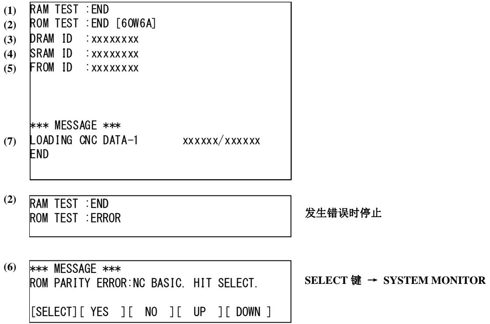

<details>
<summary>text_image</summary>

(1) RAM TEST : END
(2) ROM TEST : END [60W6A]
(3) DRAM ID : xxxxxxxxx
(4) SRAM ID : xxxxxxxxx
(5) FROM ID : xxxxxxxxx

*** MESSAGE ***
(7) LOADING CNC DATA-1    xxxxxxx/xxxxxx
END

(2) RAM TEST : END
ROM TEST : ERROR
发生错误时停止

(6) *** MESSAGE ***
ROM PARITY ERROR:NC BASIC. HIT SELECT.
[SELECT] [ YES ] [ NO ] [ UP ] [ DOWN ]
SELECT 键 → SYSTEM MONITOR
</details>

图C.1 (a)

## 显示内容细节

(1) 显示 WORK RAM 的测试结果。但是，由于发生错误时没有处在可以显示的状态，不进行错误显示，而进行 LED 显示。  
(2) 显示 BOOT ROM 的奇偶校验测试结果。正常情况下显示系列/版本。发生错误时停止处理。  
(3) 显示安装在 CNC 中的 DRAM MODULE 的 ID。  
(4) 显示安装在 CNC 中的 SRAM MODULE 的 ID。  
(5) 显示安装在 CNC 中的 FROM MODULE 的 ID。  
(6) 确认 FLASH ROM 内的 CNC BASIC 软件的正当性，发生错误时予以显示。发生错误时按下软键 [SELECT]（选择），即可选择 SYSTEM MONITOR（系统监控）的画面。  
(7) 表示正在从 FLASH ROM 向 DRAM 传输 CNC BASIC 软件。

## C.1.2 BOOT SYSTEM的启动方法

通常的系统启动时，BOOT SYSTEM 将自动把文件从 FLASH ROM 传送到 DRAM，用户不会意识到 BOOT SYSTEM 的存在。进行维护等时，以及 FLASH ROM 中没有文件时，可显示菜单画面，进行 BOOT SYSTEM 的操作。

(1) “在系统维护时，置换 FLASH ROM 中的文件”

操作：一边同时按住软键右端的按键及其左边按键，一边接通电源。不带软键时，使用 MDI 键的数字键 6 和 7。

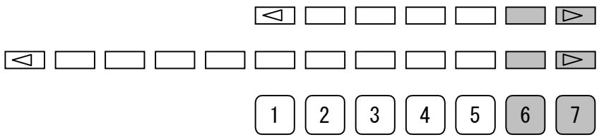

<details>
<summary>text_image</summary>

Diagram showing numbered UI buttons with directional arrows and numbered labels 1 to 7
</details>

图C.1(b)

(2) “FLASH ROM 中没有 CNC 启动所需的文件”

BOOT SYSTEM 在接通 CNC 的电源后，立即从 FLASH ROM 开始向 DRAM 传输文件。但如果 FLASH ROM 上没有启动 CNC 所需的最低限度的系统文件时，以及该文件已被损坏时，将自动地启动 BOOT SYSTEM。

## C.1.3 系统文件和用户文件

BOOT SYSTEM 将 FLASH ROM 处理的文件大致分为 “系统文件” 和 “用户文件” 两种进行管理。两种文件的区别如下。

## 什么是系统文件

系统文件是指我公司提供的 CNC 和伺服的控制软件等。

## 什么是用户文件

用户文件是指 PMC 的顺序程序（梯形程序）及 P-CODE 宏程序等可由用户创建的文件。

## 有关用户文件的文件名

FLAS ROM 上处理的文件，根据其种类而赋予了独有的文件名。这些文件名在后述的

• SYSTEM DATA CHECK  
• SYSTEM DATA DELETE  
• SYSTEM DATA SAVE

中使用。各文件名及其种类的对应如下所示。

表C.1 (a)


□：数字、○：分别表示1个字符的字母或数字。

## C.2 画面配置和操作方法

BOOT SYSTEM 启动后，首先显示 “MAIN MENU(主菜单)画面”。下面就介绍此画面。

## MAIN MENU 画面


### PMC报警: (1)
- **故障内容**: SYSTEM MONITOR MAIN MENU 60W6 - 01
- **处理办法**: (1) 显示标题。右端显示出 BOOT SYSTEM 的系列版本。

### PMC报警: (2)
- **故障内容**: 1.END
- **处理办法**: (2) 退出 BOOT SYSTEM,启动 CNC。

### PMC报警: (3)
- **故障内容**: 2.USER DATA LOADING
- **处理办法**: (3) 向 FLASH ROM 写入数据。

### PMC报警: (4)
- **故障内容**: 3.SYSTEM DATA LOADING
- **处理办法**: (4) 向 FLASH ROM 写入数据。

### PMC报警: (5)
- **故障内容**: 4.SYSTEM DATA CHECK
- **处理办法**: (5) 确认 ROM 文件的版本。

### PMC报警: (6)
- **故障内容**: 5.SYSTEM DATA DELETE
- **处理办法**: (6) 删除 FLASH ROM/存储卡文件。

### PMC报警: (7)
- **故障内容**: 6.SYSTEM DATA SAVE
- **处理办法**: (7) 向存储卡备份数据。

### PMC报警: (8)
- **故障内容**: 7.SRAM DATA UTILITY
- **处理办法**: (8) 备份/恢复 SRAM 区。

### PMC报警: (9)
- **故障内容**: 8.MEMORY CARD FORMAT
- **处理办法**: (9) 格式化存储卡。

### PMC报警: 
- **故障内容**: ***MESSAGE ***
- **处理办法**: 

### PMC报警: (10)
- **故障内容**: SELECT MENU AND HIT SELECT KEY.
- **处理办法**: (10) 显示简单的操作方法和错误信息。

### PMC报警: 
- **故障内容**: [SELECT][ YES ][ NO ][ UP ][ DOWN ]
- **处理办法**: 


图C.2 (a)

## 操作方法

通过软键 [UP] (向上) [DOWN] (向下) 选择处理。将光标对准希望选择的功能，按下软键 [SELECT] (选择)。此外，为了在功能执行前进行确认，也可按下软键 [YES] (是) 或 [NO] (否)。

## 基本的操作流程

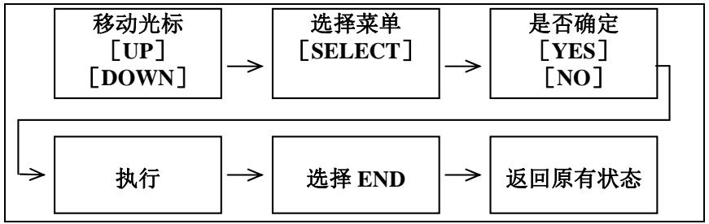

<details>
<summary>flowchart</summary>

```mermaid
graph TD
    A["移动光标<br>[UP"]
  [DOWN]] --> B["选择菜单<br>[SELECT"]]
  B --> C["是否确定<br>[YES"]
[NO]]
  D["执行"] --> E["选择 END"]
  E --> F["返回原有状态"]
```
</details>

图C.2(b)

## C.2.1 USER DATA LOADING/SYSTEM DATA LOADING画面

## 功能内容

将用户文件从存储卡读入到 FLASH ROM 中。

在 USER DATA LOADING（用户数据加载）画面上，将 ROM 数据由存储卡加载到 FLASH ROM 中。

SYSTEM DATA LOADING（系统数据加载）画面由我公司维修服务部门使用。

## 画面配置

(1) SYSTEM DATA LOADING

(2) MEMORY CARD DIRECTORY (FREE [KB]: 5123)

(3) 1 PMC1. MEM 131200 2011-01-01 12:00
2 PMC2. MEM 131200 2011-01-01 12:00

(4) 3 END

(5) SELECT MENU AND HIT SELECT KEY.

[SELECT] [ YES ] [ NO ] [ UP ] [ DOWN ]

(1) 显示标题。

(2) 显示存储卡的可用空间。

(3) 显示存储卡内的文件一览。

(4) 返回 MAIN MENU。

(5) 显示信息。

图C.2 (c)

## 操作步骤

(1) 将光标对准在希望从存储卡读到 FLASH ROM 中的文件，按软键 [SELECT]。

\- 1个画面上最多能显示10个文件。

\- 存储卡上的文件数超过 10 个时，通过软键 ▶ 进入到下一个画面，或者通过软键 ◀ 切换到上一个画面并予以显示。

此时，菜单 “END” 显示在最后一页。

(2) 若在 USER DATA LOADING 画面上选择文件，提示是否确定。

```txt
SYSTEM DATA LOADING
MEMORY CARD DIRECTORY (FREE[KB]: 5123)
1 G001A_B1.MEM 1048704 2003-01-01 12:00
G001A_B2.MEM 1048704 2003-01-01 12:00
3 END

***MESSAGE ***
LOADING OK? HIT YES OR NO.
[SELECT][YES][NO][UP][DOWN]
```  
图C.2 (d)

(3) 按软键 [YES] 则开始加载。按 [NO] 则取消加载。

```txt
***MESSAGE ***  
LOADING FROM MEMORY CARD xxxxxxx/xxxxxx  
[SELECT][YES][NO][UP][DOWN]
```  
图C.2 (e)

(4) 正常结束时显示如下信息。请按软键 [SELECT]。如发生错误，请参阅后面将要叙述的错误信息和处理方法一览。

```sql
***MESSAGE ***  
LOADING COMPLETE.  
HIT SELECT KEY.  
[SELECT][YES][NO][UP][DOWN]
```  
图C.2 (f)

注释

请勿执行选项信息文件（文件名 “OPRM INF”）的删除、写入。要进行本文件的写入，需要我公司维修服务部门提供的作业。

## C.2.2 SYSTEM DATA CHECK画面

## 功能内容

SYSTEM DATA CHECK（系统数据检查）画面显示 FLASH ROM 上或存储卡上的文件一览，以及各文件的管理单位数及软件的系列和版本。

## 画面配置

```txt
(1) SYSTEM DATA CHECK
(2) 1. FROM SYSTEM
(3) 2. MEMORY CARD SYSTEM
(4) 3. CNC BACKUP MENU
(5) 4. END
*** MESSAGE ***
(6) SELECT MENU AND HIT SELECT KEY.
[SELECT] [ YES ] [ NO ] [ UP ] [ DOWN ]
```

(1) 显示标题。  
(2) 选择 FROM SYSTEM 画面。  
(3) 选择 MEMORY CARD SYSTEM 画面。  
(4) 通常，不使用 CNC BACKUP MENU。需要操作时，本公司将另行进行说明。  
(5) 返回 MAIN MENU。  
(6) 显示信息。

图C.2 (g)  
画面配置（FROM SYSTEM 画面）  
```txt
(1) SYSTEM DATA CHECK
FROM DIRECTORY
(2) 21 PS0B (0009) *
22 PS1B (0002) *
23 PS20 (0006) *
24 DGGOSRVO (0005) *
25 PMC1 (0001)
26 PMCS (0001)
27 END
*** MESSAGE ***
(4) SELECT FILE AND HIT SELECT KEY.
[SELECT] [ YES ] [ NO ] [ UP ] [ DOWN ]
```  
图C.2 (h)

(1) 显示标题。  
(2) 显示 FLASH ROM 上存在的文件名。显示在文件名右侧的()中的数字为使用管理单位数。系统文件显示有“\*”。  
(3) 返回 MAIN MENU。  
(4) 显示信息。

画面配置（MEMORY CARD SYSTEM 画面）  
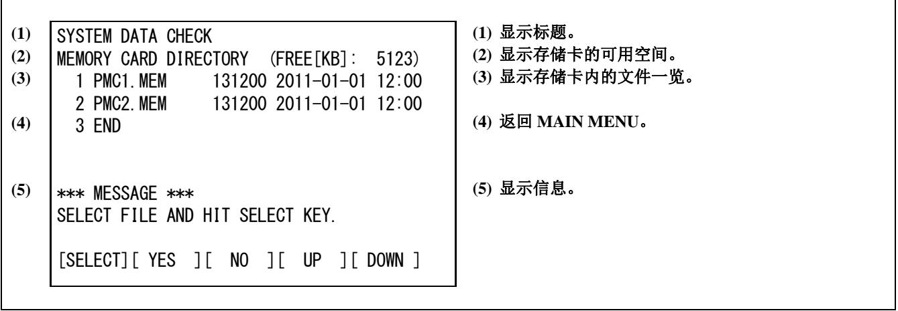  
图C.2 (i)

## 操作步骤

(1) 选择 FROM SYSTEM 画面或者 MEMORY CARD SYSTEM 画面。  
(2) 选择进行确认的文件（例：“”SYS1-CNC(0032)”。  
(3) 对所选择的文件，将显示管理单位编号和各管理单位的系列、版本。确认后，按下软键 [SELECT] 返回到文件选择画面。

(1) SYSTEM DATA CHECK
SYS1-CNC (0032) \*A  
```asm
(2) 1 D6G1 001A 0000 9 D6G1 101A 0008
2 D6G1 021A 0001 10 D6G1 121A 0009
3 D6G1 041A 0002 11 D6G1 141A 000A
4 D6G1 061A 0003 12 D6G1 161A 000B
5 D6G1 081A 0004 13 D6G1 181A 000C
6 D6G1 0A1A 0005 14 D6G1 1A1A 000D
7 D6G1 0C1A 0006 15 D6G1 1C1A 000E
8 D6G1 0E1A 0007 16 D6G1 1E1A 000F
```

```txt
*** MESSAGE ***
```

```txt
HIT SELECT KEY.
```

```txt
[SELECT] [ YES ] [ NO ] [ UP ] [ DOWN ]
```  
图C.2 (j)

(1) 显示标题。  
(2) 就每个管理单位显示如下信息。

\- 系列

- ROM 编号&版本  
- 内部管理单位编号

若是能显示检查结果的内容，则显示“@”。

## C.2.3 SYSTEM DATA DELETE画面

## 功能内容

在 SYSTEM DATA DELETE（系统数据删除）画面上删除 FLASH ROM 或者存储卡中保存的文件。

## 画面配置

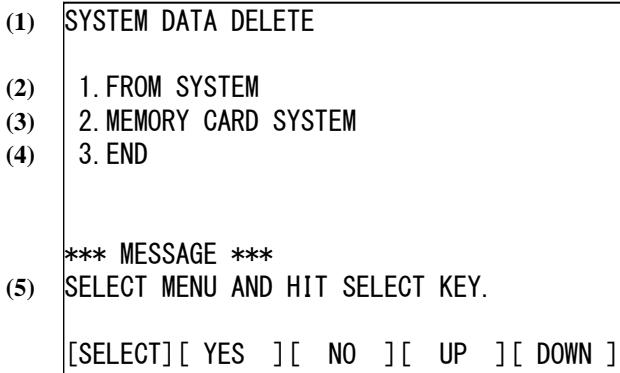

<details>
<summary>text_image</summary>

(1) SYSTEM DATA DELETE
(2) 1. FROM SYSTEM
(3) 2. MEMORY CARD SYSTEM
(4) 3. END
*** MESSAGE ***
(5) SELECT MENU AND HIT SELECT KEY.
[SELECT] [ YES ] [ NO ] [ UP ] [ DOWN ]
</details>

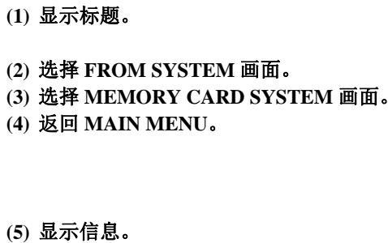

<details>
<summary>text_image</summary>

(1) 显示标题。
(2) 选择 FROM SYSTEM 画面。
(3) 选择 MEMORY CARD SYSTEM 画面。
(4) 返回 MAIN MENU。
(5) 显示信息。
</details>

图C.2 (k)

## 画面配置（FROM SYSTEM 画面）

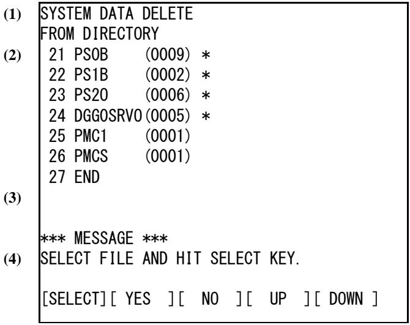

<details>
<summary>text_image</summary>

(1) SYSTEM DATA DELETE
FROM DIRECTORY
(2) 21 PS0B (0009) *
22 PS1B (0002) *
23 PS20 (0006) *
24 DGGOSRVO (0005) *
25 PMC1 (0001)
26 PMCS (0001)
27 END
(3)
*** MESSAGE ***
(4) SELECT FILE AND HIT SELECT KEY.
[SELECT] [ YES ] [ NO ] [ UP ] [ DOWN ]
</details>

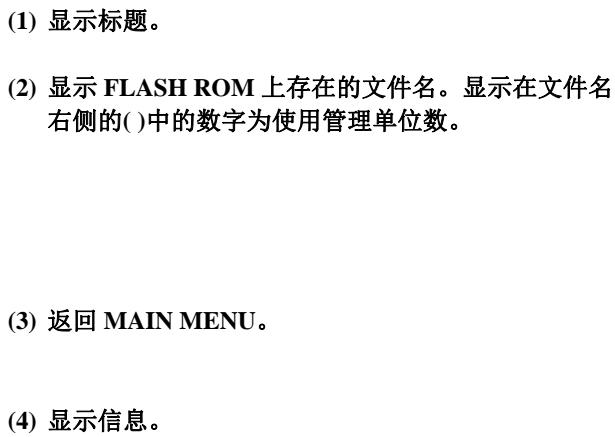

<details>
<summary>text_image</summary>

(1) 显示标题。
(2) 显示 FLASH ROM 上存在的文件名。显示在文件名右侧的()中的数字为使用管理单位数。
(3) 返回 MAIN MENU。
(4) 显示信息。
</details>

图C.2 (1)

## 画面配置（MEMORY CARD SYSTEM 画面）

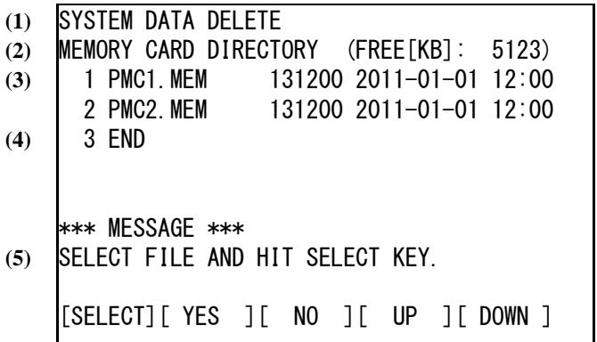

<details>
<summary>text_image</summary>

(1) SYSTEM DATA DELETE
(2) MEMORY CARD DIRECTORY (FREE[KB]: 5123)
(3) 1 PMC1. MEM 131200 2011-01-01 12:00
2 PMC2. MEM 131200 2011-01-01 12:00
(4) 3 END
*** MESSAGE ***
(5) SELECT FILE AND HIT SELECT KEY.
[SELECT] [ YES ] [ NO ] [ UP ] [ DOWN ]
</details>

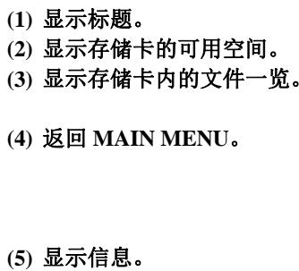

<details>
<summary>text_image</summary>

(1) 显示标题。
(2) 显示存储卡的可用空间。
(3) 显示存储卡内的文件一览。
(4) 返回 MAIN MENU。
(5) 显示信息。
</details>

图C.2 (m)

## 操作步骤

(1) 选择 FROM SYSTEM 画面或者 MEMORY CARD SYSTEM 画面。  
(2) 选择将要删除的文件。  
(3) 显示如下用于确认的信息。


<details>
<summary>text_image</summary>

*** MESSAGE ***
DELETE OK ? HIT YES OR NO.
[SELECT] [ YES ] [ NO ] [ UP ] [ DOWN ]
</details>

图C.2 (n)

(4) 按软键 [YES] 则开始加载。按 [NO] 则取消加载。

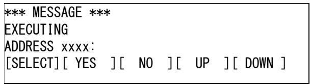

<details>
<summary>text_image</summary>

*** MESSAGE ***
EXECUTING
ADDRESS xxxx:
[SELECT] [ YES ] [ NO ] [ UP ] [ DOWN ]
</details>

图C.2 (o)

(5) 正常结束时显示如下信息。请按软键 [SELECT] 。如发生错误，请参阅后面将要叙述的错误信息和处理方法一览。

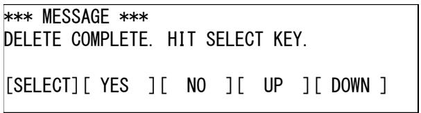

<details>
<summary>text_image</summary>

*** MESSAGE ***
DELETE COMPLETE. HIT SELECT KEY.
[SELECT] [ YES ] [ NO ] [ UP ] [ DOWN ]
</details>

图C.2 (p)

其他（SYSTEM DATA DELETE 中的系统文件和用户文件的差异）

系统文件受到保护，以免其被错误删除。

而用户文件则没被保护起来。

## C.2.4 SYSTEM DATA SAVE画面

## 功能内容

SYSTEM DATA SAVE（系统数据保存）画面将 FLASH ROM 上的用户文件写到存储卡上。只有用户文件才能从 FLASH ROM 保存到存储卡中。系统文件无法保存。

## 画面配置

```txt
(1) SYSTEM DATA SAVE
FROM DIRECTORY
(2) 21 PS0B (0009) *
22 PS1B (0002) *
23 PS20 (0006) *
24 DGGOSRVO (0005) *
25 PMC1 (0001)
26 PMCS (0001)
27 END
*** MESSAGE ***
(4) SELECT FILE AND HIT SELECT KEY.
[SELECT] [ YES ] [ NO ] [ UP ] [ DOWN ]
```  
图C.2 (q)

(1) 显示标题。  
(2) 显示 FLASH ROM 上存在的文件名。显示在文件名右侧的()中的数字为使用管理单位数。  
(3) 返回 MAIN MENU。  
(4) 显示信息。

## 操作方法

(1) 选择希望保存的文件。  
(2) 显示如下用于确认的信息。

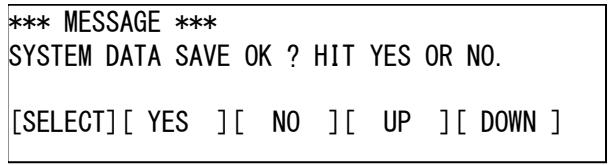

<details>
<summary>text_image</summary>

*** MESSAGE ***
SYSTEM DATA SAVE OK ? HIT YES OR NO.
[SELECT] [ YES ] [ NO ] [ UP ] [ DOWN ]
</details>

图C.2 (r)

(3) 按软键 [YES] 则开始加载。按 [NO] 则取消加载。


<details>
<summary>text_image</summary>

*** MESSAGE ***
STORE TO MEMORY CARD
[SELECT] [ YES ] [ NO ] [ UP ] [ DOWN ]
</details>

图C.2 (s)

(4) 正常结束时显示如下信息。请按软键 [SELECT]。同时还将显示写入存储卡的文件名，请做好记录以便确认。

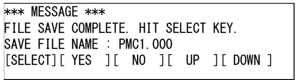

<details>
<summary>text_image</summary>

*** MESSAGE ***
FILE SAVE COMPLETE. HIT SELECT KEY.
SAVE FILE NAME : PMC1.000
[SELECT] [ YES ] [ NO ] [ UP ] [ DOWN ]
</details>

图C.2(t)

## 保存 ATA PROG

文件名为 ATA PROG 的文件中，包含有 NC 程序。将在 SRAM DATA UTILITY（SRAM 数据应用程序）画面上统一保存 SRAM 数据，所以不能在此 SYSTEM DATA SAVE 画面上进行保存。

## 其他（SYSTEM DATA SAVE 中的系统文件和用户文件的差异）

SYSTEM DATA SAVE 画面上不能统一保存系统文件。只能保存用户文件。

从 FLASH ROM 保存到存储卡的文件名，按如下方式赋予。

表C.2 (a)


### PMC报警: PMC1
- **故障内容**: →
- **处理办法**: PMC1.xxx

### PMC报警: PD010.5M
- **故障内容**: →
- **处理办法**: PD0105M.xxx

### PMC报警: PD011.0M
- **故障内容**: →
- **处理办法**: PD0110M.xxx


“xxx”如“000”，“001”，…，“031”所示，带有32个编号。

譬如，将 FLASH ROM 上的文件 “PMC1” 保存到存储卡上时，如果存储卡上没有存在 “PMC1.000” 这样的文件，则以 “PMC1.000” 这样的名称保存起来。如果已有 “PMC1.000” 存在，则将扩展名的数字加 1，文件名为 “PMC1.001”。这样，文件名通过将扩展名的编号逐个加 1，可创建到 “PMC1.031” 为止。此外，中途如有空的编号，则按数字从小到大的顺序创建。

因此，只有在扩展名不同的多个文件保存在同一张存储卡的情况下，请确认在保存正常结束时显示的文件名。

## C.2.5 SRAM DATA UTILITY画面

## 功能内容

在SRAM DATA UTILITY（SRAM数据应用程序）画面上，可以将即使断开CNC的电源也会被保存起来的SRAM中的数据(参数、刀具补偿存储器等)统一保存到存储卡中并加以恢复。

## 画面配置

```txt
(1) SRAM DATA UTILITY
(2) 1. SRAM BACKUP ( CNC -> MEMORY CARD )
2. SRAM RESTORE ( MEMORY CARD -> CNC )
3. AUTO BKUP RESTORE ( FROM -> CNC )
4. END
(3) SRAM + ATA PROG FILE : (4MB)
(4) SRAM_BAK.001
***MESSAGE ***
SET MEMORY CARD NO.001
ARE YOU SURE ? HIT YES OR NO.
[SELECT] [ YES ] [ NO ] [ UP ] [ DOWN ]
```  
图C.2 (u)

(1) 显示标题。  
(2) 显示菜单  
有关 AUTO BKUP RESTORE，请参阅 5.3 自动数据备份项。  
(3) 返回 MAIN MENU。  
(4) 显示文件内容。(在选定处理后予以显示)  
(5) 显示目前正在保存/加载中的文件名。(在选定处理后予以显示)

## 操作方法(备份数据时)

(1) 选择 “1.SRAM BACKUP” (SRAM 备份)时，显示出确认信息。按下 [YES] 则开始备份数据。  
(2) 不能将所有数据都保存在一张存储卡中时，显出如下所示的信息。在继续通电的状态下插入第 2 张存储卡，按下 [YES] 键。按下 [NO] 键就取消数据备份。

```txt
***MESSAGE ***  
SET MEMORY CARD NO.002  
ARE YOU SURE? HIT YES OR NO.  
[SELECT][YES][NO][UP][DOWN]
```  
图C.2 (v)

(3) 以后也一样，可以最多分割为 999 张存储卡而备份 SRAM 数据。  
(4) 备份结束时，显示出如下所示的信息。按下 [SELECT] 键结束操作。

```sql
***MESSAGE ***  
SRAM BACKUP COMPLETE. HIT SELECT KEY.  
[SELECT][YES][NO][UP][DOWN]
```  
图C.2 (w)

## 操作方法(恢复数据时)

(1) 选择 “2.SRAM RESTORE” (SRAM 恢复)时，显示出确认信息。按下 [YES] 则开始数据恢复。

(2) 画面上显示如下信息，安装好包含 SRAM\_BAK.001 的第 1 张存储卡，按下 [YES] 键。取消数据恢复时按下 [NO] 键。

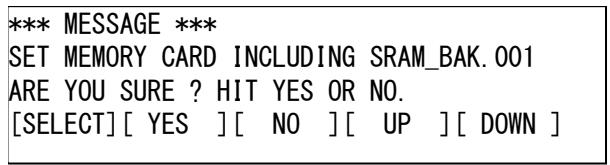

<details>
<summary>text_image</summary>

*** MESSAGE ***
SET MEMORY CARD INCLUDING SRAM_BAK.001
ARE YOU SURE ? HIT YES OR NO.
[SELECT] [ YES ] [ NO ] [ UP ] [ DOWN ]
</details>

图C.2 (x)

(3) 需要第 2 张存储卡时，显示出如下所示信息。在继续通电的状态下插入第 2 张存储卡，按下 [YES] 键。按下 [NO] 键就取消数据恢复。

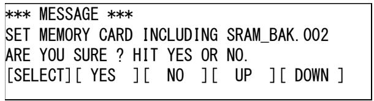

<details>
<summary>text_image</summary>

*** MESSAGE ***
SET MEMORY CARD INCLUDING SRAM_BAK.002
ARE YOU SURE ? HIT YES OR NO.
[SELECT] [ YES ] [ NO ] [ UP ] [ DOWN ]
</details>

图C.2 (y)

(4) 以后的操作相同，更换所需张数的存储卡。  
(5) 数据恢复结束时，显示出如下所示的信息。按下 [SELECT] 键结束操作。

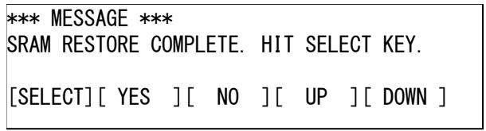

<details>
<summary>text_image</summary>

*** MESSAGE ***
SRAM RESTORE COMPLETE. HIT SELECT KEY.
[SELECT] [ YES ] [ NO ] [ UP ] [ DOWN ]
</details>

图C.2 (z)

## 注意

1 备份的文件名作为 SRAM\_BAK.xxx 被创建。xxx 表示 001～999 之间依次递增的数字。  
第1张存储卡中以SRAM\_BAK.001为文件名创建一个备份文件。第1张卡中容纳不下时，在第2张存储卡中以SRAM\_BAK.002作为文件名创建一个备份文件。  
这样，最多可以分割为999存储卡来保存数据。  
2 在确认用于备份数据的存储卡中没有SRAM\_BAK.xxx这样的文件名的文件后，执行BACKUP操作。存储卡上的文件名一览，可以使用SYSTEM DATA LOADING功能进行确认。  
3 用于备份数据的存储卡，请使用已经通过 FAT16 格式进行格式化处理的存储卡。

## C.2.6 MEMORY CARD FORMAT画面

## 功能内容

MEMORY CARD FORMAT（存储卡格式化）画面可进行存储卡的格式化。存储卡购买后最初使用时，存储卡的内容被损坏时，需要进行存储卡的初始化。

## 操作步骤

(1) 请在 SYSTEM MONITOR MAIN MENU(系统监控主菜单)选择 “8.MEMORY CARD FORMAT”（存储卡格式化）。  
(2) 将显示如下确认信息。请按 [YES] 键。

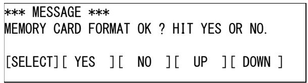

<details>
<summary>text_image</summary>

*** MESSAGE ***
MEMORY CARD FORMAT OK ? HIT YES OR NO.
[SELECT] [ YES ] [ NO ] [ UP ] [ DOWN ]
</details>

图C.2 (aa)

(3) 显示出存储卡的所有数据将会丢失的警告。需要执行时，按下 [YES] 键。

```txt
***MESSAGE ***  
MEMORY CARD FORMAT OK? HIT YES OR NO.  
ALL DATA IN THE MEMORY CARD IS LOST.  
[SELECT][YES][NO][UP][DOWN]
```  
图C.2 (bb)

(4) 格式化过程中将显示如下信息。

```txt
***MESSAGE ***  
FORMATTING MEMORY CARD.  
[SELECT][YES][NO][UP][DOWN]
```  
图C.2 (cc)

(5) 正常结束时显示如下信息。按下 [SELECT] 键。

```txt
***MESSAGE ***  
FORMAT COMPLETE. HIT SELECT KEY.  
[SELECT][YES][NO][UP][DOWN]
```  
图C.2 (dd)

## C.2.7 LOAD BASIC SYSTEM

## 功能内容

LOAD BASIC SYSTEM（加载基本系统）画面退出 BOOT SYSTEM，启动 CNC。

## 操作步骤

在 MAIN MENU 画面上选择 “1.END” (结束)，则显示 “ARE YOU SURE ? HIT YES OR NO.” (真的要结束吗？按下 YES 或者 NO)。退出 BOOT SYSTEM，启动 CNC，同时按软键 [YES]。按下软键 [NO] 则返回 MAIN MENU。

```txt
***MESSAGE ***  
ARE YOU SURE? HIT YES OR NO.  
[SELECT][YES][NO][UP][DOWN]
```  
图C.2 (ee)

## C.3 错误信息和处理方法一览

此节介绍错误信息和发生该错误时的处理方法。下面的错误信息按照字母顺序排列。

表C.3 (a)


### PMC报警: 
- **故障内容**: 信息
- **处理办法**: 含义与处理方法

### PMC报警: D
- **故障内容**: DEVICE ERROR (xxxx)
- **处理办法**: 试图清除 FLASH ROM 上的某一区域而失败。暂时断开电源,然后重新启动。尝试几次均显示相同信息时,有可能是 FLASH ROM 模块损坏。更换 FLASH ROM 模块。

### PMC报警: F
- **故障内容**: FILE CHECK ERROR (SRAM_BAK.001) HIT SELECT KEY.
- **处理办法**: 存储卡上的 SRAM 备份文件(SRAM_BAK.001)不正确。可能是由于文件损坏所致。

### PMC报警: I
- **故障内容**: ILLEGAL FORMAT FILE. HIT SELECT KEY.
- **处理办法**: 选择了无法读入FLASH ROM 的文件。或者是用于向 FLASH ROM 读入的程序头信息被损坏。

### PMC报警: M
- **故障内容**: MAX EXTENSION OVER. HIT SELECT KEY.
- **处理办法**: 文件名的扩展名超过31。更换存储卡,或者擦除不需要的备份文件。

### PMC报警: M
- **故障内容**: MEMORY CARD PROTECTED. HIT SELECT KEY.
- **处理办法**: 存储卡的保护开关被置于 ON。写入数据时,将保护开关置于 OFF。

### PMC报警: R
- **故障内容**: ROM PARITY ERROR:NC BASIC. HIT SELECT.
- **处理办法**: NC BASIC 的数据不正确。在 SYSTEM DATA CHECK 画面上确认 CNC 系统软件。

### PMC报警: S
- **故障内容**: SRAM TEST ERROR (ECC)
- **处理办法**: 在 SRAM 模块中检测出错误。数据将被自动修复,所以可以启动系统,但是以后将有可能弄乱数据,应更换 SRAM 模块。


## D 存储卡插槽

附录 D “存储卡插槽” 由下列内容构成。

D.1 概要....623  
D.2 存储卡的种类（功能） 623  
D.3 硬件配置....624

## D.1 概要

显示器一体型时，存储卡插槽位于显示器前面。请参照下表 D.1(a)。

表D.1 (a)


### PMC报警: 硬件配置
- **故障内容**: 显示器单元的卡插槽
- **处理办法**: 控制单元的卡插槽

### PMC报警: 类型 1
- **故障内容**: 有
- **处理办法**: 无


(补充说明)

\- 硬件配置请参阅D.3项。

## D.2 存储卡的种类（功能）

## 注释

有关从我公司购买的存储卡以外的存储卡，难以保证其正常动作。

## 有关向显示器侧的卡插槽使用小型闪存卡适配器

将从发那科公司购买的小型闪存卡适配器（A02B-0303-K150）（下称 CF 适配器）安装到小型闪存卡并插入显示器侧的卡插槽时，可以利用小型闪存卡的锁定功能，并可在插入后的状态下关闭存储卡接口的盖子。

## 1. 安装

- 将小型闪存卡安装到 CF 适配器上（A02B-0303-K150）。  
- 确认锁杆 A 已经升到上方，将上述步骤中安装的 CF 适配器插入存储卡接口。  
- 将锁杆 A 按压到下方。  
- 盖上存储卡接口盖。

## 注释

1 在 CF 适配器插入状态下连续运行时，务必推下锁杆 A 并盖上存储卡接口盖。  
2 锁定功能只有在使用 CF 适配器（A02B-0303-K150）时才有效。  
3 CF 适配器，应使标签面朝着画面一方插入。

## 2. 拆除

- 盖上存储卡接口盖。  
- 将锁杆 A 推到上方。  
- 按压一下弹出按钮 B，按钮就会弹出。  
- 再次按压弹出按钮 B，CF 适配器即被弹出。  
- 利用手指拿住 CF 适配器，将其拔出。  
- 盖上存储卡接口盖。

## 注释

不能在锁杆降到下方（此时已被锁定）的状态下按压弹出按钮。

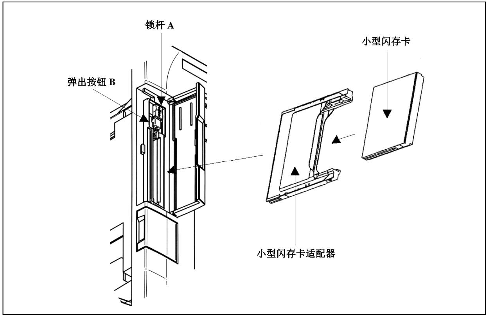

<details>
<summary>text_image</summary>

锁杆 A
弹出按钮 B
小型闪存卡
小型闪存卡适配器
</details>

图D.2(a)

## D.3 硬件配置

## - 类型1

显示器一体型

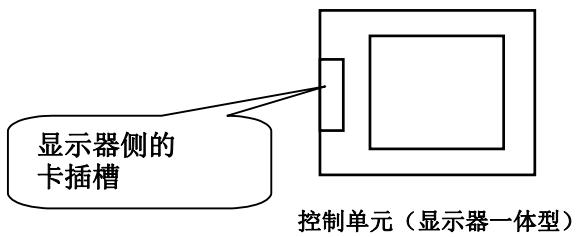

<details>
<summary>text_image</summary>

显示器侧的
卡插槽
控制单元（显示器一体型）
</details>

图D.3 (a)

## E

## LED 显示

附录 E “LED 显示” 由下列内容构成。

E.1 概要....625  
E.2 7 段LED的显示（点亮状态）....625  
E.3 7 段LED的显示（闪烁状态）....627

## E.1 概要

CNC 主体上安装有 7 段 LED。

7 段 LED 显示根据 CNC 的动作状态而发生变化。

有关从接通电源到进入可以动作的状态之前，以及发生系统错误时的 7 段 LED 显示，详见如下描述。

## E.2 7 段LED的显示（点亮状态）

表E.2 (a) LED 显示的含义


由于 CNC 异常，在系统启动中停止处理而不显示系统报警画面的情况下，按照表 E.2(b) 采取对策。

表E.2 (b) 启动中处理停止时的不良部位、确认事项


## E.3 7 段LED的显示（闪烁状态）

表E.3 (a)


## F

## 电脑功能的维护操作（引导、IPL）

附录 F “电脑功能的维护操作（引导、IPL）” 由下列内容构成。

F.1 概述 628  
F.2 切换启动顺序....629  
F.3 各画面的说明 …… 630

F.3.1 BOOT画面 630  
F.3.2 IPL画面 633

F.4 有关其他画面 ..... 634

F.4.1 CNC报警画面....634  
F.4.2 状态画面 634  
F.4.3 选项设定画面....635

## F.1 概述

使用电脑功能，经由 HSSB 连接 CNC 和电脑时，可通过 Ncboot32.exe 进行 CNC 的维护作业。

Ncboot32.exe 备有下列功能。

- BOOT 画面（CNC 的用户数据维护、SRAM 的备份等）  
- IPL 画面（SRAM 的清零等）  
- CNC通电画面的显示  
- CNC 报警画面的显示  
- 通信错误时的再连接  
- 已登录的应用程序的起动  
- 下次CNC启动时的BOOT/IPL画面的自动调用

Ncboot32.exe 在驱动程序的安装时，被复制到 Windows 的 System 32 文件夹中。

若是在 Windows 启动时，Ncboot32.exe 将自动启动，并驻留在系统托盘中。

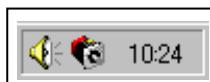  
图F.1(a)

(中间的图标)

补充说明：1 多路连接

Ncboot32.exe 支持 HSSB 的多路连接。通过 HSSB 连接的每一个 CNC，以 “节点” 为单位进行管理。BOOT 画面、IPL 画面、系统报警画面，在每个节点打开一个独立的窗口。

补充说明：2 退出方法

通常没有必要退出 Ncboot32.exe，但是需要退出时，参照下面的“系统托盘”说明，显示弹出式菜单，选择“End”。已经打开 Ncboot32.exe 的窗口，不能选择“End”。

## 系统托盘

右击系统托盘上的图标，在画面左下显示出如下弹出式菜单。

  
图F.1(b)

选择 [Open] （打开），打开状态画面。

选择 [About] （关于），显示版本信息对话框。

选择 [End] （退出），退出 Ncboot32.exe。

双击系统托盘上的图标时，自动选定菜单 Open。

## F.2 切换启动顺序

通过按下 MDI 键 6 和 7 接通电源，即可使用 BOOT 画面和 IPL 画面进行维护作业。

## 通常操作时

1. CNC 即便在通信尚未建立的情况下也会启动  
2. 电脑等待与 CNC 之间建立通信  
3. FOCAS2 程序库用工作区的初始化  
4. 启动一个已登录的应用程序  
5. 监视通信错误和 CNC 系统报警

## 维护作业时

1. 等待与 CNC 之间通信的建立  
2. 显示 BOOT 画面  
3. 显示 IPL 画面  
4. 显示 CNC 的通电画面  
5. FOCAS2 程序库用工作区的初始化  
6. 启动一个已登录的应用程序  
7. 监视通信错误和 CNC 系统报警

## F.3 各画面的说明

注释

要打开 Ncboot32.exe 的各画面，建议用户使用鼠标或者触摸板。

## F.3.1 BOOT画面

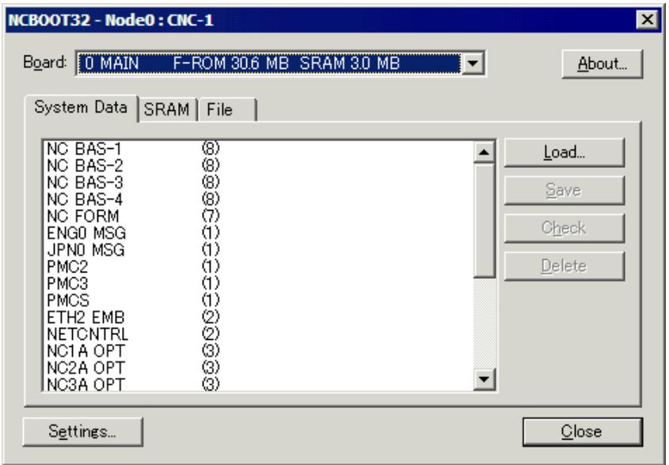

<details>
<summary>text_image</summary>

NCBOOT32 - Node0 : CNC-1
Board: 0 MAIN F-ROM 306 MB SRAM 30 MB
System Data SRAM File
NC BAS-1 (8)
NC BAS-2 (8)
NC BAS-3 (8)
NC BAS-4 (8)
NC FORM (7)
ENG0 MSG (1)
JPN0 MSG (1)
PMC2 (1)
PMC3 (1)
PMCS (1)
ETH2 EMB (2)
NETCNTRL (2)
NC1A OPT (3)
NC2A OPT (3)
NC3A OPT (3)
Load...
Save
Check
Delete
Settings... Close
</details>

图F.3 (a)

可通过 [Settings...] （设置）按钮改变放置文件的场所。

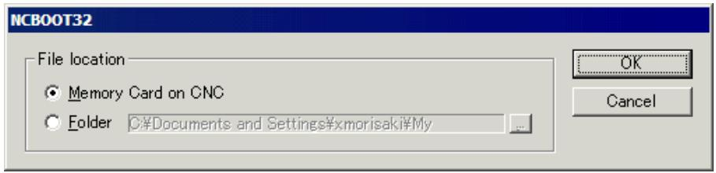

<details>
<summary>text_image</summary>

NCBOOT32
File location
● Memory Card on CNC
○ Folder C:\Documents and Settings\xmorisaki\My
OK
Cancel
</details>

图F.3(b)

选择 CNC 上的存储卡或者电脑上的文件夹。变更作业随时都可进行。

"Memory Card on CNC": 指定 CNC 的存储卡插槽。

"Folder": 指定电脑上的文件夹。

## F.3.1.1 用户数据操作

这是用来处理 NC 一侧的用户数据(梯形程序、宏程序等)的画面。

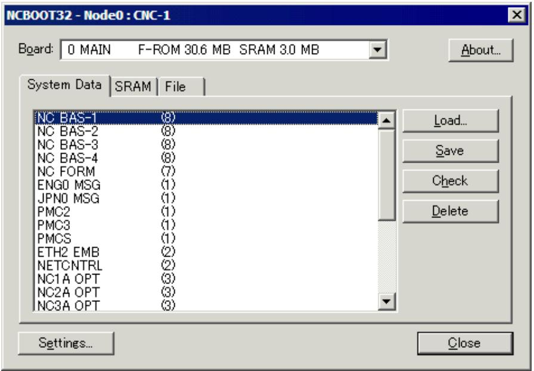

<details>
<summary>text_image</summary>

NCBOOT32 - Node0 : CNC-1
Board: 0 MAIN F-ROM 30.6 MB SRAM 3.0 MB
About...
System Data SRAM File
NC BAS-1 (8)
NC BAS-2 (8)
NC BAS-3 (8)
NC BAS-4 (8)
NC FORM (7)
ENG0 MSG (1)
JPN0 MSG (1)
PMC2 (1)
PMC3 (1)
PMCS (1)
ETH2 EMB (2)
NETCNTRL (2)
NC1A OPT (3)
NC2A OPT (3)
NC3A OPT (3)
Load...
Save
Check
Delete
Settings... Close
</details>

图F.3 (c)

利用 [Load...] （加载）来打开文件选择画面。指定将被加载的用户文件。

利用 [Save] （保存）来将所选 NC 一侧的用户数据保存到文件中。

利用 [Check] （检查）来检查所选 NC 一侧的系统数据、或者用户数据的内容。

利用 [Delete] （删除）来删除所选 NC 一侧的用户数据。

## F.3.1.2 SRAM操作

这是用来保存或恢复 NC 的 SRAM 数据的画面。

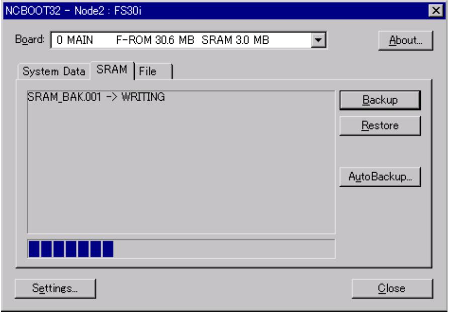

<details>
<summary>text_image</summary>

NCBOOT32 - Node2 : FS30i
Board: 0 MAIN F-ROM 30.6 MB SRAM 3.0 MB
About...
System Data SRAM File
SRAM_BAK.001 -> WRITING
Backup
Restore
AutoBackup...
Settings... Close
</details>

图F.3(d)

[Backup]: 将 SRAM 数据保存在文件中。

[Restore]: 从文件中恢复 SRAM 数据。

中间部分显示出进展情况。与 CNC 一样，备份文件名将根据 RAM 容量自动确定，因而不能改变。

作为 CNC 的功能，备有将 SRAM 的内容自动保存到 FROM 中的自动数据备份（选项）。可以在电脑一侧，将自动保存的数据重新写到 SRAM 中。按下[AutoBackup...]按钮，出现如下所示的画面。

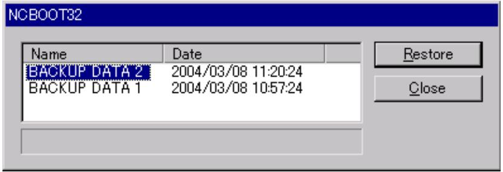

<details>
<summary>text_image</summary>

NCBOOT32
Name Date
BACKUP DATA 2 2004/03/08 11:20:24
BACKUP DATA 1 2004/03/08 10:57:24
Restore
Close
</details>

图F.3 (e)

从 “Name” 中选择任一个保存图像，按下[Restore]按钮，恢复 CNC 的 SRAM 数据。

## F.3.1.3 文件操作

这是用来操作 CNC 上的存储卡或电脑的文件夹上的文件的画面。

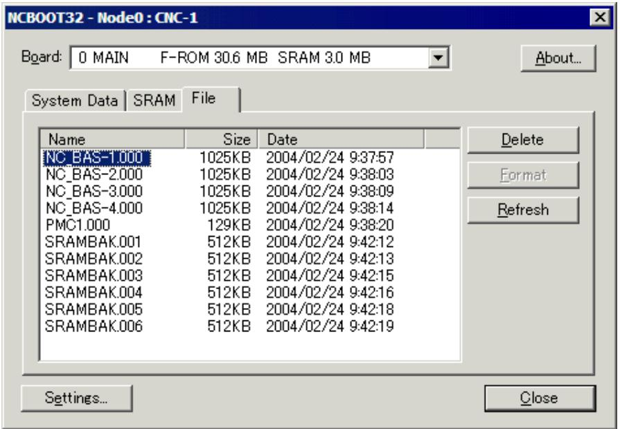

<details>
<summary>text_image</summary>

NCBOOT32 - Node0 : CNC-1
Board: 0 MAIN F-ROM 30.6 MB SRAM 3.0 MB
About...
System Data SRAM File
Name Size Date
NC_BAS-1.000 1025KB 2004/02/24 9:37:57
NC_BAS-2.000 1025KB 2004/02/24 9:38:03
NC_BAS-3.000 1025KB 2004/02/24 9:38:09
NC_BAS-4.000 1025KB 2004/02/24 9:38:14
PMC1.000 129KB 2004/02/24 9:38:20
SRAMBAK.001 512KB 2004/02/24 9:42:12
SRAMBAK.002 512KB 2004/02/24 9:42:13
SRAMBAK.003 512KB 2004/02/24 9:42:15
SRAMBAK.004 512KB 2004/02/24 9:42:16
SRAMBAK.005 512KB 2004/02/24 9:42:18
SRAMBAK.006 512KB 2004/02/24 9:42:19
Settings... Close
</details>

图F.3 (f)

利用 [Delete] （删除）来删除所选文件。

[Format]（格式化）进行存储卡的格式化操作。此按钮在利用 [Setting...]（设置）选定了存储卡时有效。利用 [Refresh]（刷新）来将文件列表更新为最新状态。在更换存储卡时按下此按钮。

## F.3.2 IPL画面

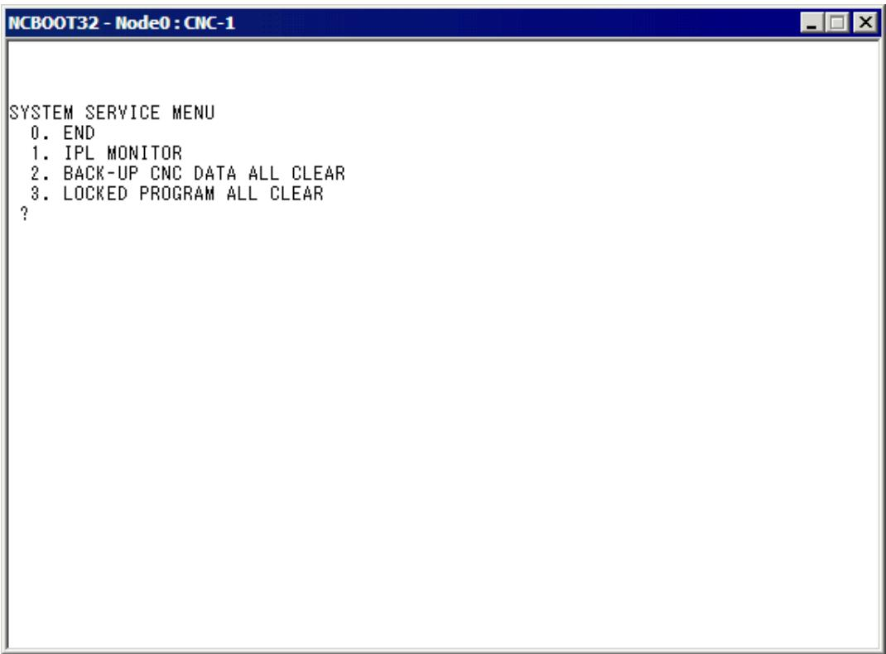

<details>
<summary>text_image</summary>

NCBOOT32 - Node0 : CNC-1
SYSTEM SERVICE MENU
0. END
1. IPL MONITOR
2. BACK-UP CNC DATA ALL CLEAR
3. LOCKED PROGRAM ALL CLEAR
?
</details>

图F.3 (g)

注释

IPL 画面的内容根据 CNC 的机型而有所不同。请按照菜单进行操作。

## F.3.2.1 IPL画面 / 功能列表

CNC 备有可根据通电时的按键状态来使各类功能起作用的操作。

使用电脑功能经由 HSSB 将 CNC 与电脑连接起来时，无法在电源接通时进行按键操作。

但可以在 IPL 画面上执行类似的功能。

有关 IPL 画面的菜单细节以及功能的对应关系，请参阅下表中的内容。

表F.3 (a)


## F.4 有关其他画面

## F.4.1 CNC报警画面

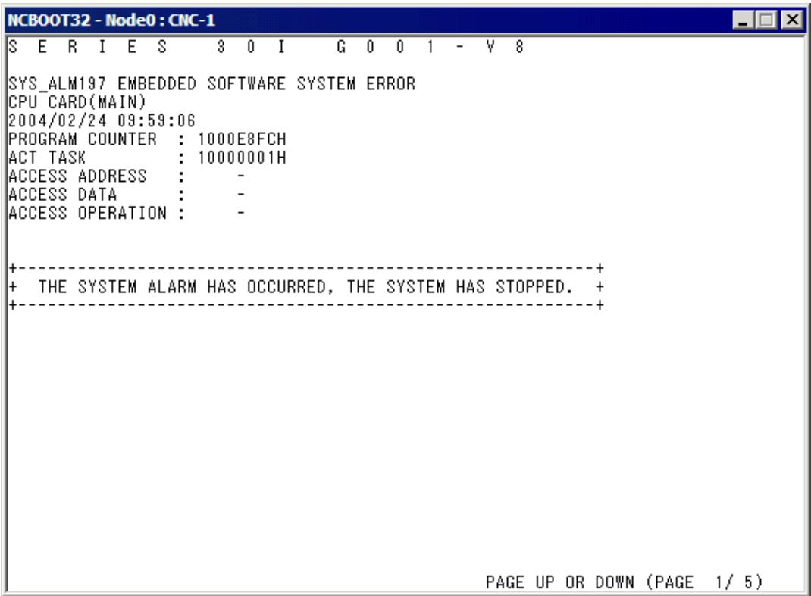

<details>
<summary>text_image</summary>

NCBOOT32 - Node0 : CNC-1
S E R I E S 3 0 I G 0 0 1 - V 8
SYS_ALM197 EMBEDDED SOFTWARE SYSTEM ERROR
CPU CARD(MAIN)
2004/02/24 09:59:06
PROGRAM COUNTER : 1000E8FCH
ACT TASK : 10000001H
ACCESS ADDRESS : -
ACCESS DATA : -
ACCESS OPERATION : -
+----+
+ THE SYSTEM ALARM HAS OCCURRED, THE SYSTEM HAS STOPPED. +
+----+
</details>

图F.4 (a)

CNC 上发生系统报警时会出现报警画面。

（上述情况只是一个例子。显示内容随 CNC 上发生的系统报警而改变。）

## F.4.2 状态画面

双击系统托盘的图标，或者通过右击，点击弹出菜单 “OPEN”，打开状态画面。

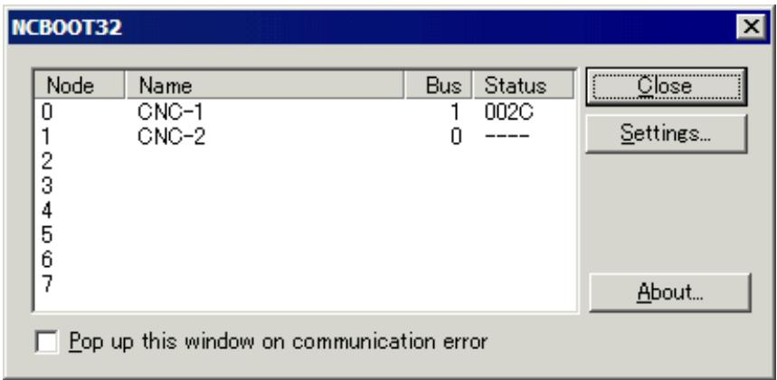

<details>
<summary>text_image</summary>

NCBOOT32
Node Name Bus Status
0 CNC-1 1 002C
1 CNC-2 0 ----
2
3
4
5
6
7
Close
Settings...
About...
Pop up this window on communication error
</details>

图F.4(b)

Node: 节点号

Name: 节点名 (利用控制面板的 HSSB 小应用程序予以定义)

Bus: 硬件级别的通信状态 (0: 通信错误、1: 通信建立)

Status: 状态 (16 进制)

Bit2: BOOT 处理结束

Bit3: IPL 处理结束

Bit4: 旋转开关 位置 0

Bit5: 显示 IPL/系统报警画面 30 行

Bit7: 内部旗标

Bit8: CNC 系统报警

Bit9: 内部旗标

Bit10: 内部旗标

Pop up this window on communication error:

如果选中该复选框，在发生通信错误时，此画面将会自动打开。

按下 [Close] （关闭）按钮关闭画面。

按下 [Settings...] （设置）按钮打开选项设定画面。

按下 [About...] （关于）按钮时打开版本信息画面。

## F.4.3 选项设定画面

可以在选项设定画面上登录应用程序。

使用 FOCAS2 的程序，如果在开始启动 FOCAS2 后不予启动就不会操作。事先将这些程序登录在 Ncboot32.exe 中时，可以与 FOCAS2 的启动同步地执行。（CNC 画面显示功能等）

从状态画面按下 [Settings...] 按钮，即可打开选项设定画面。选项设定画面的应用程序地登录，按照每个节点进行。此外，可以进行下次启动时的 BOOT/IPL 画面调用设定。

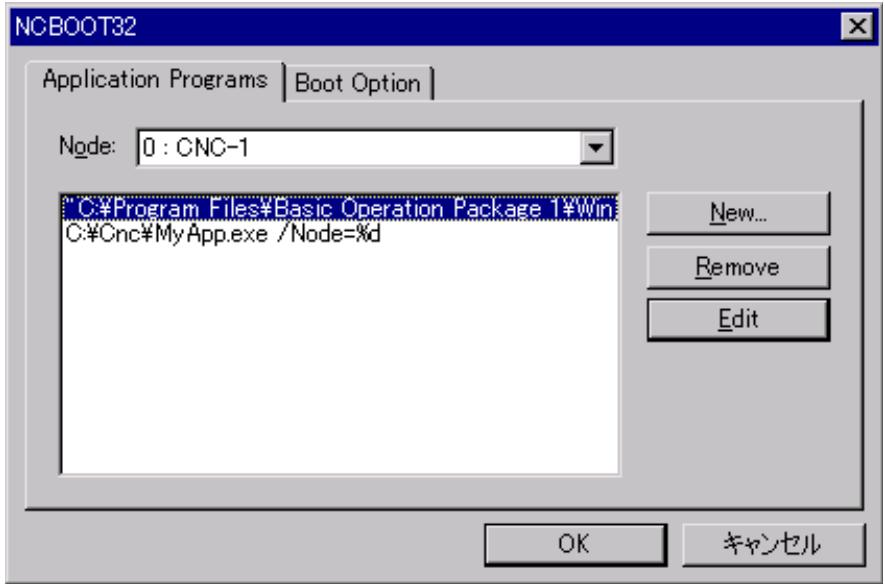

<details>
<summary>text_image</summary>

NCBOOT32
Application Programs | Boot Option |
Node: 0 : CNC-1
C:\Program Files\Basic Operation Package /Win
C:\Cnc\MyApp.exe /Node=%d
New...
Remove
Edit
OK	キャンセル
</details>

图F.4 (c)

利用 [Node] 来选择节点。中间的列表框中，显示出已经登录在所选节点中的程序。

利用 [New...] （新建）来登录新的程序。路径中含有空白文字时，用双引号围起来。

利用 [Remove] （删除）来删除所选行。

可以利用 [Edit]（编辑）来编辑所选行。该按钮在编辑自变量时使用。指令行中的字符串“%d”，将被置换为节点号。要表达‘%’本身时，描述为“%%”。

例）在该节点的 FOCAS2 起动开始后起动 CNC 画面显示功能时，按照如下方式描述。

“C:\Program Files\CNCScreen\CNCScrn.exe” /Node=%d

在选项设定画面上，选择 “Boot Option” 标签时，即可进行下次启动时的 BOOT/IPL 画面调用设定。

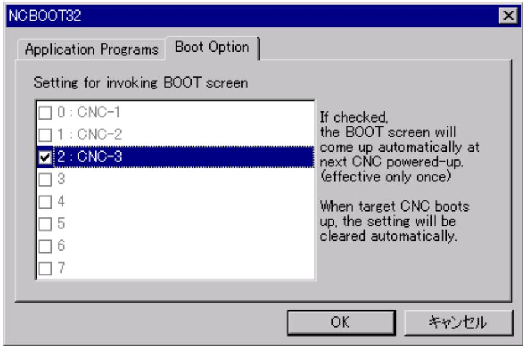

<details>
<summary>text_image</summary>

NCBOOT32
Application Programs Boot Option
Setting for invoking BOOT screen
0 : CNC-1
1 : CNC-2
2 : CNC-3
If checked,
the BOOT screen will
come up automatically at
next CNC powered-up.
(effective only once)
When target CNC boots
up, the setting will be
cleared automatically.
OK キャンセル
</details>

图F.4(d)

点选尚未成为灰色显示的 CNC 的左侧的复选框，在 CNC 下次启动时，显示 BOOT/IPL 画面而与 CNC 侧的旋转开关设定无关。该设定是一次性的设定，其将被 Ncboot32.exe 自动清除。

## G

## IPL 监控器

附录 G “IPL 监控器” 由下列内容构成。

G.1 概述....637  
G.2 IPL监控器的启动....637  
G.3 IPL菜单....638

## G.1 概述

IPL 监控器上可以进行如下操作。

1) 个别文件的清除

进行 CNC 参数、刀具补偿数据等的清除。

2) 系统报警信息的输出

向存储卡输出保存在履历中的系统报警信息。

3) 批量数据保存/恢复

进行 SRAM 数据和 FROM 的所有用户文件的输入输出。


## 警告

1 IPL 监控器菜单中，请勿使用下列菜单以外的菜单。

其它菜单是我公司进行维修服务的功能。

0. END IPL IPL监控器的结束  
3. CLEAR FILE 个别文件的清除  
5. SYSTEM ALARM UTILITY 系统报警信息的输出  
12. BATCH DATA BACKUP/RESTORE 批量数据保存/恢复

2 进行个别文件的清除时，保存在对象文件中的数据将被全部清除掉而进行格式化处理。因此，执行个别文件的清除操作之前，应根据需要备份数据。  
3 发生了系统标签错误的情况下，不进行个别文件的清除，而要进行附录“存储器清除”操作。

## G.2 IPL监控器的启动

IPL 监控器通过如下操作而启动。

## 电脑功能以外

① 同时按下 MDI 键[．]和[-]，接通电源。  
② 出现 IPL 监控器画面。

## 电脑功能

① 启动 NCBOOT32。  
② 由 IPL 画面选择 “1. IPL MONITOR”。  
③ 出现 IPL 监控器画面。

有关详情，请参照附录 F “电脑功能的维护操作（引导、IPL）”。

## 虚拟 MDI 的情形

① 同时按下竖排软键的最上方和自上数起的第二个按键接通电源。  
② 显示 IPL 监控器画面。

## G.3 IPL菜单

IPL 监控器启动时，显示图 G.3 (a) 所示的画面。

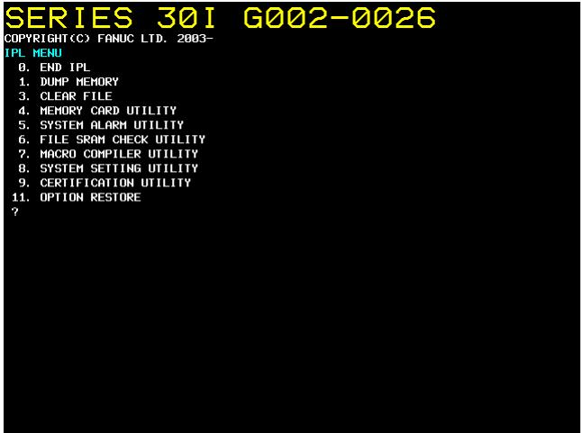

<details>
<summary>text_image</summary>

SERIES 301 G002-0026
COPYRIGHT(C) FANUC LTD. 2003-
IPL MENU
0. END IPL
1. DUMP MEMORY
3. CLEAR FILE
4. MEMORY CARD UTILITY
5. SYSTEM ALARM UTILITY
6. FILE SRAM CHECK UTILITY
7. MACRO COMPILER UTILITY
8. SYSTEM SETTING UTILITY
9. CERTIFICATION UTILITY
11. OPTION RESTORE
?
</details>

图G.3 (a)

从 MDI 键输入希望操作的菜单的编号。

可以选择下列菜单。

0: IPL 监控器的结束  
3: 个别文件的清除  
5: 系统报警信息的输出

## IPL 监控器的结束

结束 IPL 监控器，启动 CNC。

## 个别文件的清除

清除所显示的个别文件，进行格式化处理。

1：选项参数除外的全部文件  
2: CNC 参数文件  
3: 刀具补偿数据

刀具补偿量存储器 A,B,C、刀尖 R 补偿数据（包含假想刀尖方向）、Y 轴偏置数据、第 2 形状偏置等

4：程序存储文件
包含默认文件夹定义文件。  
5: PMC 参数文件  
7：用户宏程序文件
宏变量、宏变量名  
8: 宏执行器文件
P 代码变量  
9: 触摸板数据文件

## 注释

根据系统配置，所显示的个别文件项目不同。

文件清除的操作如下所示。

① 输入希望清除的文件号。  
② 会出现 “CLEAR FILE OK ? (NO=0, YES=1)” 这样的提问，执行时输入 “1”。中止时，输入 “0”。  
③ 输入 “1” 时，执行所指定文件的清除操作，重新显示上述菜单。  
④ 要继续清除其它文件时，从①步重复操作。结束操作时，输入“0”。

## 系统报警信息的输出

可以将系统报警信息输出到存储卡中。

详情请参阅本说明书的“故障排除步骤”章、“系统报警”项。

## 批量数据保存/恢复

可以向输入输出设备（存储卡、或者 USB 存储器）输出（保存）SRAM 数据和 FROM 的所有用户文件。此外，也可以全部输入（恢复）已输出的数据。

详情请参阅本说明书的故障“输入输出数据”章、“批量数据保存/恢复”项。

## 虚拟 MDI 情形的操作

显示可以在软键的位置输入的字符，可进行基于软键的操作。

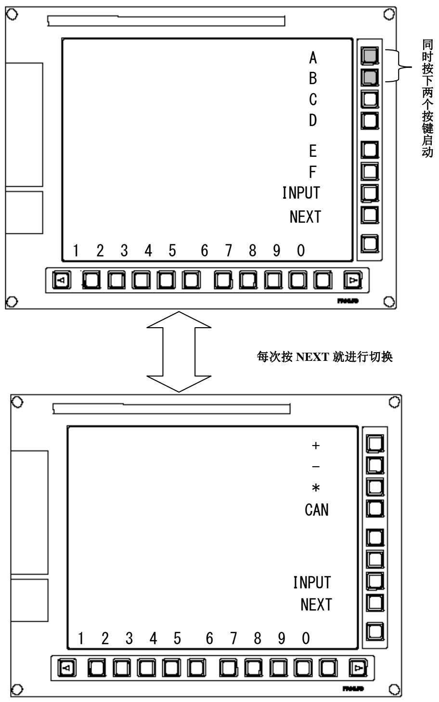

<details>
<summary>text_image</summary>

A
B
C
D
E
F
INPUT
NEXT
1 2 3 4 5 6 7 8 9 0
同时按下两个按键启动
每次按 NEXT 就进行切换
+
-
*
CAN
INPUT
NEXT
1 2 3 4 5 6 7 8 9 0
</details>


## 存储器清除

附录 H “存储器清除” 由下列内容构成。

H.1 概述 641  
H.2 操作方法....641  
H.3 被清零的数据列表 ..... 643

## H.1 概述

在发生 CNC 系统启动时的“SYSTEM LABEL CHECK ERROR”（系统标签检查错误）和突然发生的“SYSTEM ALARM”（系统报警）等预料外的错误时，通过全部清除 CNC 存储器内所保存的数据，即可使 CNC 系统在初始状态下启动，从而返回到可以进行恢复作业的状态。更换主板、FROM/SRAM 模块时，务必进行存储器的清零。

## H.2 操作方法

## 1. 启动方法

① FS0i-F（显示器一体型 CNC）的情形

在接通 CNC 的电源时，一边同时按下 MDI 键 RESET 和 DELETE 一边通电，一直持续按到存储器全部清零核准画面显示为止。

通过同时按下数字键 7 和 9 而接通电源，也就可以显示存储器全部清零的核准画面。

② 经由 HSSB 与 CNC 连接的电脑之情形

使用 NC BOOT32 功能，显示 IPL 菜单。

选择 IPL 菜单的 “2. BACK-UP CNC DATA ALL CLEAR”（备份的 CNC 数据全部清零）。

详情请参阅附录 F “电脑功能的维护操作（引导、IPL）” 章。

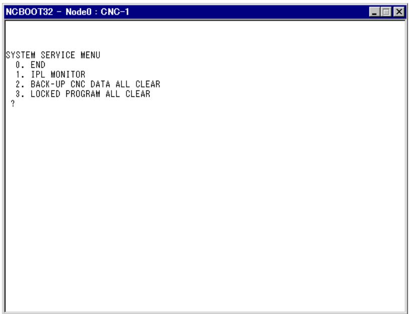

<details>
<summary>text_image</summary>

SYSTEM SERVICE MENU
0. END
1. IPL MONITOR
2. BACK-UP CNC DATA ALL CLEAR
3. LOCKED PROGRAM ALL CLEAR
?
</details>

图H.2 (a)

③ 虚拟 MDI 的情形

接通 CNC 的电源时，同时按下竖排软键的最上方和自上数起第八个按键接通电源，持续按住直至显示 IPL 操作画面。

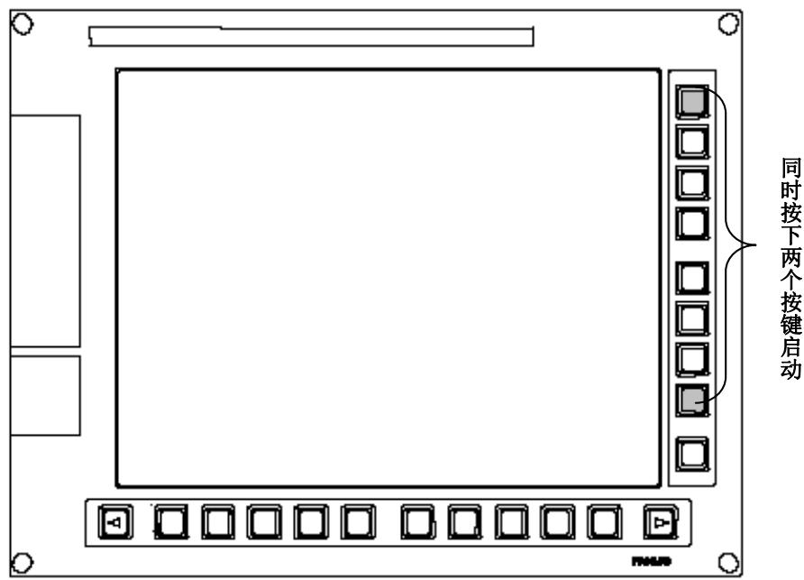

<details>
<summary>text_image</summary>

同时按下两个按键启动
MSSD
</details>

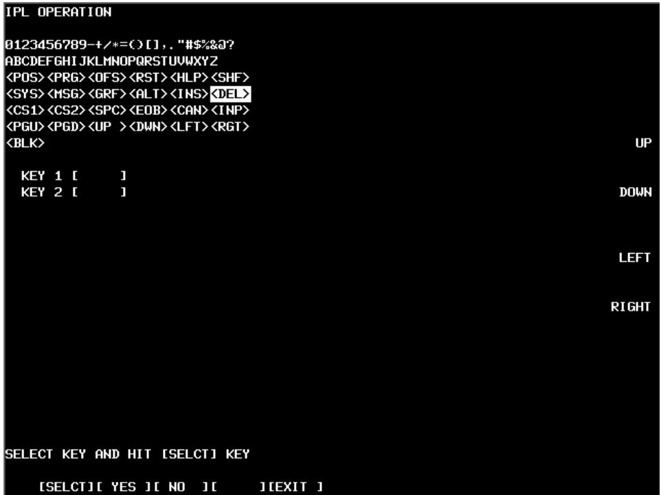

<details>
<summary>text_image</summary>

IPL OPERATION
0123456789-+/*=()[], "#$%&0?
ABCDEFGHIJKLMNOPQRSTUVWXYZ
<POS><PRG><OFS><RST><HLP><SHF>
<SYS><MSG><GRF><ALT><INS><DEL>
<CS1><CS2><SPC><EOB><CAN><INP>
<PGU><PGD><UP > <DOWN><LFT><RGT>
<BLK>
UP
KEY 1 [ ]
KEY 2 [ ]
DOWN
LEFT
RIGHT
SELECT KEY AND HIT [SELECT] KEY
[SELECT][ YES ][ NO ][ ][EXIT ]
</details>

(i) 通过竖排软键将光标移动到<RST>，通过横排软键[SELCT]进行选择。显示确认信息，按下横排软键[YES]予以确定。另外，若按下横排软键[NO]，就会被取消。  
(ii) 接着，通过竖排软键将光标移动到<DEL>，通过横排软键[SELCT]进行选择。显示确认信息，按下横排软键[YES]退出画面。这里，若按下横排软键[NO]，即可从第一个起重新选择。

只选择一个按键、或不选择就退出时，按下横排软键[EXIT]。显示确认信息，按下横排软键[YES]退出画面。

## 2. 存储器全部清零的核准画面

当进行 1. 的操作时，出现下面所示画面，要求确认是否可以执行全部清零。

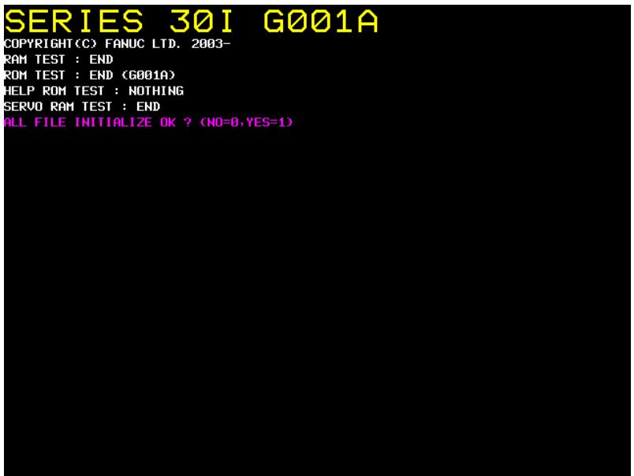

<details>
<summary>text_image</summary>

SERIES 30I G001A
COPYRIGHT(C) FANUC LTD. 2003-
RAM TEST : END
ROM TEST : END (G001A)
HELP ROM TEST : NOTHING
SERVO RAM TEST : END
ALL FILE INITIALIZE OK ? (NO=0,YES=1)
</details>

图H.2(b) 存储器全部清零的核准画面

在上述画面上选择并执行下面的操作。

- 不执行存储器全部清零操作时，用数值键输入“0”。全部清零即被取消。  
- 执行存储器全部清零操作时，用数值键输入“1”。全部清零即被执行。


## 警告

1 进行本操作时，CNC 系统进入可单独启动的状态（初始状态）。因此，要恢复各类功能动作，必须重新设定已被清零的数据。  
2 本操作，应该由接受过有关维护和安全教育的人员进行。

## H.3 被清零的数据列表

通过本操作清零的各类数据如下所示。

表H.3 (a)


注意

根据系统配置，SRAM/FROM 中保存的数据种类将有所不同。

## USB 功能的维护

附录 I “USB 功能的维护” 由下列内容构成。

I.1 USB功能的维护画面 645  
I.2 USB功能的日志画面....647

## I.1 USB功能的维护画面

USB 功能中提供有维护画面。

可进行 USB 存储器状态的显示和 USB 存储器的格式化处理。

## 维护画面的显示

## 步骤

1 按下功能键 SYSTEM。  
2 当按下软键 [USB] 时，显示 “USB 维护画面”。（没有软键时，按下继续键。）

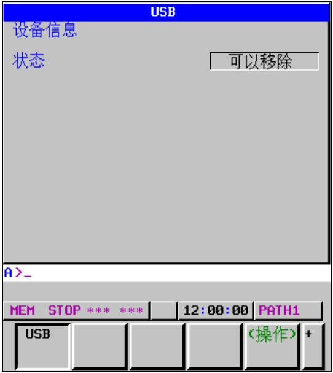

<details>
<summary>text_image</summary>

USB
设备信息
状态	可以移除
A >_
MEM STOP *** ***
12:00:00 PATH1
USB		(操作) +
</details>

图I.1 (a) USB 维护画面

## 显示项目

## 状态

按照如下所示，显示 USB 存储器的状态。


## 注意

在无法移除USB存储器的状态（访问中和格式化中）请勿切断CNC的电源，或拔出USB存储器。否则将会损坏USB存储器。

## 注释

“状态”为“不可使用”的情况下，在USB功能的日志画面上确认其要因，在排除该要因后，重新接通CNC的电源。

## USB 存储器的格式化处理

## 步骤

1 按下软键 [（操作）]，显示软键 [格式化]。


<details>
<summary>text_image</summary>

格式化
</details>

2 按下软键 [格式化]，并按下软键 [执行中]，开始格式化处理。


<details>
<summary>text_image</summary>

执行中 取消
</details>


## 注意

在 USB 存储器的格式化处理中，请勿切断 CNC 的电源，或者拔出 USB 存储器。否则将会损坏 USB 存储器。

## 注释

1 格式化处理，随 USB 存储器的容量和制造商的种类，有时需要一定的时间。此外，在 CNC 上进行的格式化处理，一旦开始时，将无法执行取消操作。  
2 一旦进行 USB 存储卡的格式化处理，USB 存储卡内的所有文件都将被擦除。  
3 尚未进行物理格式化的 USB 存储器，无法在 CNC 上进行格式化处理。首次使用的 USB 存储器，请勿在电脑上指定快速格式化选项，而要以 “FAT” 或者 “FAT32” 进行格式化处理。

## 1.2 USB功能的日志画面

该画面显示与 USB 功能相关的日志。

## 显示日志画面

## 步骤

1 按下功能键 $\boxed{?}$ MESSAGE。

按下软键 [USB 日志]，显示 USB 用的 “日志画面”。（没有软键时，按下继续键。）

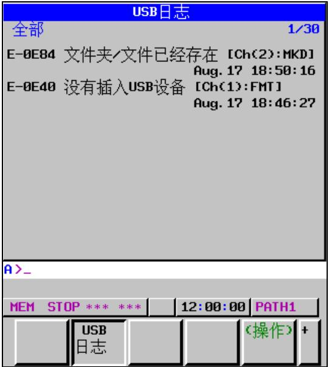

<details>
<summary>text_image</summary>

USB日志
全部
1/30
E-0E84 文件夹/文件已经存在 [Ch(2):MKD]
Aug. 17 18:50:16
E-0E40 没有插入USB设备 [Ch(1):FMT]
Aug. 17 18:46:27
A >_
MEM STOP *** ***
12:00:00 PATH1
USB
日志
(操作) +
</details>

图I.2 (a) 日志画面

最新的错误日志显示在画面的最上面。错误日志的右边为发生该错误时的日期和时刻。日期和时刻的显示格式，以“MMM.DD hh:mm:ss”格式显示月（MMM）、日（DD）、时（hh）、分（mm）、秒（ss）。

图I.2(a)的上段的例子中，表示"8月17日18时50分16秒"。

要清除日志，在按下软键[(操作)]之后，按下软键[清除]。（图I.2(b)）


<details>
<summary>text_image</summary>

清除
</details>

图I.2 (b)

错误和日志消息


### PMC报警: 错误号码
- **故障内容**: 日志消息
- **处理办法**: 含义与处理方法

### PMC报警: E-0E02
- **故障内容**: 超出了可以打开的文件数
- **处理办法**: 可同时打开的文件数至多为60个。

### PMC报警: E-0E03
- **故障内容**: 检索的文件正在运行中
- **处理办法**: 无法同时执行多个文件搜索。文件搜索中,有可能试图在结束文件搜索之前开始别的文件搜索。

### PMC报警: E-0E04
- **故障内容**: 没找到检索的文件
- **处理办法**: 在指定的全路径的文件夹内,没有找到指定搜索的文件/文件夹。

### PMC报警: E-0E05
- **故障内容**: 指定的驱动器名不正确
- **处理办法**: 无法指定A驱动器以外的。

### PMC报警: E-0E06
- **故障内容**: 不能使用FORFANUC
- **处理办法**: 在全路径指定中,像“A:\FORFANUC(任意文字)\····”那样,无法对根文件夹内的开头8个字符指定"FORFANUC"。

### PMC报警: E-0E07
- **故障内容**: 超出了可以指定的文件夹层数
- **处理办法**: 可以识别的文件夹层数最多为6层。可能是因为下列原因所致。→在文件夹创建、文件夹删除、或者文件一览取得中,在全路径中指定了第7层的文件夹。譬如,不可进行像"A:\DIR1\DIR2\DIR3\DIR4\DIR5\DIR6\DIR7"那样的全路径指定。→在文件删除、文件夹名/文件名变更、文件打开、文件搜索、或者文件输入输出中,全路径中指定了第7层内的文件。譬如,不可进行像"A:\DIR1\DIR2\DIR3\DIR4\DIR5\DIR6\DIR7\ABC"那样的全路径指定。

### PMC报警: E-0E08E-0E09E-0E0A
- **故障内容**: USB设备正在使用中
- **处理办法**: 无法执行格式化处理。可能是因为下列原因所致。→存在打开中的文件。[E-0E08]→正在进行文件搜索。[E-0E09]→上述以外,正在向USB设备进行存取。[E-0E0A]

### PMC报警: E-0E0EE-0E0FE-0E13E-0E14
- **故障内容**: 正在使用的USB设备被拔出了
- **处理办法**: 可能是因为下列原因所致。→文件打开中,暂时拔出USB设备,进行再连接后,执行了文件操作(文件写入、文件关闭等)。这种情况下,文件的信赖性将得不到保证。[E-0E0E,E-0E13]→文件搜索中暂时拔出USB设备,进行再连接后,继续进行文件搜索,或者文件搜索已结束。[E-0E0F,E-0E14]

### PMC报警: E-0E12
- **故障内容**: (没有日志消息)
- **处理办法**: 文件一览获取中,排序失败。有可能在文件一览获取中,别的应用程序(C语言执行器等)进行了文件夹/文件的追加、或者删除。请在显示文件一览的画面上进行再显示。

### PMC报警: E-0E40
- **故障内容**: 没有插入USB设备
- **处理办法**: 尚未识别USB设备。可能是因为下列原因所致。→尚未插入USB设备,或者在识别USB设备前试图进行存取。→USB设备存取中拔出了USB设备。

### PMC报警: E-0E41
- **故障内容**: USB设备正在格式化
- **处理办法**: 试图在USB设备的格式化处理过程中对USB设备执行其他操作。请在格式化处理结束后进行操作。

### PMC报警: E-0E80
- **故障内容**: 指定的文件夹/文件名错误
- **处理办法**: 可能是因为下列原因所致。→指定的全路径的开头字符是“(空白)”。→包含有指定的全路径中不存在的文件夹。→指定的全路径包含有ASCII代码以外的代码。→文件打开、以及文件输入输出中,指定的全路径是已经存在的文件夹。→文件删除中,指定的全路径是已经存在的文件夹。

### PMC报警: E-0E81
- **故障内容**: 文件存在指定的文件夹里
- **处理办法**: 删除文件夹时,指定的文件夹内存在文件。

### PMC报警: E-0E82E-0E83
- **故障内容**: 根文件夹不能被删除
- **处理办法**: 无法删除根文件夹。

### PMC报警: E-0E84
- **故障内容**: 文件夹/文件已经存在
- **处理办法**: 可能是因为下列原因所致。→文件夹名/文件名变更中,已经存在与变更后同名的文件夹/文件。→打开写入用的文件时,同名的文件已经存在,该文件属性为写保护属性。

### PMC报警: E-0E85
- **故障内容**: 没找到指定的文件夹/文件
- **处理办法**: 可能是因为下列原因所致。→文件删除、或者文件夹名/文件名变更中,不存在指定的全路径的文件夹/文件。→读入用的文件打开、或者文件输入中,不存在指定的全路径的文件。

### PMC报警: E-0E86
- **故障内容**: USB设备容量不足
- **处理办法**: USB设备容量不足,因而未能继续进行处理。

### PMC报警: E-0E87
- **故障内容**: USB设备不正常
- **处理办法**: 未能正确识别USB设备。请勿在电脑上使用快速格式化选项,而要以“FAT”或者“FAT32”对USB设备重新进行格式化处理后使用。即使这样若还是发生本错误,则更换USB设备。

### PMC报警: E-0E88
- **故障内容**: 拒绝访问
- **处理办法**: 可能是因为下列原因所致。→在文件夹/文件删除中,指定的文件夹/文件属于写保护属性。→在文件删除中,指定了已经打开中的文件。→在文件打开中,指定了已经打开中的文件。(试图双重打开。)→以写入用的方式打开文件,读入了文件。→以读入用的方式打开文件,写入了文件。

### PMC报警: E-0E8D
- **故障内容**: 超过了文件大小的访问
- **处理办法**: 文件指针设定中,试图存取非法的位置。

### PMC报警: E-0F40
- **故障内容**: 发生了过电流
- **处理办法**: USB设备有可能被破坏。发生本错误时,请重新接通CNC的电源。若频繁发生本错误,则更换USB设备。

### PMC报警: E-0F41
- **故障内容**: 发生了奇偶校验错误
- **处理办法**: 主板有可能被破坏。发生本错误时,请重新接通CNC的电源。若频繁发生本错误,则更换主板。

### PMC报警: E-XXXX
- **故障内容**: (没有消息)
- **处理办法**: 内部错误。请向我公司联系错误号码。


## 索引

## < a >

α i 伺服的警告接口....418

## <数字>

7 段 LED 的显示（点亮状态）....625

7 段 LED 的显示（闪烁状态）....627

## <A>

AC 主轴 ..... 423

安全 IO 单元 [I/O Link i 专用] .....293

安全功能对应操作面板 I/O 模块（I/O Link i 专用）295

安装步骤....200

## < B>

BOOT SYSTEM 的启动方法.....609

BOOT 画面....630

保存文件例....326

报警 DS0300（参考点返回请求）....465

报警 OH0700（过热：控制单元） 469

报警 OH0701（过热：风扇电机）....469

报警 PS0090（参考点返回位置异常）.....464

报警 SR0085～87（RS232C 接口相关）.....460

报警 SV0401（伺服准备就绪信号断开）....466

报警 SV0404（伺服准备就绪信号接通）....468

报警 SV0417（数字伺服系统异常）....469

报警 SV0462（CNC 数据传输失败）.....468

报警 SV0463（从属数据传输失败）....468

报警 SV5134（FSSB：开机超时）....470

报警 SV5136（FSSB: 放大器数不足）.....470

报警 SV5137（FSSB：配置错误）....470

报警 SV5197（FSSB：开机超时）....470

报警发生原因的调查步骤....177

报警列表....537

报警列表（CNC）....537

报警列表(PMC)....580

报警列表(串行主轴)....592

报警显示....150

被清零的数据列表....643

变更嵌入式以太网的设备....384

变换旧机种(Series 0i /0i Mate-B/C, Series 16i /18i /21i-B)数据 ..... 210

标准参数的自动设定....433

波形显示....76

波形诊断参数画面....51

波形诊断图形画面....50

波形诊断显示....49

博德(Bode)图形....116

不能进行 I/O 的输入/输出，不能正确输入/输出 .....457

不能进行慢进（JOG）运行....443

不能进行手动和自动运行....441

不能进行手动手轮运行....446

不能进行自动运行....450

## < C>

CC-Link 板 ..... 243

CNC-PMC 间接口信号....332

CNC 报警画面....634

CNC 和 PMC 之间的接口.....328

CNC 画面 Web 服务器功能的操作....373

CNC 主导信息通知功能的设定....358

CNC 状态通知功能.....377

CNC 状态显示.....46

参数 49,66,73,126,130,156,195

参数的设定....413

参数输入/输出 72

操作方法 641

操作监控显示....48

操作履历 136

操作履历信号选择....142

操作面板 I/O 模块（矩阵输入对应） [支持 I/O Link i] 278

操作面板 I/O 模块以及强电盘 I/O 模块连接 [支持 I/O Link i] 279

操作面板连接单元（源型输出）[对应 I/O Link i] 292

车床系统 425

处理方法详细....499

触摸板保护膜的更换方法....307

串行接口 AC 主轴 ..... 424

创建存储卡文件....207

创建各国语言信息....209

创建各国语言信息用表....209

创建故障诊断信息....203

创建故障诊断信息输入文件....201

创建故障诊断信息所需的环境....199

从 CNC 报警用引导表向机械侧引导表转移 ..... 208

从 CNC 画面进行设定时.....363

从电脑进行设定时....365

存储卡插槽....623

存储卡的种类（功能）....623

存储器内容显示画面....212

存储器清除....641

错误代码列表(串行主轴)....600

错误消息 327

错误信息和处理方法一览....622

伺服报警 470

伺服参数的初始设定方法....397

伺服调整画面....413

伺服放大器的维修....503

伺服放大器的维修检查....501,503

伺服放大器动作状态的显示....503

伺服放大器内置电池的更换....309

## < D>

DeviceNet 板.....237

单元、印刷电路板以及消耗品一览....603

单元的安装和拆卸....252

电池的更换步骤....308

电池的更换方法....302

电柜外部的环境条件....244

电机、检测器和放大器的维修检查....491

电机的定期清扫....496

电机的维修检查（全部机型共同事项）....494

电机及检测器的维修检查....493

电机清扫时的注意事项....496

电缆的分离....245

电缆夹和屏蔽处理....247

电脑功能的维护操作（引导、IPL）....628

电子邮件的内容....378

调整返回参考点位置（挡块方式）....414

端子台型 I/O 模块 [支持 I/O Link i] .....282

## < F>

FOCAS2/Ethernet 功能的设定....335,359

FOCAS2/Ethernet 功能的设定例....338

FOCAS2/Ethernet 设定画面的操作....335

FROM/SRAM 模块的拆装方法.....259

FSSB 连接状态画面....149

FSSB 设定画面.....402

FSSB 通信异常诊断显示.....149

FTP 文件传输功能 ..... 385

FTP 文件传输功能的设定例 ..... 341

FTP 文件传输设定画面的操作 ..... 338

FTP 文件传送功能的设定 ..... 338

发生故障时的处理方法....439

方式的选择....361

分离式电池盒的电池更换....308

风扇的更换方法....303

风扇监视器画面....152

傅立叶(Fourier)图形 111

## < G>

Guidance Table for Machine Alarm Diagnosis......200

概述……156,174,198,358,371,377,471,628,637,641

概要....308,608,623,625

各 PMC 画面的变化图....331

各画面的说明....630

跟踪数据....58

更换 LCD 保护盖板 ..... 267

更换 LCD 单元.....256

更换 PANEL i 主体部分的风扇 ..... 303

更换保护盖板....267

更换保险丝....262

更换触摸板保护膜....271

更换风扇....266

更换风扇电机....509

更换键盘盖罩....270

更换绝对脉冲编码器的电池....308

更换控制单元的存储器备份电池....264

更换控制单元的维修部件....251

更换锂电池的方法....264

更换时的注意事项....251

更换印刷电路板上的保险丝....527

更换用于 HDD 的风扇 ..... 306

更换主板....254

功能键....2

功能键和软键....1

故障排除步骤....439

故障预测水平设定画面....193

故障诊断 174

故障诊断监视画面....180

故障诊断图形画面....189

故障诊断信息输入文件的构成....202

故障诊断指南画面....178

关于单元以及接地端子安装时的安装力矩 252

关于密封件....253

关于选项信息文件....251

## <H>

HSSB 接口板....233

画面的显示和操作....1

画面配置和操作方法....610

画面显示 65,68

## <I>

I/O Link i 对应单元.....275

I/O Link i 对应单元的 LED 485

I/O Link i 对应单元的 LED 的显示内容.....485

I/O Link i 对应单元共同事项.....275

I/O Link i 中的单元 LED 487

I/O Link 连接单元 [支持 I/O Link i] 287

IPL 菜单....638

IPL 画面....633

IPL 画面 / 功能列表....633

IPL 监控器....637

IPL 监控器的启动....637

βiS 电机的脉冲编码器的维修 ..... 500

αi 伺服信息画面 ..... 420

## <J>

机床远程诊断功能的操作....348

机床远程诊断功能的设定....347

机床远程诊断画面的操作....355

机械报警诊断....198

机械操作面板 [支持 I/O Link i] 289

机械状态监视功能....156

加工中心系统齿轮切换方式 A(参数 SGB(No.3705#2)

=0) 425

加工中心系统齿轮切换方式 B(参数 SGB(No.3705#2)

=1) 425

检测器的保养....497

检查故障发生情况....440

检查输入数据....206

接线盘 I/O 模块 type-2 [支持 I/O Link i] .....281

接线盘 I/O 模块 [支持 I/O Link i] .....276

警告、注意和注释....s-1

警告接口 434

绝缘劣化监视器画面....153

## $< K>$

卡 PCB 的拆装.....257

可选板的拆装....261

可诊断的编号....199

可追加的报警和操作信息的种类....198

控制单元的连接图....216

控制单元的设置条件....245

控制单元的硬件....214

快速以太网板....231

## <L>

LED 显示....625

LOAD BASIC SYSTEM 621

来自 PMC 的机床远程诊断功能的控制 ..... 352

雷涌保护器....250

连接板 I/O 上数据被输入到意料外的地址中 ..... 458

连接有多传感器单元的情形....158

履历的输出....171

履历功能概要....130

## <M>

MACHINE STATUS HISTORY CNC 数据画面 ..... 170

MACHINE STATUS HISTORY 操作履历画面 .....170

MACHINE STATUS HISTORY 一览画面 ..... 163

MACHINE STATUS HISTORY 画面 ..... 161

MACHINE STATUS MONITOR 画面 ..... 157

MDI 单元....604

MEMORY CARD FORMAT 画面....620

没有数据输出到连接板 I/O 上的扩展单元中 .....459

模拟输入位置检测器接口单元....300

## <N>

内置型检测器（αi、βi 脉冲编码器）的报警和处理方法....497

内置以太网端口和 PCMCIA 以太网卡 ..... 334

## <P>

PANEL i....302

PMC 画面的操作....329

PMC 系统报警信息.....587

PMC 信号的监视.....157

Power Mate CNC 管理器功能....68

PROFIBUS-DP 板.....233

批量保存/恢复菜单的显示和输入输出接口 322

批量数据保存/恢复....321

## < Q>

其他单元....604

其他单元的共同事项....275

其他单元的维护....275

嵌入式以太网的操作....385

嵌入式以太网的记录画面....392

嵌入式以太网的维护画面....389

嵌入式以太网的再启动....388

嵌入式以太网功能....334

强电盘用 I/O 单元（对应 I/O Link i）.....297

切换启动顺序....629

确认数据输出所需的参数....312

## <R>

软件配置画面....13

软键....3

软键的配置....1

## < S>

SERVO GUIDE MATE....76

SRAM DATA UTILITY 画面....618

SRAM 操作 ..... 631

SYSTEM DATA CHECK 画面....613

SYSTEM DATA DELETE 画面....615

SYSTEM DATA SAVE 画面....617

设定 CNC 画面 Web 服务器功能.....371

设定 CNC 画面显示功能.....345

设定 CNC 状态通知功能.....380

设定 DHCP 343

设定 DNS....342

设定 DNS/DHCP 功能 ..... 342

设定WEB SERVER功能 372

设定画面的操作....346

设定嵌入式以太网功能....335

设置环境 244

什么是 PMC 328

市面出售的碱性干电池（一号）电池的更换方法..265

输出 CNC 参数....313

输出刀具补偿值....314

输出零件程序....314

输出螺距误差补偿值....313

输出全部履历数据....146

输出数据 60

输出系统警告履历....155

输出系统配置数据....15

输出用户宏程序变量的变量值....314

输入/输出数据 310,311

输入/输出所需的参数设定方法....310

输入 CNC 参数.....314

输入刀具补偿值....316

输入各国语言信息用表....210

输入零件程序....317

输入螺距误差补偿值....316

输入引导数据....204

输入用户宏程序变量值....316

数据批量保存....323

数据批量恢复....324

数字伺服 397

## <T>

通常的画面显示步骤....1

通电处理顺序显示....609

通电后 LCD 上没有任何显示 456

通信参数的备份/恢复....383

## <U>

USB 功能的日志画面 ..... 647

USB 功能的维护 645

USB 功能的维护画面 ..... 645

USER DATA LOADING/SYSTEM DATA LOADING

画面....611

## < W>

外部操作信息履历....134

为了安全维修....s-1

维护监视器....152

维护信息画面....127

维护信息画面的操作....128

维护信息画面的显示方法....127

维护信息画面上的半角假名输入....129

维护信息画面上发生的告警....129

位置检测器的报警和处理方法....498

位置检测器接口单元....299

文件操作....632

无挡块参考点设定....416

## <X>

XY图形 93

系统报警....471

系统报警 114～160 (FSSB 的报警)....477

系统报警 194(I/O Link i 相关).....482

系统报警 195(I/O Link 相关).....481

系统报警 196(PMC 监控).....481

系统报警 197, 199(PMC 一般)....479

系统报警履历显示....150

系统警告履历画面....154

系统警告履历详细画面....155

系统警告履历一览画面....154

系统配置画面....11

系统文件和用户文件....610

显示方法....11,48,149,426

显示和操作文件列表....387

显示内容....16

显示器一体型控制单元....254,263,266

显示器一体型控制单元(8.4”LCD 单元和 10.4”LCD 单元)....256

显示器一体型控制单元（8.4”LCD 单元和 10.4”LCD 单元 A）....219

显示器一体型控制单元的概要....215

显示器一体型控制单元的配置例....214

显示器一体型控制单元的硬件....219

显示伺服调整画面....413

显示在 PMC 报警画面的信息.....580

现在显示....150

限制事项....197

相关的 NC 参数 ..... 341,345,347,370,382

相关的参数....376

相关的信号....376

消耗品....607

校正触摸板....272

卸载步骤....200

信号....196

选项板的硬件....231

选项设定画面....635

## < Y>

Y-Time 图形 ..... 77

颜色设定的操作....65

颜色设定画面....65

一体型控制单元用单元、印刷电路板 603

异常履历....131

引导系统....608

印刷板上小型闪存卡的拆装....260

硬件的配置例....214

硬件概要 215

硬件检测的系统报警....476

硬件配置 624

硬件配置画面....12

用户数据操作....631

有关其他画面....634

与 CNC 画面 Web 服务器功能协同运行.....379

与 PMC、I/O Link 相关的系统报警.....479

与参数有关的警告和注意....s-2

与电机及放大器相关的说明书一览....492

与电机及检测器的维修检查相关的警告、注意、注释....493

与调整画面上的运转方式对应的参数号....431

与更换作业有关的警告和注意....s-2

与切削液相关的注意事项（参考）....496

与日常维修有关的警告和注意....s-3

与伺服放大器的维修检查相关的警告、注意、注释501

与维修作业有关的警告和注意....s-1

圆形(Circle)图形 102

## < Z>

在系统报警画面上的操作....472

噪声抑制器....246

针对接地、噪声的注意事项....245

诊断功能 16

诊断画面的显示方法....16

执行方式 366

直线电机（磁钢板）的外观检查....497

直线电机的维修检查....497

主要的检查项目....494

主轴报警 471

主轴调整画面....427

主轴监控画面....429

主轴控制概要....424

主轴设定调整画面....426

主轴设定画面....426

主轴信息画面....435

注意事项 68,75,210

状态画面 634

自动数据备份....317

自动运行起动信号断开....455

综合连接图....216

说明书改版履历


### PMC报警: 版数
- **故障内容**: 年月
- **处理办法**: 变更内容

### PMC报警: 01
- **故障内容**: 2014年12月
- **处理办法**: 


B-64605CM/01

